# 11 知识图谱补全

本章涵盖

+   介绍异构图

+   解释知识图谱嵌入

+   描述知识图谱补全工作流程

+   检查知识图谱补全结果

第十章介绍了链接预测和补全技术。链接预测和补全之间的区别在于前者是一个预测未来链接的工作流程，而后者是处理预测缺失链接。然而，在实践中，链接预测和补全的工作流程非常相似。没有明确提到的是，第十章中使用的链接预测特征没有区分不同的节点或关系类型。例如，共同邻居的数量不会区分不同的关系或节点类型。因此，第十章中使用的链接预测特征最适合单部分或*同质*图。单部分或同质图由单个节点和关系类型组成。图 11.1 中的可视化展示了一个由单个节点类型`Stream`和单个关系类型`SHARED_AUDIENCE`组成的同质图。


图 11.1 由`Stream`节点和`SHARED_AUDIENCE`关系组成的同质图

假设你在一家大型制药公司担任数据科学家。你被分配了一个任务，即预测公司生产的现有药物的新用例。为现有批准药物识别新用例的策略被称为*药物再利用*。药物再利用的最古老例子是乙酰水杨酸，更广为人知的是*阿司匹林*。它最初在 1899 年被用作镇痛剂来缓解疼痛。后来，它被重新定位为抗血小板聚集药物。抗血小板药物可以降低血凝块形成的可能性（Vane，1971）。阿司匹林后来再次被重新定位，因为研究表明，每天服用阿司匹林可以帮助预防癌症的发展，尤其是结直肠癌（Rüschoff 等人，1998；Rothwell 等人，2011）。尽管药物再利用具有潜力，但必须记住，它可能是一个漫长的过程，需要多年时间才能通过成本高昂且耗时的临床试验来获得药物的批准，而且这并不像数据科学家预测一个新的连接并立即将产品推向生产那样简单。

作为一名数据科学家，你很可能没有生物医学背景，因此不能根据领域专业知识手动挑选新的潜在用例。你的选择有哪些？你可以将药物和疾病之间的已知联系建模为双部分图。

图 11.2 显示了批准的药物和疾病的双部分网络。这些关系表示药物在治疗条件方面的现有应用。例如，阿司匹林可以用来治疗头痛、川崎病、冠状动脉疾病和高血压。

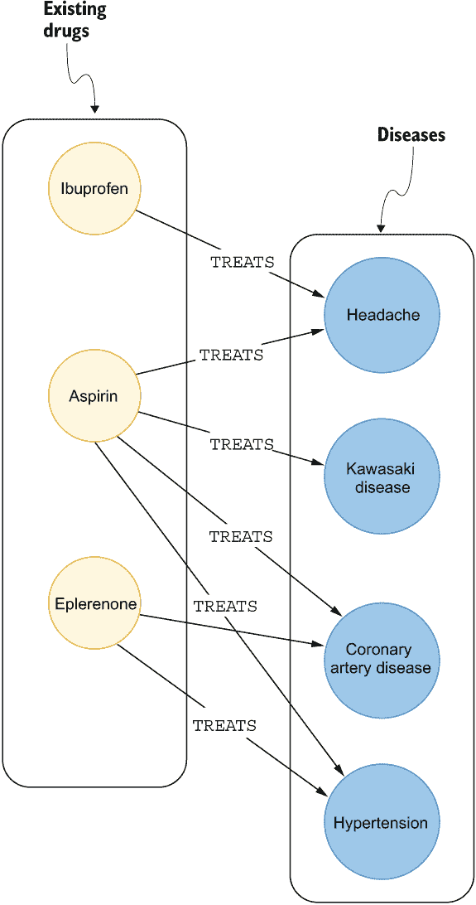

图 11.2 现有药物和已知治疗的二分网络

你可以通过首先确定相似药物来创建药物再利用工作流程。药物的相似性通常基于它们的化学结构和它们治疗的疾病重叠（Luo 等，2016 年）。一旦确定了相似药物，你可以使用这些信息来预测或推荐现有药物的新应用。

图 11.3 中所示的药物再利用工作流程有两个步骤：

1.  识别相似关系

1.  基于药物相似性推荐新药应用

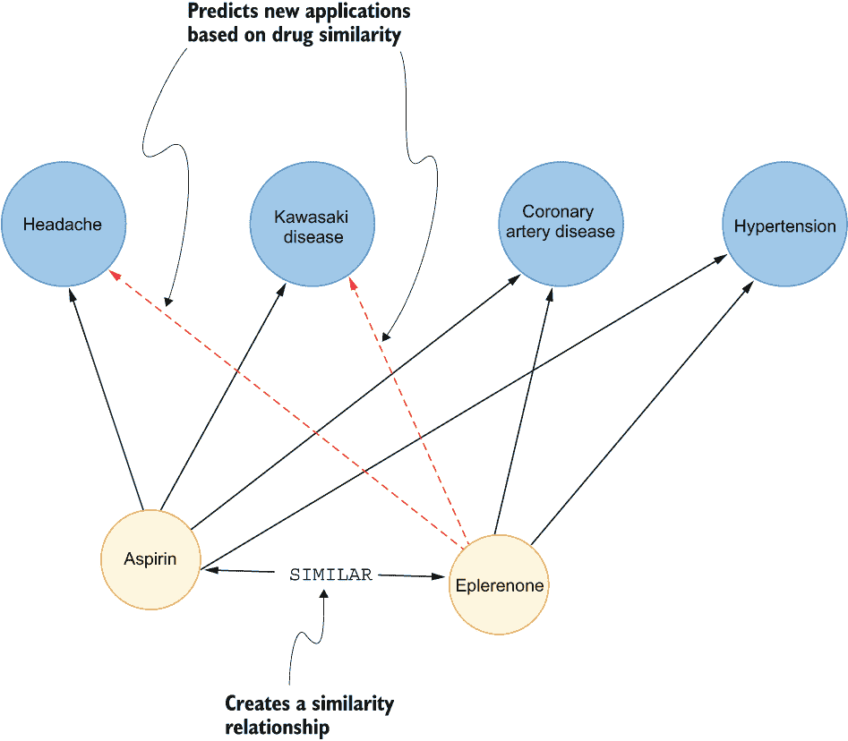

图 11.3 基于药物相似性预测新药应用

第一步是确定相似药物。对于这个练习，一个想法可能是，两种药物治疗的常见疾病越多，它们之间的药物相似性就越高。你可以采取几种方法来推断相似关系。你可以使用第七章中描述的 Jaccard 相似系数来计算药物相似性。另一个想法是使用第九章中介绍的 node2vec 等节点嵌入模型来计算节点嵌入，并使用节点嵌入的余弦相似度来比较药物。最后，你也可以借鉴第十章中描述的一些链接预测特征来计算药物相似性。使用任何提到的方法，你都会在药物对之间创建某种形式的得分相似关系。

在第二步中，你可以根据计算出的相似关系推荐新的药物应用。在图 11.3 的例子中，阿司匹林和依普利酮被标记为相似药物。因此，你可以通过检查阿司匹林等药物治疗的疾病来预测依普利酮的潜在应用。在这个例子中，你可能会预测依普利酮可能被用于治疗川崎病和头痛。

注意：记住，链接预测工作流程仅建议评估新应用的优先级，而领域专家随后决定并可能进行临床试验以确定新的药物应用。

描述的药物再利用工作流程是有效的；然而，采用这种方法，你会忽略很多现有的生物医学知识。关于基因、生物过程、解剖学以及其他生物医学信息的大量数据，你可以将其纳入你的图中，并因此纳入药物再利用分析中。

医学研究人员多年来积累了大量知识。你可以从许多官方医学数据库中借用信息来构建生物医学图。例如，图 11.4 中的图架构包含多种类型的节点，从药物到疾病，再到基因和副作用，以及其他许多内容。此外，还存在多种类型的关系。有时，特定类型的节点之间可能存在多种类型的关系。在图 11.4 中，你可以观察到一种药物可以上调或下调一个基因。


图 11.4 复杂生物医学图的示例架构

复杂生物医学图是异构图的例子，其中存在多种节点和关系类型。在药物再利用工作流程中，你可以使用生物医学图中的所有可用信息来预测新的 `TREATS` 关系。然而，由于图架构更为复杂，它需要与我们所讨论的不同特征工程方法。如果你倾向于执行类似于第十章中描述的手动特征工程工作流程，你需要找到一种方法来编码各种节点和关系类型。例如，第十章中使用的共同邻居数量并不能区分不同的节点和关系类型。一种疾病可以上调或下调一个基因，而你希望以某种方式将它们区分开来。因此，手动特征工程可能会很繁琐且劳动密集，同时需要领域专业知识。虽然节点嵌入算法（如 node2vec 算法）消除了手动特征工程的需求，但它们并未设计用于区分不同的节点和关系类型。幸运的是，你不是第一个遇到这个问题的人。避免手动特征工程同时拥有能够区分不同节点和关系类型的模型的方法是使用 *知识图谱嵌入* 模型。与节点嵌入模型不同，知识图谱嵌入模型在嵌入空间中编码节点以及关系。在嵌入空间中编码关系的额外好处是，嵌入模型可以学习区分不同的关系类型。

## 11.1 知识图谱嵌入模型

正如所述，节点嵌入与知识图谱嵌入模型之间的关键区别在于后者不仅嵌入节点，还嵌入关系。在深入理论之前，你需要熟悉知识图谱嵌入术语。

### 11.1.1 三元组

知识图谱嵌入模型使用 *三元组* 来描述图。一个三元组由两个节点组成，称为 *头节点*（h）和 *尾节点*（t），以及一个带标签的有向关系（r）。

图 11.5 展示了左侧一个样本图的视觉化和右侧相同图的三角表示。一个三角由两个节点组成，一个头节点（h）和一个尾节点（t），以及一个有向标签关系（r）。头节点是关系的源节点或起始节点，而目标节点或结束节点被标记为尾节点。在图 11.5 的例子中，Ana 被认为是头节点，而巴黎是尾节点。知识图嵌入背后的理念是支持异构图并区分不同类型的关系。因此，三角中的关系标签定义了其类型。图 11.5 中的关系标签是`LIVES_IN.`。

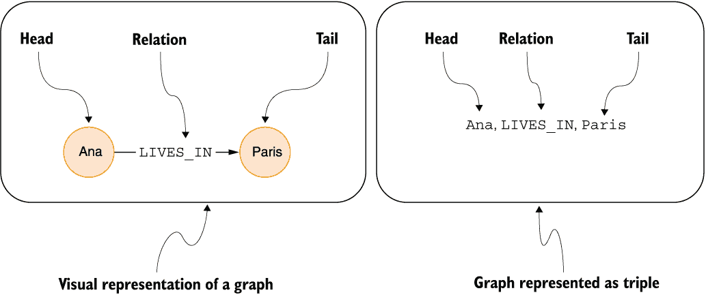

图 11.5 三角表示

练习 11.1

构造两个三角来定义你的位置。第一个三角应包含关于你居住的城市的信息，而第二个三角应将你的城市与其所属的国家连接起来。选择你认为最合适的标签关系。

注意：三角被定义为区分不同关系类型或标签。然而，没有对节点标签的明确定义。因此，知识图嵌入模型没有明确区分不同的节点类型。

### 11.1.2 TransE

*TransE*（Bordes 等人，2013 年）是最早且最直观的知识图嵌入模型之一。TransE 方法的目标是为图中的所有节点和关系计算低维向量表示，也称为*嵌入*。TransE 方法常用于展示知识图嵌入，因为它易于说明且相对容易计算。

图 11.6 展示了在嵌入空间中编码节点和关系的概念。TransE 方法背后的关键思想是在嵌入空间中编码节点和关系，使得头节点的嵌入加上关系的嵌入应该接近尾节点的嵌入。在图 11.6 中，你可以观察到头节点的嵌入加上关系的嵌入恰好等于尾节点的嵌入。

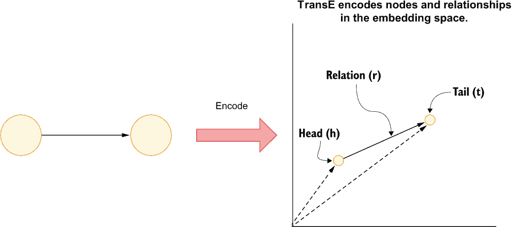

图 11.6 TransE 编码直觉

TransE 方法试图生成嵌入，使得对于训练集中的每个三角，它最小化头节点和关系嵌入与尾节点嵌入之间的距离。这种优化分数可以写成`h` `+` `r` `≈` `t`，如图 11.7 所示。另一方面，如果头节点和尾节点之间不存在关系，那么头节点和关系嵌入的加和不应接近尾节点（`h` `+` `r` `!=` `t`）。你可以在原始文章（Bordes 等人，2013 年）中了解更多关于数学实现的细节。

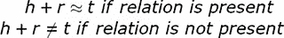

图 11.7 TransE 优化指标

### 11.1.3 TransE 局限性

虽然 TransE 的实现简单直观，但它有一些缺点。你将使用三类关系来评估 TransE 方法。

关系的第一类是 *对称* 关系。三元数据结构不允许无向关系；然而，一类关系可以被视为无向的。在知识图谱嵌入模型领域，无向关系被称为 *对称* 关系。一些对称关系的例子包括

```
Tomaž, SIBLING, Blaž
Blaž, SIBLING, Tomaž
```

如果 Tomaž 是 Blaž 的兄弟姐妹，那么 Blaž 也是 Tomaž 的兄弟姐妹。这个简单的事实无法回避。问题是，TransE 是否可以编码对称关系？

TransE 方法为每种关系类型生成一个向量表示。因此，图 11.8 中的 `SIBLING` 向量表示在两个实例中方向相同。问题是，相同类型的关系的向量表示不能指向相反方向。一个 `SIBLING` 向量从头节点指向尾节点。然而，第二个 `SIBLING` 向量从第二个节点开始，方向与第一个 `SIBLING` 向量相同。因此，第二个 `SIBLING` 向量不能也不能指向第一个节点。因此，从理论上看，TransE 不支持对称关系。

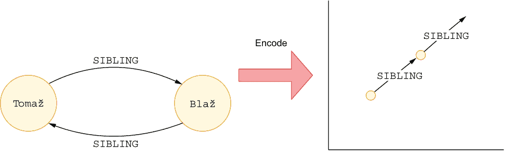

图 11.8 使用 TransE 编码对称关系

你将评估的第二类关系是 *组合* 关系。组合关系的一个例子如下：

```
John, MOTHER, Alicia
Alicia, SPOUSE, Michael
John, FATHER, Michael
```

组合关系可以通过组合两个或多个关系来构建。在图 11.9 的例子中，`FATHER` 关系可以通过添加 `MOTHER` 和 `SPOUSE` 关系来组合。你可以观察到，可以调整关系向量以适应这种图模式。因此，TransE 方法支持组合关系。

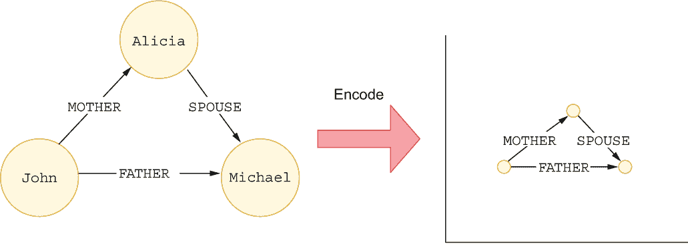

图 11.9 使用 TransE 编码组合关系

最后一类关系是 *1 到 N* 的关系。本质上，这种情况发生在节点与多个其他节点有相同关系时。1 到 N 关系的例子包括

```
Surya, FRIEND, Rajiv
Surya, FRIEND, Jane
```

TransE 能够编码 Surya 与 Jane 和 Rajiv 都是朋友的关系的唯一方式是 Jane 和 Rajiv 的向量表示相等。Jane 和 Rajiv 有相同的向量表示在逻辑上是不合理的，因为它们在图中是不同的实体，因此应该有不同的嵌入。另一个解决方案将是 `FRIEND` 关系向量有不同的方向，如图 11.10 所示。然而，TransE 方法仅实现给定关系类型的单个向量表示。因此，TransE 方法不支持 1 到 N 的关系。

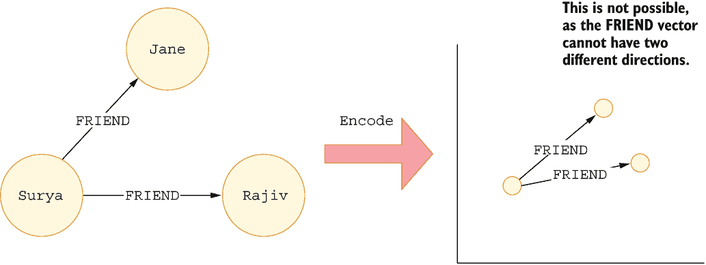

图 11.10 使用 TransE 编码 1 到 N 的关系

## 11.2 知识图谱补全

现在你已经掌握了知识图谱嵌入的理论背景，你可以继续进行预测现有药物新应用的任务。想象一下，你在一家大型制药公司工作，该公司生产阿司匹林。阿司匹林是一种大规模生产的药物，因此，一个新的应用可能会带来大量的收入。这个想法是利用现有的生物医学知识来预测新的应用。你已经确定，最佳的行动方案是应用**知识图谱补全**技术来寻找新的潜在药物应用，也称为**药物再利用**。知识图谱补全可以被视为多类链接预测，其中你预测新的链接及其类型。你将训练一个知识图谱嵌入模型来编码生物医学图中的节点和关系，然后使用这些嵌入来识别阿司匹林的新潜在应用。

药物再利用工作流程如图 11.11 所示。整个流程的基础是一个丰富而复杂的生物医学知识图谱，其中包含现有的药物；它们的疗法；以及其他生物医学实体，如基因和通路。由于你为一家大型公司工作，公司里的其他优秀人士已经绘制并构建了所需的生物医学图。接下来，你需要将生物医学图输入到知识图谱嵌入模型中。由于你不需要执行任何图转换或操作，你可以完全跳过使用图数据库。虽然多个 Python 库都提供了知识图谱嵌入模型，但我更喜欢 *PyKEEN*（Ali 等人，2021），因为它简单易用。此外，PyKEEN 实现了超过 40 种不同的知识图谱嵌入模型，并提供了开箱即用的超参数优化支持。最后，你将使用 PyKEEN 内置的方法来预测阿司匹林的新应用。你需要安装 PyKEEN 和 pandas 库，如列表 11.11 所示，以跟随代码示例。

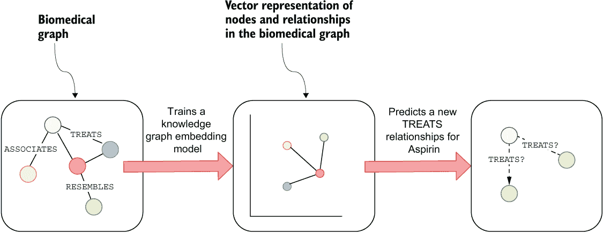

图 11.11 药物再利用工作流程

列表 11.1 安装 PyKEEN

```
pip install pykeen==1.9.0 pandas
```

所有代码都作为 Jupyter 笔记本提供([`mng.bz/zXNQ`](http://mng.bz/zXNQ))。

### 11.2.1 Hetionet

你的同事已经准备了一个 Hetionet 数据集的子集（Himmelstein 等人，2017）供使用。原始 Hetionet 数据集包含 47,031 个节点（11 种类型）和 2,250,197 个关系（24 种类型）。

Hetionet 数据集的图架构在图 11.12 中展示。图中包含各种实体，如基因、通路、化合物和疾病。此外，图中还有 24 种不同类型的关系。解释所有医疗实体及其关系的医学术语可能需要一本书的篇幅。对于药物重新定位工作流程来说，最重要的关系是 `TREATS` 关系，它从 `Compound` 节点开始，以 `Disease` 节点结束。本质上，`TREATS` 关系封装了现有的批准药物治疗方法。你将使用知识图谱补全技术来预测从阿司匹林或乙酰水杨酸节点起源的新 `TREATS` 关系。

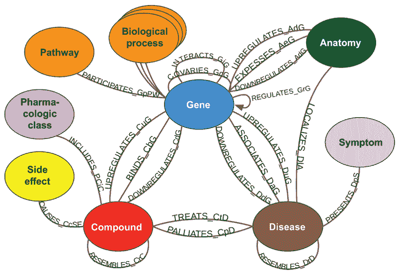

图 11.12 Hetionet 架构（来源：Himmelstein 等人。根据 CC BY 4.0 许可）

在本例中，你将使用 Hetionet 数据集的一个子集。该子集的架构如图 11.13 所示。

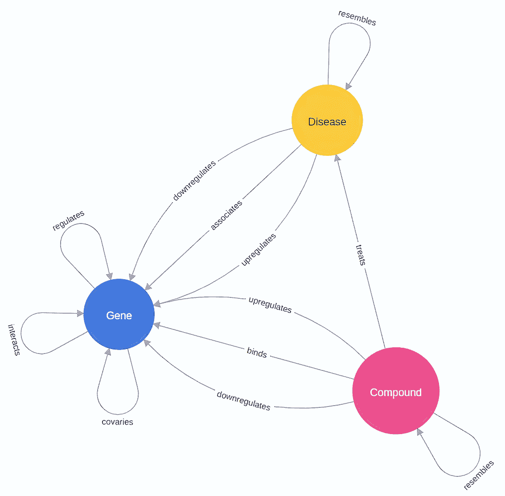

图 11.13 将用于药物重新定位工作流程的 Hetionet 子集的图架构

图 11.13 展示了你在药物重新定位工作流程中将使用的 Hetionet 数据集的一个子集。给定的子集包含 22,634 个节点（3 种类型）和 561,716 条关系（12 种类型）。图中包含了在 `TREATS` 关系下可以找到的现有批准的药物治疗方法，以及一些关于化合物和疾病如何与基因相互作用的附加信息。基因也可以与其他基因相互作用。Hetionet 数据集的子集可在 GitHub 上找到（[` mng.bz/ddww`](http://mng.bz/ddww)），其结构如表 11.1 所示。

表 11.1 Hetionet 关系 CSV 文件的结构

| `source_name` | `source_label` | `target_name` | `target_label` | type |
| --- | --- | --- | --- | --- |
| SERPINF2 | 基因 | KLK13 | 基因 | 相互作用 |
| SERPINF2 | 基因 | SSR1 | 基因 | 相互作用 |
| SERPINF2 | 基因 | TGM2 | 基因 | 相互作用 |
| SERPINF2 | 基因 | UBC | 基因 | 相互作用 |
| SERPINF2 | 基因 | SERPINB12 | 基因 | 相互作用 |

你将使用 pandas 库从 GitHub 加载 CSV 文件，如列表 11.13 所示，首先导入 pandas 库。然后，它使用内置的 `read_csv` 方法从 GitHub 加载 Hetionet 数据集。

列表 11.2 将 Hetionet 子集作为 pandas 数据框加载

```
import pandas as pd

data = pd.read_csv(
    "https://bit.ly/3X2qp1r"
)
```

### 11.2.2 数据集拆分

与所有机器学习工作流程一样，你需要执行测试-训练数据集拆分。你可以将图结构作为三元组列表输入 PyKEEN，如下所示。记住，三元组数据对象由头、标签和尾元素组成。

列表 11.3 向 PyKEEN 输入三元组

```
from pykeen.triples import TriplesFactory

tf = TriplesFactory.from_labeled_triples(
    data[["source_name", "type", "target_name"]].values,
)
```

`TriplesFactory`是 PyKEEN 类，用于存储用于训练和评估模型的三元组。列表 11.3 中的代码使用`from_labeled_triples`方法从 pandas dataframe 输入三元组列表。`data` dataframe 包含有关节点标签的附加信息，您需要过滤掉这些信息。因此，列表 11.3 中的代码指定使用`source_name`、`type`和`target_name`列作为三元组。现在，三元组已加载到 PyKEEN 中，您可以使用以下代码进行数据集分割。

列表 11.4 将数据集分割为训练集、测试集和验证集

```
training, testing, validation = tf.split([0.8, 0.1, 0.1], random_state=0)
```

数据集的分割是通过`split`方法进行的，如列表 11.4 所示。虽然主要目标是预测新的`treats`关系，但包括所有数据分割的数据集包含所有可用的关系，例如`interacts`、`upregulates`等，以便尽可能地为模型提供相关信息。该方法接受一个包含三个值的数组作为参数，该参数定义了训练集、测试集和验证集的比例。第一个值定义了训练集的比例，第二个值表示测试集的比例，最后一个数字指定了验证集的大小。第三个值可以省略，因为它可以从前两个值中计算得出。

### 11.2.3 训练 PairRE 模型

虽然 TransE 模型对于知识图嵌入模型的入门非常出色，但它有其局限性。例如，一种药物可以用来治疗多种疾病。然而，如 TransE 介绍中提到的，TransE 方法无法编码 1-to-N 关系，这使得它不适合生物医学知识图。因此，您将使用一个更晚且更好的模型，称为*PairRE*（Chao et al., 2020）。PairRE 能够编码对称性、组合性和 1-to-N 关系，这使得它非常适合用于生物医学知识图。如果您对数学实现的细节感兴趣，请阅读[`arxiv.org/abs/2011.03798`](https://arxiv.org/abs/2011.03798)上的文章。以下代码基于您提供的 Hetionet 数据集的子集训练 PairRE 模型。

列表 11.5 训练 PairRE 模型

```
from pykeen.pipeline import pipeline

result = pipeline(
    training=training,
    testing=testing,
    validation=validation,
    model="PairRE",          ❶
    stopper="early",         ❷
    epochs=100,
   random_seed=0,            ❸
)
```

❶ 指定 PairRE 模型

❷ 定义停止策略

❸ 设置随机种子以确保可重复性。

PairRE 模型可以通过单个函数进行训练，如列表 11.5 所示。训练、测试和验证集通过单独的参数加载。您可以使用`model`参数选择模型；您可以选择超过 40 种模型。请检查文档（[`mng.bz/rj2y`](http://mng.bz/rj2y)）以获取可用模型的完整列表。`stopper`参数的`early`值默认情况下每 10 个 epoch 评估模型一次。使用带有`early`值的`stopper`选项，如果模型精度在额外的 epoch 中没有提高，训练管道将停止训练。最后，`random_seed`参数用于确保结果的可重复性。完整的可用管道参数列表可在官方文档（[`mng.bz/0K86`](http://mng.bz/0K86)）中找到。

注意：训练可以在 CPU 或 GPU 设备上执行。然而，如果您有可用的 GPU 设备，训练将更快。如果您没有本地 GPU 可用，您始终可以尝试使用免费云环境，例如 Google Colab。

### 11.2.4 药物应用预测

在训练好 PairRE 模型后，您可以预测乙酰水杨酸（即阿司匹林）的新应用。PyKEEN 库提供了一个`predict_target`函数，允许您输入三元组的头和关系，并输出尾节点的预测。在您的示例中，您将`acetylsalicylic` `acid`作为头，将`treats`作为关系元素输入，如下所示。最可能的`tail`节点输出以 pandas 数据框结构给出。

列表 11.6 预测乙酰水杨酸的新用例

```
from pykeen.predict import predict_target

pred = predict_target(
    result.model,
    head="Acetylsalicylic acid",
    relation="treats",
    triples_factory=result.training,
).df
pred_filtered = pred.filter_triples(result.training)
print(pred_filtered.head())
```

表 11.2 显示了预测出的结果用例。

表 11.2 乙酰水杨酸的前五项预测

| `tail_id` | `tail_label` | `score` |
| --- | --- | --- |
| 19,912 | 系统性红斑狼疮 | −9.228726 |
| 19,827 | 乳腺癌 | −9.510363 |
| 19,913 | 系统性硬化症 | −9.543921 |
| 19,887 | 胰腺癌 | −9.711681 |
| 19,919 | 1 型糖尿病 | −9.731101 |

分数值接近零的预测更可能。您的模型预测阿司匹林可能被用于治疗系统性红斑狼疮、系统性硬化症和某些类型的癌症。这些预测可用于推荐特定药物用例的临床试验。临床试验必须精心规划，因为它们耗时很长且成本极高（Schlander 等，2021 年）。因此，尽可能产生准确的建议至关重要，因为临床试验的成本可能超过十亿美元。

练习 11.2

使用`predict_target`函数预测`咖啡因`的潜在新应用。

### 11.2.5 解释预测

预测完成后，您可以在医学文献中搜索支持或反驳的研究。再次强调，在过程中包括领域专家的重要性不容忽视，因为他们对解释结果和相关的医学文献都起着关键作用。例如，如果您搜索阿司匹林和胰腺癌的组合，您可能会找到一些可能验证您预测的文章（Sun 等人，2019 年）。鉴于 Hetionet 文章是在 2017 年发表的，它可能不包含 2019 年的新医学信息。Hetionet 是一个逐渐老化的资源，仅限于不到 200 种疾病。在实践中，制药和其他公司使用各种大规模部署的文本挖掘系统从各种医学研究文章和试验中提取知识，以保持其生物医学图更新至所有最新可用信息（Bachman 等人，2022 年）。

您的预测有支持证据表明，使用知识图嵌入模型进行知识图补全的方法可以产生很好的结果。假设您没有找到支持您预测的文献。在这种情况下，您可以将现有的生物医学连接展示给领域专家，让他们决定这些连接是否有价值。尽管您不需要图数据库进行药物再利用工作流程，但它仍然可以很好地解释预测。幸运的是，您在大型制药公司的同事已经为您解决了这个问题，或者更确切地说，Hetionet 的作者已经通过只读 Neo4j 浏览器界面使其可用。Hetionet 浏览器界面可在 [`neo4j.het.io/browser/`](https://neo4j.het.io/browser/) 找到。

以下 Cypher 查询将可视化乙酰水杨酸与胰腺癌之间距离不超过三个跳的第一条 25 条路径。

列表 11.7 预测乙酰水杨酸的新潜在用途

```
MATCH (c:Compound {name:"Acetylsalicylic acid"}),
      (d:Disease {name:"pancreatic cancer"})
MATCH p=(c)-[* ..3]-(d)
RETURN p LIMIT 25
```

列表 11.7 中的 Cypher 语句生成了图 11.14 中的可视化。在图的左侧，您将看到 `乙酰水杨酸`，而 `前列腺癌` 在右侧。乙酰水杨酸可用于缓解骨关节炎和痛风。有趣的是，骨关节炎与类似前列腺癌的基因相关。无论如何，领域专家可以评估现有连接并形成自己的观点。乙酰水杨酸与胰腺癌之间有 1,716 条不同的路径，长度不超过三个跳。因此，很难在单个图像中可视化所有这些路径，领域专家可以根据节点或关系类型优先考虑连接。

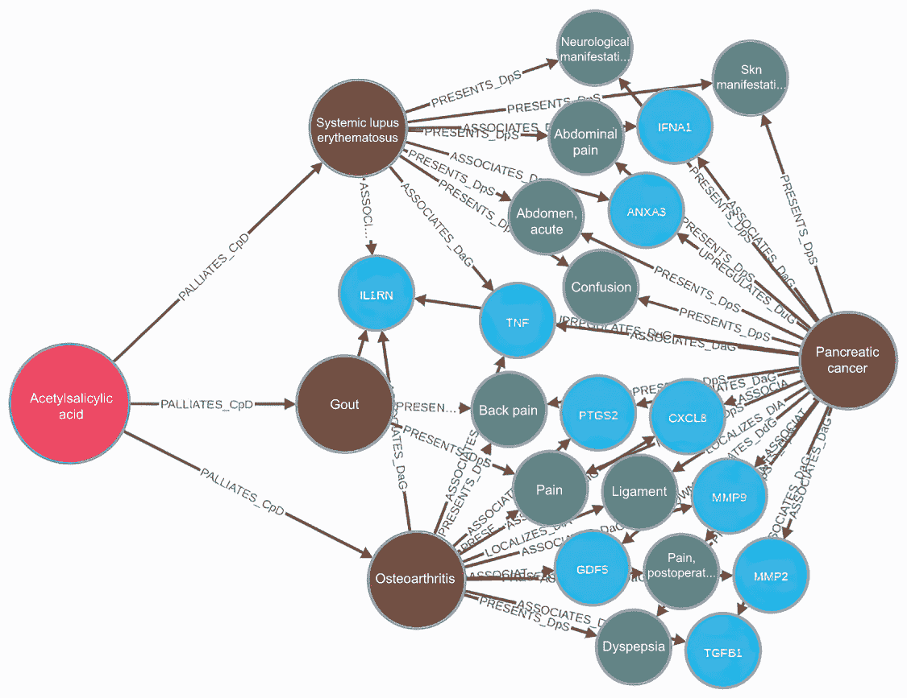

图 11.14 乙酰水杨酸与胰腺癌之间的现有连接

练习 11.3

可视化水杨酸和自闭症之间最多三跳的 25 条路径。使用现有的 Neo4j 版本的 Hetionet 图，该图可通过 Neo4j 浏览器在[`neo4j.het.io/browser/`](https://neo4j.het.io/browser/)访问。

## 11.3 练习的解决方案

练习 11.1 的一个可能解决方案如下。

```
Tomaz, LIVES_IN, Ljubljana
Ljubljana, PART_OF, Slovenia
```

练习 11.2 的解决方案如下。

列表 11.8 预测咖啡因的新用途

```
pred_df = get_prediction_df(
    result.model,
    head_label="Caffeine",
    relation_label="treats",
    remove_known=True,
    triples_factory=result.training,
)
pred_df.head()
```

练习 11.3 的解决方案如下。

列表 11.9 可视化水杨酸和自闭症之间最多三跳的 25 条路径

```
MATCH (c:Compound {name:"Acetylsalicylic acid"}),
      (d:Disease {name:"autistic disorder"})
MATCH p=(c)-[* ..3]-(d)
RETURN p LIMIT 25
```

## 摘要

+   异构图或多部分图由多种节点和关系类型组成。两个实体类型之间也可能存在多种关系类型。

+   三元数据对象用于表示存在多种关系类型的有向图。

+   三元数据对象由头元素、关系元素和尾元素组成。

+   知识图谱嵌入模型在嵌入空间中编码节点和关系，这与仅编码节点的节点嵌入模型不同。

+   知识图谱嵌入模型试图以这种方式计算嵌入，即对于每个现有的三元组，头节点和关系嵌入的总和接近尾节点的嵌入。

+   如果知识图谱嵌入模型能够编码对称性、逆关系、复合关系和 1 对 N 关系，则从理论角度评估知识图谱嵌入模型。

+   PairRE 模型可以编码所有四种关系类别（对称性、逆关系、复合关系和 1 对 N 关系）。

+   可以将知识图谱补全视为一个多类链接预测问题，其中你正在预测新的链接及其类型。

+   在药物再利用的工作流程中，预测必须由领域专家评估，然后通过临床试验才能获得批准。知识图谱补全仅用于优先考虑最有可能的候选者。
