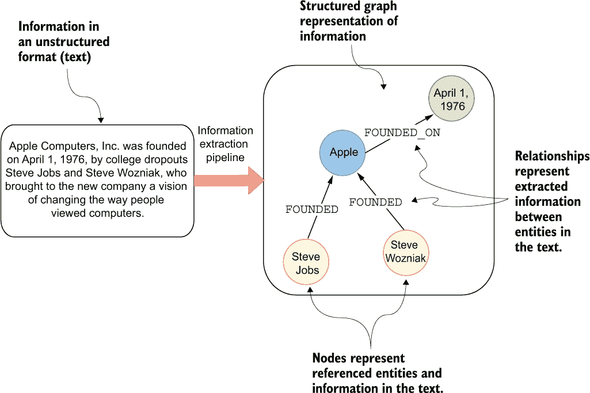
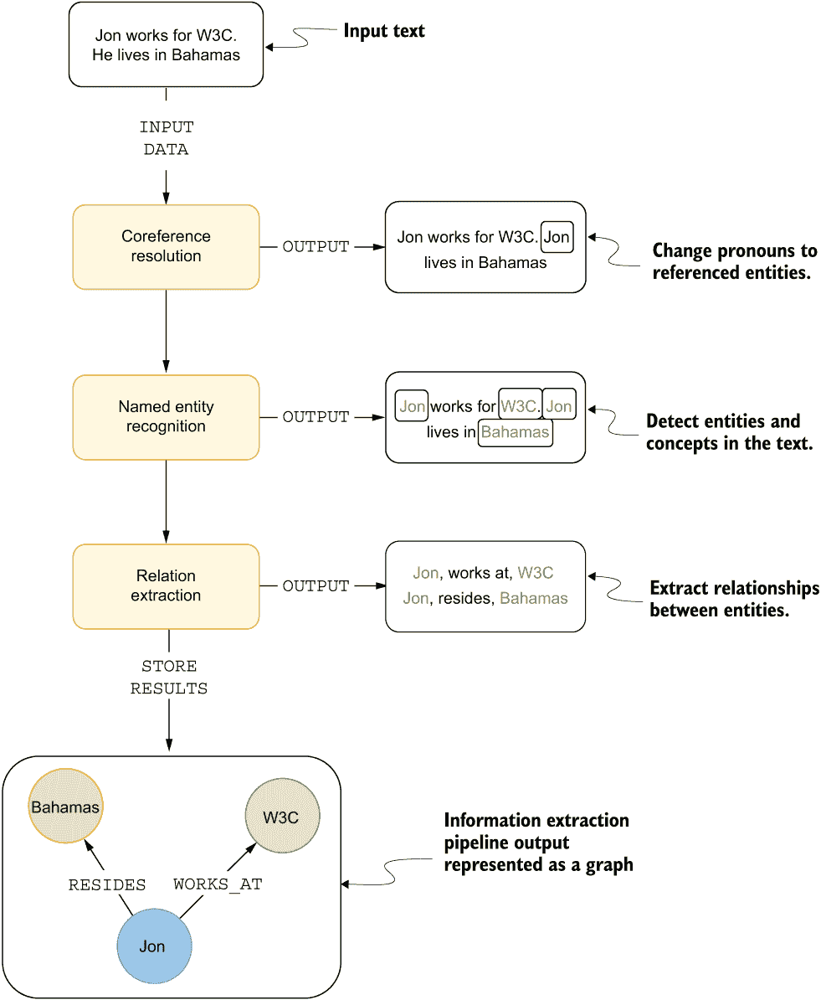
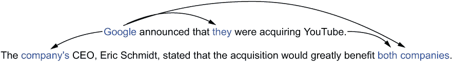
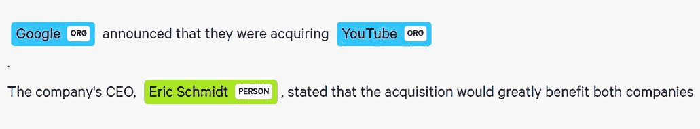
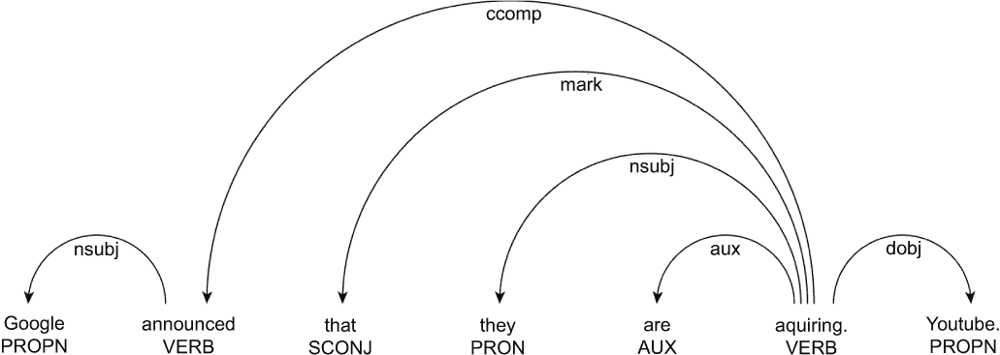
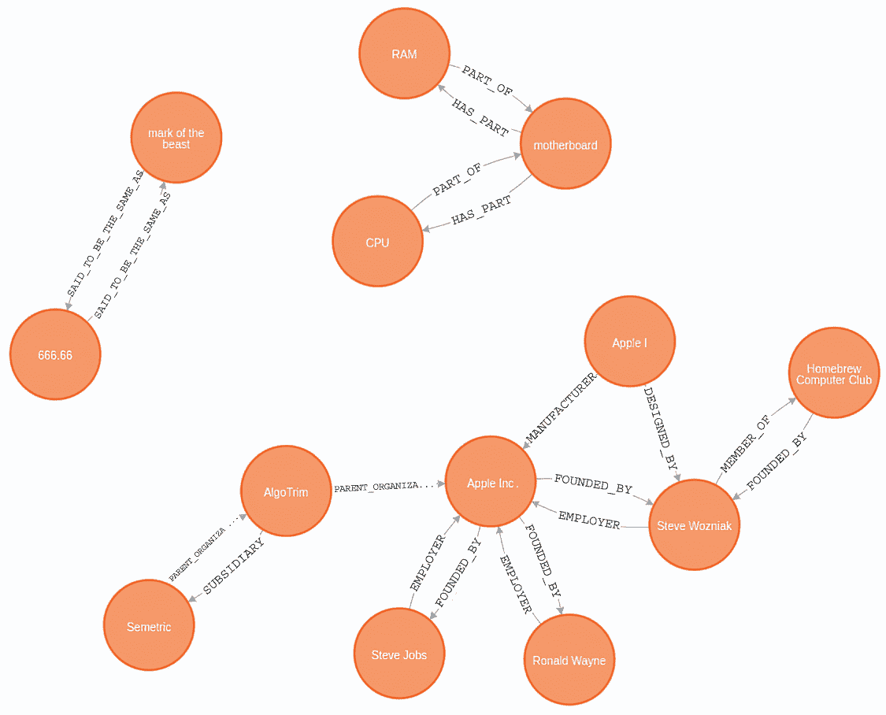

# 12 使用自然语言处理技术构建图

本章涵盖

+   信息提取管道

+   共指消解

+   命名实体识别和链接

+   关系提取

+   开发一个信息提取管道

互联网上可用的基于文本的信息量令人震惊。很难想象每天发布的社交媒体帖子、博客和新闻文章的数量。然而，尽管信息丰富，其中很大一部分仍然是未结构化的，难以从中提取有价值的见解。这就是自然语言处理（NLP）发挥作用的地方。NLP 是一个快速发展的领域，近年来受到了越来越多的关注，特别是在变压器模型（Vaswani，2017）以及最近引入的 GPT-3（Brown 等人，2020）和 GPT-4 模型（OpenAI，2023）之后。NLP 的一个特别重要的领域是信息提取领域，该领域专注于从非结构化文本中提取结构化信息。

在图 12.1 中提供的示例中，文本描述了公司的创立，并包含诸如公司名称、创始人姓名和创立日期等信息。信息提取过程将涉及从文本中识别和提取这些信息。信息提取管道的输出将是一组三元组。每个三元组代表一条信息，由头、关系和尾对象组成。三元组对象定义与上一章相同，其中你实现了知识图谱补全管道。在图 12.1 的示例中，提取的信息可能用以下三元组表示：

+   `史蒂夫·乔布斯`，`创立了`，`苹果`

+   `史蒂夫·沃兹尼亚克`，`创立了`，`苹果`

+   `苹果`，`成立于`，`1976 年 4 月 1 日`



图 12.1 从文本中提取结构化信息并用于构建图

基于给定的三元组创建一个图是一个简单的过程。每个三元组都可以用来构建一个图，其中三元组的头是起始节点，关系代表关系类型，尾是结束节点。对于一些特殊情况，你可能希望将三元组作为节点属性存储在标记属性图模型中。例如，你可以将苹果的创立日期作为节点属性存储。通过连接这些节点和关系，你可以创建一个表示提取信息的图。这个图可以用于各种目的，例如数据分析、知识表示和信息检索。

假设你正在一家风险投资公司担任数据科学家。风险投资公司需要了解该领域的最新发展。鉴于每天产生的新闻量巨大，且涉及多种语言，手动阅读每一篇文章几乎是不可能的；因此，你被分配去开发一个系统，该系统能够自动阅读新闻并提取有关新成立公司、合并和收购的信息。在这种情况下，你提出了开发一个信息提取管道来实现这一目标的想法。这个管道将从文本中提取相关数据并将其存储为图。

这种方法将使你能够轻松地识别新成立、合并或被收购的公司的模式。此外，你将能够轻松地获取这些事件的相关背景信息。例如，你可以检索谁创立了这些公司，它们是在何时创立的，创始人是否知名，等等。处理足够的数据后，这种方法还将允许探索图中各种实体的历史或发展进程。因此，当图中出现特定类型的新关系时，你可以创建一个通知系统。此外，该图还将允许你探索参与各种企业事件的实体的背景和历史。这将使风险投资公司能够了解该领域的最新发展，并做出明智的投资决策。你提出了图 12.2 所示的信息提取管道的设计。



图 12.2 信息提取管道设计

图 12.2 中提出的拟议信息提取管道是一个多步骤过程，用于从非结构化文本中提取结构化信息。该管道由几个自然语言处理（NLP）技术组成，例如*核心 ference 解析*、*命名实体识别*（NER）和*关系提取*（RE）：

+   核心 ference 解析模型识别所有指向同一实体的引用。在实践中，核心 ference 解析通常表示为将代词替换为引用实体的任务，尽管这可能比这更复杂。例如，在文本*He lives in Bahamas*中，代词*He*将被替换为引用实体*Jon*。

+   接下来，该管道使用命名实体识别（NER）模型在文本中识别实体和概念。在图 12.2 中，该模型识别了`Jon`、`W3C`和`Bahamas`作为实体。NER 模型还可以训练以检测实体类型，如`Person`（人物）、`Organization`（组织）和`Location`（地点）。

+   管道中的最后一个 NLP 技术是关系提取。它用于提取识别出的实体之间的各种连接。在这个例子中，该管道将提取以下两个三元组：

    +   `Jon`, `WORKS_AT`, `W3C`

    +   `Jon`, `RESIDES`, `Bahamas`

+   使用图数据库存储 NLP 过程中提取的实体之间的关系，可以轻松地存储、查询和可视化信息。此外，使用图数据库允许进行更复杂的查询，例如找到实体之间的模式和联系，这在使用传统数据库结构时可能很难执行。由于你有一些图机器学习的经验，你也可以在节点分类或链接预测工作流程中使用该图。

## 12.1 核实指代

管道中的第一步是一个核实指代模型。*核实指代*是指识别文本中所有指向同一实体的表达式的任务。

在图 12.3 中的示例的第一句话中，*Google* 和 *they* 指向同一实体。第二句话以对 *公司* 的引用开始。有趣的是，*公司* 的引用有点含糊不清，因为没有其他信息时，它可能指的是 *Google* 或 *YouTube*。这是核实指代模型必须解决的更具挑战性的问题的一个例子。然而，如果你知道 Eric Schmidt 是 Google 的首席执行官，那么将 *公司* 的引用解析为 Google 就会相对容易。有时，你处理的是复数代词或引用，例如在 *两家公司* 的情况下。因此，核实指代模型的理想输出将是同时指向 *Google* 和 *YouTube* 的引用。



图 12.3 核实指代

核实指代可以采用两种主要方法：

+   基于规则

+   神经网络

基于规则的核实指代（Haghighi & Klein, 2009; Raghunathan et al., 2010）涉及使用一组预定义的规则和启发式方法来识别和链接文本中的核实指代表达式。这些规则可以基于句法、语义和上下文信息，例如表达式的性别或数的一致性，文本中表达式的距离，或某些关键词的存在。然而，当应用于实际应用时，基于规则的系统存在一些局限性，因为几乎不可能为每种可能的变体定义规则。另一方面，神经核实指代（Clark & Manning, 2016; Lee et al., 2017）涉及训练一个神经网络来识别和链接文本中的核实指代表达式。神经网络通过识别数据中的模式和关系来学习识别核实指代表达式，而不是依赖于预定义的规则。

核实指代是大多数自然语言处理（NLP）管道的一个关键组件。它被用作各种 NLP 工作流程的预处理步骤，从信息提取到文本摘要和问答任务（Singh, 2018）。

## 12.2 命名实体识别

命名实体识别（NER）是一项任务，涉及将文本中的命名实体识别和分类到预定义的类别中。命名实体和类别在很大程度上取决于你正在处理的领域。例如，在一家风险投资公司，你可能想在文本中识别人、组织和地点。然而，如果你在一家生物医学公司，重点将更多地放在基因、蛋白质、疾病、药物等上。在大多数情况下，NER 模型都是针对特定领域进行微调的。在提出的信息提取管道中，你希望识别人、组织、地点和日期。

在图 12.4 的示例中，NER 模型将实体 `Google` 和 `YouTube` 识别为组织，将 `Eric Schmidt` 识别为个人。提取的命名实体使用 displaCy 进行可视化（[`spacy.io/universe/project/displacy`](https://spacy.io/universe/project/displacy)）。



图 12.4 命名实体识别

### 12.2.1 实体链接

通常，区分文本中提到的实体可能具有挑战性。例如，只有一个名为 *Google* 的组织，但可能有多个名为 *Eric Schmidt* 的人。为了解决区分命名实体的问题，已经引入了如实体链接等技术。**实体链接**是将命名实体与其在知识库中的对应 ID 相连接的任务。目标知识库取决于用例领域。例如，实体链接在生物医学领域很受欢迎，它用于将文本中识别的基因、药物和其他实体连接到各种生物医学知识库。另一方面，为了区分人和组织的一般目的，像 *Wikipedia* 或 *DBpedia* 这样的知识库最常被使用。

图 12.5 展示了将实体链接到 Wikipedia 的一个示例。正如你所见，Wikipedia 网址被用作实体的唯一标识符。有趣的是，即使在 Wikipedia 上，也有多个关于 Eric Schmidt 的条目（[`en.wikipedia.org/wiki/Eric_Schmidt_(disambiguation)`](https://en.wikipedia.org/wiki/Eric_Schmidt_(disambiguation))）。当存在具有相同名称的多个条目时，选择正确的实体是一个具有挑战性的任务。实体的缩写和别名是在执行实体链接时面临的其他挑战之一。


图 12.5 命名实体链接

最近提出的许多实体链接模型都是基于深度学习方法。一些模型被称为所谓的**端到端实体链接模型**，它们在单一步骤中执行命名实体识别和链接（Brank 等人，2017 年）。其他模型仅执行实体链接，并需要提供与文本一起识别的命名实体（Barba 等人，2022 年）。

## 12.3 关系抽取

如其名所示，*关系提取模型*从文本中提取实体之间的关系。为风险投资公司提出的信息提取管道应专注于提取公司和人员之间的关系。关系提取模型最频繁的输出是一个三元组列表。你已经在上一章中使用了三元组。如其名所示，三元组包含三个元素，指定起始节点、结束节点和关系类型。

从文本中提取关系有几种方法。你可以采用基于规则的方法，通过使用一组预定义的启发式规则来提取关系。提取关系的基于规则的一个例子是定义基于词性标注和依存句法分析的规则。

图 12.6 可视化了词性标注和依存句法分析的结果。例如，你可以观察到每个单词都是根据其在英语中的功能进行标注的。这些标签表示该词是名词、形容词、动词等。另一方面，依存句法分析计算单词之间的依存关系。例如，“acquiring”是一个动词。该动词指的是宾语“YouTube”，而主语指向“they”。在这种情况下，“they”指的是“Google”。因此，可以定义一个简单的规则，该规则仅取动词的主语和宾语，并基于此构建三元组。然而，在实践中，规则可以变得更加复杂。我发现基于规则的方法在生物医学（Rindflesch & Fiszman, 2003; Rindflesch et al., 2011）等领域被使用。



图 12.6 词性标注和依存标注

你还可以采取另一种方法，即基于训练数据训练一个深度学习模型来识别和提取关系。基于神经网络方法提取关系的研究有很多，因为它具有出色的提取关系和实现卓越性能的能力。有模型被训练来检测单个句子中的关系（Zhou et al., 2016; Han et al., 2019），以及文档级关系提取（Yao et al., 2019）。最终，你希望得到的模型能够从图 12.5 的示例中提取以下关系。

列表 12.1 从图 12.5 的示例中提取的三元组

```
Google, ACQUIRED, YouTube
Eric Schmidt, CEO, Google
```

## 12.4 信息提取管道的实现

现在你已经对信息提取工作流程有了理论上的了解，你将开发一个管道来识别组织和人员以及他们之间的相关关系。你将使用现有的 NLP 模型进行初始管道实现，因此你不需要担心训练任何定制的 NLP 模型。该管道将使用以下文本进行评估。

列表 12.2 用于评估信息提取管道的文本

```
Apple Inc was founded on April 1, 1976, by Steve Jobs, Steve Wozniak, and Ronald Wayne as a partnership. They started the company in California. The company's first product was the Apple I, a computer designed and hand-built entirely by Wozniak. To finance the company's creation, Jobs sold his Volkswagen Bus, and Wozniak sold his HP-65 calculator. Wozniak debuted the first prototype Apple I at the Homebrew Computer Club in July 1976\. The Apple I was sold as a motherboard with CPU, RAM, and basic textual-video chips—a base kit concept which would not yet be marketed as a complete personal computer. It went on sale soon after debut for US$666.66 (equivalent to $3,175 in 2021). Wozniak later said he was unaware of the coincidental mark of the beast in the number 666, and that he came up with the price because he liked "repeating digits". Later in 2013 Apple acquired AlgoTrim. Then in 2015 the company also bought Semetric, which is in music analytics category.
```

列表 12.2 中的文本是从维基百科 ([`en.wikipedia.org/wiki/Apple_Inc.`](https://en.wikipedia.org/wiki/Apple_Inc.)) 复制的，并包含有关苹果公司、其创始人及其首款产品的信息。我在结尾添加了两句话，提到了各种收购，以便您可以评估模型在处理公司收购信息方面的表现。此文本将用于评估核心词解析模型以及关系提取过程。所提出的信息提取管道的实现可在 GitHub 上的 Jupyter notebook 中找到 ([`mng.bz/KeJ0`](http://mng.bz/KeJ0))。

### 12.4.1 SpaCy

您将使用 SpaCy 来开发信息提取管道。SpaCy 是一个免费的开源 Python 库，用于 NLP 工作流程。SpaCy 的优点是它提供了一个面向初学者的界面，可以执行各种 NLP 任务，并且也可以在生产环境中使用。

以下 Python 代码安装所需的 Python 库。

列表 12.3 安装所需的 Python 库

```
pip install spacy==3.4.4 coreferee==1.3.1 transformers==4.25.1
```

列表 12.3 中的代码安装了 SpaCy 以及 `coreferee` 和 `transformers` 库。`coreferee` 库 ([`github.com/explosion/coreferee`](https://github.com/explosion/coreferee)) 是一个 SpaCy 插件，它提供了一个核心词解析模型。列表 12.3 中的代码安装了 `transformers` 库，该库将用于关系提取。接下来，您需要使用以下 Python 代码安装预训练模型 `en_core_web_lg` 和 `coreferee`。

列表 12.4 下载 NLP 模型

```
python -m spacy download en_core_web_lg
python -m coreferee install en
```

### 12.4.2 核心词解析

如前所述，您将使用 `coreferee` 插件来执行核心词解析。您可以使用以下代码在 SpaCy 中加载核心词解析模型。

列表 12.5 加载核心词解析模型

```
import spacy, coreferee

coref_nlp = spacy.load('en_core_web_lg')
coref_nlp.add_pipe('coreferee')
```

`coreferee` 模型不提供直接解析核心词文本的方法。因此，您需要定义一个函数，使用核心词解析方法来识别引用，然后在文本中将引用替换为被引用实体。

列表 12.6 使用核心词解析模型解析文本引用

```
def coref_text(text):
    coref_doc = coref_nlp(text)
    resolved_text = ""

    for token in coref_doc:
        repres = coref_doc._.coref_chains.resolve(token)
        if repres:
            resolved_text += " " + " and ".join(
                [
                    t.text
                    if t.ent_type_ == ""
                    else [e.text for e in coref_doc.ents if t in e][0]
                    for t in repres
                ]
            )
        else:
            resolved_text += " " + token.text

    return resolved_text

ctext = coref_text(text)
print(ctext)
```

列表 12.6 中的 `coref_text` 函数解析实体核心词并在文本中相应地替换它们。不深入细节，代码检查解析的标记 `repres` 是否是命名实体的部分，如果是，则用命名实体的文本替换引用，而不仅仅是标记的文本。

列表 12.6 中的代码生成了以下输出。

列表 12.7 核心词解析文本

```
Apple Inc was founded on April 1 , 1976 , by Steve Jobs , Steve Wozniak , and Ronald Wayne as a partnership .Steve Jobs and Steve Wozniak and Ronald Wayne started the Apple Inc in California . The Apple Inc 's first product was the Apple I , a computer designed and hand - built entirely by Steve Wozniak . To finance the Apple Inc 's creation , Jobs sold Ronald Wayne Volkswagen Bus , and Steve Wozniak sold Ronald Wayne HP-65 calculator . Steve Wozniak debuted the first prototype Apple I at the Homebrew Computer Club in July 1976 . The Apple I was sold as a motherboard with CPU , RAM , and basic textual - video chips—a base kit concept which would not yet be marketed as a complete personal computer . Apple went on sale soon after debut for US$ 666.66 ( equivalent to $ 3,175 in 2021 ) . Wozniak later said Wozniak was unaware of the coincidental mark of the beast in the number 666 , and that Wozniak came up with the price because Wozniak liked " repeating digits " . Later in 2013 Apple Inc acquired AlgoTrim . Then in 2015 the AlgoTrim also bought Semetric , which is in music  analytics category .
```

从列表 12.7 的输出初看，核心指代模型做得相当不错。例如，你可能注意到第二行中的 *They* 被替换成了 *Steve Jobs, Steve Wozniak 和 Ronald Wayne*，而 *company* 被替换成了 *Apple Inc*。然而，该模型并不完美。在第四行，模型将两个 *his* 的实例都替换成了 *Ronald Wayne*。结果显然是错误的，因为 Jobs 卖掉了他的大众巴士，而不是 Ronald Wayne 的。此外，你可能会注意到，解析后的文本并没有考虑正确的所有格名词和冠词，因为根据核心指代模型输出生成语法正确的文本本身就是一个大问题。同样，列表 12.7 的最后一行关于哪家公司购买了 Semetric 的描述有些含糊不清。模型可以在 Apple Inc. 和 AlgoTrim 之间选择。虽然你可能知道 Apple Inc. 收购了 Semetric，但核心指代模型选择了 AlgoTrim。

### 12.4.3 端到端关系抽取

你将在管道中的关系抽取步骤中使用 REBEL 模型（Huguet Cabot & Navigli, 2021）。REBEL 模型是一个端到端的关系抽取模型，这意味着它在一个模型中同时检测实体和关系。该模型在各种数据集上表现出最先进的性能，如其在 GitHub 仓库中所示（[`github.com/Babelscape/rebel`](https://github.com/Babelscape/rebel)）。

注意：大型语言模型，如 OpenAI 的 GPT-4（2023），在自然语言处理领域带来了颠覆性的进步。它们理解类似人类文本的能力为信息提取领域提供了显著的机会。通过在多样化的互联网文本上训练的模型，它们可以筛选大量数据，理解上下文，并提取相关细节，使信息提取管道更加易于访问。它们的泛化能力使它们能够应用于各种领域，从学术研究到商业分析，从非结构化数据中提取有价值的见解（Li et al., 2023; Wei et al., 2023）。

该模型可以直接使用 `transformers` 库或作为 SpaCy 组件使用。你将使用 SpaCy 变体。与可以使用 pip 安装的 `coreferee` 模型不同，你必须从仓库中复制 SpaCy 组件定义（[`mng.bz/VR8G`](http://mng.bz/VR8G)）。SpaCy 组件定义太长，无法包含在本书中；然而，你可以复制代码而不做任何更改。SpaCy 组件定义也包含在配套的 Jupyter 笔记本中。

接下来，你使用以下代码在 SpaCy 中加载 REBEL 模型。

列表 12.8 加载 REBEL 模型

```
nlp = spacy.load("en_core_web_lg")

nlp.add_pipe(
    "rebel",
    after="senter",
    config={
        "device": -1,  # Number of the GPU, -1 if want to use CPU
        "model_name": "Babelscape/rebel-large",
    },
)
```

一旦模型加载完成，提取关系的代码就非常简单了。

列表 12.9 从文本中提取关系

```
doc = nlp(ctext)
for value, rel_dict in doc._.rel.items():
    print(rel_dict)
```

列表 12.9 中的 Python 代码处理`ctext`，REBEL 组件的结果可以通过`doc._.rel.items()`方法检索。列表 12.9 中的代码产生以下输出。

列表 12.10 关系提取步骤的结果

```
{'relation': 'founded by', 'head_span': Apple Inc, 'tail_span': Steve Jobs}
{'relation': 'founded by', 'head_span': Apple Inc,
➥ 'tail_span': Steve Wozniak}
{'relation': 'founded by', 'head_span': Apple Inc,
➥ 'tail_span': Ronald Wayne}
{'relation': 'employer', 'head_span': Steve Jobs, 'tail_span': Apple Inc}
{'relation': 'employer', 'head_span': Steve Wozniak, 'tail_span': Apple Inc}
{'relation': 'employer', 'head_span': Ronald Wayne, 'tail_span': Apple Inc}
{'relation': 'manufacturer', 'head_span': Apple Inc, 'tail_span': Apple Inc}
{'relation': 'member of', 'head_span': Steve Wozniak,
➥ 'tail_span': Homebrew Computer Club}
{'relation': 'founded by', 'head_span': Homebrew Computer Club,
➥ 'tail_span': Steve Wozniak}
{'relation': 'has part', 'head_span': motherboard, 'tail_span': CPU}
{'relation': 'has part', 'head_span': motherboard, 'tail_span': RAM}
{'relation': 'part of', 'head_span': CPU, 'tail_span': motherboard}
{'relation': 'part of', 'head_span': RAM, 'tail_span': motherboard}
{'relation': 'said to be the same as', 'head_span': mark of the beast,
➥ 'tail_span': 666.66}
{'relation': 'said to be the same as', 'head_span': 666.66
➥, 'tail_span': mark of the beast}
{'relation': 'parent organization', 'head_span': AlgoTrim,
➥ 'tail_span': Apple Inc}
{'relation': 'subsidiary', 'head_span': AlgoTrim, 'tail_span': Semetric}
{'relation': 'parent organization', 'head_span': Semetric,
➥ 'tail_span': AlgoTrim}
```

列表 12.10 中提取的关系看起来令人满意。REBEL 模型确定苹果公司是由史蒂夫·乔布斯、史蒂夫·沃兹尼亚克和罗纳德·韦恩共同创立的。反过来，它解析出他们也是苹果公司的雇员。不幸的是，该模型可以*产生幻觉*一些结果。幻觉是指无法在文本中找到的结果。例如，该模型确定史蒂夫·沃兹尼亚克创立了 Homebrew 计算机俱乐部。虽然这个事实是真实的，但无法通过文本进行验证；因此，该模型产生了这个事实的幻觉。收购被识别为`parent` `organization`和`subsidiary`关系。该模型从文本中提取了这两种关系。最后一个关系是不正确的；这不是 REBEL 模型的问题，而是核心词消歧步骤的问题。

练习 12.1

使用列表 12.10 中提取的关系在 Neo4j 中构建一个图。由于您没有关于节点类型的信息，您可以使用通用的`Entity`标签为所有节点。

图 12.7 展示了信息提取管道输出的可视化表示。实体用节点表示，而关系用关系表示。



图 12.7 信息提取管道结果

练习 12.2

搜索关于商业基础或收购的新闻文章，然后通过实现的信息提取管道进行处理。您可以尝试包括或排除核心词消歧步骤，并评估它对输出的影响。

### 12.4.4 实体链接

我们信息提取过程的最后一步是将实体与其对应的 WikiData ID 进行链接。作为维基百科生态系统的一部分，WikiData 充当所有维基百科项目结构化数据的存储库。为了更好地了解可用的数据，您可以访问专门介绍史蒂夫·乔布斯（[`www.wikidata.org/wiki/Q19837`](https://www.wikidata.org/wiki/Q19837)）的 WikiData 页面。史蒂夫·乔布斯的 WikiData ID 位于 URL 末尾，为 Q19837。对于初始版本，将不会有任何高级实体消歧。您将直接使用 WikiData API 搜索实体，并从列表中选择第一个结果。稍后，您可以实现更高级的实体链接，包括使用句子上下文进行实体消歧（Barba 等，2022 年）。

列表 12.11 中的代码在 WikiData 上搜索给定的实体，并返回列表中第一个实体的 URL 和描述。

列表 12.11 定义一个在 WikiData 上搜索实体的函数

```
import requests

def retrieve_wiki_id(item):
  try:
    url = "https://www.wikidata.org/w/api.php?action=wbsearchentities"
    params = f"&search={item}&language=en&format=json"
    data = requests.get(url + params).json()
    return {
      "id": data["search"][0]["url"],
      "description": data["search"][0]["display"]["description"]["value"],
    }
  except Exception as e:
    return None
```

你现在可以使用列表 12.11 中定义的函数将信息提取管道中的实体与 WikiData ID 进行匹配。

列表 12.12 基本的实体链接工作流程

```
entities = set()
for value, rel_dict in doc._.rel.items():
    entities.update([rel_dict["head_span"], rel_dict["tail_span"]])

for entity in entities:
    wiki_data = retrieve_wiki_id(entity)
    print(entity, wiki_data)
```

列表 12.12 中的代码输出了以下结果。

列表 12.13 实体链接结果

```
CPU {'id': '//www.wikidata.org/wiki/Q5300', 'description': 'electronic
➥ circuitry within a computer that carries out the instructions of a
➥ computer program by performing the basic arithmetic, logical, control
➥ and input/output (I/O) operations specified by the instructions and
➥ coordinates the other components'}
motherboard {'id': '//www.wikidata.org/wiki/Q4321', 'description': 'main
➥ printed circuit board (PCB) for a computing device'}
Steve Jobs {'id': '//www.wikidata.org/wiki/Q19837', 'description':
➥ 'American entrepreneur; co-founder of Apple Inc. (1955-2011)'}
Steve Wozniak {'id': '//www.wikidata.org/wiki/Q483382', 'description':
➥ 'American computer pioneer, inventor, computer engineer and
➥ programmer; co-founder of Apple Inc.'}
AlgoTrim None
Ronald Wayne {'id': '//www.wikidata.org/wiki/Q332591', 'description':
➥ 'co-founder of Apple Inc.'}
Apple I {'id': '//www.wikidata.org/wiki/Q18981', 'description': 'computer
➥ built by the Apple Computer Company'}
Semetric None
mark of the beast {'id': '//www.wikidata.org/wiki/Q6770514', 'description':
➥ 'album by Manilla Road'}
666.66 {'id': '//www.wikidata.org/wiki/Q2778183', 'description': 'album
➥ by Noir Désir'}
RAM {'id': '//www.wikidata.org/wiki/Q5295', 'description': 'form of
➥ computer data storage'}
Apple Inc {'id': '//www.wikidata.org/wiki/Q312', 'description': 'American
➥ multinational technology company'}
Homebrew Computer Club {'id': '//www.wikidata.org/wiki/Q1195191',
➥ 'description': "computer hobbyist users' group in California"}
```

总体而言，列表 12.13 中的实体链接结果令人满意。幸运的是，没有出现歧义性的实体引用，例如，没有提到两个同名的人，你需要确定指的是哪一个。例如，想象一下文本中提到了埃里克·施密特。你需要确定这是美国商人埃里克·施密特还是为 2001 年北达科他州战斗雄狮队效力的美国足球运动员埃里克·施密特。此外，需要注意的是，并非所有实体都能链接到 WikiData。例如，AlgoTrim 和 Semetric 在 WikiData 知识库中没有条目。有趣的是，`兽的印记`和`666.66`都链接到了代表专辑的实体。`兽的印记`和`666.66`的链接结果是完全忽略文本上下文的结果。信息提取的过程可能极其有价值，但也同样具有挑战性，需要精确的技术来实现可靠的结果。

### 12.4.5 外部数据丰富

虽然实施的 WikiData 链接方法在实体消歧方面提供的帮助有限，但它为外部数据丰富提供了选择。WikiData 提供了大量的信息。例如，WikiData 提供了关于苹果公司（Apple Inc.）的各种数据，从董事会成员到子公司等更多内容（[`www.wikidata.org/wiki/Q312`](https://www.wikidata.org/wiki/Q312)）。由于 REBEL 模型不提供实体类型，你可以使用 WikiData 来获取链接的实体类型。然而，从 WikiData 检索信息超出了本书的范围，因为它需要一些基本的 SPARQL 知识。尽管如此，我还是想给你一些提示，告诉你如何使用各种外部数据源丰富你的风险投资公司图。

恭喜！你已经成功实现了信息提取管道，从非结构化文本中提取关于组织和人物的信息。

## 12.5 练习解答

练习 12.1 的解答如下。

列表 12.14 将提取的关联导入 Neo4j 数据库的 Cypher 语句

```
WITH [
  {relation:'founded by',head_span:'Apple Inc',tail_span:'Steve Jobs'},
  {relation:'founded by',head_span:'Apple Inc',tail_span:'Steve Wozniak'},
  {relation:'founded by',head_span:'Apple Inc',tail_span:'Ronald Wayne'},
  {relation:'employer',head_span:'Steve Jobs',tail_span:'Apple Inc'},
  {relation:'employer',head_span:'Steve Wozniak',tail_span:'Apple Inc'},
  {relation:'employer',head_span:'Ronald Wayne',tail_span: 'Apple Inc'},
  {relation:'manufacturer',head_span:'Apple Inc',tail_span:'Apple Inc'},
  {relation:'member of',head_span:'Steve Wozniak',
     tail_span: 'Homebrew Computer Club'},
  {relation: 'founded by', head_span: 'Homebrew Computer Club',
     tail_span: 'Steve Wozniak'},
  {relation: 'has part', head_span: 'motherboard', tail_span: 'CPU'},
  {relation: 'has part', head_span: 'motherboard', tail_span: 'RAM'},
  {relation: 'part of', head_span: 'CPU', tail_span: 'motherboard'},
  {relation: 'part of', head_span: 'RAM', tail_span: 'motherboard'},
  {relation: 'said to be the same as',head_span: 'mark of the beast',
    tail_span: '666.66'},
  {relation: 'said to be the same as',head_span: '666.66',
    tail_span: 'mark of the beast'},
  {relation:'parent organization',head_span:'AlgoTrim',
    tail_span:'Apple Inc'},
  {relation:'subsidiary',head_span:'AlgoTrim',tail_span:'Semetric'},
  {relation: 'parent organization', head_span: 'Semetric',
    tail_span: 'AlgoTrim'}] AS data
UNWIND data AS row
MERGE(head: Entity {id: row.head_span})
MERGE(tail: Entity {id: row.tail_span})
WITH head, tail, row.relation AS relationType
CALL apoc.merge.relationship(head, relationType, {}, {}, tail) YIELD rel
RETURN distinct 'done'
```

简单的 Cypher 语法不支持导入具有动态类型的关联。你可以使用如列表 12.14 所示的`apoc.merge.relationship`过程来避免必须单独导入每种关系类型。你可以在文档中了解更多关于该过程的信息（[`mng.bz/xjrX`](http://mng.bz/xjrX)）。

## 摘要

+   信息提取是一种自然语言任务，它从非结构化文本中提取结构化信息。

+   共指消解用于识别文本中所有对同一实体的引用。

+   命名实体识别在文本中识别各种实体及其类型。

+   实体链接是将实体链接到目标知识库（如 WikiData、MeSH 等）的过程。

+   实体链接过程为您提供了额外的外部数据丰富选项，因为您可以识别具有唯一 ID 的实体。

+   实体链接模型使用句子或段落上下文来消除实体歧义。

+   关系抽取模型提取实体之间的关系。

+   关系抽取模型有两种类型：基于规则和深度学习方法。

+   命名实体识别和关系抽取模型高度依赖于用例领域。

+   关系抽取模型生成一个三元组列表，这些三元组可以用来构建图。

+   三元组可以用来构建信息的图表示。

+   类似于 REBEL 的端到端关系抽取模型可以在单步中执行命名实体识别和关系抽取。

+   将实体映射到目标知识库（如 WikiData）允许您使用这些知识库中的信息来丰富您的图。
