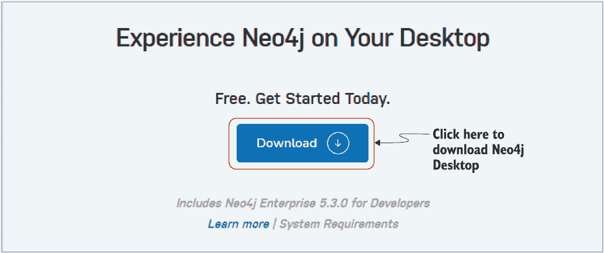
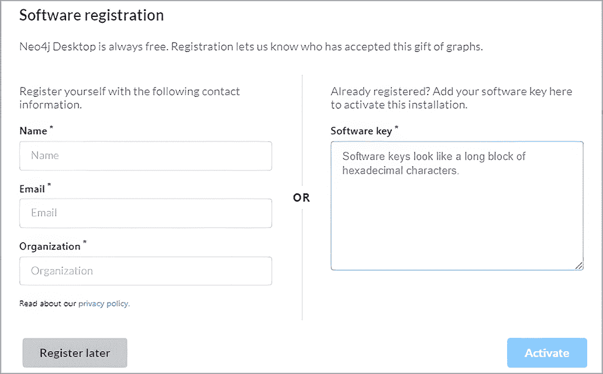
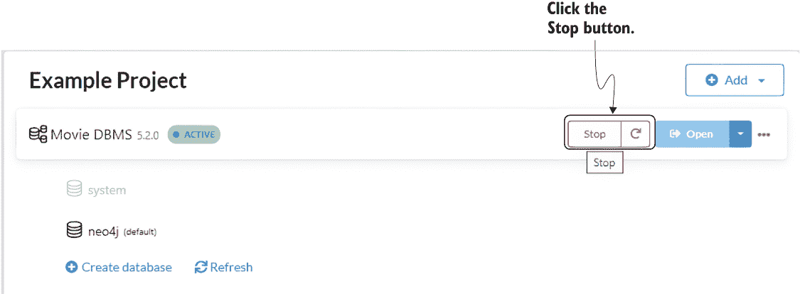
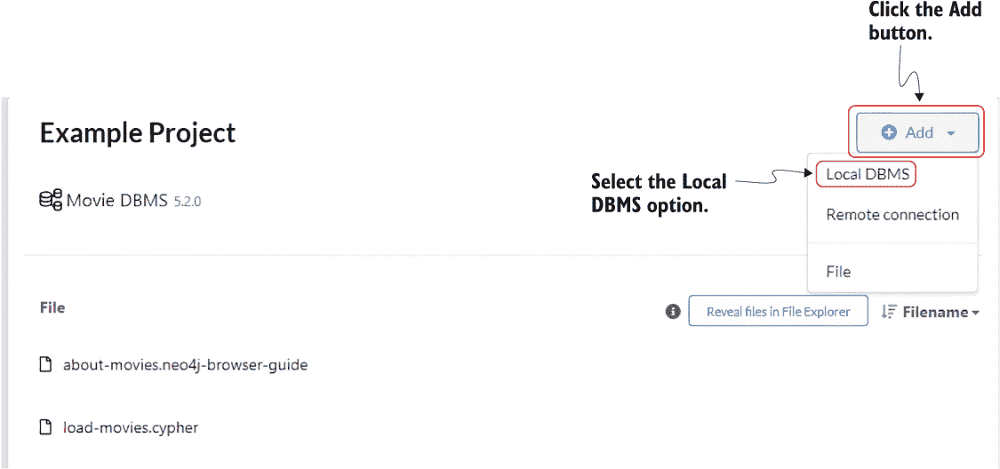
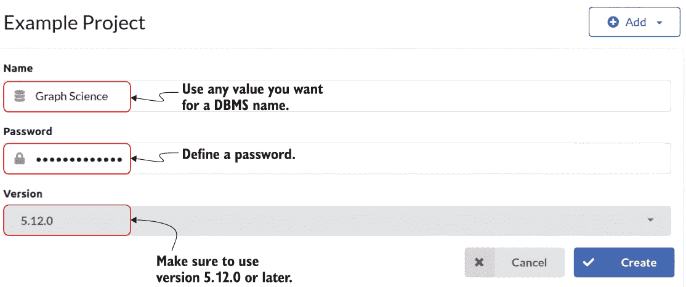
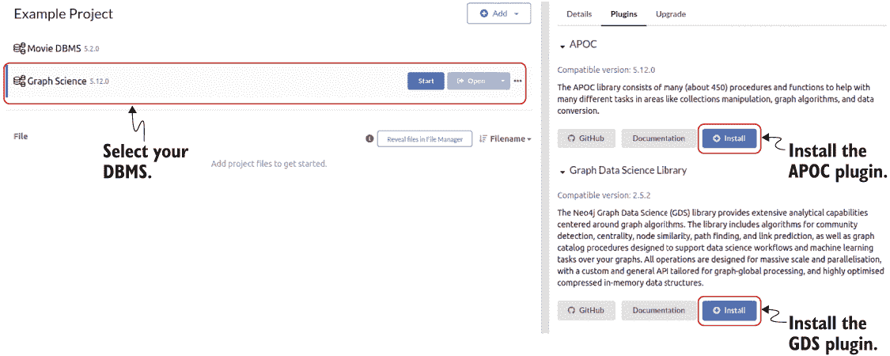
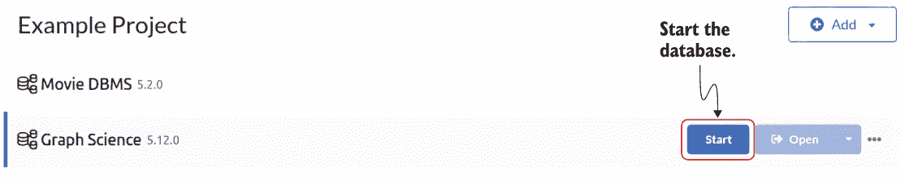
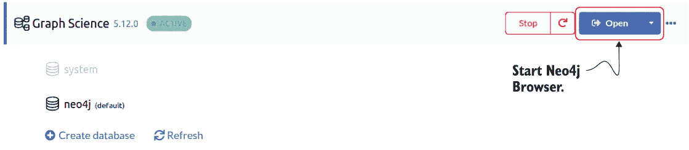
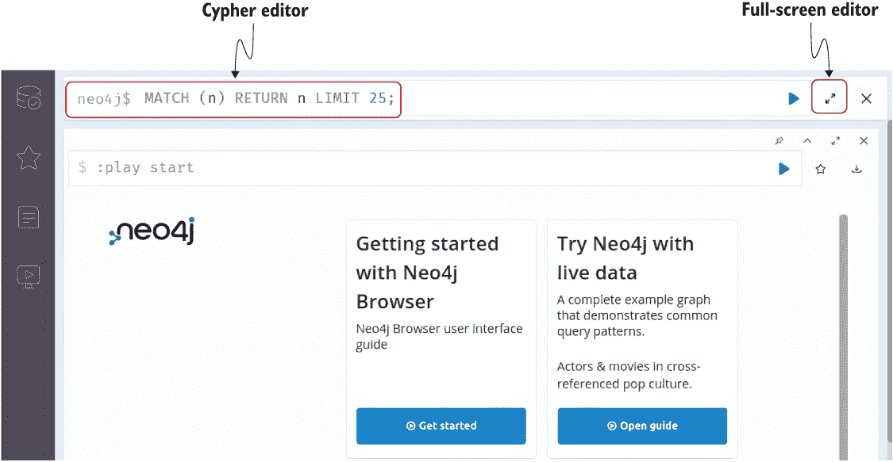
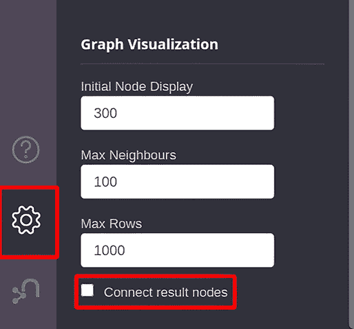

# 附录。Neo4j 环境

在这本书中，您将通过使用 Neo4j 的实际示例学习图理论和算法。我选择 Neo4j 是因为我有超过五年的使用经验，用于构建和分析图。

Neo4j 是一个本机图数据库，从头开始构建以存储、查询和操作图数据。它使用 Java 实现，可以通过 Cypher 查询语言从其他语言编写的软件中访问，通过事务性 HTTP 端点或二进制 Bolt 协议。在 Neo4j 中，数据以节点和关系的形式存储，它们在数据库中都是一等公民。节点代表实体，如人或企业，关系代表这些实体之间的连接。节点和关系可以具有属性，这些属性是键值对，提供了关于节点和关系的额外信息。

Neo4j 设计为高度可扩展。它使用灵活的索引系统来高效地查询和处理数据，并支持原子性、一致性、隔离性和持久性（ACID）事务，以确保数据一致性。它还内置了一个查询语言，称为 Cypher，该语言旨在易于表达且易于使用，用于查询和操作图数据。

使用 Neo4j 的另一个好处是它有两个实用的插件，您将使用它们：

+   *The Awesome Procedures on Cypher (APOC) plugin*—这是一个为 Neo4j 提供的程序、函数和插件库，它提供了广泛的功能，包括数据导入/导出、数据转换和处理、日期时间区间处理、地理空间处理、文本处理等。

+   *The Graph Data Science (GDS) plugin*—这是一套为 Neo4j 设计的图算法和程序，允许用户对其图数据进行高级分析。GDS 提供了常见图算法（如最短路径、PageRank 和社区检测）的高效、并行实现。此外，该插件还包括节点嵌入算法和机器学习工作流程，支持节点分类和链接预测工作流程。

## A.1 Cypher 查询语言

Cypher 是一种用于图数据库的声明式查询语言，用于检索和操作存储在图数据库中的数据。Cypher 查询使用简单、易于阅读的语法编写。以下是一个简单的 Cypher 查询示例，它使用 ASCII 艺术风格的图表来展示所查询的关系。

列表 A.1 一个示例 Cypher 语句

```
MATCH (a:Person)-[:FOLLOWS]->(b:Person)
WHERE a.name = "Alice"
RETURN b.name
```

openCypher 倡议是 Neo4j 与几个其他组织之间的合作，旨在推广 Cypher 查询语言作为处理图数据的标准。openCypher 倡议的目的是创建一种通用的语言，可以用来查询任何图数据库，无论其底层技术如何。为了实现这一目标，openCypher 倡议正在将 Cypher 语言规范和相关资源以开源许可证的形式提供，并鼓励各种组织开发 Cypher 实现。到目前为止，Cypher 查询语言已被 Amazon、Agens Graph、Katana Graph、Memgraph、RedisGraph 和 SAP HANA（openCypher 实施者小组；[`opencypher.org/projects/`](https://opencypher.org/projects/)）采用。

此外，还有一个官方的 ISO 项目提议一个统一的图查询语言（GQL）来与图数据库交互（GQL 标准委员会）。GQL 旨在建立在 SQL 的基础上，并整合现有图查询语言中的成熟想法，包括 Cypher。这使得学习 Cypher 成为与图数据库交互的绝佳起点，因为它已经与许多数据库集成，并将成为官方 ISO 图查询语言的一部分。有关更多信息，请参阅 GQL 的图模式匹配提案（Deutsch 等人，2022 年）。

## A.2 Neo4j 安装

有几种不同的选项来设置您的 Neo4j 环境：

+   Neo4j Desktop

+   Neo4j Docker

+   Neo4j Aura

如果您是 Neo4j 的新用户，我建议您使用 Neo4j 桌面版。

### A.2.1 Neo4j 桌面版安装

Neo4j 桌面版是一个本地的 Neo4j 图数据库管理应用程序。它允许您通过几个点击创建数据库实例并安装官方插件。如果您决定使用 Neo4j 桌面版，请按照以下步骤成功启动一个安装了 APOC 和 GDS 插件的 Neo4j 数据库实例：

1.  从官方网站下载 Neo4j 桌面版应用程序（[`neo4j.com/download`](https://neo4j.com/download)；图 A.1）。

    

    图 A.1 下载 Neo4j 桌面版。

1.  在您的计算机上安装 Neo4j 桌面版应用程序，然后打开它。

1.  完成注册步骤。您可以在下载应用程序时分配的软件密钥，或者通过点击“稍后注册”（图 A.2）跳过此步骤。

    

    图 A.2 输入您的个人信息，或跳过注册步骤。

1.  电影数据库管理系统（DBMS）在 Neo4j 桌面版首次执行时自动启动。如果正在运行，请停止电影 DBMS（图 A.3）。

    

    图 A.3 停止默认的电影数据库管理系统数据库。

1.  添加一个新的本地数据库管理系统（图 A.4）。

    

    图 A.4 添加本地数据库管理系统。

1.  输入数据库管理系统名称和密码的任何值。请确保选择版本 5.12.0 或更高版本（图 A.5）。

    

    图 A.5 定义 DBMS 密码和版本。

1.  通过选择 DBMS 来安装 APOC 和 GDS 插件，这将在右侧面板中打开详细信息、插件和升级选项卡。选择插件选项卡，然后安装 APOC 和 GDS 插件（图 A.6）。

    

    图 A.6 安装 APOC 和 GDS 插件。

1.  启动数据库（图 A.7）。

    

    图 A.7 启动数据库。

1.  打开 Neo4j 浏览器（图 A.8）。

    

    图 A.8 打开 Neo4j 浏览器。

1.  通过在 Cypher 编辑器中输入来执行 Cypher 查询。对于较长的 Cypher 语句，可以使用全屏编辑器选项（图 A.9）。

    

    图 A.9 Neo4j 浏览器中的 Cypher 查询编辑器

### A.2.2 Neo4j Docker 安装

如果你选择了 Neo4j Docker 安装，你需要在命令提示符中运行以下列表中的命令。

列表 A.2 启动 Neo4j Docker

```
docker run \
  -p 7474:7474 -p 7687:7687 \
  -d \
  -v $HOME/neo4j/data:/data \
  -e NEO4J_AUTH=neo4j/pleaseletmein \
  -e 'NEO4J_PLUGINS=["apoc", "graph-data-science"]' \
    neo4j:5.12.0
```

此命令在后台启动 docker 化的 Neo4j。通过定义`NEO4J_PLUGINS`环境变量，APOC 和 GDS 插件会自动添加。将`data`卷挂载以持久化数据库文件是一个好习惯。数据库用户名和密码由`NEO4J_AUTH`变量指定。

在执行列表 A.2 中的命令后，在你的网页浏览器中访问 http://localhost:7474。输入由`NEO4J_AUTH`变量指定的密码。示例中的密码是`pleaseletmein`。

### A.2.3 Neo4j Aura

Neo4j Aura 是 Neo4j 数据库的托管云实例。不幸的是，免费版本不提供 GDS 库。如果你想使用云托管的 Neo4j Aura 来跟随本书中的示例，你需要使用 AuraDS 版本，它提供了对 GDS 算法的支持。你可以在 Neo4j 的官方网站上找到更多信息：[`neo4j.com/cloud/platform/aura-graph-database/`](https://neo4j.com/cloud/platform/aura-graph-database/)。

## A.3 Neo4j 浏览器配置

Neo4j 浏览器有一个面向初学者的功能，可以可视化结果节点之间所有的关系，即使这些关系不是查询结果的一部分。为了避免混淆，请取消选中如图 A.10 所示的连接结果节点功能。



图 A.10 在 Neo4j 浏览器中取消选中连接结果节点。
