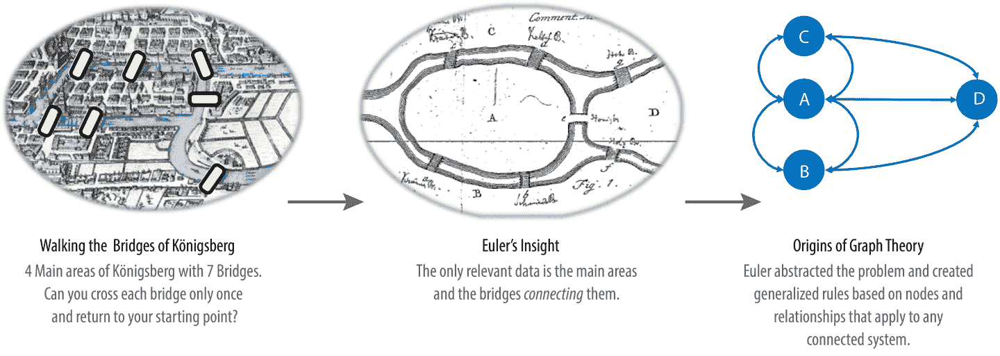
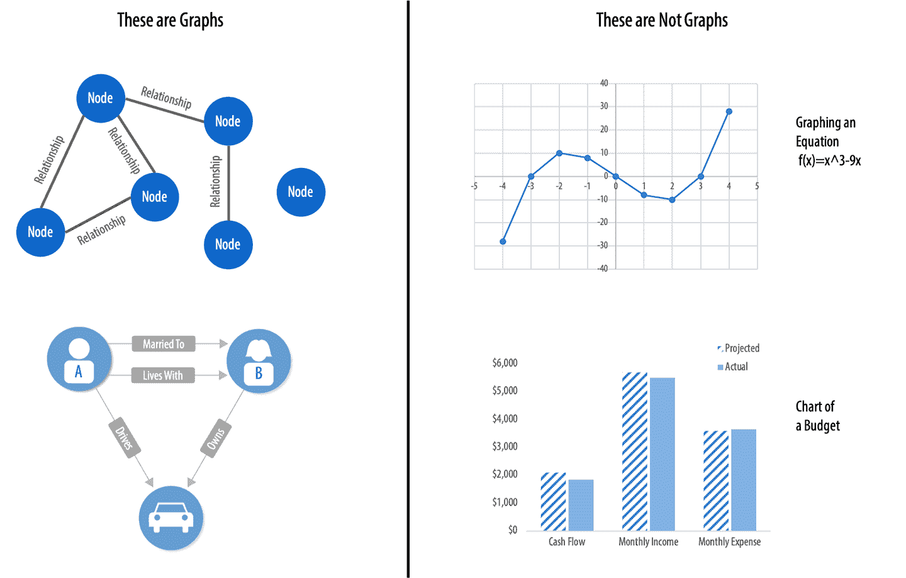
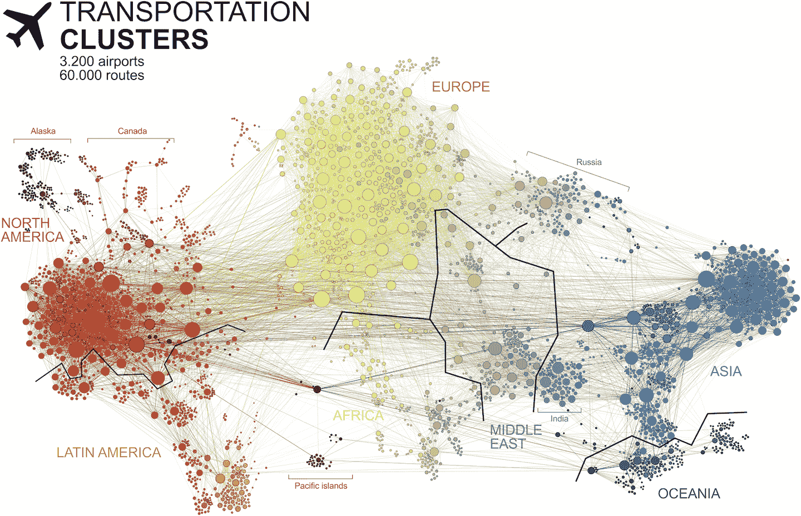
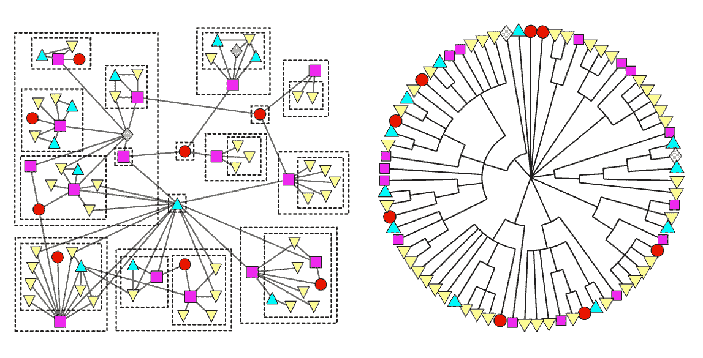
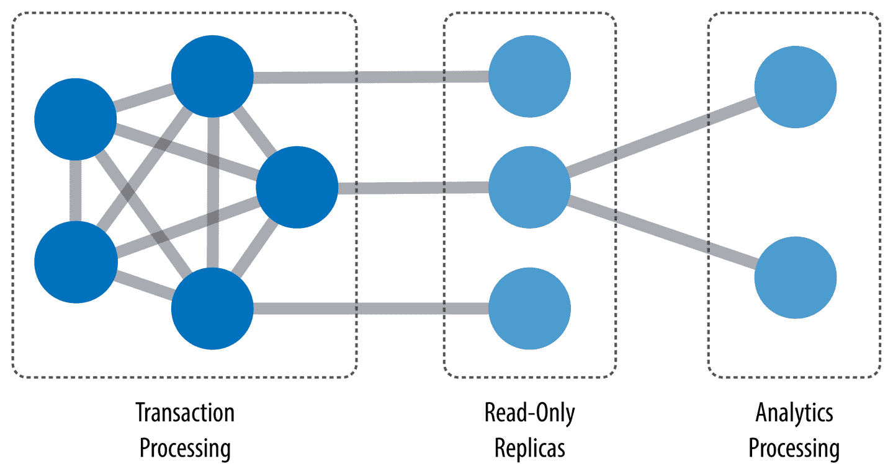
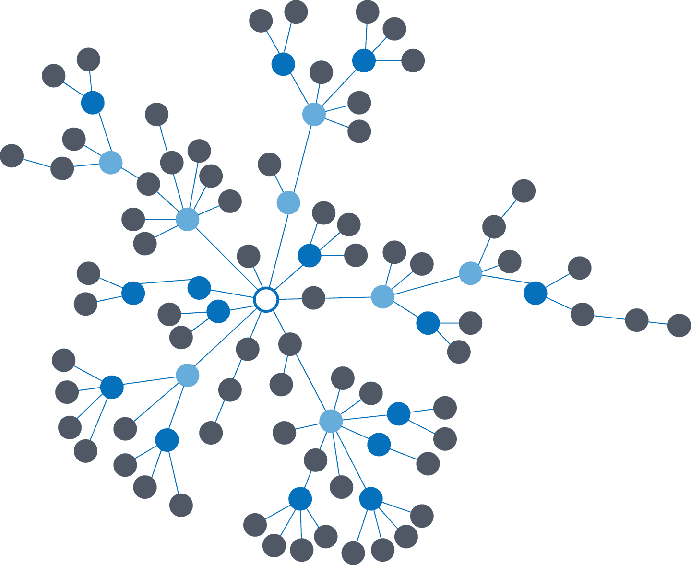
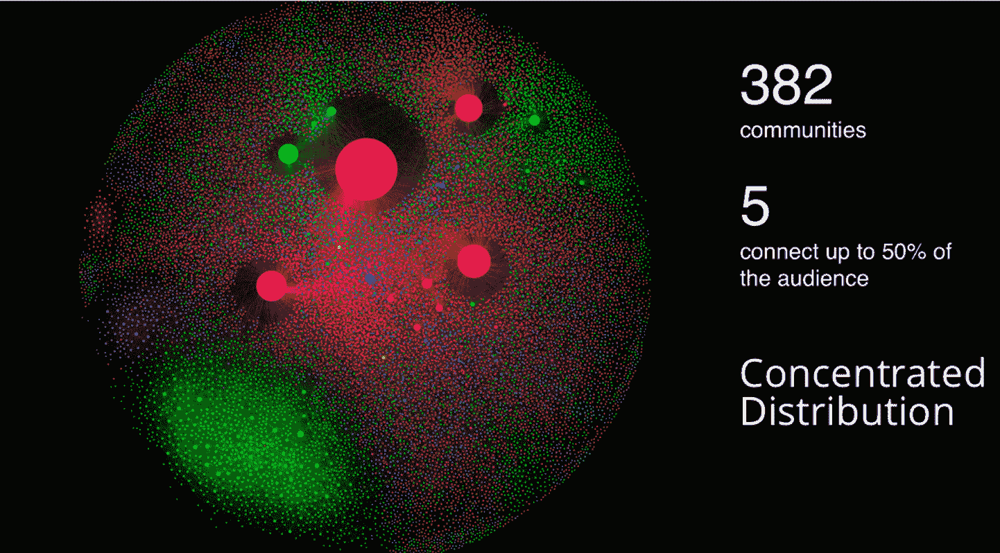
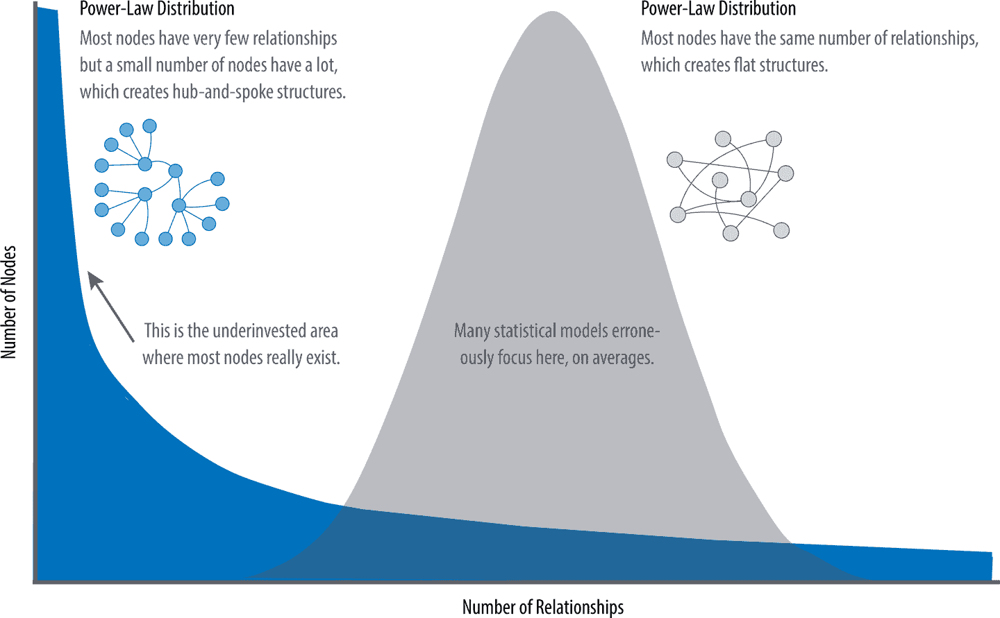
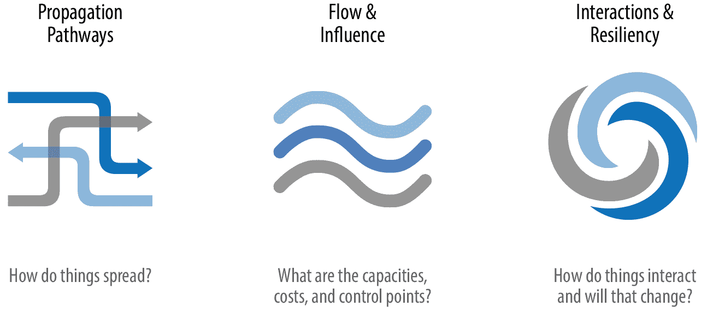

# 第一章：引言

> 图是计算机科学的一个统一主题——一种抽象表示，描述了交通系统、人类互动和电信网络的组织。使用单一形式化描述这么多不同的结构，这是对受过教育的程序员的一种巨大力量来源。
> 
> *算法设计手册*，由 Steven S. Skiena（Springer 出版），斯多尼布鲁克大学计算机科学杰出教学教授撰写

当今最迫切的数据挑战集中在关系上，而不仅仅是离散数据的汇总。图技术和分析提供了用于研究、社会倡议和业务解决方案的强大工具，例如：

+   建模从金融市场到 IT 服务的动态环境

+   预测流行病的传播以及波及的服务延迟和故障

+   为了打击金融犯罪，找到机器学习的预测特征

+   揭示个性化体验和推荐的模式

随着数据变得越来越相互连接，系统变得越来越复杂，利用数据内丰富且不断演变的关系至关重要。

本章介绍了图分析和图算法。我们将从图的起源简要回顾开始，然后介绍图算法，并解释图数据库与图处理之间的区别。我们将探讨现代数据本身的性质，以及通过基本统计方法无法揭示的连接信息的复杂性。本章将以探讨可以应用图算法的用例结束。

# 什么是图？

图论起源于 1736 年，当时 Leonhard Euler 解决了“康斯伯格的七桥问题”。这个问题要求在连接七座桥的四个区域中游览，每座桥只能跨一次。结果不行。

拥有只有连接本身是相关的洞察力，Euler 奠定了图论及其数学的基础。图 1-1 展示了 Euler 在他的一篇论文[“Solutio problematis ad geometriam situs pertinentis”](http://bit.ly/2TV6sgx)中的一个原始草图。

###### 图 1-1\. 图论的起源。[康斯伯格](https://bit.ly/2JCyLvB)市包括两个大岛屿，通过七座桥连接彼此和城市的两个主陆地部分。谜题是在城市中创建一次行走，只穿过每座桥一次。

尽管图表源于数学，但它们也是建模和分析数据的一种实用和高保真方式。构成图表的对象称为节点或顶点，它们之间的连接称为关系、链接或边缘。在本书中，我们使用术语*节点*和*关系*：你可以将节点看作是句子中的名词，将关系看作是为节点提供上下文的动词。为了避免混淆，我们在本书中谈论的图与在图表中绘制方程或图表（如图 1-2）无关。

###### 图 1-2\. 图是网络的表示，通常用圆圈表示实体，我们称之为节点，并用线条表示关系。

查看图 1-2 中的人物图，我们可以轻松地构造几个描述它的句子。例如，人物 A 与人物 B 同住，后者拥有一辆车，而人物 A 驾驶的车则是人物 B 拥有的。这种建模方法非常引人入胜，因为它轻松映射到现实世界，并且非常“白板友好”。这有助于对数据建模和分析进行对齐。

但是，建模图仅仅是故事的一部分。我们可能还希望处理它们以揭示并不明显的见解。这是图算法的领域。

# 什么是图分析和算法？

图算法是图分析工具的一个子集。图分析是我们做的事情——使用任何基于图的方法来分析连接的数据。我们可以使用各种方法：我们可以查询图数据，使用基本统计信息，视觉探索图形，或将图形纳入我们的机器学习任务中。基于图模式的查询通常用于局部数据分析，而图计算算法通常指更全局和迭代分析。虽然这些类型的分析方法可以重叠使用，但我们使用术语*图算法*来指代后者，即更计算化的分析和数据科学应用。

图算法提供了分析连接数据的最有效方法之一，因为它们的数学计算专门设计用于处理关系。它们描述了处理图以发现其一般特性或特定量的步骤。基于图论的数学，图算法利用节点之间的关系推断复杂系统的组织和动态。网络科学家使用这些算法来揭示隐藏信息，验证假设，并对行为进行预测。

图算法具有广泛的潜力，从防止欺诈和优化呼叫路由到预测流感的传播。例如，我们可能希望对应于电力系统中过载条件的特定节点进行评分。或者，我们可能希望发现图中与交通系统拥堵对应的分组。

实际上，2010 年，美国的航空旅行系统经历了两次涉及多个拥挤机场的严重事件，后来通过图分析进行了研究。网络科学家 P. Fleurquin、J. J. Ramasco 和 V. M. Eguíluz 使用图算法确认了这些事件作为系统级联延迟的一部分，并利用这些信息提供了纠正建议，如他们在论文[“Systemic Delay Propagation in the US Airport Network”](https://www.nature.com/articles/srep01159/)中描述的那样。

为了可视化支持空中交通的网络，图 1-3 由 Martin Grandjean 为他的文章[“Connected World: Untangling the Air Traffic Network”](http://bit.ly/2CDdDiR)创建。这幅插图清晰地展示了空中运输集群的高度连接结构。许多运输系统表现出具有明显枢纽-辐式模式的链接集中分布，这些模式影响延迟。

###### 图 1-3\. 空中运输网络展示了随着多个尺度演变的枢纽-辐结构。这些结构对旅行流的影响很大。

图表还有助于揭示非常小的相互作用和动态如何导致全球变化。它们通过准确地表示全球结构内部正在相互作用的事物来将微观和宏观尺度联系起来。这些关联被用来预测行为并确定缺失的链接。图 1-4 是一个草地物种相互作用的食物网，利用图分析评估了层次结构和物种相互作用，然后预测了缺失的关系，正如 A. Clauset、C. Moore 和 M. E. J. Newman 在[“Hierarchical Structure and the Prediction of Missing Links in Network”](https://www.nature.com/articles/nature06830)一文中详细描述的那样。

###### 图 1-4\. 这个草地物种的食物网利用图来将小尺度的相互作用与更大的结构形成相关联。

# 图处理、数据库、查询和算法

图处理包括执行图工作负载和任务的方法。大多数图查询考虑图的特定部分（例如，起始节点），工作通常集中在周围的子图中。我们称这种工作为*图本地*，它意味着声明式地查询图的结构，正如 Ian Robinson、Jim Webber 和 Emil Eifrem（O’Reilly）在《[图数据库](http://graphdatabases.com)》一书中所解释的那样。这种类型的图本地处理通常用于实时交易和基于模式的查询。

当谈论图算法时，通常我们寻找全局的模式和结构。算法的输入通常是整个图，输出可以是一个增强的图或者某种聚合值，比如一个分数。我们将这种处理称为*图全局*，它意味着使用计算算法（通常是迭代地）处理图的结构。这种方法通过其连接揭示了网络的整体特性。组织倾向于使用图算法来建模系统，并基于信息传播方式、重要组件、群体识别以及系统整体的健壮性来预测行为。

这些定义可能存在一些重叠——有时我们可以使用算法处理来回答局部查询，反之亦然——但简单地说，整图操作由计算算法处理，子图操作则在数据库中查询。

传统上，事务处理和分析是分开的。这种分隔是基于技术限制而不自然的。我们的观点是，图分析推动更智能的交易，从而创造了新的数据和进一步分析的机会。近年来，有一种趋势是将这些分隔整合起来，以实现更实时的决策。

## OLTP 和 OLAP

*在线事务处理*（OLTP）操作通常是像订票、记账、预订销售等短期活动。OLTP 意味着处理大量低延迟的查询和高数据完整性。尽管每个事务可能只涉及少量记录，系统却可以同时处理多个事务。

*在线分析处理*（OLAP）便于对历史数据进行更复杂的查询和分析。这些分析可能涉及多个数据源、格式和类型。检测趋势、进行“假设”场景分析、进行预测和揭示结构模式是典型的 OLAP 应用场景。与 OLTP 相比，OLAP 系统处理更少但运行时间更长的事务，处理许多记录。OLAP 系统更注重快速读取，而不像 OLTP 那样期望事务更新，批处理操作很常见。

然而，最近，OLTP 和 OLAP 之间的界限已经开始模糊。现代数据密集型应用程序现在结合了实时事务操作和分析。这种处理的融合受到软件多方面的进展推动，如更可扩展的事务管理和增量流处理，以及成本更低的大内存硬件。

将分析和事务结合起来，使持续分析成为常规操作的一部分。随着数据的收集——从销售点（POS）机器、制造系统或物联网（IoT）设备——分析现在支持在处理时做出实时推荐和决策。这种趋势已经观察了好几年，用来描述这种融合的术语包括*translytics*和*混合事务与分析处理*（HTAP）。图 1-5 展示了如何使用只读副本将这些不同类型的处理结合起来。

###### 图 1-5\. 混合平台支持低延迟查询处理和高数据完整性，同时集成大数据上的复杂分析。

根据[Gartner](https://gtnr.it/2FAKnuX)的说法：

> [HTAP]有可能重新定义一些业务流程的执行方式，因为实时高级分析（例如规划、预测和假设分析）成为过程本身的一部分，而不是事后执行的单独活动。这将促成新形式的实时基于业务的决策过程。最终，HTAP 将成为智能业务操作的关键启用架构。

随着联机事务处理（OLTP）和联机分析处理（OLAP）变得更加集成，并开始支持之前只有一个单独体系结构中提供的功能，不再需要为这些工作负载使用不同的数据产品或系统——我们可以通过使用相同的平台简化我们的架构。这意味着我们的分析查询可以利用实时数据，并且我们可以简化分析的迭代过程。

# 我们为什么要关注图算法？

图算法用于帮助理解连接数据。我们在现实世界的系统中看到各种关系，从蛋白质相互作用到社交网络，从通信系统到电力网，从零售体验到火星任务规划。理解网络及其内部连接为洞察力和创新提供了难以置信的潜力。

图算法非常适合理解高度连接的数据集中的结构并揭示模式。连接性和互动性在大数据中尤为明显。汇集、混合和动态更新的信息量令人印象深刻。图算法可以帮助我们理解大量数据，利用关系进行更复杂的分析，增强人工智能的背景信息。

随着我们的数据变得更加连接，理解其关系和相互依赖性变得越来越重要。研究网络增长的科学家们指出，连接随时间增加，但并非均匀增长。优先附着理论解释了增长动态如何影响结构的一种方式。这一思想在 图 1-6 中有所体现，描述了节点倾向于连接已经具有大量连接的其他节点的趋势。

###### 图 1-6\. 优先附着是一个现象，即一个节点连接越多，收到新连接的可能性就越大。这导致了不均匀的集中和中心枢纽。

在他的书 *Sync: How Order Emerges from Chaos in the Universe, Nature, and Daily Life* （哈希特出版社）中，Steven Strogatz 提供了例子，并解释了现实生活中系统自组织的不同方式。许多研究人员认为，网络增长方式与其最终形状和层次结构密切相关。高密度群组和不均匀的数据网络倾向于发展，随着数据规模的增长，复杂性也在增加。我们在今天大多数现实世界的网络中看到关系的聚类，从互联网到像 图 1-7 中展示的游戏社区的社交网络。

###### 图 1-7\. 这个 [游戏社区分析](https://bit.ly/2CCLlVI) 显示了约 382 个社区中的 5 个集中连接。

图 1-7 中展示的网络分析由 Pulsar 的 Francesco D’Orazio 创建，旨在帮助预测内容的病毒传播性并制定分发策略。D’Orazio [发现](https://bit.ly/2CCLlVI) 社区分布的集中度与内容传播速度之间存在相关性。

这与平均分布模型的预测显著不同，后者认为大多数节点的连接数相同。例如，如果万维网具有平均分布的连接，所有页面的入站和出站链接数量将大致相同。平均分布模型断言，大多数节点连接相等，但许多类型的图表和许多真实网络表现出集中现象。与旅行和社交网络等图表相似，万维网具有 *power-law* 分布，其中少数节点高度连接，而大多数节点连接适中。

尝试“平均化”一个网络通常不适合研究关系或预测，因为现实世界的网络具有不均匀的节点和关系分布。我们可以在 图 1-8 中清楚地看到，对于不均匀数据使用特征的平均值会导致错误的结果。

###### 图 1-8\. 现实世界中的网络具有节点和关系的不均匀分布，极端情况下呈现幂律分布。平均分布假设大多数节点具有相同数量的关系，从而导致随机网络。

因为高度连接的数据不遵循平均分布，网络科学家使用图分析搜索和解释现实世界数据中的结构和关系分布。

> 据我们所知，自然界中没有任何网络符合随机网络模型的描述。
> 
> 阿尔伯特·拉兹洛·巴拉巴西（Albert-László Barabási），东北大学复杂网络研究中心主任，以及众多网络科学书籍的作者

大多数用户面临的挑战是，密集且不均匀连接的数据难以用传统的分析工具进行分析。可能存在一定的结构，但很难找到。处理杂乱数据时很容易采用平均值方法，但这样做会隐藏模式，并确保我们的结果不代表任何真实的群体。例如，如果您将所有客户的人口统计信息平均化，并基于平均值提供体验，您肯定会错过大多数社区：社区倾向于围绕年龄、职业或婚姻状况和地点等相关因素聚集。

此外，动态行为，特别是突发事件和爆发事件，无法通过快照看到。举例来说，如果想象一个社交群体，其关系增加，你也会预期到更多的沟通。这可能导致协调的临界点和随后的联盟，或者在选举中形成次级群体和极化。需要先进的方法来预测网络随时间的演变，但如果我们理解数据中的结构和互动，我们可以推断行为。图分析被用来预测群体的弹性，因为它关注关系。

# 图分析的使用案例

在最抽象的层面上，图分析被用来预测动态群体的行为并规定行动。要做到这一点，需要理解群体内部的关系和结构。图算法通过检查网络的连接来实现这一点。通过这种方法，您可以理解连接系统的拓扑结构并建模它们的过程。

有三种一般的问题类别表明需要使用图分析和算法，如图 1-9 所示。

###### 图 1-9\. 图分析回答的问题类型

这里有一些使用图算法的挑战类型。您的挑战是否类似？

+   调查疾病传播或级联运输失败的路径。

+   揭示网络攻击中最脆弱或最具破坏性的组件。

+   确定信息或资源的最经济或最快的路由方式。

+   预测数据中缺失的链接。

+   定位复杂系统中的直接和间接影响。

+   发现未曾见过的层次和依赖关系。

+   预测群体是否会合并或分裂。

+   发现瓶颈或拒绝/提供更多资源的权力。

+   基于行为揭示社群，进行个性化推荐。

+   减少在欺诈和异常检测中的误报。

+   提取更具预测性的特征，用于机器学习。

# 结论

在本章中，我们探讨了当今数据的极高连接性及其影响。对于分析群体动态和关系存在健壮的科学实践，然而这些工具并不总是企业中的常见之物。在评估高级分析技术时，我们应考虑数据的本质以及是否需要理解社群属性或预测复杂行为。如果我们的数据代表一个网络，我们应避免将因素简化为平均值的诱惑。相反，我们应使用与我们的数据和所寻找的见解匹配的工具。

在下一章中，我们将涵盖图的概念和术语。
