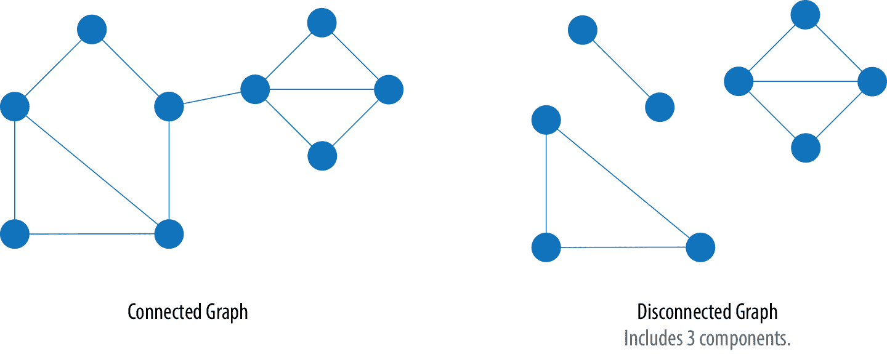
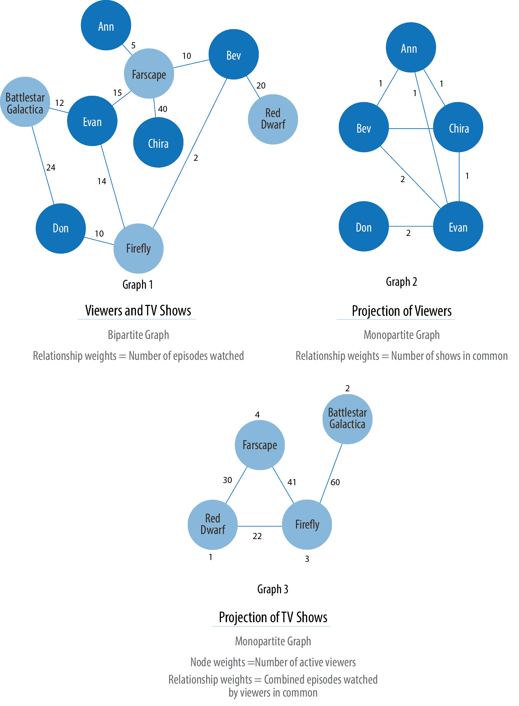

# 第二章：图论与概念

在本章中，我们为图算法奠定了框架并介绍了术语。解释了图论的基础知识，重点放在对从业者最相关的概念上。

我们将描述图的表示方式，然后解释不同类型的图及其属性。这将在稍后非常重要，因为我们的图的特性将指导我们的算法选择并帮助我们解释结果。我们将在本章结束时概述本书中详细介绍的图算法类型。

# 术语

标记属性图是建模图数据的最流行方式之一。

*标签*将节点标记为一个组的一部分。在图 2-1 中，我们有两组节点：`Person`和`Car`。（尽管在经典图论中标签适用于单个节点，但现在通常用于指代节点组。）

###### 图 2-1。标记属性图模型是表示连接数据的灵活简洁的方式。

关系根据*关系类型*进行分类。我们的示例包括`DRIVES`、`OWNS`、`LIVES_WITH`和`MARRIED_TO`等关系类型。

*属性*与属性同义，可以包含各种数据类型，从数字和字符串到空间和时间数据。在图 2-1 中，我们将属性分配为名称-值对，其中属性的名称首先出现，然后是其值。例如，左侧的`Person`节点具有属性`name: "Dan"`，而`MARRIED_TO`关系具有属性`on: Jan 1, 2013`。

*子图*是大图中的一个图。子图对于需要特定特征子集的集中分析很有用。

*路径*是一组节点及其连接关系。根据图 2-1，一个简单路径的示例可以包含节点`Dan`、`Ann`和`Car`以及`DRIVES`和`OWNS`关系。

图的类型、形状和大小以及用于分析的属性种类各异。接下来，我们将描述最适合图算法的图类型。请注意，这些解释适用于图及其子图。

# 图类型与结构

在经典图论中，术语*图*等同于*简单*（或*严格*）图，其中节点之间只有一种关系，如图 2-2 左侧所示。然而，大多数现实世界的图具有许多节点之间的关系，甚至有自引用关系。如今，该术语通常用于图 2-2 中的所有三种图类型，因此我们也包容性地使用此术语。

###### 图 2-2。在本书中，我们使用术语图来包括任何这些经典类型的图。

## 随机、小世界、无标度结构

图形具有多种形状。图 2-3 显示了三种典型的网络类型：

+   随机网络

+   小世界网络

+   无标度网络

###### 图 2-3\. 具有独特图形和行为的三种网络结构

+   在连接完全平均分布的情况下，将形成一个 *随机网络*，没有等级制度。这种没有形状的图形是“平坦的”，没有明显的模式。所有节点有相同的连接概率。

+   *小世界网络* 在社交网络中非常普遍；它展示了本地化的连接和一些中心枢纽模式。[“六度分隔理论”](https://bit.ly/2FAbVk8) 游戏可能是最著名的小世界效应例子。尽管你主要与一小群朋友交往，但与任何其他人之间的距离从未超过几步，即使他们是著名演员或者住在地球另一边。

+   一个 *无标度网络* 是指在存在幂律分布的情况下，无论规模如何，保留了中心枢纽结构的网络，例如全球网络（World Wide Web）。

这些网络类型生成具有独特结构、分布和行为的图形。当我们使用图算法时，我们将开始识别结果中的相似模式。

# 图的类型

要充分利用图算法，熟悉我们可能遇到的最典型的图形是非常重要的。表 2-1 总结了常见的图属性。在接下来的部分中，我们将更详细地研究不同的图类型。

表 2-1\. 图的常见属性

| 图属性 | 关键因素 | 算法考虑因素 |
| --- | --- | --- |
| 连通与非连通 | 图中任意两个节点之间是否存在路径，无论距离如何 | 节点的孤岛可能导致意外行为，例如陷入或无法处理断开的组件。 |
| 带权重与无权重 | 关系或节点是否具有（特定领域的）数值 | 许多算法期望有权重，当忽略它们时，我们会看到性能和结果上的显著差异。 |
| 有向与无向 | 关系是否明确定义了起始和结束节点 | 这增加了推断附加含义的丰富上下文。在某些算法中，您可以明确设置使用一个、两个或没有方向。 |
| 循环与非循环 | 路径是否从同一节点开始和结束 | 循环图很常见，但算法必须小心（通常通过存储遍历状态），否则循环可能导致无法终止。非循环图（或生成树）是许多图算法的基础。 |
| 稀疏与稠密 | 关系与节点的比例 | 极度稠密或极度稀疏连接的图可能导致分歧结果。数据建模可能有助于处理，假设领域本身不是固有稠密或稀疏的。 |
| 单分图、二分图和*k*分图 | 节点是连接到只一种其他节点类型（例如，用户喜欢电影）还是多种其他节点类型（例如，用户喜欢喜欢电影的用户） | 有助于创建关系以分析和预测更有用的图形。 |

## 连通图与断开连接的图

如果所有节点之间都有路径，那么图就是连通的。如果我们的图中有孤立部分，它就是断开连接的。如果这些孤立部分中的节点是连接的，则称为*分量*（有时也称为*集群*），如图 2-4 所示。

###### 图 2-4。如果我们的图中有孤立的部分，那么它就是一个断开连接的图。

一些算法在处理断开连接的图时可能会产生误导性的结果。如果我们遇到意外的结果，检查图的结构是一个很好的第一步。

## 未加权图与加权图的比较

未加权图没有为其节点或关系分配权值。对于加权图，这些值可以表示各种度量，如成本、时间、距离、容量，甚至是特定领域的优先级。图 2-5 可视化了它们之间的区别。

###### 图 2-5。加权图可以在关系或节点上保存值。

基本图算法可以使用权重进行处理，作为关系强度或价值的表示。许多算法计算度量，然后可以用作后续处理的权重。某些算法在进行过程中更新权重值，以找到累计总数、最低值或最优解。

加权图的经典用途是路径查找算法。这些算法支持我们手机上的地图应用程序，并计算位置之间的最短/最便宜/最快的交通路线。例如，图 2-6 使用了两种不同的计算最短路径的方法。

###### 图 2-6。未加权和加权图的最短路径可能会有所不同，尽管它们在其他方面是相同的。

没有权重时，我们的最短路径是根据关系的数量计算的（通常称为*跳数*）。从 A 到 E 有一条两跳最短路径，这意味着它们之间只有一个节点（D）。然而，从 A 到 E 的最短加权路径是经过 A 到 C 到 D 到 E。如果权重代表公里数的物理距离，则总距离将是 50 公里。在这种情况下，根据跳数计算的最短路径将等于 70 公里的较长物理路径。

## 无向图与有向图的比较

在无向图中，关系被视为双向的（例如，友谊）。在有向图中，关系具有特定方向。指向节点的关系称为*入链*，而从节点发出的关系称为*出链*。

方向增加了信息的另一个维度。相同类型的但是方向相反的关系承载不同的语义意义，表达依赖性或指示流向。这可能被用作可信度或群体强度的指标。个人偏好和社会关系通过方向得到了很好的表达。

例如，如果我们假设在 图 2-7 中，有向图是学生网络，关系是“喜欢”，那么我们会计算出 A 和 C 更受欢迎。

###### 图 2-7\. 许多算法允许我们根据只有入站或出站连接、双向连接或无方向来计算。

道路网络说明了为什么我们可能需要同时使用这两种类型的图。例如，城市间的高速公路通常是双向的。然而，在城市内部，有些道路是单行道。（对某些信息流也是如此！）

在无向图中以无方向方式运行算法与有向方式得到了不同的结果。例如对于高速公路或友谊，我们会假设所有关系都是双向的。

如果我们把 图 2-7 想象成一个有向道路网络，你可以从 C 和 D 驾驶到 A，但只能通过 C 离开。此外，如果从 A 到 C 没有关系，那将指示一个死胡同。也许对于单向道路网络来说，这种情况不太可能发生，但对于流程或网页来说就不一定了。

## 无循环图与循环图

在图论中，*循环*是通过关系和节点之间的路径，并以相同节点开始和结束的路径。一个*无循环图*没有这样的循环。如图 图 2-8 所示，有向图和无向图都可以有循环，但在有向图中，路径遵循关系的方向。一个*有向无环图*（DAG），如图 1 所示，按定义总是有死胡同（也称为*叶节点*）。

###### 图 2-8\. 在无循环图中，不可能在不重复走步骤的情况下从一个节点开始并结束。

图 1 和图 2 没有循环，因为没有办法在没有重复关系的情况下从一个节点开始并结束。你可能还记得第一章中提到的不重复关系问题，这启发了图论的起源！图 3 在 图 2-8 中展示了一个简单的循环，按照 A-D-C-A 的路径，没有重复的节点。在图 4 中，通过添加节点和关系使无向循环图变得更有趣。现在有一个闭合循环，有一个重复的节点（C），按照 B-F-C-D-A-C-B 的路径。实际上，图 4 中有多个循环。

循环很常见，有时我们需要将循环图转换为无循环图（通过切断关系）以消除处理问题。有向无环图在调度、家谱和版本历史中自然而然地出现。

### 树

在经典图论中，一个无向无环图称为*树*。在计算机科学中，树也可以是有向的。更广泛的定义是，任何两个节点之间仅有一条路径连接的图。树对于理解图结构和许多算法至关重要。它们在设计网络、数据结构和搜索优化方面起着关键作用，以改善分类或组织层次结构。

树及其变体已被广泛讨论。 图 2-9 展示了我们可能会遇到的常见树形结构。

###### 图 2-9\. 在这些典型的树图中，生成树在图算法中被最频繁使用。

在这些变体中，生成树对本书最为相关。*生成树*是一个子图，包含了更大的无环图的所有节点，但不包含所有关系。最小生成树用最少的跳数或最小权重路径连接图的所有节点。

## 稀疏图与密集图

图的稀疏性是基于它的关系数量与可能的最大关系数量进行比较的，如果每对节点之间都有关系，则会发生最大的可能关系。每个节点与每个其他节点都有关系的图称为*完全图*，或者是组件的*团*。例如，如果我所有的朋友彼此认识，那就是一个团。

图的*最大密度*是完全图中可能的关系数。它用公式 <math><mrow><mi>M</mi> <mi>a</mi> <mi>x</mi> <mi>D</mi> <mo>=</mo> <mfrac><mrow><mi>N</mi><mo>(</mo><mi>N</mi><mo>-</mo><mn>1</mn><mo>)</mo></mrow> <mn>2</mn></mfrac></mrow></math> 计算，其中 *N* 是节点数。为了测量*实际密度*，我们使用公式 <math><mrow><mi>D</mi> <mo>=</mo> <mfrac><mrow><mn>2</mn><mo>(</mo><mi>R</mi><mo>)</mo></mrow> <mrow><mi>N</mi><mo>(</mo><mi>N</mi><mo>-</mo><mn>1</mn><mo>)</mo></mrow></mfrac></mrow></math>，其中 *R* 是关系数。在 图 2-10 中，我们可以看到用于无向图的三种实际密度测量。

###### 图 2-10\. 检查图的密度可以帮助您评估意外结果。

虽然没有严格的分界线，但是任何实际密度接近最大密度的图被认为是密集的。基于真实网络的大多数图往往趋向于稀疏，总节点数与总关系数之间大致呈线性相关。特别是当涉及到物理元素时，例如在一个点上可以连接的电线、管道、道路或友谊的实际限制。

在极其稀疏或稠密的图上执行某些算法可能会返回荒谬的结果。如果图太稀疏，算法可能找不到足够的关系来计算有用的结果。另一方面，非常密集连接的节点并不会增加太多额外信息，因为它们已经高度连接了。高密度也可能会扭曲某些结果或增加计算复杂性。在这些情况下，过滤出相关的子图是一个实际的方法。

## 单分图、二分图和 k-分图

大多数网络包含多种节点和关系类型的数据。然而，图算法通常只考虑一种节点类型和一种关系类型。只有一种节点类型和一种关系类型的图有时被称为*单分图*。

*二分图*是一种图，其节点可以分为两组，使得关系仅连接一组中的节点到另一组中的节点。图 2-11 展示了这样一个图的例子。它有两组节点：一个观众组和一个电视节目组。两组之间只有关系，没有组内连接。换句话说，在图 1 中，电视节目仅与观众相关联，而不与其他电视节目相关联，观众同样也不直接连接到其他观众。

从我们的观众和电视节目的二分图开始，我们创建了两个单分图的投影：图 2 是基于共同观看的节目的观众连接，图 3 是基于共同观众的电视节目。我们还可以根据关系类型（如观看、评分或评论）进行过滤。

通过推断的连接投影单分图是图分析的重要部分。这些投影类型有助于揭示间接的关系和特征。例如，在图 2 中的图 2-11，Bev 和 Ann 只共同观看了一个电视节目，而 Bev 和 Evan 共同观看了两个节目。在图 3 中，我们根据共同观众的聚合观看次数加权了电视节目之间的关系。这种或其他类似的度量（如相似度）可以用来推断像观看*Battlestar Galactica*和*Firefly*这样的活动之间的意义。这可以为类似 Evan 的人提供建议，他在图 2-11 中刚看完了*Firefly*的最后一集。

*k-分图* 引用数据中节点类型数量（*k*）。例如，如果我们有三种节点类型，我们将会有一个三分图。这仅仅是将双分图和单分图的概念扩展到更多节点类型的情况。许多现实世界的图，特别是知识图谱，具有较大的*k*值，因为它们结合了许多不同的概念和信息类型。一个使用更多节点类型的示例是通过将一个食谱集映射到一个成分集和一个化学化合物，推断连接流行偏好的新混合物。我们也可以通过泛化来减少节点类型的数量，比如将菠菜或羽衣甘蓝等许多形式的节点视为“绿叶蔬菜”。

现在我们已经回顾了我们最有可能处理的图的类型，让我们学习我们将在这些图上执行的图算法类型。

###### 图 2-11\. 双分图经常被投影到单分图中进行更具体的分析。

# 图算法的类型

让我们深入研究图算法核心的三个分析领域。这些类别对应于路径查找和搜索、中心性计算以及社区检测的章节。

## 寻路

路径对于图分析和算法至关重要，因此我们将以特定的算法示例开始我们的章节。寻找最短路径可能是使用图算法执行的最频繁任务，并且是几种不同类型分析的前提条件。最短路径是具有最少跳数或最低权重的遍历路线。如果图是有向的，那么它是两个节点之间的最短路径，符合关系方向。

## 中心性

中心性是了解网络中哪些节点更重要的一切。但我们所说的重要性是什么意思？有不同类型的中心性算法用于衡量不同的事物，比如快速传播信息的能力与桥接不同群体的能力。在本书中，我们将专注于节点和关系的结构化方式。

## 社区检测

连通性是图论的核心概念，它使得复杂网络分析如查找社区成为可能。大多数现实世界的网络展现出更或少独立子图的亚结构（通常是准分形）。

连通性用于查找社区并量化组群的质量。评估图内不同类型的社区可以揭示结构，如枢纽和等级制，以及群体吸引或排斥其他群体的倾向。这些技术用于研究导致回声室和过滤泡效应等新兴现象。

# 摘要

图表是直观的。它们符合我们对系统的思考和绘制方式。一旦我们揭开了一些术语和层次的面纱，就可以迅速吸收使用图表的主要原则。在本章中，我们已经解释了后续书籍中使用的思想和表达，并描述了你将遇到的各种图表类型。

接下来，我们将看一下图表处理和分析类型，然后深入讨论如何在 Apache Spark 和 Neo4j 中使用图算法。
