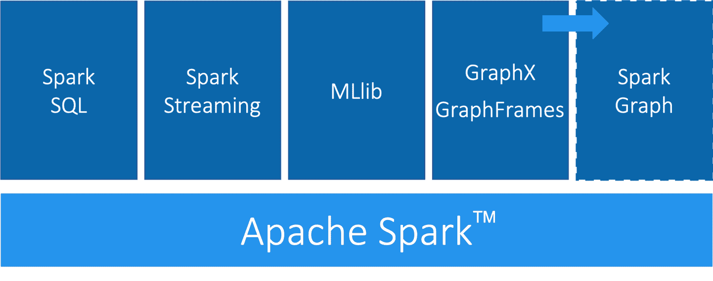

# 第三章：图平台和处理

在本章中，我们将快速介绍图处理的不同方法和最常见的平台方法。我们将更仔细地查看本书中使用的两个平台，Apache Spark 和 Neo4j，以及它们在不同需求下的适用情况。平台安装指南将为您准备好接下来的几章。

# 图平台和处理考虑因素

图分析处理具有结构驱动、全局聚焦和难以解析等独特特性。在本节中，我们将讨论图平台和处理的一般考虑因素。

## 平台考虑因素

人们对于图处理是扩展还是分布式处理更好存在争论。您应该使用强大的多核大内存机器，并专注于高效的数据结构和多线程算法吗？还是投资于分布式处理框架和相关算法值得？

一个有用的评估方法是《超越单线程的配置》（COST），如 F. McSherry、M. Isard 和 D. Murray 在研究论文《可扩展性！但以何种代价？》中所述。COST 为我们提供了一种比较系统可扩展性与系统引入的开销的方法。其核心概念是，使用优化的算法和数据结构的良好配置系统可以胜过当前通用的扩展解决方案。这是一种测量性能增益的方法，而不是奖励通过并行化掩盖低效率的系统。将可扩展性和资源有效利用的分离概念将帮助我们构建一个专门为我们的需求配置的平台。

一些图平台方法包括高度集成的解决方案，优化算法、处理和内存检索以在更紧密的协调中工作。

## 处理考虑因素

表达数据处理的不同方法存在不同的方法；例如，流处理或批处理或基于记录的数据的映射-减少范式。然而，对于图数据，还存在将图结构中的数据依赖性纳入其处理的方法：

以节点为中心的

此方法使用节点作为处理单元，使其通过消息将状态的积累和计算状态变化传递给它们的邻居。这种模型使用提供的转换函数来更简单地实现每个算法。

以关系为中心的

此方法与节点为中心的模型有相似之处，但对子图和顺序分析可能性能更好。

以图为中心的

这些模型独立处理子图内的节点，而与其他子图的（最小）通信通过消息传递进行。

以遍历为中心的

这些模型利用遍历者在导航图时累积数据作为它们的计算手段。

以算法为中心的

这些方法使用各种方法来优化每个算法的实现。这是前几种模型的混合体。

###### 注意

[*Pregel*](https://bit.ly/2Twj9sY) 是由 Google 创建的基于节点中心的、容错的并行处理框架，用于大规模图的高效分析。Pregel 基于*批量同步并行*（BSP）模型。BSP 通过具有明确的计算和通信阶段简化了并行编程。

Pregel 在 BSP 之上添加了一个以节点为中心的抽象，算法通过每个节点邻居发送的传入消息计算值。这些计算每次迭代执行一次，可以更新节点值并向其他节点发送消息。节点还可以在通信阶段组合消息以减少网络通信量。算法在不再发送新消息或达到设定的限制时完成。

大多数这些专门用于图的方法需要整个图的存在以进行高效的跨拓扑操作。这是因为将图数据分离和分布会导致工作者实例之间的大量数据传输和重新排序。这对需要迭代处理全局图结构的许多算法来说可能会很困难。

# 代表性平台

为了满足图处理的需求，出现了几个平台。传统上，图计算引擎和图数据库是分开的，用户需要根据其处理需求移动其数据：

图计算引擎

这些是只读的、非事务性引擎，专注于整个图的迭代图分析和查询的高效执行。图计算引擎支持不同的图算法定义和处理范式，如节点中心（例如 Pregel，Gather-Apply-Scatter）或基于 MapReduce 的方法（例如 PACT）。此类引擎的示例包括 Giraph、GraphLab、Graph-Engine 和 Apache Spark。

图数据库

从事务背景出发，这些方法侧重于使用较小的查询进行快速写入和读取，通常仅涉及图的一小部分。它们的优势在于操作的稳健性和对许多用户的高并发可扩展性。

## 选择我们的平台

选择生产平台涉及许多考虑因素，如要运行的分析类型、性能需求、现有环境和团队偏好。我们在本书中使用 Apache Spark 和 Neo4j 展示图算法，因为它们都具有独特的优势。

Spark 是一个例子，它是一个分布式的、节点中心的图计算引擎。其流行的计算框架和库支持各种数据科学工作流。当我们：

+   算法基本上是可并行化或可分区的。

+   算法工作流需要在多个工具和语言中进行“多语言”操作。

+   可以离线批处理运行分析。

+   图分析涉及未转换为图格式的数据时。

+   团队需要并具备编写和实现自己算法的专业知识时。

+   团队偶尔使用图形算法时。

+   希望将所有数据和分析保留在 Hadoop 生态系统内时。

[Neo4j 图平台](https://example.org/neo4j_graph_platform)是一个紧密集成的图数据库和以算法为中心的处理的示例，优化用于图形的应用程序构建。它因构建基于图形的应用程序而受欢迎，并包括针对其本机图数据库优化的图形算法库。当我们的团队：

+   算法更为迭代且需要良好的内存局部性时。

+   算法和结果对性能敏感。

+   图分析涉及复杂图数据和/或需要深度路径遍历时。

+   分析/结果与事务工作负载集成时。

+   结果用于丰富现有图形。

+   团队需要与基于图形的可视化工具集成时。

+   团队更喜欢预打包和支持的算法时。

最后，一些组织同时使用 Neo4j 和 Spark 进行图处理：Spark 用于大规模数据集的高级过滤和预处理以及数据集成，而 Neo4j 则用于更具体的处理和与基于图形的应用程序集成。

## Apache Spark

Apache Spark（以下简称 Spark）是一个用于大规模数据处理的分析引擎。它使用称为 DataFrame 的表抽象来表示和处理以命名和类型化列的行数据。该平台集成了多种数据源，并支持 Scala、Python 和 R 等多种编程语言。Spark 支持各种分析库，如图 3-1 所示。其基于内存的系统通过高效分布式计算图操作。

GraphFrames 是一个用于 Spark 的图处理库，于 2016 年取代了 GraphX，尽管它与核心 Apache Spark 是分开的。GraphFrames 基于 GraphX，但使用 DataFrame 作为其底层数据结构。GraphFrames 支持 Java、Scala 和 Python 编程语言。2019 年春，“Spark 图形：属性图、Cypher 查询和算法”提案被接受（参见“Spark 图形演变”）。我们预计这将通过 DataFrame 框架和 Cypher 查询语言为核心 Spark 项目引入多个图特性。然而，在本书中，我们的示例将基于 Python API（PySpark），因为它目前在 Spark 数据科学家中非常流行。



###### 图 3-1。Spark 是一个开源的分布式通用集群计算框架。它包括多个模块，用于处理各种工作负载。

节点和关系分别表示为带有每个节点唯一标识符以及每个关系源和目标节点的数据框。我们可以在表 3-1 中看到一个节点数据框的示例，以及在表 3-2 中看到一个关系数据框的示例。基于这些数据框的 GraphFrame 将包含两个节点，`JFK` 和 `SEA`，以及一个关系，从 `JFK` 到 `SEA`。

表 3-1\. 节点数据框

| id | 城市 | 状态 |
| --- | --- | --- |
| JFK | 纽约 | 纽约州 |
| SEA | 西雅图 | 华盛顿州 |

表 3-2\. 关系数据框

| src | dst | delay | tripId |
| --- | --- | --- | --- |
| JFK | SEA | 45 | 1058923 |

节点数据框必须具有 `id` 列——此列中的值用于唯一标识每个节点。关系数据框必须具有 `src` 和 `dst` 列——这些列中的值描述了连接的节点，并应引用节点数据框的 `id` 列中出现的条目。

节点和关系数据框可以使用任何[数据框数据源](http://bit.ly/2CN7LDV)（包括 Parquet、JSON 和 CSV）加载。查询使用 PySpark API 和 Spark SQL 结合描述。

GraphFrames 还为用户提供了[一个扩展点](http://bit.ly/2Wo6Hxg)，以实现默认不可用的算法。

### 安装 Spark

您可以从[Apache Spark 网站](http://bit.ly/1qnQ5zb)下载 Spark。下载完成后，您需要安装以下库以从 Python 执行 Spark 作业：

```
pip install pyspark graphframes
```

您可以通过执行以下命令启动 *pyspark* REPL：

```
export SPARK_VERSION="spark-2.4.0-bin-hadoop2.7"
./${SPARK_VERSION}/bin/pyspark \
  --driver-memory 2g \
  --executor-memory 6g \
  --packages graphframes:graphframes:0.7.0-spark2.4-s_2.11
```

在撰写本文时，最新发布的 Spark 版本为 *spark-2.4.0-bin-hadoop2.7*，但在您阅读本文时可能已经有所改变。如果是这样，请确保相应更改 `SPARK_VERSION` 环境变量。

###### 注意

虽然 Spark 作业应在一组机器上执行，但出于演示目的，我们仅在单台机器上执行作业。您可以在《*Spark: The Definitive Guide*》（O’Reilly 出版）中了解更多关于在生产环境中运行 Spark 的信息。

现在您可以学习如何在 Spark 上运行图算法了。

## Neo4j 图平台

Neo4j 图平台支持图数据的事务处理和分析处理。它包括具有数据管理和分析工具的图存储和计算。一组集成工具基于通用协议、API 和查询语言（Cypher），为不同用途提供有效访问，如图 3-2 所示。


###### 图 3-2\. Neo4j 图平台建立在原生图数据库之上，支持事务应用和图分析。

在本书中，我们将使用[Neo4j 图算法库](https://bit.ly/2uonX9Y)。该库作为数据库的插件安装，并提供一组[用户定义的过程](https://bit.ly/2OmidGK)，可以通过 Cypher 查询语言执行。

图算法库包括支持图分析和机器学习工作流程的并行版本算法。这些算法在基于任务的并行计算框架之上执行，并针对 Neo4j 平台进行了优化。对于不同的图大小，有内部实现可以扩展到数百亿个节点和关系。

结果可以作为元组流直接传输到客户端，并且表格结果可以用作进一步处理的驱动表。结果还可以选择以节点属性或关系类型的形式有效地写回到数据库。

###### 注意

在本书中，我们还将使用[Neo4j Cypher 的 Awesome Procedures on Cypher (APOC) 库](https://bit.ly/2JDfSbS)。APOC 包含超过 450 个过程和函数，用于帮助处理常见任务，如数据集成、数据转换和模型重构。

### 安装 Neo4j

Neo4j Desktop 是开发人员与本地 Neo4j 数据库进行交互的便捷方式。可以从[Neo4j 网站](https://neo4j.com/download/)下载。一旦安装并启动了 Neo4j Desktop，可以安装图算法和 APOC 库作为插件。在左侧菜单中，创建项目并选择它。然后点击要安装插件的数据库上的“管理”。在插件选项卡上，您将看到几个插件选项。点击图算法和 APOC 的安装按钮。参见图 3-3 和 3-4。


###### 图 3-3\. 安装图算法库


###### 图 3-4\. 安装 APOC 库

Jennifer Reif 在她的博客文章[“探索新世界——向 Neo4j 添加插件”](https://bit.ly/2TU0Lj3)中更详细地解释了安装过程。现在，您已经准备好学习如何在 Neo4j 中运行图算法了。

# 摘要

在前面的章节中，我们已经描述了为什么图分析对研究现实世界的网络至关重要，并介绍了基本的图概念、分析和处理。这使我们在理解如何应用图算法方面有了坚实的基础。在接下来的章节中，我们将通过 Spark 和 Neo4j 的示例学习如何运行图算法。
