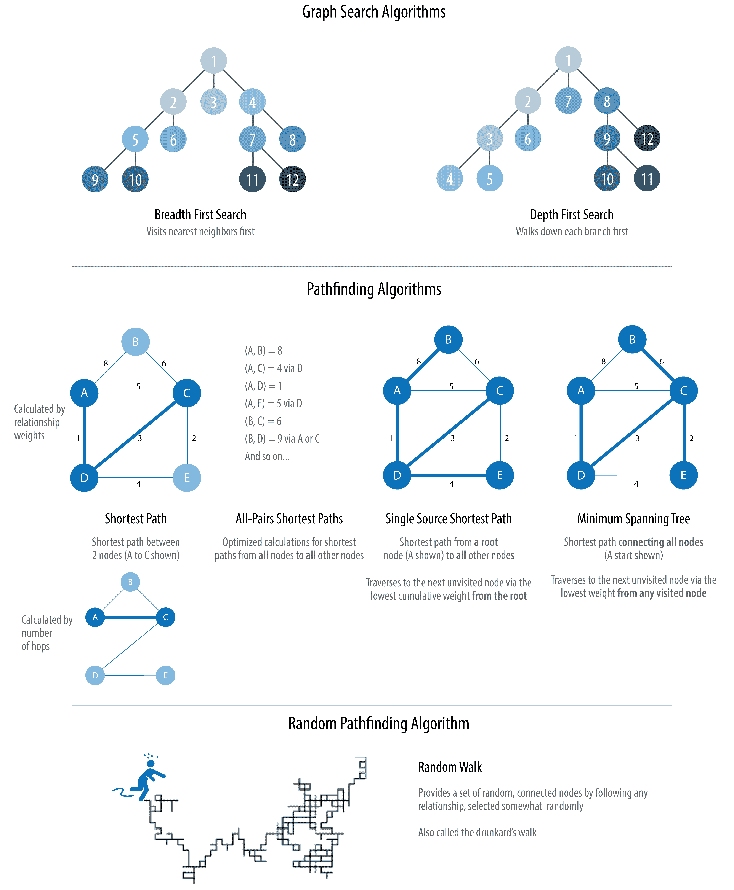
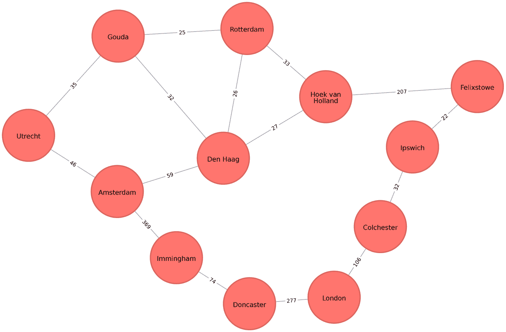
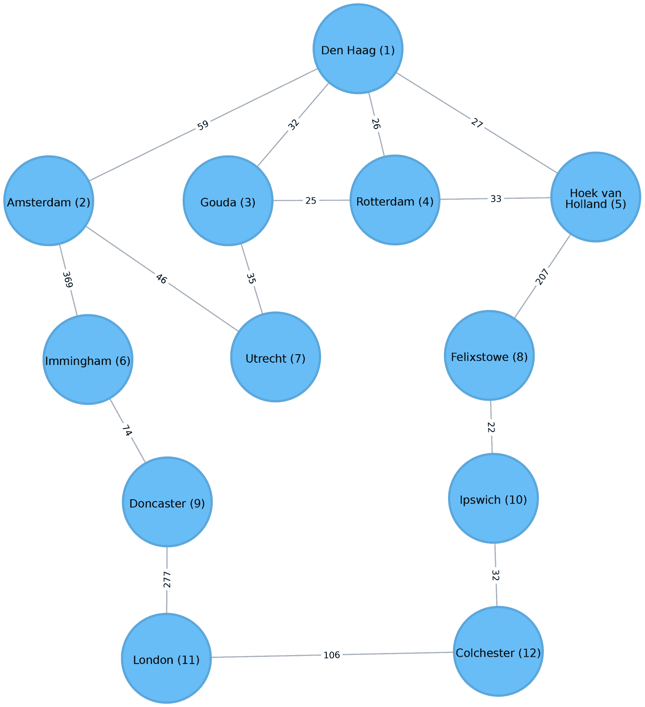
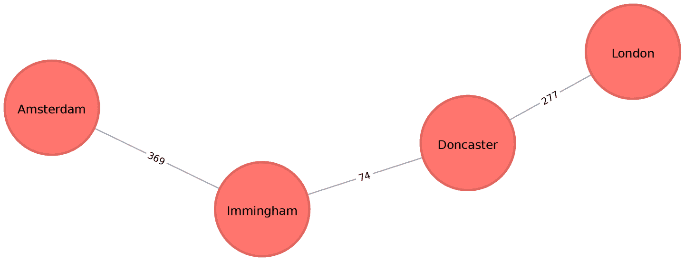
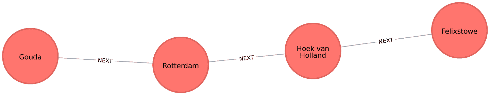
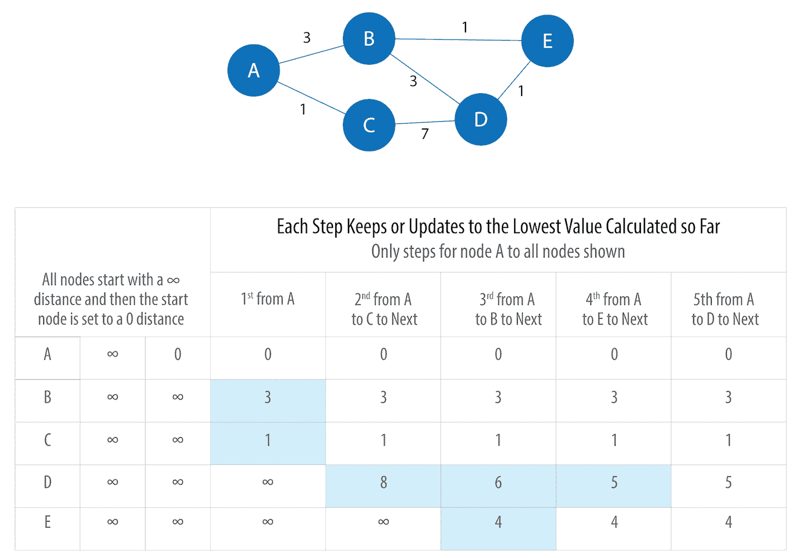
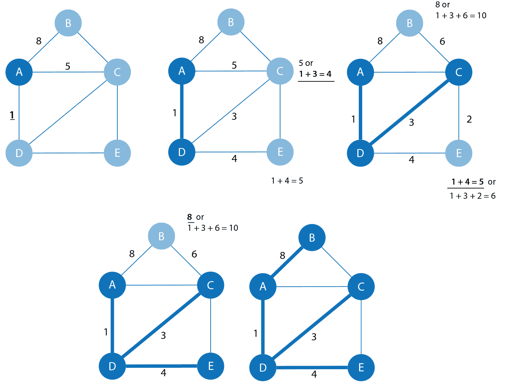
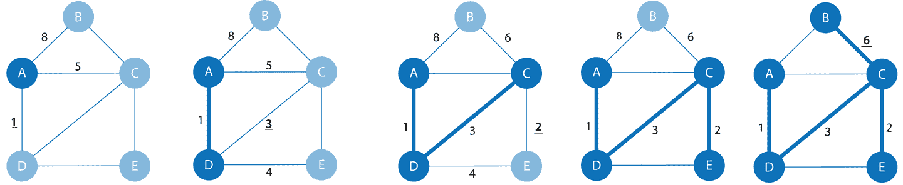
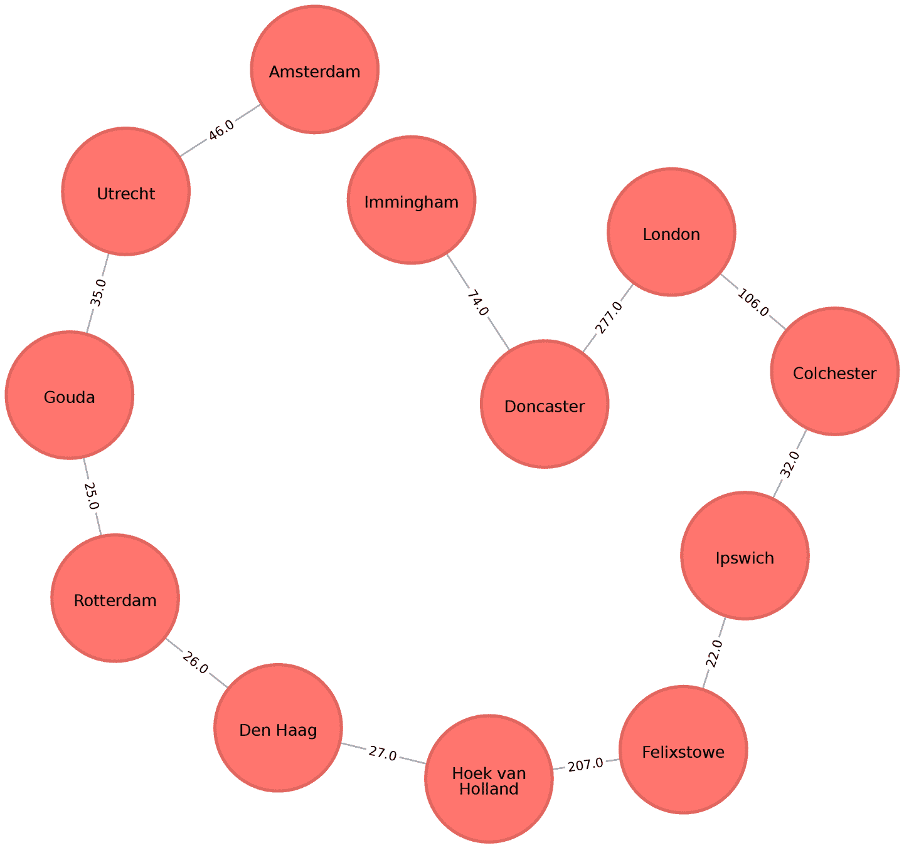
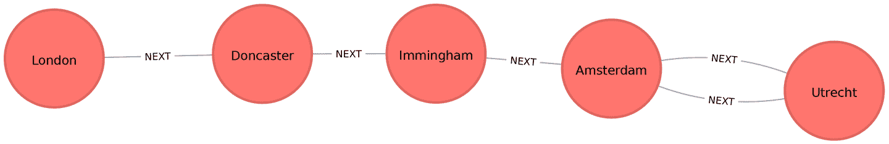

# 第四章：路径查找和图搜索算法

图搜索算法可以探索图的通用发现或显式搜索。这些算法通过图中开辟路径，但不期望这些路径在计算上是最优的。我们将介绍广度优先搜索和深度优先搜索，因为它们是遍历图的基础，通常是许多其他类型分析的必要第一步。

路径查找算法基于图搜索算法构建，并通过从一个节点开始并沿着关系遍历直到达到目的地来探索节点之间的最优路线。这些算法用于识别通过图的最佳路径，例如物流规划、最少成本呼叫或 IP 路由以及游戏仿真。

具体来说，我们将讨论的路径查找算法有：

+   最短路径，带有两个有用的变体（A*和 Yen’s）：查找两个选择节点之间的最短路径或路径

+   全对最短路径和单源最短路径：用于查找所有节点对之间的最短路径或从选定节点到所有其他节点的路径

+   最小生成树：用于查找具有最小访问成本的连接树结构，从选定节点访问所有节点

+   随机漫步：因为它是机器学习工作流程和其他图算法的有用预处理/抽样步骤

在本章中，我们将解释这些算法的工作原理，并展示 Spark 和 Neo4j 中的示例。对于仅在一个平台上可用的算法，我们将提供一个示例或说明如何定制我们的实现。

图 4-1 展示了这些算法类型之间的主要差异，而表 4-1 则是每种算法计算内容及示例用途的快速参考。



###### 图 4-1\. 路径查找和搜索算法

表 4-1\. 路径查找和图搜索算法概述

| 算法类型 | 功能 | 示例用途 | Spark 示例 | Neo4j 示例 |
| --- | --- | --- | --- | --- |

|

广度优先搜索

|

通过扇形扩展以探索最近的邻居及其下一级邻居来遍历树结构

|

在 GPS 系统中定位邻居节点，以识别附近的地点

|

是

|

否

|

|

深度优先搜索

|

通过尽可能远地探索每个分支来遍历树结构，然后回溯

|

在具有层次选择的游戏仿真中发现最优解路径

|

否

|

否

|

|

最短路径

变体：A*，Yen’s

|

计算节点对之间的最短路径

|

在两个位置之间寻找驾驶方向

|

是

|

是

|

|

所有对最短路径

|

计算图中*所有节点对*之间的最短路径

|

在交通堵塞中评估替代路径

|

是

|

是

|

|

单源最短路径

|

计算从*单个根*节点到*所有*其他节点的最短路径

|

电话呼叫的最低成本路由

|

是的

|

是的

|

|

最小生成树

|

计算在连接树结构中访问所有节点的最小成本路径

|

优化连接路由，如布置电缆或垃圾收集

|

否

|

是的

|

|

随机游走

|

返回一条指定大小路径上的节点列表，通过随机选择关系来遍历。

|

为机器学习或图算法的数据增强训练。

|

否

|

是的

|

首先，我们将查看我们示例的数据集，并介绍如何将数据导入 Apache Spark 和 Neo4j。对于每个算法，我们将从算法的简要描述和其操作方式的任何相关信息开始。大多数部分还包括何时使用相关算法的指导。最后，我们提供使用每个算法部分末尾的示例数据集的工作示例代码。

让我们开始吧！

# 示例数据：运输图

所有连接的数据包含节点之间的路径，这就是为什么搜索和路径查找是图分析的起点。交通数据集以直观和易于访问的方式展示这些关系。本章的示例针对包含[欧洲道路网络子集的图](http://www.elbruz.org/e-roads/)。您可以从[书籍的 GitHub 仓库](https://bit.ly/2FPgGVV)下载节点和关系文件。

表 4-2\. *transport-nodes.csv*

| id | 纬度 | 经度 | 人口 |
| --- | --- | --- | --- |
| 阿姆斯特丹 | 52.379189 | 4.899431 | 821752 |
| 乌得勒支 | 52.092876 | 5.104480 | 334176 |
| 海牙 | 52.078663 | 4.288788 | 514861 |
| 伊明厄姆 | 53.61239 | -0.22219 | 9642 |
| 唐卡斯特 | 53.52285 | -1.13116 | 302400 |
| 霍克范霍兰 | 51.9775 | 4.13333 | 9382 |
| 费利克斯托 | 51.96375 | 1.3511 | 23689 |
| 伊普斯维奇 | 52.05917 | 1.15545 | 133384 |
| 科尔切斯特 | 51.88921 | 0.90421 | 104390 |
| 伦敦 | 51.509865 | -0.118092 | 8787892 |
| 鹿特丹 | 51.9225 | 4.47917 | 623652 |
| 古达 | 52.01667 | 4.70833 | 70939 |

表 4-3\. *transport-relationships.csv*

| src | dst | relationship | cost |
| --- | --- | --- | --- |
| 阿姆斯特丹 | 乌得勒支 | EROAD | 46 |
| 阿姆斯特丹 | 海牙 | EROAD | 59 |
| 海牙 | 鹿特丹 | EROAD | 26 |
| 阿姆斯特丹 | 伊明厄姆 | EROAD | 369 |
| 伊明厄姆 | 唐卡斯特 | EROAD | 74 |
| 唐卡斯特 | 伦敦 | EROAD | 277 |
| 霍克范霍兰 | 海牙 | EROAD | 27 |
| 费利克斯托 | 霍克范霍兰 | EROAD | 207 |
| 伊普斯维奇 | 费利克斯托 | EROAD | 22 |
| 科尔切斯特 | 伊普斯维奇 | EROAD | 32 |
| 伦敦 | 科尔切斯特 | EROAD | 106 |
| 古达 | 鹿特丹 | EROAD | 25 |
| 古达 | 乌得勒支 | EROAD | 35 |
| 海牙 | 古达 | EROAD | 32 |
| 霍克范霍兰 | 鹿特丹 | EROAD | 33 |

图 4-2 显示了我们想要构建的目标图。



###### 图 4-2\. 运输图

为简单起见，我们考虑图 4-2 中的图为无向图，因为大多数城市之间的道路都是双向的。如果我们将图视为有向图，由于少量单向街道的存在，结果会略有不同，但总体方法保持相似。然而，Spark 和 Neo4j 都是基于有向图操作的。在像这样希望处理无向图（例如双向道路）的情况下，有一种简单的方法可以实现：

+   对于 Spark，我们将为*transport-relationships.csv*中的每一行创建两个关系——一个从`dst`到`src`，另一个从`src`到`dst`。

+   对于 Neo4j，我们将创建单个关系，然后在运行算法时忽略关系的方向。

理解了这些小建模技巧后，我们现在可以从示例 CSV 文件中加载图到 Spark 和 Neo4j 中。

## 将数据导入 Apache Spark

从 Spark 开始，我们首先从 Spark 和 GraphFrames 包中导入我们需要的包：

```
from pyspark.sql.types import *
from graphframes import *
```

以下函数从示例 CSV 文件创建一个 GraphFrame：

```
def create_transport_graph():
    node_fields = [
        StructField("id", StringType(), True),
        StructField("latitude", FloatType(), True),
        StructField("longitude", FloatType(), True),
        StructField("population", IntegerType(), True)
    ]
    nodes = spark.read.csv("data/transport-nodes.csv", header=True,
                           schema=StructType(node_fields))

    rels = spark.read.csv("data/transport-relationships.csv", header=True)
    reversed_rels = (rels.withColumn("newSrc", rels.dst)
                     .withColumn("newDst", rels.src)
                     .drop("dst", "src")
                     .withColumnRenamed("newSrc", "src")
                     .withColumnRenamed("newDst", "dst")
                     .select("src", "dst", "relationship", "cost"))

    relationships = rels.union(reversed_rels)

    return GraphFrame(nodes, relationships)
```

加载节点很简单，但是对于关系，我们需要进行一些预处理，以便能够创建每个关系两次。

现在让我们调用那个函数：

```
g = create_transport_graph()
```

## 将数据导入 Neo4j

现在是 Neo4j 的时候了。我们将首先加载节点：

```
WITH "https://github.com/neo4j-graph-analytics/book/raw/master/data" AS base
WITH base + "transport-nodes.csv" AS uri
LOAD CSV WITH HEADERS FROM uri AS row
MERGE (place:Place {id:row.id})
SET place.latitude = toFloat(row.latitude),
 place.longitude = toFloat(row.latitude),
 place.population = toInteger(row.population)
```

现在是关系的时候了：

```
WITH "https://github.com/neo4j-graph-analytics/book/raw/master/data/" AS base
WITH base + "transport-relationships.csv" AS uri
LOAD CSV WITH HEADERS FROM uri AS row
MATCH (origin:Place {id: row.src})
MATCH (destination:Place {id: row.dst})
MERGE (origin)-[:EROAD {distance: toInteger(row.cost)}]->(destination)
```

虽然我们存储了有向关系，但是在本章后续执行算法时，我们会忽略方向。

# 广度优先搜索

广度优先搜索（BFS）是基础图遍历算法之一。它从选择的节点开始，先探索所有一跳可达的邻居节点，然后再访问所有两跳可达的邻居节点，以此类推。

该算法最早由 Edward F. Moore 在 1959 年发表，他用它来找出迷宫中的最短路径。后来，C. Y. Lee 将其发展为一种电路布线算法，如[“路径连接算法及其应用”](https://bit.ly/2U1jucF)中描述的那样。

BFS 最常用作其他更目标导向算法的基础。例如，最短路径，连通分量，以及接近中心性都使用 BFS 算法。它还可以用于查找节点之间的最短路径。

图 4-3 显示了如果从荷兰城市海牙（英文名为 The Hague）开始执行广度优先搜索，我们将访问我们的运输图节点的顺序。城市名称旁边的数字表示每个节点访问的顺序。



###### 图 4-3\. 从海牙开始的广度优先搜索。节点数字表示访问顺序。

我们首先访问所有海牙的直接邻居，然后访问它们的邻居及其邻居的邻居，直到我们没有关系可遍历为止。

## 使用 Apache Spark 的广度优先搜索

Spark 的广度优先搜索算法实现通过它们之间的关系数（即跳数）找到两个节点之间的最短路径。您可以明确命名目标节点或添加要满足的条件。

例如，我们可以使用`bfs`函数找到第一个中等规模（按欧洲标准）的城市，其人口介于 10 万到 30 万之间。让我们首先检查哪些地方的人口符合这些标准：

```
(g.vertices
 .filter("population > 100000 and population < 300000")
 .sort("population")
 .show())
```

这是我们将看到的输出：

| id | 纬度 | 经度 | 人口 |
| --- | --- | --- | --- |
| 科尔切斯特 | 51.88921 | 0.90421 | 104390 |
| 伊普斯维奇 | 52.05917 | 1.15545 | 133384 |

根据广度优先搜索，只有两个符合我们条件的地方，我们预计首先到达伊普斯维奇（Ipswich）。

下面的代码找到从海牙到一个中等规模城市的最短路径：

```
from_expr = "id='Den Haag'"
to_expr = "population > 100000 and population < 300000 and id <> 'Den Haag'"
result = g.bfs(from_expr, to_expr)
```

`result`包含描述两个城市之间节点和关系的列。我们可以运行以下代码来查看返回的列列表：

```
print(result.columns)
```

这是我们将看到的输出：

```
['from', 'e0', 'v1', 'e1', 'v2', 'e2', 'to']
```

以`e`开头的列代表关系（边），以`v`开头的列代表节点（顶点）。我们只对节点感兴趣，所以让我们从结果 DataFrame 中过滤掉任何以`e`开头的列：

```
columns = [column for column in result.columns if not column.startswith("e")]
result.select(columns).show()
```

如果我们在 pyspark 中运行此代码，我们将看到以下输出：

| from | v1 | v2 | to |
| --- | --- | --- | --- |
| 海牙, 52.078… | 荷克·范·荷兰… | [费利克斯托… | [伊普斯维奇… |

如预期，`bfs`算法返回了伊普斯维奇！请记住，此函数在找到第一个匹配时满足条件，正如您在[图 4-3 中所看到的，伊普斯维奇在科尔切斯特之前评估。

# 深度优先搜索

深度优先搜索（DFS）是另一种基本的图遍历算法。它从一个选择的节点开始，选择其邻居之一，然后沿着该路径尽可能远地遍历，然后回溯。

DFS 最初是由法国数学家查尔斯·皮埃尔·特雷莫发明的，作为解决迷宫的一种策略。它为情景建模提供了一个有用的工具，用来模拟可能的路径。

图 4-4 显示了如果从海牙开始执行 DFS，我们将访问传输图的节点的顺序。

![gral 0404

###### 图 4-4\. 从海牙开始的深度优先搜索。节点编号指示遍历顺序。

注意相比于 BFS，节点顺序有多不同。对于 DFS，我们从海牙（Den Haag）开始遍历，然后能够到达图中的每个其他节点，而无需回溯！

我们可以看到搜索算法为在图中移动奠定了基础。现在让我们看看路径查找算法，它们以跳数或权重的角度找到最便宜的路径。权重可以是任何度量，例如时间、距离、容量或成本。

# 最短路径

最短路径算法计算一对节点之间的最短（加权）路径。它对用户交互和动态工作流程很有用，因为它实时工作。

路径查找的历史可以追溯到 19 世纪，并被认为是一个经典的图问题。在早期的 1950 年代，它在备用路由的背景下开始引起关注；即，如果最短路径被阻塞，找到次短路径。在 1956 年，Edsger Dijkstra 创建了这些算法中最著名的算法。

Dijkstra 的最短路径算法首先通过找到从起始节点到直接相连节点的最低权重关系来运行。它跟踪这些权重，并移动到“最近”的节点。然后它执行相同的计算，但现在作为从起始节点到目前节点的累积总和。该算法继续这样做，评估一系列累积权重，并始终选择最低加权累积路径前进，直到到达目标节点。

###### 注意

在图分析中，当描述关系和路径时会使用诸如*权重*、*成本*、*距离*和*跳*这样的术语。 “权重”是关系特性的数值值。“成本”类似地使用，但在考虑路径的总权重时我们会更频繁地看到它。

“距离”经常在算法中用作指示横越一对节点的成本的关系属性的名称。这并不要求这是实际的物理距离度量。“跳”通常用来表示两个节点之间的关系数量。你可能会看到这些术语组合在一起，比如“到伦敦的距离是五跳”或“那是距离的最低成本”。

## 何时使用最短路径？

使用最短路径来在一对节点之间找到基于跳数或任何加权关系值的最佳路径。例如，它可以提供与度数分离有关的实时答案、点之间的最短距离或最便宜路径。你也可以使用这种算法来简单地探索特定节点之间的连接。

例子的使用情况包括：

+   在地点之间找到方向。Web 地图工具如 Google 地图使用最短路径算法或类似算法来提供驾驶方向。

+   在社交网络中查找人与人之间的联系度。例如，当你在 LinkedIn 上查看某人的个人资料时，它会指示您在图表中与该人相隔多少人，并列出您共同的连接。

+   根据演员和凯文·培根出演电影的情况找到两者之间的分离度（*培根数*）。可以在[培根数网站](https://oracleofbacon.org)上看到一个例子。[厄尔德什数项目](https://www.oakland.edu/enp)基于与保罗·厄尔德什合作的合作关系提供了类似的图分析，他是二十世纪最多产的数学家之一。

###### 提示

Dijkstra 算法不支持负权重。该算法假定向路径添加关系永远不会使路径变短——这是一个不变量，如果出现负权重将会违反这一假设。

## Neo4j 中的最短路径

Neo4j 图算法库中有一个内置过程，我们可以用来计算无权和加权最短路径。让我们首先学习如何计算无权最短路径。

###### 提示

所有 Neo4j 的最短路径算法都假定底层图是无向的。您可以通过传递参数 `direction: "OUTGOING"` 或 `direction: "INCOMING"` 来覆盖此设置。

要使 Neo4j 的最短路径算法忽略权重，我们需要将`null`作为该过程的第三个参数传递，这表示我们在执行算法时不考虑权重属性。算法将假定每个关系的默认权重为`1.0`：

```
MATCH (source:Place {id: "Amsterdam"}),
 (destination:Place {id: "London"})
CALL algo.shortestPath.stream(source, destination, null)
YIELD nodeId, cost
RETURN algo.getNodeById(nodeId).id AS place, cost
```

此查询返回以下输出：

| 地点 | 费用 |
| --- | --- |
| 阿姆斯特丹 | 0.0 |
| 伊明厄姆 | 1.0 |
| 唐卡斯特 | 2.0 |
| 伦敦 | 3.0 |

这里的成本是关系（或跳数）的累计总数。这与在 Spark 中使用广度优先搜索看到的路径相同。

通过编写一些后处理 Cypher 代码，我们甚至可以计算沿着这条路径的总距离。以下过程计算最短无权路径，然后计算该路径的实际成本：

```
MATCH (source:Place {id: "Amsterdam"}),
 (destination:Place {id: "London"})
CALL algo.shortestPath.stream(source, destination, null)
YIELD nodeId, cost

WITH collect(algo.getNodeById(nodeId)) AS path
UNWIND range(0, size(path)-1) AS index
WITH path[index] AS current, path[index+1] AS next
WITH current, next, [(current)-[r:EROAD]-(next) | r.distance][0] AS distance

WITH collect({current: current, next:next, distance: distance}) AS stops
UNWIND range(0, size(stops)-1) AS index
WITH stops[index] AS location, stops, index
RETURN location.current.id AS place,
       reduce(acc=0.0,
 distance in [stop in stops[0..index] | stop.distance] |
 acc + distance) AS cost
```

如果之前的代码感觉有点笨拙，请注意，最棘手的部分是如何调整数据以包括整个旅程的成本。当我们需要累积路径成本时，这是有帮助的思路。

查询返回以下结果：

| 地点 | 费用 |
| --- | --- |
| 阿姆斯特丹 | 0.0 |
| 伊明厄姆 | 369.0 |
| 唐卡斯特 | 443.0 |
| 伦敦 | 720.0 |

图 4-6 显示了从阿姆斯特丹到伦敦的无权最短路径，通过尽可能少的城市进行路由。总距离为 720 公里。



###### 图 4-6\. 阿姆斯特丹到伦敦之间的无权最短路径

在选择节点访问最少的路径时可能非常有用，比如地铁系统中，尽量减少停靠站点是非常理想的。然而，在驾驶场景中，我们可能更关心使用最短加权路径的总成本。

## 带权最短路径与 Neo4j

我们可以执行带权最短路径算法来找到阿姆斯特丹和伦敦之间的最短路径，如下所示：

```
MATCH (source:Place {id: "Amsterdam"}),
 (destination:Place {id: "London"})
CALL algo.shortestPath.stream(source, destination, "distance")
YIELD nodeId, cost
RETURN algo.getNodeById(nodeId).id AS place, cost
```

传递给该算法的参数是：

`source`

我们的最短路径搜索起始节点

`destination`

我们的最短路径终止节点

`distance`

表示两个节点之间遍历成本的关系属性名称

成本是两个位置之间的公里数。查询返回以下结果：

| 地点 | 成本 |
| --- | --- |
| Amsterdam | 0.0 |
| Den Haag | 59.0 |
| Hoek van Holland | 86.0 |
| Felixstowe | 293.0 |
| Ipswich | 315.0 |
| Colchester | 347.0 |
| London | 453.0 |

最快的路线经过 Den Haag、Hoek van Holland、Felixstowe、Ipswich 和 Colchester！所示成本是随着我们通过城市的进展而累积的总成本。首先，我们从 Amsterdam 到 Den Haag，成本为 59。然后，我们从 Den Haag 到 Hoek van Holland，累积成本为 86，依此类推。最后，我们从 Colchester 到 London，总成本为 453 公里。

请记住，无权重最短路径的总成本为 720 公里，因此在计算最短路径时考虑权重后，我们已经节省了 267 公里。

## 使用 Apache Spark 进行加权最短路径

在 使用 Apache Spark 进行广度优先搜索 部分，我们学习了如何找到两个节点之间的最短路径。那个最短路径基于跳数，因此不同于最短*加权*路径，后者告诉我们城市之间的最短总距离。

如果我们想要找到最短加权路径（在本例中为距离），我们需要使用 `cost` 属性，该属性用于各种加权类型。GraphFrames 并没有直接提供此选项，因此我们需要编写自己版本的加权最短路径，利用其 [`aggregateMessages` 框架](https://bit.ly/2JCFBRJ)。我们大多数的 Spark 算法示例使用库中的简单过程调用，但我们可以选择编写自己的函数。有关 `aggregateMessages` 的更多信息，请参见 GraphFrames 用户指南中的 [“通过 AggregateMessages 进行消息传递”](http://bit.ly/2Wo6Hxg) 部分。

###### 提示

在可用时，我们建议利用现有的、经过测试的库。编写自己的函数，尤其是更复杂的算法，需要对数据和计算有更深入的理解。

以下示例应视为参考实现，运行在更大数据集上之前需要进行优化。对于不希望编写自己函数的人可以跳过此示例。

在创建函数之前，我们将导入一些将要使用的库：

```
from graphframes.lib import AggregateMessages as AM
from pyspark.sql import functions as F
```

`Aggregate_Messages` 模块是 GraphFrames 库的一部分，包含一些有用的辅助函数。

现在让我们编写我们的函数。首先，我们创建一个用户定义的函数，用于构建源和目标之间的路径：

```
add_path_udf = F.udf(lambda path, id: path + [id], ArrayType(StringType()))
```

现在是主要函数，它从起始点开始计算最短路径，并在访问目的地后返回：

```
def shortest_path(g, origin, destination, column_name="cost"):
    if g.vertices.filter(g.vertices.id == destination).count() == 0:
        return (spark.createDataFrame(sc.emptyRDD(), g.vertices.schema)
                .withColumn("path", F.array()))

    vertices = (g.vertices.withColumn("visited", F.lit(False))
                .withColumn("distance", F.when(g.vertices["id"] == origin, 0)
                            .otherwise(float("inf")))
                .withColumn("path", F.array()))
    cached_vertices = AM.getCachedDataFrame(vertices)
    g2 = GraphFrame(cached_vertices, g.edges)

    while g2.vertices.filter('visited == False').first():
        current_node_id = g2.vertices.filter('visited == False').sort
                                            ("distance").first().id

        msg_distance = AM.edge[column_name] + AM.src['distance']
        msg_path = add_path_udf(AM.src["path"], AM.src["id"])
        msg_for_dst = F.when(AM.src['id'] == current_node_id,
                             F.struct(msg_distance, msg_path))
        new_distances = g2.aggregateMessages(F.min(AM.msg).alias("aggMess"),
                                             sendToDst=msg_for_dst)

        new_visited_col = F.when(
            g2.vertices.visited | (g2.vertices.id == current_node_id),
                                                True).otherwise(False)
        new_distance_col = F.when(new_distances["aggMess"].isNotNull() &
                                 (new_distances.aggMess["col1"]
                                 < g2.vertices.distance),
                                 new_distances.aggMess["col1"])
                                 .otherwise(g2.vertices.distance)
        new_path_col = F.when(new_distances["aggMess"].isNotNull() &
                       (new_distances.aggMess["col1"]
                       < g2.vertices.distance), new_distances.aggMess["col2"]
                       .cast("array<string>")).otherwise(g2.vertices.path)

        new_vertices = (g2.vertices.join(new_distances, on="id",
                                         how="left_outer")
                        .drop(new_distances["id"])
                        .withColumn("visited", new_visited_col)
                        .withColumn("newDistance", new_distance_col)
                        .withColumn("newPath", new_path_col)
                        .drop("aggMess", "distance", "path")
                        .withColumnRenamed('newDistance', 'distance')
                        .withColumnRenamed('newPath', 'path'))
        cached_new_vertices = AM.getCachedDataFrame(new_vertices)
        g2 = GraphFrame(cached_new_vertices, g2.edges)
        if g2.vertices.filter(g2.vertices.id == destination).first().visited:
            return (g2.vertices.filter(g2.vertices.id == destination)
                    .withColumn("newPath", add_path_udf("path", "id"))
                    .drop("visited", "path")
                    .withColumnRenamed("newPath", "path"))
    return (spark.createDataFrame(sc.emptyRDD(), g.vertices.schema)
            .withColumn("path", F.array()))
```

###### 警告

如果我们在函数中存储任何 DataFrame 的引用，我们需要使用`AM.getCachedDataFrame`函数对其进行缓存，否则在执行过程中可能会遇到内存泄漏问题。在`shortest_path`函数中，我们使用这个函数来缓存`vertices`和`new_vertices`的 DataFrames。

如果我们想找到阿姆斯特丹和科尔切斯特之间的最短路径，我们可以这样调用该函数：

```
result = shortest_path(g, "Amsterdam", "Colchester", "cost")
result.select("id", "distance", "path").show(truncate=False)
```

这将返回以下结果：

| id | distance | path |
| --- | --- | --- |
| 科尔切斯特 | 347.0 | [阿姆斯特丹，海牙，胡克范荷兰，费利克斯托，伊普斯维奇，科尔切斯特] |

从阿姆斯特丹到科尔切斯特的最短路径总距离为 347 公里，经过海牙，胡克范荷兰，费利克斯托和伊普斯维奇。相比之下，根据地点之间关系数量计算的最短路径，我们使用了 Breadth First Search 算法（参见图 4-4），会经过英格兰的伊明厄姆，唐卡斯特和伦敦。

## 最短路径变体：A*

A*最短路径算法通过允许包含额外信息，作为启发式函数的一部分，更快地找到最短路径，改进了 Dijkstra 算法。

该算法由彼得·哈特，尼尔斯·尼尔森和伯特拉姆·拉斐尔发明，并在他们 1968 年的论文[“启发式确定最小成本路径的形式基础”](https://bit.ly/2JAaV3s)中描述。

A*算法通过在其主循环的每次迭代中确定要扩展的部分路径来操作。它基于到达目标节点仍然需要的成本估计（启发式）。

###### 警告

要考虑估算路径成本的启发式函数。低估路径成本可能会不必要地包含一些本可以被排除的路径，但结果仍然准确。然而，如果启发式函数高估路径成本，则可能会跳过实际上更短的路径（错误地估计为更长的路径），这会导致不准确的结果。

A*选择最小化以下函数的路径：

```
`f(n) = g(n) + h(n)`
```

where:

+   `g(n)`是从起点到节点`n`的路径成本。

+   `h(n)`是从节点`n`到目标节点的路径的预估成本，由启发式函数计算。

###### 注意

在 Neo4j 的实现中，地理空间距离被用作启发式函数的一部分。在我们的示例运输数据集中，我们使用每个位置的纬度和经度作为启发式函数的一部分。

### 使用 Neo4j 的 A*

以下查询执行 A*算法以找到阿姆斯特丹和伦敦之间的最短路径：

```
MATCH (source:Place {id: "Den Haag"}),
 (destination:Place {id: "London"})
CALL algo.shortestPath.astar.stream(source,
 destination, "distance", "latitude", "longitude")
YIELD nodeId, cost
RETURN algo.getNodeById(nodeId).id AS place, cost
```

传递给此算法的参数是：

`source`

我们最短路径搜索开始的节点。

`destination`

我们最短路径搜索结束的节点。

`distance`

指示两个节点之间遍历成本的关系属性名称。成本是两个位置之间的公里数。

`纬度`

用于表示每个节点纬度的节点属性名称，作为地理空间启发式计算的一部分。

`经度`

用于表示每个节点经度的节点属性名称，作为地理空间启发式计算的一部分。

运行此过程将得到以下结果：

| 地点 | 成本 |
| --- | --- |
| 海牙 | 0.0 |
| 霍克范荷兰 | 27.0 |
| 费利克斯托 | 234.0 |
| 伊普斯维奇 | 256.0 |
| 科尔切斯特 | 288.0 |
| 伦敦 | 394.0 |

在更复杂的数据集上，A* 算法会比最短路径算法更快，因为它评估的路径更少。

## 最短路径变体：Yen 的 k 最短路径

Yen 的 *k* 最短路径算法类似于最短路径算法，但不仅仅是找到两个节点之间的最短路径，还计算第二短路径、第三短路径等，直到第 *k*-1 短路径。

金·Y·延于 1971 年发明了该算法，并在[“在网络中找到 *K* 个最短非循环路径”](https://bit.ly/2HS0eXB)中描述了它。当我们不仅仅需要找到绝对最短路径时，此算法非常有用，特别是当我们需要多个备用方案时！

### 与 Neo4j 的 Yen 算法

以下查询执行 Yen 算法来找到古达和费利克斯托之间的最短路径：

```
MATCH (start:Place {id:"Gouda"}),
 (end:Place {id:"Felixstowe"})
CALL algo.kShortestPaths.stream(start, end, 5, "distance")
YIELD index, nodeIds, path, costs
RETURN index,
 [node in algo.getNodesById(nodeIds[1..-1]) | node.id] AS via,
       reduce(acc=0.0, cost in costs | acc + cost) AS totalCost
```

传递给此算法的参数包括：

`start`

我们最短路径搜索开始的节点。

`end`

我们最短路径搜索结束的节点。

`5`

要找到的最大最短路径数量。

`距离`

表示两个位置之间遍历成本的关系属性名称。成本是两个位置之间的公里数。

在我们获得最短路径后，我们查找每个节点 ID 的关联节点，然后从集合中过滤出起点和终点节点。

运行此过程将得到以下结果：

| 索引 | 经由 | 总成本 |
| --- | --- | --- |
| 0 | [鹿特丹, 霍克范荷兰] | 265.0 |
| 1 | [海牙, 霍克范荷兰] | 266.0 |
| 2 | [鹿特丹, 海牙, 霍克范荷兰] | 285.0 |
| 3 | [海牙, 鹿特丹, 霍克范荷兰] | 298.0 |
| 4 | [乌得勒支, 阿姆斯特丹, 海牙, 霍克范荷兰] | 374.0 |

图 4-7 展示了从古达到费利克斯托的最短路径。



###### 图 4-7\. 古达和费利克斯托之间的最短路径

图 4-7 中的最短路径与按总成本排序的结果比较有趣。它说明有时您可能需要考虑多条最短路径或其他参数。在这个例子中，第二短路径仅比最短路径长 1 公里。如果我们更喜欢风景，我们可能会选择稍长的路线。

# 全对最短路径

全对最短路径（APSP）算法计算所有节点对之间的最短（加权）路径。它比在图中每对节点运行单源最短路径算法更有效。

APSP 通过跟踪到目前为止计算的距离并在节点上并行运行来优化操作。在计算到未见节点的最短路径时，可以重复使用这些已知的距离。你可以在接下来的部分中参考示例，更好地理解算法的工作原理。

###### 注意

有些节点对可能彼此不可达，这意味着这些节点之间没有最短路径。算法不返回这些节点对的距离。

## 更详细地查看全对最短路径

当您按照操作序列进行时，全对最短路径的计算最容易理解。图 Figure 4-8 中的图示展示了节点 A 的步骤。



###### 图 4-8\. 计算从节点 A 到所有其他节点的最短路径的步骤，已进行阴影更新。

最初，算法假设到所有节点的距离是无限的。当选择了一个起始节点时，到该节点的距离被设置为 0。然后计算继续进行如下：

1.  从起始节点 A 开始，我们评估移动到可以到达的节点的成本并更新这些值。在寻找最小值时，我们可以选择 B（成本为 3）或 C（成本为 1）。C 被选为下一个遍历阶段的节点。

1.  现在从节点 C 开始，算法更新从 A 直接到达节点的累积距离。只有在找到更低成本时才会更新值：

    ```
    A=0, B=3, C=1, D=8, E=∞
    ```

1.  然后选择 B 作为下一个最接近的尚未访问的节点。它与节点 A、D 和 E 有关系。算法通过将从 A 到 B 的距离与从 B 到这些节点的距离相加来计算到这些节点的距离。请注意，从起始节点 A 到当前节点的最低成本始终保留为固定成本。距离（d）计算结果：

    ```
    d(A,A) = d(A,B) + d(B,A) = 3 + 3 = 6
    d(A,D) = d(A,B) + d(B,D) = 3 + 3 = 6
    d(A,E) = d(A,B) + d(B,E) = 3 + 1 = 4
    ```

    +   在这一步中，从节点 A 到 B，然后返回 A 的距离，表示为 d(A,A) = 6，大于已计算的最短距离（0），因此其值不会更新。

    +   节点 D（6）和 E（4）的距离小于先前计算的距离，因此它们的值被更新。

1.  接下来选择 E。现在只有到达 D 的累积总数（5）更低，因此只更新它。

1.  当最终评估 D 时，没有新的最小路径权重；没有更新，算法终止。

###### 提示

即使全对最短路径算法已经优化为对每个节点并行运行计算，但对于非常大的图表，这仍可能增加。如果只需要评估子类节点之间的路径，请考虑使用子图。

## 何时应该使用全对最短路径？

全对最短路径通常用于了解当最短路径被阻塞或变得次优时的备用路由。例如，该算法用于逻辑路由规划，以确保多样化路由的最佳多条路径。在需要考虑所有节点之间所有可能路径时，请使用全对最短路径。

示例用例包括：

+   优化城市设施的位置和货物的分布。其中一个例子是确定预期在交通网格不同部分的交通负载。有关更多信息，请参阅 R. C. Larson 和 A. R. Odoni 的书籍*Urban Operations Research*（Prentice-Hall）。

+   在数据中心设计算法的一部分中找到带宽最大且延迟最小的网络。有关此方法的更多详细信息，请参阅 A. R. Curtis 等人的论文 [“REWIRE: An Optimization-Based Framework for Data Center Network Design”](https://bit.ly/2HTbhzY)。

## 通过 Apache Spark 进行全对最短路径

Spark 的`shortestPaths`函数旨在查找从所有节点到一组称为*地标*的节点的最短路径。如果我们想找到每个位置到 Colchester、Immingham 和 Hoek van Holland 的最短路径，我们将编写以下查询：

```
result = g.shortestPaths(["Colchester", "Immingham", "Hoek van Holland"])
result.sort(["id"]).select("id", "distances").show(truncate=False)
```

如果我们在 pyspark 中运行该代码，我们将看到以下输出：

| id | distances |
| --- | --- |
| 阿姆斯特丹 | [Immingham → 1, Hoek van Holland → 2, Colchester → 4] |
| Colchester | [Colchester → 0, Hoek van Holland → 3, Immingham → 3] |
| 海牙 | [Hoek van Holland → 1, Immingham → 2, Colchester → 4] |
| 唐卡斯特 | [Immingham → 1, Colchester → 2, Hoek van Holland → 4] |
| 费利克斯托 | [Hoek van Holland → 1, Colchester → 2, Immingham → 4] |
| Gouda | [Hoek van Holland → 2, Immingham → 3, Colchester → 5] |
| 霍克港 | [Hoek van Holland → 0, Immingham → 3, Colchester → 3] |
| 伊明厄姆 | [Immingham → 0, Colchester → 3, Hoek van Holland → 3] |
| 伊普斯维奇 | [Colchester → 1, Hoek van Holland → 2, Immingham → 4] |
| 伦敦 | [Colchester → 1, Immingham → 2, Hoek van Holland → 4] |
| 鹿特丹 | [Hoek van Holland → 1, Immingham → 3, Colchester → 4] |
| 乌特勒支 | [Immingham → 2, Hoek van Holland → 3, Colchester → 5] |

`distances`列中每个位置旁边的数字是我们需要从源节点穿越的城市之间关系（道路）的数量。在我们的示例中，Colchester 是我们的目标城市之一，您可以看到它到自身的距离为 0，但从 Immingham 和 Hoek van Holland 出发需要 3 跳。如果我们计划旅行，我们可以使用这些信息来帮助最大化在我们选择的目的地停留的时间。

## 使用 Neo4j 的全对最短路径

Neo4j 具有全对最短路径算法的并行实现，可以返回每对节点之间的距离。

此过程的第一个参数是要用于计算最短加权路径的属性。如果我们将其设置为 `null`，则算法将计算所有节点对之间的非加权最短路径。

以下查询执行此操作：

```
CALL algo.allShortestPaths.stream(null)
YIELD sourceNodeId, targetNodeId, distance
WHERE sourceNodeId < targetNodeId
RETURN algo.getNodeById(sourceNodeId).id AS source,
 algo.getNodeById(targetNodeId).id AS target,
 distance
ORDER BY distance DESC
LIMIT 10
```

该算法返回每对节点之间的最短路径两次——每次以其中一个节点作为源节点。如果您正在评估单向街道的有向图，这将非常有用。然而，我们不需要看到每条路径两次，因此我们通过使用 `sourceNodeId < targetNodeId` 谓词来过滤结果，仅保留其中一条路径。

查询返回以下结果：

| 源 | 目标 | 距离 |
| --- | --- | --- |
| 科尔切斯特 | 乌得勒支 | 5.0 |
| 伦敦 | 鹿特丹 | 5.0 |
| 伦敦 | 古达 | 5.0 |
| 伊普斯维奇 | 乌得勒支 | 5.0 |
| 科尔切斯特 | 古达 | 5.0 |
| 科尔切斯特 | 海牙 | 4.0 |
| 伦敦 | 乌得勒支 | 4.0 |
| 伦敦 | 海牙 | 4.0 |
| 科尔切斯特 | 阿姆斯特丹 | 4.0 |
| 伊普斯维奇 | 古达 | 4.0 |

此输出显示了具有最多关系的 10 对地点，因为我们要求按降序（`DESC`）显示结果。

如果我们想计算最短加权路径，而不是将第一个参数设置为 `null`，我们可以传递包含在最短路径计算中要使用的 `cost` 的属性名称。然后将评估此属性以计算每对节点之间的最短加权路径。

以下查询执行此操作：

```
CALL algo.allShortestPaths.stream("distance")
YIELD sourceNodeId, targetNodeId, distance
WHERE sourceNodeId < targetNodeId
RETURN algo.getNodeById(sourceNodeId).id AS source,
 algo.getNodeById(targetNodeId).id AS target,
 distance
ORDER BY distance DESC
LIMIT 10
```

查询返回以下结果：

| 源 | 目标 | 距离 |
| --- | --- | --- |
| 唐卡斯特 | 霍克范霍兰 | 529.0 |
| 鹿特丹 | 唐卡斯特 | 528.0 |
| 古达 | 唐卡斯特 | 524.0 |
| 费利克斯托 | 伊明厄姆 | 511.0 |
| 海牙 | 唐卡斯特 | 502.0 |
| 伊普斯维奇 | 伊明厄姆 | 489.0 |
| 乌得勒支 | 唐卡斯特 | 489.0 |
| 伦敦 | 乌得勒支 | 460.0 |
| 科尔切斯特 | 伊明厄姆 | 457.0 |
| 伊明厄姆 | 霍克范霍兰 | 455.0 |

现在我们看到了距离最远的 10 对地点，其总距离最长。注意到唐卡斯特经常出现，还有荷兰的几个城市。如果我们想在这些地区之间进行一次公路旅行，看起来会是一段漫长的车程。

# 单源最短路径

单源最短路径（SSSP）算法与迪杰斯特拉最短路径算法几乎同时兴起，是这两个问题的实现。

SSSP 算法计算图中从根节点到所有其他节点的最短（加权）路径，如 图 4-9 所示。



###### 图 4-9\. 单源最短路径算法的步骤

过程如下：

1.  它从一个根节点开始，所有路径将从此节点开始测量。在 图 4-9 中，我们选择节点 A 作为根节点。

1.  选择从根节点到该根节点的最小权重关系，并将其与连接的节点一起添加到树中。在这种情况下，这是 d(A,D)=1。

1.  接下来选择与从我们的根节点到任何未访问节点的累积权重最小的关系，并以相同的方式将其添加到树中。我们在图 4-9 中的选择是 d(A,B)=8, d(A,C)=5 直接或经过 A-D-C 的 4，以及 d(A,E)=5。因此，选择经过 A-D-C 的路径，将 C 添加到我们的树中。

1.  这个过程一直持续到没有更多的节点可添加，我们就得到了我们的单源最短路径。

## 何时应该使用单源最短路径？

当您需要评估从固定起点到所有其他各个节点的最优路径时，请使用单源最短路径。由于路由是基于从根节点到目标节点的总路径权重选择的，因此它对于找到到每个节点的最佳路径很有用，但不一定适用于需要在单次行程中访问所有节点的情况。

例如，单源最短路径对于确定紧急服务的主要路线很有帮助，其中您不会在每次事件中访问每个位置，但对于找到垃圾收集的单一路线就不适用，因为您需要在一次旅行中访问每个房子。（在后一种情况下，您会使用稍后介绍的最小生成树算法。）

示例用例包括：

+   检测拓扑结构的变化，如链路故障，并且在几秒钟内[建议新的路由结构](https://bit.ly/2HL7ndd)。

+   作为 IP 路由协议使用迪杰斯特拉，用于自治系统，例如[局域网（LAN）](https://bit.ly/2HUsAAr)。

## 使用 Apache Spark 进行单源最短路径

我们可以修改我们编写的`shortest_path`函数，以便从一个位置到所有其他位置返回最短路径，而不是计算两个位置之间的最短加权路径。请注意，我们再次使用 Spark 的`aggregateMessages`框架来定制我们的函数。

我们首先导入与之前相同的库：

```
from graphframes.lib import AggregateMessages as AM
from pyspark.sql import functions as F
```

我们将使用同样的用户定义函数来构建路径：

```
add_path_udf = F.udf(lambda path, id: path + [id], ArrayType(StringType()))
```

现在是主要函数，它从一个起始点开始计算最短路径：

```
def sssp(g, origin, column_name="cost"):
    vertices = g.vertices \
        .withColumn("visited", F.lit(False)) \
        .withColumn("distance",
            F.when(g.vertices["id"] == origin, 0).otherwise(float("inf"))) \
        .withColumn("path", F.array())
    cached_vertices = AM.getCachedDataFrame(vertices)
    g2 = GraphFrame(cached_vertices, g.edges)

    while g2.vertices.filter('visited == False').first():
        current_node_id = g2.vertices.filter('visited == False')
                            .sort("distance").first().id

        msg_distance = AM.edge[column_name] + AM.src['distance']
        msg_path = add_path_udf(AM.src["path"], AM.src["id"])
        msg_for_dst = F.when(AM.src['id'] == current_node_id,
                      F.struct(msg_distance, msg_path))
        new_distances = g2.aggregateMessages(
            F.min(AM.msg).alias("aggMess"), sendToDst=msg_for_dst)

        new_visited_col = F.when(
            g2.vertices.visited | (g2.vertices.id == current_node_id),
                                  True).otherwise(False)
        new_distance_col = F.when(new_distances["aggMess"].isNotNull() &
                                  (new_distances.aggMess["col1"] <
                                  g2.vertices.distance),
                                  new_distances.aggMess["col1"]) \
                                  .otherwise(g2.vertices.distance)
        new_path_col = F.when(new_distances["aggMess"].isNotNull() &
                              (new_distances.aggMess["col1"] <
                              g2.vertices.distance),
                              new_distances.aggMess["col2"]
                              .cast("array<string>")) \
                              .otherwise(g2.vertices.path)

        new_vertices = g2.vertices.join(new_distances, on="id",
                                        how="left_outer") \
            .drop(new_distances["id"]) \
            .withColumn("visited", new_visited_col) \
            .withColumn("newDistance", new_distance_col) \
            .withColumn("newPath", new_path_col) \
            .drop("aggMess", "distance", "path") \
            .withColumnRenamed('newDistance', 'distance') \
            .withColumnRenamed('newPath', 'path')
        cached_new_vertices = AM.getCachedDataFrame(new_vertices)
        g2 = GraphFrame(cached_new_vertices, g2.edges)

    return g2.vertices \
                .withColumn("newPath", add_path_udf("path", "id")) \
                .drop("visited", "path") \
                .withColumnRenamed("newPath", "path")
```

如果我们想要找到从阿姆斯特丹到所有其他位置的最短路径，我们可以像这样调用函数：

```
via_udf = F.udf(lambda path: path[1:-1], ArrayType(StringType()))
```

```
result = sssp(g, "Amsterdam", "cost")
(result
 .withColumn("via", via_udf("path"))
 .select("id", "distance", "via")
 .sort("distance")
 .show(truncate=False))
```

我们定义另一个用户定义的函数，用于从结果路径中过滤出起点和终点节点。如果我们运行该代码，将会看到以下输出：

| id | distance | via |
| --- | --- | --- |
| 阿姆斯特丹 | 0.0 | [] |
| 乌特勒支 | 46.0 | [] |
| 海牙 | 59.0 | [] |
| 古达 | 81.0 | [乌特勒支] |
| 鹿特丹 | 85.0 | [海牙] |
| 胡克港 | 86.0 | [海牙] |
| 费利克斯托 | 293.0 | [海牙，胡克港] |
| 伊普斯维奇 | 315.0 | [海牙，胡克港，费利克斯托] |
| 科尔切斯特 | 347.0 | [海牙，胡克港，费利克斯托，伊普斯维奇] |
| 伊明厄姆 | 369.0 | [] |
| 唐卡斯特 | 443.0 | [伊明厄姆] |
| 伦敦 | 453.0 | [海牙，胡克港，费利克斯托，伊普斯维奇，科尔切斯特] |

在这些结果中，我们看到从根节点阿姆斯特丹到图中所有其他城市的物理距离，按最短距离排序。

## Neo4j 单源最短路径

Neo4j 实现了 SSSP 的一种变体，称为[Delta-Stepping 算法](https://bit.ly/2UaCHrw)，将迪杰斯特拉算法分成多个可以并行执行的阶段。

下面的查询执行 Delta-Stepping 算法：

```
MATCH (n:Place {id:"London"})
CALL algo.shortestPath.deltaStepping.stream(n, "distance", 1.0)
YIELD nodeId, distance
WHERE algo.isFinite(distance)
RETURN algo.getNodeById(nodeId).id AS destination, distance
ORDER BY distance
```

查询返回以下输出：

| 目的地 | 距离 |
| --- | --- |
| 伦敦 | 0.0 |
| 科尔切斯特 | 106.0 |
| 伊普斯维奇 | 138.0 |
| 费利克斯托 | 160.0 |
| 唐卡斯特 | 277.0 |
| 伊明汉姆 | 351.0 |
| 霍克范霍兰 | 367.0 |
| 海牙 | 394.0 |
| 鹿特丹 | 400.0 |
| 根达 | 425.0 |
| 阿姆斯特丹 | 453.0 |
| 乌得勒支 | 460.0 |

在这些结果中，我们看到从根节点伦敦到图中所有其他城市的物理距离，按最短距离排序。

# 最小生成树

最小（权重）生成树算法从给定节点开始，找到所有可达节点及将节点以最小可能权重连接的关系集合。它从任何访问过的节点到下一个未访问节点以最低权重遍历，避免循环。

第一个已知的最小权重生成树算法由捷克科学家奥塔卡尔·博鲁沃卡（Otakar Borůvka）于 1926 年开发。普里姆算法，于 1957 年发明，是最简单和最著名的。

普里姆算法类似于迪杰斯特拉最短路径算法，但它不是最小化到达每个关系的路径总长度，而是最小化每个关系的长度。与迪杰斯特拉算法不同的是，它能容忍负权重关系。

最小生成树算法的操作如图 4-10 所示。



###### 图 4-10\. 最小生成树算法的步骤

步骤如下：

1.  它始于一个仅包含一个节点的树。在图 4-10 中，我们从节点 A 开始。

1.  选择从该节点出发的具有最小权重的关系，并将其添加到树中（以及其连接的节点）。在这种情况下，A-D。

1.  该过程重复进行，始终选择连接到树中尚未存在的节点的最小权重关系。

    1.  如果你比较我们这里的例子与图 4-9 中的单源最短路径例子，你会注意到在第四个图中路径变得不同。这是因为单源最短路径基于从根节点累积总和评估最短路径，而最小生成树仅查看下一步的成本。

1.  当没有更多节点可添加时，树就是最小生成树。

这个算法也有找到最大权重生成树（最高成本树）和*k*-生成树（限制树大小）的变体。

## 何时使用最小生成树？

当您需要最佳路线访问所有节点时，请使用最小生成树。因为路线是基于每个下一步的成本选择的，所以当您必须在一次行走中访问所有节点时非常有用。（如果您不需要一条单程路线，请查看之前关于“单源最短路径”的部分。）

您可以将此算法用于优化连接系统的路径，如水管和电路设计。它还用于近似某些具有未知计算时间的问题，例如旅行推销员问题和某些类型的舍入问题。尽管它可能并不总是找到绝对最佳解决方案，但此算法使潜在复杂且计算密集的分析变得更易接近。

示例用例包括：

+   最小化探索一个国家的旅行成本。 [“最小生成树在旅行规划中的应用”](https://bit.ly/2CQBs6Q) 描述了该算法分析航空和海上连接来实现这一目的。

+   可视化货币回报之间的相关性。这在[“货币市场中最小生成树应用”](https://bit.ly/2HFbGGG)中有描述。

+   追踪爆发中传染传播的历史。有关更多信息，请参阅[“使用最小生成树模型进行医院暴发的丙型肝炎病毒感染分子流行病学调查”](https://bit.ly/2U7SR4Y)。

###### 警告

当在具有不同权重的关系的图上运行时，最小生成树算法仅在求得有意义的结果时才有效。如果图中没有权重，或所有关系具有相同的权重，则任何生成树都是最小生成树。

## Neo4j 中的最小生成树

让我们看看最小生成树算法的实际运作。以下查询从阿姆斯特丹开始查找一个生成树：

```
MATCH (n:Place {id:"Amsterdam"})
CALL algo.spanningTree.minimum("Place", "EROAD", "distance", id(n),
 {write:true, writeProperty:"MINST"})
YIELD loadMillis, computeMillis, writeMillis, effectiveNodeCount
RETURN loadMillis, computeMillis, writeMillis, effectiveNodeCount
```

传递给该算法的参数包括：

`Place`

计算生成树时要考虑的节点标签

`EROAD`

计算生成树时要考虑的关系类型

`distance`

指示穿越一对节点之间的成本的关系属性的名称

`id(n)`

应该从哪个节点开始生成树的内部节点 ID

此查询将结果存储在图中。如果我们想返回最小权重生成树，则可以运行以下查询：

```
MATCH path = (n:Place {id:"Amsterdam"})-[:MINST*]-()
WITH relationships(path) AS rels
UNWIND rels AS rel
WITH DISTINCT rel AS rel
RETURN startNode(rel).id AS source, endNode(rel).id AS destination,
                                    rel.distance AS cost
```

这是查询的输出：

| 起点 | 终点 | 成本 |
| --- | --- | --- |
| 阿姆斯特丹 | 乌得勒支 | 46.0 |
| 乌得勒支 | 古达 | 35.0 |
| 古达 | 鹿特丹 | 25.0 |
| 鹿特丹 | 海牙 | 26.0 |
| 海牙 | 霍克范荷兰 | 27.0 |
| 霍克范荷兰 | 费利克斯托 | 207.0 |
| 费利克斯托 | 伊普斯维奇 | 22.0 |
| 伊普斯维奇 | 科尔切斯特 | 32.0 |
| 科尔切斯特 | 伦敦 | 106.0 |
| 伦敦 | 唐卡斯特 | 277.0 |
| 唐卡斯特 | 伊明厄姆 | 74.0 |



###### 图 4-11\. 来自阿姆斯特丹的最小权重生成树

如果我们在阿姆斯特丹，并希望在同一次旅行中访问数据集中的每个其他地方，图 4-11 展示了实现最短连续路径的方法。

# 随机游走

随机游走算法在图中提供了一组节点上的随机路径。这个术语最早由卡尔·皮尔逊在 1905 年写给《自然》杂志的一封信中提到，题为 [“随机游走问题”](https://go.nature.com/2Fy15em)。尽管这个概念更早存在，但直到近年来，随机游走才被应用于网络科学。

总的来说，随机游走有时被描述为类似于醉酒者如何穿越城市。他们知道他们想要到达的方向或终点，但可能会采取非常迂回的路线来到达那里。

算法从一个节点开始，有点随机地沿着一个关系向前或向后到一个相邻节点。然后它从那个节点继续，以此类推，直到达到设定的路径长度。（我们说有点随机是因为节点的关系数以及其邻居的关系数会影响节点被遍历的概率。）

## 我们何时应该使用随机游走？

当您需要生成一个大部分随机连接节点的集合时，作为其他算法或数据流水线的一部分使用随机游走算法。

示例用例包括：

+   作为 node2vec 和 graph2vec 算法的一部分，创建节点嵌入。然后这些节点嵌入可以作为神经网络的输入。

+   作为 Walktrap 和 Infomap 社区检测的一部分。如果随机游走重复返回一小组节点，则表明该节点集可能具有社区结构。

+   作为机器学习模型训练的一部分。这在 David Mack 的文章 [“使用 Neo4j 和 TensorFlow 进行评论预测”](https://bit.ly/2Cx14ph) 中有进一步描述。

你可以在 N. Masuda、M. A. Porter 和 R. Lambiotte 的论文 [“网络上的随机游走和扩散”](https://bit.ly/2JDvlJ0) 中阅读更多用例。

## Neo4j 的随机游走

Neo4j 实现了随机游走算法。在算法的每个阶段，它支持两种模式来选择下一个要遵循的关系：

`random`

随机选择要遵循的关系

`node2vec`

基于计算上一个邻居的概率分布选择要遵循的关系

下面的查询执行此操作：

```
MATCH (source:Place {id: "London"})
CALL algo.randomWalk.stream(id(source), 5, 1)
YIELD nodeIds
UNWIND algo.getNodesById(nodeIds) AS place
RETURN place.id AS place
```

传递给该算法的参数包括：

`id(source)`

我们随机游走起始点的内部节点 ID

`5`

我们的随机游走应该采取的跳数

`1`

我们想要计算的随机游走数量

它返回以下结果：

| 地点 |
| --- |
| 伦敦 |
| 唐卡斯特 |
| 伊明厄姆 |
| 阿姆斯特丹 |
| 乌得勒支 |
| 阿姆斯特丹 |

在随机游走的每个阶段，下一个关系都是随机选择的。这意味着，即使我们使用相同的参数重新运行算法，我们也可能得不到相同的结果。随机游走也可能会沿原路返回，正如我们在图 4-12 中看到的，从阿姆斯特丹到海牙再返回。



###### 图 4-12\. 从伦敦开始的随机游走

# 总结

寻路算法有助于理解我们的数据连接方式。在本章中，我们从基本的广度优先和深度优先算法开始，然后进入迪杰斯特拉和其他最短路径算法。我们还研究了优化后的最短路径算法的变体，用于在图中找到一个节点到所有其他节点或所有节点对之间的最短路径。最后，我们介绍了随机游走算法，该算法可用于查找任意路径集合。

接下来我们将学习关于中心性算法，该算法可用于在图中找到具有影响力的节点。
