# 第五章：中心性算法

中心性算法用于理解图中特定节点的角色及其对网络的影响。它们非常有用，因为它们能够识别最重要的节点，并帮助我们理解组的动态，如可信度、可访问性、事物传播速度和组之间的桥梁。尽管许多这些算法最初是为社交网络分析而发明的，但它们已经在各种行业和领域中找到了用途。

我们将讨论以下算法：

+   度中心性作为连接度的基准度量

+   用于测量节点对组的中心性的接近中心性，包括两个断开组的变体

+   通过查找控制点来寻找介数中心性，包括近似的替代方法

+   用于理解整体影响的 PageRank，包括个性化的流行选项

###### 提示

不同的中心性算法根据其被创建的目的可以产生显著不同的结果。当您看到次优答案时，最好检查您使用的算法是否与其预期目的一致。

我们将解释这些算法的工作原理，并在 Spark 和 Neo4j 中展示示例。如果一个平台上无法使用某个算法，或者差异不重要，我们将提供一个平台的示例。

图 5-1 展示了中心性算法可以回答的问题类型之间的区别，而表 5-1 则是每种算法计算及其示例用途的快速参考。

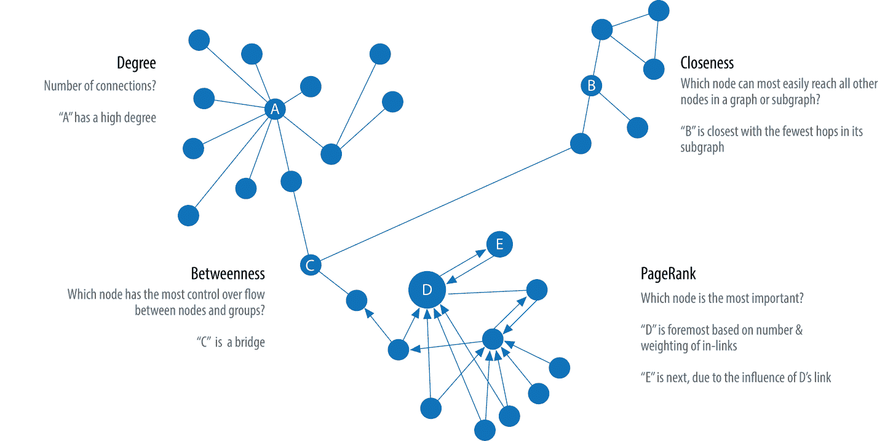

###### 图 5-1\. 代表性中心性算法及其所回答的问题类型

表 5-1\. 中心性算法概述

| 算法类型 | 它的作用 | 示例用途 | Spark 示例 | Neo4j 示例 |
| --- | --- | --- | --- | --- |

|

度中心性

|

测量节点具有的关系数量

|

通过观察其入度来估计一个人的受欢迎程度，并使用其出度来估计社交性

|

是的

|

不

|

|

接近中心性

变体：Wasserman and Faust，和谐中心性

|

计算哪些节点到所有其他节点的最短路径

|

找到新公共服务的最佳位置，以实现最大的可访问性

|

是的

|

是的

|

|

介数中心性

变体：随机近似布兰德斯

|

测量通过节点的最短路径数

|

通过找到特定疾病的控制基因来改善药物靶向

|

不

|

是的

|

|

页面排名

变体：个性化页面排名

|

从其链接的邻居及其邻居（由 Google 推广）估计当前节点的重要性

|

在机器学习中找到最具影响力的特征进行提取，并在自然语言处理中为实体相关性排名文本。

|

是的

|

是的

|

###### 注意

一些中心度算法计算每对节点之间的最短路径。这对小型到中型图表效果很好，但对于大型图表可能会造成计算上的限制。为了避免在大型图表上运行时间过长，一些算法（例如介数中心度）有近似版本。

首先，我们将描述我们示例数据集，并演示如何将数据导入 Apache Spark 和 Neo4j。每个算法的顺序与表 5-1 相同。我们将从算法的简短描述开始，必要时会介绍其运行方式。已覆盖的算法的变体将包括较少的细节。大多数部分还包括何时使用相关算法的指导。我们在每个部分的末尾使用样本数据集演示示例代码。

让我们开始吧！

# 示例图数据：社交图

中心度算法与所有图表相关，但社交网络提供了一种非常贴近生活的方式来思考动态影响和信息流动。本章的示例是针对一个类似 Twitter 的小型图表运行的。你可以从[书籍的 GitHub 仓库](https://bit.ly/2FPgGVV)下载我们用来创建图表的节点和关系文件。

表 5-2\. *social-nodes.csv*

| id |
| --- |
| Alice |
| Bridget |
| Charles |
| Doug |
| Mark |
| Michael |
| David |
| Amy |
| James |
|  |

表 5-3\. *social-relationships.csv*

| src | dst | relationship |
| --- | --- | --- |
| Alice | Bridget | FOLLOWS |
| Alice | Charles | FOLLOWS |
| Mark | Doug | FOLLOWS |
| Bridget | Michael | FOLLOWS |
| Doug | Mark | FOLLOWS |
| Michael | Alice | FOLLOWS |
| Alice | Michael | FOLLOWS |
| Bridget | Alice | FOLLOWS |
| Michael | Bridget | FOLLOWS |
| Charles | Doug | FOLLOWS |
| Bridget | Doug | FOLLOWS |
| Michael | Doug | FOLLOWS |
| Alice | Doug | FOLLOWS |
| Mark | Alice | FOLLOWS |
| David | Amy | FOLLOWS |
| James | David | FOLLOWS |

图 5-2 展示了我们希望构建的图表。

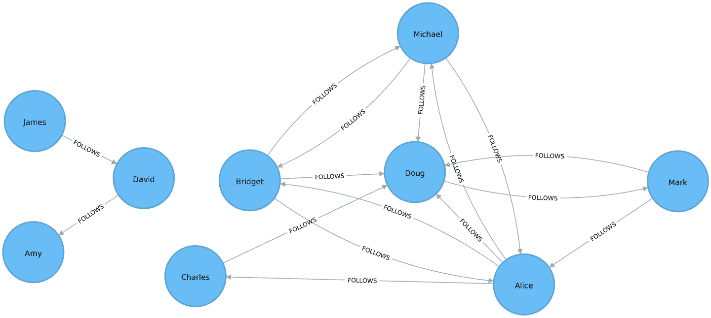

###### 图 5-2\. 图表模型

我们有一个更大的用户集合，他们之间有连接，并且一个较小的集合与该较大组没有连接。

让我们基于这些 CSV 文件的内容在 Spark 和 Neo4j 中创建图表。

## 将数据导入 Apache Spark

首先，我们从 Spark 和 GraphFrames 包中导入所需的包：

```
from graphframes import *
from pyspark import SparkContext
```

我们可以编写以下代码来创建基于 CSV 文件内容的 GraphFrame：

```
v = spark.read.csv("data/social-nodes.csv", header=True)
e = spark.read.csv("data/social-relationships.csv", header=True)
g = GraphFrame(v, e)
```

## 将数据导入 Neo4j

接下来，我们将为 Neo4j 加载数据。以下查询导入节点：

```
WITH "https://github.com/neo4j-graph-analytics/book/raw/master/data/" AS base
WITH base + "social-nodes.csv" AS uri
LOAD CSV WITH HEADERS FROM uri AS row
MERGE (:User {id: row.id})
```

并且这个查询导入了关系：

```
WITH "https://github.com/neo4j-graph-analytics/book/raw/master/data/" AS base
WITH base + "social-relationships.csv" AS uri
LOAD CSV WITH HEADERS FROM uri AS row
MATCH (source:User {id: row.src})
MATCH (destination:User {id: row.dst})
MERGE (source)-[:FOLLOWS]->(destination)
```

现在我们的图表加载完毕，我们开始进行算法的应用！

# 度中心度

度中心性是我们在本书中介绍的最简单的算法之一。它计算节点的入度和出度的数量，并用于在图中找到流行节点。度中心性是由 Linton C. Freeman 在他 1979 年的论文[“社会网络中的中心性：概念澄清”](http://bit.ly/2uAGOih)中提出的。

## 到达度

理解节点的到达度是一个衡量重要性的公平指标。它能触及多少其他节点？节点的*度*是它拥有的直接关系数量，计算入度和出度。你可以把它看作节点的即时到达度。例如，在活跃社交网络中，拥有高度的人会有很多即时联系，因此更有可能在他们的网络中流传着流感。

网络的*平均度*简单地是总关系数除以总节点数；它可能会被高度节点偏斜。*度分布*是随机选择的节点具有特定数量关系的概率。

图 5-3 说明了在分析 subreddit 主题之间的实际连接分布时的不同之处。如果仅仅取平均值，你可能会认为大多数主题有 10 个连接，但实际上大多数主题只有 2 个连接。

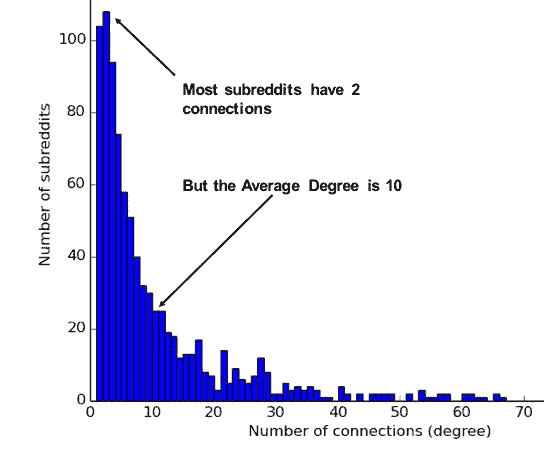

###### 图 5-3。这张由[Jacob Silterrapa](http://bit.ly/2WlNaOc)绘制的 subreddit 度分布映射展示了平均值通常不反映网络中实际分布的示例。CC BY-SA 3.0。

这些度量用于分类网络类型，如在第二章中讨论的无标度网络或小世界网络。它们还提供了一个快速测量，帮助估计事物在网络中传播或波及的潜力。

## 何时使用度中心性？

如果你尝试通过查看入度和出度的数量来分析影响力，或者找出个体节点的“流行度”，那么可以使用**度中心性（Degree Centrality）**。当你关注即时连接或近期概率时，它表现良好。然而，当你想评估整个图中的最小度、最大度、平均度和标准差时，度中心性也适用于全局分析。

示例用途包括：

+   识别强大个体通过他们的关系，比如社交网络中的人际关系。例如，在 BrandWatch 的[“2017 年 Twitter 上最有影响力的男性和女性”](https://bit.ly/2WnB2fK)中，每个类别的前 5 位人物每人拥有超过 4000 万的追随者。

+   分离在线拍卖网站的欺诈者和合法用户。由于串通目的人为提高价格，欺诈者的加权中心度往往显著较高。在 P. Bangcharoensap 等人的论文中详细阅读，[“基于两步图的半监督学习用于在线拍卖欺诈检测”](https://bit.ly/2YlaLAq)。

## 使用 Apache Spark 的度中心度

现在我们将执行使用以下代码的度中心度算法：

```
total_degree = g.degrees
in_degree = g.inDegrees
out_degree = g.outDegrees

(total_degree.join(in_degree, "id", how="left")
 .join(out_degree, "id", how="left")
 .fillna(0)
 .sort("inDegree", ascending=False)
 .show())
```

我们首先计算总度数、入度和出度。然后我们将这些 DataFrame 连接在一起，使用左连接以保留没有入度或出度关系的任何节点。如果节点没有关系，我们使用`fillna`函数将该值设置为`0`。

这是在 pyspark 中运行代码的结果：

| id | degree | inDegree | outDegree |
| --- | --- | --- | --- |
| Doug | 6 | 5 | 1 |
| Alice | 7 | 3 | 4 |
| Michael | 5 | 2 | 3 |
| Bridget | 5 | 2 | 3 |
| Charles | 2 | 1 | 1 |
| Mark | 3 | 1 | 2 |
| David | 2 | 1 | 1 |
| Amy | 1 | 1 | 0 |
| James | 1 | 0 | 1 |

我们可以在图 5-4 中看到，在我们的 Twitter 图中 Doug 是最受欢迎的用户，拥有五个粉丝（入链）。该图中其他用户都在关注他，而他只关注一个人。在真实的 Twitter 网络中，名人通常有很高的粉丝数量，但他们往往只关注少数人。因此，我们可以考虑 Doug 是一个名人！

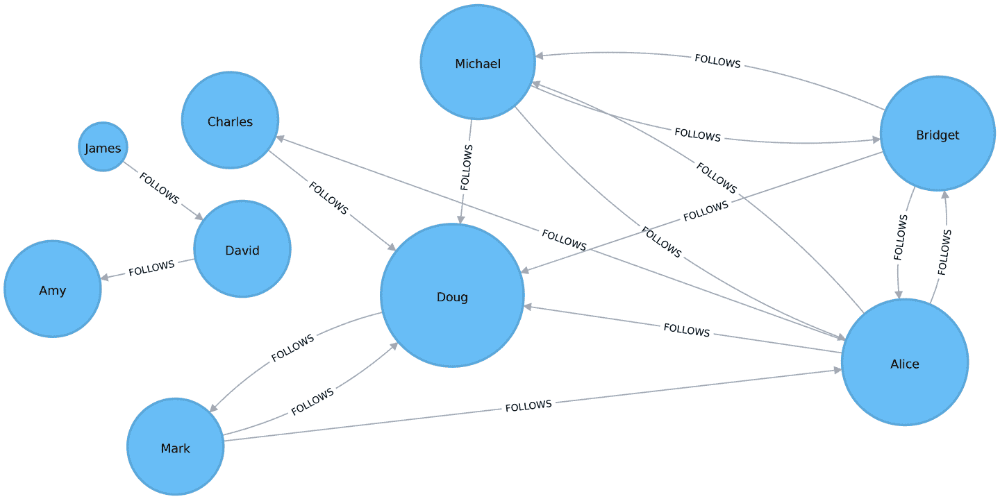

###### 图 5-4\. 度中心度的可视化

如果我们正在创建一个显示最多关注用户或者想要建议关注的人的页面，我们可以使用这个算法来识别这些人。

###### 提示

一些数据可能包含非常密集的节点，具有大量关系。这些节点并不添加额外的信息，并可能使某些结果产生偏差或增加计算复杂性。您可以通过使用子图来过滤这些密集节点，或者使用投影来总结关系作为权重。

# 紧密中心度

紧密中心度是检测能够通过子图高效传播信息的节点的一种方法。

一个节点中心度的度量是其到所有其他节点的平均远离度（倒数距离）。具有高紧密度分数的节点与所有其他节点的距离最短。

对于每个节点，紧密中心度算法计算其到所有其他节点的距离的总和，基于计算所有节点对之间的最短路径。然后，将结果总和*倒置*以确定该节点的紧密中心度分数。

计算节点的紧密中心度是使用以下公式计算的：

<math display="block"><mrow><mi>C</mi> <mrow><mo>(</mo> <mi>u</mi> <mo>)</mo></mrow> <mo>=</mo> <mfrac><mn>1</mn> <mrow><msubsup><mo>∑</mo> <mrow><mi>v</mi><mo>=</mo><mn>1</mn></mrow> <mrow><mi>n</mi><mo>-</mo><mn>1</mn></mrow></msubsup> <mi>d</mi><mrow><mo>(</mo><mi>u</mi><mo>,</mo><mi>v</mi><mo>)</mo></mrow></mrow></mfrac></mrow></math>

其中：

+   *u* 是一个节点。

+   *n* 是图中的节点数。

+   *d(u,v)* 是另一个节点 *v* 到 *u* 的最短路径距离。

更常见的是对此分数进行归一化，以表示最短路径的平均长度，而不是它们的总和。这种调整允许比较不同大小图的节点的紧密中心度。

标准化接近中心性的公式如下：

<math display="block"><mrow><msub><mi>C</mi> <mrow><mi>n</mi><mi>o</mi><mi>r</mi><mi>m</mi></mrow></msub> <mrow><mo>(</mo> <mi>u</mi> <mo>)</mo></mrow> <mo>=</mo> <mfrac><mrow><mi>n</mi><mo>-</mo><mn>1</mn></mrow> <mrow><msubsup><mo>∑</mo> <mrow><mi>v</mi><mo>=</mo><mn>1</mn></mrow> <mrow><mi>n</mi><mo>-</mo><mn>1</mn></mrow></msubsup> <mi>d</mi><mrow><mo>(</mo><mi>u</mi><mo>,</mo><mi>v</mi><mo>)</mo></mrow></mrow></mfrac></mrow></math>

## 何时使用接近中心性？

在需要知道哪些节点最快传播信息时应用接近中心性。使用加权关系在评估交流速度和行为分析中尤为有帮助。

示例用例包括：

+   揭示在组织内控制和获取关键信息和资源非常有利位置的个体。其中一项研究是由 V. E. Krebs 所作的 [“映射恐怖主义网络”](http://bit.ly/2WjFdsM)。

+   用于在电信和包裹交付中估计到达时间的启发式方法，其中内容通过最短路径流向预定义目标。它还被用来同时揭示通过所有最短路径的传播，例如在本地社区中传播感染。详细信息请参阅 S. P. Borgatti 的 [“中心性和网络流”](http://bit.ly/2Op5bbH)。

+   根据 F. Boudin 在 [“基于图的关键词提取的中心性度量比较”](https://bit.ly/2WkDByX) 中描述的基于图的关键词提取过程，评估文档中单词的重要性。

###### 警告

接近中心性在连接的图上效果最好。当应用原始公式到非连接的图时，我们得到两个节点之间没有路径的情况下的无穷距离。这意味着当我们从该节点到所有距离的总和时，我们将得到一个无穷的接近中心性分数。为了避免这个问题，下一个示例后将展示原始公式的变体。

## 使用 Apache Spark 进行接近中心性计算

Apache Spark 没有内置的接近中心性算法，但我们可以使用我们在上一章 “Apache Spark 中的最短路径（加权）” 中介绍的 `aggregateMessages` 框架编写自己的算法。

在创建函数之前，我们将导入一些后续使用的库：

```
from graphframes.lib import AggregateMessages as AM
from pyspark.sql import functions as F
from pyspark.sql.types import *
from operator import itemgetter
```

我们还将创建几个后面需要用到的用户定义函数：

```
def collect_paths(paths):
    return F.collect_set(paths)

collect_paths_udf = F.udf(collect_paths, ArrayType(StringType()))

paths_type = ArrayType(
    StructType([StructField("id", StringType()), StructField("distance",                                                    IntegerType())]))

def flatten(ids):
    flat_list = [item for sublist in ids for item in sublist]
    return list(dict(sorted(flat_list, key=itemgetter(0))).items())

flatten_udf = F.udf(flatten, paths_type)

def new_paths(paths, id):
    paths = [{"id": col1, "distance": col2 + 1} for col1,
                            col2 in paths if col1 != id]
    paths.append({"id": id, "distance": 1})
    return paths

new_paths_udf = F.udf(new_paths, paths_type)

def merge_paths(ids, new_ids, id):
    joined_ids = ids + (new_ids if new_ids else [])
    merged_ids = [(col1, col2) for col1, col2 in joined_ids if col1 != id]
    best_ids = dict(sorted(merged_ids, key=itemgetter(1), reverse=True))
    return [{"id": col1, "distance": col2} for col1, col2 in best_ids.items()]

merge_paths_udf = F.udf(merge_paths, paths_type)

def calculate_closeness(ids):
    nodes = len(ids)
    total_distance = sum([col2 for col1, col2 in ids])
    return 0 if total_distance == 0 else nodes * 1.0 / total_distance

closeness_udf = F.udf(calculate_closeness, DoubleType())
```

现在让我们来计算每个节点的接近中心性的主体部分：

```
vertices = g.vertices.withColumn("ids", F.array())
cached_vertices = AM.getCachedDataFrame(vertices)
g2 = GraphFrame(cached_vertices, g.edges)

for i in range(0, g2.vertices.count()):
    msg_dst = new_paths_udf(AM.src["ids"], AM.src["id"])
    msg_src = new_paths_udf(AM.dst["ids"], AM.dst["id"])
    agg = g2.aggregateMessages(F.collect_set(AM.msg).alias("agg"),
                               sendToSrc=msg_src, sendToDst=msg_dst)
    res = agg.withColumn("newIds", flatten_udf("agg")).drop("agg")
    new_vertices = (g2.vertices.join(res, on="id", how="left_outer")
                    .withColumn("mergedIds", merge_paths_udf("ids", "newIds",
                    "id")).drop("ids", "newIds")
                    .withColumnRenamed("mergedIds", "ids"))
    cached_new_vertices = AM.getCachedDataFrame(new_vertices)
    g2 = GraphFrame(cached_new_vertices, g2.edges)

(g2.vertices
 .withColumn("closeness", closeness_udf("ids"))
 .sort("closeness", ascending=False)
 .show(truncate=False))
```

如果我们运行它，我们将看到以下输出：

| id | ids | 接近中心性 |
| --- | --- | --- |
| Doug | [[查尔斯, 1], [马克, 1], [爱丽丝, 1], [布里奇特, 1], [迈克尔, 1]] | 1.0 |
| Alice | [[查尔斯, 1], [马克, 1], [布里奇特, 1], [道格, 1], [迈克尔, 1]] | 1.0 |
| David | [[詹姆斯, 1], [艾米, 1]] | 1.0 |
| Bridget | [[查尔斯, 2], [马克, 2], [爱丽丝, 1], [道格, 1], [迈克尔, 1]] | 0.7142857142857143 |
| Michael | [[查尔斯, 2], [马克, 2], [爱丽丝, 1], [道格, 1], [布里奇特, 1]] | 0.7142857142857143 |
| James | [[艾米, 2], [大卫, 1]] | 0.6666666666666666 |
| Amy | [[詹姆斯, 2], [大卫, 1]] | 0.6666666666666666 |
| Mark | [[布里奇特, 2], [查尔斯, 2], [迈克尔, 2], [道格, 1], [爱丽丝, 1]] | 0.625 |
| Charles | [[布里奇特, 2], [马克, 2], [迈克尔, 2], [道格, 1], [爱丽丝, 1]] | 0.625 |

图 5-5 显示，尽管 David 只有少数连接，但在他的朋友圈内这很重要。换句话说，这个分数代表每个用户在其子图中与其他节点的接近程度，而不是整个图。

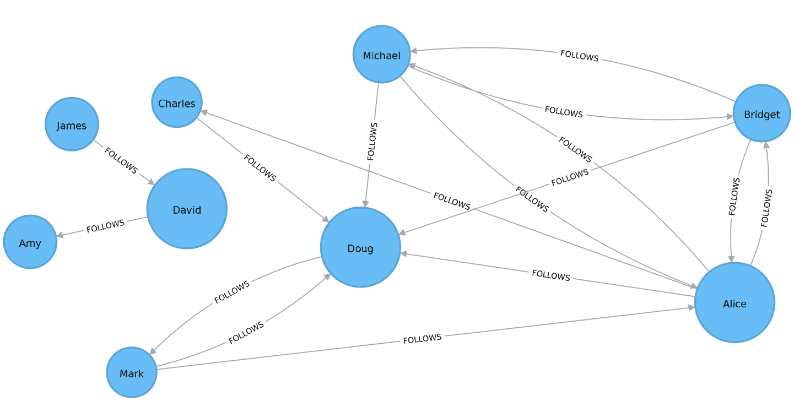

###### 图 5-5\. 接近中心性的可视化

## 使用 Neo4j 进行接近中心性

Neo4j 的接近中心性实现使用以下公式：

<math display="block"><mrow><mi>C</mi> <mrow><mo>(</mo> <mi>u</mi> <mo>)</mo></mrow> <mo>=</mo> <mfrac><mrow><mi>n</mi><mo>-</mo><mn>1</mn></mrow> <mrow><msubsup><mo>∑</mo> <mrow><mi>v</mi><mo>=</mo><mn>1</mn></mrow> <mrow><mi>n</mi><mo>-</mo><mn>1</mn></mrow></msubsup> <mi>d</mi><mrow><mo>(</mo><mi>u</mi><mo>,</mo><mi>v</mi><mo>)</mo></mrow></mrow></mfrac></mrow></math>

其中：

+   *u* 是一个节点。

+   *n* 是与*u*在同一组件（子图或群）中的节点数。

+   *d(u,v)* 是另一个节点*v*与*u*之间的最短路径距离。

通过调用以下过程，我们可以计算图中每个节点的接近中心性：

```
CALL algo.closeness.stream("User", "FOLLOWS")
YIELD nodeId, centrality
RETURN algo.getNodeById(nodeId).id, centrality
ORDER BY centrality DESC
```

运行此过程会得到以下输出：

| 用户 | 中心性 |
| --- | --- |
| Alice | 1.0 |
| Doug | 1.0 |
| David | 1.0 |
| Bridget | 0.7142857142857143 |
| Michael | 0.7142857142857143 |
| Amy | 0.6666666666666666 |
| James | 0.6666666666666666 |
| Charles | 0.625 |
| Mark | 0.625 |

我们获得了与 Spark 算法相同的结果，但是，与之前一样，得分表示他们在其子图中与其他节点的接近程度，而不是整个图。

###### 注意

在接近中心性算法的严格解释中，我们的图中所有节点的分数都将是∞，因为每个节点至少有一个其他节点是无法到达的。然而，通常更有用的是按组件实现分数。

理想情况下，我们希望得到整个图的接近程度指标，在接下来的两个部分中，我们将学习几种接近中心性算法的变体。

## 接近中心性变体：Wasserman 和 Faust

Stanley Wasserman 和 Katherine Faust 提出了一种改进的公式，用于计算具有多个子图且这些组之间没有连接的图的接近程度。有关他们的公式的详细信息在他们的书籍《社会网络分析：方法与应用》中。此公式的结果是可到达节点的分数与可到达节点的平均距离的比率。

公式如下：

<math display="block"><mrow><msub><mi>C</mi> <mrow><mi>W</mi><mi>F</mi></mrow></msub> <mrow><mo>(</mo> <mi>u</mi> <mo>)</mo></mrow> <mo>=</mo> <mfrac><mrow><mi>n</mi><mo>-</mo><mn>1</mn></mrow> <mrow><mi>N</mi><mo>-</mo><mn>1</mn></mrow></mfrac> <mfenced separators="" open="(" close=")"><mfrac><mrow><mi>n</mi><mo>-</mo><mn>1</mn></mrow> <mrow><msubsup><mo>∑</mo> <mrow><mi>v</mi><mo>=</mo><mn>1</mn></mrow> <mrow><mi>n</mi><mo>-</mo><mn>1</mn></mrow></msubsup> <mi>d</mi><mrow><mo>(</mo><mi>u</mi><mo>,</mo><mi>v</mi><mo>)</mo></mrow></mrow></mfrac></mfenced></mrow></math>

其中：

+   *u* 是一个节点。

+   *N* 是总节点数。

+   *n* 是与*u*在同一组件中的节点数。

+   *d(u,v)* 是另一个节点*v*与*u*之间的最短路径距离。

我们可以通过传递参数`improved: true`来告诉接近中心性过程使用此公式。

以下查询使用 Wasserman 和 Faust 的公式执行接近中心性：

```
CALL algo.closeness.stream("User", "FOLLOWS", {improved: true})
YIELD nodeId, centrality
RETURN algo.getNodeById(nodeId).id AS user, centrality
ORDER BY centrality DESC
```

该过程给出以下结果：

| 用户 | 中心性 |
| --- | --- |
| Alice | 0.5 |
| Doug | 0.5 |
| Bridget | 0.35714285714285715 |
| Michael | 0.35714285714285715 |
| Charles | 0.3125 |
| Mark | 0.3125 |
| David | 0.125 |
| Amy | 0.08333333333333333 |
| 詹姆斯 | 0.08333333333333333 |

如图 5-6 所示，现在的结果更能代表节点与整个图的接近程度。较小子图的成员得分（大卫、艾米和詹姆斯）已经减弱，现在他们拥有所有用户中最低的得分。这是合理的，因为他们是最孤立的节点。这个公式更适用于检测节点在整个图中的重要性，而不是在其自己的子图中。

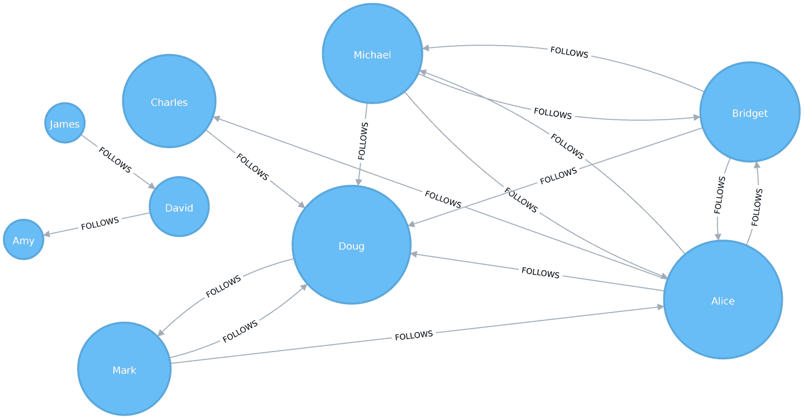

###### 图 5-6\. 接近中心性的可视化

在接下来的部分中，我们将学习调和中心性算法，该算法使用另一个公式计算接近度并实现类似的结果。

## 接近中心性变化：调和中心性

调和中心性（也称为价值中心性）是接近中心性的一种变体，旨在解决不连通图的原始问题。在[“和谐在一个小世界中”](https://bit.ly/2HSkTef)中，M. Marchiori 和 V. Latora 提出了这一概念，作为平均最短路径的实际表示。

当计算每个节点的接近度评分时，不是将节点到所有其他节点的距离相加，而是将这些距离的倒数相加。这意味着无限值变得无关紧要。

节点的原始调和中心性计算公式如下：

<math display="block"><mrow><mi>H</mi> <mrow><mo>(</mo> <mi>u</mi> <mo>)</mo></mrow> <mo>=</mo> <mrow><munderover><mo>∑</mo> <mrow><mi>v</mi><mo>=</mo><mn>1</mn></mrow> <mrow><mi>n</mi><mo>-</mo><mn>1</mn></mrow></munderover> <mfrac><mn>1</mn> <mrow><mi>d</mi><mo>(</mo><mi>u</mi><mo>,</mo><mi>v</mi><mo>)</mo></mrow></mfrac></mrow></mrow></math>

其中：

+   *u* 是一个节点。

+   *n* 是图中的节点数。

+   *d(u,v)* 是另一个节点 *v* 和 *u* 之间的最短路径距离。

与接近中心性类似，我们还可以使用以下公式计算归一化的调和中心性：

<math display="block"><mrow><msub><mi>H</mi> <mrow><mi>n</mi><mi>o</mi><mi>r</mi><mi>m</mi></mrow></msub> <mrow><mo>(</mo> <mi>u</mi> <mo>)</mo></mrow> <mo>=</mo> <mfrac><mrow><msubsup><mo>∑</mo> <mrow><mi>v</mi><mo>=</mo><mn>1</mn></mrow> <mrow><mi>n</mi><mo>-</mo><mn>1</mn></mrow></msubsup> <mfrac><mn>1</mn> <mrow><mi>d</mi><mo>(</mo><mi>u</mi><mo>,</mo><mi>v</mi><mo>)</mo></mrow></mfrac></mrow> <mrow><mi>n</mi><mo>-</mo><mn>1</mn></mrow></mfrac></mrow></math>

在这个公式中，∞ 的值被处理得很干净。

### 使用 Neo4j 进行调和中心性

以下查询执行调和中心性算法：

```
CALL algo.closeness.harmonic.stream("User", "FOLLOWS")
YIELD nodeId, centrality
RETURN algo.getNodeById(nodeId).id AS user, centrality
ORDER BY centrality DESC
```

执行此过程会得到以下结果：

| 用户 | 中心性 |
| --- | --- |
| 爱丽丝 | 0.625 |
| 道格 | 0.625 |
| 布里奇特 | 0.5 |
| 迈克尔 | 0.5 |
| 查尔斯 | 0.4375 |
| 马克 | 0.4375 |
| 大卫 | 0.25 |
| 艾米 | 0.1875 |
| 詹姆斯 | 0.1875 |

此算法的结果与原始接近中心性算法的结果不同，但与 Wasserman 和 Faust 的改进类似。在处理具有多个连接组件的图形时，可以使用任一算法。

# 中介中心性

有时，系统中最重要的齿轮并不是那些具有最明显权力或最高地位的齿轮。有时，是连接组群的中间人或控制资源或信息流动的经纪人。中介中心性是一种检测节点在图中对信息或资源流动影响程度的方法。通常用于查找作为从图的一部分到另一部分的桥梁的节点。

介数中心性算法首先计算连接图中每对节点的最短（加权）路径。每个节点根据通过该节点的最短路径数量获得分数。一个节点上的最短路径越多，其分数越高。

当介数中心性由林顿·C·弗里曼在他的 1971 年论文 [“A Set of Measures of Centrality Based on Betweenness”](http://moreno.ss.uci.edu/23.pdf) 中介绍时，被认为是“三种独特的中心性概念”之一。

### 桥和控制点

网络中的桥可能是节点或关系。在一个非常简单的图中，可以通过查找如果删除将导致图的某部分断开连接的节点或关系来找到它们。然而，由于在典型图中这种方法并不实际，我们使用介数中心性算法。我们还可以通过将组视为一个节点来测量集群的介数中心性。

如果一个节点在另外两个节点之间的每一条最短路径上都位于“关键”的位置，如 图 5-7 所示，则该节点被认为是“关键”的。

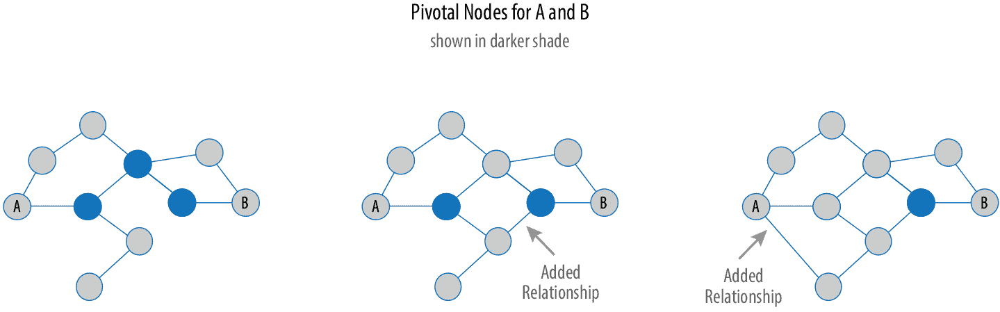

###### 图 5-7\. 关键节点位于两个节点之间的每条最短路径上。创建更多的最短路径可以减少关键节点的数量，用于风险缓解等用途。

关键节点在连接其他节点中起重要作用——如果移除一个关键节点，则原始节点对的新最短路径将变得更长或成本更高。这可以用来评估单点脆弱性的考虑因素。

### 计算介数中心性

节点的介数中心性通过对所有最短路径应用以下公式的结果进行累加来计算：

<math display="block"><mrow><mi>B</mi> <mrow><mo>(</mo> <mi>u</mi> <mo>)</mo></mrow> <mo>=</mo> <munder><mo>∑</mo> <mrow><mi>s</mi><mo>≠</mo><mi>u</mi><mo>≠</mo><mi>t</mi></mrow></munder> <mfrac><mrow><mi>p</mi><mo>(</mo><mi>u</mi><mo>)</mo></mrow> <mi>p</mi></mfrac></mrow></math>

where:

+   *u* 是一个节点。

+   *p* 是节点 *s* 和 *t* 之间的总最短路径数。

+   *p(u)* 是节点 *s* 和 *t* 之间通过节点 *u* 的最短路径数量。

图 5-8 展示了计算介数中心性的步骤。

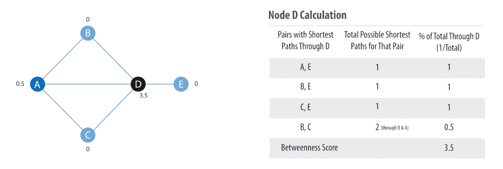

###### 图 5-8\. 计算介数中心性的基本概念

这是步骤：

1.  对于每个节点，找出通过它的最短路径。

    1.  B、C、E 没有最短路径，因此分配值为 0。

1.  对于步骤 1 中的每条最短路径，计算它在该对的总可能最短路径中的百分比。

1.  将步骤 2 中的所有值相加以找出节点的介数中心性分数。图表在 图 5-8 中说明了节点 D 的步骤 2 和 3。

1.  重复这个过程直到每个节点。

## 何时使用介数中心性？

介数中心性适用于现实世界网络中的广泛问题。我们用它来寻找瓶颈、控制点和漏洞。

示例用例包括：

+   识别各种组织中的影响者。有力的个人不一定在管理职位上，而是可以通过中介中心性发现“经纪位置”。移除这样的影响者可能会严重动摇组织。如果组织是犯罪的，执法机构可能会认为这是一个受欢迎的干扰，但如果一家企业失去了被低估的关键人员，这可能会是一场灾难。更多细节请参见[“Brokerage Qualifications in Ringing Operations”](https://bit.ly/2WKKPg0)，由 C. Morselli 和 J. Roy 撰写。

+   揭示网络中的关键转移点，例如电网。令人意外的是，删除特定的桥梁实际上可以通过“孤立”干扰来改善整体稳健性。研究细节包含在[“Robustness of the European Power Grids Under Intentional Attack”](https://bit.ly/2Wtqyvp)，由 R. Solé等人撰写。

+   帮助微博客扩展其在 Twitter 上的影响力，使用推荐引擎来定位影响者。这种方法在 S. Wu 等人的论文[“Making Recommendations in a Microblog to Improve the Impact of a Focal User”](https://bit.ly/2Ft58aN)中有描述。

###### 提示

中介中心性假设所有节点间的通信都沿着最短路径且频率相同，但实际情况并非总是如此。因此，它不能完美地展示图中最具影响力的节点，而是提供了一个良好的代表性。Mark Newman 在[*Networks: An Introduction*](http://bit.ly/2UaM9v0)（牛津大学出版社，第 186 页）中有更详细的解释。

## 使用 Neo4j 进行中介中心性计算

Spark 没有内置的中介中心性算法，因此我们将演示如何使用 Neo4j 来计算这个算法。调用以下过程将计算我们图中每个节点的中介中心性：

```
CALL algo.betweenness.stream("User", "FOLLOWS")
YIELD nodeId, centrality
RETURN algo.getNodeById(nodeId).id AS user, centrality
ORDER BY centrality DESC
```

运行此过程将得到以下结果：

| user | centrality |
| --- | --- |
| Alice | 10.0 |
| Doug | 7.0 |
| Mark | 7.0 |
| David | 1.0 |
| Bridget | 0.0 |
| Charles | 0.0 |
| Michael | 0.0 |
| Amy | 0.0 |
| James | 0.0 |

如我们在图 5-9 中所看到的，Alice 是这个网络中的主要经纪人，但 Mark 和 Doug 也不甚逊色。在较小的子图中，所有最短路径都经过 David，因此他在这些节点间的信息流中显得十分重要。

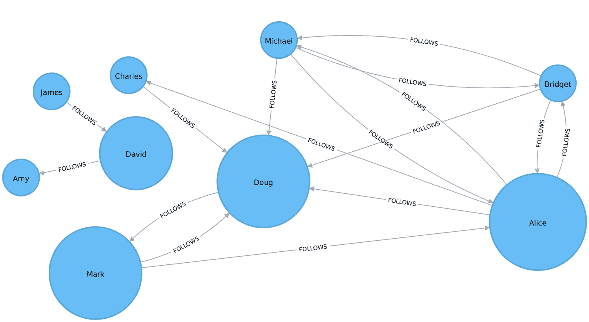

###### 图 5-9\. 中介中心性可视化

###### 警告

对于大型图形，精确计算中心性并不实际。目前已知的最快算法用于精确计算所有节点的中介中心性，其运行时间与节点数和关系数的乘积成正比。

我们可能希望首先过滤到一个子图，或者使用（在下一节中描述）适用于节点子集的方法。

我们可以通过引入一个名为 Jason 的新用户，他既关注又被两组用户中的人关注，将我们的两个不相连的组件连接在一起：

```
WITH ["James", "Michael", "Alice", "Doug", "Amy"] AS existingUsers

MATCH (existing:User) WHERE existing.id IN existingUsers
MERGE (newUser:User {id: "Jason"})

MERGE (newUser)<-[:FOLLOWS]-(existing)
MERGE (newUser)-[:FOLLOWS]->(existing)
```

如果我们重新运行算法，我们会看到这个输出：

| 用户 | 中心性 |
| --- | --- |
| Jason | 44.33333333333333 |
| Doug | 18.333333333333332 |
| Alice | 16.666666666666664 |
| Amy | 8.0 |
| James | 8.0 |
| Michael | 4.0 |
| Mark | 2.1666666666666665 |
| David | 0.5 |
| Bridget | 0.0 |
| Charles | 0.0 |

杰森具有最高的分数，因为用户之间的通信将通过他进行。可以说杰森在两组用户之间充当*本地桥梁*，如图 5-10 所示。

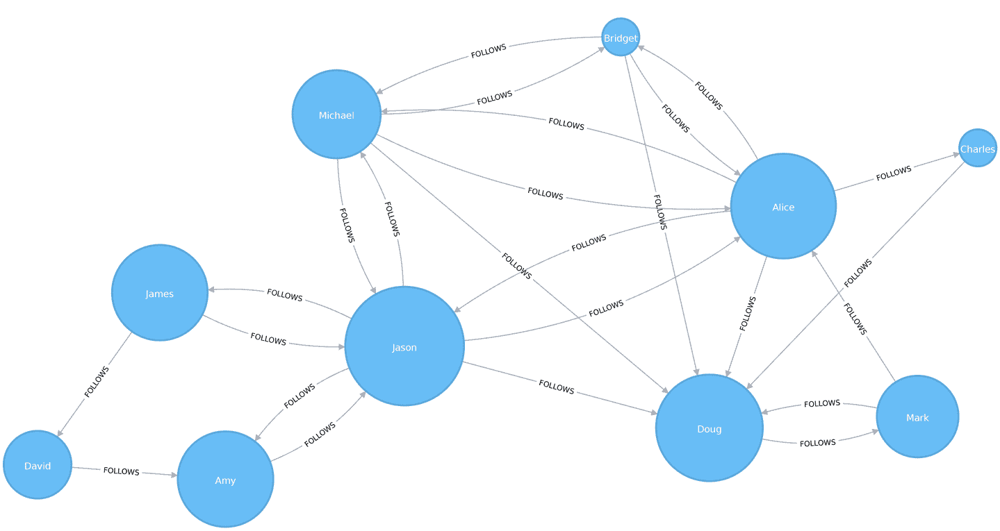

###### 图 5-10. 介数中心性的可视化，带有杰森

在我们进入下一节之前，让我们通过删除杰森及其关系来重置我们的图：

```
MATCH (user:User {id: "Jason"})
DETACH DELETE user
```

## 介数中心性变化：随机近似 Brandes

请记住，在大型图上计算精确的介数中心性可能非常昂贵。因此，我们可以选择使用运行速度更快但仍提供有用（尽管不精确）信息的近似算法。

随机近似 Brandes（简称 RA-Brandes）算法是计算介数中心性近似分数的最知名算法。与计算每对节点之间的最短路径不同，RA-Brandes 算法仅考虑节点的一个子集。选择节点子集的两种常见策略是：

### 随机

节点是均匀地随机选择的，具有定义的选择概率。默认概率为：<math display="inline"><mfrac><mrow><mi>l</mi><mi>o</mi><mi>g</mi><mn>10</mn><mo>(</mo><mi>N</mi><mo>)</mo></mrow> <msup><mi>e</mi> <mn>2</mn></msup></mfrac></math> 。如果概率为 1，则算法的工作方式与正常介数中心性算法相同，即所有节点都被加载。

### 度

节点是随机选择的，但那些度数低于平均值的节点将自动被排除（即，只有具有大量关系的节点才有可能被访问）。

作为进一步的优化，您可以限制最短路径算法所使用的深度，这将提供所有最短路径的一个子集。

### 使用 Neo4j 近似介数中心性

下面的查询使用随机选择方法执行 RA-Brandes 算法：

```
CALL algo.betweenness.sampled.stream("User", "FOLLOWS", {strategy:"degree"})
YIELD nodeId, centrality
RETURN algo.getNodeById(nodeId).id AS user, centrality
ORDER BY centrality DESC
```

执行此过程将得到以下结果：

| 用户 | 中心性 |
| --- | --- |
| Alice | 9.0 |
| Mark | 9.0 |
| Doug | 4.5 |
| David | 2.25 |
| Bridget | 0.0 |
| Charles | 0.0 |
| Michael | 0.0 |
| Amy | 0.0 |
| James | 0.0 |

我们的顶级影响者与之前类似，尽管现在马克的排名比道格高。

由于此算法的随机性质，每次运行它时我们可能会看到不同的结果。在更大的图中，这种随机性对我们的小样本图的影响会较小。

# PageRank

PageRank 是最为人所知的中心性算法。它衡量节点的传递（或方向性）影响力。我们讨论的所有其他中心性算法都衡量节点的直接影响力，而 PageRank 考虑了节点及其邻居的影响力。例如，拥有几个非常强大的朋友可能比拥有许多不那么强大的朋友更有影响力。PageRank 的计算方式可以通过将一个节点的排名迭代地分配到其邻居上，或者通过随机遍历图形并计算每个节点在这些遍历中被击中的频率来进行。

PageRank 以 Google 联合创始人拉里·佩奇命名，他创建了这个算法来排名 Google 搜索结果中的网页。基本假设是，具有更多且更有影响力的传入链接的页面更可能是可信来源。PageRank 通过计算节点的传入关系数量和质量来估计节点的重要性。在网络中具有更多影响力的节点被认为具有更多来自其他有影响力节点的传入关系。

## 影响力

影响力的直觉在于，与更重要节点的关系比与等价连接到不太重要的节点的关系对节点影响力的贡献更大。衡量影响力通常涉及对节点进行评分，通常使用加权关系，并在许多迭代中更新这些评分。有时对所有节点进行评分，有时则使用随机选择作为代表性分布。

###### 注意

请记住，中心性度量表示节点在与其他节点比较时的重要性。中心性是节点潜在影响力的排名，而不是实际影响力的度量。例如，您可能会识别网络中两个具有最高中心性的人，但也许会因政策或文化规范的影响而将实际影响力转移给其他人。量化实际影响力是一个积极的研究领域，以开发额外的影响力度量指标。

## PageRank 公式

PageRank 在原始的 Google 论文中被定义如下：

<math display="block"><mrow><mi>P</mi> <mi>R</mi> <mrow><mo>(</mo> <mi>u</mi> <mo>)</mo></mrow> <mo>=</mo> <mrow><mo>(</mo> <mn>1</mn> <mo>-</mo> <mi>d</mi> <mo>)</mo></mrow> <mo>+</mo> <mi>d</mi> <mrow><mo>(</mo> <mfrac><mrow><mi>P</mi><mi>R</mi><mo>(</mo><mi>T</mi><mn>1</mn><mo>)</mo></mrow> <mrow><mi>C</mi><mo>(</mo><mi>T</mi><mn>1</mn><mo>)</mo></mrow></mfrac> <mo>+</mo> <mo>.</mo> <mo>.</mo> <mo>.</mo> <mo>+</mo> <mfrac><mrow><mi>P</mi><mi>R</mi><mo>(</mo><mi>T</mi><mi>n</mi><mo>)</mo></mrow> <mrow><mi>C</mi><mo>(</mo><mi>T</mi><mi>n</mi><mo>)</mo></mrow></mfrac> <mo>)</mo></mrow></mrow></math>

where:

+   我们假设页面 *u* 有来自页面 *T1* 到 *Tn* 的引用。

+   *d* 是一个阻尼因子，其取值范围在 0 到 1 之间。通常设为 0.85。您可以将其视为用户继续点击的概率。这有助于最小化排名沉降，在下一节中有详细解释。

+   *1-d* 是节点直接到达而不遵循任何关系的概率。

+   *C(Tn)* 定义为节点 *T* 的出度。

图 5-11 演示了 PageRank 如何持续更新节点的排名，直到收敛或达到设定的迭代次数。

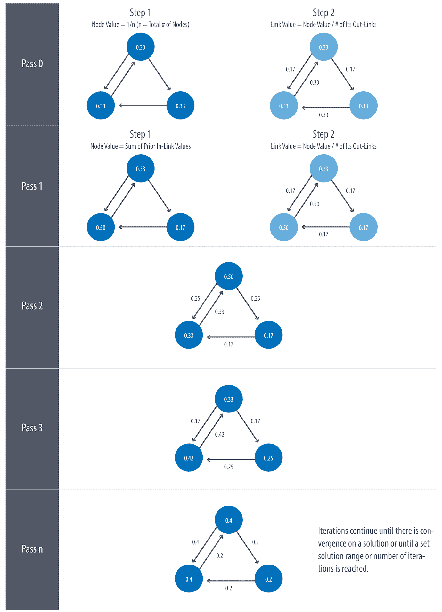

###### 图 5-11。每次 PageRank 迭代包括两个计算步骤：更新节点值和更新链接值。

## 迭代、随机游客和排名沉降

PageRank 是一种迭代算法，运行直到分数收敛或达到设定的迭代次数为止。

在概念上，PageRank 假定有一个网络冲浪者通过跟随链接或使用随机 URL 访问页面。阻尼因子 _d _ 定义了下一次点击将通过链接进行的概率。您可以将其视为冲浪者变得厌倦并随机切换到另一页的概率。PageRank 分数表示通过入站链接访问页面的可能性，而不是随机访问。

没有输出关系的一个或一组节点（也称为*dangling node*）可以通过拒绝分享来垄断 PageRank 分数。这被称为*排名汇聚*。您可以将其想象成一个冲浪者被困在一个或一组没有出口的页面上。还有另一个困难是由指向同一组中其他节点的节点引起的。循环引用导致冲浪者在节点之间来回跳动，这会增加它们的排名。这些情况在 图 5-12 中描述。

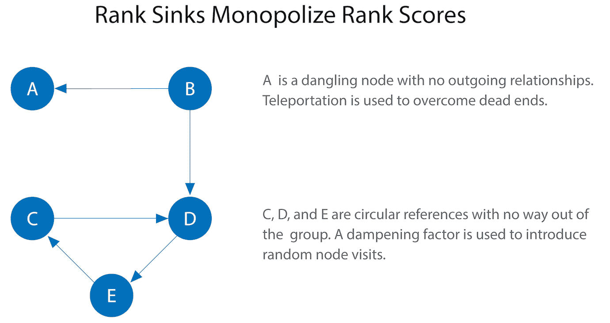

###### 图 5-12\. 排名汇聚是由一个或一组没有输出关系的节点引起的。

有两种策略用于避免排名汇聚。首先，当到达没有输出关系的节点时，PageRank 假设到所有节点的输出关系。有时称为*传送*这些看不见的链接。其次，阻尼因子提供了另一个机会，通过引入直接链接与随机节点访问的概率来避免汇聚。当您将 *d* 设置为 0.85 时，完全随机节点被访问的概率为 15%。

尽管原始公式建议阻尼因子为 0.85，但最初用于具有幂律分布链接（大多数页面有很少的链接，少数页面有很多）的万维网。降低阻尼因子会减少在进行随机跳转之前遵循长关系路径的可能性。反过来，这增加了节点的直接前驱对其得分和排名的贡献。

如果从 PageRank 看到意外结果，值得对图进行一些探索性分析，看看是否有这些问题的原因。阅读 Ian Rogers 的文章，[“Google PageRank 算法及其工作原理”](http://bit.ly/2TYSaeQ) 了解更多信息。

## 何时使用 PageRank？

PageRank 现在被广泛应用于除网络索引之外的许多领域。每当您需要在网络上获得广泛影响时，请使用这种算法。例如，如果您正在寻找对生物功能具有最高整体影响力的基因，那么这可能不是连接最多的基因。事实上，它可能是与其他更重要功能关系最多的基因。

示例用例包括：

+   向用户推荐可能感兴趣的其他账户（Twitter 使用 Personalized PageRank 实现此目的）。该算法在包含共同兴趣和共同连接的图上运行。该方法在 P. Gupta 等人的论文[“WTF: The Who to Follow Service at Twitter”](https://stanford.io/2ux00wZ)中有详细描述。

+   预测公共空间或街道中的交通流量和人员移动。该算法在道路交叉口的图上运行，其中 PageRank 分数反映了人们在每条街道上停车或结束旅程的倾向。详细内容请参阅 B. Jiang、S. Zhao 和 J. Yin 的论文[“自组织自然道路预测交通流：敏感性研究”](https://bit.ly/2usHENZ)。

+   在医疗保健和保险行业的异常检测系统中。PageRank 有助于揭示行为异常的医生或供应商，并将分数输入到机器学习算法中。

大卫·格莱希在他的论文中描述了算法的更多用途，[“PageRank 超越 Web”](https://bit.ly/2JCYi80)。

## 使用 Apache Spark 的 PageRank

现在我们准备执行 PageRank 算法。GraphFrames 支持两种 PageRank 的实现：

+   第一种实现运行固定次数的 PageRank。可以通过设置`maxIter`参数来运行。

+   第二种实现运行 PageRank 直到收敛。可以通过设置`tol`参数来运行。

### 固定次数迭代的 PageRank

让我们看一个固定迭代方法的例子：

```
results = g.pageRank(resetProbability=0.15, maxIter=20)
results.vertices.sort("pagerank", ascending=False).show()
```

###### Tip

在 Spark 中请注意，阻尼因子更直观地称为*重置概率*，其值的倒数。换句话说，在本例中`resetProbability=0.15`等效于 Neo4j 中的`dampingFactor:0.85`。

如果我们在 pyspark 中运行该代码，我们将看到以下输出：

| id | pageRank |
| --- | --- |
| 道格 | 2.2865372087512252 |
| 马克 | 2.1424484186137263 |
| 爱丽丝 | 1.520330830262095 |
| 迈克尔 | 0.7274429252585624 |
| 布里奇特 | 0.7274429252585624 |
| 查尔斯 | 0.5213852310709753 |
| 艾米 | 0.5097143486157744 |
| 大卫 | 0.36655842368870073 |
| 詹姆斯 | 0.1981396884803788 |

正如我们所预料的那样，道格的 PageRank 最高，因为他被其子图中的所有其他用户关注。尽管马克只有一个关注者，但那个关注者是道格，所以在这个图中马克也被认为很重要。重要的不仅仅是关注者的数量，还包括这些关注者的重要性。

###### Tip

我们运行 PageRank 算法的图中的关系没有权重，因此每个关系被视为平等。通过在关系 DataFrame 中指定`weight`列来添加关系权重。

### 直到 PageRank 收敛为止

现在让我们尝试收敛实现，这将在设定的容差范围内运行 PageRank 算法：

```
results = g.pageRank(resetProbability=0.15, tol=0.01)
results.vertices.sort("pagerank", ascending=False).show()
```

如果我们在 pyspark 中运行该代码，我们将看到以下输出：

| id | pageRank |
| --- | --- |
| Doug | 2.2233188859989745 |
| Mark | 2.090451188336932 |
| Alice | 1.5056291439101062 |
| Michael | 0.733738785109624 |
| Bridget | 0.733738785109624 |
| Amy | 0.559446807245026 |
| Charles | 0.5338811076334145 |
| David | 0.40232326274180685 |
| James | 0.21747203391449021 |

每个人的`PageRank`分数与固定迭代次数变体稍有不同，但预期中，它们的排序仍然相同。

###### 提示

尽管在完美解决方案上的收敛听起来理想，但在某些情况下，PageRank 无法数学上收敛。对于更大的图，PageRank 的执行可能过长。容差限制有助于设定收敛结果的可接受范围，但许多人选择使用（或将其与）最大迭代选项结合使用。通常情况下，最大迭代设置将提供更稳定的性能。无论选择哪种选项，您可能需要测试几种不同的限制以找到适合您数据集的方法。对于更大的图形，为了获得更好的准确性，通常需要更多的迭代或更小的容差。

## 使用 Neo4j 的 PageRank

我们也可以在 Neo4j 中运行 PageRank。调用以下过程将计算图中每个节点的 PageRank：

```
CALL algo.pageRank.stream('User', 'FOLLOWS', {iterations:20, dampingFactor:0.85})
YIELD nodeId, score
RETURN algo.getNodeById(nodeId).id AS page, score
ORDER BY score DESC
```

运行此过程会得到以下结果：

| page | score |
| --- | --- |
| Doug | 1.6704119999999998 |
| Mark | 1.5610085 |
| Alice | 1.1106700000000003 |
| Bridget | 0.535373 |
| Michael | 0.535373 |
| Amy | 0.385875 |
| Charles | 0.3844895 |
| David | 0.2775 |
| James | 0.15000000000000002 |

与 Spark 示例一样，Doug 是最有影响力的用户，而 Mark 紧随其后，作为 Doug 关注的唯一用户。我们可以在 Figure 5-13 中看到节点的相对重要性。

###### 注意

PageRank 的实现因而会产生不同的分数，即使排序相同。Neo4j 初始化节点时使用的是减去阻尼因子的值为 1，而 Spark 则使用值为 1。在这种情况下，相对排名（PageRank 的目标）是相同的，但用于达到这些结果的基础分数值是不同的。

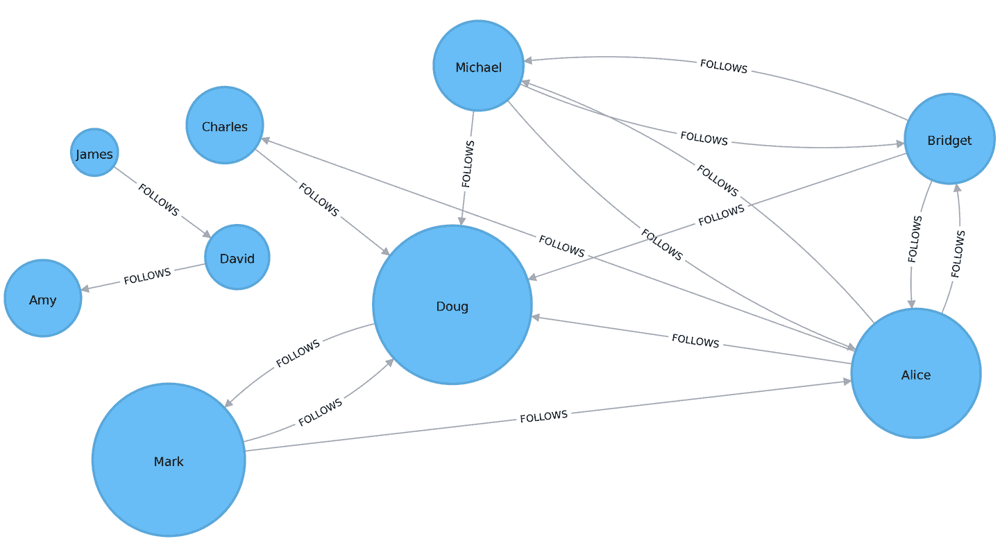

###### 图 5-13\. PageRank 的可视化

###### 提示

与我们的 Spark 示例类似，我们在其中运行 PageRank 算法的图中的关系没有权重，因此每个关系被视为平等。通过在传递给 PageRank 过程的配置中包含 `weightProperty` 属性，可以考虑关系权重。例如，如果关系具有包含权重的属性 `weight`，则我们将以下配置传递给过程：`weightProperty: "weight"`。

## PageRank 变种：个性化 PageRank

个性化 PageRank（PPR）是 PageRank 算法的一种变体，它从特定节点的视角计算图中节点的重要性。对于 PPR，随机跳转会回到给定的一组起始节点。这种偏见和本地化使 PPR 对高度定向的推荐非常有用。

### 使用 Apache Spark 的个性化 PageRank

通过传递`sourceId`参数，我们可以计算给定节点的个性化 PageRank 分数。以下代码计算了 Doug 的 PPR：

```
me = "Doug"
results = g.pageRank(resetProbability=0.15, maxIter=20, sourceId=me)
people_to_follow = results.vertices.sort("pagerank", ascending=False)

already_follows = list(g.edges.filter(f"src = '{me}'").toPandas()["dst"])
people_to_exclude = already_follows + [me]

people_to_follow[~people_to_follow.id.isin(people_to_exclude)].show()
```

此查询的结果可用于为 Doug 应该关注的人提供建议。请注意，我们还确保从最终结果中排除 Doug 已经关注的人，以及他自己。

如果我们在 pyspark 中运行该代码，我们会看到以下输出：

| id | pageRank |
| --- | --- |
| 爱丽丝 | 0.1650183746272782 |
| 迈克尔 | 0.048842467744891996 |
| 布里奇特 | 0.048842467744891996 |
| 查尔斯 | 0.03497796119878669 |
| 大卫 | 0.0 |
| 詹姆斯 | 0.0 |
| 艾米 | 0.0 |

对于 Doug 应该关注的人，爱丽丝是最好的建议，但我们也可以建议迈克尔和布里奇特。

# 摘要

中心性算法是识别网络中的影响者的一个优秀工具。在本章中，我们学习了典型的中心性算法：度中心性、接近度中心性、介数中心性和 PageRank。我们还涵盖了多种变体，以解决长运行时间和孤立组件的问题，以及替代用途的选项。

中心性算法有许多广泛的用途，我们鼓励对其进行多方面的探索分析。你可以应用我们所学的知识来找到传播信息的最佳接触点，找到控制资源流动的隐藏经纪人，并揭示潜伏在阴影中的间接势力者。

接下来，我们将转向研究关注组和分区的社区检测算法。
