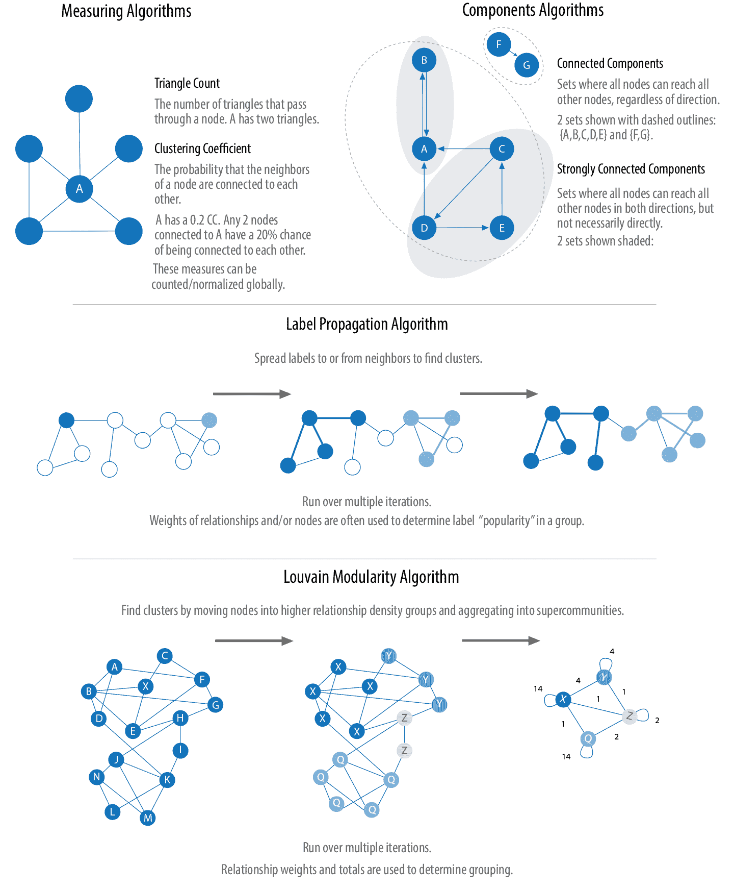
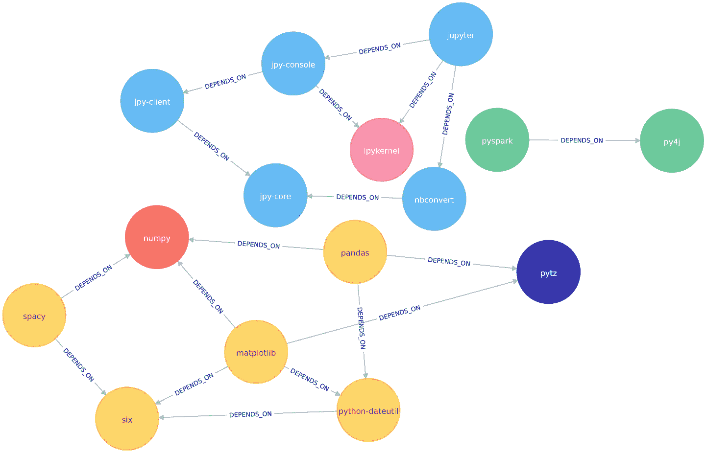

# 第六章：社区检测算法

在所有类型的网络中，社区形成都很常见，识别它们对于评估群体行为和 emergent 现象至关重要。找到社区的一般原则是其成员在组内的关系比与组外节点的关系更多。识别这些相关集合揭示了节点的簇、孤立群体和网络结构。这些信息有助于推断同行群体的类似行为或偏好，估计稳健性，找到嵌套关系，并为其他分析准备数据。社区检测算法也常用于生成网络可视化进行常规检查。

我们将详细介绍最具代表性的社区检测算法：

+   三角形计数和聚类系数用于总体关系密度

+   用于查找连接簇的强连通分量和连通分量

+   标签传播用于基于节点标签快速推断群组

+   洛夫镇模块性用于查看分组质量和层次结构

我们将解释算法的工作原理，并在 Apache Spark 和 Neo4j 中展示示例。对于仅在一个平台上可用的算法，我们将仅提供一个示例。我们使用加权关系来进行这些算法，因为它们通常用于捕捉不同关系的重要性。

图 6-1 概述了这里涵盖的社区检测算法之间的差异，而表 6-1 则提供了每个算法计算的快速参考及其示例用法。



###### 图 6-1\. 代表性社区检测算法

###### 注意

我们将术语*集合*、*分区*、*群*、*组*和*社区*互换使用。这些术语是指相似节点可以被分组的不同方式。社区检测算法也被称为聚类和分区算法。在每个部分中，我们使用文献中最突出的术语来描述特定算法。

表 6-1\. 社区检测算法概述

| 算法类型 | 功能 | 示例用法 | Spark 示例 | Neo4j 示例 |
| --- | --- | --- | --- | --- |

|

三角形计数和聚类系数

|

衡量形成三角形的节点数量以及节点倾向于聚集在一起的程度

|

估计组的稳定性以及网络是否可能表现出图形中紧密结合的群集小世界行为

|

是的

|

是的

|

|

强连通分量

|

查找每个节点都可以从同一组内的每个其他节点*遵循关系的方向*到达的组

|

根据组成员或相似项目进行产品推荐

|

是的

|

是的

|

|

连通分量

|

找到每个节点都可以从同一组中的任何其他节点访问的群组，*无论关系的方向如何*。

|

快速对其他算法进行分组，并识别孤立群体

|

是的

|

是的

|

|

标签传播

|

通过基于邻域多数传播标签来推断群集

|

理解社区中的共识或发现可能的联合处方药物的危险组合

|

是的

|

是的

|

|

模块性 Louvin

|

通过比较关系权重和密度与定义的估计或平均值，最大化假设的分组准确性

|

在欺诈分析中，评估一个群组是否只有少量离散的不良行为，或者是否正在行动作为一个欺诈集团

|

否

|

是的

|

首先，我们将描述我们示例数据的数据，并演示将数据导入 Spark 和 Neo4j 的步骤。算法按照表 6-1 中列出的顺序进行介绍。对于每个算法，您将找到一个简短的描述，并且有关何时使用它的建议。大多数部分还包括何时使用相关算法的指导。我们在每个算法部分的末尾使用示例数据演示示例代码。

###### 提示

使用社区检测算法时，要注意关系的密度。

如果图非常密集，可能会导致所有节点聚集在一个或几个簇中。您可以通过度、关系权重或相似度指标进行过滤来抵消这一点。

另一方面，如果图中连接的节点很少而稀疏，可能会导致每个节点都位于自己的簇中。在这种情况下，尝试整合更多包含更多相关信息的附加关系类型。

# 示例图数据：软件依赖图

依赖图在展示社区检测算法之间有时微妙差异方面特别适用，因为它们往往更连接且分层。本章节的示例是针对包含 Python 库依赖关系的图表运行的，尽管依赖图在软件到能源网络等各个领域都有应用。开发者使用这类软件依赖图来跟踪软件项目中的传递性依赖和冲突。你可以从[书籍的 GitHub 仓库](https://bit.ly/2FPgGVV)下载节点和文件。

表 6-2\. *sw-nodes.csv*

| id |
| --- |
| six |
| pandas |
| numpy |
| python-dateutil |
| pytz |
| pyspark |
| matplotlib |
| spacy |
| py4j |
| jupyter |
| jpy-console |
| nbconvert |
| ipykernel |
| jpy-client |
| jpy-core |
|  |

表 6-3\. *sw-relationships.csv*

| src | dst | relationship |
| --- | --- | --- |
| pandas | numpy | DEPENDS_ON |
| pandas | pytz | DEPENDS_ON |
| pandas | python-dateutil | DEPENDS_ON |
| python-dateutil | six | DEPENDS_ON |
| pyspark | py4j | DEPENDS_ON |
| matplotlib | numpy | DEPENDS_ON |
| matplotlib | python-dateutil | DEPENDS_ON |
| matplotlib | six | DEPENDS_ON |
| matplotlib | pytz | DEPENDS_ON |
| spacy | six | DEPENDS_ON |
| spacy | numpy | DEPENDS_ON |
| jupyter | nbconvert | DEPENDS_ON |
| jupyter | ipykernel | DEPENDS_ON |
| jupyter | jpy-console | DEPENDS_ON |
| jpy-console | jpy-client | DEPENDS_ON |
| jpy-console | ipykernel | DEPENDS_ON |
| jpy-client | jpy-core | DEPENDS_ON |
| nbconvert | jpy-core | DEPENDS_ON |

图 6-2 显示了我们希望构建的图。查看此图，我们可以看到有三个库的聚类。我们可以使用较小数据集上的可视化作为工具，帮助验证由社区检测算法得出的聚类。


###### 图 6-2\. 图模型

让我们从示例 CSV 文件在 Spark 和 Neo4j 中创建图形。

## 将数据导入到 Apache Spark

首先，我们将从 Apache Spark 和 GraphFrames 包中导入我们需要的包：

```
from graphframes import *
```

下面的函数从示例 CSV 文件创建一个 GraphFrame：

```
def create_software_graph():
    nodes = spark.read.csv("data/sw-nodes.csv", header=True)
    relationships = spark.read.csv("data/sw-relationships.csv", header=True)
    return GraphFrame(nodes, relationships)
```

现在让我们调用那个函数：

```
g = create_software_graph()
```

## 将数据导入到 Neo4j

接下来我们将为 Neo4j 执行相同操作。以下查询导入节点：

```
WITH "https://github.com/neo4j-graph-analytics/book/raw/master/data/" AS base
WITH base + "sw-nodes.csv" AS uri
LOAD CSV WITH HEADERS FROM uri AS row
MERGE (:Library {id: row.id})
```

并且这导入了关系：

```
WITH "https://github.com/neo4j-graph-analytics/book/raw/master/data/" AS base
WITH base + "sw-relationships.csv" AS uri
LOAD CSV WITH HEADERS FROM uri AS row
MATCH (source:Library {id: row.src})
MATCH (destination:Library {id: row.dst})
MERGE (source)-[:DEPENDS_ON]->(destination)
```

现在我们加载了我们的图形，就可以运行算法了！

# 三角形计数和聚类系数

三角形计数和聚类系数算法经常一起使用，因此它们一起呈现。三角形计数确定图中每个节点通过的三角形数量。三角形是三个节点的集合，其中每个节点与所有其他节点都有关系。可以全局运行三角形计数来评估我们的整体数据集。

###### 注

具有大量三角形的网络更可能表现出小世界结构和行为。

聚类系数算法的目标是衡量一个群体相对于其可以聚集的紧密程度。该算法在计算中使用三角形计数，该计数提供了现有三角形与可能关系的比率。值为 1 表示一个每个节点都连接到每个其他节点的团。

有两种类型的聚类系数：局部聚类和全局聚类。

## 局部聚类系数

节点的局部聚类系数是其邻居也连接的可能性。计算此分数涉及三角形计数。

通过将通过节点的三角形数量乘以两倍，然后除以组中最大关系数（始终是该节点的度数减一），可以找到节点的聚类系数。一个节点有五个关系的不同三角形和聚类系数的示例在图 6-3 中展示。


###### 图 6-3\. 节点 u 的三角形计数和聚类系数

注意在图 6-3 中，我们使用一个具有五个关系的节点，使得聚类系数似乎总是等于三角形数量的 10%。当我们改变关系的数量时，我们可以看到这并不总是成立。如果我们将第二个例子改为具有四个关系（和相同的两个三角形），那么系数为 0.33。

节点的聚类系数使用以下公式：

<math display="inline"><mrow><mi>C</mi> <mi>C</mi> <mrow><mo>(</mo> <mi>u</mi> <mo>)</mo></mrow> <mo>=</mo> <mfrac><mrow><mn>2</mn><msub><mi>R</mi> <mi>u</mi></msub></mrow> <mrow><msub><mi>k</mi> <mi>u</mi></msub> <mrow><mo>(</mo><msub><mi>k</mi> <mi>u</mi></msub> <mo>-</mo><mn>1</mn><mo>)</mo></mrow></mrow></mfrac></mrow></math>

其中：

+   *u*是一个节点。

+   *R(u)*是通过*u*的邻居的关系数量（可以通过通过*u*的三角形的数量来获得）。

+   *k(u)*是*u*的度数。

## 全局聚类系数

全局聚类系数是局部聚类系数的归一化和。

聚类系数为我们提供了一种有效的方法来找到明显的群体，如圈子，其中每个节点与所有其他节点都有关系，但我们也可以指定阈值来设置级别（例如，节点之间 40%连接）。

## 我何时应该使用三角计数和聚类系数？

当您需要确定群体的稳定性或作为计算其他网络测量的一部分时，请使用三角计数。三角计数在社交网络分析中很受欢迎，用于检测社区。

聚类系数可以提供随机选择的节点连接的概率。您还可以使用它快速评估特定组或整个网络的内聚性。这些算法一起用于估计韧性并寻找网络结构。

示例用例包括：

+   识别用于分类给定网站为垃圾内容的特征。这在[L. Becchetti 等人的论文“大规模图中局部三角计数的高效半流算法”](http://bit.ly/2ut0Lao)中有描述。

+   调查 Facebook 社交图的社区结构，在这里研究人员发现了用户密集的邻域，而在全球图中则较为稀疏。在 J. Ugander 等人的论文["Facebook 社交图的解剖学"](https://bit.ly/2TXWsTC)中可以找到这项研究。

+   基于它们之间的相互链接，探索网络的主题结构并检测具有共同主题的页面社区。有关更多信息，请参阅[J.-P. Eckmann 和 E. Moses 的论文“共链接的曲率揭示了全球网络中隐藏的主题层”](http://bit.ly/2YkCrFo)。

## 使用 Apache Spark 进行三角计数

现在我们准备执行三角计数算法。我们可以使用以下代码来执行此操作：

```
result = g.triangleCount()
(result.sort("count", ascending=False)
 .filter('count > 0')
 .show())
```

如果我们在 pyspark 中运行该代码，我们将看到以下输出：

| count | id |
| --- | --- |
| 1 | jupyter |
| 1 | python-dateutil |
| 1 | 六 |
| 1 | ipykernel |
| 1 | matplotlib |
| 1 | jpy-console |

在这个图中的一个三角形表明一个节点的两个邻居也是邻居。我们的六个库都参与了这样的三角形。

如果我们想知道哪些节点在这些三角形中？这就是 *triangle stream* 要做的事情。为此，我们需要 Neo4j。

## 使用 Neo4j 进行三角形分析

使用 Spark 无法获取三角形流，但我们可以使用 Neo4j 返回它：

```
CALL algo.triangle.stream("Library","DEPENDS_ON")
YIELD nodeA, nodeB, nodeC
RETURN algo.getNodeById(nodeA).id AS nodeA,
 algo.getNodeById(nodeB).id AS nodeB,
 algo.getNodeById(nodeC).id AS nodeC
```

执行此过程将给出以下结果：

| nodeA | nodeB | nodeC |
| --- | --- | --- |
| matplotlib | six | python-dateutil |
| jupyter | jpy-console | ipykernel |

我们看到与之前相同的六个库，但现在我们知道它们是如何连接的。matplotlib、six 和 python-dateutil 形成一个三角形。jupyter、jpy-console 和 ipykernel 形成另一个三角形。

我们可以在 Figure 6-4 中直观地看到这些三角形。


###### 图 6-4\. 软件依赖图中的三角形

## 使用 Neo4j 进行本地聚类系数

我们还可以计算局部聚类系数。以下查询将为每个节点计算此系数：

```
CALL algo.triangleCount.stream('Library', 'DEPENDS_ON')
YIELD nodeId, triangles, coefficient
WHERE coefficient > 0
RETURN algo.getNodeById(nodeId).id AS library, coefficient
ORDER BY coefficient DESC
```

执行此过程将给出以下结果：

| library | coefficient |
| --- | --- |
| ipykernel | 1.0 |
| jupyter | 0.3333333333333333 |
| jpy-console | 0.3333333333333333 |
| six | 0.3333333333333333 |
| python-dateutil | 0.3333333333333333 |
| matplotlib | 0.16666666666666666 |

ipykernel 的分数为 1，这意味着 ipykernel 的所有邻居彼此也是邻居。我们可以在 Figure 6-4 中清晰地看到这一点。这告诉我们，ipykernel 周围的社区非常紧密。

在这个代码示例中，我们已过滤掉系数为 0 的节点，但低系数的节点也可能很有趣。低分数可以表明节点是 [*结构孔*](http://stanford.io/2UTYVex) —— 连接到不同社区的节点，这些社区彼此之间没有其他连接。这是在 第五章 中讨论过的找到 *潜在* 桥梁的方法。

# 强连通分量

最强连通分量（SCC）算法是最早的图算法之一。SCC 在有向图中找到一组连接的节点集合，其中每个节点可以从同一集合中的任何其他节点双向到达。它的运行时间与节点数成比例，操作效率高。在 Figure 6-5 中，您可以看到 SCC 组中的节点不需要是直接的邻居，但集合中的所有节点之间必须存在方向路径。


###### 图 6-5\. 强连通分量

###### 注

将有向图分解为其强连通分量是 深度优先搜索算法 的经典应用。Neo4j 在其实施 SCC 算法中使用了 DFS。

## 什么时候应该使用强连通分量？

在图分析的早期阶段使用强连通分量作为一种方法，以了解图的结构或识别可能需要独立调查的紧密群集。强连通的组件可用于分析群体内相似的行为或倾向，例如推荐引擎的应用。

许多社区检测算法如 SCC 用于查找和折叠成单节点以供进一步的跨群体分析。你也可以使用 SCC 来可视化循环，例如找出可能因为每个子进程都在等待其他成员采取行动而发生死锁的过程。

例如用例包括：

+   查找所有成员直接或间接拥有每个其他成员股份的企业集合，例如 [“全球企业控制网络”](http://bit.ly/2UU4EAP)，一篇由 S. Vitali, J. B. Glattfelder 和 S. Battiston 分析的强大跨国公司网络。

+   在多跳无线网络中测量路由性能时计算不同网络配置的连通性。更多详情请见 [“在多跳无线网络中存在单向链接时的路由性能”](https://bit.ly/2uAJs7H)，作者 M. K. Marina 和 S. R. Das。

+   在许多只处理强连通图的图算法中，此算法作为第一步起作用。在社交网络中，我们发现许多强连通群体。在这些集合中，人们往往有相似的偏好，而 SCC 算法用于查找这些群体并建议尚未这样做的组内成员喜欢的页面或购买产品。

###### 提示

一些算法有逃逸无限循环的策略，但如果我们编写自己的算法或找到非终止的进程，我们可以使用 SCC 来检查循环。

## 使用 Apache Spark 进行强连通分量计算

从 Apache Spark 开始，我们首先从 Spark 和 GraphFrames 包导入我们需要的包：

```
from graphframes import *
from pyspark.sql import functions as F
```

现在我们准备执行强连通分量算法。我们将使用它来判断我们的图中是否存在循环依赖。

###### 注

两个节点只有在两个方向上都存在路径时才能位于同一个强连通分量中。

我们编写以下代码来实现这一点：

```
result = g.stronglyConnectedComponents(maxIter=10)
(result.sort("component")
 .groupby("component")
 .agg(F.collect_list("id").alias("libraries"))
 .show(truncate=False))
```

如果我们在 pyspark 中运行该代码，我们将看到以下输出：

| 组件 | 库 |
| --- | --- |
| 180388626432 | [jpy-core] |
| 223338299392 | [spacy] |
| 498216206336 | [numpy] |
| 523986010112 | [six] |
| 549755813888 | [pandas] |
| 558345748480 | [nbconvert] |
| 661424963584 | [ipykernel] |
| 721554505728 | [jupyter] |
| 764504178688 | [jpy-client] |
| 833223655424 | [pytz] |
| 910533066752 | [python-dateutil] |
| 936302870528 | [pyspark] |
| 944892805120 | [matplotlib] |
| 1099511627776 | [jpy-console] |
| 1279900254208 | [py4j] |

您可能注意到每个库节点都被分配到一个唯一的组件中。这是它所属的分区或子组，正如我们（希望！）所预期的那样，每个节点都在自己的分区中。这意味着我们的软件项目在这些库之间没有循环依赖。

## 使用 Neo4j 的强连通组件

让我们使用 Neo4j 再次运行相同的算法。执行以下查询来运行算法：

```
CALL algo.scc.stream("Library", "DEPENDS_ON")
YIELD nodeId, partition
RETURN partition, collect(algo.getNodeById(nodeId)) AS libraries
ORDER BY size(libraries) DESC
```

传递给此算法的参数如下：

`Library`

从图中加载的节点标签

`DEPENDS_ON`

从图中加载的关系类型

这是我们运行查询时将看到的输出：

| partition | libraries |
| --- | --- |
| 8 | [ipykernel] |
| 11 | [six] |
| 2 | [matplotlib] |
| 5 | [jupyter] |
| 14 | [python-dateutil] |
| 13 | [numpy] |
| 4 | [py4j] |
| 7 | [nbconvert] |
| 1 | [pyspark] |
| 10 | [jpy-core] |
| 9 | [jpy-client] |
| 3 | [spacy] |
| 12 | [pandas] |
| 6 | [jpy-console] |
| 0 | [pytz] |

与 Spark 示例一样，每个节点都在自己的分区中。

到目前为止，该算法只揭示了我们的 Python 库非常遵循规则，但让我们在图中创建一个循环依赖以增加趣味性。这应该意味着我们最终会得到一些节点在同一分区中。

以下查询添加了一个额外的库，创建了 py4j 和 pyspark 之间的循环依赖：

```
MATCH (py4j:Library {id: "py4j"})
MATCH (pyspark:Library {id: "pyspark"})
MERGE (extra:Library {id: "extra"})
MERGE (py4j)-[:DEPENDS_ON]->(extra)
MERGE (extra)-[:DEPENDS_ON]->(pyspark)
```

我们可以清楚地看到在 图 6-6 中创建的循环依赖。


###### 图 6-6\. pyspark、py4j 和额外内容之间的循环依赖

现在如果我们再次运行 SCC 算法，我们会看到一个略有不同的结果：

| partition | libraries |
| --- | --- |
| 1 | [pyspark, py4j, extra] |
| 8 | [ipykernel] |
| 11 | [six] |
| 2 | [matplotlib] |
| 5 | [jupyter] |
| 14 | [numpy] |
| 13 | [pandas] |
| 7 | [nbconvert] |
| 10 | [jpy-core] |
| 9 | [jpy-client] |
| 3 | [spacy] |
| 15 | [python-dateutil] |
| 6 | [jpy-console] |
| 0 | [pytz] |

pyspark、py4j 和额外内容都属于同一分区，并且 SCCs 帮助我们找到了循环依赖！

在我们继续下一个算法之前，我们将从图中删除额外的库及其关系：

```
MATCH (extra:Library {id: "extra"})
DETACH DELETE extra
```

# 连接组件

连接组件算法（有时称为并查集或弱连接组件）在无向图中查找连接节点集，其中每个节点都可以从同一集合中的任何其他节点到达。它与 SCC 算法不同，因为它只需要在一方向上存在节点对之间的路径，而 SCC 需要在两个方向上都存在路径。Bernard A. Galler 和 Michael J. Fischer 在他们 1964 年的论文 [“An Improved Equivalence Algorithm”](https://bit.ly/2WsPNxT) 中首次描述了这种算法。

## 何时使用连接组件？

与 SCC 一样，Connected Components 通常在分析的早期用于理解图的结构。由于其高效性，对于需要频繁更新的图形考虑此算法是很有帮助的。它可以快速显示在组之间共有的新节点，这对于诸如欺诈检测等分析非常有用。

养成习惯，运行 Connected Components 来测试图形是否连接，作为一般图形分析的准备步骤。执行这个快速测试可以避免在图的一个断开的组件上意外运行算法，并得到不正确的结果。

示例用例包括：

+   作为去重处理的一部分，跟踪数据库记录的聚类。去重是主数据管理应用中的重要任务；该方法在 A. Monge 和 C. Elkan 的[“An Efficient Domain-Independent Algorithm for Detecting Approximately Duplicate Database Records”](http://bit.ly/2CCNpgy)中有更详细的描述。

+   分析引用网络。一项研究使用 Connected Components 来确定网络连接的好坏，然后查看在将“中心”或“权威”节点从图中移动后连接性是否保持。这个用例在 Y. An、J. C. M. Janssen 和 E. E. Milios 的[“Characterizing and Mining Citation Graph of Computer Science Literature”](https://bit.ly/2U8cfi9)中有进一步解释。

## 使用 Apache Spark 进行 Connected Components

从 Apache Spark 开始，我们首先从 Spark 和 GraphFrames 包中导入所需的包：

```
from pyspark.sql import functions as F
```

现在我们准备执行 Connected Components 算法。

###### 注意

如果两个节点之间存在双向路径，它们可以位于同一个连接的组件中。

我们编写以下代码来完成这个任务：

```
result = g.connectedComponents()
(result.sort("component")
 .groupby("component")
 .agg(F.collect_list("id").alias("libraries"))
 .show(truncate=False))
```

如果我们在 pyspark 中运行该代码，将看到以下输出：

| component | libraries |
| --- | --- |
| 180388626432 | [jpy-core, nbconvert, ipykernel, jupyter, jpy-client, jpy-console] |
| 223338299392 | [spacy, numpy, six, pandas, pytz, python-dateutil, matplotlib] |
| 936302870528 | [pyspark, py4j] |

结果显示三个节点聚类，也可以在图 6-7 中看到。


###### 图 6-7\. 由 Connected Components 算法找到的聚类

在这个例子中，通过视觉检查非常容易看到有三个组件。这种算法在更大的图中表现其价值，那里视觉检查不可能或非常耗时。

## 使用 Neo4j 进行 Connected Components

我们还可以通过运行以下查询在 Neo4j 中执行此算法：

```
CALL algo.unionFind.stream("Library", "DEPENDS_ON")
YIELD nodeId,setId
RETURN setId, collect(algo.getNodeById(nodeId)) AS libraries
ORDER BY size(libraries) DESC
```

该算法传递的参数如下：

`Library`

从图中加载的节点标签

`DEPENDS_ON`

从图中加载的关系类型

这里是输出：

| setId | libraries |
| --- | --- |
| 2 | [pytz, matplotlib, spacy, six, pandas, numpy, python-dateutil] |
| 5 | [jupyter, jpy-console, nbconvert, ipykernel, jpy-client, jpy-core] |
| 1 | [pyspark, py4j] |

如预期的那样，我们得到了与 Spark 完全相同的结果。

到目前为止，我们介绍的两种社区检测算法都是确定性的：每次运行它们时都会返回相同的结果。我们接下来介绍的两种算法是非确定性算法的例子，即使在相同数据上多次运行它们也可能得到不同的结果。

# 标签传播

标签传播算法（LPA）是一种在图中查找社区的快速算法。在 LPA 中，节点根据其直接邻居选择其所属的群组。这个过程非常适合网络中群组不太清晰且可以使用权重来帮助节点确定自身所属社区的情况。此外，它也非常适合半监督学习，因为可以使用预分配的指示性节点标签来启动该过程。

该算法的直觉是，在密集连接的节点组中，一个单一标签可以迅速占据主导地位，但在稀疏连接的区域则会遇到困难。标签在密集连接的节点组中会被困住，当算法结束时具有相同标签的节点被视为属于同一社区。该算法通过将成员分配给具有最高组合关系和节点权重的标签邻域来解决重叠问题，其中节点可能属于多个群集。

LPA 是一个相对较新的算法，由 U. N. Raghavan、R. Albert 和 S. Kumara 在 2007 年提出，题为[“近线性时间算法用于检测大规模网络中的社区结构”](https://bit.ly/2Frb1Fu)。

图 6-8 展示了标签传播的两种变体，一种是简单的推送方法，另一种是更典型的依赖关系权重的拉取方法。拉取方法非常适合并行化处理。


###### 图 6-8\. 标签传播的两种变体

标签传播拉取方法通常使用的步骤包括：

1.  每个节点都使用唯一的标签（标识符）进行初始化，并且可以选择性地使用初步的“种子”标签。

1.  这些标签通过网络进行传播。

1.  在每次传播迭代中，每个节点将其标签更新为具有最大权重的节点的标签，该权重基于邻居节点及其关系的权重计算而得。平局将以统一且随机的方式解决。

1.  当每个节点的标签变为其邻居节点的大多数标签时，LPA 达到收敛状态。

随着标签的传播，密集连接的节点组迅速达成唯一标签的共识。在传播结束时，只会剩下少数标签，具有相同标签的节点属于同一社区。

## 半监督学习与种子标签

与其他算法相比，标签传播可以在同一图上多次运行时返回不同的社区结构。LPA 评估节点的顺序可以影响其返回的最终社区。

当一些节点被赋予初步标签（即种子标签）而其他节点未被标记时，解决方案的范围会缩小。未标记的节点更有可能采纳初步标签。

这种使用标签传播可以被视为*半监督学习*方法来发现社区。半监督学习是一类机器学习任务和技术，它在少量标记数据以及大量未标记数据上操作。我们还可以在图表不断演化的过程中重复运行算法。

最后，标签传播有时无法收敛于单一解决方案。在这种情况下，我们的社区结果将在几个非常相似的社区之间不断翻转，而算法则永远不会完成。种子标签帮助指导其走向解决方案。Spark 和 Neo4j 使用设定的最大迭代次数来避免无休止的执行。您应该为您的数据测试迭代设置，以平衡准确性和执行时间。

## 何时应该使用标签传播？

在大规模网络中使用标签传播进行初始社区检测，特别是当权重可用时。该算法可以并行化，因此在图分区方面非常快速。

示例用例包括：

+   作为语义分析的一部分，分配推文的极性。在这种情况下，来自分类器的正负种子标签与 Twitter 跟随者图结合使用。更多信息，请参见[“基于词汇链接和跟随者图的 Twitter 极性分类的标签传播”](https://bit.ly/2FBq2pv)，一篇由 M. Speriosu 等人撰写的论文。

+   根据化学相似性和副作用概况，寻找潜在危险的联合处方药组合。参见[“基于临床副作用的药物相互作用的标签传播预测”](https://www.nature.com/articles/srep12339)，一篇由 P. Zhang 等人撰写的论文。

+   推断对话特征和用户意图用于机器学习模型。有关更多信息，请参见[“基于 Wikidata 图的标签传播进行 DST 的特征推断”](https://bit.ly/2FtGpTK)，一篇由 Y. Murase 等人撰写的论文。

## 使用 Apache Spark 进行标签传播

从 Apache Spark 开始，我们首先从 Spark 和 GraphFrames 包中导入所需的包：

```
from pyspark.sql import functions as F
```

现在我们准备执行标签传播算法。我们编写以下代码来实现这一点：

```
result = g.labelPropagation(maxIter=10)
(result
.sort("label")
.groupby("label")
.agg(F.collect_list("id"))
.show(truncate=False))
```

如果我们在 pyspark 中运行该代码，我们会看到以下输出：

| 标签 | collect_list(id) |
| --- | --- |
| 180388626432 | [jpy-core, jpy-console, jupyter] |
| 223338299392 | [matplotlib, spacy] |
| 498216206336 | [python-dateutil, numpy, six, pytz] |
| 549755813888 | [pandas] |
| 558345748480 | [nbconvert, ipykernel, jpy-client] |
| 936302870528 | [pyspark] |
| 1279900254208 | [py4j] |

与 Connected Components 相比，本例中的库群集更多。 LPA 比连接组件对于确定群集的方式更不严格。使用标签传播，两个邻居（直接连接的节点）可能被发现在不同的群集中。然而，使用连接组件时，节点总是与其邻居在同一个群集中，因为该算法严格基于关系进行分组。

在我们的示例中，最明显的区别是 Jupyter 库被分成两个社区——一个包含库的核心部分，另一个包含面向客户端的工具。

## 使用 Neo4j 进行标签传播

现在让我们尝试使用 Neo4j 相同的算法。我们可以通过运行以下查询来执行 LPA：

```
CALL algo.labelPropagation.stream("Library", "DEPENDS_ON",
 { iterations: 10 })
YIELD nodeId, label
RETURN label,
       collect(algo.getNodeById(nodeId).id) AS libraries
ORDER BY size(libraries) DESC
```

传递给此算法的参数是：

`Library`

从图中加载的节点标签

`DEPENDS_ON`

从图中加载的关系类型

`iterations: 10`

运行的最大迭代次数

这些是我们会看到的结果：

| label | libraries |
| --- | --- |
| 11 | [matplotlib, spacy, six, pandas, python-dateutil] |
| 10 | [jupyter, jpy-console, nbconvert, jpy-client, jpy-core] |
| 4 | [pyspark, py4j] |
| 8 | [ipykernel] |
| 13 | [numpy] |
| 0 | [pytz] |

结果，这些结果也可以在 图 6-9 中直观地看到，与 Apache Spark 得到的结果非常相似。



###### 图 6-9\. 标签传播算法找到的聚类

我们还可以假设图是无向的运行算法，这意味着节点将尝试从它们依赖的库以及依赖它们的库那里采用标签。

为此，我们向算法传递了 `DIRECTION:BOTH` 参数：

```
CALL algo.labelPropagation.stream("Library", "DEPENDS_ON",
 { iterations: 10, direction: "BOTH" })
YIELD nodeId, label
RETURN label,
       collect(algo.getNodeById(nodeId).id) AS libraries
ORDER BY size(libraries) DESC
```

如果我们运行它，我们会得到以下输出：

| label | libraries |
| --- | --- |
| 11 | [pytz, matplotlib, spacy, six, pandas, numpy, python-dateutil] |
| 10 | [nbconvert, jpy-client, jpy-core] |
| 6 | [jupyter, jpy-console, ipykernel] |
| 4 | [pyspark, py4j] |

聚类数从六个减少到四个，matplotlib 部分图中的所有节点现在被分组在一起。在 图 6-10 中可以更清楚地看到这一点。


###### 图 6-10\. 忽略关系方向时标签传播算法找到的聚类

尽管在此数据上运行标签传播的结果在无向和有向计算中相似，但在复杂的图形中，您会看到更显著的差异。这是因为忽略方向会导致节点尝试采用更多的标签，而不考虑关系来源。

# Louvain 模块化

Louvain 模块化算法通过比较社区密度来找到聚类，并将节点分配到不同的组中。您可以将其视为尝试通过不同的分组达到全局最优的“假设”分析。

2008 年提出的[Louvain 算法](https://arxiv.org/pdf/0803.0476.pdf)是速度最快的基于模块性的算法之一。除了检测社群外，它还揭示了不同尺度上的社群层次结构。这对于理解网络在不同粒度水平上的结构非常有用。

Louvain 通过比较簇内连接密度与平均或随机样本来量化节点分配到群组的好坏程度。这种社群分配度量称为*模块性*。

### 基于质量的通过模块性进行分组

模块性是一种通过将图分区为更粗粒度的模块（或簇），然后测量群集的强度来揭示社群的技术。与仅查看簇内连接密度不同，此方法比较给定簇内的关系密度与簇间的密度。这些群集质量的度量称为模块性。

模块性算法在局部和全局上优化社群，使用多次迭代来测试不同的分组和增加粗粒度。这种策略识别社群层次结构，并提供对整体结构的广泛理解。然而，所有的模块性算法都存在两个缺点：

+   它们将较小的社群合并为较大的社群。

+   可能会出现一个高原，多个具有类似模块性的分区选项形成局部极大值，并阻止进展。

欲了解更多信息，请参阅 B.H. Good、Y.-A. de Montjoye 和 A. Clauset 的论文[“The Performance of Modularity Maximization in Practical Contexts”](https://arxiv.org/abs/0910.0165)。

起初，Louvain 模块性算法在所有节点上局部优化模块性，找到小的社群；然后将每个小社群组合成一个更大的合并节点，并重复第一步，直到达到全局最优。

该算法由两个步骤的重复应用组成，如 Figure 6-12 所示。


###### 图 6-12\. Louvain 算法过程

Louvain 算法的步骤包括：

1.  将节点“贪婪”分配到社群中，优先考虑模块性的局部优化。

1.  基于第一步找到的社群定义更粗粒度网络。这个粗粒度网络将在算法的下一次迭代中使用。

直到不再存在能增加模块性的重新分配社群的可能性为止，这两个步骤将被重复执行。

第一优化步骤的一部分是评估一个群体的模块性。Louvain 使用以下公式来实现这一点：

<math display="inline"><mrow><mi>Q</mi> <mo>=</mo> <mfrac><mn>1</mn> <mrow><mn>2</mn><mi>m</mi></mrow></mfrac> <munder><mo>∑</mo> <mrow><mi>u</mi><mo>,</mo><mi>v</mi></mrow></munder> <mfenced separators="" open="[" close="]"><msub><mi>A</mi> <mrow><mi>u</mi><mi>v</mi></mrow></msub> <mo>-</mo> <mfrac><mrow><msub><mi>k</mi> <mi>u</mi></msub> <msub><mi>k</mi> <mi>v</mi></msub></mrow> <mrow><mn>2</mn><mi>m</mi></mrow></mfrac></mfenced> <mi>δ</mi> <mrow><mo>(</mo> <msub><mi>c</mi> <mi>u</mi></msub> <mo>,</mo> <msub><mi>c</mi> <mi>v</mi></msub> <mo>)</mo></mrow></mrow></math>

其中：

+   *u* 和 *v* 是节点。

+   *m* 是整个图中的总关系权重（*2m* 是模块性公式中常见的归一化值）。

+   <math display="inline"><mrow><msub><mi>A</mi> <mrow><mi>u</mi><mi>v</mi></mrow></msub> <mo>-</mo> <mfrac><mrow><msub><mi>k</mi> <mi>u</mi></msub> <msub><mi>k</mi> <mi>v</mi></msub></mrow> <mrow><mn>2</mn><mi>m</mi></mrow></mfrac></mrow></math> 是*u*和*v*之间的关系强度，相比于我们预期的随机分配这些节点在网络中的情况（倾向于平均值）。

    +   <math display="inline"><msub><mi>A</mi> <mrow><mi>u</mi><mi>v</mi></mrow></msub></math> 是*u*和*v*之间的关系权重。

    +   <math display="inline"><msub><mi>k</mi> <mi>u</mi></msub></math> 是*u*的关系权重之和。

    +   <math display="inline"><msub><mi>k</mi> <mi>v</mi></msub></math> 是*v*的关系权重之和。

+   <math display="inline"><mrow><mi>δ</mi> <mo>(</mo> <msub><mi>c</mi> <mi>u</mi></msub> <mo>,</mo> <msub><mi>c</mi> <mi>v</mi></msub> <mo>)</mo></mrow></math> 如果*u*和*v*被分配到相同的社区则等于 1，否则为 0。

第一步的另一部分评估了如果一个节点移动到另一组会导致模块性变化。Louvain 使用这个公式的一个更复杂的变体，然后确定最佳的组分配。

## 何时使用 Louvain？

使用 Louvain 模块性在庞大的网络中查找社区。该算法应用一种启发式方法，而不是精确的模块性，这在计算上是昂贵的。因此，Louvain 可以用于标准模块性算法可能遇到困难的大型图形中。

Louvain 还对评估复杂网络结构非常有帮助，特别是揭示多层次的层次结构，比如在犯罪组织中可能发现的结构。该算法可以提供结果，您可以放大不同粒度的层次并找到子社区内的子社区。

示例用例包括：

+   发现网络安全应用中的快速社区检测的 2016 年研究中使用了 Louvain 算法，作者为 S. V. Shanbhaq（链接地址见[这里](https://bit.ly/2FAxalS)）。一旦检测到这些社区，它们可以用来检测网络攻击。

+   基于在线社交平台（如 Twitter 和 YouTube）文档中术语的共现来提取主题作为主题建模过程的一部分。该方法在 G. S. Kido、R. A. Igawa 和 S. Barbon Jr.的论文中有描述，链接地址见[这里](http://bit.ly/2UbCCUl)。

+   在描述的“人类脑功能网络中的层次模块性”（链接地址见[这里](https://bit.ly/2HFHXxu)）中，寻找大脑功能网络内的层次社区结构。

###### 警告

包括 Louvain 在内的模块化优化算法存在两个问题。首先，算法可能会忽视大网络中的小社区。您可以通过审查中间整合步骤来解决这个问题。其次，在具有重叠社区的大图中，模块化优化器可能无法正确确定全局最大值。在后一种情况下，我们建议使用任何模块化算法作为粗略估计的指导，而不是完全准确。

## Louvain 与 Neo4j

让我们看看 Louvain 算法的实际效果。我们可以执行以下查询来运行我们的图上的算法：

```
CALL algo.louvain.stream("Library", "DEPENDS_ON")
YIELD nodeId, communities
RETURN algo.getNodeById(nodeId).id AS libraries, communities
```

传递给此算法的参数如下：

`Library`

从图中加载的节点标签

`DEPENDS_ON`

从图中加载的关系类型

这些是结果：

| libraries | communities |
| --- | --- |
| pytz | [0, 0] |
| pyspark | [1, 1] |
| matplotlib | [2, 0] |
| spacy | [2, 0] |
| py4j | [1, 1] |
| jupyter | [3, 2] |
| jpy-console | [3, 2] |
| nbconvert | [4, 2] |
| ipykernel | [3, 2] |
| jpy-client | [4, 2] |
| jpy-core | [4, 2] |
| six | [2, 0] |
| pandas | [0, 0] |
| numpy | [2, 0] |
| python-dateutil | [2, 0] |

`communities`列描述了节点在两个级别上所属的社区。数组中的最后一个值是最终社区，另一个是中间社区。

分配给中间和最终社区的数字只是没有可测量含义的标签。将其视为指示节点属于哪个社区的标签，例如“属于标记为 0 的社区”，“标记为 4 的社区”等。

例如，matplotlib 的结果是`[2,0]`。这意味着 matplotlib 的最终社区标记为`0`，其中间社区标记为`2`。

如果我们使用算法的写版本来存储这些社区，然后在之后查询，就能更容易地看出它是如何工作的。以下查询将运行 Louvain 算法，并将结果存储在每个节点的`communities`属性中：

```
CALL algo.louvain("Library", "DEPENDS_ON")
```

我们还可以使用算法的流式处理版本来存储生成的社区，然后调用`SET`子句来存储结果。以下查询显示了我们可以这样做的方式：

```
CALL algo.louvain.stream("Library", "DEPENDS_ON")
YIELD nodeId, communities
WITH algo.getNodeById(nodeId) AS node, communities
SET node.communities = communities
```

一旦我们运行了这些查询中的任何一个，我们可以编写以下查询来查找最终的聚类：

```
MATCH (l:Library)
RETURN l.communities[-1] AS community, collect(l.id) AS libraries
ORDER BY size(libraries) DESC
```

`l.communities[-1]`返回此属性存储的底层数组中的最后一项。

运行查询产生以下输出：

| community | libraries |
| --- | --- |
| 0 | [pytz, matplotlib, spacy, six, pandas, numpy, python-dateutil] |
| 2 | [jupyter, jpy-console, nbconvert, ipykernel, jpy-client, jpy-core] |
| 1 | [pyspark, py4j] |

这种聚类与我们在连接组件算法中看到的聚类相同。

matplotlib 与 pytz、spacy、six、pandas、numpy 和 python-dateutil 处于同一个社区。我们可以在 Figure 6-13 中更清楚地看到这一点。


###### 图 6-13。Louvain 算法找到的群集

Louvain 算法的另一个特点是我们还可以看到中间的聚类。这将展示比最终层次结构更细粒度的聚类：

```
MATCH (l:Library)
RETURN l.communities[0] AS community, collect(l.id) AS libraries
ORDER BY size(libraries) DESC
```

运行该查询会得到以下输出：

| community | libraries |
| --- | --- |
| 2 | [matplotlib, spacy, six, python-dateutil] |
| 4 | [nbconvert, jpy-client, jpy-core] |
| 3 | [jupyter, jpy-console, ipykernel] |
| 1 | [pyspark, py4j] |
| 0 | [pytz, pandas] |
| 5 | [numpy] |

matplotlib 社区的库现在已经分解成三个较小的社区：

+   matplotlib、spacy、six 和 python-dateutil

+   pytz 和 pandas

+   numpy

我们可以在 图 6-14 中直观地看到这种分解。


###### 图 6-14\. Louvain 算法找到的中间聚类

尽管此图仅显示了两层层次结构，但如果我们在更大的图上运行此算法，我们会看到一个更复杂的层次结构。Louvain 显示的中间聚类对于检测可能不会被其他社区检测算法检测到的精细社区非常有用。

# 验证社区

社区检测算法通常有相同的目标：识别群体。然而，由于不同的算法从不同的假设开始，它们可能会发现不同的社区。这使得在特定问题上选择合适的算法更具挑战性，也需要进行一些探索。

大多数社区检测算法在群体内部的关系密度较高时表现良好，但真实世界的网络通常不那么明显。通过将我们的结果与基于已知社区数据的基准进行比较，我们可以验证找到的社区的准确性。

最知名的两个基准测试是 Girvan-Newman（GN）和 Lancichinetti–Fortunato–Radicchi（LFR）算法。这些算法生成的参考网络非常不同：GN 生成一个更均匀的随机网络，而 LFR 创建一个更异质的图，其中节点度和社区大小按照幂律分布。

由于我们测试的准确性取决于使用的基准，因此将我们的基准与数据集匹配非常重要。尽可能地寻找类似的密度、关系分布、社区定义和相关领域。

# 总结

社区检测算法对于理解图中节点如何分组在一起非常有用。

在本章中，我们首先学习了关于三角计数和聚类系数算法。然后我们转向了两种确定性社区检测算法：强连通组件和连通组件。这些算法对于在图分析管道的早期阶段获取图结构的感觉非常有用，因为它们对社区的定义非常严格。

我们已经完成了标签传播和 Louvain 两个非确定性算法，它们能更好地检测更细粒度的社区。Louvain 还向我们展示了不同尺度上的社区层次结构。

在下一章中，我们将使用一个更大的数据集，学习如何将这些算法结合起来，以便更深入地理解我们的连接数据。
