# 第七章：实践中的图算法

随着我们对特定数据集上不同算法的行为越来越熟悉，我们对图分析的方法也在不断发展。在本章中，我们将通过几个示例来更好地理解如何使用来自 Yelp 和美国交通部的数据进行大规模图数据分析。我们将介绍 Neo4j 中的 Yelp 数据分析，包括数据的概述、结合算法进行旅行推荐以及挖掘用户和业务数据进行咨询。在 Spark 中，我们将研究美国航空数据，以了解交通模式和延误情况，以及不同航空公司之间的机场连接情况。

因为路径查找算法非常简单，我们的示例将使用这些中心性和社区检测算法：

+   使用 PageRank 查找有影响力的 Yelp 评论者，然后将他们对特定酒店的评分进行关联

+   使用介数中心性来发现连接到多个群体的评论者，然后提取他们的偏好

+   使用标签传播和投影创建类似 Yelp 业务的超级类别

+   使用度中心性快速识别美国交通数据集中的机场枢纽

+   使用强连通分量来查看美国机场路线的群集

# 使用 Neo4j 分析 Yelp 数据

Yelp 帮助人们基于评论、偏好和推荐找到本地业务。截至 2018 年底，平台上已有超过 1.8 亿条评论。自 2013 年以来，Yelp 一直举办[Yelp 数据集挑战](https://bit.ly/2Txz0rg)，鼓励人们探索和研究 Yelp 的开放数据集。

到 2018 年第 12 轮（进行中）挑战为止，开放数据集包含：

+   超过 700 万条评论和提示

+   超过 150 万用户和 28 万张图片

+   超过 18.8 万家企业，拥有 140 万个属性

+   10 个大都市区

自推出以来，该数据集变得非常受欢迎，已有[hundreds of academic papers](https://bit.ly/2upiaRz)使用这些材料进行撰写。Yelp 数据集代表了非常结构良好且高度互联的真实数据。这是一个展示图算法的绝佳案例，您也可以下载并探索。

## Yelp 社交网络

除了撰写和阅读有关企业的评论外，Yelp 用户还形成了一个社交网络。用户可以在浏览 Yelp.com 时向其他用户发送朋友请求，或者他们可以连接他们的通讯录或 Facebook 图谱。

Yelp 数据集还包括一个社交网络。图 7-1 是马克的 Yelp 档案中朋友部分的屏幕截图。


###### 图 7-1. 马克的 Yelp 档案

除了 Mark 需要更多朋友这一事实之外，我们已经准备就绪。为了说明我们如何在 Neo4j 中分析 Yelp 数据，我们将使用一个场景，假设我们为旅行信息业务工作。我们将首先探索 Yelp 数据，然后看看如何帮助人们使用我们的应用程序计划旅行。我们将详细介绍如何为像拉斯维加斯这样的大城市找到住宿和活动的好推荐。

我们业务场景的另一部分将涉及为旅行目的地企业提供咨询。在一个示例中，我们将帮助酒店识别有影响力的访客，然后确定他们应该针对的跨促销项目的企业。

## 数据导入

有许多不同的方法可以将数据导入 Neo4j，包括 [导入工具](https://bit.ly/2UTx26g)、我们在早期章节中看到的 [`LOAD CSV` 命令](https://bit.ly/2CCfcgR)，以及 [Neo4j 驱动程序](https://bit.ly/2JDAr7U)。

对于 Yelp 数据集，我们需要一次性导入大量数据，因此导入工具是最佳选择。详细信息请参见 “Neo4j 批量数据导入和 Yelp”。

## 图模型

Yelp 数据以图模型的形式表示，如 图 7-2 所示。

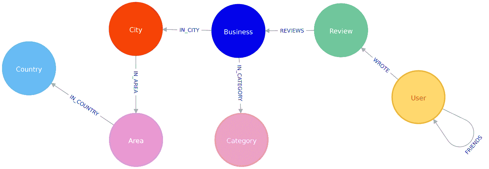

###### 图 7-2\. Yelp 图模型

我们的图包含带有 `User` 标签的节点，这些节点与其他 `Users` 具有 `FRIENDS` 关系。`Users` 还会对 `Business` 写出 `Reviews` 和提示。所有元数据都存储为节点的属性，除了业务类别，业务类别由单独的 `Category` 节点表示。对于位置数据，我们已将 `City`、`Area` 和 `Country` 属性提取到子图中。在其他用例中，将其他属性提取到节点中，如日期，或将节点折叠到关系中，如评论，可能也是有意义的。

Yelp 数据集还包括用户提示和照片，但我们在示例中不会使用它们。

## Yelp 数据快速概述

一旦我们在 Neo4j 中加载了数据，我们将执行一些探索性查询。我们会询问每个类别中有多少节点，或者存在什么类型的关系，以了解 Yelp 数据的概况。以前我们在 Neo4j 示例中展示了 Cypher 查询，但我们可能会从另一种编程语言执行这些查询。由于 Python 是数据科学家首选的语言，因此在本节中，当我们想要将结果连接到 Python 生态系统中的其他库时，我们将使用 Neo4j 的 Python 驱动程序。如果我们只想显示查询的结果，我们将直接使用 Cypher。

我们还将展示如何将 Neo4j 与流行的 pandas 库结合使用，该库在数据库外进行数据整理非常有效。我们将看到如何使用 tabulate 库来美化我们从 pandas 获取的结果，以及如何使用 matplotlib 创建数据的可视化表示。

我们还将使用 Neo4j 的 APOC 库来帮助我们编写更强大的 Cypher 查询。关于 APOC 的更多信息，请参阅“APOC 和其他 Neo4j 工具”。

让我们首先安装 Python 库：

pip install neo4j-driver tabulate pandas matplotlib

一旦完成，我们将导入这些库：

```
from neo4j.v1 import GraphDatabase
import pandas as pd
from tabulate import tabulate
```

在 macOS 上导入 matplotlib 可能有点麻烦，但以下几行代码应该可以解决问题：

```
import matplotlib
matplotlib.use('TkAgg')
import matplotlib.pyplot as plt
```

如果您在其他操作系统上运行，可能不需要中间行。现在让我们创建一个指向本地 Neo4j 数据库的 Neo4j 驱动程序实例：

```
driver = GraphDatabase.driver("bolt://localhost", auth=("neo4j", "neo"))
```

###### 注意

您需要更新驱动程序的初始化，以使用您自己的主机和凭据。

要开始，让我们查看节点和关系的一些常规数字。以下代码计算数据库中节点标签的基数（即计算每个标签的节点数）：

```
result = {"label": [], "count": []}
with driver.session() as session:
    labels = [row["label"] for row in session.run("CALL db.labels()")]
    for label in labels:
        query = f"MATCH (:`{label}`) RETURN count(*) as count"
        count = session.run(query).single()["count"]
        result["label"].append(label)
        result["count"].append(count)

df = pd.DataFrame(data=result)
print(tabulate(df.sort_values("count"), headers='keys',
                              tablefmt='psql', showindex=False))
```

如果我们运行该代码，我们将看到每个标签的节点数：

| 标签 | count |
| --- | --- |
| 国家 | 17 |
| 区域 | 54 |
| 城市 | 1093 |
| 类别 | 1293 |
| 业务 | 174567 |
| 用户 | 1326101 |
| Review | 5261669 |

我们还可以通过以下代码创建关系基数的视觉表示：

```
plt.style.use('fivethirtyeight')

ax = df.plot(kind='bar', x='label', y='count', legend=None)

ax.xaxis.set_label_text("")
plt.yscale("log")
plt.xticks(rotation=45)
plt.tight_layout()
plt.show()
```

我们可以看到此代码生成的图表在图 7-3 中。请注意，此图表使用对数刻度。

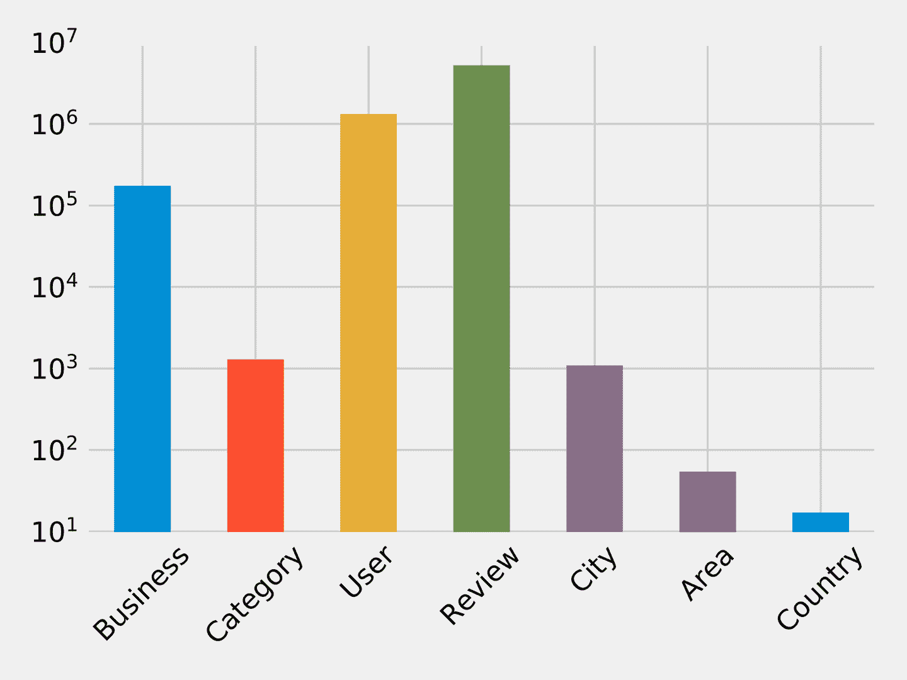

###### 图 7-3\. 每个标签类别的节点数

同样，我们可以计算关系的基数：

```
result = {"relType": [], "count": []}
with driver.session() as session:
    rel_types = [row["relationshipType"] for row in session.run
                               ("CALL db.relationshipTypes()")]
    for rel_type in rel_types:
        query = f"MATCH ()-[:`{rel_type}`]->() RETURN count(*) as count"
        count = session.run(query).single()["count"]
        result["relType"].append(rel_type)
        result["count"].append(count)

df = pd.DataFrame(data=result)
print(tabulate(df.sort_values("count"), headers='keys',
                              tablefmt='psql', showindex=False))
```

如果我们运行该代码，我们将看到每种关系类型的数量：

| relType | count |
| --- | --- |
| IN_COUNTRY | 54 |
| IN_AREA | 1154 |
| IN_CITY | 174566 |
| IN_CATEGORY | 667527 |
| 编写 | 5261669 |
| 评论 | 5261669 |
| 朋友 | 10645356 |

我们可以看到关系的图表在图 7-4 中。与节点基数图表一样，此图表也使用对数刻度。

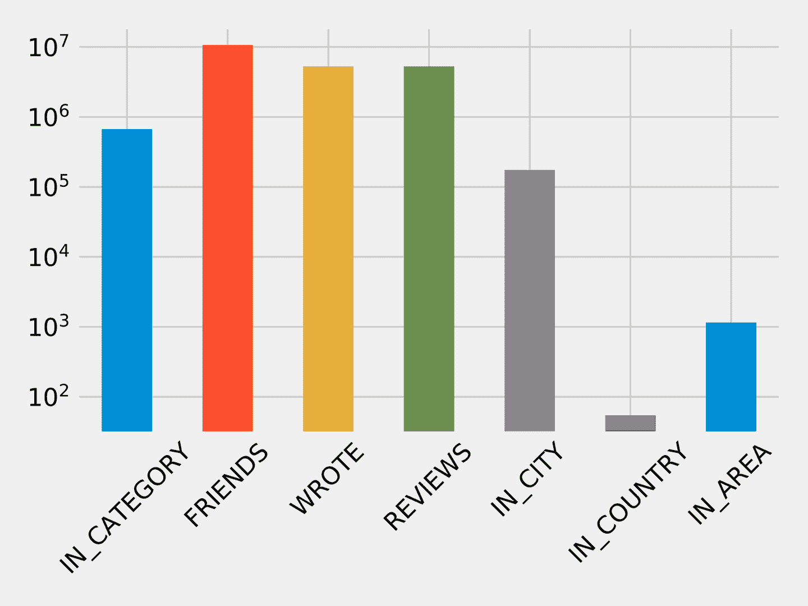

###### 图 7-4\. 按关系类型计算的关系数量

这些查询不应揭示任何令人惊讶的事情，但它们对于了解数据内容非常有用。这也作为确保数据正确导入的快速检查。

我们假设 Yelp 有很多酒店评论，但在我们专注于该行业之前，检查一下是有意义的。我们可以通过运行以下查询找出数据中有多少酒店业务以及它们有多少评论：

```
MATCH (category:Category {name: "Hotels"})
RETURN size((category)<-[:IN_CATEGORY]-()) AS businesses,
 size((:Review)-[:REVIEWS]->(:Business)-[:IN_CATEGORY]->
 (category)) AS reviews
```

这是结果：

| 企业 | 评论 |
| --- | --- |
| 2683 | 183759 |

我们有许多业务需要处理，还有很多评论！在下一节中，我们将根据我们的业务情景进一步探索数据。

## 旅行规划应用

要向我们的应用程序添加受欢迎的推荐，我们首先找到评价最多的酒店，作为预订的热门选择的启发。我们可以添加它们的评级来了解实际体验。要查看评价最多的 10 家酒店并绘制它们的评分分布图，我们使用以下代码：

```
# Find the 10 hotels with the most reviews
query = """
MATCH (review:Review)-[:REVIEWS]->(business:Business),
 (business)-[:IN_CATEGORY]->(category:Category {name: $category}),
 (business)-[:IN_CITY]->(:City {name: $city})
RETURN business.name AS business, collect(review.stars) AS allReviews
ORDER BY size(allReviews) DESC
LIMIT 10
"""

fig = plt.figure()
fig.set_size_inches(10.5, 14.5)
fig.subplots_adjust(hspace=0.4, wspace=0.4)

with driver.session() as session:
    params = { "city": "Las Vegas", "category": "Hotels"}
    result = session.run(query, params)
    for index, row in enumerate(result):
        business = row["business"]
        stars = pd.Series(row["allReviews"])

        total = stars.count()
        average_stars = stars.mean().round(2)

        # Calculate the star distribution
        stars_histogram = stars.value_counts().sort_index()
        stars_histogram /= float(stars_histogram.sum())

        # Plot a bar chart showing the distribution of star ratings
        ax = fig.add_subplot(5, 2, index+1)
        stars_histogram.plot(kind="bar", legend=None, color="darkblue",
                             title=f"{business}\nAve:
                                     {average_stars}, Total: {total}")

plt.tight_layout()
plt.show()
```

我们已经限定在城市和类别上，专注于拉斯维加斯的酒店。如果我们运行该代码，我们将得到 图 7-5 中的图表。请注意，x 轴表示酒店的星级评分，y 轴表示每个评分的总百分比。

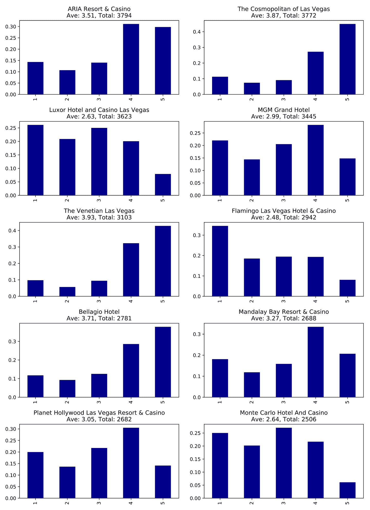

###### 图 7-5\. 评价最多的 10 家酒店，x 轴为星级数，y 轴为总体评分百分比

这些酒店有很多评论，远远超过任何人可能阅读的数量。最好显示我们用户最相关的评论内容，并在我们的应用程序中突出显示它们。为了进行此分析，我们将从基本的图探索转向使用图算法。

### 查找有影响力的酒店评论者

我们可以通过根据 Yelp 上评论者的 *影响力* 对评论进行排序来决定发布哪些评论。我们将在所有至少评论了三家酒店的用户的投影图上运行 PageRank 算法。从前面的章节中可以记得，投影可以帮助过滤掉不必要的信息，并且添加关系数据（有时是推测出来的）。我们将使用 Yelp 的朋友图（在 “Yelp 社交网络” 中介绍）作为用户之间的关系。PageRank 算法将揭示那些影响更多用户的评论者，即使他们并非直接的朋友关系。

###### 注意

如果两个人在 Yelp 上是朋友，它们之间会有两个 `FRIENDS` 关系。例如，如果 A 和 B 是朋友，那么从 A 到 B 和从 B 到 A 都会有一个 `FRIENDS` 关系。

我们需要编写一个查询，对具有三条以上评论的用户进行子图投影，然后在该投影子图上执行 PageRank 算法。

通过一个小例子更容易理解子图投影的工作方式。图 7-6 显示了三位相互之间为朋友的 Mark、Arya 和 Praveena 的图。Mark 和 Praveena 都评论了三家酒店，因此会成为投影图的一部分。而 Arya 只评论了一家酒店，因此会被排除在投影之外。

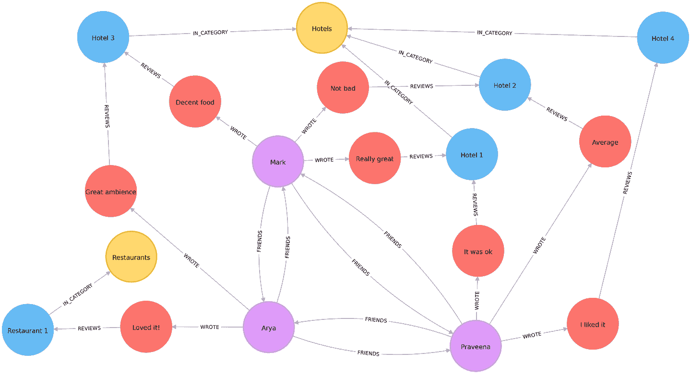

###### 图 7-6\. Yelp 示例图

我们的投影图仅包括 Mark 和 Praveena，如 图 7-7 所示。

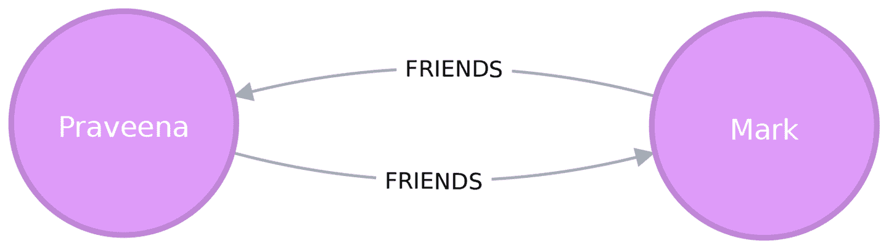

###### 图 7-7\. 我们的样本投影图

现在我们已经了解了图投影的工作原理，让我们继续前进。以下查询在我们的投影图上执行 PageRank 算法，并将结果存储在每个节点的 `hotelPageRank` 属性中：

```
CALL algo.pageRank(
  'MATCH (u:User)-[:WROTE]->()-[:REVIEWS]->()-[:IN_CATEGORY]->
 (:Category {name: $category})
 WITH u, count(*) AS reviews
 WHERE reviews >= $cutOff
 RETURN id(u) AS id',
  'MATCH (u1:User)-[:WROTE]->()-[:REVIEWS]->()-[:IN_CATEGORY]->
 (:Category {name: $category})
 MATCH (u1)-[:FRIENDS]->(u2)
 RETURN id(u1) AS source, id(u2) AS target',
 {graph: "cypher", write: true, writeProperty: "hotelPageRank",
 params: {category: "Hotels", cutOff: 3}}
)
```

你可能已经注意到，我们没有设置第五章讨论的阻尼因子或最大迭代限制（Chapter 5）。如果未显式设置，Neo4j 默认的阻尼因子为 `0.85`，`maxIterations` 设置为 20。

现在让我们来看看 PageRank 值的分布，这样我们就能知道如何筛选我们的数据：

```
MATCH (u:User)
WHERE exists(u.hotelPageRank)
RETURN count(u.hotelPageRank) AS count,
       avg(u.hotelPageRank) AS ave,
 percentileDisc(u.hotelPageRank, 0.5) AS `50%`,
 percentileDisc(u.hotelPageRank, 0.75) AS `75%`,
 percentileDisc(u.hotelPageRank, 0.90) AS `90%`,
 percentileDisc(u.hotelPageRank, 0.95) AS `95%`,
 percentileDisc(u.hotelPageRank, 0.99) AS `99%`,
 percentileDisc(u.hotelPageRank, 0.999) AS `99.9%`,
 percentileDisc(u.hotelPageRank, 0.9999) AS `99.99%`,
 percentileDisc(u.hotelPageRank, 0.99999) AS `99.999%`,
 percentileDisc(u.hotelPageRank, 1) AS `100%`
```

如果我们运行该查询，将会得到以下输出：

| count | ave | 50% | 75% | 90% | 95% | 99% | 99.9% | 99.99% | 99.999% | 100% |
| --- | --- | --- | --- | --- | --- | --- | --- | --- | --- | --- |
| 1326101 | 0.1614898 | 0.15 | 0.15 | 0.157497 | 0.181875 | 0.330081 | 1.649511 | 6.825738 | 15.27376 | 22.98046 |

要解释这个百分位表，0.157497 的 90%值意味着 90%的用户 PageRank 得分更低。99.99%反映了排名前 0.0001%评论者的影响力等级，而 100%则是最高的 PageRank 得分。

有趣的是，我们用户中有 90%的人得分低于 0.16，接近总体平均值——比 PageRank 算法初始化的 0.15 稍高一点。这似乎反映了一种幂律分布，其中少数非常有影响力的评论者。

因为我们只对最有影响力的用户感兴趣，我们将编写一个查询，仅查找 PageRank 得分在所有用户中的前 0.001%的用户。以下查询找到了 PageRank 得分*高于*1.64951 的评论者（请注意这是 99.9%组）：

```
// Only find users that have a hotelPageRank score in the top 0.001% of users
MATCH (u:User)
WHERE u.hotelPageRank >  1.64951

// Find the top 10 of those users
WITH u ORDER BY u.hotelPageRank DESC
LIMIT 10

RETURN u.name AS name,
 u.hotelPageRank AS pageRank,
 size((u)-[:WROTE]->()-[:REVIEWS]->()-[:IN_CATEGORY]->
 (:Category {name: "Hotels"})) AS hotelReviews,
 size((u)-[:WROTE]->()) AS totalReviews,
 size((u)-[:FRIENDS]-()) AS friends
```

如果我们运行该查询，我们将得到以下结果：

| name | pageRank | hotelReviews | totalReviews | friends |
| --- | --- | --- | --- | --- |
| Phil | 17.361242 | 15 | 134 | 8154 |
| Philip | 16.871013 | 21 | 620 | 9634 |
| Carol | 12.416060999999997 | 6 | 119 | 6218 |
| Misti | 12.239516000000004 | 19 | 730 | 6230 |
| Joseph | 12.003887499999998 | 5 | 32 | 6596 |
| Michael | 11.460049 | 13 | 51 | 6572 |
| J | 11.431505999999997 | 103 | 1322 | 6498 |
| Abby | 11.376136999999998 | 9 | 82 | 7922 |
| Erica | 10.993773 | 6 | 15 | 7071 |
| Randy | 10.748785999999999 | 21 | 125 | 7846 |

这些结果告诉我们，Phil 是最值得信赖的评论者，尽管他没有评论很多酒店。他可能与一些非常有影响力的人有联系，但如果我们想要一系列新评论，他的个人资料就不是最佳选择。Philip 的得分略低，但是朋友最多，评论数量是 Phil 的五倍。虽然 J 写了最多的评论，并且有相当数量的朋友，但他的 PageRank 得分并不是最高的，但仍然进入前 10。对于我们的应用程序，我们选择突出 Phil、Philip 和 J 的酒店评论，以获得合适的影响者和评论数量。

现在我们已经通过相关评论改进了应用内推荐系统，让我们转向我们业务的另一面：咨询服务。

## 旅行业务咨询

作为我们咨询服务的一部分，酒店会订阅关于他们住宿的重要访客的评论，以便能够采取必要的行动。首先，我们将查看贝拉吉奥酒店的评级，按最有影响力的评论者排序：

```
query = """\
MATCH (b:Business {name: $hotel})
MATCH (b)<-[:REVIEWS]-(review)<-[:WROTE]-(user)
WHERE exists(user.hotelPageRank)
RETURN user.name AS name,
 user.hotelPageRank AS pageRank,
 review.stars AS stars
"""

with driver.session() as session:
    params = { "hotel": "Bellagio Hotel" }
    df = pd.DataFrame([dict(record) for record in session.run(query, params)])
    df = df.round(2)
    df = df[["name", "pageRank", "stars"]]

top_reviews = df.sort_values(by=["pageRank"], ascending=False).head(10)
print(tabulate(top_reviews, headers='keys', tablefmt='psql', showindex=False))
```

如果我们运行该代码，我们将得到以下输出：

| name | pageRank | stars |
| --- | --- | --- |
| Misti | 12.239516000000004 | 5 |
| Michael | 11.460049 | 4 |
| J | 11.431505999999997 | 5 |
| Erica | 10.993773 | 4 |
| Christine | 10.740770499999998 | 4 |
| Jeremy | 9.576763499999998 | 5 |
| Connie | 9.118103499999998 | 5 |
| Joyce | 7.621449000000001 | 4 |
| Henry | 7.299146 | 5 |
| Flora | 6.7570075 | 4 |

注意，这些结果与我们之前的最佳酒店评论者表格不同。这是因为这里我们只考虑对贝拉吉奥进行了评级的评论者。

贝拉吉奥酒店客服团队的情况看起来不错——前十名影响力用户都给了酒店良好的评价。他们可能希望鼓励这些人再次光临并分享他们的经历。

是否有一些有影响力的客人没有过好的体验？我们可以运行以下代码来找出评分低于四星的高 PageRank 客人：

```
query = """\
MATCH (b:Business {name: $hotel})
MATCH (b)<-[:REVIEWS]-(review)<-[:WROTE]-(user)
WHERE exists(user.hotelPageRank) AND review.stars < $goodRating
RETURN user.name AS name,
 user.hotelPageRank AS pageRank,
 review.stars AS stars
"""

with driver.session() as session:
    params = { "hotel": "Bellagio Hotel", "goodRating": 4 }
    df = pd.DataFrame([dict(record) for record in session.run(query, params)])
    df = df.round(2)
    df = df[["name", "pageRank", "stars"]]

top_reviews = df.sort_values(by=["pageRank"], ascending=False).head(10)
print(tabulate(top_reviews, headers='keys', tablefmt='psql', showindex=False))
```

如果我们运行这段代码，我们会得到以下结果：

| name | pageRank | stars |
| --- | --- | --- |
| Chris | 5.84 | 3 |
| Lorrie | 4.95 | 2 |
| Dani | 3.47 | 1 |
| Victor | 3.35 | 3 |
| Francine | 2.93 | 3 |
| Rex | 2.79 | 2 |
| Jon | 2.55 | 3 |
| Rachel | 2.47 | 3 |
| Leslie | 2.46 | 2 |
| Benay | 2.46 | 3 |

我们评分最高但给贝拉吉奥评分较低的用户，Chris 和 Lorrie，都是前 1000 名最有影响力的用户之一（根据我们之前查询的结果），因此也许值得进行个性化的外联。此外，因为许多评论者在住宿期间写评论，实时关于影响者的提醒可能会促进更多积极的互动。

### 贝拉吉奥交叉推广

在我们帮助他们找到有影响力的评论者之后，贝拉吉奥现在要求我们帮助识别其他可以与好评客人进行交叉推广的企业。在我们的场景中，我们建议他们通过吸引来自不同社区类型的新客人来扩展客户群体，作为一个全新的机会。我们可以使用之前讨论过的中介中心性算法来确定哪些贝拉吉奥的评论者不仅在整个 Yelp 网络中具有良好的连接性，还可能充当不同群体之间的桥梁。

我们只对拉斯维加斯的影响者感兴趣，因此我们首先给这些用户打上标签：

```
MATCH (u:User)
WHERE exists((u)-[:WROTE]->()-[:REVIEWS]->()-[:IN_CITY]->
 (:City {name: "Las Vegas"}))
SET u:LasVegas
```

在我们的拉斯维加斯用户上运行中介中心性算法需要很长时间，因此我们将使用 RA-Brandes 变体。该算法通过对节点进行采样并仅探索到特定深度的最短路径来计算介数分数。

经过一些实验，我们通过设置几个参数与默认值不同来改进了结果。我们将使用最多 4 跳的最短路径（`maxDepth`为`4`）并对节点进行 20%的采样（`probability`为`0.2`）。请注意，增加跳数和节点通常会增加准确性，但会增加计算结果的时间成本。对于任何特定的问题，确定最佳参数通常需要测试以确定收益递减的点。

以下查询将执行该算法并将结果存储在`between`属性中：

```
CALL algo.betweenness.sampled('LasVegas', 'FRIENDS',
 {write: true, writeProperty: "between", maxDepth: 4, probability: 0.2}
)
```

在我们在查询中使用这些分数之前，让我们编写一个快速的探索性查询，看看分数的分布情况：

```
MATCH (u:User)
WHERE exists(u.between)
RETURN count(u.between) AS count,
       avg(u.between) AS ave,
 toInteger(percentileDisc(u.between, 0.5)) AS `50%`,
 toInteger(percentileDisc(u.between, 0.75)) AS `75%`,
 toInteger(percentileDisc(u.between, 0.90)) AS `90%`,
 toInteger(percentileDisc(u.between, 0.95)) AS `95%`,
 toInteger(percentileDisc(u.between, 0.99)) AS `99%`,
 toInteger(percentileDisc(u.between, 0.999)) AS `99.9%`,
 toInteger(percentileDisc(u.between, 0.9999)) AS `99.99%`,
 toInteger(percentileDisc(u.between, 0.99999)) AS `99.999%`,
 toInteger(percentileDisc(u.between, 1)) AS p100
```

如果我们运行该查询，我们将看到以下输出：

| 计数 | 平均 | 50% | 75% | 90% | 95% | 99% | 99.9% | 99.99% | 99.999% | 100% |
| --- | --- | --- | --- | --- | --- | --- | --- | --- | --- | --- |
| 506028 | 320538.6014 | 0 | 10005 | 318944 | 1001655 | 4436409 | 34854988 | 214080923 | 621434012 | 1998032952 |

我们用户的一半得分为 0，意味着他们根本不联系。顶部 1%（99%列）至少在我们的 50 万用户集合中有 400 万条最短路径。总的来说，我们知道大多数用户联系不多，但少数人对信息有很大的控制力；这是小世界网络的经典行为。

我们可以通过运行以下查询找出谁是我们的超级连接者：

```
MATCH(u:User)-[:WROTE]->()-[:REVIEWS]->(:Business {name:"Bellagio Hotel"})
WHERE exists(u.between)
RETURN u.name AS user,
 toInteger(u.between) AS betweenness,
 u.hotelPageRank AS pageRank,
 size((u)-[:WROTE]->()-[:REVIEWS]->()-[:IN_CATEGORY]->
 (:Category {name: "Hotels"}))
       AS hotelReviews
ORDER BY u.between DESC
LIMIT 10
```

输出如下：

| 用户 | 介数 | 页面排名 | 酒店评论 |
| --- | --- | --- | --- |
| 米斯蒂 | 841707563 | 12.239516000000004 | 19 |
| 克里斯汀 | 236269693 | 10.740770499999998 | 16 |
| 艾瑞卡 | 235806844 | 10.993773 | 6 |
| 迈克 | 215534452 | NULL | 2 |
| J | 192155233 | 11.431505999999997 | 103 |
| 迈克尔 | 161335816 | 5.105143 | 31 |
| 杰里米 | 160312436 | 9.576763499999998 | 6 |
| 迈克尔 | 139960910 | 11.460049 | 13 |
| 克里斯 | 136697785 | 5.838922499999999 | 5 |
| 康妮 | 133372418 | 9.118103499999998 | 7 |

我们看到在我们的页面排名查询中有一些相同的人物，迈克是一个有趣的例外。他被排除在那个计算之外，因为他还没有评论足够的酒店（三个是截止点），但看起来他在拉斯维加斯 Yelp 用户中联系非常紧密。

为了接触更多种类的客户，我们将查看这些“连接者”展示的其他偏好，以确定我们应该推广什么。许多用户还评论了餐厅，所以我们编写以下查询来找出他们最喜欢哪些餐厅：

```
// Find the top 50 users who have reviewed the Bellagio
MATCH (u:User)-[:WROTE]->()-[:REVIEWS]->(:Business {name:"Bellagio Hotel"})
WHERE u.between > 4436409
WITH u ORDER BY u.between DESC LIMIT 50

// Find the restaurants those users have reviewed in Las Vegas
MATCH (u)-[:WROTE]->(review)-[:REVIEWS]-(business)
WHERE (business)-[:IN_CATEGORY]->(:Category {name: "Restaurants"})
AND (business)-[:IN_CITY]->(:City {name: "Las Vegas"})

// Only include restaurants that have more than 3 reviews by these users
WITH business, avg(review.stars) AS averageReview, count(*) AS numberOfReviews
WHERE numberOfReviews >= 3

RETURN business.name AS business, averageReview, numberOfReviews
ORDER BY averageReview DESC, numberOfReviews DESC
LIMIT 10
```

此查询找到我们的前 50 名有影响力的连接者，并找到至少有 3 位评价了该餐厅的前 10 家拉斯维加斯餐厅。如果我们运行它，我们将看到此处显示的输出：

| 商业 | 平均评论 | 评论数量 |
| --- | --- | --- |
| Jean Georges Steakhouse | 5.0 | 6 |
| Sushi House Goyemon | 5.0 | 6 |
| Art of Flavors | 5.0 | 4 |
| é by José Andrés | 5.0 | 4 |
| Parma By Chef Marc | 5.0 | 4 |
| Yonaka Modern Japanese | 5.0 | 4 |
| Kabuto | 5.0 | 4 |
| Harvest by Roy Ellamar | 5.0 | 3 |
| Portofino by Chef Michael LaPlaca | 5.0 | 3 |
| Montesano’s Eateria | 5.0 | 3 |

现在我们建议贝拉吉欧与这些餐厅合作推广活动，以吸引通常不会接触到的新客人。给贝拉吉欧评分高的超级连接者成为我们估计哪些餐厅可能吸引新目标访客的代理人。

现在我们已经帮助贝拉吉奥吸引了新的群体，接下来我们将看看如何使用社区检测进一步改进我们的应用程序。

## 查找相似类别

虽然我们的最终用户在使用应用程序查找酒店时，我们希望展示其他可能感兴趣的企业。Yelp 数据集包含超过 1,000 个类别，很可能其中一些类别彼此相似。我们将利用这种相似性为我们的用户在应用内推荐新的可能感兴趣的企业。

我们的图模型在类别之间没有任何关系，但我们可以借鉴 “单分图、双分图和 k-分图” 中描述的思想，基于企业自己分类的方式构建一个类别相似性图。

例如，想象一下，只有一家企业将自己分类为旅馆和历史游览，如图 7-8 所示。

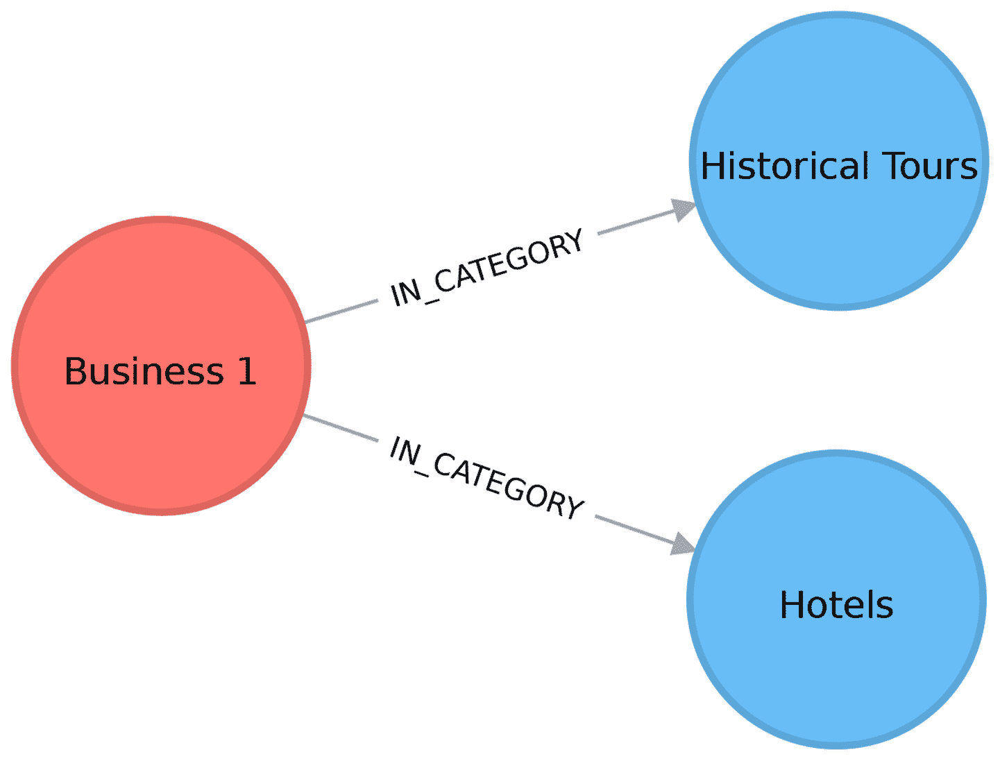

###### 图 7-8\. 一个有两个类别的企业

这将导致一个投影图，它在酒店和历史游览之间有一个权重为 1 的链接，如图 7-9 所示。

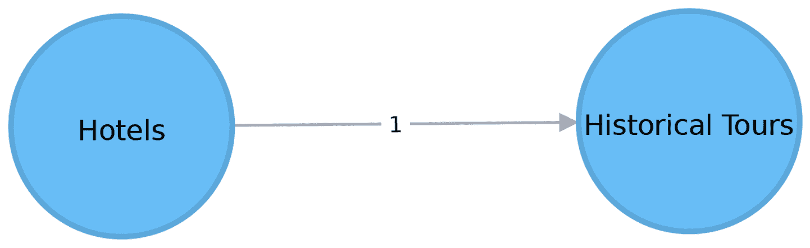

###### 图 7-9\. 一个类别投影图

在这种情况下，我们实际上不必创建相似性图 —— 反之，我们可以运行一个社区检测算法，如标签传播，来分析投影的相似性图。使用标签传播将有效地将企业聚类在它们与超类别最相似的类别周围：

```
CALL algo.labelPropagation.stream(
  'MATCH (c:Category) RETURN id(c) AS id',
  'MATCH (c1:Category)<-[:IN_CATEGORY]-()-[:IN_CATEGORY]->(c2:Category)
 WHERE id(c1) < id(c2)
 RETURN id(c1) AS source, id(c2) AS target, count(*) AS weight',
 {graph: "cypher"}
)
YIELD nodeId, label
MATCH (c:Category) WHERE id(c) = nodeId
MERGE (sc:SuperCategory {name: "SuperCategory-" + label})
MERGE (c)-[:IN_SUPER_CATEGORY]->(sc)
```

让我们给这些超类别取一个更友好的名称 —— 他们最大类别的名称在这里非常适合：

```
MATCH (sc:SuperCategory)<-[:IN_SUPER_CATEGORY]-(category)
WITH sc, category, size((category)<-[:IN_CATEGORY]-()) as size
ORDER BY size DESC
WITH sc, collect(category.name)[0] as biggestCategory
SET sc.friendlyName = "SuperCat " + biggestCategory
```

我们可以在图 7-10 中看到类别和超类别的示例。

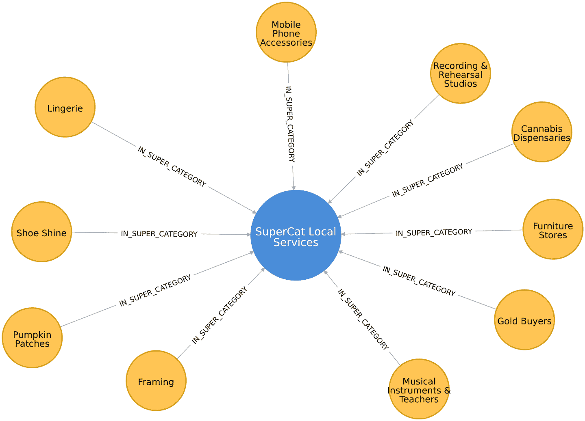

###### 图 7-10\. 类别和超类别

下面的查询找出拉斯维加斯最常见的与酒店相似的类别：

```
MATCH (hotels:Category {name: "Hotels"}),
 (lasVegas:City {name: "Las Vegas"}),
 (hotels)-[:IN_SUPER_CATEGORY]->()<-[:IN_SUPER_CATEGORY]-
 (otherCategory)
RETURN otherCategory.name AS otherCategory,
 size((otherCategory)<-[:IN_CATEGORY]-(:Business)-
 [:IN_CITY]->(lasVegas)) AS businesses
ORDER BY count DESC
LIMIT 10
```

如果我们运行该查询，我们将看到以下输出：

| 其他类别 | 企业 |
| --- | --- |
| 旅游 | 189 |
| 租车 | 160 |
| 豪华轿车服务 | 84 |
| 度假村 | 73 |
| 机场班车 | 52 |
| 出租车 | 35 |
| 度假租赁 | 29 |
| 机场 | 25 |
| 航空公司 | 23 |
| 摩托车租赁 | 19 |

这些结果看起来奇怪吗？显然，出租车和旅游并不是酒店，但请记住，这是基于自我报告的分类。标签传播算法在这个相似性组中实际上展示的是相邻的企业和服务。

现在让我们找一些在每个类别中评分高于平均水平的企业：

```
// Find businesses in Las Vegas that have the same SuperCategory as Hotels
MATCH (hotels:Category {name: "Hotels"}),
 (hotels)-[:IN_SUPER_CATEGORY]->()<-[:IN_SUPER_CATEGORY]-
 (otherCategory),
 (otherCategory)<-[:IN_CATEGORY]-(business)
WHERE (business)-[:IN_CITY]->(:City {name: "Las Vegas"})

// Select 10 random categories and calculate the 90th percentile star rating
WITH otherCategory, count(*) AS count,
     collect(business) AS businesses,
 percentileDisc(business.averageStars, 0.9) AS p90Stars
ORDER BY rand() DESC
LIMIT 10

// Select businesses from each of those categories that have an average rating
// higher than the 90th percentile using a pattern comprehension
WITH otherCategory, [b in businesses where b.averageStars >= p90Stars]
                     AS businesses

// Select one business per category
WITH otherCategory, businesses[toInteger(rand() * size(businesses))] AS business

RETURN otherCategory.name AS otherCategory,
 business.name AS business,
 business.averageStars AS averageStars
```

在这个查询中，我们第一次使用 [模式推导](https://bit.ly/2HRa1gr)。模式推导是一种基于模式匹配创建列表的语法结构。它使用 `MATCH` 子句查找指定的模式和 `WHERE` 子句进行谓词，然后生成自定义投影。这个 Cypher 特性是受到 [GraphQL](https://graphql.org) 的启发，GraphQL 是一个用于 API 的查询语言。

如果我们运行该查询，我们将看到以下结果：

| 其他类别 | 商业 | 平均评分 |
| --- | --- | --- |
| 摩托车租赁 | Adrenaline Rush Slingshot Rentals | 5.0 |
| 浮潜 | Sin City Scuba | 5.0 |
| 客房 | Hotel Del Kacvinsky | 5.0 |
| 租车 | The Lead Team | 5.0 |
| 美食之旅 | Taste BUZZ 美食之旅 | 5.0 |
| 机场 | Signature Flight Support | 5.0 |
| 公共交通 | JetSuiteX | 4.6875 |
| 滑雪胜地 | Trikke 拉斯维加斯 | 4.833333333333332 |
| 小镇车服务 | MW Travel Vegas | 4.866666666666665 |
| 营地 | McWilliams 营地 | 3.875 |

我们随后可以根据用户的即时应用行为进行实时推荐。例如，当用户查看拉斯维加斯的酒店时，我们现在可以突出显示一系列评分良好的相邻拉斯维加斯企业。我们可以将这些方法推广到任何业务类别，如任何位置的餐厅或剧院。

# 使用 Apache Spark 分析航空公司航班数据

在本节中，我们将使用不同的场景来说明如何使用 Spark 分析美国机场数据。想象一下，您是一位数据科学家，有很多的旅行计划，并且想要深入了解航班和延误信息。我们将首先探讨机场和航班信息，然后深入研究两个特定机场的延误情况。社区检测将用于分析路线，并找出最佳使用我们的常旅客积分的方式。

美国运输统计局提供了大量的[运输信息](https://bit.ly/2Fy0GHA)。对于我们的分析，我们将使用他们 2018 年 5 月的航空准时表现数据，该数据包括在该月起始和结束于美国的航班。为了增加机场的位置信息等更多细节，我们还将从另一个来源加载数据，[OpenFlights](https://bit.ly/2Frv8TO)。

让我们在 Spark 中加载数据。和之前的部分一样，我们的数据存储在[书的 Github 仓库](https://bit.ly/2FPgGVV)的 CSV 文件中。

```
nodes = spark.read.csv("data/airports.csv", header=False)

cleaned_nodes = (nodes.select("_c1", "_c3", "_c4", "_c6", "_c7")
                 .filter("_c3 = 'United States'")
                 .withColumnRenamed("_c1", "name")
                 .withColumnRenamed("_c4", "id")s
                 .withColumnRenamed("_c6", "latitude")
                 .withColumnRenamed("_c7", "longitude")
                 .drop("_c3"))
cleaned_nodes = cleaned_nodes[cleaned_nodes["id"] != "\\N"]

relationships = spark.read.csv("data/188591317_T_ONTIME.csv", header=True)

cleaned_relationships = (relationships
                         .select("ORIGIN", "DEST", "FL_DATE", "DEP_DELAY",
                                 "ARR_DELAY", "DISTANCE", "TAIL_NUM", "FL_NUM",
                                  "CRS_DEP_TIME", "CRS_ARR_TIME",
                                  "UNIQUE_CARRIER")
                         .withColumnRenamed("ORIGIN", "src")
                         .withColumnRenamed("DEST", "dst")
                         .withColumnRenamed("DEP_DELAY", "deptDelay")
                         .withColumnRenamed("ARR_DELAY", "arrDelay")
                         .withColumnRenamed("TAIL_NUM", "tailNumber")
                         .withColumnRenamed("FL_NUM", "flightNumber")
                         .withColumnRenamed("FL_DATE", "date")
                         .withColumnRenamed("CRS_DEP_TIME", "time")
                         .withColumnRenamed("CRS_ARR_TIME", "arrivalTime")
                         .withColumnRenamed("DISTANCE", "distance")
                         .withColumnRenamed("UNIQUE_CARRIER", "airline")
                         .withColumn("deptDelay",
                              F.col("deptDelay").cast(FloatType()))
                         .withColumn("arrDelay",
                              F.col("arrDelay").cast(FloatType()))
                         .withColumn("time", F.col("time").cast(IntegerType()))
                         .withColumn("arrivalTime",
                              F.col("arrivalTime").cast(IntegerType()))
                         )

g = GraphFrame(cleaned_nodes, cleaned_relationships)
```

我们需要对节点进行一些清理，因为一些机场没有有效的机场代码。我们将为列提供更具描述性的名称，并将一些项目转换为适当的数值类型。我们还需要确保我们有`id`、`dst`和`src`命名的列，因为这是 Spark 的 GraphFrames 库所期望的。

我们还将创建一个单独的 DataFrame，将航空公司代码映射到航空公司名称。我们稍后在本章中会用到这个 DataFrame：

```
airlines_reference = (spark.read.csv("data/airlines.csv")
      .select("_c1", "_c3")
      .withColumnRenamed("_c1", "name")
      .withColumnRenamed("_c3", "code"))

airlines_reference = airlines_reference[airlines_reference["code"] != "null"]
```

## 探索性分析

让我们从一些探索性分析开始，看看数据是什么样子的。

首先让我们看看我们有多少个机场：

```
g.vertices.count()
```

```
1435
```

那么我们这些机场之间有多少连接呢？

```
g.edges.count()
```

```
616529
```

## 热门机场

哪些机场有最多的出发航班？我们可以使用度中心性算法计算从一个机场出发的出站航班数量：

```
airports_degree = g.outDegrees.withColumnRenamed("id", "oId")

full_airports_degree = (airports_degree
                        .join(g.vertices, airports_degree.oId == g.vertices.id)
                        .sort("outDegree", ascending=False)
                        .select("id", "name", "outDegree"))

full_airports_degree.show(n=10, truncate=False)
```

如果我们运行该代码，我们将看到以下输出：

| id | 名称 | 出度 |
| --- | --- | --- |
| ATL | 哈茨菲尔德-杰克逊亚特兰大国际机场 | 33837 |
| ORD | 芝加哥奥黑尔国际机场 | 28338 |
| DFW | 达拉斯-沃斯堡国际机场 | 23765 |
| CLT | 夏洛特道格拉斯国际机场 | 20251 |
| DEN | 丹佛国际机场 | 19836 |
| LAX | 洛杉矶国际机场 | 19059 |
| PHX | 凤凰城天港国际机场 | 15103 |
| SFO | 旧金山国际机场 | 14934 |
| LGA | 拉瓜迪亚机场 | 14709 |
| IAH | 乔治布什国际机场 | 14407 |

大多数大型美国城市都在此列表上——芝加哥、亚特兰大、洛杉矶和纽约都有热门机场。我们还可以使用以下代码创建出发航班的可视化表示：

```
plt.style.use('fivethirtyeight')

ax = (full_airports_degree
      .toPandas()
      .head(10)
      .plot(kind='bar', x='id', y='outDegree', legend=None))

ax.xaxis.set_label_text("")
plt.xticks(rotation=45)
plt.tight_layout()
plt.show()
```

生成的图表可以在图 7-11 中看到。

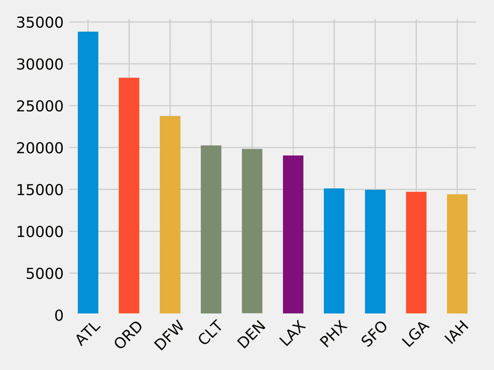

###### 图 7-11\. 按机场的出发航班

航班数量突然减少是相当引人注目的。第五大热门机场丹佛国际机场（DEN）的出发航班数量仅为首位的哈茨菲尔德-杰克逊亚特兰大国际机场（ATL）的一半多一点。

## ORD 的延误

在我们的情境中，我们经常在西岸和东岸之间旅行，并希望通过芝加哥奥黑尔国际机场（ORD）这样的中间枢纽查看延误情况。这个数据集包含航班延误数据，所以我们可以直接深入研究。

以下代码找出从 ORD 出发的航班平均延误时间：

```
delayed_flights = (g.edges
                   .filter("src = 'ORD' and deptDelay > 0")
                   .groupBy("dst")
                   .agg(F.avg("deptDelay"), F.count("deptDelay"))
                   .withColumn("averageDelay",
                               F.round(F.col("avg(deptDelay)"), 2))
                   .withColumn("numberOfDelays",
                               F.col("count(deptDelay)")))

(delayed_flights
 .join(g.vertices, delayed_flights.dst == g.vertices.id)
 .sort(F.desc("averageDelay"))
 .select("dst", "name", "averageDelay", "numberOfDelays")
 .show(n=10, truncate=False))
```

一旦我们计算出按目的地分组的平均延误时间，我们将结果的 Spark DataFrame 与包含所有顶点的 DataFrame 连接，以便打印目的地机场的全名。

运行此代码将返回延误最严重的 10 个目的地：

| dst | name | averageDelay | numberOfDelays |
| --- | --- | --- | --- |
| CKB | 西弗吉尼亚州中北部机场 | 145.08 | 12 |
| OGG | 卡胡卢伊机场 | 119.67 | 9 |
| MQT | 索耶尔国际机场 | 114.75 | 12 |
| MOB | 莫比尔地区机场 | 102.2 | 10 |
| TTN | 特伦顿默瑟机场 | 101.18 | 17 |
| AVL | 阿什维尔地区机场 | 98.5 | 28 |
| ISP | 纽约长岛麦克阿瑟机场 | 94.08 | 13 |
| ANC | 泰德·史蒂文斯安克雷奇国际机场 | 83.74 | 23 |
| BTV | 伯灵顿国际机场 | 83.2 | 25 |
| CMX | 霍顿县纪念机场 | 79.18 | 17 |

这很有趣，但一个数据点真的很突出：从 ORD 到 CKB 的 12 个航班平均延误超过 2 小时！让我们找出这两个机场之间的航班，看看到底发生了什么：

```
from_expr = 'id = "ORD"'
to_expr = 'id = "CKB"'
ord_to_ckb = g.bfs(from_expr, to_expr)

ord_to_ckb = ord_to_ckb.select(
  F.col("e0.date"),
  F.col("e0.time"),
  F.col("e0.flightNumber"),
  F.col("e0.deptDelay"))
```

我们随后可以使用以下代码绘制这些航班：

```
ax = (ord_to_ckb
      .sort("date")
      .toPandas()
      .plot(kind='bar', x='date', y='deptDelay', legend=None))

ax.xaxis.set_label_text("")
plt.tight_layout()
plt.show()
```

如果我们运行这段代码，我们将会得到图 7-12 中的图表。

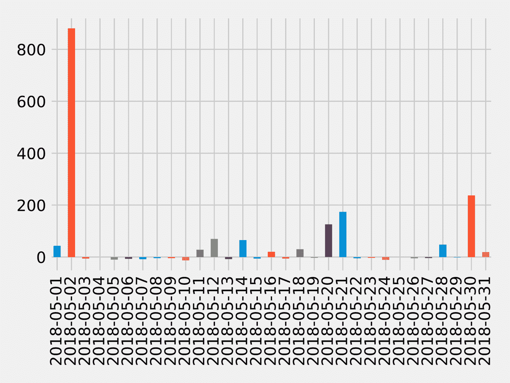

###### 图 7-12\. 从 ORD 到 CKB 的航班

大约一半的航班延误了，但 2018 年 5 月 2 日超过 14 小时的延误大大偏离了平均值。

如果我们想要查找进出沿海机场的延误怎么办？这些机场通常受不良天气条件的影响，因此我们可能会找到一些有趣的延误情况。

## SFO 的糟糕一天

让我们考虑一个以“低云”问题闻名的机场的延误情况：旧金山国际机场（SFO）。一种分析方法是查看*模式*，这些是经常出现的子图或模式。

###### 注意

在 Neo4j 中，与模式相当的是图案，可以使用`MATCH`子句或 Cypher 中的模式表达式找到。

GraphFrames 允许我们[搜索模式](http://bit.ly/2TZQ89B)，因此我们可以使用飞行的结构作为查询的一部分。让我们使用模式找出 2018 年 5 月 11 日进出 SFO 最延误的航班。以下代码将找到这些延误：

```
motifs = (g.find("(a)-[ab]->(b); (b)-[bc]->(c)")
          .filter("""(b.id = 'SFO') and
 (ab.date = '2018-05-11' and bc.date = '2018-05-11') and
 (ab.arrDelay > 30 or bc.deptDelay > 30) and
 (ab.flightNumber = bc.flightNumber) and
 (ab.airline = bc.airline) and
 (ab.time < bc.time)"""))
```

图案`(a)-[ab]->(b); (b)-[bc]->(c)`找到进出同一机场的航班。然后我们过滤结果模式以找到以下航班：

+   一个序列，第一班抵达 SFO，第二班从 SFO 出发

+   到达或离开 SFO 时超过 30 分钟的延误

+   同一航班号和航空公司

然后我们可以获取结果并选择我们感兴趣的列：

```
result = (motifs.withColumn("delta", motifs.bc.deptDelay - motifs.ab.arrDelay)
          .select("ab", "bc", "delta")
          .sort("delta", ascending=False))

result.select(
    F.col("ab.src").alias("a1"),
    F.col("ab.time").alias("a1DeptTime"),
    F.col("ab.arrDelay"),
    F.col("ab.dst").alias("a2"),
    F.col("bc.time").alias("a2DeptTime"),
    F.col("bc.deptDelay"),
    F.col("bc.dst").alias("a3"),
    F.col("ab.airline"),
    F.col("ab.flightNumber"),
    F.col("delta")
).show()
```

我们还在计算抵达和出发航班之间的*delta*，以查看我们真正可以归因于 SFO 的延误情况。

如果我们执行此代码，我们将得到以下结果：

| airline | flightNumber | a1 | a1DeptTime | arrDelay | a2 | a2DeptTime | deptDelay | a3 | delta |
| --- | --- | --- | --- | --- | --- | --- | --- | --- | --- |
| WN | 1454 | PDX | 1130 | -18.0 | SFO | 1350 | 178.0 | BUR | 196.0 |
| OO | 5700 | ACV | 1755 | -9.0 | SFO | 2235 | 64.0 | RDM | 73.0 |
| UA | 753 | BWI | 700 | -3.0 | SFO | 1125 | 49.0 | IAD | 52.0 |
| UA | 1900 | ATL | 740 | 40.0 | SFO | 1110 | 77.0 | SAN | 37.0 |
| WN | 157 | BUR | 1405 | 25.0 | SFO | 1600 | 39.0 | PDX | 14.0 |
| DL | 745 | DTW | 835 | 34.0 | SFO | 1135 | 44.0 | DTW | 10.0 |
| WN | 1783 | DEN | 1830 | 25.0 | SFO | 2045 | 33.0 | BUR | 8.0 |
| WN | 5789 | PDX | 1855 | 119.0 | SFO | 2120 | 117.0 | DEN | -2.0 |
| WN | 1585 | BUR | 2025 | 31.0 | SFO | 2230 | 11.0 | PHX | -20.0 |

最严重的违规行为，WN 1454，显示在顶部行；它提前到达，但几乎晚了三个小时。我们还可以看到`arrDelay`列中有一些负值；这意味着飞往 SFO 的航班提前到达。

同样请注意，有些航班，如 WN 5789 和 WN 1585，在 SFO 地面上补时，显示为负数。

## 航空公司间的互联机场

现在假设我们旅行很多次，而且那些积累的飞行积分我们决定尽可能高效地使用，很快就会过期。如果我们从一个特定的美国机场出发，使用同一航空公司可以去多少个不同的机场并返回起始机场？

让我们首先识别所有航空公司，并计算每家公司的航班数量：

```
airlines = (g.edges
 .groupBy("airline")
 .agg(F.count("airline").alias("flights"))
 .sort("flights", ascending=False))

full_name_airlines = (airlines_reference
                      .join(airlines, airlines.airline
                            == airlines_reference.code)
                      .select("code", "name", "flights"))
```

现在让我们创建一个条形图显示我们的航空公司：

```
ax = (full_name_airlines.toPandas()
      .plot(kind='bar', x='name', y='flights', legend=None))

ax.xaxis.set_label_text("")
plt.tight_layout()
plt.show()
```

如果我们运行该查询，将在 图 7-13 中得到输出。

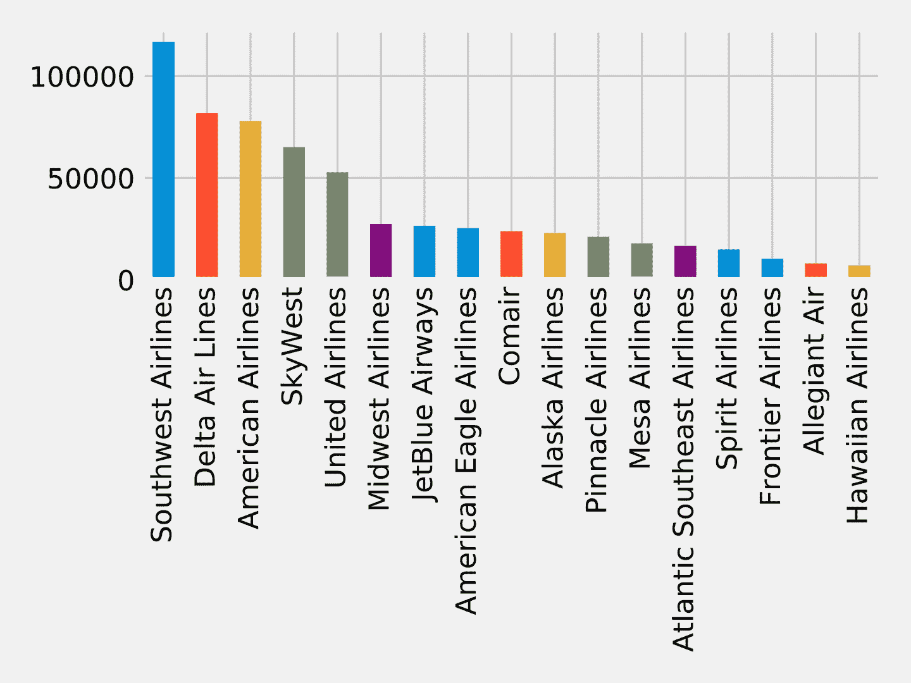

###### 图 7-13\. 各航空公司的航班数量

现在让我们编写一个函数，使用强连通分量算法来查找每个航空公司的机场分组，其中所有机场都有往来于该组内所有其他机场的航班：

```
def find_scc_components(g, airline):
    # Create a subgraph containing only flights on the provided airline
    airline_relationships = g.edges[g.edges.airline == airline]
    airline_graph = GraphFrame(g.vertices, airline_relationships)

    # Calculate the Strongly Connected Components
    scc = airline_graph.stronglyConnectedComponents(maxIter=10)

    # Find the size of the biggest component and return that
    return (scc
        .groupBy("component")
        .agg(F.count("id").alias("size"))
        .sort("size", ascending=False)
        .take(1)[0]["size"])
```

我们可以编写以下代码来创建一个包含每个航空公司及其最大强连通分量中机场数量的 DataFrame：

```
# Calculate the largest strongly connected component for each airline
airline_scc = [(airline, find_scc_components(g, airline))
               for airline in airlines.toPandas()["airline"].tolist()]
airline_scc_df = spark.createDataFrame(airline_scc, ['id', 'sccCount'])

# Join the SCC DataFrame with the airlines DataFrame so that we can show
# the number of flights an airline has alongside the number of
# airports reachable in its biggest component
airline_reach = (airline_scc_df
 .join(full_name_airlines, full_name_airlines.code == airline_scc_df.id)
 .select("code", "name", "flights", "sccCount")
 .sort("sccCount", ascending=False))
```

现在让我们创建一个条形图显示我们的航空公司：

```
ax = (airline_reach.toPandas()
      .plot(kind='bar', x='name', y='sccCount', legend=None))

ax.xaxis.set_label_text("")
plt.tight_layout()
plt.show()
```

如果我们运行该查询，将在 图 7-14 中得到输出。

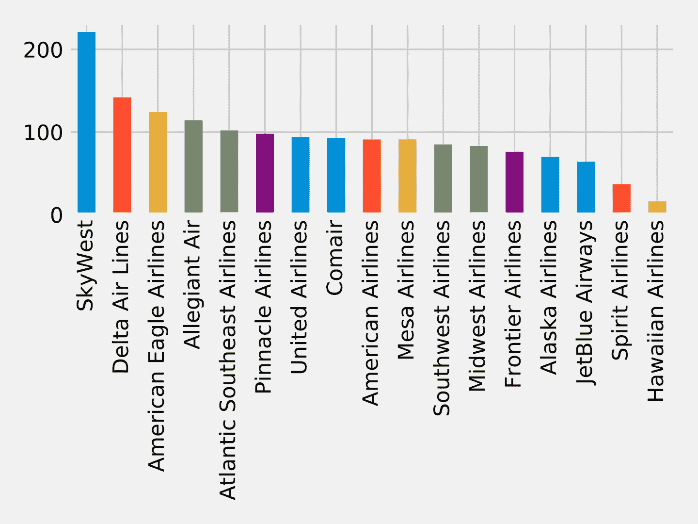

###### 图 7-14\. 各航空公司可达机场数量

SkyWest 是最大的社区，拥有超过 200 个强连通机场。这可能部分反映了其作为联营航空公司的商业模式，该公司为合作伙伴航空公司的航班运营飞机。另一方面，Southwest 航空虽然航班数量最多，但只连接了大约 80 个机场。

现在假设我们手头大多数的常旅客积分是与 Delta 航空（DL）相关的。我们能否找到在该特定航空公司网络中形成社区的机场？

```
airline_relationships = g.edges.filter("airline = 'DL'")
airline_graph = GraphFrame(g.vertices, airline_relationships)

clusters = airline_graph.labelPropagation(maxIter=10)
(clusters
 .sort("label")
 .groupby("label")
 .agg(F.collect_list("id").alias("airports"),
      F.count("id").alias("count"))
 .sort("count", ascending=False)
 .show(truncate=70, n=10))
```

如果我们运行该查询，将看到以下输出：

| label | airports | count |
| --- | --- | --- |
| 1606317768706 | [IND, ORF, ATW, RIC, TRI, XNA, ECP, AVL, JAX, SYR, BHM, GSO, MEM, C… | 89 |
| 1219770712067 | [GEG, SLC, DTW, LAS, SEA, BOS, MSN, SNA, JFK, TVC, LIH, JAC, FLL, M… | 53 |
| 17179869187 | [RHV] | 1 |
| 25769803777 | [CWT] | 1 |
| 25769803776 | [CDW] | 1 |
| 25769803782 | [KNW] | 1 |
| 25769803778 | [DRT] | 1 |
| 25769803779 | [FOK] | 1 |
| 25769803781 | [HVR] | 1 |
| 42949672962 | [GTF] | 1 |

大多数 Delta 航空使用的机场都聚集成两个群组；让我们深入研究这些。由于机场太多，无法在此显示所有，因此我们只显示度数最大的机场（进出航班）。我们可以编写以下代码来计算机场的度数：

```
all_flights = g.degrees.withColumnRenamed("id", "aId")
```

然后我们将此与属于最大集群的机场结合起来：

```
(clusters
 .filter("label=1606317768706")
 .join(all_flights, all_flights.aId == result.id)
 .sort("degree", ascending=False)
 .select("id", "name", "degree")
 .show(truncate=False))
```

如果我们运行该查询，将得到以下输出：

| id | name | degree |
| --- | --- | --- |
| DFW | 达拉斯-沃斯堡国际机场 | 47514 |
| CLT | 夏洛特·道格拉斯国际机场 | 40495 |
| IAH | 乔治·布什国际机场 | 28814 |
| EWR | 纽瓦克自由国际机场 | 25131 |
| PHL | 费城国际机场 | 20804 |
| BWI | 巴尔的摩/华盛顿国际萨瑟兰·马歇尔机场 | 18989 |
| MDW | 芝加哥中途国际机场 | 15178 |
| BNA | 纳什维尔国际机场 | 12455 |
| DAL | 达拉斯爱田机场 | 12084 |
| IAD | 华盛顿杜勒斯国际机场 | 11566 |
| STL | 圣路易斯兰伯特国际机场 | 11439 |
| HOU | 威廉·P·霍比机场 | 9742 |
| IND | 印第安纳波利斯国际机场 | 8543 |
| PIT | 匹兹堡国际机场 | 8410 |
| CLE | 克利夫兰霍普金斯国际机场 | 8238 |
| CMH | 科伦布港国际机场 | 7640 |
| SAT | 圣安东尼奥国际机场 | 6532 |
| JAX | 杰克逊维尔国际机场 | 5495 |
| BDL | 布拉德利国际机场 | 4866 |
| RSW | 西南佛罗里达国际机场 | 4569 |

在 Figure 7-15 中，我们可以看到这个集群实际上集中在美国东海岸到中西部。

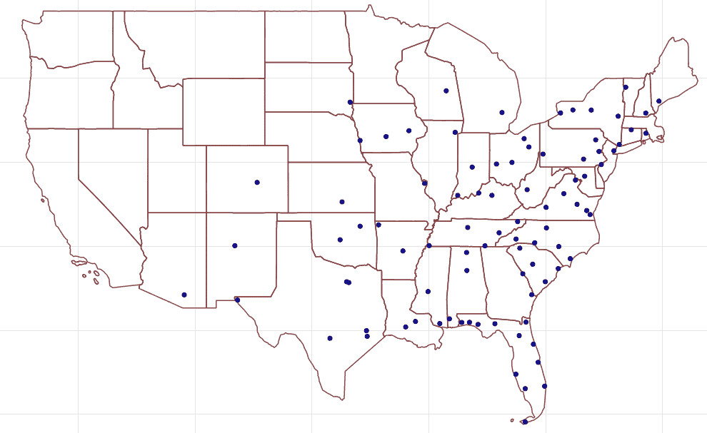

###### 图 7-15\. 集群 1606317768706 个机场

现在让我们用第二大集群做同样的事情：

```
(clusters
 .filter("label=1219770712067")
 .join(all_flights, all_flights.aId == result.id)
 .sort("degree", ascending=False)
 .select("id", "name", "degree")
 .show(truncate=False))
```

如果我们运行该查询，我们会得到以下输出：

| id | name | degree |
| --- | --- | --- |
| ATL | 亚特兰大哈茨菲尔德-杰克逊国际机场 | 67672 |
| ORD | 芝加哥奥黑尔国际机场 | 56681 |
| DEN | 丹佛国际机场 | 39671 |
| LAX | 洛杉矶国际机场 | 38116 |
| PHX | 菲尼克斯天港国际机场 | 30206 |
| SFO | 旧金山国际机场 | 29865 |
| LGA | 拉瓜迪亚机场 | 29416 |
| LAS | 麦卡伦国际机场 | 27801 |
| DTW | 底特律大都会韦恩县机场 | 27477 |
| MSP | 明尼阿波利斯-圣保罗国际/沃尔德-张伯伦机场 | 27163 |
| BOS | 一般爱德华·劳伦斯·洛根国际机场 | 26214 |
| SEA | 西雅图-塔科马国际机场 | 24098 |
| MCO | 奥兰多国际机场 | 23442 |
| JFK | 约翰·F·肯尼迪国际机场 | 22294 |
| DCA | 罗纳德·里根华盛顿国家机场 | 22244 |
| SLC | 盐湖城国际机场 | 18661 |
| FLL | 劳德代尔堡-好莱坞国际机场 | 16364 |
| SAN | 圣迭戈国际机场 | 15401 |
| MIA | 迈阿密国际机场 | 14869 |
| TPA | 坦帕国际机场 | 12509 |

在 Figure 7-16 中，我们可以看到这个集群显然更加以枢纽为中心，沿途还有一些西北方向的停靠点。

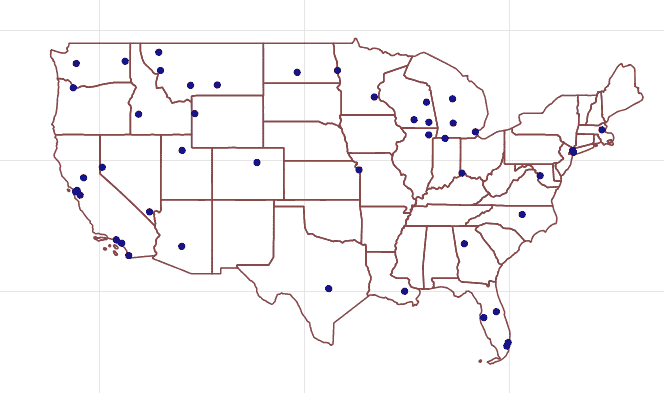

###### 图 7-16\. 集群 1219770712067 个机场

生成这些地图的代码可以在[书籍的 GitHub 仓库](https://bit.ly/2FPgGVV)中找到。

当我们查看 DL 网站的常旅客计划时，我们注意到有一个使用两次免费获取一次的促销活动。如果我们用我们的积分买两次机票，我们就能免费再得到一次——但只限于在两个集群内飞行！也许把我们的时间，尤其是我们的积分用在一个集群内是更好的选择。

## 摘要

在过去的几章中，我们详细介绍了在 Apache Spark 和 Neo4j 中用于路径查找、中心性和社区检测的关键图算法的工作原理。在本章中，我们讨论了包括在其他任务和分析背景下使用多种算法的工作流程。我们使用旅行业务场景分析了 Neo4j 中的 Yelp 数据，以及使用个人航空旅行场景评估了 Spark 中的美国航空数据。

接下来，我们将探讨一个越来越重要的图增强机器学习用途。
