# 第八章：使用图算法增强机器学习

我们已经涵盖了几种在每次迭代中学习并更新状态的算法，比如标签传播；然而，直到这一点，我们强调了用于一般分析的图算法。因为在机器学习（ML）中图的应用越来越广泛，我们现在将看看图算法如何用于增强 ML 工作流程。

在本章中，我们专注于通过图算法开始改进 ML 预测的最实用方式：连接特征提取及其在预测关系中的应用。首先，我们将介绍一些基本的 ML 概念和上下文数据对于更好预测的重要性。然后，我们快速调查了图特征应用的方式，包括用于垃圾邮件欺诈检测和链接预测。

我们将演示如何创建一个机器学习流水线，然后在我们的工作流中使用 Neo4j 和 Spark 进行链接预测的模型训练和评估。我们的示例将基于引文网络数据集，其中包含作者、论文、作者关系和引文关系。我们将使用几种模型预测研究作者未来是否可能合作，并展示图算法如何改善结果。

# 机器学习与上下文的重要性

机器学习不是人工智能（AI），而是实现 AI 的一种方法。ML 使用算法通过具体示例进行训练，并根据预期结果进行渐进改进——而无需明确编程如何实现这些更好的结果。训练涉及向模型提供大量数据，并使其学习如何处理和整合该信息。

在这种情况下，学习意味着算法迭代，不断进行更改以接近目标，比如减少与训练数据相比的分类错误。ML 也是动态的，在面对更多数据时能够修改和优化自身。这可以在使用前的许多批次中进行训练，也可以在使用过程中作为在线学习进行。

最近在 ML 预测中取得的成功、大型数据集的可访问性以及并行计算能力的提高，使得 ML 对于开发用于 AI 应用的概率模型更加实际。随着机器学习的普及，重要的是记住其根本目标：像人类一样做出选择。如果忘记了这个目标，我们可能最终只会得到另一个高度针对性、基于规则的软件版本。

为了提高机器学习的准确性，并使解决方案更广泛适用，我们需要整合大量的上下文信息——就像人们应该使用上下文进行更好的决策一样。人类利用周围的上下文，而不仅仅是直接数据点，来确定情境中的重要性，估计缺失信息，并确定如何将教训应用到新情况中。上下文帮助我们改进预测。

## 图形、上下文和准确性

没有外围和相关信息，试图预测行为或为不同情况提供建议的解决方案需要更多的训练和规范规则。这部分是为什么人工智能擅长特定、明确定义的任务，但在模糊性方面表现不佳的原因之一。增强图的机器学习可以帮助填补丢失的上下文信息，这对于更好的决策至关重要。

我们从图论和现实生活中知道，关系通常是行为的最强预测因素。例如，如果一个人投票，他们的朋友、家人甚至同事投票的可能性也会增加。图 8-1 根据 R. Bond 等人的 2012 年研究论文《社会影响与政治动员的 6100 万人实验》（https://www.nature.com/articles/nature11421），展示了基于报告投票和 Facebook 朋友的涟漪效应。


###### 图 8-1\. 人们受他们社交网络影响而投票。在这个例子中，处于两个跳数外的朋友总体上比直接关系产生了更大的影响。

作者发现，报告投票的朋友影响了额外的 1.4%用户声称他们也投票了，有趣的是，朋友的朋友增加了另外 1.7%。即使是小百分比也可能产生显著影响，我们可以在图 8-1 中看到，处于两个跳数外的人群总体上比直接朋友影响更大。投票和我们社交网络如何影响我们的其他例子，都包含在 Nicholas Christakis 和 James Fowler 的书《Connected》（Little, Brown and Company）中。

添加图形特征和上下文可以提升预测效果，特别是在关系重要的情况下。例如，零售公司不仅通过历史数据个性化产品推荐，还利用客户相似性和在线行为的上下文数据。亚马逊的 Alexa 使用[多层上下文模型](https://amzn.to/2YmSvqn)，展示了更高的准确性。2018 年，亚马逊还引入了“上下文延续”，在回答新问题时整合之前的对话参考信息。

不幸的是，如今许多机器学习方法缺乏丰富的上下文信息。这源自于机器学习依赖于建立在元组基础上的输入数据，忽略了许多预测性关系和网络数据。此外，上下文信息并不总是容易获取或处理。即使是在传统方法的规模上，找到四个或更多跳跃连接也可能是一个挑战。利用图形，我们可以更轻松地获取和整合连接数据。

# 连接特征提取和选择

特征提取和选择帮助我们从原始数据中提取并创建适合训练机器学习模型的合适子集和格式。这是一个基础性步骤，当执行良好时，可以产生更一致准确的机器学习预测。

通过合理组合特性，可以提高准确性，因为它从根本上影响我们的模型学习。即使是小幅改进也可能产生显著差异，本章重点关注*连接特性*。连接特性是从数据结构中提取的特性。这些特性可以从围绕节点的图局部查询中获取，或者使用图算法进行图全局查询，以识别基于关系的数据中的预测元素，用于连接特性提取。

不仅重要的是获取正确的特性组合，还要消除不必要的特性，以减少模型可能过度定制的可能性。这可以避免创建仅在训练数据上表现良好的模型（即所谓的*过拟合*），显著扩展适用性。我们还可以使用图算法评估这些特性，并确定对我们的模型最具影响力的特性用于连接特性选择。例如，我们可以将特性映射到图中的节点，根据相似特性创建关系，然后计算特性的中心性。特性关系可以通过保存数据点的簇密度来定义。这种方法在[“基于子空间和 PageRank 中心性的无监督图特征选择”](https://bit.ly/2HGON5B)，由 K. Henniab、N. Mezghani 和 C. Gouin-Vallerand 描述。

现在让我们看一些连接特性的类型及其使用方法。

## 图特性

*图特性*包括关于我们的图的任意数量的连接相关度量，如进出节点的关系数量，潜在三角形的计数以及共同邻居。在我们的示例中，我们将从这些度量开始，因为它们易于获取，并且是早期假设的良好测试。

此外，当我们准确知道自己要找的是什么时，我们可以使用特征工程。例如，如果我们想知道有多少人在最多四个跳点内有欺诈账户。这种方法使用图遍历来高效地查找深层关系路径，检查标签、属性、计数和推断关系等因素。

我们还可以轻松地自动化这些过程，并将这些预测性图特性传递到我们现有的管道中。例如，我们可以提取欺诈关系的计数，并将该数字作为节点属性添加，以供其他机器学习任务使用。

## 图算法特性

我们还可以使用图算法来查找我们知道大致结构但不知道确切模式的特征。举例来说，假设我们知道某些类型的社群分组是欺诈的指示；也许存在典型的密度或关系层次结构。在这种情况下，我们不需要严格的确切组织特征，而是一个灵活且具有全球性相关结构。我们将使用社群检测算法来在我们的示例中提取连接特征，但像 PageRank 这样的中心性算法也经常被应用。

此外，结合几种类型的连接特征的方法似乎优于坚持单一方法。例如，我们可以结合通过 Louvain 算法找到的社群指标来预测欺诈，使用 PageRank 确定影响力节点，并且测量三跳之外已知欺诈者的程度。

图 8-3 展示了一种结合图算法如 PageRank 和 Coloring 以及图度量（如入度和出度）的综合方法。此图摘自论文[“Collective Spammer Detection in Evolving Multi-Relational Social Networks”](https://bit.ly/2TyG6Mm)，作者为 S. Fakhraei 等人。

图结构部分展示了使用多种图算法进行连接特征提取。有趣的是，作者们发现从多种关系类型中提取连接特征，比简单添加更多特征更具预测性。报告子图部分展示了如何将图特征转换为机器学习模型可以使用的特征。通过在增强型图机器学习工作流中结合多种方法，作者们成功改进了先前的检测方法，并对以前需要手动标记的垃圾信息进行了 70%的分类，并且准确率达到了 90%。

即使我们已经提取了连接特征，我们仍然可以通过使用 PageRank 等图算法来优化我们的训练，以优先考虑具有最大影响力的特征。这使我们能够充分代表我们的数据，同时消除可能会降低结果或减慢处理速度的噪声变量。有了这类信息，我们还可以识别具有高共现性的特征，以便通过特征降维进一步调整模型。这种方法在研究论文[“Using PageRank in Feature Selection”](https://bit.ly/2JDDwVw)，作者为 D. Ienco, R. Meo, 和 M. Botta 中有所阐述。

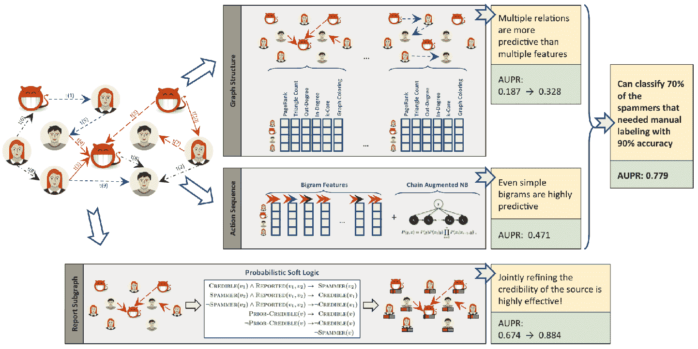

###### 图 8-3. 连接特征提取可以与其他预测方法结合以改进结果。AUPR 指的是精确-召回率曲线下的面积，数字越高越好。

我们已经讨论了如何应用连接特征来处理欺诈和垃圾邮件检测的情况。在这些情况下，活动通常隐藏在多层次的混淆和网络关系中。传统的特征提取和选择方法可能无法在没有图形带来的上下文信息的情况下检测到这种行为。

另一个增强机器学习的领域（本章剩余部分的重点）是*链接预测*。链接预测是估计未来关系形成的可能性，或者是否应该在我们的图中但由于数据不完整而缺失的一种方法。由于网络是动态的，并且可以相当快速地增长，能够预测即将添加的链接具有广泛的适用性，从产品推荐到药物重定位，甚至推断犯罪关系。

从图形中的连接特征经常用于通过基本图形特征以及从中心性和社区算法中提取的特征来改进链接预测。基于节点接近度或相似性的链接预测也很常见；在论文[“社交网络的链接预测问题”](https://bit.ly/2uoyB0q)中，D. Liben-Nowell 和 J. Kleinberg 建议，网络结构本身可能包含足够的潜在信息来检测节点接近度，并超过更直接的度量方法。

现在我们已经看过连接特征如何增强机器学习的方法，让我们深入研究我们的链接预测示例，看看如何应用图算法来改进我们的预测。

# 实践中的图形与机器学习：链接预测

本章的其余部分将展示一个实际的例子，基于[Citation Network Dataset](https://aminer.org/citation)，这是从 DBLP、ACM 和 MAG 提取的研究数据集。该数据集在论文[“ArnetMiner: Extraction and Mining of Academic Social Networks”](http://bit.ly/2U4C3fb)中有描述，作者为 J. Tang 等人。最新版本包含 3,079,007 篇论文，1,766,547 名作者，9,437,718 个作者关系和 25,166,994 个引用关系。

我们将使用以下出版物中发表的文章的子集：

+   *计算机科学讲义*

+   *ACM 通信*

+   *国际软件工程大会*

+   *计算与通信的进展*

我们的结果数据集包含 51,956 篇论文，80,299 名作者，140,575 个作者关系和 28,706 个引用关系。我们将创建一个基于合作撰写论文的作者的共作者图，然后预测未来作者之间的合作。我们只关注那些之前没有合作过的作者之间的合作，不关心作者对之间的多次合作。

在本章的其余部分，我们将设置所需的工具并将数据导入 Neo4j。然后，我们将讨论如何正确平衡数据，并将样本拆分为用于训练和测试的 Spark DataFrames。之后，我们解释我们的假设和链接预测方法，然后在 Spark 中创建一个机器学习流水线。最后，我们将逐步训练和评估各种预测模型，从基本的图特征开始，逐步添加使用 Neo4j 提取的更多图算法特征。

## 工具和数据

让我们开始设置我们的工具和数据。然后我们将探索我们的数据集并创建一个机器学习流水线。

在我们做任何其他事情之前，让我们设置本章中使用的库：

py2neo

一款与 Python 数据科学生态系统良好集成的 Neo4j Python 库

pandas

一个高性能的库，用于在数据库之外进行数据整理，具有易于使用的数据结构和数据分析工具

Spark MLlib

Spark 的机器学习库

###### 注意

我们以 MLlib 作为机器学习库的示例。本章展示的方法可以与其他 ML 库（如 scikit-learn）结合使用。

所有显示的代码都将在 pyspark REPL 中运行。我们可以通过运行以下命令来启动 REPL：

```
export SPARK_VERSION="spark-2.4.0-bin-hadoop2.7"
./${SPARK_VERSION}/bin/pyspark \
  --driver-memory 2g \
  --executor-memory 6g \
  --packages julioasotodv:spark-tree-plotting:0.2
```

这类似于我们在第三章中用于启动 REPL 的命令，但是我们加载的是`spark-tree-plotting`包。在撰写本文时，Spark 的最新发布版本是*spark-2.4.0-bin-hadoop2.7*，但由于您阅读时可能已有所变更，请相应地更改`SPARK_VERSION`环境变量。

一旦我们启动了这个，我们将导入我们将要使用的以下库：

```
from py2neo import Graph
import pandas as pd
from numpy.random import randint

from pyspark.ml import Pipeline
from pyspark.ml.classification import RandomForestClassifier
from pyspark.ml.feature import StringIndexer, VectorAssembler
from pyspark.ml.evaluation import BinaryClassificationEvaluator

from pyspark.sql.types import *
from pyspark.sql import functions as F

from sklearn.metrics import roc_curve, auc
from collections import Counter

from cycler import cycler
import matplotlib
matplotlib.use('TkAgg')
import matplotlib.pyplot as plt
```

现在让我们连接到我们的 Neo4j 数据库：

```
graph = Graph("bolt://localhost:7687", auth=("neo4j", "neo"))
```

## 将数据导入 Neo4j

现在我们已经准备好将数据加载到 Neo4j 并为我们的训练和测试创建一个平衡的分割。我们需要下载[版本 10](https://bit.ly/2TszAH3)的数据集 ZIP 文件，解压缩并将内容放入我们的*import*文件夹中。我们应该有以下文件：

+   *dblp-ref-0.json*

+   *dblp-ref-1.json*

+   *dblp-ref-2.json*

+   *dblp-ref-3.json*

一旦我们将这些文件放入*import*文件夹中，我们需要将以下属性添加到我们的 Neo4j 设置文件中，以便我们可以使用 APOC 库来处理它们：

```
apoc.import.file.enabled=true
apoc.import.file.use_neo4j_config=true
```

首先，我们将创建约束条件，以确保我们不创建重复的文章或作者：

```
CREATE CONSTRAINT ON (article:Article)
ASSERT article.index IS UNIQUE;

CREATE CONSTRAINT ON (author:Author)
ASSERT author.name IS UNIQUE;
```

现在我们可以运行以下查询来从 JSON 文件导入数据：

```
CALL apoc.periodic.iterate(
  'UNWIND ["dblp-ref-0.json","dblp-ref-1.json",
 "dblp-ref-2.json","dblp-ref-3.json"] AS file
 CALL apoc.load.json("file:///" + file)
 YIELD value
 WHERE value.venue IN ["Lecture Notes in Computer Science",
 "Communications of The ACM",
 "international conference on software engineering",
 "advances in computing and communications"]
 return value',
  'MERGE (a:Article {index:value.id})
 ON CREATE SET a += apoc.map.clean(value,["id","authors","references"],[0])
 WITH a,value.authors as authors
 UNWIND authors as author
 MERGE (b:Author{name:author})
 MERGE (b)<-[:AUTHOR]-(a)'
, {batchSize: 10000, iterateList: true});
```

这导致了在图 8-4 中看到的图模式。

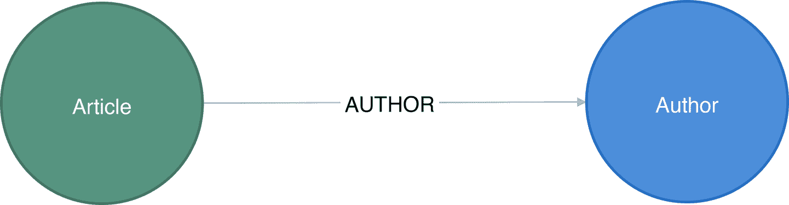

###### 图 8-4\. 引文图

这是一个简单的连接文章和作者的图，所以我们将添加更多我们可以从关系中推断出的信息，以帮助预测。

## 合著关系图

我们希望预测作者之间未来的合作，因此我们将首先创建一个共同作者图。以下 Neo4j Cypher 查询将在每对合作过的作者之间创建一个`CO_AUTHOR`关系：

```
MATCH (a1)<-[:AUTHOR]-(paper)-[:AUTHOR]->(a2:Author)
WITH a1, a2, paper
ORDER BY a1, paper.year
WITH a1, a2, collect(paper)[0].year AS year, count(*) AS collaborations
MERGE (a1)-[coauthor:CO_AUTHOR {year: year}]-(a2)
SET coauthor.collaborations = collaborations;
```

我们在查询中设置的`CO_AUTHOR`关系上的`year`属性是这两位作者首次合作的最早年份。我们只关注作者首次合作的时间——随后的合作并不相关。

图 8-5 是创建的图表的一部分示例。我们已经可以看到一些有趣的社区结构。

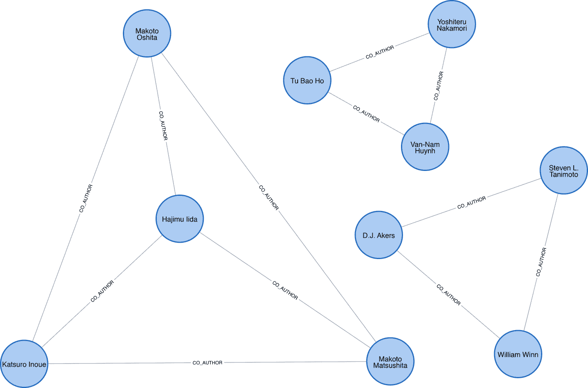

###### 图 8-5. 共同作者图

此图中的每个圆代表一个作者，它们之间的连线是`CO_AUTHOR`关系，因此左侧有四个作者彼此都有合作，右侧有两个例子是三位作者之间的合作。现在我们已经加载了数据并有了基本的图表，让我们创建我们将用于训练和测试的两个数据集。

## 创建平衡的训练和测试数据集

对于链接预测问题，我们希望尝试预测未来链接的创建。这个数据集非常适合，因为我们可以使用文章上的日期来划分我们的数据。我们需要确定使用哪一年来定义我们的训练/测试划分。我们将在此年份之前训练我们的模型，然后在该日期之后测试它。

让我们从了解文章发表的时间开始。我们可以编写以下查询来获取按年份分组的文章数量：

```
query = """
MATCH (article:Article)
RETURN article.year AS year, count(*) AS count
ORDER BY year
"""

by_year = graph.run(query).to_data_frame()
```

让我们将其可视化为条形图，使用以下代码：

```
plt.style.use('fivethirtyeight')
ax = by_year.plot(kind='bar', x='year', y='count', legend=None, figsize=(15,8))
ax.xaxis.set_label_text("")
plt.tight_layout()
plt.show()
```

我们可以通过执行以下代码生成的图表来看到这个图表，其中图 8-6 显示了文章按年份划分的情况。

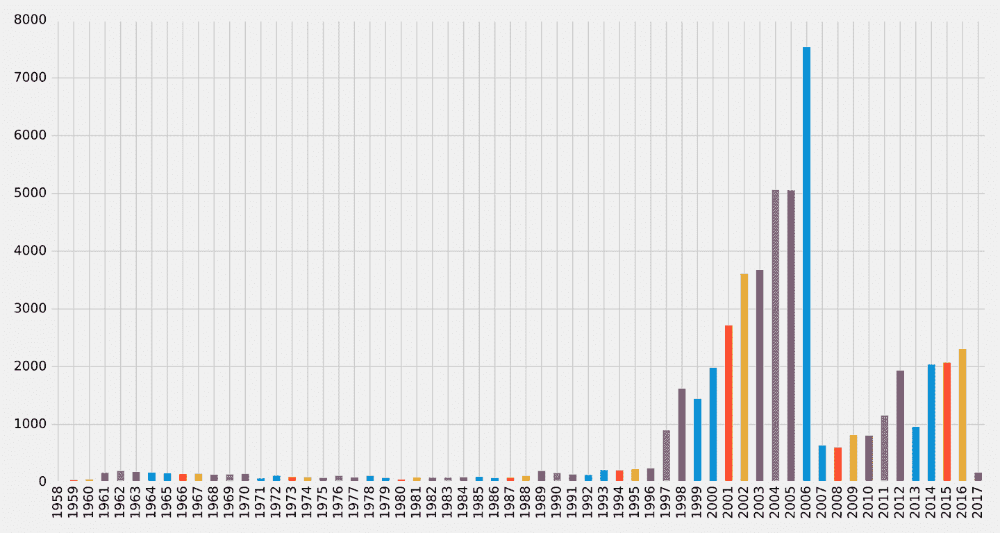

###### 图 8-6. 按年份分类的文章

1997 年之前发表的文章极少，2001 年至 2006 年间有大量文章发表，之后出现了一段低谷，但自 2011 年以来（不包括 2013 年），逐渐上升。看起来 2006 年可以成为我们划分数据、训练模型和进行预测的一个好年份。我们可以检查一下在此年份之前、之间以及之后分别发表了多少篇论文。我们可以编写以下查询来计算这些情况：

```
MATCH (article:Article)
RETURN article.year < 2006 AS training, count(*) AS count
```

这个结果如下所示，其中*true*表示文章在 2006 年之前发表：

| training | count |
| --- | --- |
| false | 21059 |
| true | 30897 |

不错！60% 的论文发表于 2006 年之前，40% 发表于 2006 年或之后。这对于我们的训练和测试数据来说是一个相当平衡的分布。

现在我们已经有了论文的良好分布，让我们在共同作者关系中使用相同的 2006 年分割点。我们将在*2006 年之前*首次合作的作者对之间创建一个`CO_AUTHOR_EARLY`关系：

```
MATCH (a1)<-[:AUTHOR]-(paper)-[:AUTHOR]->(a2:Author)
WITH a1, a2, paper
ORDER BY a1, paper.year
WITH a1, a2, collect(paper)[0].year AS year, count(*) AS collaborations
WHERE year < 2006
MERGE (a1)-[coauthor:CO_AUTHOR_EARLY {year: year}]-(a2)
SET coauthor.collaborations = collaborations;
```

然后，我们将在*2006 年或之后*首次合作的作者对之间创建一个`CO_AUTHOR_LATE`关系：

```
MATCH (a1)<-[:AUTHOR]-(paper)-[:AUTHOR]->(a2:Author)
WITH a1, a2, paper
ORDER BY a1, paper.year
WITH a1, a2, collect(paper)[0].year AS year, count(*) AS collaborations
WHERE year >= 2006
MERGE (a1)-[coauthor:CO_AUTHOR_LATE {year: year}]-(a2)
SET coauthor.collaborations = collaborations;
```

在我们构建训练和测试集之前，让我们先检查一下有多少对节点之间存在链接。以下查询将找到`CO_AUTHOR_EARLY`对的数量：

```
MATCH ()-[:CO_AUTHOR_EARLY]->()
RETURN count(*) AS count
```

运行该查询将返回以下结果：

| 数量 |
| --- |
| 81096 |

而这个查询将找到`CO_AUTHOR_LATE`对的数量：

```
MATCH ()-[:CO_AUTHOR_LATE]->()
RETURN count(*) AS count
```

运行该查询将返回此结果：

| 数量 |
| --- |
| 74128 |

现在我们准备构建我们的训练和测试数据集。

### 平衡和分割数据

有`CO_AUTHOR_EARLY`和`CO_AUTHOR_LATE`关系的节点对将作为我们的正面例子，但我们还需要创建一些负面例子。大多数现实世界的网络都是稀疏的，具有关系的集中区域，这个图也不例外。两个节点没有关系的例子数量远远大于有关系的数量。

如果我们查询我们的`CO_AUTHOR_EARLY`数据，我们会发现有 45,018 名作者拥有这种关系类型，但只有 81,096 个作者之间存在关系。这听起来可能不太平衡，但事实上是：我们的图可能具有的最大关系数是(45018 * 45017) / 2 = 1,013,287,653，这意味着有很多负面例子（没有链接）。如果我们用所有负面例子来训练我们的模型，我们会面临严重的类别不平衡问题。一个模型可以通过预测每对节点都没有关系来达到极高的准确率。

在他们的论文[“链接预测的新视角和方法”](https://ntrda.me/2TrSg9K)，R. Lichtenwalter, J. Lussier 和 N. Chawla 描述了几种解决这一挑战的方法。其中一种方法是通过找到我们当前未连接到的邻域内的节点来构建负面例子。

我们将通过找到两个到三个跳之间的节点对来构建我们的负面例子，排除那些已经有关系的对。然后，我们会对这些节点对进行下采样，以便正负样本数目相等。

###### 注意

在两个跳跃距离内，我们有 314,248 对节点之间没有关系。如果我们将距离增加到三个跳，我们有 967,677 对节点。

以下函数将用于对负面例子进行下采样：

```
def down_sample(df):
    copy = df.copy()
    zero = Counter(copy.label.values)[0]
    un = Counter(copy.label.values)[1]
    n = zero - un
    copy = copy.drop(copy[copy.label == 0].sample(n=n, random_state=1).index)
    return copy.sample(frac=1)
```

此函数计算正负例子之间的差异，然后对负面例子进行采样，以便数目相等。然后我们可以运行以下代码来构建一个具有平衡正负例子的训练集：

```
train_existing_links = graph.run("""
MATCH (author:Author)-[:CO_AUTHOR_EARLY]->(other:Author)
RETURN id(author) AS node1, id(other) AS node2, 1 AS label
""").to_data_frame()

train_missing_links = graph.run("""
MATCH (author:Author)
WHERE (author)-[:CO_AUTHOR_EARLY]-()
MATCH (author)-[:CO_AUTHOR_EARLY*2..3]-(other)
WHERE not((author)-[:CO_AUTHOR_EARLY]-(other))
RETURN id(author) AS node1, id(other) AS node2, 0 AS label
""").to_data_frame()

train_missing_links = train_missing_links.drop_duplicates()
training_df = train_missing_links.append(train_existing_links, ignore_index=True)
training_df['label'] = training_df['label'].astype('category')
training_df = down_sample(training_df)
training_data = spark.createDataFrame(training_df)
```

我们现在已经强制`标签`列成为一个类别，其中`1`表示节点对之间存在链接，`0`表示不存在链接。我们可以通过运行以下代码查看 DataFrame 中的数据：

```
training_data.show(n=5)
```

| 节点 1 | 节点 2 | 标签 |
| --- | --- | --- |
| 10019 | 28091 | 1 |
| 10170 | 51476 | 1 |
| 10259 | 17140 | 0 |
| 10259 | 26047 | 1 |
| 10293 | 71349 | 1 |

结果展示了一系列节点对及其是否存在共同作者关系；例如，节点 `10019` 和 `28091` 有一个标签为 `1` 的关系，表示有合作。

现在让我们执行以下代码来检查 DataFrame 的内容摘要：

```
training_data.groupby("label").count().show()
```

这是结果：

| 标签 | 计数 |
| --- | --- |
| 0 | 81096 |
| 1 | 81096 |

我们已经创建了一个训练集，其中正负样本数量相同。现在我们需要为测试集做同样的事情。以下代码将创建一个包含平衡正负例的测试集：

```
test_existing_links = graph.run("""
MATCH (author:Author)-[:CO_AUTHOR_LATE]->(other:Author)
RETURN id(author) AS node1, id(other) AS node2, 1 AS label
""").to_data_frame()

test_missing_links = graph.run("""
MATCH (author:Author)
WHERE (author)-[:CO_AUTHOR_LATE]-()
MATCH (author)-[:CO_AUTHOR*2..3]-(other)
WHERE not((author)-[:CO_AUTHOR]-(other))
RETURN id(author) AS node1, id(other) AS node2, 0 AS label
""").to_data_frame()

test_missing_links = test_missing_links.drop_duplicates()
test_df = test_missing_links.append(test_existing_links, ignore_index=True)
test_df['label'] = test_df['label'].astype('category')
test_df = down_sample(test_df)
test_data = spark.createDataFrame(test_df)
```

我们可以执行以下代码来检查 DataFrame 的内容：

```
test_data.groupby("label").count().show()
```

这给出了以下结果：

| 标签 | 计数 |
| --- | --- |
| 0 | 74128 |
| 1 | 74128 |

现在我们有了平衡的训练和测试数据集，让我们来看看我们预测链接的方法。

## 如何预测缺失的链接

我们需要从一些基本假设开始，这些假设可以预测我们的数据中的哪些元素可能会导致两个作者在以后成为共同作者。我们的假设会根据领域和问题而变化，但在这种情况下，我们认为最有预测性的特征将与社区相关。我们将从以下假设开始，认为以下元素会增加作者成为共同作者的概率：

+   更多共同作者

+   作者之间的潜在三元关系

+   拥有更多关系的作者

+   同一社区中的作者

+   同一个更紧密社区中的作者

我们将基于假设构建图特征，并使用这些特征来训练一个二元分类器。*二元分类*是一种机器学习类型，其任务是根据规则预测元素属于两个预定义组中的哪一个。我们使用分类器来预测一对作者是否会有联系，基于一个分类规则。对于我们的例子，`1` 的值表示存在联系（共同作者），`0` 的值表示不存在联系（非共同作者）。

我们将实现我们的二元分类器作为 Spark 中的随机森林。*随机森林*是一种集成学习方法，用于分类、回归和其他任务，如 图 8-7 所示。

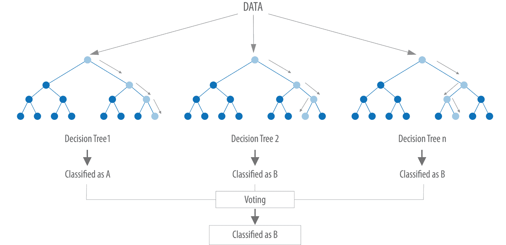

###### 图 8-7\. 随机森林构建一组决策树，然后对结果进行多数投票（分类）或平均值计算（回归）。

我们的随机森林分类器将使用我们训练的多个决策树的结果，并使用投票来预测分类——在我们的例子中，是否存在链接（共同作者）。

现在让我们创建我们的工作流程。

## 创建机器学习管道

我们将基于 Spark 中的随机森林分类器创建我们的机器学习管道。这种方法非常适合，因为我们的数据集将由强特征和弱特征的混合组成。虽然弱特征有时会有所帮助，但随机森林方法将确保我们不会创建一个仅适合于我们训练数据的模型。

要创建我们的 ML 管道，我们将`fields`变量作为特征列表传入--这些是我们的分类器将使用的特征。分类器期望将这些特征作为名为`features`的单列接收，因此我们使用`VectorAssembler`将数据转换为所需的格式。

以下代码创建了一个机器学习管道，并使用 MLlib 设置了我们的参数：

```
def create_pipeline(fields):
    assembler = VectorAssembler(inputCols=fields, outputCol="features")
    rf = RandomForestClassifier(labelCol="label", featuresCol="features",
                                numTrees=30, maxDepth=10)
    return Pipeline(stages=[assembler, rf])
```

`RandomForestClassifier`使用这些参数：

`labelCol`

包含我们想要预测的变量的字段名称；即，节点对是否有链接

`featuresCol`

包含用于预测节点对是否有链接的变量的字段名称

`numTrees`

形成随机森林的决策树数量

`maxDepth`

决策树的最大深度

我们根据实验选择了决策树数量和它们的深度。我们可以考虑超参数，例如可以调整以优化性能的算法设置。最佳超参数通常很难提前确定，并且调整模型通常需要一些试错。

我们已经介绍了基础知识并设置了我们的管道，现在让我们深入研究创建我们的模型并评估其表现。

## 预测链接：基本图特征

我们将从创建一个简单的模型开始，该模型尝试基于从共同作者、优先连接和邻居总并集中提取的特征来预测两位作者是否将来会合作：

共同作者

发现两位作者之间潜在三角形的数量。这捕捉到的思想是，共同拥有合作者的两位作者可能在未来相互引介并合作。

优先连接

通过将每个作者拥有的合作者数量相乘来为每对作者产生一个分数。直觉是，作者更有可能与已经合作过多篇论文的人合作。

邻居的总并集

发现每位作者拥有的总合作者数，减去重复的部分。

在 Neo4j 中，我们可以使用 Cypher 查询计算这些值。以下函数将为训练集计算这些度量：

```
def apply_graphy_training_features(data):
    query = """
 UNWIND $pairs AS pair
 MATCH (p1) WHERE id(p1) = pair.node1
 MATCH (p2) WHERE id(p2) = pair.node2
 RETURN pair.node1 AS node1,
 pair.node2 AS node2,
 size([(p1)-[:CO_AUTHOR_EARLY]-(a)-
 [:CO_AUTHOR_EARLY]-(p2) | a]) AS commonAuthors,
 size((p1)-[:CO_AUTHOR_EARLY]-()) * size((p2)-
 [:CO_AUTHOR_EARLY]-()) AS prefAttachment,
 size(apoc.coll.toSet(
 [(p1)-[:CO_AUTHOR_EARLY]-(a) | id(a)] +
 [(p2)-[:CO_AUTHOR_EARLY]-(a) | id(a)]
 )) AS totalNeighbors
 """
    pairs = [{"node1": row["node1"], "node2": row["node2"]}
                                 for row in data.collect()]
    features = spark.createDataFrame(graph.run(query,
                                 {"pairs": pairs}).to_data_frame())
    return data.join(features, ["node1", "node2"])
```

接下来的函数将为测试集计算它们：

```
def apply_graphy_test_features(data):
    query = """
 UNWIND $pairs AS pair
 MATCH (p1) WHERE id(p1) = pair.node1
 MATCH (p2) WHERE id(p2) = pair.node2
 RETURN pair.node1 AS node1,
 pair.node2 AS node2,
 size([(p1)-[:CO_AUTHOR]-(a)-[:CO_AUTHOR]-(p2) | a]) AS commonAuthors,
 size((p1)-[:CO_AUTHOR]-()) * size((p2)-[:CO_AUTHOR]-())
 AS prefAttachment,
 size(apoc.coll.toSet(
 [(p1)-[:CO_AUTHOR]-(a) | id(a)] + [(p2)-[:CO_AUTHOR]-(a) | id(a)]
 )) AS totalNeighbors
 """
    pairs = [{"node1": row["node1"], "node2": row["node2"]}
                       for row in data.collect()]
    features = spark.createDataFrame(graph.run(query,
                       {"pairs": pairs}).to_data_frame())
    return data.join(features, ["node1", "node2"])
```

这两个函数都接收包含`node1`和`node2`列中节点对的 DataFrame。然后，我们构建包含这些节点对的映射数组，并计算每对节点的每个度量。

###### 注意

在本章中，`UNWIND`子句对于一次性获取大量节点对并在一个查询中返回它们的所有特征尤为有用。

我们可以将这些函数应用到我们的训练和测试 DataFrame 中的 Spark 中，代码如下：

```
training_data = apply_graphy_training_features(training_data)
test_data = apply_graphy_test_features(test_data)
```

让我们探索一下我们训练集中的数据。以下代码将绘制`commonAuthors`频率的直方图：

```
plt.style.use('fivethirtyeight')
fig, axs = plt.subplots(1, 2, figsize=(18, 7), sharey=True)
charts = [(1, "have collaborated"), (0, "haven't collaborated")]

for index, chart in enumerate(charts):
    label, title = chart
    filtered = training_data.filter(training_data["label"] == label)
    common_authors = filtered.toPandas()["commonAuthors"]
    histogram = common_authors.value_counts().sort_index()
    histogram /= float(histogram.sum())
    histogram.plot(kind="bar", x='Common Authors', color="darkblue",
                   ax=axs[index], title=f"Authors who {title} (label={label})")
    axs[index].xaxis.set_label_text("Common Authors")

plt.tight_layout()
plt.show()
```

我们可以在图 8-8 中看到生成的图表。

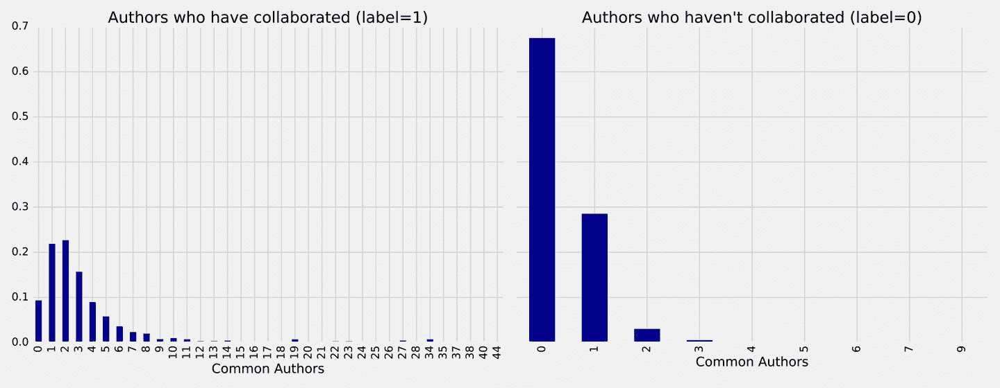

###### 图 8-8\. 共同作者频率

在左侧，我们可以看到当作者合作时`commonAuthors`的频率，而右侧则是他们没有合作时的频率。对于那些没有合作过的人（右侧），最大的共同作者数量是 9，但是 95% 的值为 1 或 0。并不奇怪，那些没有在论文上合作的人大多数也没有很多其他共同作者。对于那些合作过的人（左侧），70% 的人共同作者少于五个，其中在一个或两个共同作者之间有一个峰值。

现在我们想要训练一个模型来预测缺失的链接。以下函数完成此操作：

```
def train_model(fields, training_data):
    pipeline = create_pipeline(fields)
    model = pipeline.fit(training_data)
    return model
```

我们将首先创建一个仅使用`commonAuthors`的基本模型。我们可以通过运行以下代码来创建该模型：

```
basic_model = train_model(["commonAuthors"], training_data)
```

训练完我们的模型后，让我们检查它在一些虚拟数据上的表现。以下代码评估了对不同`commonAuthors`值的代码：

```
eval_df = spark.createDataFrame(
    [(0,), (1,), (2,), (10,), (100,)],
    ['commonAuthors'])

(basic_model.transform(eval_df)
 .select("commonAuthors", "probability", "prediction")
 .show(truncate=False))
```

运行该代码将得到以下结果：

| 共同作者 | 概率 | 预测 |
| --- | --- | --- |
| 0 | [0.7540494940434322,0.24595050595656787] | 0.0 |
| 1 | [0.7540494940434322,0.24595050595656787] | 0.0 |
| 2 | [0.0536835525078107,0.9463164474921892] | 1.0 |
| 10 | [0.0536835525078107,0.9463164474921892] | 1.0 |

如果我们的`commonAuthors`值小于 2，那么有 75% 的概率作者之间没有关系，因此我们的模型预测为 0。如果`commonAuthors`值为 2 或更多，则有 94% 的概率作者之间存在关系，因此我们的模型预测为 1。

现在让我们对我们的模型进行测试集评估。虽然有多种评估模型表现的方法，但大多数都源自几个基线预测性指标，如表 8-1 所述：

表 8-1\. 预测性指标

| 度量 | 公式 | 描述 |
| --- | --- | --- |
| 准确率 | <math display="block" alttext="StartFraction upper T r u e upper P o s i t i v e s plus upper T r u e upper N e g a t i v e s Over upper T o t a l upper P r e d i c t i o n s EndFraction"><mfrac><mrow><mi>T</mi><mi>r</mi><mi>u</mi><mi>e</mi><mi>P</mi><mi>o</mi><mi>s</mi><mi>i</mi><mi>t</mi><mi>i</mi><mi>v</mi><mi>e</mi><mi>s</mi><mo>+</mo><mi>T</mi><mi>r</mi><mi>u</mi><mi>e</mi><mi>N</mi><mi>e</mi><mi>g</mi><mi>a</mi><mi>t</mi><mi>i</mi><mi>v</mi><mi>e</mi><mi>s</mi></mrow> <mrow><mi>T</mi><mi>o</mi><mi>t</mi><mi>a</mi><mi>l</mi><mi>P</mi><mi>r</mi><mi>e</mi><mi>d</mi><mi>i</mi><mi>c</mi><mi>t</mi><mi>i</mi><mi>o</mi><mi>n</mi><mi>s</mi></mrow></mfrac></math> | 我们模型预测正确的比例，或者正确预测的总数除以预测总数。请注意，仅仅依靠准确率可能会产生误导，特别是在数据不平衡的情况下。例如，如果我们的数据集中包含 95 只猫和 5 只狗，并且我们的模型预测每张图像都是猫，尽管没有正确识别任何狗，我们的准确率得分为 95%。 |
| 精确率 | <math display="block" alttext="StartFraction upper T r u e upper P o s i t i v e s Over upper T r u e upper P o s i t i v e s plus upper F a l s e upper P o s i t i v e s EndFraction"><mfrac><mrow><mi>T</mi><mi>r</mi><mi>u</mi><mi>e</mi><mi>P</mi><mi>o</mi><mi>s</mi><mi>i</mi><mi>t</mi><mi>i</mi><mi>v</mi><mi>e</mi><mi>s</mi></mrow> <mrow><mi>T</mi><mi>r</mi><mi>u</mi><mi>e</mi><mi>P</mi><mi>o</mi><mi>s</mi><mi>i</mi><mi>t</mi><mi>i</mi><mi>v</mi><mi>e</mi><mi>s</mi><mo>+</mo><mi>F</mi><mi>a</mi><mi>l</mi><mi>s</mi><mi>e</mi><mi>P</mi><mi>o</mi><mi>s</mi><mi>i</mi><mi>t</mi><mi>i</mi><mi>v</mi><mi>e</mi><mi>s</mi></mrow></mfrac></math> | *正例识别*中正确的比例。低精确率表明更多的假阳性。一个不产生假阳性的模型精确率为 1.0。 |
| 召回率（真正例率） | <math display="block" alttext="StartFraction upper T r u e upper P o s i t i v e s Over upper T r u e upper P o s i t i v e s plus upper F a l s e upper N e g a t i v e s EndFraction"><mfrac><mrow><mi>T</mi><mi>r</mi><mi>u</mi><mi>e</mi><mi>P</mi><mi>o</mi><mi>s</mi><mi>i</mi><mi>t</mi><mi>i</mi><mi>v</mi><mi>e</mi><mi>s</mi></mrow> <mrow><mi>T</mi><mi>r</mi><mi>u</mi><mi>e</mi><mi>P</mi><mi>o</mi><mi>s</mi><mi>i</mi><mi>t</mi><mi>i</mi><mi>v</mi><mi>e</mi><mi>s</mi><mo>+</mo><mi>F</mi><mi>a</mi><mi>l</mi><mi>s</mi><mi>e</mi><mi>N</mi><mi>e</mi><mi>g</mi><mi>a</mi><mi>t</mi><mi>i</mi><mi>v</mi><mi>e</mi><mi>s</mi></mrow></mfrac></math> | *实际正例*中被正确识别的比例。低召回率表明更多的假阴性。一个不产生假阴性的模型召回率为 1.0。 |
| 假阳性率 | <math display="block" alttext="StartFraction upper F a l s e upper P o s i t i v e s Over upper F a l s e upper P o s i t i v e s plus upper T r u e upper N e g a t i v e s EndFraction"><mfrac><mrow><mi>F</mi><mi>a</mi><mi>l</mi><mi>s</mi><mi>e</mi><mi>P</mi><mi>o</mi><mi>s</mi><mi>i</mi><mi>t</mi><mi>i</mi><mi>v</mi><mi>e</mi><mi>s</mi></mrow> <mrow><mi>F</mi><mi>a</mi><mi>l</mi><mi>s</mi><mi>e</mi><mi>P</mi><mi>o</mi><mi>s</mi><mi>i</mi><mi>t</mi><mi>i</mi><mi>v</mi><mi>e</mi><mi>s</mi><mo>+</mo><mi>T</mi><mi>r</mi><mi>u</mi><mi>e</mi><mi>N</mi><mi>e</mi><mi>g</mi><mi>a</mi><mi>t</mi><mi>i</mi><mi>v</mi><mi>e</mi><mi>s</mi></mrow></mfrac></math> | *错误的阳性* 的比例。高分数表示更多的假阳性。 |
| 接收者操作特征（ROC）曲线 | X-Y 图表 | ROC 曲线是在不同分类阈值下绘制的召回率（真阳性率）与假阳性率的图表。曲线下面积（AUC）测量了从 X-Y 轴（0,0）到（1,1）下面的二维区域。 |

我们将使用准确率、精确率、召回率和 ROC 曲线来评估我们的模型。准确率是一个粗略的度量，所以我们将专注于增加整体精确率和召回率。我们将使用 ROC 曲线来比较单个特征如何改变预测率。

###### 提示

根据我们的目标，我们可能希望偏向不同的度量标准。例如，对于疾病指标，我们可能希望消除所有假阴性，但我们不希望将所有预测推向阳性结果。对于不同的模型，我们可能设置多个阈值，以便在可能出现误报结果的情况下将某些结果传递到二次检查。

降低分类阈值会导致更多的整体阳性结果，从而增加假阳性和真阳性。

让我们使用以下函数计算这些预测指标：

```
def evaluate_model(model, test_data):
    # Execute the model against the test set
    predictions = model.transform(test_data)

    # Compute true positive, false positive, false negative counts
    tp = predictions[(predictions.label == 1) &
                     (predictions.prediction == 1)].count()
    fp = predictions[(predictions.label == 0) &
                     (predictions.prediction == 1)].count()
    fn = predictions[(predictions.label == 1) &
                     (predictions.prediction == 0)].count()

    # Compute recall and precision manually
    recall = float(tp) / (tp + fn)
    precision = float(tp) / (tp + fp)

    # Compute accuracy using Spark MLLib's binary classification evaluator
    accuracy = BinaryClassificationEvaluator().evaluate(predictions)

    # Compute false positive rate and true positive rate using sklearn functions
    labels = [row["label"] for row in predictions.select("label").collect()]
    preds = [row["probability"][1] for row in predictions.select
                ("probability").collect()]
    fpr, tpr, threshold = roc_curve(labels, preds)
    roc_auc = auc(fpr, tpr)

    return { "fpr": fpr, "tpr": tpr, "roc_auc": roc_auc, "accuracy": accuracy,
             "recall": recall, "precision": precision }
```

然后，我们将编写一个函数以更易于消化的格式显示结果：

```
def display_results(results):
    results = {k: v for k, v in results.items() if k not in
                        ["fpr", "tpr", "roc_auc"]}
    return pd.DataFrame({"Measure": list(results.keys()),
                         "Score": list(results.values())})
```

我们可以使用这段代码调用函数并显示结果：

```
basic_results = evaluate_model(basic_model, test_data)
display_results(basic_results)
```

常见作者模型的预测指标是：

| measure | score |
| --- | --- |
| 准确率 | 0.864457 |
| 召回率 | 0.753278 |
| 精确率 | 0.968670 |

虽然我们仅基于作者对的共同作者数量来预测未来的合作，这并不是一个坏的开端。但是，如果我们将这些度量标准放在一起考虑，我们可以得到更全面的图片。例如，这个模型的精确率为 0.968670，这意味着它非常擅长预测*存在链接*。然而，我们的召回率为 0.753278，这意味着它在预测*不存在链接*时表现不佳。

我们还可以使用以下函数绘制 ROC 曲线（真阳性和假阳性的相关性）：

```
def create_roc_plot():
    plt.style.use('classic')
    fig = plt.figure(figsize=(13, 8))
    plt.xlim([0, 1])
    plt.ylim([0, 1])
    plt.ylabel('True Positive Rate')
    plt.xlabel('False Positive Rate')
    plt.rc('axes', prop_cycle=(cycler('color',
                   ['r', 'g', 'b', 'c', 'm', 'y', 'k'])))
    plt.plot([0, 1], [0, 1], linestyle='--', label='Random score
                   (AUC = 0.50)')
    return plt, fig

def add_curve(plt, title, fpr, tpr, roc):
    plt.plot(fpr, tpr, label=f"{title} (AUC = {roc:0.2})")
```

我们这样称呼它：

```
plt, fig = create_roc_plot()

add_curve(plt, "Common Authors",
          basic_results["fpr"], basic_results["tpr"], basic_results["roc_auc"])

plt.legend(loc='lower right')
plt.show()
```

我们可以在图 8-9 中看到我们基本模型的 ROC 曲线。

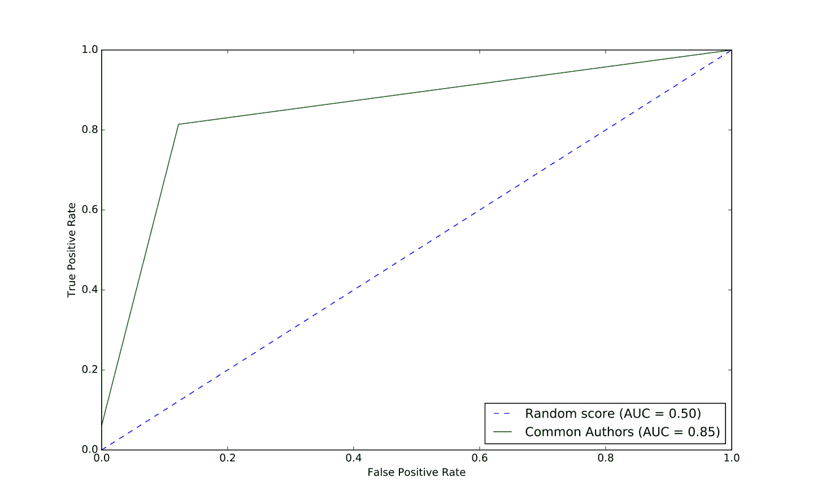

###### 图 8-9\. 基础模型的 ROC 曲线

通用作者模型给出了 0.86 的曲线下面积（AUC）得分。尽管这为我们提供了一个总体预测度量，但我们需要通过图表（或其他措施）来评估是否符合我们的目标。在图 8-9 中，我们看到当真阳性率（召回率）接近 80%时，我们的假阳性率达到约 20%。在诸如欺诈检测这类场景中，这可能是有问题的，因为追踪假阳性的成本很高。

现在让我们使用其他图特征来看看是否可以改进我们的预测。在训练我们的模型之前，让我们看看数据是如何分布的。我们可以运行以下代码来展示每个图特征的描述统计：

```
(training_data.filter(training_data["label"]==1)
 .describe()
 .select("summary", "commonAuthors", "prefAttachment", "totalNeighbors")
 .show())
```

```
(training_data.filter(training_data["label"]==0)
 .describe()
 .select("summary", "commonAuthors", "prefAttachment", "totalNeighbors")
 .show())
```

我们可以在下面的表格中看到运行这些代码段的结果：

| summary | commonAuthors | prefAttachment | totalNeighbors |
| --- | --- | --- | --- |
| count | 81096 | 81096 | 81096 |
| mean | 3.5959233501035808 | 69.93537289138798 | 10.082408503502021 |
| stddev | 4.715942231635516 | 171.47092255919472 | 8.44109970920685 |
| min | 0 | 1 | 2 |
| max | 44 | 3150 | 90 |
| summary | commonAuthors | prefAttachment | totalNeighbors |
| --- | --- | --- | --- |
| count | 81096 | 81096 | 81096 |
| mean | 0.37666469369635985 | 48.18137762651672 | 12.97586810693499 |
| stddev | 0.6194576095461857 | 94.92635344980489 | 10.082991078685803 |
| min | 0 | 1 | 1 |
| max | 9 | 1849 | 89 |

特征之间差异较大（共同作者关系）和没有连接（无共同作者关系）的特征应该更具预测性，因为分歧更大。对于具有合作的作者而言，`prefAttachment`的平均值更高。这对于`commonAuthors`来说更为显著。我们注意到，对于`totalNeighbors`的值并没有太大的差异，这可能意味着该特征不会很具预测性。此外，优先附加的标准偏差很大，以及最小和最大值也是我们在具有集中枢纽的小世界网络中所预期的。

现在让我们通过运行以下代码来训练一个新模型，添加优先附加和总邻居的联合：

```
fields = ["commonAuthors", "prefAttachment", "totalNeighbors"]
graphy_model = train_model(fields, training_data)
```

现在让我们评估模型并显示结果：

```
graphy_results = evaluate_model(graphy_model, test_data)
display_results(graphy_results)
```

图特征模型的预测性能如下：

| measure | score |
| --- | --- |
| accuracy | 0.978351 |
| recall | 0.924226 |
| precision | 0.943795 |

我们的准确率和召回率显著提高，但精确率有所下降，我们仍然在误分类约 8%的链接。让我们通过运行以下代码来绘制 ROC 曲线，并比较基础和图特征模型：

```
plt, fig = create_roc_plot()

add_curve(plt, "Common Authors",
          basic_results["fpr"], basic_results["tpr"],
                                basic_results["roc_auc"])

add_curve(plt, "Graphy",
          graphy_results["fpr"], graphy_results["tpr"],
                                 graphy_results["roc_auc"])

plt.legend(loc='lower right')
plt.show()
```

我们可以在图 8-10 中看到输出。

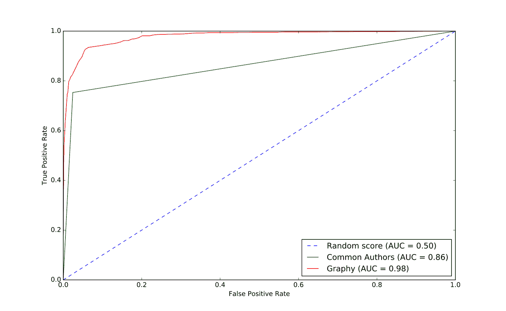

###### 图 8-10\. 图特征模型的 ROC 曲线

总体上看，我们的方向是正确的，通过可视化比较来感受不同模型对结果的影响是很有帮助的。

现在我们有多个特征，我们想评估哪些特征产生了最大的影响。我们将使用*特征重要性*来排名不同特征对我们模型预测影响的程度。这使我们能够评估不同算法和统计数据对结果的影响。

###### 注意

要计算特征重要性，Spark 中的随机森林算法对森林中所有树的纯度降低进行平均。*纯度*是随机分配标签错误的频率。

特征排名与我们评估的特征组进行比较，总是标准化为 1。如果我们排名一个特征，其特征重要性为 1.0，因为它对模型有 100% 的影响。

以下函数创建了一个显示最具影响力特征的图表：

```
def plot_feature_importance(fields, feature_importances):
    df = pd.DataFrame({"Feature": fields, "Importance": feature_importances})
    df = df.sort_values("Importance", ascending=False)
    ax = df.plot(kind='bar', x='Feature', y='Importance', legend=None)
    ax.xaxis.set_label_text("")
    plt.tight_layout()
    plt.show()
```

然后我们这样调用它：

```
rf_model = graphy_model.stages[-1]
plot_feature_importance(fields, rf_model.featureImportances)
```

运行该函数的结果可以在图 8-11 中看到。

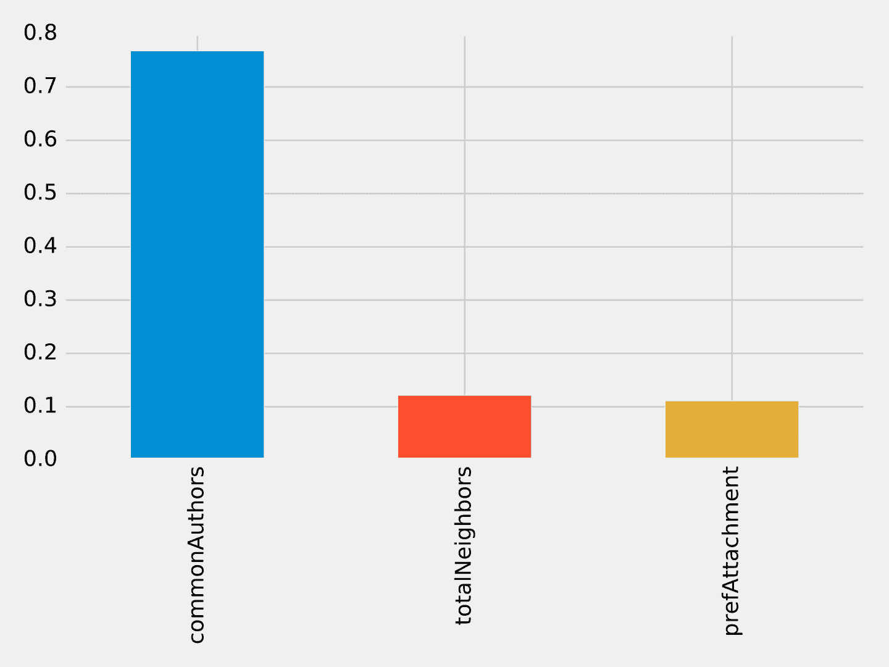

###### 图 8-11\. 特征重要性：图模型

到目前为止，我们使用的三个特征中，`commonAuthors`是最重要的特征，影响力大得多。

要了解我们的预测模型是如何创建的，我们可以使用[spark-tree-plotting 库](https://bit.ly/2usxOf2)可视化随机森林中的一个决策树。以下代码生成一个[GraphViz 文件](http://www.graphviz.org)：

```
from spark_tree_plotting import export_graphviz

dot_string = export_graphviz(rf_model.trees[0],
    featureNames=fields, categoryNames=[], classNames=["True", "False"],
    filled=True, roundedCorners=True, roundLeaves=True)

with open("/tmp/rf.dot", "w") as file:
    file.write(dot_string)
```

然后，我们可以通过从终端运行以下命令生成该文件的可视化表示：

```
dot -Tpdf /tmp/rf.dot -o /tmp/rf.pdf
```

那个命令的输出可以在图 8-12 中看到。

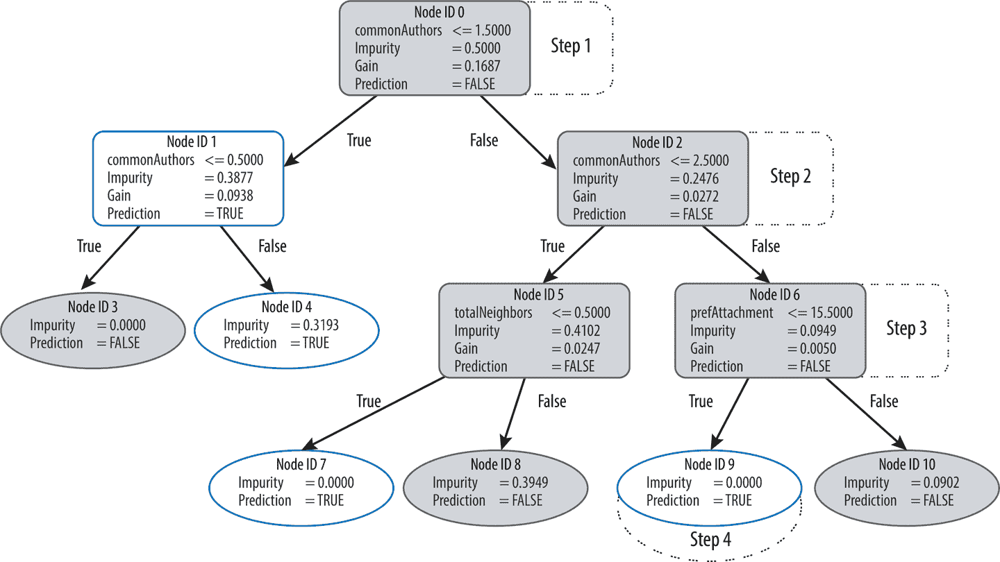

###### 图 8-12\. 可视化决策树

想象我们正在使用此决策树预测以下具有以下特征的节点对是否连接：

| commonAuthors | prefAttachment | totalNeighbors |
| --- | --- | --- |
| 10 | 12 | 5 |

我们的随机森林通过几个步骤来创建预测：

1.  我们从`节点 0`开始，这里有超过 1.5 个`commonAuthors`，所以我们沿着`False`分支向下到`节点 2`。

1.  这里我们有超过 2.5 个`commonAuthors`，所以我们沿着`False`分支到`节点 6`。

1.  我们在`prefAttachment`中得分少于 15.5 分，这将带我们到`节点 9`。

1.  节点 9 是决策树中的叶节点，这意味着我们不需要再检查任何条件——该节点上的`Prediction`（即`True`）是决策树的预测。

1.  最后，随机森林评估要预测的项目与这些决策树集合之间的联系，并根据最常见的结果进行预测。

现在让我们看看如何添加更多的图特征。

## 预测链接：三角形和聚类系数

推荐解决方案通常基于某种三角度量进行预测，因此让我们看看它们是否能进一步帮助我们的示例。我们可以执行以下查询来计算节点是三角形的一部分及其聚类系数：

```
CALL algo.triangleCount('Author', 'CO_AUTHOR_EARLY', { write:true,
 writeProperty:'trianglesTrain', clusteringCoefficientProperty:
                'coefficientTrain'});

CALL algo.triangleCount('Author', 'CO_AUTHOR', { write:true,
 writeProperty:'trianglesTest', clusteringCoefficientProperty:
                'coefficientTest'});
```

下面的函数将这些特征添加到我们的数据框中：

```
def apply_triangles_features(data, triangles_prop, coefficient_prop):
    query = """
 UNWIND $pairs AS pair
 MATCH (p1) WHERE id(p1) = pair.node1
 MATCH (p2) WHERE id(p2) = pair.node2
 RETURN pair.node1 AS node1,
 pair.node2 AS node2,
 apoc.coll.min([p1[$trianglesProp], p2[$trianglesProp]])
 AS minTriangles,
 apoc.coll.max([p1[$trianglesProp], p2[$trianglesProp]])
 AS maxTriangles,
 apoc.coll.min([p1[$coefficientProp], p2[$coefficientProp]])
 AS minCoefficient,
 apoc.coll.max([p1[$coefficientProp], p2[$coefficientProp]])
 AS maxCoefficient
 """
    params = {
        "pairs": [{"node1": row["node1"], "node2": row["node2"]}
                            for row in data.collect()],
        "trianglesProp": triangles_prop,
        "coefficientProp": coefficient_prop
    }
    features = spark.createDataFrame(graph.run(query, params).to_data_frame())
    return data.join(features, ["node1", "node2"])
```

###### 注意

请注意，我们已经使用最小值和最大值前缀来描述我们的三角形计数和聚类系数算法。我们需要一种方法来防止我们的模型基于传入无向图中的作者顺序进行学习。为此，我们已将这些特征按作者的最小计数和最大计数进行了分割。

我们可以使用以下代码将此功能应用于我们的训练和测试数据框中：

```
training_data = apply_triangles_features(training_data,
                                        "trianglesTrain", "coefficientTrain")
test_data = apply_triangles_features(test_data,
                                        "trianglesTest", "coefficientTest")
```

并运行此代码以显示我们三角形特征的描述性统计：

```
(training_data.filter(training_data["label"]==1)
 .describe()
 .select("summary", "minTriangles", "maxTriangles",
                    "minCoefficient", "maxCoefficient")
 .show())
```

```
(training_data.filter(training_data["label"]==0)
 .describe()
 .select("summary", "minTriangles", "maxTriangles", "minCoefficient",
                                                    "maxCoefficient")
 .show())
```

我们可以在以下表格中看到运行这些代码段的结果。

| 概要 | minTriangles | maxTriangles | minCoefficient | maxCoefficient |
| --- | --- | --- | --- | --- |
| 计数 | 81096 | 81096 | 81096 | 81096 |
| 平均值 | 19.478260333431983 | 27.73590559337082 | 0.5703773654487051 | 0.8453786164620439 |
| 标准差 | 65.7615282768483 | 74.01896188921927 | 0.3614610553659958 | 0.2939681857356519 |
| 最小值 | 0 | 0 | 0.0 | 0.0 |
| 最大值 | 622 | 785 | 1.0 | 1.0 |
| 概要 | minTriangles | maxTriangles | minCoefficient | maxCoefficient |
| --- | --- | --- | --- | --- |
| 计数 | 81096 | 81096 | 81096 | 81096 |
| 平均值 | 5.754661142349808 | 35.651980368945445 | 0.49048921333297446 | 0.860283935358397 |
| 标准差 | 20.639236521699 | 85.82843448272624 | 0.3684138346533951 | 0.2578219623967906 |
| 最小值 | 0 | 0 | 0.0 | 0.0 |
| 最大值 | 617 | 785 | 1.0 | 1.0 |

请注意，在这个比较中，合著关系和非合著关系数据之间的差异并不那么显著。这可能意味着这些特征不太具有预测性。

通过运行以下代码可以训练另一个模型：

```
fields = ["commonAuthors", "prefAttachment", "totalNeighbors",
          "minTriangles", "maxTriangles", "minCoefficient", "maxCoefficient"]
triangle_model = train_model(fields, training_data)
```

现在让我们评估模型并展示结果：

```
triangle_results = evaluate_model(triangle_model, test_data)
display_results(triangle_results)
```

三角形模型的预测指标显示在本表中：

| 测量 | 分数 |
| --- | --- |
| 准确率 | 0.992924 |
| 召回率 | 0.965384 |
| 精度 | 0.958582 |

通过将每个新特征添加到先前的模型中，我们的预测指标显著提高。让我们使用以下代码将我们的三角形模型添加到 ROC 曲线图中：

```
plt, fig = create_roc_plot()

add_curve(plt, "Common Authors",
          basic_results["fpr"], basic_results["tpr"], basic_results["roc_auc"])

add_curve(plt, "Graphy",
          graphy_results["fpr"], graphy_results["tpr"],
                                 graphy_results["roc_auc"])

add_curve(plt, "Triangles",
          triangle_results["fpr"], triangle_results["tpr"],
                                   triangle_results["roc_auc"])

plt.legend(loc='lower right')
plt.show()
```

我们可以在图 8-13 中看到输出。

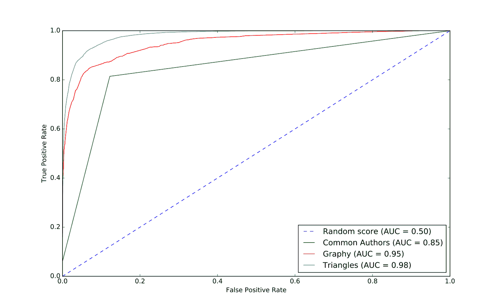

###### 图 8-13\. 三角形模型的 ROC 曲线

我们的模型普遍改善，预测指标已达到 90%以上。这通常是最困难的时候，因为最容易获得的收益已经得到，但仍有改进空间。让我们看看重要特征的变化：

```
rf_model = triangle_model.stages[-1]
plot_feature_importance(fields, rf_model.featureImportances)
```

运行该函数的结果可以在图 8-14 中看到。

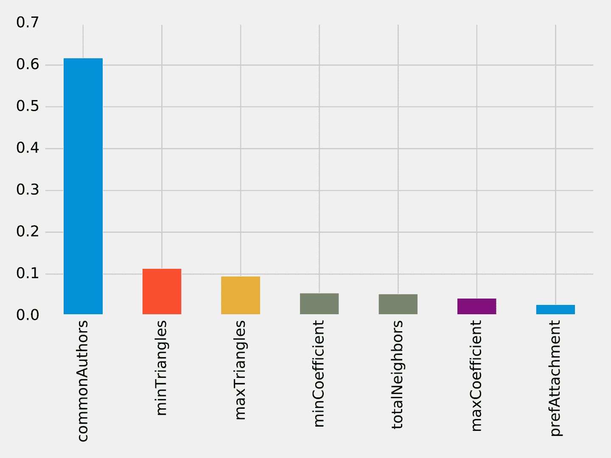

###### 图 8-14\. 特征重要性：三角形模型

`共同作者`特征仍然对我们的模型产生了最大的单一影响。也许我们需要看看新的领域，看看当我们添加社区信息时会发生什么。

## 预测链接：社区检测

我们假设在同一个社区中的节点，如果它们之间尚未有链接，更有可能之后会形成链接。此外，我们认为社区越紧密，链接的可能性就越大。

首先，我们将使用 Neo4j 中的 Label Propagation 算法计算更粗粒度的社区。我们通过运行以下查询来完成这一操作，该查询将在训练集的`partitionTrain`和测试集的`partitionTest`属性中存储社区：

```
CALL algo.labelPropagation("Author", "CO_AUTHOR_EARLY", "BOTH",
 {partitionProperty: "partitionTrain"});

CALL algo.labelPropagation("Author", "CO_AUTHOR", "BOTH",
 {partitionProperty: "partitionTest"});
```

我们还将使用 Louvain 算法计算更精细的群组。Louvain 算法返回中间聚类，我们将在训练集的`louvainTrain`和测试集的`louvainTest`属性中存储这些最小的聚类：

```
CALL algo.louvain.stream("Author", "CO_AUTHOR_EARLY",
 {includeIntermediateCommunities:true})
YIELD nodeId, community, communities
WITH algo.getNodeById(nodeId) AS node, communities[0] AS smallestCommunity
SET node.louvainTrain = smallestCommunity;

CALL algo.louvain.stream("Author", "CO_AUTHOR",
 {includeIntermediateCommunities:true})
YIELD nodeId, community, communities
WITH algo.getNodeById(nodeId) AS node, communities[0] AS smallestCommunity
SET node.louvainTest = smallestCommunity;
```

现在我们将创建以下函数，以返回这些算法的值：

```
def apply_community_features(data, partition_prop, louvain_prop):
    query = """
 UNWIND $pairs AS pair
 MATCH (p1) WHERE id(p1) = pair.node1
 MATCH (p2) WHERE id(p2) = pair.node2
 RETURN pair.node1 AS node1,
 pair.node2 AS node2,
 CASE WHEN p1[$partitionProp] = p2[$partitionProp] THEN
 1 ELSE 0 END AS samePartition,
 CASE WHEN p1[$louvainProp] = p2[$louvainProp] THEN
 1 ELSE 0 END AS sameLouvain
 """
    params = {
        "pairs": [{"node1": row["node1"], "node2": row["node2"]} for
                            row in data.collect()],
        "partitionProp": partition_prop,
        "louvainProp": louvain_prop
    }
    features = spark.createDataFrame(graph.run(query, params).to_data_frame())
    return data.join(features, ["node1", "node2"])
```

我们可以在 Spark 中的训练和测试数据框架上应用该函数，具体代码如下：

```
training_data = apply_community_features(training_data,
                                        "partitionTrain", "louvainTrain")
test_data = apply_community_features(test_data, "partitionTest", "louvainTest")
```

然后，我们可以运行这段代码，查看节点对是否属于同一分区：

```
plt.style.use('fivethirtyeight')
fig, axs = plt.subplots(1, 2, figsize=(18, 7), sharey=True)
charts = [(1, "have collaborated"), (0, "haven't collaborated")]

for index, chart in enumerate(charts):
    label, title = chart
    filtered = training_data.filter(training_data["label"] == label)
    values = (filtered.withColumn('samePartition',
             F.when(F.col("samePartition") == 0, "False")
                                  .otherwise("True"))
              .groupby("samePartition")
              .agg(F.count("label").alias("count"))
              .select("samePartition", "count")
              .toPandas())
    values.set_index("samePartition", drop=True, inplace=True)
    values.plot(kind="bar", ax=axs[index], legend=None,
                title=f"Authors who {title} (label={label})")
    axs[index].xaxis.set_label_text("Same Partition")

plt.tight_layout()
plt.show()
```

我们可以在图 8-15 中看到运行该代码的结果。

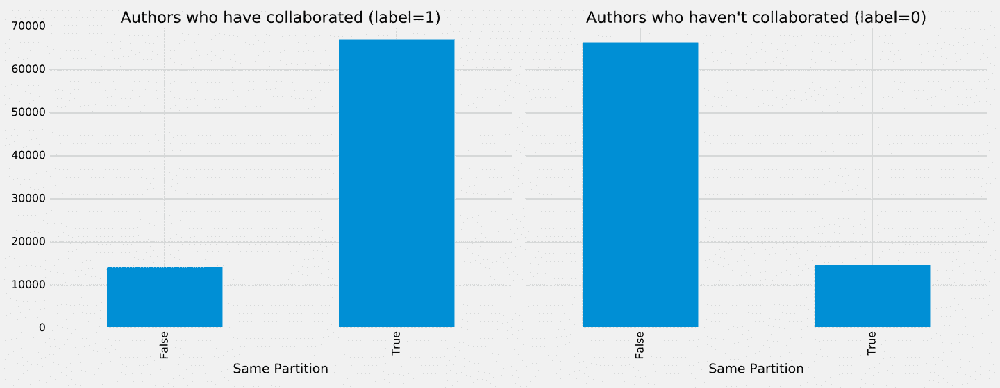

###### 图 8-15\. 相同的分区

看起来这个特征可能相当具有预测性—合作过的作者很可能属于同一个分区。我们可以通过以下代码对 Louvain 聚类做同样的操作：

```
plt.style.use('fivethirtyeight')
fig, axs = plt.subplots(1, 2, figsize=(18, 7), sharey=True)
charts = [(1, "have collaborated"), (0, "haven't collaborated")]

for index, chart in enumerate(charts):
    label, title = chart
    filtered = training_data.filter(training_data["label"] == label)
    values = (filtered.withColumn('sameLouvain',
              F.when(F.col("sameLouvain") == 0, "False")
                                  .otherwise("True"))
              .groupby("sameLouvain")
              .agg(F.count("label").alias("count"))
              .select("sameLouvain", "count")
              .toPandas())
    values.set_index("sameLouvain", drop=True, inplace=True)
    values.plot(kind="bar", ax=axs[index], legend=None,
                title=f"Authors who {title} (label={label})")
    axs[index].xaxis.set_label_text("Same Louvain")

plt.tight_layout()
plt.show()
```

我们可以在图 8-16 中看到运行该代码的结果。

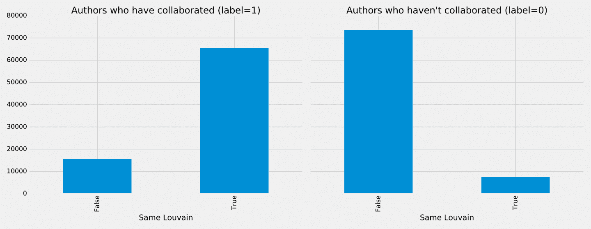

###### 图 8-16\. 相同的 Louvain 聚类

看起来这个特征也可能相当具有预测性—合作过的作者很可能属于同一个群组，而没有合作过的则几乎不可能。我们可以通过以下代码对 Louvain 聚类做同样的操作：

我们可以通过运行以下代码训练另一个模型：

```
fields = ["commonAuthors", "prefAttachment", "totalNeighbors",
          "minTriangles", "maxTriangles", "minCoefficient", "maxCoefficient",
          "samePartition", "sameLouvain"]
community_model = train_model(fields, training_data)
```

现在让我们评估模型并展示结果：

```
community_results = evaluate_model(community_model, test_data)
display_results(community_results)
```

社区模型的预测指标为：

| measure | score |
| --- | --- |
| accuracy | 0.995771 |
| recall | 0.957088 |
| precision | 0.978674 |

我们的一些指标已经改进，因此为了比较，让我们绘制所有模型的 ROC 曲线，运行以下代码：

```
plt, fig = create_roc_plot()

add_curve(plt, "Common Authors",
          basic_results["fpr"], basic_results["tpr"], basic_results["roc_auc"])

add_curve(plt, "Graphy",
          graphy_results["fpr"], graphy_results["tpr"],
          graphy_results["roc_auc"])

add_curve(plt, "Triangles",
          triangle_results["fpr"], triangle_results["tpr"],
          triangle_results["roc_auc"])

add_curve(plt, "Community",
          community_results["fpr"], community_results["tpr"],
          community_results["roc_auc"])

plt.legend(loc='lower right')
plt.show()
```

我们可以在图 8-17 中看到运行该代码的输出。

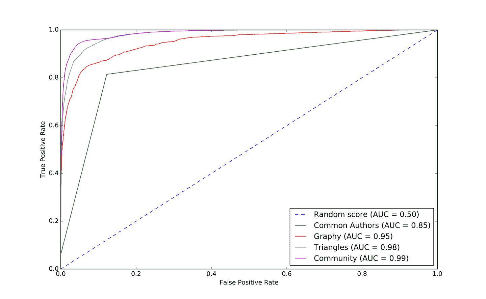

###### 图 8-17\. 社区模型的 ROC 曲线

通过加入社区模型，我们可以看到改进，接下来让我们看看哪些是最重要的特征：

```
rf_model = community_model.stages[-1]
plot_feature_importance(fields, rf_model.featureImportances)
```

运行该函数的结果可以在图 8-18 中看到。

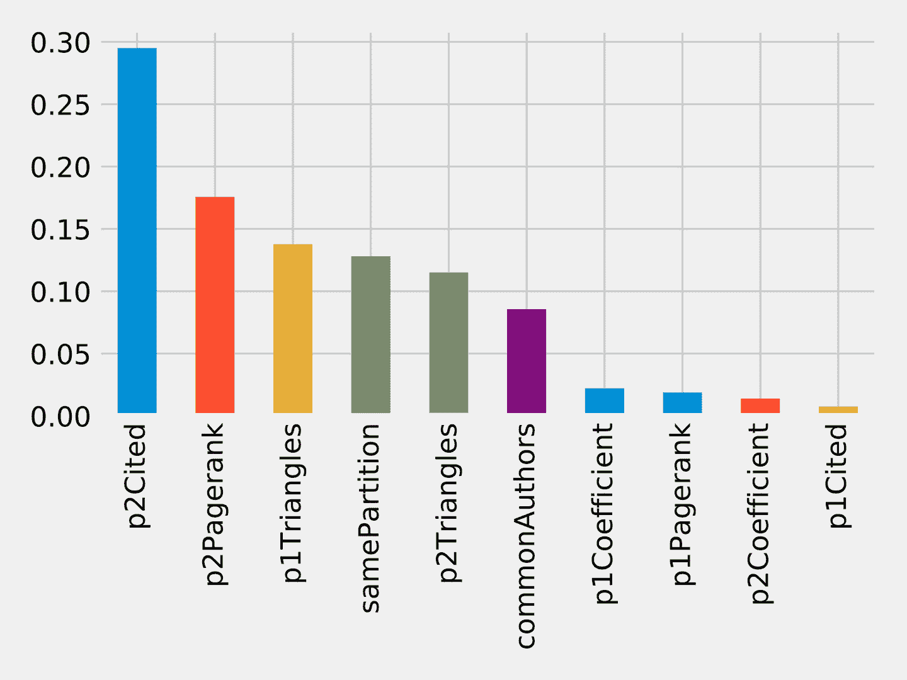

###### 图 8-18\. 特征重要性：社区模型

尽管共同作者模型整体上非常重要，但避免有可能对新数据预测产生偏差的过度主导因素是很好的。社区检测算法在我们的最后一个包含所有特征的模型中产生了很大影响，这有助于完善我们的预测方法。

通过我们的示例，我们看到简单基于图的特征是一个良好的起点，然后随着我们添加更多的图形和图算法特征，我们持续改进我们的预测措施。现在，我们有一个良好、平衡的模型来预测共同作者的联系。

使用图形进行连接特征提取可以显著提高我们的预测能力。理想的图形特征和算法因数据属性而异，包括网络领域和图形形状。我们建议首先考虑数据中的预测元素，并在不同类型的连接特征下进行假设测试，然后再进行微调。

# 总结

在本章中，我们探讨了使用图形特征和算法来增强机器学习的方法。我们介绍了一些初步概念，然后详细介绍了一个集成 Neo4j 和 Apache Spark 用于链接预测的示例。我们说明了如何评估随机森林分类器模型，并整合各种类型的连接特征以改进我们的结果。

# 总结一下

在本书中，我们涵盖了图形概念以及处理平台和分析方法。然后，我们演示了如何在 Apache Spark 和 Neo4j 中使用图形算法的许多实际例子。最后，我们看了一下图形如何增强机器学习。

图形算法是分析现实世界系统的强大工具，从防止欺诈和优化呼叫路由到预测流感的传播。我们希望您加入我们，开发出利用今天高度连接数据的独特解决方案。
