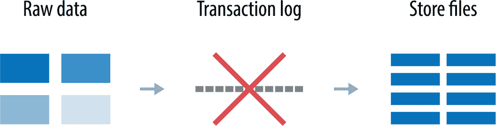

# 附录 A. 附加信息和资源

在本节中，我们快速介绍可能对某些读者有帮助的附加信息。我们将探讨其他类型的算法、将数据导入 Neo4j 的另一种方式以及另一个过程库。还有一些用于查找数据集、平台支持和培训的资源。

# 其他算法

许多算法可用于图数据。在本书中，我们专注于最具代表性的经典图算法和对应用程序开发者最有用的算法。某些算法，如着色和启发式算法，因为要么更多地适用于学术案例，要么可以轻松推导，所以被省略了。

其他算法，如基于边的社区检测，非常有趣，但尚未在 Neo4j 或 Apache Spark 中实现。随着图分析的使用增长，我们预计这两个平台中使用的图算法列表将增加。

还有一些算法类别用于图，但其本质不严格属于图。例如，我们在第八章中探讨了一些在机器学习环境中使用的算法。另一个需要注意的领域是相似度算法，通常用于推荐和链接预测。相似度算法通过使用各种方法比较节点属性等项目，找出哪些节点最相似。

# Neo4j 批量数据导入和 Yelp

使用 Cypher 查询语言将数据导入 Neo4j 使用事务性方法。图 A-1 展示了此过程的高级概述。

###### 图 A-1\. 基于 Cypher 的导入

虽然此方法适用于增量数据加载或最多 1000 万条记录的批量加载，但 Neo4j 导入工具在导入初始大量数据集时更为合适。该工具直接创建存储文件，跳过事务日志，如图 A-2 所示。

###### 图 A-2\. 使用 Neo4j 导入工具

Neo4j 导入工具处理 CSV 文件，并期望这些文件具有特定的标题。图 A-3 展示了该工具可以处理的 CSV 文件示例。

###### 图 A-3\. Neo4j 导入处理的 CSV 文件格式

Yelp 数据集的大小意味着 Neo4j 导入工具是将数据导入 Neo4j 的最佳选择。数据以 JSON 格式存在，因此我们首先需要将其转换为 Neo4j 导入工具期望的格式。图 A-4 展示了我们需要转换的 JSON 的示例。

###### 图 A-4\. 将 JSON 转换为 CSV

使用 Python，我们可以创建一个简单的脚本来将数据转换为 CSV 文件。一旦我们将数据转换为该格式，我们就可以将其导入到 Neo4j 中。详细的说明如何做到这一点可以在书的[资源库](https://bit.ly/2FPgGVV)中找到。

# APOC 和其他 Neo4j 工具

[Cypher 过程的令人敬畏的库（APOC）](https://bit.ly/2JDfSbS)是一个包含 450 多个过程和函数的库，用于帮助常见任务，如数据集成、数据清理和数据转换以及一般帮助函数。APOC 是 Neo4j 的标准库。

Neo4j 还有其他工具，可以与他们的图算法库一起使用，比如一个无需编码的算法“游乐场”应用程序。这些可以在他们的[图算法开发者网站](https://neo4j.com/developer/graph-algorithms)找到。

# 查找数据集

找到与测试目标或假设一致的图形数据集可能是具有挑战性的。除了审阅研究论文之外，还考虑探索网络数据集的索引：

+   [斯坦福网络分析项目（SNAP）](https://snap.stanford.edu/index.html)包括几个数据集以及相关论文和使用指南。

+   [科罗拉多复杂网络索引（ICON）](https://icon.colorado.edu/)是一个可搜索的研究质量网络数据集索引，涵盖了网络科学各领域的数据集。

+   [科隆网络收集（KONECT）](http://konect.uni-koblenz.de/)包括各种类型的大型网络数据集，以进行网络科学研究。

大多数数据集都需要一些加工，以将它们转换为更有用的格式。

# Apache Spark 和 Neo4j 平台的帮助

Apache Spark 和 Neo4j 平台有许多在线资源。如果您有具体问题，我们鼓励您联系他们的社区：

+   对于一般的 Spark 问题，请订阅*users@spark.apache.org*，地址为[Spark 社区页面](https://bit.ly/2UXMmyI)。

+   对于 GraphFrames 的问题，请使用[GitHub 问题跟踪器](https://bit.ly/2YqnYrs)。

+   对于所有 Neo4j 问题（包括图算法），请访问[Neo4j 社区在线](https://community.neo4j.com/)。

# 培训

有许多优秀的资源可供开始进行图分析。搜索有关图算法、网络科学和网络分析的课程或书籍将揭示许多选项。在线学习的几个好例子包括：

+   [Coursera 的 Python 应用社交网络分析课程](https://bit.ly/2U87jtx)

+   [Leonid Zhukov 的社交网络分析 YouTube 系列](https://bit.ly/2Wq77n9)

+   [斯坦福网络分析课程](http://web.stanford.edu/class/cs224w/)包括视频讲座、阅读列表和其他资源

+   [复杂性探索者](https://www.complexityexplorer.org/)提供复杂性科学在线课程
