## 第一部分. 背景 和 基础

第一部分 本书的由 第一章 和 第二章 组成，涵盖了重要的 Hadoop 基础知识。

第一章 介绍了 Hadoop 的组件及其生态系统，并提供了在单个主机上安装伪分布式 Hadoop 设置的说明，以及一个能够让您运行本书中所有示例的系统。第一章 还涵盖了 Hadoop 配置的基础知识，并指导您如何在新配置上编写和运行 MapReduce 作业。

第二章 介绍了 YARN，这是 Hadoop 2 版本中的一个新且令人兴奋的发展，将 Hadoop 从仅支持 MapReduce 的系统转变为支持多个执行引擎的系统。鉴于 YARN 对社区来说是新的，本章的目标是探讨一些基础知识，例如其组件、配置如何工作，以及 MapReduce 作为 YARN 应用程序的工作方式。第二章 还概述了一些 YARN 在 Hadoop 上启用执行的应用程序，例如 Spark 和 Storm。

## 第一章. Hadoop 的心跳

*本章涵盖*

+   检查核心 Hadoop 系统的工作原理

+   理解 Hadoop 生态系统

+   运行 MapReduce 作业

我们生活在大数据时代，我们每天需要处理的数据量已经超过了单个主机的存储和处理能力。大数据带来了两个基本挑战：如何存储和处理大量数据，更重要的是，如何理解数据并将其转化为竞争优势。

Hadoop 通过有效地存储和提供大量数据的计算能力，在市场上填补了一个空白。它由一个分布式文件系统组成，并提供了一种在机器集群上并行执行程序的方法（参见图 1.1）。您可能已经接触过 Hadoop，因为它已被雅虎、Facebook 和 Twitter 等技术巨头采用，以解决它们的大数据需求，并且它在所有工业领域都取得了进展。

##### 图 1.1. Hadoop 环境是一个运行在通用硬件上的分布式系统。

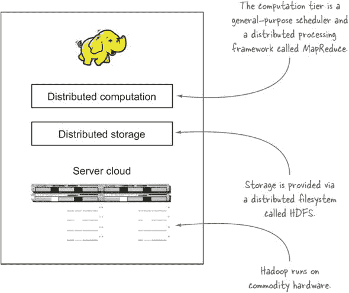

因为您来到这本书是为了获得一些 Hadoop 和 Java 的实践经验，^([1]) 我将从简要概述开始，然后向您展示如何安装 Hadoop 并运行 MapReduce 作业。到本章结束时，您将对 Hadoop 的基本原理有一个基本的复习，这将使您能够继续学习与之相关的更具挑战性的方面。

> ¹ 为了从本书中受益，你应该有一些 Hadoop 的实际经验，并理解 MapReduce 和 HDFS 的基本概念（在 Chuck Lam 的 2010 年出版的 Manning 的*Hadoop in Action*中介绍）。此外，你应该具备 Java 的中级知识—Joshua Bloch 的*Effective Java*，第 2 版（Addison-Wesley，2008 年）是这方面的优秀资源。

让我们从详细概述开始。

### 1.1\. 什么是 Hadoop？

Hadoop 是一个提供分布式存储和计算能力的平台。Hadoop 最初是为了解决 Nutch 中存在的可扩展性问题而构思的，Nutch 是一个开源的爬虫和搜索引擎。当时，谷歌发表了描述其新颖的分布式文件系统 Google 文件系统（GFS）和用于并行处理的计算框架 MapReduce 的论文。这些论文概念在 Nutch 中的成功实现导致它被分割成两个独立的项目，其中第二个项目成为 Hadoop，一个一流的 Apache 项目。

> ² Nutch 项目，以及由此扩展的 Hadoop，由 Doug Cutting 和 Mike Cafarella 领导。

在本节中，我们将从架构的角度来看 Hadoop，考察行业如何使用它，并考虑一些其弱点。一旦我们了解了这些背景知识，我们将探讨如何安装 Hadoop 并运行一个 MapReduce 作业。

如图 1.2 所示，Hadoop 本身是一个分布式主从架构^([3))，它由以下主要组件组成：

> ³ 一种通信模型，其中一个进程，称为*主进程*，控制一个或多个其他进程，称为*从进程*。

##### 图 1.2\. 高级 Hadoop 2 主从架构

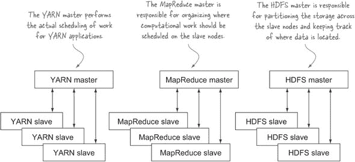

+   Hadoop 分布式文件系统（HDFS）用于数据存储。

+   Yet Another Resource Negotiator (YARN)，在 Hadoop 2 中引入，是一个通用调度器和资源管理器。任何 YARN 应用程序都可以在 Hadoop 集群上运行。

+   MapReduce，一种基于批处理的计算引擎。在 Hadoop 2 中，MapReduce 被实现为一个 YARN 应用程序。

Hadoop 固有的特性是数据分区和大数据集的并行计算。其存储和计算能力随着 Hadoop 集群中主机数量的增加而扩展；拥有数百个主机的集群可以轻松达到 PB 级的数据量。

在本节的第一个步骤中，我们将检查 HDFS、YARN 和 MapReduce 架构。

#### 1.1.1\. 核心 Hadoop 组件

要理解 Hadoop 的架构，我们将首先查看 HDFS 的基本知识。

##### HDFS

HDFS 是 Hadoop 的存储组件。它是一个基于 Google 文件系统（GFS）论文的分布式文件系统^([4))。HDFS 针对高吞吐量进行了优化，在读取和写入大文件（千兆字节及以上）时表现最佳。为了支持这种吞吐量，HDFS 使用异常大的（对于文件系统而言）块大小和数据局部性优化来减少网络输入/输出（I/O）。

> ⁴ 请参阅“谷歌文件系统”，[`research.google.com/archive/gfs.html`](http://research.google.com/archive/gfs.html)。

可扩展性和可用性也是 HDFS 的关键特性，部分得益于数据复制和容错。HDFS 会根据配置的次数复制文件，对软件和硬件故障都具有容错性，并在节点失败时自动重新复制数据块。

图 1.3 展示了 HDFS 组件的逻辑表示：Name-Node 和 DataNode。它还显示了一个使用 Hadoop 文件系统库来访问 HDFS 的应用程序。

##### 图 1.3\. 一个与主 NameNode 和从属 DataNode 通信的 HDFS 客户端

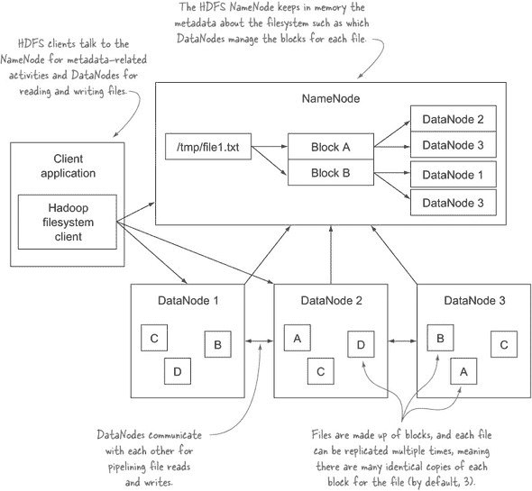

Hadoop 2 为 HDFS 引入了两个重要的新特性——联邦和可用性（HA）：

+   联邦允许 HDFS 元数据在多个 NameNode 主机之间共享，这有助于 HDFS 的可扩展性，同时也提供了数据隔离，允许不同的应用程序或团队运行自己的 NameNode，而不用担心会影响到同一集群中的其他 NameNode。

+   HDFS 的高可用性消除了 Hadoop 1 中存在的单点故障，即 NameNode 灾难会导致集群故障。HDFS HA 还提供了故障转移（备用 Name-Node 从失败的 NameNode 接管工作的过程）自动化的能力。

现在你已经对 HDFS 有了一些了解，是时候看看 YARN，Hadoop 的调度器了。

##### YARN

YARN 是 Hadoop 的分布式资源调度器。YARN 是 Hadoop 版本 2 中的新功能，旨在解决 Hadoop 1 架构的挑战：

+   大于 4,000 节点的部署遇到了可扩展性问题，增加额外的节点并没有带来预期的线性可扩展性改进。

+   只支持 MapReduce 工作负载，这意味着它不适合运行需要迭代计算的学习算法等执行模型。

对于 Hadoop 2，这些问题通过从 MapReduce 中提取调度功能并将其重构为一个通用的应用程序调度器（称为 YARN）来解决。这一变化使得 Hadoop 集群不再仅限于运行 MapReduce 工作负载；YARN 允许在 Hadoop 上原生支持一系列新的工作负载，并允许不同的处理模型，如图处理和流处理，与 MapReduce 共存。第二章 和 第十章 讲述了 YARN 以及如何编写 YARN 应用程序。

YARN 的架构很简单，因为它的主要角色是在 Hadoop 集群中调度和管理资源。图 1.4 展示了 YARN 核心组件的逻辑表示：ResourceManager 和 NodeManager。还展示了特定于 YARN 应用程序的组件，即 YARN 应用程序客户端、ApplicationMaster 和容器。

##### 图 1.4\. 显示核心 YARN 组件和 YARN 应用程序组件之间典型通信的逻辑 YARN 架构

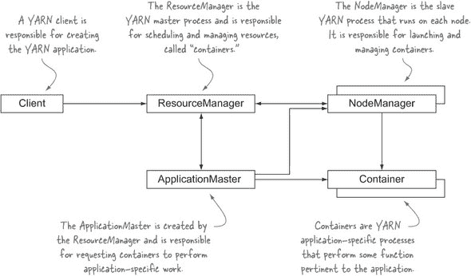

为了完全实现通用分布式平台的梦想，Hadoop 2 引入了另一个变化——能够在各种配置中分配容器。Hadoop 1 有“槽位”的概念，这是在单个节点上允许运行的固定数量的 map 和 reduce 进程。这在集群利用率方面是浪费的，并在 MapReduce 操作期间导致资源未充分利用，并且它还为 map 和 reduce 任务设定了内存限制。使用 YARN，ApplicationMaster 请求的每个容器都可以具有不同的内存和 CPU 特性，这使得 YARN 应用程序对其所需资源有完全的控制权。

你将在第二章和 10 章中更详细地了解 YARN，那里你将学习 YARN 的工作原理以及如何编写 YARN 应用程序。接下来是对 MapReduce 的考察，这是 Hadoop 的计算引擎。

##### MapReduce

MapReduce 是一个基于批处理的、分布式计算框架，其模式是模仿 Google 的 MapReduce 论文。^([5)] 它允许你在大量原始数据上并行化工作，例如将 Web 日志与来自 OLTP 数据库的关系数据相结合，以模拟用户如何与你的网站互动。这种类型的工作，如果使用传统的串行编程技术，可能需要几天或更长时间，但使用 Hadoop 集群上的 MapReduce 可以将其缩短到几分钟。

> ⁵ 请参阅“MapReduce：在大型集群上简化的数据处理”，[`research.google.com/archive/mapreduce.html`](http://research.google.com/archive/mapreduce.html)。

MapReduce 模型通过抽象掉与分布式系统工作相关的复杂性（如计算并行化、工作分配和处理不可靠的硬件和软件）来简化并行处理。通过这种抽象，MapReduce 允许程序员专注于解决业务需求，而不是陷入分布式系统复杂性的泥潭。

MapReduce 将客户端提交的工作分解成小的并行化 map 和 reduce 任务，如图 1.5 所示。6] MapReduce 中使用的 map 和 reduce 构造是从 Lisp 函数式编程语言中借用的，并且它们使用无共享模型来消除任何可能添加不必要同步点或状态共享的并行执行依赖关系。

> ⁶ 无共享架构是一种分布式计算概念，它代表了每个节点都是独立和自给自足的观点。

##### 图 1.5\. 客户端向 MapReduce 提交作业，将工作分解成小的 map 和 reduce 任务

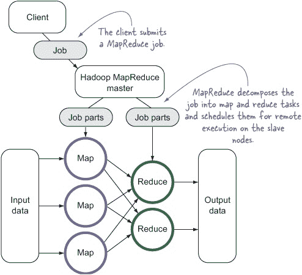

程序员的角色是定义 map 和 reduce 函数，其中 map 函数输出键/值元组，这些元组由 reduce 函数处理以生成最终输出。图 1.6 显示了关于其输入和输出的 map 函数的伪代码定义。

##### 图 1.6\. 以键/值对作为输入的 map 函数的逻辑视图

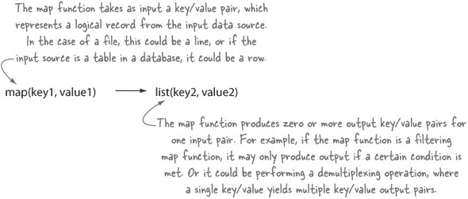

MapReduce 的强大之处在于洗牌和排序阶段中映射输出和减少输入之间，如图图 1.7 所示。

##### 图 1.7\. MapReduce 的洗牌和排序阶段

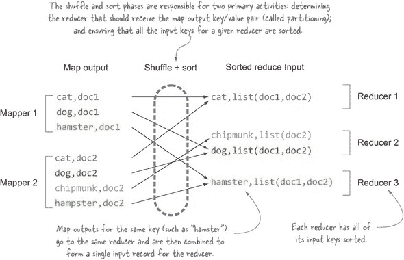

图 1.8 显示了 reduce 函数的伪代码定义。

##### 图 1.8\. 生成输出文件、NoSQL 行或任何数据目的地的 reduce 函数的逻辑视图

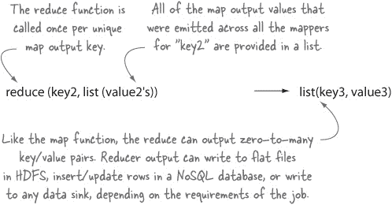

随着 Hadoop 2 中 YARN 的出现，MapReduce 已被重写为 YARN 应用程序，现在被称为 MapReduce 2（或 MRv2）。从开发者的角度来看，Hadoop 2 中的 MapReduce 与 Hadoop 1 中的工作方式几乎相同，为 Hadoop 1 编写的代码在版本 2 上无需代码更改即可执行.^([7]) MRv2 中的物理架构和内部管道有所变化，这些变化在第二章中进行了更详细的探讨。

> ⁷ 一些代码可能需要针对 Hadoop 2 二进制文件重新编译才能与 MRv2 一起工作；有关更多详细信息，请参阅第二章。

在掌握了一些 Hadoop 基础知识之后，是时候看看 Hadoop 生态系统以及本书涵盖的项目了。

#### 1.1.2\. Hadoop 生态系统

Hadoop 生态系统多样且每天都在增长。跟踪所有与 Hadoop 以某种形式交互的各种项目是不可能的。本书的重点是用户目前采用率最高的工具，如图图 1.9 所示。

##### 图 1.9\. 本书涵盖的 Hadoop 和相关技术

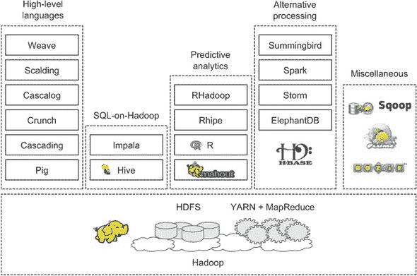

MapReduce 和 YARN 并非易事，这意味着许多这些与 Hadoop 相关项目的目标是为程序员和非程序员提高 Hadoop 的可访问性。本书将涵盖图 1.9 中列出的许多技术，并在各自的章节中详细描述它们。此外，附录还包括了本书涵盖的技术描述和安装说明。

| |
| --- |

##### 本书对 Hadoop 生态系统的覆盖范围

Hadoop 生态系统每天都在增长，通常有多种具有重叠功能和优势的工具。本书的目标是提供涵盖核心 Hadoop 技术的实用技术，以及一些普遍且对 Hadoop 至关重要的生态系统技术。

| |
| --- |

让我们看看您集群的硬件要求。

#### 1.1.3\. 硬件要求

术语*通用硬件*常用来描述 Hadoop 的硬件要求。确实，Hadoop 可以在你能够找到的任何旧服务器上运行，但你仍然希望你的集群性能良好，并且你不想让你的运维部门忙于诊断和修复硬件问题。因此，*通用*指的是具有双插槽的中端机架服务器，尽可能多的纠错 RAM，以及针对 RAID 存储优化的 SATA 驱动器。由于 HDFS 已经内置了复制和错误检查，因此强烈不建议在用于存储 HDFS 内容的 DataNode 文件系统上使用 RAID；在 NameNode 上，强烈建议使用 RAID 以提供额外的安全性.^([8])

> ⁸ HDFS 使用磁盘来持久存储关于文件系统的元数据。

从网络拓扑的角度来看，关于交换机和防火墙，所有主节点和从节点都必须能够相互打开连接。对于小型集群，所有主机都会运行 1 GB 网络卡，连接到单个高质量交换机。对于大型集群，请考虑具有至少多个 1 GB 上行链路的 10 GB 机架交换机，这些交换机连接到双中央交换机。客户端节点也需要能够与所有主节点和从节点通信，但如果需要，这种访问可以从防火墙后面进行，该防火墙仅允许从客户端建立连接。

从软件和硬件的角度回顾了 Hadoop 之后，你可能已经对谁可能从使用它中受益有了很好的了解。一旦你开始使用 Hadoop，你将需要选择一个发行版来使用，这是下一个话题。

#### 1.1.4\. Hadoop 发行版

Hadoop 是一个 Apache 开源项目，软件的常规版本可以直接从 Apache 项目的网站([`hadoop.apache.org/releases.html#Download`](http://hadoop.apache.org/releases.html#Download))下载。你可以从网站上下载并安装 Hadoop，或者使用来自商业发行版的快速启动虚拟机，这对于你是 Hadoop 新手且希望快速启动和运行来说通常是一个很好的起点。

在你用 Hadoop 开胃之后并决定在生产中使用它之后，你需要回答的下一个问题是使用哪个发行版。你可以继续使用纯 Hadoop 发行版，但你将需要建立内部专业知识来管理你的集群。这不是一个微不足道的工作，通常只有在那些对拥有专门负责运行和管理其集群的 Hadoop DevOps 工程师感到舒适的组织中才能成功。

或者，您可以转向 Hadoop 的商业发行版，这将为您提供企业级管理软件的额外好处，当您规划集群或遇到夜间问题需要帮助时，可以咨询的支持团队，以及快速修复您遇到的软件问题的可能性。当然，这一切都不是免费的（或便宜的！），但如果您在 Hadoop 上运行关键任务服务，并且没有专门的团队来支持您的基础设施和服务，那么选择商业 Hadoop 发行版是明智的。


##### 选择适合您的分布

非常推荐您与主要供应商合作，从功能、支持和成本的角度了解哪种分布适合您的需求。请记住，每个供应商都会强调他们的优势，同时也会暴露其竞争对手的劣势，因此与两个或更多供应商交谈将使您对分布提供的内容有更现实的了解。确保您下载并测试这些分布，并验证它们是否可以与您现有的软件和硬件堆栈集成和运行。


有许多分布可供选择，在本节中，我将简要总结每种分布并突出其一些优点。

##### Apache

Apache 是维护 Hadoop 核心代码和分布的组织，由于所有代码都是开源的，您可以使用您最喜欢的 IDE 打开源代码，了解底层的工作原理。从历史上看，Apache 分布的挑战在于支持仅限于开源社区的良好意愿，并且无法保证您的問題会被调查和修复。话虽如此，Hadoop 社区是一个非常支持性的社区，对问题的响应通常是快速的，即使实际的修复可能需要更长的时间，您可能无法承担。

随着 Apache Ambari 的出现，管理得到了简化，Apache Hadoop 分布现在更具吸引力，它提供了一个 GUI 来帮助配置和管理您的集群。尽管 Ambari 非常有用，但将其与商业供应商的产品进行比较是值得的，因为商业工具通常更为复杂。

##### Cloudera

Cloudera 是最资深的 Hadoop 分布，它雇佣了大量的 Hadoop（以及 Hadoop 生态系统）提交者。与 Mike Cafarella 共同最初创建 Hadoop 的 Doug Cutting 现在是 Cloudera 的首席架构师。总的来说，这意味着与提交者较少的 Hadoop 分布相比，在 Cloudera 中解决错误修复和功能请求的机会更大。

除了维护和支持 Hadoop 之外，Cloudera 通过开发解决 Hadoop 弱点领域的项目，在 Hadoop 空间进行了创新。一个典型的例子是 Impala，它提供了一个基于 Hadoop 的 SQL 系统，类似于 Hive，但专注于近似实时用户体验，而 Hive 传统上是一个高延迟系统。Cloudera 还在进行许多其他项目：亮点包括 Flume，一个日志收集和分发系统；Sqoop，用于在 Hadoop 中移动关系型数据；以及 Cloudera Search，它提供近似实时的搜索索引。

##### Hortonworks

Hortonworks 由大量 Hadoop 提交者组成，它在快速解决核心 Hadoop 及其生态系统项目的问题和功能请求方面提供了与 Cloudera 相同的优势。

从创新的角度来看，Hortonworks 采取了与 Cloudera 略有不同的方法。一个例子是 Hive：Cloudera 的方法是开发一个全新的基于 Hadoop 的 SQL 系统，但 Hortonworks 则着眼于在 Hive 内部进行创新，以去除其高延迟的束缚，并添加新的功能，如对 ACID 的支持。Hortonworks 也是下一代 YARN 平台的主要推动者，这是保持 Hadoop 相关性的关键战略部分。同样，Hortonworks 使用 Apache Ambari 作为其管理工具，而不是开发内部专有管理工具，这是其他发行版所采取的道路。Hortonworks 专注于开发和扩展 Apache 生态系统工具，这对社区有直接的好处，因为它使其工具对所有用户可用，无需支持合同。

##### MapR

MapR 在其团队中的 Hadoop 提交者比这里讨论的其他发行版要少，因此其修复和塑造 Hadoop 未来的能力可能比其同行更有限。

从创新的角度来看，MapR 在 Hadoop 支持方面采取了与同行截然不同的方法。从一开始，它就决定 HDFS 不是一个企业级文件系统，因此开发了它自己的专有文件系统，该系统提供了引人注目的功能，如 POSIX 兼容性（提供随机写入支持和原子操作）、高可用性、NFS 挂载、数据镜像和快照。其中一些功能已引入到 Hadoop 2 中，但 MapR 从一开始就提供了这些功能，因此可以预期这些功能是稳健的。

作为评估标准的一部分，需要注意的是，MapR 堆栈的部分，如其文件系统和其 HBase 提供的产品，是封闭源代码和专有性质。这影响了您的工程师浏览、修复并向社区贡献补丁的能力。相比之下，Cloudera 和 Hortonworks 的堆栈大多是开源的，尤其是 Hortonworks，它在整个堆栈，包括管理平台，都是开源的。

MapR 的显著亮点包括作为 Amazon 自家的 Elastic MapReduce 的替代方案在 Amazon 的云平台上提供，以及与 Google 的 Compute Cloud 集成。

我只是刚刚触及了各种 Hadoop 发行版提供的优势的表面；你的下一步可能将是联系供应商，并开始自己尝试这些发行版。

接下来，让我们看看目前使用 Hadoop 的公司，以及它们使用 Hadoop 的方式。

#### 1.1.5\. 谁在使用 Hadoop？

Hadoop 在高科技公司中的渗透率很高，它开始进入包括企业（Booz Allen Hamilton、J.P. Morgan）、政府（NSA）和医疗保健在内的广泛领域。

Facebook 使用 Hadoop、Hive 和 HBase 进行数据仓库和实时应用程序服务。9 Facebook 的数据仓库集群规模达到千兆字节，拥有数千个节点，并且它们使用基于 HBase 的独立实时集群进行消息传递和实时分析。

> ^(9) 请参阅 Dhruba Borthakur 在 Facebook 上发表的“查看我们使用 Apache Hadoop 的代码背后的情况”文章，“[`mng.bz/4cMc`](http://mng.bz/4cMc)”。Facebook 还开发了其自己的 SQL-on-Hadoop 工具 Presto，并正在从 Hive 迁移（参见 Martin Traverso 的“Presto：在 Facebook 上交互 PB 级数据”，[`mng.bz/p0Xz`](http://mng.bz/p0Xz)）。

Yahoo! 使用 Hadoop 进行数据分析、机器学习、搜索排名、电子邮件反垃圾邮件、广告优化、ETL 等。总计，它拥有超过 40,000 台运行 Hadoop 的服务器，存储容量达到 170 PB。Yahoo! 还在运行第一个大规模的 YARN 部署，集群节点数高达 4,000 个。11

> ^(10) 提取、转换和加载（ETL）是从外部源提取数据，将其转换为满足项目需求，并将其加载到目标数据存储的过程。ETL 是数据仓库中的常见过程。
> 
> ^(11) 关于 YARN 及其在 Yahoo! 的使用的更多细节，请参阅 Vinod Kumar Vavilapalli 等人撰写的《Apache Hadoop YARN：另一个资源协调器》，“[www.cs.cmu.edu/~garth/15719/papers/yarn.pdf](http://www.cs.cmu.edu/~garth/15719/papers/yarn.pdf)”。

Twitter 是一个主要的大数据创新者，它通过 Scalding（Cascading 的 Scala API）、Summingbird（可用于实现 Nathan Marz 的 lambda 架构的部分组件）以及其他各种宝石（如 Bijection、Algebird 和 Elephant Bird）等项目对 Hadoop 做出了显著的贡献。

eBay、Samsung、Rackspace、J.P. Morgan、Groupon、LinkedIn、AOL、Spotify 和 StumbleUpon 等其他组织也在 Hadoop 上进行了大量投资。微软与 Hortonworks 合作，以确保 Hadoop 在其平台上运行。

谷歌在其 MapReduce 论文中指出，它使用自己的 MapReduce 版本 Caffeine^(12) 从爬取数据创建其网页索引。谷歌还强调了 MapReduce 的应用，包括分布式 grep、URL 访问频率（来自日志数据）和术语向量算法，该算法确定主机的热门关键词。

> ^(12) 2010 年，谷歌转向了一个名为 Caffeine 的实时索引系统；请参阅谷歌博客上的“我们的新搜索索引：Caffeine”（2010 年 6 月 8 日），[`googleblog.blogspot.com/2010/06/our-new-search-index-caffeine.html`](http://googleblog.blogspot.com/2010/06/our-new-search-index-caffeine.html)。

每天使用 Hadoop 的组织数量都在增长，如果你在一家财富 500 强公司工作，你几乎肯定会在某种程度上使用 Hadoop 集群。很明显，随着 Hadoop 的不断成熟，其采用率将继续增长。

与所有技术一样，能够有效地使用 Hadoop 的关键部分是了解其不足之处，并设计和架构你的解决方案以尽可能多地减轻这些不足。

#### 1.1.6\. Hadoop 的局限性

高可用性和安全性通常是人们提到 Hadoop 时最关心的几个问题之一。许多这些问题在 Hadoop 2 中都得到了解决；让我们更详细地看看截至 2.2.0 版本的一些弱点。

使用 Hadoop 1 及更早版本的企业组织对高可用性和安全性缺乏感到担忧。在 Hadoop 1 中，所有主进程都是单点故障，这意味着主进程的故障会导致系统停机。在 Hadoop 2 中，HDFS 现在有了高可用性支持，并且 Map-Reduce 与 YARN 的重新架构消除了单点故障。安全性是另一个存在问题的领域，并且正在受到关注。

##### 高可用性

高可用性通常在企业组织中强制执行，这些组织有高正常运行时间 SLA 要求，以确保系统始终处于运行状态，即使在节点因计划内或计划外的情况而宕机的情况下也是如此。在 Hadoop 2 之前，主 HDFS 进程只能在单个节点上运行，这导致了单点故障^(13)。Hadoop 2 带来了 NameNode 高可用性（HA）支持，这意味着同一个 Hadoop 集群可以有多个 NameNode 运行。按照当前的设计，一个 NameNode 是活动的，另一个 NameNode 被指定为备用进程。如果活动 NameNode 发生计划内或计划外的停机，备用 NameNode 将接管作为活动 NameNode，这个过程称为 *故障转移*。这个故障转移可以被配置为自动进行，从而无需人工干预。NameNode 故障转移的发生对 Hadoop 客户端是透明的。

> ^(13) 实际上，HDFS 的单点故障可能并不特别严重；请参阅 Suresh Srinivas 和 Aaron T. Myers 的“NameNode HA”，[`goo.gl/1iSab`](http://goo.gl/1iSab)。

MapReduce 主进程（JobTracker）在 Hadoop 2 中没有高可用性支持，但现在每个 MapReduce 作业都有自己的 JobTracker 进程（一个独立的 YARN ApplicationMaster），因此高可用性支持的重要性可能有所降低。

YARN 主进程（ResourceManager）中的高可用性支持很重要，目前正在进行开发，以将此功能添加到 Hadoop 中.^([14])

> ^（14）有关 YARN 高可用性支持的详细信息，请参阅标题为“ResourceManager (RM) 高可用性 (HA)”的 JIRA 工单[`issues.apache.org/jira/browse/YARN-149`](https://issues.apache.org/jira/browse/YARN-149)。

##### 多数据中心

多数据中心支持是企业软件中越来越被期待的关键特性之一，因为它通过在多个数据中心复制数据提供了强大的数据保护和地域属性。Apache Hadoop 及其大多数商业发行版从未支持过多数据中心，这对在多个数据中心运行软件的组织构成了挑战。WANdisco 是目前唯一可用的 Hadoop 多数据中心支持解决方案。

##### 安全性

Hadoop 提供了一个安全模型，但默认情况下是禁用的。安全模型禁用时，Hadoop 中存在的唯一安全特性是 HDFS 文件和目录级别的所有权和权限。但恶意用户很容易绕过并假设其他用户的身份。默认情况下，所有其他 Hadoop 服务都是开放的，允许任何用户执行任何类型的操作，例如终止另一个用户的 MapReduce 作业。

Hadoop 可以配置为使用 Kerberos，这是一种网络认证协议，它要求 Hadoop 守护进程对客户端进行认证，包括用户和其他 Hadoop 组件。Kerberos 可以与组织的现有 Active Directory 集成，因此为用户提供单一登录体验。启用 Kerberos 时需要小心，因为任何希望与您的集群交互的 Hadoop 工具都需要支持 Kerberos。

在 Hadoop 2 中可以配置网络级别的加密，允许跨网络传输的数据（包括 HDFS 传输^[15]和 MapReduce shuffle 数据^[16]）被加密。目前 Hadoop 中缺少对静态数据（HDFS 存储在磁盘上的数据）的加密。

> ^（15）有关添加对加密数据传输协议的支持的详细信息，请参阅标题为“添加对加密数据传输协议的支持”的 JIRA 工单[`issues.apache.org/jira/browse/HDFS-3637`](https://issues.apache.org/jira/browse/HDFS-3637)。
> 
> ^（16）有关 YARN 高可用性支持的详细信息，请参阅标题为“添加对加密 shuffle 的支持”的 JIRA 工单[`issues.apache.org/jira/browse/MAPREDUCE-4417`](https://issues.apache.org/jira/browse/MAPREDUCE-4417)。

让我们来看看一些个别系统的局限性。

##### HDFS

HDFS 的弱点主要是其缺乏高可用性（在 Hadoop 1.x 及更早版本中），对小文件处理效率低下，^([17]) 以及缺乏透明的压缩。HDFS 不支持对文件的随机写入（仅支持追加），并且通常设计为支持对大文件的顺序读写，具有高吞吐量。

> ^(17) 尽管 Hadoop 2 中的 HDFS 联邦引入了多个 NameNode 共享文件元数据的方法，但事实仍然是元数据存储在内存中。

##### MapReduce

MapReduce 是一种基于批处理的架构，这意味着它不适合需要实时数据访问的使用场景。需要全局同步或共享可变数据的任务不适合 MapReduce，因为它是一个无共享架构，这可能会对某些算法造成挑战。

##### 版本不兼容性

Hadoop 2 版本的发布带来了与 MapReduce API 运行时兼容性的一些问题，尤其是在 `org.hadoop.mapreduce` 包中。这些问题通常会导致针对 Hadoop 1（及更早版本）编译的代码在运行时出现问题。解决方案通常是重新编译以针对 Hadoop 2，或者考虑在 第二章 中概述的技术，该技术介绍了一个兼容性库，以便在不重新编译代码的情况下针对两个 Hadoop 版本。

Hive 和 Hadoop 之间也存在其他挑战，其中 Hive 可能需要重新编译才能与构建时使用的 Hadoop 版本以外的版本兼容。Pig 也存在兼容性问题。例如，Pig 0.8 版本与 Hadoop 0.20.203 不兼容，需要手动干预才能解决这个问题。使用 Apache 之外的 Hadoop 发行版的一个优点是，这些兼容性问题已经得到解决。如果希望使用纯 Apache 发行版，那么查看 Bigtop ([`bigtop.apache.org/`](http://bigtop.apache.org/)) 是值得的，这是一个 Apache 开源自动化构建和合规性系统。它包括所有主要的 Hadoop 生态系统组件，并运行一系列集成测试，以确保它们可以协同工作。

在解决 Hadoop 架构及其弱点之后，您可能已经准备好卷起袖子，亲自动手使用 Hadoop，因此让我们看看如何运行本书中的第一个示例。

### 1.2\. 深入了解 MapReduce

本节向您展示如何在您的主机上运行 MapReduce 作业。


##### 安装 Hadoop 和构建示例

要运行本节中的代码示例，您需要遵循附录中的说明，这些说明解释了如何安装 Hadoop 以及下载和运行本书附带示例。


假设您想构建一个倒排索引。MapReduce 对于这个任务是一个不错的选择，因为它可以并行创建索引（这是 MapReduce 的常见用途）。您的输入是一系列文本文件，您的输出是一个元组列表，其中每个元组是一个单词和包含该单词的文件列表。使用标准处理技术，这需要您找到一种机制来连接所有单词。一个简单的方法是在内存中执行这个连接，但您可能会因为具有大量唯一键而耗尽内存。您可以使用中间数据存储，例如数据库，但这将是不高效的。

一个更好的方法是逐行分词，并生成一个包含每行一个单词的中间文件。然后，可以对这些中间文件进行排序。最后一步是打开所有排序后的中间文件，并对每个唯一单词调用一个函数。这正是 MapReduce 所做的事情，尽管是以分布式的方式。

图 1.10 带您了解 MapReduce 中简单倒排索引的示例。首先，定义您的 mapper。您的 reducers 需要能够为输入中的每个单词生成一行，因此您的 map 输出键应该是输入文件中的每个单词，以便 MapReduce 可以将它们全部连接起来。每个键的值将是包含的文件名，即您的文档 ID。

##### 图 1.10. MapReduce 中创建倒排索引的示例

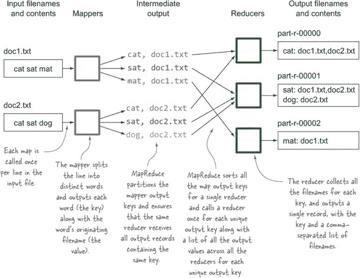

这是 mapper 代码：

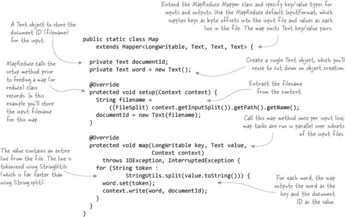

这个 reducer 的目标是为每个单词和出现该单词的文档 ID 列表创建一个输出行。MapReduce 框架将负责为 mappers 输出的每个唯一键调用 reducer 一次，以及一个文档 ID 列表。在 reducer 中，您需要做的就是将所有文档 ID 合并在一起，并在 reducer 中一次性输出，如下面的代码所示：

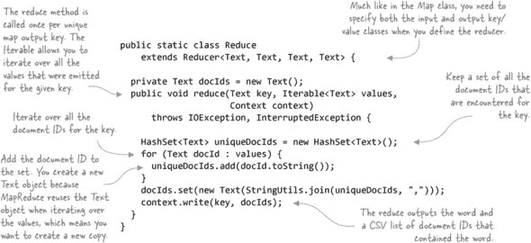

最后一步是编写驱动代码，该代码将设置所有必要的属性以配置 MapReduce 作业的运行。您需要让框架知道应该使用哪些类来处理 map 和 reduce 函数，并且还需要让它知道输入和输出数据的位置。默认情况下，MapReduce 假设您正在处理文本；如果您正在处理更复杂的文本结构或完全不同的数据存储技术，您需要告诉 MapReduce 它应该如何从这些数据源和接收器中读取和写入。以下示例显示了完整的驱动代码^([18]).

> ^([18]) GitHub 源：[`github.com/alexholmes/hiped2/blob/master/src/main/java/hip/ch1/InvertedIndexJob.java`](https://github.com/alexholmes/hiped2/blob/master/src/main/java/hip/ch1/InvertedIndexJob.java).

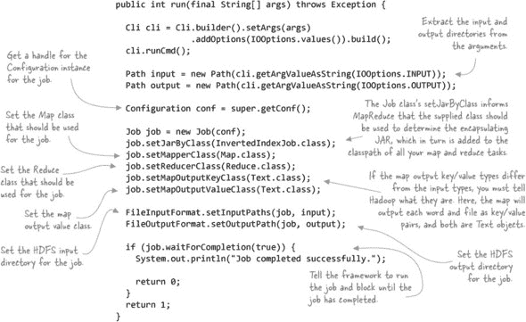

让我们看看这段代码是如何工作的。首先，您需要在 HDFS 中创建两个简单的输入文件：

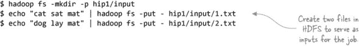

接下来，运行 MapReduce 代码。你将使用 shell 脚本来运行它，将两个输入文件作为参数传递，以及作业输出目录：

```
$ hip hip.ch1.InvertedIndexJob --input hip1/input --output hip1/output
```

| |
| --- |

##### 执行书中的代码示例

附录包含了下载和安装本书附带二进制文件和代码的说明。大多数示例都是通过位于 bin 目录中的`hip`脚本启动的。为了方便，建议将书的 bin 目录添加到你的路径中，这样你就可以直接复制粘贴所有示例命令。附录有如何设置你的环境的说明。

| |
| --- |

当你的作业完成后，你可以检查 HDFS 中的作业输出文件并查看其内容：

```
$ hadoop fs -ls output/
Found 3 items
output/_SUCCESS
output/_logs
output/part-r-00000

$ hadoop fs -cat output/part*
cat    1.txt
dog    2.txt
lay    2.txt
mat    2.txt,1.txt
sat    1.txt
```

这就完成了你对如何运行 Hadoop 的快速浏览。

### 1.3\. 章节总结

Hadoop 是一个分布式系统，旨在处理、生成和存储大数据集。其 MapReduce 实现为你提供了一个容错机制，用于大规模分析异构的半结构化和非结构化数据源，而 YARN 现在支持在同一 Hadoop 集群上运行多租户不同应用。

在本章中，我们从功能和物理架构的角度分析了 Hadoop。你还安装了 Hadoop 并运行了一个 MapReduce 作业。

本书剩余部分致力于介绍解决你在使用 Hadoop 时遇到的一些常见问题的实际技术。你将接触到广泛的主题领域，从 YARN、HDFS 和 MapReduce 开始，再到 Hive。你还将了解数据分析技术，并探索如 Mahout 和 Rhipe 等技术。

在第二章中，你旅程的第一站，你将发现 YARN，它预示着 Hadoop 新时代的到来，将 Hadoop 转变为分布式处理内核。无需多言，让我们开始吧。

## 第二章\. YARN 简介

*本章涵盖*

+   理解 YARN 的工作原理

+   MapReduce 作为 YARN 应用的工作原理

+   其他 YARN 应用的概述

想象一下，你买了一辆第一辆车，交付时方向盘不工作，刹车也不工作。哦，而且它只能用一档行驶。在蜿蜒的山路上不能超速！对于那些想使用 Hadoop 1 运行一些酷炫的新技术，如图或实时数据处理的人来说，这种空虚、悲伤的感觉是熟悉的，只会提醒我们，我们强大的 Hadoop 集群只擅长一件事，那就是 MapReduce。

> ¹ 虽然你可以在 Hadoop 1 中进行图处理，但这并不是原生的，这意味着你可能在图的每次迭代之间都要承受多个磁盘屏障的低效，或者通过 MapReduce 进行修改以避免这些屏障。

幸运的是，Hadoop 的贡献者将这些以及其他限制因素铭记在心，并构想出一个将 Hadoop 转变为超越 MapReduce 的愿景。YARN 就是这个梦想的实现，它是一个令人兴奋的新发展，将 Hadoop 转变为可以支持任何类型工作负载的分布式计算内核。^([2)] 这使得可以在 Hadoop 上运行的应用程序类型得以扩展，以有效地支持机器学习、图处理和其他通用计算项目（如 Tez）的计算模型，这些内容将在本章后面讨论。

> ² 在 YARN 之前，Hadoop 只支持 MapReduce 进行计算工作。

所有这些的最终结果是，你现在可以在单个 Hadoop 集群上运行 MapReduce、Storm 和 HBase。这不仅为计算多租户提供了新的可能性，而且还有效地共享数据的能力。

由于 YARN 是一项新技术，我们将从本章的开头部分开始，探讨 YARN 的工作原理，随后将介绍如何从命令行和用户界面与 YARN 交互。这两部分结合起来，将帮助你更好地理解 YARN 是什么以及如何使用它。

一旦你了解了 YARN 的工作原理，你将看到 MapReduce 如何被重写为 YARN 应用程序（称为 MapReduce 2，或 MRv2），并查看 MapReduce 中发生的某些架构和系统变化，以实现这一目标。这将帮助你更好地理解如何在 Hadoop 2 中使用 MapReduce，并为你提供一些关于为什么 MapReduce 在版本 2 中某些方面发生变化的原因背景。

| |
| --- |

##### YARN 开发

如果你正在寻找如何编写 YARN 应用的详细信息，可以自由地跳转到第十章。chapter 10。但如果你是 YARN 的初学者，我建议你在继续阅读第十章 chapter 10 之前先阅读本章。

| |
| --- |

在本章的最后部分，你将检查几个 YARN 应用程序及其实际用途。

让我们从 YARN 的概述开始。

### 2.1\. YARN 概述

在 Hadoop 1 和更早的版本中，你只能运行 MapReduce 作业。如果你执行的工作类型非常适合 MapReduce 处理模型，这很好，但对于想要执行图处理、迭代计算或其他类型工作的人来说，这很受限制。

在 Hadoop 2 中，MapReduce 的调度部分被外部化并重新设计为一个名为 YARN 的新组件，YARN 是 *Yet Another Resource Negotiator* 的缩写。YARN 对你在 Hadoop 上执行的工作类型是中立的——它只要求希望运行在 Hadoop 上的应用程序以 YARN 应用程序的形式实现。因此，MapReduce 现在是一个 YARN 应用程序。旧的和新的 Hadoop 堆栈可以在图 2.1 中看到。

##### 图 2.1\. Hadoop 1 和 2 架构，显示 YARN 作为通用调度器和各种 YARN 应用程序

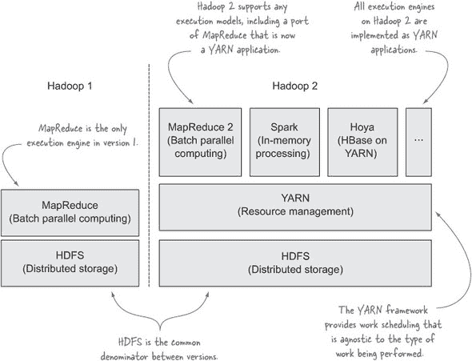

这种架构变化带来了多方面的好处，你将在下一节中对其进行探讨。

#### 2.1.1\. 为什么是 YARN？

我们已经提到了 YARN 如何使除了 MapReduce 之外的工作能够在 Hadoop 上执行，但让我们进一步探讨这一点，并看看 YARN 带来的其他优势。

MapReduce 是一个强大的分布式框架和编程模型，它允许在多个节点集群上执行基于批次的并行化工作。尽管它在所做的工作上非常高效，但 MapReduce 也有一些缺点；主要缺点是它是基于批次的，因此不适合实时或甚至接近实时的数据处理。从历史上看，这意味着图、迭代和实时数据处理等处理模型并不是 MapReduce 的自然选择.^([3])

> ³ HBase 是一个例外；它使用 HDFS 进行存储，但不使用 MapReduce 作为处理引擎。

底线是，Hadoop 版本 1 限制了你可以运行令人兴奋的新处理框架。

YARN 通过接管 MapReduce 的调度部分，改变了这一切，而仅此而已。在其核心，YARN 是一个分布式调度器，负责两项活动：

+   ***响应客户端创建容器的请求*** —容器本质上是一个进程，有一个合同规定了它被允许使用的物理资源。

+   ***监控正在运行的容器，并在需要时终止它们*** —如果 YARN 调度器想要释放资源以便其他应用程序的容器可以运行，或者如果容器使用了超过其分配的资源，容器可以被终止。

表 2.1 比较了 MapReduce 1 和 YARN（在 Hadoop 版本 1 和 2 中），以展示为什么 YARN 是一个如此革命性的飞跃。

##### 表 2.1\. MapReduce 1 和 YARN 的比较

| 功能 | MapReduce 1 | YARN |
| --- | --- | --- |
| 执行模型 | 在 Hadoop 1 中仅支持 MapReduce，这限制了你可以执行的活动类型，只能是在 MapReduce 处理模型范围内的基于批次的流程。 | YARN 对在 Hadoop 中可以执行的工作类型没有任何限制；你可以选择你需要哪种执行引擎（无论是使用 Spark 进行实时处理，使用 Giraph 进行图处理，还是使用 MapReduce 进行批量处理），并且它们都可以在同一个集群上并行执行。 |
| 并发进程 | MapReduce 有“槽位”的概念，这些是节点特定的静态配置，决定了每个节点上可以同时运行的 map 和 reduce 进程的最大数量。根据 MapReduce 应用程序的生命周期阶段，这通常会导致集群利用率不足。 | YARN 允许更灵活的资源分配，进程的数量仅受每个节点配置的最大内存和 CPU 数量的限制。 |
| 内存限制 | Hadoop 1 中的槽位也有最大限制，因此通常 Hadoop 1 集群配置得使得槽位数量乘以每个槽位配置的最大内存小于可用的 RAM。这通常会导致小于期望的最大槽位内存大小，从而阻碍了你运行内存密集型作业的能力。^[[a]] MRv1 的另一个缺点是，内存密集型和 I/O 密集型作业在同一集群或机器上共存变得更加困难。要么你有更多的槽位来提升 I/O 作业，要么有更少的槽位但更多的 RAM 用于 RAM 作业。再次，这些槽位的静态性质使得为混合工作负载调整集群成为一项挑战。YARN 允许应用程序请求不同内存大小的资源。YARN 有最小和最大内存限制，但由于槽位数量不再固定，最大值可以大得多，以支持内存密集型工作负载。因此，YARN 提供了一个更加动态的调度模型，不会限制进程的数量或进程请求的 RAM 量。 |
| 可扩展性 | Job-Tracker 存在并发问题，这限制了 Hadoop 集群中的节点数量在 3,000-4,000 个之间。 | 通过将 MapReduce 的调度部分分离到 YARN 中，并通过将容错委托给 YARN 应用程序来使其轻量级，YARN 可以扩展到比 Hadoop 早期版本大得多的数量。^[[b]] |
| 执行 | 在集群中同一时间只能支持一个版本的 MapReduce。这在大型多租户环境中是个问题，因为希望升级到 MapReduce 新版本的产品团队必须说服所有其他用户。这通常会导致巨大的协调和集成工作，使得这样的升级成为巨大的基础设施项目。MapReduce 已不再是 Hadoop 的核心，现在是一个运行在用户空间中的 YARN 应用程序。这意味着你现在可以在同一集群上同时运行不同版本的 MapReduce。这在大型多租户环境中是一个巨大的生产力提升，并允许你组织上解耦产品团队和路线图。 |

> ^a 对于使用 Mahout 等工具运行机器学习任务的人来说，MapReduce 中的这种限制尤其痛苦，因为这些工具通常需要大量的 RAM 进行处理——通常比 MapReduce 中配置的最大槽位大小还要大。
> 
> ^b YARN 的目标是能够扩展到 10,000 个节点；超过这个数量可能会导致 ResourceManager 成为瓶颈，因为它是一个单一进程。

现在你已经了解了 YARN 的关键优势，是时候查看 YARN 的主要组件并检查它们的作用了。

#### 2.1.2. YARN 概念和组件

YARN 包含一个负责资源调度和监控的框架，以及一些在集群中执行特定逻辑的应用程序。让我们更详细地考察 YARN 的概念和组件，从 YARN 框架组件开始。

##### YARN 框架

YARN 框架执行一个主要功能，即在集群中调度资源（在 YARN 术语中称为 *容器*）。集群中的应用程序与 YARN 框架通信，请求分配特定应用的容器，YARN 框架评估这些请求并尝试满足它们。YARN 调度的另一个重要部分包括监控当前正在执行的容器。容器监控之所以重要，有两个原因：一旦容器完成，调度器就可以使用释放出的容量来调度更多的工作。此外，每个容器都有一个合同，指定了它允许使用的系统资源，在容器超出这些界限的情况下，调度器可以终止容器以避免恶意容器影响其他应用程序。

YARN 框架被有意设计得尽可能简单；因此，它不知道或关心正在运行的应用程序类型。它也不关心保留关于集群上执行的历史信息。这些设计决策是 YARN 能够超越 MapReduce 层级扩展的主要原因。

YARN 框架由两个主要组件组成，即 ResourceManager 和 NodeManager，这在 图 2.2 中可以看到。

##### 图 2.2\. YARN 框架组件及其交互。未显示特定应用组件，如 YARN 客户端、ApplicationMaster 和容器。


+   ***ResourceManager*** —一个 Hadoop 集群中有一个用于整个集群的单一 *ResourceManager*（RM）。ResourceManager 是 YARN 的主进程，其唯一功能是在 Hadoop 集群中仲裁资源。它响应客户端创建容器的请求，调度器根据调度器特定的多租户规则确定何时何地可以创建容器，这些规则规定了谁可以在何时何地创建容器。就像 Hadoop 1 一样，ResourceManager 的调度器部分是可插拔的，这意味着你可以选择最适合你环境的调度器。实际创建容器的任务委托给 NodeManager。

+   ***NodeManager*** —*NodeManager* 是在每个集群节点上运行的从进程。其任务是创建、监控和终止容器。它服务 ResourceManager 和 ApplicationMaster 的容器创建请求，并向 ResourceManager 报告容器的状态。ResourceManager 使用这些状态消息中包含的数据来为新容器请求做出调度决策。

在非 HA 模式下，只存在一个资源管理器的实例。4

> ⁴ 在撰写本文时，YARN 资源管理器的高可用性（HA）仍在积极开发中，其进展可以在名为“资源管理器（RM）高可用性（HA）”的 JIRA 工单上跟踪，[`issues.apache.org/jira/browse/YARN-149`](https://issues.apache.org/jira/browse/YARN-149)。

YARN 框架的存在是为了管理应用程序，因此让我们看看一个 YARN 应用程序由哪些组件组成。

##### YARN 应用程序

一个 YARN 应用程序实现了一个在 Hadoop 上运行的具体功能。MapReduce 是 YARN 应用程序的一个例子，Hoya 项目也是如此，它允许多个 HBase 实例在单个集群上运行，以及 storm-yarn，它允许 Storm 在 Hadoop 集群内部运行。你将在本章后面看到这些项目和其它 YARN 应用程序的更多细节。

一个 YARN 应用程序涉及三个组件——客户端、应用程序主控（ApplicationMaster，简称 AM）和容器，这些可以在图 2.3 中看到。

##### 图 2.3\. YARN 应用程序的典型交互

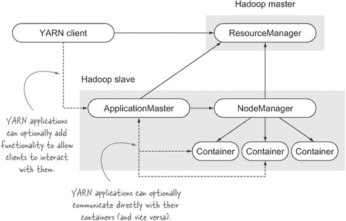

启动一个新的 YARN 应用程序从 YARN 客户端与资源管理器通信以创建一个新的 YARN 应用程序主控实例开始。这个过程的一部分涉及 YARN 客户端通知资源管理器应用程序主控的物理资源需求。

*应用程序主控*是 YARN 应用程序的主进程。它不执行任何特定于应用程序的工作，因为这些功能被委托给容器。相反，它负责管理特定于应用程序的容器：向资源管理器表明其创建容器的意图，然后与节点管理器协商以实际执行容器创建。

作为这个过程的一部分，应用程序主控必须指定每个容器所需的资源，包括哪个主机应该启动容器以及容器的内存和 CPU 需求。5 资源管理器根据确切资源需求调度工作的能力是 YARN 灵活性的关键，它使得主机能够运行容器的混合配置，如图 2.4 所示。

> ⁵ Hadoop 的未来版本可能允许指定网络、磁盘和 GPU 的要求。

##### 图 2.4\. 在单个 YARN 管理的 Hadoop 节点上运行的多种容器配置

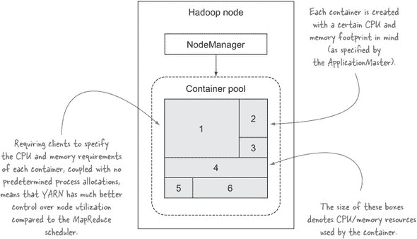

应用程序主控还负责应用程序的具体容错行为。当其容器失败时，它会从资源管理器接收状态消息，并且可以根据这些事件（通过请求资源管理器创建一个新的容器）采取行动，或者忽略这些事件。6

> ⁶ 容器可能因多种原因失败，包括节点故障、YARN 杀死容器以允许启动另一个应用的容器，或者当容器超出其配置的物理/虚拟内存时，YARN 杀死容器。

*容器*是由 NodeManager 代表 ApplicationMaster 创建的应用特定进程。ApplicationManager 本身也是一个容器，由 ResourceManager 创建。由 ApplicationManager 创建的容器可以是一个任意进程——例如，容器进程可能只是一个 Linux 命令，如`awk`，一个 Python 应用程序，或任何操作系统可以启动的进程。这是 YARN 的力量——能够在 Hadoop 集群的任何节点上启动和管理任何进程。

到目前为止，你应该对 YARN 组件及其功能有一个高层次的理解。接下来，我们将探讨常见的 YARN 可配置项。

#### 2.1.3\. YARN 配置

YARN 带来了大量针对各种组件的配置，例如 UI、远程过程调用（RPCs）、调度器等。^[[7]] 在本节中，你将了解如何快速访问运行中的集群的配置。

> ⁷ 默认 YARN 配置的详细信息可以在[`hadoop.apache.org/docs/r2.2.0/hadoop-yarn/hadoop-yarn-common/yarn-default.xml`](http://hadoop.apache.org/docs/r2.2.0/hadoop-yarn/hadoop-yarn-common/yarn-default.xml)中查看。

#### 技巧 1 确定集群的配置

确定运行中的 Hadoop 集群的配置可能很麻烦——通常需要查看多个配置文件，包括默认配置文件，以确定你感兴趣的属性的值。在这个技巧中，你将看到如何绕过通常需要跳过的圈子，并专注于如何迅速获取运行中的 Hadoop 集群的配置。

##### 问题

你想访问运行中的 Hadoop 集群的配置。

##### 解决方案

使用 ResourceManager UI 查看配置。

##### 讨论

ResourceManager UI 显示了你的 Hadoop 集群的配置；图 2.5 显示了如何导航到这些信息。

##### 图 2.5. YARN ResourceManager UI 显示集群的配置

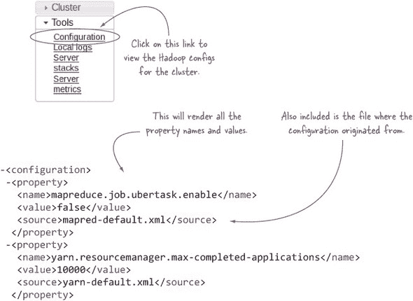

这个特性的有用之处在于，UI 不仅显示了属性值，还显示了它来自哪个文件。如果值没有在<component>-site.xml 文件中定义，它将显示默认值和默认文件名。

此 UI 的另一个有用功能是它会显示来自多个文件的配置，包括核心、HDFS、YARN 和 MapReduce 文件。

可以通过 NodeManager UI 以相同的方式导航到单个 Hadoop 从节点上的配置。这在处理由异构节点组成的 Hadoop 集群时非常有用，您经常需要不同的配置来适应不同的硬件资源。

到目前为止，您应该对 YARN 组件有一个高级的了解，包括它们的功能以及如何为您的集群配置它们。下一步是实际通过命令行和 UI 来查看 YARN 的实际运行情况。

#### 2.1.4\. 与 YARN 交互

默认情况下，Hadoop 2 捆绑了两个 YARN 应用程序——MapReduce 2 和 DistributedShell。您将在本章后面了解更多关于 MapReduce 2 的内容，但就目前而言，您可以通过查看一个更简单的 YARN 应用程序示例来尝试一下：DistributedShell。您将了解如何运行第一个 YARN 应用程序以及在哪里检查日志。

如果您不知道集群的配置值，您有两个选择：

+   检查 yarn-site.xml 的内容以查看属性值。如果条目不存在，则默认值将生效.^([8])

    > ⁸ 访问以下网址以获取 YARN 默认值：[`hadoop.apache.org/docs/r2.2.0/hadoop-yarn/hadoop-yarn-common/yarn-default.xml`](http://hadoop.apache.org/docs/r2.2.0/hadoop-yarn/hadoop-yarn-common/yarn-default.xml)。

+   更好的是，使用 ResourceManager UI，它提供了关于运行配置的更详细信息，包括默认值是什么以及它们是否生效。

现在我们来看看如何快速查看运行中的 Hadoop 集群的 YARN 配置。

#### 技巧 2 在您的 YARN 集群上运行命令

当您开始使用新的 YARN 集群时，在集群上运行命令是一个很好的第一步。如果您愿意，这是 YARN 中的“hello world”。

##### 问题

您想在 Hadoop 集群中的某个节点上运行 Linux 命令。

##### 解决方案

使用 Hadoop 捆绑的 DistributedShell 示例应用程序。

##### 讨论

YARN 捆绑了 DistributedShell 应用程序，它有两个主要用途——它是一个参考 YARN 应用程序，也是一个方便的实用程序，可以在您的 Hadoop 集群上并行运行命令。首先，在一个容器中发出 Linux `find` 命令：

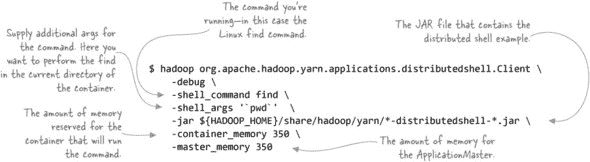

如果您的集群一切正常，那么执行前面的命令将导致以下日志消息：

```
INFO distributedshell.Client: Application completed successfully
```

在此行之前，您将在命令的输出中看到各种其他的日志语句，但您会注意到它们都不包含您`find`命令的实际结果。这是因为 DistributedShell ApplicationMaster 在单独的容器中启动`find`命令，并且`find`命令的标准输出（和标准错误）被重定向到容器的日志输出目录。要查看命令的输出，您需要访问该目录。这正是下一个技巧要介绍的内容！

#### 技巧 3 访问容器日志

当尝试诊断行为异常的应用程序或简单地了解更多关于应用程序的信息时，转向日志文件是最常见的第一步。在这个技巧中，你将学习如何访问这些应用程序日志文件。

##### 问题

你想要访问容器日志文件。

##### 解决方案

使用 YARN 的 UI 和命令行来访问日志。

##### 讨论

每个在 YARN 中运行的容器都有自己的输出目录，其中标准输出、标准错误以及任何其他输出文件都会被写入。展示了输出目录在从节点上的位置，包括日志数据保留的详细信息。

##### 图 2.6\. 容器日志位置和保留

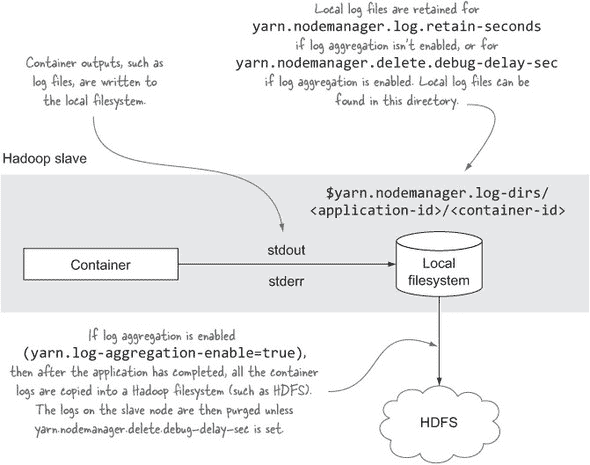

访问容器日志并不像应该的那样简单——让我们看看如何使用 CLI 和 UI 来访问日志。

##### 使用 YARN 命令行访问容器日志

YARN 提供了一个用于访问 YARN 应用程序日志的命令行界面（CLI）。要使用 CLI，你需要知道你的应用程序 ID。

| |
| --- |

##### 我该如何找到应用程序 ID？

大多数 YARN 客户端都会在其输出和日志中显示应用程序 ID。例如，你在上一个技巧中执行的 DistributedShell 命令将应用程序 ID 回显到标准输出：

```
$ hadoop o.a.h.y.a.d.Client ...
...
INFO impl.YarnClientImpl:
     Submitted application application_1388257115348_0008 to
     ResourceManager at /0.0.0.0:8032
...
```

或者，你可以使用 CLI（使用`yarn application -list`）或 ResourceManager UI 来浏览并找到你的应用程序 ID。

| |
| --- |

如果你尝试在应用程序仍在运行时使用 CLI，你会看到以下错误信息：

```
$ yarn logs -applicationId application_1398974791337_0070
Application has not completed. Logs are only available after
an application completes
```

消息已经说明了一切——CLI 仅在应用程序完成后才有用。当应用程序运行时，你需要使用 UI 来访问容器日志，我们将在稍后介绍。

一旦应用程序完成，如果你再次运行该命令，你可能会看到以下输出：

```
$ yarn logs -applicationId application_1400286711208_0001
Logs not available at /tmp/.../application_1400286711208_0001
Log aggregation has not completed or is not enabled.
```

基本上，YARN CLI 仅在应用程序完成并且启用了日志聚合时才有效。日志聚合将在下一个技巧中介绍。如果你启用了日志聚合，CLI 将为你提供应用程序中所有容器的日志，如下一个示例所示：

```
$ yarn logs -applicationId application_1400287920505_0002
client.RMProxy: Connecting to ResourceManager at /0.0.0.0:8032

Container: container_1400287920505_0002_01_000002
           on localhost.localdomain_57276
=================================================
LogType: stderr
LogLength: 0
Log Contents:

LogType: stdout

LogLength: 1355
Log Contents:
/tmp
default_container_executor.sh
/launch_container.sh
/.launch_container.sh.crc
/.default_container_executor.sh.crc
/.container_tokens.crc
/AppMaster.jar
/container_tokens

Container: container_1400287920505_0002_01_000001
           on localhost.localdomain_57276
=================================================
LogType: AppMaster.stderr
LogLength: 17170
Log Contents:
distributedshell.ApplicationMaster: Initializing ApplicationMaster
...

LogType: AppMaster.stdout
LogLength: 8458
Log Contents:
System env: key=TERM, val=xterm-256color
...
```

前面的输出显示了你在上一个技巧中运行的 DistributedShell 示例的日志内容。输出中有两个容器——一个用于执行的`find`命令，另一个用于 ApplicationMaster，它也在容器内执行。

##### 使用 YARN UI 访问日志

YARN 通过 ResourceManager UI 提供对 ApplicationMaster 日志的访问。在伪分布式设置中，将您的浏览器指向 http://localhost:8088/cluster。如果您在与多节点 Hadoop 集群一起工作，请将您的浏览器指向[`$yarn.resourcemanager.webapp.address/cluster`](http://$yarn.resourcemanager.webapp.address/cluster)。点击您感兴趣的应用程序，然后选择日志链接，如图 2.7 所示。

##### 图 2.7\. 显示 ApplicationMaster 容器的 YARN ResourceManager UI

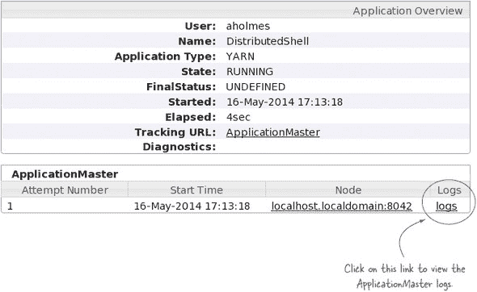

很好，但如何访问除了 ApplicationMaster 之外的容器日志？不幸的是，这里的事情变得有些模糊。ResourceManager 不会跟踪 YARN 应用程序的容器，因此它不能为您提供列出和导航到容器日志的方法。因此，责任在于个别 YARN 应用程序为用户提供访问容器日志的方法。


##### 嘿，ResourceManager，我的容器 ID 是什么？

为了保持 ResourceManager 轻量级，它不会跟踪应用程序的容器 ID。因此，ResourceManager UI 只为访问应用程序的 ApplicationMaster 日志提供了一种方式。


以 DistributedShell 应用程序为例。这是一个简单的应用程序，它不提供 ApplicationMaster UI 或跟踪它启动的容器。因此，除了使用前面介绍的方法（使用 CLI）之外，没有简单的方法来查看容器日志。

幸运的是，MapReduce YARN 应用程序提供了一个 ApplicationMaster UI，您可以使用它来访问容器（映射和减少任务）日志，以及一个 Job-History UI，可以在 MapReduce 作业完成后访问日志。当您运行 MapReduce 作业时，ResourceManager UI 会为您提供链接到 MapReduce ApplicationMaster UI，如图 2.8 所示，您可以使用它来访问映射和减少日志（类似于 MapReduce 1 中的 JobTracker）。

##### 图 2.8\. 访问正在运行作业的 MapReduce UI

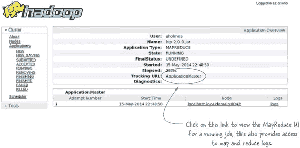

如果您的 YARN 应用程序提供了一种方法来识别容器 ID 和它们执行的宿主机，您可以使用 NodeManager UI 访问容器日志，或者使用 shell 通过`ssh`到执行容器的从节点。

访问容器日志的 NodeManager URL 是[`<nodemanager-host>:8042/node/containerlogs/<container-id>/<username>`](http://<nodemanager-host>:8042/node/containerlogs/<container-id>/<username>）。或者，您可以通过`ssh`到 NodeManager 主机并访问$yarn.nodemanager.log-dirs/<application-id>/<container-id>目录来访问容器日志目录。

真的，我能给出的最好建议是您应该启用日志聚合，这将允许您使用 CLI、HDFS 和 UI，例如 MapReduce ApplicationMaster 和 JobHistory，来访问应用程序日志。继续阅读以获取如何操作的详细信息。

#### 技术四：聚合容器日志文件

日志聚合是 Hadoop 1 中缺失的功能，这使得归档和访问任务日志变得具有挑战性。幸运的是，Hadoop 2 内置了这个功能，并且你有多种方式可以访问聚合的日志文件。在这个技术中，你将学习如何配置你的集群以归档日志文件进行长期存储和访问。

##### 问题

你想要将容器日志文件聚合到 HDFS 并管理它们的保留策略。

##### 解决方案

使用 YARN 的内置日志聚合功能。

##### 讨论

在 Hadoop 1 中，你的日志被存储在每个从节点上，JobTracker 和 TaskTracker 是获取这些日志的唯一机制。这很麻烦，并且不容易支持对这些日志的编程访问。此外，由于存在旨在防止从节点上的本地磁盘填满的积极的日志保留策略，日志文件通常会丢失。

因此，Hadoop 2 中的日志聚合是一个受欢迎的功能，如果启用，它会在 YARN 应用程序完成后将容器日志文件复制到 Hadoop 文件系统（如 HDFS）中。默认情况下，此行为是禁用的，你需要将`yarn.log-aggregation-enable`设置为`true`来启用此功能。图 2.9 显示了容器日志文件的数据流。

##### 图 2.9\. 从本地文件系统到 HDFS 的日志文件聚合

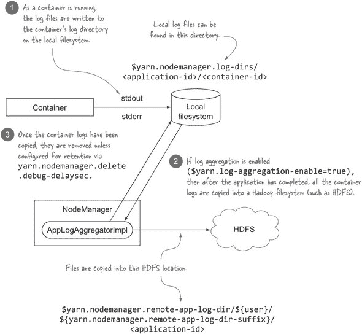

现在你已经知道了日志聚合的工作原理，让我们看看你如何可以访问聚合日志。

##### 使用 CLI 访问日志文件

在你手头有应用程序 ID 的情况下（有关如何获取它的详细信息，请参阅技术 3），你可以使用命令行来获取所有日志并将它们写入控制台：

```
$ yarn logs -applicationId application_1388248867335_0003
```

| |
| --- |

##### 启用日志聚合

如果前面的`yarn logs`命令产生以下输出，那么很可能你没有启用 YARN 日志聚合：

```
Log aggregation has not completed or is not enabled.
```

| |
| --- |

这将输出 YARN 应用程序中所有容器的所有日志。每个容器的输出由一个标题分隔，标题指示容器 ID，然后是容器输出目录中每个文件的详细信息。例如，如果你运行了一个执行`ls -l`的 DistributedShell 命令，那么`yarn logs`命令的输出将类似于以下内容：

```
Container: container_1388248867335_0003_01_000002 on localhost
==============================================================
LogType: stderr
LogLength: 0
Log Contents:

LogType: stdoutLogLength: 268
Log Contents:
total 32

-rw-r--r-- 1 aholmes 12:29 container_tokens
-rwx------ 1 aholmes 12:29 default_container_executor.sh
-rwx------ 1 aholmes launch_container.sh
drwx--x--- 2 aholmes tmp

Container: container_1388248867335_0003_01_000001 on localhost
==============================================================
LogType: AppMaster.stderr
(the remainder of the ApplicationMaster logs removed for brevity)
```

stdout 文件包含`ls`进程当前目录的目录列表，这是一个容器特定的工作目录。

##### 通过 UI 访问聚合日志

具有完整功能的 YARN 应用程序，如 MapReduce，提供了一个 ApplicationMaster UI，可以用来访问容器日志。同样，作业历史 UI 也可以访问聚合日志。

| |
| --- |

##### UI 聚合日志渲染

如果启用了日志聚合，你需要更新 yarn-site.xml 并将`yarn.log.server.url`设置为指向作业历史服务器，以便 ResourceManager UI 可以渲染日志。

| |
| --- |

##### 在 HDFS 中访问日志文件

默认情况下，聚合的日志文件会放入以下 HDFS 目录中：

```
/tmp/logs/${user}/logs/application_<appid>
```

目录前缀可以通过`yarn.nodemanager.remote-app-log-dir`属性进行配置；同样，用户名之后的路径名（在之前的例子中是“logs”，默认值）可以通过`yarn.nodemanager.remote-app-log-dir-suffix`进行自定义。

##### 本地文件系统和 HDFS 中日志文件之间的差异

如你之前所见，每个容器在本地文件系统中会产生两个日志文件：一个用于标准输出，另一个用于标准错误。作为聚合过程的一部分，给定节点的所有文件都会被连接成一个特定于节点的日志文件。例如，如果你在三个节点上运行了五个容器，你最终会在 HDFS 中得到三个日志文件。

##### 压缩

默认情况下，聚合日志的压缩是禁用的，但你可以通过将`yarn.nodemanager.log-aggregation.compression-type`的值设置为`lzo`或`gzip`来启用它，具体取决于你的压缩需求。截至 Hadoop 2.2，这两个是唯一支持的压缩编解码器。

##### 日志保留

当关闭日志聚合时，本地主机上的容器日志文件会保留`yarn.nodemanager.log.retain-seconds`秒，默认为 10,800 秒（3 小时）。

当开启日志聚合时，`yarn.nodemanager.log.retain-seconds`的可配置设置会被忽略，并且一旦本地容器日志文件被复制到 HDFS，它们就会被删除。但如果你想在本地文件系统中保留它们，只需将`yarn.nodemanager.delete.debug-delay-sec`设置为想要保留文件的时间即可。请注意，这不仅适用于日志文件，也适用于与容器相关联的所有其他元数据（如 JAR 文件）。

HDFS 中文件的保留时间是通过不同的设置`yarn.log-aggregation.retain-seconds`进行配置的。

##### NameNode 注意事项

在大规模部署时，你可能需要考虑一个激进的日志保留设置，以避免因所有日志文件元数据而使 NameNode 过载。NameNode 将元数据保存在内存中，在一个大型活跃集群中，日志文件的数量可能会迅速超过 NameNode 的处理能力。

| |
| --- |

##### NameNode 影响的真实案例

查看 Bobby Evans 的“我们在规模上运行 YARN 的经验”（[`www.slideshare.net/Hadoop_Summit/evans-june27-230pmroom210c`](http://www.slideshare.net/Hadoop_Summit/evans-june27-230pmroom210c)），了解雅虎如何利用 30%的 NameNode 存储七天累积日志的实际情况。

| |
| --- |

##### 其他解决方案

这种技术中突出的解决方案对于将日志放入 HDFS 很有用，但如果你需要自己组织任何日志挖掘或可视化活动，还有其他选项可用，例如 Hunk，它支持从 Hadoop 1 和 2 聚合日志，并提供与常规 Splunk 一样的一流查询、可视化和监控功能。如果你想要拥有日志管理流程，你也可以使用 Logstash、ElasticSearch 和 Kibana 等工具设置查询和可视化管道。其他工具如 Loggly 也值得调查。

至此，我们关于 YARN 的实战考察就结束了。然而，这并不是故事的结束。第 2.2 节将探讨 MapReduce 作为 YARN 应用程序的工作方式，而在第十章的后面，你将学习如何编写自己的 YARN 应用程序。

#### 2.1.5\. YARN 挑战

在 YARN 中需要注意一些陷阱：

+   ***YARN 目前尚未设计为与长时间运行的过程很好地协同工作。*** 这给像 Impala 和 Tez 这样的项目带来了挑战，这些项目将受益于这样的功能。目前正在进行将此功能引入 YARN 的工作，并在名为“在 YARN 中滚动长期服务”的 JIRA 票据中跟踪，[`issues.apache.org/jira/browse/YARN-896`](https://issues.apache.org/jira/browse/YARN-896)。

+   ***编写 YARN 应用程序相当复杂，因为你需要实现容器管理和容错性。*** 这可能需要一些复杂的 Application-Master 和容器状态管理，以便在失败后可以从某个已知的状态继续工作。有几个框架的目标是简化开发——更多细节请参阅第十章。

+   ***群组调度，即能够快速并行启动大量容器的能力，目前尚不支持。*** 这是像 Impala 和 Hamster（OpenMPI）这样的项目需要用于原生 YARN 集成的一个特性。Hadoop 提交者目前正在努力添加对群组调度的支持，这已在名为“在 AM RM 协议中支持群组调度”的 JIRA 票据中跟踪，[`issues.apache.org/jira/browse/YARN-624`](https://issues.apache.org/jira/browse/YARN-624)。

到目前为止，我们一直关注核心 YARN 系统的功能。接下来，让我们看看 MapReduce 作为 YARN 应用程序是如何工作的。

### 2.2\. YARN 和 MapReduce

在 Hadoop 1 中，MapReduce 是唯一在 Hadoop 中本地处理数据的方式。YARN 的创建是为了让 Hadoop 集群能够运行任何类型的工作，其唯一要求是应用程序遵循 YARN 规范。这意味着 Map-Reduce 必须成为 YARN 应用程序，并要求 Hadoop 开发者重写 MapReduce 的关键部分。

由于 MapReduce 需要经历一些“心脏手术”才能作为一个 YARN 应用程序运行，本节的目标是揭开 MapReduce 在 Hadoop 2 中的工作原理。您将看到 MapReduce 2 如何在 Hadoop 集群中执行，同时也会了解配置更改以及与 MapReduce 1 的向后兼容性。在本节的最后，您将学习如何运行和监控作业，并了解小型作业是如何快速执行的。

有很多内容需要介绍，所以让我们将 MapReduce 带入实验室，看看其内部的工作情况。

#### 2.2.1. 解构 YARN MapReduce 应用程序

为了将 MapReduce 移植到 YARN，必须对其进行架构上的修改。图 2.10 展示了 MRv2 中涉及的过程以及它们之间的一些交互。

##### 图 2.10. MapReduce 2 YARN 应用程序的交互

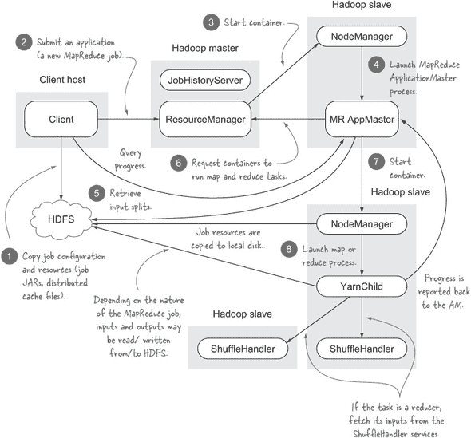

每个 MapReduce 作业都作为一个独立的 YARN 应用程序执行。当您启动一个新的 MapReduce 作业时，客户端计算输入拆分并将它们与其他作业资源一起写入 HDFS（步骤 1）。然后客户端与 ResourceManager 通信以创建 MapReduce 作业的应用程序主（步骤 2）。实际上，应用程序主是一个容器，因此当集群上有可用资源时，ResourceManager 将分配容器，然后与 NodeManager 通信以创建应用程序主容器（步骤 3-4).^([9])

> ⁹ 如果没有可用资源来创建容器，ResourceManager 可能会选择杀死一个或多个现有的容器以腾出空间。

MapReduce 应用程序主（MRAM）负责创建 map 和 reduce 容器并监控它们的状态。MRAM 从 HDFS 中拉取输入拆分（步骤 5），这样当它与 ResourceManager 通信（步骤 6）时，它可以请求在输入数据所在的节点上启动 map 容器。

向 ResourceManager 发送的容器分配请求附加在应用程序主和 ResourceManager 之间流动的常规心跳消息上。心跳响应可能包含有关为应用程序分配的容器的详细信息。数据局部性作为架构的一个重要部分得到维护——当它请求 map 容器时，MapReduce 应用程序管理器将使用输入拆分的位置细节请求将这些容器分配给包含输入拆分的节点之一，并且 ResourceManager 将在这组输入拆分节点上尽力进行容器分配。

一旦 MapReduce ApplicationManager 分配到容器，它就会与 NodeManager 通信以启动 map 或 reduce 任务（步骤 7-8）。在这个阶段，map/reduce 进程的工作方式与 MRv1 非常相似。

##### 混洗

MapReduce 中的洗牌阶段，负责对映射器输出进行排序并将它们分发到减少器，在 MapReduce 2 中没有发生根本性的变化。主要区别在于映射输出是通过 ShuffleHandlers 获取的，这些是运行在每个从节点上的辅助 YARN 服务。10 对洗牌实现进行了一些微小的内存管理调整；例如，`io.sort.record.percent` 现在不再使用。

> ^((10)) ShuffleHandler 必须配置在您的 yarn-site.xml 中；属性名为 `yarn.nodemanager.aux-services`，其值为 `mapreduce_shuffle`。

##### JobTracker 呢？

您会注意到，在这个架构中 JobTracker 已不再存在。JobTracker 的调度部分被移动到 YARN ResourceManager 中的通用资源调度器。JobTracker 的剩余部分，主要是关于运行中和已完成作业的元数据，被分成两部分。每个 MapReduce ApplicationMaster 都托管一个 UI，用于显示当前作业的详细信息，一旦作业完成，它们的详细信息将被推送到 JobHistoryServer，该服务器聚合并显示所有已完成作业的详细信息。有关详细信息，包括如何访问 MapReduce ApplicationMaster UI，请参阅第 2.2.5 节。

希望现在您对 MapReduce 2 的工作方式有了更好的理解。MapReduce 配置在迁移到 YARN 时并未未受影响，因此让我们看看哪些是热门的，哪些不是。

#### 2.2.2\. 配置

MapReduce 2 转换到 YARN 带来了一些 Map-Reduce 属性的重大变化。在本节中，我们将介绍一些受影响的常用属性。

##### 新属性

MapReduce 2 中有几个新特性，在表 2.2 中进行了识别。

##### 表 2.2\. 新的 MapReduce 2 属性

| 属性名称 | 默认值 | 描述 |
| --- | --- | --- |

| mapreduce.framework.name | local | 确定运行 MapReduce 作业时应使用哪个框架。有三个可能的值：

+   local，表示使用 LocalJobRunner（整个 MapReduce 作业在单个 JVM 中运行）。

+   classic，表示作业将在 MapReduce 1 集群上启动。在这种情况下，将使用 mapreduce.jobtracker.address 属性来检索作业提交到的 JobTracker。

+   yarn，表示在 YARN 中运行 MapReduce 作业。这可以是伪分布式或完整的 YARN 集群。

|

| mapreduce.job.ubertask.enable | false | Uber 作业是可以在 MapReduce ApplicationMaster 进程内部运行的较小作业，以避免启动映射和减少容器的开销。Uber 作业在第 2.2.6 节中有更详细的介绍。 |
| --- | --- | --- |
| mapreduce.shuffle.max.connections | 0 | shuffle 允许的最大连接数。设置为 0（零）表示不对连接数进行限制。这与旧的（现在已弃用）MapReduce 1 属性 tasktracker.http.threads 类似，该属性定义了用于服务 reducer 对 map 输出的请求的 TaskTracker 线程数。 |
| yarn.resourcemanager.am.max-attempts | 2 | 最大应用尝试次数。这是所有 ApplicationMasters 的全局设置。每个应用程序主可以通过 API 指定其单独的最大应用尝试次数，但单独的数字不能超过全局上限。如果超过，资源管理器将覆盖它。默认值为 2，以允许至少重试一次 AM。 |
| yarn.resourcemanager.recovery.enabled | false | 启用 RM 在启动后恢复状态。如果为 true，则必须指定 yarn.resourcemanager.store.class。Hadoop 2.4.0 还引入了一种基于 ZooKeeper 的机制来存储 RM 状态（类 org.apache.hadoop.yarn.server.resourcemanager.recovery.ZKRMStateStore）。 |
| yarn.resourcemanager.store.class | org.apache.hadoop.yarn.server.resourcemanager.recovery.FileSystem-RMStateStore | 将资源管理器状态写入文件系统以用于恢复目的。 |

##### 容器属性

表 2.3 显示了与运行任务的 map 和 reduce 进程相关的 MapReduce 属性。

##### 表 2.3\. 影响容器（map/reduce 任务）的 MapReduce 2 属性

| 属性名 | 默认值 | 描述 |
| --- | --- | --- |
| mapreduce.map.memory.mb | 1024 | 分配给运行 mappers 的容器（进程）的内存量，以兆字节为单位。YARN 调度器使用此信息来确定集群中节点上的可用容量。旧属性名 mapred.job.map.memory.mb 已被弃用。 |
| mapreduce.reduce.memory.mb | 1024 | 分配给运行 reducer 的容器（进程）的内存量，以兆字节为单位。YARN 调度器使用此信息来确定集群中节点上的可用容量。旧属性名 mapreduce.reduce.memory.mb 已被弃用。 |
| mapreduce.map.cpu.vcores | 1 | 分配给 map 进程的虚拟核心数。 |
| mapreduce.reduce.cpu.vcores | 1 | 分配给 reduce 进程的虚拟核心数。 |
| mapred.child.java.opts | -Xmx200m | Map 和 Reduce 进程的 Java 选项。如果存在@taskid@符号，它将被当前的 TaskID 所替换。任何其他@的出现将保持不变。例如，为了将详细的垃圾回收日志记录到以 TaskID 命名的文件中（位于/tmp 目录下），并将堆最大值设置为 1GB，请传递值-Xmx1024m -verbose:gc -Xloggc:/tmp/@taskid@.gc。使用-Djava.library.path 可能会导致程序无法正常工作，如果使用了 Hadoop 原生库。这些值应该作为 LD_LIBRARY_PATH 的一部分在 map/reduce JVM 环境中设置，使用 mapreduce.map.env 和 mapreduce.reduce.env 配置设置。 |
| mapred.map.child.java.opts | None | Map 进程特定的 JVM 参数。旧的属性名称 mapred.map.child.java.opts 已被弃用。 |
| mapreduce.reduce.java.opts | None | Reduce 进程特定的 JVM 参数。旧的属性名称 mapred.reduce.child.java.opts 已被弃用。 |

##### 已不再有效的配置

MapReduce 1 中常见的属性在 MapReduce 2 中不再有效，这些属性在表 2.4 中列出，同时解释了为什么它们不再存在。

##### 表 2.4\. 已不再使用的旧 MapReduce 1 属性

| 属性名称 | 描述 |
| --- | --- |
| mapred.job.tracker mapred.job.tracker.http.address | 在 YARN 中，JobTracker 不再存在；它已被 ApplicationMaster UI 和 JobHistory UI 所取代。 |
| mapred.task.tracker.http.address mapred.task.tracker.report.address | TaskTracker 在 YARN 中也不再存在——它已被 YARN NodeManager 所取代。 |
| mapred.local.dir | 这曾经是存储 MapReduce 作业中间数据的本地目录。这个属性已经被弃用，新的属性名称是 mapreduce.jobtracker.system.dir。它的使用也仅限于 LocalJob-Runner，如果你在运行本地作业（不在 YARN 集群上）时，它才会发挥作用。 |
| mapred.system.dir | 与 mapred.local.dir 类似，它在运行 LocalJobRunner 时才会被使用。 |
| mapred.tasktracker.map.tasks.maximum mapred.tasktracker.reduce.tasks.maximum | 这用于控制一个节点上可以运行的 map 和 reduce 任务进程的最大数量。这些被称为“槽位”，在 Hadoop 1 中是静态的。在 Hadoop 2 中，YARN 不对节点上并发容器的数量施加静态限制，因此这些属性不再需要。 |
| mapred.job.reuse.jvm.num.tasks | 你曾经能够在同一个 JVM 中顺序运行多个任务，这对于生命周期短的任务（以及减少为每个任务创建单独进程的开销）是有用的。这在 YARN 中不再被支持。 |
| tasktracker.http.threads | 在 MRv2 中不再使用。现在从新的 ShuffleHandler 服务中获取 Map 输出，该服务基于 NIO，默认配置为无连接数上限（通过 mapreduce.shuffle.max.connections 配置）。 |
| io.sort.record.percent | 这个洗牌属性曾经用来控制 map 端排序缓冲区（io.sort.mb）中使用的会计空间量。MapReduce 2 在如何填充 io.sort.mb 方面更智能。^([a)] |

> ^a “Map-side sort is hampered by io.sort.record.percent” 和详细信息可以在 [`issues.apache.org/jira/browse/MAPREDUCE-64`](https://issues.apache.org/jira/browse/MAPREDUCE-64) 查看。

##### 已弃用的属性

大多数 MapReduce 1（以及许多 HDFS）的属性已被弃用，以支持更好的组织结构的属性名称。^([11)] 目前 Hadoop 2 支持已弃用和新属性名称，但您最好更新您的属性，因为没有保证 Hadoop 3 及以后的版本将支持已弃用的属性。幸运的是，当您运行 MapReduce 作业时，您会在标准输出上获得所有已弃用的配置属性的转储，以下是一个示例：

> (11) 请参阅网页 "已弃用的属性"，其中列出了已弃用的属性及其新名称。[`hadoop.apache.org/docs/stable/hadoop-project-dist/hadoop-common/DeprecatedProperties.html`](http://hadoop.apache.org/docs/stable/hadoop-project-dist/hadoop-common/DeprecatedProperties.html)

```
Configuration.deprecation: mapred.cache.files is deprecated.
Instead, use mapreduce.job.cache.files
```

很明显，MapReduce 属性有很多变化。您可能想知道 MapReduce 的其余部分是如何变化的，以及哪些部分设法保持了强大的向后兼容性。MapReduce API 和二进制文件在 Hadoop 主版本号增加时是否安然无恙？^([12)]

> (12) 语义版本控制 ([`semver.org/`](http://semver.org/)) 允许在主版本号增加时以破坏向后兼容性的方式更改 API。

#### 2.2.3. 向后兼容性

对于拥有大量、稳定用户基础的系统，向后兼容性是一个重要的考虑因素，因为它确保它们可以快速迁移到系统的全新版本，而几乎不需要或不需要进行更改。本节涵盖了 MapReduce 系统的各个部分，并帮助您确定您是否需要更改系统以使其能够在 MapReduce 2 上运行。

##### 脚本兼容性

与 Hadoop 一起捆绑的脚本保持不变。这意味着您可以使用 `hadoop jar ...` 来启动作业，并且所有其他对主 `hadoop` 脚本的使用以及与 Hadoop 一起捆绑的其他脚本都将继续工作。

##### 配置

随着 YARN 的引入和 MapReduce 成为一个应用程序，MapReduce 1 中的许多属性名称现在在 MapReduce 2 中已被弃用，其中一些已不再有效。第 2.2.2 节 涵盖了一些常用属性的变化。

##### API 向后兼容性

在将 MapReduce 移植到 YARN 的过程中，开发人员尽力保持现有 MapReduce 应用程序的向后兼容性。他们能够实现代码兼容性，但在某些情况下无法保持二进制兼容性：

+   *代码兼容性*意味着任何今天存在的 MapReduce 代码，只要重新编译，就可以在 YARN 上良好运行。这很好，这意味着你不需要修改代码就能使其在 YARN 上工作。

+   *二进制兼容性*意味着 MapReduce 的字节码可以在 YARN 上不变地运行。换句话说，你不需要重新编译你的代码——你可以使用在 Hadoop 1 上工作过的相同的类和 JAR 文件，它们在 YARN 上也能正常工作。

使用“旧”的 MapReduce API（`org.apache.hadoop.mapreduce 包`）的代码是二进制兼容的，所以如果你的现有 MapReduce 代码只使用旧 API，你就没问题——不需要重新编译你的代码。

对于“新”的 MapReduce API（`org.apache.hadoop.mapreduce`）的某些使用情况，情况并非如此。如果你使用新的 API，可能你正在使用 API 的一些已更改的功能；即，一些类被更改为接口。以下是一些这样的类的例子：

+   `JobContext`

+   `TaskAttemptContext`

+   `Counter`

这引发了一个问题：如果你使用新的 MapReduce API 并且有需要在 Hadoop 两个版本上运行的代码，你会怎么做。

#### 技巧 5：编写在 Hadoop 版本 1 和 2 上都能运行的代码

如果你使用“新”的 MapReduce API 并且有自己的 Input/OutputFormat 类或使用计数器（仅举几个在 MapReduce 版本之间不兼容的操作），那么你可能有需要重新编译以与 MapReduce 2 兼容的 JAR 文件。如果你必须同时支持 MapReduce 1 和 2，这将是一个麻烦事。你可以为每个 MapReduce 版本创建两组 JAR 文件，但你可能需要向你的构建团队支付几杯啤酒，并最终拥有更复杂的构建和部署系统。或者，你可以使用这个技巧中的提示，继续分发单个 JAR 文件。

##### 问题

你正在使用与 MapReduce 2 不二进制兼容的 MapReduce 代码，并且你想要以能够与两个 MapReduce 版本兼容的方式更新你的代码。

##### 解决方案

使用一个处理 API 差异的 Hadoop 兼容性库。

##### 讨论

Elephant Bird 项目包含一个 HadoopCompat 类，它可以动态地确定你正在运行哪个版本的 Hadoop，并使用 Java 反射来调用适当的方法调用以与你的 Hadoop 版本一起工作。以下代码展示了其使用的一个例子，其中在一个`InputFormat`实现中，`TaskAttemptContext`从类更改为接口，并且正在使用`HadoopCompat`类来提取`Configuration`对象：

```
import com.alexholmes.hadooputils.util.HadoopCompat;
  import org.apache.hadoop.mapreduce.InputSplit;
import org.apache.hadoop.mapreduce.RecordReader;
import org.apache.hadoop.mapreduce.TaskAttemptContext;

public class MyInputFormat implements InputFormat {
  @Override
  public RecordReader createRecordReader(InputSplit split,
                                         TaskAttemptContext context)
         throws IOException {
    final Configuration conf = HadoopCompat.getConfiguration(context);
        ...
  }
}
```

Hadoop 2 中哪些类被改为接口？一些值得注意的类包括 `TaskAttemptContext`、`JobContext` 和 `MapContext`。表 2.5 展示了 `HadoopCompat` 类中可用的一些方法。

##### 表 2.5\. 在 MapReduce 版本之间不兼容的二进制类和方法

| Hadoop 类和方法 | HadoopCompat 调用 | 你会遇到这个接口的地方 |
| --- | --- | --- |
| JobContext.getConfiguration | HadoopCompat.getConfiguration | 这可能是最常用的类（现在是一个接口）。你可能会遇到这个接口，因为它是你获取 map 或 reduce 任务的配置的方式。 |
| TaskAttemptContext.setStatus | HadoopCompat.setStatus | 如果你有一个自定义的 InputFormat、OutputFormat、RecordReader 或 RecordWriter，你会遇到这个接口。 |
| TaskAttemptContext.getTaskAttemptID | HadoopCompat.getTaskAttemptID | 如果你有一个自定义的 InputFormat、OutputFormat、RecordReader 或 RecordWriter，你会使用这个接口。 |
| TaskAttemptContext.getCounter | HadoopCompat.getCounter | 如果你有一个自定义的 InputFormat、OutputFormat、RecordReader 或 RecordWriter，你会遇到这个接口。 |
| Counter.incrementCounter | HadoopCompat.incrementCounter | 如果你使用计数器在你的作业中，你需要使用 HadoopCompat 调用。 |

`HadoopCompat` 类还有一个方便的方法叫做 `isVersion2x`，它返回一个布尔值，如果类已经确定你的运行时正在运行 Hadoop 的 2 版本。

这只是这个类上方法的一个示例——对于完整详情，请参阅 Elephant Bird 项目在 GitHub 上的 HadoopCompat 页面：[`github.com/kevinweil/elephant-bird/blob/master/hadoop-compat/src/main/java/com/twitter/elephantbird/util/HadoopCompat.java`](https://github.com/kevinweil/elephant-bird/blob/master/hadoop-compat/src/main/java/com/twitter/elephantbird/util/HadoopCompat.java)。

Maven Central 包含了这个库的包，你可以在 Maven 仓库的“Elephant Bird Hadoop 兼容性”页面查看示例条目，并将其添加到你的 Maven 文件中。[`mvnrepository.com/artifact/com.twitter.elephantbird/elephant-bird-hadoop-compat`](http://mvnrepository.com/artifact/com.twitter.elephantbird/elephant-bird-hadoop-compat)

如你之前所见，Hadoop 1 中的主要脚本 `hadoop` 在 Hadoop 2 中继续存在且未做更改。在下一节中，你将看到如何使用较新版本的脚本不仅运行 MapReduce 作业，还可以发出 YARN 命令。

#### 2.2.4\. 运行一个作业

是时候运行一个 MapReduce 2 作业了。别担心，这样做几乎与你在 MapReduce 1 中做的一样。

#### 技巧 6 使用命令行运行作业

在这个技巧中，你将学习如何使用命令行来运行一个 MapReduce 作业。

##### 问题

你想使用 YARN 命令行来运行一个 MapReduce 作业。

##### 解决方案

使用 `yarn` 命令。

##### 讨论

在 Hadoop 1 中，`hadoop` 命令是用于启动作业的命令。出于向后兼容的原因，此命令仍然有效，但此命令的 YARN 形式是 `yarn` 脚本，它的工作方式与旧的 `hadoop` 脚本非常相似。例如，这是如何在 Hadoop 示例 JAR 中运行捆绑的 `pi` 作业的方法：^([13])

> ¹³ 此示例使用准蒙特卡洛方法计算π的值。

```
$ yarn jar ${HADOOP_HOME}/share/hadoop/mapreduce/*-examples-*.jar pi 2 10

Estimated value of Pi is 3.1428000
```

如果你习惯使用 `hadoop` 来运行你的作业，考虑将其替换为 `yarn` 命令。目前尚不清楚是否有计划废弃并移除 `hadoop` 命令，但可以肯定的是，`yarn` 的对应命令将会持续存在。

在版本 2 中，你可以启动 MapReduce 作业的方式已经改变，查看运行中和已完成作业的状态和细节的机制也发生了变化。

#### 2.2.5. 监控运行中的作业和查看归档作业

在运行 MapReduce 作业时，为了监控和调试的目的，能够查看作业及其任务的状态，并访问任务日志非常重要。在 MapReduce 1 中，所有这些操作都是通过 JobTracker UI 完成的，它可以用来查看运行中、已完成或归档作业的详细信息。

如 2.2.1 节中所述，JobTracker 在 MapReduce 2 中不再存在；它已被特定于 ApplicationMaster 的 UI 和已完成作业的 JobHistoryServer 所取代。ApplicationMaster UI 可以在图 2.11 中看到。对于获取映射和减少任务日志，UI 将重定向到 NodeManager。

##### 图 2.11。YARN ResourceManager UI，显示当前正在执行的应用程序

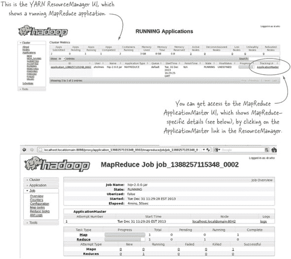

| |
| --- |

##### 确定 ResourceManager UI 的运行位置

你可以通过检查 `yarn.resourcemanager.webapp.address` 的值（如果需要 HTTPS 访问，则为 `yarn.resourcemanager.webapp.https.address`）来获取 ResourceManager 的主机和端口。在伪分布式安装的情况下，这将是指定的 http://localhost:8088（或 HTTPS 的端口 8090）。将主机和端口复制到浏览器中就足以访问 UI，因为不需要 URL 路径。

| |
| --- |

JobHistoryServer 可以在图 2.12 中看到。

##### 图 2.12。JobHistory UI，显示已完成的 MapReduce 应用程序

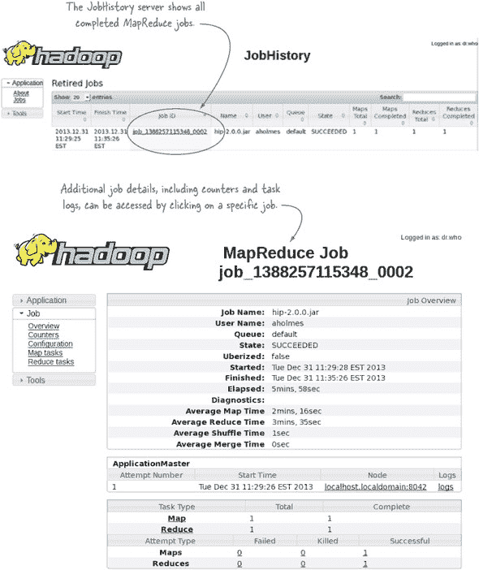

MapReduce 2 改变了作业的执行、配置和监控方式。它还引入了新的功能，例如 uber 作业，接下来将介绍。

#### 2.2.6. Uber 作业

在运行小型 MapReduce 作业时，资源调度和进程分叉所需的时间通常是总体运行时间的一个大比例。在 MapReduce 1 中，你对此开销没有任何选择，但 MapReduce 2 变得更加智能，现在可以满足你尽快运行轻量级作业的需求。

#### 技巧 7 运行小型 MapReduce 作业

这种技术探讨了如何在 MapReduce ApplicationMaster 内部运行 MapReduce 作业。当你处理少量数据时，这很有用，因为它减少了 MapReduce 通常花费在启动和关闭映射和减少进程上的额外时间。

##### 问题

你有一个在小型数据集上运行的 MapReduce 作业，并且你想要避免调度和创建映射和减少进程的开销。

##### 解决方案

配置你的作业以启用 uber 作业；这将使映射器和减少器在 ApplicationMaster 的同一进程中运行。

##### 讨论

Uber 作业是在 MapReduce ApplicationMaster 内部执行的作业。而不是与 ResourceManager 协商来创建映射和减少容器，ApplicationMaster 在其自己的进程中运行映射和减少任务，从而避免了启动和与远程容器通信的开销。

要启用 uber 作业，你需要设置以下属性：

```
mapreduce.job.ubertask.enable=true
```

表 2.6 列出了一些控制作业是否适合 uber 化的额外属性。

##### 表 2.6\. 个性化 uber 作业的属性

| 属性 | 默认值 | 描述 |
| --- | --- | --- |
| mapreduce.job.ubertask.maxmaps | 9 | 一个作业的映射器数量必须小于或等于此值，作业才能被 uber 化。 |
| mapreduce.job.ubertask.maxreduces | 1 | 一个作业的减少器数量必须小于或等于此值，作业才能被 uber 化。 |
| mapreduce.job.ubertask.maxbytes | 默认块大小 | 作业的总输入大小必须小于或等于此值，作业才能被 uber 化。 |

在运行 uber 作业时，MapReduce 禁用了推测执行，并将任务的最大尝试次数设置为`1`。


##### Reducer 限制

目前只支持 map-only 作业和只有一个减少器的作业进行 uber 化。


Uber 作业是 MapReduce 功能的一个方便的新增功能，并且它们只在 YARN 上工作。这标志着我们对 YARN 上的 MapReduce 的探讨结束。接下来，你将看到其他在 YARN 上运行的系统的示例。

### 2.3\. YARN 应用程序

到目前为止，你已经看到了 YARN 是什么，它是如何工作的，以及 MapReduce 2 作为 YARN 应用程序是如何工作的。但这只是 YARN 旅程的第一步；已经有几个项目在 YARN 上工作，随着时间的推移，你应该期待看到 YARN 生态系统的快速增长。

在这一点上，你可能想知道为什么 YARN 应用程序具有吸引力，为什么 Hadoop 社区在 YARN 架构和将 MapReduce 移植到 YARN 应用程序上投入了如此多的工作。我们在本章开头提到了许多原因，但 Hadoop 这一革命性变革背后的最重要的原因是开放平台。想想看，我们现在的系统是如何工作的——那些在单体系统中工作的日子已经过去了；相反，我们生活在一个在我们的数据中心运行多个不同系统的世界里，如图 2.13 所示。

##### 图 2.13. 我们今天运行的一些常见系统。它们是孤立的，这增加了数据和资源共享的复杂性。

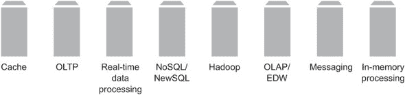

这就是很多系统！而且很可能你现在已经在生产中运行了许多这样的系统。如果你是一名工程师，你可能对拥有所有这些系统感到兴奋，但系统管理员和架构师在思考支持所有这些系统带来的挑战时可能会感到头痛：

+   他们必须建立内部知识来管理和维护系统，使其保持健康。系统会失败，尤其是复杂的分布式系统，而且作为开源项目，许多这些系统没有工具来简化管理。

+   系统间的数据交换很痛苦，主要是因为数据量庞大，以及缺乏数据移动工具。随之而来的是大型、昂贵的项目。14。

    > ^(14) LinkedIn 通过 Jay Kreps 在其博客文章“日志：每位软件工程师都应该了解关于实时数据统一抽象的知识”——查看“统一日志”图像及其周围的文本，了解一个有助于减少这些痛点的架构解决方案：[`engineering.linkedin.com/distributed-systems/log-what-every-software-engineer-should-know-about-real-time-datas-unifying`](http://engineering.linkedin.com/distributed-systems/log-what-every-software-engineer-should-know-about-real-time-datas-unifying)。

+   每个系统都必须解决相同的一些分布式问题，例如容错、分布式存储、日志处理和资源调度。

YARN 承诺提供一个可以统一管理资源的单一集群，支持多租户应用程序和用户，并在共享存储上提供弹性计算。HBase 与 Hoya 的结合为我们提供了一个关于未来可能形态的预览：利用强大的数据局部性属性，高效地在 HBase 内外移动数据；Hoya 通过其与 YARN 的集成，提供了弹性、按需计算，能够在单个 YARN 集群上运行多个 HBase 集群。

在接下来的几节中，你将了解到基于 YARN 的多个系统，这些系统跨越了广泛的技术领域。我们将查看一些使用 YARN 兼容性构建的技术示例。

#### 2.3.1. NoSQL

NoSQL 涵盖了广泛的技术，但简而言之，它们是提供实时 CRUD 操作但不神圣化 ACID 属性的系统。这些系统是为了克服单体 OLAP 系统的不足而创建的，这些系统阻碍了系统架构扩展和提供响应性服务的能力。

现在有许多 NoSQL 系统，但没有哪一个比 HBase 与 Hadoop 的集成更紧密。甚至在 YARN 出现之前，HBase 的目标就是使用 HDFS 进行存储，并且 HBase 通过与 MapReduce 的紧密集成受益，这为批量处理提供了竞争对手通常难以实现的功能。

YARN 为 HBase 解决了两个挑战。HBase 和 MapReduce 1 在同一个集群中共存带来了资源管理挑战，因为没有简单的方法可以保证同时为这两个系统提供 SLA。YARN 利用 Linux 中的 cgroups，为并发执行的过程提供保证其所需资源的访问。YARN 给 HBase 带来的第二个机会是能够在同一个 Hadoop 集群上运行多个 HBase 集群。这个支持正在一个名为 Hoya 的项目中实施，Hoya 是 HBase on Yarn 的简称。

#### 2.3.2\. 交互式 SQL

直到最近，在 Hadoop 上运行 SQL 一直是一项需要耐心的练习——启动 Hive shell，输入查询，然后等待，通常需要几分钟，才能得到结果.^(15) 数据科学家和分析师可能不会认为这是一个快速探索和实验数据的最佳环境。

> ^(15) Hive 查询之所以以前需要很长时间，是因为它们会被转换为一个或多个 MapReduce 作业，因此作业启动时间（加上将中间输出写入和从磁盘读取）导致了查询时间过长。

已经有几项举措来解决这个问题。Cloudera 的解决方案是创建 Impala 项目，该项目完全绕过 MapReduce，通过在每个从节点上运行自己的守护进程（与 HDFS 从守护进程、DataNode 一起本地化，以实现数据局部性）来运行。为了帮助 YARN 集群上的多租户，Cloudera 开发了 Llama([`cloudera.github.io/llama/`](http://cloudera.github.io/llama/))，旨在以这种方式与 YARN 协同工作，使得 YARN 能够理解 Impala 守护进程在集群上使用的资源。

Hortonworks 采取了一种不同的方法——他们专注于对 Hive 进行改进，并已迈出了使 Hive 更具交互性的重要步伐。他们将改进成果整合在一个名为 Stinger 的项目下([`hortonworks.com/labs/stinger/`](http://hortonworks.com/labs/stinger/))，其中最显著的变化是绕过 Map-Reduce，使用 Tez，一个 YARN DAG 处理框架来执行工作。

Apache Drill 是另一个承诺能够在多个持久存储上工作的 SQL-on-Hadoop 解决方案，例如 Cassandra 和 MongoDB。他们有一个开放的任务单，旨在向项目中添加 YARN 支持([`issues.apache.org/jira/browse/DRILL-142`](https://issues.apache.org/jira/browse/DRILL-142))。

Facebook Presto 也属于 SQL-on-Hadoop 阵营，但到目前为止还没有关于是否会支持 YARN 的消息。

#### 2.3.3\. 图处理

现代图处理系统允许分布式图算法在包含数十亿个节点和数万亿条边的庞大图上执行。使用传统 MapReduce 的图操作通常会导致每个迭代一个作业，^([16]) 这很慢且繁琐，因为它需要在每个迭代中将整个图数据结构序列化到磁盘上。

> ¹⁶ Giraph 在其 MapReduce 1 实现中通过使用与 ZooKeeper 交换状态的长运行 map 任务以及相互传递消息来解决这个问题。

Apache Giraph 是一个流行的图处理项目，自版本 1 及更早版本以来一直在 Hadoop 上工作，提交者还更新了 Giraph，使其能够作为一个原生 YARN 应用程序运行。

Apache Hama 也在 YARN 上具备一些图处理能力。

#### 2.3.4\. 实时数据处理

实时数据处理系统是处理无界数据流的工作计算系统。这些系统的特性与 MapReduce 类似，因为它们允许过滤、投影、连接和聚合等操作。这些系统的典型用途是处理系统中发生的实时事件，进行一些聚合，然后将结果推送到 NoSQL 存储中，以便其他系统检索。

不可否认，在撰写本文时，最具吸引力的实时数据处理系统是 Apache Storm，它最初由 Nathan Marz 构建，是 Lambda 架构的关键部分^([17])。为了将 Storm 引入 YARN，Yahoo 创建了一个名为 storm-yarn 的项目。该项目提供了几个优点——不仅允许多个 Storm 集群在 YARN 上运行，而且它还承诺为 Storm 集群提供弹性：能够快速为 Storm 分配额外资源。有关该项目的更多详细信息，请参阅 [`github.com/yahoo/storm-yarn`](https://github.com/yahoo/storm-yarn)。

> ¹⁷ Lambda 架构利用了批处理和实时处理的优势。更多内容请参阅 Nathan Marz 的著作 *Big Data*（Manning，2014）。

Spark Streaming 是另一个值得注意的实时数据处理项目，它是作为 Spark API 的扩展开发的，并支持消费诸如 HDFS、Kafka、Flume 等数据源。Spark 也支持在 YARN 上运行。Spark Streaming 可能会成为 Storm 的强大竞争对手，尤其是因为一旦你掌握了 Spark，你也知道如何进行 Spark Streaming，反之亦然。这意味着你有一个单一的编程范式，既可以用于离线数据分析，也可以用于实时数据分析。

其他与 YARN 集成的实时数据处理系统包括 Apache S4、Apache Samza（源自 LinkedIn）和 DataTorrent。

#### 2.3.5\. 批量同步并行

批量同步并行（BSP）是一种分布式处理方法，其中多个并行工作者独立地对整体问题的一个子集进行工作，之后他们相互交换数据，然后使用全局同步机制等待所有工作者完成，然后再重复该过程。Google Pregel 发布了他们的图处理框架如何受到 BSP 启发，Apache Giraph 使用类似的 BSP 模型进行图迭代。

Apache Hama 是一个通用的 BSP（Bulk Synchronous Parallel）实现，它可以在 YARN 上运行。它还具备内置的图处理能力。

#### 2.3.6\. MPI

MPI（消息传递接口）是一种机制，允许在主机集群之间交换消息。Open MPI 是一个开源的 MPI 实现。目前有一个开放工单来完成将 Open MPI 支持集成到 Hadoop 的工作 ([`issues.apache.org/jira/browse/MAPREDUCE-2911`](https://issues.apache.org/jira/browse/MAPREDUCE-2911))。为此集成已完成的工作在 mpich2-yarn 的 [`github.com/clarkyzl/mpich2-yarn`](https://github.com/clarkyzl/mpich2-yarn)。

#### 2.3.7\. 内存中

内存计算利用我们系统中不断增长的内存占用，快速执行迭代处理和交互式数据挖掘等计算活动。

Apache Spark 是来自伯克利的一个流行例子。它是包括 Shark 用于 SQL 操作和 GraphX 用于图处理在内的整体解决方案的关键部分。Cloudera 的 CDH5 发行版包括在 YARN 上运行的 Spark。

关于如何在 YARN 上运行 Spark 的更多详细信息，请参阅 Spark 的“在 YARN 上启动 Spark”页面，[`spark.apache.org/docs/0.9.0/running-on-yarn.html`](http://spark.apache.org/docs/0.9.0/running-on-yarn.html)。

#### 2.3.8\. DAG 执行

有向无环图（DAG）执行引擎允许您将数据处理逻辑建模为 DAG，然后在大型数据集上并行执行。

Apache Tez 是 DAG（Directed Acyclic Graph）执行引擎的一个例子；它诞生于提供更通用化的 MapReduce 系统的需求，该系统将保留 MapReduce 的并行性和吞吐量，同时支持 MapReduce 提供的额外处理模型和优化。Tez 的能力示例包括不强制使用特定的数据模型，因此既支持 MapReduce 的键/值模型，也支持 Hive 和 Pig 的基于元组的模型。

与 MapReduce 相比，Tez 提供了许多优势，包括消除 MapReduce 中存在于多个作业之间的复制写屏障——这是像 Hive 和 Pig 这样的系统的主要性能瓶颈。Tez 还可以在不需要 MapReduce 所需的排序开销的情况下支持 reduce 操作，从而在不需要排序的应用程序中实现更高效的管道。Tez 还支持复杂的操作，如 Map-Map-Reduce 或任何任意操作图，让开发者能够更自然地表达他们的数据管道。Tez 还可以在执行时进行动态数据流选择——例如，根据你流程中中间数据的大小，你可能决定将其存储在内存中或在 HDFS 或本地磁盘上。

所有这些的结果是 Tez 可以摆脱 Map-Reduce 仅支持批处理的束缚，并支持交互式用例。以一个例子来说，Tez 最初的范围是实现 Hortonworks 使 Hive 交互式目标的一大步——从 Map-Reduce 迁移到 Tez 是这项工作的关键部分。

### 2.4. 章节总结

Hadoop 2 版本颠覆了 Hadoop 中工作方式的传统。你不再局限于在集群上运行 MapReduce。本章涵盖了开始使用 YARN 所需的基本知识。你了解了为什么 YARN 在 Hadoop 中很重要，看到了架构的高级概述，并学习了你需要使用的一些显著的 YARN 配置属性。

YARN 的出现也带来了 MapReduce 工作方式的重要变化。MapReduce 已被移植到 YARN 应用程序中，在第 2.2 节中，你看到了 MapReduce 在 Hadoop 2 中的执行方式，了解了哪些配置属性发生了变化，还了解了一些新特性，例如 uber 作业。

本章的最后部分介绍了一些新兴 YARN 应用程序的精彩示例，以让你对在 YARN 集群上可以期待释放的能力有所了解。如需了解更多关于 YARN 的内容，请随意跳转到第十章并查看如何开发你自己的 YARN 应用程序！

现在你已经了解了 YARN 的布局，是时候转向查看 Hadoop 中的数据存储了。下一章的重点是处理常见的文件格式，如 XML 和 JSON，以及选择更适合 Hadoop 生活的文件格式，如 Parquet 和 Avro。
