## 第二部分\. 数据物流

如果你一直在思考如何在生产环境中使用 Hadoop，那么这本书的这一部分将对你有所帮助，它涵盖了你需要跨越的第一个障碍。这些章节详细介绍了经常被忽视但至关重要的主题，这些主题涉及 Hadoop 中的数据管理。

第三章探讨了如何处理存储在不同格式中的数据，例如 XML 和 JSON，为更广泛地研究数据格式如 Avro 和 Parquet 铺平了道路，这些格式与大数据和 Hadoop 配合得最好。

第四章探讨了在 HDFS 中布局你的数据、分区和压缩数据的一些策略。本章还涵盖了处理小文件的方法，以及压缩如何帮助你避免许多存储和计算上的麻烦。

第五章探讨了如何管理将大量数据移动到 Hadoop 中以及从 Hadoop 中移出的方法。示例包括在 RDBMS 中处理关系数据、结构化文件和 HBase。

## 第三章\. 数据序列化——处理文本及其他

*本章涵盖*

+   处理文本、XML 和 JSON

+   理解 SequenceFile、Avro、Protocol Buffers 和 Parquet

+   处理自定义数据格式

MapReduce 为处理简单的数据格式（如日志文件）提供了简单、文档齐全的支持。但是，MapReduce 已经从日志文件扩展到更复杂的数据序列化格式——如文本、XML 和 JSON——以至于其文档和内置支持已经用尽。本章的目标是记录如何处理常见的数据序列化格式，以及检查更结构化的序列化格式并比较它们与 MapReduce 使用的适用性。

假设你想要处理无处不在的 XML 和 JSON 数据序列化格式。这些格式在大多数编程语言中都以直接的方式工作，有多个工具可以帮助你进行序列化、反序列化和验证（如果适用）。然而，在 MapReduce 中使用 XML 和 JSON 却提出了两个同样重要的挑战。首先，MapReduce 需要能够支持读取和写入特定数据序列化格式的类；如果你正在使用自定义文件格式，那么它很可能没有支持你所使用的序列化格式的类。其次，MapReduce 的强大之处在于其并行读取输入数据的能力。如果你的输入文件很大（想想几百兆或更多），那么能够将你的大文件分割以便多个 map 任务并行读取的类至关重要。

我们将从这个章节开始，解决如何处理如 XML 和 JSON 这样的序列化格式的问题。然后我们将比较和对比更适合处理大数据的数据序列化格式，例如 Avro 和 Parquet。最后的挑战是当你需要处理一个专有格式或 MapReduce 中没有读写绑定的较少见格式时。我会向你展示如何编写自己的类来读取/写入你的文件格式。


##### XML 和 JSON 格式

本章假设你熟悉 XML 和 JSON 数据格式。如果需要，维基百科提供了关于 XML 和 JSON 的一些很好的背景文章。你还应该有一些编写 MapReduce 程序的经验，并应理解 HDFS 和 MapReduce 输入输出的基本概念。Chuck Lam 的书籍《Hadoop in Action》（Manning，2010）是这个主题的一个很好的资源。


MapReduce 中的数据序列化支持是读取和写入 MapReduce 数据的输入和输出类的属性。让我们从 MapReduce 如何支持数据输入和输出的概述开始。

### 3.1\. 理解 MapReduce 中的输入和输出

你的数据可能是位于多个 FTP 服务器后面的 XML 文件，位于中央 Web 服务器上的文本日志文件，或者 HDFS 中的 Lucene 索引。1。MapReduce 是如何支持通过不同的存储机制读取和写入这些不同的序列化结构的？

> ¹ Apache Lucene 是一个信息检索项目，它使用优化了全文搜索的倒排索引数据结构来存储数据。更多信息请访问[`lucene.apache.org/`](http://lucene.apache.org/)。

图 3.1 展示了通过 MapReduce 的高级数据流，并确定了负责流中各个部分的演员。在输入端，你可以看到一些工作（*创建分割*）在映射阶段之外执行，而其他工作作为映射阶段的一部分执行（*读取分割*）。所有的输出工作都在归约阶段（*写入输出*）执行。

##### 图 3.1\. MapReduce 中的高级输入和输出演员

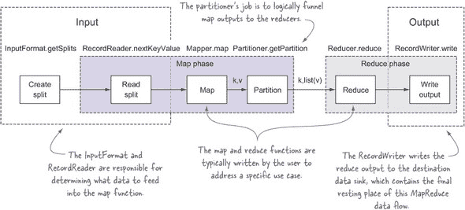

图 3.2 展示了仅映射作业的相同流程。在仅映射作业中，Map-Reduce 框架仍然使用`OutputFormat`和`RecordWriter`类直接将输出写入数据接收器。

##### 图 3.2\. 没有归约器的 MapReduce 中的输入和输出演员

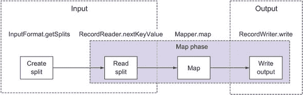

让我们遍历数据流并讨论各个演员的责任。在这个过程中，我们还将查看内置的`TextInputFormat`和`TextOutputFormat`类中的相关代码，以更好地理解概念。`TextInputFormat`和`TextOutputFormat`类读取和写入面向行的文本文件。

#### 3.1.1\. 数据输入

支持在 MapReduce 中进行数据输入的两个类是 `InputFormat` 和 `RecordReader`。`InputFormat` 类用于确定输入数据应该如何分区以供 map 任务使用，而 `RecordReader` 执行从输入读取数据。

##### InputFormat

在 MapReduce 中，每个作业都必须根据 `InputFormat` 抽象类中指定的合同定义其输入。`InputFormat` 实现者必须满足三个合同：他们描述了 map 输入键和值的类型信息，他们指定了如何对输入数据进行分区，并且指出了应该从源读取数据的 `RecordReader` 实例。图 3.3 展示了 `InputFormat` 类以及这三个合同是如何定义的。

##### 图 3.3\. 带注释的 InputFormat 类及其三个合同

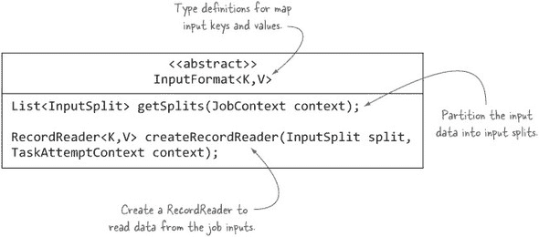

毫无疑问，最重要的合同是确定如何划分输入数据。在 MapReduce 术语中，这些划分被称为 *输入分割*。输入分割直接影响 map 并行性，因为每个分割由单个 map 任务处理。如果使用无法在单个数据源（如文件）上创建多个输入分割的 `InputFormat`，将会导致 map 阶段变慢，因为文件将按顺序处理。

`TextInputFormat` 类（查看源代码位于 [`mng.bz/h728`](http://mng.bz/h728)）为 `InputFormat` 类的 `createRecordReader` 方法提供了一个实现，但它将输入分割的计算委托给其父类 `FileInputFormat`。以下代码展示了 `TextInputFormat` 类的相关部分：

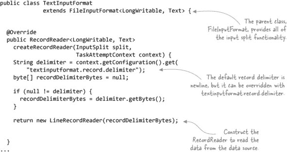

在 `FileInputFormat` 中的代码（源代码位于 [`mng.bz/CZB8`](http://mng.bz/CZB8)）用于确定输入分割，这部分代码稍微复杂一些。以下示例展示了 `getSplits` 方法的简化形式，以展示其主要元素：

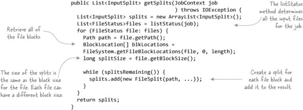

以下代码展示了如何指定 MapReduce 作业使用的 `InputFormat`：

```
job.setInputFormatClass(TextInputFormat.class);
```

##### RecordReader

你将在 map 任务中创建和使用 `RecordReader` 类来从输入分割中读取数据，并将每个记录以键/值对的形式提供给 mappers 使用。通常为每个输入分割创建一个任务，并且每个任务都有一个单独的 `RecordReader` 负责读取该输入分割的数据。图 3.4 展示了你必须实现的抽象方法。

##### 图 3.4\. 带注释的 RecordReader 类及其抽象方法

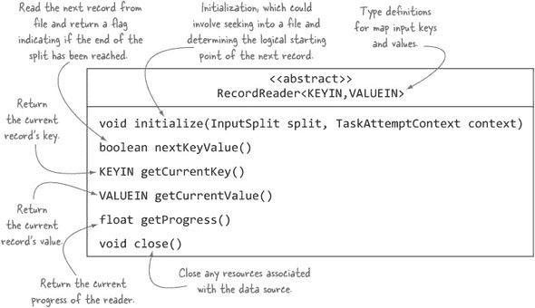

如前所述，`TextInputFormat`类创建一个`LineRecordReader`来从输入拆分中读取记录。`LineRecordReader`直接扩展了`RecordReader`类，并使用`LineReader`类从输入拆分中读取行。`LineRecordReader`使用文件中的字节偏移量作为 map 键，并使用行的内容作为 map 值。以下示例展示了`LineRecordReader`的简化版本（源代码见[`mng.bz/mYO7`](http://mng.bz/mYO7)）：

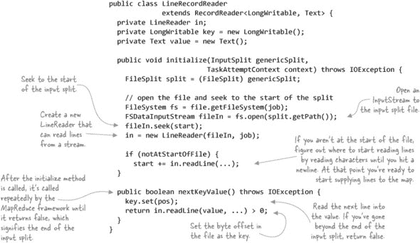

由于`LineReader`类很简单，我们将跳过那段代码。下一步是看看 MapReduce 如何支持数据输出。

#### 3.1.2\. 数据输出

MapReduce 使用类似的过程来支持输出和输入数据。必须存在两个类：一个`OutputFormat`和一个`RecordWriter`。`OutputFormat`执行一些基本的数据目标属性验证，而`RecordWriter`将每个 reducer 输出写入数据目标。

##### OutputFormat

就像`InputFormat`类一样，如图 3.5 所示的`OutputFormat`类定义了实现者必须满足的契约：检查与作业输出相关的信息，提供一个`RecordWriter`，并指定一个输出提交者，这允许在任务或作业成功后将写入分阶段并最终“永久化”。（输出提交将在 3.5.2 节中讨论。）

##### 图 3.5\. 注释的 OutputFormat 类

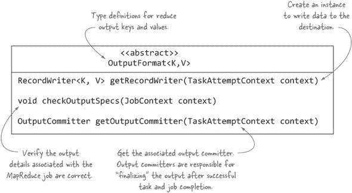

就像`TextInputFormat`一样，`TextOutputFormat`也扩展了一个基类`FileOutputFormat`，它负责一些复杂的物流，例如输出提交，我们将在本章后面讨论。现在，让我们看看`TextOutputFormat`执行的工作（源代码见[`mng.bz/lnR0`](http://mng.bz/lnR0)）：

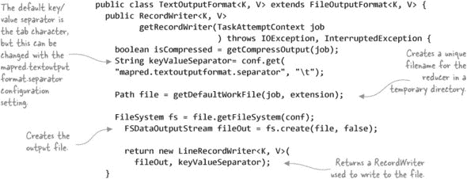

以下代码展示了如何指定 MapReduce 作业应使用的`OutputFormat`：

```
job.setOutputFormatClass(TextOutputFormat.class);
```

##### RecordWriter

你将使用`RecordWriter`将 reducer 输出写入目标数据目标。它是一个简单的类，如图 3.6 所示。

##### 图 3.6\. 注释的 RecordWriter 类概述

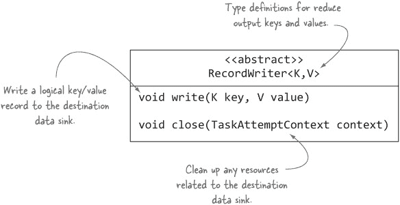

`TextOutputFormat`返回一个`LineRecordWriter`对象，它是`Text-OutputFormat`的内部类，用于执行文件写入。以下示例展示了该类的简化版本（源代码见[`mng.bz/lnR0`](http://mng.bz/lnR0)）：

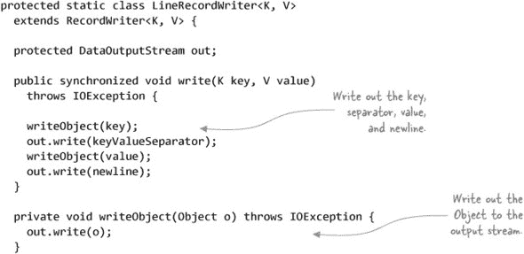

在 map 端，是`InputFormat`决定了执行多少个 map 任务，而在 reducer 端，任务的数量完全基于客户端设置的`mapred.reduce.tasks`值（如果没有设置，则从 mapred-site.xml 中获取值，如果该文件不存在于站点文件中，则从 mapred-default.xml 中获取值）。

现在你已经了解了在 Map-Reduce 中处理输入和输出数据所涉及的内容，现在是时候将这项知识应用到解决一些常见的数据序列化问题上了。在这个旅程的第一步，你需要学习如何处理常见的文件格式，如 XML。

### 3.2\. 处理常见的序列化格式

XML 和 JSON 是行业标准的数据交换格式。它们在技术行业中的普遍性体现在它们在数据存储和交换中的广泛采用。在本节中，我们将探讨如何在 MapReduce 中读取和写入这些数据格式。

#### 3.2.1\. XML

XML 自 1998 年以来作为一种机制存在，可以由机器和人类 alike 读取数据。它成为系统间数据交换的通用语言，并被许多标准采用，如 SOAP 和 RSS，它还被用作 Microsoft Office 等产品作为开放数据格式。

#### 技巧 8 MapReduce 和 XML

MapReduce 附带了一个与文本一起工作的`InputFormat`，但它没有附带支持 XML 的`InputFormat`。在 MapReduce 中并行处理单个 XML 文件是棘手的，因为 XML 在其数据格式中不包含同步标记.^([2])

> ² 同步标记通常是用于界定记录边界的二进制数据。它允许读者在文件中进行随机查找，并通过读取直到找到同步标记来确定下一个记录的开始位置。

##### 问题

你想在 MapReduce 中处理大型 XML 文件，并且能够并行地分割和处理它们。

##### 解决方案

Mahout 的`XMLInputFormat`可用于使用 MapReduce 在 HDFS 中处理 XML 文件。它读取由特定的 XML 开始和结束标签分隔的记录。这项技术还解释了如何在 MapReduce 输出中发出 XML。

##### 讨论

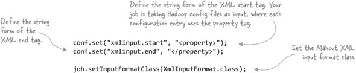

MapReduce 不包含对 XML 的内置支持，因此我们将转向另一个 Apache 项目——Mahout，一个机器学习系统，以提供 XML `InputFormat`。为了展示 XML `InputFormat`，你可以编写一个 MapReduce 作业，使用 Mahout 的 XML 输入格式从 Hadoop 的配置文件中读取属性名称和值。第一步是设置作业配置：

Mahout 的 XML 输入格式是基本的；你需要告诉它将在文件中搜索的确切开始和结束 XML 标签，并且文件使用以下方法分割（并提取记录）：

> **1**. 文件沿 HDFS 块边界分割成离散部分，以实现数据局部性。
> 
> **2**. 每个 map 任务在特定的输入分割上操作。map 任务定位到输入分割的开始，然后继续处理文件，直到遇到第一个`xmlinput.start`。
> 
> **3**. 在`xmlinput.start`和`xmlinput.end`之间的内容会重复发出，直到输入分割的末尾。

接下来，您需要编写一个 mapper 来消费 Mahout 的 XML 输入格式。XML 元素以`Text`形式提供，因此您需要使用 XML 解析器从 XML 中提取内容。³

> ³ GitHub 源代码：[`github.com/alexholmes/hiped2/blob/master/src/main/java/hip/ch3/xml/XMLMapReduceReader.java`](https://github.com/alexholmes/hiped2/blob/master/src/main/java/hip/ch3/xml/XMLMapReduceReader.java)。

##### 列表 3.1\. 使用 Java 的 STAX 解析器提取内容

```
public static class Map extends Mapper<LongWritable, Text,
    Text, Text> {

  @Override
  protected void map(LongWritable key, Text value,
                     Mapper.Context context)
      throws
      IOException, InterruptedException {
    String document = value.toString();
    System.out.println("'" + document + "'");
    try {
      XMLStreamReader reader =
          XMLInputFactory.newInstance().createXMLStreamReader(new
              ByteArrayInputStream(document.getBytes()));
      String propertyName = ";
      String propertyValue = ";
      String currentElement = ";
      while (reader.hasNext()) {
        int code = reader.next();
        switch (code) {
          case START_ELEMENT:
            currentElement = reader.getLocalName();
            break;
          case CHARACTERS:
            if (currentElement.equalsIgnoreCase("name")) {
              propertyName += reader.getText();
            } else if (currentElement.equalsIgnoreCase("value")) {
              propertyValue += reader.getText();
            }
            break;
        }
      }
      reader.close();
      context.write(propertyName.trim(), propertyValue.trim());
    } catch (Exception e) {
      log.error("Error processing '" + document + "'", e);
    }
  }
}
```

Map 被赋予一个`Text`实例，它包含起始和结束标签之间的数据字符串表示。在此代码中，您使用 Java 内置的 XML（StAX）解析器 API 提取每个属性的键和值，并将它们输出。

如果您运行 MapReduce 作业针对 Cloudera 的 core-site.xml，并使用 HDFS 的`cat`命令显示输出，您将看到以下内容：

```
$ hadoop fs -put $HADOOP_HOME/conf/core-site.xml core-site.xml

$ hip hip.ch3.xml.XMLMapReduceReader \
  --input core-site.xml \
  --output output

$ hadoop fs -cat output/part*
fs.default.name hdfs://localhost:8020
hadoop.tmp.dir    /usr/local/hadoop/tmp
...
```

此输出表明您已成功使用 MapReduce 将 XML 作为输入序列化格式进行处理。不仅如此，您还可以支持巨大的 XML 文件，因为输入格式支持分割 XML。

##### 写入 XML

成功读取 XML 后，下一个问题是如何写入 XML。在您的 reducer 中，在调用主 reduce 方法之前和之后发生回调，您可以使用这些回调来发射起始和结束标签，如下例所示。⁴

> ⁴ GitHub 源代码：[`github.com/alexholmes/hiped2/blob/master/src/main/java/hip/ch3/xml/XmlMapReduceWriter.java`](https://github.com/alexholmes/hiped2/blob/master/src/main/java/hip/ch3/xml/XmlMapReduceWriter.java)。

##### 列表 3.2\. 发射起始和结束标签的 reducer

![ch03ex02-0.jpg]

![ch03ex02-1.jpg]

这也可以嵌入到`OutputFormat`中，但我会把它留给你作为一个实验项目。编写`OutputFormat`类的介绍在第 3.5.1 节。⁷

##### Pig

如果您想在 Pig 中处理 XML，Piggy Bank 库⁵（一个有用的 Pig 代码的用户贡献库）包含一个`XMLLoader`。它的工作方式与这种技术类似，并捕获起始和结束标签之间的所有内容，将其作为 Pig 元组中的一个单独的字节数组字段提供。

> ⁵ Piggy Bank—用户定义的 Pig 函数：[`cwiki.apache.org/confluence/display/PIG/PiggyBank`](https://cwiki.apache.org/confluence/display/PIG/PiggyBank)。

##### Hive

目前，Hive 中还没有处理 XML 的方法。您必须编写一个自定义的 SerDe，我们将在第九章中介绍。⁶

> ⁶ SerDe 是序列化/反序列化（Serializer/Deserializer）的缩写；它是 Hive 读取和写入 HDFS 数据的机制。

##### 摘要

Mahout 的`XmlInputFormat`当然可以帮助你处理 XML。但它对起始和结束元素名称的精确字符串匹配很敏感。如果元素标签可以包含具有可变值的属性，或者如果元素的生成无法控制，可能会使用 XML 命名空间限定符，那么这种方法可能不适合你。还有可能的问题是，你指定的元素名称被用作子元素。

如果你控制着输入中的 XML 布局，这个练习可以通过每行一个 XML 元素来简化。这将允许你使用内置的基于文本的 Map-Reduce 输入格式（如`TextInputFormat`），这些格式将每一行视为一个记录，并分割以保留这种分隔。

另一个值得考虑的选项是预处理步骤，其中你可以将原始 XML 转换为每个 XML 元素一行，或者将其转换为完全不同的数据格式，如 SequenceFile 或 Avro，这两种格式都能为你解决分割问题。

现在你已经掌握了如何处理 XML，让我们来处理另一种流行的序列化格式，JSON。

#### 3.2.2\. JSON

JSON 与 XML 共享机器和人类可读的特性，自 2000 年代初以来就存在。它比 XML 更简洁，并且没有 XML 中可用的丰富类型和验证功能。

#### 技巧 9 MapReduce 和 JSON

想象一下你有一些代码，它从流式 REST 服务中下载 JSON 数据，并且每小时将一个文件写入 HDFS。下载的数据量很大，所以每个生成的文件大小都是多吉字节。

你被要求编写一个 MapReduce 作业，它可以接受这些大型 JSON 文件作为输入。这里的问题是两个部分：首先，MapReduce 没有与 JSON 一起工作的`InputFormat`；其次，如何分割 JSON？

图 3.7 展示了分割 JSON 的问题。想象一下 MapReduce 创建了一个如图所示的分割。在这个输入分割上运行的 map 任务将执行一个到输入分割开始的查找，然后需要确定下一个记录的开始。对于 JSON 和 XML 这样的文件格式，由于缺乏同步标记或任何其他标识记录开始的指示器，很难知道下一个记录的开始。

##### 图 3.7\. JSON 和多个输入分割的问题示例

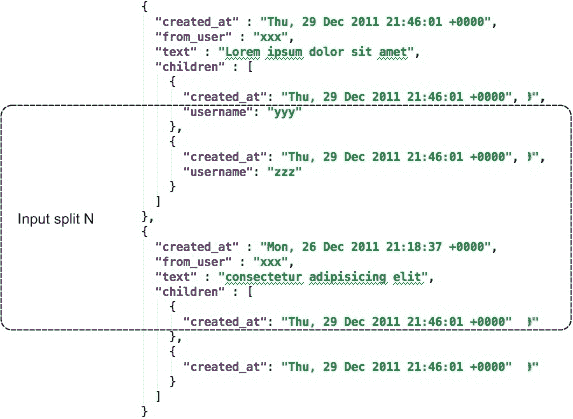

与 XML 这样的格式相比，JSON 更难以分割成不同的段，因为 JSON 没有标记（如 XML 中的结束标签）来表示记录的开始或结束。

##### 问题

你想在 MapReduce 中处理 JSON 输入，并确保输入 JSON 文件可以被分区以进行并发读取。

##### 解决方案

Elephant Bird 的 `LzoJsonInputFormat` 输入格式被用作创建一个用于处理 JSON 元素的输入格式类的基准。这种技术还讨论了使用我的开源项目来处理多行 JSON 的另一种方法。

##### 讨论

Elephant Bird ([`github.com/kevinweil/elephant-bird`](https://github.com/kevinweil/elephant-bird)) 是一个开源项目，它包含用于处理 LZOP 压缩的有用工具，它有一个 `LzoJsonInputFormat` 可以读取 JSON，尽管它要求输入文件是 LZOP 压缩的。你可以使用 Elephant Bird 代码作为模板来创建自己的 JSON `InputFormat`，该模板不需要 LZOP 压缩要求。

这个解决方案假设每个 JSON 记录都在单独的一行上。你的 `JsonRecordFormat` 简单，除了构建和返回一个 `JsonRecordFormat` 之外什么都不做，所以我们略过那段代码。`JsonRecordFormat` 向映射器发射 `LongWritable`、`MapWritable` 键/值对，其中 `MapWritable` 是 JSON 元素名称及其值的映射。

让我们看看这个 `RecordReader` 是如何工作的。它使用 `LineRecordReader`，这是一个内置的 MapReduce 读取器，为每一行输出一个记录。为了将行转换为 `MapWritable`，读取器使用以下方法：^([7])

> ⁷ GitHub 源代码：[`github.com/alexholmes/hiped2/blob/master/src/main/java/hip/ch3/json/JsonInputFormat.java`](https://github.com/alexholmes/hiped2/blob/master/src/main/java/hip/ch3/json/JsonInputFormat.java).

```
public static boolean decodeLineToJson(JSONParser parser, Text line,
                                       MapWritable value) {
  try {
    JSONObject jsonObj = (JSONObject)parser.parse(line.toString());
    for (Object key: jsonObj.keySet()) {
      Text mapKey = new Text(key.toString());
      Text mapValue = new Text();
      if (jsonObj.get(key) != null) {
        mapValue.set(jsonObj.get(key).toString());
      }

      value.put(mapKey, mapValue);
    }
    return true;
  } catch (ParseException e) {
    LOG.warn("Could not json-decode string: " + line, e);
    return false;
  } catch (NumberFormatException e) {
    LOG.warn("Could not parse field into number: " + line, e);
    return false;
  }
}
```

读者使用 json-simple 解析器 ([`code.google.com/p/json-simple/`](http://code.google.com/p/json-simple/)) 将行解析为 JSON 对象，然后遍历 JSON 对象中的键，并将它们及其相关值放入一个 `MapWritable` 中。映射器以 `LongWritable`、`MapWritable` 对的形式获得 JSON 数据，并相应地处理数据。

以下展示了一个示例 JSON 对象：

```
{
  "results" :
    [
      {
        "created_at" : "Thu, 29 Dec 2011 21:46:01 +0000",

        "from_user" : "grep_alex",
        "text" : "RT @kevinweil: After a lot of hard work by ..."
      },
      {
        "created_at" : "Mon, 26 Dec 2011 21:18:37 +0000",
        "from_user" : "grep_alex",
        "text" : "@miguno pull request has been merged, thanks again!"
      }
    ]
}
```

这种技术假设每行一个 JSON 对象。以下代码显示了你在本例中将要处理的 JSON 文件：

```
{"created_at" : "Thu, 29 Dec 2011 21:46:01 +0000","from_user" : ...
{"created_at" : "Mon, 26 Dec 2011 21:18:37 +0000","from_user" : ...
```

现在，将 JSON 文件复制到 HDFS 并运行你的 MapReduce 代码。MapReduce 代码将每个 JSON 键/值对写入输出：

```
$ hadoop fs -put test-data/json/tweets.json tweets.json

$ hip hip.ch3.json.JsonMapReduce \
    --input tweets.json \
    --output output

$ hadoop fs -cat output/part*
text         RT @kevinweil: After a lot of hard work by ...
from_user    grep_alex
created_at   Thu, 29 Dec 2011 21:46:01 +0000
text         @miguno pull request has been merged, thanks again!
from_user    grep_alex
created_at   Mon, 26 Dec 2011 21:18:37 +0000
```

##### 编写 JSON

一种类似于我们在 第 3.2.1 节 中查看的用于编写 XML 的方法也可以用来编写 JSON。

##### Pig

Elephant Bird 包含一个 `JsonLoader` 和一个 `LzoJsonLoader`，你可以使用它们在 Pig 中处理 JSON。这些加载器处理基于行的 JSON。每个 Pig 元组包含一行中每个 JSON 元素的一个 `chararray` 字段。

##### Hive

Hive 包含一个 `DelimitedJSONSerDe` 类，它可以序列化 JSON，但遗憾的是不能反序列化它，因此你不能使用这个 SerDe 将数据加载到 Hive 中。

##### 摘要

此解决方案假设 JSON 输入是按每行一个 JSON 对象的结构化。您将如何处理跨越多行的 JSON 对象？GitHub 上的一个实验性项目（^[8）在单个 JSON 文件上处理多个输入拆分。这种方法搜索特定的 JSON 成员并检索包含的对象。

> ⁸ 多行 JSON `InputFormat`：[`github.com/alexholmes/json-mapreduce`](https://github.com/alexholmes/json-mapreduce)。

您还可以查看一个名为 hive-json-serde 的 Google Code 项目（[`code.google.com/p/hive-json-serde/`](http://code.google.com/p/hive-json-serde/)），该项目可以支持序列化和反序列化。

如您所见，在 MapReduce 中使用 XML 和 JSON 是笨拙的，并且对数据的布局有严格的要求。MapReduce 中对这两种格式的支持也复杂且容易出错，因为它们都不自然地适合拆分。显然，您需要考虑具有内置拆分支持的替代文件格式。

下一步是查看更复杂的文件格式，这些格式更适合与 MapReduce 一起使用，例如 Avro 和 SequenceFile。

### 3.3\. 大数据序列化格式

当您处理标量或表格数据时，非结构化文本效果良好。半结构化文本格式，如 XML 和 JSON，可以模拟更复杂的数据结构，包括复合字段或层次数据。但是，当您处理大量大数据时，您将需要具有紧凑序列化形式、原生支持分区和具有模式演变功能的序列化格式。

在本节中，我们将比较与 MapReduce 配合使用效果最佳的数据序列化格式，并随后介绍如何使用它们与 MapReduce 结合。

#### 3.3.1\. 比较 SequenceFile、Protocol Buffers、Thrift 和 Avro

根据我的经验，在选择数据序列化格式时，以下特性很重要：

+   ***代码生成*** —一些序列化格式伴随着具有代码生成能力的库，这允许您生成丰富的对象，使您更容易与数据交互。生成的代码还提供了额外的类型安全优势，以确保您的消费者和生成器正在使用正确的数据类型。

+   ***模式演变*** —数据模型会随着时间的推移而演变，因此您的数据格式需要支持您修改数据模型的需求。模式演变允许您添加、修改，在某些情况下删除属性，同时为读取器和写入器提供向前和向后兼容性。

+   ***语言支持*** —您可能需要使用多种编程语言访问您的数据，并且主流语言需要支持数据格式。

+   ***透明压缩*** —考虑到你将处理的数据量，数据压缩非常重要，一个理想的数据格式能够在写入和读取时内部压缩和解压缩数据。如果数据格式不支持压缩，那么作为程序员，这将给你带来更大的麻烦，因为它意味着你将不得不将压缩和解压缩作为数据管道的一部分来管理（就像你在处理基于文本的文件格式时那样）。

+   ***可分割性*** —新的数据格式理解到支持多个并行读取器的重要性，这些读取器正在读取和处理大文件的不同部分。文件格式包含同步标记（从而支持读取器执行随机查找和扫描到下一个记录的开始）是至关重要的。

+   ***MapReduce 和 Hadoop 生态系统中的支持*** —你选择的数据格式必须在 MapReduce 和其他关键 Hadoop 生态系统项目中具有支持，例如 Hive。如果没有这种支持，你将负责编写代码使文件格式与这些系统一起工作。

表 3.1 比较了更流行的数据序列化框架，以了解它们如何相互比较。以下讨论提供了这些技术的更多背景信息。

##### 表 3.1\. 数据序列化框架特性比较

| 库 | 代码生成 | 架构演变 | 语言支持 | 透明压缩 | 可分割 | MapReduce 中原生支持 | Pig 和 Hive 支持 |
| --- | --- | --- | --- | --- | --- | --- | --- |
| SequenceFile | 否 | 否 | Java, Python | 是 | 是 | 是 | 是 |
| Protocol Buffers | 是（可选） | 是 | C++, Java, Python, Perl, Ruby | 否 | 否 | 否 | 否 |
| Thrift | 是（强制） | 是 | C, C++, Java, Python, Ruby, Perl | 否^([a]) | 否 | 否 | 否 |
| Avro | 是（可选） | 是 | C, C++, Java, Python, Ruby, C# | 是 | 是 | 是 | 是 |
| Parquet | 否 | 是 | Java, Python (C++ 计划在 2.0 中实现) | 是 | 是 | 是 | 是 |

> ^a Thrift 支持压缩，但不在 Java 库中。

让我们更详细地看看这些格式。

##### SequenceFile

SequenceFile 格式是为了与 MapReduce、Pig 和 Hive 一起使用而创建的，因此与所有这些工具都很好地集成。其缺点主要是缺乏代码生成和版本支持，以及有限的语言支持。

##### Protocol Buffers

Google 严重使用了 Protocol Buffers 格式来实现互操作性。其优势在于其版本支持和小型二进制格式。缺点包括它在 MapReduce（或任何第三方软件）中不支持由 Protocol Buffers 序列化生成的文件。然而，并非一切都已失去；我们将在第 3.3.3 节中探讨 Elephant Bird 如何在高级容器文件中使用 Protocol Buffers 序列化。

##### Thrift

Thrift 是在 Facebook 开发的数据序列化和 RPC 框架。它对其原生数据序列化格式在 MapReduce 中没有支持，但它可以支持不同的底层数据表示，包括 JSON 和各种二进制编码。Thrift 还包括一个具有各种类型服务器的 RPC 层，包括非阻塞实现。在本章中，我们将忽略 RPC 功能，专注于数据序列化。

##### Avro

Avro 格式是 Doug Cutting 为了解决 SequenceFile 的不足而创造的。

##### Parquet

Parquet 是一种具有丰富 Hadoop 系统支持的列式文件格式，并且与 Avro、Protocol Buffers 和 Thrift 等数据模型配合良好。Parquet 在 第 3.4 节 中有详细介绍。

根据某些评估标准，Avro 似乎是最适合作为 Hadoop 数据序列化框架的。由于与 Hadoop 的固有兼容性（它是为与 Hadoop 一起使用而设计的），SequenceFile 排名第二。

您可以在 [`github.com/eishay/jvm-serializers/wiki/`](https://github.com/eishay/jvm-serializers/wiki/) 上查看一个有用的 jvm-serializers 项目，该项目运行各种基准测试，以比较基于序列化和反序列化时间等项目的文件格式。它包含 Avro、Protocol Buffers 和 Thrift 的基准测试，以及许多其他框架。

在查看各种数据序列化框架的比较后，我们将用接下来的几节内容来介绍如何使用它们。我们将从查看 SequenceFile 开始。

#### 3.3.2. SequenceFile

由于 SequenceFile 是为与 MapReduce 一起使用而创建的，因此这种格式与 MapReduce、Pig 和 Hive 一起提供了最高级别的集成支持。SequenceFile 是一种可分割的二进制文件格式，以键/值对的形式存储数据。所有 SequenceFiles 都共享相同的头部格式，如图 3.8 图 所示。

##### 图 3.8. SequenceFile 头部格式

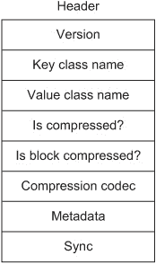

SequenceFiles 有三种类型，它们根据您应用的压缩方式而有所不同。此外，每种类型都有自己的相应 `Writer` 类。

##### 未压缩

未压缩 SequenceFiles 使用 `SequenceFile.Writer` 类编写。与压缩格式相比，这种格式没有优势，因为压缩通常可以减少您的存储占用，并且在读写方面更高效。文件格式如图 3.9 图 所示。

##### 图 3.9. 记录压缩和非压缩 SequenceFiles 的文件格式


##### 记录压缩

记录压缩 SequenceFiles 使用 `SequenceFile.RecordCompressWriter` 类编写。当记录被添加到 SequenceFile 中时，它会立即压缩并写入文件。这种方法的缺点是，与块压缩相比，您的压缩率会受到影响。这种文件格式与未压缩 SequenceFiles 的格式基本相同，如图 3.9 图 所示。

##### 块压缩

块压缩的 SequenceFiles 使用`SequenceFile.BlockCompressWriter`类编写。默认情况下，块大小与 HDFS 块大小相同，尽管这可以被覆盖。这种压缩的优势在于它更加激进；整个块被压缩，而不是在记录级别上进行压缩。数据只有在达到块大小时才会写入，此时整个块被压缩，从而实现良好的整体压缩。文件格式如图 3.10 所示。

##### 图 3.10\. 块压缩的 SequenceFile 格式


你只需要一个`Reader`类（`SequenceFile.Reader`）来读取所有三种类型的 SequenceFiles。即使是`Writer`也是抽象的，因为你可以调用`SequenceFile.createWriter`来选择首选格式，它返回一个基类，可以用于无论压缩与否的写入。

SequenceFiles 拥有一个可插拔的序列化框架。写入的键和值必须有一个相关的`org.apache.hadoop.io.serializer.Serializer`和`Deserializer`用于序列化和反序列化。Hadoop 自带四种序列化器：Avro、Java、Tether（用于包含在`TetherData`类中的二进制数据），以及`Writable`（默认序列化器）.^([9])

> ⁹ `Writable`是 Hadoop 中用于支持通用数据序列化的一个接口，它用于在 Hadoop 组件之间发送数据。Yahoo 在[`developer.yahoo.com/hadoop/tutorial/module5.html#writable`](http://developer.yahoo.com/hadoop/tutorial/module5.html#writable)有一个关于`Writable`的良好介绍。


##### 自定义 SequenceFile 序列化

如果你希望你的 SequenceFile 包含不是`Writable`或`Serializable`的对象，你需要实现自己的序列化器并将其注册。你可以通过更新 core-site.xml 并将自定义序列化实现的类名追加到`io.serializations`属性来注册它。


SequenceFiles 是可分割的，因为对于基于记录的文件，大约每 6 KiB（1 kibibyte = 1024 bytes）写入一个同步标记，而对于基于块的文件，在每个块之前写入。

现在我们来看看如何在 MapReduce 中使用 SequenceFiles。

#### 技巧 10 使用 SequenceFiles

当你需要在 MapReduce 中支持复杂的数据类型，包括非标量数据类型，如列表或字典时，处理文本可能会变得复杂。此外，如果 Map-Reduce 的数据局部性属性对你很重要，那么处理大型压缩文本文件需要一些额外的处理。使用如 SequenceFile 这样的文件格式可以克服这些挑战。

##### 问题

你想在 MapReduce 中使用一个结构化文件格式，可以用来建模复杂的数据结构，同时也支持压缩和可分割的输入。

##### 解决方案

这种技术探讨了如何从独立应用程序和 MapReduce 中使用 SequenceFile 文件格式。

##### 讨论

SequenceFile 格式与计算工具（如 MapReduce）提供了高级别的集成，并且还可以模拟复杂的数据结构。我们将探讨如何读取和写入 SequenceFiles，以及如何与 MapReduce、Pig 和 Hive 一起使用。

我们将使用股票数据来应用这项技术。与 SequenceFiles 一起使用的最常见序列化方法是`Writable`，因此你需要创建一个`Writable`来表示股票数据。编写复杂`Writable`的关键要素是扩展`Writable`类并定义序列化和反序列化方法，如下所示：^([10])

> ^([10]) GitHub 源代码：[`github.com/alexholmes/hiped2/blob/master/src/main/java/hip/ch3/StockPriceWritable.java`](https://github.com/alexholmes/hiped2/blob/master/src/main/java/hip/ch3/StockPriceWritable.java).

##### 列表 3.3\. 表示股票价格的`Writable`实现

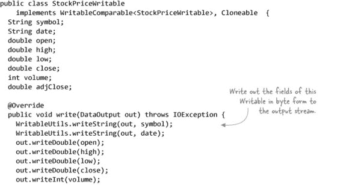

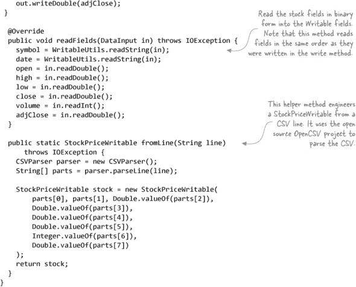

现在你有了你的`Writable`，你需要编写一些代码来创建一个 SequenceFile。你将从本地磁盘读取股票文件，创建`StockWritable`，并将其写入你的 SequenceFile，使用股票代码作为你的键：^([11])

> ^([11]) GitHub 源代码：[`github.com/alexholmes/hiped2/blob/master/src/main/java/hip/ch3/seqfile/writable/SequenceFileStockWriter.java`](https://github.com/alexholmes/hiped2/blob/master/src/main/java/hip/ch3/seqfile/writable/SequenceFileStockWriter.java).

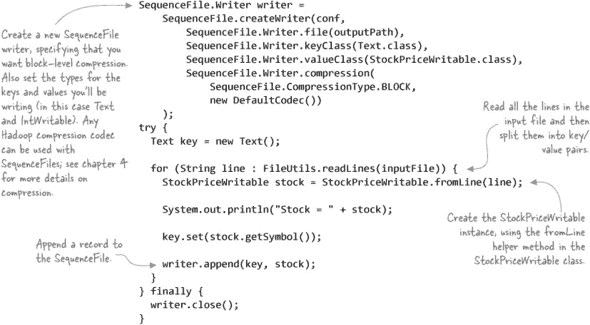

太好了！现在你该如何阅读使用你的作者创建的文件呢？^([12])

> ^([11]) GitHub 源代码：[`github.com/alexholmes/hiped2/blob/master/src/main/java/hip/ch3/seqfile/writable/SequenceFileStockReader.java`](https://github.com/alexholmes/hiped2/blob/master/src/main/java/hip/ch3/seqfile/writable/SequenceFileStockReader.java).

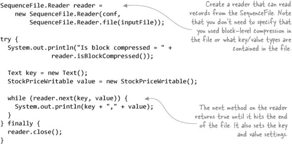

现在你需要通过编写和读取文件来证明它的工作：

```
$ cat test-data/stocks.txt
AAPL,2009-01-02,85.88,91.04,85.16,90.75,26643400,90.75
AAPL,2008-01-02,199.27,200.26,192.55,194.84,38542100,194.84
AAPL,2007-01-03,86.29,86.58,81.90,83.80,44225700,83.80
...
$ hip hip.ch3.seqfile.writable.SequenceFileStockWriter \
    --input  test-data/stocks.txt \
    --output stocks.seqfile

$ hip hip.ch3.seqfile.writable.SequenceFileStockReader \
    --input stocks.seqfile
AAPL,StockPriceWritable[symbol=AAPL,date=2009-01-02,open=85.88,...]
AAPL,StockPriceWritable[symbol=AAPL,date=2008-01-02,open=199.27,...]
AAPL,StockPriceWritable[symbol=AAPL,date=2007-01-03,open=86.29,...]
...
```

你会如何在 MapReduce 中处理这个 SequenceFile？幸运的是，`SequenceFileInputFormat`和`SequenceFileOutputFormat`与 MapReduce 很好地集成。记得在本章前面我们讨论过默认的 SequenceFile 序列化支持序列化`Writable`类吗？因为`Writable`是 MapReduce 中的原生数据格式，所以使用 SequenceFile 与 MapReduce 集成是完全透明的。看看你是否同意。以下代码展示了具有身份映射器和还原器的 MapReduce 作业：^([13]), ^([14])

> ^([13]) GitHub 源代码：[`github.com/alexholmes/hiped2/blob/master/src/main/java/hip/ch3/seqfile/writable/SequenceFileStockMapReduce.java`](https://github.com/alexholmes/hiped2/blob/master/src/main/java/hip/ch3/seqfile/writable/SequenceFileStockMapReduce.java).
> 
> ^（14）恒等函数是一个数学术语，用来表示返回其参数相同值的函数。在 MapReduce 中，这意味着相同的意思——map 恒等函数会发出它所提供的所有键/值对，就像 reducer 一样，没有任何转换或过滤。未显式设置 map 或 reduce 类的作业会导致 Hadoop 使用内置的恒等函数。

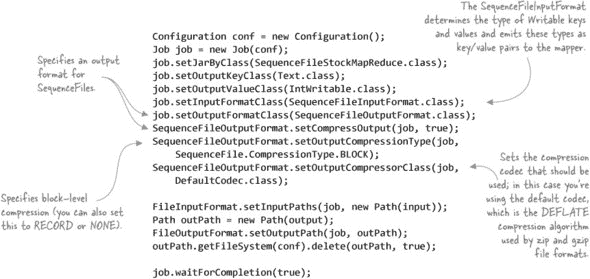

现在，你可以运行一个身份 MapReduce 作业，针对你在此技术中之前创建的股票 SequenceFile：

```
$ hip hip.ch3.seqfile.writable.SequenceFileStockMapReduce \
    --input stocks.seqfile \
    --output output
```

因为它所做的只是将输入回显到输出，所以你应该在两个文件中看到相同的内容。你可以通过读取作业输出文件来确保这一点。

首先，你如何验证输出是一个 SequenceFile？很简单，只需使用 `cat` 命令查看——SequenceFile 的前三个字节是 *SEQ*，然后是一个包含 SequenceFile 版本的第四个字节，接着是键和值类：


看起来不错。现在尝试使用你之前编写的 SequenceFile 读取器代码将其转储到标准输出：

```
$ hip hip.ch3.seqfile.writable.SequenceFileStockReader \
    --input output/part-r-00000
AAPL,StockPriceWritable[symbol=AAPL,date=2008-01-02,open=199.27,...]
AAPL,StockPriceWritable[symbol=AAPL,date=2007-01-03,open=86.29,...]
AAPL,StockPriceWritable[symbol=AAPL,date=2009-01-02,open=85.88,...]
...
```

这很简单。因为 SequenceFiles 是基于键/值的，并且 SequenceFiles 的默认序列化数据格式是 `Writable`，所以 SequenceFiles 的使用对你的 map 和 reduce 类是完全透明的。我们通过使用 Map-Reduce 内置的恒等 map 和 reduce 类，并将 SequenceFile 作为输入来演示这一点。你唯一需要做的工作是告诉 MapReduce 使用 SequenceFile 特定的输入和输出格式类，这些类是内置在 MapReduce 中的。

##### 在 Pig 中读取 SequenceFiles

通过编写自己的 `Writable`，你在 Pig 等非 MapReduce 工具上为自己增加了更多的工作。Pig 与 Hadoop 内置的标量 `Writable`，如 `Text` 和 `IntWritable`，配合得很好，但它不支持自定义 `Writable`。你需要编写自己的 `LoadFunc` 来支持 `StockPriceWritable`。这将很好地与 MapReduce 一起工作，但 Pig 的 `SequenceFileLoader` 不会与你的自定义 `Writable` 一起工作，这意味着你需要编写自己的 Pig 加载器来处理你的文件。附录中包含了安装 Pig 的详细信息。

Pig 的 `LoadFunc` 很简单，如下所示。（[15]）

> ^（15）GitHub 源代码：[`github.com/alexholmes/hiped2/blob/master/src/main/java/hip/ch3/seqfile/writable/SequenceFileStockLoader.java`](https://github.com/alexholmes/hiped2/blob/master/src/main/java/hip/ch3/seqfile/writable/SequenceFileStockLoader.java)。

##### 列表 3.4\. 将 `StockPriceWritable` 转换为 Pig 元组的 Pig 加载器函数

```
public class SequenceFileStockLoader extends FileInputLoadFunc {

  private SequenceFileRecordReader<Text, StockPriceWritable> reader;

  @Override
  public Tuple getNext() throws IOException {
    boolean next;
    try {
      next = reader.nextKeyValue();
    } catch (InterruptedException e) {
      throw new IOException(e);
    }

    if (!next) return null;

    Object value = reader.getCurrentValue();

    if (value == null) {
      return null;
    }
    if (!(value instanceof StockPriceWritable)) {
      return null;
    }
    StockPriceWritable w = (StockPriceWritable) value;

    return TupleFactory.getInstance().newTuple(Arrays.asList(
        w.getSymbol(), w.getDate(), w.getOpen(),
        w.getHigh(), w.getLow(), w.getClose(),
        w.getVolume(), w.getAdjClose()
    ));
  }

  @SuppressWarnings("unchecked")
  @Override
  public InputFormat getInputFormat() throws IOException {
    return new SequenceFileInputFormat<Text, StockPriceWritable>();
  }

  @SuppressWarnings("unchecked")
  @Override
  public void prepareToRead(RecordReader reader, PigSplit split)
      throws IOException {
    this.reader = (SequenceFileRecordReader) reader;
  }

  @Override
  public void setLocation(String location, Job job)
      throws IOException {
    FileInputFormat.setInputPaths(job, location);
  }
}
```

现在，你可以在 Pig 中尝试加载和转储股票 SequenceFile：

```
$ pig
grunt> REGISTER $HIP_HOME/*.jar;
grunt> REGISTER $HIP_HOME/lib/*.jar;
grunt> DEFINE SequenceFileStockLoader
              hip.ch3.seqfile.writable.SequenceFileStockLoader();
grunt> stocks = LOAD 'stocks.seqfile' USING SequenceFileStockLoader;
grunt> dump stocks;
(AAPL,2009-01-02,85.88,91.04,85.16,90.75,26643400,90.75)
(AAPL,2008-01-02,199.27,200.26,192.55,194.84,38542100,194.84)
(AAPL,2007-01-03,86.29,86.58,81.9,83.8,44225700,83.8)
(AAPL,2006-01-03,72.38,74.75,72.25,74.75,28829800,74.75)
(AAPL,2005-01-03,64.78,65.11,62.6,63.29,24714000,31.65)
...
```

##### Hive

Hive 包含对 SequenceFiles 的内置支持，但它有两个限制。首先，它忽略了每个记录的关键部分。其次，它默认只与 `Writable` 类型的 SequenceFile 值一起工作，并通过执行 `toString()` 将值转换为 `Text` 形式来支持它们。

在我们的例子中，你有一个自定义的 `Writable`，因此你必须编写一个 Hive SerDe，将你的 `Writable` 反序列化为 Hive 能够理解的形式。结果的数据定义语言（DDL）语句如下：^(16)

> ^(16) `StockWritableSerDe` 的代码在 GitHub 上，[`github.com/alexholmes/hiped2/blob/master/src/main/java/hip/ch3/StockWritableSerDe.java`](https://github.com/alexholmes/hiped2/blob/master/src/main/java/hip/ch3/StockWritableSerDe.java)。

```
$ export HADOOP_CLASSPATH=$HIP_HOME/hip-<version>.jar

$ hive

hive> CREATE TABLE stocks (
  symbol    string,
  dates      string,
  open      double,
  high      double,
  low       double,
  close     double,
  volume    int,
  adjClose  double
)
ROW FORMAT SERDE 'hip.ch3.StockWritableSerDe'
STORED AS SEQUENCEFILE;

hive> LOAD DATA INPATH 'stocks.seqfile' INTO TABLE stocks;

hive> select * from stocks;

AAPL 2009-01-02 85.88  91.04  85.16  90.75  26643400 90.75
AAPL 2008-01-02 199.27 200.26 192.55 194.84 38542100 194.84
AAPL 2007-01-03 86.29  86.58  81.9   83.8   44225700 83.8
AAPL 2006-01-03 72.38  74.75  72.25  74.75  28829800 74.75
AAPL 2005-01-03 64.78  65.11  62.6   63.29  24714000 31.65
...
```

我们将在第九章中更详细地介绍自定义 Hive SerDe 示例。章节 9。

##### 摘要

SequenceFiles 有用，因为它们解决了使用 MapReduce 时遇到的两个问题：它们是本地可分割的，并且它们还内置了对压缩的支持，这使得对用户来说是透明的。它们也适用于作为其他文件格式的容器，这些文件格式与 MapReduce 的集成不是很好。SequenceFiles 的痛点是它们缺乏多语言支持，这限制了可以与你的数据交互的工具范围。但如果你大部分数据都留在 HDFS 中，并且使用 MapReduce（或 Hive/Pig）进行处理，SequenceFiles 可能正是你所需要的。

对于 SequenceFiles 来说，另一个挑战是它们在与 `Writable`s 一起工作时缺乏模式演变——除非你在实现中构建它，否则对 `Writable` 的更改不会向前或向后兼容。这可以通过使用 Protocol Buffers 作为你的键/值类型来解决。

这种技术探讨了如何使用 SequenceFiles 与 `Writable`s，SequenceFile 知道如何在文件格式内对其进行编码和解码。那么，让 SequenceFiles 与除 `Writable`s 之外的数据一起工作呢？

#### 技巧 11 使用 SequenceFiles 编码 Protocol Buffers

`Writable`s 是 SequenceFiles 的一等公民，APIs 有特定的方法来读取和写入 `Writable` 实例，这在之前的技巧中已经看到。这并不意味着 SequenceFiles 限于与 `Writable`s 一起工作——实际上，只要你的数据类型有适合插入 Hadoop 序列化框架的序列化实现，它们就可以与任何数据类型一起工作。

Protocol Buffers 是一种复杂的数据格式，由 Google 开源；它提供了模式演变和高效的数据编码能力。（关于 Protocol Buffers 的更多细节请参阅第 3.3.3 节）。在本技巧中，你将实现 Protocol Buffers 序列化，并了解它如何允许你在 MapReduce 中使用本地的 Protocol Buffers 对象。

##### 问题

你想在 MapReduce 中处理 Protocol Buffers 数据。

##### 解决方案

编写一个 Protocol Buffers 序列化器，它使你能够在 SequenceFiles 中编码 Protocol Buffers 序列化数据。

##### 讨论

Hadoop 使用自己的序列化框架来序列化和反序列化数据，以提高性能。这个框架的一个例子是在洗牌阶段将映射输出写入磁盘。所有映射输出都必须有一个相应的 Hadoop 序列化类，该类知道如何将数据读取和写入流。`Writable`，是 MapReduce 中最常用的数据类型，有一个 `WritableSerialization` 类，它使用 `Writable` 接口上的 `readFields` 和 `writeFields` 方法来执行序列化。

SequenceFiles 使用相同的序列化框架在它们的键/值记录中序列化和反序列化数据，这就是为什么 SequenceFiles 可以直接支持 `Writable`。因此，将数据类型编码到 SequenceFile 中只是编写自己的 Hadoop 序列化实例的问题。

要使 Protocol Buffers 与 SequenceFiles 一起工作，你的第一步是编写自己的序列化类。每个序列化类都必须支持序列化和反序列化，所以让我们从序列化器开始，其任务是向输出流写入记录。

以下代码使用 `MessageLite` 类作为类型；它是所有生成的 Protocol Buffers 类的超类。`MessageLite` 接口提供了将 Protocol Buffers 写入输出流和从输入流读取它们的方法，正如你将在以下代码中看到的：^(17)。

> ^([17](https://github.com/alexholmes/hiped2/blob/master/src/main/java/hip/ch3/seqfile/protobuf/ProtobufSerialization.java)) GitHub 源代码：[`github.com/alexholmes/hiped2/blob/master/src/main/java/hip/ch3/seqfile/protobuf/ProtobufSerialization.java`](https://github.com/alexholmes/hiped2/blob/master/src/main/java/hip/ch3/seqfile/protobuf/ProtobufSerialization.java)。

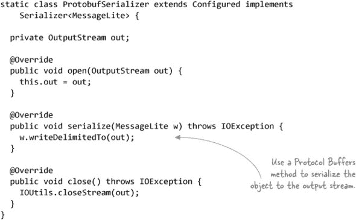

接下来是反序列化器，其任务是使用输入流填充 Protocol Buffers 对象。与序列化器相比，这里的事情要复杂一些，因为 Protocol Buffers 对象只能通过它们的构建器类来构建：^(18)。

> ^([18](https://github.com/alexholmes/hiped2/blob/master/src/main/java/hip/ch3/seqfile/protobuf/ProtobufSerialization.java)) GitHub 源代码：[`github.com/alexholmes/hiped2/blob/master/src/main/java/hip/ch3/seqfile/protobuf/ProtobufSerialization.java`](https://github.com/alexholmes/hiped2/blob/master/src/main/java/hip/ch3/seqfile/protobuf/ProtobufSerialization.java)。

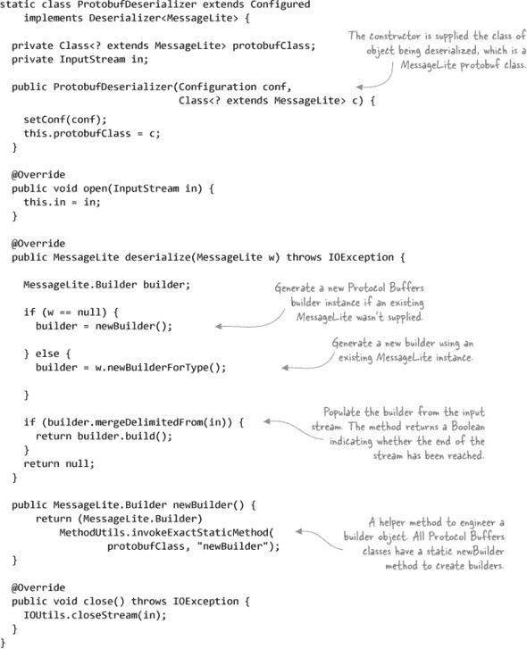

现在，你需要配置 Hadoop 的序列化框架以使用你的新序列化器。这是通过将你的新序列化器附加到 `io.serializations` 属性来完成的。通常，编写一个辅助方法来简化客户端的使用是很好的。以下示例显示了与 Hadoop 2 一起捆绑的标准序列化器，以及你刚刚创建的序列化类。`ProtobufSerialization` 的源代码在此处未显示，但它只是返回 `ProtobufSerializer` 和 `ProtobufDeserializer` 的实例：^(19)。

> ^([19]) GitHub 源代码：[`github.com/alexholmes/hiped2/blob/master/src/main/java/hip/ch3/seqfile/protobuf/ProtobufSerialization.java`](https://github.com/alexholmes/hiped2/blob/master/src/main/java/hip/ch3/seqfile/protobuf/ProtobufSerialization.java).

```
public static void register(Configuration conf) {
  String[] serializations = conf.getStrings("io.serializations");

  if (ArrayUtils.isEmpty(serializations)) {

    serializations = new String[] {
        WritableSerialization.class.getName(),
        AvroSpecificSerialization.class.getName(),
        AvroReflectSerialization.class.getName()
    };
  }

  serializations = (String[]) ArrayUtils.add(
    serializations,
    ProtobufSerialization.class.getName()
  );

  conf.setStrings("io.serializations", serializations);
}
```

接下来，你需要生成一个新的 Protocol Buffers 编码的 SequenceFile。这里的关键是，在使用 SequenceFile 编写器之前，你调用了`register`方法（如前所述）：^([20])

> ^([20]) GitHub 源代码：[`github.com/alexholmes/hiped2/blob/master/src/main/java/hip/ch3/seqfile/protobuf/SequenceFileProtobufWriter.java`](https://github.com/alexholmes/hiped2/blob/master/src/main/java/hip/ch3/seqfile/protobuf/SequenceFileProtobufWriter.java).

```
Configuration conf = super.getConf();

ProtobufSerialization.register(conf);

SequenceFile.Writer writer =
    SequenceFile.createWriter(conf,
        SequenceFile.Writer.file(outputPath),
        SequenceFile.Writer.keyClass(Text.class),
        SequenceFile.Writer.valueClass(Stock.class),
        SequenceFile.Writer.compression(
            SequenceFile.CompressionType.BLOCK,
            new DefaultCodec())
    );

Text key = new Text();

for (Stock stock : StockUtils.fromCsvFile(inputFile)) {
  key.set(stock.getSymbol());
  writer.append(key, stock);
}
```

接下来是 MapReduce 代码。你新序列化器的优点在于 map 和 reduce 类可以直接与 Protocol Buffers 对象一起工作。再次强调，这里的关键是你正在配置作业以使 Protocol Buffers 序列化器可用。在下面的示例中，你使用一个身份函数来演示当在 SequenceFiles 中编码时，Protocol Buffers 对象可以作为 MapReduce 中的第一类公民使用：^([21])

> ^([21]) GitHub 源代码：[`github.com/alexholmes/hiped2/blob/master/src/main/java/hip/ch3/seqfile/protobuf/SequenceFileProtobufMapReduce.java`](https://github.com/alexholmes/hiped2/blob/master/src/main/java/hip/ch3/seqfile/protobuf/SequenceFileProtobufMapReduce.java).

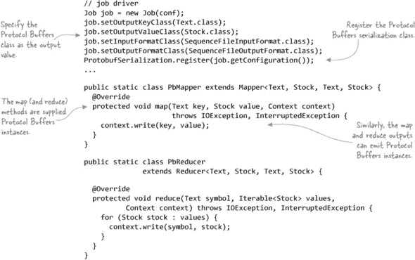

现在，你可以编写一个包含 Protocol Buffers 值的 SequenceFile，在数据上运行一个身份 MapReduce 作业，然后转储作业输出的内容：

```
$ hip hip.ch3.seqfile.protobuf.SequenceFileProtobufWriter \
    --input test-data/stocks.txt \
    --output stocks.pb

$ hip hip.ch3.seqfile.protobuf.SequenceFileProtobufMapReduce \
    --input stocks.pb \
    --output output

$ hip hip.ch3.seqfile.protobuf.SequenceFileProtobufReader \
    --input output/part-r-00000
AAPL,symbol: "AAPL"
date: "2008-01-02"
open: 199.27
...
```

接下来，我们将探讨将 Protocol Buffers 集成到 MapReduce 中的其他方法。

#### 3.3.3. Protocol Buffers

Google 开发者发明了 Protocol Buffers，以帮助他们以紧凑和高效的方式在多种语言编写的服务之间交换数据。现在，Protocol Buffers 是 Google 的事实上的数据格式——在 Google 中，有超过 48,000 种不同的消息类型定义在超过 12,000 个.proto 文件中.^([22])

> ^([22]) 从 Google 的 Protocol Buffers 开发者指南中获取的 Protocol Buffers 使用统计信息：[`code.google.com/apis/protocolbuffers/docs/overview.html`](http://code.google.com/apis/protocolbuffers/docs/overview.html).

自 2008 年以来，有一个工单的目标是在 MapReduce 中添加对 Protocol Buffers 的原生支持.^([23]) 因此，你需要转向在 Hadoop 中处理 Protocol Buffers 的替代方法。之前的技术介绍了一种可以使用的方法，即在 SequenceFiles 中编码 Protocol Buffers。其他选项包括使用 Elephant Bird^([24])或 Avro，它们通过将 Protocol Buffers 包装在其自己的文件格式中来支持 Protocol Buffers。最终，这些都是权宜之计，直到我们在 Hadoop 中得到对 Protocol Buffers 的全面支持。

> ^（23）参见 [`issues.apache.org/jira/browse/MAPREDUCE-377`](https://issues.apache.org/jira/browse/MAPREDUCE-377)。
> 
> ^（24）使用 Elephant Bird 意味着你必须使用 LZOP；表面上，可以推导出他们类的一个版本并移除 LZOP 依赖，但如果你还没有使用 LZOP，那么可能值得在其他地方寻找。

你有几种方式可以在 Hadoop 中使用 Protocol Buffers：

+   你可以在 SequenceFiles 中以二进制形式序列化 Protocol Buffers 对象，就像在先前的技术中展示的那样。

+   Elephant Bird ([`github.com/kevinweil/elephant-bird`](https://github.com/kevinweil/elephant-bird)) 是 Twitter 中的一个开源项目，支持他们自己的二进制文件格式中的 Protocol Buffers。

+   Parquet，一种列式文件格式，在第 3.4 节中介绍，支持 Protocol Buffers 对象模型，并允许你有效地将 Protocol Buffers 写入和读取到列式形式。

在这些选项中，Parquet 是推荐与 Protocol Buffers 一起工作的方式——它不仅允许你以原生方式与 Protocol Buffers 一起工作，而且还打开了可以与你的数据一起工作的工具数量（由于 Parquet 的广泛 Hadoop 工具支持）。本章对 Parquet 的介绍包括如何使用 Avro 与 Parquet 一起使用，以及 Parquet 可以以类似的方式支持 Protocol Buffers。

Thrift 是另一种数据格式，与 Protocol Buffers 一样，它没有与 MapReduce 的开箱即用支持。同样，你必须依赖其他工具在 Hadoop 中处理 Thrift 数据，正如你将在下一节中发现的那样。

#### 3.3.4. Thrift

Facebook 创建了 Thrift 来帮助提高数据表示和传输的效率。Facebook 使用 Thrift 用于包括搜索、日志记录和其广告平台在内的多个应用程序。

与 Protocol Buffers 一起工作的相同三个选项也适用于 Thrift，并且再次推荐使用 Parquet 作为文件格式。前往 Parquet 的章节（第 3.4 节），了解更多关于 Parquet 如何与这些不同的数据模型集成的信息。

让我们来看看我们所有选项中最有可能是最强大的数据序列化格式，那就是 Avro。

#### 3.3.5. Avro

Doug Cutting 创建了 Avro，一个数据序列化和 RPC 库，以帮助改善 MapReduce 中的数据交换、互操作性和版本控制。Avro 使用一种紧凑的二进制数据格式——你可以选择压缩——这导致快速序列化时间。尽管它有类似于 Protocol Buffers 的模式概念，但 Avro 在 Protocol Buffers 之上进行了改进，因为它的代码生成是可选的，并且它将模式嵌入到容器文件格式中，允许动态发现和数据交互。Avro 有一种使用通用数据类型（例如，在 第四章 中可以看到的示例）与模式数据一起工作的机制。

Avro 文件格式如图 3.11 所示。模式作为头部的一部分进行序列化，这使得反序列化变得简单，并放宽了对用户必须在外部维护和访问与 Avro 数据文件交互的模式方面的限制。每个数据块包含多个 Avro 记录，默认大小为 16 KB。

##### 图 3.11\. Avro 容器文件格式

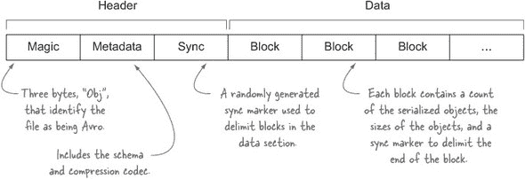

数据序列化的圣杯支持代码生成、版本控制和压缩，并且与 MapReduce 有高度集成。同样重要的是模式演变，这也是为什么 Hadoop SequenceFiles 不吸引人的原因——它们不支持模式或任何形式的数据演变。

在本节中，你将了解 Avro 的模式和代码生成能力、如何读取和写入 Avro 容器文件，以及 Avro 如何与 MapReduce 集成的各种方式。最后，我们还将探讨 Avro 在 Hive 和 Pig 中的支持。

让我们通过查看 Avro 的模式和代码生成来开始吧。

#### 技巧 12 Avro 的模式和代码生成

Avro 有通用数据和具体数据的概念：

+   *通用数据* 允许你在不了解模式具体信息的情况下以低级别处理数据。

+   *具体数据* 允许你使用代码生成的 Avro 原语与 Avro 一起工作，这支持了一种简单且类型安全的处理 Avro 数据的方法。

这种技术探讨了如何在 Avro 中处理具体数据。

##### 问题

你想定义一个 Avro 模式并生成代码，以便在 Java 中处理你的 Avro 记录。

##### 解决方案

以 JSON 格式编写你的模式，然后使用 Avro 工具生成丰富的 API 以与你的数据交互。

##### 讨论

你可以使用两种方式之一使用 Avro：要么使用代码生成的类，要么使用其通用类。在本技术中，我们将使用代码生成的类，但你可以在第四章的第 29 个技巧中看到 Avro 通用记录的使用示例。章节链接.

| |
| --- |

##### 获取 Avro

附录中包含如何获取 Avro 的说明。

| |
| --- |

在代码生成方法中，一切从模式开始。第一步是创建一个 Avro 模式来表示股票数据中的一个条目：^([25])

> ²⁵ GitHub 源代码：[`github.com/alexholmes/hiped2/blob/master/src/main/java/hip/ch3/avro/stock.avsc`](https://github.com/alexholmes/hiped2/blob/master/src/main/java/hip/ch3/avro/stock.avsc).

```
{
  "name": "Stock",
  "type": "record",
  "namespace": "hip.ch3.avro.gen",
  "fields": [
      {"name": "symbol",    "type": "string"},
      {"name": "date",      "type": "string"},
      {"name": "open",      "type": "double"},
      {"name": "high",      "type": "double"},
      {"name": "low",       "type": "double"},
      {"name": "close",     "type": "double"},
      {"name": "volume",    "type": "int"},
      {"name": "adjClose",  "type": "double"}
  ]
}
```

Avro 支持对模式数据和 RPC 消息（本书未涵盖）进行代码生成。要为模式生成 Java 代码，请使用以下 Avro 工具 JAR：

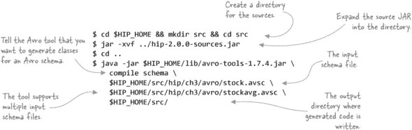

生成的代码将被放入 `hip.ch3.avro.gen` 包中。现在你已经生成了代码，如何使用它来读取和写入 Avro 容器文件？^([26])

> ²⁶ GitHub 源代码：[`github.com/alexholmes/hiped2/blob/master/src/main/java/hip/ch3/avro/AvroStockFileWrite.java`](https://github.com/alexholmes/hiped2/blob/master/src/main/java/hip/ch3/avro/AvroStockFileWrite.java).

##### 列表 3.5\. 从 MapReduce 外部写入 Avro 文件

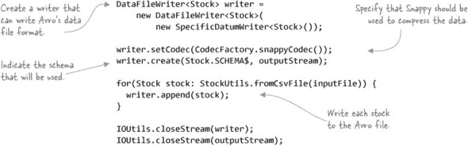

如你所见，你可以指定用于压缩数据的压缩编解码器。在这个例子中，你使用的是 Snappy，正如第四章中所示，这是读写速度最快的编解码器。

以下代码示例显示了如何从输入文件的一行中序列化一个`Stock`对象。正如你所见，生成的`Stock`类是一个 POJO，包含许多 setter（以及相应的 getter）：

```
public static Stock fromCsv(String line) throws IOException {

  String parts[] = parser.parseLine(line);
  Stock stock = new Stock();

  stock.setSymbol(parts[0]);
  stock.setDate(parts[1]);
  stock.setOpen(Double.valueOf(parts[2]));
  stock.setHigh(Double.valueOf(parts[3]));
  stock.setLow(Double.valueOf(parts[4]));
  stock.setClose(Double.valueOf(parts[5]));
  stock.setVolume(Integer.valueOf(parts[6]));
  stock.setAdjClose(Double.valueOf(parts[7]));

  return stock;
}
```

现在，关于读取你刚刚写入的文件呢？^([27])

> ²⁷ GitHub 源代码：[`github.com/alexholmes/hiped2/blob/master/src/main/java/hip/ch3/avro/AvroStockFileRead.java`](https://github.com/alexholmes/hiped2/blob/master/src/main/java/hip/ch3/avro/AvroStockFileRead.java).

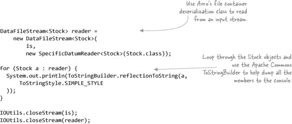

继续执行这个写入器和读取器对：

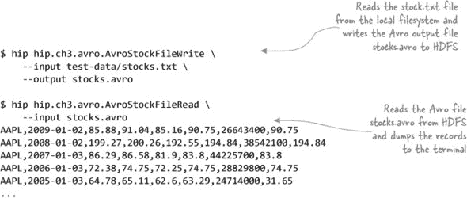

Avro 附带了一些工具，可以轻松检查 Avro 文件的内容。要查看 Avro 文件的内容作为 JSON，只需运行此命令：

```
$ java -jar $HIP_HOME/lib/avro-tools-1.7.4.jar tojson stocks.avro
{"symbol":"AAPL","date":"2009-01-02","open":85.88,"high":91.04,...
{"symbol":"AAPL","date":"2008-01-02","open":199.27,"high":200.26,...
{"symbol":"AAPL","date":"2007-01-03","open":86.29,"high":86.58,...
...
```

这假设文件存在于本地文件系统中。同样，你可以使用以下命令获取 Avro 文件的 JSON 表示：

```
$ java -jar $HIP_HOME/lib/avro-tools-1.7.4.jar getschema stocks.avro
{
  "type" : "record",
  "name" : "Stock",
  "namespace" : "hip.ch3.avro.gen",
  "fields" : [ {
    "name" : "symbol",
    "type" : "string"
  }, {
    "name" : "date",
    "type" : "string"
  }, {
    "name" : "open",

    "type" : "double"
  }, {
    "name" : "high",
    "type" : "double"
  }, {
    "name" : "low",
    "type" : "double"
  }, {
    "name" : "close",
    "type" : "double"
  }, {
    "name" : "volume",
    "type" : "int"
  }, {
    "name" : "adjClose",
    "type" : "double"
  } ]
}
```

你可以不使用任何选项运行 Avro 工具，以查看你可以使用的所有工具：

```
$ java -jar $HIP_HOME/lib/avro-tools-1.7.4.jar
      compile  Generates Java code for the given schema.
       concat  Concatenates avro files without re-compressing.
   fragtojson  Renders a binary-encoded Avro datum as JSON.
     fromjson  Reads JSON records and writes an Avro data file.
     fromtext  Imports a text file into an avro data file.
      getmeta  Prints out the metadata of an Avro data file.
    getschema  Prints out schema of an Avro data file.
          idl  Generates a JSON schema from an Avro IDL file
       induce  Induce schema/protocol from Java class/interface
               via reflection.
   jsontofrag  Renders a JSON-encoded Avro datum as binary.
      recodec  Alters the codec of a data file.
  rpcprotocol  Output the protocol of a RPC service
   rpcreceive  Opens an RPC Server and listens for one message.
      rpcsend  Sends a single RPC message.
       tether  Run a tethered mapreduce job.
       tojson  Dumps an Avro data file as JSON, one record per line.
       totext  Converts an Avro data file to a text file.
  trevni_meta  Dumps a Trevni file's metadata as JSON.
trevni_random  Create a Trevni file filled with random instances
               of a schema.
trevni_tojson  Dumps a Trevni file as JSON.
```

`tojson`工具的一个缺点是它不支持在 HDFS 中读取数据。因此，我在本书的代码中捆绑了一个名为 AvroDump 的实用程序，它可以导出 Avro 数据在 HDFS 中的文本表示，我们将很快使用它来检查 Avro MapReduce 作业的输出：

```
$ hip hip.util.AvroDump --file stocks.avro
```

此实用程序支持多个文件（它们需要是 CSV 分隔的）和通配符匹配，因此你可以使用通配符。以下示例显示了如何将 MapReduce 作业生成的 Avro 输出内容导出到名为 mr-output-dir 的目录中：

```
$ hip hip.util.AvroDump --file mr-output-dir/part*
```

让我们看看 Avro 如何与 MapReduce 集成。

#### 技巧 13 在 MapReduce 中选择适当的 Avro 使用方式

Avro 支持在 MapReduce 中处理你的 Avro 数据的方式不止一种。这项技术列举了你可以使用数据的不同方式，并提供了关于在何种情况下应采用哪种方法的指导。

##### 问题

你想在 MapReduce 作业中使用 Avro，但不确定应该选择哪种可用的集成选项。

##### 解决方案

了解每个集成选项的更多信息，并选择最适合你用例的一个。

##### 讨论

你可以在 MapReduce 中使用 Avro 的三种方式，每种方式的具体使用方法将在接下来的技巧中讨论。这些是三种方法：

+   ***混合模式*** —当你想在作业中混合 Avro 数据和非 Avro 数据时适用

+   ***基于记录的*** —当数据以非键/值方式提供时很有用

+   **基于键/值** — 当你的数据必须符合特定模型时

让我们更详细地介绍每种方法。

##### 混合模式

这种用例适用于以下任一条件成立的情况：

+   你的 mapper 输入数据不是 Avro 格式。

+   你不希望在 mapper 和 reducer 之间使用 Avro 发射中间数据。

+   你的作业输出数据不是 Avro 格式。

在任何这些情况下，Avro mapper 和 reducer 类都不会帮助你，因为它们的设计假设 Avro 数据在 MapReduce 作业中端到端流动。在这种情况下，你将想要使用常规的 MapReduce mapper 和 reducer 类，并以一种允许你仍然处理 Avro 数据的方式构建你的作业。

##### 基于记录

Avro 数据是基于记录的，与基于键/值（key/value）的 MapReduce 相比，这会导致阻抗不匹配。为了支持 Avro 的基于记录的根源，Avro 随带了一个 mapper 类，它不是基于键/值的，而是只向派生类提供一个记录。

##### 基于键/值

如果你的 Avro 数据内部遵循键/值结构，你可以使用一些 Avro 提供的 mapper 类，这些类将转换你的 Avro 记录，并以键/值形式将它们提供给 mapper。使用这种方法，你将限于具有“键”和“值”元素的架构。

##### 摘要

选择与 Avro 集成的正确级别取决于你的输入和输出，以及你如何在 Avro 内部处理数据。这项技术探讨了三种与 Avro 集成的途径，以便你可以为你的用例选择正确的方法。在以下技术中，我们将探讨如何在 MapReduce 作业中使用这些集成方法。

#### 技术第十四章：在 MapReduce 中混合 Avro 和非 Avro 数据

在 MapReduce 中，这种级别的 Avro 集成适用于你有非 Avro 输入并生成 Avro 输出，或反之亦然的情况，在这种情况下，Avro mapper 和 reducer 类不适用。在这项技术中，我们将探讨如何以混合模式与 Avro 一起工作。

##### 问题

你想在 MapReduce 作业中使用 Avro 的混合模式，而 Avro 随带的 mapper 和 reducer 类不支持这种模式。

##### 解决方案

使用低级方法设置你的作业，并使用常规 Hadoop mapper 和 reducer 类通过 Map-Reduce 作业驱动 Avro 数据。

##### 讨论

Avro 随带了一些 mapper 和 reducer 类，你可以对它们进行子类化以处理 Avro。在你想让你的 mapper 和 reducer 交换 Avro 对象的情况下，它们很有用。但是，如果你没有在 map 和 reduce 任务之间传递 Avro 对象的要求，你最好直接使用 Avro 输入和输出格式类，正如你将在以下代码中看到的那样，它产生所有开盘价值的平均值。

我们首先来看一下作业配置。你的任务是消费股票数据并生成股票平均值，这些数据都将以 Avro 格式输出.^([28]) 要完成这个任务，你需要设置包含两个模式信息的作业配置。你还需要指定 Avro 的输入和输出格式类:^([29])

> ²⁸ 尽管这项技术是关于在你的作业中将 Avro 和非 Avro 数据混合在一起，但我展示了在整个作业中使用 Avro，这样你可以选择你希望集成到作业中的哪个方面。例如，如果你有文本输入和 Avro 输出，你会使用一个常规的`TextInputFormat`，并设置 Avro 输出格式。
> 
> ²⁹ GitHub 源代码：[`github.com/alexholmes/hiped2/blob/master/src/main/java/hip/ch3/avro/AvroMixedMapReduce.java`](https://github.com/alexholmes/hiped2/blob/master/src/main/java/hip/ch3/avro/AvroMixedMapReduce.java).

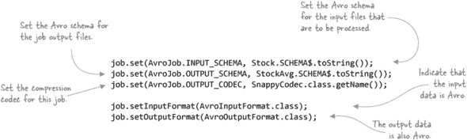

接下来是`Map`类。整个 Avro 记录作为输入键提供给你的映射函数，因为 Avro 支持记录，而不是键/值对（尽管，如你稍后所见，Avro 确实有一种方式可以通过键/值对提供数据给你的映射函数，如果你的 Avro 模式中有名为`key`和`value`的字段）。从实现的角度来看，你的`map`函数从股票记录中提取必要的字段并将它们以股票符号和开盘价作为键/值对的形式输出到 reducer:^([30])

> ³⁰ GitHub 源代码：[`github.com/alexholmes/hiped2/blob/master/src/main/java/hip/ch3/avro/AvroMixedMapReduce.java`](https://github.com/alexholmes/hiped2/blob/master/src/main/java/hip/ch3/avro/AvroMixedMapReduce.java).

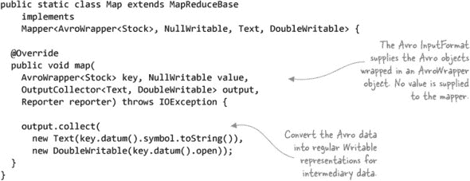


##### 为什么使用“旧”的 MapReduce API？

你可能已经注意到，这个技术示例使用了较旧的`org.apache.hadoop.mapred` API。这是因为在这个技术中使用的`AvroInputFormat`和`AvroOutputFormat`类只支持旧 API。


最后，reduce 函数将每个股票的所有股票价格加在一起并输出平均价格:^([31])

> ³¹ GitHub 源代码：[`github.com/alexholmes/hiped2/blob/master/src/main/java/hip/ch3/avro/AvroMixedMapReduce.java`](https://github.com/alexholmes/hiped2/blob/master/src/main/java/hip/ch3/avro/AvroMixedMapReduce.java).

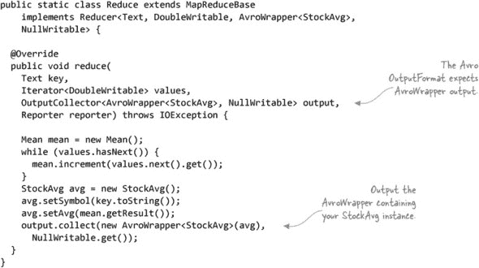

你可以按照以下方式运行 MapReduce 代码：

```
$ hip hip.ch3.avro.AvroMixedMapReduce \
    --input stocks.avro \
    --output output
```

你的 MapReduce 作业正在输出与作业输入不同的 Avro 对象（`StockAvg`）。你可以通过编写一些代码（未列出）来转储你的 Avro 对象来验证作业是否生成了你预期的输出：

```
$ hip hip.util.AvroDump --file output/part*
{"symbol": "AAPL", "avg": 68.631}
{"symbol": "CSCO", "avg": 31.147999999999996}
{"symbol": "GOOG", "avg": 417.47799999999995}
{"symbol": "MSFT", "avg": 44.63100000000001}
{"symbol": "YHOO", "avg": 69.333}
```

##### 摘要

这种技术在以下情况下很有用：你不想在 Avro 格式中保留中间映射输出，或者你有非 Avro 输入或输出。接下来，我们将探讨在 MapReduce 中使用 Avro 原生方式处理数据。

#### 技巧 15 在 MapReduce 中使用 Avro 记录

与 SequenceFile 不同，Avro 不是一个本地的键/值序列化格式，因此它可能需要一些调整才能与 MapReduce 一起工作。在这个技术中，你将检查特定的 Avro mapper 和 reducer 类，这些类提供了一个基于记录的接口，你可以用它来输入和输出数据。

##### 问题

你想在 MapReduce 作业中从头到尾使用 Avro，并且你还希望以记录形式与你的输入和输出数据交互。

##### 解决方案

扩展`AvroMapper`和`AvroReducer`类以实现你的 MapReduce 作业。

##### 讨论

Avro 提供了两个类，它们抽象了 MapReduce 的键/值特性，而是暴露了一个基于记录的 API。在这个技术中，你将实现与先前技术相同的 MapReduce 作业（计算每个股票代码的平均开盘价），并在整个作业中使用 Avro。

首先，让我们看看`Mapper`类，它将扩展`AvroMapper`：^([32])

> ³² GitHub 源代码：[`github.com/alexholmes/hiped2/blob/master/src/main/java/hip/ch3/avro/AvroRecordMapReduce.java`](https://github.com/alexholmes/hiped2/blob/master/src/main/java/hip/ch3/avro/AvroRecordMapReduce.java).

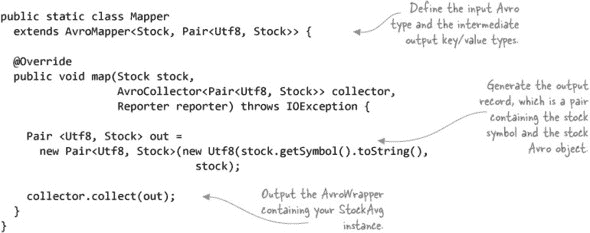

首先，要注意的是，在类定义中定义了两种类型，而不是 MapReduce 中常见的四种。`AvroMapper`抽象了 mapper 输入和输出的键/值特性，用单一类型替换了每个特性。

如果你有一个只映射的作业，你将定义的类型将是输入和输出类型。但是，如果你正在运行一个完整的 MapReduce 作业，你需要使用`Pair`类，这样你就可以定义映射输出键/值对。`Pair`类要求键和值部分存在 Avro 模式，这就是为什么使用`Utf8`类而不是直接的 Java 字符串。

现在让我们看看 AvroReducer 的实现。这次你需要定义三种类型——映射输出键和值类型，以及减少输出类型:^([33])

> ³³ GitHub 源代码：[`github.com/alexholmes/hiped2/blob/master/src/main/java/hip/ch3/avro/AvroRecordMapReduce.java`](https://github.com/alexholmes/hiped2/blob/master/src/main/java/hip/ch3/avro/AvroRecordMapReduce.java).

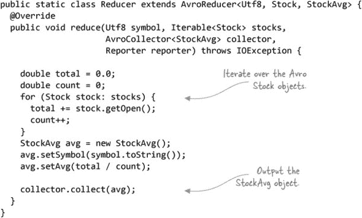

现在你可以一起在驱动程序中配置它。在这里，你将定义输入和输出类型以及所需的输出压缩（如果有）:^([34])

> ³⁴ GitHub 源代码：[`github.com/alexholmes/hiped2/blob/master/src/main/java/hip/ch3/avro/AvroRecordMapReduce.java`](https://github.com/alexholmes/hiped2/blob/master/src/main/java/hip/ch3/avro/AvroRecordMapReduce.java).

```
AvroJob.setInputSchema(job, Stock.SCHEMA$);
AvroJob.setMapOutputSchema(job,
  Pair.getPairSchema(Schema.create(Schema.Type.STRING), Stock.SCHEMA$));
AvroJob.setOutputSchema(job, StockAvg.SCHEMA$);

AvroJob.setMapperClass(job, Mapper.class);
AvroJob.setReducerClass(job, Reducer.class);

FileOutputFormat.setCompressOutput(job, true);
AvroJob.setOutputCodec(job, SNAPPY_CODEC);
```

完成！试一试，并在作业完成后检查输出：

```
$ hip hip.ch3.avro.AvroRecordMapReduce \
    --input stocks.avro \
    --output output

...

$ hip hip.util.AvroDump --file output/part*
{"symbol": "AAPL", "avg": 68.631}
{"symbol": "CSCO", "avg": 31.147999999999996}

{"symbol": "GOOG", "avg": 417.47799999999995}
{"symbol": "MSFT", "avg": 44.63100000000001}
{"symbol": "YHOO", "avg": 69.333}
```

##### 摘要

这种技术在你想在整个 MapReduce 作业中保持数据以 Avro 格式，并且没有要求你的输入或输出数据基于键/值的情况下非常有用。

但如果你确实需要基于键/值的数据，并且仍然想使用 Avro 的优点，如紧凑的序列化大小和内置压缩呢？

#### 技巧 16 在 MapReduce 中使用 Avro 键/值对

MapReduce 的原生数据模型是键/值对，正如我之前提到的，Avro 的是基于记录的。Avro 没有原生支持键/值数据，但 Avro 中存在一些辅助类来帮助建模键/值数据，并在 MapReduce 中原生使用。

##### 问题

你希望使用 Avro 作为数据格式和容器，但你想在 Avro 中使用键/值对来建模你的数据，并将它们用作 MapReduce 中的原生键/值对。

##### 解决方案

使用 `AvroKeyValue`、`AvroKey` 和 `AvroValue` 类来处理 Avro 键/值数据。

##### 讨论

Avro 有一个 `AvroKeyValue` 类，它封装了一个包含两个名为 `key` 和 `value` 的记录的泛型 Avro 记录。`AvroKeyValue` 作为一个辅助类，使你能够轻松地读取和写入键/值数据。这些记录的类型由你定义。

在这个技巧中，你将重复平均股票 MapReduce 作业，但这次使用 Avro 的键/值框架。你首先需要为你的作业生成输入数据。在这种情况下，我们将股票代码放在键中，将 `Stock` 对象放在值中：^([35])

> ^(35) GitHub 源代码：[`github.com/alexholmes/hiped2/blob/master/src/main/java/hip/ch3/avro/AvroKeyValueFileWrite.java`](https://github.com/alexholmes/hiped2/blob/master/src/main/java/hip/ch3/avro/AvroKeyValueFileWrite.java)。

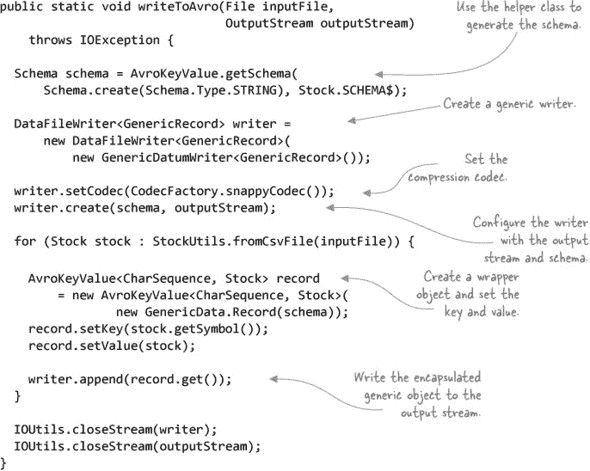

继续在 HDFS 中生成一个包含股票数据的键/值格式文件：

```
$ hip hip.ch3.avro.AvroKeyValueFileWrite \
    --input test-data/stocks.txt \
    --output stocks.kv.avro
```

如果你好奇你刚刚生成的文件的 Avro 模式定义，请使用技巧 12 中突出显示的提示从文件中提取模式。此外，你可以使用 AvroDump 实用程序来显示文件的内容：

```
# the "getschema" tool only works with data in the local filesystem,
# so first copy the stocks file from HDFS to local disk
$ hadoop fs -get stocks.kv.avro .
$ java -jar $HIP_HOME/lib/avro-tools-1.7.4.jar getschema stocks.kv.avro
{
  "type" : "record",
  "name" : "KeyValuePair",
  "namespace" : "org.apache.avro.mapreduce",
  "doc" : "A key/value pair",
  "fields" : [ {
    "name" : "key",
    "type" : "string",
    "doc" : "The key"
  }, {
    "name" : "value",
    "type" : {
      "type" : "record",
      "name" : "Stock",
      "namespace" : "hip.ch3.avro.gen",
      "fields" : [ {
        "name" : "symbol",
        "type" : "string"
      }, {
        "name" : "date",
        "type" : "string"
      }, {
        "name" : "open",
        "type" : "double"
      }, {
        "name" : "high",
        "type" : "double"
      }, {

        "name" : "low",
        "type" : "double"
      }, {
        "name" : "close",
        "type" : "double"
      }, {
        "name" : "volume",
        "type" : "int"
      }, {
        "name" : "adjClose",
        "type" : "double"
      } ]
    },
    "doc" : "The value"
  } ]
}

$ hip hip.util.AvroDump --file stocks.kv.avro

{"key": "AAPL", "value": {"symbol": "AAPL", "date": "2009-01-02", ...
{"key": "AAPL", "value": {"symbol": "AAPL", "date": "2008-01-02", ...
{"key": "AAPL", "value": {"symbol": "AAPL", "date": "2007-01-03", ...
```

现在是时候展示一些 MapReduce 代码了——你将一次性定义你的映射器、归约器和驱动程序：^([36])

> ^(36) GitHub 源代码：[`github.com/alexholmes/hiped2/blob/master/src/main/java/hip/ch3/avro/AvroKeyValueMapReduce.java`](https://github.com/alexholmes/hiped2/blob/master/src/main/java/hip/ch3/avro/AvroKeyValueMapReduce.java)。

```
public int run(final String[] args) throws Exception {

    ....

    job.setInputFormatClass(AvroKeyValueInputFormat.class);
    AvroJob.setInputKeySchema(job, Schema.create(Schema.Type.STRING));
    AvroJob.setInputValueSchema(job, Stock.SCHEMA$);

    job.setMapOutputKeyClass(Text.class);
    job.setMapOutputValueClass(DoubleWritable.class);

    job.setOutputKeyClass(Text.class);
    job.setOutputValueClass(AvroValue.class);
    job.setOutputFormatClass(AvroKeyValueOutputFormat.class);
    AvroJob.setOutputValueSchema(job, StockAvg.SCHEMA$);

    ...
  }

  public static class Map extends
    Mapper<AvroKey<CharSequence>, AvroValue<Stock>,
           Text, DoubleWritable> {

    @Override
    public void map(AvroKey<CharSequence> key,
                    AvroValue<Stock> value,
                    Context context) {

      context.write(new Text(key.toString()),
          new DoubleWritable(value.datum().getOpen()));
    }
  }

  public static class Reduce extends
    Reducer<Text, DoubleWritable, Text, AvroValue<StockAvg>> {

    @Override
    protected void reduce(Text key,
                          Iterable<DoubleWritable> values,
                          Context context) {
      double total = 0.0;
      double count = 0;
      for (DoubleWritable val: values) {
        total += val.get();
        count++;
      }
      StockAvg avg = new StockAvg();
      avg.setSymbol(key.toString());
      avg.setAvg(total / count);
      context.write(key, new AvroValue<StockAvg>(avg));
    }
  }
```

如您所见，`AvroKey` 和 `AvroValue` 包装器用于在映射器中提供输入数据，以及在归约器中的输出数据。这里很酷的一点是，Avro 足够智能，可以支持 Hadoop `Writable` 对象，并自动将它们转换为它们的 Avro 对应物，这就是为什么你不需要告诉 Avro 输出键的模式类型。

你可以使用以下命令运行 MapReduce 作业：

```
$ hip hip.ch3.avro.AvroKeyValueMapReduce \
    --input stocks.kv.avro \
    --output output
```

再次，你可以使用 AvroDump 工具查看输出：

```
$ hip hip.util.AvroDump --file output/part*
{"key": "AAPL", "value": {"symbol": "AAPL", "avg": 68.631}}
{"key": "CSCO", "value": {"symbol": "CSCO", "avg": 31.148}}
{"key": "GOOG", "value": {"symbol": "GOOG", "avg": 417.478}}
{"key": "MSFT", "value": {"symbol": "MSFT", "avg": 44.631}}
{"key": "YHOO", "value": {"symbol": "YHOO", "avg": 69.333}}
```

##### 摘要

这就结束了我们对在 MapReduce 中使用 Avro 的三种方法的介绍。每种方法都适合特定的任务，你可以选择最适合你需求的任何一种。

让我们总结一下关于 Avro 和 MapReduce 的内容，看看如何在 MapReduce 中自定义 Avro 数据的排序特性。

#### 技巧 17 控制在 MapReduce 中排序的工作方式

如果你决定使用 Avro 数据作为中间映射输出，你可能想知道你如何控制分区、排序和分组的工作方式。

##### 问题

你希望控制 MapReduce 对你的 reducer 输入的排序方式。

##### 解决方案

修改 Avro 架构以改变排序行为。

##### 讨论

如果一个 Avro 对象被用作 mapper 的键输出，默认情况下会发生以下情况：

+   Avro 对象中的所有字段都用于分区、排序和分组。

+   字段将按照它们在架构中的序号位置进行排序。这意味着如果你有一个包含两个元素的架构，架构中的第一个元素将首先用于排序，然后是第二个元素。

+   在一个元素内部，排序是通过特定于该类型的比较来进行的。因此，如果正在比较字符串，排序将是字典序的，如果正在比较数字，则使用数值比较。

一些这种行为是可以改变的。以下是对 `Stock` 架构的修改版本：

```
{
  "name": "Stock",
  "type": "record",
  "namespace": "hip.ch3.avro.gen",
  "fields": [
      {"name": "symbol",    "type": "string"},
      {"name": "date",      "type": "string"},
      {"name": "open",      "type": "double", "order": "descending"},
      {"name": "high",      "type": "double", "order": "ignore"}
  ]
}
```

你可以通过添加一个 `order` 属性并指定使用降序来修改字段的排序行为。或者，你可以通过将顺序设置为 `ignore` 来排除字段进行分区、排序和分组。

注意，这些是架构级别的设置，没有简单的方法可以指定每个作业的定制分区/排序/分组设置。你可以继续编写自己的分区、排序和分组函数（就像为 `Writable` 做的那样），但如果 Avro 有助于简化此过程的辅助函数将会很有用。

#### 技巧 18 Avro 和 Hive

直到最近，Hive 项目才内置了对 Avro 的支持。这项技术探讨了如何在 Hive 中处理 Avro 数据。

##### 问题

你想在 Hive 中处理 Avro 数据。

##### 解决方案

使用 Hive 的 Avro 序列化/反序列化器。

##### 讨论

Hive 版本 0.9.1 及更高版本附带了一个 Avro SerDe（序列化/反序列化器），这使得 Hive 能够从表中读取数据并将其写回到表中。附录中包含了如何安装 Hive 的说明。

你需要将本书附带捆绑的 Avro 架构复制到 HDFS 中，并创建一个包含一些示例 Avro 股票记录的目录：

```
$ hadoop fs -put $HIP_HOME/schema schema

$ hadoop fs -mkdir stock_hive

$ hip hip.ch3.avro.AvroStockFileWrite \
    --input test-data/stocks.txt \
    --output stock_hive/stocks.avro
```

接下来，启动 Hive 控制台并为刚刚创建的目录创建一个外部 Hive 表。你还需要指定 HDFS 中 Avro 架构的位置。将 `YOUR-HDFS-USERNAME` 替换为你的 HDFS 用户名：

```
hive> CREATE EXTERNAL TABLE stocks
COMMENT "An Avro stocks table"
ROW FORMAT SERDE 'org.apache.hadoop.hive.serde2.avro.AvroSerDe'
STORED AS
INPUTFORMAT
  'org.apache.hadoop.hive.ql.io.avro.AvroContainerInputFormat'
OUTPUTFORMAT
  'org.apache.hadoop.hive.ql.io.avro.AvroContainerOutputFormat'
LOCATION '/user/YOUR-HDFS-USERNAME/stock_hive/'
TBLPROPERTIES (
 'avro.schema.url'='hdfs:///user/YOUR-HDFS-USERNAME/schema/stock.avsc'
  );
```

AvroSerDe 实际上支持三种定义 Avro 表模式的方法——对于这个技巧，我选择了你可能在生产中最可能想要使用的方法，但有关指定模式的其他方式的更多详细信息，请参阅 AvroSerDe 网站：[`cwiki.apache.org/confluence/display/Hive/AvroSerDe`](https://cwiki.apache.org/confluence/display/Hive/AvroSerDe).

就像任何 Hive 表一样，你可以查询 Hive 来描述表的模式：

```
hive> describe stocks;

symbol                  string
date                    string
open                    double
high                    double

low                     double
close                   double
volume                  int
adjclose                double
```

运行一个查询以验证一切是否正常工作。以下 Hive 查询语言（HiveQL）将计算每个股票符号的股票记录数：

```
hive> SELECT symbol, count(*) FROM stocks GROUP BY symbol;

AAPL    10
CSCO    10
GOOG    5
MSFT    10
YHOO    10
```

如果你想将数据写入由 Avro 支持的 Hive 表中？以下示例展示了如何复制股票表中的记录子集并将其插入到新表中。此示例还突出了如何使用 Snappy 压缩编解码器对写入新表中的任何数据进行压缩：

```
hive> SET hive.exec.compress.output=true;
hive> SET avro.output.codec=snappy;

hive> CREATE TABLE google_stocks
  COMMENT "An Avro stocks table containing just Google stocks"
  ROW FORMAT SERDE 'org.apache.hadoop.hive.serde2.avro.AvroSerDe'
  STORED AS
  INPUTFORMAT
    'org.apache.hadoop.hive.ql.io.avro.AvroContainerInputFormat'
  OUTPUTFORMAT
    'org.apache.hadoop.hive.ql.io.avro.AvroContainerOutputFormat'
  TBLPROPERTIES (
      'avro.schema.url'='hdfs:///user/YOUR-USERNAME/schema/stock.avsc'
    );
OK

hive> INSERT OVERWRITE TABLE google_stocks
    SELECT * FROM stocks WHERE symbol = 'GOOG';
OK

hive> select * from google_stocks limit 5;
OK
GOOG 2009-01-02 308.6 321.82 305.5 321.32 3610500 321.32
GOOG 2008-01-02 692.87 697.37 677.73 685.19 4306900 685.19
GOOG 2007-01-03 466.0 476.66 461.11 467.59 7706500 467.59
GOOG 2006-01-03 422.52 435.67 418.22 435.23 13121200 435.23
GOOG 2005-01-03 197.4 203.64 195.46 202.71 15844200 202.71
```

关于 Hive 的更多详细信息，请参阅第九章。接下来，我们将看看如何在 Pig 中执行相同的操作序列。

#### 技巧 19 Avro 和 Pig

就像 Hive 一样，Pig 也内置了对 Avro 的支持，这在本技巧中有所介绍。

##### 问题

你想使用 Pig 读写 Avro 数据。

##### 解决方案

在 Pig 的 Piggy Bank 库中使用 `AvroStorage` 类。

##### 讨论

Piggy Bank 是一个包含有用 Pig 工具集合的库，其中之一是你可以用来在 HDFS 中读写 Avro 数据的 `AvroStorage` 类。在这个技巧中，你将复制之前在 Hive 技巧中采取的步骤——你将读取一些股票数据，执行一些简单的聚合，并将一些过滤后的数据存储回 HDFS。

在开始之前，将一些 Avro 股票数据加载到 HDFS 中的一个目录中：

```
$ hadoop fs -put $HIP_HOME/schema schema

$ hadoop fs -mkdir stock_pig

$ hip hip.ch3.avro.AvroStockFileWrite \
    --input test-data/stocks.txt \
    --output stock_pig/stocks.avro
```

在 Pig-land 中，你的第一步是注册 `AvroStorage` 工作所需的 JAR 文件。你可能需要找到你使用的 Hadoop 分发版中捆绑的 JAR 文件的特定位置。以下代码中的位置假设 Apache Hadoop 和 Pig 安装在 /usr/local 下：

```
$ pig
REGISTER /usr/local/pig/contrib/piggybank/java/piggybank.jar;
REGISTER /usr/local/hadoop/share/hadoop/common/lib/avro-*.jar;
REGISTER /usr/local/hadoop/share/hadoop/common/lib/jackson-*.jar;
REGISTER /usr/local/hadoop/share/hadoop/common/lib/snappy-*.jar;
REGISTER /usr/local/hadoop/share/hadoop/httpfs/tomcat/webapps/
       webhdfs/WEB-INF/lib/json-*.jar;
```

接下来，将股票加载到 Pig 关系中，然后使用 `LOAD` 和 `DESCRIBE` 操作符显示模式细节：

```
grunt> stocks = LOAD 'stock_pig/' USING
org.apache.pig.piggybank.storage.avro.AvroStorage();

grunt> DESCRIBE stocks;
records: {symbol: chararray,date: chararray,open: double,
          high: double,low: double,close: double,volume: int,
          adjClose: double}
```

注意，你不必提供关于 Avro 模式的详细信息。这是因为你使用的 Avro 容器格式在头部中嵌入了模式。如果你的文件没有嵌入模式，`AvroStorage` 仍然可以支持你的数据，但你需要将 Avro 模式上传到 HDFS（就像你在 Hive 中做的那样）并使用“schema_file”选项——查看 Pig 文档以获取更多详细信息.^([37])

> ^（37）更多 Avro 和 Pig 集成细节可以在 `AvroStorage` 页面上找到：[`cwiki.apache.org/confluence/display/PIG/AvroStorage`](https://cwiki.apache.org/confluence/display/PIG/AvroStorage).

为了验证 Avro 和 Pig 是否协同工作，你可以执行一个简单的聚合操作，并计算每个股票符号的股票记录数：

```
grunt> by_symbol = GROUP stocks BY symbol;
grunt> symbol_count = foreach by_symbol generate group, COUNT($1);
grunt> dump symbol_count;

(AAPL,10)
(CSCO,10)
(GOOG,5)
(MSFT,10)
(YHOO,10)
```

以下示例展示了您如何在 Pig 中写出 Avro 数据。该示例从输入数据中过滤出谷歌股票，并将它们写入 HDFS 中的新输出目录。这也展示了您如何使用 Snappy 压缩作业输出：

```
grunt> SET mapred.compress.map.output true;
grunt> SET mapred.output.compress true;
grunt> SET mapred.output.compression.codec
           org.apache.hadoop.io.compress.SnappyCodec
grunt> SET avro.output.codec snappy;

grunt> google_stocks = FILTER stocks BY symbol == 'GOOG';

grunt> STORE google_stocks INTO 'stock_pig_output/'
  USING org.apache.pig.piggybank.storage.avro.AvroStorage(
      'no_schema_check',
      'data', 'stock_pig/');
```

当将 Avro 数据写入 HDFS 时，您需要指定您要持久化的数据的 Avro 模式。前面的示例使用 `data` 选项告诉 `AvroStorage` 使用输入目录下文件中嵌入的 Avro 模式。

与加载文件一样，有各种其他方法可以告诉 `AvroStorage` 您的模式细节，这些在 Pig 的维基百科上有记录。^（38）

> ^（38）有关 AvroStorage 的附加资源请参阅 [`cwiki.apache.org/confluence/display/PIG/AvroStorage`](https://cwiki.apache.org/confluence/display/PIG/AvroStorage)。

##### 摘要

最后几种技术展示了如何轻松且直接地使用 Avro 与 MapReduce、Hive 和 Pig 一起使用。使用 Avro 存储您的数据为您提供了许多有用的免费功能，例如版本支持、压缩、可分割性和代码生成。Avro 与 MapReduce、Hive、Pig 以及众多其他工具（如 Impala 和 Flume）的强大集成意味着它值得考虑作为您首选的数据格式。

到目前为止，我们一直专注于基于行的文件格式，这并不总是布局数据的最佳方式。在下一节中，您将了解列式存储的优势，并看到 Parquet（一种列式存储）的实际应用示例。

### 3.4\. 列式存储

当数据写入 I/O 设备（例如平面文件或关系型数据库中的表）时，最常见的数据布局方式是基于行的，这意味着首先写入第一行的所有字段，然后是第二行的所有字段，依此类推。这是大多数关系型数据库默认写入表的方式，对于大多数数据序列化格式（如 XML、JSON 和 Avro 容器文件）也是如此。

列式存储的工作方式不同——它首先按列布局数据，然后按行。首先写入所有记录的第一个字段的值，然后是第二个字段，依此类推。图 3.12 强调了两种存储方案在数据布局方面的差异。

##### 图 3.12\. 行和列存储系统如何布局其数据

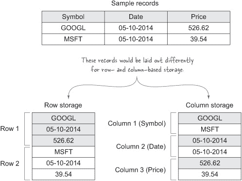

存储数据在列式形式中有两个主要好处：

+   读取列式数据的系统可以有效地提取列的子集，从而减少 I/O。基于行的系统通常需要读取整个行，即使只需要一两个列也是如此。

+   在编写列式数据时可以进行优化，例如运行长度编码和位打包，以有效地压缩正在写入的数据的大小。通用的压缩方案也适用于压缩列式数据，因为压缩在具有大量重复数据的数据上效果最佳，而当列式数据在物理上集中时，这种情况就会发生。

因此，在处理大型数据集时，当您希望过滤或投影数据时，列式文件格式工作得最好，这正是 OLAP 类用例以及 MapReduce 常见的工作类型。

Hadoop 中使用的多数数据格式，如 JSON 和 Avro，都是行顺序的，这意味着在读取和写入这些文件时无法应用之前提到的优化。想象一下，图 3.12 中的数据在一个 Hive 表中，您要执行以下查询：

```
SELECT AVG(price) FROM stocks;
```

如果数据以行格式排列，则必须读取每一行，尽管只操作的是 `price` 列。在列式存储中，只需读取 `price` 列，这在处理大型数据集时可能会显著减少处理时间。

在 Hadoop 中可以使用多种列式存储选项：

+   *RCFile* 是 Hadoop 中第一个可用的列式格式；它源于 2009 年 Facebook 与学术界之间的合作。39 RCFile 是一种基本的列式存储，支持单独的列存储和列压缩。它可以在读取时支持投影，但缺少了诸如运行长度编码等更高级的技术。因此，Facebook 已经开始从 RCFile 转向 ORC 文件。40

    > (39) Yongqiang He, et al., “RCFile: A Fast and Space-efficient Data Placement Structure in MapReduce-based Warehouse Systems,” ICDE Conference 2011: [www.cse.ohio-state.edu/hpcs/WWW/HTML/publications/papers/TR-11-4.pdf](http://www.cse.ohio-state.edu/hpcs/WWW/HTML/publications/papers/TR-11-4.pdf).
    > 
    > (40) Facebook 工程师博客， “Scaling the Facebook data warehouse to 300 PB,” [`code.facebook.com/posts/229861827208629/scaling-the-facebook-data-warehouse-to-300-pb/`](https://code.facebook.com/posts/229861827208629/scaling-the-facebook-data-warehouse-to-300-pb/).

+   *ORC 文件* 由 Facebook 和 Hortonworks 创建，旨在解决 RCFile 的不足，其序列化优化与 RCFile 相比产生了更小的数据大小。41 它还使用索引来启用谓词下推以优化查询，这样就可以跳过不符合过滤谓词的列。ORC 文件也与 Hive 的类型系统完全集成，并可以支持嵌套结构。

    > (41) Owen O’Malley, “ORC File Introduction,” [www.slideshare.net/oom65/orc-fileintro](http://www.slideshare.net/oom65/orc-fileintro).

+   *Parquet* 是 Twitter 和 Cloudera 的合作成果，并采用了 ORC 文件用于生成压缩文件所使用的一些技巧。42 Parquet 是一种与语言无关的格式，具有正式的规范。

    > (42) 列统计和索引等特性计划在 Parquet 2 版本中推出。

RCFile 和 ORC 文件被设计为支持 Hive 作为它们的主要用途，而 Parquet 则独立于任何其他 Hadoop 工具，并试图最大化与 Hadoop 生态系统的兼容性。表 3.2 展示了这些列式格式如何与各种工具和语言集成。

##### 表 3.2\. Hadoop 支持的列式存储格式

| 格式 | Hadoop 支持 | 支持的对象模型 | 支持的编程语言 | 高级压缩支持 |
| --- | --- | --- | --- | --- |
| RCFile | MapReduce, Pig, Hive (0.4+), Impala | Thrift, Protocol Buffers^([a]) | Java | 否 |
| ORC 文件 | MapReduce, Pig, Hive (0.11+) | 无 | Java | 是 |
| Parquet | MapReduce, Pig, Hive, Impala | Avro, Protocol Buffers, Thrift | Java, C++, Python | 是 |

> ^a Elephant Bird 提供了使用 Thrift 和 Protocol Buffers 与 RCFile 一起使用的能力。

对于本节，我将专注于 Parquet，因为它与 Avro 等对象模型具有兼容性。

#### 3.4.1\. 理解对象模型和存储格式

在我们开始介绍技术之前，我们将介绍一些重要的 Parquet 概念，这些概念对于理解 Parquet 与 Avro（以及 Thrift 和 Protocol Buffers）之间的交互至关重要：

+   *对象模型* 是数据的内存表示。Parquet 提供了一个简单的对象模型，这更多的是作为一个示例，而不是其他任何东西。Avro、Thrift 和 Protocol Buffers 都是功能齐全的对象模型。一个例子是 Avro 的 `Stock` 类，它是通过 Avro 生成的，用于丰富地使用 Java POJOs 模型化模式。

+   *存储格式* 是数据模型的序列化表示。Parquet 是一种以列式形式序列化数据的存储格式。Avro、Thrift 和 Protocol Buffers 也都有自己的存储格式，它们以行导向格式序列化数据.^([43]) 存储格式可以被视为数据的静态表示。

    > ^[(43) Avro 确实有一个名为 Trevni 的列式存储格式：[`avro.apache.org/docs/1.7.6/trevni/spec.html`](http://avro.apache.org/docs/1.7.6/trevni/spec.html)].

+   *Parquet 对象模型转换器* 负责将对象模型转换为 Parquet 的数据类型，反之亦然。Parquet 随带了许多转换器，以最大化互操作性和 Parquet 的采用。

图 3.13 展示了这些概念在 Parquet 上下文中的工作方式。

##### 图 3.13\. Parquet 存储格式和对象模型转换器

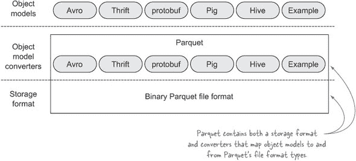

Parquet 的独特之处在于它具有转换器，允许它支持常见的对象模型，如 Avro。在幕后，数据以 Parquet 二进制形式存储，但当你处理数据时，你使用的是你首选的对象模型，例如 Avro 对象。这给你带来了两全其美的效果：你可以继续使用像 Avro 这样的丰富对象模型与你的数据交互，而这些数据将使用 Parquet 在磁盘上高效地布局。


##### 存储格式互操作性

存储格式通常是不可互操作的。当你结合 Avro 和 Parquet 时，你是在结合 Avro 的对象模型和 Parquet 的存储格式。因此，如果你有使用 Avro 存储格式序列化的现有 Avro 数据存储在 HDFS 中，你不能使用 Parquet 的存储格式来读取这些数据，因为它们是两种非常不同的数据编码方式。反之亦然——Parquet 不能使用正常的 Avro 方法（如 MapReduce 中的 `AvroInputFormat`）来读取；你必须使用 Parquet 的输入格式实现和 Hive SerDes 来处理 Parquet 数据。


总结来说，如果你想以列式形式序列化你的数据，请选择 Parquet。一旦你选择了 Parquet，你将需要决定你将使用哪种对象模型。我建议你选择在你组织中最受欢迎的对象模型。否则，我建议选择 Avro（第 3.3.5 节解释了为什么 Avro 可以是一个好的选择）。


##### Parquet 文件格式

Parquet 文件格式超出了本书的范围；对于更多细节，请查看 Parquet 项目的页面 [`github.com/Parquet/parquet-format`](https://github.com/Parquet/parquet-format)。


#### 3.4.2\. Parquet 和 Hadoop 生态系统

Parquet 的目标是最大化在整个 Hadoop 生态系统中的支持。它目前支持 MapReduce、Hive、Pig、Impala 和 Spark，并希望我们能看到它被其他系统（如 Sqoop）支持。

由于 Parquet 是一种标准文件格式，因此任何这些技术中的一种所编写的 Parquet 文件也可以被其他技术读取。在 Hadoop 生态系统中最大化支持对于文件格式的成功至关重要，而 Parquet 有望成为大数据中的通用文件格式。

令人欣慰的是，Parquet 并没有专注于特定的技术子集——正如 Parquet 主页上所说，“在生态系统支持方面，我们并不偏袒任何一方”（[`parquet.io`](http://parquet.io)）。这表明项目的主要目标是在你可能会使用的工具中最大化其支持，这对于新工具不断出现在我们的雷达上非常重要。

#### 3.4.3\. Parquet 块和页面大小

图 3.14 展示了 Parquet 文件格式的概要表示，并突出了关键概念。

##### 图 3.14\. Parquet 的文件格式

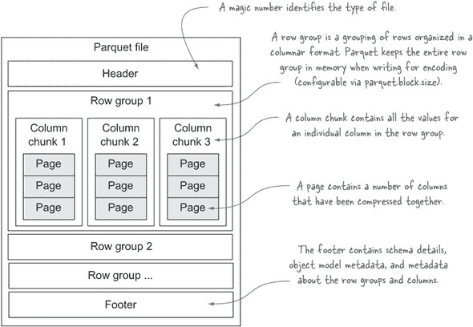

更详细的文件格式概述可以在项目的主页上查看：[`github.com/Parquet/parquet-format`](https://github.com/Parquet/parquet-format)。

#### 技巧 20 通过命令行读取 Parquet 文件

Parquet 是一种二进制存储格式，因此使用标准的 `hadoop fs -cat` 命令将在命令行上产生垃圾。在这个技术中，我们将探讨如何使用命令行不仅查看 Parquet 文件的 内容，还可以检查 Parquet 文件中包含的模式和附加元数据。

##### 问题

你希望使用命令行来检查 Parquet 文件的内容。

##### 解决方案

使用 Parquet 工具捆绑的实用程序。

##### 讨论

Parquet 附带一个包含一些有用实用程序的工具 JAR，可以将 Parquet 文件中的信息转储到标准输出。

在你开始之前，你需要创建一个 Parquet 文件，这样你就可以测试这些工具。以下示例通过写入 Avro 记录来创建一个 Parquet 文件：

```
$ hip hip.ch3.parquet.ParquetAvroStockWriter \
    --input test-data/stocks.txt \
    --output stocks.parquet
```

你将使用的第一个 Parquet 工具是`cat`，它将 Parquet 文件中的数据简单地转储到标准输出：

```
$ hip --nolib parquet.tools.Main cat stocks.parquet
symbol = AAPL
date = 2009-01-02
open = 85.88
...
```

你可以使用 Parquet 的`head`命令代替前面的`cat`，只输出前五个记录。还有一个`dump`命令，允许你指定要转储的列的子集，尽管输出不是那么易于阅读。

Parquet 有其自己的内部数据类型和模式，这些类型通过转换器映射到外部对象模型。可以使用`schema`选项查看内部 Parquet 模式：

```
$ hip --nolib parquet.tools.Main schema stocks.parquet
message hip.ch3.avro.gen.Stock {
  required binary symbol (UTF8);
  required binary date (UTF8);
  required double open;
  required double high;
  required double low;
  required double close;
  required int32 volume;
  required double adjClose;
}
```

Parquet 还允许对象模型使用元数据来存储反序列化所需的信息。例如，Avro 使用元数据来存储 Avro 模式，如下面的命令输出所示：

```
$ hip --nolib parquet.tools.Main meta stocks.parquet
creator: parquet-mr (build 3f25ad97f20...)
extra:   avro.schema = {"type":"record","name":"Stock","namespace" ...

file schema: hip.ch3.avro.gen.Stock
---------------------------------------------------------------------
symbol:      REQUIRED BINARY O:UTF8 R:0 D:0

date:        REQUIRED BINARY O:UTF8 R:0 D:0
open:        REQUIRED DOUBLE R:0 D:0
high:        REQUIRED DOUBLE R:0 D:0
low:         REQUIRED DOUBLE R:0 D:0
close:       REQUIRED DOUBLE R:0 D:0
volume:      REQUIRED INT32 R:0 D:0
adjClose:    REQUIRED DOUBLE R:0 D:0

row group 1: RC:45 TS:2376
---------------------------------------------------------------------
symbol:       BINARY SNAPPY DO:0 FPO:4 SZ:85/84/0.99 VC:45 ENC:PD ...
date:         BINARY SNAPPY DO:0 FPO:89 SZ:127/198/1.56 VC:45 ENC ...
open:         DOUBLE SNAPPY DO:0 FPO:216 SZ:301/379/1.26 VC:45 EN ...
high:         DOUBLE SNAPPY DO:0 FPO:517 SZ:297/379/1.28 VC:45 EN ...
low:          DOUBLE SNAPPY DO:0 FPO:814 SZ:292/379/1.30 VC:45 EN ...
close:        DOUBLE SNAPPY DO:0 FPO:1106 SZ:299/379/1.27 VC:45 E ...
volume:       INT32 SNAPPY DO:0 FPO:1405 SZ:203/199/0.98 VC:45 EN ...
adjClose:     DOUBLE SNAPPY DO:0 FPO:1608 SZ:298/379/1.27 VC:45 E ...
```

接下来，让我们看看你如何可以写入和读取 Parquet 文件。

#### 技巧 21：使用 Java 在 Parquet 中读取和写入 Avro 数据

当你开始处理一个新的文件格式时，你首先想要做的一件事是了解一个独立的 Java 应用程序如何读取和写入数据。这个技术展示了你如何可以将 Avro 数据写入 Parquet 文件并读取出来。

##### 问题

你希望直接从 Java 代码中读取和写入 Parquet 数据，而不使用 Hadoop，并使用 Avro 对象模型。

##### 解决方案

使用`AvroParquetWriter`和`AvroParquetReader`类。

##### 讨论

Parquet 是 Hadoop 的列式存储格式，它支持 Avro，这允许你使用 Avro 类来处理数据，并使用 Parquet 的文件格式有效地编码数据，以便你可以利用数据的列式布局。混合这种数据格式听起来很奇怪，所以让我们调查一下为什么你想这样做以及它是如何工作的。

Parquet 是一种存储格式，它有一个正式的、与编程语言无关的规范。你可以直接使用 Parquet 而无需任何其他支持数据格式，如 Avro，但 Parquet 本质上是一种简单的数据格式，不支持如映射或联合等复杂类型。这就是 Avro 发挥作用的地方，因为它支持这些更丰富的类型以及代码生成和模式演变等功能。因此，将 Parquet 与像 Avro 这样的丰富数据格式结合起来，就形成了一个复杂的模式能力与高效数据编码的完美匹配。

对于这个技术，我们将继续使用 Avro 股票模式。首先，让我们看看你如何可以使用这些`Stock`对象来写入 Parquet 文件.^([44])

> ^((44) GitHub 源代码：[`github.com/alexholmes/hiped2/blob/master/src/main/java/hip/ch3/parquet/ParquetAvroStockWriter.java`](https://github.com/alexholmes/hiped2/blob/master/src/main/java/hip/ch3/parquet/ParquetAvroStockWriter.java))。

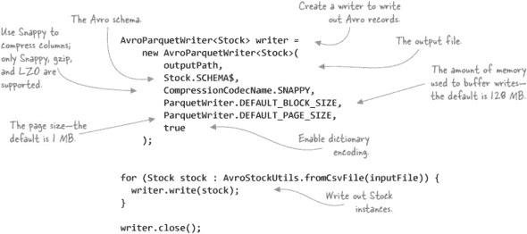

以下命令通过执行前面的代码生成一个 Parquet 文件：

```
$ hip hip.ch3.parquet.ParquetAvroStockWriter \
    --input test-data/stocks.txt \
    --output stocks.parquet
```

之前的技术展示了如何使用 Parquet 工具将文件转储到标准输出。但如果你想在 Java 中读取文件呢？^([45])。

> ^((45) GitHub 源代码：[`github.com/alexholmes/hiped2/blob/master/src/main/java/hip/ch3/parquet/ParquetAvroStockReader.java`](https://github.com/alexholmes/hiped2/blob/master/src/main/java/hip/ch3/parquet/ParquetAvroStockReader.java))。

```
ParquetReader<Stock> reader = new AvroParquetReader<Stock>(inputFile);

Stock stock;
while((stock = reader.read()) != null) {
  System.out.println(stock);
}

reader.close()
```

以下命令显示了前面代码的输出：

```
$ hip hip.ch3.parquet.ParquetAvroStockReader \
    --input stocks.parquet
AAPL,2009-01-02,85.88,91.04,85.16,90.75,26643400,90.75
AAPL,2008-01-02,199.27,200.26,192.55,194.84,38542100,194.84
AAPL,2007-01-03,86.29,86.58,81.9,83.8,44225700,83.8
...
```

#### 技术二十二：Parquet 和 MapReduce

这种技术探讨了如何在 MapReduce 中处理 Parquet 文件。将 Parquet 作为 MapReduce 中的数据源和数据汇将得到介绍。

##### 问题

你想在 MapReduce 中处理序列化为 Parquet 的 Avro 数据。

##### 解决方案

使用`AvroParquetInputFormat`和`AvroParquetOutputFormat`类。

##### 讨论

Parquet 中的 Avro 子项目附带 MapReduce 输入和输出格式，让你可以使用 Parquet 作为存储格式来读取和写入你的 Avro 数据。以下示例计算每个符号的平均股票价格:^([46])。

> ^((46) GitHub 源代码：[`github.com/alexholmes/hiped2/blob/master/src/main/java/hip/ch3/parquet/AvroParquetMapReduce.java`](https://github.com/alexholmes/hiped2/blob/master/src/main/java/hip/ch3/parquet/AvroParquetMapReduce.java))。


在 Parquet 中处理 Avro 非常简单，并且可以说比处理 Avro 序列化数据更容易.^([47]) 你可以运行示例：

> ^((47) Avro 提供的输入和输出格式用于支持 Avro 的存储格式，它封装了 Avro 对象，需要一定程度的间接引用。

```
$ hip hip.ch3.parquet.AvroParquetMapReduce \
    --input stocks.parquet \
    --output output
```

Parquet 附带一些工具来帮助你处理 Parquet 文件，其中之一允许你将内容转储到标准输出：

```
$ hdfs -ls output
output/_SUCCESS
output/_metadata
output/part-r-00000.parquet

$ hip --nolib parquet.tools.Main cat output/part-r-00000.parquet
symbol = AAPL
avg = 68.631

symbol = CSCO
avg = 31.148000000000003

symbol = GOOG
avg = 417.47799999999995

symbol = MSFT
avg = 44.63100000000001

symbol = YHOO
avg = 69.333
```

你可能已经注意到输出目录中有一个名为 _metadata 的额外文件。当 Parquet 的`OutputComitter`在作业完成后运行时，它会读取所有输出文件的尾部（包含文件元数据）并生成这个汇总的元数据文件。这个文件被后续的 MapReduce（或 Pig/Hive）作业用来减少作业启动时间.^([48])。

> ^((48) 当需要读取大量输入文件的尾部时，计算输入拆分可能需要很长时间，因此能够读取单个汇总文件是一种有用的优化。

##### 摘要

在这个技术中，你看到了如何使用代码生成的 Avro 对象文件与 Parquet 一起使用。如果你不想处理 Avro 对象文件，你有一些选项允许你使用 Avro 的`GenericData`类通用地处理 Avro 数据：

+   如果你使用`GenericData`对象编写了 Avro 数据，那么 Avro 将以这种格式将它们提供给你的 mapper。

+   排除包含你的 Avro 生成代码的 JAR 文件，也会导致`GenericData`对象被喂给你的 mapper。

+   你可以通过修改输入模式来欺骗 Avro，使其无法加载特定的类，从而迫使它提供`GenericData`实例。

以下代码展示了如何执行第三种选择——你实际上是在复制原始模式，但在过程中提供了不同的类名，Avro 将无法加载（参见第一行的`"foobar"`）：^([49])

> ^（49）GitHub 源代码 [`github.com/alexholmes/hiped2/blob/master/src/main/java/hip/ch3/parquet/AvroGenericParquetMapReduce.java`](https://github.com/alexholmes/hiped2/blob/master/src/main/java/hip/ch3/parquet/AvroGenericParquetMapReduce.java)。

```
Schema schema = Schema.createRecord("foobar",
    Stock.SCHEMA$.getDoc(), Stock.SCHEMA$.getNamespace(), false);
List<Schema.Field> fields = Lists.newArrayList();
for (Schema.Field field : Stock.SCHEMA$.getFields()) {
  fields.add(new Schema.Field(field.name(), field.schema(),
    field.doc(), field.defaultValue(), field.order()));
}
schema.setFields(fields);

AvroParquetInputFormat.setAvroReadSchema(job, schema);
```

如果你想以原生方式处理 Parquet 数据呢？Parquet 附带了一个示例对象模型，允许你处理任何 Parquet 数据，无论使用什么对象模型来写入数据。它使用`Group`类来表示记录，并提供了一些基本的 getter 和 setter 来检索字段。

以下代码再次展示了如何计算股票平均值。输入是 Avro/Parquet 数据，输出是一个全新的 Parquet 模式：^([50])

> ^（50）GitHub 源代码：[`github.com/alexholmes/hiped2/blob/master/src/main/java/hip/ch3/parquet/ExampleParquetMapReduce.java`](https://github.com/alexholmes/hiped2/blob/master/src/main/java/hip/ch3/parquet/ExampleParquetMapReduce.java).

```
private final static String writeSchema = "message stockavg {\n" +
    "required binary symbol;\n" +
    "required double avg;\n" +
    "}";

public void run(Path inputPath, Path outputPath) {
  Configuration conf = super.getConf();

  Job job = new Job(conf);
  job.setJarByClass(ExampleParquetMapReduce.class);

  job.setInputFormatClass(ExampleInputFormat.class);
  FileInputFormat.setInputPaths(job, inputPath);

  job.setMapperClass(Map.class);
  job.setReducerClass(Reduce.class);

  job.setMapOutputKeyClass(Text.class);
  job.setMapOutputValueClass(DoubleWritable.class);

  job.setOutputFormatClass(ExampleOutputFormat.class);
  FileOutputFormat.setOutputPath(job, outputPath);
  ExampleOutputFormat.setSchema(
      job,
      MessageTypeParser.parseMessageType(writeSchema));
}

public static class Map extends Mapper<Void, Group,
                                          Text, DoubleWritable> {

  @Override
  public void map(Void key, Group value, Context context) {
    context.write(new Text(value.getString("symbol", 0)),
        new DoubleWritable(Double.valueOf(
                                  value.getValueToString(2, 0))));
  }
}

public static class Reduce extends Reducer<Text, DoubleWritable,
                                              Void, Group> {

  private SimpleGroupFactory factory;

  @Override
  protected void setup(Context context) {
    factory = new SimpleGroupFactory(
      GroupWriteSupport.getSchema(
        ContextUtil.getConfiguration(context)));
  }

  @Override
  protected void reduce(Text key, Iterable<DoubleWritable> values,
                        Context context) {
    Mean mean = new Mean();
    for (DoubleWritable val : values) {
      mean.increment(val.get());
    }
    Group group = factory.newGroup()
        .append("symbol", key.toString())
        .append("avg", mean.getResult());
    context.write(null, group);
  }
}
```

示例对象模型相当基础，目前缺少一些功能——例如，没有为 double 类型提供 getter，这就是为什么前面的代码使用`getValueToString`方法访问股票价值。但正在努力提供更好的对象模型，包括 POJO 适配器。^([51])

> ^（51）请参阅 GitHub 上的问题单号 325，标题为“Parquet 的 POJO 支持”的[`github.com/Parquet/parquet-mr/pull/325`](https://github.com/Parquet/parquet-mr/pull/325)。

#### 技术篇 23：Parquet 与 Hive/Impala

当 Parquet 在 Hive 和 Impala 中使用时，其优势得以体现。由于其能够利用下推（pushdowns）来优化读取路径，列式存储是这些系统的自然选择。这项技术展示了如何在这些系统中使用 Parquet。^[52]) 该技术展示了如何在这些系统中使用 Parquet。

> ^（52）下一种技术中会更详细地介绍下推（Pushdowns）。

##### 问题

你希望能够在 Hive 和 Impala 中处理你的 Parquet 数据。

##### 解决方案

使用 Hive 和 Impala 内置对 Parquet 的支持。

##### 讨论

Hive 要求数据存在于目录中，因此你首先需要创建一个目录并将股票 Parquet 文件复制到其中：

```
$ hadoop fs -mkdir parquet_avro_stocks
$ hadoop fs -cp stocks.parquet parquet_avro_stocks
```

接下来，你将创建一个外部 Hive 表并定义其模式。如果你不确定模式的结构，可以使用之前的技术查看你正在处理的 Parquet 文件中的模式信息（在 Parquet 工具中使用`schema`命令）：

```
hive> CREATE EXTERNAL TABLE parquet_stocks(
  symbol string,
  date string,
  open double,
  high double,
  low double,
  close double,
  volume int,
  adjClose double
) STORED AS PARQUET
LOCATION '/user/YOUR_USERNAME/parquet_avro_stocks';
```


##### Hive 0.13

仅在 Hive 0.13 中添加了对 Parquet 作为本地 Hive 存储的支持（见[`issues.apache.org/jira/browse/HIVE-5783`](https://issues.apache.org/jira/browse/HIVE-5783)）。如果你使用的是 Hive 的旧版本，你需要使用`ADD JAR`命令手动加载所有 Parquet JARs，并使用 Parquet 输入和输出格式。Cloudera 在其博客上有一个示例；请参阅“如何：在 Impala、Hive、Pig 和 Map-Reduce 中使用 Parquet”，[`blog.cloudera.com/blog/2014/03/how-to-use-parquet-with-impala-hive-pig-mapreduce/`](http://blog.cloudera.com/blog/2014/03/how-to-use-parquet-with-impala-hive-pig-mapreduce/)。


你可以运行一个简单的查询来从数据中提取唯一的股票代码：

```
hive> select distinct(symbol) from parquet_stocks;
AAPL
CSCO
GOOG
MSFT
YHOO
```

你可以使用相同的语法在 Impala 中创建表。

#### 技巧 24：使用 Parquet 进行下推谓词和投影

投影和谓词下推涉及执行引擎将投影和谓词下推到存储格式，以尽可能优化最低级别的操作。这带来了空间和时间上的优势，因为不需要查询的列不需要被检索并提供给执行引擎。

这对于列式存储尤其有用，因为下推允许存储格式跳过查询中不需要的整个列组，并且列式格式可以非常高效地执行此操作。

在这个技巧中，你将查看在 Hadoop 管道中使用这些下推所需的步骤。

##### 问题

你想在 Hadoop 中使用下推来优化你的作业。

##### 解决方案

使用 Hive 和 Pig 与 Parquet 结合使用提供开箱即用的投影下推。在 MapReduce 中，你需要在驱动代码中执行一些手动步骤来启用下推。

##### 讨论

再次强调，我们使用此技术的重点是 Avro。`AvroParquetInputFormat`有两个你可以用于谓词和投影下推的方法。在下面的示例中，只投影了`Stock`对象的两个字段，并添加了一个谓词，以便只选择谷歌股票：^([53])

> (53) GitHub 源代码：[`github.com/alexholmes/hiped2/blob/master/src/main/java/hip/ch3/parquet/AvroProjectionParquetMapReduce.java`](https://github.com/alexholmes/hiped2/blob/master/src/main/java/hip/ch3/parquet/AvroProjectionParquetMapReduce.java).

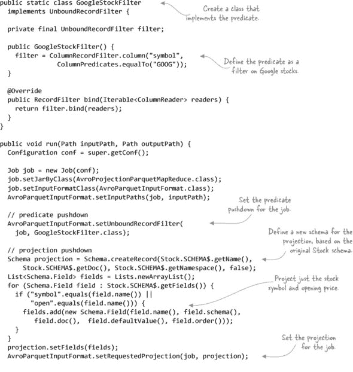

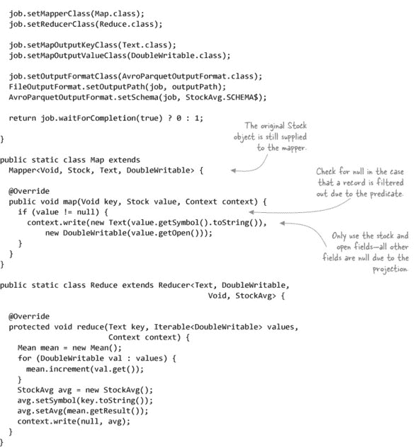


##### 谓词过滤器 null 值

当你提供的谓词过滤掉一个记录时，你的 mapper 会接收到一个`null`值。这就是为什么在处理 mapper 输入之前你必须检查`null`的原因。


如果你运行作业并检查输出，你只会找到谷歌股票的平均值，这表明谓词是有效的：

```
$ hip hip.ch3.parquet.AvroProjectionParquetMapReduce \
    --input stocks.parquet \
    --output output

$ hip --nolib parquet.tools.Main cat output/part-r-00000.parquet
symbol = GOOG
avg = 417.47799999999995
```

##### 摘要

这种技术不包括任何 Hive 或 Pig 向下推送的细节，因为这两个工具在执行时会自动执行这些向下推送。向下推送是您作业优化工作的重要组成部分，如果您使用的是不暴露向下推送的第三方库或工具，您可以通过提出功能请求来帮助社区。

#### 3.4.4\. Parquet 限制

在使用 Parquet 时，你应该注意以下几点：

+   Parquet 在写入文件时需要大量的内存，因为它在内存中缓冲写入以优化数据的编码和压缩。如果遇到写入 Parquet 文件时的内存问题，可以增加堆大小（建议 2 GB），或者减少可配置的`parquet.block.size`。

+   使用 Parquet 的深度嵌套数据结构可能会限制 Parquet 在向下推送时的一些优化。如果可能的话，尽量简化你的模式。

+   Hive 在处理 Parquet 时还不支持`decimal`和`timestamp`数据类型，因为 Parquet 不支持它们作为原生类型。相关工作正在 JIRA 票据“在 Parquet 中实现所有 Hive 数据类型”中跟踪（[`issues.apache.org/jira/browse/HIVE-6384`](https://issues.apache.org/jira/browse/HIVE-6384)）。

+   Impala 不支持 Parquet 中的嵌套数据或复杂数据类型，如 maps、structs 或 arrays。这应该在 Impala 2.x 版本中得到修复。

+   当 Parquet 文件包含单个行组且整个文件适合 HDFS 块时，工具如 Impala 工作得最好。在现实世界中，当你使用 MapReduce 等系统写入 Parquet 文件时很难实现这一目标，但当你生成 Parquet 文件时，记住这一点是好的。

我们已经介绍了处理常见文件格式和使用各种数据序列化工具以实现与 MapReduce 更紧密兼容性的方法。现在是时候看看你如何支持可能属于你组织的专有文件格式，或者对于 MapReduce 没有输入或输出格式的公共文件格式。

### 3.5\. 自定义文件格式

在任何组织中，你通常都会发现大量的自定义或非标准文件格式散布在其数据中心。可能有后端服务器以专有格式输出审计文件，或者旧的代码或系统使用不再通用的格式写入文件。如果你想在 MapReduce 中处理此类数据，你需要编写自己的输入和输出格式类来处理你的数据。本节将指导你完成这个过程。

#### 3.5.1\. 输入和输出格式

在本章开头，我们概述了 MapReduce 中输入和输出格式类的作用。输入和输出类是向 map 函数提供数据和写入 reduce 函数输出的必需品。

#### 技巧 25：为 CSV 编写输入和输出格式

想象一下，你有一堆数据存储在 CSV 文件中，你正在编写多个 MapReduce 作业，这些作业以 CSV 形式读取和写入数据。因为 CSV 是文本格式，你可以使用内置的`TextInputFormat`和`TextOutputFormat`，并在 MapReduce 代码中处理 CSV 的解析。然而，这可能会很快变得令人疲惫，并且导致相同的解析代码被复制粘贴到所有的作业中。

如果你认为 MapReduce 有任何内置的 CSV 输入和输出格式可以处理这种解析，那么你可能运气不佳——没有。

##### 问题

你想在 MapReduce 中使用 CSV，并且希望以比使用`TextInputFormat`提供的字符串行表示更丰富的格式来展示 CSV 记录。

##### 解决方案

编写一个与 CSV 一起工作的输入和输出格式。

##### 讨论

我们将涵盖编写自己的格式类以与 CSV 输入和输出一起工作的所有步骤。CSV 是易于处理的一种文件格式，这将使得在不太多考虑文件格式的情况下，更容易关注 MapReduce 格式细节。

你的自定义`InputFormat`和`RecordReader`类将解析 CSV 文件，并以用户友好的格式向 mapper 提供数据。你还将支持非逗号分隔符的自定义字段分隔符。因为你不想重新发明轮子，你将使用开源 OpenCSV 项目中的 CSV 解析器([`opencsv.sourceforge.net/`](http://opencsv.sourceforge.net/))，它将处理引号字段并忽略引号字段中的分隔符。


##### `InputFormat`和`OutputFormat`概述

我在本章开头提供了对`InputFormat`和`OutputFormat`及其相关类的详细概述。在查看本技术中的代码之前，回顾一下那个讨论可能是有价值的。


##### 输入格式

你的第一步是定义`InputFormat`。`InputFormat`的功能是验证作业提供的输入集，识别输入分割，并创建一个`RecordReader`类来从源读取输入。以下代码从作业配置中读取分隔符（如果提供）并构建一个`CSVRecordReader`类：^([54])

> ^[(54) GitHub 源代码：](https://github.com/alexholmes/hiped2/blob/master/src/main/java/hip/ch3/csv/CSVInputFormat.java)

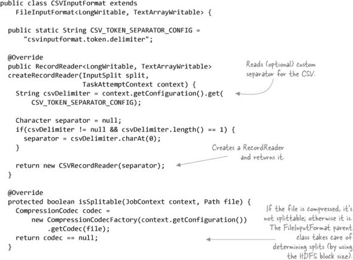


##### `InputFormat`和压缩文件

在前面的代码中，你看到当数据被压缩时，会返回一个标志来指示它不能被分割。这样做的原因是压缩编解码器是不可分割的，除了 LZOP。但是可分割的 LZOP 不能与常规的`InputFormat`类一起工作——它需要特殊的 LZOP `InputFormat`类。这些细节在第四章中有详细说明。


您的 `InputFormat` 类已经完成。您扩展了 `FileInputFormat` 类，其中包含计算输入分片沿 HDFS 块边界的代码，这样您就无需自己处理计算输入分片。`FileInputFormat` 会为您管理所有输入文件和分片。现在让我们继续到 `RecordReader`，这需要更多的努力。

`RecordReader` 执行两个主要功能。它必须首先根据提供的输入分片打开输入源，并且可以选择在该输入分片中的特定偏移量处进行查找。`RecordReader` 的第二个功能是从输入源读取单个记录。

在这个例子中，逻辑记录等同于 CSV 文件中的一行，所以您将使用现有的 `LineRecordReader` 类在 MapReduce 中处理文件。当 `RecordReader` 使用 `InputSplit` 初始化时，它将打开输入文件，跳转到输入分片的开头，并继续读取字符，直到它到达下一个记录的开始，在这种情况下，行意味着换行符。以下代码显示了 `LineRecordReader.initialize` 方法的简化版本：

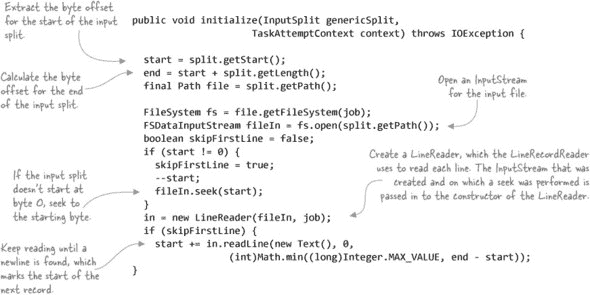

`LineRecordReader` 为 `LongWritable`/`Text` 形式的每一行返回键值对。因为您希望在 `Record Reader` 中提供一些功能，所以您需要将 `LineRecordReader` 封装在您的类中。`RecordReader` 需要向 mapper 提供记录的键值对表示，在这种情况下，键是文件中的字节偏移量，值是包含 CSV 行分词部分的数组：^([55])

> ^(55) GitHub 源代码：[`github.com/alexholmes/hiped2/blob/master/src/main/java/hip/ch3/csv/CSVInputFormat.java`](https://github.com/alexholmes/hiped2/blob/master/src/main/java/hip/ch3/csv/CSVInputFormat.java)。

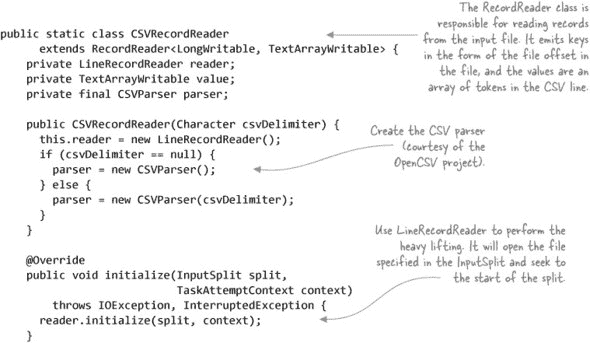

接下来，您需要提供读取下一个记录和获取该记录键值的方法：^([56])

> ^(56) GitHub 源代码：[`github.com/alexholmes/hiped2/blob/master/src/main/java/hip/ch3/csv/CSVInputFormat.java`](https://github.com/alexholmes/hiped2/blob/master/src/main/java/hip/ch3/csv/CSVInputFormat.java)。

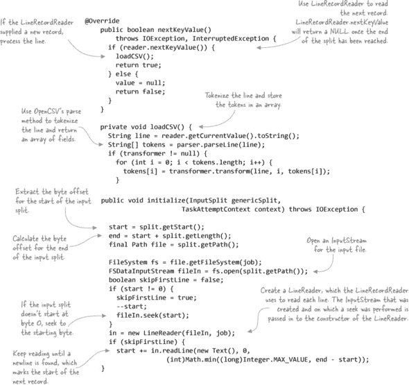

到目前为止，您已经创建了一个可以处理 CSV 文件的 `InputFormat` 和 `RecordReader`。现在您已经完成了 `InputFormat`，是时候转向 `OutputFormat` 了。

##### OutputFormat

`OutputFormat` 类遵循与 `InputFormat` 类相似的模式；`OutputFormat` 类处理创建输出流的相关后勤工作，然后将流写入委托给 `RecordWriter`。

`CSVOutputFormat` 间接扩展了 `FileOutputFormat` 类（通过 `TextOutputFormat`），它处理与创建输出文件名、创建压缩编解码器实例（如果启用了压缩）以及输出提交相关的所有后勤工作，我们将在稍后讨论。

这就留下了 `OutputFormat` 类，它负责支持 CSV 输出文件的定制字段分隔符，并在需要时创建压缩的 `OutputStream`。它还必须返回你的 `CSVRecordWriter`，该 `CSVRecordWriter` 将 CSV 行写入输出流：^([57])

> ^([57) GitHub 源代码：[`github.com/alexholmes/hiped2/blob/master/src/main/java/hip/ch3/csv/CSVOutputFormat.java`](https://github.com/alexholmes/hiped2/blob/master/src/main/java/hip/ch3/csv/CSVOutputFormat.java)).

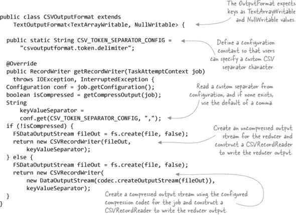

在以下代码中，你的 `RecordWriter` 将归约器发出的每个记录写入输出目的地。你需要归约器输出键以数组形式表示 CSV 行中的每个标记，并指定归约器输出值必须是 `NullWritable`，这意味着你不在乎输出值部分。

让我们看看 `CSVRecordWriter` 类。构造函数，它只设置字段分隔符和输出流，被省略了，如下所示：^([58])

> ^([58) GitHub 源代码：[`github.com/alexholmes/hiped2/blob/master/src/main/java/hip/ch3/csv/CSVOutputFormat.java`](https://github.com/alexholmes/hiped2/blob/master/src/main/java/hip/ch3/csv/CSVOutputFormat.java)).

##### 列表 3.6\. 一个生成 MapReduce CSV 输出的 `RecordWriter`

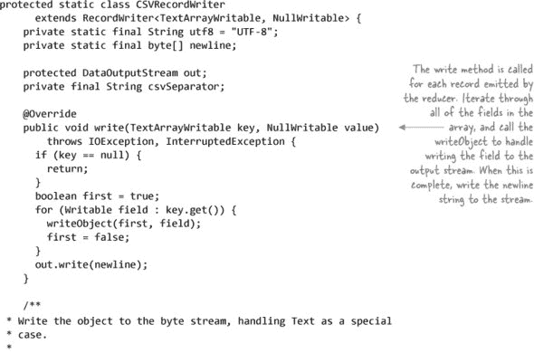

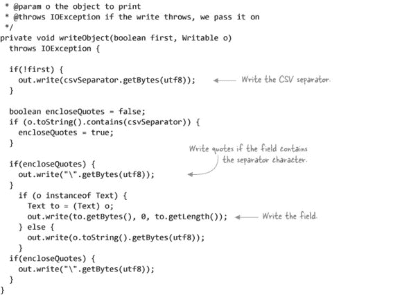

现在你需要在 MapReduce 作业中应用新的输入和输出格式类。

##### MapReduce

你的 MapReduce 作业将以 CSV 作为输入，并生成以冒号分隔的 CSV，而不是逗号分隔。作业将执行恒等映射和归约函数，这意味着你不会在 MapReduce 传输过程中更改数据。你的输入文件将以制表符为分隔符，你的输出文件将以逗号分隔。你的输入和输出格式类将通过 Hadoop 配置属性支持自定义分隔符的概念。

MapReduce 代码如下：^([59])

> ^([59) GitHub 源代码：[`github.com/alexholmes/hiped2/blob/master/src/main/java/hip/ch3/csv/CSVMapReduce.java`](https://github.com/alexholmes/hiped2/blob/master/src/main/java/hip/ch3/csv/CSVMapReduce.java)).

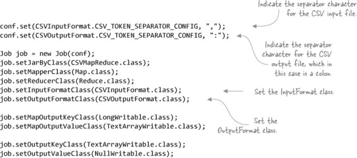

映射和归约函数除了将输入回显到输出之外，没有做太多的事情，但包括它们，以便你可以看到如何在 MapReduce 代码中处理 CSV：^([60])

> ^([60) GitHub 源代码：[`github.com/alexholmes/hiped2/blob/master/src/main/java/hip/ch3/csv/CSVMapReduce.java`](https://github.com/alexholmes/hiped2/blob/master/src/main/java/hip/ch3/csv/CSVMapReduce.java)).

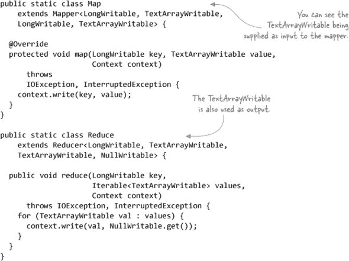

如果你运行这个示例 MapReduce 作业针对制表符分隔的文件，你可以检查映射器的输出，看看结果是否符合预期：

```
$ hadoop fs -put test-data/stocks.txt stocks.txt
$ hip hip.ch3.csv.CSVMapReduce \
    --input stocks.txt \
    --output output

$ hadoop fs -cat output/part*
AAPL:2009-01-02:85.88:91.04:85.16:90.75:26643400:90.75
AAPL:2008-01-02:199.27:200.26:192.55:194.84:38542100:194.84
AAPL:2007-01-03:86.29:86.58:81.90:83.80:44225700:83.80
...
```

现在你已经有一个功能性的 `InputFormat` 和 `OutputFormat`，可以在 MapReduce 中消费和生成 CSV。

##### 猪肉

Pig 的 piggybank 库包含一个`CSVLoader`，它可以用来将 CSV 文件加载到元组中。它支持 CSV 记录中的双引号字段，并将每个项目作为字节数组提供。

有一个名为 csv-serde ([`github.com/ogrodnek/csv-serde`](https://github.com/ogrodnek/csv-serde))的 GitHub 项目，它有一个 Hive SerDe，可以序列化和反序列化 CSV。像之前的`InputFormat`示例一样，它也使用 OpenCSV 项目来读取和写入 CSV。

##### 摘要

这种技术展示了如何编写自己的 MapReduce 格式类来处理基于文本的数据。目前 MapReduce 正在进行添加 CSV 输入格式的工作（见[`issues.apache.org/jira/browse/MAPREDUCE-2208`](https://issues.apache.org/jira/browse/MAPREDUCE-2208))。

争议性地讲，使用`TextInputFormat`并在映射器中分割行可能更简单。但如果你需要多次这样做，你很可能是受到了复制粘贴反模式的困扰，因为用于标记 CSV 的相同代码可能存在于多个位置。如果代码是考虑到代码复用而编写的，那么你将得到保障。

我们已经探讨了如何编写自己的 I/O 格式类来与 MapReduce 中的自定义文件格式一起工作。现在我们需要关注与输出格式一起工作的一个关键方面——输出提交。

#### 3.5.2. 输出提交的重要性

在前一种技术中的 CSV`OutputFormat`示例中，你扩展了`FileOutputFormat`，它在任务成功后负责提交输出。为什么在 MapReduce 中需要提交，你为什么应该关心这个问题？

在作业及其任务执行过程中，它们将在某个时刻开始写入作业输出。任务和作业可能会失败，它们可以被重新启动，也可以进行推测性执行.^([61]) 为了允许`OutputFormat`s 正确处理这些场景，MapReduce 有一个名为`OutputCommitter`的概念，这是一种机制，MapReduce 在单个任务以及整个作业完成时调用回调。

> ⁶¹ 推测性执行是指 MapReduce 对相同输入数据执行多个任务，以防止缓慢或行为异常的节点减慢整体作业的速度。默认情况下，映射端和减少端的推测性执行都是启用的。`mapred.map.tasks.speculative.execution`和`mapred.reduce.tasks.speculative.execution`控制这种行为。

MapReduce 中大多数 `OutputFormat` 都使用 `FileOutputFormat`，它使用 `FileOutputCommitter` 来处理输出提交。当 `FileOutputFormat` 首次查询输出文件的存储位置时，它将决定输出文件应该存储在哪里的决策委托给 `FileOutputCommitter`，后者指定输出应该放在作业输出目录下的一个临时目录中（<job-output>/_temporary/<task-attempt-id>）。只有在整体任务完成之后，`FileOutputCommitter` 才会被通知，此时临时输出会被移动到作业输出目录。当整体作业成功完成后，`FileOutputCommitter` 再次被通知，这次它在作业输出目录中创建一个 `_SUCCESS` 文件，以帮助下游处理器知道作业已成功完成。

如果你的数据目的地是 HDFS，你可以使用 `FileOutputFormat` 和其提交机制，这很好。当你处理文件以外的数据源，如数据库时，事情开始变得复杂。在这种情况下，如果需要幂等写操作（即相同的操作可以多次应用而不改变结果），你需要将其考虑进目标数据存储或 `OutputFormat` 的设计中。

这个主题在 第五章 中有更详细的探讨，该章涵盖了从 Hadoop 导出数据到数据库。

### 3.6. 章节总结

本章的目标是向你展示如何在 MapReduce 中处理常见的文件格式，如 XML 和 JSON。我们还探讨了更复杂的文件格式，如 SequenceFile、Avro 和 Parquet，它们为处理大数据提供了有用的功能，例如版本控制、压缩和复杂的数据结构。我们还介绍了处理自定义文件格式的流程，以确保它们能在 MapReduce 中正常工作。

到目前为止，你已经准备好在 MapReduce 中处理任何文件格式了。现在，是时候看看一些存储模式，以便你能够有效地处理你的数据并优化存储和磁盘/网络 I/O。

## 第四章. 在 HDFS 中组织和优化数据

*本章涵盖*

+   数据布局和组织技巧

+   优化读写数据的数据访问模式

+   压缩的重要性以及选择最适合你需求的编解码器

在上一章中，我们探讨了如何在 MapReduce 中处理不同的文件格式，以及哪些格式最适合存储你的数据。一旦你确定了将要使用的数据格式，就需要开始考虑如何在 HDFS 中组织你的数据。在设计你的 Hadoop 系统的早期阶段，给自己留出足够的时间来理解数据如何被访问，这样你就可以针对你将要支持的更重要用例进行优化。

有许多因素会影响你的数据组织决策，例如你是否需要提供 SQL 访问你的数据（很可能你需要），哪些字段将用于查找数据，以及你需要支持什么访问时间的 SLA。同时，你需要确保不会因为大量的小文件而对 HDFS NameNode 施加不必要的堆压力，你还需要学习如何处理巨大的输入数据集。

本章致力于探讨在 HDFS 中高效存储和访问大数据的方法。我首先会介绍你如何在 HDFS 中布局数据，并展示一些用于分区和合并数据以减轻 NameNode 堆压力的方法。然后，我会讨论一些数据访问模式，以帮助你处理不同的数据以及大量数据集。最后，我们将探讨压缩作为大数据模式，以最大化你的存储和处理能力。

| |
| --- |

##### 章节先决条件

本章假设你已对 HDFS 概念有基本的了解，并且你有直接与 HDFS 工作的经验。如果你需要熟悉这个主题，Chuck Lam 的《Hadoop 实战》（Manning, 2010）提供了你需要的关于 HDFS 的背景信息。

| |
| --- |

我们将从如何组织和管理工作数据开始。

### 4.1. 数据组织

数据组织是使用 Hadoop 时最具挑战性的方面之一。你的组织中的不同群体，如数据科学家和你的集群管理员，都会向你提出竞争性的要求。更重要的是，这些要求通常在数据应用投入生产并积累了大量数据之后才会出现。

Hadoop 中的数据组织有多个维度。首先，你需要决定如何在 HDFS 中组织你的数据，之后你将面临如何分区和压缩数据等操作问题。你需要决定是否启用 Kerberos 来保护你的集群，以及如何管理和沟通数据变更。这些都是复杂的问题，本章的目标是专注于数据组织的一些更具挑战性的方面，包括数据分区和压缩，从如何在 HDFS 中结构化你的数据开始。

#### 4.1.1. 目录和文件布局

在集群范围内有一个定义数据组织方式的标准化是值得追求的，因为它使得发现数据所在位置变得更容易，同时也帮助你在一般的数据存储中应用结构和管理工作需要解决的问题。由于我们是在文件系统可以表达的范围内工作，组织数据的一种常见方法就是创建一个与你的组织或功能结构相一致的多级层次结构。例如，如果你在分析团队工作，并且你将一个新的数据集带到集群中，那么组织你的目录的一种方法可以如图 4.1 所示。

##### 图 4.1\. 一个示例 HDFS 目录布局


##### 数据革命

希望你已经确定了一种数据格式，例如 Avro，它允许你在时间上演变你的模式。这很好，但当你支持迁移到下一个大数据格式时，这个格式无疑会在每个人都迁移到 Avro 之后到来，你该如何应对呢？嗯，你可以参考其他软件领域，其中语义版本控制概念渗透到接口，如 URL，并在你的目录结构中采用类似的策略。通过在你的结构中添加版本号，你可以给自己提供灵活性，以便迁移到明天的数据格式，并使用目录路径来传达不同的文件格式。

一旦你接受了在目录中放置版本号的做法，剩下的唯一挑战就是向你的数据消费者传达未来的变化。如果这成为一个挑战，你可能想看看 HCatalog 作为一种将数据格式从客户端抽象出来的方法。

##### 按日期和其他字段分区

你可能需要你的目录结构来模拟你的组织和数据演变需求，但你为什么还需要按日期进一步分区呢？这是一种 Hive 在早期用来帮助加速查询的技术。如果你把所有数据放入一个单独的目录中，每次需要访问数据时，你实际上是在做 Hadoop 的全表扫描。相反，更明智的做法是根据你预期如何访问数据来对数据进行分区。

在事先很难确切知道数据将如何被访问的情况下，一个合理的初步分区尝试是按数据生成日期来分割数据。如果你的数据没有日期，那么与数据生产者谈谈添加一个日期，因为事件或记录被创建的时间是一个关键的数据点，应该始终被捕获。

#### 4.1.2\. 数据层级

在 2012 年的 Strata 演讲中，Eric Sammer 提出了存储不同层级数据的想法.^([1]) 这是一个强大的概念，并且它与 Nathan Marz 的 Lambda 架构的一个主要原则——永不删除或修改原始数据——很好地结合在一起。

> ¹ Eric Sammer，“使用 Hadoop 进行大规模 ETL”，[www.slideshare.net/OReillyStrata/large-scale-etl-with-hadoop](http://www.slideshare.net/OReillyStrata/large-scale-etl-with-hadoop)。

乍一看，这似乎没有意义——当然，一旦你提取了数据源的重要部分，你可以丢弃其余部分！虽然保留原始数据可能看起来很浪费，尤其是如果有些部分没有被积极使用，但问问自己这个问题——未来能否从数据中提取一些组织价值？很难给出一个响亮的“不”。

我们的软件偶尔也会有错误。想象一下，您正在从 Twitter 的数据流中提取数据，生成一些聚合数据并丢弃源数据。如果您发现聚合逻辑中的错误怎么办？您将无法回溯并重新生成聚合数据。

因此，建议您将数据视为以下层级：

+   *原始数据* 是第一层。这是您从源捕获的未修改数据。这一层级的数据不应被修改，因为您的逻辑可能存在产生派生数据或聚合数据的错误，如果您丢弃原始数据，您将失去在发现错误后重新生成派生数据的能力。

+   *派生数据* 是从原始数据创建的。在这里，您可以执行去重、净化以及其他任何清理工作。

+   *聚合数据* 是从派生数据计算得出的，并可能被输入到 HBase 或您选择的 NoSQL 系统中，以便在生产和分析目的上实时访问您的数据。

数据层级也应反映在目录布局中，以便用户可以轻松区分层级。

一旦您为数据分区确定了目录布局，下一步就是确定如何将数据放入这些分区中。这一点将在下一部分介绍。

#### 4.1.3. 分区

分区是将数据集分割成不同部分的过程。这些部分是分区，它们代表了您数据的有意义划分。数据中常见的分区示例是时间，因为它允许查询数据的人缩小到特定的时间窗口。上一节将时间作为决定如何在 HDFS 中布局数据的关键元素。

太好了！您在 HDFS 中有一个大型数据集，并且需要对其进行分区。您将如何进行？在本节中，我将介绍您可以使用两种方法来分区您的数据。

#### 技巧 26 使用 MultipleOutputs 进行数据分区

想象一下这种情况：您有股票价格被流式传输到 HDFS，并且您想编写一个 MapReduce 作业来根据股票报价的日期对股票数据进行分区。为此，您需要在单个任务中写入多个输出文件。让我们看看如何实现这一点。

##### 问题

您需要分区数据，但大多数输出格式在每个任务中只创建一个输出文件。

##### 解决方案

使用与 MapReduce 捆绑的`MultipleOutputs`类。

##### 讨论

Hadoop 中的`MultipleOutputs`类绕过了在 Hadoop 中产生输出的正常通道。它提供了一个单独的 API 来写入分区输出，并且直接将输出写入 HDFS 中的任务尝试目录。这非常强大，因为你可以继续使用提供给作业的`Context`对象的标准写入方法来收集输出，同时也可以使用`MultipleOutputs`来写入分区输出。当然，你也可以选择只使用`MultipleOutputs`类并忽略基于`Context`的标准输出。

在这个技术中，你将使用`MultipleOutputs`根据股票报价日期对股票进行分区。第一步是为你的作业设置`MultipleOutputs`。在你的驱动程序中，你将指示输出格式以及键和值类型：

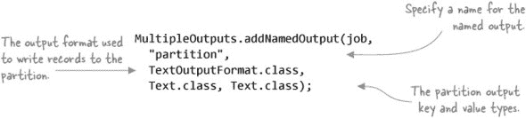

| |
| --- |

##### 为什么你需要在驱动程序中命名输出？

你可能想知道为什么`MultipleOutputs`要求你指定一个输出名称（在先前的例子中是`partition`）。这是因为`MultipleOutputs`支持两种操作模式——静态分区和动态分区。

*静态分区*在你知道分区名称的情况下效果很好；这为你提供了额外的灵活性，可以为每个分区指定不同的输出格式（你只需对`MultipleOutputs.addNamedOutput`进行多次调用，使用不同的命名输出）。在静态分区中，你在调用`addNamedOutput`时指定的输出名称与你在 mapper 或 reducer 中发出输出时使用的名称相同。

这种技术侧重于*动态分区*，这可能会更实用，因为在大多数情况下，你事先不知道分区。在这种情况下，你仍然需要提供一个输出名称，但就实际目的而言，它被忽略，因为你可以动态地在你的 mapper 或 reducer 中指定分区名称。

| |
| --- |

如以下代码所示，你的 map（或 reduce）类将获取一个`MultipleOutputs`实例的句柄，然后使用其写入方法来写入分区输出。注意，第三个参数是分区名称，即股票日期:^([2])

> ² GitHub 源代码：[`github.com/alexholmes/hiped2/blob/master/src/main/java/hip/ch4/MultipleOutputsJob.java`](https://github.com/alexholmes/hiped2/blob/master/src/main/java/hip/ch4/MultipleOutputsJob.java).

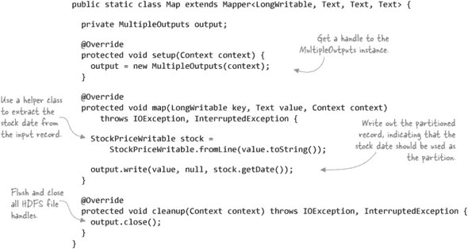

| |
| --- |

##### 不要忘记调用 close 方法！

在你的任务清理方法中调用`MultipleOutputs`的 close 方法非常重要。否则，你的输出中可能会缺少数据，甚至可能出现损坏的文件。

| |
| --- |

让我们看看这个类在实际中的应用。如以下输出所示，运行前面的示例为单个 mapper 生成了多个分区文件。你还可以看到原始的 map 输出文件，它是空的，因为你没有使用`Context`对象发出任何记录：

```
$ hip hip.ch4.MultipleOutputsJob --input stocks.txt --output out1

$ hadoop fs -ls -R out1
out1/2000-01-03-m-00000
out1/2001-01-02-m-00000
out1/2002-01-02-m-00000
out1/2003-01-02-m-00000
out1/2004-01-02-m-00000
out1/2005-01-03-m-00000
out1/2006-01-03-m-00000
out1/2007-01-03-m-00000
out1/2008-01-02-m-00000
out1/2009-01-02-m-00000
out1/_SUCCESS
out1/part-m-00000
```

在这个例子中，你使用了仅映射的作业，但在生产中你可能希望限制创建分区的任务数量。你可以通过两种方式来实现：

+   使用 `CombineFileInputFormat` 或自定义输入格式来限制你的作业中的 mapper 数量。

+   在可以显式指定合理数量的 reducer 的 reducer 中使用。

##### 摘要

`MultipleOutputs` 有许多值得喜欢的地方：它支持“旧”和“新”的 MapReduce API，以及支持多个输出格式类。但使用 `MultipleOutputs` 也伴随着一些你应该注意到的限制：

+   在 mapper 中使用 `MultipleOutputs` 时要小心——记住，你最终会得到 NumberOfMappers * NumberOfPartition 输出文件，这在我的经验中可能会因为大量值而使集群崩溃！

+   每个分区都会在任务执行期间产生一个 HDFS 文件句柄的开销。

+   你可能会最终得到大量的小文件，这些文件会在多次使用你的分区器时累积。你可能需要确保你有一个压缩策略来减轻这个问题（更多详情请见第 4.1.4 节）。

+   尽管 Avro 随带 `AvroMultipleOutputs` 类，但由于代码中的一些低效，它相当慢。

除了 `MultipleOutputs` 方法之外，Hadoop 还提供了一个具有类似功能的 `MultipleOutputFormat` 类。它主要的缺点是它只支持旧的 MapReduce API，并且所有分区只能使用一个输出格式。

你还可以采用另一种分区策略，即使用 MapReduce 分区器，这可以帮助减轻使用 `MultipleOutputs` 可能产生的文件数量过多的问题。

#### 技巧 27 使用自定义 MapReduce 分区器

另一种分区方法是使用 Map-Reduce 内置的分区功能。默认情况下，MapReduce 使用一个哈希分区器，它计算每个映射输出键的哈希值，并对 reducer 的数量进行取模运算，以确定记录应该发送到哪个 reducer。你可以通过编写自己的自定义分区器来控制分区方式，然后根据你的分区方案路由记录。

与前一种技术相比，这种技术有一个额外的优点，那就是你通常会得到更少的输出文件，因为每个 reducer 只会创建一个输出文件，而 `MultipleOutputs` 则是每个映射或减少任务都会生成 *N* 个输出文件——每个分区一个。

##### 问题

你想要对输入数据进行分区。

##### 解决方案

编写一个自定义分区器，将记录分区到适当的 reducer。

##### 讨论

首先让我们看看自定义分区器。它向 Map-Reduce 驱动程序提供了一个辅助方法，允许你定义一个从日期到分区的映射，并将这个映射写入作业配置。然后，当 MapReduce 加载分区器时，MapReduce 会调用 `setConf` 方法；在这个分区器中，你会将映射读入一个映射中，这个映射随后在分区时会被使用.^([3])

> ³ GitHub 源代码：[`github.com/alexholmes/hiped2/blob/master/src/main/java/hip/ch4/CustomPartitionerJob.java`](https://github.com/alexholmes/hiped2/blob/master/src/main/java/hip/ch4/CustomPartitionerJob.java).


你的驱动代码需要设置自定义分区器配置。在这个例子中，分区是日期，你需要确保每个减少器都对应一个唯一的日期。股票示例数据有 10 个唯一的日期，所以你配置你的作业使用 10 个减少器。你还调用之前定义的分区辅助函数来设置配置，将每个唯一的日期映射到一个唯一的减少器上.^([4])

> ⁴ GitHub 源代码：[`github.com/alexholmes/hiped2/blob/master/src/main/java/hip/ch4/CustomPartitionerJob.java`](https://github.com/alexholmes/hiped2/blob/master/src/main/java/hip/ch4/CustomPartitionerJob.java).


映射器除了从输入数据中提取股票日期并将其作为输出键发出之外，几乎不做其他事情:^([5])

> ⁵ GitHub 源代码：[`github.com/alexholmes/hiped2/blob/master/src/main/java/hip/ch4/CustomPartitionerJob.java`](https://github.com/alexholmes/hiped2/blob/master/src/main/java/hip/ch4/CustomPartitionerJob.java).


运行前面示例的命令如下：

```
$ hip hip.ch4.CustomPartitionerJob --input stocks.txt --output output
```

这个作业将生成 10 个输出文件，每个文件包含该天的股票数据。

##### 摘要

使用 MapReduce 框架自然地分区你的数据为你带来了一些优势：

+   你分区中的数据将会被排序，因为洗牌会确保所有发送到减少器的数据流都是排序的。这允许你使用优化的连接策略来处理你的数据。

+   你可以在减少器中去除重复数据，这同样是洗牌阶段的益处。

使用这种技术时需要注意的主要问题是数据倾斜。你想要确保尽可能地将负载分散到减少器上，如果数据中存在自然倾斜，这可能是一个挑战。例如，如果你的分区是按天的话，那么可能大多数记录都是某一天的数据，而你可能只有少量记录是前一天或后一天的数据。在这种情况下，你理想的做法是按记录分区，将大多数减少器分配给某一天，然后可能为前一天或后一天分配一个或两个。你也可以采样你的输入，并根据样本数据动态确定最优的减少器数量。

一旦你生成了分区输出，下一个挑战是如何处理分区后可能产生的大量小文件。

#### 4.1.4\. 压缩

有时候在 HDFS 中拥有小文件是无法避免的——也许你正在使用与之前描述类似的数据分区技术，或者也许你的数据自然地以小文件大小落在 HDFS 中。无论如何，你都会暴露 HDFS 和 MapReduce 的一些弱点，包括以下内容：

+   Hadoop 的 NameNode 将所有 HDFS 元数据保留在内存中，以便快速进行元数据操作。雅虎估计，每个文件平均占用 600 字节的内存空间，^([6]) 这相当于 10 亿个文件导致的 60GB 元数据开销，所有这些都需要存储在 NameNode 的内存中。即使是今天的中端服务器 RAM 容量，这也需要大量的内存来处理单个进程。

    > ⁶ 根据雅虎的统计，每个块或文件 inode 使用的内存不到 200 字节，平均每个文件占用 1.5 个块，复制因子为 3。参见雅虎页面“Hadoop 分布式文件系统的可扩展性”，[`developer.yahoo.com/blogs/hadoop/posts/2010/05/scalability_of_the_hadoop_dist/`](http://developer.yahoo.com/blogs/hadoop/posts/2010/05/scalability_of_the_hadoop_dist/) 和一个标题为“Name-node 内存大小估计和优化建议”的 JIRA 工单，[`issues.apache.org/jira/browse/HADOOP-1687`](https://issues.apache.org/jira/browse/HADOOP-1687)。

+   如果你提交给 MapReduce 作业的输入是大量文件，将要运行的 mapper 数量（假设你的文件是文本或可分割的）将与这些文件占用的块数量相当。如果你运行一个输入是数千或数百万个文件的 MapReduce 作业，你的作业将花费更多的时间在内核层处理创建和销毁你的 map 任务进程，而不是在它的工作上。

+   最后，如果你在一个有调度器的受控环境中运行，你的 MapReduce 作业可能对可用的任务数量有限制。因为每个文件（默认情况下）至少会产生一个 map 任务，这可能导致你的作业被调度器拒绝。

如果你认为你不会遇到这个问题，再想想看。你有多少比例的文件大小小于 HDFS 块大小？^([7]) 它们又小了多少——50%，70%，90%？如果你的大数据项目突然起飞，你需要能够扩展以处理比现在大几个数量级的数据集呢？这难道不是你最初使用 Hadoop 的原因吗？为了扩展，你希望能够添加更多的节点，然后回到你的早晨咖啡。你不想不得不回去重新设计你的 Hadoop 使用方式，处理文件迁移。思考和准备这种可能性最好在设计的早期阶段进行。

> ⁷ 默认的块大小为 1,238 MB。检查您的集群中`dfs.block.size`的值以查看其设置。

本节探讨了您可以用于在 HDFS 中合并数据的某些技术。我将从一个名为 filecrush 的工具开始讨论，该工具可以将小文件压缩在一起以创建更少的较大文件。我还会向您展示如何使用 Avro 作为容器格式来存储难以压缩的文件，例如二进制文件。

#### 技巧 28：使用 filecrush 压缩数据

压缩是将小文件合并成大文件的行为——这有助于减轻 NameNode 的堆压力。在此技术中，您将了解一个开源工具，您可以使用它来压缩数据并帮助您的集群管理员保持愉快。


##### 与 Hadoop 版本的兼容性

目前，filecrush 工具仅与 Hadoop 版本 1 兼容。我在[`github.com/alexholmes/hdfscompact`](https://github.com/alexholmes/hdfscompact)编写了一个简单的文件压缩器，该压缩器与 Hadoop 2 兼容。


##### 问题

您希望合并小文件以减少 NameNode 需要保留在内存中的元数据。

##### 解决方案

使用 filecrush 工具。

##### 讨论

filecrush 工具^([8])将多个小文件合并或压缩成大文件。该工具相当复杂，并赋予您以下能力：

> ⁸ filecrush GitHub 项目页面位于[`github.com/edwardcapriolo/filecrush`](https://github.com/edwardcapriolo/filecrush)。

+   确定文件压缩的阈值大小，低于此大小的文件将被压缩（并且相应地，将保留足够大的文件）

+   指定压缩文件的最大大小

+   与不同的输入和输出格式以及不同的输入和输出压缩编解码器（对于迁移到不同的文件格式或压缩编解码器很有用）

+   在原地用新的压缩文件替换较小的文件

我们将在一个简单的示例中使用 filecrush——我们将压缩单个目录中的小文本文件，并用 gzip 压缩的 SequenceFiles 替换它们。

首先，在 HDFS 中的一个目录中人工创建 10 个输入文件：

```
$ hadoop fs -mkdir crusher-dir
$ for i in `seq 1 10`; do
    hadoop fs -put test-data/stocks.txt crusher-dir/stocks$i.txt
done
```

现在运行 filecrush。在此示例中，您将用新的大文件替换小文件，并将文本文件转换为压缩的 SequenceFile：


运行 filecrush 后，您会观察到输入目录中的文件已被单个 SequenceFile 替换：

```
$ hadoop fs -ls -R crusher-dir
crusher-dir/crushed_file-20140713162739-0-0
```

您还可以运行`text` Hadoop 命令来查看 SequenceFile 的文本表示：

```
$ hadoop fs -text crusher-dir/crushed_file-20140713162739-0-0
```

您还会注意到，原始的小文件已经全部移动到您在命令中指定的输出目录中：

```
$ hadoop fs -ls -R crusher-out
crusher-out/user/aholmes/crusher-dir/stocks1.txt
crusher-out/user/aholmes/crusher-dir/stocks10.txt
crusher-out/user/aholmes/crusher-dir/stocks2.txt
...
```

如果您没有使用`--clone`选项运行 filecrush，输入文件将保持完整，压缩文件将被写入输出目录。

##### 输入和输出文件大小阈值

filecrush 如何确定文件是否需要被压缩？它会查看输入目录中的每个文件，并将其与块大小（或在 Hadoop 2 中，你在命令中指定的`-Ddfs.block.size`的大小）进行比较。如果文件小于块大小的 75%，它将被压缩。可以通过提供`--threshold`参数来自定义此阈值——例如，如果你想将值提高到 85%，你将指定`--threshold 0.85`。

类似地，filecrush 使用块大小来确定输出文件的大小。默认情况下，它不会创建占用超过八个块的输出文件，但可以通过`--max-file-blocks`参数进行自定义。

##### 摘要

Filecrush 是一种简单快捷地将小文件合并在一起的方法。只要存在相关的输入格式和输出格式类，它就支持任何类型的输入或输出文件。不幸的是，它不与 Hadoop 2 兼容，而且过去几年中项目活动不多，因此这些点可能排除这个实用工具在你的环境中使用。

本技术中展示的示例在以下情况下效果良好：正在压缩的目录是一个外部 Hive 表，或者如果你正在对标准位置中的目录运行它，而集群中的其他用户预期你的数据将存在于该位置。

目前，filecrush 项目不与 Hadoop 2 兼容。如果你正在寻找 Hadoop 2 的解决方案，请查看我目前正在[`github.com/alexholmes/hdfscompact`](https://github.com/alexholmes/hdfscompact)上开发的其他 HDFS 压缩器。

由于 filecrush 需要输入和输出格式，一个它表现不佳的用例是如果你正在处理二进制数据，并且需要一种方法来合并小二进制文件。

#### 技巧 29 使用 Avro 存储多个小二进制文件

假设你正在从事一个类似于谷歌图片的项目，你从网站上爬取网页并下载图片文件。你的项目是互联网规模的，因此你正在下载数百万个文件，并将它们分别存储在 HDFS 中。你已经知道 HDFS 不适合处理大量的小文件，但你现在处理的是二进制数据，所以之前的技术不适合你的需求。

这种技术展示了你如何使用 Avro 作为 HDFS 中二进制数据的容器文件格式。

##### 问题

你想在 HDFS 中存储大量二进制文件，并且在不触及 NameNode 内存限制的情况下做到这一点。

##### 解决方案

在 HDFS 中处理小二进制文件的最简单方法是将它们打包到一个更大的容器文件中。对于这个技巧，你将读取存储在本地磁盘上的目录中的所有文件，并将它们保存为 HDFS 中的一个单独的 Avro 文件。你还将了解如何使用 Avro 文件在 MapReduce 中处理原始文件的内容。

##### 讨论

图 4.2 展示了这种技术的第一部分，其中你在 HDFS 中创建 Avro 文件。这样做可以减少 HDFS 中的文件数量，这意味着存储在 NameNode 内存中的数据更少，这也意味着你可以存储更多东西。

##### 图 4.2\. 在 Avro 中存储小文件可以使你存储更多。


Avro 是由 Hadoop 的创造者 Doug Cutting 发明的一种数据序列化和 RPC 库。Avro 具有强大的模式演变能力，使其在 SequenceFile 等竞争对手中具有优势。在第三章中详细介绍了 Avro 及其竞争对手。

查看以下列表中的 Java 代码，该代码将创建 Avro 文件.^([9])

> ⁹ GitHub 源代码：[`github.com/alexholmes/hiped2/blob/master/src/main/java/hip/ch4/SmallFilesWrite.java`](https://github.com/alexholmes/hiped2/blob/master/src/main/java/hip/ch4/SmallFilesWrite.java).

##### 列表 4.1\. 读取包含小文件的目录并生成 HDFS 中的单个 Avro 文件


##### 压缩依赖

要运行本章中的代码，你需要在你的主机上安装 Snappy 和 LZOP 压缩编解码器。请参阅附录以获取有关如何安装和配置它们的详细信息。


让我们看看当你运行此脚本针对 Hadoop 的配置目录（将`$HADOOP_CONF_DIR`替换为包含你的 Hadoop 配置文件的目录）时会发生什么：

```
$ hip hip.ch4.SmallFilesWrite $HADOOP_CONF_DIR test.avro
/etc/hadoop/conf/ssl-server.xml.example: cb6f1b218...
/etc/hadoop/conf/log4j.properties: 6920ca49b9790cb...
/etc/hadoop/conf/fair-scheduler.xml: b3e5f2bbb1d6c...
...
```

看起来很有希望——让我们确保输出文件在 HDFS 中：

```
$ hadoop fs -ls test.avro
2011-08-20 12:38 /user/aholmes/test.avro
```

为了确保一切按预期工作，你也可以编写一些代码来从 HDFS 读取 Avro 文件并输出每个文件内容的 MD5 哈希值:^([10])

> ¹⁰ GitHub 源代码：[`github.com/alexholmes/hiped2/blob/master/src/main/java/hip/ch4/SmallFilesRead.java`](https://github.com/alexholmes/hiped2/blob/master/src/main/java/hip/ch4/SmallFilesRead.java).


这段代码比写入简单。因为 Avro 将模式写入每个 Avro 文件，所以在反序列化过程中你不需要向 Avro 提供任何关于模式的信息。给这段代码试一下：


到目前为止，你已经在 HDFS 中有 Avro 文件。尽管本章是关于 HDFS 的，但接下来你很可能会想要处理你在 MapReduce 中编写的文件。让我们看看如何做到这一点，编写一个只包含 map 的 MapReduce 作业，它可以读取 Avro 记录作为输入，并输出包含文件名和文件内容 MD5 哈希值的文本文件，如图 4.3 所示。

##### 图 4.3\. 将 Map 作业映射到读取 Avro 文件并输出文本文件


下一个列表显示了此 MapReduce 作业的代码.^([11])

> ¹¹ GitHub 源代码：[`github.com/alexholmes/hiped2/blob/master/src/main/java/hip/ch4/SmallFilesMapReduce.java`](https://github.com/alexholmes/hiped2/blob/master/src/main/java/hip/ch4/SmallFilesMapReduce.java).

##### 列表 4.2\. 一个以包含小文件的 Avro 文件为输入的 MapReduce 作业


如果你在这个之前创建的 Avro 文件上运行这个 MapReduce 作业，作业日志文件将包含你的文件名和哈希值：


在这种技术中，假设你正在处理一个无法将单独文件连接在一起的文件格式（例如图像文件）。如果你的文件可以连接，你应该考虑这个选项。如果你选择这条路，尽量确保文件大小至少与 HDFS 块大小一样大，以最小化存储在 NameNode 中的数据。

##### 摘要

你本可以使用 Hadoop 的 SequenceFile 作为存储小文件的机制。SequenceFile 是一种更成熟的技术，它的历史比 Avro 文件更长。但是 SequenceFiles 是 Java 特定的，并且它们不提供与 Avro 相同的丰富互操作性和版本语义。

Google 的 Protocol Buffers 以及 Apache Thrift（起源于 Facebook）也可以用来存储小文件。但它们都没有与原生 Thrift 或 Protocol Buffers 文件一起工作的输入格式。

你还可以使用将文件写入 zip 文件的方法。这种方法的不利之处首先在于，你必须编写一个自定义输入格式^([12])来处理 zip 文件，其次在于 zip 文件是不可分割的（与 Avro 文件和 SequenceFiles 相反）。这可以通过生成多个 zip 文件并尝试使它们接近 HDFS 块大小来缓解。

> ¹² 自 2008 年以来，一直有一个请求 zip 输入格式实现的工单；请参阅[`issues.apache.org/jira/browse/MAPREDUCE-210`](https://issues.apache.org/jira/browse/MAPREDUCE-210)。

Hadoop 还有一个`CombineFileInputFormat`，可以将多个输入拆分（跨越多个文件）输入到单个 map 任务中，这大大减少了运行所需的 map 任务数量。

你还可以创建一个包含所有文件的 tarball 文件，然后生成一个包含 tarball 文件在 HDFS 中的位置的单独文本文件。这个文本文件将被提供给 MapReduce 作业，mapper 将直接打开 tarball。但这种方法将绕过 Map-Reduce 中的局部性，因为 mapper 将被调度在包含文本文件的节点上执行，因此很可能需要从远程 HDFS 节点读取 tarball 块，从而产生不必要的网络 I/O。

Hadoop 存档文件（HARs）是专门为解决小文件问题而创建的 Hadoop 文件。它们是一个虚拟文件系统，位于 HDFS 之上。HAR 文件的不利之处在于，它们不能在 Map-Reduce 中对本地磁盘访问进行优化，并且不能压缩。

Hadoop 2 版本支持 HDFS 联邦，其中 HDFS 被划分为多个不同的命名空间，每个命名空间由一个单独的 NameNode 独立管理。实际上，这意味着将块信息保留在内存中的总体影响可以分散到多个 NameNode 上，从而支持更多的少量文件。Hortonworks 有一篇很好的博客文章，其中包含有关 HDFS 联邦的更多详细信息（“HDFS 联邦简介” [2011 年 8 月 23 日]，[`hortonworks.com/an-introduction-to-hdfs-federation/`](http://hortonworks.com/an-introduction-to-hdfs-federation/))。

最后，MapR，它提供了一个 Hadoop 发行版，有自己的分布式文件系统，支持大量的小文件。使用 MapR 进行分布式存储对你的系统来说是一个很大的改变，因此你不太可能迁移到 MapR 来缓解 HDFS 中的这个问题。

你可能会遇到想要在 Hadoop 中处理少量文件的情况，直接使用它们会导致 NameNode 内存使用量增加，并且 MapReduce 作业运行缓慢。这项技术通过将小文件打包到更大的容器文件中来帮助你缓解这些问题。我选择 Avro 来使用这项技术，因为它支持可分割文件和压缩，以及其表达式的模式语言，这有助于版本控制。

如果你有相反的问题，即你的文件很大，你想要更有效地存储数据，会发生什么？在我们的 Hadoop 中关于压缩的覆盖（第 4.2 节）将在这些情况下帮助你。但在我们到达该部分之前，让我们继续关注数据组织，并发现一些关于如何在 HDFS 中原子性地移动数据的技巧。

#### 4.1.5\. 原子数据移动

活动如分区和压缩往往遵循类似的模式——它们在临时目录中生成输出文件，然后一旦所有输出文件都成功放置，就需要将它们原子性地移动到最终目的地。这可能会引发一些问题：

+   你使用什么触发器来确定你准备好执行原子移动？

+   你如何在 HDFS 中原子性地移动数据？

+   你的数据移动对最终数据的任何读者有什么影响？

可能会诱使你在 MapReduce 驱动程序中作为一个后处理步骤执行原子移动，但如果客户端进程在 Map-Reduce 应用程序完成之前死亡，会发生什么？这就是在 Hadoop 中使用`OutputCommitter`有用的地方，因为你可以将任何原子文件移动作为作业的一部分执行，而不是使用驱动程序。`OutputCommitter`的一个示例在第 3.5.2 节中展示。

接下来的问题是您如何在 HDFS 中进行原子性数据移动。长期以来，人们认为 `DistributedFileSystem` 类（HDFS 的具体实现支持）上的 `rename` 方法是原子的。但事实并非如此，在某些情况下，这并不是一个原子操作。这在 HADOOP-6240 中得到了修复，但由于向后兼容性的原因，`rename` 方法没有被更新。因此，`rename` 方法仍然不是真正原子的；相反，您需要使用一个新的 API。如您所见，代码相当繁琐，并且仅适用于 Hadoop 的新版本：

```
DistributedFileSystem fs = (DistributedFileSystem) FileSystem.get(new Configuration());

fs.rename(src, dest, Options.Rename.NONE);
```

HDFS 缺少的一项功能是原子性地交换目录的能力。这在诸如压缩等场景中非常有用，比如需要替换由其他进程（如 Hive）使用的目录的全部内容。有一个名为“原子目录交换操作”的开放 JIRA 工单（[`issues.apache.org/jira/browse/HDFS-5902`](https://issues.apache.org/jira/browse/HDFS-5902)），希望未来能提供这项功能。

将这里讨论的点纳入您系统的设计中非常重要。如果您使用第三方实用程序或库，尝试确定它是否进行原子性数据移动。

这就结束了我们对数据组织技术的探讨。让我们转向 Hadoop 中另一个重要的数据管理主题——数据压缩。

### 4.2 使用压缩进行高效存储

数据压缩是一种将数据压缩成更紧凑的形式以节省存储空间并提高数据传输效率的机制。压缩是处理文件的重要方面，当处理 Hadoop 支持的数据大小时，这一点尤为重要。使用 Hadoop 的目标是尽可能高效地处理数据，选择合适的压缩编解码器可以使您的作业运行得更快，并允许您在集群中存储更多的数据。^([13)]

> ^([13)] 压缩编解码器是一种能够读取和写入特定压缩格式的编程实现。

#### 技巧 30 选择适合您数据的压缩编解码器

使用 HDFS 进行压缩并不像在 ZFS 等文件系统上那样透明，尤其是在处理可以分割的压缩文件时（关于这一点将在本章后面详细说明）。与 Avro 和 SequenceFile 等文件格式一起工作时，其内置的压缩支持使得压缩对用户来说几乎完全透明。但是，当与文本等文件格式一起工作时，您就失去了这种便利。

> ^([14)] ZFS，即 Z 文件系统，是由 Sun Microsystems 开发的一种文件系统，它提供了一些创新功能来增强数据完整性。

##### 问题

您希望评估和确定最适合您数据使用的压缩编解码器。

##### 解决方案

Snappy，来自谷歌的压缩编解码器，提供了压缩大小和读写执行时间的最佳组合。但 LZOP 是处理必须支持可分割性的大压缩文件时最佳的编解码器。

##### 讨论

让我们从快速查看 Hadoop 中可用的压缩编解码器开始，如 表 4.1 所示。

##### 表 4.1\. 压缩编解码器

| 编解码器 | 背景 |
| --- | --- |
| Deflate | Deflate 与 zlib 类似，这是与 gzip 使用相同的压缩算法，但没有 gzip 头部。 |
| gzip | gzip 文件格式由一个头部和一个主体组成，其中包含一个 Deflate 压缩的有效负载。 |
| bzip2 | bzip2 是一种节省空间的压缩编解码器。 |
| LZO | LZO 是一种基于块的压缩算法，允许压缩数据被分割。 |
| LZOP | LZOP 是带有额外头部的 LZO。曾经，LZO/LZOP 与 Hadoop 一起捆绑提供，但由于 GPL 许可证限制，它们已经被移除。 |
| LZ4 | LZ4 是基于与 LZO 相同压缩算法的快速衍生版本。 |
| Snappy | Snappy ([`code.google.com/p/hadoop-snappy/`](http://code.google.com/p/hadoop-snappy/)) 是 Hadoop 编解码器选项中的最新成员。它是谷歌的开源压缩算法。谷歌在 MapReduce 和 BigTable 中使用它进行数据压缩。a Snappy 的主要缺点是它不可分割。如果你正在处理支持分割的文件格式，如 Avro 或 Parquet，或者你的文件大小小于或等于你的 HDFS 块大小，你可以忽略这个缺点。 |

> ^a BigTable 是谷歌的专有数据库系统；参见 Fay Chang 等人，“Bigtable：一种用于结构化数据的分布式存储系统”，[`research.google.com/archive/bigtable.html`](http://research.google.com/archive/bigtable.html)。

为了正确评估编解码器，你首先需要指定你的评估标准，这些标准应该基于功能和性能特性。对于压缩，你的标准可能包括以下内容：

+   ***空间/时间权衡*** —一般来说，计算成本更高的压缩编解码器会产生更好的压缩比率，从而产生更小的压缩输出。

+   ***可分割性*** —一个压缩文件能否被分割以供多个映射器使用？如果一个压缩文件不能被分割，那么只有一个映射器能够处理它。如果该文件跨越多个块，你将失去数据局部性，因为映射器可能不得不从远程数据节点读取块，从而产生网络 I/O 的开销。

+   ***本地压缩支持*** —是否存在执行压缩和解压缩的本地库？这通常会比没有底层本地库支持的用 Java 编写的压缩编解码器表现更好。

表 4.2 比较了目前可用的压缩编解码器（我们将在下一节中介绍空间/时间比较）。

##### 表 4.2\. 压缩编解码器比较

| Codec | 扩展名 | 许可证 | 可分割 | 仅 Java 压缩支持 | 原生压缩支持 |
| --- | --- | --- | --- | --- | --- |
| Deflate | .deflate | zlib | 否 | 是 | 是 |
| gzip | .gz | GNU GPL | 否 | 是 | 是 |
| bzip2 | .gz | BSD | 是 ^([a]) | 是 | 是^([b]) |
| LZO | .lzo_deflate | GNU GPL | 否 | 否 | 是 |
| LZOP | .lzo | GNU GPL | 是 ^([c]) | 否 | 是 |
| LZ4 | .lz4 | 新 BSD | 否 | 否 | 是 |
| Snappy | .gz | 新 BSD | 否 | 否 | 是 |

> ^a Hadoop 2 及其 1.1.0 版本及以后的 Java 版本 bzip2 支持分割（参见 [`issues.apache.org/jira/browse/HADOOP-4012`](https://issues.apache.org/jira/browse/HADOOP-4012)）。原生版本目前不支持分割。
> 
> ^b 原生 bzip2 支持是在 Hadoop 2.1 中添加的（参见 [`issues.apache.org/jira/browse/HADOOP-8462`](https://issues.apache.org/jira/browse/HADOOP-8462)）。
> 
> ^c LZOP 文件本身不支持分割。您需要预处理它们以创建索引文件，然后由相应的 CompressionCodec 实现使用该索引文件来确定文件分割。我们将在技术 32 中介绍如何实现这一点。


##### 原生与 Java bzip2

Hadoop 最近添加了对 bzip2 的原生支持（从 2.0 版本和 1.1.0 版本开始）。原生 bzip2 支持是默认的，但它不支持分割性。如果您需要与 bzip2 一起使用分割性，您需要启用 Java bzip2，可以通过设置 `io.compression.codec.bzip2.library` 为 `java-builtin` 来指定。


现在您已经了解了编解码器，它们在空间/时间权衡方面表现如何？我使用了一个 100 MB（10⁸）的维基百科 XML 文件（来自 [`mattmahoney.net/dc/textdata.html`](http://mattmahoney.net/dc/textdata.html) 的 enwik8.zip），来比较编解码器的运行时间和它们的压缩大小。这些测试的结果可以在 表 4.3 中看到。

##### 表 4.3\. 100 MB 文本文件上压缩编解码器的性能比较

| Codec | 压缩时间（秒） | 解压缩时间（秒） | 压缩文件大小 | 压缩百分比 |
| --- | --- | --- | --- | --- |
| Deflate | 9.21 | 1.02 | 36,548,921 | 36.55% |
| gzip | 9.09 | 0.90 | 36,548,933 | 36.55% |
| bzip2 (Java) | 47.33 | 6.45 | 29,007,274 | 29.01% |
| bzip2 (native) | 11.59 | 4.66 | 29,008,758 | 29.01% |
| LZO | 2.10 | 0.46 | 53,926,001 | 53.93% |
| LZOP | 2.09 | 0.45 | 53,926,043 | 53.93% |
| LZ4 | 1.72 | 0.28 | 57,337,587 | 57.34% |
| Snappy | 1.75 | 0.29 | 58,493,673 | 58.49% |
|  |

##### 运行自己的测试

当您进行自己的评估时，我建议您使用自己的数据，并在尽可能与您的生产节点相似的主机上运行测试。这样，您将能够很好地了解编解码器的预期压缩和运行时间。

确保您的集群已启用原生编解码器。您可以通过运行以下命令来检查：

```
$ hadoop checknative -a
```


图 4.4 以条形图形式显示了压缩大小。

##### 图 4.4\. 单个 100 MB 文本文件的压缩文件大小（值越小越好）


图 4.5 以条形图形式显示了压缩时间。这些时间将根据硬件的不同而有很大差异，这里只提供这些数据，以给出它们之间相互关系的概念。

##### 图 4.5\. 单个 100 MB 文本文件的压缩和解压缩时间（值越小越好）


空间和时间结果告诉你什么？如果你将尽可能多地挤压数据到你的集群作为首要任务，并且你可以忍受较长的压缩时间，那么 bzip2 可能是你正确的编解码器。如果你想压缩你的数据，但在读取和写入压缩文件时引入最少的 CPU 开销，你应该看看 LZ4。任何寻求压缩和执行时间之间平衡的人都必须从图中排除 Java 版本的 bzip2。

能够分割你的压缩文件很重要，在这里你必须在 bzip2 和 LZOP 之间做出选择。原生的 bzip2 编解码器不支持分割，而 Java bzip2 的时间可能会让大多数人犹豫。bzip2 比 LZOP 的唯一优势是它的 Hadoop 集成比 LZOP 更容易处理。尽管 LZOP 在这里自然是赢家，但它需要一些努力才能与之合作，正如你在技术 32 中将看到的。

##### 摘要

适合你的最佳编解码器将取决于你的标准。如果你不介意分割你的文件，LZ4 是最有希望的编解码器；如果你想得到可分割的文件，你应该看看 LZOP。

另一个需要考虑的因素是数据长期存储保留所需的时间。如果你要保留数据很长时间，你可能希望最大化文件的压缩，对于这一点，我会推荐基于 zlib 的编解码器（如 gzip）。由于 gzip 不可分割，因此明智的做法是将其与基于块的文件格式（如 Avro 或 Parquet）结合使用，以便你的数据仍然可以分割。或者，你可以调整你的输出大小，使它们在 HDFS 中占用单个块，这样可分割性就不再是问题。

请记住，压缩大小将根据你的文件是文本还是二进制以及其内容而有所不同。为了获得准确的数据，你应该对你的数据进行类似的测试。

在 HDFS 中压缩数据有许多好处，包括减少文件大小和加快 MapReduce 作业的运行时间。Hadoop 中有多个编解码器可供使用，我根据功能和性能对它们进行了评估。现在你准备好开始使用压缩了。让我们看看你如何压缩文件以及如何使用 MapReduce、Pig 和 Hive 等工具使用它们。

#### 技术篇 31 使用 HDFS、MapReduce、Pig 和 Hive 进行压缩

由于 HDFS 没有提供内置的压缩支持，因此在 Hadoop 中使用压缩可能是一个挑战。责任在于你自己找出如何处理压缩文件。此外，可分割的压缩对于新手来说可能有些困难，因为它不是 Hadoop 的默认功能。15 如果你处理的是压缩后接近 HDFS 块大小的中等大小文件，这种技术将是获得 Hadoop 压缩优势最快、最简单的方法。

> ^[(15)] 技术上，你可以直接使用 bzip2 获得可分割的压缩，但如本节前面所示，其性能特性使其不适合作为主要的压缩编解码器。

##### 问题

你想在 HDFS 中读取和写入压缩文件，并使用 Map-Reduce、Pig 和 Hive。

##### 解决方案

在 MapReduce 中处理压缩文件需要更新 MapReduce 配置文件 mapred-site.xml 并注册你使用的压缩编解码器。完成此操作后，在 MapReduce 中处理压缩输入文件无需额外步骤，生成压缩 MapReduce 输出只需设置`mapred.output.compress`和`mapred.output.compression.codec` MapReduce 属性。

##### 讨论

第一步是确定如何使用本章前面评估的任何编解码器读取和写入文件。本章详细介绍的编解码器都包含在 Hadoop 中，除了 LZO/LZOP 和 Snappy，所以如果你想使用这三个，你需要自己下载和构建它们（我将在本节后面带你了解如何使用 LZO/LZOP）。

要使用压缩编解码器，你需要知道它们的类名，这些类名在表 4.4 中列出。

##### 表 4.4\. 编解码器类

| 编解码器 | 类 | 默认扩展名 |
| --- | --- | --- |
| Deflate | org.apache.hadoop.io.compress.DeflateCodec | deflate |
| gzip | org.apache.hadoop.io.compress.GzipCodec | gz |
| bzip2 | org.apache.hadoop.io.compress.BZip2Codec | bz2 |
| LZO | com.hadoop.compression.lzo.LzoCodec | lzo_deflate |
| LZOP | com.hadoop.compression.lzo.LzopCodec | lzo |
| LZ4 | org.apache.hadoop.io.compress.Lz4Codec | lz4 |
| Snappy | org.apache.hadoop.io.compress.SnappyCodec | snappy |

##### 在 HDFS 中使用压缩

你将如何使用前面表中提到的任何编解码器压缩 HDFS 中的现有文件？以下代码支持这样做：^[(16)]

> ^[(16)] GitHub 源代码：[`github.com/alexholmes/hiped2/blob/master/src/main/java/hip/ch4/CompressedFileWrite.java`](https://github.com/alexholmes/hiped2/blob/master/src/main/java/hip/ch4/CompressedFileWrite.java)。

![164fig01_alt.jpg]


##### 编解码器缓存

使用压缩编解码器的一个开销是它们可能很昂贵来创建。当你使用 Hadoop 的`ReflectionUtils`类时，与创建实例相关的部分反射开销将被缓存到`ReflectionUtils`中，这应该会加快后续编解码器的创建。更好的选择是使用`CompressionCodecFactory`，它提供了编解码器的缓存。


读取这个压缩文件就像写入它一样简单：^[17])

> ^[17] GitHub 源代码：[`github.com/alexholmes/hiped2/blob/master/src/main/java/hip/ch4/CompressedFileRead.java`](https://github.com/alexholmes/hiped2/blob/master/src/main/java/hip/ch4/CompressedFileRead.java).


非常简单。现在你能够创建压缩文件了，让我们看看如何在 MapReduce 中处理它们。

##### 在 MapReduce 中使用压缩

要在 MapReduce 中处理压缩文件，你需要为你的作业设置一些配置选项。为了简洁起见，让我们假设在这个例子中使用了身份映射器和 reducer^[18])：^[19]

> ^[18] 一个身份任务是指它将接收到的所有输入作为输出发射，没有任何转换或过滤。
> 
> ^[19] GitHub 源代码：[`github.com/alexholmes/hiped2/blob/master/src/main/java/hip/ch4/CompressedMapReduce.java`](https://github.com/alexholmes/hiped2/blob/master/src/main/java/hip/ch4/CompressedMapReduce.java).


与未压缩的 I/O 相比，MapReduce 作业的唯一区别是前一个示例中的三个注解行。

不仅一个工作的输入和输出可以被压缩，中间映射输出也可以，因为它首先被写入磁盘，然后最终通过网络发送到 reducer。压缩映射输出的有效性最终将取决于被发射的数据类型，但作为一个一般规则，你应该看到通过这个改变而使工作速度有所提升。

为什么在前面的代码中你不需要指定输入文件的压缩编解码器？默认情况下，`FileInputFormat`类使用`CompressionCodecFactory`来确定输入文件扩展名是否与已注册的编解码器匹配。如果它找到一个与该文件扩展名关联的编解码器，它将自动使用该编解码器来解压缩输入文件。

MapReduce 是如何知道使用哪些编解码器的？你需要指定 mapred-site.xml 中的编解码器。以下代码显示了如何注册我们评估的所有编解码器。记住，除了 gzip、Deflate 和 bzip2 之外，所有压缩编解码器都需要在你可以注册它们之前在你的集群上构建并使其可用：

```
<property>
  <name>io.compression.codecs</name>
  <value>
    org.apache.hadoop.io.compress.GzipCodec,
    org.apache.hadoop.io.compress.DefaultCodec,
    org.apache.hadoop.io.compress.BZip2Codec,
    com.hadoop.compression.lzo.LzoCodec,
    com.hadoop.compression.lzo.LzopCodec,
    org.apache.hadoop.io.compress.SnappyCodec
  </value>
</property>
<property>
  <name>
    io.compression.codec.lzo.class
   </name>
  <value>
    com.hadoop.compression.lzo.LzoCodec
  </value>
</property>
```

现在您已经掌握了 MapReduce 中的压缩，是时候查看 Hadoop 堆栈中的更高层次了。因为压缩也可以与 Pig 和 Hive 一起使用，让我们看看您如何使用 Pig 和 Hive 来复制您的 MapReduce 压缩成就。（正如我将在第九章中展示的，Hive 是一种高级语言，它抽象了一些 MapReduce 的复杂细节。）

##### 在 Pig 中使用压缩

如果您使用 Pig，则无需额外努力即可使用压缩输入文件。您需要确保文件扩展名映射到适当的压缩编解码器（见表 4.4）。以下示例将本地密码文件 gzip 压缩，然后将其加载到 Pig 中，并导出用户名：


将 gzip 文件写入的过程相同——确保指定压缩编解码器的扩展名。以下示例将 Pig 关系`B`的结果存储在 HDFS 中的一个文件中，然后将它们复制到本地文件系统以检查内容：

```
grunt> STORE B INTO 'passwd-users.gz';

# Ctrl+C to break out of Pig shell

$ hadoop fs -get passwd-users.gz/part-m-00000.gz .

$ gunzip -c part-m-00000.gz
root
bin
daemon
...
```

这很简单——让我们希望事情在 Hive 中同样顺利。

##### 在 Hive 中使用压缩

与 Pig 类似，您只需在定义文件名时指定编解码器扩展名：


之前的示例将一个 gzip 压缩的文件加载到 Hive 中。在这种情况下，Hive 将正在加载的文件移动到 Hive 的仓库目录中，并继续使用原始文件作为表的存储。

如果您想创建另一个表并指定它应该被压缩，以下示例通过设置一些 Hive 配置来启用 MapReduce 压缩（因为最后一条语句将执行 MapReduce 作业来加载新表）来实现这一点：

```
hive> SET hive.exec.compress.output=true;
hive> SET hive.exec.compress.intermediate = true;
hive> SET mapred.output.compression.codec =
  org.apache.hadoop.io.compress.GzipCodec;

hive> CREATE TABLE apachelog_backup (...);

hive> INSERT OVERWRITE TABLE apachelog_backup SELECT * FROM apachelog;
```

您可以通过在 HDFS 中查看它来验证 Hive 确实正在压缩新创建的 apachelog_backup 表的存储：

```
$ hadoop fs -ls /user/hive/warehouse/apachelog_backup
/user/hive/warehouse/apachelog_backup/000000_0.gz
```

应注意，Hive 建议使用 SequenceFile 作为表的输出格式，因为 SequenceFile 块可以单独压缩。

##### 摘要

该技术提供了一种快速简单的方法来在 Hadoop 中启用压缩。它适用于不太大的文件，因为它提供了一种相当透明的方式来处理压缩。

如果您的压缩文件大小远大于 HDFS 块大小，请继续阅读，了解可以分割文件的压缩技术。

#### 技巧 32：使用 MapReduce、Hive 和 Pig 的 Splittable LZOP

假设您正在处理大型文本文件，即使压缩后，其大小也远大于 HDFS 块大小。为了避免一个 map 任务处理整个大型压缩文件，您需要选择一个可以支持分割该文件的压缩编解码器。

LZOP 符合要求，但与之前技术示例中的操作相比，使用 LZOP 更为复杂，因为 LZOP 本身并不是可分割的。“等等，”你可能正在想，“你之前不是说过 LZOP 是可分割的吗？”LZOP 是基于块的，但你不能在 LZOP 文件中随机查找并确定下一个块的起始点。这正是我们将在这个技术中解决的问题。

##### 问题

你希望使用一种压缩编解码器，使得 MapReduce 可以在单个压缩文件上并行工作。

##### 解决方案

在 MapReduce 中，将大型的 LZOP 压缩输入文件分割需要使用 LZOP 特定的输入格式类，例如`LzoInputFormat`。在 Pig 和 Hive 中处理 LZOP 压缩输入文件时，同样适用这个原则。

##### 讨论

LZOP 压缩编解码器是仅有的两个允许分割压缩文件并因此允许多个 reducer 并行工作的编解码器之一。另一个编解码器 bzip2，其压缩时间非常慢，以至于可以说该编解码器不可用。LZOP 在压缩和速度之间提供了一个良好的折衷方案。


##### LZO 和 LZOP 之间的区别是什么？

LZO 和 LZOP 编解码器都可用于与 Hadoop 一起使用。LZO 是一种基于流的压缩存储，它没有块或头部的概念。LZOP 有块的概念（这些块是经过校验和的），因此是你要使用的编解码器，尤其是如果你想使压缩输出可分割时。令人困惑的是，Hadoop 编解码器默认将文件扩展名为.lzo 的文件视为 LZOP 编码，将文件扩展名为.lzo_deflate 的文件视为 LZO 编码。此外，大部分文档似乎都将 LZO 和 LZOP 互换使用。


##### 为 LZOP 准备你的集群

不幸的是，由于许可原因，Hadoop 没有捆绑 LZOP。^([20)]

> ^[(20)](https://issues.apache.org/jira/browse/HADOOP-4874) LZOP 曾经包含在 Hadoop 中，但由于 LZOP 的 GPL 许可限制了其再分发，它在 Hadoop 0.20 版本及更高版本中被移除。

在你的集群上编译和安装所有先决条件是一项繁重的工作，但请放心，附录中有详细的说明。要编译和运行本节中的代码，你需要遵循附录中的说明。

##### 在 HDFS 中读取和写入 LZOP 文件

我们在第 4.2 节中介绍了如何读取和写入压缩文件。要使用 LZOP 执行相同的活动，你需要指定代码中的 LZOP 编解码器。以下列表显示了此代码。^([21)]

> ^[(21)](https://github.com/alexholmes/hiped2/blob/master/src/main/java/hip/ch4/LzopFileReadWrite.java) GitHub 源代码：[`github.com/alexholmes/hiped2/blob/master/src/main/java/hip/ch4/LzopFileReadWrite.java`](https://github.com/alexholmes/hiped2/blob/master/src/main/java/hip/ch4/LzopFileReadWrite.java)。

##### 列表 4.3\. 在 HDFS 中读取和写入 LZOP 文件的方法

```
public static Path compress(Path src,
                            Configuration config)
    throws IOException {
  Path destFile =
      new Path(
          src.toString() +
              new LzopCodec().getDefaultExtension());

  LzopCodec codec = new LzopCodec();
  codec.setConf(config);

  FileSystem hdfs = FileSystem.get(config);
  InputStream is = null;
  OutputStream os = null;
  try {
    is = hdfs.open(src);
    os = codec.createOutputStream(hdfs.create(destFile));

    IOUtils.copyBytes(is, os, config);
  } finally {
    IOUtils.closeStream(os);
    IOUtils.closeStream(is);
  }
  return destFile;
}

public static void decompress(Path src, Path dest,
                              Configuration config)
    throws IOException {
  LzopCodec codec = new LzopCodec();
  codec.setConf(config);

  FileSystem hdfs = FileSystem.get(config);
  InputStream is = null;
  OutputStream os = null;
  try {

    is = codec.createInputStream(hdfs.open(src));
    os = hdfs.create(dest);

    IOUtils.copyBytes(is, os, config);
  } finally {
    IOUtils.closeStream(os);
    IOUtils.closeStream(is);
  }
}
```

让我们写一个 LZOP 文件并读取它，然后确保 LZOP 工具可以与生成的文件一起工作（将 `$HADOOP_CONF_HOME` 替换为你 Hadoop 配置目录的位置）：

```
$ hadoop fs -put $HADOOP_CONF_DIR/core-site.xml core-site.xml
$ hip hip.ch4.LzopFileReadWrite core-site.xml
```

上述代码将在 HDFS 中生成一个 core-site.xml.lzo 文件。

现在确保你可以使用这个 LZOP 文件与 `lzop` 二进制文件一起使用。在你的主机上安装一个 `lzop` 二进制文件。^([22)] 将 LZOP 文件从 HDFS 复制到本地磁盘，使用本地的 `lzop` 二进制文件解压缩，并与原始文件进行比较：

> [^([22])] 对于 RedHat 和 Centos，你可以从 [`pkgs.repoforge.org/lzop/lzop-1.03-1.el5.rf.x86_64.rpm`](http://pkgs.repoforge.org/lzop/lzop-1.03-1.el5.rf.x86_64.rpm) 安装 rpm。

```
$ hadoop fs -get core-site.xml.lzo /tmp/core-site.xml.lzo
$ lzop -l /tmp/core-site.xml.lzo
method      compressed  uncompr. ratio uncompressed_name
LZO1X-1           454       954  47.6% core-site.xml
# cd /tmp
$ lzop -d core-site.xml.lzo
$ ls -ltr
-rw-r--r-- 1 aholmes aholmes    954 May 5 09:05 core-site.xml
-rw-r--r-- 1 aholmes aholmes    504 May 5 09:05 core-site.xml.lzo
$ diff core-site.xml $HADOOP_CONF_DIR/conf/core-site.xml
$
```

`diff` 命令验证了使用 LZOP 编解码器压缩的文件可以用 `lzop` 二进制文件解压缩。

现在你有了你的 LZOP 文件，你需要对其进行索引以便它可以被分割。

##### 为你的 LZOP 文件创建索引

之前我做出了一个矛盾的陈述，即 LZOP 文件可以被分割，但它们不是原生可分割的。让我澄清一下这意味着什么——缺乏块定界同步标记意味着你不能在 LZOP 文件中进行随机查找并开始读取块。但是因为内部确实使用了块，你需要的只是一个预处理步骤，它可以生成包含块偏移量的索引文件。

LZOP 文件被完整读取，并且随着读取的进行，块偏移量被写入索引文件。索引文件格式，如 图 4.6 所示，是一个包含一系列连续 64 位数字的二进制文件，这些数字表示 LZOP 文件中每个块的字节偏移量。

##### 图 4.6\. LZOP 索引文件是一个包含一系列连续 64 位数字的二进制文件。


你可以通过以下两种方式之一创建索引文件，如以下两个代码片段所示。如果你想为单个 LZOP 文件创建索引文件，这里有一个简单的库调用，这将为你完成这项工作：

```
shell$ hadoop com.hadoop.compression.lzo.LzoIndexer core-site.xml.lzo
```

如果你有大量 LZOP 文件并且想要一种更有效的方法来生成索引文件，以下选项将工作得很好。索引器运行一个 MapReduce 作业来创建索引文件。支持文件和目录（递归扫描以查找 LZOP 文件）：

```
shell$ hadoop  \
       com.hadoop.compression.lzo.DistributedLzoIndexer  \
       core-site.xml.lzo
```

图 4.6 中展示的两种方法都会在 LZOP 文件相同的目录下生成索引文件。索引文件的名称是原始 LZOP 文件名后缀为 .index。运行前面的命令会产生文件名为 core-site.xml.lzo.index。

现在，让我们看看你如何在 Java 代码中使用 `LzoIndexer`。以下代码（来自 `LzoIndexer` 的 `main` 方法）将导致索引文件同步创建：

```
LzoIndexer lzoIndexer = new LzoIndexer(new Configuration());
for (String arg: args) {
  try {
    lzoIndexer.index(new Path(arg));
  } catch (IOException e) {
    LOG.error("Error indexing " + arg, e);
  }
```

使用`DistributedLzoIndexer`，MapReduce 作业将以*N*个 mapper 启动和运行，每个 mapper 对应一个.lzo 文件。不会运行任何 reducer，因此通过自定义的`LzoSplitInputFormat`和`LzoIndexOutputFormat`，(身份)mapper 直接写入索引文件。如果您想从自己的 Java 代码中运行 MapReduce 作业，您可以使用`DistributedLzoIndexer`代码作为示例。

您需要 LZOP 索引文件，以便您可以在 MapReduce、Pig 和 Hive 作业中分割 LZOP 文件。现在您已经拥有了上述 LZOP 索引文件，让我们看看您如何可以使用它们与 MapReduce 一起使用。

##### MapReduce 和 LZOP

在您为 LZOP 文件创建了索引文件之后，是时候开始使用您的 LZOP 文件与 MapReduce 一起使用了。不幸的是，这带我们来到了下一个挑战：现有的所有内置基于 Hadoop 文件的输入格式都无法与可分割的 LZOP 一起工作，因为它们需要专门的逻辑来处理使用 LZOP 索引文件进行输入分割。您需要特定的输入格式类来与可分割的 LZOP 一起工作。

LZOP 库为具有伴随索引文件的行定向 LZOP 压缩文本文件提供了一个`LzoTextInputFormat`实现。^([23])

> ^([23]) LZOP 输入格式也与没有索引文件的 LZOP 文件很好地工作。

以下代码显示了配置 MapReduce 作业以与 LZOP 一起工作的步骤。您将为具有文本 LZOP 输入和输出的 MapReduce 作业执行这些步骤：^([24])

> ^([24]) GitHub 源代码：[`github.com/alexholmes/hiped2/blob/master/src/main/java/hip/ch4/LzopMapReduce.java`](https://github.com/alexholmes/hiped2/blob/master/src/main/java/hip/ch4/LzopMapReduce.java)。

```
job.setInputFormatClass(LzoTextInputFormat.class);
job.setOutputFormatClass(TextOutputFormat.class);

job.getConfiguration().setBoolean("mapred.output.compress", true);
job.getConfiguration().setClass("mapred.output.compression.codec",
     LzopCodec.class, CompressionCodec.class);
```

压缩中间映射输出也将加快您 MapReduce 作业的整体执行时间：

```
conf.setBoolean("mapred.compress.map.output", true);
conf.setClass("mapred.map.output.compression.codec",
      LzopCodec.class,
      CompressionCodec.class);
```

您可以轻松配置您的集群始终压缩您的映射输出，通过编辑 hdfs-site.xml：

```
<property>
    <name>mapred.compress.map.output</name>
    <value>true</value>
  </property>
  <property>
    <name>mapred.map.output.compression.codec</name>
    <value>com.hadoop.compression.lzo.LzopCodec</value>
</property>
```

每个 LZOP 文件的分片数量是文件占用的 LZOP 块数量的函数，而不是文件占用的 HDFS 块数量的函数。

现在我们已经涵盖了 MapReduce，让我们看看 Pig 和 Hive 如何与可分割的 LZOP 一起工作。

##### Pig 和 Hive

Elephant Bird，^([25))，一个包含用于与 LZOP 一起工作的实用工具的 Twitter 项目，提供了一些有用的 MapReduce 和 Pig 类。Elephant Bird 有一个`LzoPigStorage`类，可以在 Pig 中与基于文本的、LZOP 压缩的数据一起工作。

> ^([25]) 有关 Elephant Bird 的更多详细信息，请参阅附录。

Hive 可以通过使用 LZO 库中找到的`com.hadoop.mapred.DeprecatedLzoTextInputFormat`输入格式类来与 LZOP 压缩的文本文件一起工作。

##### 摘要

在 Hadoop 中处理可分割压缩很棘手。如果您有幸能够将数据存储在 Avro 或 Parquet 中，它们提供了处理可以轻松压缩和分割的文件的最简单方法。如果您想压缩其他文件格式并且需要它们被分割，LZOP 是唯一真正的候选者。

如我之前提到的，Elephant Bird 项目提供了一些有用的 LZOP 输入格式，这些格式可以与 LZOP 压缩文件格式（如 XML 和平文）一起使用。如果你需要处理 LZOP 项目或 Elephant Bird 不支持的其他 LZOP 压缩文件格式，你必须编写自己的输入格式。这对开发者来说是一个巨大的障碍。我希望 Hadoop 在某个时刻能够支持具有自定义拆分逻辑的压缩文件，这样最终用户就不必为压缩编写自己的输入格式。

在资源总是稀缺的任何生产环境中，压缩可能是一个硬性要求。压缩还允许计算作业的执行时间更快，因此它是存储的一个有吸引力的方面。在前一节中，我展示了如何评估和选择最适合你的数据的编解码器。我们还涵盖了如何使用 HDFS、MapReduce、Pig 和 Hive 进行压缩。最后，我们解决了可拆分 LZOP 压缩的棘手问题。

### 4.3\. 章节总结

以大量小文件形式存在的大数据在 HDFS 中暴露出了一些限制，在本章中，我们通过探讨如何将小文件打包成更大的 Avro 容器来解决这个问题。

压缩是任何大型集群的关键部分，我们评估并比较了不同的压缩编解码器。我根据各种标准推荐了编解码器，并展示了如何在 Map-Reduce、Pig 和 Hive 中使用压缩文件以及如何与这些压缩文件一起工作。我们还探讨了如何使用 LZOP 实现压缩以及通过多个输入拆分实现快速计算。

本章和上一章致力于探讨选择合适的文件格式以及如何在 MapReduce 和 HDFS 中有效地处理大数据的技术。现在是时候应用这些知识，看看如何将数据移动到 Hadoop 中及从中移出了。这将在下一章中介绍。

## 第五章\. 将数据移动到 Hadoop 中及从中移出

*本章涵盖*

+   理解数据导入和导出工具的关键设计考虑因素

+   将数据移动到 Hadoop 中及从中移出的低级方法

+   将日志文件、关系型数据库和 NoSQL 数据，以及 Kafka 中的数据在 HDFS 中移动的技术

数据移动是那些你不太可能过多思考的事情之一，直到你完全承诺在一个项目中使用 Hadoop，这时它变成了一个巨大的、令人恐惧的未知数，必须去应对。你如何将分布在不同数千个主机上的日志数据移动到 Hadoop 中？将你的数据从关系型数据库和 No/NewSQL 系统中高效地移动到 Hadoop 中有什么最佳方法？你如何将 Hadoop 中生成的 Lucene 索引移动到你的服务器上？以及如何自动化这些流程？

欢迎来到第五章，目标是回答这些问题，并让你走上无忧无虑的数据移动之路。在本章中，你将首先看到如何将来自广泛位置和格式的数据移动到 Hadoop 中，然后你将看到如何将数据从 Hadoop 中移动出去。

本章首先强调关键的数据移动属性，以便你在阅读本章的其余部分时可以评估各种工具的适用性。接着，它将探讨用于移动数据的低级和高级工具。我们将从一些简单的技术开始，例如使用命令行和 Java 进行入口，^([1]) 但很快我们将转向更高级的技术，如使用 NFS 和 DistCp。

> ¹ *入口*和*出口*分别指数据进入和离开系统。

一旦低级工具被排除在外，我们将调查高级工具，这些工具简化了将数据传输到 Hadoop 的过程。我们将探讨如何使用 Flume 自动化日志文件的移动，以及如何使用 Sqoop 移动关系型数据。为了不忽略一些新兴的数据系统，你还将了解到可以将数据从 HBase 和 Kafka 移动到 Hadoop 的方法。

本章将涵盖大量内容，你可能会遇到需要处理的具体数据类型。如果情况如此，请直接跳转到提供所需详细信息的部分。

让我们从查看关键入口和出口系统考虑因素开始。

### 5.1. 数据移动的关键要素

在 Hadoop 中移动大量数据会带来物流挑战，包括一致性保证以及对数据源和目的地的资源影响。然而，在我们深入探讨技术之前，我们需要讨论在设计元素方面你应该注意的事项，当你在处理数据移动时。

#### 幂等性

幂等操作无论执行多少次都会产生相同的结果。在关系型数据库中，插入通常不是幂等的，因为多次执行不会产生相同的数据库状态。另一方面，更新通常是幂等的，因为它们会产生相同的结果。

任何数据写入时，都应该考虑幂等性，Hadoop 中的数据入口和出口也不例外。分布式日志收集框架处理数据重传的能力如何？你如何在多个任务并行向数据库插入的 MapReduce 作业中确保幂等行为？我们将在本章中探讨并回答这些问题。

#### 聚合

数据聚合过程结合多个数据元素。在数据导入的背景下，这可能很有用，因为将大量小文件移动到 HDFS 可能会转化为 NameNode 内存问题，以及 MapReduce 执行时间变慢。能够聚合文件或数据可以减轻这个问题，并且是一个值得考虑的功能。

#### 数据格式转换

数据格式转换过程将一种数据格式转换为另一种格式。通常，您的源数据可能不是 Map-Reduce 等工具处理的最理想格式。例如，如果您的源数据是多行 XML 或 JSON 形式，您可能需要考虑一个预处理步骤。这将把数据转换成可以分割的形式，比如每行一个 JSON 或 XML 元素，或者转换成 Avro 等格式。第三章包含了关于这些数据格式的更多详细信息。

#### 压缩

压缩不仅有助于减少静态数据的大小，而且在读取和写入数据时也有 I/O 优势。

#### 可用性和可恢复性

可恢复性允许在操作失败的情况下，导入或导出工具重试。由于任何数据源、接收器或 Hadoop 本身都不太可能达到 100%的可用性，因此，在失败的情况下重试导入或导出操作非常重要。

#### 可靠的数据传输和数据验证

在数据传输的背景下，检查正确性是您验证数据在传输过程中没有发生数据损坏的方法。当您与像 Hadoop 数据导入和导出这样的异构系统一起工作时，数据需要在不同的主机、网络和协议之间传输的事实，只会增加数据传输过程中出现问题的可能性。检查原始数据（如存储设备）正确性的常见方法是对称冗余检查（CRCs），这是 HDFS 内部用于维护块级完整性的方法。

此外，源数据本身可能由于生成数据的软件中的错误而存在问题。在导入时进行这些检查允许您进行一次性检查，而不是处理所有下游数据消费者，这些消费者必须更新以处理数据中的错误。

#### 资源消耗和性能

资源消耗和性能分别是系统资源利用率和系统效率的衡量标准。除非您有可观的的数据量，否则导入和导出工具通常不会对系统造成显著的负载（资源消耗）。对于性能，需要问的问题包括工具是否并行执行导入和导出活动，如果是的话，它提供了什么机制来调整并行度。例如，如果您的数据源是生产数据库，您正在使用 MapReduce 导入数据，请不要使用大量的并发映射任务来导入数据。

#### 监控

监控确保在自动化系统中函数按预期执行。对于数据入口和出口，监控分为两个要素：确保参与入口和出口的过程处于活跃状态，并验证源和目标数据是否按预期产生。监控还应包括验证正在移动的数据量是否处于预期水平；数据量的意外下降或上升会提醒您潜在的系统问题或软件中的错误。

#### 投机执行

MapReduce 有一个名为 *投机执行* 的功能，在作业接近结束时启动重复任务，用于仍在执行的任务。这有助于防止慢速硬件影响作业执行时间。但是，如果您正在使用地图任务将数据插入到关系数据库中，例如，您应该意识到您可能有两个并行过程插入相同的数据.^([2])

> 在 Hadoop 2 中，可以通过 `mapreduce.map.speculative` 和 `mapreduce.reduce.speculative` 配置项来禁用地图和减少侧的投机执行。

接下来是技术。让我们从如何利用 Hadoop 内置的入口机制开始。

### 5.2\. 将数据移动到 Hadoop

在 Hadoop 中处理数据的第一个步骤是使其对 Hadoop 可用。有两种主要方法可以将数据移动到 Hadoop：在 HDFS 层面上写入外部数据（数据推送），或在 MapReduce 层面上读取外部数据（更像是拉取）。在 MapReduce 中读取数据具有操作易于并行化和容错的优势。然而，并非所有数据都可以从 MapReduce 访问，例如日志文件，这时需要依赖其他系统进行传输，包括 HDFS 进行最终的数据跳跃。

在本节中，我们将探讨将源数据移动到 Hadoop 的方法。我将使用上一节中的设计考虑因素作为检查和理解不同工具的标准。

我们将从查看一些可以用于将数据移动到 Hadoop 的低级方法开始。

#### 5.2.1\. 自行构建摄入

Hadoop 随带了许多将数据导入 HDFS 的方法。本节将探讨这些内置工具的各种用法，以满足您的数据移动需求。您可以使用的第一个可能也是最容易的工具是 HDFS 命令行。


##### 选择合适的摄入工具以完成任务

本节中的低级工具适用于一次性文件移动活动，或当与基于文件的旧数据源和目标一起工作时。但是，随着 Flume 和 Kafka 等工具（本章后面将介绍）的可用性，以这种方式移动数据正迅速变得过时，这些工具提供了自动数据移动管道。

Kafka 是从 A 到 B 获取数据（B 可以是一个 Hadoop 集群）的一个比传统的“让我们复制文件！”更好的平台。使用 Kafka，你只需将数据泵入 Kafka，就有能力实时（例如通过 Storm）或离线/批量作业（例如通过 Camus）消费数据。

基于文件的摄取流程，至少对我来说，是过去的遗迹（因为每个人都知道 scp 的工作原理 :-P），它们主要存在于遗留原因——上游数据源可能已有现有工具来创建文件快照（例如数据库的转储工具），并且没有基础设施来迁移或移动数据到实时消息系统，如 Kafka。


#### 技巧 33 使用 CLI 加载文件

如果你有一个需要手动执行的活动，例如将本书附带示例移动到 HDFS，那么 HDFS 命令行界面（CLI）就是你的工具。它将允许你执行在常规 Linux 文件系统上执行的大多数操作。在本节中，我们将重点介绍将数据从本地文件系统复制到 HDFS 的操作。

##### 问题

你想使用 shell 将文件复制到 HDFS 中。

##### 解决方案

HDFS 命令行界面可用于一次性移动，或者可以将其集成到脚本中以进行一系列移动。

##### 讨论

将文件从本地磁盘复制到 HDFS 使用 `hadoop` 命令完成：

```
$ hadoop fs -put local-file.txt hdfs-file.txt
```

Hadoop `-put` 命令的行为与 Linux `cp` 命令不同——在 Linux 中，如果目标已存在，则会覆盖它；在 Hadoop 中，复制操作会失败并显示错误：

```
put: `hdfs-file.txt': File exists
```

必须添加 `-f` 选项来强制覆盖文件：

```
$ hadoop fs -put -f local-file.txt hdfs-file.txt
```

与 Linux `cp` 命令类似，可以使用相同的命令复制多个文件。在这种情况下，最后一个参数必须是本地文件要复制到的 HDFS 目录：

```
$ hadoop fs -put local-file1.txt local-file2.txt /hdfs/dest/
```

你还可以使用 Linux 管道将命令的输出重定向到 HDFS 文件中——使用相同的 `-put` 命令，并在其后添加一个单独的连字符，这告诉 Hadoop 从标准输入读取输入：

```
$ echo "the cat sat on the mat" | hadoop fs -put - hdfs-file.txt
```

要测试文件或目录是否存在，请使用 `-test` 命令并选择 `-e` 或 `-d` 选项分别测试文件或目录的存在性。如果文件或目录存在，命令的退出码为 `0`，如果不存在，则为 `1`：

```
$ hadoop fs -test -e hdfs-file.txt
$ echo $?
1
$ hadoop fs -touchz hdfs-file.txt
$ hadoop fs -test -e hdfs-file.txt
$ echo $?
0
$ hadoop fs -test -d hdfs-file.txt
$ echo $?
1
```

如果你只想在 HDFS 中“touch”一个文件（创建一个新空文件），那么 `touchz` 选项就是你要找的：

```
$ hadoop fs -touchz hdfs-file.txt
```

`fs` 命令支持许多更多操作——要查看完整列表，请在没有任何选项的情况下运行该命令：

```
$ hadoop fs
Usage: hadoop fs [generic options]
    [-appendToFile <localsrc> ... <dst>]
    [-cat [-ignoreCrc] <src> ...]
    [-checksum <src> ...]
    [-chgrp [-R] GROUP PATH...]
    [-chmod [-R] <MODE[,MODE]... | OCTALMODE> PATH...]
    [-chown [-R] [OWNER][:[GROUP]] PATH...]
    [-copyFromLocal [-f] [-p] <localsrc> ... <dst>]
    [-copyToLocal [-p] [-ignoreCrc] [-crc] <src> ... <localdst>]
    [-count [-q] <path> ...]
    [-cp [-f] [-p] <src> ... <dst>]
    [-createSnapshot <snapshotDir> [<snapshotName>]]
    [-deleteSnapshot <snapshotDir> <snapshotName>]
    [-df [-h] [<path> ...]]
    [-du [-s] [-h] <path> ...]
    [-expunge]
    [-get [-p] [-ignoreCrc] [-crc] <src> ... <localdst>]
    [-getmerge [-nl] <src> <localdst>]
    [-help [cmd ...]]
    [-ls [-d] [-h] [-R] [<path> ...]]
    [-mkdir [-p] <path> ...]
    [-moveFromLocal <localsrc> ... <dst>]
    [-moveToLocal <src> <localdst>]
    [-mv <src> ... <dst>]
    [-put [-f] [-p] <localsrc> ... <dst>]
    [-renameSnapshot <snapshotDir> <oldName> <newName>]
    [-rm [-f] [-r|-R] [-skipTrash] <src> ...]
    [-rmdir [--ignore-fail-on-non-empty] <dir> ...]
    [-setrep [-R] [-w] <rep> <path> ...]
    [-stat [format] <path> ...]
    [-tail [-f] <file>]
    [-test -[defsz] <path>]
    [-text [-ignoreCrc] <src> ...]
    [-touchz <path> ...]
    [-usage [cmd ...]]
```

命令行界面（CLI）是为交互式 HDFS 活动设计的，它也可以集成到脚本中以自动化一些任务。CLI 的缺点是它是低级的，并且没有内置任何自动化机制，所以如果你有这个目标，你可能需要另寻他法。它还需要为每个命令进行一次分叉，如果你在 bash 脚本中使用它，这可能没问题，但如果你试图将 HDFS 功能集成到 Python 或 Java 应用程序中，这很可能不是你想要的。在这种情况下，为每个命令启动外部进程的开销，以及启动和与外部进程交互的脆弱性，可能是你想要避免的。

下一个技术更适合在 Python 等编程语言中与 HDFS 一起工作。

#### 技术篇 34 使用 REST 加载文件

CLI 对于快速运行命令和脚本来说很方便。然而，它需要为每个命令分叉一个单独的进程，这是你可能想要避免的开销，尤其是如果你正在用编程语言与 HDFS 交互。本技术涵盖了在 Java（将在下一节中介绍）之外的语言中与 HDFS 一起工作。

##### 问题

你希望能够从没有 HDFS 原生接口的编程语言中与 HDFS 交互。

##### 解决方案

使用 Hadoop 的 WebHDFS 接口，它为 HDFS 操作提供了一个功能齐全的 REST API。

##### 讨论

在你开始之前，你需要确保你的集群启用了 WebHDFS（默认情况下是未启用的）。这由`dfs.webhdfs.enabled`属性控制。如果它没有启用，你需要更新 hdfs-site.xml 并添加以下内容：

```
<property>
   <name>dfs.webhdfs.enabled</name>
   <value>true</value>
</property>
```

在这个技术中，我们将介绍在未加密的 Hadoop 集群上运行 WebHDFS。^[[3]] 如果你在一个安全的 Hadoop 集群上工作，你不会提供`user.name`参数；相反，你将在与 WebHDFS 交互之前使用`kinit`通过 Kerberos 进行身份验证，然后在 curl 命令行中提供`--negotiate -u:youruser`。

> ³ 在一个未加密的 Hadoop 集群（默认设置），任何用户都可以伪装成集群中的另一个用户。这对于 WebHDFS 来说尤其成问题，因为它直接在 URL 中暴露用户名，这使得输入其他用户的名称变得非常简单。Hadoop 的安全机制 Kerberos 将防止这种情况发生，因为它要求用户在与 Hadoop 交互之前通过 LDAP 或 Active Directory 进行身份验证。

| |
| --- |

##### 警告：在未加密的集群上运行 WebHDFS

如果在一个关闭了安全性的集群中启用了 WebHDFS，那么它可以很容易地用来以任意用户身份在集群中运行命令（只需在 URL 中更改用户名即可）。建议你只在启用了安全性的情况下运行 WebHDFS。

| |
| --- |

因为您使用 HTTP 与 NameNode 通信，所以您需要知道 NameNode RPC 服务正在运行的宿主和端口。这通过 `dfs.namenode.http-address` 属性进行配置。在伪分布式设置中，这最可能是设置为 `0.0.0.0:50070`。我们将假设伪分布式设置用于本技术的其余部分——替换您设置中适当的主机和端口。

您可以使用 CLI 在 HDFS 中创建文件：

```
$ echo "the cat sat on the mat" | hadoop fs -put - /tmp/hdfs-file.txt
```

您可以使用 WebHDFS 获取有关文件的各种有趣元数据（在以下 URL 中的 `aholmes` 替换为您的用户名）：

```
$ curl -L "http://0.0.0.0:50070/webhdfs/v1/tmp/hdfs-file.txt?
 op=GETFILESTATUS&user.name=aholmes"
{"FileStatus":{
  "accessTime":1389106989995,
  "blockSize":134217728,
  "childrenNum":0,
  "fileId":21620,
  "group":"supergroup",
  "length":23,
  "modificationTime":1389106990223,
  "owner":"aholmes",
  "pathSuffix":"",
  "permission":"644",
  "replication":1,
  "type":"FILE"
}}
```

命令的语法由两部分组成：首先是路径，然后是执行的操作。您还需要提供要执行操作的用户的用户名；否则，HDFS 将假设您是一个具有受限访问权限的匿名用户。图 5.1 强调了 URL 路径的这些部分。

##### 图 5.1\. 解构 WebHDFS URL 路径


从 HDFS 读取文件只需指定 `OPEN` 作为操作：

```
$ curl -L "http://0.0.0.0:50070/webhdfs/v1/tmp/hdfs-file.txt?
 op=OPEN&user.name=aholmes"
the cat sat on the mat
```

使用 WebHDFS 写入文件是一个两步过程。第一步通知 NameNode 您要创建新文件的意图。您可以通过 HTTP `PUT` 命令来完成：

```
$ echo "the cat sat on the mat" > local.txt
$ curl -i -X PUT "http://0.0.0.0:50070/webhdfs/v1/tmp/new-file.txt?
 op=CREATE&user.name=aholmes"

HTTP/1.1 307 TEMPORARY_REDIRECT
...
Location: http://localhost.localdomain:50075/webhdfs/v1/tmp/
new-file.txt?op=CREATE&user.name=aholmes&
namenoderpcaddress=localhost:8020&overwrite=false
...
```

在这一点上，文件尚未写入——您只是给了 NameNode 确定您将写入哪个 DataNode 的机会，这已在响应中的“Location”标题中指定。您需要获取该 URL，然后发出第二个 HTTP `PUT` 来执行实际的写入：

```
$ curl -i -X PUT -T local.txt \
"http://localhost.localdomain:50075/webhdfs/v1/tmp/new-file.txt?
 op=CREATE&user.name=aholmes&namenoderpcaddress=localhost:8020
 &overwrite=false"
```

您可以通过读取文件来验证写入是否成功：

```
$ hadoop fs -cat /tmp/new-file.txt
the cat sat on the mat
```

WebHDFS 支持您使用常规命令行执行的所有 HDFS 操作，^([4]) 并且更有用，因为它以结构化的 JSON 形式提供对元数据的访问，这使得解析数据更容易。

> ⁴ 请参阅 WebHDFS REST API 页面 ([`hadoop.apache.org/docs/stable/hadoop-project-dist/hadoop-hdfs/WebHDFS.html`](http://hadoop.apache.org/docs/stable/hadoop-project-dist/hadoop-hdfs/WebHDFS.html))，了解您可以执行的全部操作集。

值得注意的是，WebHDFS 提供的一些附加功能。首先，文件的第一块具有数据局部性。NameNode 将客户端重定向到托管第一块数据的 DataNode，为您提供强大的数据局部性。对于文件中的后续块，DataNode 充当代理，并将数据从持有块数据的节点流式传输到节点。

WebHDFS 也集成了 Hadoop 的安全认证，这意味着您可以在 HTTP 请求中启用 Kerberos 并使用委托令牌。此外，API 将在 Hadoop 版本之间保持网络级别的兼容性，这意味着您今天发出的命令将与 Hadoop 的未来版本（反之亦然）兼容。这对于访问运行不同版本 Hadoop 的多个集群是一个有用的工具。

有几个项目提供了多种语言的 WebHDFS 库（列于表 5.1 中），以便您更容易地开始使用它.^([5])

> ⁵ 事实上，为了利用 WebHDFS，在 Hadoop 2 中编写了一个新的 C 客户端，名为 libwebhdfs。请参阅 [`issues.apache.org/jira/browse/HDFS-2656`](https://issues.apache.org/jira/browse/HDFS-2656)。

##### 表 5.1\. WebHDFS 库

| 语言 | 链接 |
| --- | --- |
| C | libwebhdfs (与 Hadoop 一起打包) |
| Python | [`github.com/drelu/webhdfs-py`](https://github.com/drelu/webhdfs-py) |
| Ruby | [`github.com/kzk/webhdfs`](https://github.com/kzk/webhdfs) [`rubygems.org/gems/webhdfs`](https://rubygems.org/gems/webhdfs) |
| Perl | [`search.cpan.org/~afaris/Apache-Hadoop-WebHDFS-0.04/lib/Apache/Hadoop/WebHDFS.pm`](http://search.cpan.org/~afaris/Apache-Hadoop-WebHDFS-0.04/lib/Apache/Hadoop/WebHDFS.pm) |

当客户端可以访问所有 NameNodes 和数据 Nodes 时，WebHDFS 非常有用。在受限环境中，情况可能并非如此，你可能需要考虑使用 HttpFS。

#### 技巧 35 从防火墙后面访问 HDFS

生产环境中的 Hadoop 通常会被锁定以保护这些集群中的数据。安全程序的一部分可能包括将您的集群置于防火墙之后，如果您试图从防火墙外部读取或写入 HDFS，这将会是一个麻烦。这项技术探讨了 HttpFS 网关，它可以通过 HTTP（通常在防火墙上开放）提供对 HDFS 的访问。

##### 问题

你想向 HDFS 写入数据，但有一个防火墙限制了访问 NameNode 和/或 DataNodes。

##### 解决方案

使用 HttpFS 网关，这是一个独立的服务器，它通过 HTTP 提供对 HDFS 的访问。因为它是一个独立的服务，并且使用 HTTP，所以它可以配置在任何可以访问 Hadoop 节点的宿主上运行，并且你可以开启防火墙规则以允许流量访问该服务。

##### 讨论

HttpFS 非常有用，因为它不仅允许你使用 REST 访问 HDFS，而且还拥有完整的 Hadoop 文件系统实现，这意味着你可以使用 CLI 和本地的 HDFS Java 客户端与 HDFS 进行通信，如图 5.2 所示。figure 5.2。

##### 图 5.2\. HttpFS 网关架构


要使 HttpFS 运行起来，您需要指定一个代理用户。这个用户将运行 HttpFS 进程，并且这个用户也将被配置在 Hadoop 中作为代理用户。


一旦您对 core-site.xml 进行了更改，您将不得不重启 Hadoop。接下来，您需要启动 HttpFS 进程：

```
$ sbin/httpfs.sh start
```

现在，您可以使用与之前技术中相同的 curl 命令来使用 WebHDFS。这是 HttpFS 网关的一个优点——语法完全相同。要在根目录上执行目录列表，您将执行以下操作：

```
$ curl -i "http://localhost:14000/webhdfs/v1/?user.name=poe&
 op=LISTSTATUS"

HTTP/1.1 200 OK
Server: Apache-Coyote/1.1
Set-Cookie: hadoop.auth="u=poe&p=poe&t=simple&e=13...
Content-Type: application/json
Transfer-Encoding: chunked
Date: Fri, 10 Jan 2014 00:09:00 GMT

{"FileStatuses":{"FileStatus":[
  {"pathSuffix":"input",
    "type":"DIRECTORY","length":0,"owner":"aholmes",
    "group":"supergroup","permission":"755","accessTime":0,
    "modificationTime":1388197364463,"blockSize":0,"replication":0},
 {"pathSuffix":"tmp","type":"DIRECTORY","length":0,"owner":"aholmes",
    "group":"supergroup","permission":"755","accessTime":0,
    "modificationTime":1389108717540,"blockSize":0,"replication":0},
 {"pathSuffix":"user","type":"DIRECTORY","length":0,"owner":"aholmes",
    "group":"supergroup","permission":"755","accessTime":0,
    "modificationTime":1388199399483,"blockSize":0,"replication":0}]}}
```

与您在之前技术中使用的 curl 命令相比，唯一的区别是端口号。HttpFS 默认运行在端口 14000 上，但可以通过编辑`httpfs-env.sh`来更改。文件中可以更改的一些有趣属性在表 5.2 中显示。

##### 表 5.2\. HttpFS 属性

| 属性 | 默认值 | 描述 |
| --- | --- | --- |
| HTTPFS_HTTP_PORT | 14000 | HttpFS 监听的 HTTP 端口。 |
| HTTPFS_ADMIN_PORT | 14001 | HttpFS 的管理端口。 |
| HTTPFS_LOG | ${HTTPFS_HOME}/logs | HttpFS 的日志目录。 |
| HTTPFS_HTTP_HOSTNAME | `hostname -f` | 用于确定 HttpFS 运行在哪个主机上的命令。此信息传递给 NameNode，以便它可以将其与您在 core-site.xml 中之前配置的 hadoop.proxyuser.${user}.hosts 的值进行比较。 |

在 httpfs-site.xml 中还可以配置额外的 Kerberos 和用户及组级别设置。6

> ⁶ 请参考“HttpFS 配置属性”网页[`hadoop.apache.org/docs/stable/hadoop-hdfs-httpfs/httpfs-default.html`](http://hadoop.apache.org/docs/stable/hadoop-hdfs-httpfs/httpfs-default.html)。

##### WebHDFS 和 HttpFS 之间的差异

WebHDFS 和 HttpFS 之间的主要区别是客户端对所有数据节点的可访问性。如果您的客户端可以访问所有数据节点，那么 WebHDFS 将适用于您，因为读写文件涉及客户端直接与数据节点进行数据传输。另一方面，如果您在防火墙后面，您的客户端可能无法访问所有数据节点，在这种情况下，HttpFS 选项将最适合您。使用 HttpFS 时，服务器将与数据节点通信，而您的客户端只需要与单个 HttpFS 服务器通信。

如果您有选择，请选择 WebHDFS，因为客户端直接与数据节点通信具有固有的优势——它允许您轻松地跨多个主机扩展并发客户端的数量，而不会遇到所有数据通过 HttpFS 服务器流过的网络瓶颈。这尤其适用于您的客户端在数据节点上运行的情况，因为您将通过直接从本地文件系统流式传输任何本地托管的 HDFS 数据块，而不是通过网络，来使用 WebHDFS 的数据本地化优势。

#### 技巧 36 使用 NFS 挂载 Hadoop

如果 Hadoop 数据可以通过常规挂载访问你的文件系统，那么与 Hadoop 数据交互通常会容易得多。这允许你使用现有的脚本、工具和编程语言，以及与 HDFS 中的数据交互。本节将探讨如何使用 NFS 挂载轻松地将数据复制到 HDFS 和从 HDFS 中复制出来。

##### 问题

你希望将 HDFS 视为一个常规的 Linux 文件系统，并使用标准的 Linux 工具与 HDFS 交互。

##### 解决方案

使用 Hadoop 的 NFS 实现来访问 HDFS 中的数据。

##### 讨论

在 Hadoop 2.1 之前，唯一可以 NFS 挂载 HDFS 的方式是使用 FUSE。由于各种性能和可靠性问题，它不建议用于通用用途。它还引入了额外的负担，即需要在任何客户端机器上安装驱动程序（换句话说，它没有提供 NFS 网关）。

Hadoop 中新的 NFS 实现解决了旧 FUSE 系统所有的不足。它是一个正确的 NFSv3 实现，并允许你运行一个或多个 NFS 网关以增加可用性和吞吐量。

图 5.3 显示了各种 Hadoop NFS 组件正在运行。

##### 图 5.3\. Hadoop NFS


要启动 NFS 服务，你首先需要停止主机上运行的 NFS 服务。在 Linux 系统上，可以使用以下命令实现：

```
$ service portmap stop
$ service nfs stop
$ service rpcbind stop
```

接下来你需要启动 Hadoop NFS 服务。你将启动的第一个服务是 portmap，它为协议及其相关的传输和端口提供注册服务。它运行在受限端口上，因此需要以 root 用户身份启动：

```
$ sudo hadoop-daemon.sh start portmap
```

接下来你需要启动实际的 NFS 服务。重要的是运行此服务的用户必须与运行 HDFS 的用户相同：

```
$ hadoop-daemon.sh start nfs3
```

通过运行`rpcinfo`和`showmount`来验证服务是否正在运行——你应该看到类似于以下输出的内容：

```
$ /usr/sbin/rpcinfo -p localhost
   program vers proto   port
    100005    1   tcp   4242  mountd
    100000    2   udp    111  portmapper
    100005    3   tcp   4242  mountd
    100005    2   udp   4242  mountd
    100003    3   tcp   2049  nfs
    100000    2   tcp    111  portmapper
    100005    3   udp   4242  mountd
    100005    1   udp   4242  mountd
    100005    2   tcp   4242  mountd

$ /usr/sbin/showmount -e localhost
Export list for localhost:
/ *
```

现在你需要在主机上的一个目录上挂载 HDFS。在下面的示例中，我选择了/hdfs 作为挂载目录。第二个挂载命令验证挂载已创建：

```
$ sudo mkdir /hdfs
$ sudo mount -t nfs -o vers=3,proto=tcp,nolock localhost:/  /hdfs

$ mount | grep hdfs
localhost:/ on /hdfs type nfs (rw,nfsvers=3,proto=tcp,nolock,
  addr=127.0.0.1)
```

你已经准备好了！现在你可以直接使用挂载的文件系统来操作 HDFS。

在使用 NFS 网关时，有一些事情需要考虑：

+   HDFS 是一个只允许追加的文件系统。你可以向文件追加内容，但不能执行随机写入。如果你有严格的要求，需要使用支持随机写入的文件系统来与 Hadoop 一起工作，你应该看看 MapR 的 Hadoop 发行版。

+   Hadoop 2.2 版本不支持安全的 Hadoop（Kerberos），并且有一个开放的任务单来添加该支持.^([7])

    > ⁷ 在 NFS 网关中跟踪 Kerberos 支持的任务单是[`issues.apache.org/jira/browse/HDFS-5539`](https://issues.apache.org/jira/browse/HDFS-5539)。

+   代理用户的支持直到 Hadoop 2.4（或 3）才可用。这基本上意味着 Hadoop 的早期版本将执行所有命令作为超级用户，因为 NFS 网关需要以与 HDFS 相同的用户身份运行。

由于这些限制，建议将 NFS 网关保留用于实验用途，或者用于用户级安全不是关注点的单个租户集群。

#### 技术编号 37：使用 DistCp 在集群内部和之间复制数据

假设你有一大批数据想要移动到或从 Hadoop 中移动。在本节的大部分技术中，你有一个瓶颈，因为你正在通过单个主机（即运行进程的主机）将数据通过管道传输。为了尽可能优化数据移动，你想要利用 MapReduce 并行复制数据。这就是 DistCp 发挥作用的地方，这项技术探讨了你可以使用 DistCp 在 Hadoop 集群之间以及到和从 NFS 挂载中高效复制数据的几种方法。

##### 问题

你想要在 Hadoop 集群之间高效地复制大量数据，并且具有增量复制的功能。

##### 解决方案

使用内置在 Hadoop 中的并行文件复制工具 DistCp。

##### 讨论

在本节中，我们将首先介绍 DistCp 的重要配置方面。之后，我们将探讨你想要使用 DistCp 的具体场景，以及配置和运行它的最佳方式。

| |
| --- |

##### DistCp 版本 2

这项技术涵盖了 Hadoop 2 中可用的 DistCp 的新版本，称为 DistCp 2。此代码被回滚到 Hadoop 1.2.0，可以通过使用 `distcp2` 作为命令来使用——在 Hadoop 2 中，它替换了现有的 DistCp，因此可以使用正常的 `distcp` 命令。

DistCp 2 支持与旧版 DistCp 相同的命令行参数集，但它带来了一系列有用的优势：

+   当处理大量文件时，减少了设置和执行时间，因为驱动程序不再需要预处理所有输入（现在已推迟到映射器）。

+   现在它有一个完整的 Java 接口，并消除了 Java 客户端将参数序列化为字符串的需求。

+   原子提交允许所有或无的复制语义。

+   使用 `-update` 选项跳过目标中已存在的文件将导致文件属性发生变化，如果它们与源文件不同。

+   空目录不再在复制过程中被跳过。

| |
| --- |

DistCp 使用仅映射的 MapReduce 作业来执行复制。以下是一个非常简单的示例，它在一个单独的 Hadoop 集群中使用，将源目录 /hello 复制到目标目录 /world：

```
$ hadoop distcp /hello /world
```

此命令将在不存在的情况下创建 /world 目录，然后将 /hello 目录（及其所有文件和子目录）的内容复制到 /world。你可能想知道 DistCp 如何处理目标中已存在的文件——继续阅读以获取详细信息。

##### 处理已存在的目标文件

目标中已存在的文件和目录保持不变（即使文件不同）。你可以通过添加 表 5.3 中显示的参数来更改此行为。

##### 表 5.3. 影响文件复制位置以及目标文件是否已存在的 DistCp 参数

| 参数 | 描述 |
| --- | --- |
| 无（既不使用`-update`也不使用`-overwrite`） | 如果目标已存在，则永远不会重新复制源文件。 |

| -update | 如果以下任何一项为真，则重新复制源文件：

+   源文件和目标文件的大小不同。

+   源文件和目标文件的 CRC 不匹配.^([a])

    > ^a 可以使用`-skipcrccheck`参数关闭文件 CRC 检查。

+   源文件和目标文件的块大小不匹配。

|

| -overwrite | 如果目标文件已存在，则始终重新复制源文件。 |
| --- | --- |

您可以通过查看作业完成后输出到标准输出的 SKIP 计数器来查看跳过的文件数量：

```
org.apache.hadoop.tools.mapred.CopyMapper$Counter
  BYTESSKIPPED=24
  SKIP=2
```

关于`-update`和`-overwrite`参数的另一个需要理解的因素是，它们微妙地改变了复制行为。没有这些选项时，如果源是目录，则该目录将在目标目录下创建。使用`-update`或`-overwrite`参数之一时，仅复制文件和子目录，而不是源目录。这最好通过以下示例来说明：

```
# create a source directory and file
$ hadoop fs -mkdir /src
$ hadoop fs -touchz /src/file1.txt

# create a destination directory
$ hadoop fs -mkdir /dest

# run a distcp without any options
$ hadoop distcp /src /dest
$ hadoop fs -ls -R /dest
/dest/src
/dest/src/file1.txt

# now run the same command again with
# the -update argument
$ hadoop distcp -update /src /dest
$ hadoop fs -ls -R /dest
/dest/file1.txt
/dest/src
/dest/src/file1.txt
```

##### 忽略错误

当您使用 DistCp 复制大量文件时，使用`-i`标志执行命令以忽略错误是明智的。这样，单个错误不会导致您的整个复制过程失败，并且您可以通过重新发出带有`-update`选项的相同 DistCp 命令来重新尝试复制任何失败的文件。

##### 动态复制策略

DistCp 的默认行为是为每个 mapper 平均分配所有文件的工作，以便所有 mapper 复制大约相同数量的字节。从理论上讲，这似乎是一种公平分配工作的好方法，但在现实中，由于不同的硬件、硬件错误和配置不当等因素，往往会导致长尾作业执行，其中少数几个落后 mapper 的执行时间比其他 mapper 长得多。

使用 DistCp 2，您可以使用一种替代策略，其中 mapper 直接获取工作，而不是预先分配。这被称为*动态复制策略*，可以通过使用`-strategy dynamic`参数来激活。添加此参数的净效果是提高了复制时间，因为速度较快的 mapper 可以弥补速度较慢 mapper 的不足。

##### 原子提交

DistCp 2 中的另一个有用功能是原子提交的概念。DistCp 的默认行为是每个文件都写入一个临时文件，然后移动到最终目标。这意味着在作业中遇到错误之前，无法撤销已复制的任何文件。

因此，原子提交允许您将实际的“提交”推迟到作业结束时，此时所有文件都已复制，这样在遇到错误时就不会看到任何部分写入。此功能可以通过使用`-atomic`参数来启用。

##### 并行性和 mapper 数量

目前 DistCp 最细粒度的作业单位是文件级别。因此，无论文件有多大，每个文件都只使用一个 mapper 进行复制。增加作业的 mapper 数量不会对加快复制速度有任何影响。

默认情况下，DistCp 使用 20 个 mapper，每个 mapper 复制的哪些文件由你选择的复制策略决定。Hadoop 开发者对 mapper 数量的默认设置进行了深思熟虑——选择正确的值取决于你想要利用多少网络带宽（将在下文讨论），以及你希望在复制过程中占用多少任务。

你可以通过指定`-m`后跟你的期望值来更改 mapper 的数量。

##### 带宽

值得注意的是，在复制过程中使用的网络带宽。大容量复制可能会使集群之间的网络饱和并超负荷。为了保持你组织中网络操作人员的良好关系，可以使用`-bandwidth`参数来指定每个 map 任务在复制过程中消耗的带宽上限。此参数的值以每秒兆字节（MBps）为单位。

##### 其他选项

到目前为止，我们已经探讨了 DistCp 中一些更有趣的选项。要查看完整的选项列表，可以在没有任何选项的情况下运行`distcp`命令，或者直接访问在线 Hadoop 文档[`hadoop.apache.org/docs/r1.2.1/distcp2.html`](http://hadoop.apache.org/docs/r1.2.1/distcp2.html)。

##### 从 NFS 挂载复制数据到 HDFS

如果你有一些文件位于文件系统或 NAS 上，并且想要将它们复制到 HDFS 中，DistCp 可能是一个不错的选择。这仅当所有 DataNode 都挂载数据时才有效，因为运行在 DataNode 上的 DistCp mapper 需要访问源和目标。以下示例显示了如何执行复制。注意用于告诉 Hadoop 使用本地文件系统作为源的`file`方案：

```
$ hadoop distcp file://my_filer/source /dest
```

##### 在同一集群内复制数据

在什么情况下你会使用 DistCp 代替常规的`hadoop fs -cp`命令？常规的`cp`命令是一种单线程的复制数据方法——它逐个文件进行，从服务器流数据到客户端，然后再从客户端流回服务器。与之相比，DistCp 会启动一个 MapReduce 作业，使用多个 mapper 来执行复制。一般来说，当处理数十 GB 的数据时，应使用常规复制过程；当处理数百 GB 或更多数据时，应考虑使用 DistCp。

当同一个集群既是源也是目标时，不需要对源或目标进行特殊指定：

```
$ hadoop distcp /source /dest
```

##### 在运行相同版本 Hadoop 的两个集群之间复制

现在，让我们看看在运行相同版本 Hadoop 的两个集群之间复制数据。这种方法通过使用 Hadoop 原生文件系统的读写操作来优化它们都运行相同版本 Hadoop 的事实，这强调了数据局部性。不幸的是，Hadoop RPC 对客户端和服务器版本相同的事实很敏感，因此如果版本不同，则此方法将不起作用。在这种情况下，你需要跳到下一个小节。

假设你有两个 HDFS 设置，一个运行在 nn1 上，另一个运行在 nn2 上，并且两个 NameNode 都运行在默认 RPC 端口上.^([8]) 在集群之间从 /source 到 /dest 目录复制文件可以使用以下命令：

> ⁸ 要确定每个 NameNode 的实际主机和端口，请检查 core-site.xml 中 `fs.default.name` 或 `fs.defaultFS` 的值。

```
$ hadoop distcp hdfs://nn1:8020/source hdfs://nn2:8020/dest
```

当涉及到两个集群时，你可能想知道应该使用哪个集群来运行 DistCp。如果你在集群之间有一个防火墙，并且端口只能单向打开，那么你必须在具有对另一个集群的读取或写入访问权限的集群上运行作业。

接下来，让我们看看如何在运行不同 Hadoop 版本的集群之间运行 DistCp。

##### 在运行不同版本 Hadoop 的集群之间复制

当你的集群运行不同版本的 Hadoop 时，先前的这种方法将不起作用。Hadoop 的 RPC 没有内置向前或向后兼容性，因此较新版本的 Hadoop 客户端无法与较旧版本的 Hadoop 集群通信，反之亦然。

使用最近版本的 Hadoop，你有两种复制选项：较旧的 HFTP 和较新的 WebHDFS。让我们首先看看传统方法，HFTP。

HFTP 是 HDFS 上的一个版本无关的接口，它使用 HTTP 作为传输机制。它提供了对 HDFS 的只读视图，因此从定义上讲，这意味着你将不得不始终将其用作 DistCp 中的源。它通过 NameNode URI 中的 `hftp` 方案启用，如下例所示：

```
$ hadoop distcp hftp://nn1:50070/source hdfs://nn2:8020/dest
```

查看 hdfs-site.xml（如果你在 hdfs-site.xml 中看不到它，请查看 hdfs-default.xml）以确定用于 HFTP 的主机和端口（特别是 `dfs.http.port`，如果未设置，则为 `dfs.namenode.http-address`）。如果你认为在传输过程中保护数据很重要，请考虑使用 HFTPS 方案，该方案使用 HTTPS 进行传输（配置或检查 `dfs.hftp.https.port`，如果未设置，则默认为 `dfs.https.port`）。

使用 HFTP(S)，你必须在目标集群上运行 DistCp 命令，以便使用与目标相同的 Hadoop 客户端版本来写入 HDFS。但如果这在你的环境中过于受限——如果你的防火墙不允许你在目标上运行 DistCp，那该怎么办？这就是 WebHDFS 发挥作用的地方。

WebHDFS 比起 HFTP 的优势在于提供了读写接口。你可以将其用作 DistCp 中的源或目标，如下所示：

```
$ hadoop distcp hdfs://nn1:50070/source webhdfs://nn2:50070/dest
```

WebHDFS 具有额外的优势，即数据本地性——在读取和写入数据时使用 HTTP 重定向，以便使用实际存储数据的 DataNode 进行读写。强烈建议您使用 WebHDFS 而不是 HFTP，因为 WebHDFS 不仅具有出色的写入能力，而且性能也得到了提升。

检查`dfs.namenode.http-address`的值，以确定您应该与 WebHDFS 一起使用的宿主和端口。

##### 其他目的地

DistCp 与任何 Hadoop 文件系统接口的实现都兼容；表 5.4 显示了与 Hadoop 捆绑的最流行的实现。

##### 表 5.4\. URI 方案及其相关的 Hadoop 文件系统实现

| Scheme | 详情 |
| --- | --- |
| hdfs | 提供对 Hadoop 自己的 HDFS 的本地访问。唯一的缺点是不支持前后兼容性。 |
| file | 用于从本地文件系统读取和写入。 |
| hftp 和 hsftp | 在 HDFS 之上提供了一种传统的只读视图，强调 API 兼容性以支持任何版本的 Hadoop。这是在运行不同版本 Hadoop 的集群之间复制数据的老式方法。hsftp 提供了一个使用 HTTPS 进行传输的实现，以增加安全性。 |
| webhdfs | 如果您的客户端可以访问 Hadoop 集群，则可以与 WebHDFS（见技术 34）一起使用，并且可以通过 HttpFS 网关（见技术 35）从防火墙后面访问 HDFS。这是 read-only hftp 实现的替代品。它支持对 HDFS 的读写接口。此外，此文件系统可以用于在不同版本的 Hadoop 之间读取和写入。 |
| ftp | 使用 FTP 作为存储实现。 |
| s3 和 s3n | 提供对 Amazon 的 S3 文件系统的访问。s3n 提供对 S3 的本地访问，而 s3 方案以块为基础存储数据，以绕过 S3 的最大文件大小限制。 |

##### 摘要

DistCp 是一个在 Hadoop 文件系统之间移动数据的强大工具。增量复制等特性使其能够以近乎连续的方式使用，以同步两个系统上的目录。而且，它能够在不同版本的 Hadoop 之间复制数据，这意味着它是跨多个 Hadoop 集群同步数据的一种非常流行的方式。


##### 执行 DistCp

当您运行 DistCp 命令时，建议您在 screen 会话中执行它，^([9]) 或者至少使用`nohup`将输出重定向到本地文件。

> ⁹ Screen 是一个 Linux 实用工具，用于管理虚拟外壳，并允许它们在父外壳终止后仍然持续存在。马特·库茨在他的网站上有一个关于“Screen 快速教程”的优秀概述，[www.mattcutts.com/blog/a-quick-tutorial-on-screen/](http://www.mattcutts.com/blog/a-quick-tutorial-on-screen/)。


DistCp 的一个限制是它支持多个源目录，但只有一个目标目录。这意味着你不能使用单个 DistCp 作业在集群之间执行单向同步（除非你只需要同步单个目录）。在这种情况下，你可以运行多个 DistCp 作业，或者你可以运行一个作业并将数据同步到一个临时目录，然后使用`fs -mv`命令将临时文件移动到最终目标。

#### 技术篇 38 使用 Java 加载文件

假设你已经在 HDFS 中生成了多个 Lucene 索引，并且你想将它们拉取到外部主机。也许，在拉取数据的过程中，你希望使用 Java 以某种方式操作文件。这项技术展示了如何使用 Java HDFS API 在 HDFS 中读取和写入数据。

##### 问题

你想在 Java 应用程序中集成写入 HDFS 的功能。

##### 解决方案

使用 Hadoop Java API 访问 HDFS 中的数据。

##### 讨论

HDFS Java API 与 Java 的 I/O 模型很好地集成，这意味着你可以使用常规的`InputStream`和`OutputStream`进行 I/O 操作。为了执行文件系统级别的操作，如创建、打开和删除文件，Hadoop 有一个名为`FileSystem`的抽象类，它被扩展并实现为可以在 Hadoop 中利用的特定文件系统。

之前，在技术 33 中，你看到了一个例子，展示了如何使用命令行界面（CLI）将标准输入中的数据流式传输到 HDFS 中的文件：

```
$ echo "hello world" | hadoop fs -put - hdfs-file.txt
```

让我们探讨如何在 Java 中实现这一点。实现这一功能的代码主要有两个部分：获取`FileSystem`的句柄和创建文件，然后将数据从标准输入复制到`OutputStream`：


你可以通过运行以下命令来查看这段代码在实际中的工作方式：

```
$ echo "the cat" | hip hip.ch5.CopyStreamToHdfs --output test.txt

$ hadoop fs -cat test.txt
the cat
```

让我们回到代码中，了解它是如何工作的。以下代码片段用于获取`FileSystem`的句柄。但 Hadoop 是如何知道返回哪个具体文件系统的呢？

```
FileSystem fs = FileSystem.get(conf);
```

关键在于传递给`get`方法的`conf`对象。发生的情况是`FileSystem`类检查`fs.defaultFS`属性的值，该值包含一个 URI，用于标识应使用的文件系统。默认情况下，它配置为本地文件系统（`file:///`），这就是为什么如果你尝试在没有任何配置的情况下运行 Hadoop，你会使用本地文件系统而不是 HDFS。

> ^[(10) `fs.default.name`是 Hadoop 1 中使用的已弃用属性。]

在附录中描述的伪分布式设置中，你首先会做的事情之一是配置 core-site.xml 以使用 HDFS 文件系统：

```
<property>
    <name>fs.default.name</name>
    <value>hdfs://localhost:8020</value>
  </property>
```

Hadoop 从 URL（前例中的`hdfs`）中获取方案，并执行查找以发现具体的文件系统。文件系统可以通过两种方式被发现：

+   内置的文件系统会自动被发现，并调用它们的 `getScheme` 方法来确定它们的方案。在 HDFS 的例子中，实现类是 `org.apache.hadoop.hdfs.DistributedFileSystem`，而 `getScheme` 方法返回 `hdfs`。

+   没有内置到 Hadoop 中的文件系统可以通过更新 coresite.xml 中的 `fs.$scheme.impl` 来识别，其中 `$scheme` 将被 URI 中识别的方案所替换。

`FileSystem` 类有多个用于操作文件系统的方法——一些更常用的方法在此列出：

```
static FileSystem get(Configuration conf)
static LocalFileSystem getLocal(Configuration conf)
static FSDataOutputStream create(FileSystem fs, Path file)
FSDataInputStream open(Path f, int bufferSize)
boolean delete(Path f, boolean recursive)
boolean mkdirs(Path f)
void copyFromLocalFile(Path src, Path dst)
void copyToLocalFile(Path src, Path dst)
FileStatus getFileStatus(Path f)
void close()
```

#### 5.2.2\. 将日志和二进制文件持续移动到 HDFS

日志数据长期以来在所有应用程序中都很普遍，但随着 Hadoop 的出现，处理生产系统产生的海量日志数据的能力也随之而来。从网络设备、操作系统到 Web 服务器和应用程序，各种系统都会产生日志数据。这些日志文件都提供了深入了解系统和应用程序如何运行以及如何被使用的宝贵见解。统一日志文件的是，它们通常以文本形式和面向行的方式存在，这使得它们易于处理。

在上一节中，我们介绍了您可以使用的方法来将数据复制到 Hadoop 的低级方法。而不是使用这些方法构建自己的数据移动工具，本节介绍了一些高级工具，这些工具简化了将日志和二进制数据移动到 Hadoop 的过程。像 Flume、Sqoop 和 Oozie 这样的工具提供了机制，可以定期（或持续）将数据从各种数据源（如文件、关系数据库和消息系统）移动到 Hadoop，并且它们已经解决了处理分布在不同主机上的多个数据源时遇到的许多难题。

让我们从查看 Flume 如何将日志文件导入 HDFS 开始。

| |
| --- |

##### 偏好的数据移动方法

如果您在一个需要自动将文件移动到 HDFS 的受限传统环境中工作，本节中的技术效果很好。

另一种架构方案是使用 Kafka 作为传输数据的机制，这将允许您将生产者与消费者解耦，同时使多个消费者能够以不同的方式处理数据。在这种情况下，您将使用 Kafka 将数据加载到 Hadoop，并为实时数据流系统（如 Storm 或 Spark Streaming）提供数据源，然后您可以使用这些系统执行近实时计算。这种方案的一个场景是 Lambda 架构，它允许您以小增量实时计算聚合数据，并使用批量层执行错误纠正和添加新数据点等功能，从而发挥实时和批量系统的优势。

| |
| --- |

#### 技巧 39 使用 Flume 将系统日志消息推送到 HDFS

多个应用程序和系统在多个服务器上生成大量的日志文件。毫无疑问，这些日志中包含着有价值的信息，但您的第一个挑战是将这些日志移动到您的 Hadoop 集群中，以便您可以进行一些分析。

| |
| --- |

##### 版本说明

本节介绍了 Flume 的 1.4 版本。与所有软件一样，这里介绍的技术、代码和配置并不能保证在 Flume 的不同版本上都能直接使用。此外，Flume 1.4 版本需要一些更新才能与 Hadoop 2 版本兼容——有关更多详细信息，请参阅附录中的 Flume 部分。

| |
| --- |

##### 问题

您希望将所有生产服务器的系统日志文件推送到 HDFS。

##### 解决方案

对于这个技术，您将使用 Flume，一个数据收集系统，将 Linux 日志文件推送到 HDFS。

##### 讨论

Flume 在本质上是一个日志文件收集和分发系统，收集系统日志并将它们传输到 HDFS 是它的本职工作。在这个技术步骤中，您的第一步将涉及捕获追加到 /var/log/messages 的所有数据并将其传输到 HDFS。您将运行一个单独的 Flume 代理（稍后将有更多关于这意味什么的详细信息），它将为您完成所有这些工作。

Flume 代理需要一个配置文件来告诉它要做什么，因此让我们为这个用例定义一个：

```
# define source, channel and sink
agent1.sources = tail_source1
agent1.channels = ch1
agent1.sinks = hdfs_sink1

# define tail source
agent1.sources.tail_source1.type = exec
agent1.sources.tail_source1.channels = ch1
agent1.sources.tail_source1.shell = /bin/bash -c
agent1.sources.tail_source1.command = tail -F /var/log/messages
agent1.sources.tail_source1.interceptors = ts
agent1.sources.tail_source1.interceptors.ts.type = timestamp

# define in-memory channel
agent1.channels.ch1.type = memory
agent1.channels.ch1.capacity = 100000
agent1.channels.ch1.transactionCapacity = 1000

# define HDFS sink properties
agent1.sinks.hdfs_sink1.type = hdfs
agent1.sinks.hdfs_sink1.hdfs.path = /flume/%y%m%d/%H%M%S
agent1.sinks.hdfs_sink1.hdfs.fileType = DataStream
agent1.sinks.hdfs_sink1.channel = ch1
```

我们将在稍后检查该文件的内容，但在做之前，让我们看看 Flume 的实际应用。

| |
| --- |

##### 系统先决条件

为了使以下示例正常工作，您需要确保您正在使用一个可以访问 Hadoop 集群的宿主机（如果您需要启动一个集群，请参阅附录），并且您的 `HADOOP_HOME` 已经正确配置。您还需要下载并安装 Flume，并将 `FLUME_HOME` 设置为指向安装目录。

| |
| --- |

使用文件名 tail-hdfs-part1.conf 将前面的文件复制到您的 Flume 配置目录中。一旦完成，您就可以启动一个 Flume 代理实例：

```
$ ${FLUME_HOME}/bin/flume-ng agent \
  --conf ${FLUME_HOME}/conf/ \
  -f ${FLUME_HOME}/conf/tail-hdfs-part1.conf \
  -Dflume.root.logger=DEBUG,console \
  -n agent1
```

这应该会生成大量输出，但最终您应该看到类似于以下输出，表明一切正常：

```
Component type: CHANNEL, name: ch1 started
Exec source starting with command:tail -F /var/log/messages
Component type: SINK, name: hdfs_sink1 started
```

到目前为止，你应该开始在 HDFS 中看到一些数据出现：

```
$ hadoop fs -lsr /flume
/flume/140120/195155/FlumeData.1390265516304.tmp
```

.tmp 后缀表示 Flume 已经打开了文件，并将继续向其中写入。一旦完成，它将重命名文件并移除后缀：

```
/flume/140120/195155/FlumeData.1390265516304
```

您可以使用 `cat` 命令来检查文件内容——内容应该与 `tail /var/log/messages` 的输出一致。

如果您已经走到这一步，您已经使用 Flume 完成了您的第一次数据迁移！

##### 分析 Flume 代理

让我们回顾一下您所做的工作。您的工作有两个主要部分：定义 Flume 配置文件，并运行 Flume 代理。Flume 配置文件包含有关您的 *数据源*、*通道* 和 *接收器* 的详细信息。这些都是影响 Flume 数据流不同部分的 Flume 概念。图 5.4 展示了这些概念在 Flume 代理中的实际应用。

##### 图 5.4\. 在代理上下文中展示的 Flume 组件


让我们逐步了解这些 Flume 概念，并查看它们的目的以及它们是如何工作的。

##### 数据源

Flume *数据源* 负责从外部客户端或其他 Flume 源读取数据。Flume 中的数据单元定义为 *事件*，它本质上是一个有效载荷和可选的元数据集。Flume 数据源将这些事件发送到一个或多个 Flume 通道，这些通道处理存储和缓冲。

Flume 具有一系列内置的数据源，包括 HTTP、JMS 和 RPC，您在几分钟前就遇到了其中一个.^([11]) 让我们看看您设置的特定于源配置属性：

> ¹¹ Flume 的完整数据源集合可以在 [`flume.apache.org/FlumeUserGuide.html#flume-sources`](http://flume.apache.org/FlumeUserGuide.html#flume-sources) 查看。

```
agent1.sources = tail_source1

# define tail source
agent1.sources.tail_source1.type = exec
agent1.sources.tail_source1.channels = ch1
agent1.sources.tail_source1.shell = /bin/bash -c
agent1.sources.tail_source1.command = tail -F /var/log/messages
agent1.sources.tail_source1.interceptors = ts
agent1.sources.tail_source1.interceptors.ts.type = timestamp
```

`exec` 数据源允许您执行 Unix 命令，并且标准输出中发出的每一行都被捕获为一个事件（默认情况下忽略标准错误）。在上面的示例中，使用 `tail -F` 命令来捕获系统消息，就像它们被生成时一样.^([12]) 如果您对文件有更多控制权（例如，您可以在所有写入完成后将它们移动到目录中），请考虑使用 Flume 的轮询目录数据源（称为 `spooldir`），因为它提供了 `exec` 数据源所不具备的可靠性语义。

> ¹² 在 `tail` 中使用大写 `F` 表示 `tail` 将继续尝试打开文件，这在文件被轮换的情况下很有用。

| |
| --- |

##### 仅在测试时使用 `tail`

除了测试之外，不建议使用 `tail`。

| |
| --- |

在此配置中强调的另一个功能是拦截器，它允许您向事件添加元数据。回想一下，HDFS 中的数据是根据时间戳组织的——第一部分是日期，第二部分是时间：

```
/flume/140120/195155/FlumeData.1390265516304
```

您能够做到这一点是因为您使用时间戳拦截器修改了每个事件，该拦截器将源处理事件时的毫秒时间戳插入到事件头中。然后，Flume HDFS 源使用此时间戳来确定事件被写入的位置。

为了总结我们对 Flume 数据源的简要探讨，让我们总结一下它们提供的一些有趣功能：

+   *事务语义*，允许数据以至少一次语义可靠地移动。并非所有数据源都支持此功能.^([13])

    > ^（13）在此技术中使用的`exec`源是一个不提供任何数据可靠性保证的源的示例。

+   *拦截器*提供了修改或丢弃事件的能力。它们对于使用主机、时间和唯一标识符等注释事件非常有用，这些信息对于去重很有帮助。

+   *选择器*允许事件以各种方式分发或多路复用。您可以通过将事件复制到多个通道来分发事件，或者根据事件标题将它们路由到不同的通道。

##### 通道

Flume 的*通道*在代理内部提供数据存储设施。源将事件添加到通道中，而端点则从通道中移除事件。通道在 Flume 内部提供持久性属性，并且您可以根据应用程序所需的持久性和吞吐量级别选择通道。

Flume 附带三个通道：

+   *内存通道*将事件存储在内存队列中。这对于高吞吐量数据流非常有用，但它们没有持久性保证，这意味着如果代理关闭，您将丢失数据。

+   *文件通道*将事件持久化到磁盘。该实现使用高效的预写日志，并具有强大的持久性属性。

+   *JDBC 通道*将事件存储在数据库中。这提供了最强的持久性和可恢复性属性，但会牺牲性能。

在上一个示例中，您使用了一个内存通道，并限制了其存储的事件数量为 100,000。一旦内存通道中的事件达到最大数量，它将开始拒绝来自源添加更多事件的额外请求。根据源的类型，这意味着源将重试或丢弃事件（`exec`源将丢弃事件）：

```
agent1.channels = ch1

# define in-memory channel
agent1.channels.ch1.type = memory
agent1.channels.ch1.capacity = 100000
agent1.channels.ch1.transactionCapacity = 1000
```

关于 Flume 通道的更多详细信息，请参阅[`flume.apache.org/FlumeUserGuide.html#flume-channels`](http://flume.apache.org/FlumeUserGuide.html#flume-channels)。

##### 端点

Flume 的*sink*从一个或多个 Flume 通道中提取事件，并将这些事件转发到另一个 Flume 源（在多跳流中），或者以特定于端点的方式处理这些事件。Flume 内置了多个端点，包括 HDFS、HBase、Solr 和 Elasticsearch。

在上一个示例中，您已配置流使用 HDFS 端点：

```
agent1.sinks = hdfs_sink1

# define HDFS sink properties
agent1.sinks.hdfs_sink1.type = hdfs
agent1.sinks.hdfs_sink1.hdfs.path = /flume/%y%m%d/%H%M%S
agent1.sinks.hdfs_sink1.hdfs.fileType = DataStream
agent1.sinks.hdfs_sink1.channel = ch1
```

您已配置端点根据时间戳写入文件（注意`%y`和其他时间戳别名）。您之所以能够这样做，是因为在`exec`源中您已经用时间戳拦截器装饰了事件。实际上，您可以使用任何标题值来确定事件的输出位置（例如，您可以添加一个主机拦截器，然后根据产生事件的哪个主机来写入文件）。

HDFS 溢出可以通过各种方式配置，以确定文件如何滚动。当溢出读取第一个事件时，它将打开一个新文件（如果尚未打开），并向其写入。默认情况下，溢出将保持文件打开，并将事件写入其中 30 秒，之后将其关闭。可以通过 表 5.5 中的属性更改滚动行为。

##### 表 5.5\. Flume 的 HDFS 溢出滚动属性

| 属性 | 默认值 | 描述 |
| --- | --- | --- |
| hdfs.rollInterval | 30 | 在滚动当前文件之前等待的秒数（0 = 不根据时间间隔进行滚动） |
| hdfs.rollSize | 1024 | 触发滚动操作的文件大小，以字节为单位（0 = 不根据文件大小进行滚动） |
| hdfs.rollCount | 10 | 在文件滚动之前写入文件的事件数（0 = 不根据事件数进行滚动） |
| hdfs.idleTimeout | 0 | 在文件不活跃后关闭超时时间（0 = 禁用自动关闭不活跃文件） |
| hdfs.batchSize | 100 | 在将事件刷新到 HDFS 之前写入文件的事件数 |
|  |

##### HDFS 溢出的默认设置

在生产环境中不应使用 HDFS 溢出的默认设置，因为它们会导致大量可能很小的文件。建议您提高这些值或使用下游压缩作业将这些小文件合并。


HDFS 溢出允许您指定在写入文件时事件如何序列化。默认情况下，它们以文本格式序列化，不添加任何拦截器添加的标题。例如，如果您想以 Avro 格式写入数据，它还包括事件标题，您可以使用序列化配置来完成此操作。这样做时，您还可以指定 Avro 内部用于压缩数据的 Hadoop 压缩编解码器：

```
agent1.sinks.hdfs_sink1.serializer = avro_event
agent1.sinks.hdfs_sink1.serializer.compressionCodec = snappy
```

##### 摘要

Flume 的可靠性取决于您使用的通道类型，您的数据源是否有重新传输事件的能力，以及您是否将事件多路复用到多个源以减轻不可恢复节点故障的影响。在此技术中，使用了内存通道和 exec 源，但它们在面临故障时都不提供可靠性。增加这种可靠性的方法之一是将 exec 源替换为轮转目录源，并将内存通道替换为磁盘通道。

您已经在单个机器上使用单个代理、单个源、单个通道和单个溢出运行了 Flume。但 Flume 可以支持完全分布式的设置，其中代理在多个主机上运行，源和最终目的地之间存在多个代理跳转。图 5.5 展示了 Flume 在分布式环境中如何工作的一个示例。

##### 图 5.5\. 使用负载均衡和扇入将 log4j 日志移动到 HDFS 的 Flume 设置


本技术的目标是移动数据到 HDFS。然而，Flume 支持各种数据接收器，包括 HBase、文件滚动、Elasticsearch 和 Solr。使用 Flume 将数据写入 Elasticsearch 或 Solr 可以实现强大的近实时索引策略。

因此，Flume 是一个非常强大的数据移动项目，可以轻松支持将数据移动到 HDFS 以及许多其他位置。它持续移动数据，并支持各种级别的弹性以应对系统中的故障。而且，它是一个简单易配置和运行的系统。

Flume 并非特别优化处理二进制数据。它可以支持移动二进制数据，但会将整个二进制事件加载到内存中，因此对于大小为吉字节或更大的文件，移动操作将无法进行。接下来的技术将探讨如何将此类数据移动到 HDFS。

#### 技术篇 40：自动将文件复制到 HDFS 的机制

你已经学会了如何使用 Flume 等日志收集工具自动化地将数据移动到 HDFS。但是，这些工具并不支持直接处理半结构化或二进制数据。在这个技术中，我们将探讨如何自动化将此类文件移动到 HDFS。

生产网络通常有网络隔离，你的 Hadoop 集群被分割在其他生产应用之外。在这种情况下，你的 Hadoop 集群可能无法从其他数据源拉取数据，你将别无选择，只能将数据推送到 Hadoop。

你需要一个机制来自动化将任何格式的文件复制到 HDFS 的过程，类似于 Linux 工具 rsync。该机制应能够压缩 HDFS 中写入的文件，并提供一种动态确定数据分区目的地的 HDFS 目标的方法。

现有的文件传输机制，如 Flume、Scribe 和 Chukwa，主要是为了支持日志文件。如果你的文件格式不同，比如半结构化或二进制格式，怎么办？如果文件以某种方式隔离，使得 Hadoop 从节点无法直接访问，那么你也无法使用 Oozie 来帮助进行文件导入。

##### 问题

你需要自动化远程服务器上的文件复制到 HDFS 的过程。

##### 解决方案

开源 HDFS File Slurper 项目可以将任何格式的文件复制到和从 HDFS 中。本技术涵盖了如何配置和使用它来复制数据到 HDFS。

##### 讨论

你可以使用我编写的 HDFS File Slurper 项目（[`github.com/alexholmes/hdfs-file-slurper`](https://github.com/alexholmes/hdfs-file-slurper)）来帮助你自动化。HDFS File Slurper 是一个简单的实用工具，支持将文件从本地目录复制到 HDFS，反之亦然。

图 5.6 提供了 Slurper（我为这个项目取的昵称）的高级概述，以及如何使用它来复制文件的示例。Slurper 读取源目录中存在的任何文件，并可选地与脚本协商以确定目标目录中的文件位置。然后，它将文件写入目标位置，之后有一个可选的验证步骤。最后，在所有前面的步骤成功完成后，Slurper 将源文件移动到完成文件夹。

##### 图 5.6\. HDFS File Slurper 文件复制数据流


使用这种技术，有几个挑战您需要确保解决：

+   你如何有效地分区你的 HDFS 写入，以便你不把所有东西都堆叠到单个目录中？

+   你如何确定 HDFS 中的数据已经准备好处理（以避免读取正在复制中的文件）？

+   你如何自动化常规执行你的实用工具？

您的第一步是从 [`github.com/alexholmes/hdfs-file-slurper/releases`](https://github.com/alexholmes/hdfs-file-slurper/releases) 下载最新的 HDFS File Slurper tarball，并将其安装在一个可以访问 Hadoop 集群和本地 Hadoop 安装的宿主机上：

```
$ sudo tar -xzf target/hdfs-slurper-<version>-package.tar.gz \
  -C /usr/local/

$ sudo ln -s /usr/local/hdfs-slurper-<version> \
    /usr/local/hdfs-slurper
```

##### 配置

在运行代码之前，您需要编辑 /usr/local/hdfs-slurper/conf/slurper-env.sh 并设置 `hadoop` 脚本的位置。以下代码是如果遵循附录中的 Hadoop 安装说明，slurper-env.sh 文件可能看起来像的示例：

```
$ cat /usr/local/hdfs-slurper/conf/slurper-env.sh
export HADOOP_BIN=/usr/local/hadoop/bin/hadoop
```

Slurper 包含一个 /usr/local/hdfs-slurper/conf/slurper.conf 文件，其中包含源目录和目标目录的详细信息，以及其他选项。该文件包含以下默认设置，您可以根据需要更改：


让我们更仔细地看看这些设置：

+   **`DATASOURCE_NAME`** — 这指定了正在传输的数据的名称。当通过 Linux `init` 守护进程管理系统启动时，它用于日志文件名，我们将在稍后介绍。

+   **`SRC_DIR`** — 这指定了源目录。任何移动到这里的文件都会自动复制到目标目录（通过中间的暂存目录进行跳转）。

+   **`WORK_DIR`** — 这是工作目录。在开始复制到目标之前，源目录的文件会被移动到这里。

+   **`COMPLETE_DIR`** — 这指定了完整目录。复制完成后，文件将从工作目录移动到这个目录。或者，可以使用 `--remove-after-copy` 选项来删除源文件，在这种情况下不应提供 `--complete-dir` 选项。

+   **`ERROR_DIR`** — 这是错误目录。在复制过程中遇到的任何错误都会导致源文件被移动到这个目录。

+   **`DEST_DIR`** — 这设置源文件的最终目标目录。

+   **`DEST_STAGING_DIR`** — 这指定了临时目录。文件首先被复制到这个目录，一旦复制成功，Slurper 就会将副本移动到目标目录，以避免目标目录可能包含部分写入的文件（在失败的情况下）。

你会注意到所有目录名都是 HDFS URI。HDFS 以这种方式区分不同的文件系统。file:/ URI 表示本地文件系统上的路径，而 hdfs:/ URI 表示 HDFS 中的路径。实际上，Slurper 支持任何 Hadoop 文件系统，只要配置 Hadoop 使用它。

##### 运行

让我们创建一个名为 /tmp/slurper/in 的本地目录，向其中写入一个空文件，然后运行 Slurper：

```
$ mkdir -p /tmp/slurper/in
$ touch /tmp/slurper/in/test-file.txt

$ cd /usr/local/hdfs-slurper/
$ bin/slurper.sh  --config-file conf/slurper.conf

Copying source file 'file:/tmp/slurper/work/test-file.txt'
to staging destination 'hdfs:/tmp/slurper/stage/1354823335'

Moving staging file 'hdfs:/tmp/slurper/stage/1354823335'
to destination 'hdfs:/tmp/slurper/dest/test-file.txt'

File copy successful, moving source
file:/tmp/slurper/work/test-file.txt to completed file
file:/tmp/slurper/complete/test-file.txt

$ hadoop fs -ls /tmp/slurper/dest
/tmp/slurper/dest/test-file.txt
```

Slurper 设计中的一个关键特性是它不与部分写入的文件一起工作。文件必须原子性地移动到源目录中（Linux 和 HDFS 文件系统中的文件移动都是原子的）。^([14]) 或者，你可以写入一个以点（.）开头的文件名，Slurper 会忽略它，文件写入完成后，你可以将文件重命名为不带点前缀的名称。

> ¹⁴ 只有当源和目标都在同一分区上时，移动文件才是原子的。换句话说，将文件从 NFS 挂载移动到本地磁盘会导致复制，这不是原子的。

请注意，使用相同文件名的多个文件进行复制会导致目标被覆盖——确保文件唯一性的责任在于用户，以防止这种情况发生。

##### 动态目标路径

如果你每天只是将少量文件移动到 HDFS 上，那么之前的方法效果很好。但是，如果你处理的是大量文件，你可能需要考虑将它们分区到不同的目录中。这样做的好处是，你可以对 MapReduce 作业的输入数据有更细粒度的控制，同时也有助于在文件系统中对数据进行整体组织（你不会希望电脑上的所有文件都位于单个扁平目录中）。

你如何能够对 Slurper 使用的目标目录和文件名有更多的动态控制？Slurper 配置文件有一个 `SCRIPT` 选项（与 `DEST_DIR` 选项互斥），你可以指定一个脚本，该脚本提供源文件到目标文件的动态映射。

假设你正在处理的文件包含在文件名中的日期，并且你已经决定想要按照日期在 HDFS 中组织你的数据。你可以编写一个脚本来执行这个映射活动。以下是一个执行此操作的 Python 脚本示例：

```
#!/usr/bin/python

import sys, os, re

# read the local file from standard input
input_file=sys.stdin.readline()

# extract the filename from the file
filename = os.path.basename(input_file)

# extract the date from the filename
match=re.search(r'([0-9]{4})([0-9]{2})([0-9]{2})', filename)

year=match.group(1)
mon=match.group(2)
day=match.group(3)

# construct our destination HDFS file
hdfs_dest="hdfs:/data/%s/%s/%s/%s" % (year, mon, day, filename)

# write it to standard output
print hdfs_dest,
```

现在，你可以更新 /usr/local/hdfs-slurper/conf/slurper.conf，设置 `SCRIPT`，并注释掉 `DEST_DIR`，这将导致文件中以下条目：

```
# DEST_DIR = hdfs:/tmp/slurper/dest

SCRIPT = /usr/local/hdfs-slurper/bin/sample-python.py
```

如果你再次运行 Slurper，你会注意到目标路径现在已经被 Python 脚本按日期分区：

```
$ touch /tmp/slurper/in/apache-20110202.log

$ bin/slurper.sh  --config-file conf/slurper.conf

Launching script '/usr/local/hdfs-slurper/bin/sample-python.py' and
piping the following to stdin 'file:/tmp/slurper/work/apache-20110202.log'
...
Moving staging file 'hdfs:/tmp/slurper/stage/675861557' to destination
'hdfs:/data/2011/02/02/apache-20110202.log'
```

##### 压缩和验证

如果你想压缩 HDFS 中的输出文件并验证复制是否正确，你需要使用`COMPRESSION_CODEC`选项，其值是一个实现`CompressionCodec`接口的类。如果你的压缩编解码器是 LZO 或 LZOP，你还可以添加一个`CREATE_LZO_INDEX`选项，以便创建 LZOP 索引。如果你不知道这是什么意思，请参阅第四章中的 LZO 覆盖章节 4。

此外，还有一个验证功能，它在复制完成后重新读取目标文件，并确保目标文件的校验和与源文件匹配。这会导致处理时间更长，但它为复制成功添加了一个额外的保证级别。

下面的配置片段显示了启用了 LZOP 编解码器、LZO 索引和文件验证：

```
COMPRESSION_CODEC = com.hadoop.compression.lzo.LzopCodec
CREATE_LZO_INDEX = true
VERIFY = true
```

让我们再次运行 Slurper：

```
$ touch /tmp/slurper/in/apache-20110202.log

$ bin/slurper.sh  --config-file conf/slurper.conf

Verifying files
CRC's match (0)
Moving staging file 'hdfs:/tmp/slurper/stage/535232571'
to destination 'hdfs:/data/2011/02/02/apache-20110202.log.snappy'
```

##### 持续运行

现在你已经设置了基本机制，你的最后一步是将工具作为守护进程运行，以便它持续查找要传输的文件。为此，你可以使用名为 bin/slurper-inittab.sh 的脚本，该脚本旨在与`inittab`重生一起工作.^([15])

> ^([15]) Inittab 是一个 Linux 进程管理工具，你可以配置它来监督和重启一个进程，如果它崩溃。请参阅 Linux 系统管理员手册中的 INITTAB(5)：[`unixhelp.ed.ac.uk/CGI/mancgi?inittab+5`](http://unixhelp.ed.ac.uk/CGI/mancgi?inittab+5)。

此脚本不会创建 PID 文件或执行`nohup`——在重生上下文中，这两者都没有意义，因为 inittab 正在管理进程。它使用`DATASOURCE_NAME`配置值来创建日志文件名。这意味着多个 Slurper 实例都可以使用不同的配置文件启动，并将日志记录到不同的日志文件中。

##### 摘要

Slurper 是一个方便的工具，可以从本地文件系统到 HDFS 进行数据导入。它还支持通过从 HDFS 复制到本地文件系统进行数据导出。在 MapReduce 无法访问文件系统且传输的文件格式不适合 Flume 等工具的情况下，它可能很有用。

现在让我们看看在 MapReduce 或 HDFS 可以访问您的数据源的情况下，自动提取的情况。

#### 技巧 41 使用 Oozie 安排定期的数据导入活动

如果你的数据位于文件系统、Web 服务器或任何可以从你的 Hadoop 集群访问的系统上，你需要一种方法来定期将数据拉入 Hadoop。存在一些工具可以帮助推送日志文件和从数据库中提取数据（我们将在本章中介绍），但如果你需要与某些其他系统接口，你可能需要自己处理数据导入过程。

| |
| --- |

##### Oozie 版本

这种技术涵盖了使用 Oozie 版本 4.0.0。

| |
| --- |

这个数据导入过程有两个部分：如何将数据从另一个系统导入到 Hadoop，以及如何定期安排数据传输。

##### 问题

你想自动化一个每日任务，从 HTTP 服务器下载内容到 HDFS。

##### 解决方案

Oozie 可以用来将数据移动到 HDFS，它也可以用来执行后入活动，例如启动一个 MapReduce 作业来处理导入的数据。现在是一个 Apache 项目，Oozie 最初诞生于 Yahoo1！它是一个 Hadoop 工作流引擎，用于管理数据处理活动。Oozie 还有一个协调器引擎，可以根据数据和时间触发器启动工作流。

##### 讨论

在这个技术中，你将每 24 小时从多个 URL 进行下载，使用 Oozie 来管理工作流和调度。这个技术的流程在图 5.7 中展示。你将使用 Oozie 的触发能力每 24 小时启动一个 MapReduce 作业。附录包含 Oozie 安装说明。

##### 图 5.7.本 Oozie 技术的数据流


第一步是查看协调器 XML 配置文件。这个文件由 Oozie 的协调引擎用来确定何时启动工作流。Oozie 使用模板引擎和表达式语言来进行参数化，正如你将在下面的代码中看到的。创建一个名为 coordinator.xml 的文件，内容如下：^([16])

> ^（16）GitHub 源代码：[`github.com/alexholmes/hiped2/blob/master/src/main/oozie/http-download/coordinator.xml`](https://github.com/alexholmes/hiped2/blob/master/src/main/oozie/http-download/coordinator.xml).

##### 列表 5.1.使用模板引擎在 Oozie 中进行参数化


Oozie 的协调器可能会让人感到困惑的是，开始和结束时间并不与作业实际执行的时间相关。相反，它们指的是为每个工作流执行创建（“实现”）的日期。这在有数据以周期性间隔生成，并且你想能够回到过去某个时间点对那些数据进行一些工作的场景中很有用。在这个例子中，你不想回到过去，而是想每 24 小时调度一个作业。但你不想等到第二天，因此你可以将开始日期设置为昨天，结束日期设置为未来的某个遥远日期。

接下来，你需要定义实际的流程，这个流程将在过去的每个间隔执行，并且，当系统时钟达到一个间隔时，也将向前执行。为此，创建一个名为 workflow.xml 的文件，内容如下一节所示。^([17])

> ^（17）GitHub 源代码：[`github.com/alexholmes/hiped2/blob/master/src/main/oozie/http-download/workflow.xml`](https://github.com/alexholmes/hiped2/blob/master/src/main/oozie/http-download/workflow.xml).

##### 列表 5.2.使用 Oozie 协调器定义过去的工作流


##### 在 Oozie 中使用新的 MapReduce API

默认情况下，Oozie 预期你的 map 和 reduce 类使用的是“旧”的 MapReduce API。如果你想使用“新”的 API，你需要指定额外的属性：

```
<property>
  <name>mapred.mapper.new-api</name>
  <value>true</value>
</property>

<property>
  <name>mapred.reducer.new-api</name>
  <value>true</value>
</property>
<property>
  <name>mapreduce.map.class</name>
  <value>YOUR-NEW-API-MAP-CLASSNAME</value>
</property>
<property>
  <name>mapreduce.reduce.class</name>
  <value>YOUR-NEW-API-REDUCE-CLASSNAME</value>
</property>
```


最后一步是定义你的属性文件，该文件指定了如何访问 HDFS、MapReduce 以及之前在 HDFS 中确定的两个 XML 文件的位置。创建一个名为 job.properties 的文件，如下面的代码所示：


##### 不同 Hadoop 版本的 JobTracker 属性

如果你针对的是 Hadoop 1，你应该在 `jobTracker` 属性中使用 JobTracker RPC 端口（默认为 8021）。否则使用 YARN ResourceManager RPC 端口（默认为 8032）。


在前面的片段中，HDFS 中的位置指示了你在本章前面编写的 coordinator.xml 和 workflow.xml 文件的位置。现在你需要将 XML 文件、你的输入文件以及包含你的 MapReduce 代码的 JAR 文件复制到 HDFS：

```
$ hadoop fs -put oozie/http-download http-download
$ hadoop fs -put test-data/ch5/http-download/input/* http-download/
$ hadoop fs -mkdir http-download/lib
$ hadoop fs -put hip-2.0.0.jar http-download/lib/
```

最后，在 Oozie 中运行你的作业：

```
$ oozie job -config src/main/oozie/http-download/job.properties \
  -run
job: 0000006-140124164013396-oozie-ahol-C
```

你可以使用作业 ID 获取一些关于作业的信息：

```
$ oozie job -info 0000006-140124164013396-oozie-ahol-C
Job ID : 0000006-140124164013396-oozie-ahol-C
-----------------------------------------------
Job Name    : http-download
App Path    : hdfs://localhost:8020/user/aholmes/http-download
Status      : RUNNING
Start Time  : 2014-01-23 00:00 GMT
End Time    : 2026-11-29 00:00 GMT
Pause Time  : -
Concurrency : 1
-----------------------------------------------
ID                 Status    Created              Nominal Time
0000006-1401241... SUCCEEDED 2014-02-16 20:50 GMT 2014-01-23 00:00 GMT
-----------------------------------------------
```

此输出告诉你作业只运行了一次，你可以看到运行的正常时间。总体状态是 `RUNNING`，这意味着作业正在等待下一个间隔发生。当总体作业完成（在结束日期到达后），状态将过渡到 `SUCCEEDED`。

你可以确认在 HDFS 中存在与物化日期对应的输出目录：

```
$ hadoop fs -lsr http-download/output

http-download/output/2014/01/23
```

只要作业在运行，它将继续执行，直到结束日期，在这个例子中已经设置为 2026 年。如果你想停止作业，请使用 `-suspend` 选项：

```
$ oozie job -suspend 0000006-140124164013396-oozie-ahol-C
```

Oozie 还具有恢复挂起作业以及使用 `-resume` 和 `-kill` 选项分别终止工作流的能力。

##### 摘要

我向你展示了 Oozie 协调器的一个使用示例，它提供了类似于 cron 的能力来启动定期的 Oozie 工作流。Oozie 协调器还可以根据数据可用性来触发工作流（如果没有数据可用，则不会触发工作流）。例如，如果你有一个外部进程，或者甚至是定期生成数据的 MapReduce，你可以使用 Oozie 的数据驱动协调器来触发工作流，该工作流可以聚合或处理这些数据。

在本节中，我们介绍了三种可用于数据导入目的的自动化机制。第一种技术介绍了 Flume，这是一个将日志数据传输到 Hadoop 的强大工具，第二种技术探讨了 HDFS 文件 Slurper，它自动化了将数据推入 HDFS 的过程。最后一种技术探讨了如何使用 Oozie 定期启动 MapReduce 作业以将数据拉入 HDFS 或 MapReduce。

在我们探索数据导入的过程中，我们已经探讨了推送日志文件、从常规文件系统中推送文件以及从 Web 服务器中拉取文件。对大多数组织来说，另一个有趣的数据源是位于 OLTP 数据库中的关系型数据。接下来，我们将看看如何访问这些数据。

#### 5.2.3. 数据库

大多数组织的核心数据存在于多个 OLTP 数据库中。这些数据库中存储的数据包含有关用户、产品和许多其他有用信息。如果您想分析这些数据，传统的做法是定期将数据复制到一个 OLAP 数据仓库中。

Hadoop 在这个领域扮演了两个角色：作为数据仓库的替代品，以及作为结构化和非结构化数据以及数据仓库之间的桥梁。图 5.8 显示了第一个角色，其中 Hadoop 被用作在将数据导出到 OLAP 系统（商业智能应用的常用平台）之前的大规模连接和聚合机制。

##### 图 5.8：使用 Hadoop 进行数据导入、连接和导出到 OLAP


Facebook 是一家成功利用 Hadoop 和 Hive 作为 OLAP 平台来处理 PB 级数据的组织示例。图 5.9 显示了与 Facebook 架构相似的一个架构。这个架构还包括一个反馈循环到 OLTP 系统，可以用来将 Hadoop 中发现的发现（如用户推荐）推送到 OLTP 系统。

##### 图 5.9：使用 Hadoop 进行 OLAP 和反馈到 OLTP 系统


在任何使用模型中，您都需要一种将关系型数据引入 Hadoop 的方法，同时也需要将其导出到关系型数据库中。在本节中，您将使用 Sqoop 简化将关系型数据移动到 Hadoop 的过程。

#### 技术编号 42：使用 Sqoop 从 MySQL 导入数据

Sqoop 是一个可以将关系型数据在 Hadoop 中导入和导出的项目。作为一个高级工具，它封装了与关系型数据移动到 Hadoop 相关的逻辑——您需要做的是向 Sqoop 提供将用于确定哪些数据被导出的 SQL 查询。本技术提供了如何使用 Sqoop 将一些 MySQL 中的库存数据移动到 HDFS 的详细信息。

| |
| --- |

##### 版本控制

本节使用 Sqoop 的 1.4.4 版本。本技术中使用的代码和脚本可能与其他版本的 Sqoop 不兼容，尤其是作为 Web 应用程序实现的 Sqoop 2。

| |
| --- |

##### 问题

您希望将关系型数据加载到您的集群中，并确保您的写入操作既高效又幂等。

##### 解决方案

在这项技术中，我们将探讨如何使用 Sqoop 作为一个简单的机制将关系型数据引入 Hadoop 集群。我们将逐步介绍将数据从 MySQL 导入 Sqoop 的过程。我们还将介绍使用快速连接器（连接器是特定于数据库的组件，提供数据库的读写访问）进行批量导入。

##### 讨论

Sqoop 是一个关系数据库导入和导出系统。它由 Cloudera 创建，目前处于 Apache 项目孵化状态。

当您执行导入时，Sqoop 可以写入 HDFS、Hive 和 HBase，对于导出，它可以执行相反的操作。导入分为两个活动：连接到数据源以收集一些统计信息，然后启动一个执行实际导入的 MapReduce 作业。图 5.10 展示了这些步骤。

##### 图 5.10\. Sqoop 导入概述：连接数据源和使用 MapReduce


Sqoop 有 *连接器* 的概念，它包含读取和写入外部系统所需的专业逻辑。Sqoop 包含两类连接器：*通用连接器* 用于常规的读取和写入，以及使用数据库专有批量机制的 *快速连接器*，以实现高效的导入。图 5.11 展示了这两类连接器及其支持的数据库。

##### 图 5.11\. 用于读取和写入外部系统的 Sqoop 连接器


在您继续之前，您需要访问一个 MySQL 数据库，并且 MySQL JDBC JAR 需要可用.^([18]) 以下脚本将创建必要的 MySQL 用户和模式，并为此技术加载数据。该脚本创建了一个 `hip_sqoop_user` MySQL 用户，并创建了一个包含三个表（stocks、stocks_export 和 stocks_staging）的 sqoop_test 数据库。然后，它将股票样本数据加载到 stocks 表中。所有这些步骤都是通过运行以下命令来执行的：

> ^((18) MySQL 安装说明可在附录中找到，如果您尚未安装，该部分还包括获取 JDBC JAR 的链接。

```
$ bin/prep-sqoop-mysql
```

下面简要介绍一下脚本做了什么：

```
$ mysql -u hip_sqoop_user -p
<enter "password" for the password>
mysql> use sqoop_test;
mysql> show tables;
+----------------------+
| Tables_in_sqoop_test |
+----------------------+
| stocks               |
| stocks_export        |
| stocks_staging       |
+----------------------+
3 rows in set (0.00 sec)

mysql> select * from stocks;
+----+--------+------------+------------+------------+-----------+---
| id | symbol | quote_date | open_price | high_price | low_price |...
+----+--------+------------+------------+------------+-----------+---
|  1 | AAPL   | 2009-01-02 |      85.88 |      91.04 |     85.16 |...
|  2 | AAPL   | 2008-01-02 |     199.27 |     200.26 |    192.55 |...
|  3 | AAPL   | 2007-01-03 |      86.29 |      86.58 |      81.9 |...
  ...
```

按照附录中的说明安装 Sqoop。这些说明还包含安装 Sqoop 依赖项的重要步骤，例如 MySQL JDBC 驱动程序。

您的第一个 Sqoop 命令将是一个基本的导入，您将指定 MySQL 数据库和您想要导出的表的联系信息：

```
$ sqoop import \
    --username hip_sqoop_user \
    --password password \
    --connect jdbc:mysql://localhost/sqoop_test \
    --table stocks
```


##### MySQL 表名

Linux 中的 MySQL 表名是区分大小写的。请确保您在 Sqoop 命令中提供的表名使用正确的大小写。


默认情况下，Sqoop 使用表名作为它在 HDFS 中启动的 MapReduce 作业的目标。如果您再次运行相同的命令，MapReduce 作业将失败，因为目录已经存在。

让我们来看看 HDFS 中的 stocks 目录：

```
$ hadoop fs -ls stocks
624 2011-11-24 11:07 /user/aholmes/stocks/part-m-00000
644 2011-11-24 11:07 /user/aholmes/stocks/part-m-00001
642 2011-11-24 11:07 /user/aholmes/stocks/part-m-00002
686 2011-11-24 11:07 /user/aholmes/stocks/part-m-00003

$ hadoop fs -cat stocks/part-m-00000
1,AAPL,2009-01-02,85.88,91.04,85.16,90.75,26643400,90.75
2,AAPL,2008-01-02,199.27,200.26,192.55,194.84,38542100,194.84
3,AAPL,2007-01-03,86.29,86.58,81.9,83.8,44225700,83.8
...
```

##### 导入数据格式

Sqoop 已将数据导入为逗号分隔的文本文件。它支持多种其他文件格式，可以通过 表 5.6 中列出的参数激活。

##### 表 5.6\. 控制导入命令文件格式的 Sqoop 参数

| 参数 | 描述 |
| --- | --- |
| --as-avrodatafile | 数据以 Avro 文件的形式导入。 |
| --as-sequencefile | 数据以 SequenceFiles 格式导入。 |
| --as-textfile | 默认文件格式；数据以 CSV 文本文件导入。 |

如果您正在导入大量数据，您可能希望使用像 Avro 这样的紧凑数据格式，并与其结合压缩使用。以下示例使用 Snappy 压缩编解码器与 Avro 文件结合使用。它还使用`--target-dir`选项将输出写入与表名不同的目录，并使用`--where`选项指定应导入的行子集。可以使用`--columns`指定要提取的特定列：

```
$ sqoop import \
    --username hip_sqoop_user \
    --password password \
    --as-avrodatafile \
    --compress \
    --compression-codec org.apache.hadoop.io.compress.SnappyCodec \
    --connect jdbc:mysql://localhost/sqoop_test \
    --table stocks \
    --where "symbol = 'AAPL'" \
    --columns "symbol,quote_date,close_price" \
    --target-dir mystocks
```

注意，命令行上提供的压缩必须在配置文件 core-site.xml 中的`io.compression.codecs`属性下定义。Snappy 压缩编解码器要求您安装 Hadoop 原生库。有关压缩设置和配置的更多详细信息，请参阅第四章。

您可以使用在第 12 项技术中介绍的 AvroDump 工具来检查 Avro 文件的结构，以查看 Sqoop 如何布局记录。Sqoop 使用 Avro 的`GenericRecord`进行记录级存储（更多细节请参阅第三章）。如果您在 HDFS 中对由 Sqoop 生成的文件运行 AvroDump，您将看到以下内容：

```
$ hip hip.util.AvroDump --file mystocks/part-m-00000.avro
{"symbol": "AAPL", "quote_date": "2009-01-02", "close_price": 90.75}
{"symbol": "AAPL", "quote_date": "2008-01-02", "close_price": 194.84}
{"symbol": "AAPL", "quote_date": "2007-01-03", "close_price": 83.8}
```


##### 结合 Sqoop 和 SequenceFiles 的使用

使 SequenceFiles 难以使用的一个原因是，没有通用的方式来访问 SequenceFile 中的数据。您必须有权访问用于写入数据的`Writable`类。在 Sqoop 的情况下，它通过代码生成此文件，这引入了一个主要问题：如果您切换到 Sqoop 的新版本，并且该版本修改了代码生成器，那么您的旧代码生成的类可能无法与使用新版本 Sqoop 生成的 SequenceFiles 一起工作。您可能需要将所有旧 SequenceFiles 迁移到新版本，或者拥有可以与这些 SequenceFiles 的不同版本一起工作的代码。由于这种限制，我不建议将 SequenceFiles 与 Sqoop 一起使用。如果您想了解更多关于 SequenceFiles 如何工作的信息，请运行 Sqoop 导入工具，并查看您工作目录内生成的 stocks.java 文件。


您可以进一步使用`--query`选项指定整个查询，如下所示：


##### 保护密码

到目前为止，您一直在命令行上明文使用密码。这是一个安全漏洞，因为主机上的其他用户可以轻松列出正在运行的过程并看到您的密码。幸运的是，Sqoop 有几个机制可以帮助您避免泄露密码。

第一种方法是使用`-P`选项，这将导致 Sqoop 提示您输入密码。这是最安全的方法，因为它不需要您存储密码，但这也意味着您不能自动化您的 Sqoop 命令。

第二种方法是使用 `--password-file` 选项，其中您指定一个包含您密码的文件。请注意，此文件必须存在于配置的文件系统中（很可能是 HDFS），而不是在 Sqoop 客户端本地的磁盘上。您可能希望锁定该文件，以便只有您才有权读取此文件。但这还不是最安全的选项，因为文件系统上的 root 用户仍然能够窥探该文件，并且除非您运行的是安全的 Hadoop，否则即使是非 root 用户也很容易获得访问权限。

最后一个选项是使用选项文件。创建一个名为 ~/.sqoop-import-opts 的文件：

```
import
--username
hip_sqoop_user
--password
password
```

不要忘记锁定文件以防止他人窥探：

```
$ chmod 600 ~/.sqoop-import
```

然后，您可以通过 `--options-file` 选项将此文件名提供给您的 Sqoop 作业，Sqoop 将读取文件中指定的选项，这意味着您不需要在命令行上提供它们：

```
$ sqoop \
    --options-file ~/.sqoop-import-opts \
    --connect jdbc:mysql://localhost/sqoop_test \
    --table stocks
```

##### 数据拆分

Sqoop 如何能够在多个映射器之间并行化导入？^([19]) 在 图 5.10 中，我展示了 Sqoop 的第一步是从数据库中提取元数据。它检查要导入的表以确定主键，并运行一个查询以确定表中数据的上下限（见 图 5.12）。Sqoop 假设数据在最小和最大键之间分布得相对均匀，在划分 delta（最小和最大键之间的范围）时，将其除以映射器的数量。然后，每个映射器都会接收到一个包含主键范围的唯一查询。

> ¹⁹ 默认情况下，Sqoop 使用四个映射器。映射器的数量可以通过 `--num-mappers` 参数来控制。

##### 图 5.12\. Sqoop 预处理步骤以确定查询拆分


您可以使用 `--split-by` 参数配置 Sqoop 使用非主键。这在主键在最小和最大值之间没有均匀分布值的情况下可能很有用。然而，对于大型表，您需要小心，确保在 `--split-by` 中指定的列已建立索引，以确保最佳导入时间。

您可以使用 `--boundary-query` 参数构建一个替代查询以确定最小和最大值。

##### 增量导入

您还可以执行增量导入。Sqoop 支持两种类型：`append` 适用于随时间递增的数值数据，例如自增键；`lastmodified` 适用于带时间戳的数据。在这两种情况下，您都需要使用 `--check-column` 指定列，通过 `--incremental` 参数（值必须是 `append` 或 `lastmodified`）指定模式，并通过 `--last-value` 指定用于确定增量更改的实际值。

例如，如果您想导入 2005 年 1 月 1 日之后的新股票数据，您将执行以下操作：

```
$ sqoop  import \
    --username hip_sqoop_user \
    --password password \
    --check-column "quote_date" \
    --incremental "lastmodified" \

    --last-value "2005-01-01" \
    --connect jdbc:mysql://localhost/sqoop_test \
    --table stocks
...
tool.ImportTool:  --incremental lastmodified
tool.ImportTool:   --check-column quote_date
tool.ImportTool:   --last-value 2014-02-17 07:58:39.0
tool.ImportTool: (Consider saving this with 'sqoop job --create')
...
```

假设还有另一个系统正在继续向股票表写入，你会使用此作业的`--last-value`输出作为后续 Sqoop 作业的输入，以便只导入比该日期新的行。

##### Sqoop 作业和元存储

你可以在命令输出中看到增量列的最后一个值。如何最好地自动化一个可以重用该值的过程？Sqoop 有一个名为*作业*的概念，它可以在后续执行中保存此信息并重用它：


执行前面的命令在 Sqoop *元存储*中创建一个命名作业，它跟踪所有作业。默认情况下，元存储位于你的家目录下的.sqoop 中，并且仅用于你自己的作业。如果你想在不同用户和团队之间共享作业，你需要为 Sqoop 的元存储安装一个 JDBC 兼容的数据库，并在发出作业命令时使用`--meta-connect`参数指定其位置。

在前面的示例中执行的`create`作业命令除了将作业添加到元存储外，没有做任何事情。要运行作业，你需要明确地按照以下方式执行它：


`--show`参数显示的元数据包括增量列的最后一个值。这实际上是命令执行的时间，而不是表中的最后一个值。如果你使用此功能，请确保数据库服务器以及与服务器交互的任何客户端（包括 Sqoop 客户端）的时钟与网络时间协议（NTP）同步。

在运行作业时，Sqoop 将提示输入密码。为了使自动化脚本能够工作，你需要使用 Expect，一个 Linux 自动化工具，在检测到 Sqoop 提示输入密码时，从本地文件中提供密码。一个与 Sqoop 一起工作的 Expect 脚本可以在 GitHub 上找到：[`github.com/alexholmes/hadoop-book/blob/master/bin/sqoop-job.exp`](https://github.com/alexholmes/hadoop-book/blob/master/bin/sqoop-job.exp)。

如此所示，Sqoop 作业也可以被删除：

```
$ sqoop job --delete stock_increment
```

##### 快速 MySQL 导入

如果你想完全绕过 JDBC 并使用快速 MySQL Sqoop 连接器将高吞吐量数据加载到 HDFS，该怎么办？这种方法使用 MySQL 附带`mysqldump`实用程序来执行加载。你必须确保`mysqldump`在运行 MapReduce 作业的用户路径中。要启用快速连接器的使用，你必须指定`--direct`参数：

```
$ sqoop --options-file ~/.sqoop-import-opts \
    --direct \
    --connect jdbc:mysql://localhost/sqoop_test \
    --table stocks
```

快速连接器的缺点是什么？快速连接器仅适用于文本输出文件——将 Avro 或 SequenceFile 指定为导入的输出格式将不起作用。

##### 导入到 Hive

此技术的最后一步是使用 Sqoop 将你的数据导入到 Hive 表中。HDFS 导入和 Hive 导入之间的唯一区别是，Hive 导入有一个后处理步骤，其中创建并加载 Hive 表，如图 5.13 所示。

##### 图 5.13. Sqoop Hive 导入事件序列


当数据从 HDFS 文件或目录加载到 Hive 中，例如在 Sqoop Hive 导入的情况下（图中的第 4 步），Hive 将目录移动到其仓库中，而不是复制数据（第 5 步），以提高效率。Sqoop MapReduce 作业写入的 HDFS 目录在导入后不会存在。

Hive 导入是通过 `--hive-import` 参数触发的。就像快速连接器一样，此选项与 `--as-avrodatafile`^([20]) 和 `--as-sequencefile` 选项不兼容：

> (20) 请参阅[`issues.apache.org/jira/browse/SQOOP-324`](https://issues.apache.org/jira/browse/SQOOP-324)以获取可能的未来修复。

```
$ sqoop --options-file ~/.sqoop-import-opts \
    --hive-import \
    --connect jdbc:mysql://localhost/sqoop_test \
    --table stocks

$ hive
hive> select * from stocks;
OK
1 AAPL  2009-01-02  85.88  91.04   85.16   90.75  26643400   90.75
2 AAPL  2008-01-02 199.27 200.26  192.55  194.84  38542100  194.84
3 AAPL  2007-01-03  86.29  86.58   81.9    83.8   44225700   83.8
4 AAPL  2006-01-03  72.38  74.75   72.25   74.75  28829800   74.75
...
```

| |
| --- |

##### 导入包含 Hive 分隔符的字符串

如果您正在导入可能包含 Hive 分隔符（`\n`、`\r` 和 `\01` 字符）的列，您可能会遇到下游处理问题。在这种情况下，您有两个选择：要么指定 `--hive-drop-import-delims`，这将作为导入过程的一部分删除冲突字符，要么指定 `--hive-delims-replacement`，这将用不同的字符替换它们。

| |
| --- |

如果 Hive 表已经存在，数据将被追加到现有表中。如果这不是您期望的行为，您可以使用 `--hive-overwrite` 参数来指示应使用导入数据替换现有表。

您还可以告诉 Sqoop 对写入 Hive 表的数据进行压缩。目前 Sqoop 只支持 Hive 的文本输出，因此 LZOP 压缩编解码器是这里最好的选择，因为它可以在 Hadoop 中分割（详情见第四章）。以下示例展示了如何结合使用 `--hive-overwrite` 和 LZOP 压缩。为了使此操作生效，您需要在您的集群上构建和安装 LZOP，因为它默认情况下并未包含在 Hadoop（或 CDH）中。更多详情请参考第四章：

> (21) bzip2 也是一个可分割的压缩编解码器，可以在 Hadoop 中使用，但其写入性能非常差，因此在实践中很少使用。

```
$ hive
hive> drop table stocks;

$ hadoop fs -rmr stocks

$ sqoop --options-file ~/.sqoop-import-opts \

    --hive-import \
    --hive-overwrite \
    --compress \
    --compression-codec com.hadoop.compression.lzo.LzopCodec \
    --connect jdbc:mysql://localhost/sqoop_test \
    --table stocks
```

最后，您可以使用 `--hive-partition-key` 和 `--hive-partition-value` 参数根据导入列的值创建不同的 Hive 分区。例如，如果您想按股票名称分区输入，您可以这样做：

```
$ hive
hive> drop table stocks;

$ hadoop fs -rmr stocks

$ read -d '' query << "EOF"
SELECT id, quote_date, open_price
FROM stocks
WHERE symbol = "AAPL" AND $CONDITIONS
EOF

$ sqoop --options-file ~/.sqoop_import_options.txt \
    --query "$query" \
    --split-by id \
    --hive-import \
    --hive-table stocks \
    --hive-overwrite \
    --hive-partition-key symbol \
    --hive-partition-value "AAPL" \
    --connect jdbc:mysql://localhost/sqoop_test \
    --target-dir stocks

$ hadoop fs -lsr /user/hive/warehouse
/user/hive/warehouse/stocks/symbol=AAPL/part-m-00000
/user/hive/warehouse/stocks/symbol=AAPL/part-m-00001
...
```

现在，前面的示例无论如何都不是最优的。理想情况下，单个导入应该能够创建多个 Hive 分区。由于您只能指定一个键和一个值，您需要为每个唯一的分区值运行一次导入，这非常耗时。您最好是将数据导入到一个非分区的 Hive 表中，然后在数据加载后回溯性地在表上创建分区。

此外，你提供给 Sqoop 的 SQL 查询还必须注意过滤结果，以确保只包含匹配分区的结果。换句话说，如果 Sqoop 能够用 `symbol = "AAPL"` 更新 `WHERE` 子句，而不是你自己这样做，那将是有用的。

##### 连续 Sqoop 执行

如果你需要定期安排导入到 HDFS，Oozie 有 Sqoop 集成，这将允许你定期执行导入和导出。以下是一个 Oozie workflow.xml 示例：

```
<workflow-app  name="sqoop-wf">
  <start to="sqoop-node"/>

  <action name="sqoop-node">
    <sqoop >
      <job-tracker>${jobTracker}</job-tracker>
      <name-node>${nameNode}</name-node>
      <prepare>
        <delete path="${nameNode}/output-data/sqoop"/>
        <mkdir path="${nameNode}/output-data/sqoop"/>
      </prepare>
      <command>import
       --username hip_sqoop_user
       --password password
       --connect jdbc:mysql://localhost/sqoop_test
       --table stocks --target-dir  ${nameNode}/output-data/sqoop
       -m 1
      </command>
    </sqoop>
    <ok to="end"/>
    <error to="fail"/>
  </action>

  <kill name="fail">
    <message>Sqoop failed, error message
      [${wf:errorMessage(wf:lastErrorNode())}]</message>
  </kill>
  <end name="end"/>
</workflow-app>
```

单引号和双引号在 `<command>` 元素内不受支持，所以如果你需要指定包含空格的参数，你需要使用 `<arg>` 元素代替：

```
<arg>import</arg>
<arg>--username</arg>
<arg>hip_sqoop_user</arg>
<arg>--password</arg>
...
```

当使用 Oozie 的 Sqoop 时，还需要考虑的另一点是，你需要将 JDBC 驱动 JAR 文件提供给 Oozie。你可以将 JAR 文件复制到工作流程的 lib/ 目录中，或者使用 JAR 更新你的 Hadoop 安装 lib 目录。

##### 摘要

显然，为了使 Sqoop 能够工作，你的 Hadoop 集群节点需要能够访问 MySQL 数据库。常见的错误来源是配置错误或 Hadoop 节点之间的连接问题。登录到 Hadoop 节点之一并尝试使用 MySQL 客户端连接到 MySQL 服务器，或者使用 mysqldump 实用程序尝试访问（如果你使用的是快速连接器），这可能是一个明智的选择。

当使用快速连接器时，另一个重要点是假设 mysqldump 已安装在每个 Hadoop 节点上，并且位于运行 map 任务的用户的路径中。

这总结了使用 Sqoop 从关系数据库导入数据到 Hadoop 的回顾。我们现在将从关系存储转换到 NoSQL 存储 HBase，它在与 Hadoop 数据互操作性方面表现出色，因为它使用 HDFS 来存储其数据。

#### 5.2.4\. HBase

我们将数据移动到 Hadoop 的最终尝试包括查看 HBase。HBase 是一个实时、分布式、数据存储系统，它通常位于作为你的 Hadoop 集群硬件的同一位置，或者位于 Hadoop 集群附近。能够在 MapReduce 中直接处理 HBase 数据，或者将其推送到 HDFS，是选择 HBase 作为解决方案时的巨大优势之一。

在第一种技术中，我将向你展示如何使用 HBase 附带的工具将 HBase 表保存到 HDFS 中。

#### 技巧 43 HBase 进入 HDFS

假设你有一些客户数据存储在 HBase 中，你希望将其与 HDFS 中的数据一起用于 MapReduce，你会怎么办？你可以编写一个 MapReduce 作业，它以 HDFS 数据集为输入，并在你的 map 或 reduce 代码中直接从 HBase 拉取数据。但在某些情况下，直接将 HBase 中的数据转储到 HDFS 可能更有用，特别是如果你计划在多个 Map-Reduce 作业中利用这些数据，并且 HBase 数据是不可变的或很少更改。

##### 问题

你希望将 HBase 数据导入到 HDFS。

##### 解决方案

HBase 包含一个 `Export` 类，可以用来以 SequenceFile 格式将 HBase 数据导入 HDFS。这项技术还介绍了可以用来读取导入的 HBase 数据的代码。

##### 讨论

在我们开始这项技术之前，你需要让 HBase 运行起来.^(22])

> ^([22]) 附录包含使用 HBase 的安装说明和附加资源。

要从 HBase 导出数据，你首先需要将一些数据加载到 HBase 中。加载器创建了一个名为 stocks_example 的 HBase 表，它只有一个列族，`details`。你将存储 HBase 数据为 Avro 二进制序列化数据。这里不展示代码，但它在 GitHub 上有。^(23])

> ^([23]) GitHub 源代码：[`github.com/alexholmes/hiped2/blob/master/src/main/java/hip/ch5/hbase/HBaseWriter.java`](https://github.com/alexholmes/hiped2/blob/master/src/main/java/hip/ch5/hbase/HBaseWriter.java).

运行加载器并使用它将示例股票数据加载到 HBase 中：

```
$ hip hip.ch5.hbase.HBaseWriter \
    --input test-data/stocks.txt
```

你可以使用 HBase shell 来查看加载的结果。没有参数的 `list` 命令将显示 HBase 中的所有表，而带有单个参数的 `scan` 命令将转储一个表的所有内容：

```
$ hbase shell

hbase(main):012:0> list
TABLE
stocks_example
1 row(s) in 0.0100 seconds

hbase(main):007:0> scan 'stocks_example'
ROW              COLUMN+CELL
AAPL2000-01-03   column=details:stockAvro, timestamp=1322315975123,...
AAPL2001-01-02   column=details:stockAvro, timestamp=1322315975123,...
...
```

当你的数据就绪后，你可以将其导出到 HDFS。HBase 包含一个 `org.apache.hadoop.hbase.mapreduce.Export` 类，该类可以将 HBase 表导出。以下代码片段展示了如何使用 `Export` 类的示例。使用此命令，你可以导出整个 HBase 表：


`Export` 类还支持仅导出单个列族，并且它还可以压缩输出：


`Export` 类将 HBase 输出写入 SequenceFile 格式，其中使用 `org.apache.hadoop.hbase.io.ImmutableBytesWritable` 存储 HBase 行键在 SequenceFile 记录键中，并使用 `org.apache.hadoop.hbase.client.Result` 存储 HBase 值在 SequenceFile 记录值中。

如果你想在 HDFS 中处理这些导出的数据怎么办？以下列表展示了如何读取 HBase SequenceFile 并提取 Avro 股票记录的示例.^(24])

> ^([24]) GitHub 源代码：[`github.com/alexholmes/hiped2/blob/master/src/main/java/hip/ch5/hbase/ExportedReader.java`](https://github.com/alexholmes/hiped2/blob/master/src/main/java/hip/ch5/hbase/ExportedReader.java).

##### 列表 5.3\. 读取 HBase SequenceFile 以提取 Avro 股票记录


你可以运行代码针对你用于导出的 HDFS 目录，并查看结果：

```
$ hip hip.ch5.hbase.ExportedReader \
    --input output/part-m-00000
AAPL2000-01-03: AAPL,2000-01-03,104.87,...
AAPL2001-01-02: AAPL,2001-01-02,14.88,...
AAPL2002-01-02: AAPL,2002-01-02,22.05,...
...
```

`HBaseExportedStockReader` 类能够读取并转储 HBase 的 `Export` 类所使用的 SequenceFile 的内容。

使用内置的 HBase `Export`类将数据从 HBase 导出到 HDFS 变得更容易。但如果你不想将 HBase 数据写入 HDFS，而是想在 MapReduce 作业中直接处理它呢？让我们看看如何将 HBase 作为 MapReduce 作业的数据源。

#### 技巧 44：使用 HBase 作为数据源的 MapReduce

内置的 HBase 导出器使用 SequenceFile 将 HBase 数据写入，这仅由 Java 以外的编程语言支持，并且不支持模式演变。它还仅支持 Hadoop 文件系统作为数据接收器。如果你想要对 HBase 数据提取有更多控制，你可能不得不超越内置的 HBase 功能。

##### 问题

你想在 MapReduce 作业中直接操作 HBase，而不需要将数据复制到 HDFS 的中间步骤。

##### 解决方案

HBase 有一个`TableInputFormat`类，可以在你的 MapReduce 作业中使用，直接从 HBase 拉取数据。

##### 讨论

HBase 提供了一个名为`TableInputFormat`的`InputFormat`类，可以在 MapReduce 中使用 HBase 作为数据源。以下列表显示了一个使用此输入格式（通过`TableMapReduceUtil.initTableMapperJob`调用）从 HBase 读取数据的 MapReduce 作业.^(25)

> ^(25) GitHub 源代码：[`github.com/alexholmes/hiped2/blob/master/src/main/java/hip/ch5/hbase/ImportMapReduce.java`](https://github.com/alexholmes/hiped2/blob/master/src/main/java/hip/ch5/hbase/ImportMapReduce.java).

##### 列表 5.4：使用 MapReduce 将 HBase 数据导入 HDFS


您可以按以下方式运行此 MapReduce 作业：

```
$ hip hip.ch5.hbase.ImportMapReduce --output output
```

快速查看 HDFS 应该会告诉你 MapReduce 作业是否按预期工作：

```
$ hadoop fs -cat output/part*
AAPL    111.94
AAPL    14.88
AAPL    23.3
```

此输出确认 MapReduce 作业按预期工作。

##### 摘要

`TableInputFormat`类检查 HBase 并为每个 HBase 表区域创建一个输入拆分。如果有 10 个 HBase 区域，将执行 10 个 map 任务。输入格式还包括输入拆分中托管区域的服务器，这意味着 map 任务将被调度在托管数据的 HRegionServer 相同的节点上执行。这为您在 HBase 级别，也在 HDFS 级别提供了局部性。从区域读取的数据可能来自本地磁盘，因为经过一段时间，一个区域的所有数据都将本地化。这一切都假设 HRegion-Servers 运行在与 DataNodes 相同的宿主上。

在过去几节中，我们的重点是持久化存储，包括关系数据库和 HBase，一个 NoSQL 存储。现在我们将改变方向，看看如何利用发布-订阅系统将数据移动到 Hadoop。

#### 5.2.5. 从 Kafka 导入数据

Kafka，一个分布式发布-订阅系统，由于其强大的分布式和性能特性，正迅速成为我们数据管道的关键部分。它可以用于许多功能，如消息传递、指标收集、流处理和日志聚合。Kafka 的另一个有效用途是将数据移动到 Hadoop 中。这在以下情况下很有用：你有实时产生并希望存入 Hadoop 的数据。

使用 Kafka 的一个关键原因是它解耦了数据生产者和消费者。它特别允许你拥有多个独立的生产者（可能由不同的开发团队编写），同样，也有多个独立的消费者（可能由不同的团队编写）。此外，消费可以是实时/同步的，也可以是批量/离线/异步的。当你查看其他发布/订阅工具如 RabbitMQ 时，这种后者的属性是一个很大的区别点。

Kafka 有几个概念你需要理解：

+   ***主题*** —主题是一系列相关的消息。

+   ***分区*** —每个主题由一个或多个分区组成，这些分区是有序的消息序列，由日志文件支持。^([26)]

    > ^([26]) 我在这里不是在谈论日志文件；Kafka 使用日志文件来存储通过 Kafka 流动的数据。

+   ***生产者和消费者*** —生产者和消费者向分区写入消息并从中读取。

+   ***代理*** —代理是管理主题和分区并处理生产者和消费者请求的 Kafka 进程。

Kafka 不保证主题的“完全”顺序—相反，它只保证组成主题的各个分区是有序的。如果需要，由消费者应用程序强制执行“全局”的每个主题顺序。

图 5.14 展示了 Kafka 工作原理的概念模型，图 5.15 展示了在实际 Kafka 部署中分区可能如何分布。

##### 图 5.14\. 概念 Kafka 模型，展示了生产者、主题、分区和消费者


##### 图 5.15\. 一个物理 Kafka 模型，展示了分区如何在代理之间分布


为了支持容错性，主题可以被复制，这意味着每个分区可以在不同的主机上配置可配置数量的副本。这提供了更高的容错性，并且意味着单个服务器的故障不会对你的数据或生产者和消费者的可用性造成灾难性影响。


##### 版本控制

技巧 45 使用 Kafka 版本 0.8 和 Camus 的 0.8 分支。


这就结束了我们对 Kafka 工作原理的快速探索。更多详情，请参阅 Kafka 的在线文档。

#### 技巧 45 使用 Camus 将 Avro 数据从 Kafka 复制到 HDFS

这种技术在以下情况下很有用：你已经有了其他目的的数据在 Kafka 中流动，并且你希望将那些数据存入 HDFS。

##### 问题

你希望使用 Kafka 作为数据交付机制，将你的数据存入 HDFS。

##### 解决方案

使用 Camus，这是 LinkedIn 开发的将 Kafka 中的数据复制到 HDFS 的解决方案。

##### 讨论

Camus 是由 LinkedIn 开发的开源项目。LinkedIn 在 Kafka 上的部署非常广泛，Camus 被用作将数据从 Kafka 复制到 HDFS 的工具。

默认情况下，Camus 支持 Kafka 中的两种数据格式：JSON 和 Avro。在这个技术中，我们将使 Camus 与 Avro 数据一起工作。Camus 内置对 Avro 的支持要求 Kafka 发布者以专有方式写入 Avro 数据，因此，为了这项技术，我们将假设您想在 Kafka 中使用纯 Avro 序列化数据。

要使这项技术生效，有三个部分：首先，您将一些 Avro 数据写入 Kafka，然后您将编写一个简单的类来帮助 Camus 反序列化您的 Avro 数据，最后您将运行一个 Camus 作业以执行数据导入。

##### 将数据写入 Kafka

要开始，您将一些 Avro 记录写入 Kafka。在以下代码中，您通过配置一些必需的 Kafka 属性设置 Kafka 生产者，从文件中加载一些 Avro 记录，并将它们写入 Kafka：^([27])

> ²⁷ 您可以设置的所有 Kafka 属性的完整集合可以在 Kafka 文档中查看：[`kafka.apache.org/documentation.html`](https://kafka.apache.org/documentation.html)。


您可以使用以下命令将示例股票数据加载到名为 `test` 的 Kafka 主题中：

```
$ hip hip.ch5.kafka.KafkaAvroWriter \
     --stocksfile test-data/stocks.txt \
     --broker-list localhost:9092 \
     --topic test
```

Kafka 控制台消费者可以用来验证数据是否已写入 Kafka。这将将二进制 Avro 数据转储到您的控制台：

```
$ kafka-console-consumer.sh \
    --zookeeper localhost:2181 \
    --topic test \
    --from-beginning
```

完成这些后，您就准备好进行下一部分了——编写一些 Camus 代码，以便您可以在 Camus 中读取这些 Avro 记录。

##### 编写 Camus 解码器和模式注册表

您需要了解 Camus 的三个概念：

+   ***解码器*** —解码器的任务是将从中拉取的原始数据转换为 Camus 格式。

+   ***编码器*** —编码器将解码后的数据序列化成将在 HDFS 中存储的格式。

+   ***模式注册表*** —模式注册表提供了正在编码的 Avro 数据的模式信息。

如前所述，Camus 支持 Avro 数据，但它以这种方式支持，要求 Kafka 发布者使用 Camus `KafkaAvroMessageEncoder` 类来写入数据，该类在 Avro 序列化的二进制数据前添加一些专有数据，这可能是为了让 Camus 中的解码器验证它是由该类写入的。

在这个示例中，您使用的是直接的 Avro 序列化，因此您需要编写自己的解码器。幸运的是，这很简单：


##### 版本控制

您可能已经注意到我们向 Kafka 中写入了一个特定的 Avro 记录，但在 Camus 中我们是以通用 Avro 记录的形式读取记录，而不是特定的 Avro 记录。这是因为 `CamusWrapper` 类仅支持通用 Avro 记录。否则，特定的 Avro 记录会更容易处理，因为您可以使用生成的代码，并拥有随之而来的所有类型安全的好处。

| |
| --- |

`CamusWrapper` 对象是从 Kafka 提取的数据的包装器。这个类存在的原因是它允许您将元数据（如时间戳、服务器名称和服务详情）放入包装器中。强烈建议您处理的所有数据都与每个记录相关联一些有意义的时戳（通常这将是记录创建或生成的时间）。然后您可以使用接受时间戳作为参数的 `CamusWrapper` 构造函数：

```
public CamusWrapper(R record, long timestamp) { ... }
```

如果没有设置时间戳，那么 Camus 将在包装器创建时创建一个新的时间戳。这个时间戳和其他元数据用于 Camus 确定输出记录的 HDFS 位置。您很快就会看到这个示例。

接下来，您需要编写一个模式注册表，以便 Camus Avro 编码器知道写入 HDFS 的 Avro 记录的模式详情。在注册模式时，您还指定了从其中提取 Avro 记录的 Kafka 主题的名称：

```
import com.linkedin.camus.schemaregistry.AvroMemorySchemaRegistry;
import hip.ch5.avro.gen.Stock;

public class StockSchemaRegistry extends AvroMemorySchemaRegistry {
  public StockSchemaRegistry() {
    super();
    // register the schema for the topic
    super.register("test", Stock.SCHEMA$);
  }
}
```

这就是关于编码方面的全部内容！让我们继续前进，看看加缪（Camus）的实际应用。

##### 运行 Camus

Camus 作为 MapReduce 作业在您想要导入 Kafka 数据的 Hadoop 集群上运行。您需要向 Camus 提供一些属性，您可以通过命令行或使用属性文件来实现。我们将使用属性文件来实现这项技术：

```
# comma-separated brokers in "host:port" format
kafka.brokers=localhost:9092

# Name of the client as seen by kafka
kafka.client.name=hip

# Top-level data output directory in HDFS
etl.destination.path=/tmp/camus/dest

# HDFS location where you want to keep execution files,
# i.e. offsets, error logs, and count files
etl.execution.base.path=/tmp/camus/work

# Where completed Camus job output directories are kept,
# usually a sub-dir in the base.path
etl.execution.history.path=/tmp/camus/history

# The decoder class
camus.message.decoder.class=hip.ch5.kafka.camus.StockMessageDecoder

# The HDFS serializer
etl.record.writer.provider.class=\
com.linkedin.camus.etl.kafka.common.AvroRecordWriterProvider

# The schema registry
kafka.message.coder.schema.registry.class=
hip.ch5.kafka.camus.StockSchemaRegistry

# Max hadoop tasks to use, each task can pull multiple topic partitions
mapred.map.tasks=2
```

如您从属性中看到的，您不需要明确告诉 Camus 您想导入哪些主题。Camus 会自动与 Kafka 通信以发现主题（和分区），以及当前的起始和结束偏移量。

如果您想控制导入的确切主题，可以使用 `kafka.whitelist.topics` 和 `kafka.blacklist.topics` 分别进行白名单（限制主题）或黑名单（排除主题）。可以使用逗号作为分隔符指定多个主题。正则表达式也受到支持，如下面的示例所示，它匹配主题“topic1”或以“abc”开头后跟一个或多个数字的任何主题。可以使用相同的语法指定黑名单：

```
kafka.whitelist.topics=topic1,abc[0-9]+
```

一旦您的属性都设置好了，您就可以运行 Camus 作业了：

```
$ CAMUS_HOME=<your Camus directory>
$ HIP_HOME=<your Hadoop in Practice directory>

$ LIBJARS="$CAMUS_HOME/camus-example/target/
camus-example-0.1.0-SNAPSHOT-shaded.jar"
$ LIBJARS=$LIBJARS=",$HIP_HOME/target/hip-2.0.0.jar"
$ export HADOOP_CLASSPATH=`echo ${LIBJARS} | sed s/,/:/g`

hadoop com.linkedin.camus.etl.kafka.CamusJob \
  -libjars ${LIBJARS} \
  -P $HIP_HOME/conf/camus-avro.conf
```

这将导致 Avro 数据落在 HDFS 中。让我们看看 HDFS 中有什么：

```
$ hadoop fs -lsr /tmp/camus

/tmp/camus/dest/test/hourly/2014/03/03/01/test.0.0.45.100.avro

/tmp/camus/history/2014-03-03-09-36-02/errors-m-00000
/tmp/camus/history/2014-03-03-09-36-02/offsets-m-00000
/tmp/camus/history/2014-03-03-09-36-02/offsets-previous
/tmp/camus/history/2014-03-03-09-36-02/requests.previous
```

第一个文件是您感兴趣的文件，因为它包含已导入的数据。其他文件是 Camus 的维护文件。

使用 AvroDump 工具可以查看 HDFS 中的数据文件：

```
$ hip hip.util.AvroDump \
 --file /tmp/camus/dest/test/hourly/2014/03/03/01/test.0.0.45.100.avro
```

那么当 Camus 作业运行时实际上发生了什么？Camus 导入过程作为一个 MapReduce 作业执行，如图图 5.16 所示。

##### 图 5.16\. 查看 Camus 作业的执行过程


当 Camus 任务在 MapReduce 中成功执行时，Camus OutputCommitter（一个允许在任务完成后执行自定义工作的 MapReduce 构造）将任务的数据文件原子性地移动到目标目录。OutputCommitter 还创建了所有任务正在工作的所有分区的偏移量文件。可能同一作业中的其他任务可能会失败，但这不会影响成功任务的州——成功任务的数据和偏移量输出仍然存在，这样后续的 Camus 执行将可以从最后一个已知的成功状态恢复处理。

接下来，让我们看看 Camus 将导入的数据写入何处以及如何控制其行为。

##### 数据分区

在之前，你看到了 Camus 从 Kafka 导入 Avro 数据的位置。让我们更仔细地看看 HDFS 路径结构，如图图 5.17 所示，并看看你能做什么来确定位置。

##### 图 5.17\. 分析 HDFS 中导出数据的 Camus 输出路径


路径的日期/时间部分由从`CamusWrapper`中提取的时间戳确定。你可能会记得，在我们的早期讨论中，你可以在你的`MessageDecoder`中从你的 Kafka 记录中提取时间戳，并将它们提供给`CamusWrapper`，这将允许你的数据根据对你有意义的日期进行分区，而不是默认的，即 Kafka 记录在 MapReduce 中被读取的时间。

Camus 支持可插拔的分区器，这允许你控制图 5.18 中显示的路径部分。

##### 图 5.18\. Camus 分区器路径


Camus `Partitioner`接口提供了两个你必须实现的方法：

```
public interface Partitioner {
    /**
     * Encode partition values into a string, to be embedded
     * into the working filename.
     * Encoded values cannot use '/' or ':'.
     */
    String encodePartition(JobContext context, IEtlKey etlKey);

    /**
     * Return a string representing the partitioned directory
     * structure where the .avro files will be moved.
     *
     * For example, if you were using Hive style partitioning,
     * a timestamp based partitioning scheme would return
     *    topic-name/year=2012/month=02/day=04/hour=12
     *
     */
    String generatePartitionedPath(JobContext context, String topic,
        int brokerId, int partitionId, String encodedPartition);
}
```

例如，一个自定义分区器可以创建一个路径，可以用于 Hive 分区。

##### 摘要

Camus 为将数据从 Kafka 加载到 HDFS 提供了一个完整的解决方案，并在出错时处理状态维护和错误处理。它可以很容易地通过将其与 Azkaban 或 Oozie 集成来自动化，并且它通过根据消息摄入的时间组织 HDFS 数据来提供一些简单的数据管理功能。值得注意的是，与 Flume 相比，在 ETL 方面，它的功能相对简单。

Kafka 附带了一个将数据拉入 HDFS 的机制。它有一个`KafkaETLInputFormat`输入格式类，可以在 MapReduce 作业中用于从 Kafka 拉取数据。它要求你编写 MapReduce 作业以执行导入，但优点是你可以直接在你的 MapReduce 流程中使用数据，而不是像使用 HDFS 作为数据的中介存储那样。

Flume 项目也正在添加 Kafka 源和目标，尽管在撰写本文时这项工作仍在进行中。^([28)] 一旦这项工作准备就绪，你将能够利用 Flume 提供的所有其他好处，例如 Morphlines 和 Solr 索引，作为将 Kafka 数据移动到 Hadoop 的一部分。

> ^[(28) 关于 Flume 和 Kafka 的更多详细信息，请参阅 https://issues.apache.org/jira/browse/FLUME-2242](https://issues.apache.org/jira/browse/FLUME-2242)。

这就结束了我们对如何将数据移动到 Hadoop 的探讨。我们涵盖了广泛的数据类型、工具和技术。接下来，我们将反过来看看如何将驻留在 Hadoop 中的数据导出到其他系统，例如文件系统和其他存储系统。

### 5.3\. 从 Hadoop 中移动数据

一旦你使用 Hadoop 执行了一些关键功能，无论是数据挖掘还是数据聚合，下一步通常是将其数据外部化到你的环境中的其他系统中。例如，依赖于 Hadoop 对从你的实时系统中提取的数据进行离线聚合是很常见的，然后将派生的数据反馈到你的实时系统中。一个更具体的例子是根据用户行为模式构建推荐。

本节将探讨一些更常见的场景，在这些场景中，你想要从 Hadoop 中导出数据，以及帮助你完成这项工作的工具。我们将从查看现有的底层工具开始，这些工具大多数都集成在 Hadoop 中，然后继续探讨如何将数据推送到关系数据库和 HBase。

首先，我们将探讨如何使用命令行从 Hadoop 中复制文件。

#### 5.3.1\. 自行实现出口

本节涵盖了 Hadoop 中用于从 HDFS 复制数据的内置机制。这些技术可以手动执行，或者你需要使用 Azkaban、Oozie 或甚至 cron 等调度系统来自动化它们。

#### 技巧 46 使用 CLI 提取文件

假设你已经运行了一些 Hadoop 作业来聚合一些数据，现在你想要将其导出。你可以使用的一种方法是使用 HDFS 命令行界面（CLI）将目录和文件拉取到你的本地文件系统中。这项技术涵盖了可以帮助你的一些基本 CLI 命令。

##### 问题

你想使用 shell 将文件从 HDFS 复制到本地文件系统。

##### 解决方案

HDFS CLI 可用于一次性移动，或者可以将相同的命令集成到脚本中以实现更频繁的移动。

##### 讨论

通过`hadoop`命令从 HDFS 复制文件到本地磁盘：

```
$ hadoop fs -get hdfs-file.txt local-file.txt
```

Hadoop 的`put`命令的行为与 Linux 的`cp`命令不同——在 Linux 中，如果目标已存在，则会覆盖它；在 Hadoop 中，复制会因错误而失败：

```
put: `hdfs-file.txt': File exists
```

必须添加`-f`选项来强制覆盖文件：

```
$ hadoop fs -get -f hdfs-file.txt local-file.txt
```

与 Linux `cp` 命令类似，可以使用相同的命令复制多个文件。在这种情况下，最后一个参数必须是本地文件系统中 HDFS 文件复制的目录：

```
$ hadoop fs -get hdfs-file1.txt hdfs-file2.txt /local/dest/
```

通常，人们会从 HDFS 复制大量文件到本地磁盘——一个例子是包含每个任务文件的 MapReduce 作业输出目录。如果您使用的是可以连接的文件格式，您可以使用 `-getmerge` 命令来合并多个文件。默认情况下，在连接每个文件时都会添加一个换行符：

```
$ hdfs fs -getmerge hdfs-dir/part* /local/output.txt
```

`fs` 命令支持许多更多操作——要查看完整列表，请在没有任何选项的情况下运行该命令。

使用 CLI 的挑战在于它非常底层，并且无法协助您满足自动化需求。当然，您可以在 shell 脚本中使用 CLI，但一旦您过渡到更复杂的编程语言，为每个 HDFS 命令启动一个进程并不是理想的选择。在这种情况下，您可能想考虑使用 REST、Java 或 C HDFS API。下一技巧将探讨 REST API。

#### 技巧 47 使用 REST 提取文件

使用 CLI 对于快速运行命令和脚本来说很方便，但它会产生为每个命令启动一个单独进程的开销，这是您可能想要避免的开销，尤其是如果您正在用编程语言与 HDFS 交互。

##### 问题

您希望能够使用没有 HDFS 原生接口的编程语言与 HDFS 交互。

##### 解决方案

使用 Hadoop 的 WebHDFS 接口，它为 HDFS 操作提供了一整套功能的 REST API。

##### 讨论

在您开始之前，您需要在您的集群上启用 WebHDFS——有关如何操作的详细信息，请参阅技巧 34。

让我们从使用 CLI 在 HDFS 中创建一个文件开始：

```
$ echo "the cat sat on the mat" | hadoop fs -put - /tmp/hdfs-file.txt
```

从 HDFS 读取文件只需指定 `OPEN` 作为操作：

```
$ curl -L "http://0.0.0.0:50070/webhdfs/v1/tmp/hdfs-file.txt?the cat sat on the mat
                          op=OPEN&user.name=aholmes"
```

有关使用 WebHDFS 的更多信息，包括如何在不同的编程语言中利用它，请参考技巧 34。

#### 技巧 48 在防火墙后面从 HDFS 读取

生产 Hadoop 环境通常被锁定以保护这些集群中驻留的数据。安全程序的一部分可能包括将您的集群置于防火墙之后，如果您的 Hadoop 集群的目标位于防火墙之外，这可能会很麻烦。本技巧探讨了使用 HttpFS 网关通过端口 80 提供对 HDFS 的访问，端口 80 通常在防火墙上已打开。

##### 问题

您想从 HDFS 中提取数据，但您坐在一个限制对 HDFS 访问的防火墙后面。

##### 解决方案

使用 HttpFS 网关，这是一个独立的服务器，它通过 HTTP 提供对 HDFS 的访问。因为它是一个独立的服务，并且是 HTTP，所以它可以配置在任何可以访问 Hadoop 节点的宿主上运行，并且您可以打开防火墙规则以允许流量访问该服务。

##### 讨论

HttpFS 很有用，因为它不仅可以通过 REST 访问 HDFS，而且它有一个完整的 Hadoop 文件系统实现，这意味着你可以使用 CLI 和本地的 HDFS Java 客户端与 HDFS 通信。有关如何设置 HttpFS 的说明，请参考技巧 35。

一旦运行起来，你就可以使用与之前技巧中 WebHDFS 相同的 curl 命令（唯一的区别是 URL 的主机和端口，需要指向你的 HttpFS 部署位置）。这是 HttpFS 网关的一个优点——语法完全相同。

要转储文件 /tmp/hdfs-file.txt 的内容，你会这样做：

```
$ curl -L "http://0.0.0.0:140000/webhdfs/v1/tmp/hdfs-file.txt?the cat sat on the mat
                          op=OPEN&user.name=aholmes"
```

想了解更多关于 HttpFS 如何工作的细节，请查看技巧 35。

#### 技巧 49 使用 NFS 安装 Hadoop

如果 Hadoop 数据可以作为常规挂载访问你的文件系统，那么与 Hadoop 数据交互通常会容易得多。这允许你使用现有的脚本、工具和编程语言，并轻松地在 HDFS 中与数据交互。本节将探讨如何使用 NFS 挂载轻松地将数据从 HDFS 复制出来。

##### 问题

你希望将 HDFS 视为一个常规的 Linux 文件系统，并使用标准的 Linux 工具与 HDFS 交互。

##### 解决方案

使用 Hadoop 的 NFS 实现来访问 HDFS 中的数据。

##### 讨论

技巧 36 提供了 NFS 访问 HDFS 的设置说明。一旦设置好，你就可以执行正常的文件系统操作，例如将文件从 HDFS 复制到本地文件系统。以下示例展示了这一点，假设 HDFS 挂载在 /hdfs 下：

```
$ cp /hdfs/tmp/foo.txt ~/
```

想了解更多关于 NFS 在 Hadoop 中如何工作的细节，请查看技巧 36。

#### 技巧 50 使用 DistCp 从 Hadoop 中复制数据

假设你有一大批数据想要从 Hadoop 中移出。在本节的大多数技巧中，你会有一个瓶颈，因为你正在通过单个主机传输数据，这个主机是你运行进程的主机。为了尽可能优化数据传输，你想要利用 MapReduce 并行复制数据。这就是 DistCp 发挥作用的地方，本技巧将探讨一种将数据拉到 NFS 挂载的方法。

##### 问题

你希望高效地从 Hadoop 中提取数据并并行复制。

##### 解决方案

使用 DistCp。

##### 讨论

技巧 37 详细介绍了 DistCp，并包括在不同 Hadoop 集群之间复制数据的详细信息。但是，DistCp 不能用来从 Hadoop 复制数据到本地文件系统（或反之亦然），因为 DistCp 作为一个 MapReduce 作业运行，你的集群将无法访问本地文件系统。根据你的情况，你有几个选择：

+   使用 HDFS File Slurper 复制本地文件。

+   将你的文件复制到一个对所有集群 DataNode 都可用的 NFS。

如果你选择第二个选项，你可以使用 DistCp 并将数据写入每个 DataNode 上可用的本地挂载的 NFS，以下是一个示例：

```
$ hadoop distcp \
  hdfs://src \
  file://mount1/dest
```

注意，你的 NFS 系统可能无法处理大量的并行读写操作，因此你可能希望使用比默认的 20 个更少的映射器数量来运行此操作——以下示例使用 5 个映射器运行：

```
$ hadoop distcp \
  -m 5 \
  hdfs://src \
  file://mount1/dest
```

#### 技巧 51 使用 Java 提取文件

假设你在 HDFS 中生成了一些 Lucene 索引，你想要将它们拉到一个外部主机上。也许你想用 Java 以某种方式操作这些文件。这项技术展示了如何使用 Java HDFS API 读取 HDFS 中的数据。

##### 问题

你希望将 HDFS 中的文件复制到本地文件系统。

##### 解决方案

使用 Hadoop 的文件系统 API 将数据从 HDFS 中复制出来。

##### 讨论

HDFS Java API 与 Java 的 I/O 模型很好地集成，这意味着你可以使用常规输入流和输出流进行 I/O 操作。

首先，你需要使用命令行在 HDFS 中创建一个文件：

```
$ echo "hello world" | hadoop fs -put - hdfs-file.txt
```

现在请使用命令行将文件复制到本地文件系统：

```
$ hadoop fs -get hdfs-file.txt local-file.txt
```

让我们探索如何在 Java 中复制这个操作。编写执行此操作的代码有两个主要部分——第一部分是获取`FileSystem`句柄并创建文件，第二部分是将数据从标准输入复制到`OutputStream`：

![245fig01_alt.jpg]

你可以通过运行以下命令来查看此代码的实际工作方式：

```
$ echo "the cat" | hadoop fs -put - hdfs-file.txt

$ hip hip.ch5.CopyHdfsFileToLocal \
    --input hdfs-file.txt \
    --output local-file.txt

$ cat local-file.txt
the cat
```

到目前为止，我们已经介绍了 Hadoop 附带的一些低级工具，这些工具可以帮助你提取数据。接下来，我们将探讨一种将数据从 HDFS 到本地文件系统进行近似连续移动的方法。

#### 5.3.2. 自动化文件出口

到目前为止，你已经看到了从 HDFS 中复制数据的不同选项。其中大部分机制没有自动化或调度功能；它们最终是访问数据的基础级方法。如果你想要自动化数据复制，你可以在 cron 或 Quartz 等调度引擎中包装这些低级技术之一。然而，如果你正在寻找即插即用的自动化，那么这一节就是为你准备的。

在本章早期，我们探讨了两种可以将半结构化和二进制数据移动到 HDFS 的机制：开源的 HDFS File Slurper 项目，以及触发数据入口工作流的 Oozie。使用本地文件系统进行出口（以及入口）的挑战在于，在集群上运行的映射和归约任务将无法访问特定服务器的文件系统。从 HDFS 到文件系统移动数据，你有三种广泛的选择：

+   你可以在服务器上托管一个代理层，例如 Web 服务器，然后使用 MapReduce 写入它。

+   你可以在 MapReduce 中写入本地文件系统，然后作为后处理步骤，在远程服务器上触发一个脚本以移动这些数据。

+   你可以在远程服务器上运行一个进程，直接从 HDFS 中提取数据。

第三种方法是首选方法，因为它最简单、最有效，因此本节将重点介绍。我们将探讨如何使用 HDFS 文件 Slurper 自动将文件从 HDFS 移动到本地文件系统。

#### 技术篇 52 从 HDFS 自动导出文件的方法

假设你正在 HDFS 中通过 MapReduce 编写文件，并且想要自动化将它们提取到本地文件系统中。这种功能任何 Hadoop 工具都不支持，所以你必须另寻他法。

##### 问题

你想要自动化将文件从 HDFS 移动到本地文件系统。

##### 解决方案

HDFS 文件 Slurper 可以用来将文件从 HDFS 复制到本地文件系统。

##### 讨论

这里的目标是使用 HDFS 文件 Slurper 项目 ([`github.com/alexholmes/hdfs-file-slurper`](https://github.com/alexholmes/hdfs-file-slurper)) 来辅助自动化。我们在技术 40 中详细介绍了 HDFS 文件 Slurper，请在继续本技术之前阅读该部分。

除了你在技术 40 中使用的方法之外，HDFS Slurper 还支持将数据从 HDFS 移动到本地目录。你只需要交换源目录和目标目录，就像你可以在 Slurper 的配置文件以下子节中看到的那样：

```
SRC_DIR = hdfs:/tmp/slurper/in
WORK_DIR = hdfs:/tmp/slurper/work
COMPLETE_DIR = hdfs:/tmp/slurper/complete
ERROR_DIR = hdfs:/tmp/slurper/error
DEST_STAGING_DIR = file:/tmp/slurper/stage
DEST_DIR = file:/tmp/slurper/dest
```

你会注意到，不仅源目录在 HDFS 中，工作、完成和错误目录也在那里。这是因为你需要能够在目录之间原子性地移动文件，而不会产生跨文件系统复制文件的高昂开销。

##### 摘要

到目前为止，你可能想知道如何触发 Slurper 复制一个刚刚通过 MapReduce 作业编写的目录。当 MapReduce 作业成功完成后，它会在作业输出目录中创建一个名为 _SUCCESS 的文件。这似乎是启动出口过程将内容复制到本地文件系统的完美触发器。实际上，Oozie 有一种机制可以在检测到这些 Hadoop “成功”文件时触发工作流，但同样，这里的挑战在于 Oozie 执行的所有工作都是在 MapReduce 中进行的，因此不能直接用于执行传输。

你可以编写自己的脚本来轮询 HDFS 中完成的目录，然后触发文件复制过程。这个文件复制过程可以是 Slurper 或简单的 `hadoop fs -get` 命令，如果需要保持源文件完整的话。

在下一个主题中，我们将探讨如何将数据从 Hadoop 写入关系型数据库。

#### 5.3.3. 数据库

数据库通常在两种情况下成为 Hadoop 数据出口的目标：要么是将数据移回生产数据库以供生产系统使用，要么是将数据移入 OLAP 数据库以执行商业智能和分析功能。

在本节中，我们将使用 Apache Sqoop 将数据从 Hadoop 导出到 MySQL 数据库。Sqoop 是一个简化数据库导入和导出的工具。Sqoop 在技术 42 中有详细说明。

我们将逐步介绍从 HDFS 导出数据到 Sqoop 的过程。我们还将介绍使用常规连接器的方法，以及如何使用快速连接器执行批量导入。

#### 技术编号 53 使用 Sqoop 将数据导出到 MySQL

Hadoop 擅长执行大多数关系型数据库无法应对的规模操作，因此通常会将 OLTP 数据提取到 HDFS 中，进行一些分析，然后再将其导出回数据库。

##### 问题

您希望将数据写入关系型数据库，同时确保写入是幂等的。

##### 解决方案

这种技术涵盖了如何使用 Sqoop 将文本文件导出到关系型数据库，以及如何配置 Sqoop 以与具有自定义字段和记录分隔符的文件一起工作。我们还将介绍幂等导出，以确保失败的导出不会使您的数据库处于不一致的状态。

##### 讨论

本技术假设您已经按照技术 42 中的说明安装了 MySQL 并创建了模式。

Sqoop 导出要求您要导出的数据库表已经存在。Sqoop 可以支持表中行的插入和更新。

将数据导出到数据库与我们在导入部分中检查的许多参数相同。区别在于导出需要`--export-dir`参数来确定导出的 HDFS 目录。您还将为导出创建另一个选项文件，以避免在命令行上不安全地提供密码：

```
$ cat > ~/.sqoop_export_options.txt << EOF
export
--username
hip_sqoop_user
--password
password
--connect
jdbc:mysql://localhost/sqoop_test
EOF
$ chmod 700 ~/.sqoop_export_options.txt
```

您的第一步将是将数据从 MySQL 导出到 HDFS，以确保您有一个良好的起点，如下所示：

```
$ hadoop fs -rmr stocks
$ sqoop --options-file ~/.sqoop_import_options.txt \
  --connect jdbc:mysql://localhost/sqoop_test --table stocks
```

如下代码所示，Sqoop 导入的结果是在 HDFS 中生成多个 CSV 文件：

```
$ hadoop fs -cat stocks/part-m-00000 | head
1,AAPL,2009-01-02,85.88,91.04,85.16,90.75,26643400,90.75
2,AAPL,2008-01-02,199.27,200.26,192.55,194.84,38542100,194.84
...
```

对于从 HDFS 到 MySQL 的 Sqoop 导出，您将指定目标表应为 stocks_export，并且应从 HDFS 的 stocks 目录导出数据：

```
$ sqoop --options-file ~/.sqoop_export_options.txt \
    --export-dir stocks \
    --table stocks_export
```

默认情况下，Sqoop 导出将向目标数据库表执行`INSERT`操作。它可以支持使用`--update-mode`参数进行更新。`updateonly`的值表示如果没有匹配的键，更新将失败。`allowinsert`的值表示如果不存在匹配的键，则进行插入。用于执行更新的表列名由`--update-key`参数提供。

以下示例表明，仅尝试使用更新主键进行更新：

```
$ sqoop --options-file ~/.sqoop_export_options.txt \
    --update-mode updateonly \
    --update-key id \
    --export-dir stocks \
    --table stocks_export
```

##### 输入数据格式

您可以使用几种选项来覆盖默认的 Sqoop 设置以解析输入数据。表 5.7 列出了这些选项。

##### 表 5.7\. 输入数据的格式化选项

| 参数 | 默认值 | 描述 |
| --- | --- | --- |
| --input-enclosed-by | (None) | 字段包围字符。每个字段都必须用此字符包围。（如果字段包围字符可以出现在字段内部，应使用 --input-optionally-enclosed-by 选项来包围该字段。） |
| --input-escaped-by | (None) | 转义字符，其中下一个字符被字面提取，不会被解析。 |
| --input-fields-terminated-by | , | 字段分隔符。 |
| --input-lines-terminated-by | \n | 行终止符。 |
| --input-optionally-enclosed-by | (None) | 字段包围字符。此参数与 --input-enclosed-by 相同，但仅应用于包含字段分隔符的字段。例如，在 CSV 中，字段通常仅在包含逗号时才用双引号包围。 |

##### 幂等导出

执行导出的 Sqoop 映射任务使用多个事务进行数据库写入。如果 Sqoop 导出 MapReduce 作业失败，您的表可能包含部分写入。为了进行幂等数据库写入，Sqoop 可以被指示将 MapReduce 写入到临时表中。作业成功完成后，临时表将作为一个事务移动到目标表，这是幂等的。您可以在图 5.19 中查看事件序列。

##### 图 5.19\. Sqoop 事件序列的临时表，有助于确保幂等写入


在以下示例中，临时表是 `stocks_staging`，并且您还告诉 Sqoop 在 MapReduce 作业开始前使用 `--clear-staging-table` 参数将其清空：

```
$ sqoop --options-file ~/.sqoop_export_options.txt \
        --export-dir stocks \
        --table stocks_export \
        --staging-table stocks_staging \
        --clear-staging-table
```

##### 直接导出

您在导入技术中使用了快速连接器，这是一种使用 mysqldump 工具的优化。Sqoop 导出也支持使用快速连接器，该连接器使用 mysqlimport 工具。与导入一样，您的集群中的所有节点都需要安装 mysqlimport 并在运行 MapReduce 任务的用户的路径中可用。并且与导入一样，`--direct` 参数启用快速连接器的使用：

```
$ sqoop --options-file ~/.sqoop_export_options.txt \
        --direct \
        --export-dir stocks \
        --table stocks_export
```

##### 使用 mysqlimport 进行幂等导出

Sqoop 不支持与临时表一起使用快速连接器，这是使用常规连接器实现幂等写入的方式。但通过您的一点点额外工作，仍然可以使用快速连接器实现幂等写入。您需要使用快速连接器将数据写入临时表，然后触发 `INSERT` 语句，将数据原子性地复制到目标表中。步骤如下：

```
$ sqoop --options-file ~/.sqoop_export_options.txt \
        --direct \
        --export-dir stocks \
        --table stocks_staging

$ mysql --host=localhost \
        --user=hip_sqoop_user \
        --password=password \
        -e "INSERT INTO stocks_export (SELECT * FROM stocks_staging)"\
        sqoop_test
```

这打破了之前关于在命令行上暴露凭证的规则，但可以轻松编写一个包装脚本，从配置文件中读取这些设置。

##### 摘要

Sqoop 相比于在 MapReduce 中使用提供的 `DBInputFormat` 格式类提供了简化的使用模型。但使用 `DBInputFormat` 类将为您提供在执行数据库导出的同一 MapReduce 作业中转换或预处理数据的额外灵活性。Sqoop 的优势在于它不需要您编写任何代码，并且有一些有用的概念，例如临时存储，以帮助您实现幂等目标。

本节和本章的最后一步是查看将数据导出到 HBase。

#### 5.3.4. NoSQL

MapReduce 是将数据批量加载到外部系统的一种强大且高效的方式。到目前为止，我们已经介绍了如何使用 Sqoop 加载关系数据，现在我们将探讨 NoSQL 系统，特别是 HBase。

Apache HBase 是一个分布式键/值、列式数据存储。在本章早期，我们探讨了如何从 HBase 导入数据到 HDFS，以及如何将 HBase 作为 MapReduce 作业的数据源。

将数据加载到 HBase 中最有效的方法是通过其内置的大批量加载机制，这在 HBase wiki 页面上有详细描述，标题为“批量加载”，网址为 [`hbase.apache.org/book/arch.bulk.load.html`](https://hbase.apache.org/book/arch.bulk.load.html)。但这种方法绕过了预写日志（WAL），这意味着正在加载的数据不会被复制到从属 HBase 节点。

HBase 还附带了一个 `org.apache.hadoop.hbase.mapreduce.Export` 类，该类可以从 HDFS 加载 HBase 表，类似于本章早期等效的导入操作。但您必须以 SequenceFile 形式存储数据，这有一些缺点，包括不支持版本控制。

您也可以在您的 MapReduce 作业中使用 `TableOutputFormat` 类将数据导出到 HBase，但这种方法比批量加载工具慢。

我们现在已经完成了对 Hadoop 导出工具的考察。我们介绍了如何使用 HDFS 文件吞噬者将数据移动到文件系统，以及如何使用 Sqoop 对关系数据库进行幂等写入，并以查看将 Hadoop 数据移动到 HBase 的方法结束。

### 5.4. 章节总结

在 Hadoop 中移动数据进出是 Hadoop 架构的关键部分。在本章中，我们介绍了一系列技术，您可以使用这些技术执行数据导入和导出活动，并且与各种数据源兼容。值得注意的是，我们介绍了 Flume，一个数据收集和分发解决方案，Sqoop，一个用于在 Hadoop 中移动关系数据的工具，以及 Camus，一个用于将 Kafka 数据导入 HDFS 的工具。

现在您的数据已经存储在 HDFS 中，是时候查看一些可以应用于该数据的有趣处理模式了。
