## 第三部分\. 大数据模式

现在你已经了解了 Hadoop，并且知道如何在 Hadoop 中最佳地组织、移动和存储你的数据，你就可以探索这本书的第三部分，它将探讨你需要了解的技术，以简化你的大数据计算。

在第六章中，我们将探讨优化 MapReduce 操作的技术，例如在大数据集上进行连接和排序。这些技术使作业运行得更快，并允许更有效地使用计算资源。

第七章探讨了如何在 Map-Reduce 中表示和利用图来解决如朋友的朋友和 PageRank 等算法。它还涵盖了当常规数据结构无法扩展到你处理的数据大小时的 Bloom 过滤器和高斯日志数据结构的使用。

第八章探讨了如何衡量、收集和配置你的 MapReduce 作业，并确定可能导致作业运行时间超过预期的时间的代码和硬件中的区域。它还通过展示不同的单元测试方法来驯服 MapReduce 代码。最后，它探讨了如何调试任何 Map-Reduce 作业，并提供了一些你最好避免的反模式。

## 第六章\. 将 MapReduce 模式应用于大数据

*本章涵盖*

+   学习如何使用 map 端和 reduce 端连接来连接数据

+   理解二级排序的工作原理

+   发现分区是如何工作的以及如何全局排序数据

当你的数据安全地存储在 HDFS 中时，是时候学习如何在 MapReduce 中处理这些数据了。前面的章节在处理数据序列化时向你展示了 MapReduce 的一些代码片段。在本章中，我们将探讨如何在 MapReduce 中有效地处理大数据以解决常见问题。

| |
| --- |

##### MapReduce 基础

如果你想要了解 Map-Reduce 的机制以及如何编写基本的 MapReduce 程序，花时间去阅读 Chuck Lam（Manning，2010 年）的《Hadoop 实战》是值得的。

| |
| --- |

MapReduce 包含许多强大的功能，在本章中，我们将重点关注连接、排序和采样。这三个模式很重要，因为它们是你将在大数据上自然执行的操作，你的集群的目标应该是从 MapReduce 作业中榨取尽可能多的性能。

能够*连接*不同和稀疏的数据是一个强大的 MapReduce 功能，但在实践中却有些尴尬，因此我们还将探讨优化大型数据集连接操作的先进技术。连接的例子包括将日志文件与数据库中的参考数据合并以及网页图上的入链计算。

*排序*在 MapReduce 中也是一种黑魔法，我们将深入 Map-Reduce 的深处，通过检查每个人都会遇到的两个技术来了解它是如何工作的：二级排序和全序排序。我们将通过查看 MapReduce 中的*抽样*来结束讨论，这通过处理数据的一个小子集提供了快速遍历大数据集的机会。

### 6.1\. 连接

连接是用于组合关系的关联构造（您可能熟悉在数据库上下文中的它们）。在 MapReduce 中，当您有两个或更多想要组合的数据集时，连接是适用的。一个例子是当您想将用户（您从 OLTP 数据库中提取的）与日志文件（包含用户活动细节）结合起来。存在各种场景，其中结合这些数据集会有所帮助，例如这些：

+   您希望根据用户人口统计信息（例如用户习惯的差异，比较青少年和 30 多岁的用户）进行数据聚合。

+   您希望向那些在规定天数内未使用网站的用户发送电子邮件。

+   您希望创建一个反馈循环，该循环检查用户的浏览习惯，使您的系统能够向用户推荐之前未探索过的网站功能。

所有这些场景都需要您将数据集连接在一起，最常见的两种连接类型是内连接和外连接。*内连接*比较关系*L*和*R*中的所有元组，如果满足连接谓词则产生结果。相比之下，*外连接*不需要基于连接谓词匹配两个元组，并且即使没有匹配也可以保留*L*或*R*中的记录。图 6.1 展示了不同类型的连接。

##### 图 6.1\. 以维恩图形式展示的不同类型的连接关系，阴影区域显示在连接中保留的数据。

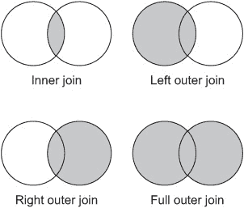

在本节中，我们将探讨 MapReduce 中的三种连接策略，这些策略支持两种最常见的连接类型（内连接和外连接）。这三种策略通过利用 MapReduce 的排序-合并架构，在 map 阶段或 reduce 阶段执行连接操作：

+   ***重新分区连接*** —适用于您要连接两个或更多大型数据集的情况的 reduce 端连接

+   ***复制连接*** —一种在其中一个数据集足够小以缓存的情况下工作的 map 端连接

+   ***半连接*** —另一种 map 端连接，其中一个数据集最初太大而无法放入内存，但在一些过滤之后可以减小到可以放入内存的大小

在我们介绍完这些连接策略之后，我们将查看一个决策树，以便您可以确定最适合您情况的最佳连接策略。

#### 连接数据

这些技术将利用两个数据集来执行连接操作——用户和日志。用户数据包含用户名、年龄和州。完整的数据集如下：

```
anne     22   NY
joe      39   CO
alison   35   NY
mike     69   VA
marie    27   OR
jim      21   OR
bob      71   CA
mary     53   NY
dave     36   VA
dude     50   CA
```

日志数据集显示了可以从应用程序或 Web 服务器日志中提取的一些基于用户的活动。数据包括用户名、操作和源 IP 地址。以下是完整的数据集：

```
jim     logout      93.24.237.12
mike    new_tweet   87.124.79.252
bob     new_tweet   58.133.120.100
mike    logout      55.237.104.36
jim     new_tweet   93.24.237.12
marie   view_user   122.158.130.90
jim     login       198.184.237.49
marie   login       58.133.120.100
```

让我们从查看根据您的数据应选择哪种连接方法开始。

#### 技巧 54 为您的数据选择最佳连接策略

本节中涵盖的每种连接策略都有不同的优缺点，确定哪种最适合您正在处理的数据可能具有挑战性。这项技术将查看数据的不同特性，并使用这些信息来选择连接数据的最佳方法。

##### 问题

您想要选择最佳方法来连接您的数据。

##### 解决方案

使用数据驱动的决策树来选择最佳连接策略。

##### 讨论

图 6.2 显示了您可以使用的决策树。^([1)]

> ¹ 此决策树是根据 Spyros Blanas 等人提出的决策树模型，在“MapReduce 中日志处理连接算法的比较”中提出的，[`pages.cs.wisc.edu/~jignesh/publ/hadoopjoin.pdf`](http://pages.cs.wisc.edu/~jignesh/publ/hadoopjoin.pdf)。

##### 图 6.2\. 选择连接策略的决策树

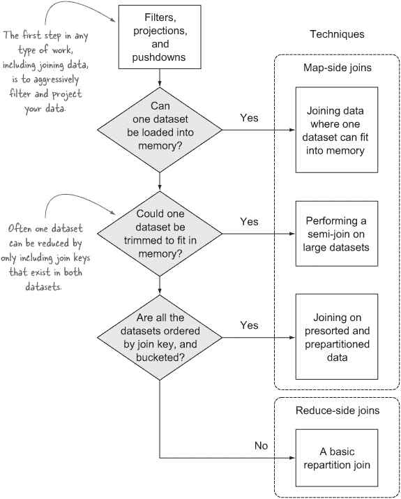

决策树可以总结为以下三个要点：

+   如果您的数据集之一足够小，可以放入映射器的内存中，则仅映射的复制连接效率很高。

+   如果两个数据集都很大，并且可以通过预过滤不匹配另一个数据集的元素来显著减少其中一个数据集，那么半连接（semi-join）效果很好。

+   如果您无法预处理数据，并且数据大小太大而无法缓存——这意味着您必须在 reducer 中执行连接——则需要使用重新分区连接。

无论您选择哪种策略，您在连接操作中最基本的活动之一应该是使用过滤和投影。

#### 技巧 55 过滤、投影和下推

在这项技术中，我们将探讨您如何有效地在映射器中使用过滤和投影来减少您正在处理的数据量，以及在 MapReduce 中的溢出。这项技术还探讨了更高级的优化，称为下推（pushdowns），这可以进一步提高您的数据管道效率。

##### 问题

您正在处理大量数据，并且想要高效地管理您的输入数据以优化您的作业。

##### 解决方案

过滤和投影您的数据，仅包括您将在工作中使用的数据点。

##### 讨论

在连接数据以及一般处理数据时，过滤和投影数据是您可以做出的最大优化。这是一种适用于任何 OLAP 活动的技术，在 Hadoop 中同样有效。

为什么过滤和投影如此重要？它们减少了处理管道需要处理的数据量。处理更少的数据很重要，尤其是在你推动数据跨越网络和磁盘边界时。MapReduce 中的洗牌步骤很昂贵，因为数据正在写入本地磁盘和通过网络传输，所以需要推送的字节数越少，你的作业和 MapReduce 框架的工作量就越少，这转化为更快的作业和更少的 CPU、磁盘和网络设备的压力。

图 6.3 展示了过滤和投影如何工作的一个简单示例。

##### 图 6.3\. 使用过滤和投影来减少数据大小

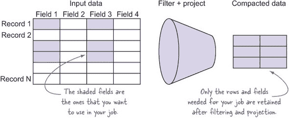

过滤和投影应尽可能接近数据源执行；在 MapReduce 中，这项工作最好在映射器中完成。以下代码展示了排除 30 岁以下用户并仅投影其姓名和状态的过滤器的示例：

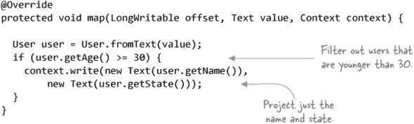

在连接中使用过滤器时面临的挑战是，你连接的数据集中可能并不包含你想要过滤的字段。如果情况如此，请查看技术 61，它讨论了使用布隆过滤器来帮助解决这个挑战。

##### 推下式

投影和谓词推下式通过将投影和谓词推到存储格式来进一步扩展过滤功能。这甚至更加高效，尤其是在与可以基于推下式跳过记录或整个块的存储格式一起工作时。

表 6.1 列出了各种存储格式以及它们是否支持推下式。

##### 表 6.1\. 存储格式及其推下式支持

| 格式 | 支持投影推下式？ | 支持谓词推下式？ |
| --- | --- | --- |
| 文本（CSV、JSON 等） | 否 | 否 |
| 协议缓冲区 | 否 | 否 |
| 节俭 | 否 | 否 |
| Avro^([a]) | 否 | 否 |
| Parquet | 是 | 是 |

> ^a Avro 具有行主序和列主序的存储格式。


##### 推下式存储的进一步阅读

第三章 包含了有关如何在作业中使用 Parquet 推下式的更多详细信息。


很明显，Parquet 的一大优势是它能够支持这两种类型的推下式。如果你正在处理大量数据集，并且经常只处理记录和字段的一个子集，那么你应该考虑将 Parquet 作为你的存储格式。

是时候继续实际连接技术了。

#### 6.1.1\. 映射端连接

我们对连接技术的覆盖将从查看在映射器中执行连接开始。我们将首先介绍这些技术的原因是，如果你的数据可以支持映射端连接，那么它们是最佳连接策略。与在映射器和还原器之间洗牌数据造成的开销相比，减少大小连接更昂贵。作为一般原则，映射端连接更受欢迎。

在本节中，我们将探讨三种不同的 map-side 连接类型。技术 56 在其中一个数据集已经足够小，可以缓存到内存中的情况下效果良好。技术 57 更为复杂，并且还要求在过滤掉两个数据集中都存在的连接键的记录后，一个数据集可以适合内存。技术 58 在您的数据按某种方式排序并分布到文件中的情况下工作。

#### 技术编号 56 在一个数据集可以适合到 mapper 的内存中执行连接

复制连接是一种 map-side 连接，其名称来源于其功能——数据集中最小的一个被复制到所有的 map 主机。复制连接依赖于这样一个事实，即要连接的数据集中有一个足够小，可以缓存到内存中。

##### 问题

您想在可以适合您 mapper 的内存中的数据上执行连接操作。

##### 解决方案

使用分布式缓存来缓存较小的数据集，并在较大的数据集被流式传输到 mapper 时执行连接。

##### 讨论

您将使用分布式缓存将小数据集复制到运行 map 任务的节点，并使用每个 map 任务的初始化方法将其加载到散列表中。使用来自大数据集的每个记录的键来查找小数据集的散列表，并在大数据集的记录与小数据集中匹配连接值的所有记录之间执行连接。图 6.4 展示了在 MapReduce 中复制的连接是如何工作的。

> ² Hadoop 的分布式缓存会在任何 map 或 reduce 任务在节点上执行之前，将位于 MapReduce 客户端主机上的文件或 HDFS 中的文件复制到从节点。任务可以从它们的本地磁盘读取这些文件，作为它们工作的一部分。

##### 图 6.4\. 仅 map 的复制连接

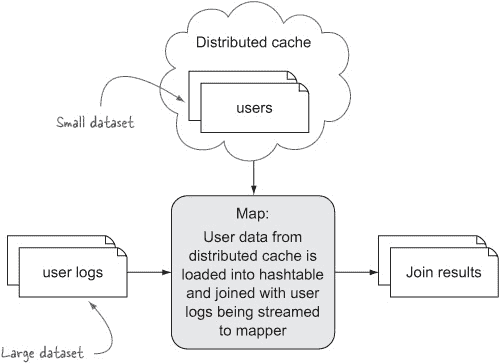

以下代码执行此连接：^([3])

> ³ GitHub 源代码：[`github.com/alexholmes/hiped2/blob/master/src/main/java/hip/ch6/joins/replicated/simple/ReplicatedJoin.java`](https://github.com/alexholmes/hiped2/blob/master/src/main/java/hip/ch6/joins/replicated/simple/ReplicatedJoin.java)。

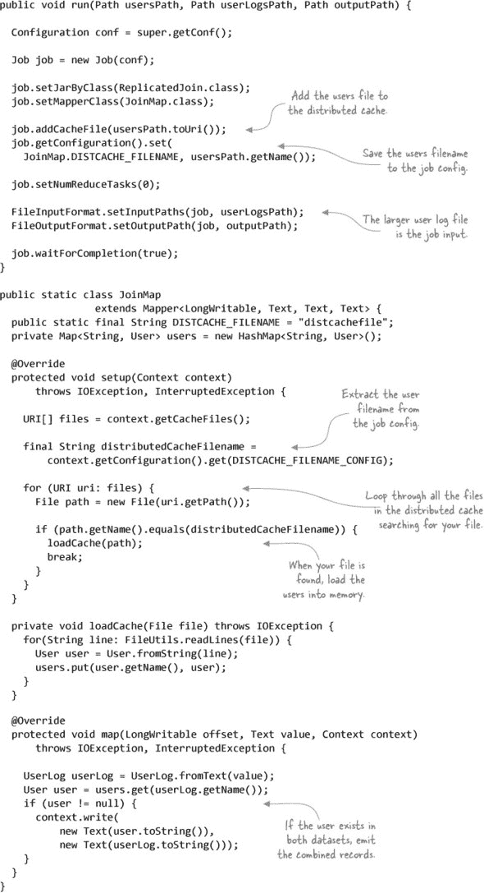

要执行此连接，您首先需要将您要连接的两个文件复制到 HDFS 中的家目录：

```
$ hadoop fs -put test-data/ch6/users.txt .
$ hadoop fs -put test-data/ch6/user-logs.txt .
```

然后，运行作业，并在完成后检查其输出：

```
$ hip hip.ch6.joins.replicated.simple.ReplicatedJoin \
    --users users.txt \
    --user-logs user-logs.txt \
    --output output

$ hadoop fs -cat output/part*
jim    21  OR  jim   logout    93.24.237.12
mike   69  VA  mike  new_tweet 87.124.79.252
bob    71  CA  bob   new_tweet 58.133.120.100
mike   69  VA  mike  logout    55.237.104.36
jim    21  OR  jim   new_tweet 93.24.237.12
marie  27  OR  marie view_user 122.158.130.90
jim    21  OR  jim   login     198.184.237.49
marie  27  OR  marie login     58.133.120.100
```

##### Hive

Hive 的连接操作可以通过在执行前配置作业来转换为 map-side 连接。重要的是最大的表应该是查询中的最后一个表，因为 Hive 会将这个表流式传输到 mapper 中（其他表将被缓存）：

```
set hive.auto.convert.join=true;

SELECT /*+ MAPJOIN(l) */ u.*, l.*
FROM users u
JOIN user_logs l ON u.name = l.name;
```


##### 减弱 map-join 提示

Hive 0.11 实现了一些变化，表面上消除了在 `SELECT` 语句中提供 map-join 提示的需要，但尚不清楚在哪些情况下提示不再需要（参见 [`issues.apache.org/jira/browse/HIVE-3784`](https://issues.apache.org/jira/browse/HIVE-3784)）。


在全连接或右外连接中，不支持在映射端进行连接；它们将作为重新分区连接（减少端连接）执行。

##### 摘要

可以通过复制连接支持内部和外部连接。此技术实现了一个内部连接，因为只有两个数据集中具有相同键的记录才会被输出。要将此转换为外部连接，您可以输出被发送到映射器的值，这些值在散列表中没有相应的条目，并且您可以类似地跟踪与流式映射记录匹配的散列表条目，并在映射任务结束时使用清理方法输出散列表中未与任何映射输入匹配的记录。

在数据集足够小以至于可以缓存在内存的情况下，是否有进一步优化映射端连接的方法？是时候看看半连接了。

#### 技巧 57 在大型数据集上执行半连接

想象一下这种情况：您正在处理两个大型数据集，您想将它们连接起来，例如用户日志和一个 OLTP 数据库中的用户数据。这两个数据集都不足以在映射任务的内存中缓存，所以您可能不得不接受执行减少端连接。但并不一定——问问自己这个问题：如果您删除了所有不匹配另一个数据集的记录，其中一个数据集是否可以放入内存中？

在我们的例子中，出现日志中的用户可能是您 OLTP 数据库中所有用户集的一小部分，因此通过删除所有未出现在日志中的 OLTP 用户，您可以将数据集的大小减少到适合内存的大小。如果是这种情况，半连接就是解决方案。图 6.5 显示了您需要执行以执行半连接的三个 MapReduce 作业。

##### 图 6.5\. 组成半连接的三个 MapReduce 作业

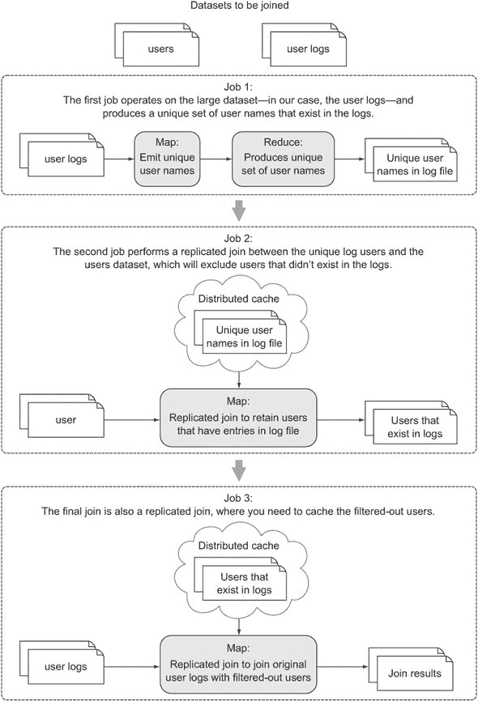

让我们看看编写半连接涉及哪些内容。

##### 问题

您想将大型数据集连接起来，同时避免洗牌和排序阶段的开销。

##### 解决方案

在这个技巧中，您将使用三个 MapReduce 作业将两个数据集连接起来，以避免在减少端连接中的开销。此技巧在处理大型数据集但可以通过过滤掉不匹配其他数据集的记录将作业减少到可以适应任务内存大小的情况中非常有用。

##### 讨论

在这个技巧中，您将分解图 6.5 中所示的三个作业。

##### 任务 1

第一个 MapReduce 作业的功能是生成存在于日志文件中的唯一用户名集合。你通过让 map 函数执行用户名的投影，然后通过 reducers 发射用户名来实现这一点。为了减少 map 和 reduce 阶段之间传输的数据量，你将在 map 任务中将所有用户名缓存到`HashSet`中，并在清理方法中发射`HashSet`的值。图 6.6 显示了该作业的流程。

##### 图 6.6\. 半连接的第一个作业生成了存在于日志文件中的唯一用户名集合。

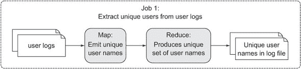

以下代码显示了 MapReduce 作业:^([4])

> ⁴ GitHub 源代码：[`github.com/alexholmes/hiped2/blob/master/src/main/java/hip/ch6/joins/semijoin/UniqueHashedKeyJob.java`](https://github.com/alexholmes/hiped2/blob/master/src/main/java/hip/ch6/joins/semijoin/UniqueHashedKeyJob.java).

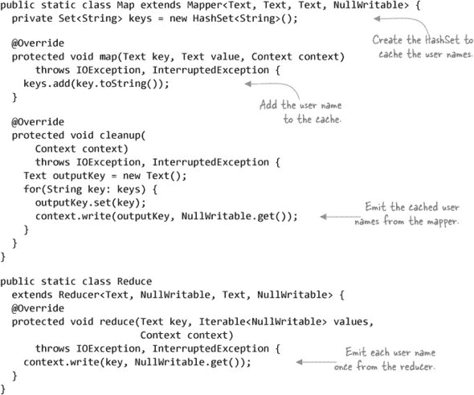

第一个作业的结果是出现在日志文件中的唯一用户集合。

##### 作业 2

第二步是一个复杂的过滤 MapReduce 作业，其目标是移除用户数据集中不存在于日志数据中的用户。这是一个仅使用 map 的作业，它使用复制连接来缓存出现在日志文件中的用户名，并将它们与用户数据集连接起来。作业 1 生成的唯一用户输出将比整个用户数据集小得多，这使得它成为缓存的理想选择。图 6.7 显示了该作业的流程。

##### 图 6.7\. 半连接中的第二个作业从用户数据集中移除了日志数据中缺失的用户。

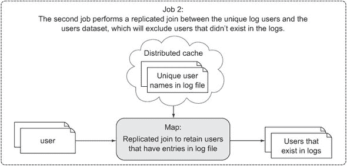

这是一个复制连接，就像你在之前的技巧中看到的那样。因此，这里我不会包括代码，但你可以在 GitHub 上轻松访问它.^([5])

> ⁵ GitHub 源代码：[`github.com/alexholmes/hiped2/blob/master/src/main/java/hip/ch6/joins/semijoin/ReplicatedFilterJob.java`](https://github.com/alexholmes/hiped2/blob/master/src/main/java/hip/ch6/joins/semijoin/ReplicatedFilterJob.java).

##### 作业 3

在这个最终步骤中，你将结合作业 2 生成的过滤用户与原始用户日志。现在过滤后的用户应该足够少，可以放入内存中，允许你将它们放入分布式缓存中。图 6.8 显示了该作业的流程。

##### 图 6.8\. 半连接中的第三个作业将作业 2 生成的用户与原始用户日志结合起来。

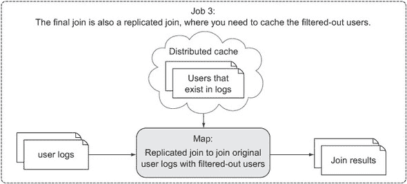

再次，你使用复制连接来执行这个连接，所以这里我不会展示相应的代码——请参考之前的技巧以获取更多关于复制连接的详细信息，或者直接访问 GitHub 获取这个作业的源代码.^([6])

> ⁶ GitHub 源代码：[`github.com/alexholmes/hiped2/blob/master/src/main/java/hip/ch6/joins/semijoin/FinalJoinJob.java`](https://github.com/alexholmes/hiped2/blob/master/src/main/java/hip/ch6/joins/semijoin/FinalJoinJob.java).

运行代码并查看前一个步骤产生的输出：

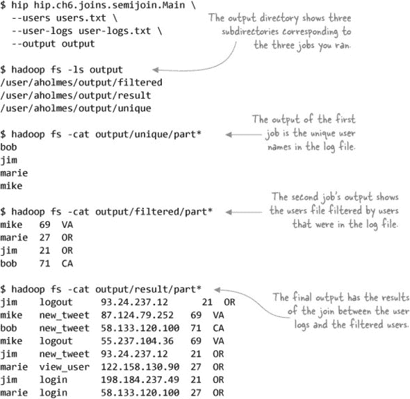

输出显示了半连接作业的逻辑进展和最终的连接输出。

##### 摘要

在这个技巧中，我们探讨了如何使用半连接将两个数据集合并在一起。半连接结构比其他连接涉及更多步骤，但即使处理大型数据集（前提是其中一个数据集必须减小到适合内存的大小），它也是一种使用 map-side join 的强大方式。

拥有这三种连接策略后，您可能会想知道在什么情况下应该使用哪一种。

#### 技巧 58 在预排序和预分区数据上连接

Map-side joins 是最有效的方法，前两种 map-side 策略都要求其中一个数据集可以加载到内存中。如果您正在处理无法按前一种技术减小到更小大小的的大型数据集，该怎么办？在这种情况下，复合 map-side join 可能是可行的，但前提是满足以下所有要求：

+   没有任何一个数据集可以完整地加载到内存中。

+   所有数据集都是按连接键排序的。

+   每个数据集都有相同数量的文件。

+   每个数据集的文件 *N* 包含相同的连接键 *K*。

+   每个文件的大小都小于 HDFS 块的大小，因此分区不会被分割。或者，也可以说，数据的输入拆分不会分割文件。

图 6.9 展示了一个示例，说明如何使用排序和分区文件进行复合连接。这项技术将探讨如何在您的作业中使用复合连接。

##### 图 6.9\. 作为复合连接输入的排序文件示例

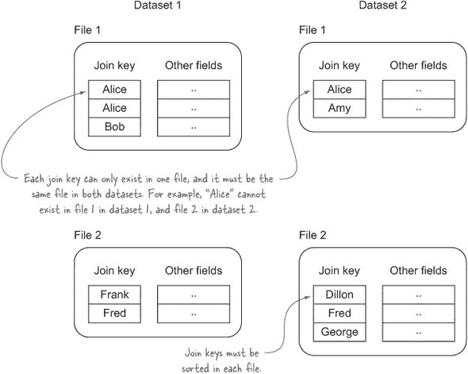

##### 问题

您想在排序、分区数据上执行 map-side join。

##### 解决方案

使用与 MapReduce 一起捆绑的 `CompositeInputFormat`。

##### 讨论

`CompositeInputFormat` 非常强大，支持内连接和外连接。以下示例展示了如何在您的数据上执行内连接：^([7])

> ⁷ GitHub 源代码：[`github.com/alexholmes/hiped2/blob/master/src/main/java/hip/ch6/joins/composite/CompositeJoin.java`](https://github.com/alexholmes/hiped2/blob/master/src/main/java/hip/ch6/joins/composite/CompositeJoin.java)。


复合连接要求输入文件按键排序（在我们的示例中是用户名），因此在运行示例之前，您需要排序这两个文件并将它们上传到 HDFS：

```
$ sort -k1,1 test-data/ch6/users.txt > users-sorted.txt
$ sort -k1,1 test-data/ch6/user-logs.txt > user-logs-sorted.txt
$ hadoop fs -put users-sorted.txt .
$ hadoop fs -put user-logs-sorted.txt .
```

接下来，运行作业并在完成后检查其输出：

```
$ hip hip.ch6.joins.composite.CompositeJoin \
    --users users-sorted.txt \
    --user-logs user-logs-sorted.txt \

    --output output

$ hadoop fs -cat output/part*
bob   71  CA  new_tweet  58.133.120.100
jim   21  OR  login      198.184.237.49
jim   21  OR  logout     93.24.237.12
jim   21  OR  new_tweet  93.24.237.12
marie 27  OR  login      58.133.120.100
marie 27  OR  view_user  122.158.130.90
mike  69  VA  logout     55.237.104.36
mike  69  VA  new_tweet  87.124.79.252
```

##### Hive

Hive 支持一种称为 *sort-merge join* 的 map-side join，其操作方式与该技术非常相似。它还要求两个表中的所有键都必须排序，并且表必须划分成相同数量的桶。您需要指定一些可配置的参数，并使用 `MAPJOIN` 指示符来启用此行为：

```
set hive.input.format=
org.apache.hadoop.hive.ql.io.BucketizedHiveInputFormat;
set hive.optimize.bucketmapjoin = true;
set hive.optimize.bucketmapjoin.sortedmerge = true;

SELECT /*+ MAPJOIN(l) */ u.*, l.*
FROM users u
JOIN user_logs l ON u.name = l.name;
```

##### 摘要

组合合并实际上支持*N*路合并，因此可以合并超过两个数据集。但是，所有数据集都必须符合在技术开始时讨论的限制。

由于每个 mapper 处理两个或多个数据输入，数据局部性只能存在于一个数据集中，因此其余的必须从其他数据节点流式传输。

这种连接在数据必须在运行连接之前存在的方式上确实有限制，但如果数据已经以这种方式布局，那么这是一种合并数据并避免基于 reducer 的连接中洗牌开销的好方法。

#### 6.1.2\. Reduce 端合并

如果地图端的技术对您的数据不起作用，您将需要使用 MapReduce 中的洗牌功能来排序和合并您的数据。以下技术提供了一些关于 reduce 端合并的技巧和窍门。

#### 技巧 59 基本分区合并

第一种技术是基本的 reduce 端合并，允许您执行内连接和外连接。

##### 问题

您想合并大型数据集。

##### 解决方案

使用 reduce 端分区合并。

##### 讨论

分区合并是一种 reduce 端合并，它利用 MapReduce 的排序合并功能来分组记录。它作为一个单独的 MapReduce 作业实现，并且可以支持*N*路合并，其中*N*是要合并的数据集数量。

map 阶段负责从各种数据集中读取数据，确定每条记录的 join 值，并将该 join 值作为输出键发出。输出值包含您在 reducer 中合并数据集以生成作业输出时希望包含的数据。

单个 reducer 调用接收由 map 函数发出的所有 join 键值，并将数据分成*N*个分区，其中*N*是要合并的数据集数量。在 reducer 读取所有输入记录并按内存中的分区进行分区后，它对所有分区执行笛卡尔积并发出每个合并的结果。图 6.10 展示了分区合并的高级视图。

##### 图 6.10\. 基本的 MapReduce 实现分区合并

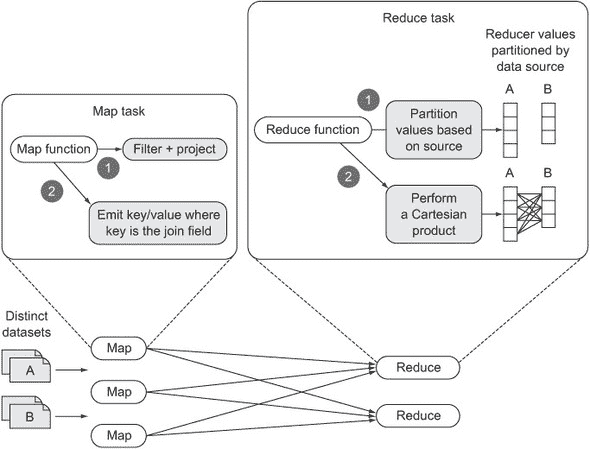

您的 MapReduce 代码需要支持以下技术：

+   它需要支持多个 map 类，每个类处理不同的输入数据集。这是通过使用`MultipleInputs`类来实现的。

+   它需要一种标记由 mapper 发出的记录的方法，以便可以将它们与它们的数据集关联起来。在这里，您将使用 htuple 项目来轻松地在 MapReduce 中处理复合数据.^([8])

    > ⁸ htuple ([`htuple.org`](http://htuple.org))是一个开源项目，旨在使在 MapReduce 中处理元组更容易。它是为了简化 MapReduce 中的二级排序而创建的。

分区合并的代码如下:^([9])

> ⁹ GitHub 源代码：[`github.com/alexholmes/hiped2/blob/master/src/main/java/hip/ch6/joins/repartition/SimpleRepartitionJoin.java`](https://github.com/alexholmes/hiped2/blob/master/src/main/java/hip/ch6/joins/repartition/SimpleRepartitionJoin.java).

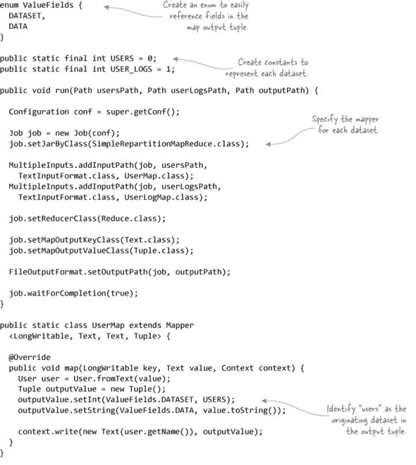

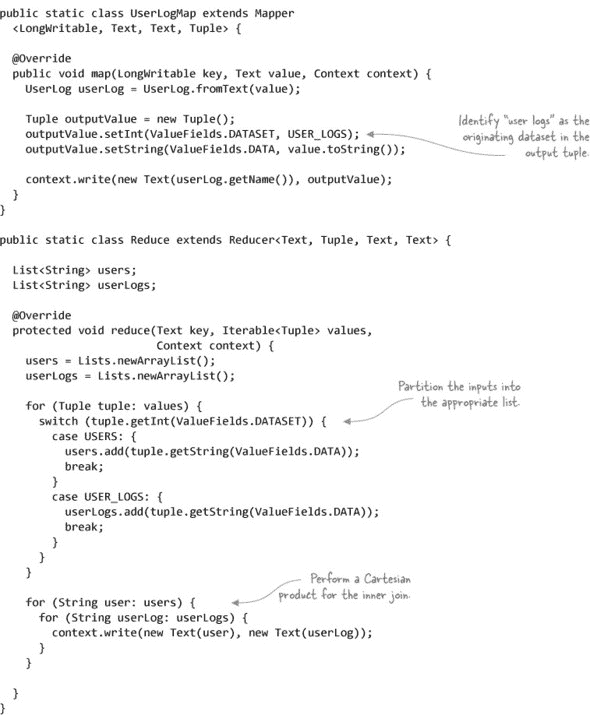

你可以使用以下命令来运行作业并查看作业输出：

```
$ hip hip.ch6.joins.repartition.SimpleRepartitionJoin \
    --users users.txt \
    --user-logs user-logs.txt \
    --output output

$ hadoop fs -cat output/part*
jim    21  OR  jim    login      198.184.237.49
jim    21  OR  jim    new_tweet  93.24.237.12
jim    21  OR  jim    logout     93.24.237.12
mike   69  VA  mike   logout     55.237.104.36
mike   69  VA  mike   new_tweet  87.124.79.252
bob    71  CA  bob    new_tweet  58.133.120.100
marie  27  OR  marie  login      58.133.120.100
marie  27  OR  marie  view_user  122.158.130.90
```

##### 摘要

Hadoop 附带了一个`hadoop-datajoin`模块，这是一个用于分区连接的框架。它包括处理多个输入数据集和执行连接的主要管道。

本技术中展示的示例以及`hadoop-datajoin`代码都是分区连接的最基本形式。两者都需要在执行笛卡尔积之前将连接键的所有数据加载到内存中。这可能适用于你的数据，但如果你的连接键的基数大于你的可用内存，那么你可能就无计可施了。接下来的技术将探讨一种可能绕过这个问题的方法。

#### 技术篇 60：优化分区连接

之前的分区连接实现不是空间高效的；它需要在执行多路连接之前将给定连接值的所有输出值加载到内存中。将较小数据集加载到内存中，然后遍历较大数据集，沿途执行连接会更有效。

##### 问题

你想在 MapReduce 中执行分区连接，但又不想承担在 reducer 中缓存所有记录的开销。

##### 解决方案

这种技术使用一个优化的分区连接框架，它只缓存要连接的数据集中的一项，以减少在 reducer 中缓存的数据量。

##### 讨论

这种优化的连接只缓存两个数据集中较小的一个的记录，以减少缓存所有记录的内存开销。图 6.11 显示了改进的分区连接的实际效果。

##### 图 6.11\. 优化后的 MapReduce 分区连接实现

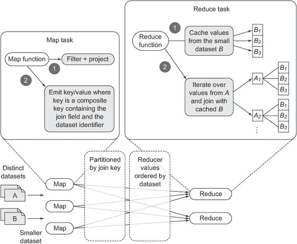

与前一种技术中展示的简单分区连接相比，这里有一些不同。在这个技术中，你使用二次排序来确保所有来自小数据集的记录在所有来自大数据集的记录之前到达 reducer。为了实现这一点，你将从 mapper 中发出包含要连接的用户名和一个标识原始数据集的字段的元组输出键。

以下代码显示了一个包含元组将包含的字段的枚举。它还显示了用户 mapper 如何填充元组字段:^([10])

> ¹⁰ GitHub 源代码：[`github.com/alexholmes/hiped2/blob/master/src/main/java/hip/ch6/joins/repartition/StreamingRepartitionJoin.java`](https://github.com/alexholmes/hiped2/blob/master/src/main/java/hip/ch6/joins/repartition/StreamingRepartitionJoin.java).

```
enum KeyFields {
  USER,
  DATASET
}

Tuple outputKey = new Tuple();
outputKey.setString(KeyFields.USER, user.getName());
outputKey.setInt(KeyFields.DATASET, USERS);
```

MapReduce 驱动代码需要更新，以指示元组中哪些字段用于排序、分区和分组：^([11])

> (11) 更详细的二次排序内容请见 第 6.2.1 节。

+   分区器应该只根据用户名进行分区，这样同一个用户的全部记录都会到达同一个 reducer。

+   排序应使用用户名和数据集指示符，以便首先对较小的数据集进行排序（由于 `USERS` 常量比 `USER_LOGS` 常量小，因此用户记录会在用户日志之前排序）。

+   分组应基于用户进行，以便两个数据集都流式传输到同一个 reducer 调用：

    ```
    ShuffleUtils.configBuilder()
        .setPartitionerIndices(KeyFields.USER)
        .setSortIndices(KeyFields.USER, KeyFields.DATASET)
        .setGroupIndices(KeyFields.USER)
        .configure(job.getConfiguration());
    ```

最后，你将修改 reducer 以缓存传入的用户记录，然后与用户日志进行连接：^([12])

> (12) GitHub 源代码：[`github.com/alexholmes/hiped2/blob/master/src/main/java/hip/ch6/joins/repartition/StreamingRepartitionJoin.java`](https://github.com/alexholmes/hiped2/blob/master/src/main/java/hip/ch6/joins/repartition/StreamingRepartitionJoin.java).

```
@Override
protected void reduce(Tuple key, Iterable<Tuple> values,
                      Context context){
  users = Lists.newArrayList();

  for (Tuple tuple : values) {
    switch (tuple.getInt(ValueFields.DATASET)) {
      case USERS: {
        users.add(tuple.getString(ValueFields.DATA));
        break;
      }
      case USER_LOGS: {
        String userLog = tuple.getString(ValueFields.DATA);
        for (String user : users) {
          context.write(new Text(user), new Text(userLog));
        }
          break;
      }
    }
  }
}
```

你可以使用以下命令来运行作业并查看作业输出：

```
$ hip hip.ch6.joins.repartition.StreamingRepartitionJoin \
    --users users.txt \
    --user-logs user-logs.txt \
    --output output

$ hadoop fs -cat output/part*
bob    71  CA  bob   new_tweet 58.133.120.100
jim    21  OR  jim   logout    93.24.237.12
jim    21  OR  jim   new_tweet 93.24.237.12
jim    21  OR  jim   login     198.184.237.49
marie  27  OR  marie view_user 122.158.130.90
marie  27  OR  marie login     58.133.120.1
mike   69  VA  mike  new_tweet 87.124.79.252
mike   69  VA  mike  logout    55.237.104.36
```

##### Hive

当执行重新分区连接时，Hive 可以支持类似的优化。Hive 可以缓存连接键的所有数据集，然后流式传输大型数据集，这样就不需要将其存储在内存中。

Hive 假设你在查询中最后指定的是最大的数据集。想象一下，你有两个表，名为 users 和 user_logs，其中 user_logs 表的数据量要大得多。为了连接这两个表，你需要确保在查询中最后引用的是 user_logs 表：

```
SELECT u.*, l.*
FROM users u
JOIN user_logs l ON u.name = l.name;
```

如果你不想重新排列你的查询，你可以使用 `STREAMTABLE` 指示来告诉 Hive 哪个表更大：

```
SELECT /*+ STREAMTABLE(l) */ u.*, l.*
FROM user_logs l
JOIN users u ON u.name = l.name;
```

##### 摘要

这种连接实现通过仅缓冲较小数据集的值来改进早期技术。但它仍然存在所有数据在 map 和 reduce 阶段之间传输的问题，这是一个昂贵的网络成本。

此外，前面的技术可以支持 *N*-way 连接，但此实现仅支持双向连接。

通过在 map 函数中积极进行投影和过滤，可以进一步减少 reduce 端连接的内存占用，正如在技巧 55 中所讨论的那样。

#### 技巧 61 使用 Bloom 过滤器减少洗牌数据

假设你想要根据某些谓词（例如“仅限居住在加利福尼亚的用户”）对数据子集执行连接操作。使用到目前为止所涵盖的重新分区作业技术，你将不得不在 reducer 中执行该过滤，因为只有一个数据集（用户）有关于州的信息——用户日志没有该信息。

在这种技术中，我们将探讨如何在 map 端使用 Bloom 过滤器，这可以大大影响作业执行时间。

##### 问题

你想在重新分区连接中过滤数据，但要将该过滤器推送到 Mapper。

##### 解决方案

使用预处理作业创建 Bloom 过滤器，然后在重新分区作业中加载 Bloom 过滤器以过滤 Mapper 中的记录。

##### 讨论

Bloom 过滤器是一个有用的概率数据结构，它提供的成员特性类似于集合——区别在于成员查找只提供明确的“否”答案，因为可能会得到假阳性。尽管如此，与 Java 中的 HashSet 相比，它们需要的内存要少得多，因此非常适合与非常大的数据集一起使用。

| |
| --- |

##### 更多关于 Bloom 过滤器的信息

第七章 提供了关于 Bloom 过滤器如何工作以及如何使用 MapReduce 并行创建 Bloom 过滤器的详细信息。

| |
| --- |

在这个技术中，你的目标是只对居住在加利福尼亚州的用户执行连接操作。这个解决方案有两个步骤——你首先运行一个作业来生成 Bloom 过滤器，该过滤器将操作用户数据并填充居住在加利福尼亚州的用户。然后，这个 Bloom 过滤器将在重新分区连接中使用，以丢弃不在 Bloom 过滤器中的用户。你需要这个 Bloom 过滤器的理由是，用户日志的 Mapper 没有关于用户州份的详细信息。

图 6.12 展示了该技术的步骤。

##### 图 6.12\. 在重新分区连接中使用 Bloom 过滤器的两步过程

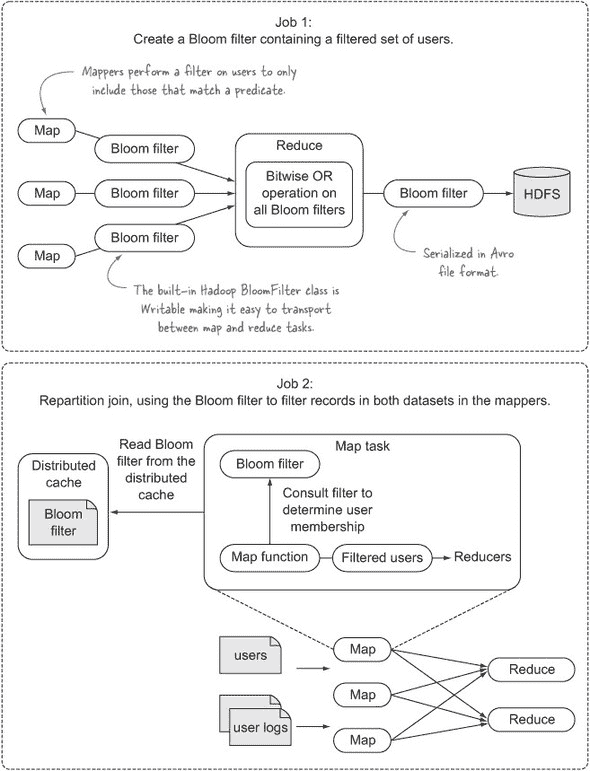

##### 第一步：创建 Bloom 过滤器

第一步是创建包含加利福尼亚州用户名称的 Bloom 过滤器。Mapper 生成中间 Bloom 过滤器，Reducer 将它们合并成一个单独的 Bloom 过滤器。作业输出是一个包含序列化 Bloom 过滤器的 Avro 文件：^([13])

> (13) GitHub 源代码：[`github.com/alexholmes/hiped2/blob/master/src/main/java/hip/ch6/joins/bloom/BloomFilterCreator.java`](https://github.com/alexholmes/hiped2/blob/master/src/main/java/hip/ch6/joins/bloom/BloomFilterCreator.java).

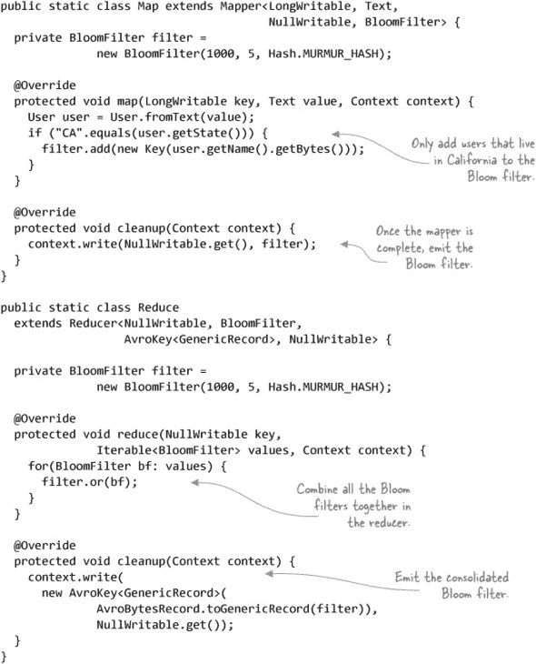

##### 第二步：重新分区连接

重新分区连接与第 59 技术中介绍的重新分区连接相同——唯一的区别是 Mapper 现在加载第一步生成的 Bloom 过滤器，在处理 Map 记录时，它们会对 Bloom 过滤器执行成员查询，以确定记录是否应该发送到 Reducer。

Reducer 与原始重新分区连接没有变化，所以下面的代码展示了两个东西：一个抽象的 Mapper，它泛化了 Bloom 过滤器的加载、过滤和排放，以及支持两个要连接的数据集的两个子类：^([14])

> (14) GitHub 源代码：[`github.com/alexholmes/hiped2/blob/master/src/main/java/hip/ch6/joins/bloom/BloomJoin.java`](https://github.com/alexholmes/hiped2/blob/master/src/main/java/hip/ch6/joins/bloom/BloomJoin.java).

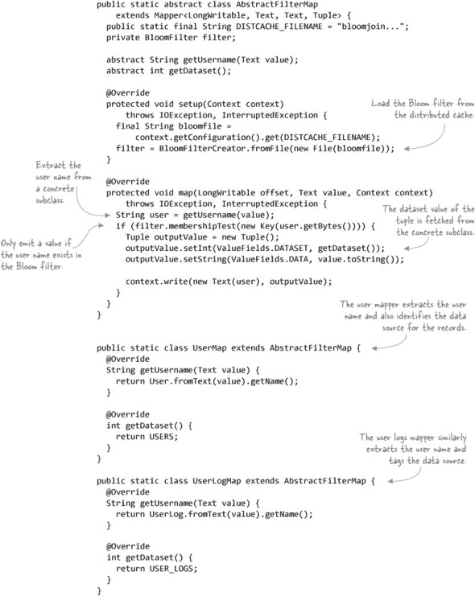

以下命令运行两个作业并输出 join 的结果：

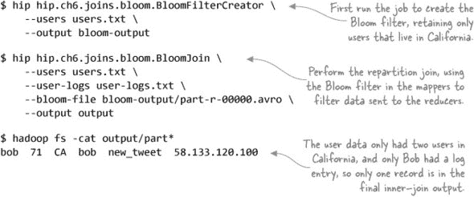

##### 摘要

本技术提出了一种在两个数据集上执行 map-side 过滤的有效方法，以最小化 mappers 和 reducers 之间的网络 I/O。它还减少了在 shuffle 过程中 mappers 和 reducers 需要写入和读取磁盘的数据量。过滤器通常是加速和优化你的作业最简单和最有效的方法，它们对于 repartition joins 和其他 MapReduce 作业同样有效。

为什么不使用散列表而不是 Bloom 过滤器来表示用户？为了构建一个具有 1%误报率的 Bloom 过滤器，你只需要为数据结构中的每个元素分配 9.8 位。与包含整数的`HashSet`的最佳使用情况相比，它需要 8 字节。或者，如果你有一个只反映元素存在而忽略冲突的`HashSet`，你将得到一个只有一个散列的 Bloom 过滤器，导致更高的误报率。

Pig 的 0.10 版本将包括对 Bloom 过滤器的支持，其机制与这里展示的类似。详细信息可以在 JIRA 票据[`issues.apache.org/jira/browse/PIG-2328`](https://issues.apache.org/jira/browse/PIG-2328)中查看。

在本节中，你了解到 Bloom 过滤器提供了良好的空间受限集合成员能力。我们探讨了如何在 Map-Reduce 中创建 Bloom 过滤器，并且你也应用了该代码到后续的技术中，这有助于你优化 MapReduce 半连接。

#### 6.1.3\. 数据倾斜在 reduce-side joins 中

本节涵盖了在连接大型数据集时遇到的一个常见问题——数据倾斜。你的数据中可能存在两种类型的数据倾斜：

+   高 join-key 基数，即某些 join keys 在一个或两个数据集中有大量记录。我称之为*join-product 倾斜*。

+   糟糕的 hash 分区，其中少数 reducers 接收了整体记录数的大比例。我称之为*hash-partitioning 倾斜*。

在严重的情况下，join-product 倾斜可能导致由于需要缓存的数据量而导致的堆耗尽问题。hash-partitioning 倾斜表现为一个耗时较长的 join，其中少数 reducers 的完成时间显著长于大多数 reducers。

本节中的技术检查了这两种情况，并提出了应对它们的建议。

#### 技术编号 62：使用高 join-key 基数连接大型数据集

本技术解决了 join-product 倾斜的问题，下一个技术将检查 hash-partitioning 倾斜。

##### 问题

一些你的 join keys 具有高基数，这导致一些 reducers 在尝试缓存这些键时内存不足。

##### 解决方案

过滤掉这些键并单独连接它们，或者在 reducer 中将它们溢出并安排一个后续作业来连接它们。

##### 讨论

如果你提前知道哪些键是高基数的，你可以将它们分离出来作为一个单独的连接作业，如图 6.13 所示。

##### 图 6.13. 在提前知道高基数键的情况下处理偏斜

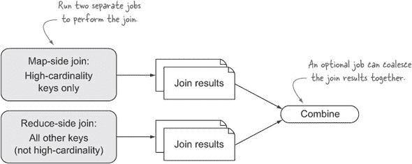

如果你不知道高基数键，你可能需要在你的 reducer 中构建一些智能来检测这些键并将它们写入一个副作用文件，随后由一个后续作业连接，如图 6.14 所示。

##### 图 6.14. 在不知道高基数键的情况下处理偏斜

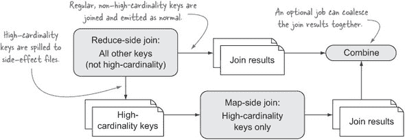

| |
| --- |

##### Hive 0.13

在 Hive 版本 0.13 之前，偏斜键实现有缺陷（[`issues.apache.org/jira/browse/HIVE-6041`](https://issues.apache.org/jira/browse/HIVE-6041)）。

| |
| --- |

##### Hive

Hive 支持一种与该技巧中提出的第二种方法类似的偏斜缓解策略。可以在运行作业之前通过指定以下可配置项来启用：


你可以可选地设置一些额外的可配置项来控制操作高基数键的 map-side join：


最后，如果你在 SQL 中使用`GROUP BY`，你可能还想考虑启用以下配置来处理分组数据中的偏斜：

```
SET hive.groupby.skewindata = true;
```

##### 摘要

本技巧中提出的选项假设对于给定的连接键，只有一个数据集有高基数发生；因此使用了缓存较小数据集的 map-side join。如果两个数据集都是高基数的，那么你将面临一个昂贵的笛卡尔积操作，这将执行缓慢，因为它不适合 MapReduce 的工作方式（这意味着它不是固有的可分割和可并行化的）。在这种情况下，你在优化实际连接方面实际上没有其他选择。你应该重新审视是否有一些回归基础的技术，如过滤或投影你的数据，可以帮助减轻执行连接所需的时间。

下一个技术探讨的是由于使用默认的哈希分区器而可能引入到你的应用程序中的不同类型的偏斜。

#### 技巧 63 处理由哈希分区器生成的偏斜

MapReduce 的默认分区器是一个哈希分区器，它对每个 map 输出键进行哈希处理，并对其与 reducer 数量的模数运算来确定键将被发送到的 reducer。哈希分区器作为一个通用分区器工作得很好，但有可能某些数据集会导致哈希分区器因不均衡数量的键被哈希到同一个 reducer 而使某些 reducer 过载。

这表现为少数拖沓的 reducer 完成时间比大多数 reducer 长得多。此外，当您检查拖沓 reducer 的计数器时，您会注意到发送给拖沓者的组数比其他已完成的其他组要高得多。


##### 区分由高基数键引起的偏斜与哈希分区器引起的偏斜

您可以使用 MapReduce 的 reducer 计数器来识别作业中的数据偏斜类型。由性能不佳的哈希分区器引入的偏斜将导致发送到这些 reducer 的组（唯一键）数量大大增加，而高基数键引起偏斜的症状则体现在所有 reducer 的组数大致相等，但偏斜 reducer 的记录数却大大增加。


##### 问题

您的 reduce 端连接完成时间较长，有几个拖沓的 reducer 完成时间比大多数 reducer 长得多。

##### 解决方案

使用范围分区器或编写一个自定义分区器，将偏斜键引导到一组预留的 reducer。

##### 讨论

这个解决方案的目的是放弃默认的哈希分区器，并替换为更适合您偏斜数据的东西。这里有您可以探索的两个选项：

+   您可以使用 Hadoop 附带的自定义采样器和`TotalOrderPartitioner`，它用范围分区器替换了哈希分区器。

+   您可以编写一个自定义分区器，将具有数据偏斜的键路由到一组为偏斜键预留的 reducer。

让我们探索这两个选项，并看看您将如何使用它们。

##### 范围分区

范围分区器将根据预定义的值范围分配 map 输出，其中每个范围映射到一个将接收该范围内所有输出的 reducer。这正是`TotalOrderPartitioner`的工作方式。事实上，`TotalOrderPartitioner`被 TeraSort 用于在所有 reducer 之间均匀分配单词，以最小化拖沓的 reducer。^(15)

> ^(15) TeraSort 是一个 Hadoop 基准测试工具，用于对 TB 级数据进行排序。

为了使范围分区器如`TotalOrderPartitioner`能够工作，它们需要知道给定作业的输出键范围。`TotalOrderPartitioner`附带一个采样器，该采样器采样输入数据并将这些范围写入 HDFS，然后由`TotalOrderPartitioner`在分区时使用。有关如何使用`TotalOrderPartitioner`和采样器的更多详细信息，请参阅第 6.2 节。

##### 自定义分区器

如果您已经掌握了哪些键表现出数据偏斜，并且这组键是静态的，您可以编写一个自定义分区器将这些高基数连接键推送到一组预留的 reducer。想象一下，您正在运行一个有十个 reducer 的作业——您可以选择使用其中两个来处理偏斜的键，然后对所有其他键在剩余的 reducer 之间进行哈希分区。

##### 摘要

在这里提出的两种方法中，范围分区可能是最好的解决方案，因为你可能不知道哪些键是倾斜的，而且随着时间的推移，表现出倾斜的键也可能发生变化。

在 MapReduce 中实现 reduce-side joins 是可能的，因为它们会排序并关联 map 输出的键。在下一节中，我们将探讨 MapReduce 中的常见排序技术。

### 6.2\. 排序

MapReduce 的魔力发生在 mapper 和 reducer 之间，框架将具有相同键的所有 map 输出记录组合在一起。这个 MapReduce 特性允许你聚合和连接数据，并实现强大的数据处理管道。为了执行此功能，MapReduce 内部对数据进行分区、排序和合并（这是洗牌阶段的一部分），结果是每个 reducer 都会流式传输一个有序的键值对集合。

在本节中，我们将探讨两个特定的领域，你将想要调整 MapReduce 排序的行为。

首先，我们将探讨二次排序，它允许你对 reducer 键的值进行排序。二次排序在需要某些数据在其它数据之前到达 reducer 的情况下很有用，例如在技术 60 中的优化 repartition join。如果想要你的作业输出按二次键排序，二次排序也非常有用。一个例子是，如果你想要按股票代码对股票数据进行主要排序，然后在一天中按每个股票报价的时间进行二次排序。

在本节中，我们将介绍第二个场景，即对所有 reducer 输出进行排序数据。这在需要从数据集中提取前 N 个或后 N 个元素的情况下很有用。

这些是重要的领域，允许你执行本章前面查看的一些连接操作。但排序的应用不仅限于连接；排序还允许你对数据进行二次排序。二次排序在本书中的许多技术中都有应用，从优化 repartition join 到朋友的朋友这样的图算法。

#### 6.2.1\. 二次排序

正如你在第 6.1 节关于连接的讨论中所见，你需要进行二次排序以允许某些记录在其它记录之前到达 reducer。二次排序需要理解 MapReduce 中的数据排列和数据流。展示了影响数据排列和流（分区、排序和分组）的三个要素以及它们如何集成到 MapReduce 中。

##### 图 6.15\. MapReduce 中排序、分区和分组发生的位置概述

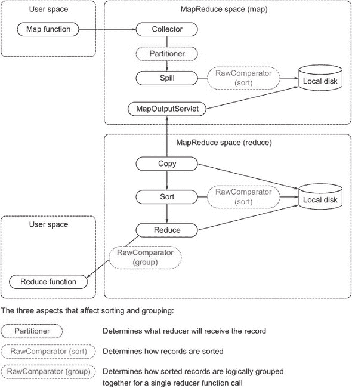

分区器在 map 输出收集过程中被调用，用于确定哪个 reducer 应该接收 map 输出。排序`RawComparator`用于对各自的分区内的 map 输出进行排序，并在 map 和 reduce 端都使用。最后，分组`RawComparator`负责确定排序记录之间的组边界。

在 MapReduce 中，默认行为是所有三个函数都操作由 map 函数发出的整个输出键。

#### 技巧 64 实现二级排序

当您希望某些唯一 map 键的值在 reducer 端先于其他值到达时，二级排序非常有用。您可以在本书的其他技术中看到二级排序的价值，例如优化的 repartition join（技巧 60），以及在第七章中讨论的 friends-of-friends 算法（技巧 68）。

##### 问题

您希望对每个键的单个 reducer 调用发送的值进行排序。

##### 解决方案

这个技巧涵盖了编写您的分区器、排序比较器和分组比较器类，这些类对于二级排序的正常工作是必需的。

##### 讨论

在这个技术中，我们将探讨如何使用二级排序来对人员姓名进行排序。您将使用主要排序来对人员的姓氏进行排序，并使用二级排序来对他们的名字进行排序。

为了支持二级排序，您需要创建一个复合输出键，该键将由您的 map 函数发出。复合键将包含两部分：

+   *自然键*，用于连接的键

+   *二级键*，是用于对自然键发送给 reducer 的所有值进行排序的键

图 6.16 展示了姓名的复合键。它还显示了一个复合值，它为 reducer 端提供了对二级键的访问。

##### 图 6.16\. 用户复合键和值

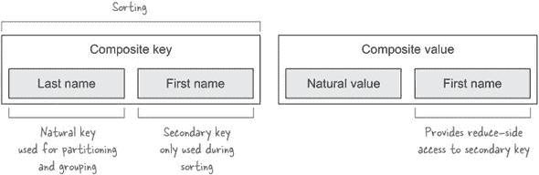

让我们逐一分析分区、排序和分组阶段，并实现它们以对姓名进行排序。但在那之前，您需要编写您的复合键类。

##### 复合键

复合键包含姓氏和名字。它扩展了`WritableComparable`，这是推荐用于作为 map 函数键发出的`Writable`类的：^([16])

> ^[(16) GitHub 源代码](https://github.com/alexholmes/hiped2/blob/master/src/main/java/hip/ch6/sort/secondary/Person.java).

```
public class Person implements WritableComparable<Person> {

  private String firstName;
  private String lastName;

  @Override
  public void readFields(DataInput in) throws IOException {
    this.firstName = in.readUTF();
    this.lastName = in.readUTF();
  }

  @Override
  public void write(DataOutput out) throws IOException {
    out.writeUTF(firstName);
    out.writeUTF(lastName);
  }
...
```

图 6.17 展示了您在代码中调用的配置名称和方法，以设置分区、排序和分组类。该图还显示了每个类使用的复合键的哪个部分。

##### 图 6.17\. 分区、排序和分组设置及键利用

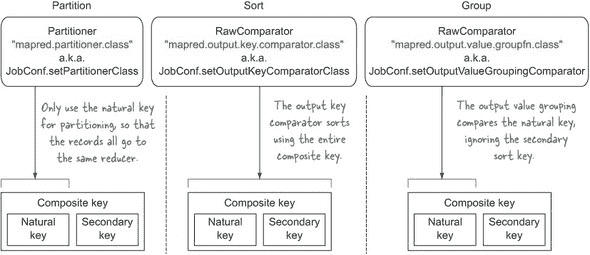

让我们看看这些类的实现代码。

##### 分区器

分区器用于确定哪个 reducer 应该接收一个 map 输出记录。默认的 MapReduce 分区器（`HashPartitioner`）调用输出键的`hashCode`方法，并使用 reducer 的数量进行取模运算，以确定哪个 reducer 应该接收输出。默认的分区器使用整个键，这对于你的复合键来说可能不起作用，因为它可能会将具有相同自然键值的键发送到不同的 reducer。相反，你需要编写自己的`Partitioner`，该分区器基于自然键进行分区。

以下代码显示了必须实现的`Partitioner`接口。`getPartition`方法接收键、值和分区数（也称为*reducers*）：

```
public interface Partitioner<K2, V2> extends JobConfigurable {
  int getPartition(K2 key, V2 value, int numPartitions);
}
```

你的分区器将根据`Person`类中的姓氏计算一个哈希值，并使用分区数（即 reducer 的数量）进行取模运算：^(17)

> ^(17) GitHub 源代码：[`github.com/alexholmes/hiped2/blob/master/src/main/java/hip/ch6/sort/secondary/PersonNamePartitioner.java`](https://github.com/alexholmes/hiped2/blob/master/src/main/java/hip/ch6/sort/secondary/PersonNamePartitioner.java).

```
public class PersonNamePartitioner extends
    Partitioner<Person, Text> {

  @Override
  public int getPartition(Person key, Text value, int numPartitions) {
    return Math.abs(key.getLastName().hashCode() * 127) %
        numPartitions;
  }
}
```

##### 排序

map 端和 reduce 端都参与排序。map 端的排序是一种优化，有助于使 reducer 排序更高效。你希望 MapReduce 使用你的整个键进行排序，这将根据姓氏和名字对键进行排序。

在以下示例中，你可以看到`WritableComparator`的实现，它根据用户的姓氏和名字进行比较：^(18)

> ^(18) GitHub 源代码：[`github.com/alexholmes/hiped2/blob/master/src/main/java/hip/ch6/sort/secondary/PersonComparator.java`](https://github.com/alexholmes/hiped2/blob/master/src/main/java/hip/ch6/sort/secondary/PersonComparator.java).

```
public class PersonComparator extends WritableComparator {
  protected PersonComparator() {
    super(Person.class, true);
  }

  @Override
  public int compare(WritableComparable w1, WritableComparable w2) {

    Person p1 = (Person) w1;
    Person p2 = (Person) w2;

    int cmp = p1.getLastName().compareTo(p2.getLastName());
    if (cmp != 0) {
      return cmp;
    }

    return p1.getFirstName().compareTo(p2.getFirstName());
  }
}
```

##### 分组

分组发生在 reduce 阶段从本地磁盘流式传输 map 输出记录时。分组是你可以指定如何组合记录以形成一个逻辑记录序列的过程，用于 reducer 调用。

当你处于分组阶段时，所有记录已经按照二级排序顺序排列，分组比较器需要将具有相同姓氏的记录捆绑在一起：^(19)

> ^(19) GitHub 源代码：[`github.com/alexholmes/hiped2/blob/master/src/main/java/hip/ch6/sort/secondary/PersonNameComparator.java`](https://github.com/alexholmes/hiped2/blob/master/src/main/java/hip/ch6/sort/secondary/PersonNameComparator.java).

```
public class PersonNameComparator extends WritableComparator {

  protected PersonNameComparator() {
    super(Person.class, true);
  }

  @Override
  public int compare(WritableComparable o1, WritableComparable o2) {

    Person p1 = (Person) o1;
    Person p2 = (Person) o2;

    return p1.getLastName().compareTo(p2.getLastName());

  }
}
```

##### MapReduce

最后的步骤包括告诉 MapReduce 使用分区器、排序比较器和分组比较器类：^(20)

> ^(20) GitHub 源代码：[`github.com/alexholmes/hiped2/blob/master/src/main/java/hip/ch6/sort/secondary/SortMapReduce.java`](https://github.com/alexholmes/hiped2/blob/master/src/main/java/hip/ch6/sort/secondary/SortMapReduce.java).

```
job.setPartitionerClass(PersonNamePartitioner.class);
job.setSortComparatorClass(PersonComparator.class);
job.setGroupingComparatorClass(PersonNameComparator.class);
```

要完成这项技术，你需要编写 map 和 reduce 代码。mapper 创建复合键，并与之一起输出第一个名称作为输出值。reducer 产生与输入相同的输出:^([21])

> ^(21) GitHub 源代码：[`github.com/alexholmes/hiped2/blob/master/src/main/java/hip/ch6/sort/secondary/SortMapReduce.java`](https://github.com/alexholmes/hiped2/blob/master/src/main/java/hip/ch6/sort/secondary/SortMapReduce.java)。

```
public static class Map extends Mapper<Text, Text, Person, Text> {

  private Person outputKey = new Person();

  @Override
  protected void map(Text lastName, Text firstName, Context context)
      throws IOException, InterruptedException {
    outputKey.set(lastName.toString(), firstName.toString());
    context.write(outputKey, firstName);
  }
}

public static class Reduce extends Reducer<Person, Text, Text, Text> {

  Text lastName = new Text();
  @Override
  public void reduce(Person key, Iterable<Text> values,
                     Context context)
      throws IOException, InterruptedException {
    lastName.set(key.getLastName());
    for (Text firstName : values) {
      context.write(lastName, firstName);
    }
  }
}
```

要查看这种排序的实际效果，你可以上传一个包含无序名称的小文件，并测试二次排序代码是否产生按姓名排序的输出：

```
$ hadoop fs -put test-data/ch6/usernames.txt .

$ hadoop fs -cat usernames.txt
Smith John
Smith Anne
Smith Ken

$ hip hip.ch6.sort.secondary.SortMapReduce \
    --input usernames.txt --output output

$ hadoop fs -cat output/part*
Smith Anne
Smith John
Smith Ken
```

输出按预期排序。

##### 摘要

正如你在这种技术中看到的那样，使用二次排序并不简单。它要求你编写自定义的分区器、排序器和分组器。如果你正在处理简单的数据类型，可以考虑使用我开发的开源项目 htuple ([`htuple.org/`](http://htuple.org/))，它简化了作业中的二次排序。

htuple 公开了一个`Tuple`类，它允许你存储一个或多个 Java 类型，并提供辅助方法，使你能够轻松定义用于分区、排序和分组的字段。以下代码展示了如何使用 htuple 在第一个名称上进行二次排序，就像在技术中一样：

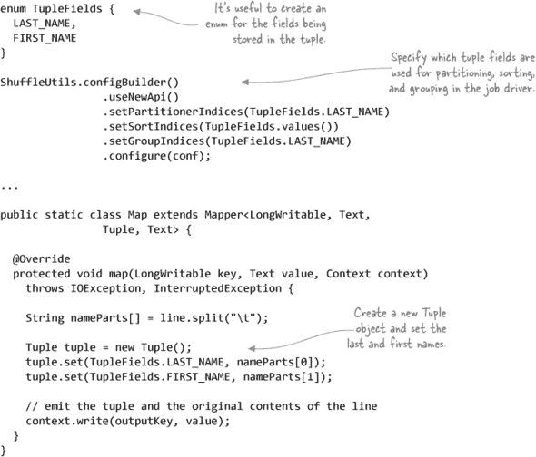

接下来，我们将探讨如何在多个 reducer 之间排序输出。

#### 6.2.2\. 完全排序

你会发现许多情况下，你希望你的作业输出处于完全排序顺序.^([22]) 例如，如果你想从网页图中提取最受欢迎的 URL，你必须按某些度量标准（如 Page-Rank）对图进行排序。或者，如果你想在你网站的门户中显示最活跃用户的表格，你需要能够根据某些标准（如他们撰写的文章数量）对他们进行排序。

> ^(22) 完全排序是指 reducer 记录在所有 reducer 之间排序，而不仅仅是每个 reducer 内部。

#### 技术篇 65 在多个 reducer 之间排序键

你知道 MapReduce 框架在将输出键传递给 reducer 之前会对 map 输出键进行排序。但这种排序仅在每个 reducer 内部得到保证，除非你为你的作业指定分区器，否则你将使用默认的 MapReduce 分区器`HashPartitioner`，它使用 map 输出键的哈希值进行分区。这确保了具有相同 map 输出键的所有记录都发送到同一个 reducer，但`HashPartitioner`不会对所有 reducer 的 map 输出键进行完全排序。了解这一点后，你可能想知道如何使用 Map-Reduce 在多个 reducer 之间对键进行排序，以便你可以轻松地从你的数据中提取最顶部和最底部的*N*条记录。

##### 问题

你希望在作业输出中键的完全排序，但不需要运行单个 reducer 的开销。

##### 解决方案

该技术涵盖了使用与 Hadoop 一起打包的 `TotalOrderPartitioner` 类，该分区器有助于对所有 reducers 的输出进行排序。该分区器确保发送给 reducers 的输出是完全有序的。

##### 讨论

Hadoop 有一个内置的分区器，称为 `TotalOrderPartitioner`，它根据分区文件将键分配到特定的 reducers。分区文件是一个预计算的 SequenceFile，其中包含 *N* – 1 个键，其中 *N* 是 reducers 的数量。分区文件中的键按 map 输出键比较器排序，因此每个键代表一个逻辑键范围。为了确定哪个 reducer 应该接收输出记录，`TotalOrderPartitioner` 检查输出键，确定它所在的范围，并将该范围映射到特定的 reducer。

图 6.18 展示了该技术的两个部分。您需要创建分区文件，然后使用 `TotalOrderPartitioner` 运行您的 MapReduce 作业。

##### 图 6.18\. 使用采样和 `TotalOrderPartitioner` 对所有 reducers 的输出进行排序。

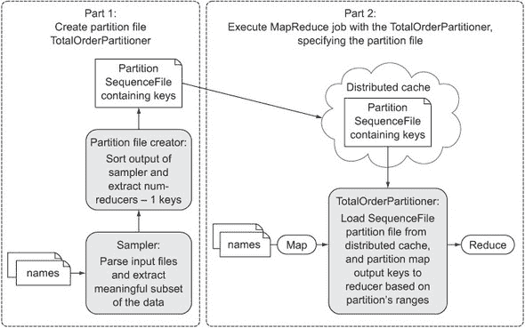

首先，您将使用 `InputSampler` 类，该类从输入文件中采样并创建分区文件。您可以使用两种采样器之一：名为 `RandomSampler` 的类，正如其名称所示，它从输入中随机选择记录，或者名为 `IntervalSampler` 的类，对于每条记录都将其包含在样本中。一旦提取了样本，它们将被排序，然后写入分区文件中的 *N* – 1 个键，其中 *N* 是 reducers 的数量。`InputSampler` 不是一个 MapReduce 作业；它从 `InputFormat` 中读取记录，并在调用代码的过程中生成分区。

以下代码显示了在调用 `InputSampler` 函数之前需要执行的步骤：^([23])

> ²³ GitHub 源代码：[`github.com/alexholmes/hiped2/blob/master/src/main/java/hip/ch6/sort/total/TotalSortMapReduce.java`](https://github.com/alexholmes/hiped2/blob/master/src/main/java/hip/ch6/sort/total/TotalSortMapReduce.java)。

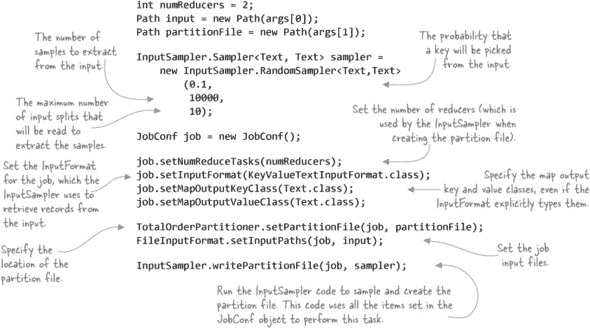

接下来，您需要指定您想要将 `TotalOrderPartitioner` 作为作业的分区器：

```
job.setPartitionerClass(TotalOrderPartitioner.class);
```

您不希望在 MapReduce 作业中进行任何处理，因此您不会指定 map 或 reduce 类。这意味着将使用身份 MapReduce 类，因此您可以运行代码：

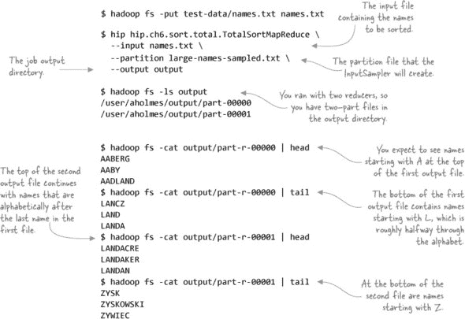

您可以从 MapReduce 作业的结果中看到，map 输出键确实在所有输出文件中进行了排序。

##### 摘要

该技术使用了 `InputSampler` 来创建分区文件，该文件随后被 `TotalOrderPartitioner` 用于对 map 输出键进行分区。

你也可以使用 MapReduce 生成分区文件。一种高效的方法是编写一个自定义的`InputFormat`类，该类执行抽样并将键输出到单个 reducer，然后 reducer 可以创建分区文件。这把我们带到了本章的最后一部分：抽样。

### 6.3. 抽样

想象你正在处理一个千兆级的数据集，并且你想要使用这个数据集测试你的 MapReduce 应用程序。运行你的 MapReduce 应用程序可能需要数小时，并且不断地对代码进行优化并重新运行大型数据集并不是一个最佳的工作流程。

要解决这个问题，你可以考虑使用抽样，这是一种从总体中提取相关子集的统计方法。在 MapReduce 的上下文中，抽样提供了一种在不等待整个数据集被读取和处理的情况下处理大型数据集的机会。这大大提高了你在开发和调试 MapReduce 代码时快速迭代的效率。

#### 技巧 66 编写水库抽样 InputFormat

你正在迭代地使用大型数据集开发 MapReduce 作业，并且需要进行测试。使用整个数据集进行测试需要很长时间，并阻碍了你快速与代码工作的能力。

##### 问题

你希望在开发 MapReduce 作业期间使用大型数据集的一个小子集。

##### 解决方案

编写一个可以包装实际用于读取数据的输入格式的输入格式。你将要编写的输入格式可以配置为从包装的输入格式中提取的样本数量。

##### 讨论

在这个技巧中，你将使用水库抽样来选择样本。水库抽样是一种策略，允许对数据流进行一次遍历以随机生成样本.^(24) 因此，它非常适合 MapReduce，因为输入记录是从输入源流式传输的。图 6.19 展示了水库抽样的算法。

> ^(24) 关于水库抽样的更多信息，请参阅维基百科上的文章：[`en.wikipedia.org/wiki/Reservoir_sampling`](http://en.wikipedia.org/wiki/Reservoir_sampling)。

##### 图 6.19。水库抽样算法允许对数据流进行一次遍历以随机生成样本。


输入拆分确定和记录读取将委托给包装的`InputFormat`和`RecordReader`类。你将编写提供抽样功能的类，然后包装委托的`InputFormat`和`RecordReader`类.^(25)图 6.20 展示了`ReservoirSamplerRecordReader`的工作方式。

> ^(25) 如果你需要对这些类进行复习，请参阅第三章以获取更多详细信息。chapter 3。

##### 图 6.20。`ReservoirSamplerRecordReader`的实际操作


以下代码展示了`ReservoirSamplerRecordReader`：^(26）

> ^([26] GitHub 源：[`github.com/alexholmes/hiped2/blob/master/src/main/java/hip/ch6/sampler/ReservoirSamplerInputFormat.java`](https://github.com/alexholmes/hiped2/blob/master/src/main/java/hip/ch6/sampler/ReservoirSamplerInputFormat.java)).

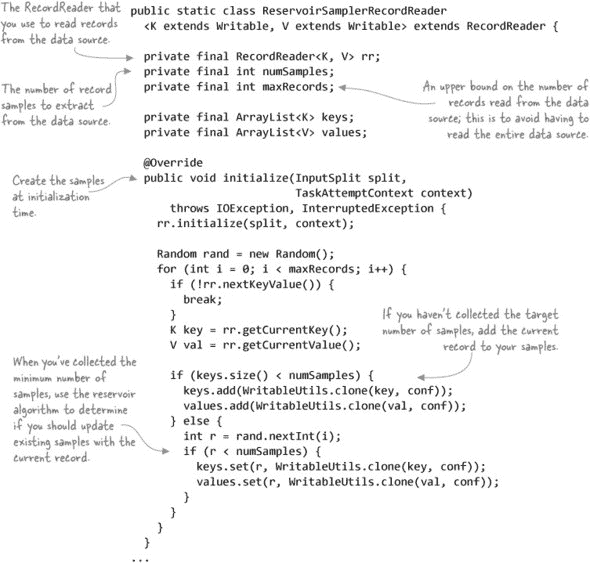

要在您的代码中使用`ReservoirSamplerInputFormat`类，您将使用便利方法来帮助设置输入格式和其他参数，如下面的代码所示:^(27])

> ^([27] GitHub 源：[`github.com/alexholmes/hiped2/blob/master/src/main/java/hip/ch6/sampler/SamplerJob.java`](https://github.com/alexholmes/hiped2/blob/master/src/main/java/hip/ch6/sampler/SamplerJob.java))

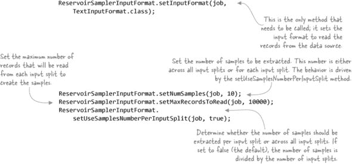

您可以通过运行一个针对包含名称的大文件的标识符作业来查看采样输入格式的实际效果。

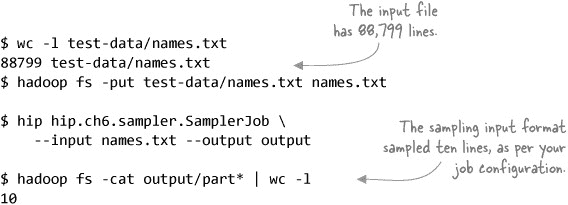

您已配置`ReservoirSamplerInputFormat`以提取十个样本，输出文件包含相应数量的行。

##### 总结

在 MapReduce 代码中的采样支持可以在工程师对生产规模数据集运行代码时成为一个有用的开发和测试特性。这引发了一个问题：将采样支持集成到现有代码库中的最佳方法是什么？一种方法可能是添加一个可配置的选项，用于切换采样输入格式的使用，类似于以下代码：

```
if(appConfig.isSampling()) {

  ReservoirSamplerInputFormat.setInputFormat(job,
    TextInputFormat.class);
  ...
} else {
  job.setInputFormatClass(TextInputFormat.class);
}
```

您可以将这种采样技术应用于前面的任何部分，作为高效处理大数据集的一种方式。

### 6.4. 章节总结

连接和排序在 MapReduce 中是繁琐的任务，我们在本章讨论了优化和简化它们使用的方法。我们研究了三种不同的连接策略，其中两种在 map 端，一种在 reduce 端。目标是简化 MapReduce 中的连接，我介绍了两个减少连接所需用户代码量的框架。

我们还通过检查二级排序的工作原理以及如何对所有 reducer 的输出进行排序来介绍了 MapReduce 中的排序。我们通过查看如何采样数据以便快速遍历数据的小样本来结束讨论。

我们将在第八章中介绍多个性能模式和调整步骤，这将导致更快的连接和排序时间。但在我们到达那里之前，我们将探讨一些更高级的数据结构和算法，例如图处理和使用 Bloom 过滤器。

## 第七章. 在大规模数据中利用数据结构和算法

*本章涵盖*

+   在 MapReduce 中表示和使用数据结构，如图、HyperLogLog 和 Bloom 过滤器

+   将 PageRank 和半连接等算法应用于大量数据

+   学习社交网络公司如何推荐与网络外的人建立联系

在本章中，我们将探讨如何在 MapReduce 中实现算法以处理互联网规模的数据。我们将关注非平凡数据，这些数据通常使用图来表示。

我们还将探讨如何使用图来模拟实体之间的连接，例如社交网络中的关系。我们将运行一系列在图上可以执行的有用算法，如最短路径和好友好友（FoF），以帮助扩展网络的互联性，以及 PageRank，它研究如何确定网页的流行度。

你将学习如何使用布隆过滤器，它独特的空间节省特性使其在解决 P2P（对等）和分布式数据库中的分布式系统问题时变得很有用。我们还将创建 MapReduce 中的布隆过滤器，并探讨它们在过滤方面的有用性。

你还将了解另一种近似数据结构 HyperLogLog，它提供近似唯一计数，这在聚合管道中非常有价值。

一章关于可扩展算法的内容，如果没有提及排序和连接算法，那就不是完整的。这些算法在第六章中有详细讲解。

让我们从如何使用 MapReduce 来模拟图开始。

### 7.1。使用图建模数据和解决问题

图是表示一组相互连接的对象的数学结构。它们用于表示数据，例如互联网的超链接结构、社交网络（其中它们表示用户之间的关系）以及互联网路由，以确定转发数据包的最佳路径。

一个图由多个节点（正式称为*顶点*）和连接节点的链接（非正式称为*边*）组成。图 7.1 展示了带有节点和边的图。

##### 图 7.1。一个带有突出显示的节点和边的简单图

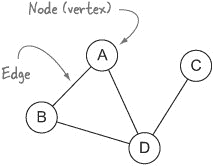

边可以是定向的（意味着单向关系）或非定向的。例如，你会使用一个有向图来模拟社交网络中用户之间的关系，因为关系并不总是双向的。图 7.2 展示了有向图和非有向图的示例。

##### 图 7.2。有向图和非有向图

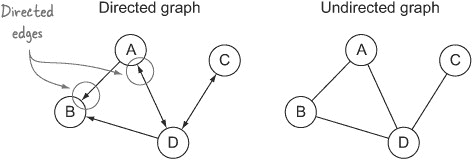

有向图，其中边有方向，可以是循环的或非循环的。在循环图中，一个顶点可以通过遍历一系列边来达到自身。在一个非循环图中，一个顶点不可能通过遍历路径来达到自身。图 7.3 展示了循环图和非循环图的示例。

##### 图 7.3。循环图和非循环图

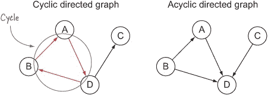

要开始使用图，你需要在代码中能够表示它们。那么，表示这些图结构常用的方法有哪些呢？

#### 7.1.1。图建模

表示图的两种常见方式是使用*邻接矩阵*和*邻接表*。

##### 邻接矩阵

使用邻接矩阵，你将图表示为一个 *N* x *N* 的正方形矩阵 *M*，其中 *N* 是节点的数量，而 *Mij* 表示节点 *i* 和 *j* 之间的边。

图 7.4 展示了一个表示社交图中连接的有向图。箭头表示两个人之间的一对一关系。邻接矩阵显示了如何表示这个图。

##### 图 7.4\. 图的邻接矩阵表示

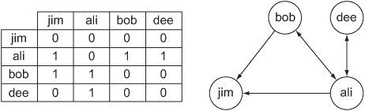

邻接矩阵的缺点是它们既表示了关系的存在，也表示了关系的缺失，这使得它们成为密集的数据结构，需要比邻接表更多的空间。

##### 邻接表

邻接表与邻接矩阵类似，但它们不表示关系的缺失。图 7.5 展示了如何使用邻接表表示一个图。

##### 图 7.5\. 图的邻接表表示

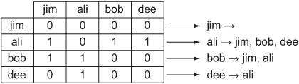

邻接表的优点是它提供了数据的稀疏表示，这是好的，因为它需要更少的空间。它也适合在 Map-Reduce 中表示图，因为键可以表示一个顶点，而值是一个表示有向或无向关系节点的顶点列表。

接下来我们将介绍三个图算法，首先是最短路径算法。

#### 7.1.2\. 最短路径算法

最短路径算法是图论中一个常见问题，其目标是找到两个节点之间的最短路径。图 7.6 展示了在边没有权重的图上的该算法的一个示例，在这种情况下，最短路径是源节点和目标节点之间跳数或中间节点数最少的路径。

##### 图 7.6\. 节点 A 和 E 之间的最短路径示例

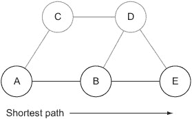

该算法的应用包括在交通映射软件中确定两个地址之间的最短路径，路由器计算每条路径的最短路径树，以及社交网络确定用户之间的连接。

#### 技巧 67 查找两个用户之间的最短距离

Dijkstra 算法是计算机科学本科课程中常教的最短路径算法。一个基本的实现使用顺序迭代过程遍历整个图，从起始节点开始，如图 7.7 中展示的算法所示。

##### 图 7.7\. Dijkstra 算法的伪代码

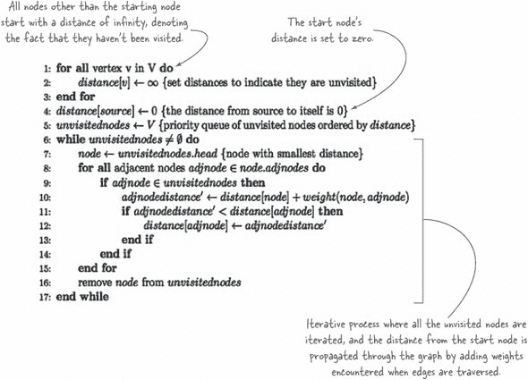

基本算法不能扩展到超出你的内存大小的图，它也是顺序的，并且没有针对并行处理进行优化。

##### 问题

你需要使用 MapReduce 在社交图中找到两个人之间的最短路径。

##### 解答

使用邻接矩阵来建模图，并为每个节点存储从原始节点到该节点的距离，以及一个指向原始节点的回指针。使用映射器来传播到原始节点的距离，并使用归约器来恢复图的初始状态。迭代直到达到目标节点。

##### 讨论

图 7.8 显示了用于此技术的一个小社交网络。你的目标是找到 Dee 和 Joe 之间的最短路径。从 Dee 到 Joe 有四条路径可以选择，但只有其中一条路径的跳数最少。

##### 图 7.8. 用于此技术的社交网络


你将实现一个并行广度优先搜索算法来找到两个用户之间的最短路径。由于你在一个社交网络上操作，你不需要关心边的权重。该算法的伪代码可以在图 7.9 中看到。

##### 图 7.9. 使用 MapReduce 在图上进行广度优先并行搜索的伪代码

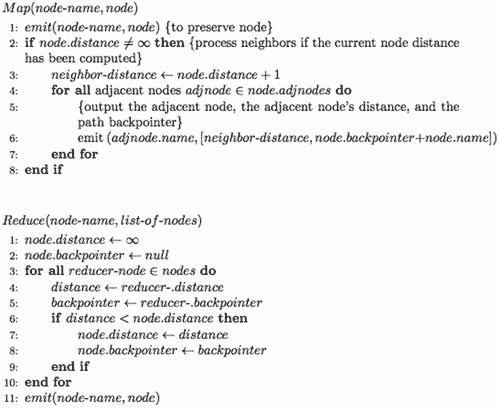

图 7.10 显示了你的社交图中的算法迭代。就像 Dijkstra 算法一样，你将开始时将所有节点的距离设置为无限大，并将起始节点 Dee 的距离设置为零。随着每次 MapReduce 遍历，你将确定没有无限距离的节点，并将它们的距离值传播到它们的相邻节点。你将继续这样做，直到达到终点。

##### 图 7.10. 通过网络的最短路径迭代

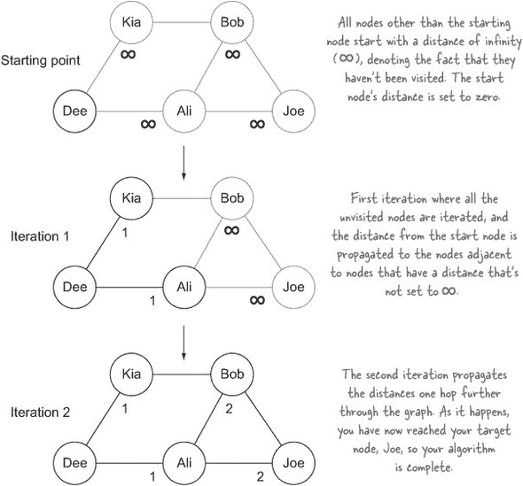

你首先需要创建起点。这是通过从文件中读取社交网络（存储为邻接表）并设置初始距离值来完成的。图 7.11 显示了两种文件格式，第二种是你在 MapReduce 代码中迭代使用的格式。

##### 图 7.11. 原始社交网络文件格式和为算法优化的 MapReduce 格式

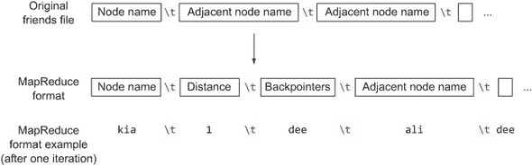

你的第一步是从原始文件创建 MapReduce 格式。以下列表显示了原始输入文件和由转换代码生成的 MapReduce 准备好的输入文件：

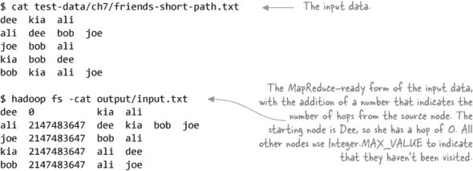

生成前面输出的代码在此处显示：^([1])

> ¹ GitHub 源代码：[`github.com/alexholmes/hiped2/blob/master/src/main/java/hip/ch7/shortestpath/Main.java`](https://github.com/alexholmes/hiped2/blob/master/src/main/java/hip/ch7/shortestpath/Main.java).

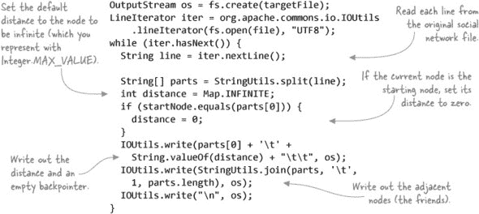

MapReduce 数据结构在算法的迭代过程中没有改变；每个作业都产生相同的结构，这使得迭代变得容易，因为输入格式与输出格式相同。

您的 map 函数将执行两个主要任务。首先，它输出所有节点数据以保留图的原始结构。如果您不这样做，您就不能将其作为一个交互式过程，因为 reducer 将无法为下一个 map 阶段重新生成原始图结构。map 的第二个任务是输出具有距离和回溯指针的相邻节点（如果节点具有非无穷大的距离数）。回溯指针携带有关从起始节点访问的节点信息，因此当您到达终点节点时，您就知道到达那里的确切路径。以下是 map 函数的代码.^([2])

> ² GitHub 源代码：[`github.com/alexholmes/hiped2/blob/master/src/main/java/hip/ch7/shortestpath/Map.java`](https://github.com/alexholmes/hiped2/blob/master/src/main/java/hip/ch7/shortestpath/Map.java).

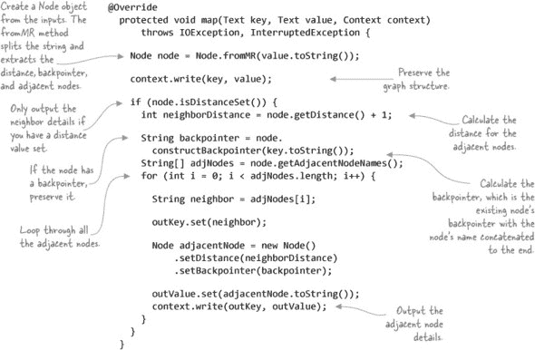

当输出原始输入节点以及相邻节点及其距离时，map 输出值的格式（而非内容）与 reducer 读取数据时相同，这使得 reducer 更容易读取数据。为此，您使用`Node`类来表示节点的概念、其相邻节点以及从起始节点的距离。它的`toString`方法生成数据的`String`形式，该形式用作 map 输出键，如下所示.^([3])

> ³ GitHub 源代码：[`github.com/alexholmes/hiped2/blob/master/src/main/java/hip/ch7/shortestpath/Node.java`](https://github.com/alexholmes/hiped2/blob/master/src/main/java/hip/ch7/shortestpath/Node.java).

##### 列表 7.1. `Node`类帮助在 MapReduce 代码中进行序列化

```
public class Node {
  private int distance = INFINITE;
  private String backpointer;
  private String[] adjacentNodeNames;

  public static int INFINITE = Integer.MAX_VALUE;
  public static final char fieldSeparator = '\t';

...

  public String constructBackpointer(String name) {
    StringBuilder backpointer = new StringBuilder();
    if (StringUtils.trimToNull(getBackpointer()) != null) {
      backpointers.append(getBackpointer()).append(":");
    }
    backpointer.append(name);
    return backpointer.toString();
  }

  @Override
  public String toString() {
    StringBuilder sb = new StringBuilder();
    sb.append(distance)
        .append(fieldSeparator)
        .append(backpointer);

    if (getAdjacentNodeNames() != null) {
      sb.append(fieldSeparator)
          .append(StringUtils
              .join(getAdjacentNodeNames(), fieldSeparator));
    }
    return sb.toString();
  }

  public static Node fromMR(String value) throws IOException {
    String[] parts = StringUtils.splitPreserveAllTokens(
        value, fieldSeparator);
    if (parts.length < 2) {
      throw new IOException(
          "Expected 2 or more parts but received " + parts.length);
    }
    Node node = new Node()
        .setDistance(Integer.valueOf(parts[0]))
        .setBackpointer(StringUtils.trimToNull(parts[1]));
    if (parts.length > 2) {
      node.setAdjacentNodeNames(Arrays.copyOfRange(parts, 2,
          parts.length));
    }
    return node;
  }
```

对于每个节点，都会调用 reducer，并为其提供一个包含所有相邻节点及其最短路径的列表。它遍历所有相邻节点，通过选择具有最小最短路径的相邻节点来确定当前节点的最短路径。然后，reducer 输出最小距离、回溯指针和原始相邻节点。以下列表显示了此代码.^([4])

> ⁴ GitHub 源代码：[`github.com/alexholmes/hiped2/blob/master/src/main/java/hip/ch7/shortestpath/Reduce.java`](https://github.com/alexholmes/hiped2/blob/master/src/main/java/hip/ch7/shortestpath/Reduce.java).

##### 列表 7.2. 最短路径算法的 reducer 代码

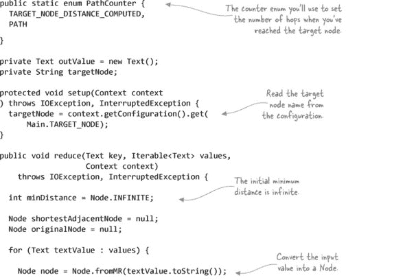

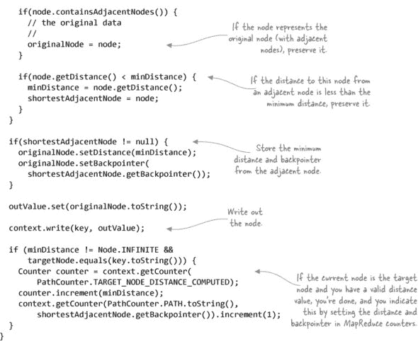

您已准备好运行代码。您需要将输入文件复制到 HDFS 中，然后启动 MapReduce 作业，指定起始节点名称（`dee`）和目标节点名称（`joe`）：

```
$ hadoop fs -put \
    test-data/ch7/friends-short-path.txt \
    friends-short-path.txt

$ hip hip.ch7.shortestpath.Main \
    --start dee \
    --end joe \
    --input friends-short-path.txt \
    --output output

==========================================
= Shortest path found, details as follows.
=
= Start node:  dee
= End node:    joe
= Hops:        2
= Path:        dee:ali
==========================================

$ hadoop fs -cat output/2/part*
ali  1  dee      dee  bob  joe
bob  2  dee:kia  kia  ali  joe
dee  0           kia  ali
joe  2  dee:ali  bob  ali
kia  1  dee      bob  dee
```

您的工作输出显示，Dee 和 Joe 之间的最小跳数是 2，并且 Ali 是连接节点。

##### 摘要

这个练习展示了如何使用最短路径算法来确定社交网络中两个人之间的最小跳数。与最短路径算法相关的一个算法，称为*图直径估计*，试图确定节点之间的平均跳数.^([5]) 这已被用于支持在具有数百万个节点的庞大社交网络图中的*六度分隔*概念.^([6))

> ⁵参见 U. Kang 等人，“HADI：使用 Hadoop 在大型图中进行快速直径估计和挖掘”（2008 年 12 月），[`reports-archive.adm.cs.cmu.edu/anon/ml2008/CMU-ML-08-117.pdf`](http://reports-archive.adm.cs.cmu.edu/anon/ml2008/CMU-ML-08-117.pdf)。
> 
> ⁶参见 Lars Backstrom 等人，“四度分隔”，[`arxiv.org/abs/1111.4570`](http://arxiv.org/abs/1111.4570)。

| |
| --- |

##### 使用 MapReduce 进行迭代图处理的低效性

从 I/O 的角度来看，使用 Map-Reduce 进行图处理是低效的——每个图迭代都在单个 MapReduce 作业中执行。因此，整个图结构必须在作业之间写入 HDFS（三份，或者根据您的 HDFS 复制设置），然后由后续作业读取。可能需要大量迭代的图算法（如这个最短路径示例）最好使用 Giraph 执行，这在 7.1.4 节中有介绍。

| |
| --- |

最短路径算法有多个应用，但在社交网络中可能更有用且更常用的算法是朋友的朋友（FoF）。

#### 7.1.3\. 朋友的朋友算法

社交网站如 LinkedIn 和 Facebook 使用朋友的朋友（FoF）算法来帮助用户扩大他们的网络。

#### 技巧 68 计算 FoF

朋友的朋友算法建议用户可能认识但不是他们直接网络一部分的朋友。对于这种技术，我们将 FoF 视为第二度分隔，如图 7.12 图 7.12 所示。

##### 图 7.12\. 一个 Joe 和 Jon 被认为是 Jim 的 FoF 的 FoF 示例

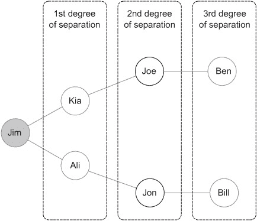

使用这种方法取得成功的关键是要按共同朋友的数量对 FoF 进行排序，这样可以增加用户知道 FoF 的可能性。

##### 问题

您想使用 MapReduce 实现 FoF 算法。

##### 解决方案

计算社交网络中每个用户的 FoF 需要两个 MapReduce 作业。第一个作业计算每个用户的共同朋友，第二个作业根据与朋友之间的连接数对共同朋友进行排序。然后，您可以根据这个排序列表选择顶级 FoF 来推荐新朋友。

##### 讨论

您应该首先查看一个示例图，了解您正在寻找的结果。图 7.13 显示了 Jim，一个用户，被突出显示的人的网络。在这个图中，Jim 的 FoF 用粗圆圈表示，并且 FoF 和 Jim 共同拥有的朋友数量也被识别出来。

##### 图 7.13。表示 Jim 的 FoFs 的图

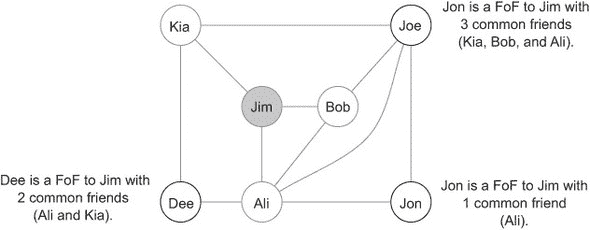

你的目标是确定所有的好友好友（FoFs）并按共同好友的数量进行排序。在这种情况下，你预期的结果应该是将 Joe 作为第一个 FoF 推荐，其次是 Dee，然后是 Jon。

表示此技术的社会图的文本文件如下所示：

```
$ cat test-data/ch7/friends.txt
joe  jon  kia  bob  ali
kia  joe  jim  dee
dee  kia  ali
ali  dee  jim  bob  joe  jon
jon  joe  ali
bob  joe  ali  jim
jim  kia  bob  ali
```

此算法要求你编写两个 MapReduce 作业。第一个作业，其伪代码如图 7.14 所示，计算 FoFs，并为每个 FoF 计算共同好友的数量。作业的结果是每个 FoF 关系的行，不包括已经是朋友的人。

##### 图 7.14。计算 FoFs 的第一个 MapReduce 作业

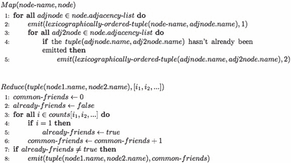

当你对此图（图 7.13）执行此作业时的输出如下所示：

```
ali  kia  3
bob  dee  1
bob  jon  2
bob  kia  2
dee  jim  2
dee  joe  2
dee  jon  1
jim  joe  3
jim  jon  1
jon  kia  1
```

第二个作业需要生成按共同好友数量排序的 FoFs 的输出。图 7.15 显示了算法。你正在使用辅助排序来按共同好友数量对用户的 FoFs 进行排序。

##### 图 7.15。按共同好友数量排序 FoFs 的第二个 MapReduce 作业

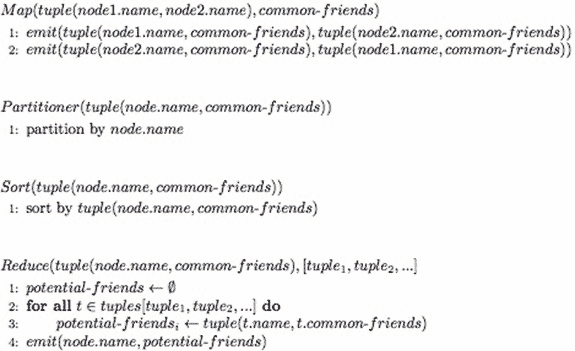

执行此作业对前一个作业输出的输出可以在此处看到：

```
ali  kia:3
bob  kia:2,jon:2,dee:1
dee  jim:2,joe:2,jon:1,bob:1
jim  joe:3,dee:2,jon:1
joe  jim:3,dee:2
jon  bob:2,kia:1,dee:1,jim:1
kia  ali:3,bob:2,jon:1
```

让我们深入代码。以下列表显示了第一个 MapReduce 作业，该作业计算每个用户的 FoFs.^([7])

> GitHub 源代码：[`github.com/alexholmes/hiped2/blob/master/src/main/java/hip/ch7/friendsofafriend/CalcMapReduce.java`](https://github.com/alexholmes/hiped2/blob/master/src/main/java/hip/ch7/friendsofafriend/CalcMapReduce.java).

##### 列表 7.3。FoF 计算的 Mapper 和 reducer 实现

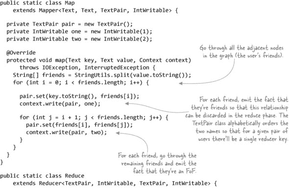

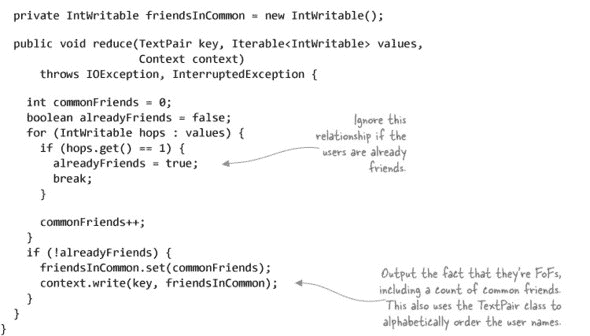

下面的列表中第二个 MapReduce 作业的作业是对 FoFs 进行排序，以便你可以看到拥有更多共同好友的 FoFs 排在拥有较少共同好友的 FoFs 之前.^([8])

> GitHub 源代码：[`github.com/alexholmes/hiped2/blob/master/src/main/java/hip/ch7/friendsofafriend/SortMapReduce.java`](https://github.com/alexholmes/hiped2/blob/master/src/main/java/hip/ch7/friendsofafriend/SortMapReduce.java).

##### 列表 7.4。排序 FoFs 的 Mapper 和 reducer 实现

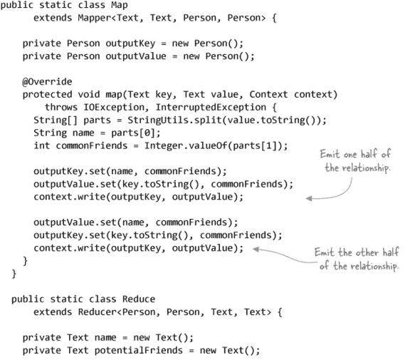

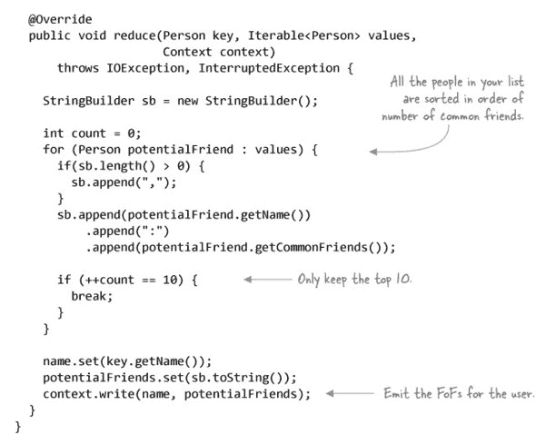

我不会展示整个驱动代码，但为了启用辅助排序，我不得不编写几个额外的类，并通知作业使用这些类进行分区和排序的目的：^([9])

> GitHub 源代码：[`github.com/alexholmes/hiped2/blob/master/src/main/java/hip/ch7/friendsofafriend/Main.java`](https://github.com/alexholmes/hiped2/blob/master/src/main/java/hip/ch7/friendsofafriend/Main.java).

```
job.setPartitionerClass(PersonNamePartitioner.class);
job.setSortComparatorClass(PersonComparator.class);
job.setGroupingComparatorClass(PersonNameComparator.class);
```

更多关于辅助排序如何工作的详细信息，请参阅第六章 kindle_split_018.html#ch06。

将包含朋友关系的输入文件复制到 HDFS 中，然后运行驱动代码来运行你的两个 MapReduce 作业。最后两个参数是两个 MapReduce 作业的输出目录：

```
$ hadoop fs -put test-data/ch7/friends.txt .
$ hip hip.ch7.friendsofafriend.Main \
    --input friends.txt \
    --calc-output outputcalc \
    --sort-output outputsort
```

运行你的代码后，你可以在 HDFS 中查看输出：

```
$ hadoop fs -cat outputsort/part*
ali  kia:3
bob  kia:2,jon:2,dee:1
dee  jim:2,joe:2,jon:1,bob:1
jim  joe:3,dee:2,jon:1
joe  jim:3,dee:2
jon  bob:2,kia:1,dee:1,jim:1
kia  ali:3,bob:2,jon:1
```

这个输出验证了你自己在图 7.13 中看到的内容。Jim 有三个 FoFs，它们按照共同朋友的数量排序。

##### 摘要

这种方法不仅可以作为推荐引擎帮助用户扩展他们的网络，还可以在用户浏览社交网络网站时用于信息目的。例如，当你查看 LinkedIn 上的人时，你会看到你与被查看的人之间的分离度。这种方法可以用来预先计算两个跳的信息。为了复制三个跳（例如，显示朋友的朋友的朋友），你需要引入第三个 MapReduce 作业来从第一个作业的输出中计算第三个跳。

为了简化这种方法，我们使用了一个无向图，这意味着用户关系是双向的。大多数社交网络没有这样的概念，算法需要一些小的调整来模拟有向图。

这个例子需要两个 MapReduce 作业来完成算法，这意味着整个图在作业之间被写入 HDFS。考虑到作业的数量，这并不特别低效，但一旦你在图数据上的迭代次数超过两次，可能就是时候开始寻找更有效的工作方式来处理你的图数据了。你将在下一个技术中看到这一点，其中将使用 Giraph 来计算网页的流行度。

#### 7.1.4\. 使用 Giraph 在网页图上计算 PageRank

使用 MapReduce 进行迭代图处理引入了许多低效性，这在图 7.16 中被突出显示。

##### 图 7.16\. 使用 MapReduce 实现的迭代图算法

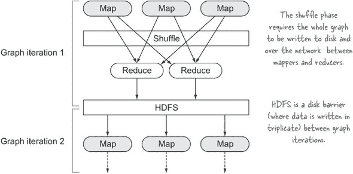

如果你的图算法只需要一两次迭代，这并不是你应该担心的事情，但超过这个范围，作业之间的连续 HDFS 屏障将开始累积，尤其是在大型图的情况下。到那时，是时候考虑图处理的替代方法了，比如 Giraph。

本节介绍了 Giraph 的概述，并将其应用于在网页图上计算 PageRank。PageRank 非常适合 Giraph，因为它是一个迭代图算法的例子，在图收敛之前可能需要多次迭代。

##### Giraph 简介

Giraph 是一个基于 Google 的 Pregel 的 Apache 项目，它描述了一个用于大规模图处理系统。Pregel 被设计用来减少使用 MapReduce 进行图处理的低效性，并提供一个以顶点为中心的编程模型。

为了克服 MapReduce 中存在的磁盘和网络屏障，Giraph 将所有顶点加载到多个工作进程的内存中，并在整个过程中保持它们在内存中。每个图迭代由工作者向他们管理的顶点提供输入、顶点执行其处理以及顶点随后发出消息组成，这些消息由框架路由到图中适当的相邻顶点（如图 7.17 所示）。

##### 图 7.17\. Giraph 消息传递

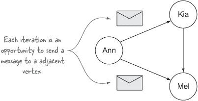

Giraph 使用批量同步通信（BSP）来支持工作者的通信。BSP 本质上是一种迭代消息传递算法，它在连续迭代之间使用全局同步屏障。图 7.18 显示了 Giraph 工作者，每个工作者包含多个顶点，以及通过屏障进行的工作者间通信和同步。

##### 图 7.18\. Giraph 工作者，消息传递和同步

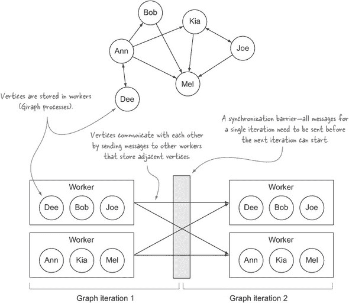

技巧 69 将进一步深入细节，但在我们深入之前，让我们快速看一下 PageRank 是如何工作的。

##### PageRank 简述

PageRank 是由 Google 的创始人于 1998 年在斯坦福大学期间提出的公式。他们的论文讨论了爬取和索引整个网络的整体方法，其中包括他们称之为*PageRank*的计算，它为每个网页分配一个分数，表示网页的重要性。这不是第一个提出为网页引入评分机制的论文，^([10))但它是最先根据总出链数来权衡传播到每个出链的分数的。

> ^([10]) 参见 Sergey Brin 和 Lawrence Page，“大规模超文本搜索引擎的解剖学”，[`infolab.stanford.edu/pub/papers/google.pdf`](http://infolab.stanford.edu/pub/papers/google.pdf)。
> 
> ^([11]) 在 PageRank 之前，HITS 链接分析方法很流行；参见 Christopher D. Manning、Prabhakar Raghavan 和 Hinrich Schütze 的*信息检索导论*中的“枢纽和权威”页面，[`nlp.stanford.edu/IR-book/html/htmledition/hubs-and-authorities-1.html`](http://nlp.stanford.edu/IR-book/html/htmledition/hubs-and-authorities-1.html)。

基本上，PageRank 给具有大量入链的页面分配比具有较少入链的页面更高的分数。在评估页面的分数时，PageRank 使用所有入链的分数来计算页面的 PageRank。但它通过将出链 PageRank 除以出链数量来惩罚具有大量出链的个别入链。图 7.19 展示了具有三个页面及其相应 PageRank 值的简单网页图的一个简单示例。

##### 图 7.19\. 简单网页图的 PageRank 值

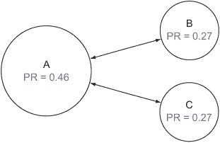

图 7.20 显示了 PageRank 公式。在公式中，*|webGraph|*是图中所有页面的计数，而*d*，设置为 0.85，是一个常数阻尼因子，用于两个部分。首先，它表示随机冲浪者在点击多个链接后到达页面的概率（这是一个等于总页面数除以 0.15 的常数），其次，它通过 85%的比例减弱了入站链接 PageRank 的影响。

##### 图 7.20。PageRank 公式


#### 技巧 69 在网络图上计算 PageRank

PageRank 是一种通常需要多次迭代的图算法，因此由于本节引言中讨论的磁盘屏障开销，它不适合在 MapReduce 中实现。这项技术探讨了如何使用 Giraph，它非常适合需要在大图上多次迭代的算法，来实现 PageRank。

##### 问题

你想使用 Giraph 实现一个迭代的 PageRank 图算法。

##### 解决方案

PageRank 可以通过迭代 MapReduce 作业直到图收敛来实现。映射器负责将节点 PageRank 值传播到其相邻节点，而归约器负责为每个节点计算新的 PageRank 值，并使用更新后的 PageRank 值重新创建原始图。

##### 讨论

PageRank 的一个优点是它可以迭代计算并局部应用。每个顶点都从一个种子值开始，这个值是节点数量的倒数，并且随着每次迭代，每个节点都会将其值传播到它链接的所有页面。每个顶点随后将所有入站顶点的值加起来以计算一个新的种子值。这个迭代过程会一直重复，直到达到收敛。

收敛是衡量自上次迭代以来种子值变化程度的一个指标。如果收敛值低于某个阈值，这意味着变化很小，你可以停止迭代。对于收敛需要太多迭代的较大图，也常见限制迭代次数的做法。

图 7.21 显示了 PageRank 对之前在本章中看到的简单图进行的两次迭代。

##### 图 7.21。PageRank 迭代的示例

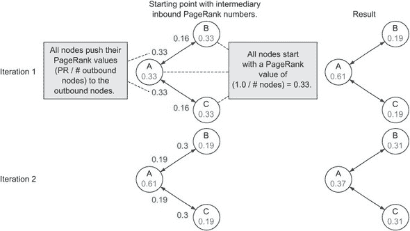

图 7.22 显示了将 PageRank 算法表示为映射和归约阶段。映射阶段负责保留图以及向所有出站节点发出 PageRank 值。归约器负责为每个节点重新计算新的 PageRank 值，并将其包含在原始图的输出中。

##### 图 7.22。PageRank 分解为映射和归约阶段

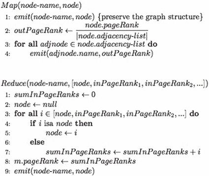

在这个技术中，你将操作图 7.23 中显示的图。在这个图中，所有节点都有入站和出站边。

##### 图 7.23。该技术的示例网络图

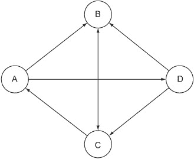

Giraph 支持各种输入和输出数据格式。对于这项技术，我们将使用`JsonLongDoubleFloatDouble-VertexInputFormat`作为输入格式；它要求顶点以数值形式表示，并附带一个关联的权重，我们不会使用这项技术。我们将把顶点 A 映射到整数 0，B 映射到 1，依此类推，并为每个顶点识别相邻顶点。数据文件中的每一行代表一个顶点和到相邻顶点的有向边：

```
[<vertex id>,<vertex value>,[[<dest vertex id>,<vertex weight>][...]]]
```

以下输入文件表示图 7.23 中的图：

```
[0,0,[[1,0],[3,0]]]
[1,0,[[2,0]]]
[2,0,[[0,0],[1,0]]]
[3,0,[[1,0],[2,0]]]
```

将此数据复制到名为 webgraph.txt 的文件中，并将其上传到 HDFS：

```
$ hadoop fs -put webgraph.txt .
```

你的下一步是编写 Giraph 顶点类。Giraph 模型的好处在于它的简单性——它提供了一个基于顶点的 API，其中你需要实现该顶点上单次迭代的图处理逻辑。顶点类负责处理来自相邻顶点的传入消息，使用它们来计算节点的新 PageRank 值，并将更新的 PageRank 值（除以出度边数）传播到相邻顶点，如下面的列表所示.^([12])

> ¹² GitHub 源代码：[`github.com/alexholmes/hiped2/blob/master/src/main/java/hip/ch7/pagerank/giraph/PageRankVertex.java`](https://github.com/alexholmes/hiped2/blob/master/src/main/java/hip/ch7/pagerank/giraph/PageRankVertex.java)。

##### 列表 7.5\. 页面排名顶点

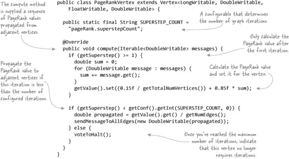

| |
| --- |

##### 安装 Giraph

Giraph 是一个 Java 库，并包含在这本书的代码分发中。因此，对于这项技术中的示例，不需要安装 Giraph。如果你想要进一步探索 Giraph，Giraph 网站[`giraph.apache.org/`](http://giraph.apache.org/)提供了下载和安装说明。

| |
| --- |

如果你将网页图推送到 HDFS 并运行你的作业，它将运行五次迭代，直到图收敛：

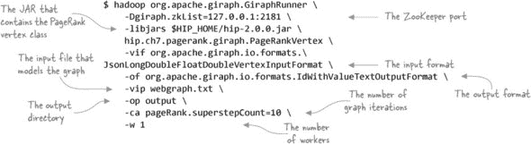

处理完成后，你可以在 HDFS 中查看输出，以查看每个顶点的 Page-Rank 值：

```
$ hadoop fs -cat output/art*
0  0.15472094578266
2  0.28902904137380575
1  0.25893832306149106
3  0.10043738978626424
```

根据输出，节点 C（顶点 2）具有最高的 PageRank，其次是节点 B（顶点 1）。考虑到 B 有三个入链，而 C 只有两个，这种观察可能令人惊讶。但如果你看看谁链接到 C，你可以看到节点 B，它也具有很高的 PageRank 值，只有一个出链指向 C，因此节点 C 除了从节点 D 获得的其它入链 PageRank 分数外，还获得了 B 的全部 PageRank 分数。因此，节点 C 的 PageRank 将始终高于 B 的。

##### 摘要

当你将不得不为 MapReduce 编写的代码与 Giraph 的代码进行比较时，很明显，Giraph 提供了一个简单且抽象的模型，该模型丰富地表达了图的概念。Giraph 相对于 MapReduce 的效率使得 Giraph 成为满足你的图处理需求的一个有吸引力的解决方案。

Giraph 扩展到大型图的能力在 Facebook 的一篇文章中被强调，该文章讨论了 Facebook 如何使用 Giraph 处理一个拥有万亿条边的图。^([13)] 有其他图技术你可以根据你的需求进行评估：

> ^([13]) Avery Ching，“扩展 Apache Giraph 到万亿条边”，[[`www.facebook.com/notes/facebook-engineering/scaling-apache-giraph-to-a-trillion-edges/10151617006153920`](https://www.facebook.com/notes/facebook-engineering/scaling-apache-giraph-to-a-trillion-edges/10151617006153920)]。

+   Faunus 是一个基于 Hadoop 的开源项目，支持 HDFS 和其他数据源。[[`thinkaurelius.github.io/faunus/`](http://thinkaurelius.github.io/faunus/)]]

+   GraphX 是一个基于内存的 Spark 项目。目前，GraphX 不受任何商业 Hadoop 供应商的支持，尽管它将很快被包含在 Cloudera CDH 5.1 中。[[`amplab.cs.berkeley.edu/publication/graphx-grades/`](https://amplab.cs.berkeley.edu/publication/graphx-grades/)]]

+   GraphLab 是卡内基梅隆大学开发的一个基于 C++的、分布式的图处理框架。[[`graphlab.com/`](http://graphlab.com/)]。

尽管你实现了 PageRank 公式，但由于你的图是高度连接的，并且每个节点都有出站链接，所以这使它变得简单。没有出站链接的页面被称为*悬空页面*，它们对 PageRank 算法构成了问题，因为它们成为*PageRank 陷阱*——它们的 PageRank 值不能通过图进一步传播。这反过来又导致收敛问题，因为不是强连通的图不能保证收敛。

解决这个问题有各种方法。你可以在你的 PageRank 迭代之前移除悬空节点，然后在图收敛后添加它们以进行最终的 Page-Rank 迭代。或者，你可以将所有悬空页面的 PageRank 总和相加，并将它们重新分配到图中的所有节点。有关处理悬空节点以及高级 PageRank 实践的详细考察，请参阅 Amy N. Langville 和 Carl Dean Meyer 所著的《Google 的 PageRank 及其超越》（普林斯顿大学出版社，2012 年）。

这部分关于图的讨论到此结束。正如你所学到的，图是表示社交网络中的人和组织网络中页面的有用机制。你使用这些模型来发现一些关于你的数据的有用信息，例如找到两点之间的最短路径以及哪些网页比其他网页更受欢迎。

这引出了下一节的主题，Bloom 过滤器。Bloom 过滤器是一种不同于图的数据结构。虽然图用于表示实体及其关系，但 Bloom 过滤器是一种用于建模集合并在其数据上执行成员查询的机制，正如你接下来会发现的那样。

### 7.2. Bloom 过滤器

布隆过滤器是一种数据结构，它提供了一个成员查询机制，其中查找的答案有两个值之一：一个确定的*否*，意味着正在查找的项目不在布隆过滤器中，或者一个*可能*，意味着该项目存在一定的概率。布隆过滤器因其空间效率高而受到欢迎——表示*N*个元素的存在所需的空間比数据结构中的*N*个位置要少得多，这就是为什么成员查询可能会产生假阳性结果。布隆过滤器中的假阳性数量可以调整，我们将在稍后讨论。

布隆过滤器在 BigTable 和 HBase 中使用，以消除从磁盘读取块以确定它们是否包含键的需求。它们还用于分布式网络应用程序，如 Squid，以在多个实例之间共享缓存细节，而无需复制整个缓存或在缓存未命中时产生网络 I/O 开销。

布隆过滤器的实现很简单。它们使用一个大小为*m*位的位阵列，其中最初每个位都设置为`0`。它们还包含*k*个哈希函数，这些函数用于将元素映射到位阵列中的*k*个位置。

要向布隆过滤器添加一个元素，它被哈希*k*次，然后使用哈希值的模和位阵列的大小来将哈希值映射到特定的位阵列位置。然后，位阵列中的该位被切换到`1`。图 7.24 展示了三个元素被添加到布隆过滤器及其在位阵列中的位置。

##### 图 7.24。向布隆过滤器添加元素

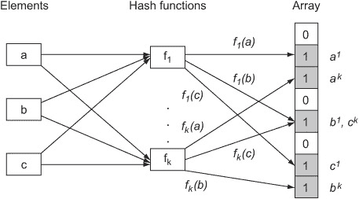

要检查布隆过滤器中一个元素的成员资格，就像添加操作一样，该元素被哈希*k*次，每个哈希键都用于索引位阵列。只有当所有*k*个位阵列位置都设置为`1`时，才会返回成员查询的`true`响应。否则，查询的响应是`false`。

图 7.25 展示了一个成员查询的例子，其中项目之前已被添加到布隆过滤器中，因此所有位阵列位置都包含一个`1`。这是一个真正的阳性成员查询结果的例子。

##### 图 7.25。一个布隆过滤器成员查询产生真正阳性结果的例子

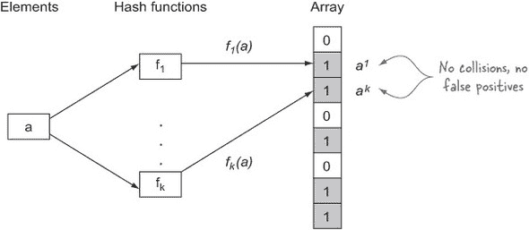

图 7.26 展示了如何得到一个成员查询的假阳性结果。正在查询的元素是*d*，它尚未被添加到布隆过滤器中。碰巧的是，*d*的所有*k*个哈希都映射到由其他元素设置的`1`的位置。这是布隆过滤器中碰撞的例子，其结果是假阳性。

##### 图 7.26。一个布隆过滤器成员查询产生假阳性结果的例子

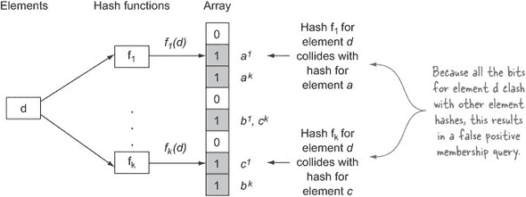

误报的概率可以根据两个因素进行调整：*m*，位数组中的位数，和*k*，哈希函数的数量。或者用另一种方式表达，如果你有一个期望的误报率，并且你知道将要添加到布隆过滤器中的元素数量，你可以使用图 7.27 中的公式来计算位数组中所需的位数。

##### 图 7.27\. 计算布隆过滤器所需位数数的公式

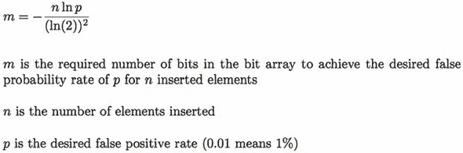

图 7.28 中显示的公式假设最优的哈希数*k*和生成的哈希值在范围*{1..m}*上是随机的。

##### 图 7.28\. 计算最优哈希数目的公式

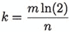

换句话说，如果你想在布隆过滤器中添加 100 万个元素，并且你的成员查询的误报率为 1%，你需要 95,850,588 位或 1.2 兆字节，使用七个哈希函数。这大约是每个元素 9.6 位。

表 7.1 显示了不同误报率下每个元素所需的位数计算结果。

##### 表 7.1\. 不同误报率下每个元素所需的位数

| 误报 | 每个元素所需的位数 |
| --- | --- |
| 2% | 8.14 |
| 1% | 9.58 |
| 0.1% | 14.38 |

在脑海中装满了所有这些理论之后，你现在需要将注意力转向如何利用布隆过滤器在 MapReduce 中应用的主题。

#### 技巧 70：在 MapReduce 中并行创建布隆过滤器

MapReduce 非常适合并行处理大量数据，因此如果你想要基于大量输入数据创建布隆过滤器，它是一个很好的选择。例如，假设你是一家大型互联网社交媒体组织，拥有数亿用户，并且你想要为一定年龄段的用户子集创建一个布隆过滤器。你如何在 MapReduce 中做到这一点？

##### 问题

你想在 MapReduce 中创建一个布隆过滤器。

##### 解决方案

编写一个 MapReduce 作业，使用 Hadoop 内置的`BloomFilter`类创建并输出布隆过滤器。mapper 负责创建中间布隆过滤器，单个 reducer 将它们合并在一起以输出合并后的布隆过滤器。

##### 讨论

图 7.29 展示了这项技术将做什么。你将编写一个 mapper，它将处理用户数据并创建包含一定年龄段用户的布隆过滤器。mapper 将输出它们的布隆过滤器，而单个 reducer 将它们合并在一起。最终结果是存储在 HDFS 中的单个布隆过滤器，格式为 Avro。

##### 图 7.29\. 创建布隆过滤器的 MapReduce 作业

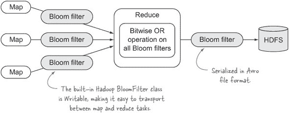

Hadoop 随带了一个 Bloom 过滤器的实现，形式为 `org.apache.hadoop.util.bloom.BloomFilter` 类，如图 7.30 所示。figure 7.30。幸运的是，它是一个 `Writable`，这使得它在 MapReduce 中很容易传输。`Key` 类用于表示一个元素，它也是一个用于字节数组的 `Writable` 容器。

##### 图 7.30\. MapReduce 中的 BloomFilter 类

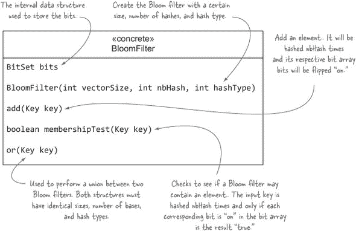

构造函数要求你指定要使用的哈希函数。你可以选择两种实现：Jenkins 和 Murmur。它们都比 SHA-1 这样的加密哈希器更快，并且产生良好的分布。基准测试表明 Murmur 的哈希时间比 Jenkins 快，所以我们在这里使用 Murmur。

让我们继续代码。你的 map 函数将操作你的用户信息，这是一个简单的键/值对，其中键是用户名，值是用户的年龄:^([14])

> (14) GitHub 源代码：[`github.com/alexholmes/hiped2/blob/master/src/main/java/hip/ch7/bloom/BloomFilterCreator.java`](https://github.com/alexholmes/hiped2/blob/master/src/main/java/hip/ch7/bloom/BloomFilterCreator.java).

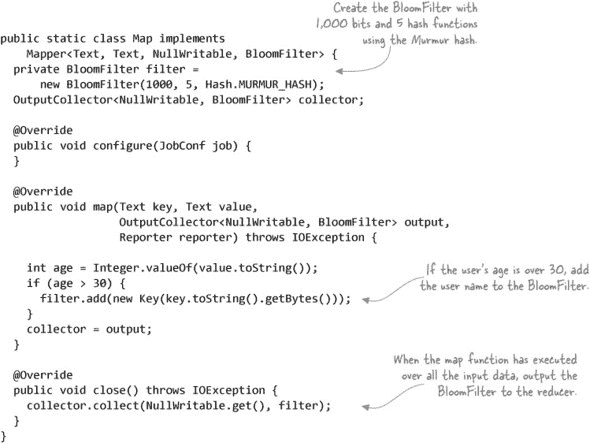

为什么你在 `close` 方法中输出 Bloom 过滤器，而不是在 `map` 方法处理每个记录时都输出？你这样做是为了减少 map 和 reduce 阶段之间的流量；如果你可以在 map 端自己伪合并它们，并每 map 输出一个单独的 `BloomFilter`，就没有必要输出大量数据。

你 reducer 的任务是合并所有 mapper 输出的 Bloom 过滤器到一个单独的 Bloom 过滤器。这些合并是通过 `BloomFilter` 类公开的位运算 `OR` 方法来执行的。在执行合并时，所有 `BloomFilter` 属性，如位数组大小和哈希数量，必须相同:^([15])

> (15) GitHub 源代码：[`github.com/alexholmes/hiped2/blob/master/src/main/java/hip/ch7/bloom/BloomFilterCreator.java`](https://github.com/alexholmes/hiped2/blob/master/src/main/java/hip/ch7/bloom/BloomFilterCreator.java).

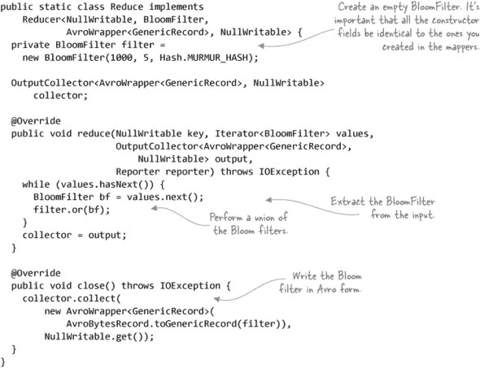

要尝试这个，上传你的样本用户文件并启动你的作业。当作业完成时，将 Avro 文件的内容导出以查看你的 `BloomFilter` 的内容：

```
$ hadoop fs -put test-data/ch7/user-ages.txt .
$ hadoop fs -cat user-ages.txt
anne    23
joe     45
alison  32
mike    18
marie   54

$ hip hip.ch7.bloom.BloomFilterCreator \
    --input user-ages.txt \
    --output output

$ hip hip.ch7.bloom.BloomFilterDumper output/part-00000.avro
{96, 285, 292, 305, 315, 323, 399, 446, 666, 667, 670,
 703, 734, 749, 810}
```

`BloomFilterDumper` 代码从 Avro 文件中反序列化 `BloomFilter` 并调用 `toString()` 方法，该方法反过来调用 `BitSet.toString()` 方法，该方法输出每个“开启”位的偏移量。

##### 摘要

你使用了 Avro 作为 Bloom 过滤器的序列化格式。你同样可以在你的 reducer 中输出 `BloomFilter` 对象，因为它是一个 `Writable`。

在这个技术中，你使用了单个 reducer，这可以很好地扩展到使用数千个映射任务和位数组大小在百万级的`BloomFilter`的工作。如果执行单个 reducer 所需的时间变得过长，你可以运行多个 reducer 来并行化 Bloom 过滤器联合，并在后处理步骤中将它们进一步合并成一个单一的 Bloom 过滤器。

创建 Bloom 过滤器的另一种分布式方法是将 reducer 集合视为整体位数组，并在映射阶段进行哈希并输出哈希值。分区器随后将输出分配给管理该部分位数组的相应 reducer。图 7.31 展示了这种方法。

##### 图 7.31. 创建 Bloom 过滤器的另一种架构

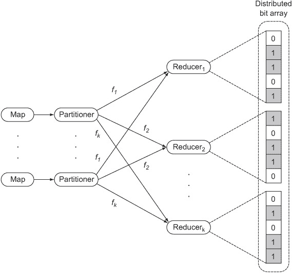

为了代码的可读性，你在这个技术中硬编码了`BloomFilter`参数；实际上，你将希望动态计算它们或将它们移动到配置文件中。

这种技术导致了`BloomFilter`的创建。这个`BloomFilter`可以从 HDFS 中提取出来用于另一个系统，或者可以直接在 Hadoop 中使用，如图 61 所示，其中 Bloom 过滤器被用作过滤连接中 reducer 输出的数据的方式。

### 7.3. HyperLogLog

想象一下你正在构建一个网络分析系统，其中你计算的数据点之一是访问 URL 的唯一用户数量。你的问题域是网络规模的，因此你有数亿用户。一个简单的 Map-Reduce 聚合实现将涉及使用散列表来存储和计算唯一用户，但处理大量用户时这可能会耗尽你的 JVM 堆。一个更复杂的解决方案将使用二次排序，以便用户 ID 被排序，并且分组发生在 URL 级别，这样你就可以在不产生任何存储开销的情况下计算唯一用户。

当你能够一次性处理整个数据集时，这些解决方案工作得很好。但如果你有一个更复杂的聚合系统，你在时间桶中创建聚合，并且需要合并桶，那么你将需要存储每个时间桶中每个 URL 的整个唯一用户集合，这将爆炸性地增加你的数据存储需求。

为了解决这个问题，你可以使用一个概率算法，如 HyperLogLog，它比散列表有显著更小的内存占用。与这些概率数据结构相关的权衡是准确性，你可以调整它。在某种程度上，HyperLogLog 类似于 Bloom 过滤器，但关键区别在于 HyperLogLog 将估计一个计数，而 Bloom 过滤器只提供成员资格能力。

在本节中，你将了解 HyperLogLog 是如何工作的，并看到它如何在 MapReduce 中高效地计算唯一计数。

#### 7.3.1. HyperLogLog 的简要介绍

HyperLogLog 首次在 2007 年的一篇论文中提出，用于“估计非常大的数据集合中不同元素的数量”。^(16) 潜在的应用包括基于链接的网页垃圾邮件检测和大型数据集的数据挖掘。

> ^(16) Philippe Flajolet 等人，“HyperLogLog：近最优基数估计算法的分析”，[`algo.inria.fr/flajolet/Publications/FlFuGaMe07.pdf`](http://algo.inria.fr/flajolet/Publications/FlFuGaMe07.pdf)。

HyperLogLog 是一种概率性基数估计器——它放宽了精确计算集合中元素数量的约束，而是估计元素的数量。支持精确集合基数计算的数结构需要与元素数量成比例的存储空间，这在处理大数据集时可能不是最优的。概率性基数结构比它们的精确基数对应物占用更少的内存，并且适用于基数可能偏差几个百分点的场景。

HyperLogLog 可以使用 1.5 KB 的内存对超过 10⁹ 的计数进行基数估计，误差率为 2%。HyperLogLog 通过计算哈希中的最大连续零位数并使用概率来预测所有唯一项的基数来工作。图 7.32 展示了哈希值在 HyperLogLog 中的表示。有关更多详细信息，请参阅 HyperLogLog 论文。

##### 图 7.32\. HyperLogLog 的工作原理

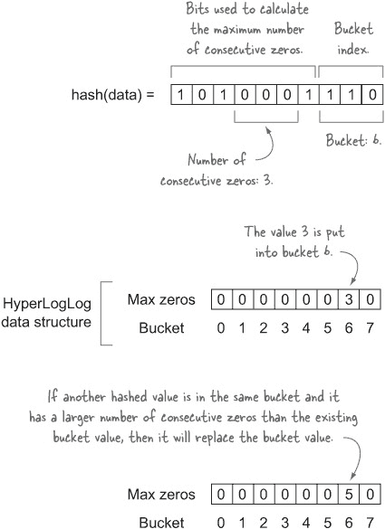

在使用 HyperLogLog 时，你需要调整两个参数：

+   桶的数量，通常用数字 *b* 表示，然后通过计算 2^b* 来确定桶的数量。因此，*b* 的每次增加都会使桶的数量翻倍。*b* 的下限是 4，上限因实现而异。

+   用于表示桶中最大连续零位的位数。

因此，HyperLogLog 的大小通过 2^b* 每桶位来计算。在典型使用中，*b* 是 11，每桶的位数是 5，这导致 10,240 位，或 1.25 KB。

#### 技巧 71 使用 HyperLogLog 计算唯一计数

在这个技巧中，你将看到一个 HyperLogLog 的简单示例。总结将展示如何将 HyperLogLog 集成到你的 MapReduce 流中的一些细节。

##### 问题

你正在处理一个大型数据集，并且你想计算唯一计数。你愿意接受一小部分的误差。

##### 解决方案

使用 HyperLogLog。

##### 讨论

对于这个技巧，你将使用来自 GitHub 项目 java-hll 的 HyperLogLog Java 实现（[`github.com/aggregateknowledge/java-hll`](https://github.com/aggregateknowledge/java-hll)）。此代码提供了基本的 HyperLogLog 函数，以及允许你执行多个日志的并集和交集的有用函数。

以下示例展示了这样一个简单情况，您的数据由一个数字数组组成，并使用 Google 的 Guava 库为每个数字创建哈希并将其添加到 HyperLogLog 中：^([17])。

> ^(17) GitHub 源代码：[`github.com/alexholmes/hiped2/blob/master/src/main/java/hip/ch7/hyperloglog/Example.java`](https://github.com/alexholmes/hiped2/blob/master/src/main/java/hip/ch7/hyperloglog/Example.java)。

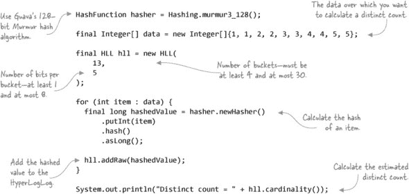

运行此示例会得到预期的唯一项目数量：

```
$ hip hip.ch7.hyperloglog.Example
Distinct count = 5
```

这段代码可以轻松地改编成一个 Hadoop 作业，以对大型数据集执行不同的计数。例如，想象您正在编写一个 MapReduce 作业来计算访问您网站上每个页面的不同用户数量。在 MapReduce 中，您的映射器会输出 URL 和用户 ID 作为键和值，而您的归约器需要计算每个网页的唯一用户集。在这种情况下，您可以使用 HyperLogLog 结构来高效地计算用户的大致唯一计数，而无需使用哈希集带来的开销。

##### 摘要

在本例中使用的 `hll` HyperLogLog 实现有一个 `toBytes` 方法，您可以使用它来序列化 HyperLogLog，同时它还有一个 `fromBytes` 方法用于反序列化。这使得它在 MapReduce 流程和持久化中使用起来相对简单。例如，Avro 有一个 `bytes` 字段，您可以将 `hll` 字节数据写入您的记录中。如果您在使用 SequenceFiles，也可以编写自己的 `Writable`。

如果您使用 Scalding 或 Summingbird，那么 Algebird 提供了一个 HyperLogLog 实现供您使用——更多详情请参阅 [`github.com/twitter/algebird`](https://github.com/twitter/algebird)。

### 7.4\. 章节总结

本章中概述的大多数算法都很直接。使事情变得有趣的是，它们如何在 MapReduce 中应用，从而能够高效地处理大型数据集。

本章仅对如何建模和处理数据进行了初步探讨。有关排序和连接的算法将在其他章节中介绍。下一章将介绍诊断和调整 Hadoop 的技术，以从您的集群中榨取尽可能多的性能。

在 Bloom 过滤器的例子中，我们探讨了如何使用 MapReduce 并行创建一个 Bloom 过滤器，然后将其应用于优化 Map-Reduce 中的半连接操作。

我们在本章中只是触及了数据建模和处理的表面。有关排序和连接的算法将在其他章节中介绍。下一章将介绍诊断和调整 Hadoop 的技术，以从您的集群中榨取尽可能多的性能。

## 第八章\. 调优、调试和测试

*本章涵盖*

+   测量和调整 MapReduce 执行时间

+   调试您的应用程序

+   提高代码质量的测试技巧

想象一下，你已经编写了一块新的 MapReduce 代码，并在你那崭新的集群上执行它。你惊讶地发现，尽管拥有一个规模不小的集群，但你的作业运行时间比你预期的要长得多。显然，你的作业遇到了性能问题，但你是如何确定问题所在的呢？

本章首先回顾了 Map-Reduce 中常见的性能问题，例如缺乏数据局部性和使用过多映射器。本节调优部分还检查了一些你可以对作业进行的增强，通过在洗牌阶段使用二进制比较器和使用紧凑的数据格式来最小化解析和数据传输时间，从而提高作业的效率。

本章的第二部分涵盖了帮助你调试应用程序的一些技巧，包括如何访问 YARN 容器启动脚本的操作说明，以及一些关于如何设计你的 MapReduce 作业以帮助未来调试工作的建议。

最后一个部分探讨了如何为 MapReduce 代码提供充分的单元测试，并检查了一些你可以使用的防御性编码技术，以最小化表现不佳的代码。无论准备和测试多么充分，都无法保证你不会遇到任何问题，如果确实遇到了问题，我们将探讨如何调试你的作业以找出出了什么问题。

| |
| --- |

##### Hadoop 2

本章中的技术适用于 Hadoop 2。由于不同主要版本的 Hadoop 之间存在不兼容性，因此其中一些技术无法与早期版本兼容。

| |
| --- |

### 8.1. 测量，测量，再测量

在开始性能调优之前，你需要有工具和流程来捕获系统指标。这些工具将帮助你收集和检查与你的应用程序相关的经验数据，并确定你是否遇到了性能问题。

在本节中，我们将探讨 Hadoop 提供的工具和指标，同时也会涉及到监控作为性能调优工具包中的附加工具。

重要的是要捕获集群的 CPU、内存、磁盘和网络利用率。如果可能的话，你也应该捕获 MapReduce（或任何其他 YARN 应用程序）的统计信息。拥有集群的历史和当前指标将允许你查看硬件和软件中的异常，并将它们与任何可能指向你的工作未按预期速率进行的观察结果相关联。

最终的目标是确保你不会过度使用或未充分利用你的硬件。如果你过度使用硬件，你的系统可能花费大量时间在争夺资源上，无论是 CPU 上下文切换还是内存页面交换。集群的未充分利用意味着你无法从硬件中获得全部潜力。

幸运的是，有大量工具可供您监控集群，从收集和报告系统活动的内置 Linux 工具 sar，到更复杂的工具如 Nagios 和 Ganglia。Nagios ([`www.nagios.org/`](http://www.nagios.org/)) 和 Ganglia ([`ganglia.sourceforge.net/`](http://ganglia.sourceforge.net/)) 都是开源项目，旨在监控您的基础设施，特别是 Ganglia 提供了一个丰富的用户界面和有用的图表，其中一些可以在图 8.1 中看到。Ganglia 的额外优势在于能够从 Hadoop 中提取统计信息.^([2])

> ¹ 这篇 IBM 文章讨论了使用 sar 和 gnuplot 生成系统活动图：David Tansley，“使用 gnuplot 在您的网页中显示数据”，[`www.ibm.com/developerworks/aix/library/au-gnuplot/index.html`](http://www.ibm.com/developerworks/aix/library/au-gnuplot/index.html)。
> 
> ² Hadoop 维基上有关于 Ganglia 和 Hadoop 集成的基本说明：GangliaMetrics，[`wiki.apache.org/hadoop/GangliaMetrics`](http://wiki.apache.org/hadoop/GangliaMetrics)。

##### 图 8.1\. 显示多个主机 CPU 利用率的 Ganglia 截图

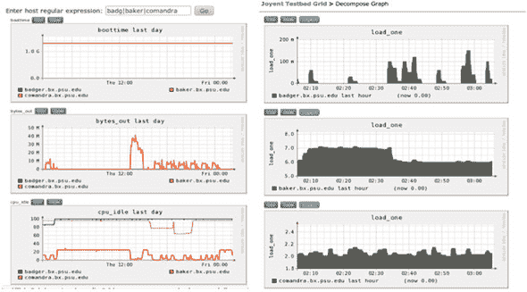

如果您使用的是商业 Hadoop 发行版，它可能捆绑了包含监控的管理用户界面。如果您使用的是 Apache Hadoop 发行版，您应该使用 Apache Ambari，它简化了集群的配置、管理和监控。Ambari 在幕后使用 Ganglia 和 Nagios。

在您的监控工具就绪后，是时候看看如何调优和优化您的 MapReduce 作业了。

### 8.2. 调优 MapReduce

在本节中，我们将介绍影响 MapReduce 作业性能的常见问题，并探讨如何解决这些问题。在此过程中，我还会指出一些最佳实践，以帮助您优化作业。

我们将从查看一些阻碍 Map-Reduce 作业性能的更常见问题开始。

#### 8.2.1\. MapReduce 作业中的常见低效

在深入研究技巧之前，让我们从高层次上看看 MapReduce 作业，并确定可能影响其性能的各个区域。请参阅图 8.2。

##### 图 8.2\. MapReduce 作业中可能发生的各种低效情况

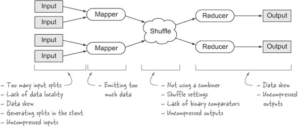

本节关于性能调优的其余部分涵盖了图 8.2 中确定的问题。但在我们开始调优之前，我们需要看看您如何轻松地获取作业统计信息，这将帮助您确定需要调优的区域。

#### 技巧 72 查看作业统计信息

评估 MapReduce 作业性能的第一步是 Hadoop 为您的作业测量的指标。在本技巧中，您将学习如何访问这些指标。

##### 问题

您想访问 MapReduce 作业的指标。

##### 解决方案

使用作业历史记录 UI、Hadoop CLI 或自定义工具。

##### 讨论

MapReduce 为每个作业收集各种系统和作业计数器，并将它们持久化到 HDFS 中。你可以以两种不同的方式提取这些统计数据：

+   使用作业历史界面。

+   使用 Hadoop 命令行界面（CLI）查看作业和任务计数器以及作业历史中的其他度量。

| |
| --- |

##### 作业历史保留

默认情况下，作业历史保留一周。这可以通过更新`mapreduce.jobhistory.max-age-ms`来更改。

| |
| --- |

让我们检查这两个工具，从作业历史界面开始。

##### 作业历史

在 Hadoop 2 中，作业历史是一个 MapReduce 特定的服务，它从完成的 MapReduce 作业中收集度量，并提供一个用户界面来查看它们。图 8.3 显示了如何在作业历史界面中访问作业统计信息。

> ³ 第二章 包含了如何访问作业历史用户界面的详细信息。

##### 图 8.3\. 在作业历史界面中访问作业计数器

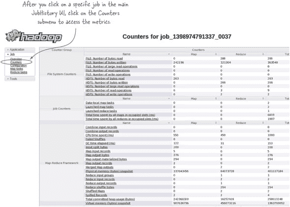

此屏幕显示了映射任务、减少任务以及所有任务的聚合度量。此外，每个度量都允许你深入查看报告该度量的所有任务。在每个度量特定的屏幕中，你可以按度量值排序，以快速识别表现出异常高或低度量值的任务。

| |
| --- |

##### Hadoop 2 的度量改进

Hadoop 2 通过添加 CPU、内存和垃圾收集统计信息来改进作业度量，因此你可以很好地了解每个进程的系统利用率。

| |
| --- |

如果你无法访问作业历史界面，也不要灰心，因为你可以通过 Hadoop CLI 访问数据。

##### 使用 CLI 访问作业历史

作业历史输出存储在由可配置的`mapreduce.jobhistory.done-dir`指定的目录中，默认位置为 Apache Hadoop 的/tmp/hadoop-yarn/staging/history/done/。在此目录中，作业根据提交日期进行分区。如果你知道你的作业 ID，你可以搜索你的目录：

> ⁴ 非 Apache Hadoop 发行版可能对`mapreduce.jobhistory.done-dir`有自定义值——例如，在 CDH 中，此目录是/user/history/done。

```
$ hadoop fs -lsr /tmp/hadoop-yarn/staging/history/done/ \
    | grep job_1398974791337_0037
```

此命令返回的文件之一应该是一个具有.jhist 后缀的文件，这是作业历史文件。使用 Hadoop `history`命令的完整路径来查看你的作业历史详细信息：

```
$ hadoop job -history <history file>

Hadoop job: job_1398974791337_0037
=====================================
User: aholmes
JobName: hip-2.0.0.jar
JobConf: hdfs://localhost:8020/tmp/hadoop-yarn/...
Submitted At: 11-May-2014 13:06:48
Launched At: 11-May-2014 13:07:07 (19sec)
Finished At: 11-May-2014 13:07:17 (10sec)
Status: SUCCEEDED
Counters:

|Group Name  |Counter name                   |Map Value |Reduce |Total |
-----------------------------------------------------------------------
|File System |FILE: Number of bytes read      |0         |288       |288
|File System |FILE: Number of bytes written   |242,236 |121,304 |363,540
|File System |FILE: Number of read operations |0         |0         |0
|File System |FILE: Number of write operations|0         |0         |0

...

Task Summary
============================
Kind  Total Successful Failed Killed StartTime FinishTime

Setup   0 0 0 0
Map     2 2 0 0  11-May-2014 13:07:09  11-May-2014 13:07:13
Reduce  1 1 0 0  11-May-2014 13:07:15  11-May-2014 13:07:17
============================

Analysis
=========

Time taken by best performing map task task_1398974791337_0037_m_000001:
  3sec
Average time taken by map tasks: 3sec
Worse performing map tasks:
TaskId        Timetaken
task_1398974791337_0037_m_000000 3sec
task_1398974791337_0037_m_000001 3sec
The last map task task_1398974791337_0037_m_000000 finished at

(relative to the Job launch time): 11-May-2014 13:07:13 (5sec)

Time taken by best performing shuffle task
task_1398974791337_0037_r_000000: 1sec
Average time taken by shuffle tasks: 1sec
Worse performing shuffle tasks:
TaskId        Timetaken
task_1398974791337_0037_r_000000 1sec
The last shuffle task task_1398974791337_0037_r_000000 finished at
(relative to the Job launch time): 11-May-2014 13:07:17 (9sec)

Time taken by best performing reduce task
task_1398974791337_0037_r_000000: 0sec
Average time taken by reduce tasks: 0sec
Worse performing reduce tasks:
TaskId        Timetaken
task_1398974791337_0037_r_000000 0sec
The last reduce task task_1398974791337_0037_r_000000 finished at
(relative to the Job launch time): 11-May-2014 13:07:17 (10sec)
=========
```

之前的输出只是命令产生的整体输出的小部分，值得你自己执行以查看它暴露的完整度量。此输出在快速评估平均和最坏的任务执行时间等度量方面很有用。

作业历史界面和 CLI 都可以用来识别作业中的许多性能问题。随着我们本节中技术的介绍，我将突出显示如何使用作业历史计数器来帮助识别问题。

让我们通过查看可以在映射端进行的优化来开始行动。

#### 8.2.2\. Map 优化

MapReduce 作业的 map 端优化通常与输入数据及其处理方式有关，或者与你的应用程序代码有关。你的 mapper 负责读取作业输入，因此诸如你的输入文件是否可分割、数据局部性和输入分割数量等变量都可能影响作业的性能。你的 mapper 代码中的低效也可能导致作业执行时间比预期更长。

本节涵盖了你的作业可能遇到的一些数据相关的问题。特定于应用程序的问题在 8.2.6 节中介绍。

#### 技术编号 73 数据局部性

MapReduce 最大的性能特性之一是“将计算推送到数据”的概念，这意味着 map 任务被调度以从本地磁盘读取输入。然而，数据局部性并不保证，你的文件格式和集群利用率可能会影响数据局部性。在这个技术中，你将学习如何识别缺乏局部性的迹象，并了解一些解决方案。

##### 问题

你想要检测是否有 map 任务正在通过网络读取输入。

##### 解决方案

检查作业历史元数据中的几个关键计数器。

##### 讨论

在作业历史中，有一些计数器你应该密切关注，以确保数据局部性在 mapper 中发挥作用。这些计数器在表 8.1 中列出。

##### 表 8.1\. 可以指示是否发生非本地读取的计数器

| 计数器名称 | 作业历史名称 | 如果...，你可能存在非本地读取 |
| --- | --- | --- |
| HDFS_BYTES_READ | HDFS：读取的字节数 | ...这个数字大于输入文件的块大小。 |
| DATA_LOCAL_MAPS | 数据本地 map 任务 | ...任何 map 任务的此值设置为 0。 |
| RACK_LOCAL_MAPS | 机架本地 map 任务 | ...任何 map 任务的此值设置为 1。 |

非本地读取可能有多个原因：

+   你正在处理大文件和无法分割的文件格式，这意味着 mapper 需要从其他数据节点流式传输一些块。

+   文件格式支持分割，但你使用的是不支持分割的输入格式。例如，使用 LZOP 压缩文本文件，然后使用`TextInputFormat`，它不知道如何分割文件。

+   YARN 调度器无法将 map 容器调度到节点。这可能发生在你的集群负载过重的情况下。

你可以考虑几种选项来解决这些问题：

+   当使用不可分割的文件格式时，将文件写入或接近 HDFS 块大小，以最小化非本地读取。

+   如果你使用容量调度器，将`yarn.scheduler.capacity.node-locality-delay`设置为在调度器中引入更多延迟，从而增加 map 任务在数据本地节点上调度成功的几率。

+   如果你正在使用文本文件，切换到支持分割的压缩编解码器，如 LZO 或 bzip2。

接下来，让我们看看当您处理大型数据集时，另一个与数据相关的优化。

#### 技巧 74 处理大量输入拆分

具有大量输入拆分的作业不是最优的，因为每个输入拆分都由单个映射器执行，每个映射器作为一个单独的进程执行。由于这些进程的派生对调度器和集群的总体压力导致作业执行时间缓慢。此技术检查了一些可以用来减少输入拆分数量并保持数据局部性的方法。

##### 问题

您想优化一个运行数千个映射器的作业。

##### 解决方案

使用 `CombineFileInputFormat` 来组合运行较少映射器的多个块。

##### 讨论

两个主要问题会导致作业需要大量映射器：

+   您的输入数据由大量的小文件组成。所有这些文件的总大小可能很小，但 MapReduce 将为每个小文件启动一个映射器，因此您的作业将花费更多的时间来启动进程，而不是实际处理输入数据。

+   您的文件并不小（它们接近或超过 HDFS 块大小），但您的总数据量很大，跨越 HDFS 中的数千个块。每个块都分配给单个映射器。

如果您的问题与小型文件相关，您应该考虑将这些文件压缩在一起或使用容器格式，如 Avro 来存储您的文件。

在上述任何一种情况下，您都可以使用 `CombineFileInputFormat`，它将多个块组合成输入拆分，以减少整体输入拆分的数量。它是通过检查被输入文件占用的所有块，将每个块映射到存储它的数据节点集合，然后将位于同一数据节点上的块组合成一个单独的输入拆分来实现的，以保持数据局部性。这个抽象类有两个具体的实现：

+   `CombineTextInputFormat` 与文本文件一起工作，并使用 `TextInputFormat` 作为底层输入格式来处理和向映射器输出记录。

+   `CombineSequenceFileInputFormat` 与 SequenceFiles 一起工作。

图 8.4 比较了 `TextInputFormat` 生成的拆分与 `CombineTextInputFormat` 生成的拆分。

##### 图 8.4\. `CombineTextInputFormat` 与默认大小设置一起工作的一个示例

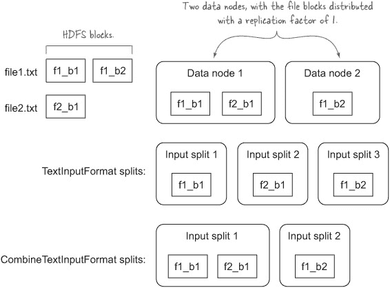

有一些可配置的选项允许您调整输入拆分的组成方式：

+   **`mapreduce.input.fileinputformat.split.minsize.per.node`** —指定每个输入拆分应在数据节点内包含的最小字节数。默认值是 `0`，表示没有最小大小。

+   **`mapreduce.input.fileinputformat.split.minsize.per.rack`** —指定每个输入拆分应在单个机架内包含的最小字节数。默认值是 `0`，表示没有最小大小。

+   **`mapreduce.input.fileinputformat.split.maxsize`** —指定输入拆分的最大大小。默认值是 `0`，表示没有最大大小。

默认设置下，您将得到每个数据节点最多一个输入拆分。根据您集群的大小，这可能会妨碍您的并行性，在这种情况下，您可以调整 `mapreduce.input.fileinputformat.split.maxsize` 以允许一个节点有多个拆分。

如果一个作业的输入文件明显小于 HDFS 块大小，那么您的集群可能花费更多的时间在启动和停止 Java 进程上，而不是执行工作。如果您遇到这个问题，应该查阅第四章，我在那里解释了您可以采取的各种方法来高效地处理小文件。

#### 技术编号 75：在 YARN 中在集群中生成输入拆分

如果提交 MapReduce 作业的客户端不在与您的 Hadoop 集群本地的网络上，那么输入拆分计算可能会很昂贵。在这个技术中，您将学习如何将输入拆分计算推送到 MapReduce ApplicationMaster。

| |
| --- |

##### 仅在 YARN 上

这种技术仅适用于 YARN。

| |
| --- |

##### 问题

您的客户端是远程的，输入拆分计算花费了很长时间。

##### 解决方案

将 `yarn.app.mapreduce.am.compute-splits-in-cluster` 设置为 `true`。

##### 讨论

默认情况下，输入拆分是在 MapReduce 驱动程序中计算的。当输入源是 HDFS 时，输入格式需要执行文件列表和文件状态命令等操作来检索块详情。当处理大量输入文件时，这可能会很慢，尤其是在驱动程序和 Hadoop 集群之间存在网络延迟时。

解决方案是将 `yarn.app.mapreduce.am.compute-splits-in-cluster` 设置为 `true`，将输入拆分计算推送到运行在 Hadoop 集群内部的 MapReduce ApplicationMaster，这样可以最小化计算输入拆分所需的时间，从而减少您整体作业执行时间。

##### 从您的映射器中发出过多数据

尽可能避免从您的映射器输出大量数据，因为这会导致由于洗牌而产生大量的磁盘和网络 I/O。您可以在映射器中使用过滤器和平面投影来减少您正在处理的数据量，并在 MapReduce 中减少溢出。下推可以进一步改进您的数据管道。技术 55 包含了过滤器和下推的示例。

#### 8.2.3. 洗牌优化

MapReduce 中的洗牌负责组织和交付您的映射器输出到您的归约器。洗牌有两个部分：映射端和归约端。映射端负责为每个归约器分区和排序数据。归约端从每个映射器获取数据，在提供给归约器之前将其合并。

因此，你可以在 shuffle 的两边进行优化，包括编写合并器，这在第一个技巧中已经介绍过。

#### 技巧 76 使用合并器

合并器是一个强大的机制，它聚合 map 阶段的输入数据以减少发送给 reducer 的数据量。这是一个 map 端的优化，其中你的代码会根据相同的输出键调用多个 map 输出值。

##### 问题

你正在过滤和投影你的数据，但你的 shuffle 和 sort 仍然比你想要的要长。你如何进一步减少它们？

##### 解决方案

定义一个合并器，并使用`setCombinerClass`方法为你的作业设置它。

##### 讨论

合并器在 spill 和 merge 阶段将 map 输出数据写入磁盘时被调用，作为图 8.5 所示，它是 map 任务上下文中调用合并器的一部分。为了帮助将值分组以最大化合并器的有效性，在调用合并器函数之前，两个阶段都应使用排序步骤。

##### 图 8.5\. 在 map 任务上下文中如何调用合并器

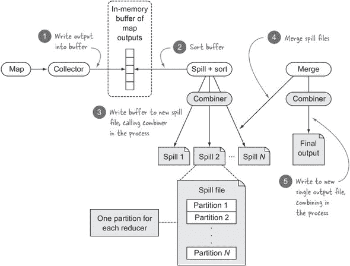

调用`setCombinerClass`设置作业的合并器，类似于如何设置 map 和 reduce 类：

```
job.setCombinerClass(Combine.class);
```

你的合并器实现必须符合 reducer 规范。在这个技巧中，你将编写一个简单的合并器，其任务是删除重复的 map 输出记录。当你遍历 map 输出值时，你只会发出那些连续唯一的值：^([5])

> ⁵ GitHub 源代码：[`github.com/alexholmes/hiped2/blob/master/src/main/java/hip/ch8/CombineJob.java`](https://github.com/alexholmes/hiped2/blob/master/src/main/java/hip/ch8/CombineJob.java).

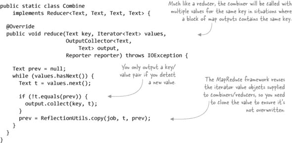

如果你有合并器，函数必须是分配性的。在图 8.5 中，你看到合并器将多次对相同的输入键进行调用，并且当它们被发送到合并器时，关于输出值的组织没有保证（除了它们与合并器键配对之外）。一个分配性函数是指无论输入如何组合，最终结果都是相同的。

##### 摘要

合并器是 MapReduce 工具箱中的强大工具，因为它有助于减少映射器和 reducer 之间通过网络传输的数据量。二进制比较器是另一个可以改善你的 MapReduce 作业执行时间的工具，我们将在下一节中探讨它们。

#### 技巧 77 使用二进制比较器进行闪电般的快速排序

当 MapReduce 进行排序或合并时，它使用`RawComparator`来比较 map 输出键。内置的`Writable`类（如`Text`和`IntWritable`）具有字节级别的实现，因为它们不需要将对象的字节形式反序列化为`Object`形式进行比较，所以它们运行得很快。

当你编写自己的`Writable`时，可能会倾向于实现`WritableComparable`接口，但这可能会导致 shuffle 和 sort 阶段变长，因为它需要从字节形式反序列化`Object`以进行比较。

##### 问题

你有自定义的`Writable`实现，并且你想要减少作业的排序时间。

##### 解决方案

编写一个字节级别的`Comparator`以确保在排序过程中的最佳比较。

##### 讨论

在 MapReduce 中，有多个阶段在数据排序时会对输出键进行比较。为了便于键排序，所有 map 输出键都必须实现`WritableComparable`接口：

```
public interface WritableComparable<T>
  extends Writable, Comparable<T> {
}
```

在你根据技术 64（在实现二次排序时）创建的`PersonWritable`中，你的实现如下：^([6])

> ⁶ GitHub 源代码：[`github.com/alexholmes/hiped2/blob/master/src/main/java/hip/ch6/sort/secondary/Person.java`](https://github.com/alexholmes/hiped2/blob/master/src/main/java/hip/ch6/sort/secondary/Person.java).

```
public class Person implements WritableComparable<Person> {

  private String firstName;
  private String lastName;

  @Override
  public int compareTo(Person other) {
    int cmp = this.lastName.compareTo(other.lastName);
    if (cmp != 0) {
      return cmp;
    }
    return this.firstName.compareTo(other.firstName);
  }
...
```

这个`Comparator`的问题在于，MapReduce 将你的中间 map 输出数据以字节形式存储，每次它需要排序你的数据时，都必须将其反序列化为`Writable`形式以执行比较。这种反序列化是昂贵的，因为它会重新创建你的对象以进行比较目的。

如果你查看 Hadoop 中的内置`Writable`，你会发现它们不仅扩展了`WritableComparable`接口，还提供了它们自己的自定义`Comparator`，该`Comparator`扩展了`WritableComparator`类。以下代码展示了`WritableComparator`类的一个子集：

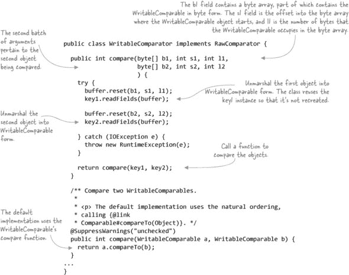

要编写一个字节级别的`Comparator`，需要重写`compare`方法。让我们看看`IntWritable`类是如何实现这个方法的：

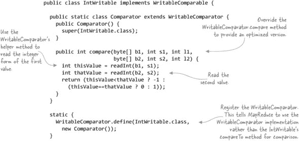

内置的`Writable`类都提供了`WritableComparator`实现，这意味着只要你的 MapReduce 作业输出键使用这些内置的`Writable`，你就不需要担心优化`Comparator`。但是，如果你有一个用作输出键的自定义`Writable`，理想情况下你应该提供一个`WritableComparator`。我们现在将重新审视你的`Person`类，看看你如何做到这一点。

在你的`Person`类中，你有两个字段：名字和姓氏。你的实现将它们存储为字符串，并使用`DataOutput`的`writeUTF`方法将它们写入：

```
private String firstName;
private String lastName;

@Override
public void write(DataOutput out) throws IOException {
  out.writeUTF(lastName);
  out.writeUTF(firstName);
}
```

首先你需要理解的是，根据之前的代码，你的`Person`对象在字节形式中的表示。`writeUTF`方法写入包含字符串长度的两个字节，然后是字符串的字节形式。图 8.6 展示了这些信息在字节形式中的布局。

##### 图 8.6\. Person 的字节布局

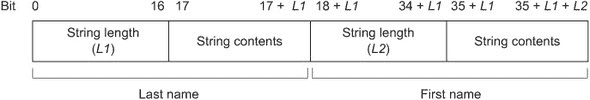

你想要自然排序的记录，包括姓氏和名字，但无法直接使用字节数组完成，因为字符串长度也编码在数组中。相反，`Comparator` 需要足够智能，能够跳过字符串长度。以下代码展示了如何做到这一点：^([7])

> ⁷ GitHub 源代码：[`github.com/alexholmes/hiped2/blob/master/src/main/java/hip/ch8/Person-BinaryComparator.java`](https://github.com/alexholmes/hiped2/blob/master/src/main/java/hip/ch8/Person-BinaryComparator.java).

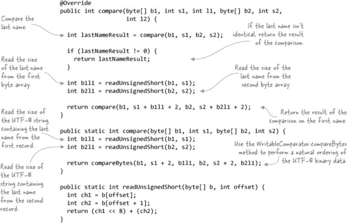

##### 摘要

`writeUtf` 方法有限制，因为它只能支持包含少于 65,536 个字符的字符串。这可能在处理人名的情况下是可行的，但如果你需要处理更大的字符串，你应该考虑使用 Hadoop 的 `Text` 类，它可以支持更大的字符串。如果你查看 `Text` 类中的 `Comparator` 内部类，你会看到它的二进制字符串比较器的工作方式与这里讨论的类似。这种方法可以很容易地扩展到使用 `Text` 对象而不是 Java `String` 对象表示的名称。

性能调整的下一个问题是，如何防止数据偏斜对 MapReduce 作业的影响。

##### 使用范围分区器来避免数据偏斜

当任务执行时间较长时，通常有一小部分 reducer 由于默认的哈希分区器的工作方式而处于长尾。如果这影响了你的作业，那么请查看处理哈希分区器产生的偏斜的技术 63。

#### 技巧 78 调整洗牌内部

洗牌阶段涉及从洗牌服务中获取映射输出数据并在后台合并。排序阶段，作为另一个合并过程，会将文件合并成更少的文件。

##### 问题

你想要确定一个作业是否因为洗牌和排序阶段而运行缓慢。

##### 解决方案

使用作业历史元数据提取与洗牌和排序执行时间相关的统计信息。

##### 讨论

我们将查看洗牌的三个区域，并为每个区域确定可以调整以提高性能的区域。

##### 调整映射端

当映射器输出记录时，它们首先被存储在内存缓冲区中。当缓冲区增长到一定大小时，数据会被溢写到磁盘上的新文件中。这个过程会一直持续到映射器完成所有输出记录的输出。展示了这个过程。

##### 图 8.7\. 映射端洗牌

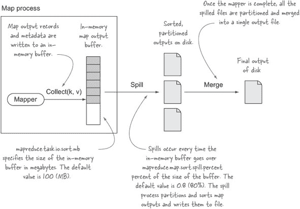

映射端洗牌昂贵的地方是与溢写和合并溢写文件相关的 I/O。合并是昂贵的，因为所有映射输出都需要从溢写文件中读取并重写到合并的溢写文件中。

一个理想的映射器能够将其所有输出都适应内存缓冲区，这意味着只需要一个溢出文件。这样做就消除了合并多个溢出文件的需求。并非所有作业都可行，但如果你的映射器过滤或投影输入数据，使得输入数据可以适应内存，那么调整`mapreduce.task.io.sort.mb`以足够大以存储映射输出是值得的。

检查表 8.2 中显示的作业计数器，以了解和调整作业的混洗特性。

##### 表 8.2\. 映射混洗计数器

| 计数器 | 描述 |
| --- | --- |
| 映射输出字节数 | 使用 MAP_OUTPUT_BYTES 计数器来确定是否可以增加`mapreduce.task.io.sort.mb`，以便它可以存储所有映射输出。 |
| 溢出记录数 映射输出记录数 | 理想情况下，这两个值将相同，这表明只发生了一次溢出。 |
| 读取的字节数 写入的字节数 | 将这两个计数器与 MAP_OUTPUT_BYTES 进行比较，以了解由于溢出和合并而发生的额外读取和写入。 |

##### 调整减少侧

在减少侧，映射器为减少器提供的输出是从每个从节点上运行的辅助混洗服务流出的。映射输出被写入一个内存缓冲区，一旦缓冲区达到一定大小，就会合并并写入磁盘。在后台，这些溢出文件会持续合并成更少的合并文件。一旦收集器收集了所有输出，就会进行最后一轮合并，之后合并文件中的数据会流出到减少器。图 8.8 显示了此过程。

##### 图 8.8\. 减少侧混洗

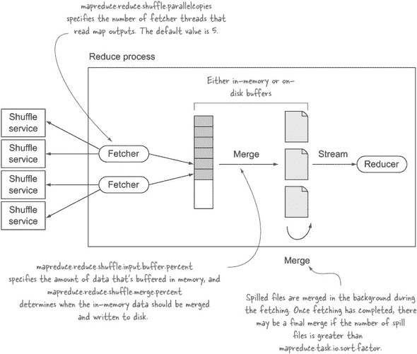

与映射侧类似，调整减少大小混洗的目标是尝试将所有映射输出适应内存，以避免溢出到磁盘并合并溢出文件。默认情况下，即使所有记录都可以适应内存，记录也会始终溢出到磁盘，因此为了启用内存到内存的合并，绕过磁盘，将`mapreduce.reduce.merge.memtomem.enabled`设置为`true`。

表 8.3 中的作业计数器可用于了解和调整作业的混洗特性。

##### 表 8.3\. 映射混洗计数器

| 计数器 | 描述 |
| --- | --- |
| 溢出记录数 | 写入磁盘的记录数。如果你的目标是映射输出永远不接触磁盘，则此值应为 0。 |
| 读取的字节数 写入的字节数 | 这些计数器将给你一个关于有多少数据被溢出和合并到磁盘的概览。 |

##### 混洗设置

表 8.4 显示了此技术涵盖的属性。

##### 表 8.4\. 可调整的混洗配置

| 名称 | 默认值 | 映射侧或减少侧？ | 描述 |
| --- | --- | --- | --- |
| mapreduce.task.io.sort.mb | 100 (MB) | Map | 缓冲映射输出的总缓冲内存量（以兆字节为单位）。这应该是映射任务堆大小的约 70%。 |
| mapreduce.map.sort.spill.percent | 0.8 (80%) | Map | 序列化缓冲区的软限制。一旦达到，线程将开始在后台将内容溢出到磁盘。请注意，如果溢出已经开始，则超过此阈值时收集不会阻塞，因此溢出可能大于此阈值，当设置为小于 0.5 时。  |
| mapreduce.task.io.sort.factor | 10 | Map and reduce | 排序文件时一次合并的流数。这决定了打开的文件句柄的数量。对于拥有 1,000 个或更多节点的较大集群，可以将此值提高到 100。 |
| mapreduce.reduce.shuffle.parallelcopies | 5 | Reduce | 在复制（洗牌）阶段在 reducer 端运行的并行传输的默认数量。对于拥有 1,000 个或更多节点的较大集群，可以将此值提高到 20。 |
| mapreduce.reduce.shuffle.input.buffer.percent | 0.70 | Reduce | 在洗牌过程中存储映射输出的最大堆大小的百分比。 |
| mapreduce.reduce.shuffle.merge.percent | 0.66 | Reduce | 内存合并开始的阈值使用率，以存储内存映射输出的总内存分配的百分比表示，如由 mapreduce.reduce.shuffle.input.buffer.percent 定义。 |
| mapreduce.reduce.merge.memtomem.enabled | false | Reduce | 如果每个 reducer 的所有映射输出都可以存储在内存中，则将此属性设置为 true。 |

##### 摘要

减少洗牌和排序时间的最简单方法是积极过滤和投影你的数据，使用 combiner，并压缩你的映射输出。这些方法减少了映射和 reducer 任务之间流动的数据量，并减轻了与洗牌和排序阶段相关的网络和 CPU/磁盘负担。

如果你已经做了所有这些，你可以查看本技术中概述的一些提示，以确定你的工作是否可以被调整，使得正在洗牌的数据尽可能少地触及磁盘。

#### 8.2.4. Reducer 优化

与映射任务类似，reducer 任务也有它们自己独特的问题，这些问题可能会影响性能。在本节中，我们将探讨常见问题如何影响 reducer 任务的性能。

#### 技巧 79：reducer 数量过少或过多

对于大多数情况，映射端的并行性是自动设置的，并且是输入文件和所使用的输入格式的函数。但在 reducer 端，你对作业的 reducer 数量有完全的控制权，如果这个数字太小或太大，你可能无法从你的集群中获得最大价值。

##### 问题

你想要确定作业运行缓慢是否由于 reducer 的数量。

##### 解决方案

可以使用 JobHistory UI 来检查你作业运行中的 reducer 数量。

##### 讨论

使用 JobHistory UI 查看您作业的 reducer 数量以及每个 reducer 的输入记录数。您可能正在使用过少或过多的 reducer。使用过少的 reducer 意味着您没有充分利用集群的可用并行性；使用过多的 reducer 意味着如果资源不足以并行执行 reducer，调度器可能需要错开 reducer 的执行。

有一些情况下您无法避免使用少量 reducer 运行，例如当您正在写入外部资源（如数据库）时，您不想使其过载。

MapReduce 中另一个常见的反模式是在您希望作业输出具有总顺序而不是在 reducer 输出范围内排序时使用单个 reducer。这个反模式可以通过使用我们在技巧 65 中提到的`TotalOrderPartitioner`来避免。

##### 处理数据倾斜

数据倾斜可以很容易地识别——表现为一小部分 reduce 任务完成时间显著长于其他任务。这通常是由于以下两个原因之一——较差的 hash 分区或在高 join-key 基数的情况下执行连接操作。第六章（Chapter 6）第 6.1.5 节提供了这两个问题的解决方案。

#### 8.2.5. 通用调整技巧

在本节中，我们将探讨可能影响 map 和 reduce 任务的问题。

##### 压缩

压缩是优化 Hadoop 的重要部分。通过压缩中间 map 输出和作业输出，您可以获得实质性的空间和时间节省。压缩在第四章（chapter 4）中有详细的介绍。

##### 使用紧凑的数据格式

与压缩类似，使用像 Avro 和 Parquet 这样的空间高效文件格式可以更紧凑地表示您的数据，并且与将数据存储为文本相比，可以显著提高序列化和反序列化时间。第三章（chapter 3）的大部分内容都致力于处理这些文件格式。

还应注意的是，文本是一种特别低效的数据格式——它空间效率低下，解析计算成本高，并且在大规模解析数据时可能会花费令人惊讶的时间，尤其是如果涉及到正则表达式的话。

即使 MapReduce 工作的最终结果是非二进制文件格式，将中间数据以二进制形式存储也是良好的实践。例如，如果您有一个涉及一系列 MapReduce 作业的 MapReduce 管道，您应考虑使用 Avro 或 SequenceFiles 来存储您的单个作业输出。产生最终结果的最后一个作业可以使用适用于您用例的任何输出格式，但中间作业应使用二进制输出格式以加快 MapReduce 的读写部分。

#### 技巧 80：使用堆栈转储发现未优化的用户代码

想象你正在运行一个作业，它比你预期的耗时更长。你通常可以通过进行几次堆栈转储并检查输出以查看堆栈是否在相同的位置执行来确定这是否是由于代码低效。这项技术将指导你进行正在运行的 MapReduce 作业的堆栈转储。

##### 问题

你想要确定作业运行缓慢是否是由于代码中的低效。

##### 解决方案

确定当前执行任务的宿主机和进程 ID，进行多次堆栈转储，并检查它们以缩小代码中的瓶颈。

##### 讨论

如果你的代码中有什么特别低效的地方，那么通过从任务进程中获取一些堆栈转储，你很可能能够发现它。图 8.9 展示了如何识别任务详情以便你可以进行堆栈转储。

##### 图 8.9\. 确定 MapReduce 任务的容器 ID 和主机

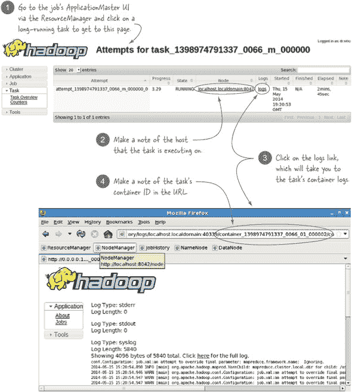

现在你已经知道了容器的 ID 以及它正在执行的主机，你可以对任务进程进行堆栈转储，如图 8.10 所示。

##### 图 8.10\. 取堆栈转储和访问输出

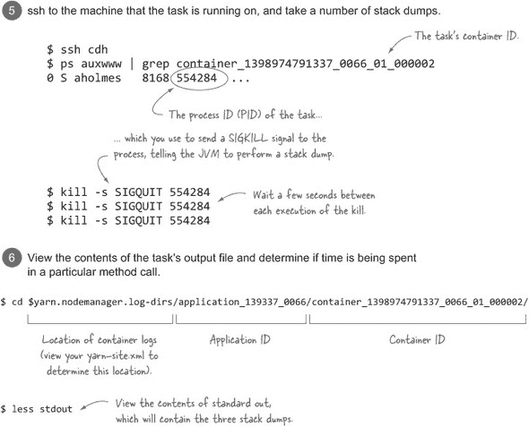

##### 摘要

理解你的代码在做什么耗时最好的方法是分析你的代码，或者更新你的代码以测量你在每个任务上花费的时间。但如果你想要大致了解是否存在问题而不必更改代码，使用堆栈转储是有用的。

堆栈转储是一种原始但通常有效的方法，用于发现 Java 进程在哪里花费时间，尤其是如果该进程是 CPU 密集型的。显然，转储不如使用分析器有效，分析器可以更准确地确定时间花费的位置，但堆栈转储的优势在于它们可以在任何运行的 Java 进程中执行。如果你要使用分析器，你需要重新执行进程并使用所需的配置文件 JVM 设置，这在 MapReduce 中是一个麻烦。

在进行堆栈转储时，在连续转储之间暂停一段时间是有用的。这允许你直观地确定代码执行堆栈是否在多个转储中大致相同。如果是这样，代码中很可能就是导致缓慢的原因。

如果你的代码在不同的堆栈转储中不在同一位置，这并不一定意味着没有低效。在这种情况下，最好的方法是分析你的代码或在代码中添加一些测量并重新运行作业以获得更准确的时间花费分解。

#### 技巧 81 分析你的映射和减少任务

分析独立的 Java 应用程序是简单且得到了大量工具的支持。在 MapReduce 中，你在一个运行多个映射和减少任务的分布式环境中工作，因此不太清楚你将如何进行代码分析。

##### 问题

你怀疑你的 map 和 reduce 代码中存在低效之处，你需要确定它们在哪里。

##### 解决方案

将 HPROF 与多个 MapReduce 作业方法结合使用，例如`setProfileEnabled`，以分析你的任务。

##### 讨论

Hadoop 内置了对 HPROF 分析器的支持，这是 Oracle 的 Java 分析器，集成在 JVM 中。要开始使用，你不需要了解任何 HPROF 设置——你可以调用`JobConf.setProfileEnabled(true)`，Hadoop 将使用以下设置运行 HPROF：

```
-agentlib:hprof=cpu=samples,heap=sites,force=n,

thread=y,verbose=n,file=%s
```

这将生成对象分配堆栈大小太小，没有实际用途，因此你可以程序化地设置自定义的 HPROF 参数：

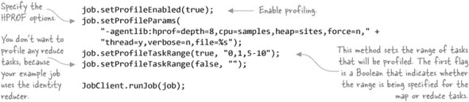

被分析的任务示例相当简单。它解析包含 IP 地址的文件，从地址中提取第一个八位字节，并将其作为输出值输出:^([8])

> ⁸ GitHub 源代码：[`github.com/alexholmes/hiped2/blob/master/src/main/java/hip/ch8/SlowJob.java`](https://github.com/alexholmes/hiped2/blob/master/src/main/java/hip/ch8/SlowJob.java).

```
public void map(LongWritable key, Text value,
                OutputCollector<LongWritable, Text> output,
                Reporter reporter) throws IOException {

  String[] parts = value.toString().split("\\.");
  Text outputValue = new Text(parts[0]);
  output.collect(key, outputValue);
}
```

你可以上传一个包含大量 IP 地址的大文件，并使用之前的分析选项运行你的作业：

```
$ hadoop fs -put test-data/ch8/large-ips.txt .

$ hip hip.ch8.SlowJob \
   --input large-ips.txt \
    --output output
```

你通过`setProfileParams`方法调用指定的 HPROF 选项将创建一个易于解析的文本文件。该文件写入容器的日志目录，文件名为 profile.out。有两种方法可以访问此文件：要么通过 JobHistory UI，要么通过使用 shell 来`ssh`到运行任务的节点。前面的技术向您展示了如何确定任务的主机和日志目录。

profile.out 文件包含多个堆栈跟踪，底部包含内存和 CPU 时间的累积，以及导致累积的堆栈跟踪的引用。在您运行的示例中，查看前两项，它们占用了最多的 CPU 时间，并将它们与代码相关联：

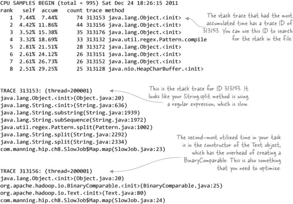

确定的第一个问题是使用`String.split`方法，它使用正则表达式对字符串进行标记化。正则表达式在计算上很昂贵，尤其是在处理数百万条记录时，这在处理与 MapReduce 典型数据量相当的数据时是正常的。一个解决方案是将`String.split`方法替换为 Apache Commons Lang 库中的任何`StringUtils.split`方法，后者不使用正则表达式。

为了避免与`Text`类构造函数相关的开销，构造实例一次，并反复调用`set`方法，这要高效得多。

##### 摘要

运行 HPROF 会给 Java 的执行增加显著的开销；它通过在代码执行时对 Java 类进行仪器化来收集分析信息。这不是你希望在生产环境中定期运行的事情。

根据 Todd Lipcon 的优秀演示中建议的，通过向`mapred.child.java.opts`添加`-Xprof`来简化任务的分析。

> ⁹ 托德·利普康，“优化 MapReduce 作业性能”，[`www.slideshare.net/cloudera/mr-perf`](http://www.slideshare.net/cloudera/mr-perf)。

实际上，理想的方式来分析你的代码是将其映射或归约代码以独立的方式隔离，这样就可以使用你选择的剖析器在 Hadoop 之外执行。然后你可以专注于快速迭代剖析，而不用担心 Hadoop 会阻碍你的工作。

这总结了我们可以使用的一些方法来调整作业的性能，并使作业尽可能高效。接下来，我们将探讨各种可以帮助你调试应用程序的机制。

### 8.3\. 调试

在本节中，我们将介绍一些有助于调试工作的主题。我们将从查看任务日志开始。

#### 8.3.1\. 访问容器日志输出

访问你的任务日志是确定你的作业中存在哪些问题的第一步。

#### 技术编号 82 检查任务日志

在这个技术中，我们将探讨在遇到需要调试的问题作业时如何访问任务日志。

##### 问题

你的作业失败或生成意外的输出，你想确定日志是否可以帮助你找出问题。

##### 解决方案

学习如何使用作业历史或应用程序主 UI 查看任务日志。或者，你也可以 SSH 到单个从节点并直接访问日志。

##### 讨论

当作业失败时，查看日志以了解它们是否提供了关于失败的信息是有用的。对于 MapReduce 应用程序，每个映射和归约任务都在自己的容器中运行，并有自己的日志，因此你需要识别失败的作业。最简单的方法是使用作业历史或应用程序主 UI，在任务视图中提供链接到任务日志。

你还可以使用技术 80 中概述的步骤直接访问执行任务的从节点上的日志。

如果未启用日志聚合，YARN 将在`yarn.nodemanager.log.retain-seconds`秒后自动删除日志文件，如果启用日志聚合，则将在`yarn.nodemanager.delete.debug-delay-sec`秒后删除。

如果容器启动失败，你需要检查执行该任务的 NodeManager 日志。为此，使用作业历史或应用程序主 UI 确定哪个节点执行了你的任务，然后导航到 NodeManager UI 以检查其日志。

通常，当你的作业开始出现问题时，任务日志将包含有关失败原因的详细信息。接下来，我们将看看如何获取启动映射或归约任务的命令，这在怀疑与环境相关的问题时非常有用。

#### 8.3.2\. 访问容器启动脚本

这是一种在怀疑容器环境或启动参数存在问题时的有用技巧。例如，有时 JAR 的类路径顺序很重要，其问题可能导致类加载问题。此外，如果容器依赖于原生库，可以使用 JVM 参数来调试 `java.library.path` 的问题。

#### 技巧 83 确定容器启动命令

检查启动容器所使用的各种论证能力对于调试容器启动问题非常有帮助。例如，假设你正在尝试使用原生的 Hadoop 压缩编解码器，但你的 MapReduce 容器失败了，错误信息抱怨原生压缩库无法加载。在这种情况下，请检查 JVM 启动参数，以确定是否所有必需的设置都存在，以便原生压缩能够工作。

##### 问题

当任务启动时，你怀疑容器因缺少参数而失败，并希望检查容器启动参数。

##### 解决方案

将 `yarn.nodemanager.delete.debug-delay-sec` YARN 配置参数设置为停止 Hadoop 清理容器元数据，并使用此元数据来查看用于启动容器的 shell 脚本。

##### 讨论

当 NodeManager 准备启动容器时，它会创建一个随后执行的 shell 脚本以运行容器。问题是 YARN 默认情况下在作业完成后会删除这些脚本。在执行长时间运行的应用程序期间，你可以访问这些脚本，但如果应用程序是短暂的（如果你正在调试导致容器立即失败的错误，这种情况可能很常见），你需要将 `yarn.nodemanager.delete.debug-delay-sec` 设置为 `true`。

图 8.11 展示了获取任务 shell 脚本所需的所有步骤。

##### 图 8.11\. 如何获取到 launch_container.sh 脚本

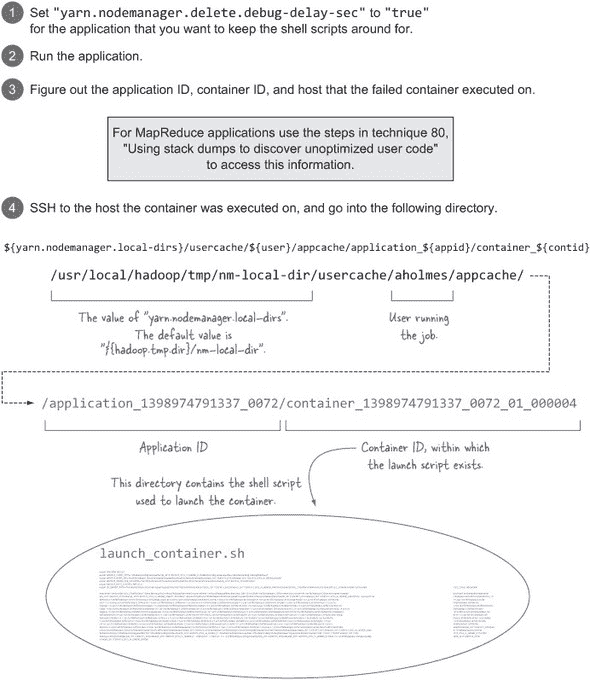

检查尝试启动容器的 NodeManager 的日志也是有用的，因为它们可能包含容器启动错误。如果存在，请再次检查容器日志。

##### 摘要

这种技巧在你想检查用于启动容器的参数时很有用。如果日志中的数据表明你的作业问题出在输入上（这可以通过解析异常表现出来），你需要找出导致问题的输入类型。

#### 8.3.3\. 调试 OutOfMemory 错误

OutOfMemory (OOM) 错误在具有内存泄漏或试图在内存中存储过多数据的 Java 应用程序中很常见。这些内存错误可能很难追踪，因为当容器退出时，通常不会提供足够的信息。

#### 技巧 84 强制容器 JVM 生成堆转储

在这个技巧中，你会看到一些有用的 JVM 参数，当发生 OOM 错误时，这些参数会导致 Java 将堆转储写入磁盘。

##### 问题

容器因内存不足错误而失败。

##### 解决方案

将容器 JVM 参数更新为包含`-XX:+HeapDumpOnOutOfMemoryError -XX:HeapDumpPath=<path>`，其中`<path>`是跨所有从节点的一个常见目录。

##### 讨论

如果您正在运行 MapReduce 应用程序，您可以使用前述 JVM 参数更新`mapred.child.java.opts`。对于非 MapReduce 应用程序，您需要找出如何为出现 OOM 错误的容器附加这些 JVM 启动参数。

一旦运行前述 JVM 参数的容器失败，您可以使用 jmap 或您喜欢的分析工具加载生成的转储文件。

#### 8.3.4\. 有效的调试的 MapReduce 编码指南

如果您遵循一些日志记录和异常处理最佳实践，则可以在生产环境中使 MapReduce 代码的调试变得更加容易。

#### 技巧 85：增强 MapReduce 代码以更好地调试

调试编写不良的 MapReduce 作业会消耗大量时间，并且在集群资源访问受限的生产环境中可能具有挑战性。

##### 问题

您想知道在编写 MapReduce 代码时应遵循的最佳实践。

##### 解决方案

看看计数器和日志如何被用来增强您有效地调试和处理问题作业的能力。

##### 讨论

将以下功能添加到您的代码中：

+   包含捕获与输入和输出相关的数据的日志，以帮助隔离问题所在。

+   捕获异常并提供有意义的日志输出，以帮助追踪问题数据输入和逻辑错误。

+   考虑您是否想在代码中重新抛出或吞没异常。

+   使用计数器和任务状态，这些可以被驱动代码和人类 alike 利用，以更好地理解作业执行期间发生的情况。

在以下代码中，您将看到许多之前描述的原则被应用。

##### 列表 8.1\. 应用了一些最佳实践以协助调试的 mapper 作业

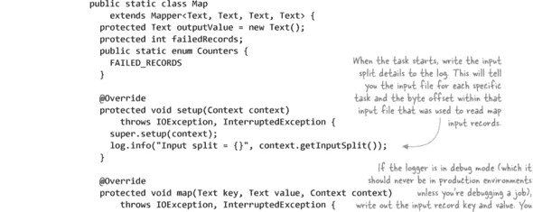

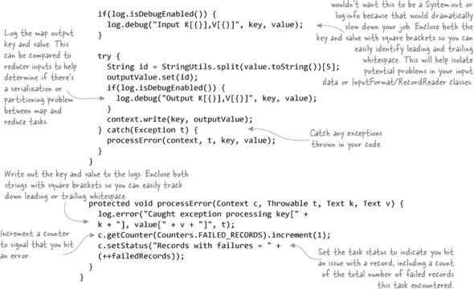

减少任务应该添加类似的调试日志语句，以输出每个减少输入键和值以及输出键和值。这样做将有助于识别映射和减少之间的任何问题，或者在您的减少代码中，或者在`OutputFormat`或`RecordWriter`中。


##### 应该吞没异常吗？

在之前的代码示例中，您在代码中捕获了任何异常，并将异常写入日志，同时尽可能多地包含上下文信息（例如，当前 reducer 正在处理的关键值）。主要问题是您是否应该重新抛出异常或吞没它。

重新抛出异常很诱人，因为您将立即意识到 MapReduce 代码中的任何问题。但如果您的代码在生产环境中运行，并且每次遇到问题（例如一些未正确处理的数据输入）时都会失败，那么操作、开发和 QA 团队将花费大量时间解决每个问题。

编写会吞掉异常的代码有其自身的问题——例如，如果您在作业的所有输入上遇到异常怎么办？如果您编写代码来吞掉异常，正确的方法是增加一个计数器（如代码示例所示），驱动类应在作业完成后使用它来确保大多数输入记录在可接受的阈值内都得到了成功处理。如果没有，正在处理的流程可能需要终止，并发出适当的警报以通知操作。

另一种方法是不要吞掉异常，并通过调用`setMapperMaxSkipRecords`或`setReducerMaxSkipGroups`来配置记录跳过，这表示在处理时抛出异常时可以容忍丢失的记录数量。这在 Chuck Lam 的《Hadoop in Action》（Manning, 2010）中有更详细的介绍。

| |
| --- |

您使用计数器来统计遇到的坏记录数量，并且可以使用 ApplicationMaster 或 JobHistory UI 来查看计数器值，如图 8.12 所示[链接](https://example.org)。

##### 图 8.12. JobHistory 计数器页面上的计数器截图


根据您如何执行作业，您将在标准输出上看到计数器。如果您查看任务的日志，您也会看到一些与任务相关的信息性数据：

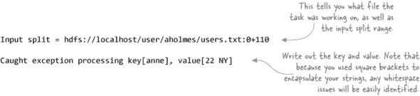

由于您也在代码中更新了任务状态，因此可以使用 ApplicationMaster 或 JobHistory UI 轻松地识别出有失败记录的任务，如图 8.13 所示[链接](https://example.org)。

##### 图 8.13. 显示映射任务和状态的 JobTracker UI

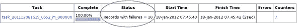

##### 摘要

我们探讨了适用于您的 MapReduce 代码的一些简单而实用的编码指南。如果它们得到应用，并且您在生产作业中遇到问题，您将能够快速缩小问题的根本原因。如果问题是与输入相关，您的日志将包含有关输入如何导致您的处理逻辑失败的具体细节。如果问题是与某些逻辑错误或序列化/反序列化错误相关，您可以启用调试级别的日志记录，更好地了解事情出错的地方。

### 8.4. 测试 MapReduce 作业

在本节中，我们将探讨测试 MapReduce 代码的最佳方法，以及编写 MapReduce 作业时需要考虑的设计方面，以帮助您在测试工作中。

#### 8.4.1. 有效的单元测试的基本要素

确保单元测试易于编写，并确保它们覆盖了良好的正负场景范围，这是非常重要的。让我们看看测试驱动开发、代码设计和数据对编写有效的单元测试的影响。

##### 测试驱动开发

当涉及到编写 Java 代码时，我强烈支持测试驱动开发（TDD），10]，并且对于 MapReduce 来说，情况也没有不同。测试驱动开发强调在编写代码之前编写单元测试，并且随着快速开发周转时间成为常态而非例外，它最近的重要性有所增加。将测试驱动开发应用于 MapReduce 代码至关重要，尤其是当此类代码是关键生产应用程序的一部分时。

> (10) 关于测试驱动开发的解释，请参阅维基百科文章：[`en.wikipedia.org/wiki/Test-driven_development`](http://en.wikipedia.org/wiki/Test-driven_development)。

在编写代码之前编写单元测试迫使你以易于测试的方式结构化代码。

##### 代码设计

当你编写代码时，重要的是要考虑最佳的结构方式以便于测试。使用抽象和依赖注入等概念将有助于实现这一目标。11]

> (11) 关于依赖注入的解释，请参阅维基百科文章：[`en.wikipedia.org/wiki/Dependency_injection`](http://en.wikipedia.org/wiki/Dependency_injection)。

当你编写 MapReduce 代码时，抽象出执行代码是个好主意，这意味着你可以在常规单元测试中测试该代码，而无需考虑如何与 Hadoop 特定的结构一起工作。这不仅适用于你的映射和减少函数，也适用于你的输入格式、输出格式、数据序列化和分区器代码。

让我们通过一个简单的例子来更好地说明这一点。以下代码展示了一个计算股票平均值的 reducer：

```
public static class Reduce
    extends Reducer<Text, DoubleWritable, Text, DoubleWritable> {

  DoubleWritable outValue = new DoubleWritable();
  public void reduce(Text stockSymbol, Iterable<DoubleWritable> values,
                     Context context)
      throws IOException, InterruptedException {

    double total = 0;
    int instances = 0;
    for (DoubleWritable stockPrice : values) {
      total += stockPrice.get();
      instances++;
    }
    outValue.set(total / (double) instances);
    context.write(stockSymbol, outValue);
  }
}
```

这是一个简单的例子，但代码的结构意味着你无法在常规单元测试中轻松测试它，因为 MapReduce 有诸如`Text`、`DoubleWritable`和`Context`类等结构会阻碍你。如果你将代码结构化以抽象出工作，你就可以轻松测试执行工作的代码，如下面的代码所示：

```
public static class Reduce2
    extends Reducer<Text, DoubleWritable, Text, DoubleWritable> {

  SMA sma = new SMA();

  DoubleWritable outValue = new DoubleWritable();
  public void reduce(Text key, Iterable<DoubleWritable> values,
                     Context context)
      throws IOException, InterruptedException {
    sma.reset();
    for (DoubleWritable stockPrice : values) {
      sma.add(stockPrice.get());
    }
    outValue.set(sma.calculate());
    context.write(key, outValue);
  }
}

public static class SMA {
  protected double total = 0;
  protected int instances = 0;

  public void add(double value) {
    total += value;
    instances ++;
  }

  public double calculate() {
    return total / (double) instances;
  }

  public void reset() {
    total = 0;
    instances = 0;
  }
}
```

使用这种改进的代码布局，你现在可以轻松地测试添加和计算简单移动平均数的`SMA`类，而无需 Hadoop 代码干扰。

##### 数据最重要

当你编写单元测试时，你试图发现你的代码如何处理正负输入数据。在两种情况下，使用从生产中抽取的代表性样本数据进行测试都是最好的。

通常，无论你多么努力，生产中的代码问题都可能源于意外的输入数据。当你确实发现导致任务崩溃的输入数据时，你不仅需要修复代码以处理意外数据，还需要提取导致崩溃的数据，并在单元测试中使用它来证明代码现在可以正确处理该数据。

#### 8.4.2\. MRUnit

MRUnit 是一个你可以用来对 MapReduce 代码进行单元测试的测试框架。它是由 Cloudera（一个拥有自己 Hadoop 分发的供应商）开发的，目前是一个 Apache 项目。需要注意的是，MRUnit 支持旧的 (`org.apache.hadoop.mapred`) 和新的 (`org.apache.hadoop.mapreduce`) MapReduce API。

#### 技巧 86 使用 MRUnit 进行 MapReduce 单元测试

在这个技术中，我们将查看编写使用 MRUnit 提供的四种测试类型之一的单元测试：

+   `MapDriver` 类——一个仅测试 map 函数的 map 测试

+   `ReduceDriver` 类——一个仅测试 reduce 函数的 reduce 测试

+   `MapReduceDriver` 类——一个测试 map 和 reduce 函数的 map 和 reduce 测试

+   `TestPipelineMapReduceDriver` 类——一个允许一系列 Map-Reduce 函数被测试的管道测试

##### 问题

你想测试 map 和 reduce 函数，以及 MapReduce 管道。

##### 解决方案

使用 MRUnit 的 `MapDriver`、`ReduceDriver`、`MapReduceDriver` 和 `PipelineMapReduceDriver` 类作为您单元测试的一部分来测试您的 MapReduce 代码。

##### 讨论

MRUnit 有四种类型的单元测试——我们将从查看 map 测试开始。

##### Map 测试

让我们从编写一个测试来测试 map 函数开始。在开始之前，让我们看看你需要向 MRUnit 提供什么来执行测试，并在过程中了解 MRUnit 在幕后是如何工作的。

图 8.14 展示了单元测试与 MRUnit 的交互以及它如何反过来与你要测试的 mapper 交互。

##### 图 8.14\. 使用 `MapDriver` 的 MRUnit 测试

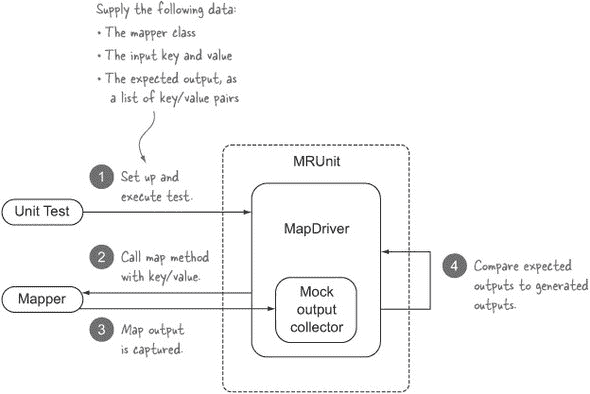

以下代码是对 Hadoop 中（身份）`mapper` 类的简单单元测试：^(12）

> ^(12) GitHub 源代码：[`github.com/alexholmes/hiped2/blob/master/src/test/java/hip/ch8/mrunit/IdentityMapTest.java`](https://github.com/alexholmes/hiped2/blob/master/src/test/java/hip/ch8/mrunit/IdentityMapTest.java)。

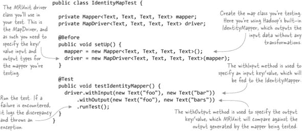

MRUnit 不依赖于任何特定的单元测试框架，因此如果它发现错误，它会记录错误并抛出异常。让我们看看如果您的单元测试指定了与 mapper 输出不匹配的输出会发生什么，如下代码所示：

```
driver.withInput(new Text("foo"), new Text("bar"))
    .withOutput(new Text("foo"), new Text("bar2"))
    .runTest();
```

如果你运行这个测试，你的测试将失败，你将看到以下日志输出：

```
ERROR Received unexpected output (foo, bar)
ERROR Missing expected output (foo, bar2) at position 0
```

| |
| --- |

##### MRUnit 日志配置

由于 MRUnit 使用 Apache Commons logging，默认使用 log4j，因此你需要在类路径中有一个配置为写入标准输出的 log4j.properties 文件，类似于以下内容：

```
log4j.rootLogger=WARN, stdout
log4j.appender.stdout=org.apache.log4j.ConsoleAppender
log4j.appender.stdout.layout=org.apache.log4j.PatternLayout
log4j.appender.stdout.layout.ConversionPattern=
 %-5p [%t][%d{ISO8601}] [%C.%M] - %m%n
```


JUnit 和其他测试框架的一个强大功能是，当测试失败时，失败信息包括导致失败的原因的详细信息。不幸的是，MRUnit 记录并抛出一个非描述性的异常，这意味着你需要挖掘测试输出以确定什么失败了。

如果你想使用 MRUnit 的强大功能，同时使用 JUnit 在断言失败时提供的有信息性的错误，你可以修改你的代码来实现这一点，并绕过 MRUnit 的测试代码：

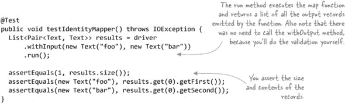

使用这种方法，如果期望输出和实际输出之间有差异，你会得到一个更有意义的错误消息，报告生成工具可以使用它来轻松描述测试中失败的内容：

```
junit.framework.AssertionFailedError: expected:<bar2> but was:<bar>
```

为了减少使用这种方法不可避免地进行的复制粘贴活动，我编写了一个简单的辅助类，结合使用 MRUnit 驱动程序和 JUnit 断言.^([13]) 你的 JUnit 测试现在看起来像这样：

> (13) GitHub 源代码：[`github.com/alexholmes/hiped2/blob/master/src/test/java/hip/ch8/mrunit/MRUnitJUnitAsserts.java`](https://github.com/alexholmes/hiped2/blob/master/src/test/java/hip/ch8/mrunit/MRUnitJUnitAsserts.java)

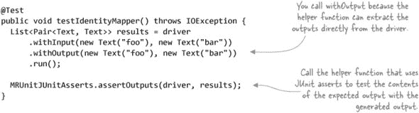

这样做更干净，并消除了可能由复制粘贴反模式引起的任何错误。

##### Reduce 测试

现在我们已经看了 map 函数的测试，让我们看看 reduce 函数的测试。MRUnit 框架在 reduce 测试中采用类似的方法。图 8.15 展示了你的单元测试与 MRUnit 的交互，以及它如何反过来与你要测试的 reducer 交互。

##### 图 8.15\. 使用 ReduceDriver 的 MRUnit 测试

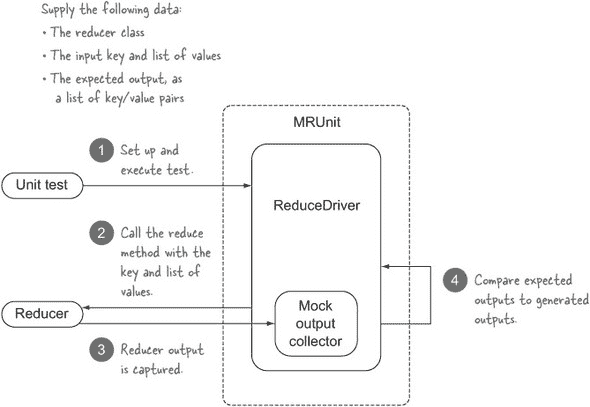

以下代码是测试 Hadoop 中（身份）reducer 类的简单单元测试:^([14])

> (14) GitHub 源代码：[`github.com/alexholmes/hiped2/blob/master/src/test/java/hip/ch8/mrunit/IdentityReduceTest.java`](https://github.com/alexholmes/hiped2/blob/master/src/test/java/hip/ch8/mrunit/IdentityReduceTest.java).

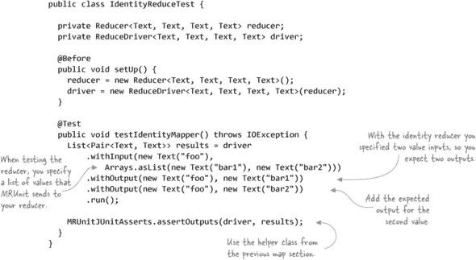

现在我们已经完成了对单个 map 和 reduce 函数测试的查看，让我们看看如何一起测试 map 和 reduce 函数。

##### MapReduce 测试

MRUnit 也支持在同一测试中测试 map 和 reduce 函数。你将输入提供给 MRUnit，这些输入随后被传递给 mapper。你还需要告诉 MRUnit 你期望的 reducer 输出。

图 8.16 展示了你的单元测试与 MRUnit 的交互，以及它如何反过来与你要测试的 mapper 和 reducer 交互。

##### 图 8.16\. 使用 MapReduceDriver 的 MRUnit 测试

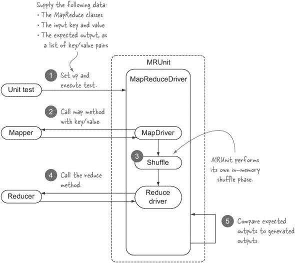

以下代码是测试 Hadoop 中（身份）mapper 和 reducer 类的简单单元测试:^([15])

> (15) GitHub 源代码：[`github.com/alexholmes/hiped2/blob/master/src/test/java/hip/ch8/mrunit/IdentityMapReduceTest.java`](https://github.com/alexholmes/hiped2/blob/master/src/test/java/hip/ch8/mrunit/IdentityMapReduceTest.java).

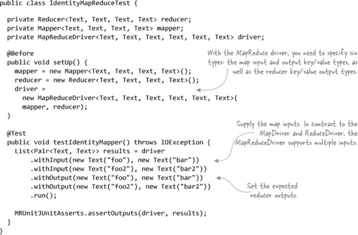

现在我们将看看 MRUnit 支持的第四种和最后一种测试类型，即管道测试，它用于测试多个 MapReduce 作业。

##### 管道测试

MRUnit 支持测试一系列的 map 和 reduce 函数——这些被称为 *管道测试*。你向 MRUnit 提供一个或多个 MapReduce 函数、第一个 map 函数的输入以及最后一个 reduce 函数的预期输出。

图 8.17 展示了你的单元测试与 MRUnit 管道驱动程序之间的交互。

##### 图 8.17\. 使用 `PipelineMapReduceDriver` 的 MRUnit 测试

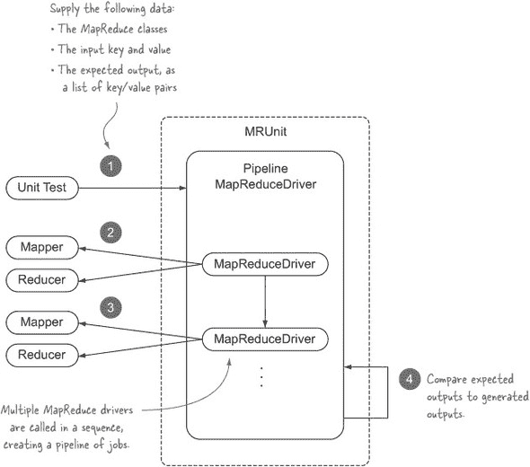

以下代码是一个单元测试，用于测试包含两组（身份）映射器和减少器类的 Hadoop 中的管道：^([16])

> ¹⁶ GitHub 源代码：[`github.com/alexholmes/hiped2/blob/master/src/test/java/hip/ch8/mrunit/PipelineTest.java`](https://github.com/alexholmes/hiped2/blob/master/src/test/java/hip/ch8/mrunit/PipelineTest.java)。

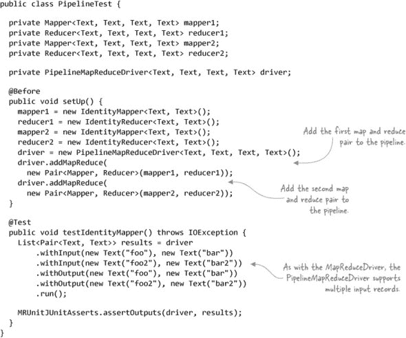

注意，`PipelineMapReduceDriver` 是 MRUnit 中唯一一个既不提供旧版也不提供新版 MapReduce API 的驱动程序，这就是为什么前面的代码使用了旧版 MapReduce API。

##### 摘要

你应该使用哪种类型的测试来测试你的代码？请查看 表 8.5 以获取一些提示。

##### 表 8.5\. MRUnit 测试及其使用情况

| 测试类型 | 在这些情况下表现良好 |
| --- | --- |
| Map | 你有一个只包含 map 的作业，并且你想要低级别的单元测试，其中框架负责测试你的测试 map 输入的预期 map 输出。 |
| Reduce | 你的作业在 reduce 函数中有很多复杂性，你想要隔离测试只针对该函数。 |
| MapReduce | 你想要测试 map 和 reduce 函数的组合。这些是更高级别的单元测试。 |
| 管道 | 你有一个 MapReduce 管道，其中每个 MapReduce 作业的输入是前一个作业的输出。 |

MRUnit 有一些限制，其中一些我们在本技术中提到了：

+   MRUnit 没有与提供丰富错误报告功能的单元测试框架集成，这有助于更快地确定错误。

+   管道测试仅适用于旧版 MapReduce API，因此使用新版 MapReduce API 的 MapReduce 代码无法使用管道测试进行测试。

+   没有支持测试数据序列化，或 `InputFormat`、`RecordReader`、`OutputFormat` 或 `RecordWriter` 类。

尽管有这些限制，MRUnit 仍然是一个优秀的测试框架，你可以用它来测试单个 map 和 reduce 函数的粒度级别；MRUnit 还可以测试 MapReduce 作业的管道。而且因为它跳过了 `InputFormat` 和 `OutputFormat` 步骤，所以你的单元测试将快速执行。

接下来，我们将探讨如何使用 `LocalJobRunner` 来测试 MRUnit 忽略的一些 MapReduce 构造。

#### 8.4.3\. LocalJobRunner

在上一节中，我们探讨了 MRUnit，这是一个优秀的轻量级单元测试库。但如果你不仅想测试你的 map 和 reduce 函数，还想测试 `InputFormat`、`RecordReader`、`OutputFormat` 和 `RecordWriter` 代码，以及 map 和 reduce 阶段之间的数据序列化，那会怎样？如果你已经编写了自己的输入和输出格式类，这一点尤为重要，因为你想要确保你也测试了那段代码。

Hadoop 随带提供了 `LocalJobRunner` 类，Hadoop 和相关项目（如 Pig 和 Avro）使用它来编写和测试他们的 MapReduce 代码。`LocalJobRunner` 允许你测试 MapReduce 作业的所有方面，包括数据在文件系统中的读写。

#### 技巧 87：使用 `LocalJobRunner` 进行重量级作业测试

像 MRUnit 这样的工具对于低级单元测试很有用，但你如何确保你的代码能够与整个 Hadoop 堆栈良好地协同工作？

##### 问题

你想在单元测试中测试整个 Hadoop 堆栈。

##### 解决方案

使用 Hadoop 中的 `LocalJobRunner` 类来扩展测试范围，包括与作业输入和输出相关的代码。

##### 讨论

使用 `LocalJobRunner` 使得你的单元测试开始感觉更像集成测试，因为你正在测试你的代码如何与整个 MapReduce 堆栈结合工作。这很好，因为你可以使用这个来测试不仅你的 MapReduce 代码，还可以测试输入和输出格式、分区器以及高级排序机制。

下一个列表中的代码展示了如何在你的单元测试中使用 `LocalJobRunner` 的示例：^(17)

> ^(17) [`github.com/alexholmes/hiped2/blob/master/src/test/java/hip/ch8/localjobrunner/IdentityTest.java`](https://github.com/alexholmes/hiped2/blob/master/src/test/java/hip/ch8/localjobrunner/IdentityTest.java).

##### 列表 8.2：使用 `LocalJobRunner` 测试 MapReduce 作业


编写这个测试更复杂，因为你需要处理将输入写入到文件系统以及读取它们。这对于每个测试来说都是一大堆样板代码，这可能是你想要提取到可重用辅助类中的东西。

这里是一个实现该功能的实用类示例；以下代码展示了如何将 `IdentityTest` 代码压缩成更易于管理的尺寸：^(18)

> ^(18) GitHub 源代码：[`github.com/alexholmes/hiped2/blob/master/src/test/java/hip/ch8/localjobrunner/IdentityWithBuilderTest.java`](https://github.com/alexholmes/hiped2/blob/master/src/test/java/hip/ch8/localjobrunner/IdentityWithBuilderTest.java).

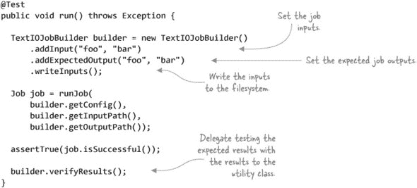

##### 摘要

使用 `LocalJobRunner` 时需要注意哪些限制？

+   `LocalJobRunner` 只运行单个 reduce 任务，因此你不能用它来测试分区器。

+   正如你所见，这同样需要更多的劳动强度；你需要将输入和输出数据读取和写入到文件系统中。

+   作业也运行缓慢，因为 MapReduce 堆栈的大部分都在被测试。

+   使用这种方法来测试非基于文件的输入和输出格式是有些棘手的。

下一个部分将介绍测试你代码的最全面的方法。它使用一个内存中的集群，可以运行多个映射器和减少器。

#### 8.4.4\. MiniMRYarnCluster

到目前为止，所有的单元测试技术都对 MapReduce 作业可以测试的部分有所限制。例如，`LocalJobRunner` 只能运行单个映射和减少任务，因此你不能模拟运行多个任务的作业。在本节中，你将了解 Hadoop 中允许你在全堆栈 Hadoop 上测试作业的内置机制。

#### 技巧 88 使用 MiniMRYarnCluster 测试你的作业

`MiniMRYarnCluster` 类包含在 Hadoop 测试代码中，并支持需要执行完整 Hadoop 堆栈的测试用例。这包括需要测试输入和输出格式类，包括输出提交者，这些类不能使用 MRUnit 或 `LocalTestRunner` 进行测试。在这个技术中，你将看到如何使用 `MiniMRYarnCluster`。

##### 问题

你希望针对实际的 Hadoop 集群执行你的测试，这为你提供了额外的保证，即你的作业按预期工作。

##### 解决方案

使用 `MiniMRYarnCluster` 和 `MiniDFSCluster`，它们允许你启动内存中的 YARN 和 HDFS 集群。

##### 讨论

`MiniMRYarnCluster` 和 `MiniDFSCluster` 是包含在 Hadoop 测试代码中的类，并被 Hadoop 中的各种测试所使用。它们提供了进程内的 YARN 和 HDFS 集群，为你提供了一个最真实的环境来测试你的代码。这些类封装了完整的 YARN 和 HDFS 进程，因此你实际上在你的测试过程中运行了完整的 Hadoop 堆栈。映射和减少容器作为测试过程外部的进程启动。

有一个有用的包装类 `ClusterMapReduceTestCase`，它封装了这些类，并使得快速编写单元测试变得容易。以下代码展示了一个简单的测试用例，该测试用例测试了身份映射器和减少器：^([19])

> ¹⁹ GitHub 源代码：[`github.com/alexholmes/hiped2/blob/master/src/test/java/hip/ch8/minimrcluster/IdentityMiniTest.java`](https://github.com/alexholmes/hiped2/blob/master/src/test/java/hip/ch8/minimrcluster/IdentityMiniTest.java).

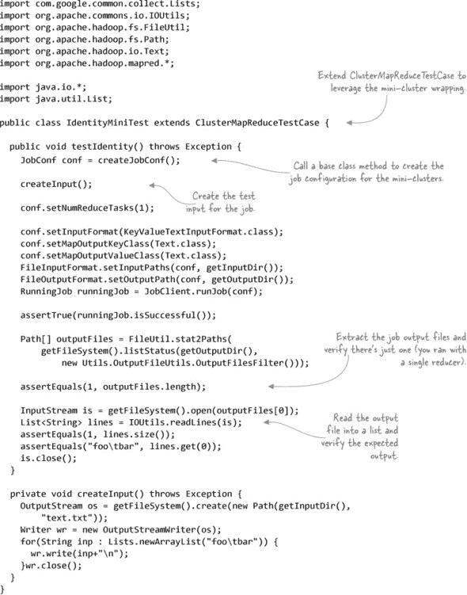

##### 概述

使用微型集群的唯一缺点是运行测试的开销——每个扩展 `ClusterMapReduceTestCase` 的测试类都会导致集群的启动和关闭，并且每个测试都有相当多的时间开销，因为完整的 Hadoop 堆栈正在执行。

但使用这些微型集群将为你提供最大的保证，即你的代码将在生产环境中按预期工作，这对于你组织中的关键作业来说值得考虑。

因此，测试你的代码的最佳方式是使用 MRUnit 对使用内置 Hadoop 输入和输出类的简单作业进行测试，并且只在这个技术用于测试那些你想测试输入和输出类以及输出提交者的测试用例。

#### 8.4.5. 集成和 QA 测试

使用 TDD 方法，你使用本节中的技术编写了一些单元测试。接下来，你编写了 MapReduce 代码，并使其达到单元测试通过的程度。太好了！但在你打开香槟之前，你仍然想要确保 MapReduce 代码在投入生产运行之前是正常工作的。你最不希望的事情就是代码在生产中失败，然后不得不在那里进行调试。

但是，你可能会问，为什么我的作业会失败，尽管所有的单元测试都通过了？这是一个好问题，可能是由多种因素造成的：

+   你用于单元测试的数据并不包含在生产中使用的数据的所有异常和变化。

+   体积或数据倾斜问题可能会在你的代码中产生副作用。

+   Hadoop 和其他库之间的差异导致了与构建环境不同的行为。

+   你的构建主机和生产环境之间的 Hadoop 和操作系统配置差异可能会导致问题。

由于这些因素，当你构建集成或 QA 测试环境时，确保 Hadoop 版本和配置与生产集群相匹配至关重要。不同版本的 Hadoop 会有不同的行为，同样，以不同方式配置的同一版本的 Hadoop 也会有不同的行为。当你正在测试测试环境中的更改时，你将希望确保平稳过渡到生产，所以尽可能确保版本和配置尽可能接近生产。

在你的 MapReduce 作业成功运行在集成和 QA 之后，你可以将它们推入生产，知道你的作业有更高的概率按预期工作。

这就结束了我们对测试 MapReduce 代码的探讨。我们探讨了某些 TDD 和设计原则，以帮助你编写和测试 Java 代码，我们还介绍了一些单元测试库，这些库使得对 MapReduce 代码进行单元测试变得更加容易。

### 8.5. 章节总结

在调整、调试和测试方面，本章只是触及了表面。我们为如何调整、分析、调试和测试你的 Map-Reduce 代码奠定了基础。

对于性能调整来说，重要的是你能够收集和可视化你的集群和作业的性能。在本章中，我们介绍了一些可能影响作业性能的更常见问题。

如果你正在生产环境中运行任何关键的 MapReduce 代码，那么至少要遵循本章测试部分中的步骤，我在那里向你展示了如何最佳地设计你的代码，使其容易在 Hadoop 范围之外进行基本的单元测试。我们还介绍了你的代码中与 MapReduce 相关的部分如何在轻量级（MRUnit）和更重量级（`LocalTestRunner`）的设置中进行测试。

在第四部分中，我们将超越 MapReduce 的世界，探讨各种允许你使用 SQL 与你的数据交互的系统。大多数 SQL 系统已经超越了 MapReduce，转而使用 YARN，因此我们上一章探讨了如何编写自己的 YARN 应用程序。
