## 第四部分\. 超越 MapReduce

这本书的这一部分致力于检查语言、工具和流程，使使用 Hadoop 的工作更加容易。

第九章深入探讨了 Hive，这是一种类似于 SQL 的特定领域语言，它是与 Hadoop 中的数据进行交互的最易访问的接口之一。Impala 和 Spark SQL 也被展示为 Hadoop 上的替代 SQL 处理系统；它们提供了一些引人注目的特性，如比 Hive 更高的性能以及将 SQL 与 Spark 混合使用的能力。

第十章，最后一章，展示了如何编写基本的 YARN 应用程序，并继续探讨对您的 YARN 应用程序至关重要的关键特性。

## 第九章\. Hadoop 上的 SQL

*本章涵盖*

+   学习 Hive 的 Hadoop 特性，包括用户定义的函数和性能调优技巧

+   了解 Impala 以及如何编写用户定义的函数

+   在你的 Spark 代码中嵌入 SQL 以结合两种语言并发挥它们的优势

假设现在是上午九点钟，有人要求你生成一份关于上个月产生访问流量的前 10 个国家的报告。并且需要在中午之前完成。你的日志数据已经存放在 HDFS 中，准备使用。你会打破你的 IDE 并开始编写 Java MapReduce 代码吗？不太可能。这就是高级语言如 Hive、Impala 和 Spark 发挥作用的地方。凭借它们的 SQL 语法，Hive 和 Impala 允许你在编写 Java `main` 方法所需的时间内编写并开始执行查询。

Hive 的一个主要优势是它不再需要 MapReduce 来执行查询——从 Hive 0.13 版本开始，Hive 可以使用 Tez，这是一个通用的 DAG 执行框架，它不像 MapReduce 那样在连续步骤之间强加 HDFS 和磁盘障碍。Impala 和 Spark 也从头开始构建，不使用 MapReduce 作为后台。

这些工具是快速开始使用 Hadoop 数据的最容易的方式。Hive 和 Impala 实质上是 Hadoop 数据仓库工具，在某些组织（如 Facebook）中已经取代了传统的基于 RDBMS 的数据仓库工具。它们的大部分流行归功于它们提供了一个 SQL 接口，并且因此对那些过去接触过 SQL 的人来说是可访问的。

我们将在这章的大部分内容中关注 Hive，因为它目前是使用最广泛的 SQL-on-Hadoop 工具。我还会介绍 Impala 作为 Hadoop 上的 MPP 数据库以及一些 Impala 独有的特性。最后，我们将涵盖 Spark SQL，它允许你在 Spark 代码中内联使用 SQL，这可能会为程序员、分析师和数据科学家创造一个全新的范式。

我们将从 Hive 开始，它一直是 SQL-on-Hadoop 的主要支柱。

### 9.1\. Hive

Hive 最初是 Facebook 的一个内部项目，最终发展成为完整的 Apache 项目。它是为了简化对 MapReduce 的访问而创建的，通过公开一个基于 SQL 的数据操作语言。Hive 架构可以在 图 9.1 中看到。

##### 图 9.1\. Hive 高级架构

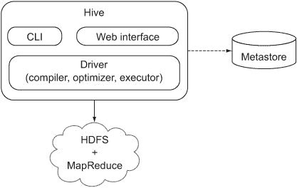

在本章中，我们将探讨如何使用 Hive 处理 Apache 网络服务器日志的实用示例。我们将探讨您可以在 Hive 中加载和安排数据的不同方式，以优化您访问这些数据的方式。我们还将探讨一些高级连接机制和其他关系操作，如分组和排序。我们将从对 Hive 的简要介绍开始。


##### 学习更多关于 Hive 基础知识

要全面理解 Hive 基础知识，请参阅 Chuck Lam 的 *Hadoop in Action* (Manning, 2010)。在本节中，我们只需简要浏览一些 Hive 基础知识。


#### 9.1.1\. Hive 基础知识

让我们快速了解一下 Hive 的基础知识，包括其执行框架的最新发展。

##### 安装 Hive

附录包含 Hive 的安装说明。本书中的所有示例都是在 Hive 0.13 上执行的，并且可能一些较旧的 Hive 版本不支持本书中我们将使用的一些功能。

##### Hive 元数据仓库

Hive 在一个元数据仓库中维护关于 Hive 的元数据，该仓库存储在关系型数据库中。这些元数据包含有关存在哪些表、它们的列、用户权限等信息。

默认情况下，Hive 使用 Derby，一个嵌入式的 Java 关系型数据库，来存储元数据仓库。因为它是嵌入式的，所以 Derby 不能在用户之间共享，因此它不能用于需要共享元数据仓库的多用户环境。

##### 数据库、表、分区和存储

Hive 可以支持多个数据库，这可以用来避免表名冲突（两个具有相同表名的团队或用户）并允许为不同的用户或产品提供单独的数据库。

Hive 表是一个逻辑概念，在物理上由 HDFS 中的多个文件组成。表可以是内部的，其中 Hive 在仓库目录（由 `hive.metastore.warehouse.dir` 属性控制，默认值为 /user/hive/warehouse [在 HDFS 中]）内组织它们，或者它们可以是外部的，在这种情况下 Hive 不管理它们。如果想要 Hive 管理数据的完整生命周期，包括删除，内部表很有用，而外部表在文件在 Hive 之外使用时很有用。

表可以是分区的，这是一种将数据物理安排到每个唯一分区键的独立子目录中的数据排列。分区可以是静态的或动态的，我们将在技术 92 中探讨这两种情况。

##### Hive 的数据模型

Hive 支持以下数据类型：

+   ***有符号整数*** —`BIGINT` (8 字节), `INT` (4 字节), `SMALLINT` (2 字节), 和 `TINYINT` (1 字节)

+   ***浮点数*** —`FLOAT` (单精度) 和 `DOUBLE` (双精度)

+   ***布尔值*** —`TRUE`或`FALSE`

+   ***字符串*** —指定字符集中的字符序列

+   ***映射*** —包含键/值对集合的关联数组，其中键是唯一的

+   ***数组*** —可索引的列表，其中所有元素必须是同一类型

+   ***结构体*** —包含元素的复杂类型

##### Hive 的查询语言

Hive 的查询语言支持 SQL 规范的大部分内容，以及 Hive 特定的扩展，其中一些在本节中介绍。Hive 支持的所有语句的完整列表可以在 Hive 语言手册中查看：[`cwiki.apache.org/confluence/display/Hive/LanguageManual`](https://cwiki.apache.org/confluence/display/Hive/LanguageManual)。

##### Tez

在 Hadoop 1 中，Hive 被限制使用 MapReduce 来执行大多数语句，因为 MapReduce 是 Hadoop 上唯一支持的处理器。这并不理想，因为从其他 SQL 系统来到 Hive 的用户已经习惯了高度交互的环境，其中查询通常在几秒钟内完成。MapReduce 是为高吞吐量批处理而设计的，因此其启动开销加上其有限的处理能力导致了非常高的查询延迟。

在 Hive 0.13 版本发布后，Hive 现在使用 YARN 上的 Tez 来执行其查询，因此它能够更接近交互式理想的工作方式。^([1)] Tez 基本上是一个通用的有向无环图（DAG）执行引擎，它不对你如何组合执行图施加任何限制（与 MapReduce 相反），并且还允许你在阶段之间保持数据在内存中，从而减少了 MapReduce 所需的磁盘和网络 I/O。你可以在以下链接中了解更多关于 Tez 的信息：

> ¹ Carter Shanklin，“Benchmarking Apache Hive 13 for Enterprise Hadoop”，[`hortonworks.com/blog/benchmarking-apache-hive-13-enterprise-hadoop/`](http://hortonworks.com/blog/benchmarking-apache-hive-13-enterprise-hadoop/)。

+   Hive on Tez：[`cwiki.apache.org/confluence/display/Hive/Hive+on+Tez`](https://cwiki.apache.org/confluence/display/Hive/Hive+on+Tez)

+   Tez 孵化 Apache 项目页面：[`incubator.apache.org/projects/tez.html`](http://incubator.apache.org/projects/tez.html)

在 Hive 0.13 版本中，Tez 默认未启用，因此你需要遵循以下说明来启动它：

+   Tez 安装说明：[`github.com/apache/incubator-tez/blob/branch-0.2.0/INSTALL.txt`](https://github.com/apache/incubator-tez/blob/branch-0.2.0/INSTALL.txt)

+   配置 Hive 以在 Tez 上工作：[`issues.apache.org/jira/browse/HIVE-6098`](https://issues.apache.org/jira/browse/HIVE-6098)

##### 交互式和非交互式 Hive

Hive shell 提供交互式界面：

```
$ hive
hive> SHOW DATABASES;
OK
default
Time taken: 0.162 seconds
```

Hive 在非交互模式下允许你执行包含 Hive 命令的脚本。以下示例使用了`-S`选项，以便只将 Hive 命令的输出写入控制台：

```
$ cat hive-script.ql
SHOW DATABASES;

$ hive -S -f hive-script.ql
default
```

另一个非交互式特性是 `-e` 选项，它允许你将 Hive 命令作为参数提供：

```
$ hive -S -e "SHOW DATABASES"
default
```

如果你正在调试 Hive 中的某个问题，并且希望在控制台上看到更详细的输出，你可以使用以下命令来运行 Hive：

```
$ hive -hiveconf hive.root.logger=INFO,console
```

这就结束了我们对 Hive 的简要介绍。接下来，我们将探讨如何使用 Hive 从你的日志文件中挖掘有趣的数据。

#### 9.1.2\. 读取和写入数据

本节涵盖了 Hive 中一些基本的数据输入和输出机制。我们将从一个简要的文本数据处理工作开始，然后跳转到如何处理 Avro 和 Parquet 数据，这些正在成为 Hadoop 中存储数据的一种常见方式。

本节还涵盖了额外的数据输入和输出场景，例如向表中写入和追加数据以及将数据导出到本地文件系统。一旦我们覆盖了这些基本功能，后续章节将涵盖更高级的主题，例如编写 UDF 和性能调优技巧。

#### 技巧 89 处理文本文件

假设你有一系列 CSV 或 Apache 日志文件，你希望使用 Hive 加载和分析这些文件。在将它们复制到 HDFS（如果它们尚未在那里）之后，你需要在发出查询之前创建一个 Hive 表。如果你的工作结果也很大，你可能希望将其写入一个新的 Hive 表。本节涵盖了 Hive 中的这些文本 I/O 用例。

##### 问题

你希望使用 Hive 加载和分析文本文件，然后保存结果。

##### 解决方案

使用 Hive 中 contrib 库捆绑的 `RegexSerDe` 类，并定义一个可以用来解析 Apache 日志文件内容的正则表达式。这项技术还探讨了 Hive 中的序列化和反序列化工作方式，以及如何编写自己的 SerDe 来处理日志文件。

##### 讨论

如果你发出一个没有任何行/存储格式选项的 `CREATE TABLE` 命令，Hive 假设数据是基于文本的，使用默认的行和字段分隔符，如 表 9.1 所示。

##### 表 9.1\. 默认文本文件分隔符

| 默认分隔符 | 修改默认分隔符的语法示例 | 描述 |
| --- | --- | --- |
| \n | LINES TERMINATED BY '\n' | 记录分隔符。 |
| ^A | FIELDS TERMINATED BY '\t' | 字段分隔符。如果你想用另一个不可读字符替换 ^A，你可以用八进制表示，例如 '\001'。 |
| ^B | COLLECTION ITEMS TERMINATED BY ';' | ARRAY、STRUCT 和 MAP 数据类型的元素分隔符。 |
| ^C | MAP KEYS TERMINATED BY ':' | 在 MAP 数据类型中用作键/值分隔符。 |

因为大多数你将处理的数据文本将以更标准的方式结构化，例如 CSV，让我们看看如何处理 CSV。

首先，你需要将书中代码包含的股票 CSV 文件复制到 HDFS。在 HDFS 中创建一个目录，然后将股票文件复制到该目录中：^([2])

> ² Hive 不允许你在文件上创建表；它必须是一个目录。

```
$ hadoop fs -mkdir hive-stocks
$ hadoop fs -put test-data/stocks.txt hive-stocks
```

现在您可以在股票目录上创建一个外部 Hive 表：

```
hive> CREATE EXTERNAL TABLE stocks (
  symbol STRING,
  date STRING,
  open FLOAT,
  high FLOAT,
  low FLOAT,
  close FLOAT,
  volume INT,
  adj_close FLOAT
)
ROW FORMAT DELIMITED FIELDS TERMINATED BY ','
LOCATION '/user/YOUR-USERNAME/hive-stocks';
```


##### 使用 LOCATION 关键字创建托管表

当您创建一个外部（非托管）表时，Hive 会保留由`LOCATION`关键字指定的目录中的数据不变。但是，如果您执行相同的`CREATE`命令并删除`EXTERNAL`关键字，则该表将是一个托管表，Hive 会将`LOCATION`目录的内容移动到/user/hive/warehouse/stocks，这可能不是您期望的行为。


运行一个快速查询以验证一切看起来是否良好：

```
hive> SELECT symbol, count(*) FROM stocks GROUP BY symbol;
AAPL   10
CSCO   10
GOOG    5
MSFT   10
YHOO   10
```

太棒了！如果您想将结果保存到新表中并显示新表的架构怎么办？

```
hive> CREATE TABLE symbol_counts
ROW FORMAT DELIMITED FIELDS TERMINATED BY ','
LOCATION '/user/YOUR-USERNAME/symbol_counts'
AS SELECT symbol, count(*) FROM stocks GROUP BY symbol;

hive> describe symbol_counts;
symbol        string
```


##### 创建-表-选择（CTAS）和外部表

前面示例中的 CAS 语句不允许您指定表是`EXTERNAL`。但是，因为您要从中选择的表已经是一个外部表，所以 Hive 确保新表也是一个外部表。


如果目标表已经存在，您有两个选择——您可以选择覆盖表的全部内容，或者您可以追加到表中：


您可以使用 Hadoop CLI 查看原始表数据：

```
$ hdfs -cat symbol_counts/*
AAPL,10
CSCO,10
GOOG,5
MSFT,10
YHOO,10
```

Hive 外部表的好处是您可以使用任何方法写入它们（不一定要通过 Hive 命令），Hive 将在您下次发出任何 Hive 语句时自动获取额外的数据。

##### 使用正则表达式标记文件

让我们使事情更加复杂，并假设您想处理日志数据。这些数据以文本形式存在，但无法使用 Hive 的默认反序列化进行解析。相反，您需要一种方式来指定一个正则表达式以解析您的日志数据。Hive 附带了一个 contrib `RegexSerDe`类，可以标记您的日志。

首先，将一些日志数据复制到 HDFS 中：

```
$ hadoop fs -mkdir log-data
$ hadoop fs -put test-data/ch9/hive-log.txt log-data/
```

接下来，指定您想使用自定义反序列化器。`RegexSerDe`包含在 Hive contrib JAR 中，因此您需要将此 JAR 添加到 Hive 中：

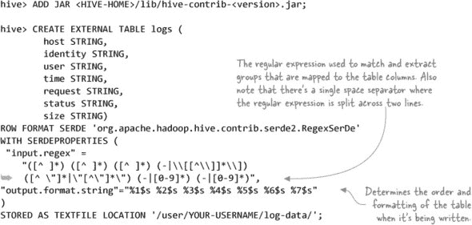

一个快速测试将告诉您 SerDe 是否正确处理数据：

```
hive> SELECT host, request FROM logs LIMIT 10;

89.151.85.133   "GET /movie/127Hours HTTP/1.1"
212.76.137.2    "GET /movie/BlackSwan HTTP/1.1"
74.125.113.104  "GET /movie/TheFighter HTTP/1.1"
212.76.137.2    "GET /movie/Inception HTTP/1.1"
127.0.0.1       "GET /movie/TrueGrit HTTP/1.1"
10.0.12.1       "GET /movie/WintersBone HTTP/1.1"
```

如果您在输出中只看到`NULL`值，那可能是因为您的正则表达式中缺少一个空格。请确保`CREATE`语句中的正则表达式看起来像图 9.2。

##### 图 9.2\. CREATE table regex showing spaces

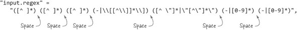

Hive 的 SerDe 是一个灵活的机制，可以用来扩展 Hive 以支持任何文件格式，只要存在一个可以处理该文件格式的`InputFormat`。有关 SerDes 的更多详细信息，请参阅 Hive 文档，网址为[`cwiki.apache.org/confluence/display/Hive/SerDe`](https://cwiki.apache.org/confluence/display/Hive/SerDe)。

##### 处理 Avro 和 Parquet

Avro 是一个简化数据处理的对象模型，Parquet 是一种列式存储格式，可以高效地支持诸如谓词下推等高级查询优化。结合使用，它们是一对很有吸引力的组合，可能会成为数据在 Hadoop 中存储的规范方式。我们在第三章中深入探讨了 Avro 和 Parquet，其中技术 23 展示了如何在 Hive 中使用 Avro 和 Parquet。

#### 技术篇 90：将数据导出到本地磁盘

当你有准备拉入电子表格或其他分析软件的数据时，从 Hive 和 Hadoop 中提取数据是一个重要的功能，你需要能够执行。这个技术探讨了你可以使用的一些方法来拉取你的 Hive 数据。

##### 问题

你有数据存储在 Hive 中，你想要将其拉取到本地文件系统。

##### 解决方案

使用标准的 Hadoop CLI 工具或 Hive 命令来拉取你的数据。

##### 讨论

如果你想要将整个 Hive 表拉取到本地文件系统，并且 Hive 为你表使用的数据格式与你想导出数据使用的格式相同，你可以使用 Hadoop CLI 并运行一个`hadoop -get /user/hive/warehouse/...`命令来拉取该表。

Hive 自带`EXPORT`（以及相应的`IMPORT`）命令，可以将 Hive 数据和元数据导出到 HDFS 中的一个目录。这对于在 Hadoop 集群之间复制 Hive 表很有用，但它并不能帮助你将数据导出到本地文件系统。

如果你想要过滤、投影并对你的数据进行一些聚合，然后将数据从 Hive 中拉取出来，你可以使用`INSERT`命令并指定结果应该写入本地目录：

```
hive> INSERT OVERWRITE LOCAL DIRECTORY 'local-stocks' SELECT * FROM stocks;
```

这将在你的本地文件系统中创建一个包含一个或多个文件的目录。如果你使用 vi 等编辑器查看这些文件，你会注意到 Hive 在写入文件时使用了默认的字段分隔符（`^A`）。并且如果你导出的任何列是复杂类型（例如`STRUCT`或 MAP），那么 Hive 将使用 JSON 来编码这些列。

幸运的是，Hive 的新版本（包括 0.13）允许你在导出表时指定自定义分隔符：

```
hive> INSERT OVERWRITE LOCAL DIRECTORY 'local-stocks'
ROW FORMAT DELIMITED FIELDS TERMINATED BY ','
SELECT * FROM stocks;
```

在 Hive 的读写基础问题解决之后，让我们看看更复杂的话题，例如用户定义函数。

#### 9.1.3\. Hive 中的用户定义函数

我们已经了解了 Hive 如何读取和写入表，现在是时候开始对你的数据进行一些有用的操作了。由于我们想要覆盖更高级的技术，我们将看看如何编写一个自定义的 Hive 用户定义函数（UDF）来地理定位你的日志。如果你想在 Hive 查询中混合自定义代码，UDF 非常有用。

#### 技术篇 91：编写 UDF

这个技术展示了你如何编写一个 Hive UDF，然后将其用于你的 Hive 查询语言（HiveQL）。

##### 问题

你如何在 Hive 中编写自定义函数？

##### 解决方案

扩展`UDF`类以实现你的用户定义函数，并在你的 HiveQL 中调用它作为函数。

##### 讨论

您可以使用 MaxMind 提供的免费地理位置数据库从日志表中定位 IP 地址。

下载免费的国籍地理位置数据库，^([3]) 使用 `gunzip` 解压，并将 GeoIP.dat 文件复制到您的 /tmp/ 目录。接下来，使用 UDF 从您在技术 89 中创建的日志表中定位 IP 地址：

> ³ 请参阅 MaxMind 的“GeoIP 国家数据库安装说明”，[`dev.maxmind.com/geoip/legacy/install/country/`](http://dev.maxmind.com/geoip/legacy/install/country/).

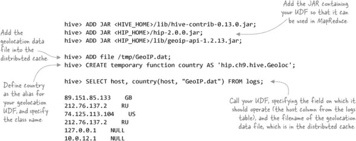

当编写一个用户定义函数（UDF）时，有两种实现选项：要么扩展 `UDF` 类，要么实现 `GenericUDF` 类。它们之间的主要区别在于 `GenericUDF` 类可以处理复杂类型的参数，因此扩展 `GenericUDF` 的 UDF 更有效率，因为 `UDF` 类需要 Hive 使用反射来发现和调用。图 9.3（#ch09fig03）显示了两个 Hive UDF 类，您需要扩展其中一个来实现您的 UDF。

##### 图 9.3\. Hive UDF `类` 图

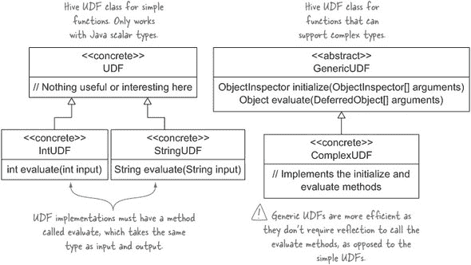

以下列表显示了地理位置 UDF，您将使用 `GenericUDF` 类来实现它.^([4]).

> ⁴ GitHub 源代码：[`github.com/alexholmes/hiped2/blob/master/src/main/java/hip/ch9/hive/Geoloc.java`](https://github.com/alexholmes/hiped2/blob/master/src/main/java/hip/ch9/hive/Geoloc.java).

##### 列表 9.1\. 地理位置 UDF

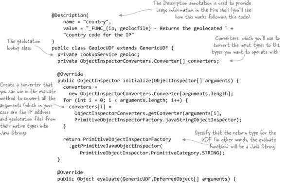

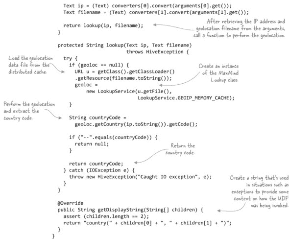

使用 `describe function` 命令可以在 Hive shell 中查看 `Description` 注解：

```
hive> describe function country;
OK
country(ip, geolocfile) - Returns the geolocated country code
for the IP
```

##### 摘要

尽管我们查看的 UDF 操作的是标量数据，但 Hive 还有一种称为用户定义的聚合函数（UDAF），它允许对聚合数据进行更复杂的处理。您可以在 Hive wiki 的“Hive 操作符和用户定义函数（UDFs）”页面（[`cwiki.apache.org/confluence/display/Hive/LanguageManual+UDF`](https://cwiki.apache.org/confluence/display/Hive/LanguageManual+UDF)）上了解更多关于编写 UDAF 的信息。

Hive 还具有用户定义的表函数（UDTFs），它们操作标量数据，但可以为每个输入生成多个输出。有关更多详细信息，请参阅 `GenericUDTF` 类。

接下来，我们将探讨您可以在 Hive 中优化工作流程的方法。

#### 9.1.4\. Hive 性能

在本节中，我们将探讨一些您可以使用的方法来优化 Hive 中的数据管理和处理。这里提供的提示将帮助您确保在扩展数据时，Hive 的其他部分能够满足您的需求。

#### 技术编号 92：分区

分区是 SQL 系统常用的一种技术，用于水平或垂直分割数据以加快数据访问速度。由于分区中的数据总体量减少，分区读取操作需要筛选的数据更少，因此可以执行得更快。

这个原则同样适用于 Hive，并且随着数据量的增长变得越来越重要。在本节中，你将探索 Hive 中的两种分区类型：静态分区和动态分区。

##### 问题

你希望安排你的 Hive 文件，以优化对数据的查询。

##### 解决方案

使用 `PARTITIONED BY` 来按你在查询数据时通常使用的列进行分区。

##### 讨论

假设你正在处理日志数据。对日志进行分区的一种自然方式是按日期进行，这样你就可以在不进行全表扫描（读取表的所有内容）的情况下执行特定时间段的查询。Hive 支持分区表，并允许你控制确定哪些列是分区的。

Hive 支持两种类型的分区：静态分区和动态分区。它们在构造 `INSERT` 语句的方式上有所不同，你将在本技术中了解到这一点。

##### 静态分区

为了本技术的目的，你将使用一个非常简单的日志结构。字段包括 IP 地址、年份、月份、日期和 HTTP 状态码：

```
$ cat test-data/ch9/logs-partition.txt
127.0.0.1,2014,06,21,500
127.0.0.1,2014,06,21,400
127.0.0.1,2014,06,21,300
127.0.0.1,2014,06,22,200
127.0.0.1,2014,06,22,210
127.0.0.1,2014,06,23,100
```

将它们加载到 HDFS 和外部表中：

```
$ hadoop fs -mkdir logspartext
$ hadoop fs -put test-data/ch9/logs-partition.txt logspartext/

hive> CREATE EXTERNAL TABLE logs_ext (
  ip STRING,
  year INT,
  month INT,
  day INT,
  status INT
)
ROW FORMAT DELIMITED FIELDS TERMINATED BY ','
LOCATION '/user/YOUR-USERNAME/logspartext';
```

现在你可以创建一个分区表，其中年份、月份和日期是分区：

```
CREATE EXTERNAL TABLE IF NOT EXISTS logs_static (
  ip STRING,
  status INT)
PARTITIONED BY (year INT, month INT, day INT)
ROW FORMAT DELIMITED FIELDS TERMINATED BY '\t'
LOCATION '/user/YOUR-USERNAME/logs_static';
```

默认情况下，Hive 的插入遵循静态分区方法，要求所有插入操作不仅要明确枚举分区，还要枚举每个分区的列值。因此，单个 `INSERT` 语句只能插入到一天的分区中：

```
INSERT INTO TABLE logs_static
PARTITION (year = '2014', month = '06', day = '21')
SELECT ip, status FROM logs_ext WHERE year=2014 AND month=6 AND day=21;
```

幸运的是，Hive 有一种特殊的数据操作语言（DML）语句，允许你在一个语句中插入到多个分区。以下代码将所有样本数据（跨越三天）插入到三个分区中：

```
FROM logs_ext se
INSERT INTO TABLE logs_static
PARTITION (year = '2014', month = '6', day = '21')
SELECT ip, status WHERE year=2014 AND month=6 AND day=21
INSERT INTO TABLE logs_static
PARTITION (year = '2014', month = '6', day = '22')
SELECT ip, status WHERE year=2014 AND month=6 AND day=22
INSERT INTO TABLE logs_static
PARTITION (year = '2014', month = '6', day = '23')
SELECT ip, status WHERE year=2014 AND month=6 AND day=23;
```

这种方法还有一个额外的优点，那就是它只需对 logs_ext 表进行一次遍历即可执行插入操作——之前的方法需要针对源表进行 *N* 次查询，以处理 *N* 个分区。

| |
| --- |

##### 单次遍历静态分区插入的灵活性

Hive 不限制目标表或查询条件是否需要与分区对齐。因此，你无法阻止你将数据插入到不同的表中，并在多个分区或表中出现重叠的行。

| |
| --- |

静态分区的一个缺点是，当你插入数据时，你必须明确指定要插入的分区。但 Hive 支持的分区类型不仅仅是静态分区。Hive 有动态分区的概念，这使得在插入数据时不需要指定分区，从而让生活变得更容易。

##### 动态分区

与静态分区相比，动态分区更智能，因为它们可以在插入数据时自动确定记录需要写入哪个分区。

让我们创建一个全新的表来存储一些动态分区。注意创建使用动态分区的表的语法与静态分区表的语法完全相同：

```
CREATE EXTERNAL TABLE IF NOT EXISTS logs_dyn (
  ip STRING,
  status INT)
PARTITIONED BY (year INT, month INT, day INT)
ROW FORMAT DELIMITED FIELDS TERMINATED BY '\t'
LOCATION '/user/YOUR-USERNAME/logs_dyn';
```

差异仅在`INSERT`时才会显现：

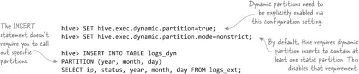

这好多了——你不再需要明确告诉 Hive 你要插入哪些分区。它将动态地解决这个问题。

##### 在同一表中混合动态和静态分区

Hive 支持在表中混合静态和动态列。也没有什么阻止你从静态分区插入方法过渡到动态分区插入。

##### 分区目录布局

分区表在 HDFS 中的布局与非分区表不同。每个分区值在 Hive 中占用一个单独的目录，包含分区列名称及其值。

这些是运行最近的`INSERT`后 HDFS 的内容：

```
logs_static/year=2014/month=6/day=21/000000_0
logs_static/year=2014/month=6/day=22/000000_0
logs_static/year=2014/month=6/day=23/000000_0
```

“000000_0”是包含行的文件。由于数据集较小（使用包含多个任务的大型数据集运行将导致多个文件），每个分区日只有一个。

##### 自定义分区目录名称

正如你所看到的，Hive 会根据`column=value`格式创建分区目录名称。如果你想对目录有更多的控制，而不是你的分区目录看起来像这样，

```
logs_static/year=2014/month=6/day=27
```

你想让它看起来像这样：

```
logs_static/2014/6/27
```

你可以通过给 Hive 提供应用于存储分区的完整路径来实现这一点：

```
ALTER TABLE logs_static
ADD PARTITION(year=2014, month=6, day=27)
LOCATION '/user/YOUR-USERNAME/logs_static/2014/6/27';
```

你可以使用`DESCRIBE`命令查询单个分区的位置：

```
hive> DESCRIBE EXTENDED logs_static
  PARTITION (year=2014, month=6, day=28);
...
location:hdfs://localhost:8020/user/YOUR-USERNAME/logs_static/2014/6/27
...
```

这可以是一个强大的工具，因为 Hive 不需要表的所有分区都在同一个集群或文件系统类型。因此，一个 Hive 表可以有一个分区位于 Hadoop 集群 A 中，另一个位于集群 B 中，第三个位于 Amazon S3 的集群中。这为将数据老化到其他文件系统提供了一些强大的策略。

##### 从 Hive 查询分区

Hive 提供了一些命令，允许你查看表的当前分区：

```
hive> SHOW PARTITIONS logs_dyn;
year=2014/month=6/day=21
year=2014/month=6/day=22
year=2014/month=6/day=23
```

##### 跳过 Hive 将数据加载到分区

假设你有一些新分区（2014/6/24）的数据，你想要使用 HDFS 命令（或某些其他机制，如 MapReduce）手动将其复制到你的分区 Hive 表中。

这里有一些示例数据（请注意，日期部分已被删除，因为 Hive 仅在目录名称中保留这些列的详细信息）：

```
$ cat test-data/ch9/logs-partition-supplemental.txt
127.0.0.1  500
127.0.0.1  600
```

创建一个新的分区目录并将文件复制到其中：

```
$ hdfs -mkdir logs_dyn/year=2014/month=6/day=24
$ hdfs -put test-data/ch9/logs-partition-supplemental.txt \
    logs_dyn/year=2014/month=6/day=24
```

现在转到你的 Hive shell，并尝试选择新数据：

```
hive> SELECT * FROM logs_dyn
  WHERE year = 2014 AND month = 6 AND day = 24;
```

没有结果！这是因为 Hive 还不知道新的分区。你可以运行一个修复命令，让 Hive 检查 HDFS 以确定当前分区：

```
hive> msck repair table logs_dyn;
Partitions not in metastore:    logs_dyn:year=2014/month=6/day=24
Repair: Added partition to metastore logs_dyn:year=2014/month=6/day=24
```

现在，你的`SELECT`将可以工作：

```
hive> SELECT * FROM logs_dyn
  WHERE year = 2014 AND month = 6 AND day = 24;
127.0.0.1  500  2014  6  24
127.0.0.1  600  2014  6  24
```

或者，你可以明确通知 Hive 关于新的分区：

```
ALTER TABLE logs_dyn
ADD PARTITION (year=2014, month=6, day=24);
```

##### 摘要

考虑到动态分区的灵活性，在什么情况下静态分区会提供优势？一个例子是，当您要插入的数据对分区列没有任何了解，而其他某个过程有了解时。

例如，假设您有一些日志数据要插入，但出于某种原因，日志数据不包含日期。在这种情况下，您可以按照以下方式创建一个静态分区插入：

```
$ hive -hiveconf year=2014 -hiveconf month=6 -hiveconf day=28
hive> INSERT INTO TABLE logs_static
PARTITION (year=${hiveconf:year},
           month=${hiveconf:month},
           day=${hiveconf:day})
SELECT ip, status FROM logs_ext;
```

接下来，让我们看看列式数据，这是另一种可以提供显著查询执行时间改进的数据分区形式。

##### 列式数据

我们习惯处理的大多数数据都是以行顺序存储在磁盘上的，这意味着当数据在持久存储上静止存储时，一行中的所有列都是连续存放的。CSV、SequenceFiles 和 Avro 通常以行存储。

使用列导向的存储格式来保存您的数据可以在空间和执行时间方面提供巨大的性能优势。将列式数据连续存放在一起允许存储格式使用复杂的数据压缩方案，如运行长度编码，这些方案不能应用于行导向数据。此外，列式数据允许执行引擎如 Hive、Map-Reduce 和 Tez 将谓词和投影推送到存储格式，允许这些存储格式跳过不匹配推送标准的数据。

目前在 Hive（和 Hadoop）上对列式存储有两个热门选择：优化行列式（ORC）和 Parquet。它们分别来自 Hortonworks 和 Cloudera/Twitter，两者都提供了非常相似的空间和时间节省优化。唯一的真正优势来自于 Parquet 的目标是在 Hadoop 社区中最大化兼容性，因此在撰写本文时，Parquet 对 Hadoop 生态系统的支持更为广泛。

第三章 有一个专门介绍 Parquet 的部分，技术 23 包括了如何使用 Hive 与 Parquet 一起使用的说明。

#### 技术 93 调优 Hive 联接

在 Hive 中执行联接操作并在一些大型数据集上等待数小时以完成它们并不罕见。在这个技术中，我们将探讨如何优化联接，就像我们在第四章 chapter 4 中为 MapReduce 所做的那样。

##### 问题

您的 Hive 联接运行速度比预期慢，您想了解有哪些选项可以加快它们的速度。

##### 解决方案

看看如何通过 *repartition 联接*、*复制联接* 和 *半联接* 来优化 Hive 联接。

##### 讨论

我们将在 Hive 中介绍三种类型的联接：repartition 联接，这是标准的 reduce-side 联接；replication 联接，这是 map-side 联接；以及半联接，它只关心保留一个表中的数据。

在我们开始之前，让我们创建两个用于工作的表：

```
$ hadoop fs -mkdir stocks-mini
$ hadoop fs -put test-data/ch9/stocks-mini.txt stocks-mini
$ hadoop fs -mkdir symbol-names
$ hadoop fs -put test-data/ch9/symbol-names.txt symbol-names

hive> CREATE EXTERNAL TABLE stocks (
  symbol STRING,
  date STRING,

  open FLOAT
)
ROW FORMAT DELIMITED FIELDS TERMINATED BY ','
LOCATION '/user/YOUR-USERNAME/stocks-mini';

hive> CREATE EXTERNAL TABLE names (
  symbol STRING,
  name STRING
)
ROW FORMAT DELIMITED FIELDS TERMINATED BY ','
LOCATION '/user/YOUR-USERNAME/symbol-names';
```

您已经创建了两个表。股票表包含三个列——股票符号、日期和价格。名称表包含股票符号和公司名称：

```
hive> select * from stocks;
AAPL  2009-01-02  85.88
AAPL  2008-01-02  199.27
CSCO  2009-01-02  16.41
CSCO  2008-01-02  27.0
GOOG  2009-01-02  308.6
GOOG  2008-01-02  692.87
MSFT  2009-01-02  19.53
MSFT  2008-01-02  35.79
YHOO  2009-01-02  12.17
YHOO  2008-01-02  23.8

hive> select * from names;
AAPL  Apple
GOOG  Google
YHOO  Yahoo!
```

##### 连接表排序

与任何类型的调整一样，了解系统的内部工作原理非常重要。当 Hive 执行连接时，它需要选择哪个表是流式传输的，哪个表是缓存的。Hive 选择`JOIN`语句中的最后一个表进行流式传输，因此你应该注意确保这是最大的表。

让我们看看我们两个表的例子。包含每日报价的股票表将随着时间的推移继续增长，但包含股票符号名称的名称表将基本上是静态的。因此，当这些表进行连接时，重要的是较大的表，即股票表，在查询中排在最后：

```
SELECT stocks.symbol, date, open, name
FROM names
JOIN stocks ON (names.symbol = stocks.symbol);
```

你也可以明确告诉 Hive 它应该流式传输哪个表：

```
SELECT /*+ STREAMTABLE(stocks) */ stocks.symbol, date, open, name
FROM names
JOIN stocks ON (names.symbol = stocks.symbol);
```

##### 映射连接

复制连接是一种映射端连接，其中小表在内存中缓存，大表流式传输。你可以在图 9.4 中看到它是如何在 MapReduce 中工作的。

##### 图 9.4\. 复制连接

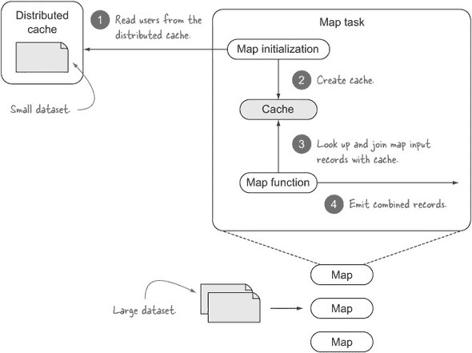

映射端连接可以用于执行内连接和外连接。当前的推荐是配置 Hive 自动尝试将连接转换为映射端连接：

```
hive> set hive.auto.convert.join = true;
hive> SET hive.auto.convert.join.noconditionaltask = true;
hvie> SET hive.auto.convert.join.noconditionaltask.size = 10000000;
```

前两个设置必须设置为`true`以启用将连接自动转换为映射端连接（在 Hive 0.13 中它们默认都是启用的）。最后一个设置由 Hive 用于确定是否可以将连接转换为映射端连接。想象一下你在连接中有*N*个表。如果最小的*N* - 1 个表在磁盘上的大小小于`hive.auto.convert.join.noconditionaltask.size`，则连接将转换为映射端连接。请注意，这个检查是基本的，并且只检查磁盘上表的大小，因此压缩、过滤器或投影等因素不计入等式。

| |
| --- |

##### 映射连接提示

旧版本的 Hive 支持一个提示，你可以用它来指示 Hive 哪个表是最小的并且应该被缓存。以下是一个示例：

```
SELECT /*+ MAPJOIN(names) */ stocks.symbol, date, open, name
FROM names
JOIN stocks ON (names.symbol = stocks.symbol);
```

新版本的 Hive 忽略了此提示（`hive.ignore.mapjoin.hint`默认设置为`true`），因为它将责任放在查询作者身上，由他们确定较小的表，这可能导致由于用户错误而查询缓慢。

| |
| --- |

##### 排序合并桶连接

Hive 表可以进行分桶和排序，这有助于你轻松采样数据，并且它也是一种有用的连接优化，因为它使得排序合并桶（SMB）连接成为可能。SMB 连接要求所有表都必须排序和分桶，在这种情况下，连接非常高效，因为它们只需要对预排序表进行简单的合并。

以下示例显示了如何创建排序和分桶的股票表：

```
CREATE TABLE stocks_bucketed (
  symbol STRING,
  date STRING,
  open FLOAT
)
CLUSTERED BY(symbol) SORTED BY(symbol) INTO 32 BUCKETS;
```

| |
| --- |

##### 向分桶表插入数据

你可以使用常规的`INSERT`语句向分桶表插入数据，但需要将`hive.enforce.bucketing`属性设置为`true`。这指示 Hive 在插入表时应查看表中的桶数以确定将使用的 reducer 数量（reducer 的数量必须等于桶的数量）。

| |
| --- |

要启用 SMB 连接，您必须设置以下属性：

```
set hive.auto.convert.sortmerge.join=true;
set hive.optimize.bucketmapjoin = true;
set hive.optimize.bucketmapjoin.sortedmerge = true;
set hive.auto.convert.sortmerge.join.noconditionaltask=true;
```

此外，您还需要确保以下条件成立：

+   所有要连接的表都按连接列进行分桶和排序。

+   每个连接表中的桶数必须相等，或者彼此是因数。

##### 偏差

偏差可能导致 MapReduce 执行时间过长，因为少数几个 reducer 可能会接收到一些连接值的不成比例的大量记录。默认情况下，Hive 不会尝试做任何事情来解决这个问题，但它可以被配置为检测偏差并优化偏差键的连接：

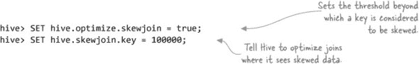

当 Hive 检测到偏差时会发生什么？您可以在图 9.5 中看到 Hive 添加的额外步骤，其中偏差键被写入 HDFS 并在单独的 MapReduce 作业中处理。

##### 图 9.5\. Hive 偏差优化


应该注意的是，这种偏差优化仅适用于 reduce-side repartition joins，不适用于 map-side replication joins。

##### 偏差表

如果你在创建表之前就知道有一些特定的键具有高偏差，你可以在创建表时告诉 Hive 这些键。如果你这样做，Hive 将将偏差键写入单独的文件中，从而允许它进一步优化查询，甚至在可能的情况下跳过这些文件。

假设您有两支股票（苹果和谷歌）的记录数量比其他股票多得多——在这种情况下，您需要修改您的 `CREATE TABLE` 语句，使用关键字 `SKEWED BY`，如下所示：

```
CREATE TABLE stocks_skewed (
  symbol STRING,
  date STRING,
  open FLOAT
)
SKEWED BY (symbol) ON ('AAPL', 'GOOGL');
```

### 9.2\. Impala

Impala 是一个低延迟、大规模并行查询引擎，其设计灵感来自 Google 的 Dremel 论文，该论文描述了一个可扩展且交互式的查询系统。5 Impala 是在 Cloudera 的背景下构思和开发的，它意识到在低延迟 SQL 环境中使用 MapReduce 来执行 SQL 是不可行的。

> ⁵ Sergey Melnik 等人，“Dremel: Interactive Analysis of Web-Scale Datasets”，[`research.google.com/pubs/pub36632.html`](http://research.google.com/pubs/pub36632.html).

每个 Impala 守护进程都设计为自给自足的，客户端可以向任何 Impala 守护进程发送查询。Impala 确实有一些元数据服务，但即使它们不工作，它也可以继续运行，因为守护节点可以直接相互交谈以执行查询。Impala 架构的概述可以在图 9.6 中看到。

##### 图 9.6\. Impala 架构

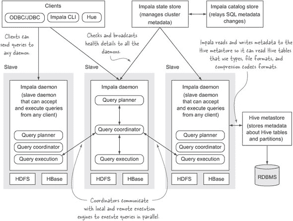

Impala 允许您使用 SQL 语法查询 HDFS 或 HBase 中的数据，因此它支持通过 ODBC 访问。它使用 Hive 元数据存储，因此它可以读取现有的 Hive 表，并且通过 Impala 执行的 DDL 语句也会反映在 Hive 中。

在本节中，我将介绍 Impala 和 Hive 之间的一些差异，我们还将查看一些 Impala 的基本示例，包括如何使用 Hive UDFs。

#### 9.2.1\. Impala 与 Hive

Impala 和 Hive 之间存在一些差异：

+   Impala 从一开始就被设计为一个大规模并行查询引擎，不需要将 SQL 转换为另一个处理框架。Hive 依赖于 MapReduce（或更近期的 Tez）来执行。

+   Impala 和 Hive 都是开源的，但 Impala 是 Cloudera 控制下的精选项目。

+   Impala 不具有容错性。

+   Impala 不支持复杂类型，如映射、数组和结构（包括嵌套的 Avro 数据）。你基本上只能处理扁平数据.^([6])

    > ⁶ Impala 和 Avro 嵌套类型支持计划在 Impala 2.0 中实现：[`issues.cloudera.org/browse/IMPALA-345`](https://issues.cloudera.org/browse/IMPALA-345)。

+   有各种文件格式和压缩编解码器组合，需要你使用 Hive 来创建和加载数据表。例如，你无法在 Impala 中创建或加载数据到 Avro 表，也无法在 Impala 中加载 LZO 压缩的文本文件。对于 Avro，你需要在 Impala 中使用它之前在 Hive 中创建表，而在 Avro 和 LZO 压缩的文本中，你需要在 Impala 中使用它们之前使用 Hive 将这些数据加载到这些表中。

+   Impala 不支持 Hive 用户定义的表生成函数（UDTS），尽管它支持 Hive UDF 和 UDAF，并且可以与包含这些 UDF 的现有 JAR 文件一起工作，而无需对 JAR 文件进行任何更改。

+   有些聚合函数和 HiveQL 语句在 Impala 中不受支持。

| |
| --- |

##### Impala 和 Hive 版本

此列表比较了 Hive 0.13 和 Impala 1.3.1，两者在撰写时都是当前的。需要注意的是，Impala 2 版本将解决这些问题中的某些问题。

| |
| --- |

Cloudera 有一个详细的 Impala 和 Hive 之间 SQL 差异列表：[`mng.bz/0c2F`](http://mng.bz/0c2F)。

#### 9.2.2. Impala 基础知识

本节涵盖了 Impala 可能最流行的两种数据格式——文本和 Parquet。

#### 技巧 94：处理文本

文本通常是探索新工具时首先处理的文件格式，它也作为理解基础的良好学习工具。

##### 问题

你有以文本形式存在的数据，你希望在 Impala 中处理。

##### 解决方案

Impala 的文本支持与 Hive 相同。

##### 讨论

Impala 的基本查询语言与 Hive 相同。让我们从将股票数据复制到 HDFS 中的一个目录开始：

```
$ hadoop fs -mkdir hive-stocks
$ hadoop fs -put test-data/stocks.txt hive-stocks
```

接下来，你将创建一个外部表并对数据进行简单的聚合操作：

```
$ impala-shell

> CREATE EXTERNAL TABLE stocks (
  sym STRING,
  dt STRING,
  open FLOAT,
  high FLOAT,
  low FLOAT,
  close FLOAT,
  volume INT,
  adj_close FLOAT
)
ROW FORMAT DELIMITED FIELDS TERMINATED BY ','
LOCATION '/user/YOUR-USERNAME/hive-stocks';

> SELECT sym, min(close), max(close) FROM stocks GROUP BY sym;
+------+-------------------+-------------------+
| sym  | min(close)        | max(close)        |
+------+-------------------+-------------------+
| MSFT | 20.32999992370605 | 116.5599975585938 |
| AAPL | 14.80000019073486 | 194.8399963378906 |
| GOOG | 202.7100067138672 | 685.1900024414062 |
| CSCO | 13.64000034332275 | 108.0599975585938 |
| YHOO | 12.85000038146973 | 475               |
+------+-------------------+-------------------+
```

| |
| --- |

##### 在 Impala 中使用 Hive 表

技巧 94 中的示例展示了如何在 Impala 中创建一个名为 stocks 的表。如果你已经在 Hive 中创建了 stocks 表（如技巧 89 所示），那么你不需要在 Impala 中创建该表，而应该刷新 Impala 的元数据，然后使用该 Hive 表在 Impala 中。

在 Hive 中创建表后，在 Impala shell 中发出以下语句：

```
> INVALIDATE METADATA stocks;
```

到目前为止，你可以在 Impala shell 中对 stocks 表发出查询。

或者，如果您真的想在 Impala 中创建表并且您已经在 Hive 中创建了表，您需要在 Impala 中发出 `CREATE TABLE` 命令之前发出 `DROP TABLE` 命令。


就这些！您会注意到语法与 Hive 完全相同。唯一的区别是您不能使用 `symbol` 和 `date` 作为列名，因为它们是 Impala 中的保留符号（Hive 没有这样的限制）。

让我们看看如何处理一个更有趣的存储格式：Parquet。

#### 技巧 95 使用 Parquet

非常推荐您使用 Parquet 作为存储格式，以获得各种空间和时间效率（有关 Parquet 优势的更多详细信息，请参阅第三章章节链接）。本技巧探讨了如何在 Impala 中创建 Parquet 表。

##### 问题

您需要将数据保存为 Parquet 格式以加快查询速度并提高数据的压缩率。

##### 解决方案

在创建表时使用 `STORED AS PARQUET`。

##### 讨论

快速开始使用 Parquet 的一种方法是基于现有表（现有表不一定是 Parquet 表）创建一个新的 Parquet 表。以下是一个示例：

```
CREATE TABLE stocks_parquet LIKE stocks STORED AS PARQUET;
```

然后，您可以使用 `INSERT` 语句将旧表的内容复制到新的 Parquet 表中：

```
INSERT OVERWRITE TABLE stocks_parquet SELECT * FROM stocks;
```

现在，您可以丢弃旧表并开始使用您的新 Parquet 表！

```
> SHOW TABLE STATS stocks_parquet;
Query: show TABLE STATS stocks_parquet
+-------+--------+--------+---------+
| #Rows | #Files | Size   | Format  |
+-------+--------+--------+---------+
| -1    | 1      | 2.56KB | PARQUET |
+-------+--------+--------+---------+
```

或者，您可以从头创建一个新表：

```
CREATE TABLE stocks_parquet_internal (
  sym STRING,
  dt STRING,
  open DOUBLE,
  high DOUBLE,
  low DOUBLE,
  close DOUBLE,
  volume INT,
  adj_close DOUBLE
) STORED AS PARQUET;
```

Impala 的一个优点是它允许使用 `INSERT ... VALUES` 语法，因此您可以轻松地将数据放入表中:^([7])

> ⁷ 不推荐使用 `INSERT ... VALUES` 进行大量数据加载。相反，将文件移动到表的 HDFS 目录中、使用 `LOAD DATA` 语句或使用 `INSERT INTO ... SELECT` 或 `CREATE TABLE AS SELECT ...` 语句会更有效率。前两种选项会将文件移动到表的 HDFS 目录中，后两种语句将并行加载数据。

```
INSERT INTO stocks_parquet_internal
VALUES ("YHOO","2000-01-03",442.9,477.0,429.5,475.0,38469600,118.7);
```

Parquet 是一种列式存储格式，因此您在查询中选择的列越少，查询执行速度越快。在以下示例中，选择所有列可以被认为是一种反模式，如果可能的话应避免：

```
SELECT * FROM stocks;
```

接下来，让我们看看如何处理在 Impala 外部修改表中数据的情况。

#### 技巧 96 刷新元数据

如果您在 Impala 内部对表或数据进行更改，该信息将自动传播到所有其他 Impala 守护进程，以确保后续查询能够获取到新数据。但截至 1.3 版本，Impala 无法处理在 Impala 外部插入到表中的数据的情况。

Impala 还对表中文件的块放置敏感——如果 HDFS 调平器运行并将块重新定位到另一个节点，您需要发出刷新命令来强制 Impala 重置块位置缓存。

在这个技术中，你将学习如何刷新 Impala 中的表，以便它能够获取新数据。

##### 问题

你已在 Impala 之外向 Hive 表插入了数据。

##### 解决方案

使用`REFRESH`语句。

##### 讨论

Impala 守护进程缓存 Hive 元数据，包括关于表和块位置的信息。因此，如果数据已加载到 Impala 之外的表，你需要使用`REFRESH`语句，以便 Impala 可以拉取最新的元数据。

让我们看看一个实际应用的例子；我们将使用你在技术 94 中创建的股票表。让我们向外部表的目录中添加一个包含全新股票代码报价的新文件：

```
echo "TSLA,2014-06-25,236,236,236,236,38469600,236" \
| hadoop fs -put - hive-stocks/append.txt
```

启动 Hive shell，你将立即能够看到股票：

```
hive> select * from stocks where sym = "TSLA";
TSLA  2014-06-25  236.0  236.0  236.0  236.0  38469600  236.0
```

在 Impala 中运行相同的查询，你将看不到任何结果：

```
> select * from stocks where sym = "TSLA";

Returned 0 row(s) in 0.33s
```

快速的`REFRESH`可以解决问题：

```
> REFRESH stocks;

> select * from stocks where sym = "TSLA";
+------+------------+------+------+-----+-------+----------+-----------+
| sym  | dt         | open | high | low | close | volume   | adj_close |
+------+------------+------+------+-----+-------+----------+-----------+
| TSLA | 2014-06-25 | 236  | 236  | 236 | 236   | 38469600 | 236       |
+------+------------+------+------+-----+-------+----------+-----------+
```


##### `REFRESH`和`INVALIDATE METADATA`之间有什么区别？

在“在 Impala 中使用 Hive 表”侧边栏中（见技术 94），你使用了 Impala 中的`INVALIDATE METADATA`命令，以便你能看到在 Hive 中创建的表。这两个命令之间有什么区别？

`INVALIDATE METADATA`命令执行时资源消耗更大，当你使用 Hive 创建、删除或修改表后想要刷新 Impala 的状态时，它是必需的。一旦表在 Impala 中可见，如果新数据被加载、插入或更改，你应该使用`REFRESH`命令来更新 Impala 的状态。


##### 摘要

当使用 Impala 插入和加载数据时，你不需要使用`REFRESH`，因为 Impala 有一个内部机制，通过该机制它共享元数据更改。因此，`REFRESH`仅在通过 Hive 加载数据或当你在外部操作 HDFS 中的文件时才是必需的。

#### 9.2.3\. Impala 中的用户定义函数

Impala 支持用 C++编写的本地 UDF，它们在性能上优于 Hive 的对应版本。本书不涵盖本地 UDF 的内容，但 Cloudera 有优秀的在线文档，全面涵盖了本地 UDF。^([8]) Impala 还支持使用 Hive UDF，我们将在下一个技术中探讨。

> ⁸ 关于 Impala UDF 的更多详细信息，请参阅 Cloudera 网站上的“用户定义函数”页面，网址为[`mng.bz/319i`](http://mng.bz/319i)。

#### 技术编号 97 在 Impala 中执行 Hive UDF

如果你一直在使用 Hive，你很可能已经开发了一些你经常在查询中使用的 UDF。幸运的是，Impala 提供了对这些 Hive UDF 的支持，并允许你无需更改代码或 JAR 文件即可使用它们。

##### 问题

你想在 Impala 中使用自定义或内置的 Hive UDF。

##### 解决方案

在 Impala 中创建一个函数，引用包含 UDF 的 JAR 文件。

##### 讨论

Impala 要求包含 UDF 的 JAR 文件位于 HDFS 中：

```
$ hadoop fs -put <PATH-TO-HIVE-LIB-DIR>/hive-exec.jar
```

接下来，在 Impala 命令行中，你需要定义一个新的函数，并指向 HDFS 上的 JAR 文件位置以及实现 UDF 的完全限定类。

对于这种技术，我们将使用一个与 Hive 打包在一起的 UDF，它将输入数据转换为十六进制形式。UDF 类是 `UDFHex`，以下示例创建了一个该类的函数，并给它一个逻辑名称 `my_hex`，以便在 SQL 中更容易引用它：

```
create function my_hex(string) returns string
location '/user/YOUR-USERNAME/hive-exec.jar'
symbol='org.apache.hadoop.hive.ql.udf.UDFHex';
```

到目前为止，你可以使用 UDF——以下是一个简单的示例：

```
> select my_hex("hello");
+-------------------------+
| default.my_hex('hello') |
+-------------------------+
| 68656C6C6F              |
+-------------------------+
```

##### 摘要

在 Hive 中使用 Hive UDF 与在 Impala 中使用它的区别是什么？

+   定义 UDF 的查询语言语法是不同的。

+   Impala 要求你定义函数的参数类型和返回类型。这意味着即使 UDF 设计为与任何 Hive 类型一起工作，如果定义的参数类型与你要操作的数据类型不同，那么进行类型转换的责任就落在你身上。

+   Impala 目前不支持复杂类型，因此你只能返回标量类型。

+   Impala 不支持用户定义的表函数。

这标志着我们对 Impala 的覆盖结束。要更详细地了解 Impala，请参阅 Richard L. Saltzer 和 Istvan Szegedi 的著作，《Impala in Action》（Manning，计划于 2015 年出版）。

接下来，让我们看看如何将 SQL 内联使用在 Spark 中，这可能成为你工具箱中最终的提取、转换和加载（ETL）和分析工具。

### 9.3. Spark SQL

新的 SQL-on-Hadoop 项目似乎每天都有出现，但很少有像 Spark SQL 那样有前途的。许多人认为，由于 Spark 简单的 API 和高效灵活的执行模型，Spark 是 Hadoop 处理的未来，而 Spark 1.0 版本中 Spark SQL 的引入进一步扩展了 Spark 工具包。

Apache Spark 是一个与 Hadoop 兼容的集群计算引擎。其主要卖点是通过在集群中将数据集固定到内存中来实现快速数据处理，并支持多种数据处理方式，包括 Map-Reduce 风格、迭代处理和图处理。

Spark 诞生于加州大学伯克利分校，并于 2014 年成为 Apache 项目。由于其表达性语言和允许你通过其 API（目前定义在 Java、Scala 和 Python 中）快速启动和运行，它正在产生巨大的动力。实际上，Apache Mahout，这个历史上在 MapReduce 中实现其并行化算法的机器学习项目，最近表示所有新的分布式算法都将使用 Spark 实现。

在 Spark 早期发展阶段，它使用了一个名为 Shark 的系统来为 Spark 引擎提供 SQL 接口。最近，在 Spark 1.0 版本中，我们介绍了 Spark SQL，它允许你在 Spark 代码中混合使用 SQL。这预示着一种新的 Hadoop 处理范式，即混合使用 SQL 和非 SQL 代码。

| |
| --- |

##### Spark SQL 和 Shark 之间的区别是什么？

Shark 是第一个在 Spark 中提供 SQL 能力的 Spark 系统。Shark 使用 Hive 进行查询规划，使用 Spark 进行查询执行。另一方面，Spark SQL 不使用 Hive 查询规划器，而是使用自己的规划器（和执行）引擎。目标是保持 Shark 作为 Spark 的 Hive 兼容部分，但计划在 Spark SQL 稳定后将其迁移到 Spark SQL 进行查询规划.^([9])

> ⁹ Michael Armbrust 和 Reynold Xin 讨论了 Shark 的未来，“Spark SQL：使用 Spark 操作结构化数据”，[`mng.bz/9057`](http://mng.bz/9057)。

| |
| --- |

在本节中，我们将探讨如何在 Spark 中处理 SQL，并查看其类似 SQL 的 API，这些 API 提供了一种流畅的风格来编写查询。

| |
| --- |

##### Spark SQL 的生产就绪性

在撰写本文时，Spark 1.0 已经发布，它首次引入了 Spark SQL。它目前被标记为 alpha 质量，并且正在积极开发中.^([10]) 因此，本节中的代码可能与生产就绪的 Spark SQL API 不同。

> ¹⁰ Michael Armbrust 和 Zongheng Yang，“Spark SQL 的前景令人兴奋的性能改进”，[`mng.bz/efqV`](http://mng.bz/efqV)。

| |
| --- |

在我们开始学习 Spark SQL 之前，让我们通过查看一些简单的 Spark 示例来熟悉 Spark。

#### 9.3.1\. Spark 101

Spark 由一组核心 API 和执行引擎组成，在其之上存在其他 Spark 系统，这些系统提供 API 和针对特定活动的处理能力，例如设计流处理管道。核心 Spark 系统如图 9.7 所示。

##### 图 9.7\. Spark 系统

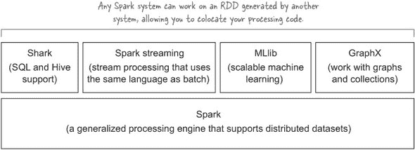

Spark 组件如图 9.8 所示。Spark 驱动程序负责与集群管理器通信以执行操作，而 Spark 执行器处理实际的操作执行和数据管理。

##### 图 9.8\. Spark 架构

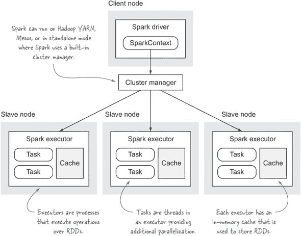

Spark 中的数据使用 RDDs（弹性分布式数据集）表示，它是对一系列项目的抽象。RDDs 在集群上分布，以便每个集群节点将存储和管理 RDD 中一定范围内的项目。RDD 可以从多个来源创建，例如常规 Scala 集合或来自 HDFS（通过 Hadoop 输入格式类合成）的数据。RDD 可以是内存中的，也可以是磁盘上的，或者两者兼而有之.^([11])

> ¹¹ 关于 RDD 缓存和持久化的更多信息，可以在 Spark 编程指南中找到，网址为[`spark.apache.org/docs/latest/programming-guide.html#rdd-persistence`](https://spark.apache.org/docs/latest/programming-guide.html#rdd-persistence)。

以下示例展示了如何从文本文件创建 RDD：

```
scala> val stocks = sc.textFile("stocks.txt")
stocks: org.apache.spark.rdd.RDD[String] = MappedRDD[122] at textFile
```

Spark `RDD`类具有各种可以在 RDD 上执行的操作。Spark 中的 RDD 操作分为两类——转换和动作：

+   *转换* 在 RDD 上操作以创建一个新的 RDD。转换函数的示例包括 `map`、`flatMap`、`reduceByKey` 和 `distinct`.^(12）

    > ^(12) 更完整的转换列表可以在 Spark 编程指南中找到，[`spark.apache.org/docs/latest/programming-guide.html#transformations`](https://spark.apache.org/docs/latest/programming-guide.html#transformations)。

+   *操作* 在 RDD 上执行一些活动，之后将结果返回给驱动程序。例如，`collect` 函数将整个 RDD 内容返回给驱动进程，而 `take` 函数允许您选择数据集中的前 *N* 个项目.^(13）

    > ^(13) 更完整的操作列表可以在 Spark 编程指南中找到，[`spark.apache.org/docs/latest/programming-guide.html#actions`](https://spark.apache.org/docs/latest/programming-guide.html#actions)。


##### 懒惰转换

Spark 会延迟评估转换，因此您实际上需要执行一个操作，Spark 才会执行您的操作。


让我们看看一个 Spark 应用程序的例子，该程序计算每个符号的平均股票价格。要运行此示例，您需要安装 Spark，^(14) 安装完成后，您可以启动 shell：

> ^(14) 在 YARN 上安装和配置 Spark，请遵循“在 YARN 上运行 Spark”页面上的说明，[`spark.apache.org/docs/latest/running-on-yarn.html`](http://spark.apache.org/docs/latest/running-on-yarn.html)。

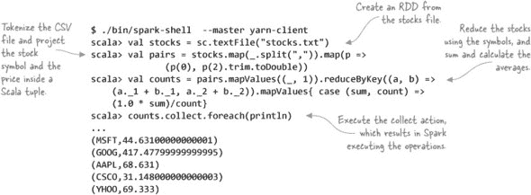

这是对 Spark 的一个非常简短的介绍——Spark 在线文档非常出色，值得探索以了解更多关于 Spark 的信息.^([15]) 现在我们来介绍 Spark 如何与 Hadoop 一起工作。

> ^(15) 学习 Spark 的一个好起点是 Spark 编程指南，[`spark.apache.org/docs/latest/programming-guide.html`](http://spark.apache.org/docs/latest/programming-guide.html)。

#### 9.3.2\. Spark on Hadoop

Spark 支持多个集群管理器，其中之一是 YARN。在此模式下，Spark 执行器是 YARN 容器，Spark ApplicationMaster 负责管理 Spark 执行器并向它们发送命令。Spark 驱动程序位于客户端进程内部或 ApplicationMaster 内部，具体取决于您是在客户端模式还是集群模式下运行：

+   在 *客户端模式* 下，驱动程序位于客户端内部，这意味着在此模式下执行一系列 Spark 任务将会被中断，如果客户端进程被终止。这种模式适合 Spark shell，但不适合在 Spark 以非交互方式使用时使用。

+   在 *集群模式* 下，驱动程序在 ApplicationMaster 中执行，并且不需要客户端存在即可执行任务。这种模式最适合您有一些现有的 Spark 代码需要执行，且不需要您进行任何交互的情况。

图 9.9 展示了 Spark 在 YARN 上运行的架构。

##### 图 9.9\. Spark 在 YARN 上运行

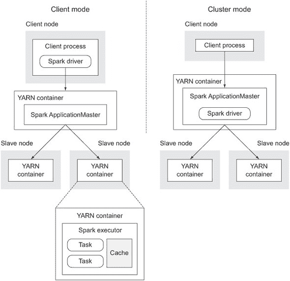

Spark 的默认安装设置为独立模式，因此您必须配置 Spark 以使其与 YARN 一起工作。16 Spark 脚本和工具在运行在 YARN 上时不会改变，因此一旦您配置了 Spark 以使用 YARN，您就可以像上一个示例中那样运行 Spark shell。

> ^([16) 按照以下说明在 [`spark.apache.org/docs/latest/running-on-yarn.html`](https://spark.apache.org/docs/latest/running-on-yarn.html) 中设置 Spark 以使用 YARN。

现在您已经了解了 Spark 的基础知识以及它在 YARN 上的工作方式，让我们看看您如何使用 Spark 执行 SQL。

#### 9.3.3\. 使用 Spark 的 SQL

本节介绍了 Spark SQL，它是 Spark 核心系统的一部分。Spark SQL 将涵盖三个领域：对 RDD 执行 SQL、使用集成查询语言特性以提供更丰富的数据处理方式，以及将 HiveQL 与 Spark 集成。

| |
| --- |

##### Spark SQL 的稳定性

Spark SQL 目前被标记为 alpha 质量，因此最好在它被标记为生产就绪之前不要在生产代码中使用它。

| |
| --- |

#### 技巧 98 使用 Spark SQL 计算股票平均价

在这个技巧中，您将学习如何使用 Spark SQL 来计算每个股票符号的平均价格。

##### 问题

您有一个 Spark 处理管道，使用 SQL 表达函数比使用 Spark API 更简单。

##### 解决方案

将 RDD 注册为表，并使用 Spark 的 `sql` 函数对 RDD 执行 SQL。

##### 讨论

本技巧的第一步是定义一个类，该类将代表 Spark 表中的每条记录。在这个例子中，您将计算股票价格的平均值，因此您只需要一个包含两个字段的类来存储股票符号和价格：

```
scala> case class Stock(symbol: String, price: Double)
```

| |
| --- |

##### 为什么在 Spark 示例中使用 Scala？

在本节中，我们将使用 Scala 来展示 Spark 示例。直到最近，Scala API 比 Spark 的 Java API 更简洁，尽管随着 Spark 1.0 的发布，Spark 现在的 Java 支持使用 lambdas 来提供一个更简洁的 API。

| |
| --- |

接下来，您需要将这些 `Stock` 对象的 RDD 注册为表，以便您可以在其上执行 SQL 操作。您可以从任何 Spark RDD 创建一个表。以下示例展示了您如何从 HDFS 加载股票数据并将其注册为表：

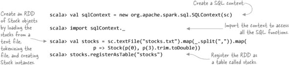

现在，你可以对股票表发出查询。以下是如何计算每个符号的平均价格：

```
scala> val stock_averages = sql(
           "SELECT symbol, AVG(price) FROM stocks GROUP BY symbol")

scala> stock_averages.collect().foreach(println)
[CSCO,31.564999999999998]
[GOOG,427.032]
[MSFT,45.281]
[AAPL,70.54599999999999]
[YHOO,73.29299999999999]
```

`sql` 函数返回一个 `SchemaRDD`，它支持标准的 RDD 操作。这正是 Spark SQL 的独特之处——将 SQL 和常规数据处理范式结合起来。您使用 SQL 创建一个 RDD，然后可以立即对那些数据执行常规的 Spark 转换。

除了支持标准的 Spark RDD 操作外，`SchemaRDD`还允许你在数据上执行类似 SQL 的函数，如`where`和`join`，这将在下一个技术中介绍.^([17])

> (17) 允许以更自然语言表达查询的语言集成查询可以在`SchemaRDD`类的 Scala 文档中看到，链接为[`spark.apache.org/docs/latest/api/scala/index.html#org.apache.spark.sql.SchemaRDD`](http://spark.apache.org/docs/latest/api/scala/index.html#org.apache.spark.sql.SchemaRDD).

#### 技术编号 99：语言集成查询

之前的技术展示了如何在 Spark 数据上执行 SQL。Spark 1.0 还引入了一个名为语言集成查询的功能，它将 SQL 结构作为函数暴露出来，允许你编写不仅流畅而且使用自然语言结构表达操作的代码。在这个技术中，你将看到如何在你自己的 RDD 上使用这些函数。

##### 问题

尽管 Spark RDD 函数具有表现力，但它们生成的代码并不特别适合人类阅读。

##### 解决方案

使用 Spark 的语言集成查询。

##### 讨论

再次尝试计算平均股票价格，这次使用语言集成查询。此示例使用`groupBy`函数来计算平均股票价格：

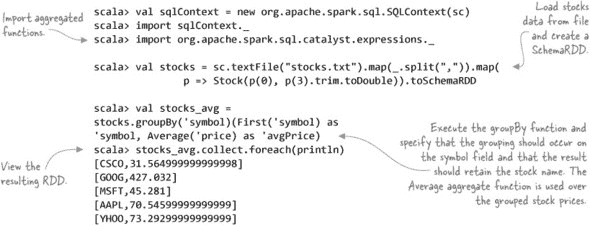

上述代码利用了`Average`和`First`聚合函数——还有其他聚合函数，如`Count`、`Min`和`Max`等.^([18])

> (18) 请参阅以下链接以获取完整列表的代码：[`github.com/apache/spark/blob/master/sql/catalyst/src/main/scala/org/apache/spark/sql/catalyst/expressions/aggregates.scala`](https://github.com/apache/spark/blob/master/sql/catalyst/src/main/scala/org/apache/spark/sql/catalyst/expressions/aggregates.scala).

下一个示例更为直接；它只是简单地选择价值超过 100 美元的日期的所有报价：

```
scala> stocks.where('price >= 100).collect.foreach(println)
[AAPL,200.26]
[AAPL,112.5]
...
```

Spark SQL 的第三种选择是使用 HiveQL，这在需要执行更复杂的 SQL 语法时很有用。

#### 技术编号 100：Hive 和 Spark SQL

你还可以在 Spark 中使用 Hive 表中的数据。这个技术探讨了如何对 Hive 表执行查询。

##### 问题

你想在 Spark 中处理 Hive 数据。

##### 解决方案

使用 Spark 的`HiveContext`发布 HiveQL 语句并在 Spark 中处理结果。

##### 讨论

在本章的早期，你已经在 Hive 中创建了一个股票表（在技术编号 89 中）。现在让我们使用 HiveQL 在 Spark 中查询这个股票表，然后在 Spark 中进行一些额外的操作：

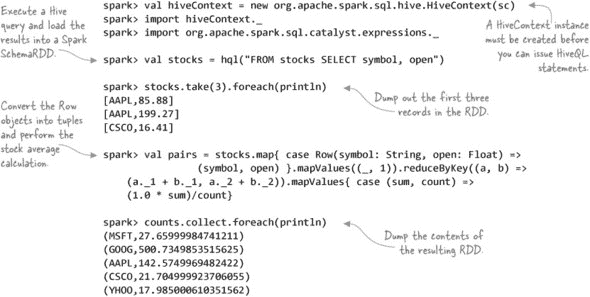

在 Spark 中，你可以访问完整的 HiveQL 语法，因为包裹在`hql`调用中的命令直接发送到 Hive。你可以加载数表，向表中插入数据，并执行任何所需的 Hive 命令，所有这些都可以直接从 Spark 完成。Spark 的 Hive 集成还包括在查询中使用 Hive UDFs、UDAFs 和 UDTFs 的支持。

这完成了我们对 Spark SQL 的简要了解。

### 9.4. 章节总结

对于组织来说，通过 Hadoop 访问数据是至关重要的，因为并非所有希望与数据交互的用户都是程序员。SQL 不仅是数据分析师的通用语言，也是您组织中的数据科学家和非技术成员的通用语言。

在本章中，我介绍了三个可以用来通过 SQL 处理数据的工具。Hive 存在时间最长，目前是您可以使用功能最全面的 SQL 引擎。如果 Hive 无法提供足够快的与数据交互的速度，Impala 则值得认真考虑。最后，Spark SQL 为未来提供了一个窗口，在这个窗口中，您组织中的技术成员，如程序员和数据科学家，可以将 SQL 和 Scala 融合在一起，构建复杂且高效的处理管道。

## 第十章. 编写 YARN 应用

*本章涵盖*

+   理解 YARN 应用的关键功能

+   如何编写基本的 YARN 应用

+   对 YARN 框架和应用的考察

查看任何合理规模的 YARN 应用的源代码通常会导致人们使用“复杂”和“低级”这样的词汇。从本质上讲，编写 YARN 应用并不复杂，正如您在本章中将发现的那样。YARN 的复杂性通常在您需要将更高级的功能构建到应用中时出现，例如支持安全的 Hadoop 集群或处理故障场景，这在分布式系统中无论框架如何都是复杂的。尽管如此，有一些新兴的框架抽象了 YARN API，并提供了您所需的一些常见功能。

在本章中，您将编写一个简单的 YARN 应用，该应用将在集群中的一个节点上运行 Linux 命令。一旦您运行了您的应用，您将了解您在 YARN 应用中可能需要的更高级的功能。最后，本章将探讨一些开源的 YARN 抽象，并检查它们的功能。

在我们开始之前，让我们通过查看 YARN 应用的构建块来逐步了解 YARN 编程。

### 10.1. 构建 YARN 应用的基础

本节提供了对 YARN 演员和您在 YARN 应用中需要支持的基本通信流程的简要概述。

#### 10.1.1. 演员

YARN 应用由五个独立的部分组成，这些部分要么是 YARN 框架的一部分，要么是您必须自己创建的组件（我称之为“用户空间”），所有这些都在图 10.1 中展示。

##### 图 10.1. YARN 应用中的主要演员和通信路径

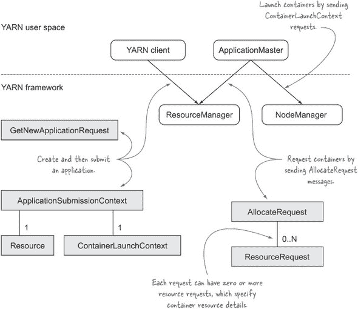

YARN 应用中的演员和 YARN 框架包括

+   ***YARN 客户端*** —在用户空间中，YARN 客户端负责启动 YARN 应用。它向 ResourceManager 发送`createApplication`和`submitApplication`请求，也可以终止应用。

+   ***ResourceManager*** —在框架中，单个集群范围的 ResourceManager 负责接收容器分配请求，并在资源对容器可用时异步通知客户端。

+   ***ApplicationMaster*** —用户空间中的 ApplicationMaster 是应用程序的主要协调器，它与 ResourceManager 和 NodeManagers 协作请求和启动容器。

+   ***NodeManager*** —在框架中，每个节点运行一个 NodeManager，负责处理启动和终止容器的客户端请求。

+   ***Container*** —用户空间中的容器是代表应用程序执行工作的特定应用程序进程。容器可以是现有 Linux 进程的简单分支（例如，使用`find`命令查找文件），也可以是应用程序开发的映射或减少任务，例如 MapReduce YARN 应用程序。

以下几节将讨论这些参与者及其在您的 Yarn 应用中的作用。

#### 10.1.2\. YARN 应用的力学原理

在实现 YARN 应用时，您需要支持多种交互。让我们检查每个交互以及组件之间传递的信息。

##### 资源分配

当 YARN 客户端或 ApplicationMaster 向 ResourceManager 请求新的容器时，它们在一个`Resource`对象中指明容器需要的资源。此外，ApplicationMaster 在`ResourceRequest`中发送一些额外的属性，如图 10.2 所示。

##### 图 10.2\. 可请求的容器资源属性

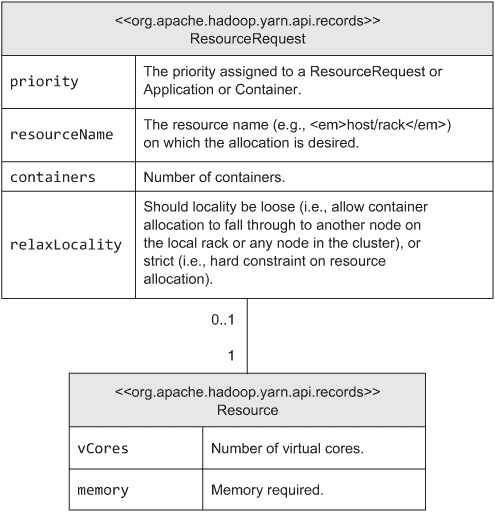

`resourceName`指定容器应执行的主机和机架，并且可以用星号通配符表示，以通知 ResourceManager 容器可以在集群中的任何节点上启动。

ResourceManager 对资源请求响应时，返回一个表示单个执行单元（进程）的`Container`对象。容器包括一个 ID、`resourceName`和其他属性。一旦 YARN 客户端或 ApplicationMaster 从 ResourceManager 接收到此消息，它就可以与 NodeManager 通信以启动容器。

##### 启动容器

一旦客户端从 ResourceManager 接收了`Container`，它就准备好与关联的 NodeManager 通信以启动容器。图 10.3 显示了客户端作为请求一部分发送给 NodeManager 的信息。

##### 图 10.3\. 容器请求元数据

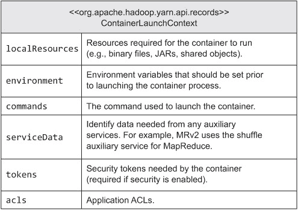

NodeManager 负责从 HDFS 下载请求中标识的任何本地资源（包括应用程序所需的任何库或分布式缓存中的文件等）。一旦这些文件下载完成，NodeManager 将启动容器进程。

在这些 YARN 预备知识完成后，让我们继续编写一个 YARN 应用。

### 10.2\. 构建用于收集集群统计信息的 YARN 应用程序

在本节中，你将构建一个简单的 YARN 应用程序，该程序将启动一个容器来执行 `vmstat` Linux 命令。在构建这个简单示例的过程中，我们将关注使 YARN 应用程序启动和运行所需的管道。下一节将介绍你可能在完整 YARN 应用程序中需要的高级功能。

 展示了在本节中你将构建的各种组件以及它们与 YARN 框架的交互。

##### 

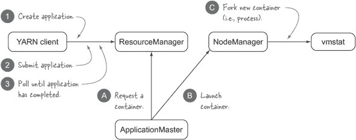

让我们从构建 YARN 客户端开始。

#### 技巧 101 一个基本的 YARN 客户端

YARN 客户端的作用是与 ResourceManager 协商以创建和启动 YARN 应用程序实例。作为这项工作的部分，你需要向 ResourceManager 通知你的 ApplicationMaster 的系统资源需求。一旦 ApplicationMaster 启动并运行，客户端可以选择监控应用程序的状态。

这种技术将向你展示如何编写一个执行 图 10.5 中展示的三项活动的客户端。

##### 

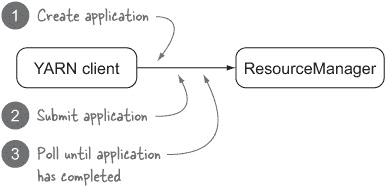

##### 问题

你正在构建一个 YARN 应用程序，因此你需要编写一个客户端来启动你的应用程序。

##### 解决方案

使用 `YarnClient` 类创建和提交 YARN 应用程序。

##### 讨论

让我们逐个分析 图 10.5 中突出显示的每个步骤的代码，从创建一个新的 YARN 应用程序开始。

##### 创建 YARN 应用程序

你的 YARN 客户端需要做的第一件事是与 ResourceManager 通信，告知其启动新 YARN 应用程序的意图。ResourceManager 的响应是一个唯一的应用程序 ID，用于创建应用程序，并且 YARN 命令行也支持查询日志等操作。

以下代码展示了如何获取 `YarnClient` 实例的句柄，并使用它来创建应用程序^([1])。

> ¹ GitHub 源代码：[`github.com/alexholmes/hiped2/blob/master/src/main/java/hip/ch10/dstat/Client.java`](https://github.com/alexholmes/hiped2/blob/master/src/main/java/hip/ch10/dstat/Client.java)。

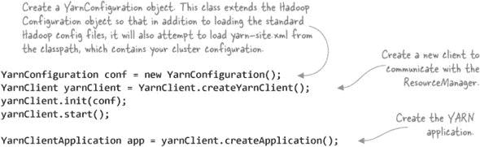

`createApplication` 方法将调用 ResourceManager，它将返回一个新的应用程序 ID。此外，`YarnClientApplication` 对象包含有关集群的信息，例如可用于预定义容器资源属性的可用资源能力。

在前面代码中使用的 `YarnClient` 类包含多个 API，这些 API 会导致对 ResourceManager 的 RPC 调用。其中一些方法在以下代码摘录中有所展示^([2])。

> ² 从`YarnClient`类中省略了一些队列和安全 API——请参阅`YarnClient`的 Javadocs 以获取完整的 API：[`hadoop.apache.org/docs/stable/api/org/apache/hadoop/yarn/client/api/YarnClient.html`](http://hadoop.apache.org/docs/stable/api/org/apache/hadoop/yarn/client/api/YarnClient.html).

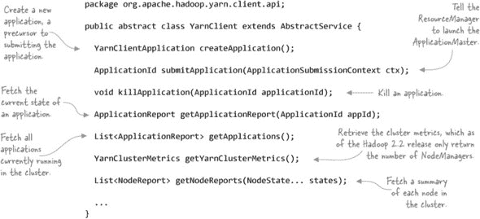

在 YARN 中创建一个应用程序实际上并没有做任何事情，只是通知 ResourceManager 你打算启动应用程序的意图。下一步将展示你需要做什么才能让 ResourceManager 启动你的 ApplicationMaster。

##### 提交 YARN 应用程序

提交 YARN 应用程序将在你的 YARN 集群中的新容器中启动你的 ApplicationMaster。但在提交应用程序之前，你需要配置几个项目，包括以下内容：

+   应用程序名称

+   启动 ApplicationMaster 的命令，包括类路径和环境设置

+   任何应用程序执行其工作所需的 JAR 文件、配置文件和其他文件

+   ApplicationMaster 的资源需求（内存和 CPU）

+   将应用程序提交到哪个调度器队列以及队列中的应用程序优先级

+   安全令牌

让我们看看启动一个基本的基于 Java 的 ApplicationMaster 所需的代码。我们将把这个代码分成两个小节：准备`Container-LaunchContext`对象，然后指定资源需求和提交应用程序。

首先是`ContainerLaunchContext`，这是你指定启动你的 ApplicationMaster 的命令以及任何其他应用程序执行所需的环境细节的地方：^([3])

> ³ GitHub 源代码：[`github.com/alexholmes/hiped2/blob/master/src/main/java/hip/ch10/dstat/Client.java`](https://github.com/alexholmes/hiped2/blob/master/src/main/java/hip/ch10/dstat/Client.java).

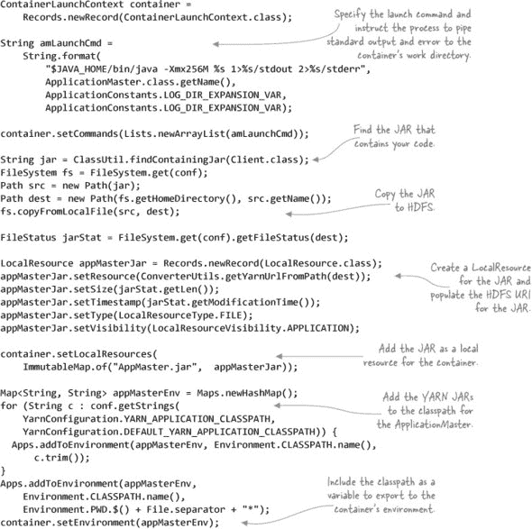

最后的步骤是指定 ApplicationMaster 所需的内存和 CPU 资源，然后提交应用程序：^([4])

> ⁴ GitHub 源代码：[`github.com/alexholmes/hiped2/blob/master/src/main/java/hip/ch10/dstat/Client.java`](https://github.com/alexholmes/hiped2/blob/master/src/main/java/hip/ch10/dstat/Client.java).

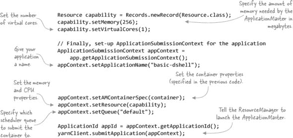

发送到 ResourceManager 的所有容器请求都是异步处理的，所以`submitApplication`返回并不意味着你的 ApplicationMaster 已经启动并运行。为了了解应用程序的状态，你需要轮询 ResourceManager 以获取应用程序状态，这将在下一部分介绍。

##### 等待 YARN 应用程序完成

提交应用程序后，你可以轮询 ResourceManager 以获取有关 ApplicationMaster 状态的信息。结果将包含如下详细信息

+   应用程序的状态

+   应用程序主控运行的主机，以及（如果有）它监听客户端请求的 RPC 端口（在我们的示例中不适用）

+   如果应用程序主控支持，则可以提供一个跟踪 URL，该 URL 提供有关应用程序进度的详细信息（在我们的示例中不支持）

+   一般信息，如队列名称和容器启动时间

您的应用程序主控（ApplicationMaster）可以是图 10.6 中显示的任何一种状态（这些状态包含在枚举`YarnApplicationState`中）。

##### 图 10.6\. 应用程序主控状态

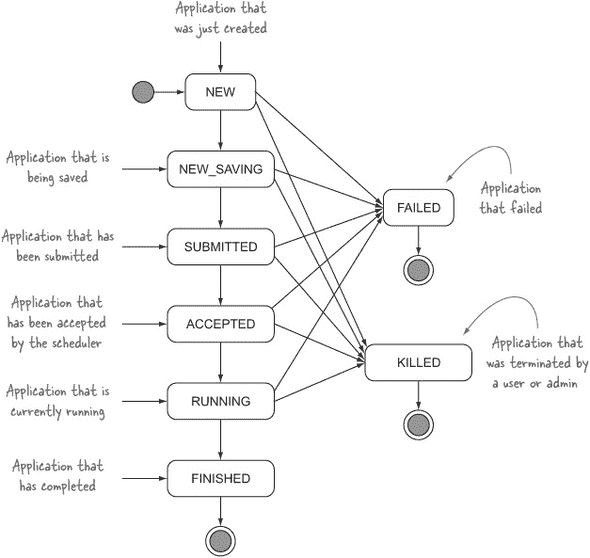

以下代码执行客户端的最终步骤，即定期轮询资源管理器，直到应用程序主控完成：^([5])

> ⁵ GitHub 源代码：[`github.com/alexholmes/hiped2/blob/master/src/main/java/hip/ch10/dstat/Client.java`](https://github.com/alexholmes/hiped2/blob/master/src/main/java/hip/ch10/dstat/Client.java)。

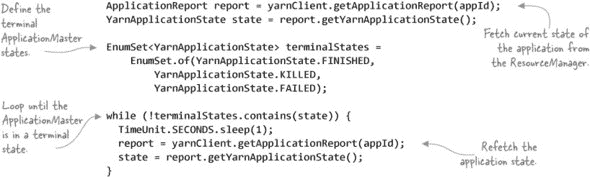

##### 摘要

在本节中未探讨的许多更高级的客户端功能，例如安全性。第 10.3 节讨论了这一点以及您可能希望构建到客户端的其他功能。

在您的 YARN 客户端就绪后，是时候转向您的 YARN 应用程序的第二部分——应用程序主控。

#### 技术篇 102：一个基础的应用程序主控

应用程序主控是 YARN 应用程序的协调器。它负责向资源管理器请求容器，然后通过节点管理器启动容器。图 10.7 显示了这些交互，您将在本技术中探索这些交互。

##### 图 10.7\. 您的应用程序主控将执行的基本功能

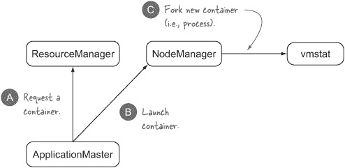

##### 问题

您正在构建一个 YARN 应用程序，并需要实现一个应用程序主控。

##### 解决方案

使用 YARN 应用程序主控 API 通过资源管理器和节点管理器协调您的工作。

##### 讨论

与前一个技术一样，我们将分解应用程序主控需要执行的操作。

##### 在资源管理器中注册

第一步是将应用程序主控注册到资源管理器。为此，您需要获取一个`AMRMClient`实例的句柄，您将使用它与资源管理器进行所有通信：^([6])

> ⁶ GitHub 源代码：[`github.com/alexholmes/hiped2/blob/master/src/main/java/hip/ch10/dstat/ApplicationMaster.java`](https://github.com/alexholmes/hiped2/blob/master/src/main/java/hip/ch10/dstat/ApplicationMaster.java)。

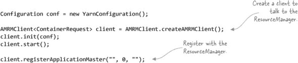

##### 提交容器请求并在可用时启动它

接下来，您需要指定所有希望请求的容器。在这个简单的示例中，您将请求一个容器，并且不会指定它将在哪个特定的主机或机架上运行：^([7])

> ⁷ GitHub 源代码：[`github.com/alexholmes/hiped2/blob/master/src/main/java/hip/ch10/dstat/ApplicationMaster.java`](https://github.com/alexholmes/hiped2/blob/master/src/main/java/hip/ch10/dstat/ApplicationMaster.java)。

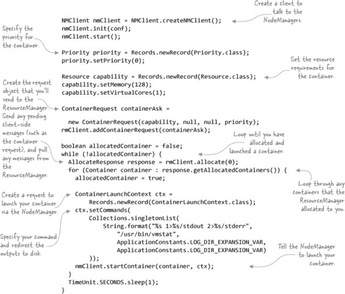

`AMRMClient`的`allocate`方法执行了多个重要功能：

+   它充当向 ResourceManager 的心跳消息。如果 ResourceManager 在 10 分钟后没有收到心跳消息，它将认为 ApplicationMaster 处于不良状态，并将终止进程。默认的超时值可以通过设置`yarn.am.liveness-monitor.expiry-interval-ms`来更改。

+   它发送任何添加到客户端的容器分配请求。

+   它接收零个或多个由容器分配请求产生的分配容器。

在此代码中，第一次调用`allocate`时，容器请求将被发送到 ResourceManager。因为 ResourceManager 异步处理容器请求，所以响应不会包含分配的容器。相反，后续的`allocate`调用将返回分配的容器。

##### 等待容器完成

在这一点上，你已经向 ResourceManager 请求了一个容器，从 ResourceManager 那里收到了容器分配，并与 NodeManager 通信以启动容器。现在你必须继续调用`allocate`方法，并从响应中提取任何完成的容器:^([8])

> ⁸ GitHub 源代码：[`github.com/alexholmes/hiped2/blob/master/src/main/java/hip/ch10/dstat/ApplicationMaster.java`](https://github.com/alexholmes/hiped2/blob/master/src/main/java/hip/ch10/dstat/ApplicationMaster.java)。

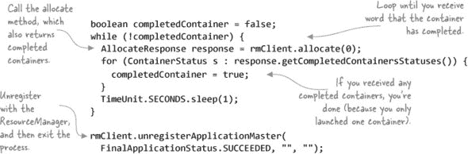

##### 摘要

在这个技术中，你使用了`AMRMClient`和`NMClient`类与 ResourceManager 和 NodeManagers 进行通信。这些客户端为 YARN 服务提供了同步 API。它们有异步对应物（`AMRMClientAsync`和`NMClientAsync`），这些对应物封装了心跳功能，并在接收到 ResourceManager 的消息时回调到你的代码中。异步 API 可能会使你更容易理解与 ResourceManager 的交互，因为 ResourceManager 异步处理所有内容。

ResourceManager 和 NodeManager 还向 ApplicationMasters 公开了一些其他功能:^([9])

> ⁹ 可以在[`hadoop.apache.org/docs/stable/api/org/apache/hadoop/yarn/client/api/AMRMClient.html`](http://hadoop.apache.org/docs/stable/api/org/apache/hadoop/yarn/client/api/AMRMClient.html)查看`AMRMClient`的完整 Javadocs。

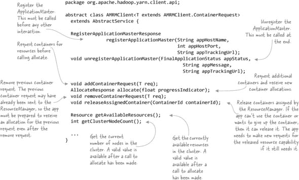

类似地，`NMClient` API 公开了一些机制，你可以使用这些机制来控制和获取你的容器的元数据:^([10])

> ^（10）`NMClient` 的完整 Javadoc 可在 [`hadoop.apache.org/docs/stable/api/org/apache/hadoop/yarn/client/api/NMClient.html`](http://hadoop.apache.org/docs/stable/api/org/apache/hadoop/yarn/client/api/NMClient.html) 找到。

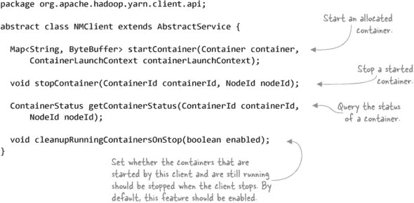

到目前为止，你已经编写了一个完整的 YARN 应用程序的代码！接下来，你将在集群上执行你的应用程序。

#### 技巧 103 运行应用程序和访问日志

到目前为止，你已经有了一个功能性的 YARN 应用程序。在本节中，你将了解如何运行应用程序并访问其输出。

##### 问题

你想要运行你的 YARN 应用程序。

##### 解决方案

使用常规 Hadoop 命令行来启动它并查看容器输出。

##### 讨论

你一直在使用的 `hip` 脚本，用于启动本书中的所有示例，也适用于运行 YARN 应用程序。在幕后，`hip` 调用 `hadoop` 脚本来运行示例。

以下示例显示了运行在最后两个技巧中编写的 YARN 应用程序的输出。它在单个容器中运行 `vmstat` Linux 命令：

```
$ hip --nolib hip.ch10.dstat.basic.Client
client.RMProxy: Connecting to ResourceManager at /0.0.0.0:8032
Submitting application application_1398974791337_0055
impl.YarnClientImpl: Submitted application
  application_1398974791337_0055 to ResourceManager at /0.0.0.0:8032
Application application_1398974791337_0055 finished with state FINISHED
```

如果你启用了日志聚合（有关更多详细信息，请参阅技巧 3），你可以使用以下命令查看应用程序主和 `vmstat` 容器的日志输出：

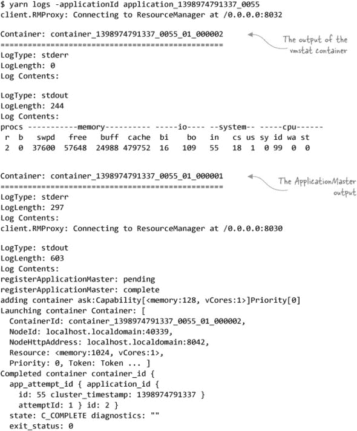

应用程序主将容器标准输出指向 stdout 文件，你可以在该文件中看到 `vmstat` 命令的输出。

##### 容器启动失败时的日志访问

在开发你的 YARN 应用程序期间，应用程序主或你的某个容器可能会因为资源缺失或启动命令错误而无法启动。根据失败发生的位置，你的容器日志将包含与启动相关的错误，或者如果进程完全无法启动，你需要检查 NodeManager 日志。

##### 保留本地化和日志目录

配置属性 `yarn.nodemanager.delete.debug-delay-sec` 控制应用程序本地化和日志目录保留的时间。本地化目录包含 NodeManager 执行以启动容器的命令（包括应用程序主和应用程序容器），以及应用程序为容器指定的任何 JAR 和其他本地化资源。

建议你将此属性设置为足够的时间来诊断失败。但不要设置得太高（比如，以天为单位），因为这可能会对你的存储造成压力。

作为寻找应用程序主启动问题的替代方案，可以运行一个未管理的应用程序主，这将在下一个技巧中介绍。

#### 技巧 104 使用未管理的应用程序主进行调试

调试 YARN ApplicationMaster 是一个挑战，因为它是在远程节点上启动的，需要你从该节点拉取日志来排查你的代码。以这种方式由 ResourceManager 启动的 ApplicationMasters 被称为*管理*的 ApplicationMaster，如图 10.8 所示。

##### 图 10.8\. 一个管理的 ApplicationMaster

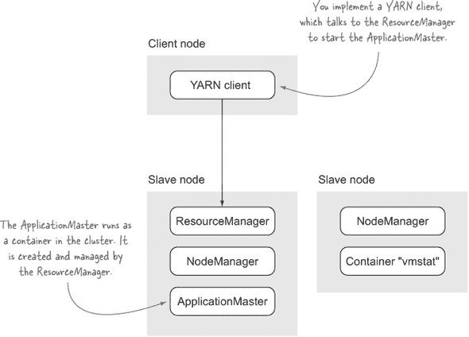

YARN 还支持一个名为*非管理*的 ApplicationMaster 的概念，其中 ApplicationMaster 在本地节点上启动，如图 10.9 所示。当 ApplicationMaster 在本地主机上运行时，诊断其问题更容易。

##### 图 10.9\. 一个非管理 ApplicationMaster

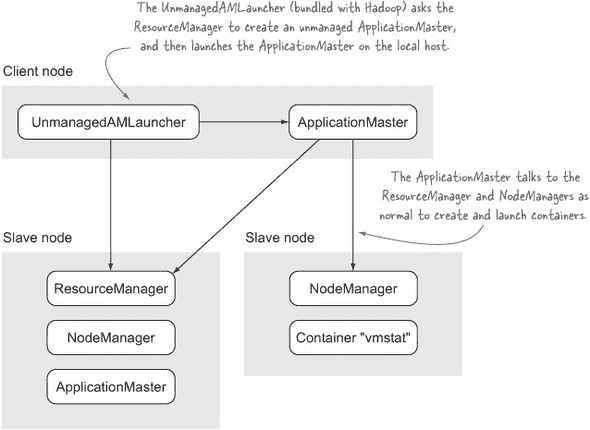

在本节中，你将了解如何运行非管理 ApplicationMaster，并学习它们如何被项目使用。

##### 问题

你想运行一个 ApplicationMaster 的本地实例。

##### 解决方案

运行一个非管理 ApplicationMaster。

##### 讨论

YARN 附带了一个名为`UnmanagedAMLauncher`的应用程序，它启动一个非管理的 ApplicationMaster。非管理 ApplicationMaster 是指不由 ResourceManager 启动的 ApplicationMaster。相反，`UnmanagedAMLauncher`与 ResourceManager 协商以创建一个新的应用程序，但与管理的 ApplicationMaster 不同，`UnmanagedAMLauncher`启动该过程。

当使用`UnmanagedAMLauncher`时，你不需要定义 YARN 客户端，因此你只需要提供启动你的 ApplicationMaster 所需的详细信息。以下示例显示了如何执行你在上一技术中编写的 ApplicationMaster：

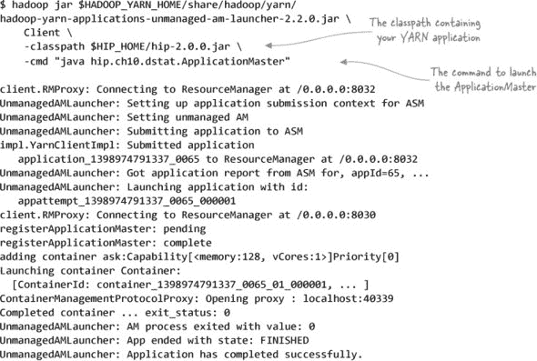

`UnmanagedAMLauncher`捕获 ApplicationMaster 的标准输出和标准错误，并将它们输出到其自己的标准输出。这在你的 ApplicationMaster 无法启动的情况下很有用，在这种情况下，错误将显示在先前的命令输出中，而不是被隐藏在 NodeManager 的日志中。

图 10.10 显示了`UnmanagedAMLauncher`与 ResourceManager 之间的交互。

##### 图 10.10\. 非管理启动器与 ResourceManager 协作启动非管理 ApplicationMaster

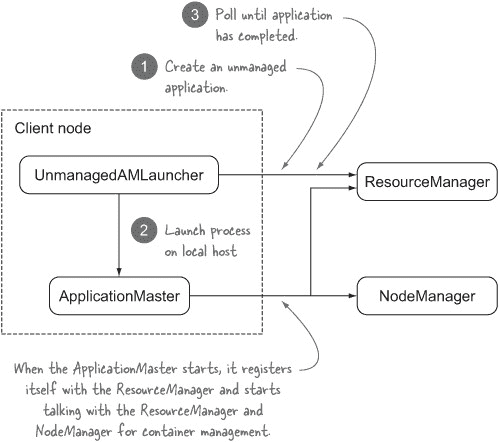

如果你认为`UnmanagedAMLauncher`中的功能过于有限，你可以编写自己的非管理 ApplicationMaster 启动器。以下代码显示了`UnmanagedAMLauncher`告诉 ResourceManagerApplicationMaster 是非管理的关键步骤：

```
ApplicationSubmissionContext appContext = ...;

appContext.setUnmanagedAM(true);
```

非管理 ApplicationMasters 很有用，因为它们提供了对 ApplicationMaster 的本地访问，这可以简化你的调试和性能分析工作。

接下来，让我们看看你可能希望在 YARN 应用程序中支持的一些更高级的功能。

### 10.3\. YARN 应用程序的附加功能

到目前为止，在本章中，我们查看了一个基本的 YARN 应用程序，该应用程序在容器中启动 Linux 命令。然而，如果你正在开发 YARN 应用程序，你很可能需要支持更复杂的功能。本节突出了你可能需要在你的应用程序中支持的一些功能。

#### 10.3.1. 组件间的 RPC

如果你有一个长时间运行的应用程序，你可能希望允许客户端与 ApplicationMaster 通信。你的 ApplicationMaster 也可能需要能够与容器通信，反之亦然。一个例子是一个 SQL-on-Hadoop 应用程序，它允许客户端向 ApplicationMaster 发送查询，然后 ApplicationMaster 协调容器执行工作。

YARN 在这里不提供任何管道服务，因此你需要选择一个 RPC 协议和相应的库。你有几个选择：

+   ***Thrift 或 Avro*** —这两个都提供了一个接口定义语言（IDL），你可以在这里定义端点和消息，这些消息被编译成具体的客户端和服务代码，可以轻松地集成到你的代码中。这些库的优点是代码生成和模式演变，允许你的服务随着时间的推移而发展。

+   ***Protocol Buffers*** —Google 没有开源 RPC 层，所以你需要自己实现。你可以使用 HTTP 上的 REST 作为传输，并使用 Jersey 的注解轻松实现所有这些。

+   ***Hadoop 的 RPC*** —在幕后，它使用 Protocol Buffers。

由于 YARN 不支持组件间的通信，你怎么知道你的服务监听在哪些主机或端口上？

#### 10.3.2. 服务发现

YARN 可以在同一节点上调度多个容器，因此将任何服务在容器或 ApplicationMaster 中的监听端口硬编码并不是理想的选择。相反，你可以选择以下策略之一：

+   如果你的 ApplicationMaster 有一个内置的服务，将启动的容器的 ApplicationMaster 主机和端口详情传递给它，并让容器使用它们的端口号回调到 ApplicationMaster。

+   通过让容器将它们的宿主机和端口详情发布到 ZooKeeper，并让客户端在 ZooKeeper 中查找服务，使用 ZooKeeper 作为服务注册。这是 Apache Twill 采用的策略，该策略在本章的后面部分将进行介绍。

接下来，我们将探讨如何在你的应用程序中维护状态，以便在应用程序重启的情况下从已知状态恢复。

#### 10.3.3. 检查点应用程序进度

如果你的应用程序运行时间较长，并在执行过程中维护和构建状态，你可能需要定期持久化该状态，以便在容器重启的情况下，容器或 ApplicationMaster 可以从上次停止的地方继续执行。容器可能因各种原因被终止，包括为其他用户和应用程序释放资源。ApplicationMaster 崩溃通常是由于应用程序逻辑错误、节点崩溃或集群重启造成的。

可以用于检查点的两个服务是 HDFS 和 ZooKeeper。Apache Twill，一个用于编写 YARN 应用程序的抽象框架，使用 ZooKeeper 来检查点容器和 ApplicationMaster 的状态。

在检查点中需要注意的一个领域是处理脑裂情况。

#### 10.3.4\. 避免脑裂

可能会出现网络问题，导致 ResourceManager 认为 ApplicationMaster 已关闭并启动一个新的 ApplicationMaster。如果你的应用程序以非幂等的方式产生输出或中间数据，这可能会导致不希望的结果。

这是在早期 MapReduce YARN 应用程序中的一个问题，其中任务和作业级别的提交可以执行多次，这对于不能重复执行的提交操作来说并不理想。解决方案是在提交时引入延迟，并使用 ResourceManager 心跳来验证 ApplicationMaster 是否仍然有效。有关更多详细信息，请参阅 JIRA 工单。^(11)

> ^(11) 请参阅标题为“MR AM 可能陷入脑裂情况”的 JIRA 工单：[`issues.apache.org/jira/browse/MAPREDUCE-4832`](https://issues.apache.org/jira/browse/MAPREDUCE-4832)。

#### 10.3.5\. 长运行应用程序

一些 YARN 应用程序，如 Impala，是长运行的，因此它们的要求与更短暂的、性质上更短暂的应用程序不同。如果你的应用程序也是长运行的，你应该注意以下一些点，其中一些目前正在社区中工作：

+   群组调度，允许在短时间内调度大量容器（YARN-624）。

+   长生命周期容器支持，允许容器表明它们是长生命周期的，以便调度器可以做出更好的分配和管理决策（YARN-1039）。

+   反亲和性设置，以便应用程序可以指定多个容器不会分配在同一个节点上（YARN-397）。

+   在安全 Hadoop 集群上运行时，委托令牌的续订。Kerberos 令牌会过期，如果它们没有被续订，你将无法访问诸如 HDFS 等服务（YARN-941）。

有一个包含更多详细信息的综合 JIRA 工单：[`issues.apache.org/jira/browse/YARN-896`](https://issues.apache.org/jira/browse/YARN-896)。

尽管 Impala 是一个 YARN 应用程序，但它使用未管理的容器和自己的 gang-scheduling 机制来解决长运行应用程序的一些问题。因此，Cloudera 创建了一个名为 Llama([`cloudera.github.io/llama/`](http://cloudera.github.io/llama/))的项目，该项目在 Impala 和 YARN 之间进行资源管理的中介，以提供这些功能。Llama 可能值得评估以符合你的需求。

#### 10.3.6. 安全性

在安全 Hadoop 集群上运行的 YARN 应用程序需要向 ResourceManager 传递令牌，这些令牌将被传递到你的应用程序。这些令牌是访问如 HDFS 等服务所必需的。下一节中详细介绍的 Twill 提供了对安全 Hadoop 集群的支持。

这就结束了我们对 YARN 应用程序可能需要的附加功能的概述。接下来，我们将探讨 YARN 编程抽象，其中一些实现了本节中讨论的功能。

### 10.4. YARN 编程抽象

YARN 暴露了一个低级 API，并且学习曲线陡峭，尤其是如果你需要支持上一节中概述的许多功能。在 YARN 之上有一系列抽象，这些抽象简化了 YARN 应用程序的开发，并帮助你专注于实现应用程序逻辑，而无需担心 YARN 的机制。其中一些框架，如 Twill，还支持更高级的功能，例如将日志发送到 YARN 客户端和服务发现通过 ZooKeeper。

在本节中，我将简要介绍三个这样的抽象：Apache Twill、Spring 和 REEF。

#### 10.4.1. Twill

Apache Twill([`twill.incubator.apache.org/`](http://twill.incubator.apache.org/))，以前称为 Weave，不仅提供了一个丰富且高级的编程抽象，还支持你可能在 YARN 应用程序中需要的许多功能，例如服务发现、日志传输和容错。

以下代码展示了使用 Twill 编写的示例 YARN 客户端。你会注意到构建`YarnTwillRunnerService`需要 ZooKeeper 连接 URL，该 URL 用于注册 YARN 应用程序。Twill 还支持将日志发送到客户端（通过 Kafka），在这里你正在添加一个日志处理程序，将容器和 ApplicationMaster 日志写入标准输出：

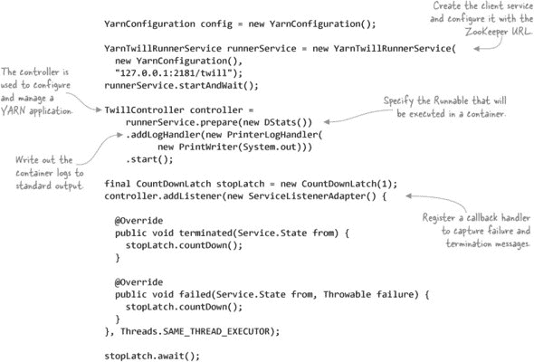

Twill 的编程模型使用诸如`Runnable`等众所周知的 Java 类型来模拟容器执行。以下代码展示了启动`vmstat`实用程序的容器：

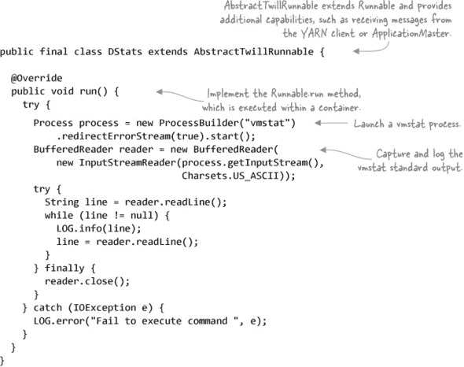

图 10.11 展示了 Twill 如何使用 ZooKeeper 和 Kafka 来支持日志传输和服务发现等功能。

##### 图 10.11. Twill 特性

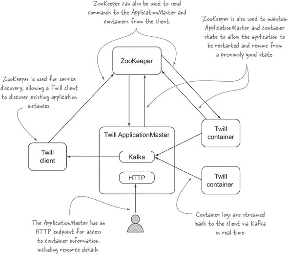

你可以从 Terence Yim 的“使用 Apache Twill 释放 YARN 的力量”([`www.slideshare.net/TerenceYim1/twill-apachecon-2014?ref=`](http://www.slideshare.net/TerenceYim1/twill-apachecon-2014?ref=))中获得 Twill 的详细概述。Yim 还有几篇关于使用 Twill（以前称为 Weave）的博客文章。^([12)]

> ^([12]) Terence Yim, “使用 Weave 编程，第一部分,” [`blog.continuuity.com/post/66694376303/programming-with-weave-part-i`](http://blog.continuuity.com/post/66694376303/programming-with-weave-part-i); “使用 Apache Twill，第二部分,” [`blog.continuuity.com/post/73969347586/programming-with-apache-twill-part-ii`](http://blog.continuuity.com/post/73969347586/programming-with-apache-twill-part-ii).

#### 10.4.2. Spring

Spring for Hadoop 的 2.x 版本([`projects.spring.io/spring-hadoop/`](http://projects.spring.io/spring-hadoop/))为简化 YARN 开发提供了支持。它与 Twill 不同，因为它专注于抽象 YARN API，而不是提供应用程序功能；相比之下，Twill 提供日志传输和服务发现。但是，你很可能不希望这些功能给 Twill 带来的额外复杂性，而是希望对 YARN 应用程序有更多的控制。如果是这样，Spring for Hadoop 可能是一个更好的选择。

Spring for Hadoop 提供了 YARN 客户端、ApplicationMaster 和容器的默认实现，这些实现可以被覆盖以提供特定于应用程序的功能。实际上，你可以不写任何代码就编写一个 YARN 应用程序！以下示例来自 Spring Hadoop 样本，展示了如何配置 YARN 应用程序以运行远程命令。^([13)] 以下代码片段显示了应用程序上下文，并配置了 HDFS、YARN 和应用程序 JAR 文件：

> ^([13]) “Spring Yarn 简单命令示例，” [`github.com/spring-projects/spring-hadoop-samples/tree/master/yarn/yarn/simple-command`](https://github.com/spring-projects/spring-hadoop-samples/tree/master/yarn/yarn/simple-command).

```
<beans ...>

  <context:property-placeholder location="hadoop.properties"
                    system-properties-mode="OVERRIDE"/>

  <yarn:configuration>
    fs.defaultFS=${hd.fs}
    yarn.resourcemanager.address=${hd.rm}
    fs.hdfs.impl=org.apache.hadoop.hdfs.DistributedFileSystem
  </yarn:configuration>

  <yarn:localresources>
     <yarn:hdfs path="/app/simple-command/*.jar"/>
    <yarn:hdfs path="/lib/*.jar"/>
  </yarn:localresources>

  <yarn:environment>
    <yarn:classpath use-yarn-app-classpath="true"/>
  </yarn:environment>

  <util:properties id="arguments">
    <prop key="container-count">4</prop>
  </util:properties>

  <yarn:client app-name="simple-command">
    <yarn:master-runner arguments="arguments"/>
  </yarn:client>
</beans>
```

以下代码定义了 ApplicationMaster 属性，并指示它运行`vmstat`命令：

```
<beans ...>

  <context:property-placeholder location="hadoop.properties"/>

  <bean id="taskScheduler" class="
org.springframework.scheduling.concurrent.ConcurrentTaskScheduler"/>
  <bean id="taskExecutor" class="
org.springframework.core.task.SyncTaskExecutor"/>

  <yarn:configuration>
    fs.defaultFS=${SHDP_HD_FS}
    yarn.resourcemanager.address=${SHDP_HD_RM}
    yarn.resourcemanager.scheduler.address=${SHDP_HD_SCHEDULER}
  </yarn:configuration>

  <yarn:localresources>
    <yarn:hdfs path="/app/simple-command/*.jar"/>
    <yarn:hdfs path="/lib/*.jar"/>
  </yarn:localresources>

  <yarn:environment>
    <yarn:classpath use-yarn-app-classpath="true" delimiter=":">
      ./*
    </yarn:classpath>
  </yarn:environment>

  <yarn:master>
    <yarn:container-allocator/>
    <yarn:container-command>
    <![CDATA[
    vmstat
    1><LOG_DIR>/Container.stdout
    2><LOG_DIR>/Container.stderr
    ]]>
    </yarn:container-command>
  </yarn:master>

</beans>
```

样本还包括如何扩展客户端、ApplicationMaster 和容器的内容查看。^([14)]

> ^([14]) 扩展 Spring YARN 类的示例：“Spring Yarn 自定义 Application Master 服务示例，” [`github.com/spring-projects/spring-hadoop-samples/tree/master/yarn/yarn/custom-amservice`](https://github.com/spring-projects/spring-hadoop-samples/tree/master/yarn/yarn/custom-amservice).

您可以在 GitHub 上找到一些 Spring for Hadoop 的示例应用程序([`github.com/spring-projects/spring-hadoop-samples`](https://github.com/spring-projects/spring-hadoop-samples))。该项目也有一个维基页面：[`github.com/spring-projects/spring-hadoop/wiki`](https://github.com/spring-projects/spring-hadoop/wiki).

#### 10.4.3. REEF

REEF 是微软的一个框架，它简化了适用于各种计算模型的可扩展、容错运行环境，包括 YARN 和 Mesos([www.reef-project.org/](http://www.reef-project.org/); [`github.com/Microsoft-CISL/REEF`](https://github.com/Microsoft-CISL/REEF))。REEF 有一些有趣的功能，如容器重用和数据缓存。

您可以在 GitHub 上找到 REEF 教程：[`github.com/Microsoft-CISL/REEF/wiki/How-to-download-and-compile-REEF`](https://github.com/Microsoft-CISL/REEF/wiki/How-to-download-and-compile-REEF).

#### 10.4.4. 选择 YARN API 抽象

YARN 的抽象还处于早期阶段，因为 YARN 是一项新技术。本节简要概述了您可以使用来隐藏 YARN API 一些复杂性的三个抽象。但您应该为您的应用程序选择哪一个呢？

+   *Apache Twill* 看起来最有前途，因为它已经封装了您在应用程序中需要的许多功能。它选择了最佳的技术，如 Kafka 和 ZooKeeper 来支持这些功能。

+   如果您正在开发一个轻量级的应用程序，并且不想依赖 Kafka 或 ZooKeeper，*Spring for Hadoop* 可能更适合您。

+   如果您有一些复杂的应用程序需求，例如需要在多个执行框架上运行，或者需要支持更复杂的容器编排和容器之间的状态共享，*REEF* 可能很有用。

### 10.5. 章节总结

本章向您展示了如何编写一个简单的 YARN 应用程序，并介绍了您可能在 YARN 应用程序中需要的更高级的功能。它还探讨了使编写应用程序更简单的 YARN 抽象。现在，您已经准备好开始编写下一个重大的 YARN 应用程序了。

这不仅结束了本章，也结束了整本书！我希望您喜欢这次旅程，并且在旅途中学到了一些可以在您的 Hadoop 应用程序和环境中使用的小技巧。如果您对本书中涵盖的任何内容有任何疑问，请前往 Manning 为本书设立的论坛并提问.^(15)

> ^(15) Manning 论坛上的 Hadoop 实践：[`www.manning-sandbox.com/forum.jspa?forumID=901`](http://www.manning-sandbox.com/forum.jspa?forumID=901).
