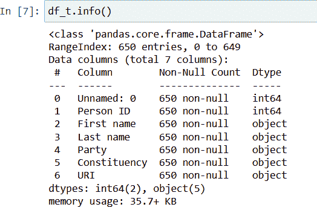

# 第二章 数据标准化

正如我们在第一章中讨论的，要成功地匹配或去重数据源，我们需要确保我们的数据呈现一致的方式，并删除或修正任何异常。我们将使用术语*数据标准化*来涵盖数据集转换为一致格式以及清洗数据以删除否则会干扰匹配过程的无用额外字符。

在本章中，我们将动手操作，并通过一个真实的例子来进行这个过程。我们将创建我们的工作环境，获取我们需要的数据，清洗这些数据，然后执行一个简单的实体解析练习，以便进行一些简单的分析。我们将通过检查我们的数据匹配过程的性能，并考虑如何改进它来结束。

首先，让我们介绍我们的示例以及为什么我们需要实体解析来解决它。

# 示例问题

让我们通过一个示例问题来说明在解决数据源之间实体匹配中常见的一些挑战，以及为什么数据清洗是必不可少的第一步。由于我们受限于使用公开可用的公共数据源，这个例子有点刻意，但希望能说明实体解析的必要性。

让我们想象我们正在研究可能影响英国下议院（议会的下议院）议员是否连任的因素。我们推测，拥有活跃的社交媒体存在可能会更有利于确保连任。为了本例，我们将考虑 Facebook 存在，因此我们查看了最后一次英国大选，并检查了保住议席的议员中有多少人拥有 Facebook 账号。

维基百科有一个网页列出了 2019 年大选中当选的议员名单，包括他们是否再次当选，但缺乏这些个人的社交媒体信息。然而，[TheyWorkForYou 网站](https://theyworkforyou.com)记录了当前议员的信息，包括链接到他们的 Facebook 账号。因此，如果我们结合这些数据集，我们可以开始测试我们的假设，即连任和社交媒体存在相关性。

### TheyWorkForYou

TheyWorkForYou 的成立旨在使议会更加透明和负责任。TheyWorkForYou 由英国慈善组织 mySociety 运营，通过使用数字工具和数据来增加更多人的权力。

我们如何将这两个数据集连接起来？尽管两个数据集都包括每位议员所代表选区的名称，但我们不能将此作为公共键，因为自 2019 年大选以来，已经发生了一些补选，选出了新的议员。^(1) 这些新成员可能有 Facebook 账户，但不应被视为再选人群，因为这可能会扭曲我们的分析结果。因此，我们需要通过匹配议员姓名来连接我们的数据集，即解决这些实体，以便我们可以为每位议员创建一个单一的合并记录。

# 环境设置

我们的第一个任务是设置我们的实体解析环境。在本书中，我们将使用 Python 和 JupyterLab IDE。

要开始，您需要在计算机上安装 Python。如果尚未安装，请从[官网](http://www.python.org)下载。^(2)

# 将 Python 添加到 PATH

如果首次安装 Python，请确保选择“将 Python 添加到 PATH”选项，以确保您可以从命令行运行 Python。

要下载本书附带的代码示例，建议使用 Git 版本控制系统非常方便。有关安装 Git 的指南可以在[GitHub 网站](https://github.com/git-guides/install-git)找到。

安装 Git 后，您可以从选择的父目录克隆（即复制）本书附带的 GitHub 仓库到您的计算机。请从您选择的父目录运行此命令：

```py
>>>git clone https://github.com/mshearer0/HandsOnEntityResolution
```

这将创建一个名为*HandsOnEntityResolution*的子目录。

### Python 虚拟环境

我建议您使用虚拟 Python 环境来完成本书中的示例。这将允许您在不干扰其他项目的情况下维护所需的 Python 软件包配置。以下命令将在由 Git 创建的*HandsOnEntityResolution*目录中创建一个新环境：

```py
>>>python -m venv HandsOnEntityResolution
```

要激活环境，请运行以下命令：

```py
>>>.\HandsOnEntityResolution\Scripts\activate.bat
(Windows)

>>>source HandsOnEntityResolution/bin/activate 
(Linux)
```

这将在命令提示符前缀中显示基于目录名称的环境名称：

```py
>>>(HandsOnEntityResolution) 
    your_path\HandsOnEntityResolution
```

完成后，请务必停用环境：

```py
>>>deactivate (Windows)

>>>deactivate (Linux)
```

接下来，切换到此目录：

```py
>>>cd HandsOnEntityResolution
```

要设置我们的 JupyterLab 代码环境及所需的软件包，我们将使用 Python 软件包管理器 pip，这应该已包含在您的 Python 安装中。您可以使用以下命令检查：

```py
>>>python -m pip --version
pip 23.0.1 from your_path\HandsOnEntityResolution\lib\
   site-packages\pip (python 3.7)
```

您可以从*requirements.txt*文件中安装本书中需要的软件包：

```py
>>>pip install -r requirements.txt
```

接下来，配置一个与我们虚拟环境关联的 Python 内核，以便我们的笔记本可以使用：

```py
>>>python -m ipykernel install --user
   --name=handsonentityresolution
```

然后使用以下命令启动 JupyterLab：

```py
>>>jupyter-lab
```

虽然这相当简单明了，但如何开始使用 Jupyter 的说明可在[文档](https://docs.jupyter.org/en/latest)中找到。

# 获取数据

现在我们已经配置好了环境，我们的下一个任务是获取我们需要的数据。通常我们需要的数据以各种格式和展示方式呈现。本书中的示例将演示如何处理我们遇到的一些最常见的格式。

## Wikipedia 数据

在我们的 Jupyter 环境中打开 *Chapter2.ipynb*，我们首先定义了 2019 年英国大选中返回的议员列表的 Wikipedia URL：

```py
url = "https://en.wikipedia.org/wiki/
       List_of_MPs_elected_in_the_2019_United_Kingdom_general_election"
```

然后，我们可以导入 requests 和 Beautiful Soup Python 包，并使用它们下载 Wikipedia 文本的副本。然后运行 `html parser` 来提取页面上存在的所有表格：

```py
import requests
from bs4 import BeautifulSoup

website_url = requests.get(url).text
soup = BeautifulSoup(website_url,'html.parser')
tables = soup.find_all('table')
```

# Beautiful Soup

Beautiful Soup 是一个 Python 包，可以轻松地从网页中抓取信息。更多详细信息请参阅[在线文档](https://oreil.ly/YB8H3)。

接下来，我们需要找到页面中我们想要的表格。在这种情况下，我们选择包含“Member returned”（一个列名）文本的表格。在该表格内，我们提取列名作为标题，然后迭代所有剩余的行和元素，构建一个列表的列表。然后，将这些列表加载到 pandas DataFrame 中，并设置提取的标题作为 DataFrame 的列名：

```py
import pandas as pd

for table in tables:
   if 'Member returned' in table.text:
      headers = [header.text.strip() for header in table.find_all('th')]
      headers = headers[:5]
      dfrows = []
      table_rows = table.find_all('tr')
      for row in table_rows:
         td = row.find_all('td')
         dfrow = [row.text for row in td if row.text!='\n']
         dfrows.append(dfrow)

df_w = pd.DataFrame(dfrows, columns=headers)
```

结果是一个 pandas DataFrame，如图 2-1 所示，我们可以使用 `info` 方法来查看。


###### 图 2-1\. Wikipedia 的议员信息

我们有 652 条记录，5 列。这看起来很有前景，因为在每列中，有 650 行具有非空值，这与英国下议院议席的数量相匹配。

最后，我们可以通过保留我们需要的列来简化我们的数据集：

```py
df_w = df_w[['Constituency','Member returned','Notes']]
```

## TheyWorkForYou 数据

现在我们可以继续下载我们的第二个数据集，并将其加载到单独的 DataFrame 中，如图 2-2 所示：

```py
url = "https://www.theyworkforyou.com/mps/?f=csv"
df_t = pd.read_csv(url, header=0)
```



###### 图 2-2\. TheyWorkForYou 的议员信息

# 2024/25 年英国大选后

如果你在 2024/25 年英国大选后阅读本书，那么 TheyWorkForYou 网站可能会更新新的议员信息。如果你在自己的机器上跟着操作，请使用附带本书的 GitHub 仓库中提供的 *mps_they_raw.csv* 文件。原始的 Wikipedia 数据 *mps_wiki_raw.csv* 也已提供。

图 2-3 列出了 DataFrame 的前几行，以便我们可以查看这些字段通常包含的信息。


###### 图 2-3\. TheyWorkForYou 数据集的前五行

要发现每个议员是否有关联的 Facebook 账户，我们需要跟随 URI 列中的链接查看他们的 TheyWorkForYou 主页。我们需要为每一行执行此操作，因此我们定义一个函数，可以沿着 DataFrame 的轴应用该函数。

### 添加 Facebook 链接

此函数使用了与我们用来解析维基百科网页的 Beautiful Soup 包相同的方法。在这种情况下，我们提取所有指向*facebook.com*的链接。然后我们检查第一个链接。如果这个链接是 TheyWorkForYou 的账户，那么该网站没有列出该议员的 Facebook 账户，因此我们返回一个空字符串；如果有，那么我们返回该链接：

```py
def facelink(url):
   website_url = requests.get(url).text
   soup = BeautifulSoup(website_url,'html.parser')
   flinks = [f"{item['href']}" for item in soup.select
      ("a[href*='facebook.com']")]
   if flinks[0]!="https://www.facebook.com/TheyWorkForYou":
      return(flinks[0])
   else:
      return("")
```

我们可以使用`apply`方法将这个函数应用到 DataFrame 的每一行，调用`facelink`函数，将`URI`值作为 URL 传递。函数返回的值被添加到一个新列中，该列由 Flink 附加到 DataFrame 中。

```py
df_t['Flink'] = df_t.apply(lambda x: facelink(x.URI), axis=1)
```

请耐心等待—这个函数需要做很多工作，所以在您的机器上可能需要几分钟才能运行完毕。一旦完成，我们可以再次查看前几行，如图 2-4 所示，检查我们是否得到了期望的 Facebook 链接。


###### 图 2-4\. TheyWorkForYou 数据集中带有 Facebook 链接的前五行

最后，我们可以简化我们的数据集，只保留我们需要的列：

```py
df_t = df_t[['Constituency','First name','Last name','Flink']]
```

# 数据清洗

现在我们有了原始数据集，我们可以开始我们的数据清洗过程。我们将首先对维基百科数据集进行一些初始清洗，然后是 TheyWorkForYou 的数据。然后我们将尝试连接这些数据集，并查看我们需要标准化的进一步不一致性。

## 维基百科

让我们来看看维基百科数据集中的前几行和最后几行，如图 2-5 所示。


###### 图 2-5\. 维基百科数据的前五行和最后五行

我们数据清洗过程中的第一个任务是标准化我们的列名：

```py
df_w = df_w.rename(columns={ 'Member returned' : 'Fullname'})
```

我们还可以看到我们的解析器的输出在 DataFrame 的开头和结尾有空白行，并且似乎每个元素末尾都有`\n`字符。这些附加内容显然会干扰我们的匹配，所以需要移除它们。

要删除空白行，我们可以使用：

```py
df = df.dropna()
```

要去除末尾的`\n`字符：

```py
df_w['Constituency'] = df_w['Constituency'].str.rstrip("\n")
df_w['Fullname'] = df_w['Fullname'].str.rstrip("\n")
```

为了确保我们现在有一个干净的`Fullname`，我们可以检查是否还有其他的`\n`字符。

```py
df_w[df_w['Fullname'].astype(str).str.contains('\n')]
```

这个简单的检查显示，我们也有需要移除的前导值：

```py
df_w['Fullname'] = df_w['Fullname'].str.lstrip("\n")
```

我们的下一个任务是将我们的`Fullname`拆分为`Firstname`和`Lastname`，以便我们可以独立匹配这些值。为了本例的目的，我们将使用一个简单的方法，选择第一个子字符串作为`Firstname`，剩余的由空格分隔的子字符串作为`Lastname`。

```py
df_w['Firstname'] = df_w['Fullname'].str.split().str[0]
df_w['Lastname'] = df_w['Fullname'].astype(str).apply(lambda x:
   ' '.join(x.split()[1:]))
```

我们可以通过查看包含空格的`Lastname`条目来检查这种基本方法的工作情况。图 2-6 展示了仍然存在空格的`Lastname`条目。


###### 图 2-6\. 检查维基百科数据中复合`Lastname`条目

现在我们有了一个足够干净的数据集，可以尝试第一次匹配，所以我们将转向我们的第二个数据集。

## TheyWorkForYou

正如我们之前看到的，TheyWorkForYou 的数据已经相当干净，所以在这个阶段，我们所需要做的就是将列名与前一个 DataFrame 的列名标准化。这将使我们在尝试匹配时更加轻松：

```py
df_t = df_t.rename(columns={'Last name' : 'Lastname',
                             'First name' : 'Firstname'})
```

# 属性比较

现在我们有两个格式类似的 DataFrame，我们可以尝试实体解析过程的下一阶段。因为我们的数据集很小，我们不需要使用记录阻塞，所以我们可以直接尝试对`Firstname`、`Lastname`和`Constituency`进行简单的精确匹配。`merge`方法（类似于数据库的`join`）可以为我们执行这种精确匹配：

```py
len(df_w.merge(df_t, on=['Constituency','Firstname','Lastname']))
599
```

我们发现 650 个中有 599 个完美匹配所有三个属性——不错！仅在`Constituency`和`Lastname`上进行匹配，我们得到 607 个完美匹配，因此显然有 8 个不匹配的`Firstname`条目：

```py
len(df_w.merge(df_t, on=['Constituency','Lastname']))
607
```

对`Firstname`、`Lastname`和`Constituency`的剩余排列重复这个过程，得到了匹配计数的维恩图，如图 2-7 所示。


###### 图 2-7\. 维恩图

简单地在`Firstname`上进行连接给出了 2663 个匹配，而在`Lastname`上的等效匹配则有 982 个匹配。这些计数超过了议员的数量，因为有重复的常见名称在两个数据集之间匹配了多次。

到目前为止，我们在 650 个选区中有 599 个匹配，但是我们能做得更好吗？让我们从检查数据集中的`Constituency`属性开始。作为一个分类变量，我们预计这应该是相当容易匹配的：

```py
len(df_w.merge(df_t, on=['Constituency'] ))
623
```

我们有 623 个匹配项，还剩下 27 个未匹配的。为什么？我们肯定期望两个数据集中存在相同的选区，那么问题出在哪里？

# 选区

让我们看看两个数据集中未匹配人口的前五名。为此，我们使用`Constituency`属性在 DataFrame 之间执行外部连接，然后选择那些在右侧（维基百科）或左侧（TheyWorkForYou）DataFrame 中找到的记录。结果显示在图 2-8 中。


###### 图 2-8\. 选区不匹配

我们可以看到，TheyWorkForYou 网站的第一个数据集中选区名称中嵌有逗号，而维基百科的数据集中没有。这解释了它们为什么不匹配。为了确保一致性，让我们从两个 DataFrame 中都删除逗号：

```py
df_t['Constituency'] = df_t['Constituency'].str.replace(',', '')
df_w['Constituency'] = df_w['Constituency'].str.replace(',', '')
```

在应用此清理后，我们在所有 650 个选区上都实现了完美匹配：

```py
len(df_w.merge(df_t, on=['Constituency']))
650
```

# 区分大小写

在这个简单的例子中，我们在两个数据集之间有匹配的大小写约定（例如，初始大写）。在许多情况下，情况可能并非如此，您可能需要标准化为大写或小写字符。我们将在后面的章节中看到如何做到这一点。

在所有三个属性上重复我们的完美匹配，现在我们可以匹配 624 条记录：

```py
len(df_w.merge(df_t, on=['Constituency','Firstname','Lastname']))
624
```

那其他的 26 个呢？

在这里一点领域知识是有用的。正如我们在本章开头所考虑的那样，在 2019 年选举和写作时期之间，发生了一些补选。如果我们看看既不匹配名字也不匹配姓氏的选区，那么至少对于这个简单的例子来说，我们可以确定可能的候选人，如图 2-9 所示。


###### 图 2-9\. 潜在的补选

在我们的 14 个补选候选人中，有 13 个案例，名字完全不同，这表明我们有理由排除它们，但牛顿阿伯特的候选人似乎是一个潜在的匹配，因为在一个数据集中的中间名“莫里斯”已经包含在姓氏中，在另一个数据集中包含在名字中，这使得我们在两个属性上的精确匹配受到阻碍。

实际上，我们可以用来自[英国议会网站](https://oreil.ly/eWhWf)的数据来验证我们的结论。这证实了在匹配的选区内已经举行了补选。这解释了我们 26 条未匹配记录中的 13 条——剩下的呢？让我们挑选出只有名字或姓氏匹配但另一个不匹配的情况。这个子集在图 2-10 中展示。


###### 图 2-10\. 潜在的补选

我们可以看到剩下的 12 条记录，如表 2-1 所示，展示了我们在第一章中讨论的各种匹配问题。

表 2-1\. 匹配问题总结表

| 匹配问题 | **他们为你工作** | **维基百科** |
| --- | --- | --- |
| 缩写名 | 丹 | 丹尼尔 |
|   | 坦 | 坦曼吉特 |
|   | 丽兹 | 伊丽莎白 |
|   | 克里斯 | 克里斯托弗 |
|   | 努斯 | 努斯拉特 |
| 包括中间名 | 黛安娜·R. | 黛安娜 |
|   | 杰弗里·M. | 杰弗里 |
| 包含中间名 | 普里特·卡尔 | 普里特 |
|   | 约翰·马丁 | 约翰 |
| 姓氏后缀 | 佩斯利（二世） | 佩斯利 |
| 双姓 | 多克蒂 | 多克蒂-休斯 |

还有一个剩余的难以解决的不匹配情况：在伯顿选区，上一次的名字是格里菲斯，现在是克尼维顿。现在我们已经统计了所有 650 个选区。

如果我们进一步从 TheyWorkForYou 数据中清除`Firstname`，删除任何中间名或姓名，我们可以进一步提高我们的匹配度：

```py
df_t['Firstname'] = df_t['Firstname'].str.split().str[0]
```

我们现在可以匹配另外四条记录：

```py
df_resolved = df_w.merge(df_t, on=['Firstname','Lastname'] )

len(df_resolved)
628
```

这使我们结束了基本数据清理技术的介绍。现在我们只剩下九条未解决的记录，如图 2-11 所示。在下一章中，我们将看到更多近似文本匹配技术如何帮助我们解决其中一些问题。


###### 图 2-11\. 未解决实体

# 测量表现

让我们使用基于我们在第一章中定义的指标的简单精确匹配方法来评估我们的表现。我们的总人口规模是 650，其中：

<math alttext="upper T r u e p o s i t i v e m a t c h e s left-parenthesis upper T upper P right-parenthesis equals 628"><mrow><mi>T</mi> <mi>r</mi> <mi>u</mi> <mi>e</mi> <mi>p</mi> <mi>o</mi> <mi>s</mi> <mi>i</mi> <mi>t</mi> <mi>i</mi> <mi>v</mi> <mi>e</mi> <mi>m</mi> <mi>a</mi> <mi>t</mi> <mi>c</mi> <mi>h</mi> <mi>e</mi> <mi>s</mi> <mo>(</mo> <mi>T</mi> <mi>P</mi> <mo>)</mo> <mo>=</mo> <mn>628</mn></mrow></math>

<math alttext="upper F a l s e p o s i t i v e m a t c h e s left-parenthesis upper F upper P right-parenthesis equals 0"><mrow><mi>F</mi> <mi>a</mi> <mi>l</mi> <mi>s</mi> <mi>e</mi> <mi>p</mi> <mi>o</mi> <mi>s</mi> <mi>i</mi> <mi>t</mi> <mi>i</mi> <mi>v</mi> <mi>e</mi> <mi>m</mi> <mi>a</mi> <mi>t</mi> <mi>c</mi> <mi>h</mi> <mi>e</mi> <mi>s</mi> <mo>(</mo> <mi>F</mi> <mi>P</mi> <mo>)</mo> <mo>=</mo> <mn>0</mn></mrow></math>

<math alttext="upper T r u e n e g a t i v e m a t c h e s left-parenthesis upper T upper N right-parenthesis equals 13 left-parenthesis upper B y minus e l e c t i o n s right-parenthesis"><mrow><mi>T</mi> <mi>r</mi> <mi>u</mi> <mi>e</mi> <mi>n</mi> <mi>e</mi> <mi>g</mi> <mi>a</mi> <mi>t</mi> <mi>i</mi> <mi>v</mi> <mi>e</mi> <mi>m</mi> <mi>a</mi> <mi>t</mi> <mi>c</mi> <mi>h</mi> <mi>e</mi> <mi>s</mi> <mo>(</mo> <mi>T</mi> <mi>N</mi> <mo>)</mo> <mo>=</mo> <mn>13</mn> <mo>(</mo> <mi>B</mi> <mi>y</mi> <mo>-</mo> <mi>e</mi> <mi>l</mi> <mi>e</mi> <mi>c</mi> <mi>t</mi> <mi>i</mi> <mi>o</mi> <mi>n</mi> <mi>s</mi> <mo>)</mo></mrow></math>

<math alttext="upper F a l s e n e g a t i v e m a t c h e s left-parenthesis upper F upper N right-parenthesis equals 9"><mrow><mi>F</mi> <mi>a</mi> <mi>l</mi> <mi>s</mi> <mi>e</mi> <mi>n</mi> <mi>e</mi> <mi>g</mi> <mi>a</mi> <mi>t</mi> <mi>i</mi> <mi>v</mi> <mi>e</mi> <mi>m</mi> <mi>a</mi> <mi>t</mi> <mi>c</mi> <mi>h</mi> <mi>e</mi> <mi>s</mi> <mo>(</mo> <mi>F</mi> <mi>N</mi> <mo>)</mo> <mo>=</mo> <mn>9</mn></mrow></math>

我们可以计算我们的表现指标如下：

<math alttext="upper P r e c i s i o n equals StartFraction upper T upper P Over left-parenthesis upper T upper P plus upper F upper P right-parenthesis EndFraction equals StartFraction 628 Over left-parenthesis 628 plus 0 right-parenthesis EndFraction equals 100 percent-sign"><mrow><mi>P</mi> <mi>r</mi> <mi>e</mi> <mi>c</mi> <mi>i</mi> <mi>s</mi> <mi>i</mi> <mi>o</mi> <mi>n</mi> <mo>=</mo> <mfrac><mrow><mi>T</mi><mi>P</mi></mrow> <mrow><mo>(</mo><mi>T</mi><mi>P</mi><mo>+</mo><mi>F</mi><mi>P</mi><mo>)</mo></mrow></mfrac> <mo>=</mo> <mfrac><mn>628</mn> <mrow><mo>(</mo><mn>628</mn><mo>+</mo><mn>0</mn><mo>)</mo></mrow></mfrac> <mo>=</mo> <mn>100</mn> <mo>%</mo></mrow></math>

<math alttext="upper R e c a l l equals StartFraction upper T upper P Over left-parenthesis upper T upper P plus upper F upper N right-parenthesis EndFraction equals StartFraction 628 Over left-parenthesis 628 plus 9 right-parenthesis EndFraction almost-equals 98.6 percent-sign"><mrow><mi>R</mi> <mi>e</mi> <mi>c</mi> <mi>a</mi> <mi>l</mi> <mi>l</mi> <mo>=</mo> <mfrac><mrow><mi>T</mi><mi>P</mi></mrow> <mrow><mo>(</mo><mi>T</mi><mi>P</mi><mo>+</mo><mi>F</mi><mi>N</mi><mo>)</mo></mrow></mfrac> <mo>=</mo> <mfrac><mn>628</mn> <mrow><mo>(</mo><mn>628</mn><mo>+</mo><mn>9</mn><mo>)</mo></mrow></mfrac> <mo>≈</mo> <mn>98</mn> <mo>.</mo> <mn>6</mn> <mo>%</mo></mrow></math>

<math alttext="upper A c c u r a c y equals StartFraction left-parenthesis upper T upper P plus upper T upper N right-parenthesis Over left-parenthesis upper T upper P plus upper T upper N plus upper F upper P plus upper F upper N right-parenthesis EndFraction equals StartFraction left-parenthesis 628 plus 13 right-parenthesis Over 650 EndFraction almost-equals 98.6 percent-sign"><mrow><mi>A</mi> <mi>c</mi> <mi>c</mi> <mi>u</mi> <mi>r</mi> <mi>a</mi> <mi>c</mi> <mi>y</mi> <mo>=</mo> <mfrac><mrow><mo>(</mo><mi>T</mi><mi>P</mi><mo>+</mo><mi>T</mi><mi>N</mi><mo>)</mo></mrow> <mrow><mo>(</mo><mi>T</mi><mi>P</mi><mo>+</mo><mi>T</mi><mi>N</mi><mo>+</mo><mi>F</mi><mi>P</mi><mo>+</mo><mi>F</mi><mi>N</mi><mo>)</mo></mrow></mfrac> <mo>=</mo> <mfrac><mrow><mo>(</mo><mn>628</mn><mo>+</mo><mn>13</mn><mo>)</mo></mrow> <mn>650</mn></mfrac> <mo>≈</mo> <mn>98</mn> <mo>.</mo> <mn>6</mn> <mo>%</mo></mrow></math>

我们的精确度非常高，因为我们设定了一个非常高的标准：在名字、姓氏和选区完全匹配的情况下；如果我们宣布匹配，我们总是正确的。我们的召回率也非常高；我们很少找不到应该找到的匹配项。最后，我们的总体准确率也非常高。

当然，这只是一个简单的例子，数据质量相对较高，我们有一个非常强的分类变量（选区）来进行匹配。

# 示例计算

我们已成功解决了两个数据集之间的姓名冲突，所以现在我们可以使用合并后的信息来验证我们关于社交媒体存在与议员连任可能性相关性的假设。我们解决后的数据现在在一个表格中包含了我们需要的所有信息。图 2-12 展示了这个表格的前几行。


###### 图 2-12\. 已解决实体的示例

我们可以计算目前在 Facebook 上有账号并在 2019 年选举中保住席位的议员数量：

```py
df_heldwithface = df_resolved[(df_resolved['Flink']!="") &
      (df_resolved['Notes']=="Seat held\n")]
len(df_heldwithface)
474
```

以百分比表示：<math alttext="StartFraction 474 Over 628 EndFraction almost-equals 75 percent-sign"><mrow><mfrac><mn>474</mn> <mn>628</mn></mfrac> <mo>≈</mo> <mn>75</mn> <mo>%</mo></mrow></math> 。

最后，我们会将我们清洗后的数据集保存在本地，以便在接下来的章节中使用：

```py
df_w.to_csv('mps_wiki_clean.csv', index=False)
df_t.to_csv('mps_they_clean.csv', index=False)
```

# 摘要

总结一下，我们使用了五种简单的技术来标准化和清理我们的数据：

+   移除空记录

+   移除前导和尾随的不需要的字符

+   将全名拆分为名字和姓氏

+   从选区中移除逗号

+   从名字中移除中间名和首字母缩写

由于这一操作，我们能够合并我们的数据集，然后计算一个简单的度量标准，否则我们是无法做到的。唉，没有普适的清理过程；它取决于你所拥有的数据集。

在下一章中，我们将看到模糊匹配技术如何进一步提升我们的性能。

^(1) 补选，也称为美国的特别选举，是用来填补在大选之间出现空缺的职位的选举。在英国议会，众议院的一个席位在议员辞职或去世时可能会出现空缺。

^(2) 本书中标识的软件产品仅供参考。您有责任评估是否使用任何特定软件并接受其许可条款。
