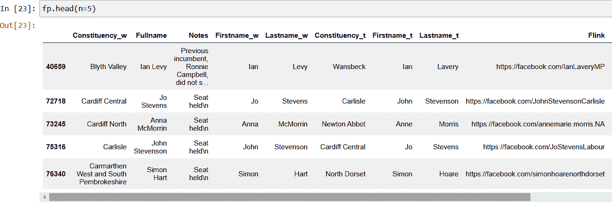

# 第三章 文本匹配

正如我们在第二章中看到的，一旦我们的数据经过清洗并且格式一致，我们可以通过检查它们的数据属性的精确匹配来找到匹配的实体。如果数据质量很高，并且属性值不重复，那么检查等价性就很简单了。然而，在实际数据中，情况很少这样。

通过使用*近似*（通常称为*模糊*）*匹配技术*，我们可以增加匹配所有相关记录的可能性。对于数值，我们可以设置一个容差来确定数值需要多接近。例如，出生日期可能会匹配，如果在几天内，或者位置可能会匹配，如果它们的坐标相距一定距离。对于文本数据，我们可以查找可能会偶然产生的字符串之间的相似性和差异。

当然，通过接受非精确匹配作为等效，我们也开放了错误匹配记录的可能性。

在本章中，我们将介绍一些经常使用的文本匹配技术，然后将它们应用到我们的示例问题中，看看是否能提高我们的实体解析性能。

# 编辑距离匹配

在文本匹配中，一种最有用的近似匹配技术之一是测量两个字符串之间的*编辑距离*。编辑距离是将一个字符串转换为另一个字符串所需的最小操作次数。因此，这个度量可以用来评估两个字符串描述相同属性的可能性，即使它们记录方式不同。

第一个，也是最普遍适用的近似匹配技术是莱文斯坦距离。

## 莱文斯坦距离

*莱文斯坦距离* 是一种著名的编辑距离度量，以其创造者苏联数学家弗拉基米尔·莱文斯坦命名。

两个字符串 a 和 b（长度分别为 |a| 和 |b|）之间的莱文斯坦距离由 lev(a,b) 给出，其中

<math alttext="l e v left-parenthesis a comma b right-parenthesis equals StartLayout Enlarged left-brace 1st Row  StartAbsoluteValue a EndAbsoluteValue if StartAbsoluteValue b EndAbsoluteValue equals 0 comma 2nd Row  StartAbsoluteValue b EndAbsoluteValue if StartAbsoluteValue a EndAbsoluteValue equals 0 comma 3rd Row  l e v left-parenthesis t a i l left-parenthesis a right-parenthesis comma t a i l left-parenthesis b right-parenthesis right-parenthesis if a left-bracket 0 right-bracket equals b left-bracket 0 right-bracket comma 4th Row  1 plus m i n StartLayout Enlarged left-brace 1st Row  l e v left-parenthesis t a i l left-parenthesis a right-parenthesis comma b right-parenthesis 2nd Row  l e v left-parenthesis a comma t a i l left-parenthesis b right-parenthesis right-parenthesis otherwise 3rd Row  l e v left-parenthesis t a i l left-parenthesis a right-parenthesis comma t a i l left-parenthesis b right-parenthesis right-parenthesis EndLayout EndLayout"><mrow><mi>l</mi> <mi>e</mi> <mi>v</mi> <mrow><mo>(</mo> <mi>a</mi> <mo>,</mo> <mi>b</mi> <mo>)</mo></mrow> <mo>=</mo> <mfenced close="" open="{" separators=""><mtable><mtr><mtd columnalign="left"><mrow><mo>|</mo> <mi>a</mi> <mo>|</mo> <mtext>if</mtext> <mo>|</mo> <mi>b</mi> <mo>|</mo> <mo>=</mo> <mn>0</mn> <mo>,</mo></mrow></mtd></mtr> <mtr><mtd columnalign="left"><mrow><mo>|</mo> <mi>b</mi> <mo>|</mo> <mtext>if</mtext> <mo>|</mo> <mi>a</mi> <mo>|</mo> <mo>=</mo> <mn>0</mn> <mo>,</mo></mrow></mtd></mtr> <mtr><mtd columnalign="left"><mrow><mi>l</mi> <mi>e</mi> <mi>v</mi> <mo>(</mo> <mi>t</mi> <mi>a</mi> <mi>i</mi> <mi>l</mi> <mo>(</mo> <mi>a</mi> <mo>)</mo> <mo>,</mo> <mi>t</mi> <mi>a</mi> <mi>i</mi> <mi>l</mi> <mo>(</mo> <mi>b</mi> <mo>)</mo> <mo>)</mo> <mtext>if</mtext> <mi>a</mi> <mo>[</mo> <mn>0</mn> <mo>]</mo> <mo>=</mo> <mi>b</mi> <mo>[</mo> <mn>0</mn> <mo>]</mo> <mo>,</mo></mrow></mtd></mtr> <mtr><mtd columnalign="left"><mrow><mn>1</mn> <mo>+</mo> <mi>m</mi> <mi>i</mi> <mi>n</mi> <mfenced close="" open="{" separators=""><mtable><mtr><mtd columnalign="left"><mrow><mi>l</mi> <mi>e</mi> <mi>v</mi> <mo>(</mo> <mi>t</mi> <mi>a</mi> <mi>i</mi> <mi>l</mi> <mo>(</mo> <mi>a</mi> <mo>)</mo> <mo>,</mo> <mi>b</mi> <mo>)</mo></mrow></mtd></mtr> <mtr><mtd columnalign="left"><mrow><mi>l</mi> <mi>e</mi> <mi>v</mi> <mo>(</mo> <mi>a</mi> <mo>,</mo> <mi>t</mi> <mi>a</mi> <mi>i</mi> <mi>l</mi> <mo>(</mo> <mi>b</mi> <mo>)</mo> <mo>)</mo> <mtext>otherwise</mtext></mrow></mtd></mtr> <mtr><mtd columnalign="left"><mrow><mi>l</mi> <mi>e</mi> <mi>v</mi> <mo>(</mo> <mi>t</mi> <mi>a</mi> <mi>i</mi> <mi>l</mi> <mo>(</mo> <mi>a</mi> <mo>)</mo> <mo>,</mo> <mi>t</mi> <mi>a</mi> <mi>i</mi> <mi>l</mi> <mo>(</mo> <mi>b</mi> <mo>)</mo> <mo>)</mo></mrow></mtd></mtr></mtable></mfenced></mrow></mtd></mtr></mtable></mfenced></mrow></math>

在这里，某个字符串 x 的尾部是除 x 的第一个字符外的所有字符的字符串，x[n] 是字符串 x 的第 n 个字符，从 0 开始计数。

打开*Chapter3.ipynb*笔记本，我们可以看到这在实践中是如何工作的。幸运的是，我们不必自己编写莱文斯坦算法——Jellyfish Python 包已经实现了我们可以使用的算法。这个库还包含许多其他模糊和语音字符串匹配函数。

# Jellyfish

[Jellyfish](https://github.com/jamesturk/jellyfish) 是一个用于近似和语音匹配字符串的 Python 库。

如果您没有安装这个包，可以使用 Jupyter Notebook 的魔法命令 `%pip` 在导入之前安装它：

```py
%pip install jellyfish
import jellyfish as jf
```

# 内核重启

在安装新的 Python 包后，您可能需要重新启动内核并重新运行笔记本。

然后，我们可以计算编辑距离度量来检查如何测量常见的拼写错误：

```py
jf.levenshtein_distance('Michael','Micheal')
2
```

逻辑上，Levenshtein 算法逐个字符地遍历两个字符串的字符，从第一个到最后一个，如果字符不匹配则增加距离分数。在本例中，由于 M、i、c 和 h 字符都匹配，第一次增加距离分数是在第五个字符遇到字母 a 和 e 不匹配时。此时，我们遍历剩余字符的三个变体，并选择剩余字符串之间的最小分数：

+   “el” 和 “ael”

+   “ael” 和 “al”

+   “el” 和 “al”

所有三个选项在下一个字符上也有不匹配，再次增加分数。对每个选项重复这个过程会生成另外三个子选项，最后一个是每个字符串最后一个“l”的简单匹配，总最小分数为 2。

我将留给读者作为练习去处理其余选项，所有这些选项都产生相同的分数为 2。

## Jaro 相似度

在 1989 年，Matthew Jaro 提出了一种评估字符串相似性的替代方法。维基百科给出了以下公式。

两个字符串 *s[1]* 和 *s[2]* 的 Jaro 相似度 *sim[j]* 是

<math alttext="s i m Subscript j Baseline equals StartLayout Enlarged left-brace 1st Row  0 if m equals 0 2nd Row  one-third left-parenthesis StartFraction m Over StartAbsoluteValue s 1 EndAbsoluteValue EndFraction plus StartFraction m Over StartAbsoluteValue s 2 EndAbsoluteValue EndFraction plus StartFraction m minus t Over m EndFraction right-parenthesis otherwise EndLayout"><mrow><mi>s</mi> <mi>i</mi> <msub><mi>m</mi> <mi>j</mi></msub> <mo>=</mo> <mfenced close="" open="{" separators=""><mtable><mtr><mtd columnalign="left"><mrow><mn>0</mn> <mtext>if</mtext> <mi>m</mi> <mo>=</mo> <mn>0</mn></mrow></mtd></mtr> <mtr><mtd columnalign="left"><mrow><mfrac><mn>1</mn> <mn>3</mn></mfrac> <mrow><mo>(</mo> <mfrac><mi>m</mi> <mrow><mrow><mo>|</mo></mrow><msub><mi>s</mi> <mn>1</mn></msub> <mrow><mo>|</mo></mrow></mrow></mfrac> <mo>+</mo> <mfrac><mi>m</mi> <mrow><mrow><mo>|</mo></mrow><msub><mi>s</mi> <mn>2</mn></msub> <mrow><mo>|</mo></mrow></mrow></mfrac> <mo>+</mo> <mfrac><mrow><mi>m</mi><mo>-</mo><mi>t</mi></mrow> <mi>m</mi></mfrac> <mo>)</mo></mrow> <mtext>otherwise</mtext></mrow></mtd></mtr></mtable></mfenced></mrow></math>

其中：

+   |*s[i]*| 是字符串 *s[i]* 的长度

+   *m* 是匹配字符数（见下文）

+   *t* 是转置数（见下文）

+   如果两个字符串完全不匹配，则 Jaro 相似度分数为 0，如果它们完全匹配，则为 1。

在第一步中，将 *s[1]* 的每个字符与 *s[2]* 中所有匹配的字符进行比较。仅当 *s[1]* 和 *s[2]* 中的两个字符相同且不超过 <math alttext="left floor StartFraction m a x left-parenthesis s 1 comma s 2 right-parenthesis Over 2 EndFraction right floor minus 1"><mrow><mo>⌊</mo> <mfrac><mrow><mi>m</mi><mi>a</mi><mi>x</mi><mo>(</mo><msub><mi>s</mi> <mn>1</mn></msub> <mo>,</mo><msub><mi>s</mi> <mn>2</mn></msub> <mo>)</mo></mrow> <mn>2</mn></mfrac> <mo>⌋</mo> <mo>-</mo> <mn>1</mn></mrow></math> 个字符时，才考虑它们匹配。如果找不到匹配的字符，则字符串不相似，算法通过返回 Jaro 相似度分数 0 而终止。如果找到非零匹配的字符，则下一步是找到转置数。转置是不按正确顺序排列的匹配字符数除以 2。

再次，我们可以使用 Jellyfish 库来计算这个值：

```py
jf.jaro_similarity('Michael','Micheal')
0.9523809523809524
```

在这里，该值计算如下：

<math alttext="StartAbsoluteValue s 1 EndAbsoluteValue equals StartAbsoluteValue s 2 EndAbsoluteValue equals 7 left-parenthesis length of both strings right-parenthesis"><mrow><mrow><mo>|</mo></mrow> <msub><mi>s</mi> <mn>1</mn></msub> <mrow><mo>|</mo> <mo>=</mo> <mo>|</mo></mrow> <msub><mi>s</mi> <mn>2</mn></msub> <mrow><mo>|</mo> <mo>=</mo> <mn>7</mn> <mtext>(length</mtext> <mtext>of</mtext> <mtext>both</mtext> <mtext>strings)</mtext></mrow></mrow></math>

<math alttext="m equals 7 left-parenthesis all characters match right-parenthesis"><mrow><mi>m</mi> <mo>=</mo> <mn>7</mn> <mtext>(all</mtext> <mtext>characters</mtext> <mtext>match)</mtext></mrow></math>

<math alttext="t equals 1 left-parenthesis a and e transposition right-parenthesis"><mrow><mi>t</mi> <mo>=</mo> <mn>1</mn> <mtext>(a</mtext> <mtext>and</mtext> <mtext>e</mtext> <mtext>transposition)</mtext></mrow></math>

因此，Jaro 相似度值计算如下：

<math alttext="equals one-third left-parenthesis seven-sevenths plus seven-sevenths plus StartFraction left-parenthesis 7 minus 1 right-parenthesis Over 7 EndFraction right-parenthesis equals StartFraction 20 Over 21 EndFraction equals 0.9523809523809524 period"><mrow><mo>=</mo> <mfrac><mn>1</mn> <mn>3</mn></mfrac> <mrow><mo>(</mo> <mfrac><mn>7</mn> <mn>7</mn></mfrac> <mo>+</mo> <mfrac><mn>7</mn> <mn>7</mn></mfrac> <mo>+</mo> <mfrac><mrow><mo>(</mo><mn>7</mn><mo>-</mo><mn>1</mn><mo>)</mo></mrow> <mn>7</mn></mfrac> <mo>)</mo></mrow> <mo>=</mo> <mfrac><mn>20</mn> <mn>21</mn></mfrac> <mo>=</mo> <mn>0</mn> <mo>.</mo> <mn>9523809523809524</mn> <mo>.</mo></mrow></math>

在 Levenshtein 和 Jaro 方法中，字符串中的所有字符都对得分有贡献。然而，当匹配名称时，前几个字符通常更为重要。因此，如果它们相同，则更有可能表示等价。为了认识到这一点，William E. Winkler 在 1990 年提出了 Jaro 相似度的修改方法。

## Jaro-Winkler 相似度

Jaro-Winkler 相似度使用前缀比例 *p*，给与从开始匹配的字符串更有利的评分。给定两个字符串 *s[1]* 和 *s[2]*，它们的 Jaro-Winkler 相似度 *sim[w]* 是 *sim[j]* + *lp*(1 − *sim[j]*)，其中：

+   *sim[j]* 是 *s*[1] 和 *s*[2] 的 Jaro 相似度。

+   *l* 是字符串开始处的共同前缀长度，最多为四个字符。

+   *p* 是用于调整得分上升量的常数缩放因子，因为具有共同前缀的匹配。

+   *p* 不应超过 0.25（即 1/4，其中 4 是被考虑的前缀的最大长度），否则相似度可能大于 1。

+   Winkler 工作中此常数的标准值为 *p* = 0.1。

使用这个度量：

```py
jf.jaro_winkler_similarity('Michael','Micheal')

0.9714285714285714
```

这是如何计算的：

<math alttext="equals StartFraction 20 Over 21 EndFraction plus 4 times 0.1 times left-parenthesis 1 minus StartFraction 20 Over 21 EndFraction right-parenthesis equals 0.9714285714285714"><mrow><mo>=</mo> <mfrac><mn>20</mn> <mn>21</mn></mfrac> <mo>+</mo> <mn>4</mn> <mo>×</mo> <mn>0</mn> <mo>.</mo> <mn>1</mn> <mo>×</mo> <mrow><mo>(</mo> <mn>1</mn> <mo>-</mo> <mfrac><mn>20</mn> <mn>21</mn></mfrac> <mo>)</mo></mrow> <mo>=</mo> <mn>0</mn> <mo>.</mo> <mn>9714285714285714</mn></mrow></math>

其中：

+   *sim[j]* = <math alttext="StartFraction 20 Over 21 EndFraction"><mfrac><mn>20</mn> <mn>21</mn></mfrac></math>

+   *l* = 4（“Mich”的常见前缀）

+   *p* = 0.1（标准值）

值得注意的是，Jaro-Winkler 相似度度量对大小写敏感，因此：

```py
jf.jaro_winkler_similarity('michael','MICHAEL')
0
```

因此，通常的做法是在匹配前将字符串转换为小写。

```py
jf.jaro_winkler_similarity('michael'.lower(),'MICHAEL'.lower())
1.0
```

# 语音匹配

与编辑距离匹配的另一种选择是比较单词发音的相似性。这些语音算法大多基于英语发音，其中两个最流行的是 *Metaphone* 和 *Match Rating Approach*（*MRA*）。

## Metaphone

Metaphone 算法将每个单词编码成来自“0BFHJKLMNPRSTWXY”集合的字母序列，其中 0 代表“th”音，而 X 代表“sh”或“ch”。例如，使用 Jellyfish 软件包，我们可以看到 `'michael'` 被简化为 `'MXL'`，而 `'michel'` 也是如此。

```py
jf.metaphone('michael')
MXL
```

这种转换产生了一个常见的键，可以精确匹配以确定等效性。

## 匹配等级方法

MRA 语音算法是在 1970 年代末开发的。与 Metaphone 类似，它使用一组规则将单词编码为简化的语音表示。然后使用一组比较规则来评估相似度，该相似度根据它们的组合长度得出的最小阈值来确定是否匹配。

# 比较这些技术

为了比较编辑距离和语音相似度技术，让我们来看看它们如何评估 Michael 的常见拼写错误和缩写：

```py
mylist = ['Michael','Micheal','Michel','Mike','Mick']
combs = []

import itertools

for a, b in itertools.combinations(mylist, 2):
   combs.append([a,b,
      jf.jaro_similarity(a,b),
      jf.jaro_winkler_similarity(a, b),   
      jf.levenshtein_distance(a,b),
      jf.match_rating_comparison(a,b),
      (jf.metaphone(a)==jf.metaphone(b))])

pd.DataFrame(combs, columns=['Name1','Name2','Jaro','JaroWinkler','Levenshtein',
 'Match Rating','Metaphone'])
```

这给出了在 表 3-1 中显示的结果。

表 3-1\. 文本匹配比较

| **Name1** | **Name2** | **Jaro** | **Jaro-Winkler** | **Levenshtein** | **Match rating** | **Metaphone** |
| --- | --- | --- | --- | --- | --- | --- |
| Michael | Micheal | 0.952381 | 0.971429 | 2 | True | True |
| Michael | Michel | 0.952381 | 0.971429 | 1 | True | True |
| Michael | Mike | 0.726190 | 0.780952 | 4 | False | False |
| Michael | Mick | 0.726190 | 0.808333 | 4 | True | False |
| Micheal | Michel | 0.952381 | 0.971429 | 1 | True | True |
| Micheal | Mike | 0.726190 | 0.780952 | 4 | False | False |
| 迈克尔 | 米克 | 0.726190 | 0.780952 | 4 | True | False |
| 米歇尔 | 迈克 | 0.750000 | 0.808333 | 3 | False | False |
| 米歇尔 | 米克 | 0.750000 | 0.825000 | 3 | True | False |
| 迈克 | 米克 | 0.833333 | 0.866667 | 2 | True | True |

正如我们从这个简单的例子中可以看到的那样，技术之间存在相当一致性，但没有一种方法在所有情况下都明显优越。许多其他字符串匹配技术已被开发出来，各自具有其优势。为了本书的目的，我们将使用 Jaro-Winkler 算法，因为它在匹配名字时表现良好，由于其偏向于初始字符，这些字符往往更为重要。它也广泛支持我们将要使用的数据后端。

# 示例问题

在第二章中，我们匹配了两个名单，这些名单是英国下议院议员的成员，以探索社交媒体存在与连任之间的相关性。我们使用精确字符串匹配来建立成员的`Constituency`、`Firstname`和`Lastname`属性的等价性。

我们发现了 628 个真正的正面匹配。但是由于名字之间的差异，我们没有找到非精确匹配，导致我们有 9 个假负面匹配。让我们看看通过使用字符串相似度指标是否可以改善我们的性能。我们首先加载在第二章中保存的不匹配记录，如图 3-1 所示。


###### 图 3-1\. 不匹配人口

使用`apply`函数，我们可以计算 Jaro-Winkler 相似度指标，以比较两个数据集之间的名字（姓和名）。我们使用 Jaro-Winkler 算法，因为它在匹配名字时性能更好：

```py
df_w_un['Firstname_jaro'] = df_w_un.apply(
    lambda x: jf.jaro_winkler_similarity(x.Firstname_w, x.Firstname_t), axis=1)

df_w_un['Lastname_jaro'] = df_w_un.apply(
    lambda x: jf.jaro_winkler_similarity(x.Lastname_w, x.Lastname_t), axis=1)
```

然后我们可以在`Firstname`和`Lastname`属性上应用 0.8 的阈值，得到 6 个匹配，如图 3-2 所示。


###### 图 3-2\. Jaro-Winkler 匹配人口

不错！我们现在又找到了先前错过的另外 6 个潜在匹配。如果我们将阈值提高到 0.9，我们只会找到额外的两个匹配；如果我们将阈值降低到 0.4，所有九个都将匹配。

作为提醒，在第二章中，我们使用了准确匹配选区。然后，为了识别不匹配的人口，我们选择了那些名字的记录，其中名或姓不匹配。这使我们能够区分因补选而产生的真负面结果和假负面结果，其中我们需要更灵活的匹配技术。然而，我们很少有像选区这样的高基数分类变量来帮助我们，因此我们需要考虑如何仅通过名字匹配这些实体。

在这种情况下，我们无法再使用精确属性匹配上的简单合并方法来连接我们的数据集。相反，我们需要手动构建一个联合数据集，包括每对记录的所有可能组合，然后对每对名字和姓氏应用我们的相似性函数，以查看哪些足够相似。然后，我们可以剔除那些等价分数低于所选阈值的组合。显然，这种方法可能导致第一个数据集的记录与第二个数据集中的多个记录匹配。

# 全部相似性比较

从第二章获取清理后的数据集，我们可以使用交叉合并功能生成所有记录的组合。这样产生的是数据集之间每个名字组合的行，生成 650 × 650 = 422,500 条记录：

```py
df_w = pd.read_csv('mps_wiki_clean.csv')
df_t = pd.read_csv('mps_they_clean.csv')
cross = df_w.merge(df_t, how='cross',suffixes=('_w', '_t'))
cross.head(n=5)
```

图 3-3 显示了交叉产品数据集中的前几条记录。


###### 图 3-3\. 维基百科，他们的工作交叉产品

然后，我们可以计算每行的名字和姓氏的 Jaro-Winkler 相似度指标。应用 0.8 的阈值，我们可以确定每行的这些值是否大致匹配：

```py
cross['Firstname_jaro'] = cross.apply(lambda x: True if 
    jf.jaro_winkler_similarity(x.Firstname_w, x.Firstname_t);0.8 
    else False, axis=1)

cross['Lastname_jaro'] = cross.apply(lambda x: True if 
    jf.jaro_winkler_similarity(x.Lastname_w, x.Lastname_t);0.8 
    else False, axis=1)
```

然后，我们可以选择那些`Firstname`和`Lastname`属性都大致等效于我们的潜在匹配记录。我们可以通过使用`Constituency`属性来验证我们的结果是否正确。我们知道，当选区不匹配时，我们不是在指同一名议会议员。

现在让我们看看我们现在有多少真正的正匹配：

```py
tp = cross[(cross['Firstname_jaro'] & cross['Lastname_jaro']) & 
    (cross['Constituency_w']==cross['Constituency_t'])]

len(tp)
634
```

这些真正的正例包括从第二章中的 628 个精确匹配加上我们之前确定的 6 个近似匹配。但是我们来看看我们拾取了多少假正例，即属性名大致等效但`Constituency`不匹配的情况：

```py
fp = cross[(cross['Firstname_jaro'] & cross['Lastname_jaro']) & 
    (cross['Constituency_w']!=cross['Constituency_t'])]

len(fp)
19
```

让我们来看看图 3-4 中这 19 条不匹配记录。



###### 图 3-4\. 完全匹配的假正例

我们可以看到这些名称之间存在相似性，尽管它们并不指代同一人。这些不匹配是我们采用相似匹配以最大化真正正例数量所付出的代价。

我们还可以通过检查选区匹配但名字的第一个或姓氏不匹配的地方来检查我们拒绝的候选人。我们必须手动检查这些候选人，以确定它们是真负例还是假负例。

```py
fntn = cross[(~cross['Firstname_jaro'] | ~cross['Lastname_jaro']) & 
    (cross['Constituency_w']==cross['Constituency_t'])]

len(fntn)
16
```

图 3-5 显示了这 16 条负匹配记录。

在这 16 个负例中，我们可以看到我们在第二章中宣布为真负例的 13 个补选选区，以及在伯顿、南西诺福克和纽顿艾伯特等选区中的 3 个假负例，这些选区的名称有足够的不同，导致它们的 Jaro-Winkler 匹配分数低于我们的 0.8 阈值。


###### 图 3-5\. 完全匹配的真假负例

# 性能评估

现在让我们考虑我们的性能如何与第二章中的仅精确匹配相比：

<math alttext="upper R e c a l l equals StartFraction upper T upper P Over left-parenthesis upper T upper P plus upper F upper N right-parenthesis EndFraction equals StartFraction 634 Over left-parenthesis 634 plus 3 right-parenthesis EndFraction almost-equals 99.2 percent-sign"><mrow><mi>R</mi> <mi>e</mi> <mi>c</mi> <mi>a</mi> <mi>l</mi> <mi>l</mi> <mo>=</mo> <mfrac><mrow><mi>T</mi><mi>P</mi></mrow> <mrow><mo>(</mo><mi>T</mi><mi>P</mi><mo>+</mo><mi>F</mi><mi>N</mi><mo>)</mo></mrow></mfrac> <mo>=</mo> <mfrac><mn>634</mn> <mrow><mo>(</mo><mn>634</mn><mo>+</mo><mn>3</mn><mo>)</mo></mrow></mfrac> <mo>≈</mo> <mn>99</mn> <mo>.</mo> <mn>2</mn> <mo>%</mo></mrow></math>

<math alttext="upper P r e c i s i o n equals StartFraction upper T upper P Over left-parenthesis upper T upper P plus upper F upper P right-parenthesis EndFraction equals StartFraction 634 Over left-parenthesis 634 plus 19 right-parenthesis EndFraction almost-equals 97 percent-sign"><mrow><mi>P</mi> <mi>r</mi> <mi>e</mi> <mi>c</mi> <mi>i</mi> <mi>s</mi> <mi>i</mi> <mi>o</mi> <mi>n</mi> <mo>=</mo> <mfrac><mrow><mi>T</mi><mi>P</mi></mrow> <mrow><mo>(</mo><mi>T</mi><mi>P</mi><mo>+</mo><mi>F</mi><mi>P</mi><mo>)</mo></mrow></mfrac> <mo>=</mo> <mfrac><mn>634</mn> <mrow><mo>(</mo><mn>634</mn><mo>+</mo><mn>19</mn><mo>)</mo></mrow></mfrac> <mo>≈</mo> <mn>97</mn> <mo>%</mo></mrow></math>

<math alttext="upper A c c u r a c y equals StartFraction left-parenthesis upper T upper P plus upper T upper N right-parenthesis Over left-parenthesis upper T upper P plus upper T upper N plus upper F upper P plus upper F upper N right-parenthesis EndFraction equals StartFraction left-parenthesis 634 plus 13 right-parenthesis Over left-parenthesis 634 plus 13 plus 19 plus 3 right-parenthesis EndFraction almost-equals 96.7 percent-sign"><mrow><mi>A</mi> <mi>c</mi> <mi>c</mi> <mi>u</mi> <mi>r</mi> <mi>a</mi> <mi>c</mi> <mi>y</mi> <mo>=</mo> <mfrac><mrow><mo>(</mo><mi>T</mi><mi>P</mi><mo>+</mo><mi>T</mi><mi>N</mi><mo>)</mo></mrow> <mrow><mo>(</mo><mi>T</mi><mi>P</mi><mo>+</mo><mi>T</mi><mi>N</mi><mo>+</mo><mi>F</mi><mi>P</mi><mo>+</mo><mi>F</mi><mi>N</mi><mo>)</mo></mrow></mfrac> <mo>=</mo> <mfrac><mrow><mo>(</mo><mn>634</mn><mo>+</mo><mn>13</mn><mo>)</mo></mrow> <mrow><mo>(</mo><mn>634</mn><mo>+</mo><mn>13</mn><mo>+</mo><mn>19</mn><mo>+</mo><mn>3</mn><mo>)</mo></mrow></mfrac> <mo>≈</mo> <mn>96</mn> <mo>.</mo> <mn>7</mn> <mo>%</mo></mrow></math>

我们可以在表 3-2 中看到，引入相似度阈值而不是要求精确匹配已经提高了我们的召回率。换句话说，我们错过了更少的真正匹配，但以一些错误匹配为代价，这降低了我们的精确度和整体准确性。

表 3-2\. 精确匹配与近似匹配性能

|   | **精确匹配** | **近似匹配** |
| --- | --- | --- |
| 精确度 | 100% | 97% |
| 召回率 | 98.6% | 99.2% |
| 准确度 | 98.5% | 96.7% |

在这个简单的例子中，我们为名字和姓氏都设置了 0.8 的阈值，并要求两个属性的分数都超过这个分数才宣布为匹配。这样赋予了两个属性相同的重要性，但也许名字的匹配并不像姓氏的匹配那么强？

让我们来看看在维基百科数据集中我们在名字和姓氏中看到了多少重复：

```py
df_w['Firstname'].value_counts().mean()
1.8950437317784257

df_w['Lastname'].value_counts().mean()
1.1545293072824157
```

在这个数据集中，每个`Firstname`平均出现 1.89 次，而每个`Lastname`平均出现 1.15 次。因此，我们可以说`Lastname`的匹配比`Firstname`的匹配更具有区分性，相差 64%（1.89/1.15）。在下一章中，我们将研究如何使用概率技术来权衡每个属性的重要性，并将其结合以产生整体匹配置信度分数。

# 摘要

在本章中，我们探讨了如何使用近似匹配技术来评估两个属性之间的等价程度。我们检查了几种近似文本匹配算法，并设置了一个等价阈值，高于这个阈值我们宣布为匹配。

我们看到近似匹配如何帮助我们找到本来会错过的真正正匹配，但以需要手动排除一些误报为代价。我们看到我们设置的等价阈值如何影响性能上的权衡。

最后，我们考虑在评估两条记录是否指向同一实体时，是否应给予具有不同唯一性级别的匹配属性相等的权重。
