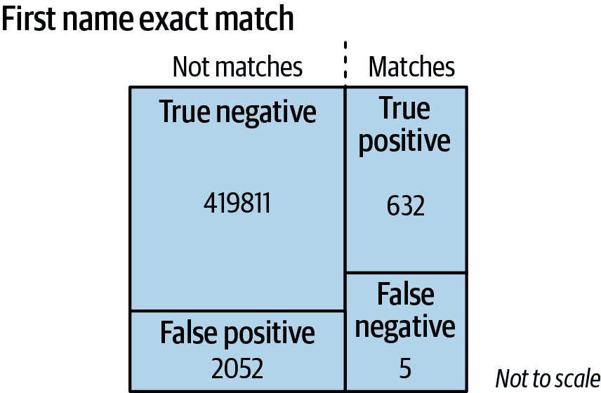
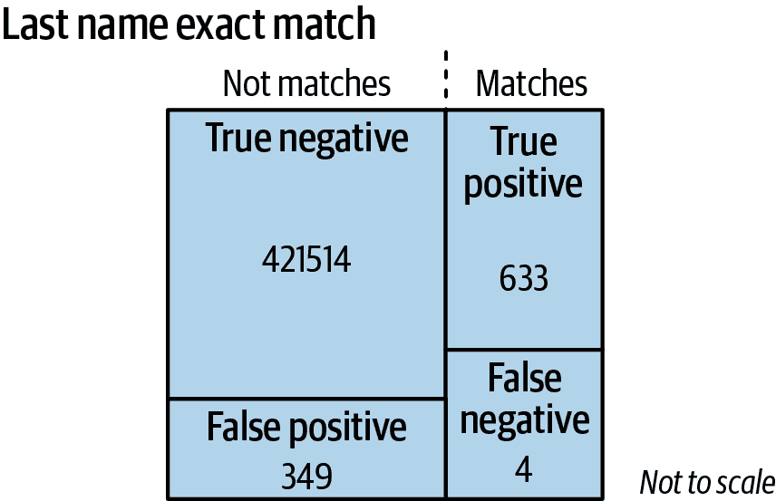
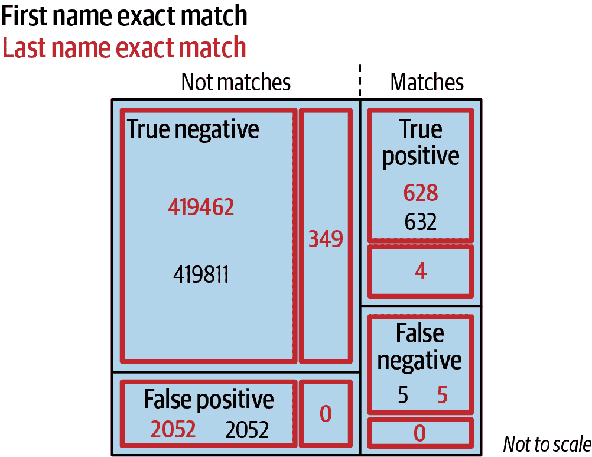
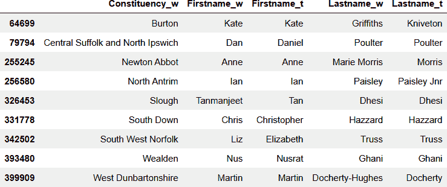
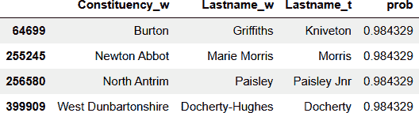
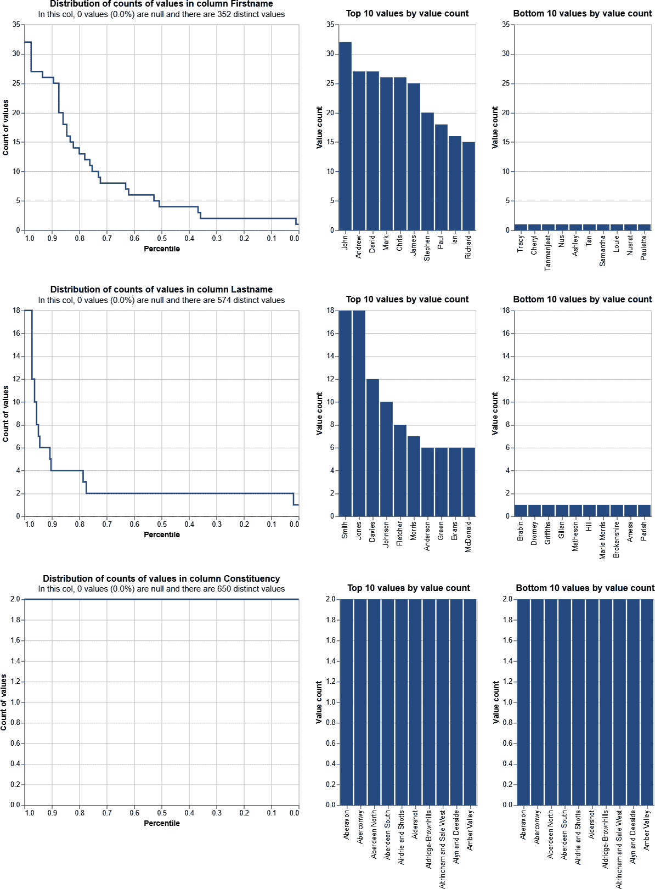
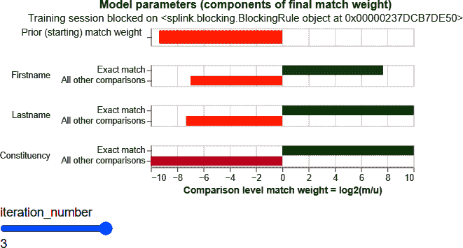
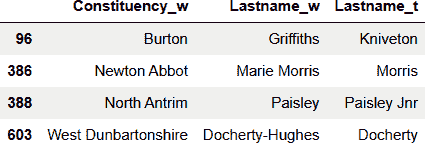

# 第四章：概率匹配

在第三章中，我们探讨了如何使用近似匹配技术来衡量属性值之间的相似程度。我们设定了一个阈值，超过此阈值我们宣布它们等价，并将这些匹配特征以相等的权重结合起来，以确定两条记录指代同一实体。我们仅针对精确匹配评估了我们的性能。

本章中，我们将探讨如何使用基于概率的技术来计算每个等效属性的最佳加权，以计算整体实体匹配的可能性。这种基于概率的方法允许我们在最具统计显著性的属性等价（精确或近似）时宣布匹配，但那些重要性较低的属性不足够相似时则不匹配。它还允许我们对匹配声明的信心进行分级，并应用适当的匹配阈值。本节将介绍的模型被称为 Fellegi-Sunter（FS）模型。

我们还将介绍一种概率实体解析框架 Splink，该框架将帮助我们计算这些指标并解决我们的实体问题。

# 示例问题

让我们回到从第二章末尾的精确匹配结果。打开*Chapter4.ipynb*笔记本，我们重新加载维基百科和 TheyWorkForYou 网站的标准化数据集。与第三章一样，我们首先通过以下方式计算两个数据集的笛卡尔积或交叉乘积：

```py
cross = df_w.merge(df_t, how='cross', suffixes=('_w', '_t'))
```

这为我们提供了 650 × 650 = 422,500 对记录的总人口——维基百科和 TheyWorkForYou 数据集之间每个姓名组合的一对。

在本章中，我们将多次使用每个记录对的`Firstname`、`Lastname`和`Constituency`字段之间的精确匹配。因此，一次计算这些匹配并将它们存储为额外的特征列更为高效：

```py
cross['Fmatch']= (cross['Firstname_w']==cross['Firstname_t'])
cross['Lmatch']= (cross['Lastname_w']==cross['Lastname_t'])
cross['Cmatch']= (cross['Constituency_w']==cross['Constituency_t'])
```

我们还计算了后续将使用的匹配列的总数：

```py
cross['Tmatch'] =
    sum([cross['Fmatch'],cross['Lmatch'],cross['Cmatch']]) 
```

根据我们在第二章中对数据的探索，我们知道在总共 422,500 个组合中，有 637 对记录具有选区和名字中的第一个名字或姓氏的精确匹配。这是我们的`match`人口：

```py
match = cross[cross['Cmatch'] & (cross['Fmatch'] |
   cross['Lmatch'])]
```

剩余的`notmatch`人口则是反向提取：

```py
notmatch = cross[(~cross['Cmatch']) | (~cross['Fmatch'] &
    ~cross['Lmatch'])]
```

这些组合总结在表 4-1 中。

Table 4-1\. 匹配与不匹配的组合

| 匹配/不匹配人口 | 选区匹配 | 第一个名字匹配 | 姓氏匹配 |
| --- | --- | --- | --- |
| 不匹配 | 否 | 否 | 否 |
| 不匹配 | 否 | 否 | 是 |
| 不匹配 | 否 | 是 | 否 |
| 不匹配 | 否 | 是 | 是 |
| 不匹配 | 是 | 否 | 否 |
| 匹配 | 是 | 否 | 是 |
| 匹配 | 是 | 是 | 否 |
| 匹配 | 是 | 是 | 是 |

现在我们将检查名字和姓氏等价性，无论是单独还是一起，能多大程度上预测一个个体记录应属于`match`或`notmatch`人群。

# 单属性匹配概率

让我们首先考虑单单以名字等价作为一个记录对中的两个实体是否指向同一个人的良好指标。我们将检查`match`和`notmatch`人群，并在每个子集内部建立，有多少个名字匹配和多少个不匹配。

# 命名约定

当我们处理这些人群的各种子集时，采用标准的命名约定是有帮助的，这样我们可以一眼看出每个记录人群是如何被选中的。当我们选择记录时，我们将选择标准添加到人群名称中，从右向左添加，例如，`first_match`应该被理解为首先选择那些属于`match`人群的记录，并在该人群子集中进一步选择只有名字相等的行。

## 名字匹配概率

从`match`人群开始，我们可以选择那些名字等于的记录，以获得我们的`first_match`人群：

```py
first_match = match[match['Fmatch']]

len(first_match)
632
```

对于其他三种匹配/不匹配组合以及名字等价性或非等价性的重复，我们可以制作一个人口分布图，如图 4-1 所示。



###### 图 4-1\. 名字人口分布图

因此，基于名字等价性，我们有：

<math alttext="upper T r u e p o s i t i v e m a t c h e s left-parenthesis upper T upper P right-parenthesis equals 632"><mrow><mi>T</mi> <mi>r</mi> <mi>u</mi> <mi>e</mi> <mi>p</mi> <mi>o</mi> <mi>s</mi> <mi>i</mi> <mi>t</mi> <mi>i</mi> <mi>v</mi> <mi>e</mi> <mi>m</mi> <mi>a</mi> <mi>t</mi> <mi>c</mi> <mi>h</mi> <mi>e</mi> <mi>s</mi> <mo>(</mo> <mi>T</mi> <mi>P</mi> <mo>)</mo> <mo>=</mo> <mn>632</mn></mrow></math>

<math alttext="upper F a l s e p o s i t i v e m a t c h e s left-parenthesis upper F upper P right-parenthesis equals 2052"><mrow><mi>F</mi> <mi>a</mi> <mi>l</mi> <mi>s</mi> <mi>e</mi> <mi>p</mi> <mi>o</mi> <mi>s</mi> <mi>i</mi> <mi>t</mi> <mi>i</mi> <mi>v</mi> <mi>e</mi> <mi>m</mi> <mi>a</mi> <mi>t</mi> <mi>c</mi> <mi>h</mi> <mi>e</mi> <mi>s</mi> <mo>(</mo> <mi>F</mi> <mi>P</mi> <mo>)</mo> <mo>=</mo> <mn>2052</mn></mrow></math>

<math alttext="upper T r u e n e g a t i v e m a t c h e s left-parenthesis upper T upper N right-parenthesis equals 419811"><mrow><mi>T</mi> <mi>r</mi> <mi>u</mi> <mi>e</mi> <mi>n</mi> <mi>e</mi> <mi>g</mi> <mi>a</mi> <mi>t</mi> <mi>i</mi> <mi>v</mi> <mi>e</mi> <mi>m</mi> <mi>a</mi> <mi>t</mi> <mi>c</mi> <mi>h</mi> <mi>e</mi> <mi>s</mi> <mo>(</mo> <mi>T</mi> <mi>N</mi> <mo>)</mo> <mo>=</mo> <mn>419811</mn></mrow></math>

<math alttext="upper F a l s e n e g a t i v e m a t c h e s left-parenthesis upper F upper N right-parenthesis equals 5"><mrow><mi>F</mi> <mi>a</mi> <mi>l</mi> <mi>s</mi> <mi>e</mi> <mi>n</mi> <mi>e</mi> <mi>g</mi> <mi>a</mi> <mi>t</mi> <mi>i</mi> <mi>v</mi> <mi>e</mi> <mi>m</mi> <mi>a</mi> <mi>t</mi> <mi>c</mi> <mi>h</mi> <mi>e</mi> <mi>s</mi> <mo>(</mo> <mi>F</mi> <mi>N</mi> <mo>)</mo> <mo>=</mo> <mn>5</mn></mrow></math>

现在我们可以计算一些概率值。首先，一个名字等价的记录对实际上是真正匹配的概率可以计算为在`match`人群中，名字匹配的记录对数除以在`match`和`notmatch`人群中名字匹配的记录对数：

<math alttext="p r o b normal bar m a t c h normal bar f i r s t equals StartFraction l e n left-parenthesis f i r s t normal bar m a t c h right-parenthesis Over left-parenthesis l e n left-parenthesis f i r s t normal bar m a t c h right-parenthesis plus l e n left-parenthesis f i r s t normal bar n o t m a t c h right-parenthesis right-parenthesis EndFraction equals StartFraction 632 Over left-parenthesis 632 plus 2052 right-parenthesis EndFraction almost-equals 0.2355"><mrow><mi>p</mi> <mi>r</mi> <mi>o</mi> <mi>b</mi> <mo>_</mo> <mi>m</mi> <mi>a</mi> <mi>t</mi> <mi>c</mi> <mi>h</mi> <mo>_</mo> <mi>f</mi> <mi>i</mi> <mi>r</mi> <mi>s</mi> <mi>t</mi> <mo>=</mo> <mfrac><mrow><mi>l</mi><mi>e</mi><mi>n</mi><mo>(</mo><mi>f</mi><mi>i</mi><mi>r</mi><mi>s</mi><mi>t</mi><mo>_</mo><mi>m</mi><mi>a</mi><mi>t</mi><mi>c</mi><mi>h</mi><mo>)</mo></mrow> <mrow><mo>(</mo><mi>l</mi><mi>e</mi><mi>n</mi><mo>(</mo><mi>f</mi><mi>i</mi><mi>r</mi><mi>s</mi><mi>t</mi><mo>_</mo><mi>m</mi><mi>a</mi><mi>t</mi><mi>c</mi><mi>h</mi><mo>)</mo><mo>+</mo><mi>l</mi><mi>e</mi><mi>n</mi><mo>(</mo><mi>f</mi><mi>i</mi><mi>r</mi><mi>s</mi><mi>t</mi><mo>_</mo><mi>n</mi><mi>o</mi><mi>t</mi><mi>m</mi><mi>a</mi><mi>t</mi><mi>c</mi><mi>h</mi><mo>)</mo><mo>)</mo></mrow></mfrac> <mo>=</mo> <mfrac><mn>632</mn> <mrow><mo>(</mo><mn>632</mn><mo>+</mo><mn>2052</mn><mo>)</mo></mrow></mfrac> <mo>≈</mo> <mn>0</mn> <mo>.</mo> <mn>2355</mn></mrow></math>

从中可以看出，仅有约 23%的名字等价性并不是两个记录匹配的很好预测器。这个值是一个条件概率，即在名字匹配的条件下是真正匹配的概率。可以写成：

<math alttext="upper P left-parenthesis m a t c h vertical-bar f i r s t right-parenthesis"><mrow><mi>P</mi> <mo>(</mo> <mi>m</mi> <mi>a</mi> <mi>t</mi> <mi>c</mi> <mi>h</mi> <mo>|</mo> <mi>f</mi> <mi>i</mi> <mi>r</mi> <mi>s</mi> <mi>t</mi> <mo>)</mo></mrow></math>

管道字符（|）被读作“给定于”。

## 姓氏匹配概率

将相同的计算应用于姓氏，我们可以制作第二个人口分布图，如图 4-2 所示。



###### 图 4-2\. 姓氏人口分布图

至于名字，一个姓氏等价的记录对实际上是匹配的概率可以计算为在`match`人群中，姓氏匹配的记录对数除以在`match`和`notmatch`人群中姓氏匹配的记录对数。

<math alttext="p r o b normal bar m a t c h normal bar l a s t equals StartFraction l e n left-parenthesis l a s t normal bar m a t c h right-parenthesis Over left-parenthesis l e n left-parenthesis l a s t normal bar m a t c h right-parenthesis plus l e n left-parenthesis l a s t normal bar n o t m a t c h right-parenthesis right-parenthesis EndFraction equals StartFraction 633 Over left-parenthesis 633 plus 349 right-parenthesis EndFraction almost-equals 0.6446"><mrow><mi>p</mi> <mi>r</mi> <mi>o</mi> <mi>b</mi> <mo>_</mo> <mi>m</mi> <mi>a</mi> <mi>t</mi> <mi>c</mi> <mi>h</mi> <mo>_</mo> <mi>l</mi> <mi>a</mi> <mi>s</mi> <mi>t</mi> <mo>=</mo> <mfrac><mrow><mi>l</mi><mi>e</mi><mi>n</mi><mo>(</mo><mi>l</mi><mi>a</mi><mi>s</mi><mi>t</mi><mo>_</mo><mi>m</mi><mi>a</mi><mi>t</mi><mi>c</mi><mi>h</mi><mo>)</mo></mrow> <mrow><mo>(</mo><mi>l</mi><mi>e</mi><mi>n</mi><mo>(</mo><mi>l</mi><mi>a</mi><mi>s</mi><mi>t</mi><mo>_</mo><mi>m</mi><mi>a</mi><mi>t</mi><mi>c</mi><mi>h</mi><mo>)</mo><mo>+</mo><mi>l</mi><mi>e</mi><mi>n</mi><mo>(</mo><mi>l</mi><mi>a</mi><mi>s</mi><mi>t</mi><mo>_</mo><mi>n</mi><mi>o</mi><mi>t</mi><mi>m</mi><mi>a</mi><mi>t</mi><mi>c</mi><mi>h</mi><mo>)</mo><mo>)</mo></mrow></mfrac> <mo>=</mo> <mfrac><mn>633</mn> <mrow><mo>(</mo><mn>633</mn><mo>+</mo><mn>349</mn><mo>)</mo></mrow></mfrac> <mo>≈</mo> <mn>0</mn> <mo>.</mo> <mn>6446</mn></mrow></math>

对于这些记录来说，姓氏等价性显然是一个比名字更好的真实匹配预测器，这从直觉上讲是有道理的。

再次，这可以写成：

<math alttext="upper P left-parenthesis m a t c h vertical-bar l a s t right-parenthesis"><mrow><mi>P</mi> <mo>(</mo> <mi>m</mi> <mi>a</mi> <mi>t</mi> <mi>c</mi> <mi>h</mi> <mo>|</mo> <mi>l</mi> <mi>a</mi> <mi>s</mi> <mi>t</mi> <mo>)</mo></mrow></math>

# 多属性匹配概率

现在，如果我们考虑同时名字和姓氏的等效性，我们可以进一步将我们的人口地图细分。从我们的名字地图开始，进一步将每个名字类别细分为姓氏等效和非等效，我们可以查看我们的人口如图 4-3 所示。



###### 图 4-3\. 名字，姓氏人口地图

将我们的计算扩展到同时名字和姓氏完全匹配，我们可以计算给定名字和姓氏等效的真正正匹配的概率为：

<math alttext="p r o b normal bar m a t c h normal bar l a s t normal bar f i r s t equals StartFraction l e n left-parenthesis l a s t normal bar f i r s t normal bar m a t c h right-parenthesis Over left-parenthesis l e n left-parenthesis l a s t normal bar f i r s t normal bar m a t c h right-parenthesis plus l e n left-parenthesis l a s t normal bar f i r s t normal bar n o t m a t c h right-parenthesis EndFraction equals StartFraction 628 Over left-parenthesis 628 plus 0 right-parenthesis EndFraction equals 1.0"><mrow><mi>p</mi> <mi>r</mi> <mi>o</mi> <mi>b</mi> <mo>_</mo> <mi>m</mi> <mi>a</mi> <mi>t</mi> <mi>c</mi> <mi>h</mi> <mo>_</mo> <mi>l</mi> <mi>a</mi> <mi>s</mi> <mi>t</mi> <mo>_</mo> <mi>f</mi> <mi>i</mi> <mi>r</mi> <mi>s</mi> <mi>t</mi> <mo>=</mo> <mfrac><mrow><mi>l</mi><mi>e</mi><mi>n</mi><mo>(</mo><mi>l</mi><mi>a</mi><mi>s</mi><mi>t</mi><mo>_</mo><mi>f</mi><mi>i</mi><mi>r</mi><mi>s</mi><mi>t</mi><mo>_</mo><mi>m</mi><mi>a</mi><mi>t</mi><mi>c</mi><mi>h</mi><mo>)</mo></mrow> <mrow><mo>(</mo><mi>l</mi><mi>e</mi><mi>n</mi><mo>(</mo><mi>l</mi><mi>a</mi><mi>s</mi><mi>t</mi><mo>_</mo><mi>f</mi><mi>i</mi><mi>r</mi><mi>s</mi><mi>t</mi><mo>_</mo><mi>m</mi><mi>a</mi><mi>t</mi><mi>c</mi><mi>h</mi><mo>)</mo><mo>+</mo><mi>l</mi><mi>e</mi><mi>n</mi><mo>(</mo><mi>l</mi><mi>a</mi><mi>s</mi><mi>t</mi><mo>_</mo><mi>f</mi><mi>i</mi><mi>r</mi><mi>s</mi><mi>t</mi><mo>_</mo><mi>n</mi><mi>o</mi><mi>t</mi><mi>m</mi><mi>a</mi><mi>t</mi><mi>c</mi><mi>h</mi><mo>)</mo></mrow></mfrac> <mo>=</mo> <mfrac><mn>628</mn> <mrow><mo>(</mo><mn>628</mn><mo>+</mo><mn>0</mn><mo>)</mo></mrow></mfrac> <mo>=</mo> <mn>1</mn> <mo>.</mo> <mn>0</mn></mrow></math>

如果名字匹配但姓氏不匹配，那么它是匹配的概率是多少？

<math alttext="p r o b normal bar m a t c h normal bar n o t l a s t normal bar f i r s t equals StartFraction l e n left-parenthesis n o t l a s t normal bar f i r s t normal bar m a t c h right-parenthesis Over left-parenthesis l e n left-parenthesis n o t l a s t normal bar f i r s t normal bar m a t c h right-parenthesis plus l e n left-parenthesis n o t l a s t normal bar f i r s t normal bar n o t m a t c h right-parenthesis right-parenthesis EndFraction equals StartFraction 4 Over left-parenthesis 4 plus 2052 right-parenthesis EndFraction almost-equals 0.0019"><mrow><mi>p</mi> <mi>r</mi> <mi>o</mi> <mi>b</mi> <mo>_</mo> <mi>m</mi> <mi>a</mi> <mi>t</mi> <mi>c</mi> <mi>h</mi> <mo>_</mo> <mi>n</mi> <mi>o</mi> <mi>t</mi> <mi>l</mi> <mi>a</mi> <mi>s</mi> <mi>t</mi> <mo>_</mo> <mi>f</mi> <mi>i</mi> <mi>r</mi> <mi>s</mi> <mi>t</mi> <mo>=</mo> <mfrac><mrow><mi>l</mi><mi>e</mi><mi>n</mi><mo>(</mo><mi>n</mi><mi>o</mi><mi>t</mi><mi>l</mi><mi>a</mi><mi>s</mi><mi>t</mi><mo>_</mo><mi>f</mi><mi>i</mi><mi>r</mi><mi>s</mi><mi>t</mi><mo>_</mo><mi>m</mi><mi>a</mi><mi>t</mi><mi>c</mi><mi>h</mi><mo>)</mo></mrow> <mrow><mo>(</mo><mi>l</mi><mi>e</mi><mi>n</mi><mo>(</mo><mi>n</mi><mi>o</mi><mi>t</mi><mi>l</mi><mi>a</mi><mi>s</mi><mi>t</mi><mo>_</mo><mi>f</mi><mi>i</mi><mi>r</mi><mi>s</mi><mi>t</mi><mo>_</mo><mi>m</mi><mi>a</mi><mi>t</mi><mi>c</mi><mi>h</mi><mo>)</mo><mo>+</mo><mi>l</mi><mi>e</mi><mi>n</mi><mo>(</mo><mi>n</mi><mi>o</mi><mi>t</mi><mi>l</mi><mi>a</mi><mi>s</mi><mi>t</mi><mo>_</mo><mi>f</mi><mi>i</mi><mi>r</mi><mi>s</mi><mi>t</mi><mo>_</mo><mi>n</mi><mi>o</mi><mi>t</mi><mi>m</mi><mi>a</mi><mi>t</mi><mi>c</mi><mi>h</mi><mo>)</mo><mo>)</mo></mrow></mfrac> <mo>=</mo> <mfrac><mn>4</mn> <mrow><mo>(</mo><mn>4</mn><mo>+</mo><mn>2052</mn><mo>)</mo></mrow></mfrac> <mo>≈</mo> <mn>0</mn> <mo>.</mo> <mn>0019</mn></mrow></math>

如果名字不匹配但姓氏匹配，那么它是匹配的概率是多少？

<math alttext="p r o b normal bar m a t c h normal bar l a s t normal bar n o t f i r s t equals StartFraction l e n left-parenthesis l a s t normal bar n o t f i r s t normal bar m a t c h right-parenthesis Over left-parenthesis l e n left-parenthesis l a s t normal bar n o t f i r s t normal bar m a t c h right-parenthesis plus l e n left-parenthesis l a s t normal bar n o t f i r s t normal bar n o t m a t c h right-parenthesis right-parenthesis EndFraction equals StartFraction 5 Over left-parenthesis 5 plus 349 right-parenthesis EndFraction almost-equals 0.0141"><mrow><mi>p</mi> <mi>r</mi> <mi>o</mi> <mi>b</mi> <mo>_</mo> <mi>m</mi> <mi>a</mi> <mi>t</mi> <mi>c</mi> <mi>h</mi> <mo>_</mo> <mi>l</mi> <mi>a</mi> <mi>s</mi> <mi>t</mi> <mo>_</mo> <mi>n</mi> <mi>o</mi> <mi>t</mi> <mi>f</mi> <mi>i</mi> <mi>r</mi> <mi>s</mi> <mi>t</mi> <mo>=</mo> <mfrac><mrow><mi>l</mi><mi>e</mi><mi>n</mi><mo>(</mo><mi>l</mi><mi>a</mi><mi>s</mi><mi>t</mi><mo>_</mo><mi>n</mi><mi>o</mi><mi>t</mi><mi>f</mi><mi>i</mi><mi>r</mi><mi>s</mi><mi>t</mi><mo>_</mo><mi>m</mi><mi>a</mi><mi>t</mi><mi>c</mi><mi>h</mi><mo>)</mo></mrow> <mrow><mo>(</mo><mi>l</mi><mi>e</mi><mi>n</mi><mo>(</mo><mi>l</mi><mi>a</mi><mi>s</mi><mi>t</mi><mo>_</mo><mi>n</mi><mi>o</mi><mi>t</mi><mi>f</mi><mi>i</mi><mi>r</mi><mi>s</mi><mi>t</mi><mo>_</mo><mi>m</mi><mi>a</mi><mi>t</mi><mi>c</mi><mi>h</mi><mo>)</mo><mo>+</mo><mi>l</mi><mi>e</mi><mi>n</mi><mo>(</mo><mi>l</mi><mi>a</mi><mi>s</mi><mi>t</mi><mo>_</mo><mi>n</mi><mi>o</mi><mi>t</mi><mi>f</mi><mi>i</mi><mi>r</mi><mi>s</mi><mi>t</mi><mo>_</mo><mi>n</mi><mi>o</mi><mi>t</mi><mi>m</mi><mi>a</mi><mi>t</mi><mi>c</mi><mi>h</mi><mo>)</mo><mo>)</mo></mrow></mfrac> <mo>=</mo> <mfrac><mn>5</mn> <mrow><mo>(</mo><mn>5</mn><mo>+</mo><mn>349</mn><mo>)</mo></mrow></mfrac> <mo>≈</mo> <mn>0</mn> <mo>.</mo> <mn>0141</mn></mrow></math>

正如我们所预期的那样，如果名字或姓氏任一不完全匹配，那么真正正匹配的概率是低的，但姓氏匹配比名字匹配给我们更多的信心。

如果既没有名字匹配也没有姓氏匹配，那么它是匹配的概率是多少？

<math alttext="p r o b normal bar m a t c h normal bar n o t l a s t normal bar n o t f i r s t equals"><mrow><mi>p</mi> <mi>r</mi> <mi>o</mi> <mi>b</mi> <mo>_</mo> <mi>m</mi> <mi>a</mi> <mi>t</mi> <mi>c</mi> <mi>h</mi> <mo>_</mo> <mi>n</mi> <mi>o</mi> <mi>t</mi> <mi>l</mi> <mi>a</mi> <mi>s</mi> <mi>t</mi> <mo>_</mo> <mi>n</mi> <mi>o</mi> <mi>t</mi> <mi>f</mi> <mi>i</mi> <mi>r</mi> <mi>s</mi> <mi>t</mi> <mo>=</mo></mrow></math>

<math alttext="StartFraction l e n left-parenthesis n o t l a s t normal bar n o t f i r s t normal bar m a t c h right-parenthesis Over left-parenthesis l e n left-parenthesis n o t l a s t normal bar n o t f i r s t normal bar m a t c h right-parenthesis plus l e n left-parenthesis n o t l a s t normal bar n o t f i r s t normal bar n o t m a t c h right-parenthesis right-parenthesis EndFraction equals StartFraction 0 Over left-parenthesis 0 plus 419462 right-parenthesis EndFraction equals 0"><mrow><mfrac><mrow><mi>l</mi><mi>e</mi><mi>n</mi><mo>(</mo><mi>n</mi><mi>o</mi><mi>t</mi><mi>l</mi><mi>a</mi><mi>s</mi><mi>t</mi><mo>_</mo><mi>n</mi><mi>o</mi><mi>t</mi><mi>f</mi><mi>i</mi><mi>r</mi><mi>s</mi><mi>t</mi><mo>_</mo><mi>m</mi><mi>a</mi><mi>t</mi><mi>c</mi><mi>h</mi><mo>)</mo></mrow> <mrow><mo>(</mo><mi>l</mi><mi>e</mi><mi>n</mi><mo>(</mo><mi>n</mi><mi>o</mi><mi>t</mi><mi>l</mi><mi>a</mi><mi>s</mi><mi>t</mi><mo>_</mo><mi>n</mi><mi>o</mi><mi>t</mi><mi>f</mi><mi>i</mi><mi>r</mi><mi>s</mi><mi>t</mi><mo>_</mo><mi>m</mi><mi>a</mi><mi>t</mi><mi>c</mi><mi>h</mi><mo>)</mo><mo>+</mo><mi>l</mi><mi>e</mi><mi>n</mi><mo>(</mo><mi>n</mi><mi>o</mi><mi>t</mi><mi>l</mi><mi>a</mi><mi>s</mi><mi>t</mi><mo>_</mo><mi>n</mi><mi>o</mi><mi>t</mi><mi>f</mi><mi>i</mi><mi>r</mi><mi>s</mi><mi>t</mi><mo>_</mo><mi>n</mi><mi>o</mi><mi>t</mi><mi>m</mi><mi>a</mi><mi>t</mi><mi>c</mi><mi>h</mi><mo>)</mo><mo>)</mo></mrow></mfrac> <mo>=</mo> <mfrac><mn>0</mn> <mrow><mo>(</mo><mn>0</mn><mo>+</mo><mn>419462</mn><mo>)</mo></mrow></mfrac> <mo>=</mo> <mn>0</mn></mrow></math>

这并不奇怪，因为我们定义了真正正匹配为在成分上具有完全匹配和名字或姓氏之一的记录。

总之，我们可以利用这些概率来指导我们是否可能有一个真正的正匹配。在这个例子中，我们会更加重视姓氏匹配而不是名字匹配。这是我们在第三章中方法的改进，我们在那里给了它们相同的权重（并要求它们都等效）来声明匹配。

但是等等，我们有一个问题。在前面的例子中，我们从已知的匹配人口开始，用于计算名字和姓氏等效是否等于匹配的概率。然而，在大多数情况下，我们没有已知的`match`人口；否则我们一开始就不需要执行匹配！我们如何克服这一点呢？为了做到这一点，我们需要稍微重新构思我们的计算，然后使用一些聪明的估算技术。

# 概率模型

在前一节中，我们了解到一些属性比其他属性更具信息量；也就是说，它们具有更多预测能力来帮助我们决定匹配是否可能是正确的。在本节中，我们将探讨如何计算这些贡献以及如何结合它们来评估匹配的总体可能性。

我们先从一点统计理论开始（以使用名字相等为例），然后我们将其推广为我们可以大规模部署的模型。

## 贝叶斯定理

*贝叶斯定理*，以托马斯·贝叶斯命名，陈述了一个事件的条件概率，基于另一个事件的发生，等于第一个事件的概率乘以第二个事件发生的概率。

考虑随机选择两条记录是真正正匹配的概率 P(match)，乘以在这些匹配中名字匹配的概率 P(first|match)：

<math alttext="upper P left-parenthesis f i r s t vertical-bar m a t c h right-parenthesis times upper P left-parenthesis m a t c h right-parenthesis"><mrow><mi>P</mi> <mo>(</mo> <mi>f</mi> <mi>i</mi> <mi>r</mi> <mi>s</mi> <mi>t</mi> <mo>|</mo> <mi>m</mi> <mi>a</mi> <mi>t</mi> <mi>c</mi> <mi>h</mi> <mo>)</mo> <mo>×</mo> <mi>P</mi> <mo>(</mo> <mi>m</mi> <mi>a</mi> <mi>t</mi> <mi>c</mi> <mi>h</mi> <mo>)</mo></mrow></math>

同样地，我们可以按相反顺序计算相同的值，从匹配的第一个名字的概率开始，乘以此人口内的记录是真正的正匹配的概率：

<math alttext="upper P left-parenthesis m a t c h vertical-bar f i r s t right-parenthesis times upper P left-parenthesis f i r s t right-parenthesis"><mrow><mi>P</mi> <mo>(</mo> <mi>m</mi> <mi>a</mi> <mi>t</mi> <mi>c</mi> <mi>h</mi> <mo>|</mo> <mi>f</mi> <mi>i</mi> <mi>r</mi> <mi>s</mi> <mi>t</mi> <mo>)</mo> <mo>×</mo> <mi>P</mi> <mo>(</mo> <mi>f</mi> <mi>i</mi> <mi>r</mi> <mi>s</mi> <mi>t</mi> <mo>)</mo></mrow></math>

等价这些概率，我们有：

<math alttext="upper P left-parenthesis m a t c h vertical-bar f i r s t right-parenthesis times upper P left-parenthesis f i r s t right-parenthesis equals upper P left-parenthesis f i r s t vertical-bar m a t c h right-parenthesis times upper P left-parenthesis m a t c h right-parenthesis"><mrow><mi>P</mi> <mo>(</mo> <mi>m</mi> <mi>a</mi> <mi>t</mi> <mi>c</mi> <mi>h</mi> <mo>|</mo> <mi>f</mi> <mi>i</mi> <mi>r</mi> <mi>s</mi> <mi>t</mi> <mo>)</mo> <mo>×</mo> <mi>P</mi> <mo>(</mo> <mi>f</mi> <mi>i</mi> <mi>r</mi> <mi>s</mi> <mi>t</mi> <mo>)</mo> <mo>=</mo> <mi>P</mi> <mo>(</mo> <mi>f</mi> <mi>i</mi> <mi>r</mi> <mi>s</mi> <mi>t</mi> <mo>|</mo> <mi>m</mi> <mi>a</mi> <mi>t</mi> <mi>c</mi> <mi>h</mi> <mo>)</mo> <mo>×</mo> <mi>P</mi> <mo>(</mo> <mi>m</mi> <mi>a</mi> <mi>t</mi> <mi>c</mi> <mi>h</mi> <mo>)</mo></mrow></math>

重新排列后，我们可以计算：

<math alttext="upper P left-parenthesis m a t c h vertical-bar f i r s t right-parenthesis equals StartFraction upper P left-parenthesis f i r s t vertical-bar m a t c h right-parenthesis times upper P left-parenthesis m a t c h right-parenthesis Over upper P left-parenthesis f i r s t right-parenthesis EndFraction"><mrow><mi>P</mi> <mrow><mo>(</mo> <mi>m</mi> <mi>a</mi> <mi>t</mi> <mi>c</mi> <mi>h</mi> <mo>|</mo> <mi>f</mi> <mi>i</mi> <mi>r</mi> <mi>s</mi> <mi>t</mi> <mo>)</mo></mrow> <mo>=</mo> <mfrac><mrow><mi>P</mi><mo>(</mo><mi>f</mi><mi>i</mi><mi>r</mi><mi>s</mi><mi>t</mi><mo>|</mo><mi>m</mi><mi>a</mi><mi>t</mi><mi>c</mi><mi>h</mi><mo>)</mo><mo>×</mo><mi>P</mi><mo>(</mo><mi>m</mi><mi>a</mi><mi>t</mi><mi>c</mi><mi>h</mi><mo>)</mo></mrow> <mrow><mi>P</mi><mo>(</mo><mi>f</mi><mi>i</mi><mi>r</mi><mi>s</mi><mi>t</mi><mo>)</mo></mrow></mfrac></mrow></math>

我们可以计算 P(first)为`match`和`notmatch`人口的概率之和：

<math display="block"><mtable columnalign="right left" displaystyle="true"><mtr><mtd class="tml-right" style="padding:0.7ex 0em 0.7ex 0em;"><mrow><mi>P</mi> <mo form="prefix" stretchy="false">(</mo> <mi>f</mi> <mi>i</mi> <mi>r</mi> <mi>s</mi> <mi>t</mi> <mo form="postfix" stretchy="false">)</mo></mrow></mtd> <mtd class="tml-left" style="padding:0.7ex 0em 0.7ex 0em;"><mrow><mo>=</mo> <mo form="prefix" stretchy="false">(</mo> <mi>P</mi> <mo form="prefix" stretchy="false">(</mo> <mi>f</mi> <mi>i</mi> <mi>r</mi> <mi>s</mi> <mi>t</mi> <mi>|</mi> <mi>m</mi> <mi>a</mi> <mi>t</mi> <mi>c</mi> <mi>h</mi> <mo form="postfix" stretchy="false">)</mo> <mo>×</mo> <mi>P</mi> <mo form="prefix" stretchy="false">(</mo> <mi>m</mi> <mi>a</mi> <mi>t</mi> <mi>c</mi> <mi>h</mi> <mo form="postfix" stretchy="false">)</mo></mrow></mtd></mtr> <mtr><mtd class="tml-left" style="padding:0.7ex 0em 0.7ex 0em;"><mrow><mo>+</mo> <mi>P</mi> <mo form="prefix" stretchy="false">(</mo> <mi>f</mi> <mi>i</mi> <mi>r</mi> <mi>s</mi> <mi>t</mi> <mi>|</mi> <mi>n</mi> <mi>o</mi> <mi>t</mi> <mi>m</mi> <mi>a</mi> <mi>t</mi> <mi>c</mi> <mi>h</mi> <mo form="postfix" stretchy="false">)</mo> <mo>×</mo> <mi>P</mi> <mo form="prefix" stretchy="false">(</mo> <mi>n</mi> <mi>o</mi> <mi>t</mi> <mi>m</mi> <mi>a</mi> <mi>t</mi> <mi>c</mi> <mi>h</mi> <mo form="postfix" stretchy="false">)</mo> <mo form="postfix" stretchy="false">)</mo></mrow></mtd></mtr></mtable></math>

代入上述方程，我们有：

<math alttext="upper P left-parenthesis m a t c h vertical-bar f i r s t right-parenthesis equals StartFraction upper P left-parenthesis f i r s t vertical-bar m a t c h right-parenthesis times upper P left-parenthesis m a t c h right-parenthesis Over upper P left-parenthesis f i r s t vertical-bar m a t c h right-parenthesis times upper P left-parenthesis m a t c h right-parenthesis plus upper P left-parenthesis f i r s t vertical-bar n o t m a t c h right-parenthesis times upper P left-parenthesis n o t m a t c h right-parenthesis EndFraction"><mrow><mi>P</mi> <mrow><mo>(</mo> <mi>m</mi> <mi>a</mi> <mi>t</mi> <mi>c</mi> <mi>h</mi> <mo>|</mo> <mi>f</mi> <mi>i</mi> <mi>r</mi> <mi>s</mi> <mi>t</mi> <mo>)</mo></mrow> <mo>=</mo> <mfrac><mrow><mi>P</mi><mo>(</mo><mi>f</mi><mi>i</mi><mi>r</mi><mi>s</mi><mi>t</mi><mo>|</mo><mi>m</mi><mi>a</mi><mi>t</mi><mi>c</mi><mi>h</mi><mo>)</mo><mo>×</mo><mi>P</mi><mo>(</mo><mi>m</mi><mi>a</mi><mi>t</mi><mi>c</mi><mi>h</mi><mo>)</mo></mrow> <mrow><mi>P</mi><mo>(</mo><mi>f</mi><mi>i</mi><mi>r</mi><mi>s</mi><mi>t</mi><mo>|</mo><mi>m</mi><mi>a</mi><mi>t</mi><mi>c</mi><mi>h</mi><mo>)</mo><mo>×</mo><mi>P</mi><mo>(</mo><mi>m</mi><mi>a</mi><mi>t</mi><mi>c</mi><mi>h</mi><mo>)</mo><mo>+</mo><mi>P</mi><mo>(</mo><mi>f</mi><mi>i</mi><mi>r</mi><mi>s</mi><mi>t</mi><mo>|</mo><mi>n</mi><mi>o</mi><mi>t</mi><mi>m</mi><mi>a</mi><mi>t</mi><mi>c</mi><mi>h</mi><mo>)</mo><mo>×</mo><mi>P</mi><mo>(</mo><mi>n</mi><mi>o</mi><mi>t</mi><mi>m</mi><mi>a</mi><mi>t</mi><mi>c</mi><mi>h</mi><mo>)</mo></mrow></mfrac></mrow></math>

或者，我们可以将其重新排列为：

<math alttext="upper P left-parenthesis m a t c h vertical-bar f i r s t right-parenthesis equals 1 minus left-parenthesis 1 plus StartFraction upper P left-parenthesis f i r s t vertical-bar m a t c h right-parenthesis Over upper P left-parenthesis f i r s t vertical-bar n o t m a t c h right-parenthesis EndFraction times StartFraction upper P left-parenthesis m a t c h right-parenthesis Over upper P left-parenthesis n o t m a t c h right-parenthesis EndFraction right-parenthesis Superscript negative 1"><mrow><mi>P</mi> <mrow><mo>(</mo> <mi>m</mi> <mi>a</mi> <mi>t</mi> <mi>c</mi> <mi>h</mi> <mo>|</mo> <mi>f</mi> <mi>i</mi> <mi>r</mi> <mi>s</mi> <mi>t</mi> <mo>)</mo></mrow> <mo>=</mo> <mn>1</mn> <mo>-</mo> <msup><mrow><mo>(</mo><mn>1</mn><mo>+</mo><mfrac><mrow><mi>P</mi><mo>(</mo><mi>f</mi><mi>i</mi><mi>r</mi><mi>s</mi><mi>t</mi><mo>|</mo><mi>m</mi><mi>a</mi><mi>t</mi><mi>c</mi><mi>h</mi><mo>)</mo></mrow> <mrow><mi>P</mi><mo>(</mo><mi>f</mi><mi>i</mi><mi>r</mi><mi>s</mi><mi>t</mi><mo>|</mo><mi>n</mi><mi>o</mi><mi>t</mi><mi>m</mi><mi>a</mi><mi>t</mi><mi>c</mi><mi>h</mi><mo>)</mo></mrow></mfrac><mo>×</mo><mfrac><mrow><mi>P</mi><mo>(</mo><mi>m</mi><mi>a</mi><mi>t</mi><mi>c</mi><mi>h</mi><mo>)</mo></mrow> <mrow><mi>P</mi><mo>(</mo><mi>n</mi><mi>o</mi><mi>t</mi><mi>m</mi><mi>a</mi><mi>t</mi><mi>c</mi><mi>h</mi><mo>)</mo></mrow></mfrac><mo>)</mo></mrow> <mrow><mo>-</mo><mn>1</mn></mrow></msup></mrow></math>

如果我们可以估算出这个方程中的值，我们就能确定如果一个名字相等，那么记录对确实是一次匹配的概率。

让我们稍微详细地检查这些值，随着符号的简化而进行。

## m 值

在整个`match`人口中，一个属性将会相等的条件概率被称为*m 值*。使用我们的`Firstname`示例，我们可以表示为：

<math alttext="m Subscript f Baseline equals upper P left-parenthesis f i r s t vertical-bar m a t c h right-parenthesis"><mrow><msub><mi>m</mi> <mi>f</mi></msub> <mo>=</mo> <mi>P</mi> <mrow><mo>(</mo> <mi>f</mi> <mi>i</mi> <mi>r</mi> <mi>s</mi> <mi>t</mi> <mo>|</mo> <mi>m</mi> <mi>a</mi> <mi>t</mi> <mi>c</mi> <mi>h</mi> <mo>)</mo></mrow></mrow></math>

在完美的数据集中，`match`人口中的所有名字将完全相等，*m*值将为 1。因此，这个值可以被认为是数据质量的一种度量，即属性在数据集中被捕捉到的变异程度。更高的值表示更高质量的属性。

## u 值

在整个`notmatch`人口中，一个属性将会相等的条件概率被称为*u 值*。同样地，使用我们的`Firstname`示例，我们可以表示为：

<math alttext="u Subscript f Baseline equals upper P left-parenthesis f i r s t vertical-bar n o t m a t c h right-parenthesis"><mrow><msub><mi>u</mi> <mi>f</mi></msub> <mo>=</mo> <mi>P</mi> <mrow><mo>(</mo> <mi>f</mi> <mi>i</mi> <mi>r</mi> <mi>s</mi> <mi>t</mi> <mo>|</mo> <mi>n</mi> <mi>o</mi> <mi>t</mi> <mi>m</mi> <mi>a</mi> <mi>t</mi> <mi>c</mi> <mi>h</mi> <mo>)</mo></mrow></mrow></math>

这个值反映了在数据集中此属性有多少共同性。较低的值表示较不常见、更具区别性的属性，如果在特定情况下发现等效，则会使我们质疑它是否属于`notmatch`人口，并且是否真的匹配。相反，较高的*u*值告诉我们，这个特定的属性不太有价值，不能确定整体匹配。

*u*值的一个很好的例子是出生月份属性，假设人口在全年内均匀分布，将有一个*u*值为<math alttext="one-twelfth"><mfrac><mn>1</mn> <mn>12</mn></mfrac></math>。

## Lambda（<math alttext="lamda"><mi>λ</mi></math>）值

*λ值*，也称为先验，是两个随机选取的记录匹配的概率。

<math alttext="lamda equals upper P left-parenthesis m a t c h right-parenthesis"><mrow><mi>λ</mi> <mo>=</mo> <mi>P</mi> <mo>(</mo> <mi>m</mi> <mi>a</mi> <mi>t</mi> <mi>c</mi> <mi>h</mi> <mo>)</mo></mrow></math>

与*m*和*u*值相比，*λ*值是一个与任何特定属性都不相关的记录级值。这个值是数据集整体重复的程度的度量，并且是我们概率计算的起点。

其倒数，即两个随机选取的记录不匹配的可能性，可以写为：

<math alttext="1 minus lamda equals upper P left-parenthesis n o t m a t c h right-parenthesis"><mrow><mn>1</mn> <mo>-</mo> <mi>λ</mi> <mo>=</mo> <mi>P</mi> <mo>(</mo> <mi>n</mi> <mi>o</mi> <mi>t</mi> <mi>m</mi> <mi>a</mi> <mi>t</mi> <mi>c</mi> <mi>h</mi> <mo>)</mo></mrow></math>

## 贝叶斯因子

代入这些紧凑的符号可能会导致以下结果：

<math alttext="upper P left-parenthesis m a t c h vertical-bar f i r s t right-parenthesis equals 1 minus left-parenthesis 1 plus StartFraction m Subscript f Baseline Over u Subscript f Baseline EndFraction times StartFraction lamda Over left-parenthesis 1 minus lamda right-parenthesis EndFraction right-parenthesis Superscript negative 1"><mrow><mi>P</mi> <mrow><mo>(</mo> <mi>m</mi> <mi>a</mi> <mi>t</mi> <mi>c</mi> <mi>h</mi> <mo>|</mo> <mi>f</mi> <mi>i</mi> <mi>r</mi> <mi>s</mi> <mi>t</mi> <mo>)</mo></mrow> <mo>=</mo> <mn>1</mn> <mo>-</mo> <msup><mrow><mo>(</mo><mn>1</mn><mo>+</mo><mfrac><msub><mi>m</mi> <mi>f</mi></msub> <msub><mi>u</mi> <mi>f</mi></msub></mfrac> <mo>×</mo><mfrac><mi>λ</mi> <mrow><mo>(</mo><mn>1</mn><mo>-</mo><mi>λ</mi><mo>)</mo></mrow></mfrac><mo>)</mo></mrow> <mrow><mo>-</mo><mn>1</mn></mrow></msup></mrow></math>

比率  <math alttext="StartFraction m Subscript f Baseline Over u Subscript f Baseline EndFraction"><mfrac><msub><mi>m</mi> <mi>f</mi></msub> <msub><mi>u</mi> <mi>f</mi></msub></mfrac></math> 也被称为*贝叶斯因子*，在本例中是关于`Firstname`参数的。贝叶斯因子作为*m*和*u*值的组合，用于衡量我们应该给予`Firstname`值等效性的重要性。

## 费勒吉-桑特模型

费勒吉-桑特模型，以伊凡·P·费勒吉和艾伦·B·桑特命名，¹ 描述了我们如何扩展简单的贝叶斯方法，结合多个属性的贡献，计算匹配的总体可能性。它依赖于属性之间条件独立的简化假设，也称为*朴素贝叶斯*。

使用 FS 模型，我们可以通过简单地将记录中每个属性的贝叶斯因子相乘来组合它们。以我们的`Firstname`示例为例，考虑`Lastname`也等效时：

<math alttext="upper P left-parenthesis m a t c h StartAbsoluteValue l a s t EndAbsoluteValue f i r s t right-parenthesis equals 1 minus left-parenthesis 1 plus StartFraction m Subscript f Baseline Over u Subscript f Baseline EndFraction times StartFraction m Subscript l Baseline Over u Subscript l Baseline EndFraction times StartFraction lamda Over left-parenthesis 1 minus lamda right-parenthesis EndFraction right-parenthesis Superscript negative 1"><mrow><mi>P</mi> <mrow><mo>(</mo> <mi>m</mi> <mi>a</mi> <mi>t</mi> <mi>c</mi> <mi>h</mi> <mo>|</mo> <mi>l</mi> <mi>a</mi> <mi>s</mi> <mi>t</mi> <mo>|</mo> <mi>f</mi> <mi>i</mi> <mi>r</mi> <mi>s</mi> <mi>t</mi> <mo>)</mo></mrow> <mo>=</mo> <mn>1</mn> <mo>-</mo> <msup><mrow><mo>(</mo><mn>1</mn><mo>+</mo><mfrac><msub><mi>m</mi> <mi>f</mi></msub> <msub><mi>u</mi> <mi>f</mi></msub></mfrac> <mo>×</mo><mfrac><msub><mi>m</mi> <mi>l</mi></msub> <msub><mi>u</mi> <mi>l</mi></msub></mfrac> <mo>×</mo><mfrac><mi>λ</mi> <mrow><mo>(</mo><mn>1</mn><mo>-</mo><mi>λ</mi><mo>)</mo></mrow></mfrac><mo>)</mo></mrow> <mrow><mo>-</mo><mn>1</mn></mrow></msup></mrow></math>

当属性不等效时，贝叶斯因子被计算为其倒数， <math alttext="StartFraction left-parenthesis 1 minus m Subscript l Baseline right-parenthesis Over left-parenthesis 1 minus u Subscript l Baseline right-parenthesis EndFraction"><mfrac><mrow><mo>(</mo><mn>1</mn><mo>-</mo><msub><mi>m</mi> <mi>l</mi></msub> <mo>)</mo></mrow> <mrow><mo>(</mo><mn>1</mn><mo>-</mo><msub><mi>u</mi> <mi>l</mi></msub> <mo>)</mo></mrow></mfrac></math> 。因此，当`Firstname`相等而`Lastname`不等时，我们计算整体匹配的概率为：

<math alttext="upper P left-parenthesis m a t c h StartAbsoluteValue n o t l a s t EndAbsoluteValue f i r s t right-parenthesis equals 1 minus left-parenthesis 1 plus StartFraction m Subscript f Baseline Over u Subscript f Baseline EndFraction times StartFraction left-parenthesis 1 minus m Subscript l Baseline right-parenthesis Over left-parenthesis 1 minus u Subscript l Baseline right-parenthesis EndFraction times StartFraction lamda Over left-parenthesis 1 minus lamda right-parenthesis EndFraction right-parenthesis Superscript negative 1"><mrow><mi>P</mi> <mrow><mo>(</mo> <mi>m</mi> <mi>a</mi> <mi>t</mi> <mi>c</mi> <mi>h</mi> <mo>|</mo> <mi>n</mi> <mi>o</mi> <mi>t</mi> <mi>l</mi> <mi>a</mi> <mi>s</mi> <mi>t</mi> <mo>|</mo> <mi>f</mi> <mi>i</mi> <mi>r</mi> <mi>s</mi> <mi>t</mi> <mo>)</mo></mrow> <mo>=</mo> <mn>1</mn> <mo>-</mo> <msup><mrow><mo>(</mo><mn>1</mn><mo>+</mo><mfrac><msub><mi>m</mi> <mi>f</mi></msub> <msub><mi>u</mi> <mi>f</mi></msub></mfrac> <mo>×</mo><mfrac><mrow><mo>(</mo><mn>1</mn><mo>-</mo><msub><mi>m</mi> <mi>l</mi></msub> <mo>)</mo></mrow> <mrow><mo>(</mo><mn>1</mn><mo>-</mo><msub><mi>u</mi> <mi>l</mi></msub> <mo>)</mo></mrow></mfrac><mo>×</mo><mfrac><mi>λ</mi> <mrow><mo>(</mo><mn>1</mn><mo>-</mo><mi>λ</mi><mo>)</mo></mrow></mfrac><mo>)</mo></mrow> <mrow><mo>-</mo><mn>1</mn></mrow></msup></mrow></math>

一旦我们可以计算每个属性的*m*和*u*值，以及整体数据集的 <math alttext="lamda"><mi>λ</mi></math> 值，我们可以轻松地计算每对记录的概率。我们只需确定每个属性的等效性（精确或适当的近似），选择适当的贝叶斯因子，并使用前述公式将它们相乘，以计算该记录对的总体概率。

对于我们的简单示例，我们的贝叶斯因子如 Table 4-2 所示计算。

表 4-2\. `Firstname`，`Lastname` 匹配因子计算

| `Firstname` 等效性 | `Lastname` 等效性 | `Firstname` 贝叶斯因子 | `Lastname` 贝叶斯因子 | 组合贝叶斯因子 |
| --- | --- | --- | --- | --- |
| 否 | 否 | <math alttext="StartFraction left-parenthesis 1 minus m Subscript f Baseline right-parenthesis Over left-parenthesis 1 minus u Subscript f Baseline right-parenthesis EndFraction"><mfrac><mrow><mo>（</mo><mn>1</mn><mo>−</mo><msub><mi>m</mi> <mi>f</mi></msub> <mo>）</mo></mrow> <mrow><mo>（</mo><mn>1</mn><mo>−</mo><msub><mi>u</mi> <mi>f</mi></msub> <mo>）</mo></mrow></mfrac></math> | <math alttext="StartFraction left-parenthesis 1 minus m Subscript l Baseline right-parenthesis Over left-parenthesis 1 minus u Subscript l Baseline right-parenthesis EndFraction"><mfrac><mrow><mo>（</mo><mn>1</mn><mo>−</mo><msub><mi>m</mi> <mi>l</mi></msub> <mo>）</mo></mrow> <mrow><mo>（</mo><mn>1</mn><mo>−</mo><msub><mi>u</mi> <mi>l</mi></msub> <mo>）</mo></mrow></mfrac></math> | <math alttext="StartFraction left-parenthesis 1 minus m Subscript f Baseline right-parenthesis Over left-parenthesis 1 minus u Subscript f Baseline right-parenthesis EndFraction times StartFraction left-parenthesis 1 minus m Subscript l Baseline right-parenthesis Over left-parenthesis 1 minus u Subscript l Baseline right-parenthesis EndFraction"><mrow><mfrac><mrow><mo>（</mo><mn>1</mn><mo>−</mo><msub><mi>m</mi> <mi>f</mi></msub> <mo>）</mo></mrow> <mrow><mo>（</mo><mn>1</mn><mo>−</mo><msub><mi>u</mi> <mi>f</mi></msub> <mo>）</mo></mrow></mfrac> <mo>×</mo> <mfrac><mrow><mo>（</mo><mn>1</mn><mo>−</mo><msub><mi>m</mi> <mi>l</mi></msub> <mo>）</mo></mrow> <mrow><mo>（</mo><mn>1</mn><mo>−</mo><msub><mi>u</mi> <mi>l</mi></msub> <mo>）</mo></mrow></mfrac></mrow></math> |
| 否 | 是 | <math alttext="StartFraction left-parenthesis 1 minus m Subscript f Baseline right-parenthesis Over left-parenthesis 1 minus u Subscript f Baseline right-parenthesis EndFraction"><mfrac><mrow><mo>（</mo><mn>1</mn><mo>−</mo><msub><mi>m</mi> <mi>f</mi></msub> <mo>）</mo></mrow> <mrow><mo>（</mo><mn>1</mn><mo>−</mo><msub><mi>u</mi> <mi>f</mi></msub> <mo>）</mo></mrow></mfrac></math> | <math alttext="StartFraction m Subscript l Baseline Over u Subscript l Baseline EndFraction"><mfrac><msub><mi>m</mi> <mi>l</mi></msub> <msub><mi>u</mi> <mi>l</mi></msub></mfrac></math> | <math alttext="StartFraction left-parenthesis 1 minus m Subscript f Baseline right-parenthesis Over left-parenthesis 1 minus u Subscript f Baseline right-parenthesis EndFraction times StartFraction m Subscript l Baseline Over u Subscript l Baseline EndFraction"><mrow><mfrac><mrow><mo>（</mo><mn>1</mn><mo>−</mo><msub><mi>m</mi> <mi>f</mi></msub> <mo>）</mo></mrow> <mrow><mo>（</mo><mn>1</mn><mo>−</mo><msub><mi>u</mi> <mi>f</mi></msub> <mo>）</mo></mrow></mfrac> <mo>×</mo> <mfrac><msub><mi>m</mi> <mi>l</mi></msub> <msub><mi>u</mi> <mi>l</mi></msub></mfrac></mrow></math> |
| 是 | 否 | <math alttext="StartFraction m Subscript f Baseline Over u Subscript f Baseline EndFraction"><mfrac><msub><mi>m</mi> <mi>f</mi></msub> <msub><mi>u</mi> <mi>f</mi></msub></mfrac></math> | <math alttext="StartFraction left-parenthesis 1 minus m Subscript l Baseline right-parenthesis Over left-parenthesis 1 minus u Subscript l Baseline right-parenthesis EndFraction"><mfrac><mrow><mo>(</mo><mn>1</mn><mo>-</mo><msub><mi>m</mi> <mi>l</mi></msub> <mo>)</mo></mrow> <mrow><mo>(</mo><mn>1</mn><mo>-</mo><msub><mi>u</mi> <mi>l</mi></msub> <mo>)</mo></mrow></mfrac></math> | <math alttext="StartFraction m Subscript f Baseline Over u Subscript f Baseline EndFraction times StartFraction left-parenthesis 1 minus m Subscript l Baseline right-parenthesis Over left-parenthesis 1 minus u Subscript l Baseline right-parenthesis EndFraction"><mrow><mfrac><msub><mi>m</mi> <mi>f</mi></msub> <msub><mi>u</mi> <mi>f</mi></msub></mfrac> <mo>×</mo> <mfrac><mrow><mo>(</mo><mn>1</mn><mo>-</mo><msub><mi>m</mi> <mi>l</mi></msub> <mo>)</mo></mrow> <mrow><mo>(</mo><mn>1</mn><mo>-</mo><msub><mi>u</mi> <mi>l</mi></msub> <mo>)</mo></mrow></mfrac></mrow></math> |
| 是 | 是 | <math alttext="StartFraction m Subscript f Baseline Over u Subscript f Baseline EndFraction"><mfrac><msub><mi>m</mi> <mi>f</mi></msub> <msub><mi>u</mi> <mi>f</mi></msub></mfrac></math> | <math alttext="StartFraction m Subscript l Baseline Over u Subscript l Baseline EndFraction"><mfrac><msub><mi>m</mi> <mi>l</mi></msub> <msub><mi>u</mi> <mi>l</mi></msub></mfrac></math> | <math alttext="StartFraction m Subscript f Baseline Over u Subscript f Baseline EndFraction times StartFraction m Subscript l Baseline Over u Subscript l Baseline EndFraction"><mrow><mfrac><msub><mi>m</mi> <mi>f</mi></msub> <msub><mi>u</mi> <mi>f</mi></msub></mfrac> <mo>×</mo> <mfrac><msub><mi>m</mi> <mi>l</mi></msub> <msub><mi>u</mi> <mi>l</mi></msub></mfrac></mrow></math> |

## 匹配权重

为了使整体匹配计算更直观，有时会使用贝叶斯因子的对数，这样它们可以相加而不是相乘。这样可以更容易地可视化每个属性对总体分数的相对贡献。

对于我们简单的名字等价示例，可以计算对数匹配权重（使用基数 2）如下：

<math alttext="upper M a t c h upper W e i g h t equals l o g 2 StartFraction m Subscript f Baseline Over u Subscript f Baseline EndFraction plus l o g 2 StartFraction m Subscript l Baseline Over u Subscript l Baseline EndFraction plus l o g 2 StartFraction lamda Over left-parenthesis 1 minus lamda right-parenthesis EndFraction"><mrow><mi>M</mi> <mi>a</mi> <mi>t</mi> <mi>c</mi> <mi>h</mi> <mi>W</mi> <mi>e</mi> <mi>i</mi> <mi>g</mi> <mi>h</mi> <mi>t</mi> <mo>=</mo> <mi>l</mi> <mi>o</mi> <msub><mi>g</mi> <mn>2</mn></msub> <mfrac><msub><mi>m</mi> <mi>f</mi></msub> <msub><mi>u</mi> <mi>f</mi></msub></mfrac> <mo>+</mo> <mi>l</mi> <mi>o</mi> <msub><mi>g</mi> <mn>2</mn></msub> <mfrac><msub><mi>m</mi> <mi>l</mi></msub> <msub><mi>u</mi> <mi>l</mi></msub></mfrac> <mo>+</mo> <mi>l</mi> <mi>o</mi> <msub><mi>g</mi> <mn>2</mn></msub> <mfrac><mi>λ</mi> <mrow><mo>(</mo><mn>1</mn><mo>-</mo><mi>λ</mi><mo>)</mo></mrow></mfrac></mrow></math>

我们可以从匹配权重计算概率：

<math alttext="upper P r o b a b i l i t y equals 1 minus left-parenthesis 1 plus 2 Superscript upper M a t c h upper W e i g h t Baseline right-parenthesis Superscript negative 1"><mrow><mi>P</mi> <mi>r</mi> <mi>o</mi> <mi>b</mi> <mi>a</mi> <mi>b</mi> <mi>i</mi> <mi>l</mi> <mi>i</mi> <mi>t</mi> <mi>y</mi> <mo>=</mo> <mn>1</mn> <mo>-</mo> <msup><mrow><mo>(</mo><mn>1</mn><mo>+</mo><msup><mn>2</mn> <mrow><mi>M</mi><mi>a</mi><mi>t</mi><mi>c</mi><mi>h</mi><mi>W</mi><mi>e</mi><mi>i</mi><mi>g</mi><mi>h</mi><mi>t</mi></mrow></msup> <mo>)</mo></mrow> <mrow><mo>-</mo><mn>1</mn></mrow></msup></mrow></math>

现在我们了解了如何将个体属性的概率或匹配权重组合在一起，让我们考虑在没有已知`match`群体时如何估计我们的 <math alttext="lamda"><mi>λ</mi></math> 值以及每个属性的*m*和*u*值。我们可以使用的一种技术称为[*期望最大化算法（EM 算法）*](https://oreil.ly/kvWD3)。

# 期望最大化算法

期望最大化算法使用迭代方法来逼近 <math alttext="lamda"><mi>λ</mi></math> 和 *m* 和 *u* 值。让我们看一个简化形式的示例，应用于我们的样本问题。

## 第一次迭代

在第一次迭代中，我们做出假设，即大多数特征列等效的记录对是匹配的：

```py
it1_match = cross[cross['Tmatch']>=2]
it1_notmatch = cross[cross['Tmatch']<2]

len(it1_match)
637
```

这为我们提供了一个伪匹配人口 `it1_match`，共 637 条记录。除了我们在 第二章 中找到的 628 个完美匹配外，我们还有 9 个匹配，其中 `Firstname` 或 `Lastname`（但不是两者同时）不匹配，如图 4-4 所示：

```py
it1_match[~it1_match['Fmatch'] | ~it1_match['Lmatch']]
   [['Constituency_w','Firstname_w','Firstname_t',
      'Lastname_w','Lastname_t']]
```



###### 图 4-4\. 期望最大化迭代 1 附加匹配

因此，我们的初始 <math alttext="lamda"><mi>λ</mi></math> 值是：

<math alttext="lamda 1 equals StartFraction 637 Over 650 times 650 EndFraction almost-equals 0.0015"><mrow><msub><mi>λ</mi> <mn>1</mn></msub> <mo>=</mo> <mfrac><mn>637</mn> <mrow><mn>650</mn><mo>×</mo><mn>650</mn></mrow></mfrac> <mo>≈</mo> <mn>0</mn> <mo>.</mo> <mn>0015</mn></mrow></math>

<math alttext="left-parenthesis 1 minus lamda 1 right-parenthesis equals left-parenthesis 1 minus 0.0015 right-parenthesis almost-equals 0.9985"><mrow><mrow><mo>(</mo> <mn>1</mn> <mo>-</mo> <msub><mi>λ</mi> <mn>1</mn></msub> <mo>)</mo></mrow> <mo>=</mo> <mrow><mo>(</mo> <mn>1</mn> <mo>-</mo> <mn>0</mn> <mo>.</mo> <mn>0015</mn> <mo>)</mo></mrow> <mo>≈</mo> <mn>0</mn> <mo>.</mo> <mn>9985</mn></mrow></math>

因此，我们的初始先验匹配权重是 <math alttext="l o g 2 StartFraction lamda 1 Over left-parenthesis 1 minus lamda 1 right-parenthesis EndFraction almost-equals negative 9.371"><mrow><mrow><mi>l</mi> <mi>o</mi> <msub><mi>g</mi> <mn>2</mn></msub> <mfrac><msub><mi>λ</mi> <mn>1</mn></msub> <mrow><mo>(</mo><mn>1</mn><mo>-</mo><msub><mi>λ</mi> <mn>1</mn></msub> <mo>)</mo></mrow></mfrac></mrow> <mo>≈</mo> <mo>-</mo> <mn>9</mn> <mo>.</mo> <mn>371</mn></mrow></math> 。

因此，作为起点，两个记录匹配的可能性极低。现在让我们计算我们的 *m* 和 *u* 值，以便我们可以根据每个记录更新我们的概率。

由于我们有一个伪匹配和 `notmatch` 人口，因此可以直接计算我们的 *m* 和 *u* 值，作为每种人口中具有等效属性的比例。对于 `名`、`姓` 和 `选区`，我们使用：

```py
mfi1 = len(it1_match[it1_match['Fmatch']])/len(it1_match)
mli1 = len(it1_match[it1_match['Lmatch']])/len(it1_match)
mci1 = len(it1_match[it1_match['Cmatch']])/len(it1_match)

ufi1 = len(it1_notmatch[it1_notmatch['Fmatch']])/len(it1_notmatch)
uli1 = len(it1_notmatch[it1_notmatch['Lmatch']])/len(it1_notmatch)
uci1 = len(it1_notmatch[it1_notmatch['Cmatch']])/len(it1_notmatch)
```

表 4-3 显示了这些值以及每个属性的匹配权重值。

表 4-3\. 迭代 1 的 *m* 和 *u* 值

| 属性 | *m* 值 | *u* 值 | 匹配贝叶斯因子 | 匹配权重 | 不匹配贝叶斯因子 | 不匹配权重 |
| --- | --- | --- | --- | --- | --- | --- |
| `名` | 0.9921 | 0.0049 | 203.97 | 7.67 | 0.0079 | –6.98 |
| `姓` | 0.9937 | 0.0008 | 1201.19 | 10.23 | 0.0063 | –7.31 |
| `选区` | 1.0 | 0.0 | <math alttext="normal infinity"><mi>∞</mi></math> | <math alttext="normal infinity"><mi>∞</mi></math> | 0 | <math alttext="negative normal infinity"><mrow><mo>-</mo> <mi>∞</mi></mrow></math> |

在 `notmatch` 人群中，没有记录对其“选区”等价，因此其 *u* 值为 0，因此其 `match` 权重在数学上为无穷大，而 `notmatch` 权重为负无穷大。

现在我们可以将这些值用于 Fellegi-Sunter 模型中，计算完整人口中每对记录的匹配概率。我们使用一个辅助函数基于 `选区`、`姓` 和 `名` 的匹配特征值来计算这些概率：

```py
def match_prb(Fmatch,Lmatch,Cmatch,mf1,ml1,mc1,uf1,ul1,uc1, lmbda):
    if (Fmatch==1):
        mf = mf1
        uf = uf1
    else:
        mf = (1-mf1)
        uf = (1-uf1)
    if (Lmatch==1):
        ml = ml1
        ul = ul1
    else:
        ml = (1-ml1)
        ul = (1-ul1)
    if (Cmatch==1):
        mc = mc1
        uc = uc1
    else:
        mc = (1-mc1)
        uc = (1-uc1)
    prob = (lmbda * ml * mf * mc) / (lmbda * ml * mf * mc +
           (1-lmbda) * ul * uf * uc)
    return(prob)
```

我们将此函数应用于整个人口，得到：

```py
cross['prob'] = cross.apply(lambda x: match_prb(
      x.Fmatch,x.Lmatch,x.Cmatch,
      mfi1,mli1,mci1,
      ufi1,uli1,uci1,
      lmbda), axis=1)
```

一旦我们计算了这些值，我们可以再次迭代，根据计算出的匹配概率重新将我们的人口分成`match`和`notmatch`人口。

## 迭代 2

为了说明目的，我们使用大于 0.99 的总体匹配概率来定义我们的新假设`match`人口，并将任何匹配概率等于或低于此值的记录分配给我们的`notmatch`人口：

```py
it2_match = cross[cross['prob']>0.99]
it2_notmatch = cross[cross['prob']<=0.99]

len(it2_match)
633
```

将这个 0.99 的阈值应用于我们略微减少的`match`人口，即 633 人。让我们看看为什么。如果我们选择略低于阈值的记录，我们可以看到：

```py
it2_notmatch[it2_notmatch['prob']>0.9]
   [['Constituency_w', 'Lastname_w','Lastname_t','prob']]
```



###### 图 4-5。迭代 2 下线匹配阈值的记录

正如我们在图 4-5 中看到的，如果`Lastname`不等效，新的匹配概率就会略低于我们的 0.99 阈值。使用这些新的`match`和`notmatch`人口，我们可以修订我们的 <math alttext="lamda"><mi>λ</mi></math> 、*m* 和 *u* 值，并再次迭代，重新计算每对记录的匹配概率。

在这种情况下，我们的 <math alttext="lamda"><mi>λ</mi></math> 实际上没有太大变化：

<math alttext="lamda 2 equals StartFraction 633 Over 650 times 650 EndFraction almost-equals 0.0015"><mrow><msub><mi>λ</mi> <mn>2</mn></msub> <mo>=</mo> <mfrac><mn>633</mn> <mrow><mn>650</mn><mo>×</mo><mn>650</mn></mrow></mfrac> <mo>≈</mo> <mn>0</mn> <mo>.</mo> <mn>0015</mn></mrow></math>

只有`Lastname`的值稍微改变，如表格 4-4 所示。

表格 4-4。迭代 2 *m* 和 *u* 值

| 属性 | *m* 值 | *u* 值 | 匹配贝叶斯因子 | 匹配权重 | 不匹配贝叶斯因子 | 不匹配权重 |
| --- | --- | --- | --- | --- | --- | --- |
| `Firstname` | 0.9921 | 0.0049 | 203.97 | 7.67 | 0.0079 | –6.98 |
| *`Lastname`* | *1.0* | *0.0008* | *1208.79* | *10.24* | *0* | <math alttext="negative normal infinity"><mrow><mo>-</mo> <mi>∞</mi></mrow></math> |
| `Constituency` | 1.0 | 0.0 | <math alttext="normal infinity"><mi>∞</mi></math> | <math alttext="normal infinity"><mi>∞</mi></math> | 0 | <math alttext="negative normal infinity"><mrow><mo>-</mo> <mi>∞</mi></mrow></math> |

## Iteration 3

在这个简单的例子中，这一次迭代不会改变`match`人口，仍然为 633，因为 EM 算法已经收敛。

这给我们我们的最终参数值：

<math alttext="lamda almost-equals 0.0015"><mrow><mi>λ</mi> <mo>≈</mo> <mn>0</mn> <mo>.</mo> <mn>0015</mn></mrow></math>

<math alttext="m Subscript f Baseline equals upper P left-parenthesis f i r s t vertical-bar m a t c h right-parenthesis almost-equals 0.9921"><mrow><msub><mi>m</mi> <mi>f</mi></msub> <mo>=</mo> <mi>P</mi> <mrow><mo>(</mo> <mi>f</mi> <mi>i</mi> <mi>r</mi> <mi>s</mi> <mi>t</mi> <mo>|</mo> <mi>m</mi> <mi>a</mi> <mi>t</mi> <mi>c</mi> <mi>h</mi> <mo>)</mo></mrow> <mo>≈</mo> <mn>0</mn> <mo>.</mo> <mn>9921</mn></mrow></math>

<math alttext="m Subscript l Baseline equals upper P left-parenthesis l a s t vertical-bar m a t c h right-parenthesis almost-equals 1.0"><mrow><msub><mi>m</mi> <mi>l</mi></msub> <mo>=</mo> <mi>P</mi> <mrow><mo>(</mo> <mi>l</mi> <mi>a</mi> <mi>s</mi> <mi>t</mi> <mo>|</mo> <mi>m</mi> <mi>a</mi> <mi>t</mi> <mi>c</mi> <mi>h</mi> <mo>)</mo></mrow> <mo>≈</mo> <mn>1</mn> <mo>.</mo> <mn>0</mn></mrow></math>

<math alttext="m Subscript c Baseline equals upper P left-parenthesis c o n s t i t u e n c y vertical-bar m a t c h right-parenthesis almost-equals 1.0"><mrow><msub><mi>m</mi> <mi>c</mi></msub> <mo>=</mo> <mi>P</mi> <mrow><mo>(</mo> <mi>c</mi> <mi>o</mi> <mi>n</mi> <mi>s</mi> <mi>t</mi> <mi>i</mi> <mi>t</mi> <mi>u</mi> <mi>e</mi> <mi>n</mi> <mi>c</mi> <mi>y</mi> <mo>|</mo> <mi>m</mi> <mi>a</mi> <mi>t</mi> <mi>c</mi> <mi>h</mi> <mo>)</mo></mrow> <mo>≈</mo> <mn>1</mn> <mo>.</mo> <mn>0</mn></mrow></math>

<math alttext="u Subscript f Baseline equals upper P left-parenthesis f i r s t vertical-bar n o t m a t c h right-parenthesis almost-equals 0.0049"><mrow><msub><mi>u</mi> <mi>f</mi></msub> <mo>=</mo> <mi>P</mi> <mrow><mo>(</mo> <mi>f</mi> <mi>i</mi> <mi>r</mi> <mi>s</mi> <mi>t</mi> <mo>|</mo> <mi>n</mi> <mi>o</mi> <mi>t</mi> <mi>m</mi> <mi>a</mi> <mi>t</mi> <mi>c</mi> <mi>h</mi> <mo>)</mo></mrow> <mo>≈</mo> <mn>0</mn> <mo>.</mo> <mn>0049</mn></mrow></math>

<math alttext="u Subscript l Baseline equals upper P left-parenthesis l a s t vertical-bar n o t m a t c h right-parenthesis almost-equals 0.0008"><mrow><msub><mi>u</mi> <mi>l</mi></msub> <mo>=</mo> <mi>P</mi> <mrow><mo>(</mo> <mi>l</mi> <mi>a</mi> <mi>s</mi> <mi>t</mi> <mo>|</mo> <mi>n</mi> <mi>o</mi> <mi>t</mi> <mi>m</mi> <mi>a</mi> <mi>t</mi> <mi>c</mi> <mi>h</mi> <mo>)</mo></mrow> <mo>≈</mo> <mn>0</mn> <mo>.</mo> <mn>0008</mn></mrow></math>

<math alttext="u Subscript c Baseline equals upper P left-parenthesis c o n s t i t u e n c y vertical-bar n o t m a t c h right-parenthesis almost-equals 0"><mrow><msub><mi>u</mi> <mi>c</mi></msub> <mo>=</mo> <mi>P</mi> <mrow><mo>(</mo> <mi>c</mi> <mi>o</mi> <mi>n</mi> <mi>s</mi> <mi>t</mi> <mi>i</mi> <mi>t</mi> <mi>u</mi> <mi>e</mi> <mi>n</mi> <mi>c</mi> <mi>y</mi> <mo>|</mo> <mi>n</mi> <mi>o</mi> <mi>t</mi> <mi>m</mi> <mi>a</mi> <mi>t</mi> <mi>c</mi> <mi>h</mi> <mo>)</mo></mrow> <mo>≈</mo> <mn>0</mn></mrow></math>

这种直觉感觉对。我们知道，每次匹配都会有一个相应的选区，名字要么是姓要么是名字匹配，姓氏比名字更有可能是等效的（在前述样本中，九个中的五个对九个中的四个）。

同样地，我们知道在一个`notmatch`记录对中选区永远不会相同，而且名字或姓氏意外匹配的可能性也非常小（名字比姓氏稍有可能）。

我们可以使用前一节中的方程将这些估计值转换为匹配概率：

<math alttext="upper P left-parenthesis m a t c h StartAbsoluteValue l a s t EndAbsoluteValue f i r s t right-parenthesis equals 1 minus left-parenthesis 1 plus StartFraction m Subscript f Baseline Over u Subscript f Baseline EndFraction times StartFraction m Subscript l Baseline Over u Subscript l Baseline EndFraction times StartFraction lamda Over left-parenthesis 1 minus lamda right-parenthesis EndFraction right-parenthesis Superscript negative 1 Baseline equals 1.0"><mrow><mi>P</mi> <mrow><mo>(</mo> <mi>m</mi> <mi>a</mi> <mi>t</mi> <mi>c</mi> <mi>h</mi> <mo>|</mo> <mi>l</mi> <mi>a</mi> <mi>s</mi> <mi>t</mi> <mo>|</mo> <mi>f</mi> <mi>i</mi> <mi>r</mi> <mi>s</mi> <mi>t</mi> <mo>)</mo></mrow> <mo>=</mo> <mn>1</mn> <mo>-</mo> <msup><mrow><mo>(</mo><mn>1</mn><mo>+</mo><mfrac><msub><mi>m</mi> <mi>f</mi></msub> <msub><mi>u</mi> <mi>f</mi></msub></mfrac> <mo>×</mo><mfrac><msub><mi>m</mi> <mi>l</mi></msub> <msub><mi>u</mi> <mi>l</mi></msub></mfrac> <mo>×</mo><mfrac><mi>λ</mi> <mrow><mo>(</mo><mn>1</mn><mo>-</mo><mi>λ</mi><mo>)</mo></mrow></mfrac><mo>)</mo></mrow> <mrow><mo>-</mo><mn>1</mn></mrow></msup> <mo>=</mo> <mn>1</mn> <mo>.</mo> <mn>0</mn></mrow></math>

<math alttext="upper P left-parenthesis m a t c h StartAbsoluteValue n o t l a s t EndAbsoluteValue f i r s t right-parenthesis equals 1 minus left-parenthesis 1 plus StartFraction m Subscript f Baseline Over u Subscript f Baseline EndFraction times StartFraction left-parenthesis 1 minus m Subscript l Baseline right-parenthesis Over left-parenthesis 1 minus u Subscript l Baseline right-parenthesis EndFraction times StartFraction lamda Over left-parenthesis 1 minus lamda right-parenthesis EndFraction right-parenthesis Superscript negative 1 Baseline almost-equals 0.0019"><mrow><mi>P</mi> <mrow><mo>(</mo> <mi>m</mi> <mi>a</mi> <mi>t</mi> <mi>c</mi> <mi>h</mi> <mo>|</mo> <mi>n</mi> <mi>o</mi> <mi>t</mi> <mi>l</mi> <mi>a</mi> <mi>s</mi> <mi>t</mi> <mo>|</mo> <mi>f</mi> <mi>i</mi> <mi>r</mi> <mi>s</mi> <mi>t</mi> <mo>)</mo></mrow> <mo>=</mo> <mn>1</mn> <mo>-</mo> <msup><mrow><mo>(</mo><mn>1</mn><mo>+</mo><mfrac><msub><mi>m</mi> <mi>f</mi></msub> <msub><mi>u</mi> <mi>f</mi></msub></mfrac> <mo>×</mo><mfrac><mrow><mo>(</mo><mn>1</mn><mo>-</mo><msub><mi>m</mi> <mi>l</mi></msub> <mo>)</mo></mrow> <mrow><mo>(</mo><mn>1</mn><mo>-</mo><msub><mi>u</mi> <mi>l</mi></msub> <mo>)</mo></mrow></mfrac><mo>×</mo><mfrac><mi>λ</mi> <mrow><mo>(</mo><mn>1</mn><mo>-</mo><mi>λ</mi><mo>)</mo></mrow></mfrac><mo>)</mo></mrow> <mrow><mo>-</mo><mn>1</mn></mrow></msup> <mo>≈</mo> <mn>0</mn> <mo>.</mo> <mn>0019</mn></mrow></math>

<math alttext="upper P left-parenthesis m a t c h StartAbsoluteValue n o t f i r s t EndAbsoluteValue l a s t right-parenthesis equals 1 minus left-parenthesis 1 plus StartFraction left-parenthesis 1 minus m Subscript f Baseline right-parenthesis Over left-parenthesis 1 minus u Subscript f Baseline right-parenthesis EndFraction times StartFraction m Subscript l Baseline Over u Subscript l Baseline EndFraction times StartFraction lamda Over left-parenthesis 1 minus lamda right-parenthesis EndFraction right-parenthesis Superscript negative 1 Baseline almost-equals 0.0141"><mrow><mi>P</mi> <mrow><mo>(</mo> <mi>m</mi> <mi>a</mi> <mi>t</mi> <mi>c</mi> <mi>h</mi> <mo>|</mo> <mi>n</mi> <mi>o</mi> <mi>t</mi> <mi>f</mi> <mi>i</mi> <mi>r</mi> <mi>s</mi> <mi>t</mi> <mo>|</mo> <mi>l</mi> <mi>a</mi> <mi>s</mi> <mi>t</mi> <mo>)</mo></mrow> <mo>=</mo> <mn>1</mn> <mo>-</mo> <msup><mrow><mo>(</mo><mn>1</mn><mo>+</mo><mfrac><mrow><mo>(</mo><mn>1</mn><mo>-</mo><msub><mi>m</mi> <mi>f</mi></msub> <mo>)</mo></mrow> <mrow><mo>(</mo><mn>1</mn><mo>-</mo><msub><mi>u</mi> <mi>f</mi></msub> <mo>)</mo></mrow></mfrac><mo>×</mo><mfrac><msub><mi>m</mi> <mi>l</mi></msub> <msub><mi>u</mi> <mi>l</mi></msub></mfrac> <mo>×</mo><mfrac><mi>λ</mi> <mrow><mo>(</mo><mn>1</mn><mo>-</mo><mi>λ</mi><mo>)</mo></mrow></mfrac><mo>)</mo></mrow> <mrow><mo>-</mo><mn>1</mn></mrow></msup> <mo>≈</mo> <mn>0</mn> <mo>.</mo> <mn>0141</mn></mrow></math>

<math alttext="upper P left-parenthesis m a t c h StartAbsoluteValue n o t f i r s t EndAbsoluteValue n o t l a s t right-parenthesis equals 1 minus left-parenthesis 1 plus StartFraction left-parenthesis 1 minus m Subscript f Baseline right-parenthesis Over left-parenthesis 1 minus u Subscript f Baseline right-parenthesis EndFraction times StartFraction left-parenthesis 1 minus m Subscript l Baseline right-parenthesis Over left-parenthesis 1 minus u Subscript l Baseline right-parenthesis EndFraction times StartFraction lamda Over left-parenthesis 1 minus lamda right-parenthesis EndFraction right-parenthesis Superscript negative 1 Baseline equals 0"><mrow><mi>P</mi> <mrow><mo>(</mo> <mi>m</mi> <mi>a</mi> <mi>t</mi> <mi>c</mi> <mi>h</mi> <mo>|</mo> <mi>n</mi> <mi>o</mi> <mi>t</mi> <mi>f</mi> <mi>i</mi> <mi>r</mi> <mi>s</mi> <mi>t</mi> <mo>|</mo> <mi>n</mi> <mi>o</mi> <mi>t</mi> <mi>l</mi> <mi>a</mi> <mi>s</mi> <mi>t</mi> <mo>)</mo></mrow> <mo>=</mo> <mn>1</mn> <mo>-</mo> <msup><mrow><mo>(</mo><mn>1</mn><mo>+</mo><mfrac><mrow><mo>(</mo><mn>1</mn><mo>-</mo><msub><mi>m</mi> <mi>f</mi></msub> <mo>)</mo></mrow> <mrow><mo>(</mo><mn>1</mn><mo>-</mo><msub><mi>u</mi> <mi>f</mi></msub> <mo>)</mo></mrow></mfrac><mo>×</mo><mfrac><mrow><mo>(</mo><mn>1</mn><mo>-</mo><msub><mi>m</mi> <mi>l</mi></msub> <mo>)</mo></mrow> <mrow><mo>(</mo><mn>1</mn><mo>-</mo><msub><mi>u</mi> <mi>l</mi></msub> <mo>)</mo></mrow></mfrac><mo>×</mo><mfrac><mi>λ</mi> <mrow><mo>(</mo><mn>1</mn><mo>-</mo><mi>λ</mi><mo>)</mo></mrow></mfrac><mo>)</mo></mrow> <mrow><mo>-</mo><mn>1</mn></mrow></msup> <mo>=</mo> <mn>0</mn></mrow></math>

如预期的那样，这些概率与我们在图 4-3 中使用概率图计算的值相匹配，当我们预先知道`match`和`notmatch`人口时。

总之，我们现在能够对属性等价的各种排列组合进行匹配概率估计，而无需事先了解`match`人口。这种概率方法既强大又可扩展，适用于具有多个属性的大型数据集。为了帮助我们更轻松地应用这些技术，我们在下一节中介绍了一个性能卓越且易于使用的开源库 Splink。

# 引入 Splink

Splink 是用于概率实体解析的 Python 包。Splink 实现了 Fellegi-Sunter 模型，并包含各种交互式输出，帮助用户理解模型并诊断链接问题。

Splink 支持多种后端来执行匹配计算。首先，我们将使用 DuckDB，这是一个在本地笔记本电脑上可以运行的进程内 SQL 数据库管理系统。

## 配置 Splink

要在我们的笔记本中导入 Splink，请使用：

```py
import splink
```

Splink 需要每个数据集中都有一个唯一的 ID 列，因此我们需要通过复制它们各自的 DataFrame 索引来创建这些列：

```py
df_w['unique_id'] = df_w.index
df_t['unique_id'] = df_t.index
```

Splink 还需要在两个数据集中存在相同的列。因此，我们需要在只有一组记录中存在的情况下创建空白列，然后删除不必要的列：

```py
df_w['Flink'] = None
df_t['Notes'] = None

df_w = df_w[['Firstname','Lastname','Constituency','Flink','Notes',
   'unique_id']]
df_t = df_t[['Firstname','Lastname','Constituency','Flink','Notes',
   'unique_id']]
```

我们的下一步是配置 Splink 设置：

```py
from splink.duckdb.linker import DuckDBLinker
from splink.duckdb import comparison_library as cl

settings = {
   "link_type": "link_only", "comparisons": [
       cl.exact_match("Firstname"),
       cl.exact_match("Lastname"),
       cl.exact_match("Constituency"),
   ],
}
linker = DuckDBLinker([df_w, df_t], settings)
```

Splink 支持对单个数据集中的记录进行去重，也支持在一个或多个独立数据集之间进行链接。在这里，我们将`link_type`设置为`link_only`，告诉 Splink 我们只想在两个数据集之间进行匹配，不想进行去重。我们还告诉 Splink 我们希望使用哪些比较，本例中是在我们的三个属性上进行精确匹配。最后，我们使用这些设置和我们的源 DataFrames 实例化链接器。

为了帮助我们理解我们的数据集，Splink 提供了匹配列的分布可视化：

```py
linker.profile_columns(['Firstname','Lastname','Constituency'])
```

我们在 图 4-6 中看到的图表显示了两个数据集的综合人口。

从名字分布开始，我们可以从图表的右下方看到，在 352 个不同名称的人口中，大约有 35% 仅出现两次，很可能一次在每个数据集中。然后，从右到左移动，我们看到频率逐渐增加到最受欢迎的名称，有 32 次出现。按值计数查看前 10 个值时，我们发现 John 是最流行的名字，其次是 Andrew、David 等。这告诉我们，`Firstname`是一个合理的匹配属性，但单独使用，它会导致一些误报。

对于姓氏，模式更加明显，有 574 个不同的姓氏，其中近 80% 仅出现两次。查看前 10 个值，最常见的姓氏，Smith 和 Jones，出现了 18 次，几乎是最流行的名字的一半。正如预期的那样，这告诉我们`Lastname`是比`Firstname`更丰富的属性，因此其等价性是匹配实体的更好预测器。

预料之中，两个数据集之间的选区是唯一配对的，因此所有数值都恰好出现两次。



###### 图 4-6\. Splink 列配置

在这个简单的示例中，我们将要求 Splink 使用我们之前介绍的期望最大化算法来计算模型的所有参数。初始的`True`参数告诉 Splink 比较两个数据集中所有的记录而不进行阻塞（我们将在下一章看到）。我们还告诉 Splink 在每次迭代时重新计算*u*值，通过设置`fix_u_probabilities`为`False`。将`fix_probability_two_random_records_match`设置为`False`意味着<math alttext="lamda"><mi>λ</mi></math>值（两个数据集之间的总体匹配概率）将在每次迭代时重新计算。最后，我们告诉 Splink 在计算记录对的概率时使用更新后的<math alttext="lamda"><mi>λ</mi></math>值：

```py
em_session = linker.estimate_parameters_using_expectation_maximisation(
   'True',
   fix_u_probabilities=False,
   fix_probability_two_random_records_match=False,
   populate_probability_two_random_records_match_from_trained_values
     =True)
```

## Splink 性能

EM 模型在三次迭代后收敛。Splink 生成一个交互式图表，显示相对匹配权重值的迭代进展：

```py
em_session.match_weights_interactive_history_chart()
```



###### 图 4-7\. Splink 匹配权重

图 4-7 显示了 Splink 在第三次迭代后计算的最终匹配权重。首先，我们有先验（起始）匹配权重，这是两个随机选择的记录匹配的可能性的度量。如果你将鼠标悬停在匹配权重条上，你可以看到计算出的匹配权重值以及底层的*m*和*u*参数。这些计算方法如下：

<math alttext="upper P r i o r left-parenthesis s t a r t i n g right-parenthesis m a t c h w e i g h t equals l o g 2 StartFraction lamda Over left-parenthesis 1 minus lamda right-parenthesis EndFraction almost-equals negative 9.38"><mrow><mi>P</mi> <mi>r</mi> <mi>i</mi> <mi>o</mi> <mi>r</mi> <mrow><mo>(</mo> <mi>s</mi> <mi>t</mi> <mi>a</mi> <mi>r</mi> <mi>t</mi> <mi>i</mi> <mi>n</mi> <mi>g</mi> <mo>)</mo></mrow> <mi>m</mi> <mi>a</mi> <mi>t</mi> <mi>c</mi> <mi>h</mi> <mi>w</mi> <mi>e</mi> <mi>i</mi> <mi>g</mi> <mi>h</mi> <mi>t</mi> <mo>=</mo> <mi>l</mi> <mi>o</mi> <msub><mi>g</mi> <mn>2</mn></msub> <mfrac><mi>λ</mi> <mrow><mo>(</mo><mn>1</mn><mo>-</mo><mi>λ</mi><mo>)</mo></mrow></mfrac> <mo>≈</mo> <mo>-</mo> <mn>9</mn> <mo>.</mo> <mn>38</mn></mrow></math>

<math alttext="upper F i r s t n a m e m a t c h w e i g h t left-parenthesis e x a c t m a t c h right-parenthesis equals l o g 2 StartFraction m Subscript f Baseline Over u Subscript f Baseline EndFraction almost-equals 7.67"><mrow><mi>F</mi> <mi>i</mi> <mi>r</mi> <mi>s</mi> <mi>t</mi> <mi>n</mi> <mi>a</mi> <mi>m</mi> <mi>e</mi> <mi>m</mi> <mi>a</mi> <mi>t</mi> <mi>c</mi> <mi>h</mi> <mi>w</mi> <mi>e</mi> <mi>i</mi> <mi>g</mi> <mi>h</mi> <mi>t</mi> <mrow><mo>(</mo> <mi>e</mi> <mi>x</mi> <mi>a</mi> <mi>c</mi> <mi>t</mi> <mi>m</mi> <mi>a</mi> <mi>t</mi> <mi>c</mi> <mi>h</mi> <mo>)</mo></mrow> <mo>=</mo> <mi>l</mi> <mi>o</mi> <msub><mi>g</mi> <mn>2</mn></msub> <mfrac><msub><mi>m</mi> <mi>f</mi></msub> <msub><mi>u</mi> <mi>f</mi></msub></mfrac> <mo>≈</mo> <mn>7</mn> <mo>.</mo> <mn>67</mn></mrow></math>

<math alttext="upper F i r s t n a m e m a t c h w e i g h t left-parenthesis n o t e x a c t m a t c h right-parenthesis equals l o g 2 StartFraction left-parenthesis 1 minus m Subscript f Baseline right-parenthesis Over left-parenthesis 1 minus u Subscript f Baseline right-parenthesis EndFraction almost-equals negative 6.98"><mrow><mi>F</mi> <mi>i</mi> <mi>r</mi> <mi>s</mi> <mi>t</mi> <mi>n</mi> <mi>a</mi> <mi>m</mi> <mi>e</mi> <mi>m</mi> <mi>a</mi> <mi>t</mi> <mi>c</mi> <mi>h</mi> <mi>w</mi> <mi>e</mi> <mi>i</mi> <mi>g</mi> <mi>h</mi> <mi>t</mi> <mrow><mo>(</mo> <mi>n</mi> <mi>o</mi> <mi>t</mi> <mi>e</mi> <mi>x</mi> <mi>a</mi> <mi>c</mi> <mi>t</mi> <mi>m</mi> <mi>a</mi> <mi>t</mi> <mi>c</mi> <mi>h</mi> <mo>)</mo></mrow> <mo>=</mo> <mi>l</mi> <mi>o</mi> <msub><mi>g</mi> <mn>2</mn></msub> <mfrac><mrow><mo>(</mo><mn>1</mn><mo>-</mo><msub><mi>m</mi> <mi>f</mi></msub> <mo>)</mo></mrow> <mrow><mo>(</mo><mn>1</mn><mo>-</mo><msub><mi>u</mi> <mi>f</mi></msub> <mo>)</mo></mrow></mfrac> <mo>≈</mo> <mo>-</mo> <mn>6</mn> <mo>.</mo> <mn>98</mn></mrow></math>

<math alttext="upper L a s t n a m e m a t c h w e i g h t left-parenthesis e x a c t m a t c h right-parenthesis equals l o g 2 StartFraction m Subscript l Baseline Over u Subscript l Baseline EndFraction almost-equals 10.23"><mrow><mi>L</mi> <mi>a</mi> <mi>s</mi> <mi>t</mi> <mi>n</mi> <mi>a</mi> <mi>m</mi> <mi>e</mi> <mi>m</mi> <mi>a</mi> <mi>t</mi> <mi>c</mi> <mi>h</mi> <mi>w</mi> <mi>e</mi> <mi>i</mi> <mi>g</mi> <mi>h</mi> <mi>t</mi> <mrow><mo>(</mo> <mi>e</mi> <mi>x</mi> <mi>a</mi> <mi>c</mi> <mi>t</mi> <mi>m</mi> <mi>a</mi> <mi>t</mi> <mi>c</mi> <mi>h</mi> <mo>)</mo></mrow> <mo>=</mo> <mi>l</mi> <mi>o</mi> <msub><mi>g</mi> <mn>2</mn></msub> <mfrac><msub><mi>m</mi> <mi>l</mi></msub> <msub><mi>u</mi> <mi>l</mi></msub></mfrac> <mo>≈</mo> <mn>10</mn> <mo>.</mo> <mn>23</mn></mrow></math>

<math alttext="upper L a s t n a m e m a t c h w e i g h t left-parenthesis n o t e x a c t m a t c h right-parenthesis equals l o g 2 StartFraction left-parenthesis 1 minus m Subscript l Baseline right-parenthesis Over left-parenthesis 1 minus u Subscript l Baseline right-parenthesis EndFraction almost-equals negative 7.32"><mrow><mi>L</mi> <mi>a</mi> <mi>s</mi> <mi>t</mi> <mi>n</mi> <mi>a</mi> <mi>m</mi> <mi>e</mi> <mi>m</mi> <mi>a</mi> <mi>t</mi> <mi>c</mi> <mi>h</mi> <mi>w</mi> <mi>e</mi> <mi>i</mi> <mi>g</mi> <mi>h</mi> <mi>t</mi> <mrow><mo>(</mo> <mi>n</mi> <mi>o</mi> <mi>t</mi> <mi>e</mi> <mi>x</mi> <mi>a</mi> <mi>c</mi> <mi>t</mi> <mi>m</mi> <mi>a</mi> <mi>t</mi> <mi>c</mi> <mi>h</mi> <mo>)</mo></mrow> <mo>=</mo> <mi>l</mi> <mi>o</mi> <msub><mi>g</mi> <mn>2</mn></msub> <mfrac><mrow><mo>(</mo><mn>1</mn><mo>-</mo><msub><mi>m</mi> <mi>l</mi></msub> <mo>)</mo></mrow> <mrow><mo>(</mo><mn>1</mn><mo>-</mo><msub><mi>u</mi> <mi>l</mi></msub> <mo>)</mo></mrow></mfrac> <mo>≈</mo> <mo>-</mo> <mn>7</mn> <mo>.</mo> <mn>32</mn></mrow></math>

<math alttext="upper C o n s t i t u e n c y m a t c h w e i g h t left-parenthesis e x a c t m a t c h right-parenthesis equals l o g 2 StartFraction m Subscript c Baseline Over u Subscript c Baseline EndFraction almost-equals 14.98"><mrow><mi>C</mi> <mi>o</mi> <mi>n</mi> <mi>s</mi> <mi>t</mi> <mi>i</mi> <mi>t</mi> <mi>u</mi> <mi>e</mi> <mi>n</mi> <mi>c</mi> <mi>y</mi> <mi>m</mi> <mi>a</mi> <mi>t</mi> <mi>c</mi> <mi>h</mi> <mi>w</mi> <mi>e</mi> <mi>i</mi> <mi>g</mi> <mi>h</mi> <mi>t</mi> <mrow><mo>(</mo> <mi>e</mi> <mi>x</mi> <mi>a</mi> <mi>c</mi> <mi>t</mi> <mi>m</mi> <mi>a</mi> <mi>t</mi> <mi>c</mi> <mi>h</mi> <mo>)</mo></mrow> <mo>=</mo> <mi>l</mi> <mi>o</mi> <msub><mi>g</mi> <mn>2</mn></msub> <mfrac><msub><mi>m</mi> <mi>c</mi></msub> <msub><mi>u</mi> <mi>c</mi></msub></mfrac> <mo>≈</mo> <mn>14</mn> <mo>.</mo> <mn>98</mn></mrow></math>

为了说明，Splink 将`Constituency`的非精确匹配权重近似为负无穷，并以不同颜色显示。这是因为没有情况下`Firstname`和`Lastname`属性匹配但`Constituency`不匹配。

我们可以看到 Splink 使用以下方法计算的离散值：

```py
linker.save_settings_to_json("Chapter4_Splink_Settings.json",
   overwrite=True)
```

```py
{'link_type': 'link_only',
'comparisons': [{'output_column_name': 'Firstname',
   'comparison_levels': [{'sql_condition': '"Firstname_l" IS NULL OR
       "Firstname_r" IS NULL',
     'label_for_charts': 'Null',
     'is_null_level': True},
    {'sql_condition': '"Firstname_l" = "Firstname_r"',
     'label_for_charts': 'Exact match',
     'm_probability': 0.992118804074688,
     'u_probability': 0.004864290128404288},
    {'sql_condition': 'ELSE',
     'label_for_charts': 'All other comparisons',
     'm_probability': 0.007881195925311958,
     'u_probability': 0.9951357098715956}],
   'comparison_description': 'Exact match vs. anything else'},
  {'output_column_name': 'Lastname',
   'comparison_levels': [{'sql_condition': '"Lastname_l" IS NULL OR
       "Lastname_r" IS NULL',
     'label_for_charts': 'Null',
     'is_null_level': True},
    {'sql_condition': '"Lastname_l" = "Lastname_r"',
     'label_for_charts': 'Exact match',
     'm_probability': 0.9937726043638647,
     'u_probability': 0.00082730840955421},
    {'sql_condition': 'ELSE',
     'label_for_charts': 'All other comparisons',
     'm_probability': 0.006227395636135347,
     'u_probability': 0.9991726915904457}],
   'comparison_description': 'Exact match vs. anything else'},
  {'output_column_name': 'Constituency',
   'comparison_levels': [{'sql_condition': '"Constituency_l" IS NULL OR
       "Constituency_r" IS NULL',
     'label_for_charts': 'Null',
     'is_null_level': True},
    {'sql_condition': '"Constituency_l" = "Constituency_r"',
     'label_for_charts': 'Exact match',
     'm_probability': 0.9999999403661186,
     'u_probability': 3.092071473132138e-05},
    {'sql_condition': 'ELSE',
     'label_for_charts': 'All other comparisons',
     'm_probability': 5.963388147277392e-08,
     'u_probability': 0.9999690792852688}],
   'comparison_description': 'Exact match vs. anything else'}],
'retain_intermediate_calculation_columns': True,
'retain_matching_columns': True,
'sql_dialect': 'duckdb',
'linker_uid': 'adm20und',
'probability_two_random_records_match': 0.0015075875293170335}
```

*m*和*u*概率与我们在本章早些时候使用期望最大化算法手动计算的那些匹配。

最后，和之前一样，我们应用一个阈值匹配概率，并选择高于阈值的记录对：

```py
pres = linker.predict(threshold_match_probability =
   0.99).as_pandas_dataframe()

len(pres)
633
```

对这些预测的分析显示，所有的 633 个都是真正例，剩下 13 个补选真负例和 4 个假负例。我们可以用以下方式查看这 4 个假负例：

```py
m_outer = match.merge(
   pres,
   left_on=['Constituency_t'],
   right_on=['Constituency_l'],
   how='outer')

m_outer[m_outer['Constituency_t']!=m_outer['Constituency_l']]
   [['Constituency_w','Lastname_w','Lastname_t']]
```

输出结果，如图 4-8 所示，显示`Lastname`不匹配是这些实体未达到匹配阈值的原因。



###### 图 4-8\. Splink 由于`Lastname`不匹配而低于阈值

与第三章中的非加权结果相比，Splink 认为“Liz Truss”与“Elizabeth Truss”匹配，但不将“Anne Marie Morris”与“Anne Morris”，以及“Martin Docherty-Hughes”与“Martin Docherty”匹配。这是因为它更受到`Lastname`不匹配的影响，统计上它是一个更好的负面预测因子，而不是`Firstname`不匹配。

# 摘要

总结一下，我们拿到了两组记录，并将它们合并成一个包含每对记录组合的复合数据集。然后，我们计算了等效字段之间的精确匹配特征，再根据它们在匹配和非匹配人群中出现的频率加权组合这些特征，以确定匹配的总体可能性。

我们看到如何在没有已知`match`人群的情况下，利用概率论来使用迭代期望最大化算法计算匹配权重。

最后，我们介绍了概率实体解析框架 Splink，它在组合多个属性时大大简化了计算，并帮助我们可视化和理解我们的匹配结果。

现在我们已经通过一个小规模示例了解了如何在更大规模上应用近似和概率匹配的技术。

¹ 原始论文可以在[网上](https://oreil.ly/gcfWx)找到。
