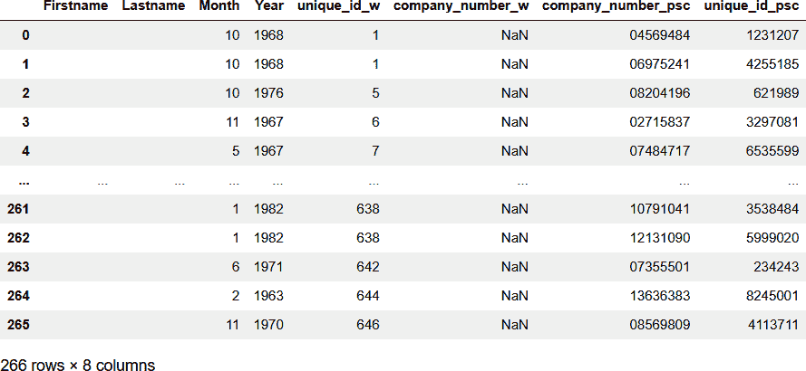

# 第五章。记录阻塞

在第四章中，我们介绍了概率匹配技术，以允许我们将单个属性上的确切等价性组合成加权的复合分数。该分数允许我们计算两个记录指向同一实体的总体概率。

到目前为止，我们只试图解决小规模数据集，其中我们可以逐个比较每条记录，以找到所有可能的匹配项。然而，在大多数实体解析场景中，我们将处理更大的数据集，这种方法并不实用或负担得起。

在本章中，我们将介绍记录阻塞以减少我们需要考虑的排列组合数量，同时最小化漏掉真正匹配的可能性。我们将利用上一章介绍的 Splink 框架，应用 Fellegi-Sunter 模型，并使用期望最大化算法来估计模型参数。

最后，我们将考虑如何测量我们在这个更大数据集上的匹配性能。

# 示例问题

在之前的章节中，我们考虑了解决包含有关英国下议院议员信息的两个数据集之间的实体的挑战。在本章中，我们将这一解决方案挑战扩展到一个包含注册英国公司的实质控制人列表的规模更大的数据集。

在英国，公司注册处是由商业和贸易部赞助的执行机构。它合并和解散有限公司，注册公司信息并向公众提供信息。

在注册英国有限公司时，有义务声明谁拥有或控制公司。这些实体称为具有重大控制权的人（PSC）；他们有时被称为“受益所有人”。公司注册处提供一个可下载的数据快照，其中包含所有 PSC 的完整列表。

对于此练习，我们将尝试解决此数据集中列出的实体与我们从维基百科获取的国会议员名单。这将向我们展示哪些国会议员可能是英国公司的 PSC。

# 数据获取

在此示例中，我们将重复使用我们在之前章节中审查的 2019 年英国大选返回的相同维基百科来源数据。但是，为了允许我们与一个规模更大的数据集进行匹配，而不产生不可控制的假阳性，我们需要通过附加属性来丰富我们的初始数据。具体而言，我们将寻求使用从每个国会议员关联的个人维基页面中提取的出生日期信息来增强我们的数据集，以帮助增强我们匹配的质量。

我们还将下载由公司注册处发布的最新 PSC 数据快照，然后将该数据集归一化并过滤到我们匹配所需的属性。

## 维基百科数据

为了创建我们增强的维基百科数据集，我们从维基页面中选择了 MPs，就像我们在 第二章 中所做的那样；但是，这次我们还提取了每个个人 MP 的维基百科链接，并将其作为我们 DataFrame 中的额外列追加。

```py
url = "https://en.wikipedia.org/wiki/
       List_of_MPs_elected_in_the_2019_United_Kingdom_general_election"

website_page = requests.get(url).textsoup = 
    BeautifulSoup(website_page,'html.parser')
tables = soup.find_all('table')

for table in tables:
   if 'Member returned' in table.text:
      headers = [header.text.strip() for header in table.find_all('th')]
      headers = headers[:5]
      dfrows = []
      table_rows = table.find_all('tr')
      for row in table_rows:
         td = row.find_all('td')
         dfrow = [row.text for row in td if row.text!='\n']
         tdlink = row.find_all("td", {"data-sort-value" : True})
         for element in tdlink:
             for link in element.select("a[title]"):
                 urltail = link['href']
                 url = f'https://en.wikipedia.org{urltail}' 
      dfrow.append(url)
      dfrows.append(dfrow)
   headers.append('Wikilink')
df_w = pd.DataFrame()
```

现在我们可以跟随这些链接，并从网页信息框中提取出生日期信息（如果有的话）。与之前一样，我们可以使用 Beautiful Soup `html parser`来查找并提取我们需要的属性，或者返回一个默认的空值。`apply` 方法允许我们将此函数应用于维基百科数据集中的每一行，创建一个名为 `Birthday` 的新列：

```py
def get_bday(url):
   wiki_page = requests.get(url).text
   soup = BeautifulSoup(wiki_page,'html.parser')
   bday = ''
   bdayelement = soup.select_one("span[class='bday']")
   if bdayelement is not None:
      bday = bdayelement.text
      return(bday)

df_w['Birthday'] = df_w.apply(lambda x: get_bday(x.Wikilink), axis=1)
```

## 英国公司注册处数据

公司注册处以 JSON 格式发布 PSC 数据的快照。这些数据既可以作为单个 ZIP 文件提供，也可以作为多个 ZIP 文件提供以便下载。依次提取每个部分的 ZIP 文件允许我们标准化 JSON 结构，将其拼接成一个复合 DataFrame，包括我们需要用于匹配的属性以及相关联的唯一公司编号：

```py
url = "http://download.companieshouse.gov.uk/en_pscdata.html"

>df_psctotal = pd.DataFrame()
with requests.Session() as req:
   r = req.get(url)
   soup = BeautifulSoup(r.content, 'html.parser')
   snapshots = [f"{url[:38]}{item['href']}" for item in soup.select(
      "a[href*='psc-snapshot']")]
   for snapshot in snapshots:
      print(snapshot)
      response = requests.get(snapshot).content zipsnapshot =
         zipfile.ZipFile(io.BytesIO(response))
      tempfile = zipsnapshot.extract(zipsnapshot.namelist()[0])
      df_psc = pd.json_normalize(pd.Series(open(tempfile,
         encoding="utf8").readlines()).apply(json.loads))

      must_cols =  ['company_number',
                    'data.name_elements.surname',
                    'data.name_elements.middle_name',
                    'data.name_elements.forename',
                    'data.date_of_birth.month',
                    'data.date_of_birth.year',
                    'data.name_elements.title',
                    'data.nationality']  
       all_cols =list(set(df_psc.columns).union(must_cols))

>      df_psc=df_psc.reindex(columns=sorted(all_cols))
      df_psc = df_psc.dropna(subset=['company_number',
                    'data.name_elements.surname',
                    'data.name_elements.forename',
                    'data.date_of_birth.month',
                    'data.date_of_birth.year'])
      df_psc = df_psc[must_cols]
      df_psctotal = pd.concat([df_psctotal, df_psc],
         ignore_index=True)
```

# 数据标准化

现在我们拥有了所需的原始数据，我们标准化了两个数据集的属性和列名。由于我们将使用 Splink 框架，我们还添加了一个唯一的 ID 列。

## 维基百科数据

为了标准化日期增强的维基百科数据，我们将日期列转换为月份和年份的整数。如同 第二章 中所述，我们提取 `Firstname` 和 `Lastname` 属性。我们还添加了一个唯一的 ID 列和一个空的公司编号列，以匹配公司注册处数据中的相应字段。最后，我们保留我们需要的列：

```py
df_w = df_w.dropna()
df_w['Year'] =
   pd.to_datetime(df_w['Birthday']).dt.year.astype('int64')
df_w['Month'] =
   pd.to_datetime(df_w['Birthday']).dt.month.astype('int64')

df_w = df_w.rename(columns={ 'Member returned' : 'Fullname'})
df_w['Fullname'] = df_w['Fullname'].str.rstrip("\n")
df_w['Fullname'] = df_w['Fullname'].str.lstrip("\n")
df_w['Firstname'] = df_w['Fullname'].str.split().str[0]
df_w['Lastname'] = df_w['Fullname'].astype(str).apply(lambda x:
   ' '.join(x.split()[1:]))

df_w['unique_id'] = df_w.index
df_w["company_number"] = np.nan

df_w=df_w[['Firstname','Lastname','Month','Year','unique_id',
   'company_number']]
```

## 英国公司注册处数据

为了标准化英国公司注册处数据，我们首先删除了任何缺少出生年月日列的行，因为我们无法匹配这些记录。与维基百科数据一样，我们标准化列名，生成唯一 ID，并保留匹配的子集：

```py
df_psc = df_psc.dropna(subset=['data.date_of_birth.year',
                                'data.date_of_birth.month'])

df_psc['Year'] = df_psc['data.date_of_birth.year'].astype('int64')
df_psc['Month'] = df_psc['data.date_of_birth.month'].astype('int64')
df_psc['Firstname']=df_psc['data.name_elements.forename']
df_psc['Lastname']=df_psc['data.name_elements.surname']
df_psc['unique_id'] = df_psc.index

df_psc = df_psc[['Lastname','Firstname','company_number',
   'Year','Month','unique_id']]
```

让我们来看看几行（其中 `Firstname` 和 `Lastname` 已经过清理），如 图 5-1 所示。


###### 图 5-1\. 英国公司注册处具有重要控制人数据的示例行

# 记录阻塞和属性比较

现在我们有了一致的数据，可以配置我们的匹配过程。在我们开始之前，值得一提的是挑战的规模。我们有 650 个 MP 记录，而我们标准化后的 PSC 数据超过 1000 万条记录。如果我们考虑所有的排列组合，我们将有大约 60 亿次比较要进行。

通过在具有匹配 `Month` 和 `Year` 值的记录上执行简单的连接，我们可以看到交集的大小约为 1100 万条记录：

```py
df_mp = df_w.merge(df_psc, on=['Year','Month'],
    suffixes=('_w','_psc'))

len(df_mp)
11135080
```

对所有四个属性进行简单的精确匹配，我们得到了 266 个潜在的匹配项：

```py
df_result = df_w.merge(df_psc, on= ['Lastname','Firstname','Year','Month'], 
    suffixes=('_w', '_psc'))

df_result
```

这些简单连接匹配的经过清理的样本如 图 5-2 所示。



###### 图 5-2\. 简单地根据 `Lastname`、`Firstname`、`Year` 和 `Month` 进行连接

## 使用 Splink 进行记录阻塞

为了减少需要考虑的记录组合数量，Splink 允许我们配置阻塞规则。这些规则确定了哪些记录对在评估是否引用同一实体时进行比较。显然，仅考虑人口的一个子集会导致错过真实匹配的风险，因此选择能够最小化这一风险并尽可能减少数量的规则非常重要。

Splink 允许我们创建组合规则，实质上是`OR`语句，如果满足任何条件，则选择组合进行进一步比较。但在本例中，我们将仅使用一个选择仅具有匹配的年份和月份记录的单个阻塞规则：

```py
from splink.duckdb.linker import DuckDBLinker
from splink.duckdb import comparison_library as cl
settings = {
   "link_type": "link_only",
   "blocking_rules_to_generate_predictions":
      ["l.Year = r.Year and l.Month = r.Month"],
   "comparisons": [
      cl.jaro_winkler_at_thresholds("Firstname", [0.9]),
      cl.jaro_winkler_at_thresholds("Lastname", [0.9]),
      cl.exact_match("Month"),
      cl.exact_match("Year", term_frequency_adjustments=True),
      ],
    "additional_columns_to_retain": ["company_number"]
}
```

## 属性比较

对于由阻塞规则产生的记录比较，我们将使用近似匹配分数的组合来确定它们是否指向同一人，其中包括名字和姓氏的近似匹配以及月份和年份的精确匹配。因为我们在比较名字，所以使用了来自第三章的 Jaro-Winkler 算法。

我们可以配置 Splink 的一组最小阈值值，这些值共同分割人群；Splink 将为那些得分低于提供的最小值的属性对添加一个精确匹配段和一个默认的零匹配段。在这种情况下，我们将仅使用一个阈值 0.9 来说明这个过程，为每个名称组件给出三个段。每个段被视为单独的属性，用于计算记录对的整体匹配概率。

现在我们已经完成了设置，让我们实例化我们的链接器并配置匹配的列：

```py
linker = DuckDBLinker([df_w, df_psc], settings,
   input_table_aliases = ["df_w", "df_psc"])
linker.profile_columns(["Firstname","Lastname","Month","Year"],
   top_n=10, bottom_n=5)
```

您可以在图 5-3 中看到结果。


###### 图 5-3. 名字、姓氏、月份和年份分布

我们可以看到，我们有一些常见的名字和姓氏，还有一些不太常见的数值。出生月份的值分布相对均匀，但年份则有些年份比其他年份更常见。在我们的匹配过程中，可以通过设置以下内容考虑这种频率分布：

```py
term_frequency_adjustments=True
```

每个年份值将单独考虑，用于计算匹配概率；因此，对于不太流行的年份匹配，将比对较常见的值匹配更高地加权。

正如我们在第四章中所做的那样，我们可以使用期望最大化算法来确定*m*和*u*值，即每个属性段的匹配和不匹配概率。默认情况下，这些计算考虑应用阻塞规则之前的整体人口。

为了估计*u*值，Splink 采取了略有不同的方法，通过随机选择成对记录的对比，假设它们不匹配，并计算这些巧合发生的频率。由于两个随机记录匹配（代表相同实体）的概率通常非常低，这种方法生成了*u*值的良好估计。这种方法的额外好处是，如果*u*概率正确，它会“锚定”EM 估计过程，并大大提高其收敛到全局最小值而不是局部最小值的机会。要应用这种方法，我们需要确保我们的随机人群足够大，以代表可能组合的全部范围：

```py
linker.estimate_u_using_random_sampling(max_pairs=1e7)
```

Splink 允许我们设置阻止规则以估计匹配概率。在这里，根据第一个条件在人群的子集上估计每个段的属性参数，然后重复第二个条件选择的子集。由于包含在阻止条件中的属性本身不能被估计，因此条件的重叠至关重要，允许每个属性至少在一个条件下进行评估。

# 随机样本

注意，期望最大化方法是随机选择记录的，因此如果您按照本书进行操作，可以预期计算参数与本书中的计算参数有所不同。

在本例中，我们在等效的姓和月份上进行阻止，允许我们估计名字和年份段的概率，然后我们以相反的组合重复此过程。这样每个属性段至少被评估一次：

```py
linker.estimate_parameters_using_expectation_maximisation
   ("l.Lastname = r.Lastname and l.Month = r.Month",
      fix_u_probabilities=False)
linker.estimate_parameters_using_expectation_maximisation
   ("l.Firstname = r.Firstname and l.Year = r.Year",
      fix_u_probabilities=False)
```

我们可以使用以下方法检查生成的匹配权重：

```py
linker.match_weights_chart()
```


###### 图 5-4\. 模型参数

在 图 5-4 中，我们可以看到强烈的负先验（起始）匹配权重，以及每个属性精确匹配和在 `Firstname` 和 `Lastname` 上近似匹配的正权重：

```py
linker.m_u_parameters_chart()
```

在 图 5-5 中，我们可以看到期望最大化算法为每个段计算的匹配和非匹配记录比例。


###### 图 5-5\. 记录比例

# 匹配分类

现在我们已经有了针对每个属性优化的匹配参数的训练模型，我们可以预测未被阻止的记录对是否指向相同的实体。在本示例中，我们将总体阈值匹配概率设置为 0.99：

```py
results = linker.predict(threshold_match_probability=0.99)
pres = results.as_pandas_dataframe()
```

然后我们根据唯一标识将预测结果与 PSC 数据集连接起来，以便可以获取与匹配实体关联的公司编号。

然后我们重新命名输出列，并仅保留我们需要的列：

```py
pres = pres.rename(columns={"Firstname_l": "Firstname_psc",
                             "Lastname_l": "Lastname_psc",
                             "Firstname_r":"Firstname_w",
                             "Lastname_r":"Lastname_w",
                             "company_number_l":"company_number"})
pres = pres[['match_weight','match_probability',
             'Firstname_psc','Firstname_w',
             'Lastname_psc','Lastname_w','company_number']]
```

这给我们提供了 346 个预测匹配，精确和近似匹配，如 图 5-6 中所示（PSC 的名字和姓已经过处理）。


###### 图 5-6\. `Lastname` 和 `Firstname` 的精确匹配

如果我们移除精确匹配，我们可以检查额外的近似匹配，看看我们的概率方法执行得有多好。这在 图 5-7 中展示（PSC 的名字和姓氏已经过清理）：

```py
pres[(pres['Lastname_psc']!=pres['Lastname_w']) |
      (pres['Firstname_psc']!=pres['Firstname_w'])]
```


###### 图 5-7\. 近似匹配 — 非精确的`Firstname`或`Lastname`

检查结果，如表 5-1 所示，我们可以看到几位可能是真正的正向匹配的候选人。

表 5-1\. 近似匹配 — 手动比较

| `match_weight` | `match_probability` | `Firstname_psc` | `Firstname_w` | `Lastname_psc` | `Lastname_w` | `company_​num⁠ber` |
| --- | --- | --- | --- | --- | --- | --- |
| 13.51481459 | 0.999914572 | John | John | Mcdonnell | McDonnell | 5350064 |
| 11.66885836 | 0.999692963 | Stephen | Stephen | Mcpartland | McPartland | 7572556 |
| 11.50728191 | 0.999656589 | James | James | Heappey Mp | Heappey | 5074477 |
| 9.637598832 | 0.998746141 | Matt | Matthew | Hancock | Hancock | 14571407 |
| 13.51481459 | 0.999914572 | John | John | Mcdonnell | McDonnell | 4662034 |
| 9.320995827 | 0.998438931 | Siobhan | Siobhan | Mcdonagh | McDonagh | 246884 |
| 11.46050878 | 0.999645277 | Alison | Alison | Mcgovern | McGovern | 10929919 |
| 9.57364719 | 0.998689384 | Jessica | Jess | Phillips | Phillips | 560074 |
| 12.14926274 | 0.999779904 | Grahame | Grahame | Morris Mp | Morris | 13523499 |
| 11.66885836 | 0.999692963 | Stephen | Stephen | Mcpartland | McPartland | 9165947 |
| 13.51481459 | 0.999914572 | John | John | Mcdonnell | McDonnell | 6496912 |
| 11.62463457 | 0.999683409 | Anna | Anna | Mcmorrin | McMorrin | 9965110 |

尽管我们最初进行了数据标准化，但我们可以看到姓氏的大写不一致，而且我们还有几个 PSC 记录的姓氏末尾附加了“Mp.” 这在实体解析问题中经常出现——我们经常需要多次迭代，随着对数据集了解的增加，不断完善我们的数据标准化。

# 测量性能

如果我们假设所有在表 5-1 中的精确匹配和近似匹配都是真正的正向匹配，那么我们可以计算我们的精度指标如下：

<math alttext="upper T r u e p o s i t i v e m a t c h e s left-parenthesis upper F upper P right-parenthesis equals 266 plus 12 equals 278"><mrow><mi>T</mi> <mi>r</mi> <mi>u</mi> <mi>e</mi> <mi>p</mi> <mi>o</mi> <mi>s</mi> <mi>i</mi> <mi>t</mi> <mi>i</mi> <mi>v</mi> <mi>e</mi> <mi>m</mi> <mi>a</mi> <mi>t</mi> <mi>c</mi> <mi>h</mi> <mi>e</mi> <mi>s</mi> <mo>(</mo> <mi>F</mi> <mi>P</mi> <mo>)</mo> <mo>=</mo> <mn>266</mn> <mo>+</mo> <mn>12</mn> <mo>=</mo> <mn>278</mn></mrow></math>

<math alttext="upper F a l s e p o s i t i v e m a t c h e s left-parenthesis upper F upper P right-parenthesis equals 80 minus 12 equals 68"><mrow><mi>F</mi> <mi>a</mi> <mi>l</mi> <mi>s</mi> <mi>e</mi> <mi>p</mi> <mi>o</mi> <mi>s</mi> <mi>i</mi> <mi>t</mi> <mi>i</mi> <mi>v</mi> <mi>e</mi> <mi>m</mi> <mi>a</mi> <mi>t</mi> <mi>c</mi> <mi>h</mi> <mi>e</mi> <mi>s</mi> <mo>(</mo> <mi>F</mi> <mi>P</mi> <mo>)</mo> <mo>=</mo> <mn>80</mn> <mo>-</mo> <mn>12</mn> <mo>=</mo> <mn>68</mn></mrow></math>

<math alttext="upper P r e c i s i o n equals StartFraction upper T upper P Over left-parenthesis upper T upper P plus upper F upper P right-parenthesis EndFraction equals StartFraction 278 Over left-parenthesis 278 plus 68 right-parenthesis EndFraction almost-equals 80 percent-sign"><mrow><mi>P</mi> <mi>r</mi> <mi>e</mi> <mi>c</mi> <mi>i</mi> <mi>s</mi> <mi>i</mi> <mi>o</mi> <mi>n</mi> <mo>=</mo> <mfrac><mrow><mi>T</mi><mi>P</mi></mrow> <mrow><mo>(</mo><mi>T</mi><mi>P</mi><mo>+</mo><mi>F</mi><mi>P</mi><mo>)</mo></mrow></mfrac> <mo>=</mo> <mfrac><mn>278</mn> <mrow><mo>(</mo><mn>278</mn><mo>+</mo><mn>68</mn><mo>)</mo></mrow></mfrac> <mo>≈</mo> <mn>80</mn> <mo>%</mo></mrow></math>

没有手动验证，我们无法确定我们的`notmatch`人群中哪些是真正的假阴性，因此我们无法计算召回率或整体准确度指标。

# 总结

在本章中，我们使用概率框架内的近似匹配来识别可能对英国公司具有重大控制权的国会议员。

我们看到如何使用阻塞技术来减少我们需要评估的记录对数量，使其保持在一个实际的范围内，同时又不会太大幅度地增加我们错过重要潜在匹配的风险。

我们看到数据标准化对优化性能的重要性，以及在实体解析中获得最佳性能通常是一个迭代的过程。
