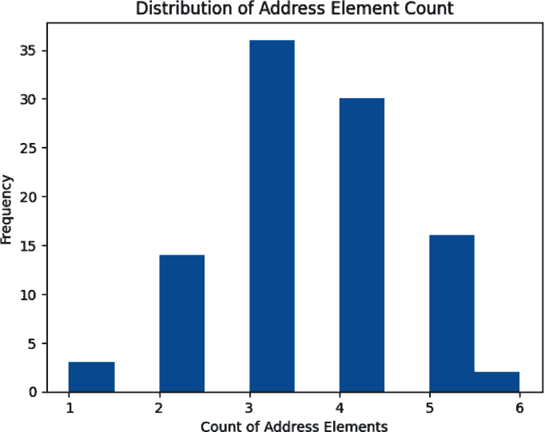
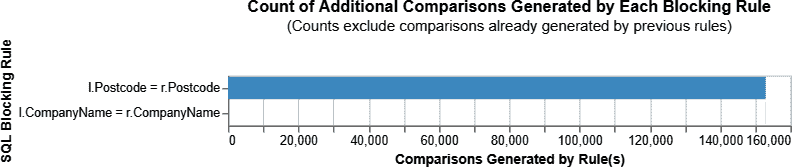
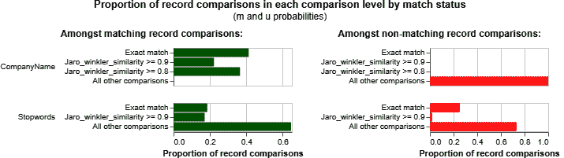
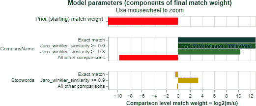
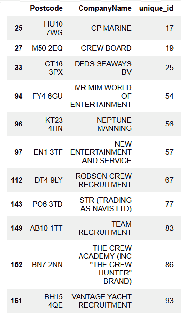
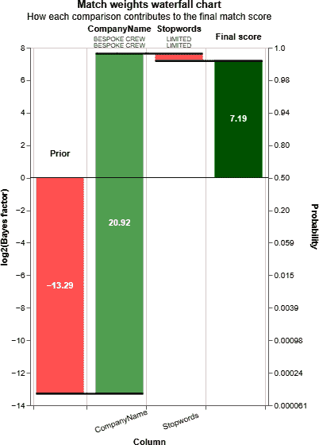
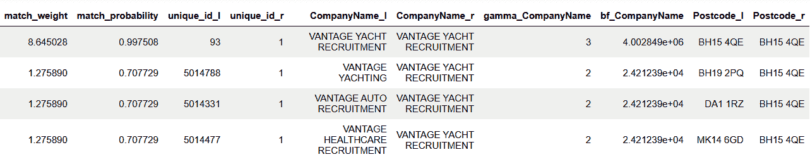

# 第六章. 公司匹配

在第五章中，我们讨论了解决更大规模的个体实体集合的挑战，匹配名称和出生日期。在本章中，我们考虑另一种典型情景，解决组织实体，以便能够更全面地了解其业务。

或许我们可以使用组织成立日期作为区分因子，类似于我们使用出生日期帮助识别唯一个体的方式。然而，公司的这一成立日期信息通常不包括在组织数据集中；更常见的是公司通过其注册地址来进行识别。

因此，在本章中，我们将使用公司地址信息以及公司名称来识别可能的匹配项。然后，我们将考虑如何评估新记录与原始数据源的匹配情况，而无需进行耗时的模型重新训练。

# 样本问题

在本章中，我们将解析由英国海事及海岸警卫局（MCA）发布的公司名称列表，与公司注册处发布的基本组织详情进行匹配。这个问题展示了仅基于名称和地址数据识别同一公司唯一引用的一些挑战。

英国公司注册处提供了一个免费可下载的数据快照，包含注册公司的基本公司数据。这些数据是我们在第五章中使用的“有重大控制权的人”数据的补充。

MCA 发布了根据 2006 年《海事劳工公约》1.4 条款批准的招聘和安置机构名单。^(1)

# 数据获取

为了获取数据集，我们使用了与第五章相同的方法。MCA 数据以单个逗号分隔值（CSV）文件的形式发布，下载并将其载入 DataFrame。公司注册处快照数据以 ZIP 文件形式下载，解压后的 JSON 结构再解析为 DataFrame。然后移除不需要的列，并将快照 DataFrame 串联成一个单一的复合 DataFrame。两个原始数据集都以 CSV 文件的形式存储在本地，以便于重新加载。

代码可以在[GitHub 存储库](https://github.com/mshearer0/HandsOnEntityResolution)中的*Chapter6.ipynb*文件中找到。

# 数据标准化

为了将 MCA 公司列表与公司注册处的组织数据集进行匹配，我们需要将名称和地址数据标准化为相同的格式。我们已经看到了如何清理名称。然而，地址则更具挑战性。即使在来自同一来源的合理一致数据中，我们经常看到地址格式和内容上有相当大的变化。

例如，考虑 MCA 列表中的前三条记录，如表 6-1 所示。

表 6-1. MCA 样本地址

| 地址属性 |
| --- |
| 48 Charlotte Street, London, W1T 2NS |
| 苏格兰格拉斯哥乔治街 105 号四楼，邮编 G2 1PB |
| 英国爱丁堡 Beaverbank 商业园区 16 号单元，邮编 EH7 4HG |

第一个地址由三个逗号分隔的元素组成，第二个记录由四个元素组成，第三个再次由两个元素组成。在每种情况下，邮政编码都包含在最后一个元素中，但在第三个记录中，它与地址本身的一部分分组在一起。建筑编号出现在第一个元素或第二个元素中。

要查看 MCA 名单中地址元素数量的直方图分布，可以使用：

```py
import matplotlib.pyplot as plt
plt.hist(df_m.apply(lambda row: len(row['ADDRESS & CONTACT
   DETAILS'].split(',')), axis=1).tolist())
```

这使我们得到了图表 6-1 中呈现的分布图。



###### 图表 6-1\. MCA 地址元素计数

这种一致性不足使得将地址一致地解析为用于匹配的相同离散元素变得非常困难。因此，对于本例，我们将仅使用精确的邮政编码匹配来比较地址。更高级的解析和匹配技术，如自然语言处理和地理编码，在第十一章中进行了讨论。

## 公司注册数据

在许多司法管辖区，公司需要在其名称末尾声明其组织形式，例如，如果它们作为有限责任公司成立，则添加“有限公司”或“Ltd”。这些可变后缀可能并不总是存在，因此标准化具有挑战性。

为确保不匹配不会对匹配过程造成不必要的负面干扰，建议在标准化过程中将这些低价值术语与名称记录分开。这将消除由于后缀格式不一致而错过潜在匹配的机会，但也有可能会声明出现错误匹配，例如，公众有限公司与名称相似的有限公司之间。

除了删除公司名称中不区分公司并且其包含会使我们的名称匹配过于相似的常见术语外，还可以删除并入后缀。

尽管我们选择从公司名称属性中删除这些术语或*停用词*，它们仍包含一些在决定声明匹配时可能有用的价值。

以下辅助函数剥离这些停用词，返回清洗后的公司名称和已移除的术语：

```py
def strip_stopwords(raw_name):
   company_stopwords = { 'LIMITED', 'LTD', 'SERVICES', 'COMPANY',
      'GROUP', 'PROPERTIES', 'CONSULTING', 'HOLDINGS', 'UK',
      'TRADING', 'LTD.', 'PLC','LLP' }
   name_without_stopwords = []
   stopwords = []
   for raw_name_part in raw_name.split():
      if raw_name_part in company_stopwords:
         stopwords.append(raw_name_part)
      else:
         name_without_stopwords.append(raw_name_part)
   return(' '.join(name_without_stopwords),
          ' '.join(stopwords))
```

我们可以使用以下方法将此函数应用于公司注册数据：

```py
df_c[['CompanyName','Stopwords']] =  pd.DataFrame(
   zip(*df_c['CompanyName'].apply(strip_stopwords))).T
```

`*` 运算符解压了由辅助函数返回的元组序列（包含 `CompanyName` 和 `Stopwords`）。我们将这些值列表组装成一个两行的 DataFrame，然后将其转置为列，以便我们可以作为新属性添加。这种方法效率高，因为我们只需创建一个新的 DataFrame，而不是每行都创建一个。

因为我们已经有一个包含离散邮政编码的离散列，所以只需标准化列名即可：

```py
df_c = df_c.rename(columns={"RegAddress.PostCode": "Postcode"})
```

## 海事与海岸警卫局数据

要使 MCA 公司名称标准化，我们首先将名称转换为大写：

```py
df_m['CompanyName'] = df_m['COMPANY'].str.upper()
```

我们还会去除停用词，然后需要从地址字段提取邮政编码。一个方便的方法是使用*正则表达式*。

# 正则表达式

正则表达式是一系列字符的序列，用于指定文本中的匹配模式。通常这些模式由字符串搜索算法用于字符串的“查找”或“查找和替换”操作，或者用于输入验证。

英国的邮政编码由两部分组成。第一部分由一个或两个大写字母，后跟一个数字，然后是一个数字或一个大写字母。在一个空格后，第二部分以一个数字开头，后跟两个大写字母（不包括 CIKMOV）。这可以编码为：

```py
r'([A-Z]{1,2}[0-9][A-Z0-9]? [0-9][ABD-HJLNP-UW-Z]{2})'
```

我们可以构建一个辅助函数来查找、提取和返回字符匹配模式，如果找不到则返回空值：

```py
import re
def extract_postcode(address):
   pattern = re.compile(r'([A-Z]{1,2}[0-9][A-Z0-9]?
      [0-9][ABD-HJLNP-UW-Z]{2})')
   postcode = pattern.search(address)
   if(postcode is not None):
   return postcode.group()
      else:
   return None
```

就像以前一样，我们可以将此函数应用于每一行：

```py
df_m['Postcode'] = df_m.apply(lambda row:
   extract_postcode(row['ADDRESS & CONTACT DETAILS']), axis=1)
```

# 记录阻塞和属性比较

与前一章一样，我们将使用 Splink 工具执行匹配过程。让我们考虑一下可以执行此操作的设置。

首先，我们可以期望具有相同邮政编码的组织成为合理的匹配候选者，同样地，那些名字完全相同的组织也是如此。我们可以将这些条件作为我们的阻塞规则，只有在满足其中任一条件时才计算预测：

```py
 "blocking_rules_to_generate_predictions":
   ["l.Postcode = r.Postcode",
    "l.CompanyName = r.CompanyName", ],
```

Splink 为我们提供了一个便捷的可视化工具，用来查看将通过阻塞规则的记录对的数量。正如预期的那样，有大量的邮政编码匹配，但几乎没有完全相同的名称匹配，如图 6-2 所示。

```py
linker.cumulative_num_comparisons_from_blocking_rules_chart()
```



###### 图 6-2\. 阻塞规则比较

在潜在组合的子集中，我们评估所选的`CompanyName`条目在四个段落中的相似性：

+   精确匹配

+   Jaro-Winkler 得分大于 0.9

+   Jaro-Winkler 得分在 0.8 到 0.9 之间

+   Jaro-Winkler 得分小于 0.8

我们还以类似的方式评估停用词。

对应的 Splink 设置为：

```py
"comparisons": [
   cl.jaro_winkler_at_thresholds("CompanyName", [0.9,0.8]),
   cl.jaro_winkler_at_thresholds("Stopwords",[0.9]),
], 
```

当然，那些通过阻塞规则作为完全相同名称等同物的配对将被评估为完全匹配，而仅具有邮政编码匹配的配对则将被评估为精确和近似名称匹配的候选者。

在应用阻塞规则并计算我们的匹配概率之前，我们需要训练我们的模型。两个数据框的笛卡尔积有超过 5 亿个成对组合，因此我们使用随机抽样在 5000 万个目标行上训练*u*值，以获得合理的样本：

```py
linker.estimate_u_using_random_sampling(max_pairs=5e7)
```

如同第五章中所述，我们使用期望最大化算法来估计*m*值。在这里，我们仅根据匹配的邮政编码进行阻塞，因为姓名匹配的微小相对比例对参数估计没有好处：

```py
linker.estimate_parameters_using_expectation_maximisation(
   "l.Postcode = r.Postcode")
```

我们可以使用以下方法显示训练模型在每个段落中观察到的记录比例：

```py
linker.match_weights_chart()
```

记录比较图表，见图 6-3，显示了匹配和不匹配记录之间`CompanyName`相似性的明显差异。对于停用词，仅在相似度阈值大于或等于 0.9 时，近似匹配记录之间才有显著差异，而不是精确匹配。



###### 图 6-3\. 记录比较比例

如预期的那样，参数图（如图 6-4 所示）显示精确和近似的`CompanyName`匹配具有较强的匹配权重：

```py
linker.m_u_parameters_chart()
```



###### 图 6-4\. 模型参数

# 匹配分类

在这个例子中，我们期望在公司注册局的数据集中为每个 MCA 组织找到一个匹配项，因此我们将匹配阈值设置得很低，为 0.05，以确保尽可能多地显示潜在的匹配项：

```py
df_pred = linker.predict(threshold_match_probability=0.05)
   .as_pandas_dataframe()
```

要识别我们未能找到至少一个匹配项的 MCA 实体，我们可以通过`unique_id`将我们的预测与 MCA 数据集合并，然后选择那些匹配权重为空的结果：

```py
results = df_m.merge(df_pred,left_on=['unique_id'], right_on=
   ['unique_id_r'],how='left', suffixes=('_m', '_p'))
results[results['match_weight'].isnull()]
```

正如图 6-5 所示，这产生了 11 条我们找不到任何匹配项的记录。



###### 图 6-5\. 未匹配的记录

在撰写时，通过对公司注册局的手动搜索，我们发现这 11 个实体中有 7 个有候选匹配项，但这些候选项没有精确匹配的邮政编码或名称，因此被我们的阻塞规则过滤掉了。其中两个实体有具有精确匹配邮政编码但名称显著不同的候选项，因此低于我们的近似相似度阈值。最后，剩下的两个候选项已经解散，因此不包括在我们的实时公司快照中。

检查预测匹配项及其对总体匹配得分的贡献的方便方法是绘制匹配权重瀑布图：

```py
linker.waterfall_chart(df_pred.to_dict(orient="records"))
```

在图 6-6 的示例中，我们可以看到先前的匹配权重，这是两个随机选择的记录指向同一实体的可能性的度量，为-13.29。从这个起点开始，当我们发现`CompanyName`“Bespoke Crew”的精确匹配时，我们添加了 20.92 的匹配权重。这代表了在`match`人口中找到`CompanyName`精确等价性的概率大于在`notmatch`人口中找到的概率。



###### 图 6-6\. 匹配权重瀑布图

然而，由于“Limited”上的精确匹配更有可能发生在`notmatch`中而不是`match`中，因此我们还需要减去 0.45。这使我们得到了一个最终匹配权重为 7.19，这相当于几乎是 1.0 的概率。

# 测量表现

标准化后，MCA 数据有 96 个组织。

在 0.05 的匹配阈值下，我们的结果显示在表 6-2 中。

表 6-2\. MCA 匹配结果—低阈值

| **匹配阈值 = 0.05** | **匹配数量** | **匹配的唯一实体** |
| --- | --- | --- |
| 名称和邮政编码匹配 | 47 | 45 |
| 仅名称匹配 | 37 | 31 |
| 仅邮政编码匹配 | 116 | 27 |
| **总匹配数** | **200** | **85 (去重后)** |
| 未匹配 |   | 11 (其中 2 个解散) |
| **总组织数** |   | **96** |

如果我们假设去重后的唯一匹配是真正的正匹配，那么 11 个未匹配的实体中有 9 个是假阴性，2 个解散的实体是真阴性，那么我们可以评估我们的表现为：

<math alttext="upper T r u e p o s i t i v e m a t c h e s left-parenthesis upper T upper P right-parenthesis equals 85"><mrow><mi>T</mi> <mi>r</mi> <mi>u</mi> <mi>e</mi> <mi>p</mi> <mi>o</mi> <mi>s</mi> <mi>i</mi> <mi>t</mi> <mi>i</mi> <mi>v</mi> <mi>e</mi> <mi>m</mi> <mi>a</mi> <mi>t</mi> <mi>c</mi> <mi>h</mi> <mi>e</mi> <mi>s</mi> <mo>(</mo> <mi>T</mi> <mi>P</mi> <mo>)</mo> <mo>=</mo> <mn>85</mn></mrow></math>

<math alttext="upper F a l s e p o s i t i v e m a t c h e s left-parenthesis upper F upper P right-parenthesis equals 200 minus 85 equals 115"><mrow><mi>F</mi> <mi>a</mi> <mi>l</mi> <mi>s</mi> <mi>e</mi> <mi>p</mi> <mi>o</mi> <mi>s</mi> <mi>i</mi> <mi>t</mi> <mi>i</mi> <mi>v</mi> <mi>e</mi> <mi>m</mi> <mi>a</mi> <mi>t</mi> <mi>c</mi> <mi>h</mi> <mi>e</mi> <mi>s</mi> <mo>(</mo> <mi>F</mi> <mi>P</mi> <mo>)</mo> <mo>=</mo> <mn>200</mn> <mo>-</mo> <mn>85</mn> <mo>=</mo> <mn>115</mn></mrow></math>

<math alttext="upper F a l s e n e g a t i v e m a t c h e s left-parenthesis upper F upper N right-parenthesis equals 11 minus 2 equals 9"><mrow><mi>F</mi> <mi>a</mi> <mi>l</mi> <mi>s</mi> <mi>e</mi> <mi>n</mi> <mi>e</mi> <mi>g</mi> <mi>a</mi> <mi>t</mi> <mi>i</mi> <mi>v</mi> <mi>e</mi> <mi>m</mi> <mi>a</mi> <mi>t</mi> <mi>c</mi> <mi>h</mi> <mi>e</mi> <mi>s</mi> <mo>(</mo> <mi>F</mi> <mi>N</mi> <mo>)</mo> <mo>=</mo> <mn>11</mn> <mo>-</mo> <mn>2</mn> <mo>=</mo> <mn>9</mn></mrow></math>

<math alttext="upper T r u e n e g a t i v e s equals 2"><mrow><mi>T</mi> <mi>r</mi> <mi>u</mi> <mi>e</mi> <mi>n</mi> <mi>e</mi> <mi>g</mi> <mi>a</mi> <mi>t</mi> <mi>i</mi> <mi>v</mi> <mi>e</mi> <mi>s</mi> <mo>=</mo> <mn>2</mn></mrow></math>

<math alttext="upper P r e c i s i o n equals StartFraction upper T upper P Over left-parenthesis upper T upper P plus upper F upper P right-parenthesis EndFraction equals StartFraction 85 Over left-parenthesis 85 plus 115 right-parenthesis EndFraction almost-equals 42 percent-sign"><mrow><mi>P</mi> <mi>r</mi> <mi>e</mi> <mi>c</mi> <mi>i</mi> <mi>s</mi> <mi>i</mi> <mi>o</mi> <mi>n</mi> <mo>=</mo> <mfrac><mrow><mi>T</mi><mi>P</mi></mrow> <mrow><mo>(</mo><mi>T</mi><mi>P</mi><mo>+</mo><mi>F</mi><mi>P</mi><mo>)</mo></mrow></mfrac> <mo>=</mo> <mfrac><mn>85</mn> <mrow><mo>(</mo><mn>85</mn><mo>+</mo><mn>115</mn><mo>)</mo></mrow></mfrac> <mo>≈</mo> <mn>42</mn> <mo>%</mo></mrow></math>

<math alttext="upper R e c a l l equals StartFraction upper T upper P Over left-parenthesis upper T upper P plus upper F upper N right-parenthesis EndFraction equals StartFraction 85 Over left-parenthesis 85 plus 9 right-parenthesis EndFraction almost-equals 90 percent-sign"><mrow><mi>R</mi> <mi>e</mi> <mi>c</mi> <mi>a</mi> <mi>l</mi> <mi>l</mi> <mo>=</mo> <mfrac><mrow><mi>T</mi><mi>P</mi></mrow> <mrow><mo>(</mo><mi>T</mi><mi>P</mi><mo>+</mo><mi>F</mi><mi>N</mi><mo>)</mo></mrow></mfrac> <mo>=</mo> <mfrac><mn>85</mn> <mrow><mo>(</mo><mn>85</mn><mo>+</mo><mn>9</mn><mo>)</mo></mrow></mfrac> <mo>≈</mo> <mn>90</mn> <mo>%</mo></mrow></math>

<math alttext="upper A c c u r a c y equals StartFraction left-parenthesis upper T upper P plus upper T upper N right-parenthesis Over left-parenthesis upper T upper P plus upper T upper N plus upper F upper P plus upper F upper N right-parenthesis EndFraction equals StartFraction left-parenthesis 85 plus 2 right-parenthesis Over left-parenthesis 85 plus 2 plus 115 plus 9 right-parenthesis EndFraction almost-equals 41 percent-sign"><mrow><mi>A</mi> <mi>c</mi> <mi>c</mi> <mi>u</mi> <mi>r</mi> <mi>a</mi> <mi>c</mi> <mi>y</mi> <mo>=</mo> <mfrac><mrow><mo>(</mo><mi>T</mi><mi>P</mi><mo>+</mo><mi>T</mi><mi>N</mi><mo>)</mo></mrow> <mrow><mo>(</mo><mi>T</mi><mi>P</mi><mo>+</mo><mi>T</mi><mi>N</mi><mo>+</mo><mi>F</mi><mi>P</mi><mo>+</mo><mi>F</mi><mi>N</mi><mo>)</mo></mrow></mfrac> <mo>=</mo> <mfrac><mrow><mo>(</mo><mn>85</mn><mo>+</mo><mn>2</mn><mo>)</mo></mrow> <mrow><mo>(</mo><mn>85</mn><mo>+</mo><mn>2</mn><mo>+</mo><mn>115</mn><mo>+</mo><mn>9</mn><mo>)</mo></mrow></mfrac> <mo>≈</mo> <mn>41</mn> <mo>%</mo></mrow></math>

在阈值为 0.9 时重新计算我们的预测将删除仅有邮政编码匹配的结果，给出了表格 6-3 中显示的结果。

表格 6-3\. MCA 匹配结果—高阈值

| **匹配阈值 = 0.9** | **匹配数量** | **唯一匹配的实体** |
| --- | --- | --- |
| 名称和邮政编码匹配 | 47 | 45 |
| 仅名称匹配 | 37 | 31 |
| 仅邮政编码匹配 | 3 | 1 |
| **总匹配数** | **87** | **73 (去重后)** |
| 未匹配 |   | 23 (其中 2 个解散) |
| **总组织数** |   | **96** |

<math alttext="upper T r u e p o s i t i v e m a t c h e s left-parenthesis upper T upper P right-parenthesis equals 73"><mrow><mi>T</mi> <mi>r</mi> <mi>u</mi> <mi>e</mi> <mi>p</mi> <mi>o</mi> <mi>s</mi> <mi>i</mi> <mi>t</mi> <mi>i</mi> <mi>v</mi> <mi>e</mi> <mi>m</mi> <mi>a</mi> <mi>t</mi> <mi>c</mi> <mi>h</mi> <mi>e</mi> <mi>s</mi> <mo>(</mo> <mi>T</mi> <mi>P</mi> <mo>)</mo> <mo>=</mo> <mn>73</mn></mrow></math>

<math alttext="upper F a l s e p o s i t i v e m a t c h e s left-parenthesis upper F upper P right-parenthesis equals 87 minus 73 equals 14"><mrow><mi>F</mi> <mi>a</mi> <mi>l</mi> <mi>s</mi> <mi>e</mi> <mi>p</mi> <mi>o</mi> <mi>s</mi> <mi>i</mi> <mi>t</mi> <mi>i</mi> <mi>v</mi> <mi>e</mi> <mi>m</mi> <mi>a</mi> <mi>t</mi> <mi>c</mi> <mi>h</mi> <mi>e</mi> <mi>s</mi> <mo>(</mo> <mi>F</mi> <mi>P</mi> <mo>)</mo> <mo>=</mo> <mn>87</mn> <mo>-</mo> <mn>73</mn> <mo>=</mo> <mn>14</mn></mrow></math>

<math alttext="upper F a l s e n e g a t i v e m a t c h e s left-parenthesis upper F upper N right-parenthesis equals 23 minus 2 equals 21"><mrow><mi>F</mi> <mi>a</mi> <mi>l</mi> <mi>s</mi> <mi>e</mi> <mi>n</mi> <mi>e</mi> <mi>g</mi> <mi>a</mi> <mi>t</mi> <mi>i</mi> <mi>v</mi> <mi>e</mi> <mi>m</mi> <mi>a</mi> <mi>t</mi> <mi>c</mi> <mi>h</mi> <mi>e</mi> <mi>s</mi> <mo>(</mo> <mi>F</mi> <mi>N</mi> <mo>)</mo> <mo>=</mo> <mn>23</mn> <mo>-</mo> <mn>2</mn> <mo>=</mo> <mn>21</mn></mrow></math>

<math alttext="upper T r u e n e g a t i v e s equals 2"><mrow><mi>T</mi> <mi>r</mi> <mi>u</mi> <mi>e</mi> <mi>n</mi> <mi>e</mi> <mi>g</mi> <mi>a</mi> <mi>t</mi> <mi>i</mi> <mi>v</mi> <mi>e</mi> <mi>s</mi> <mo>=</mo> <mn>2</mn></mrow></math>

<math alttext="upper P r e c i s i o n equals StartFraction upper T upper P Over left-parenthesis upper T upper P plus upper F upper P right-parenthesis EndFraction equals StartFraction 73 Over left-parenthesis 73 plus 14 right-parenthesis EndFraction almost-equals 84 percent-sign"><mrow><mi>P</mi> <mi>r</mi> <mi>e</mi> <mi>c</mi> <mi>i</mi> <mi>s</mi> <mi>i</mi> <mi>o</mi> <mi>n</mi> <mo>=</mo> <mfrac><mrow><mi>T</mi><mi>P</mi></mrow> <mrow><mo>(</mo><mi>T</mi><mi>P</mi><mo>+</mo><mi>F</mi><mi>P</mi><mo>)</mo></mrow></mfrac> <mo>=</mo> <mfrac><mn>73</mn> <mrow><mo>(</mo><mn>73</mn><mo>+</mo><mn>14</mn><mo>)</mo></mrow></mfrac> <mo>≈</mo> <mn>84</mn> <mo>%</mo></mrow></math>

<math alttext="upper R e c a l l equals StartFraction upper T upper P Over left-parenthesis upper T upper P plus upper F upper N right-parenthesis EndFraction equals StartFraction 73 Over left-parenthesis 73 plus 21 right-parenthesis EndFraction almost-equals 78 percent-sign"><mrow><mi>R</mi> <mi>e</mi> <mi>c</mi> <mi>a</mi> <mi>l</mi> <mi>l</mi> <mo>=</mo> <mfrac><mrow><mi>T</mi><mi>P</mi></mrow> <mrow><mo>(</mo><mi>T</mi><mi>P</mi><mo>+</mo><mi>F</mi><mi>N</mi><mo>)</mo></mrow></mfrac> <mo>=</mo> <mfrac><mn>73</mn> <mrow><mo>(</mo><mn>73</mn><mo>+</mo><mn>21</mn><mo>)</mo></mrow></mfrac> <mo>≈</mo> <mn>78</mn> <mo>%</mo></mrow></math>

<math alttext="upper A c c u r a c y equals StartFraction left-parenthesis upper T upper P plus upper T upper N right-parenthesis Over left-parenthesis upper T upper P plus upper T upper N plus upper F upper P plus upper F upper N right-parenthesis EndFraction equals StartFraction left-parenthesis 73 plus 2 right-parenthesis Over left-parenthesis 73 plus 2 plus 14 plus 21 right-parenthesis EndFraction almost-equals 69 percent-sign"><mrow><mi>A</mi> <mi>c</mi> <mi>c</mi> <mi>u</mi> <mi>r</mi> <mi>a</mi> <mi>c</mi> <mi>y</mi> <mo>=</mo> <mfrac><mrow><mo>(</mo><mi>T</mi><mi>P</mi><mo>+</mo><mi>T</mi><mi>N</mi><mo>)</mo></mrow> <mrow><mo>(</mo><mi>T</mi><mi>P</mi><mo>+</mo><mi>T</mi><mi>N</mi><mo>+</mo><mi>F</mi><mi>P</mi><mo>+</mo><mi>F</mi><mi>N</mi><mo>)</mo></mrow></mfrac> <mo>=</mo> <mfrac><mrow><mo>(</mo><mn>73</mn><mo>+</mo><mn>2</mn><mo>)</mo></mrow> <mrow><mo>(</mo><mn>73</mn><mo>+</mo><mn>2</mn><mo>+</mo><mn>14</mn><mo>+</mo><mn>21</mn><mo>)</mo></mrow></mfrac> <mo>≈</mo> <mn>69</mn> <mo>%</mo></mrow></math>

因此，正如预期的那样，我们看到更高的匹配阈值将我们的精确度从 42%提高到 86%，但代价是几乎错过了两倍的潜在匹配（从 9 个假阴性增加到 21 个）。

调整实体解析解决方案需要一定的试错，调整阻塞规则、相似度阈值和整体匹配阈值，以找到最佳平衡点。这将大大依赖于您数据的特性以及对于未能识别潜在匹配的风险偏好。

# 匹配新实体

正如我们所见，模型训练并不是一个快速的过程。如果我们有一个新实体，比如说 MCA 列表中的新条目，我们想要与公司注册数据进行解决，Splink 提供了一种选择，可以对新记录与先前匹配的数据集进行匹配而无需重新训练。我们还可以利用此功能找出所有潜在匹配，而不受阻塞规则或匹配阈值的约束，以帮助我们理解为什么这些候选者没有被识别。例如，如果我们考虑未匹配人群中的最后一个实体：

```py
record = {
   'unique_id': 1,
   'Postcode': "BH15 4QE",
   'CompanyName':"VANTAGE YACHT RECRUITMENT",
   'Stopwords':""
}

df_new = linker.find_matches_to_new_records([record],
   match_weight_threshold=0).as_pandas_dataframe()
df_new.sort_values("match_weight", ascending=False)
```

这导致了一个候选匹配的完整列表，其中前四个具有最高的匹配概率，列在图 6-7 中。



###### 图 6-7\. 新潜在匹配

表格中的第一条目是 MCA 数据集中的原始记录。接下来的三条记录作为公司注册数据的候选匹配，由于没有精确的邮政编码或名称匹配，因此会被我们的阻塞规则排除。然而，第二条记录的名称有些相似，并且邮政编码也很接近，看起来是一个很好的潜在候选者。

# 总结

在本章中，我们使用名称和地址匹配的组合解决了两个数据集中公司实体的问题。我们从组织名称中去除了停用词，并采用正则表达式提取邮政编码进行比较。

我们采用了精确等价阻塞规则，然后根据姓名相似性在一定阈值以上计算我们的匹配概率。通过评估结果，我们发现在设置较低的匹配阈值以产生相对较多的误报之间进行权衡，以及使用较高阈值导致可能错过一些潜在有希望的匹配候选者之间存在着折衷。

本章还表明，即使采用阻塞技术，大规模实体解析也可能成为一项耗时且计算密集的任务。在接下来的章节中，我们将探讨如何利用云计算基础设施，将我们的匹配工作负载分布到多台机器上并行处理。

^(1) 根据 2006 年《海员劳工公约》（MLC 2006），规定航运公司需向寻求在非本国旗船只上工作的海员提供相关招聘和安置服务信息。
