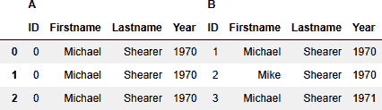

# 第七章：聚类

到目前为止，我们考虑了两个独立数据源之间的实体解析：一个定义了要匹配的目标人群的较小的主数据集和一个规模更大的次要数据集。我们还假设主数据集中的实体仅出现一次，并且没有重复项。因此，我们没有试图将主数据集中的实体与彼此进行比较。

例如，在第五章中，我们根据公司注册处的记录解析了维基百科上列出的英国议员与英国公司的实际控制人。我们假设每位议员在维基百科列表中只出现一次，但他们可能对多家公司具有重大控制权，即，单个维基百科实体可以与多个实际控制人实体匹配。例如，维基百科上名为 Geoffrey Clifton-Brown 的议员很可能与控制公司的同名人士相同，其参考编号为 09199367。对参考编号为 02303726 和 13420433 的公司也同样适用。

我们可以将这些实体关系表示为一个简单的网络，其中类似命名的个人表示为 *节点*，它们之间的三对比较表示为 *边*，如图 7-1 所示。

请注意，我们没有评估 PSC 数据中的三个具名个体之间的成对等价性——我们只是试图识别与主要维基百科实体的链接。但在此过程中，我们通过关联得出结论，所有三个 PSC 条目很可能指的是同一个现实世界的个体。


###### 图 7-1\. 简单的个人匹配聚类

在实践中，我们经常面临着多个需要解析的数据源，以及单个源中的潜在重复项。为了生成一个实体的解析视图，我们需要收集所有成对匹配的记录，并将它们分组到一个单一的可唯一标识的参考下。

这个收集示例的过程称为 *聚类*。聚类过程不试图确定哪个示例（如果有的话）是正确的，而只是识别该集合作为一个离散的有界集合，其成员都具有相似的特征。

在本章中，我们将探讨如何利用基本的聚类技术根据成对比较将实体分组在一起。我们将重用我们在第五章中获得的实际控制人数据集，但首先，让我们将问题缩小到一个小规模，以便我们可以理解需要采取的步骤。

# 简单的精确匹配聚类

首先，让我们考虑一个简单的数据集，其中包含名、姓和出生年份，如表 7-1 所示。该表包含一个精确重复（ID 0 和 1）以及其他几个相似的记录。

表 7-1\. 简单聚类示例数据集

| **ID** | **名** | **姓** | **出生年份** |
| --- | --- | --- | --- |
| 0 | Michael | Shearer | 1970 |
| 1 | Michael | Shearer | 1970 |
| 2 | Mike | Shearer | 1970 |
| 3 | Michael | Shearer | 1971 |
| 4 | Michelle | Shearer | 1971 |
| 5 | Mike | Sheare | 1971 |

每个 ID 是否代表一个单独的实体，还是它们指的是同一个人？

根据我们拥有的有限信息，我们可以例如按照名字和姓氏的精确等价性进行分组，但不包括出生年份。

```py
table = [
    [0,'Michael','Shearer',1970],
    [1,'Michael','Shearer',1970],
    [2,'Mike','Shearer',1970],
    [3,'Michael','Shearer',1971],
    [4,'Michelle','Shearer',1971],
    [5,'Mike','Sheare',1971]]

clmns = ['ID','Firstname','Lastname','Year']
df_ms = pd.DataFrame(table, columns = clmns)

df_ms['cluster'] =
   df_ms.groupby(['Firstname','Lastname']).ngroup()
```

这样我们得到了四个群集。与 ID 0、1 和 3 关联的实体被分组在群集 0 中，因为它们具有完全相同的名称拼写，而 ID 2、4 和 5 具有唯一的拼写变体，因此分配了它们自己的个体群集，正如我们在图 7-2 中所见。


###### 图 7-2\. 简单精确匹配群集表格

# 近似匹配聚类

现在让我们考虑如果我们包括近似名称匹配会发生什么，就像在第三章介绍的那样。我们不能再简单地使用`groupby`函数来计算我们的群集，因此我们需要逐步完成比较步骤。这是一个有用的练习，用来说明在大数据集内部和跨数据集之间比较记录所面临的综合挑战。

我们的第一步是生成一个表格，其中包含所有可能的记录比较组合。我们希望将记录 ID 0 与每个其他记录进行比较，然后将记录 ID 1 与剩余记录进行比较，但不再重复与 ID 0 的比较（在成对比较中方向并不重要）。总共我们有 15 次比较：ID 0 对其同行有 5 次，ID 1 对其同行有 4 次，依此类推。

从我们的简单基础表格开始，我们可以使用我们在第三章介绍的 itertools 包生成一个 DataFrame，其中包含复合列 A 和 B，每个列包含从我们的简单表格中提取的要比较的属性列表：

```py
import itertools

df_combs = pd.DataFrame(list(itertools.combinations(table,2)),
   columns=['A','B'])
```

图 7-3 展示了 DataFrame 的前几行。


###### 图 7-3\. 复合匹配组合的示例行

接下来，我们需要创建多级索引列，以保存 A 和 B 标题下的各个属性值：

```py
clmnsA = pd.MultiIndex.from_arrays([['A']*len(clmns), clmns])
clmnsB = pd.MultiIndex.from_arrays([['B']*len(clmns), clmns])
```

现在我们可以分离属性并重新组合生成的列及其相关索引标签，形成单个 DataFrame：

```py
df_edges = pd.concat(
   [pd.DataFrame(df_combs['A'].values.tolist(),columns = clmnsA),
    pd.DataFrame(df_combs['B'].values.tolist(),columns = clmnsB)],
   axis=1)
```

首几行展开如图 7-4 所示。



###### 图 7-4\. 近似匹配组合的示例行

现在我们已经准备好进行成对评估的属性，我们可以使用在第三章介绍的 Jaro-Winkler 相似度函数大致比较 A 和 B 值之间的名字和姓氏。如果两者匹配，比如等价分数大于 0.9，那么我们声明它们整体匹配：

```py
import jellyfish as jf

def is_match(row):
   firstname_match = jf.jaro_winkler_similarity(row['A'] 
      ['Firstname'],row['B']['Firstname']) > 0.9
   lastname_match = jf.jaro_winkler_similarity(row['A']
      ['Lastname'], row['B']['Lastname']) > 0.9
   return firstname_match and lastname_match

df_edges['Match'] = df_edges.apply(is_match, axis=1)

df_edges
```

结果匹配列在图 7-5 中。我们可以看到记录 ID 0 在行 0 和 2 中与 ID 1 和 ID 3 完全匹配。在行 3 中，ID 0 和 ID 4 之间也宣布了一次匹配，因为“Michael”和“Michelle”之间有足够的相似性。请注意，行 6、7 和 12 还记录了 ID 0 以外的 ID 1、3 和 4 之间的直接匹配。

ID 2 也在行 11 中与 ID 5 匹配，“Shearer”和“Sheare”足够相似。


###### 图 7-5。近似匹配表

根据这些结果，我们可以手动识别两个聚类，第一个包括 ID 0、1、3 和 4，第二个包括 ID 2 和 5。

然而，我们现在面临一个问题。我们允许非精确匹配作为单一实体进行聚类。现在我们应该使用哪些属性值来描述这个解决的实体？对于第一个聚类，包括 ID 0、1、3 和 4，名字应该是“Michael”还是“Michelle”？ID 0、1 和 3 的名字是“Michael”，但 ID 4 的名字是“Michelle”。正确的出生年份是 1970 还是 1971？

对于第二个聚类，我们面临相同的出生年份困境，以及是否应该使用“Sheare”还是“Shearer”的问题——这一点不太清楚。选择最具代表性值的挑战，有时被称为*规范化*，是一个积极研究的领域，但超出了本书的范围。

即使在这个简单的例子中，我们也可以看到在将实体聚类在一起时需要考虑的许多挑战和权衡。首先，随着要进行聚类的记录数量增加，成对比较的数量增长非常迅速。对于一个 n 行的表格，有 n × (n–1)/2 种组合。如果包括近似匹配，那么产生的计算负担是显著的，可能需要大量时间来计算。其次，最具挑战性的是，在聚类中的个体实体具有不同的属性值时，如何确定一个单一的属性集来定义一个聚类。

现在我们已经介绍了一些与聚类相关的挑战，让我们回到 PSC 数据集，考虑一个更大规模的例子。

# 样本问题

回到我们在第五章中的例子，假设我们希望研究对英国公司的控制集中度，识别对几家公司有影响力的个人。为此，我们需要对 PSC 数据集中的所有匹配个人所有者实体进行聚类。此外，考虑到 PSC 条目的数据质量不一，我们要考虑将近似匹配纳入我们的计算中。

在我们的 PSC 数据集中约有 1150 万条记录，我们需要进行的总比较次数超过 66 万亿次。我们有大量工作要做！

## 数据采集

让我们从我们在第五章中下载的原始数据开始。在本章中，我们将使用更广泛的属性范围进行匹配：

```py
df_psc = pd.read_csv('psc_raw.csv',dtype=
   {'data.name_elements.surname':'string',
    'data.name_elements.forename':'string',
    'data.name_elements.middle_name':'string',
    'data.name_elements.title':'string',
    'data.nationality':'string'})
```

## 数据标准化

现在我们有了原始数据，下一步是标准化，并为简单起见重命名属性。我们还会删除任何缺少出生年份或月份的记录，因为我们将使用这些作为阻塞值来帮助减少我们需要进行的比较数量：

```py
df_psc = df_psc.dropna(subset
   ['data.date_of_birth.year','data.date_of_birth.month'])
df_psc['Year'] = df_psc['data.date_of_birth.year'].astype('int64')
df_psc['Month'] =
   df_psc['data.date_of_birth.month'].astype('int64')

df_psc = df_psc.rename(columns=
   {"data.name_elements.surname" : "Lastname",
    "data.name_elements.forename" : "Firstname",
    "data.name_elements.middle_name" : "Middlename",
    "data.name_elements.title" : "Title",
    "data.nationality" : "Nationality"})

df_psc = df_psc[['Lastname','Middlename','Firstname',
   'company_number','Year','Month','Title','Nationality']]
df_psc['unique_id'] = df_psc.index
```

# 记录阻塞和属性比较

与以前一样，我们使用 Splink 框架执行比较，对年、月和姓氏的精确等价性作为预测阻塞规则，即仅当年、月和姓氏字段之间存在精确匹配时才将记录与其他记录进行比较。显然，这是一种权衡，因为我们可能会错过一些具有姓氏不一致或拼写错误的匹配，例如。

请注意，对于这个单一来源示例，我们将 `link_type` 设置为 `dedupe_only` 而不是 `link_only`。Splink 支持 `dedupe_only`、`link_only` 和 `link_and_dedupe`。

我们还为 EM 算法指定了收敛容差，并设置了最大迭代次数（即使尚未达到收敛）：

```py
from splink.duckdb.linker import DuckDBLinker
from splink.duckdb import comparison_library as cl

settings = {
   "link_type": "dedupe_only",
   "blocking_rules_to_generate_predictions":
      [ "l.Year = r.Year and l.Month = r.Month and
          l.Lastname = r.Lastname" ],
   "comparisons":
      [ cl.jaro_winkler_at_thresholds("Firstname", [0.9]),
        cl.jaro_winkler_at_thresholds("Middlename", [0.9]),
        cl.exact_match("Lastname"),
        cl.exact_match("Title"),
        cl.exact_match("Nationality"),
        cl.exact_match("Month"),
        cl.exact_match("Year", term_frequency_adjustments=True), ],
   "retain_matching_columns": True,
   "retain_intermediate_calculation_columns": True,
   "max_iterations": 10,
   "em_convergence": 0.01,
   "additional_columns_to_retain": ["company_number"],
   }
linker = DuckDBLinker(df_psc, settings)
```

## 数据分析

和之前一样，查看我们比较属性的数据分布是很有用的：

```py
linker.profile_columns(["Firstname","Middlename","Lastname",
   "Title","Nationality","Month","Year"], top_n=10, bottom_n=5)
```

正如我们在图 7-6 中看到的，我们有着预期的名、中间名和姓的分布。在图 7-7 中，我们还可以看到头衔和国籍的分布偏向于少数常见值。图 7-8 显示，出生月份在一年中分布相对均匀，而出生年份在某种程度上偏向于 1980 年代。


###### 图 7-6\. 名字、中间名和姓氏分布


###### 图 7-7\. 头衔和国籍分布


###### 图 7-8\. 出生年月分布

## 期望最大化阻塞规则

鉴于潜在组合数量非常之高，我们需要尽可能严格地指定 EM 算法的阻塞规则，以便使流程能够在合理的时间内完成。

我们可以使用 `count_num_comparisons_from_blocking` 函数测试给定阻塞规则将生成的比较数量；例如：

```py
linker.count_num_comparisons_from_blocking_rule(
   "l.Lastname = r.Lastname and
    l.Month = r.Month and
    l.Title = r.Title and
    l.Nationality = r.Nationality")
```

请记住，每个属性比较级别必须通过阻塞规则（即不被阻塞）中的至少一个估计参数步骤，以便为该属性生成 *m* 和 *u* 值。

给出了几种属性阻塞规则组合的比较计数，在表 7-2 中。

表 7-2\. 阻塞规则比较计数

| 对 | 属性组合阻塞规则 | 比较计数 |
| --- | --- | --- |

| 1 | `l.Lastname = r.Lastname and` `l.Month = r.Month and`

`l.Title = r.Title and`

`l.Nationality = r.Nationality` | 7774 万 |

| `l.Firstname = r.Firstname and` `l.Year = r.Year and`

`l.Middlename = r.Middlename` | 6970 万 |

| 2 | `l.Lastname = r.Lastname and` `l.Middlename = r.Middlename` | 1199 万 |
| --- | --- | --- |

| `l.Firstname = r.Firstname and` `l.Month = r.Month and`

`l.Year = r.Year and`

`l.Title = r.Title and`

`l.Nationality = r.Nationality` | 281M |

我们可以看到，第一对阻塞规则需要评估大量的比较，而第二对规则允许对所有属性进行参数估计，但整体比较次数较少。

名字、中间名和姓氏等价是减少比较量最具歧视性的因素，其次是出生年份，月份的影响较小。由于国籍和头衔值的基数有限，它们并不特别有帮助，正如我们在图 7-6 中看到的那样。

我们可以使用这些阻塞规则：  

```py
linker.estimate_parameters_using_expectation_maximisation(
   "l.Lastname = r.Lastname and l.Middlename = r.Middlename",
      fix_u_probabilities=False)

linker.estimate_parameters_using_expectation_maximisation(
   "l.Firstname = r.Firstname and l.Month = r.Month and
    l.Year = r.Year and l.Title = r.Title and
    l.Nationality = r.Nationality",
      fix_u_probabilities=False)
```

# 计算时间

即使采用了这些更优化的阻塞规则，在大数据集上执行期望最大化算法可能需要一些时间，特别是如果在性能适中的机器上运行的话。

或者，如果您想跳过训练步骤，可以简单地加载预训练模型：

```py
linker.load_settings("Chapter7_Splink_Settings.json")
```

# 匹配分类与聚类

完成 EM 步骤（见第四章）后，我们就有了一个训练好的模型，用于评估我们单一数据集中记录对的相似性。请记住，这些对是通过预测阻塞规则选择的（在本例中是确切的姓氏、出生年份和月份）。预测匹配的阈值设置为 0.9：

```py
df_predict = linker.predict(threshold_match_probability=0.9)
```

在进行成对预测之后，Splink 提供了一个聚类函数，用于在匹配概率超过指定阈值的共享实体对中将它们分组在一起。请注意，聚类阈值应用于完整的成对组合集合，而不是超过 0.9 预测阈值的子集；即，所有比较中都未达到等价阈值的记录仍将出现在输出中，被分配到它们自己的群集中。

```py
clusters = linker.cluster_pairwise_predictions_at_threshold(
   df_predict, threshold_match_probability=0.9)
df_clusters = clusters.as_pandas_dataframe()

df_clusters.head(n=5)
```

记录的结果数据集，标记有其父类群，可以轻松转换为 DataFrame，其中的前几行（经过消除姓名和出生年月信息后）显示在图 7-9 中。


###### 图 7-9\. 示例行

然后，我们可以根据 `cluster_id` 将这些行分组，保留来自每个源记录的所有不同属性值列表。在我们的情况下，预测使用这些属性的确切等价作为我们的阻塞规则，我们不希望在姓氏、月份或年份上有任何变化。这给我们带来了大约 680 万个唯一的群集：

```py
df_cgroup =
   df_clusters.groupby(['cluster_id'], sort=False)
      [['company_number','Firstname','Title','Nationality','Lastname']]
         .agg(lambda x: list(set(x)))
            .reset_index() 
```

为了说明我们在一个群集中看到的属性变化，我们可以选择一些具有不同名字、头衔和国籍的群集子集。为了方便手动检查，我们限制自己仅检查包含确切六条记录的群集：

```py
df_cselect = df_cgroup[
   (df_cgroup['Firstname'].apply(len) > 1) &
   (df_cgroup['Title'].apply(len) > 1) &
   (df_cgroup['Nationality'].apply(len) > 1) &
   (df_cgroup['company_number'].apply(len) == 6)]

df_cselect.head(n=5)
```

在经过消除姓名和出生年月信息后的结果表格中，我们可以在图 7-10 中以表格形式看到一些选定的群集。


###### 图 7-10\. 显示大小为六的簇中归属变化的样本行

# 簇可视化

现在我们已经将我们的 PSC 聚集在一起，我们可以统计每个实体控制的公司数量，然后在直方图中绘制这些值的分布：

```py
import matplotlib.pyplot as plt
import numpy as np

mybins =[1,2,10,100,1000,10000]
fig, ax = plt.subplots()
counts, bins, patches = ax.hist(df_cgroup['unique_id'].apply(len),
   bins=mybins )
bin_centers = 0.5 * np.diff(bins) + bins[:-1]

for label, x in zip(['1','2-10','10-100','100-1000','1000+'],
   bin_centers):
   ax.annotate(label, xy=(x, 0), xycoords=('data', 'axes fraction'),
               xytext=(0,-10), textcoords='offset points', va='top',
               ha='right')
ax.tick_params(labelbottom=False)
ax.xaxis.set_label_coords(0,-0.1)
ax.xaxis.set_tick_params(which='minor', bottom=False)

ax.set_xlabel('Number of controlled companies')
ax.set_ylabel('Count')
ax.set_title('Distribution of significant company control')
ax.set_yscale('log')
ax.set_xscale('log')

fig.tight_layout()
plt.show()
```

图 7-11 显示了结果图，允许我们开始回答我们的样本问题——英国公司控制的集中度有多高？我们可以看到，大多数个人只控制一家公司，较小但仍非常重要的数字控制着 2 到 10 家公司的影响力。之后，数量急剧下降，直到我们的数据表明，我们有一些个人对 1000 多家公司有影响力。


###### 图 7-11\. 显著公司控制的直方图分布

如果你和我一样，认为对 1000 多家公司进行显著控制听起来有些不太可能，那么现在是时候我们更详细地检查我们的簇结果，看看可能发生了什么。为了了解问题，让我们看看由恰好六条记录组成的簇的子集。

# 簇分析

Splink 为我们提供了一个簇工作室仪表板，我们可以与之互动，探索我们生成的簇，以了解它们是如何形成的。仪表板以 HTML 页面形式持久保存，我们可以在 Jupyter 环境中显示它，作为 Python 内联框架（`IFrame`）：

```py
linker.cluster_studio_dashboard(df_predict, clusters,
   "Chapter7_cluster_studio.html",
   cluster_ids = df_cselect['cluster_id'].to_list(), overwrite=True)

from IPython.display import IFrame
IFrame( src="Chapter7_cluster_studio.html", width="100%",
   height=1200) 
```

图 7-12 显示了一个工作室仪表板的示例。


###### 图 7-12\. Splink 簇工作室仪表板

让我们考虑一个示例簇，参考：766724.¹ 请记住，由于阻断规则，所有节点在此簇中都在同一姓氏、出生月份和出生年份上完全匹配。

簇工作室提供了每个簇的图形视图，节点用其分配的唯一标识符标记，并通过与超过设定阈值的每对比较相关的边连接在一起。这在 图 7-13 中显示。


###### 图 7-13\. 示例簇

在这个例子中，我们可以看到并不是所有节点都相互连接。实际上，在这 6 个节点之间，我们只有 9 条连接边，而可能有 15 条。显然有两个完全互联的迷你簇，通过节点 766724 连接在一起。让我们详细看看这个问题。

簇工作室还提供了节点的表格视图，以便我们更详细地检查属性，如 图 7-14 所示。我们已对 `Firstname` 列进行了清理——在这种情况下，第一行和第三行的拼写相同，与其他四行略有不同。


###### 图 7-14\. 示例簇节点

节点 8261597、4524351 和 766724 的顶级迷你集群都具有相同的 `Nationality`，并且也缺少 `Middlename`。第二个迷你集群的节点 766724、5702850、4711461 和 9502305 具有完全匹配的 `Firstname` 值。

在 图 7-15 中显示的经过清理的表边视图，为我们提供了这些成对比较的匹配权重和相关概率。


###### 图 7-15\. 示例集群边缘

如果我们将匹配阈值提高到 3.4 以下的边缘进行过滤，我们会打破两个得分最低的成对链接。如图 7-16 所示，我们的第二个迷你集群保持完整，但我们的第一个迷你集群已经分裂，节点 8261597 和 4524351 现在因为他们不同的名字拼写而分开。


###### 图 7-16\. 示例集群 — 高匹配阈值

进一步增加匹配权重阈值到 8.7 完全打破我们的第一个迷你集群，因为缺少 `Middlename` 成为一个决定性的负面因素。如 图 7-17 所示。


###### 图 7-17\. 示例集群 — 更高的匹配阈值

将匹配权重增加到非常高的阈值 9.4 导致节点 766724 因其稍有不同的名字拼写而分裂，如 图 7-18 所示。


###### 图 7-18\. 示例集群 — 最高匹配阈值

正如我们所见，我们的集群的大小和密度高度依赖于我们为将成对比较分组设置的阈值。

公司注册局网站为我们提供了与这些 PSC 记录关联的地址信息。公司编号 8261597、4711461 和 4524351 都由同一地址的个人注册，以及公司编号 5702850 和 9502305。这使我们更有信心，这个集群确实代表了一个个人。

更广泛的审查表明，我们对评估英国公司控制集中度的第一步可能过于乐观了。将我们的匹配和聚类阈值设置在 0.9，导致过度连接，产生了具有较弱关联的更大的集群。这可能在一定程度上解释了对控制超过 1,000 家公司的几个个人的相当可疑评估。

我希望通过处理这个示例问题，说明了在处理混乱的真实世界数据时，实体解析并不是一门精确的科学。没有一个单一的正确答案，需要判断来设置匹配阈值，以达到你所追求的结果的最佳值。

# 总结

在本章中，我们看到如何在多个数据集内和跨数据集之间进行实体解析，这产生了大量的成对比较。我们学习了如何选择和评估阻塞规则，以减少这些组合到一个更实际的数量，使我们能够在合理的时间范围内训练和运行我们的匹配算法。

使用近似匹配和概率实体解析，我们能够从成对比较中生成集群，允许某些属性的变化。然而，我们面临着归一化的挑战，即如何决定使用哪些属性值来描述我们的统一实体。

我们还学习了如何使用图形可视化来帮助我们理解我们的集群。我们看到集群的大小和组成在很大程度上受到我们选择的匹配阈值的影响，并且在特定数据集和期望的结果背景下，需要平衡过度连接或欠连接的风险。

¹ 注意：如果您正在使用自己的笔记本和 PSC 数据集进行跟进，您的集群引用可能会有所不同。
