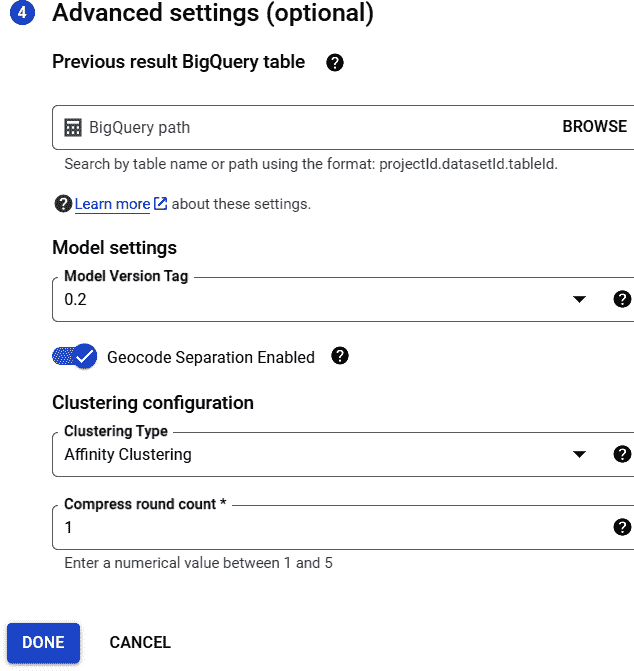

# 第九章：云实体解析服务

在上一章中，我们看到了如何将我们的实体解析过程扩展到运行在 Google Cloud 管理的 Spark 集群上。这种方法使我们能够在合理的时间内匹配更大的数据集，但它要求我们自己进行相当多的设置和管理。

另一种方法是使用云提供商提供的实体解析 API 来为我们执行繁重的工作。Google、Amazon 和 Microsoft 都提供这些服务。

在本章中，我们将使用作为 Google 企业知识图 API 的一部分提供的实体协调服务，来解析我们在第六章和第八章中检查的 MCA 和 Companies House 数据集。我们将：

+   将我们的标准化数据集上传到 Google 的数据仓库 BigQuery。

+   提供我们数据模式到标准本体的映射。

+   从控制台调用 API（我们还将使用 Python 脚本调用 API）。

+   使用一些基本的 SQL 来处理结果。

​​为了完成本章，我们将检查该服务的性能如何。

# BigQuery 简介

BigQuery 是 Google 的完全托管的、无服务器的数据仓库，支持使用 SQL 方言进行可扩展的数据查询和分析。它是一个平台即服务，支持数据查询和分析。

要开始，请从 Google Cloud 控制台中选择 BigQuery 产品。在分析下，我们选择“SQL 工作区”。

我们的第一步是从您的项目名称旁边的省略菜单中选择“创建数据集”，如图 9-1 所示。


###### 图 9-1\. BigQuery 创建数据集

在弹出窗口中，如图 9-2 所示，我们需要将数据集 ID 命名为 Chapter9，然后选择位置类型。然后，您可以选择特定的区域，或者只需接受多区域默认值。可选地，您可以添加一个在表格自动过期的天数。

一旦我们创建了一个空数据集，下一个任务是上传我们的 MCA 和 Companies House 表格。我们可以从我们在第 8 章中保存的 Google Cloud 存储存储桶中的数据上传这些表格。


###### 图 9-2\. BigQuery 创建数据集配置

选择数据集后，我们可以单击“+ 添加”，或添加数据，然后选择 Google Cloud 存储作为源（如图 9-3 所示）。然后，您可以浏览到您的 Cloud 存储存储桶并选择*mari_clean.csv*文件。选择 Chapter9 数据集作为目的地，并将表格命名为*mari*。在模式下，单击“自动检测”复选框。您可以接受其余默认设置。


###### 图 9-3\. BigQuery 创建表

对于*basic_clean.csv*文件，重复此过程，将其命名为*basic*。然后，您可以选择数据集中的表格以查看架构。选择预览将显示前几行，如图 9-4 所示。


###### 图 9-4\. BigQuery 表模式

现在我们已成功加载数据，需要告知企业知识图谱 API 如何映射我们的模式，然后运行一个协调作业。

# 企业知识图谱 API

Google 企业知识图谱 API 提供了一种轻量级实体解析服务，称为实体协调。该服务使用在 Google 数据上训练的 AI 模型。它使用了*分层聚合聚类*的并行版本。

# 分层聚合聚类

这是一种“自下而上”的聚类实体方法。每个实体首先位于自己的簇中，然后根据它们的相似性进行聚合。

截至撰写本文时，实体协调服务处于预览状态，并按照 Pre-GA 条款提供，详细信息请访问[Google Cloud 网站](https://oreil.ly/dThBk)。

要启用 API，请从控制台导航菜单中选择人工智能下的企业 KG。从这里，您可以为您的项目点击“启用企业知识图谱 API”。

## 模式映射

要设置我们的实体解析作业，我们首先需要将我们的数据模式映射到 Google 实体协调 API 理解的模式上。我们通过为每个要使用的数据源创建一个映射文件来完成这一点。API 使用一种称为 YARRRML 的人类可读的简单格式语言来定义源模式与来自[schema.org](https://schema.org)的目标本体之间的映射。它支持三种不同的实体类型：组织、个人和本地企业。在我们的示例中，我们将使用组织模式。

首先，我们点击 Schema Mapping，然后在组织框中选择“创建映射”。这将带我们进入一个编辑器，在这里我们可以修改并保存模板映射文件。映射文件分为一个前缀部分，告诉 API 我们将使用哪个模型和模式参考。映射部分然后列出数据集中包含的每种实体类型。对于每种实体类型，我们指定源、唯一标识实体的主键(`s`)，然后是谓词列表(`po`)，指定我们希望匹配的实体属性。

默认模板如下：

```py
prefixes:
   ekg: http://cloud.google.com/ekg/0.0.1#
   schema: https://schema.org/

mappings:
   organization:
      sources:
         - [example_project:example_dataset.example_table~bigquery]        
      s: ekg:company_$(record_id)
      po:
         - [a, schema:Organization]
         - [schema:name, $(company_name_in_source)]
         - [schema:streetAddress, $(street)]
         - [schema:postalCode, $(postal_code)]
         - [schema:addressCountry, $(country)]
         - [schema:addressLocality, $(city)]
         - [schema:addressRegion, $(state)]
         - [ekg:recon.source_name, $(source_system)]
         - [ekg:recon.source_key, $(source_key)]
```

从 MCA 数据集的映射文件开始，按如下编辑默认模板，记得在源行中插入您的项目名称。这个文件也可以在存储库中作为*Chapter9SchemaMari*获得：

```py
prefixes:
  ekg: http://cloud.google.com/ekg/0.0.1#
  schema: https://schema.org/

mappings:
  organization:
    sources:
      - [<*your_project_name*>:Chapter9.mari~bigquery]
    s: ekg:company1_$(unique_id)
    po:
      - [a, schema:Organization]
      - [schema:postalCode, $(Postcode)]
      - [schema:name, $(CompanyName)]
      - [ekg:recon.source_name, (mari)]
      - [ekg:recon.source_key, $(unique_id)]
```

注意这里我们正在指向先前在 Chapter9 数据集中创建的*mari* BigQuery 表的 API。我们使用`unique_id`列作为我们的主键，并将我们的`Postcode`字段映射到模式中的`postalCode`属性，将我们的`CompanyName`字段映射到`name`属性。

将编辑后的文件保存到您的 Google Storage 存储桶中，路径为*handsonentityresolution*目录下：

```py
gs://<*your bucket*>/handsonentityresolution/Chapter9SchemaMari
```

重复此过程为英国公司注册处数据集创建一个映射文件，保存在与 *Chapter9SchemaBasic* 相同的位置。记得在相关行中将 *basic* 替换为 *mari* 并引用这些实体为 *company2*：

```py
    - [<your_bucket>:Chapter9.basic~bigquery]
   s: ekg:company2_$(unique_id)
   po:
       - [a, schema:Organization]
       - [ekg:recon.source_name, (basic)]
```

现在我们有了我们的数据集和映射文件，所以我们可以运行一个实体解析（或对账）作业。

## 对账作业

要开始一个对账作业，请在控制台导航菜单中的企业 KG 部分中选择作业，如 图 9-5 所示。


###### 图 9-5\. 开始一个对账作业

选择“运行作业”选项卡，如 图 9-6 所示。


###### 图 9-6\. 运行实体对账 API 作业

从弹出菜单中：

步骤 1: 点击“选择实体类型”

选择组织。

步骤 2: 添加 BigQuery 数据源

浏览到 BigQuery 路径，然后选择 *mari* 表。然后通过浏览到您的存储桶中的 *handsonentityresolution* 目录并选择我们之前创建的 *Chapter9SchemaMari* 文件来选择匹配的映射表。

点击添加另一个 BigQuery 数据源，然后重复*基础*表和映射文件的过程。

步骤 3: 设置 BigQuery 数据目标

浏览并选择 Chapter9 BigQuery 数据集以告知 API 写入其结果的位置。

步骤 4: 高级设置（可选）

对于最后一步，我们可以指定一个之前的结果表，这样实体对账服务就会为不同作业中的实体分配一致的 ID，如 图 9-7 所示。随着新数据的添加，这对更新现有实体记录特别有用。



###### 图 9-7\. 实体对账 API 高级设置

可以指定聚类轮数（实体解析模型的迭代次数）；轮数越高，实体合并得越松散。对我们的使用情况来说，默认设置就很好。

最后，点击“完成”并开始我们的作业。假设一切顺利，我们应该会看到一个新的作业在作业历史记录下创建，如 图 9-8 所示。


###### 图 9-8\. 实体对账作业历史记录

我们可以观察作业显示状态列，以监控作业的进度，它按照 表 9-1 中显示的顺序顺序地进行显示状态，最后在完成时显示“已完成”。

表 9-1\. 作业显示状态

| 作业显示状态 | 代码状态 | 描述 |
| --- | --- | --- |
| 运行中 | `JOB_<wbr>STATE_<wbr>RUNNING` | 作业正在进行中。 |
| 知识提取 | `JOB_<wbr>STATE_<wbr>KNOWLEDGE_<wbr>EXTRACTION` | 企业知识图正在从 BigQuery 提取数据并创建特征。 |
| 对账预处理 | `JOB_<wbr>STATE_<wbr>RECON_<wbr>​PRE⁠PROCESSING` | 作业处于对账预处理步骤。 |
| 聚类 | `JOB_<wbr>STATE_<wbr>CLUSTERING` | 作业正在进行聚类步骤。 |
| 导出聚类 | `JOB_<wbr>STATE_<wbr>EXPORTING_<wbr>CLUSTERS` | 作业正在将输出写入 BigQuery 目标数据集。 |

此作业应该大约需要 1 小时 20 分钟，但在产品的此预览阶段，持续时间会有很大变化。

当作业完成后，如果我们查看 BigQuery SQL 工作空间，我们应该会看到我们的 Chapter9 数据集中的一个名为类似 clusters_15719257497877843494 的新表，如图 9-9 所示。


###### 图 9-9。BigQuery 聚类结果表

选择 clusters_15719257497877843494 表，然后选择“预览”选项卡，我们可以查看结果。图 9-10 展示了前几行。


###### 图 9-10。BigQuery 聚类结果预览

让我们考虑输出中的列：

+   *cluster_id* 给出了实体协调 API 分配给源实体的聚类的唯一引用。

+   *source_name* 列给出了源表的名称，在我们的情况下是 *mari* 或 *basic*。

+   *source_key* 列包含源表中行的 `unique_id`。

+   *confidence* 分数介于 0 到 1 之间，表示记录与给定聚类相关联的强度。

+   *assignment_age* 列是一个内部 API 参考。

+   *cloud_kg_mid* 列包含 Google Cloud 企业知识图中实体的 MID 值链接，如果 API 能够解析出匹配。可以使用 Cloud 企业知识图 API 查找有关该实体的额外细节。

由于 *mari* 和 *basic* 表中的每个实体都分配给一个聚类，因此此表的行数是源表行数的总和。在我们的情况下，这超过了 500 万行。乍一看，很难确定 API 匹配了哪些实体，因此我们需要稍微调整一下这些数据。

## 结果处理

有了我们的实体协调结果，我们就可以使用 BigQuery SQL 将这些原始信息处理成更容易让我们检查已解析实体的形式。

要开始，请点击“撰写新查询”，这将带我们进入一个 SQL 编辑器。您可以从*Chapter9.sql*文件中剪切并粘贴 SQL 模板。

首先，我们需要创建一个仅包含其 `cluster_id` 至少有一个 MCA 匹配的行的临时表。我们通过构建一个其行具有“mari”作为 `source_name` 的聚类表子集来实现这一点。然后，我们通过在匹配的 `cluster_id` 上使用 `INNER JOIN` 找到此子集的行与完整聚类表的行的交集。

确保用您的结果表的名称替换聚类表的名称，格式为 `clusters_*<job reference>*`：

```py
CREATE TEMP TABLE temp AS SELECT
   src.* FROM Chapter9.clusters_15719257497877843494 AS src
      INNER JOIN (SELECT cluster_id from
         Chapter9.clusters_15719257497877843494 WHERE 
             source_name = "mari") AS mari
         ON src.cluster_id = mari.cluster_id;
```

结果临时表现在只有 151 行。接下来，我们创建第二个临时表，这次是包含同时具有 MCA 匹配和至少一个 Companies House 匹配的聚类子集；即，我们删除了只有 MCA 匹配的聚类。

为了做到这一点，我们选择那些具有大于 1 的`cluster_id`，然后再次找到这个子集与第一个临时表的交集，使用匹配的`cluster_id`进行`INNER JOIN`。

现在我们有一个包含只有在 Companies House 和 MCA 数据集中都找到实体的行的集群表：

```py
CREATE TEMP TABLE match AS SELECT
   src.* FROM temp AS src
      INNER JOIN (SELECT cluster_id FROM temp GROUP BY cluster_id 
          HAVING COUNT(*) > 1) AS matches
      ON matches.cluster_id = src.cluster_id;
```

这个表现在有 106 行。我们已经得到了我们寻找的人口，所以我们可以创建一个持久的结果表，从源表中挑选`CompanyName`和`Postcode`，以便我们可以检查结果。

我们需要分两部分构建这张表。首先，对于指向 Companies House 数据的行，我们需要查找`source_key`列中的标识符，并使用它来检索相应的名称和邮政编码。然后，我们需要对指向 MCA 数据的行执行相同操作。我们使用`UNION ALL`语句将这两个数据集连接起来，然后按`confidence`首先，然后按`cluster_id`排序。这意味着分配到相同集群的实体在表中是相邻的，以便于查看：

```py
CREATE TABLE Chapter9.results AS

   SELECT * FROM Chapter9.basic AS bas
   INNER JOIN (SELECT * FROM match WHERE match.source_name = "basic") AS res1
   ON res1.source_key = CAST(bas.unique_id AS STRING)

   UNION ALL

   SELECT * FROM Chapter9.mari AS mari
      INNER JOIN (SELECT * FROM match WHERE match.source_name = "mari") AS res2
      ON res2.source_key = CAST(mari.unique_id AS STRING)

ORDER BY confidence, cluster_id
```

这给了我们一个结果表，看起来像图 9-11 所示。


###### 图 9-11\. 处理后的结果表

在第一行中，我们可以看到 MCA 实体与`CompanyName` CREW AND CONCIERGE，`Postcode` BS31 1TP 和`unique_id` 18 都被分配给集群 r-03fxqun0t2rjxn。在第二行中，具有`CompanyName` CREW and CONCIERGE，相同的`Postcode` 和`unique_id` 1182534 的 Companies House 实体也被分配到同一个集群中。

这意味着 Google 实体对账 API 已将这些记录分组到相同的集群中，即将这些行解析为同一个现实世界实体，并且置信度为 0.7。

在详细检查这些结果之前，我们将快速了解如何从 Python 调用 API 而不是从云控制台。

## 实体对账 Python 客户端

Google 企业知识图谱 API 还支持 Python 客户端来创建、取消和删除实体对账作业。我们可以使用 Cloud Shell 虚拟机来运行这些 Python 脚本并启动这些作业。

要激活 Google Cloud Shell，请点击控制台右上角的终端符号。这将打开一个带有命令行提示符的窗口。

包含用于调用实体对账作业的 Python 脚本已包含在仓库中。要将副本传输到您的 Cloud Shell 机器，我们可以使用：

```py
>>>gsutil cp gs://<your_bucket>/handsonentityresolution/
   Chapter9.py .
```

弹出窗口将要求您授权 Cloud Shell 连接到您的存储桶。

脚本*Chapter9.py*如下所示。您可以使用 Cloud Shell 编辑器编辑此文件，以引用您的项目和存储桶：

```py
#!/usr/bin/env python
# coding: utf-8

from google.cloud import enterpriseknowledgegraph as ekg

project_id = '<your_project>'
dataset_id = 'Chapter9'

import google.cloud.enterpriseknowledgegraph as ekg

client = ekg.EnterpriseKnowledgeGraphServiceClient()
parent = client.common_location_path(project=project_id, location='global')

input_config = ekg.InputConfig(
        bigquery_input_configs=[
            ekg.BigQueryInputConfig(
                bigquery_table=client.table_path(
                    project=project_id, dataset=dataset_id, table='mari'
                ),
                gcs_uri='gs://<your bucket>/
                  handsonentityresolution/Chapter9SchemaMari',
            ),
             ekg.BigQueryInputConfig(
                bigquery_table=client.table_path(
                    project=project_id, dataset=dataset_id, table='basic'
                ),
                gcs_uri='gs://<your bucket>/
                  handsonentityresolution/Chapter9SchemaBasic',
            )   
        ],
        entity_type=ekg.InputConfig.EntityType.ORGANIZATION,
    )

output_config = ekg.OutputConfig(
        bigquery_dataset=client.dataset_path(project=project_id, 
            dataset=dataset_id)
    )

entity_reconciliation_job = ekg.EntityReconciliationJob(
        input_config=input_config, output_config=output_config
)

request = ekg.CreateEntityReconciliationJobRequest(
        parent=parent, entity_reconciliation_job=entity_reconciliation_job
)

response = client.create_entity_reconciliation_job(request=request)

print(f"Job: {response.name}")
```

Cloud Shell 中已安装 Python，因此我们可以简单地从命令提示符运行此脚本：

```py
>>>python Chapter9.py

```

要处理结果，我们可以使用我们之前检查过的 SQL 脚本。要从您的 Cloud Storage 存储桶复制这些：

```py
>>>gsutil cp gs://<your_bucket>/handsonentityresolution/
    Chapter9.sql
```

然后我们使用以下 BigQuery 脚本运行：

```py
>>>bq query --use_legacy_sql=false < Chapter9.sql
```

请注意，如果结果表已通过从 SQL 工作区运行此查询创建，则此命令将失败，因为表已经存在。您可以使用以下命令删除表： 

```py
>>>bq rm -f -t Chapter9.results

```

现在我们可以检查 API 在我们的示例上的表现。

# 测量性能

请参阅我们的 BigQuery 结果表预览中，我们有 106 行。匹配置信度的分布如表 9-2 所示。

表 9-2\. 匹配置信度

| 匹配数 | 置信度 |
| --- | --- |
| 6 | 0.7 |
| 1 | 0.8 |
| 45 | 0.99 |
| 44 | 未找到匹配项 |

两个 MCA 实体与两个 Companies House 实体匹配。

回顾图 9-11，我们可以看到按置信度升序排列的前七个匹配项。您可以看到，尽管存在轻微的拼写差异或邮政编码变化，实体对账服务已能够匹配这些实体。其余的匹配项在`CompanyName`和`Postcode`上都是精确匹配，除了 INDIE PEARL 和 INDIE-PEARL 之间的连字符不匹配，但这并没有影响置信度分数。

如果我们假设独特的匹配是真正的正匹配，并且另外两个匹配是误报，则我们可以评估我们的表现如下：

<math alttext="upper T r u e p o s i t i v e m a t c h e s left-parenthesis upper T upper P right-parenthesis equals 52"><mrow><mi>T</mi> <mi>r</mi> <mi>u</mi> <mi>e</mi> <mi>p</mi> <mi>o</mi> <mi>s</mi> <mi>i</mi> <mi>t</mi> <mi>i</mi> <mi>v</mi> <mi>e</mi> <mi>m</mi> <mi>a</mi> <mi>t</mi> <mi>c</mi> <mi>h</mi> <mi>e</mi> <mi>s</mi> <mo>(</mo> <mi>T</mi> <mi>P</mi> <mo>)</mo> <mo>=</mo> <mn>52</mn></mrow></math>

<math alttext="upper F a l s e p o s i t i v e m a t c h e s left-parenthesis upper F upper P right-parenthesis equals 2"><mrow><mi>F</mi> <mi>a</mi> <mi>l</mi> <mi>s</mi> <mi>e</mi> <mi>p</mi> <mi>o</mi> <mi>s</mi> <mi>i</mi> <mi>t</mi> <mi>i</mi> <mi>v</mi> <mi>e</mi> <mi>m</mi> <mi>a</mi> <mi>t</mi> <mi>c</mi> <mi>h</mi> <mi>e</mi> <mi>s</mi> <mo>(</mo> <mi>F</mi> <mi>P</mi> <mo>)</mo> <mo>=</mo> <mn>2</mn></mrow></math>

<math alttext="upper F a l s e n e g a t i v e m a t c h e s left-parenthesis upper F upper N right-parenthesis equals 44"><mrow><mi>F</mi> <mi>a</mi> <mi>l</mi> <mi>s</mi> <mi>e</mi> <mi>n</mi> <mi>e</mi> <mi>g</mi> <mi>a</mi> <mi>t</mi> <mi>i</mi> <mi>v</mi> <mi>e</mi> <mi>m</mi> <mi>a</mi> <mi>t</mi> <mi>c</mi> <mi>h</mi> <mi>e</mi> <mi>s</mi> <mo>(</mo> <mi>F</mi> <mi>N</mi> <mo>)</mo> <mo>=</mo> <mn>44</mn></mrow></math>

<math alttext="upper P r e c i s i o n equals StartFraction upper T upper P Over left-parenthesis upper T upper P plus upper F upper P right-parenthesis EndFraction equals StartFraction 52 Over left-parenthesis 52 plus 2 right-parenthesis EndFraction almost-equals 96 percent-sign"><mrow><mi>P</mi> <mi>r</mi> <mi>e</mi> <mi>c</mi> <mi>i</mi> <mi>s</mi> <mi>i</mi> <mi>o</mi> <mi>n</mi> <mo>=</mo> <mfrac><mrow><mi>T</mi><mi>P</mi></mrow> <mrow><mo>(</mo><mi>T</mi><mi>P</mi><mo>+</mo><mi>F</mi><mi>P</mi><mo>)</mo></mrow></mfrac> <mo>=</mo> <mfrac><mn>52</mn> <mrow><mo>(</mo><mn>52</mn><mo>+</mo><mn>2</mn><mo>)</mo></mrow></mfrac> <mo>≈</mo> <mn>96</mn> <mo>%</mo></mrow></math>

<math alttext="upper R e c a l l equals StartFraction upper T upper P Over left-parenthesis upper T upper P plus upper F upper N right-parenthesis EndFraction equals StartFraction 52 Over left-parenthesis 52 plus 44 right-parenthesis EndFraction almost-equals 54.2 percent-sign"><mrow><mi>R</mi> <mi>e</mi> <mi>c</mi> <mi>a</mi> <mi>l</mi> <mi>l</mi> <mo>=</mo> <mfrac><mrow><mi>T</mi><mi>P</mi></mrow> <mrow><mo>(</mo><mi>T</mi><mi>P</mi><mo>+</mo><mi>F</mi><mi>N</mi><mo>)</mo></mrow></mfrac> <mo>=</mo> <mfrac><mn>52</mn> <mrow><mo>(</mo><mn>52</mn><mo>+</mo><mn>44</mn><mo>)</mo></mrow></mfrac> <mo>≈</mo> <mn>54</mn> <mo>.</mo> <mn>2</mn> <mo>%</mo></mrow></math>

所以实体对账为我们提供了极好的精确度，但相对较差的召回率。

# 摘要

在本章中，我们看到如何使用 Google Cloud 实体对账 API 解决我们的组织实体。我们还看到如何从云控制台和 Python 客户端配置和运行匹配作业。

使用 API 抽象我们远离了配置自己的匹配过程的复杂性。它也天然适用于非常大的数据集（数亿行）。但是，我们受到使用一组预定义模式的限制，并且没有自由调整匹配算法以优化我们用例的召回率/精确度权衡。
