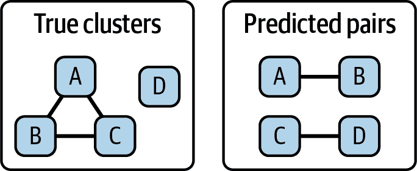

# 第十一章。进一步考虑

希望前几章已经为你提供了如何在数据集中解析实体的实际理解，并为你在解决过程中可能遇到的一些挑战做好了准备。

现实世界的数据杂乱无章，充满了意外，因此将其连接起来往往并不简单。但是，花费时间进行连接是非常值得的，因为当我们能够将所有的拼图片段组合在一起时，故事变得更加丰富。

在这个简短的结尾章节中，我将谈谈在构建弹性生产解决方案时值得考虑的实体解析的一些方面。我还将分享一些关于艺术和科学的未来的总结思考。

# 数据考虑

与任何分析过程一样，理解输入数据的背景和质量的重要性不可高估。传统应用程序可以容忍的数据怪癖或误解可能会从根本上破坏匹配过程。低质量数据可能导致超链接和低链接，有时会匹配不同的实体，这可能会产生严重后果。

在本节中，我将讨论在执行实体解析时需要考虑的最重要的与数据相关的问题。

## 非结构化数据

在本书中，我们主要使用结构化数据来执行匹配过程。当我们遇到半结构化数据时，我们使用非常简单的经验法则来提取所需的属性。例如，在第二章中，我们将全名字符串有些随意地拆分为`Firstname`和`Lastname`，而在第六章中，我们仅从完整地址文本中提取了邮政编码。为了简单起见，我们忽略了可能丰富我们匹配过程的有价值数据。

幸运的是，在过去几年中，从非结构化文本中提取意义的最新技术已经有了显著发展。对于理解句子构造和上下文中提取实体的命名实体识别（NER）技术的进步意味着我们可以更轻松地链接到非结构化内容。

例如，现有几个 Python 库（如 usaddress，deepparse 和 libpostal）可以解析地址，提取单独的门牌号码、街道和城镇属性。这些模型的性能取决于高质量训练数据的可用性，因此在不同国家之间有所不同。

然而，即使是最复杂的 NER 也无法弥补源文本中缺少关键属性的情况。例如，新闻文章很少会为其主题提供出生日期，而金融交易通常不会包括社会安全号码。

## 数据质量

在我们的示例中，我们基本上接受了我们输入数据的大部分，并采取了便捷的快捷方式来准备我们的数据进行匹配。例如，作为一种捷径，我们简单地删除了包含缺失值属性的记录。我们的处理过程应能够忽略（即对该属性分配零匹配权重）而不是丢弃整个记录。对于生产解决方案，对测量和持续改进数据质量更严格的方法至关重要。数据质量越好，匹配任务就越容易。

附加的数据完整性和有效性检查（包括识别隐藏和意外字符）将提醒您可能以意想不到的方式阻碍匹配过程的问题，并且在后续诊断中具有挑战性。

## 时间等价性

实体解析过程依赖于匹配属性来确定记录是否指向同一现实世界的实体。然而，与实体相关联的属性可能会随时间改变。姓氏可能随婚姻状况改变；电话号码和电子邮件地址可能因个人更换服务提供商而变化；护照、驾驶执照和其他形式的身份证件会随新标识重新发行。

这听起来很明显，但实体解析的这一时间方面经常被忽视，因此我的建议是要小心处理包含来自不同时间段数据的数据集，并确保模型不会过分依赖可能会发生变化的属性。当然，在实体试图不被识别时，频繁的属性更改可能表明有意企图阻碍实体解析过程。

# 属性比较

在第三章中，我们探讨了一些用于近似字符串匹配的常用技术。我们考虑了编辑距离和音形等价性来确定离散名称属性之间的匹配。当我们需要评估两个具有多个单词或标记的字符串（如地址或组织名称）之间的相似性时，我们可以考虑其他技术。

## 集合匹配

当一个实体由一组术语标识时，我们可以使用基于集合的方法（如 Jaccard 指数^(1））来衡量每个集合中存在的标记之间的重叠程度。更复杂的方法，如 Monge-Elkan 相似度，结合了基于集合和编辑距离技术来执行比较。

最近在句子嵌入[²]方面取得的进展现在允许我们将文本字符串的语义意义转化为一个向量（多维度的量化数组）。这些向量化模型在大量开源数据库的训练中得以实现，并通过公共接口（例如 OpenAI 的嵌入 API）进行访问。这些文本字符串的语义相似性可以通过诸如余弦相似度之类的技术来评估，这种技术衡量的是向量之间的夹角。

基于向量的方法也可以应用于衡量单词之间的相似性（表示为单个字符或多字符 n-gram 的字符串），但通常不考虑这些字母的顺序，而这在匹配中可能非常重要，例如，NAB（澳大利亚银行）与 NBA（美国篮球组织）的区别。

## 地理编码位置匹配

与匹配组成地址的个别单词或标记不同的替代方法是将地址转换为一组地理坐标（纬度和经度）。然后，我们可以在一组直线距离容差内比较这些值，以确定它们是否指向同一位置。显然，对于在紧邻（例如共享建筑物或工业园区内）的多占用位置，这种方法可能会产生一些误报。

在撰写本文时，Google、Microsoft 和 OpenStreetMap（通过 Nominatim）提供地理编码 API，可以执行转换，但受价格和使用政策的限制。作为按需软件即服务（SaaS）提供的方法，这种方法可能不适用于大量地址比较或数据敏感且不能与第三方共享的情况。

## 聚合比较

正如我们所见，通常有几种不同的技术可以用来比较属性，每种技术都有其优势和劣势。在某些使用案例中，评估潜在匹配时可能有益的是使用多种方法，例如同时使用 Soundex 比较和编辑距离测量，以确定最合适的结果。

值得注意的是，如果在相同的属性上使用并行技术，则结果将不符合 Fellegi-Sunter 模型的条件独立性假设，因此在使用诸如 Splink 之类的概率工具时可能表现不佳。特别是，应该在单个比较的不同比较层次中包含不同的测量，以避免重复计数。或者，这些不同的测量可以预先聚合到一个单一的分数中，使用自定义的相似性函数。

# 后处理

在第十章中，我们看到了如何将成对记录分组为单个明确的集群。我们还介绍了确定用于描述我们统一实体的哪些属性值的挑战。选择逻辑以选择要推广的属性值可能是定制的，适用于您的用例，并且可能取决于数据集的相对可信度和高级性。

一旦建立了规范实体视图，就有机会重复进行成对匹配的练习，将新整合的实体视为新记录。由于新复合实体中属性的集中，之前无法匹配的额外记录现在可能会达到等价阈值。

例如，考虑表格 11-1 中显示的输入记录。根据相同的名字和出生日期，记录 1 和 2 可能被认为指的是同一个人，但是记录 3 与任何一条记录都没有足够的共性来加入那个小集群。

表格 11-1\. 实体解析—输入

| **属性** | **记录 1** | ** 记录 2** | **记录 3** |
| --- | --- | --- | --- |
| 名 | 迈克尔  | 迈克尔 | M |
| 姓 | Shearer | Shear | Shearer |
| 出生日期 | 4/1/1970 | 4/1/1970 |   |
| 出生地 |                          | 斯托·瓦尔德 | 斯托·瓦尔德 |
| 手机号码 |   |   | 07700 900999 |

解析了记录 1 和 2 成为单个实体后，假设我们选择“Shearer”而不是“Shear”来表示姓。也许记录 1 是被认为比记录 2 的数据集质量更高的数据集的一部分。或者也许我们实施了一个规则来选择更完整的值。正如表格 11-2 中所示，我们将有一个更丰富的属性集来与记录 3 进行匹配。

表格 11-2\. 实体解析—成对聚类

| **属性** | **集群 1 记录 1 和 2** | **记录 3** |
| --- | --- | --- |
| 名 | 迈克尔  | M  |
| 姓 | Shearer | Shearer |
| 出生日期 | 4/1/1970 |   |
| 出生地 | 斯托·瓦尔德        | 斯托·瓦尔德 |
| 手机号码 |   | 07700 900999 |

如果认为确切的姓氏匹配和等效的出生地足够作为证据，那么我们可以得出结论，记录 3 现在应该加入记录 1 和 2 的集群。

如表格 11-3 所示，我们现在已将所有三条记录解析为单个实体，并且由于我们的额外步骤，添加了一部我们否则不会与我们的实体关联的电话号码。

表格 11-3\. 实体解析—实体记录解析

| **属性** | **集群 1 记录 1, 2, 和 3** |
| --- | --- |
| 名 | 迈克尔  |
| 姓 | Shearer |
| 出生日期 | 4/1/1970 |
| 出生地 | 斯托·瓦尔德        |
| 手机号码 | **07700 900999** |

这展示了我们如何逐步建立信心，将这些记录连接成一个单一的聚类实体。这是一个“自下而上”或聚合层次聚类的例子。在这个简单的例子中，我们详尽地连接了所有三条记录，但在更大的数据集中，可能有更多的候选记录可以在后续迭代中比较和可能聚类在一起。

在第八章中，我们看到了 Google Cloud 实体协调服务如何使用这种技术。Google 服务指定了一定数量的迭代次数后终止聚类过程。显然，这种方法在处理大数据集时可能计算密集，并不能保证找到最优解。

# 图形表示

在属性比较和逐对匹配分类之后，实体解析过程中的最后步骤与图分析领域有显著重叠。

正如我们在第十章中看到的，聚类过程的输出可以呈现为源记录（节点）和一组匹配属性对（边）的实体图。这种表示形式可以作为更广泛的网络图的一部分，展示不同实体通过共享关系或共同属性如何连接。这种表示形式有助于允许根据其更广泛网络的背景检查（和可能折扣）匹配。

或者，如果匹配的信心很高，或者需要一个更简单的表示，实体图可以解析（或折叠）成一个单一的节点。该节点可以列出一个规范的属性集，或者保留备选属性值供进一步检查。这个策划网络或知识图提供了从不同来源汇总的给定实体的所有信息的综合视图。

您可能已经注意到，这在某种程度上是如何使得 Google 搜索今天工作的一部分。搜索结果现在呈现了来自[Google 的知识图](https://oreil.ly/H59UU)的事实信息，该图包含超过 5 亿个对象，以及关于这些不同对象的 35 亿多个事实和关系。正如我们在第八章中看到的，现在您可以使用其协调 API 将您的实体与 Google 的对象解析对比。

# 实时考虑因素

在本书中，我们考虑了静态数据集的基于批处理的实体解析。这种即时方法允许我们比较、匹配和聚类所有相关记录，以生成一组解析的实体。这个参考点可以在一段时间内使用，然后变得过时，需要重复这个过程。在第六章中，我们看到如何使用预训练的概率模型逐对匹配新记录与现有数据集。

如果需要一个最新的所有解析实体集合，那么随着新记录的增加逐步处理这些记录会带来一些额外的考虑。根据可用的处理时间窗口，可能很难重新聚类并根据新可用记录的内容生成新的规范实体，或将现有实体重新组织成新配置。

# 性能评估

当记录在它们真正不同的时候匹配程度来评估实体解析解决方案的功能性能（过链接）或者当它们指向相同的真实世界实体时保持不连接（欠链接）。基于解析数据集提出的决策和行动的性质将决定这些指标的相对优先级。例如，在高风险情况下，错过一个链接的后果可能是显著的，因此你可能希望向过链接倾斜。在更加推测性的过程中，您可能希望倾向于欠链接，以减少不必要的客户摩擦。

系统评估您的解决方案过度或欠链接的程度是具有挑战性的。在本书的早期章节中，我们有一个已知的人口群体，可以评估我们处理的过程的精确度、召回率和准确性。但实际上很少有这种情况。解析实体的需要通常是由于数据集之间缺乏共同键或已知人口而引起的，因此剥夺了评估者针对性能进行测量的地面真实性。

较小的基准数据集通常可以通过手工链接，以预测大规模的性能。然而，这些有限的数据集可能会导致对可能的真实世界结果的扭曲看法。较大的数据集更有可能包含具有相似属性的不同实体（例如相同的名称），增加误报的可能性。还必须注意确保评估过程中基准数据集的分布情况。在构建用于检查匹配过程找到正确匹配项的基准数据集中，匹配与非匹配记录的比率通常显著较高（即最大化召回率），但过高估计精确度的频率（即过高估计精度）。特别是对于更复杂的基于嵌入的方法，存在过拟合实体解析模型的风险，因为基准数据在训练数据中表示，导致泛化性能差。

评估实体解析解决方案的性能是模型开发和改进的关键部分。它需要标记数据，然后可以用来训练更复杂的模型或估算性能指标，如精确度和召回率。

在实体解析应用中，数据标记和性能评估有两种主要方法类型：

两两比较法

标记一组记录对为匹配和非匹配

基于集群的方法

识别或使用已知的完全解析的实体（集群）

## 两两比较法

使用两两比较法，我们可以估算精确度，即在声明匹配时我们正确的频率，只需抽样匹配的记录对并手动审查。一旦分类为真正例或假正例，我们可以如下计算精确度：

<math alttext="upper P r e c i s i o n equals StartFraction upper T r u e p o s i t i v e s Over left-parenthesis upper T r u e p o s i t i v e s plus upper F a l s e p o s i t i v e s right-parenthesis EndFraction"><mrow><mi>P</mi> <mi>r</mi> <mi>e</mi> <mi>c</mi> <mi>i</mi> <mi>s</mi> <mi>i</mi> <mi>o</mi> <mi>n</mi> <mo>=</mo> <mfrac><mrow><mi>T</mi><mi>r</mi><mi>u</mi><mi>e</mi><mi>p</mi><mi>o</mi><mi>s</mi><mi>i</mi><mi>t</mi><mi>i</mi><mi>v</mi><mi>e</mi><mi>s</mi></mrow> <mrow><mo>(</mo><mi>T</mi><mi>r</mi><mi>u</mi><mi>e</mi><mi>p</mi><mi>o</mi><mi>s</mi><mi>i</mi><mi>t</mi><mi>i</mi><mi>v</mi><mi>e</mi><mi>s</mi><mo>+</mo><mi>F</mi><mi>a</mi><mi>l</mi><mi>s</mi><mi>e</mi><mi>p</mi><mi>o</mi><mi>s</mi><mi>i</mi><mi>t</mi><mi>i</mi><mi>v</mi><mi>e</mi><mi>s</mi><mo>)</mo></mrow></mfrac></mrow></math>

估算召回率更具挑战性，因为我们实质上必须重复解析过程，以识别本应声明为匹配但未被声明的记录。这可以通过选择一个松散匹配的记录块，并彻底审查此块中所有可能的记录对来更有效地估算。当然，与任何阻塞方法一样，我们面临忽略未能进入松散选定块的通配匹配的风险。

作为提醒，召回率的计算方法如下：

<math alttext="upper R e c a l l equals StartFraction upper T r u e p o s i t i v e s Over left-parenthesis upper T r u e p o s i t i v e s plus upper F a l s e n e g a t i v e s right-parenthesis EndFraction"><mrow><mi>R</mi> <mi>e</mi> <mi>c</mi> <mi>a</mi> <mi>l</mi> <mi>l</mi> <mo>=</mo> <mfrac><mrow><mi>T</mi><mi>r</mi><mi>u</mi><mi>e</mi><mi>p</mi><mi>o</mi><mi>s</mi><mi>i</mi><mi>t</mi><mi>i</mi><mi>v</mi><mi>e</mi><mi>s</mi></mrow> <mrow><mo>(</mo><mi>T</mi><mi>r</mi><mi>u</mi><mi>e</mi><mi>p</mi><mi>o</mi><mi>s</mi><mi>i</mi><mi>t</mi><mi>i</mi><mi>v</mi><mi>e</mi><mi>s</mi><mo>+</mo><mi>F</mi><mi>a</mi><mi>l</mi><mi>s</mi><mi>e</mi><mi>n</mi><mi>e</mi><mi>g</mi><mi>a</mi><mi>t</mi><mi>i</mi><mi>v</mi><mi>e</mi><mi>s</mi><mo>)</mo></mrow></mfrac></mrow></math>

## 基于集群的方法

与两两比较法的替代方案是通过手动确定，例如通过搜索工具，来获得描述相同现实世界实体的真实集群视图。然后，我们可以将我们的两两预测与这一黄金标准进行比较，以评估我们的性能并改进我们的模型。例如，考虑 图 11-1 中所示的简单示例。

###### 图 11-1\. 基于集群的评估示例

在四个记录（A 到 D）的群体中，我们的模型已经配对了记录 A + B 和 C + D。一个真实的集群视图显示，A、B 和 C 都指向同一个实体，但是 D 是不同的。基于此，我们可以评估以下内容并计算我们的性能指标。

| 记录对 | 预测 | 实际 | 结果 |
| --- | --- | --- | --- |
| A - B | 匹配 | 匹配 | 真正例 |
| A - C | 不匹配 | 匹配 | 假负例 |
| A - D | 不匹配 | 不匹配 | 真负例 |
| B - C | 不匹配 | 匹配 | 假负例 |
| B - D | 不匹配 | 不匹配 | 真负例 |
| C - D | 匹配 | 不匹配 | 假正例 |

实体解析的评估是一个活跃研究的领域，出现了工具集来协助这一过程，并提供可操作的反馈来改进性能。^(3)

# 实体解析的未来

实体解析从本质上来说是达到目的的手段。通过解析实体，我们希望从多个来源汇总所有相关信息，以使我们能够得出有价值的见解，并最终做出更好的决策。

在日益数字化的世界中，我们有责任确保我们的数据记录准确和全面地反映社会。如果我们有错误的信息，或者只看到了部分画面，我们就有可能得出错误的结论和采取错误的行动。还有一项职责是尊重个人隐私，并根据情况管理敏感数据。

实体解析的艺术与科学正在发展，以平衡这些关注点。实体解析可以增强您在数据中连接点的能力，并展示更大的图景。越来越多地可以在不必要共享个人信息的情况下完成这些操作。现在可以自由获取新的机器学习算法，并采用更严格的评估和优化技术来提升其性能。

最近，大规模语言模型（LLMs）在规模和可用性方面的进展开启了一个关于如何描述和相互关联真实世界实体的广泛信息的领域。支撑这些模型的嵌入技术为匹配过程提供了丰富的背景信息。日益增长的托管实体解析服务的可用性，以及将您的实体与公共知识库关联的能力，有望使匹配过程更加简便，结果更加丰富。

希望您享受了我们一起分享的实体解析挑战之旅，并且感觉准备好在您的数据中连接这些点。谁知道您会发现什么...

^(1) 关于 Jaccard 指数的更多详细信息，请访问[Wikipedia 页面](https://oreil.ly/vJyir)。

^(2) 关于如何使用 sent2vec 库的进一步详细信息，请参阅[PyPI 文档](https://oreil.ly/SUHrG)。

^(3) 例如，用于评估实体解析（ER）系统的开源 Python 包可以在[GitHub](https://github.com/Valires/er-evaluation)上找到。
