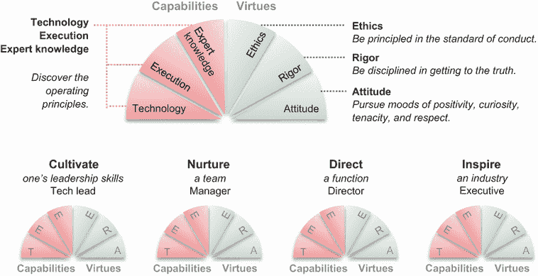

# 前言

## 前言

在过去的十年里，我主持或共同主持了 40 多次国际顶级数据和人工智能会议。见证全球分析、数据科学和机器学习的演变和影响是令人惊叹的。数据科学继续成为今天行业中最快速增长的职能之一。当我担任 O'Reilly Media 的首席数据科学家时，我们进行的一项又一项研究表明，公司继续投资于数据基础设施、数据科学和机器学习。我们还发现，在数据科学和机器学习的使用方面表现卓越的公司是那些投资于基础技术并逐步使用这些工具来扩展其能力，一次一个用例的公司。

尽管我们阅读的大部分内容都与工具或模型突破有关，但现实情况是，组织问题构成了大多数公司中的一些主要瓶颈。关键因素是认识到在人员、文化和结构方面的组织卓越。如果你没有合适的员工和组织结构，你仍然会表现不佳，落后于那些做得好的竞争对手。

随着对数据科学家的需求不断增长和培训计划的增多，我经常被要求提供建议。新手询问他们如何加入数据科学家的行列，而更有经验的数据科学家则寻求如何将他们的职业生涯提升到下一个层次的指导。

不幸的是，关于如何在数据科学职业生涯中保持相关性和影响力的信息和建议很难找到。大多数与职业相关的文献都集中在开始旅程上——在哪里学习、学习哪些技能、如何面试并获得第一份工作。对于在职数据科学家如何继续成功并在这一职业中表现出色，几乎没有指导。

*《如何领导数据科学》* 是一本针对处于职业生涯不同阶段的个人领导者（如技术领导、员工、主管或杰出数据科学家）以及管理领导者（如经理、总监或数据科学执行）的数据科学家的重要指南。本书面向希望将职业生涯提升到下一个层次的数据科学家。它还提供了在帮助数据科学家增加在商业和社会中的积极影响方面的工具和技术指导。

我已经认识作者 Jike 和 Cathy 多年。他们共同带来了一组多样化的运营经验，来自包括公共和私营公司以及咨询实践在内的广泛组织。我曾看到他们在为来自不同背景和行业的数据科学家提供的培训课程中教授本书的内容。他们的课程总是我在主持的会议中最受欢迎和最受欢迎的课程之一。

这本书是数据科学家寻求职业发展的缺失指南。处于职业生涯各个阶段的人士都会发现，随着他们的成长，重新阅读这本书是值得的。这是一本我计划从现在开始向数据科学家推荐的书籍。我希望它能激发更多关于这个主题的讨论和文献。数据科学家以及与他们合作的人在未来几年将需要这本书！

—本·洛里卡

*本·洛里卡是[GradientFlow.com](https://gradientflow.com/)的首席撰稿人；NLP 峰会和 Ray 峰会的联合主席；O’Reilly Media 的前首席数据科学家和项目主席；dataexchange.media 播客的主持人和组织者；并且曾担任许多初创公司和组织的顾问，包括 Databricks、Anyscale 和 Faculty.ai*。

## 前言

作为数据科学实践领域的领导者，你可以扩展你的数据、算法和团队，但你是否也在扩展自己？领导力是什么？你是如何放大你的能力，以产生比个人所能实现更大的影响的？你是否在影响、培养、指导和激励你周围的项目和人员？

这些是许多数据科学实践者在努力在这个高速增长、快速发展的领域中提升职业时面临的挑战。大多数实践者在拥有不到 10 名数据科学家的公司工作，承担着领导项目、与跨职能合作伙伴交流、制定路线图和影响高管等广泛的责任。他们的角色通常定义不清，并伴随着不切实际的高期望。

同时，全球有超过 15 万名数据科学家，这个数字每年以 37%的速度增长[1]。公司都在争相寻找领导人才来领导项目、培养团队、指导职能和激发行业。

尽管有博客、播客和平台，如 Meetups 和 Clubhouse 房间，专门致力于这个领域，但一直缺乏全面实用的指南来应对数据科学领域的职业发展……直到现在。

在朋友和同事的敦促下，其中许多人我们从个人贡献者培养成了数据科学领导者，后来又成为了拥有多达 70 名数据科学家的组织负责人，我们编写了这本书，分享过去十年所学。本书中包含的见解来自我们在公共和私营公司中创立、成长和指导数据科学职能的自身经验。我们还采访了数十位成功的数据科学领导者，并突出了他们的最佳实践。

在设计这本指南时，我们很高兴地发现自我修养的基本原则与一些知名框架相吻合。构建技能集、承担责任和在世界产生影响的原理存在了数千年，这是多么大的概率？在这本书中，我们认识到基于孔子的教诲的领导阶段，如培养个人领导力、培养团队、指导职能和激励行业[2]。在每个领导阶段中，我们讨论了我们称之为能力的硬技能和称之为美德的软心理社会技能。美德是使从业者能够获得幸福和福祉的必要性格特征，这些特征受到了希腊哲学家亚里士多德的启发[3]。职业阶段以及能力和美德在图 1 中得到了说明。

这些经过时间考验的框架为映射数据科学领导的具体转型洞察、个人经验和行业案例提供了覆盖。您可以通过识别您的优势、揭示盲点、发现新实践的机会以及利用您的团队和您的组织来产生更大的影响来增强您的领导信心。

图 FM.1 在您的职业成长每个阶段都需要独特的能力和美德。

在这本书中，我们展示了数据科学能力和美德方面的抱负性目标。您可以参考这些主题来指导团队成员的专业发展，但我们警告不要将它们作为阻止晋升的理由。如果一个团队成员在某些领域展示了能力和美德，在其他领域有潜力，他们可能已经准备好承担更多责任，并且，可能的话，在公司获得晋升。

最佳实践、流程和建议适用于在员工、高级和杰出数据科学家级别担任个人贡献者角色的技术领导者以及处于经理、总监和执行级别的人员管理领导者面临的情况。这些在本书的内部封底上得到了说明，因为您在了解它们之后会更容易理解。

为了帮助您识别应用这些最佳实践、流程和建议的情况，我们包括了数据科学从业者面临七个真实生活场景，这些场景从应届毕业生到经验丰富的执行人员不等。在每种情况下，我们分享一个情况，诊断原因，并提出解决方案，以便您在遇到这些情况时可以反思如何处理。

我们设计这本书是为了成为您未来多年职业发展的伴侣。如果您在遇到挑战性情况时发现这本书有帮助，请告诉我们。并且记得在社交媒体上分享您的学习心得！

能够在激发你们在职业生涯中做到最好，并最大限度地发挥数据科学在世界上产生更积极影响的能力方面发挥作用，对我们来说是一种荣幸！

——钟吉克和杨悦婷·张

### 参考文献

[1] “2020 年新兴职业报告。”领英。[`business.linkedin.com/content/dam/me/business/en-us/talent-solutions/emerging-jobs-report/Emerging_Jobs_Report_U.S._FINAL .pdf`](https://business.linkedin.com/content/dam/me/business/en-us/talent-solutions/emerging-jobs-report/Emerging_Jobs_Report_U.S._FINAL.pdf)

[2] 《大学》。《大学》。中国文本项目。[`ctext.org/liji/da-xue/ens`](https://ctext.org/liji/da-xue/ens)

[3] 亚里士多德，《尼各马可伦理学》。R. Bartlett 和 S. Collins 译。芝加哥，伊利诺伊州，美国：芝加哥大学出版社，2011 年。

## 致谢

首先，我们想感谢我们的父母，郑雪桐、钟培基、侯月仙和常秀宝，他们的支持和牺牲为我们提供了在卡内基梅隆大学接受教育的机会。这个机会使我们能够进入计算机科学和工程的世界，成为项目的合作伙伴，共同生活，并共同完成这本书。

我们想感谢曼宁出版社的员工，他们在我们完成这个过程的过程中给予了指导。特别感谢我们的采购编辑 Brian Sawyer，他早期就相信这本书；我们的开发编辑 Karen Miller，她提供了知识渊博的专业视角；以及 Marjan Bace，她出版了这本书。

感谢所有在各个阶段审阅提案、概念和手稿并提供宝贵意见和详细反馈的人：Eric Colson、Monica Rogati、Gahl Berkooz、Noahh Gerard、Bruce Lawler、Anjali Samani、Camille Fournier、已故的 Tom Fawcett 以及所有审稿人：Al Krinker、Alex Chittock、Andres Damian Sacco、Brian Cocolicchio、Clemens Baader、Deepak Raghavan、Erin Shelby、Gary Bake、Igor Karp、James Black、Jesús A. Juárez-Guerrero、Krzysztof Jędrzejewski、Marc Paradis、Michael Petrey、Sergio Govoni、Simon Tschöke、Stefano Ongarello、Vishwesh Ravi Shrimali 和 Walter Alexander Mata López。你们的深刻反馈极大地澄清了我们的思考，反过来，将惠及几代数据科学从业者。

最后，我们想感谢在这本书的背景下，我们与之联系的多位数据领导者，包括 Monica Rogati、Eric Colson、Michael Li、Gahl Berkooz、Ben Lorica、Babak Hodjat、Wenjing Zhang、Jeremy Greene、Robin Glinton、Renjie Li、Jesse Bridgewater、Lingyun Gu、Vikas Sabnani、Yury Markovsky、Pardis Noorzad、Joy Zhang、Datong Chen、Huifang Qin、Doug Gray、Jing Conan Wang、Ling Chen、Rajiv Bhan、Harry Shah、Kelvin Lwin、Chris Geissler、Sean Stauth、Alejandro Herrera、Brad Allen、Colin Higgins、Anjali Samani 以及许多许多其他人。感谢你们在实践中的智慧分享。你们的领导经验为本书中的许多场景提供了信息，并帮助我们组织了本书中多样化的能力和美德。我们可以一起在这个不断发展的数据科学领域中，为数据实践者的职业生涯做出改变！

## 关于本书

*《数据科学领导力》* 是由实践者为实践者撰写的，旨在帮助你作为数据科学职业发展时产生更大的影响。本书作为一本领域指南，旨在突出你在 5 到 15 年的关键职业发展跨度内，在各个领导层级上需要培养的硬能力和软心理社会美德。

这些能力和美德适用于管理人员的领导者以及个人贡献者角色中的技术领导者。你可以利用这些能力，结合你的技术技能、执行能力和行业领域洞察力，产生巨大的影响。同时，你可以利用这些美德，通过你的原则伦理、严谨的方法和强有力的积极态度，赢得客户的信任并与同事建立关系。本书的结构旨在帮助你识别你的优势，发现你的盲点，并制定采用最佳实践和有效流程的计划。当你继续在职业生涯的各个阶段参考这本书时，我们认为本书的使命已经完成！

### 谁应该阅读本书

本书是为具有数据科学家、数据分析师、数据工程师、数据战略家、数据产品经理、机器学习工程师、AI 开发者和 AI 架构师等头衔的数据实践者以及这些头衔的实践者的经理、总监和高级管理人员所写的。许多实践者在拥有不到 10 名数据科学家的公司工作，承担着广泛的职责，领导项目、与跨职能合作伙伴互动、制定路线图和影响高管。他们的角色通常定义不明确，并伴随着不切实际的期望。本书明确了他们的角色，并有助于协调经理和合作伙伴的期望。

数据从业者也可以使用本书来确定他们在职业生涯中的位置，更好地理解经理的担忧，并明确可以委派给团队成员的合理事项。负责数据团队的高管、人才招聘专业人士、与数据科学合作的企业职能领导者、希望向数据科学领导者销售的销售代表以及与数据科学职能合作的人都可以使用本书来了解数据科学家是如何思考和工作的。本书可以帮助你建立对数据科学从业者每天面临的挑战和权衡的同情心。

### 本书是如何组织的

本书组织成一份实用的分阶段职业指南。第一章介绍了在数据科学中有效所需的硬能力和软心理社会美德。本章介绍了四个职业阶段，并突出了数据科学从业者面临的七个真实场景。其中一些可能与你直接相关。接下来是第一部分到第五部分，其中 1 到 4 部分侧重于个人、团队、职能和行业领导阶段，第五部分侧重于如何将你的分析严谨性应用于职业发展。

第一部分专注于数据科学技术领导者的角色，他们可以利用自己的影响力克服个人局限，通过领导团队成员成功执行项目来产生更大的影响：

+   第二部分讨论技术领导者的能力，包括指导技术选择、做出项目执行权衡以及应用业务知识和环境。

+   第三部分讨论技术领导者的美德，即通过具有强大积极态度的道德和严谨的习惯性行动来影响队友和合作伙伴。

第二部分专注于数据科学经理或员工数据科学家的角色。高管们依赖他们培养富有成效的团队并执行业务优先事项。团队成员依赖经理和员工数据科学家来赋予他们完成职业生涯中最佳工作的能力：

+   第四部分讨论团队领导的能力，包括培养团队以产生结果、推广团队的技术专长组合，并提高团队捕捉商业机会的潜力。

+   第五部分讨论团队领导的美德，即通过辅导、指导和咨询，通过数据科学最佳实践培养团队成员的习惯。

第三部分专注于数据科学总监或首席数据科学家的角色，以提供对职能级关注点的清晰焦点和优先级排序，例如制定有效的路线图，在更长的时间范围内产生更大的影响，同时避免系统性陷阱：

+   第六部分讨论职能领导能力，这些能力通过制定路线图、倡导倡议和持续执行路线图以产生业务影响来体现。

+   第七章讨论了塑造数据科学职能文化、认可多样性、实践包容性和在团队中培养归属感的职能领导力美德。

第四部分专注于数据科学执行者或杰出数据科学家的角色，他们预期通过产生高度评价的成就来对公司之外产生影响，以数据科学的影响来激励行业。在这个角色中，你预期将以冷静自信的态度行事，这会导致深思熟虑和及时的计划与行动，你的领导力体现在激发你组织中每个人的最佳表现：

+   第八章讨论了推动公司整体业务战略和阐述其在行业中的竞争力的行业领导力能力。

+   第九章讨论了展示领导力存在感和激励行业负责任地使用数据以产生业务影响的行业领导力美德。

第五部分专注于将你的分析严谨性应用于发展你职业生涯的过程。这包括景观、组织、机会和实践的 LOOP 领域。我们强调数据科学日益重要的*原因*、*内容*和*方法*，并通过考察演变趋势来推测未来：

+   第十章讨论了新技术架构和实践的景观，绘制了组织结构以进行导航，考虑了评估职业转变的四个维度，并分享了你的下一角色的潜在职业方向。

+   第十一章讨论了数据科学领导力日益重要的四个原因，并总结了在数据科学领域推进职业生涯的学习。

### 自我评估和发展重点

每章结束时，我们提供一张学习要点清单，用于自我评估和明确你的发展重点。为了最好地利用本书，我们建议一个四步过程来建立你的信心，发现你的盲点，认识到你组织周围可用的资源，并练习你的学习：

1.  *发现你的优势*——你可以使用每章末尾的*自我评估*和*发展重点*部分（第二章至第九章）来识别你的领导力优势领域。这种实践为你提供了一个叙事，帮助你建立值得信赖的身份，为他人树立榜样，并传达职业成就。

1.  *识别你的机会*——本书中描述的一些领域可能对你来说是盲点。这些是你可以识别、学习和采用新实践的机会。当你将这些新知识应用于现实世界的情况时，它们可以成为有效的习惯，甚至成为你积极身份的一部分。

1.  *利用你的环境*——在大多数情况下，你的角色是在一个更大的组织内部，你可以在你的团队或跨职能范围内利用资源来放大你的优势。了解向谁提出请求、提出什么请求以及如何提出请求是至关重要的领导技能。

1.  *将学习付诸实践*——在第一步中确定了明确的目标后，第四步是制定路线图并将你的学习一次一个概念地付诸实践。就像冲刺计划一样，你可以指定一至三周的节奏来设定目标并安排时间回顾和评估进度。

在职业发展的每个阶段，都有许多概念需要学习和实践。如果你每周都在做些什么，你将在你的职业发展上取得具体的进步。

### 案例研究

在第一章中，我们突出了数据科学实践者在不同职业阶段面临七个真实场景。其中一些可能与你和你所处的职业阶段直接相关。

在整本书中，我们提到了这七个场景，并说明了这些概念是如何应用的。表 1 中展示了示例。你可以反思这些场景，看看你是否处于类似的情况，从他们的优势中学习，并避免他们的盲点。你还可以观察他们寻求的支持是否也适用于你。

表 FM.1  样本案例：Jennifer 如何利用这本书开启她的职业生涯

| 案例 | 情况 | 有用的概念（章节参考） |
| --- | --- | --- |

| 技术负责人 | Jennifer 擅长跨团队沟通，但她的队友感到被过度管理，并对大量琐事感到不满。结果证明，她需要提高沟通变革的技能并与团队成员建立信任。| **优势：**

+   优先级和项目管理（2.2.1）

+   在事件响应中领导（3.3.2）

+   对结果负责（3.2.3）

**机会：**

+   有效地沟通变革（3.1.2）

+   信任团队执行（5.3.2）

+   自信地传授知识（3.1.3）

**支持请求：**

+   即使团队中存在失败，也要培养积极情绪（3.3.1）

+   从经理那里寻求职业指导（5.1.1）

|

### 宝石般的洞见

在整本书中，我们用钻石图标标注了 101 个概念。这些是*宝石般的洞见*，突出了许多读者可能会觉得有帮助的想法。以下是一个例子。

| 028 | 智慧与智力的关键区别在于，智力是在拥有完整信息的情况下做出良好决策的能力，而智慧是在拥有不完整信息的情况下做出良好决策的能力。 |
| --- | --- |

我们希望其中许多与你产生共鸣。如果是这样，请随意在社交媒体上分享它们。分享时，请包括它们的序列号，以便其他人更容易找到这本书中宝石般洞见的完整背景。引用这本书将受到欢迎。

### liveBook 讨论论坛

购买《如何在数据科学中领导》包括免费访问由曼宁出版社运行的私人网络论坛，您可以在论坛中就本书发表评论、提出技术问题，并从作者和其他用户那里获得帮助。要访问论坛，请访问[`livebook.manning.com/#!/book/how-to-lead-in-data-science/discussion`](https://livebook.manning.com/#!/book/how-to-lead-in-data-science/discussion)。您还可以在[`livebook.manning.com/#!/discussion`](https://livebook.manning.com/#!/discussion)了解更多关于曼宁论坛和行为准则的信息。

曼宁对读者的承诺是提供一个场所，在这里读者之间以及读者与作者之间可以进行有意义的对话。这并不是对作者参与特定数量活动的承诺，作者对论坛的贡献仍然是自愿的（且未付费）。请随时提出挑战性问题以引起我们的注意！只要本书有售，论坛和先前讨论的存档将可通过出版社的网站访问。

## 关于作者

|  | 钟吉克博士是一位培养团队并打造文化以产生数十亿美元商业影响的执行者。他在公共和私营公司中建立了多个表现优异的数据职能，并培养了几十位有抱负的个人贡献型数据科学家成为领导者；其中一些人已经带领超过 70 人的数据科学家团队。作为将一元数字有限公司（Yiren Digital Ltd）在纽约证券交易所上市的关键执行者，钟吉克从零开始建立并领导了 YRD 数据团队，应对客户流失，并防止每年 3000 万美元的欺诈损失，这相当于超过 10 亿美元延期贷款的利润。他还作为 Acorns 的首席数据科学家扩展并领导了数据团队，帮助普通美国人开始储蓄和投资，以创造更稳健的财务未来。此外，钟吉克在担任 Simply Hired 数据科学部门负责人期间，为奥巴马政府提供咨询，利用数据科学降低失业率；在 Silver Lake 设计了执行了一项预测风险投资风险的项目；并在 LinkedIn 领导了年收入 40 亿美元的业务线的数据科学团队。钟吉克在清华大学设计了、开发了并教授了一门研究生水平的互联网金融机器学习课程，以帮助更多人才将机器学习应用于健康金融，并为社区做出贡献。他还创立并共同指导了卡内基梅隆大学的 CUDA 研究中心和 CUDA 教学中心，在那里他作为兼职教授和博士导师，创建并教授了一门研究生水平课程，该课程教授如何使用高度并行的计算平台加速机器学习中的关键算法。钟吉克在卡内基梅隆大学获得了电子和计算机工程学士和硕士学位，在加州大学伯克利分校获得了电子工程和计算机科学博士学位。他已获得 11 项专利（其中 6 项已授权，5 项待授权）。

* * *

|

|  | 张悦，凯西，是一位在数字化转型方面以思想领导和执行力著称的执行高管。她对解决商业挑战充满热情，经常发现自己和她的团队“空降”到各种情况下解决具有挑战性和意义的数据需求。凯西曾在金融服务和高科技行业的蓝筹企业和初创公司中领导团队和职能。她目前是一家美国跨国技术公司的银行和金融服务部门的副总裁。凯西在硅谷数据科学公司成功转型为全球消费技术公司之前，建立了并运营了金融服务和保险业务。她是风险投资支持的软件初创公司 Rocana（被 Splunk 收购）的首位员工。凯西还与 FeedZai 的首席执行官紧密合作，代表他领导 FeedZai 美国公司的建立，并将公司的重点从通用实时数据分析转变为针对金融服务行业的支付处理欺诈预防。凯西是华尔街女性联盟连接计划的成员，也是 NASA JPL 的提案顾问。她之前与人共同创立了 TutumGene，一家旨在加速治疗疾病基因组编辑技术公司，并在 O'Reilly AI 会议和数据与 AI 会议上撰写了“AI 遇见基因组学：基因组和基因组编辑革新医学”的简报，以将基因组编辑与数据科学和 AI 联系起来。凯西拥有卡内基梅隆大学的电子和计算机工程硕士和学士学位，以及麻省理工学院的 MBA 和硕士学位，并拥有两项已授权的美国专利。 |
| --- | --- |

## 关于封面插图

《数据科学领导力》封面的插图题为“波尔多女工匠”，或波尔多工匠。这幅插图被选中以庆祝数据科学家作为定量技术工匠的机智。这幅插图取自雅克·格拉塞·德·圣索沃尔（1757–1810）的作品集，名为《不同国家的服饰》，于 1797 年在法国出版。每一幅插图都是手工精心绘制和着色的。格拉塞·德·圣索沃尔收藏中的丰富多样性生动地提醒我们，200 年前世界的城镇和地区在文化上有多么不同。他们彼此孤立，说着不同的方言和语言。在街道或乡村，仅凭他们的服饰就能轻易识别他们居住的地方以及他们的职业或社会地位。

从那时起，我们的着装方式发生了变化，当时地区间的多样性已经消失。现在很难区分不同大陆、不同城镇、地区或国家的人们。也许我们用文化多样性换取了更加丰富多彩的个人生活——当然，是为了更加多样化、节奏更快的技术生活。

在难以区分一本计算机书与另一本计算机书的年代，曼宁通过基于两百年前丰富多样的地区生活所设计的书封面，庆祝了计算机行业的创新精神和主动性，这些画面由格拉塞特·德·圣索沃尔重新赋予生命。
