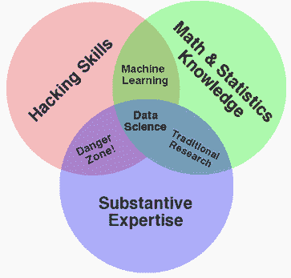
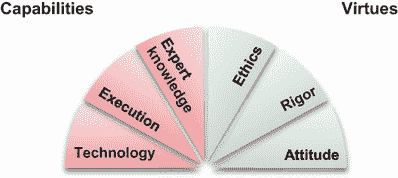
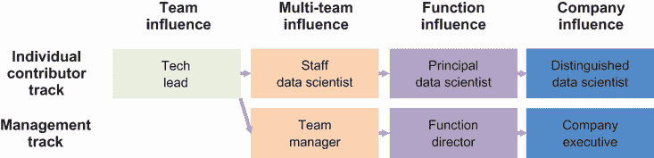
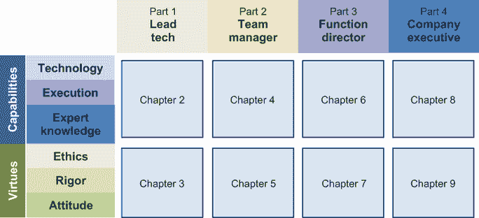

# 1 成功的数据科学家具备哪些特质？

本章涵盖

+   学习数据科学家应具备的期望

+   探讨数据科学家职业发展的挑战

数据科学（DS）正在推动我们对周围世界的量化理解。当聚合大量数据的技术与廉价的计算资源相结合时，数据科学家可以通过分析和建模发现模式，其规模在几十年前是不可能的。通过数据对世界的这种量化理解正在被用来预测未来、驱动消费者行为和做出关键的商业决策。用于提高我们对世界理解的科学过程使我们能够基于可测试和可重复的结果制定解决方案。

领导力是通过对周围的人施加影响、培养、指导和激励，以放大你的能力，从而产生比个人所能达到更大的影响。作为技术个人贡献者和作为人员管理者，都有机会进行领导。

| 001 | 领导力是通过对周围的人施加影响、培养、指导和激励，以放大你的能力，从而产生比个人所能达到更大的影响。作为技术个人贡献者和作为人员管理者，都有机会进行领导。 |
| --- | --- |

在许多敏捷的组织中，建立数据科学功能以产生行业领先的数据驱动创新目前触手可及。然而，拥有数据科学团队的 95%的公司，其团队人数少于 10 人[1]，[2]。能够领导项目、培养团队、指导职能和激励行业的领导人才稀缺且需求量大。本书为每位数据科学家规划了许多职业发展的路径，并分享了优秀数据科学团队和组织中角色的期望。

本章介绍了数据科学家的历史和当前期望，讨论了数据科学家至关重要的硬技能和软心理社会美德，并分享了案例研究中的面试和晋升挑战。旨在帮助你在工作场所中定位真实的机会和挑战。让我们开始吧！

## 1.1 数据科学家的期望

2010 年，德鲁·康威提出了著名的数据科学 Venn 图[3]（图 1.1），该图明确了在新兴的数据科学领域取得成功所需的三个技能支柱：数学和统计学知识、黑客技能和实质性专业知识。Venn 图通过将一组独特的技能结晶在罕见的人才群体中，推动了数据科学领域的发展，为国家和企业、组织释放了非凡的机会。

图 1.1 2010 年德鲁·康威的数据科学 Venn 图

康威博士后来创立了多家科技公司，包括 Datakind、Sum 和 Alluvium。自那时起，无数博客和书籍都引用了他引入的维恩图。到 2021 年，全球已有超过 20 万名 DS 从业者获得了“数据科学家”的称号。这个领域是如何演变的？

### 1.1.1 十年后的维恩图

虽然许多 2010 年的原始术语和想法仍然有效，但关于 DS 维恩图的话题已经进行了更新、辩论，甚至战斗；通过简单的关键词搜索，就能找到成百上千的变体。数据科学家的角色自其诞生以来已经显著扩大。到 2021 年，数学和统计知识支柱已经扩展到更广泛的*技术*能力。技术能力包括工具和框架，帮助你更有效地领导项目。它们用于构建问题框架、理解数据特征、在特征工程中进行创新、在建模策略中提供清晰性，并设定成功的期望。

漏洞技能支柱已经扩展到*执行*能力，现在包括你从模糊的需求中指定项目、优先排序和规划项目，同时平衡难以权衡的因素，如速度与质量、安全与问责制、文档与进度。

实质专业知识已经扩展到包括拥有*专业知识*来阐明项目与组织愿景和使命的一致性，考虑数据源细微差别，并在组织中克服结构性挑战以成功启动项目。虽然这些是构成成功数据科学家的支柱，但我们发现，要找到在所有三个维度上都很强的人是困难的，如果不是不可能的话。

例如，一个具有学术背景进入 DS 领域的数据科学家通常只在技术维度上具有强大的能力。一个在行业中有多年经验的数据科学家通常可以在工作中掌握执行最佳实践，包括部署可扩展和可维护的 DS 解决方案的能力。一个在具有实质性专业知识领域的长期从业者很少见，并且可能对合适的雇主非常有价值。

这些三个能力，技术、执行和专业知识，是否足够在今天的 DS 领域取得成功？让我们来揭晓答案！

### 1.1.2 缺失的是什么？

就像任何领域的从业者一样，我们在组建团队时也有我们的盲点。虽然我们勤奋地评估了候选人在技术、执行和专业知识方面的能力，但我们的招聘失误在最终轮的执行面试中被否决时显现出来，或者更糟糕的是，被雇佣后不得不被团队管理出来。许多这些失败都被总结为“不适合文化”。但这究竟意味着什么？

我们正在寻找的 DS 领域的“*适应*”文化是什么？这与组织的文化或行业的文化有何不同？为了分析这些失败，本书扩展了数据科学家的访谈、审查和晋升标准，不仅考虑了数据科学家的*能力*，还考虑了他们在追求 DS 职业中的*美德*。

根据古希腊哲学家亚里士多德的说法，美德来自于多年练习对自己和社会都有益的善良。它们是个人习惯性行为，刻印在个人的性格中。

数据科学中的美德是培养出来的。我们强调三个维度的美德，这些美德可以培养成习惯性行为，随着时间的推移成为数据科学家性格的支柱：*伦理*、*严谨*和*态度*。

我们发现，当数据科学家在这三个维度上保持良好的实践时，他们更有可能对他们的组织产生重大的积极影响，并在他们的职业生涯中取得进步。另一方面，当数据科学家忽视一个或多个这些维度时，他们可能会陷入困境，需要导师指导，在某些情况下，他们可能需要被管理出去。

具体来说，我们定义数据科学家的三个美德为：

+   *伦理*—在工作中的行为准则，使数据科学家能够避免不必要的自我造成的崩溃。数据科学家的工作伦理包括许多方面，如数据使用、项目执行和团队合作。

+   *严谨*—产生数据科学家产生结果信任的工艺。严谨的结果是可重复的、可测试的和可发现的。严谨的工作产品可以成为创造企业价值的坚实基础。

+   *态度*—数据科学家对待工作场所情境的情绪。带着积极性和坚韧不拔的精神去克服失败，数据科学家应该是好奇且建设性的团队成员，尊重横向合作中的不同观点。

美德应该适度实践。做得太多和做得不够一样糟糕。例如，过多的严谨可能导致分析瘫痪和犹豫不决。过少的严谨可能导致结论错误，导致不良后果，并失去高管和商业伙伴的信任。

| 002 | 美德应该适度实践。做得太多和做得不够一样糟糕。例如，过多的严谨可能导致分析瘫痪和犹豫不决。过少的严谨可能导致结论错误，导致不良后果，并失去高管和商业伙伴的信任。 |
| --- | --- |

将伦理、严谨和态度的美德与技术和执行、专业知识的能力结合起来，我们有一个有效的数据科学家六个基本期望领域。

### 1.1.3 理解能力和动机：评估能力和美德

在定义并包含在成功期望中之后，我们将 Drew Conway 的维恩图转化为一个有六个部分的扇形：技术、执行、专业知识、道德、严谨和态度——或者称为“TEE-ERA”扇形（图 1.2）。本书旨在引导你通过这六个维度，为你在数据驱动组织“ERA”的下一级领导层次上产生更多影响做好准备。我们从个人技术领导开始，然后描述团队、职能、直至公司及行业层面的 C 级人员的每个领导层级。

图 1.2 TEE-ERA 扇形

除了是数据科学能力的缩写外，“TEE”还强调了数据科学家需要成为 T 型人才的需求。T 形中的水平线代表在各个维度上的基本能力和美德。T 形中的垂直线代表在能力美德的至少一个维度上的深度。除了是数据科学美德的缩写外，“ERA”还强调了数据科学家工作的数据驱动环境以及组织对他们的期望。

一个通才，或者说一个具有广泛能力但无专注专业领域的“-”型数据科学家，对于一个组织来说可能很有价值，尤其是在新数据科学团队成立初期。然而，除非通才在至少一个专业领域发展出身份，否则他们可能会发现很难维持一个不断成长的数据科学团队的尊重。发展深度可能比你预期的要容易，因为业务领域的专业知识是一个高度受重视的深度维度，任何勤奋的通才数据科学家都可以通过日常工作积累。

一个专家，或者说一个“I”型数据科学家，在一个领域有深入的知识，但在能力和美德方面覆盖不全面。专家可能能够作为一个大型团队的积极成员做出贡献，但将需要密切的管理或与团队成员的互补伙伴关系作为他们在日常工作中的“拐杖”。专家可能会发现很难晋升到领导职位，以制定或影响更有影响力的技术或战略方向。

数据科学家可以从通才或专家开始。随着你职业生涯的进步，你会发现组织越来越重视 T 型人才。这些人拥有广泛的能力和至少在一个维度上的专业知识深度，他们可以平衡技术和商业权衡，并赢得同事的信任和尊重。

TEE-ERA 是组织将越来越重视的能力和美德。由于技术负责人、经理、总监和执行人员的范围和责任不同，我们为每个领导层级都分配了章节。我们相信这六个维度在追求数据科学领域有影响力的职业生涯中将是必不可少的。

## 1.2 数据科学职业发展

根据 LinkedIn Talent Insight 数据，2020 年只有大约 33%的数据科学家在拥有 30 名或更多数据科学家的公司工作[2]。在大公司中，通常有成熟的过程来面试、评估和促进数据科学领域的职业发展。这些大公司仅占所有雇佣数据科学家的公司的 1%。

极大多数（67%）的数据科学家在拥有不到 30 名数据科学家的团队的公司工作，这代表了雇佣数据科学家的公司的 99%。在这 99%的公司中，数据科学家的职业路径可能并不那么清晰。

在 DS 团队规模较小的基础上，公司还组织了集中或分布式的 DS 功能。分布式结构进一步限制了 DS 职业发展的潜力。在这些分布式团队中，DS 通常被视为支持功能，数据科学家没有具有 DS 专业知识的经理来指导他们的成长。

即使在集中的数据科学团队中，数据科学家如何在成为管理者之前在职业生涯中进步往往也不清楚。图 1.3 展示了数据科学家在个人贡献者和管理职业路径上的职业发展路径。职业阶段之间的主要区别是数据科学领导者的影响力范围及其对组织的积极影响。

图 1.3 数据科学领导力职业发展路径

本书分享了您可以应用于任一路径的建议、技术和快速胜利。虽然选定的部分，如 4.2.1 节关于在您的监督下建立强大团队，主要适用于管理路径，但本书超过 80%的内容也适用于个人贡献者路径的数据科学家。

截至 2021 年，很少有公司建立了正式的数据科学职业路径，更不用说数据科学个人贡献者职业发展路径了。尽管本书的轮廓将遵循图 1.4 所示的管理路径，但本书的大部分内容也适用于个人贡献者路径。

图 1.4 四部分八章节的管理路径

为了帮助您导航材料，在 1.2.1 节中，我们展示了跨越多个职业阶段的七个真实场景，以说明数据科学从业者在其职业生涯中可能面临的各种职业发展挑战。这些场景发生在角色中，在过渡期间，在面试中，或在晋升决策周围。对于每个场景，我们在 1.2.2 节中提供了指向章节的提示，这些章节详细讨论了什么因素使数据科学领导者成功。这些场景远非全面。而且，许多数据科学从业者的挑战也适用于技术个人贡献者领导角色。让我们来看看这些场景吧！

### 1.2.1 面试和晋升难题

数据科学家的职业旅程可能有多种不同的起点。一些数据科学家来自分析师背景，而另一些则来自软件工程。还有一些人在完成硕士、博士或专业课程后进入他们的第一个数据科学角色。

这本书是关于数据科学（DS）中的领导力。我们以一位初入行的数据科学家面临的面试挑战作为我们的第一个案例。然后，我们展示了技术负责人、经理、总监和行政人员所面临的挑战。一些挑战也被追求技术个人贡献者领导职业的员工、主要和杰出数据科学家所经历。

让我们分析这些场景，看看这些数据科学实践者如何通过本书后面讨论的技术来改善他们的处境。我们在第 1.2.2 节中揭示了这些挑战的背景和行动建议。

案例 1：进入数据科学面试的困扰

Aayana 是加州大学洛杉矶分校（UCLA）计算机科学的研究生。她随和的性格掩盖了她对技术工作的严谨态度。自从 15 个月前从印度来到美国以来，她已经选修了几个高级机器学习课程，与两个著名的研究团队合作，并在一家快速成长、即将上市的风险投资谷初创公司实习。

六个月后就要毕业了。像许多有抱负的年轻专业人士一样，她开始面试全职职位。然而，在面试了几次之后，Aayana 似乎失去了她通常的自信，并迫切寻求导师的帮助。发生了什么事？

结果表明，Aayana 遇到的每一次数据科学面试都相当不同。自然语言处理（NLP）工程职位的面试以关于她先前项目的非正式聊天开始。

另一次面试，是一家金融科技初创公司的面试，开始时要求她写下整个数据管道。Aayana 获得了关于数据稀疏性和可用样本大小的信息，并被要求提出最佳算法建议。然后，她被要求改进数据管道，以更好地处理最终模型所需的原始数据。

这些面试看起来与她在几周前表现优异的机器学习课程考试非常不同。由于数据科学面试流程的起点大相径庭，她对预期的情况感到迷茫。

Aayana 感到困惑和沮丧。她不知道是否有标准的数据科学面试流程，或者每个公司和每个团队都会有不同的招聘标准。

案例 2：数据科学家晋升问题

Brian 两年前加入 Z 公司担任高级数据科学家。他是一位有咨询公司和互联网公司工作经验的合格数据科学家。在同一时间加入的几位同事已经从高级数据科学家晋升为技术负责人。

Brian 渴望成为技术领导者，并设定了一个短期目标，即从高级数据科学家晋升为技术负责人。他在最近的一次一对一会议中向经理 Walt 提出了这个目标；然而，Walt 只是告诉他，他做得不错，但需要更一致地交付。确实，Brian 作为 Z 公司的高级数据科学家，每个季度完成的项目数量最多，尽管这些项目没有产生显著的结果。

与 Brian 一起负责实时营销活动的营销总监几乎每周会议后都希望获得额外的洞察。Brian 感觉有义务服务于项目利益相关者并提供更多洞察，这些工作超出了原始项目范围。当这导致上季度末与客户成功部门的客户流失预测项目开始日期推迟时，Brian 不得不匆忙完成它。Brian 承担的其他许多项目也都被推迟。即使按时完成的项目也牺牲了质量。

Brian 试图通过在最近的项目规划周期中考虑额外的工作来解决这个问题。然而，当他这样做时，这看起来就像他不如其他队友那么高效，或者是在对进度进行沙袋操作，为他在承担的 DS 项目分配了比必要的更多冲刺。

Brian 感觉陷入了一个没有进展的循环。他该如何提升自己的职业生涯，并在 Z 公司成为技术领导者？

案例 3：技术负责人挑战

Jennifer 在她加入公司六年后，已经进行了两次横向调动并两次晋升。最初加入公司时担任业务运营分析师，一年后转入了商业智能（BI）部门。三年前，当公司成立 DS 团队时，她从 BI 部门跳槽，转型成为数据科学家。一年半后，Jennifer 被晋升为高级数据科学家；然后，三个月前，她又晋升为员工数据科学家——在她公司也被称为团队负责人。

在担任高级数据科学家期间，Jennifer 已经证明了自己擅长与公司内的业务合作伙伴沟通，包括营销、销售、客户服务和运营。凭借她对业务的了解和在公司的资历，她也不害怕对项目范围蔓延进行反击，以确保项目按时完成。她对于承担新的技术负责人职责感到非常兴奋。

虽然初级 DS 团队成员欣赏她的指导，但更有经验的团队成员感觉被微观管理。团队士气急剧下降，因为人们认为他们被要求做很多琐碎的工作。

Jennifer 感到沮丧：“我已经尽我所能赋能团队，并教他们最佳实践。他们还能要求我做什么？”发生了什么？

案例 4：DS 经理的烦恼

作为一名来自高度选择性的数据科学奖学金项目的毕业生，Paul 被一家专注于成熟产品线收入和保留优化业务的全球互联网公司招聘，并在那里工作了三年。他认为自己非常幸运，能够为一位他非常尊敬的杰出经理工作，并渴望有朝一日自己也能成为这样的人。

六个月前，Paul 的机会来了。他的研究生同学，在一家后期生物技术初创公司负责运营研究，邀请他来管理数据科学团队。Paul 欢迎这个机会，并自信地认为他在一家规模更大的公司积累的经验和学习为他做好了充分的准备。

技术上强大的 Paul 还投入了大量精力去建立与数据科学团队的联系。除了项目相关的会议外，Paul 还安排了每周与他的七位团队成员进行散步或聊天，每周安排办公时间以确保他随时可以为团队提供服务，并举办每两周一次的“数据科学早餐会”，以便与项目利益相关者和商业伙伴保持频繁的沟通，了解他们的需求并保持他们知情。

经过六个月，Paul 感到精疲力尽，但业务成果最多只是混合：他团队参与的五个主要项目中，有两个进展顺利，有两个延误，还有一个项目范围发生了显著变化。还有一些小项目甚至还没有起飞。似乎 Paul 的努力并没有像他预期的那样得到足够的回报。他是否在做正确的事情？或者这是否是在度过最初的蜜月期后面对现实的案例？Paul 如何才能成为一名优秀的经理？

案例 5：DS 经理面试问题

Audra 是一家初创公司的一名数据科学（DS）领导者，管理着项目和一支由四位数据科学家组成的团队，已经接近两年时间。她一直渴望发展自己的职业生涯。当同行业内一家更大公司的管理机会出现，并且有机会管理一个更大的团队时，她毫不犹豫地申请了这个职位。

她开始面试过程时相当自信：她通过了技术测试，拥有坚实的行业知识基础，性格讨人喜欢，并在当前角色中表现良好。然而，在与招聘经理、团队和公司高管的三轮面试后，她并没有作为最佳候选人脱颖而出，最终也没有得到工作机会。由于面试公司没有提供详细的反馈，她的案例被认为是文化不匹配。

Audra 感到失望和困惑。她思考了自己如何传达对发展职业生涯的热情以及她可以如何做得不同，但并没有想出任何重大的改变。那么，“文化匹配”究竟是什么意思？如果没有反馈，她如何继续发展自己，成为一名追求有影响力的职业生涯的领导者？

案例 6：数据科学总监的担忧

史蒂芬是一位拥有超过 15 年交通运输行业经验的分析和数据科学（DS）领导者。八年前，他主动在一家在线教育平台上学习了一些机器学习课程，并在当时的公司中创立了 DS 实践。六年前，史蒂芬加入了现在的公司，因其在统计学背景、与合作伙伴的良好工作关系以及在公司的长期任职，对业务的广泛而深入的理解而受到尊敬。他一年前晋升为 DS 总监，管理三个 DS 团队，每个团队都有一个专门的内部客户：供应链、财务规划和营销。他管理的三个 DS 团队分别负责供应链、财务规划和营销，每个团队都有一个专门的内部客户。

这是一个很大的角色，史蒂芬能够引导团队在其职责上持续运作。例如，史蒂芬监督了供应链团队的持续运营效率改进项目，财务规划团队的及时投资回报率估算，以及营销团队的常规客户获取和渠道优化项目。他也很高兴听到供应链、财务规划和营销职能的领导者表示，他们的需求得到了满足。

然而，有些事情让史蒂芬感到烦恼。团队士气似乎很低，在过去的一年里，每个团队都有高成长潜力的团队成员离职去寻找其他机会。

史蒂芬渴望了解正在发生的事情，以便至少尝试将其扭转。然而，他感到困惑，因为员工反馈调查只反馈了典型的技术债务和工作与生活平衡问题，这些问题在史蒂芬看来短期内无法改变。还能发生什么？

案例 7：数据执行挑战

凯瑟琳自从在计算机科学领域获得博士学位以来已经过去了 10 年。在过去的六年里，她担任了一家上市公司和一家 200 人初创公司的 DS 负责人。她在那两家公司的领导团队产生了显著的影响。她的成功包括解决客户意识和功能采用以及现有市场收入优化的项目。去年，她被邀请担任一家快速增长的初创公司的首席数据科学家。

在不到一年的时间里，她建立并推进了一个清晰的 DS 技术路线图；为 DS 制定了一系列清晰的战略、使命和原则；并为初创公司赢得了一些令人印象深刻的商业胜利。然而，公司发展迅速，在竞争激烈的人才市场中很难扩大 DS 团队。

凯瑟琳最近被惊到了，当乔什，一个管理两个经理和一支由十二名数据科学家组成的团队的总监，表明他打算离职时。乔什是初创公司的早期员工，在凯瑟琳加入之前向 CTO 汇报。

在与 Josh 的对话中，她评估数据科学家们通常对她领导和管理风格感到满意。然而，Josh 和至少另一位直接下属计划离职。Catherine 对这种情况既感到惊讶又感到困惑。

### 1.2.2 招聘经理在寻找什么？

你可能已经看到过，甚至认同了第 1.2.1 节中的一个或多个案例。这些案例来源于数据科学家职业生涯不同阶段的真实场景，旨在代表职业发展过程中面临的一些挑战。本节简要讨论每个案例，并提供指向深入探讨解决方案概念的章节的指针。

案例 1：解决 Aayana 的 DS 面试难题

UCLA 研究生 Aayana 在经历了不同公司针对初级数据科学家职位的非常不同的面试后，失去了信心。面试官似乎关注的领域与她在学校中表现优异的学术课程大相径庭。

结果表明，要成为一名成功的数据科学家，需要发展六个不同的技能维度，包括技术、执行、专业知识、伦理、严谨和态度。学术培训主要涵盖其中的两个维度：技术和严谨。

面试中交织的品德的评估可能会将对话引向许多不熟悉的领域，从而产生困惑和挫败感。招聘自然语言处理（NLP）工程师职位的面试目的是寻找她在技术工作中的严谨性，我们在第 3.2 节中对此进行了广泛讨论。金融科技初创公司关注她完成整个数据科学（DS）栈的数据科学项目的执行能力，我们在第 2.2 节中进行了讨论。

表 1.1 总结了本书的情况和学习内容。Aayana 首先应该对自己的扎实学术知识充满信心。然后，通过阅读第一章，她可以识别自己在数据科学（DS）理解中的盲点，包括阅读第一章中提到的六个对于在领域内成功实践至关重要的维度。为了了解一个高度成功的个人贡献者能够做什么，请阅读第二章和第三章，这些章节提供了更多细节。

表 1.1 案例 1：Aayana 如何利用这本书开启她的职业生涯

| 案例 | 情况 | 有用的概念 |
| --- | --- | --- |

| Aayana 新毕业生 | Aayana 在经历了不同公司针对初级数据科学家职位的非常不同的面试后，失去了一些信心。 | **优势：**

+   展示强大的学术知识

**机会：**

+   通过阅读第一章至第三章更好地了解数据科学家的能力和品德

**支持请求：**

+   寻求校友和导师的指导

|

Aayana 还可以利用她学校的校友网络和 LinkedIn 网络中的人脉，以获得关于各家公司倾向于强调的领域的指导。这样，她可以更好地预测和准备数据科学（DS）领域的各种面试风格。

案例二：解决布莱恩的数据科学家晋升担忧

布莱恩是一位技术扎实的数据科学家，在追求成为 DS 领导者时感到陷入了一个恶性循环。他希望晋升为技术负责人，但他的经理沃尔特看到他在不同项目中的表现不一致。结果发现，他并不舒服于对项目范围蔓延进行反驳和管理成功期望。

表 1.2 总结了情况，并概述了布莱恩可以从书中获得的学习。首先，布莱恩可以通过识别将业务问题框架化为诊断或预测性 DS 项目（在批量模式下或实时操作）来建立自信（参见第 2.1.1 节）。他还在通过仔细的数据特征化和创新算法发现数据模式方面表现出色（参见第 2.1.2 节）。布莱恩最宝贵的特征之一是即使在项目失败的情况下也能保持积极（参见第 3.3.1 节）。

表 1.2 案例二：布莱恩如何利用这本书解决他的晋升担忧

| 案例 | 情况 | 有用的概念（章节参考） |
| --- | --- | --- |

| 布莱恩高级数据科学家 | 布莱恩在技术上扎实，但在与业务伙伴交谈和对项目范围蔓延进行反驳方面不太自在。 | **优势：**

+   确定问题框架（2.1.1）

+   发现数据中的模式（2.1.2）

+   尽管失败仍保持积极（3.3.1）

**机会：**

+   明确和优先排序项目（2.2.1）

+   规划和管理项目（2.2.2）

+   设定成功期望（2.1.3）

**支持请求：**

+   与团队一起学习最佳实践（3.1.3）

+   从经理那里获得职业指导（5.1.1）

|

接下来，他可以使用管理项目范围变化的技术来识别他在明确和优先排序项目中的技能盲点，同时保持关系（参见第 2.2 节）。他还可以帮助与业务伙伴设定项目成功的适当期望水平（参见第 2.1.3 节）。布莱恩可以与他的队友合作，在分享和学习最佳实践方面积极主动（参见第 3.1.3 节），并具体请求他的经理沃尔特进行指导（参见第 5.1.1 节）。

布莱恩可以参考表 1.2 中列出的第二章和第三章的章节，以了解更多关于他的优势和机会的细节。他还可以提前阅读第四章和第五章，以了解他的经理沃尔特的观点和关注点，以及如何在寻求沃尔特的指导、辅导或建议时具体说明。

案例三：解决詹妮弗的技术负责人挑战

詹妮弗是一位强大的技术负责人，具有良好的跨团队沟通技能，并且不害怕对项目范围蔓延进行反驳。然而，一些团队成员感到被微观管理，许多人因她分配的繁重工作而感到压力。

珍妮弗的经理凯与团队交谈，确定了两个问题。为了保持商业伙伴与项目状态同步，珍妮弗每周与团队成员联系两到三次。这种频率对一些团队成员来说有效，但让一些经验更丰富的团队成员感到烦恼。凯还观察到，当商业伙伴对项目进行变更时，珍妮弗领导团队交付结果。但并非所有团队成员都理解变更的原因。当珍妮弗收到这样的反馈时，她感到困惑。难道交付结果不是 DS 技术领导者的职责吗？

表 1.3 总结了情况，概述了珍妮弗可以从这本书中学到什么。首先，她可以通过认识到她在优先级和项目管理方面的优势，同时与合作伙伴清晰地沟通期望来建立自信（见 2.2.1 节）。在应对事件时，她通过进行深入的复盘并采取行动解决根本原因，在领导团队方面非常有效（见 3.3.2 节）。她还在部署模型时对业务影响负责，因为她对目标清晰，对项目影响专注如一（见 3.2.3 节）。

表 1.3 案例 3：珍妮弗如何利用这本书解决技术领导者的挑战

| 案例 | 情况 | 有用的概念（章节参考） |
| --- | --- | --- |

| 珍妮弗 | 珍妮弗擅长跨团队沟通，但她的队友感到被微观管理，并对大量琐事感到不满。结果证明，她需要提高她在沟通变更和与团队成员建立信任方面的技能。| **优势：**

+   优先级和项目管理（2.2.1）

+   在事件响应中领导（3.3.2）

+   对结果负责（3.2.3）

**机会：**

+   有效地沟通变更（3.1.2）

+   信任团队执行（5.3.2）

+   自信地传授知识（3.1.3）

**支持请求：**

+   在团队失败中培养积极态度（3.3.1）

+   向管理者寻求职业指导（5.1.1）

|

接下来，珍妮弗可以应用执行、伦理和严谨的技术来改善情况。更具体地说，她可以识别她在信任团队执行方面的技能盲点，从而确保项目进度而无需每周检查两三次（见 5.3.2 节）。当商业伙伴发起变更时，珍妮弗可以更好地沟通变更的原因和背景（见 3.1.2 节）。对于团队中的资深成员，她可以通过鼓励他们与他人分享所学来提供建立身份的机会（见 3.1.3 节）。

通过指导她的团队在常规项目和失败的项目中识别他们的学习成果，她可以培养团队在逆境中保持积极态度（见 3.3.1 节）。她还可以更具体地寻求管理者的指导，以帮助她作为领导者成长（见 5.5.1 节）。

Jennifer 可以参考表 1.3 中列出的第三章和第五章的章节，并每两周选择一个机会领域进行工作。她还可以安排自我检查点来评估自己的进度，并与团队和经理一起练习她的能力和美德，成为一个更成功的科技领导者。

案例 4：解决保罗的 DS 经理烦恼

保罗在担任 DS 经理六个月后感到疲惫，他的努力只取得了混合的结果。为了建立关系，他接受了太多的请求，并使他的团队过于分散。看起来他在确定重点方面几乎没有表现出领导力。

表 1.4 总结了保罗的情况，并提供了他下一步可以采取的措施。首先，保罗可以通过认识到他在技术技能方面的优势来建立自信。具体来说，他擅长构建 DS 问题并发现数据模式（参见第 2.1 节）。面对困难的权衡时，保罗能够在速度和质量、安全性和问责制、文档和流程之间取得平衡（参见第 2.2.3 节）。他还能通过共同的过程和框架在项目之间管理一致性（参见第 4.1.2 节）。

表 1.4 案例 4：保罗如何利用这本书来解决 DS 经理的烦恼

| 案例 | 情况 | 有用的概念（章节参考） |
| --- | --- | --- |

| 保罗 经理 | 保罗在岗位上工作了六个月后感到疲惫。他擅长建立关系，承担了许多请求，并变得不知所措。当他过于分散精力时，他似乎没有足够的领导力来集中团队。 | **优势：**

+   构建问题和发现模式（2.1.1，2.1.2）

+   平衡权衡（2.2.3）

+   在项目之间管理一致性（4.1.2）

**机会：**

+   规划和优先级（2.2.1）

+   扩展知识（4.3.1）

+   向上司管理（4.2.3）

**支持请求：**

+   团队负责影响（3.2.3）

+   经理赞助/支持项目（6.1.3）

|

接下来，他可以通过理解请求背后的动机；评估请求的范围、影响、信心和努力；并优先考虑项目，以使团队专注于产生对业务最有影响的领域（参见第 2.2.1 节）。他还可以拓宽他的领域知识（参见第 4.3.1 节），并注意管理他经理的期望（参见第 4.2.3 节）。

在与团队合作时，他可以通过展示业务影响在关键业务指标中培养团队成员承担更多责任。他通过进行概念验证（PoC）项目和偿还技术债务来关注执行速度，这将有助于消除执行风险（参见第 3.2.3 节）。

为了减少合作伙伴的执行风险，保罗还可以请求他的经理、DS 经理的帮助，以在公司内部为他的项目确定并引入赞助者和支持者（参见第 6.1.3 节）。

第二章和第四章中的概念讨论了保罗的许多优势和机会。他可以每两周选择一个机会领域进行工作，并为自己安排检查点以自我评估进度。他还可以与团队和经理合作，练习他的能力和美德，以成为一个更成功的经理。

案例 5：解决 Audra 的 DS 经理面试问题

在没有得到她认为非常符合条件的职位的工作机会后，Audra 感到失望和困惑。结果发现，在 Audra 的面试过程中，至少有两名面试官指出，她主要关注自己的职业道路和发展，几乎没有谈论她领导的团队。当被问及她是否有管理职位的继任计划时，很明显她没有。

表 1.5 展示了 Audra 的情况，并为她下一步可以做什么提供了指导。她可以认识到她在管理不同团队之间 DS 努力的一致性方面的优势，以最小化技术债务的积累（参见第 4.1.2 节）。她也非常擅长根据与公司愿景和使命的一致性来阐明机会的商业背景（参见第 2.3.1 节）。这样，她可以确保她的团队项目是重要的、有用的和值得的。她还有经验和领域知识，可以根据项目的范围、努力和影响，对项目的投资回报率进行现实估计，以便进行优先级排序（参见第 4.3.3 节）。

表 1.5 案例 5：Audra 如何利用这本书来推进她的职业生涯

| 案例 | 情况 | 有用的概念（章节参考） |
| --- | --- | --- |

| Audra 经理 | 在没有得到她认为非常符合条件的职位的工作机会后，Audra 感到失望和困惑。招聘经理发现她过于专注于建立自己的职业生涯。她没有展示出她在培养团队。 | **优势：**

+   确保一致性（4.1.2）

+   阐明商业背景（2.3.1）

+   评估优先级的投资回报率（4.3.3）

**机会：**

+   指导、辅导和咨询（5.1.1）

+   承担更广泛的职责（5.1.3）

+   管理制作者与经理的时间表（5.3.1）

**支持请求：**

+   团队相互学习（3.1.3）

+   经理帮助制定清晰的职业路线图（6.2.2）

|

接下来，她可以识别自己技能中的盲点。作为一名经理，一项主要责任是赋予每个团队成员发挥其职业生涯最佳水平的能力。她可以通过及时指导、指导和建议来学习更好地培养团队（参见第 5.1.1 节）。另一个领域是与同级经理合作，在更广泛的管理职责上做出贡献和互惠，特别是在雇佣、团队运营和团队建设方面（参见第 5.1.3 节）。她还可以在安排站立会议和一对一会议时更加敏感于制作者和管理者日程之间的差异，以便更好地根据团队成员对大块时间集中的需求进行定制（参见第 5.3.1 节）。

她可以鼓励团队成员自信地传授知识，建立跨指导的文化（参见第 3.1.3 节）。她还可以从她的经理那里寻求指导机会，以明确自己的职业成长路径和重点领域（参见第 6.2.2 节）。

ConcTable 1.5 epts 在第四章和第五章中讨论了 Audra 的许多优势和机遇。当 Audra 能够专注于指导和培养她的团队，并对团队的需求更加敏感时，她将成熟为一个更成功的 DS 经理。

案例 6：解决史蒂芬的 DS 总监级关注点

史蒂芬，一位备受尊敬的导演，注意到 DS 团队的士气因几起令人遗憾的流失而下降，但他不知道如何扭转这一局面。结果证明，史蒂芬所管理的团队正在感受到缺乏明确技术路线图的痛苦。

随着公司的发展，现有的基础设施和工作流程往往因不断增长的业务需求而承受压力。然而，如果团队成员看不到一条明确的路线图，将他们从由技术债务引起的更频繁故障的恶性循环中解脱出来，士气将受到影响，他们开始寻找加入其他团队的替代方案。

表 1.6 展示了史蒂芬的情况，并提供了他下一步可以采取的行动指南。他可以通过将他的广泛领域经验应用于针对紧急问题快速实例化初始解决方案来识别自己在解决挑战中的优势（参见第 6.3.2 节）。他还可以通过讲故事的方式提供有说服力的演示，在合作伙伴面前自信地代表 DS（参见第 5.1.2 节）。在沟通复杂问题时，他可以将它们提炼成简洁的叙述，供他的团队和合作伙伴参考（参见第 5.2.3 节）。

表 1.6 案例 6：史蒂芬如何利用本书解决总监级关注点

| 案例 | 情况 | 有用的概念（章节参考） |
| --- | --- | --- |

| Stephen 导演 | 史蒂芬去年晋升为导演。他因技术技能、合作伙伴关系和领域知识而受到尊敬。他因团队士气低落和流失而烦恼。结果证明，缺乏明确的技术路线图。 | **优势：**

+   快速解决紧急问题（6.3.2）

+   代表 DS 跨职能（5.1.2）

+   为复杂问题提供清晰性（5.2.3）

**机会：**

+   制定清晰的技术路线图（6.1.1）

+   从事件中有效学习（5.2.2）

+   建立清晰的职业路径（6.2.3）

**支持请求：**

+   团队更好地向上管理（4.2.3）

+   高管设定数据科学使命（8.2.1）

|

接下来，他可以识别自己在技能组合中的盲点。作为一名总监，他可以学习如何制定各种类型的技术路线图，与团队和合作伙伴沟通并同步，以实现整体业务目标（参见第 6.1.1 节）。他还可以指导团队深入分析事件事后总结过程，解决技术债务，并确保流程和平台随着时间的推移变得更加稳健和成熟（参见第 5.2.2 节）。为了帮助团队成员了解他们的成长潜力，斯蒂芬还可以为他们职业生涯建立一套清晰的机会、责任和成功评估指标（参见第 6.2.3 节）。

斯蒂芬可以通过更好地协调优先级、及时准确地报告进度以及干净利落地升级问题（参见第 4.2.3 节）来指导他的团队成员更有效地向上管理。他还可以与他的高管协调，明确数据科学部门的使命（参见第 8.2.1 节）。

第五章和第六章讨论了斯蒂芬的许多优势和机会。如果他能够每两周选择一个机会领域进行工作，并安排自我评估的检查点，斯蒂芬在几个月内可以取得一些具体的进展。他还可以使用第四章中的许多叙述与他的团队以及第八章中的叙述向上管理他的高管老板。

案例 7：解决凯瑟琳的数据执行挑战

凯瑟琳，数据科学部门的负责人，对她组织中关键团队领导层的遗憾性流失感到惊讶和困惑。结果证明，数据科学部门并没有像组织中的其他部门那样快速增长，数据科学团队被更多的维护日常运营的项目拖累，而不是战略项目。

尽管凯瑟琳一直是一位出色的内部面向高管，但近年来数据科学人才的市场竞争变得更加激烈。而且凯瑟琳还没有在行业内建立强大的外部形象或人才品牌，以有效地吸引人才。

表 1.7 展示了凯瑟琳的情况，并为她下一步可以采取的行动提供了指导。她首先可以认识到自己作为一个具有前瞻性的主题专家，对正在改变她行业的具体技术保持最新了解的优势（参见第 8.1.1 节）。她也很擅长将数据科学能力融入公司的使命和愿景，使她的团队能够获得高管授权和影响力，与跨职能合作的合作伙伴对齐优先级（参见第 8.2.1 节）。在对齐优先级的基础上，凯瑟琳能够通过良好地掌握人员、流程和平台的管理，持续地交付结果（参见第 6.2.1 节）。

表 1.7 案例 7：Catherine 如何利用这本书解决高管挑战

| 案例 | 情况 | 有用的概念（章节参考） |
| --- | --- | --- |

| Catherine 执行 | Catherine 是一家成长阶段公司的首席数据科学家。她备受尊敬，并制定了清晰的技术路线图。她对令人遗憾的人才流失感到惊讶和困惑。结果是招聘不够快，团队陷入了维护任务中。 | **优势：**

+   阐述长期战略（8.1.1）

+   制定使命和愿景（8.2.1）

+   持续交付（6.2.1）

**机会：**

+   建立强大的人才库（8.2.2）

+   在行业中建立身份（9.3.2）

+   与行业同行区分开来（8.3.1）

**支持请求：**

+   团队推动年度规划（7.2.1）

+   CEO 支持人才品牌建设（8.2.2）

|

接下来，Catherine 可以识别她在技能上的盲点。为了加速她公司 DS 团队的增长，她可以通过采用雇主品牌、内容营销、社交招聘和兴趣小组培养等技术来建立强大的人才库（见 8.2.2 节）。她还可以通过具有竞争力和吸引力的产品特性、稳健高效的技术平台和高效的组织结构等领域为公司建立领导身份（见 9.3.2 节）。Catherine 还可以通过产品、服务、分销、关系、声誉和价格等方面为公司创造实际价值，以区分其产品和服务的差异（见 8.3.1 节）。

在年度规划期间，Catherine 可以指导她的团队承担更多责任，这样她就可以更好地分配时间，专注于建立公司外部身份（见 7.2.1 节）。她还可以与她的首席执行官合作，以获得更多支持，为公司建立人才品牌（见 8.2.2 节）。

第八章和第九章讨论了 Catherine 的许多优势和机会。在行业和 DS 社区中拥有更强的身份，Catherine 可以吸引更多人才加入她的公司，从而在团队中保持日常维护工作和创新工作之间的良好平衡。

在职业生涯的各个阶段进行领导

我们讨论了 DS 职业路径上的七个代表性案例。它们远非全面，但足以说明 DS 领导者面临的常见挑战。

我们设计了第二章至第九章，以帮助您在职业生涯轨迹上获得清晰度，并设定明确的里程碑，以对您的组织产生更大的影响。最终，成就和对业务的影响将推动您的职业增长，无论是在同一团队还是在不同团队中。

您可能会发现向经理和同事介绍这本书既相关又有价值。与数据科学家一起工作的经理和同事可以调整他们对不同领导层级 DS 实践者的期望。

公司和组织在各个行业和规模上都有所不同。我们如何识别那些与我们自身领导力优势最匹配的公司和机会？在本书的最后部分，我们介绍了 LOOP（景观、组织、机会和实践），它将数据科学家的能力和美德应用于追求有影响力的职业生涯。我们以对 DS 领导力的为什么、是什么和如何的讨论结束本书，并展望该领域的未来。

准备好了吗？让我们出发吧！

## 摘要

+   数据科学家的期望已经演变，需要不同的表示方式来捕捉所需的技能。

+   新的期望包括三个硬技术能力（技术、执行和专业知识）和三个软心理社会美德（道德、严谨和态度）。

+   数据科学家在现实世界的面试和晋升中会遇到一些共同挑战。我们简要分析了在七个案例中，经理和招聘经理在寻找什么，这些案例我们将在后面的章节中重新审视。

## 参考文献

[1] “全球人才趋势 2020”，LinkedIn。[在线]。可获取：[`business.linkedin.com/talent-solutions/recruiting-tips/global-talent-trends-2020`](https://business.linkedin.com/talent-solutions/recruiting-tips/global-talent-trends-2020)

[2] “在新二十年代成为数据科学家的成功之道”，[在线]。可获取：[`www.linkedin.com/pulse/thriving-data-scientist-new-roaring-twenties-jike-chong/`](https://www.linkedin.com/pulse/thriving-data-scientist-new-roaring-twenties-jike-chong/)

[3] D. Conway. “数据科学 Venn 图。” DrewConway.com。[`drewconway.com/zia/ 2013/3/26/the-data-science-venn-diagram`](http://drewconway.com/zia/2013/3/26/the-data-science-venn-diagram)
