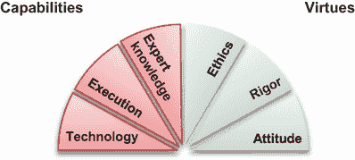
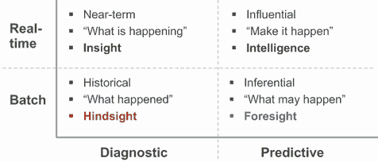
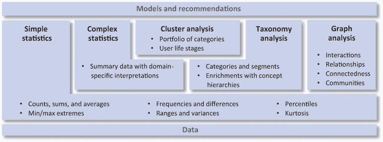
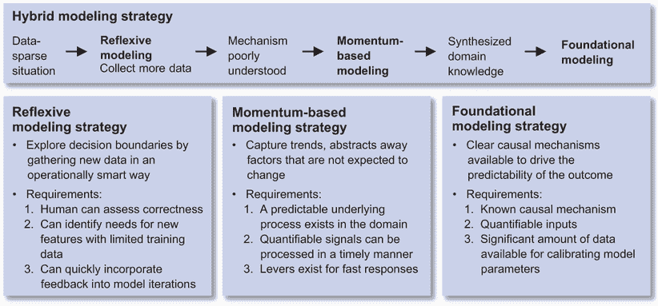
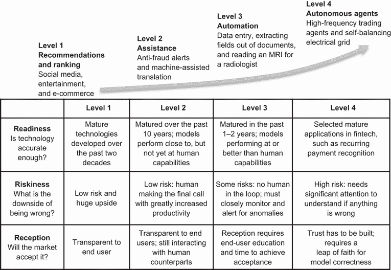
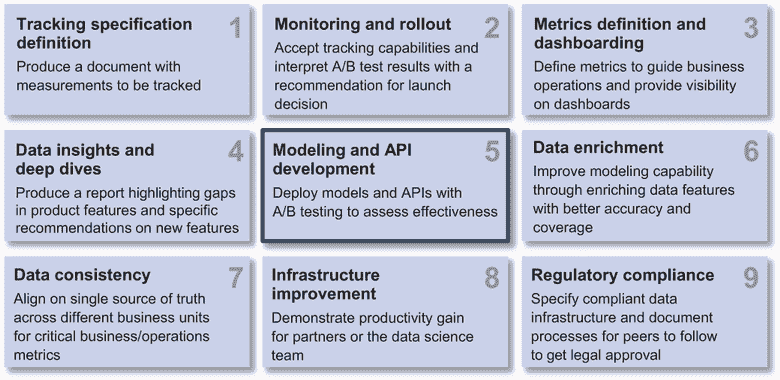
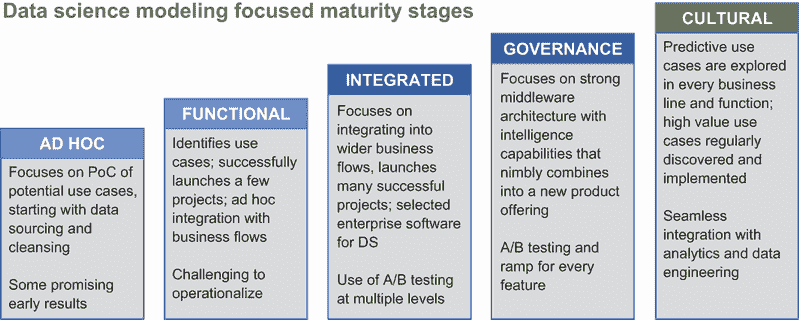

# 2 领导项目的技能

本章涵盖

+   使用最佳实践进行模式发现并设定成功期望

+   从模糊的需求中指定、优先排序和规划项目

+   在复杂的技术权衡之间取得平衡

+   明确业务背景并考虑数据细微差别

+   在组织中导航结构挑战

作为技术负责人，您的数据科学家团队在技术选择、项目执行权衡以及业务知识和环境中寻求您的指导。您被委托帮助团队克服复杂性和模糊性，利用现有资源按时交付技术解决方案。

虽然数据科学家需要许多一般能力才能有效 [1]，[2]，但战略能力将使您作为技术负责人脱颖而出。您被期望指导数据科学家团队并与业务和工程合作伙伴合作，影响他们，而没有任何一个向您汇报，以推动项目前进。

| 003 | 作为数据科学技术负责人，您被期望通过指导数据科学家团队并与业务和工程合作伙伴合作来推动项目前进，而不需要权威。 |
| --- | --- |

这些数据科学家技术负责人的战略能力是什么？以下是本章我们将讨论的三个主题：

+   *技术*—这是您用于更有效地领导项目的工具和框架，它们用于构建问题、理解数据特征、在特征工程中进行创新、在建模策略中提高清晰度以及设定成功期望。

+   *执行*—这是您用于指定具有模糊要求的项目、优先排序和规划项目，同时平衡困难权衡的实践。

+   *专业知识*—这是您用于明确项目与组织愿景和使命的一致性、解释数据源细微差别以及导航组织内部结构挑战的领域知识。

这三个主题涵盖了图 2.1 中 TEE-ERA 风扇的 TEE 部分，以帮助您区分工具、实践和方法，这些工具、实践和方法使您，作为 DS 负责人，能够比作为个人数据科学家产生更大的业务影响。让我们直接进入正题！

图 2.1 TEE-ERA 风扇的 TEE 部分

## 2.1 技术：工具和技能

实践 DS 涉及将业务需求转化为定量框架和优化技术，这样我们就可以从数据中学习模式并预测未来。建立一个从数据中学习的项目有许多挑战，涉及以下三个领域：

1.  构建问题以最大化商业影响

1.  在数据中发现模式：

    +   理解数据特征

    +   在特征工程中进行创新

    +   明确建模策略

1.  设定成功的期望

作为数据科学技术负责人，你可以使用哪些工具在需要时赢得团队的尊重并引起经理的注意？让我们逐一探讨这三个领域。

### 2.1.1 明确问题以最大化商业影响

明确问题比确定数据来源可能更为重要。当你开始时，并非所有数据都唾手可得。一些数据来源可能需要购买或整理。一个强有力的框架可以告知你需要哪些数据来源来实现你设定的目标。明确问题可以帮助你在寻找数据时更加有方向。

| 004 | 明确问题比确定数据来源可能更为重要。一个强有力的框架可以告知你需要哪些数据来源来实现你设定的目标。 |
| --- | --- |

一个商业挑战可以被框架化为不同的数据科学项目规模和范围，从而产生不同的商业影响程度。数据科学技术负责人可以敏锐地意识到商业需求，并可以推荐能够对业务产生巨大影响的数据科学解决方案。

你可以使用的一个工具是评估场景的分析类型和目标定义。你需要问自己的问题包括：

+   分析是否仅限于可以批量处理的历史数据？还是必须考虑实时流数据源？

+   结果仅用于诊断目的吗？还是预期结果将是预测性的？

记得第一章案例 2 中的布莱恩吗？他最近被介绍到一个通过电子邮件渠道推动长期参与度的营销活动。随着团队对项目进行范围界定，布莱恩被要求从数据科学的角度提供建议。

图 2.2 展示了由分析类型（批量数据与实时数据）和目标定义（诊断与预测）创建的四个象限。使用这个分类法，让我们看看布莱恩如何帮助团队明确这个活动的框架：

+   *事后诸葛亮*——一种标准的数据科学实践是运行一个 A/B 测试，其中包含未看到电子邮件营销活动的客户组成的保留集。我们可以运行几个月的营销活动，并评估缺乏营销活动是否会影响长期参与度。这种具有长期实验周期的“事后诸葛亮”在推动运营改进方面并不高效。

+   *洞察*——另一种实践是制作一个实时仪表板，展示长期参与度的趋势。我们可以跟踪长期参与度在不同用户版本中的衰减，以检测成功的早期趋势或问题。这些趋势允许组织实时根据仪表板中的洞察力做出商业决策。

+   *预见性*——给定历史数据，我们还可以构建一个模型，使用可检测的短期参与特征（如打开率、点击率（CTR）、取消订阅率、着陆页会话长度和会话频率）来预测长期参与。预测模型可以通过短期观察来预测长期影响，因此我们获得了预见性，可以每周调整我们的电子邮件营销策略。

+   *智能*——更强大的方法可以包括对电子邮件等渠道的实时分析，以了解客户细分。然后我们可以准备一系列的接触点，以驱动特定用户群体的长期参与。当我们能够根据实时中的个人响应调整下一次接触的内容时，我们开始看到在驱动长期参与中的智能。

图 2.2 向智能实践的不同层次 [3]

通过以不同级别的 DS 能力来界定问题，业务影响可以从 A/B 测试结果增加到自动化仪表板，再到敏捷运营，最终通过用户体验中的智能功能领导长期参与倡议。

图 2.2 中展示的区别可以帮助布赖恩、詹妮弗（第一章，案例 2 和 3）以及你，作为技术负责人，与业务伙伴合作，了解哪个级别最适合可用的资源、可实现的业务影响以及不同项目之间的相对优先级。DS 项目的优先级处理过程在第 2.2 节中讨论。作为技术负责人，你可以识别问题框架中的差距，并与你的经理和合作伙伴合作，制定策略和路线图，以实现你设定的业务目标。

### 2.1.2 在数据中发现模式

作为技术负责人，你需要与团队中的数据科学家合作，从多个维度确保分析或预测的质量，包括理解数据特征、在特征工程上进行创新，以及明确建模策略。

理解数据特征

要理解数据特征，你可以与你的队友阐述数据的四个方面。如图 2.3 所示，这些方面包括*决策单元*、*样本大小/稀疏性/异常值*、*样本分布/不平衡*和*数据类型*。

图 2.3 发现数据模式时需要理解的数据特征

定义不平衡：数据集中正负样本数量数量级的差异。

在现实场景的背景下，清晰的阐述最能说明问题：2020 年的冠状病毒疫情摧毁了全球大部分商业活动。一个亮点是电子商务行业，食品、药品以及几乎所有东西都可以在线订购并送货上门，让人们避免在拥挤的社会场所接触传染病的潜在风险。然而，对于“如果我不喜欢怎么办？”这样的想法，购买摩擦仍然导致人们犹豫不决，错失了许多商业机会。

一种相对较新的创新是名为*退货保险*的保险产品，它消除了部分摩擦。在许多电子商务平台上，在线结账时，客户可以选择一个低成本选项，花费 1-2 美元来为他们的购买提供一些退货信用。保险费被计入购物车，因此不需要单独支付。假设客户对产品购买不满意，他们只需在七天内退货，退货信用将在 72 小时内自动处理，无需经过任何繁琐的索赔流程。这种保险产品在中国电子商务中非常受欢迎。截至 2020 年底，仅在线保险的先驱者众安在线财产保险股份有限公司（6060:HK）就发行了超过 58 亿份保险单，其中大部分是退货保险。

定义：退货保险：一种低成本保险，通常为 1-2 美元，允许电子商务购买退货时支付退货运费。

与任何机会一样，也存在一些注意事项。在任何人都可以注册为在线商家，任何人都可以注册成为电子商务客户的背景下，保险欺诈可能会非常猖獗。当有人可以通过互联网支付 1-2 美元获得 10-20 美元的信用时，寻找攻击保险业务模式的方案就有了显著的动力。一家电子商务公司早期尝试的退货保险报告称，索赔率高达 90%，这是由于欺诈水平显著高，这并不构成可持续的保险业务模式。

使用数据科学（DS）对抗保险欺诈是确保电子商务退货保险业务模式长期可行性的关键用例。

决策单位

电子商务数据，像许多其他数据源一样，在时间、实体和交互方面具有丰富的粒度。仅从时间跨度来看，当客户在购物时，用于捕捉欺诈的分析粒度可以包括：

+   与产品推荐互动

+   购物会话中的探索性行为

+   涉及多个会话的购买决策

+   有意进行多次购买（例如圣诞节、超级碗、返校购物）

+   在人生阶段进行购买，例如毕业、结婚或孩子的出生

对于每一笔交易，涉及的实体包括客户、商家、支付处理器，以及通常是实物商品的承运人。对于每一笔交易，这些实体之间也存在丰富的交互，包括交互上下文和跨多笔交易的交互模式。

定义粒度：一组数据中规模或详细程度，这可以跨越时间、实体和交互等维度。

选择粒度级别来评估退货运输保险欺诈至关重要，这对于构建有效的建模策略至关重要。然而，选择可能并不明显，因为欺诈意图可能来自以下一个或多个方面：

+   购买产品的客户

+   承运人

+   与客户合作的商家

+   一个能够访问电子商务平台上多个被盗身份的黑客

+   创建虚假商家/客户身份以供销售的暗网参与者

在退货运输保险欺诈场景中，一个常见的选择是在购买粒度，这时需要在电子商务结账过程中决定是否提供退货运输保险。根据样本大小和数据稀疏性，评估欺诈的决策单元也可以在客户级别或商家级别。来自其他粒度级别的信息可以作为最终模型中的特征纳入。

样本大小、数据稀疏性和异常值

正常的商业运营可以通过业务扩张、营销活动或网站上的机器人/爬虫引入数据偏差。这些偏差可能影响数据特征，如样本大小、数据稀疏性和异常值。

+   *样本大小*——当样本数量有限时，过拟合的风险增加。为了防止过拟合，我们可以限制使用的*模型*的复杂性或增加正则化*项*权重以平滑模型的决策表面。

+   *数据稀疏性*——某些类型的数据可能缺乏代表性，而总体样本大小可能很大。例如，对于从正面摄像头聚合的自动驾驶数据，由于交通信号灯在交叉路口出现频率较低，因此可能只有很少的样本。

+   *异常值*——与其他观察值显著不同的点可以显著改变数据分布。例如，当意外包含在用户行为分析中时，探索页面所有链接的网页爬虫可以改变网络行为数据。

在构建特征之前评估和理解这些数据偏差至关重要。未能做到这一点可能导致不良的商业决策、浪费的努力和收入损失。

定义过拟合：当模型与有限的数据集过于紧密地一致时发生的建模错误，使得在相同用例中的新数据预测不准确。

模型定义复杂性：模型中使用的特征数量，或用于从数据中提取线性或非线性关系的模型类型。复杂的模型在数据有限的情况下更容易过拟合。

定义正则化项：一个可以在训练机器学习模型时调整模型复杂性的术语。

样本不平衡

欺诈案例通常只占整体交易量的很小一部分。在训练欺诈模型时，样本不平衡问题是常见的。评估不平衡程度并选择更稳健的建模技术，如梯度提升树，对于建模成功至关重要。缓解样本不平衡的常见技术包括随机过采样或欠采样；知情欠采样技术，如 EasyEnsemble 和 BalancedCascade [4]；使用数据生成进行合成采样，如 SMOTE；以及自适应合成采样，如 Borderline-SMOTE [5]。

数据类型

电子商务场景还包括一系列广泛的数据类型，包括：

+   个体样本，例如商品上的文章、图片和视频

+   时间序列数据，例如浏览历史、交易历史和客户服务交互历史

+   基于关系的数据，如客户、商家、支付处理商和承运人之间的互动

这些数据类型需要不同的分析基础设施，并在建模中提供独特的功能和视角。例如，基于关系的数据，如客户、商家、支付处理商和承运人之间的互动，可以用来生成知识图谱，捕捉这些关系。基于知识图谱的方法已被证明在突出有组织金融欺诈中的行为方面是有效的。

DS 团队成员通常会向技术负责人，如第一章中的 Brian 和 Jennifer，寻求对项目成功水平的信心评估。作为技术负责人，你可以利用这些对数据特性的阐述来评估项目的可行性。

特征工程创新

特征工程使我们能够有意义地总结大量数据。简单的模型，如线性回归，在总结数据时严重依赖于特征工程。更复杂的模型，如深度神经网络，甚至可以将特征工程过程自动化，作为模型训练的一部分，并直接使用原始信号作为输入。

在许多用例中，由于样本量小、标记困难以及可解释性和可操作性考虑，你可能会选择使用更简单的模型和工程化特征来发现场景中的模式。

特征工程可以具有许多复杂程度。这些级别在图 2.4 中得到了说明。你可以从简单的统计中构建特征，如计数、总和、平均值、极值、频率、差异、范围、方差、百分位数和峰度。或者你可以注入特定领域的解释，如特定时区的白天或晚上的营业时间，或健康信号的正常或异常范围。对于分类分析，特征可以包括职位名称的资历级别、医疗记录中的诊断类别，或财务交易的购买类别。对于更深一层的特征，可以解释类别组合。对于财务交易，这可能代表他们的收入范围或甚至生活阶段。对于具有实体及其关系的数据库，可以使用图来表示实体之间的关系、它们的互动、它们的连通性以及由这些关系创建的社区。

图 2.4 展示了用于建模的各种特征工程技术

在电子商务场景中，客户数据特征工程复杂度包括：

+   *简单统计*—购买商品的平均价格，购买频率

+   *复杂统计*—工作日/周末活动，冲动购买或考虑购买

+   *基于分类的分析*—购买类别，需求多样性

+   *聚类分析*—类别组合、客户意图或生活阶段

+   *图分析*—与商家的互动模式，欺诈风险

商家、支付处理器和承运商可以具有相似复杂程度的特征来总结丰富的电子商务数据集的信息多样性。

你可以从数据中寻找这些复杂度级别来构建特征。你可能会遇到的一个挑战是，探索丰富的数据集总是有限的时间和资源。你如何进行优先级排序？

你可以使用你的领域专业知识来指导优先级排序。在我们的退货运输保险欺诈缓解场景中，经验丰富的欺诈调查员通常可以使用客户或商家行为中的几个异常线索来拼凑出一个潜在的欺诈计划。

在一个场景中，欺诈调查员认为，在实物商品交易历史较长的商家比主要销售虚拟商品（如电话卡和礼品卡）的商家更值得信赖。历史数据验证了欺诈者通常在为他们的商家账户建立交易历史时寻找捷径，以便在产品搜索结果中排名更高。虚拟商品往往是一种建立交易历史的便捷方式，无需物流操作的麻烦。理解这一特定领域的区别可以优先考虑功能开发并加快准确反欺诈模型的时间。

虽然领域专业知识是集中特征提取努力的必要且宝贵的起点，但它不足以确定应该使用哪些特征。

在另一种场景中，欺诈调查员发现了密码恢复安全问题中的趋势，确认的欺诈者通常将猫或狗作为他们最喜欢的动物的答案。我们可以将这一发现解释为欺诈者在设置他们的商户账户时缺乏思考。然而，当评估这一趋势作为欺诈信号时，我们发现猫和狗是大多数人的最爱动物，无论是否有欺诈意图。将其用作潜在欺诈的警报信号会增加误报率。基于领域专业知识构建的特征必须经过严格的验证，才能被确认为在匹配数据模式中有效。

作为技术负责人，你的特征创新工具箱不仅限于算法。快速生成许多特征的另一方法是建立一个特征评估平台，并将特征提取游戏化，作为一个小型竞赛。这个特征评估平台可以建立在特征存储之上，由一组数据科学家创建和共享特征。

该平台可以自动评估新特征在持续建模挑战中的有效性，例如欺诈警报准确率和召回率。随着数据科学家团队在其各自领域的工作，他们经常为分析开发特定的特征，这些特征可能可以转移到欺诈模型中。有了特征评估平台，你可以邀请整个数据科学、数据工程和数据分析团队为特征库做出贡献。你可以根据特征的有效性，定期奖励排行榜上最优秀的新特征，以促进新的提交。想象一下，这是一个特征创新的框架！

明确建模策略

英国传奇统计学家乔治·博克斯曾写道：“所有模型都是错误的，但有些是有用的。”如果这是真的，那么在构建任何可能错误但有用的模型时，我们应该从哪里开始呢？首先，让我们区分构建模型**策略**和如何开始构建模型的**战术**。

许多书籍和博客都讨论了构建哪些模型这一策略。流行的模型包括：线性回归、逻辑回归、决策树、SVM、朴素贝叶斯、kNN、k-means、随机森林和梯度提升算法。开源机器学习包，如 Python 的 scikit-learn 库，提供了探索构建哪些模型工具。这如图 2.5 所示。

图 2.5 在线可用的算法推荐器示例，回答了构建哪些模型的问题

采用现有的模型实现是所有数据科学家的一项最佳实践。编写自定义的机器学习版本复杂且需要大量时间来验证。并且，对于我们在商业中遇到的大多数情况，已经开发了常见的优化技术。

对于数据科学技术领导来说，关键的区别在于制定如何开始构建模型的策略。虽然有许多建模策略，但让我们深入探讨四种具体的策略（如图 2.6 所示）：

+   基于动量的建模策略

+   基础建模策略

+   反射性建模策略

+   混合建模策略

图 2.6 考虑以匹配数据模式建模的策略

当模型与数据中存在的模式相匹配时，它们是有效的。领域专业知识对于形成关于我们预期模式性质的假设很重要。

让我们检查建模策略，并使用退货运输保险案例来说明它可能如何应用。

基于动量的建模策略

这种策略也被称为基于惯性的建模。它在复杂的多元智能体环境中很受欢迎。该模型预计能够捕捉环境中的趋势，抽象出在特定时间窗口内预期不会改变的基本因素，以预测如果这些趋势持续会发生什么。

基于动量的建模在高频交易（捕捉市场微观结构和订单簿动态）和推荐系统（如基于最近、频率、货币化或 RFM 的模型）中常用，在这些环境中，人或算法决策过程以可预测的方式进行操作。为了使这种策略成功，必须存在以下三个条件：

+   在该领域存在一个可预测的潜在过程

+   可量化的信号可以及时处理

+   存在快速响应的杠杆

在退货运输保险的反欺诈模型中，对于无法从产品或服务中设计出来的已知欺诈机制，可以使用基于动量的建模。这些场景包括为新商家或产品提供保险。我们可以量化这些场景中需要关注的欺诈趋势信号，并在造成过多损害之前激活杠杆来关闭可能的欺诈交易。

基础建模策略

这种选项通常用于有明确的因果机制驱动结果可预测性的场景。在极端情况下，它可以形式化经济中的结构建模，其中决策的结构完全纳入模型的指定中。

基础建模策略可用于应用领域，例如销售预测、基础设施负载预测和财务账户余额预测，在这些领域中，各种周期性模式驱动结果。这些周期性模式可能包括：

+   一天中的时间

+   一周中的某一天

+   每月或半月节奏

+   季度或财年边界

+   产品发布日期

+   营销活动日期

+   地区性假日

然后，模型使用训练数据来评估各种机制的相对权重或影响，以实现预测的良好精确度和召回率。

在退货保险的反欺诈模型中，当我们对已知欺诈机制的常见类型有成熟的理解，并且有强大的*潜在变量*时，基础建模可以很有效，可以评估来自各种已知欺诈机制的风险。例如，我们可能从以下类别考虑每笔交易的欺诈风险，并使用基础模型进行整体风险预测：

+   *客户*—频繁购物/退货产品

+   *商人*—高退货率

+   *承运人*—与高退货率相关

+   *商人/客户*—证实虚假交易

+   *商人/客户/承运人*—*以前被黑客攻击的身份*

+   *虚假商人/客户身份*—由暗网玩家孵化以出售

当用于已知欺诈类别的潜在变量不再捕捉到当前欺诈机制时，基础模型会失败。

定义 潜在变量：不可直接观察的变量。在这种情况下，它们是在决策时可以推断但无法直接观察的风险成分。

反思建模策略

这种策略也被称为主动学习策略。在许多情况下，仅通过查看现有数据来定义正负案例的边界往往具有挑战性。为了改进模型，我们需要以操作上智能的方法探索决策边界，以收集额外的数据用于训练迭代。

用例示例包括多类分类，如职位标题分类和医疗保健提供者分类，或从欺诈调查专业人员那里获得主动反馈的欺诈检测。在欺诈检测用例中，欺诈调查专业人员可以根据可能或可能尚未包含在特征提取管道中的观察结果评估边缘欺诈案例，并将其纳入训练。

当退货保险产品处于起步阶段时，反思建模策略在聚合欺诈机制方面可以非常有效。它允许欺诈模型更好地阐明好与坏之间的分离，并在必要时纳入额外的特征。通过反思建模策略聚合的额外特征和不同样本，我们可以更快地达到一个可接受的运营点，以满足精确度和召回率的要求。

混合建模策略

根据数据集和数据基础设施的成熟度、任务的紧迫性和业务需求，情况通常需要结合之前策略的选择的混合建模策略。

让我们继续以退货运输保险为例。在产品开发周期的早期，一些明显的欺诈方案可能可以通过产品功能设计来预防。例如，服务可能不会扩展到主要销售虚拟商品的商业用户。我们可以在收集有关潜在欺诈方案的数据的同时，从一些简单的决策树开始，用有限的分布编码业务规则。

在收集了有限的数据集后，我们可以开始部署一种**反思策略**，迭代地向欺诈调查专业人士发送边缘案例进行审查和标记，以提高模型的判别能力。对于新商家或面临**冷启动建模挑战**的产品，一种基于**动量策略**可以帮助量化欺诈趋势信号，以便在造成过多损害之前关闭可能的欺诈交易。经过一段时间的运营，收集了大量训练数据集并理解了欺诈机制后，我们可能转向一个基于子模型的组合建模策略，这些子模型检测各种已知的欺诈方案，以产生潜在的风险评分。

定义：冷启动建模挑战：缺乏训练模型所需数据的问题。通常需要收集和标记数据才能开始训练模型。

深入的领域洞察可以塑造一个建模策略来应对手头的业务挑战。没有唯一正确的答案，因为所有模型都是错误的，但有些是有用的。

哇！这有很多策略！作为一名技术负责人，所有这些策略都是你在解读业务挑战和指导数据科学家团队成员解决手头建模问题时可以考虑的选项。当这些策略逐渐深入人心时，不妨休息一下。

### 2.1.3 对成功设定期望

在较小的组织中，当数据科学家与合作伙伴组织的高级管理人员合作，而这些管理人员在听到社交媒体或营销白皮书中的某些机器学习用例后可能有不切实际的期望时，设定期望非常重要。当设定了不切实际的期望时，即使提供了良好的见解和模型，合作伙伴也可能不满意。你可能还记得，这是第一章中高级数据科学家布莱恩需要努力解决的问题。

| 005 | 合作伙伴在听到社交媒体或营销白皮书中的机器学习用例后，可能会对数据科学项目形成不切实际的期望。当设定了不切实际的期望时，即使提供了良好的见解和模型，合作伙伴也可能不满意。 |
| --- | --- |

成功是我们构建数据科学解决方案的目标。在一个“[所有模型都是错误的，但有些是有用的]”的世界里，我们如何定义成功？一个模型必须有多准确才能有用？

在 Acorns，Jike 和他的团队开发了行为上的微投资，以改善人们的财务健康。团队为客户提供了许多优秀的行为推荐。战略问题一直是：这些推荐何时足够准确和个性化，以至于它们能成功地被视为来自受信任的财务助手？

我们学到的是，成功不仅仅取决于模型的**准确性**，还包括实施的**一致性**以及客户对数据驱动解决方案的**信任**。

根据我们能够生成的模型准确性，作为数据科学技术负责人，你应该了解你项目的运营环境，并与客户设定现实的期望。图 2.7 展示了你可以从三个维度（准备度、风险性和接受度）评估的模型四个置信度级别。

图 2.7 评估模型成功程度的置信度级别

第 1 级：推荐和排名

在推荐和排名级别，存在大量潜在的内容，需要将注意力集中在客户身上。目标是预测哪些内容可能对客户最具吸引力。

在探索性环境中，客户的偏好难以量化，因此**期望**是只有一些推荐将是相关的。当涉及到**准备度**时，通过更细致的用户行为聚合，个性化算法可以以一定的准确性对用户进行细分和定位。当我们提供相关推荐时，我们可以获得巨大的参与度收益——即使在许多领域，5%的参与度率也可能产生巨大的商业影响。同时，推荐错误的**风险性**很小。个性化在我们的在线体验中已经被广泛接受，以至于我们甚至可以预测它。

推荐中的**成功**通过**提升**来评估，这映射到使用模型带来的增量业务影响。为了说明提升，从 4%到 5%的参与度提升将是一个 25%的提升（计算方法：5% / 4% – 1 = 25%）。

第 2 级：助手

在助手级别，机器学习模型产生的结果接近人类能力，但还不够好。一个例子是模型辅助贷款欺诈检测。**情境**要求算法向人类欺诈调查员发出可疑贷款申请的警报。**期望**是欺诈调查员评估并决定是否需要拒绝贷款申请。对于**准备度**，一个在精确度为 25%以上且召回率超过 66%的模型已被视为对欺诈调查团队**有用**。任何更高的精确度都可能以**降低召回率**的风险为代价。

**成功**通过欺诈调查中人类生产力的增加来评估。**信心**由循环中的最终人类决策保证。

第 3 级：自动化

在自动化层面，机器学习模型正在产生与人类相当的结果。*场景* 包括数据录入（语音识别）、从文档中提取字段以及放射学中读取医学图像。*期望* 是，虽然会有错误，但结果至少与人类在类似情况下所能做到的一样好。这些能力通常是通过深度学习算法实现的，这些算法通过在大规模样本上进行训练而准备好，这些规模超出了普通人可能接触到的范围。在医疗保健等应用中，预测错误的*风险*可能很高。然而，当在自动诊断服务用于触及之前无法触及的人群的场景中部署时，好处可以超过风险，产生受欢迎的*接受度*。

*成功* 是采用能够以人类精度执行的模型，这样我们就可以显著增加服务范围，以服务之前无法触及的人群。

第 4 级：自主代理

在自主代理层面，机器学习模型正在产生超越人类的能力。我们通过与以下方式互动：

1.  定义问题解决策略

1.  允许模型产生结果

1.  利用时间建立对自主代理能力的信任

一个 *场景* 是高频交易，其中交易决策必须在毫秒到纳秒的范围内做出。没有人能够在这样的时间粒度下解释市场信号、综合信息并做出反应。*期望* 是高频交易背后的模型大多数时候是正确的，这样整个交易簿可以盈利。算法的*准备就绪*程度通过回测广泛评估，因为错误会带来严重的财务影响风险。在这种情况下，模型通常在获得大量交易委托之前会进行广泛的测试。

*成功* 是指人类操作员能够克服对自主代理的信任飞跃，相信它们能够正确地按照定义的策略操作，以产生预期的结果。

| 006 | 对于自主代理来说，*成功* 是指人类操作员能够克服对自主代理的信任飞跃，相信它们能够正确地按照定义的策略操作，以产生预期的结果。 |
| --- | --- |

有效设定成功的期望

通过对客户有更深入的了解和建模能力的提升，解决方案可以沿着信心等级向上移动，从推荐到助手再到自动化，最后到自主代理。然而，当对算法设定不切实际的期望时，就会发生失败。一个典型的例子是自动驾驶，技术的能力几乎与人类相当，并且通常能够在助手级别满足人们的期望。尽管如此，公众仍然被引导到在自主代理级别对其进行评估。作为一个社会，我们仍在建立对自动驾驶在所有条件下正确运行的信任。

在 Acorns，Jike 和他的团队从构建推荐开始，帮助客户为未来储蓄和投资更多。通过利用整个公司的创造力，将行为提示作为推荐来改善客户的财务健康，团队创造了一些点击率，比标准推荐中典型的个位数点击率高出整整一个数量级。团队还开发了一个基础设施，每年可以推出和实验数百个新的行为提示，这可以快速适应新的市场场景，并为金融领域的客户提供及时的帮助。时间将证明 Acorns 高度相关的行为提示推荐能否成功被客户视为在财务援助层面的有益之处。

对于从第一章开始就渴望成为技术负责人的技术扎实的高级数据科学家 Brian 来说，他可以使用这四个信心级别作为叙述，在与业务伙伴讨论项目范围时设定期望，这样他就可以更好地管理时间，更一致地交付高质量的分析。

## 2.2 执行：最佳实践

Gartner 建议，超过 85%的数据科学（DS）项目未能达到预期[6]。许多失败并非由于技术实力不足，而是由于执行质量。在项目执行中存在三个主要障碍：

+   从模糊的需求中指定项目并对其进行优先排序

+   规划和管理 DS 项目以取得成功

+   在艰难的权衡中寻求平衡

许多克服这些障碍的实践都是在工作中学习的，而不是在学术机构、奖学金项目或在线课程中。

现在，让我们集中精力检查每个障碍以及克服它们的实践。

### 2.2.1 从模糊的需求中指定和优先考虑项目

对于新的数据科学技术负责人来说，解释业务需求可能具有挑战性。许多合作伙伴还不熟悉数据科学可以带来的所有能力，并提出了可能只是问题子优解的请求。

有效的 DS 技术负责人学会提出“问题背后的问题”，以对设置 DS 项目取得成功承担个人责任[7]。

| 007 | 有效的数据科学技术领导人员学会提出问题背后的问题，以对设置成功的数据科学项目承担个人责任。 |
| --- | --- |

让我们来看看 Z 公司的首席数据科学家布莱恩，他是一家社交网络公司，被分配与市场和产品团队合作，开发一系列旨在推动长期用户参与的电子邮件活动。但这是否必须是一系列电子邮件活动？

在执行过程中，数据科学技术领导人员应该能够首先与产品和市场合作伙伴讨论问题背后的问题：我们为什么要寻求推动长期用户参与？哪种类型的用户参与对提高企业价值最有价值？投资回报率或 ROI 的期望是什么？

用户获取、激活和保留有各种漏斗阶段。根据活动的目标，每个阶段的长期保留可以达成不同的目标。布莱恩可以与合作伙伴团队分享权衡，以阐明该活动的目标和期望。以下是一些需要讨论的变体：

+   *活跃用户*——为了改善社交网络产品的活跃用户体验，布莱恩可以看看如何使现有的交互功能，如活跃用户的搜索，更加吸引人。这种观点可以包括与搜索便利性相关的功能，如搜索查询自动完成；与搜索结果的互动，如点击率；以及搜索相关性，如搜索结果的停留时间。当搜索结果更具吸引力时，用户可以更频繁地返回参与社交网络应用，从而提高长期参与度。

+   *被动用户*——或者，你可以改善被动用户的个性化推荐，这些用户主要在社交网络产品中被动浏览。这导致通过用户的浏览活动收集个性化提示的项目，例如点击率和停留时间，以识别人们的主题偏好。假设通过分享各种主题来增加内容的多样性，以激发用户的兴趣和好奇心，你可以改善被动用户的长期参与度。

+   *不活跃用户*——对于许多社交网络，平台上存在大量不活跃的用户。改进搜索或推荐功能不会影响他们。提高不活跃用户参与度的一种方法是通过电子邮件与他们取得联系。项目可以采取个性化电子邮件主题行以提升打开率，并通过点击分析对电子邮件内容进行迭代优化。最有力的形式是开发和优化一系列电子邮件，引导用户通过重新参与社交网络的路径，以改善长期参与度。

+   *潜在用户*——有些人还不是社交网络的用户，但我们可以邀请这些人加入网络。如果通过有效的流量来源获得相关意图，大量潜在用户可能会成为活跃用户，从而推动长期参与。项目涉及评估从各种渠道获得的用户转化，例如搜索引擎营销（SEM）；在特定合作伙伴网站上投放广告；或广告需求方平台（DSPs）。鉴于广告预算始终有限且用户转化周期较长，优化用户获取效率以在几个月内推动长期参与可能具有挑战性。

对于处于成长阶段的社会网络平台，活跃用户通常是人数最少的群体，但却是贡献最多长期参与度的；被动用户有最高的潜力通过新功能和激励措施被激活；不活跃用户通常是现有用户中人数最多的，而且更难唤醒。由于转化周期较长，从潜在用户中推动长期参与可能是一项具有挑战性的任务。

与市场和产品合作伙伴合作，了解更广泛的战略，可以帮助你，作为 DS 技术负责人，承担起推荐技术方向的个人责任，以改善将产生最大商业影响用户群体的长期参与度。这是在问问题的背后的问题。

如何进行优先级排序

针对每个商业倡议都有许多可能的项目，作为技术负责人，你该如何优先考虑数据科学（DS）项目？以下是你可以参考的 DS 项目优先级排序的三个层次：

+   创新和影响

+   使用 RICE 进行优先级细化

+   与数据战略保持一致进行优先级排序

第一级：创新和影响

数据科学家在创新和有影响力的项目中茁壮成长。当我们从创新和影响两个维度评估 DS 项目时，两个维度得分高的项目应优先考虑。这些项目可以提供良好的商业回报率，并激励一些最好的 DS 工作。

此外，还有一些常规项目，使用基本的 DS 技术验证假设，这些项目也能提供良好的商业影响。这些项目也应根据其商业影响和低执行风险进行优先排序。同时，我们应该注意不要让 DS 团队成员只从事常规任务而感到疲惫。

一些项目具有创新性，但尚未找到通往商业影响的道路。它们看起来像是*象牙塔*中的想法，这些想法虽然创造了时间消耗，但成功验证却不多。我们应该避免这些项目，直到找到通往商业影响的道路。

对于其他可能只是具有边际影响业务运营的常规工作项目（例如数据报告），我们应该尽可能地进行降级或自动化。有道理吗？

第二级：使用 RICE 进行优先级细化

对于对业务有重大影响的项目，我们可以进一步细化以评估四个领域：*覆盖范围*、*影响*、*信心*和*努力*，或者为了便于记忆，称为 RICE。可以通过这些因素的加权总和来生成项目的初始优先级排名：

+   *覆盖范围*——通常在数据科学项目可以触及的特定人群方面会有权衡。在布赖恩的案例中，为了改善长期参与度，预期的用户群体在人口规模上最大，这是我们最不了解的针对和转换的群体。我们在社交网络上拥有最多的信息和机会来针对活跃用户群体，但这也是用户群体中最小的一个，其覆盖范围比被动、不活跃和潜在用户群体更有限。

+   *影响*——整体业务影响是对可接触人群的关键运营指标的预期提升。在布赖恩的案例中，优化用户获取渠道的提升可能太小，无法影响长期参与度，即使在可以触及最大人群的情况下，也会在几个转换漏斗阶段下游影响长期参与度。同时，对于活跃用户的影响可能很大，但对于一个更小的用户群体，整体影响有限。

+   *信心*——对于一个数据科学项目要成功，需要考虑几个运营风险。你可以评估以下内容：有什么数据可用？在可用的数据中，哪些是可靠的？在可靠的数据中，哪些是具有统计意义的？在具有统计意义的数据中，哪些是可预测的？在可预测的数据中，哪些是可实施的？在可实施的数据中，哪些的回报率是正的？在回报率正的数据中，是否有业务伙伴准备好将其运营化以创造商业价值？为了评估成功的信心，可能存在先前的项目已经探索了数据来源和第三方参考，这些参考已经证明了实施路径或展示了用例的回报率。

| 008 | 你可以通过以下问题来评估项目成功的运营风险：有什么数据可用？在可用的数据中，哪些是可靠的？在可靠的数据中，哪些是具有统计意义的？在具有统计意义的数据中，哪些是可预测的？在可预测的数据中，哪些是可实施的？在可实施的数据中，哪些的回报率是正的？在回报率正的数据中，是否有业务伙伴准备好将其运营化以创造商业价值？ |
| --- | --- |

+   *努力*——确保数据科学项目成功的努力可能比构建模型所需的时间长得多。执行过程通常涉及多个阶段的努力，每个阶段都有具体的目标要实现，例如数据概念验证（PoC）、产品 PoC 和迭代改进阶段。还包括记录学习成果、与业务和工程伙伴进行展示/审查，以及安排和阅读 A/B 测试等内容。努力的粒度可能是几周或所需的冲刺，有时也可以用 T 恤尺寸来估计，例如小、中、大尺寸，用于快速评估。这里要简单明了。

使用范围、影响、信心和努力得分，我们可以构建一个评分卡，为考虑中的项目提供一个绝对的优先级排名，同时在项目之间平衡风险和业务影响之间的权衡。

第 3 级：与数据战略对齐进行优先级排序

许多有影响力的数据科学项目的一个挑战是，它们通常涵盖了整个技术栈，包括数据源识别、数据聚合、数据丰富、建模方法、评估框架和 A/B 测试。虽然每个项目可能需要太多的投资而无法优先考虑，但在数据聚合和数据丰富中可能存在可以项目间共享的组件。完成一个项目可以提供有关其他相关项目可行性和方向的学习。

数据战略可以利用项目之间的关系，综合出一个路线图，其中项目相互依赖。然后，可以将对通用组件的努力分摊到多个雄心勃勃的项目中，以提高投资回报率。

| 009 | 数据战略可以利用项目之间的关系，综合出一个路线图，其中项目相互依赖。然后，可以将对通用组件的努力分摊到多个雄心勃勃的项目中，以提高投资回报率。 |
| --- | --- |

作为技术负责人，你可以与数据科学高管澄清数据战略，并发现跨项目共享间接成本的机会，以便优先考虑高努力、高影响的数据科学项目。

在第 4.1.1 节和第 4.3.3 节中讨论了一些通过战略对齐提高项目效率的具体方法，以允许它们被优先考虑。

### 2.2.2 规划和管理数据科学项目

项目可能失败的方式有很多。作为项目的技术负责人，你的角色包括预测常见风险，或者计划避免它们，或者在它们出现时分配时间和资源来应对失败模式。

在《孙子兵法》中，公元前五世纪孙武的古老教诲，第一章讨论了规划。它指出，“对规划问题的仔细回答将决定谁将成功，谁将失败，甚至在任何军队调动之前。”这对我们今天也是适用的。

数据科学领域有广泛的项目。典型的涉及预测机器学习模型的项目只是其中之一。以下是九种（是的，有很多）最常见类型，如图 2.8 所示。

图 2.8 九种数据科学项目类型——其中只有一种（#5）是建模为中心的

与其他技术或工程项目相比，数据科学项目通常涉及更多的合作伙伴，面临更大的不确定性，并且更难管理以实现成功。

例如，在提供个性化推荐的简单案例中，用户人口统计信息可能来自用户提供的个人资料信息，先前用户交易可能来自业务运营团队，而过去的在线行为可能来自工程日志档案。仅仅是对输入数据的聚合和理解就可能涉及与三个不同团队的讨论和对齐。对于模式检测的历史数据源的可用性和一致性，以及随着产品功能的发展数据源的持续可用性，都是数据科学项目中的隐藏风险。

九种常见数据科学项目的每种都有特定的项目目标和成果。它们通常需要不同的努力粒度来完成。表 2.1 详细说明了这些目标、成果和资源估计。

表 2.1 九种数据科学项目类型及其目标和成果

| 项目类型 | 项目目标 | 项目成果 | 预计资源 |
| --- | --- | --- | --- |
| 跟踪规范定义 | 在数据驱动型文化中，产品功能的性能必须得到跟踪。核心指标和功能成功指标需要定义和跟踪。 | 指定需要测量和跟踪的产品/功能方面的文档 | 1 个数据科学家，1-2 周 |
| 监控和推广 | 在一个功能推出时，我们需要解释早期结果以检测潜在的实现错误并跟踪完整性。在适当的跟踪到位的情况下，我们还必须监控 A/B 测试和核心业务指标背景下的功能成功指标。 | 接受跟踪能力，并对 A/B 测试结果进行解释，提出推广建议 | 1 个数据科学家，1-2 周 |
| 指标定义和仪表板 | 在运营产品时，我们有开发指标的机会，以更好地通过仪表板解释和跟踪其有效性，从而将更多业务行动操作化。 | 定义用于指导业务运营的指标，并通过仪表板及时提供数据 | 1-2 个数据科学家，2-4 周 |
| 数据洞察和深入研究 | 通过对产品和其指标的深入了解，我们有发现产品功能中差距的机会，并就新功能提出基于数据的建议。 | 报告中包含产品功能中的差距，以及针对填补这些差距的新功能方向的具体建议 | 1-2 个数据科学家，2-4 周 |
| 模型和 API 开发 | 我们有机会利用过去观察到的模式以一定的精确度和召回率预测未来，并确定业务影响的目标和部署路径。 | 通过模型部署和 A/B 测试产生业务影响，经过多轮改进 | 1–3 DS，8–20 周 |
| 数据丰富 | 我们有机会通过提取或推断的属性或第三方数据源引用来丰富数据集。丰富的属性可以简化指标构建或模型特征工程。 | 具有记录的准确性和覆盖范围的丰富数据字段，旨在提高指标构建或特征工程的效率 | 1–2 DS，2–4 周 |
| 数据一致性 | 确保跨多个团队开发的指标保持一致。当来自产品不同部分的相似指标讲述不同故事时，不一致性会削弱客户和执行层的信任。 | 多个团队与一套一致的指标保持一致，这套指标在面向客户和执行层的用例中得到部署和使用 | 1–3 DS，8–20 周 |
| 基础设施改进 | 通过重构常见工作流程或消除技术债务来提高 DS 效率。这包括 A/B 测试和因果推断的工具。改进可以释放宝贵的资源用于其他项目。 | 部署的改进措施，证明了生产力的提升 | 1–2 DS，2–4 周 |
| 合规性 | 确保数据收集和使用符合当地法律法规。这通常包括符合通用数据保护条例（GDPR）。 | 符合合规的数据基础设施规范；供数据科学家参考以获取法律批准的流程文档 | 1–2 DS，2–4 周 |

作为 DS 技术负责人，有许多常见的失败模式需要你预见。以下有九个：

+   项目客户未明确定义

+   利益相关者未包括在决策过程中

+   项目目标和影响未明确，且未与公司战略对齐

+   受影响的合作伙伴未得到通知

+   项目价值未明确定义

+   交付机制未定义

+   成功指标未对齐

+   项目定义后的公司战略变更

+   数据质量不足以支持项目的成功

专注于规划，项目计划的目的在于尽团队所能解决这些失败模式，以避免浪费精力。特别是对于大型和复杂项目，项目计划还用于与合作伙伴团队协调，承诺资源以执行公司战略。

这里是一个项目计划的样本模板：

1.  项目动机

    +   背景——客户、挑战和利益相关者

    +   战略目标对齐——公司倡议所服务的，其影响及其价值

1.  问题定义

    +   输出和输入规范

    +   项目成功的指标

1.  解决方案架构

    +   技术选择

    +   特征工程和建模策略

    +   配置、跟踪和测试

1.  执行时间表

    +   执行阶段

    +   同步节奏

    +   A/B 测试调度

1.  需要预见的风险

    +   数据和技术风险

    +   组织协调风险

这已经很多了。现在可能是讨论每个部分目的以避免常见的数据科学项目失败的好时机，在讨论之前深呼吸一下。

项目动机

对于任何数据科学（DS）项目，你都应该有一个清晰的客户，他们面临一个需要解决的问题。客户必须能够接收解决方案并评估该解决方案是否成功解决了挑战。项目的客户可以是负责增加总收入线的商业伙伴，或者它可能是寻求提高效率的数据科学团队本身。

在需要多个团队的大型项目中，明确项目所服务的公司倡议和预期影响的规模至关重要，这样你的团队能够在推动公司倡议的优先事项上达成一致。

问题定义

数据科学项目应该有一个简洁的*输出*，能够解决客户的挑战。例如，当在客户获取漏斗中提升用户转化率时，输出可以是一个交易倾向得分和何时跟进用户的阈值。跟进可以针对在转化漏斗中停留时间较长的用户，包括与在线聊天机器人或客户服务代表的联系。

在用户转化率提升的案例中，我们可以指定*输入*为收集用于分析或建模的数据的来源、字段和历史时间窗口。这可能包括个人资料信息、以前的用户交易、过去的在线行为以及当前会话上下文，例如使用的设备、一天中的时间、平台（移动/桌面）或来自 IP 地址的地理位置。

项目成功的*指标*可以包括当前情况下的基线转化率以及项目达到的目标，这个目标既现实又足够有影响力，使得资源的投入值得。

解决方案架构

解决方案架构部分包括解决挑战所做出的*技术选择*概述。这包括数据建模平台、部署路径以及与合作伙伴工程和产品团队就产品规格、跟踪规格和测试规格所需的任何协调。

明确项目的技术依赖对于项目的成功至关重要。在初期的数据科学团队中，基础设施风险很常见，因为一些基础设施组件可能之前没有在规模上得到过锻炼。另一方面，在成熟的数据科学团队中，一些老旧的基础设施可能很快就会面临被淘汰的风险。

对于模型构建项目的配置、跟踪和测试，如果你正在参考现有的工程流程，计划应突出说明将使用哪个流程以及与工程协调联系的人员，以确保项目成功。

执行时间表

执行时间表的两个重要组成部分是执行阶段和同步节奏。

执行阶段

在进行 DS 项目时，你可能会在数据模式和商业影响中发现许多未知因素。项目方向和方法可能需要调整，以适应执行过程中的学习。

这种情况与精益创业方法论下的条件非常吻合。在该方法论中，埃里克·莱斯将这种情况定义为“在极端不确定条件下开发新产品或服务的团队”。在这种情况下，埃里克强调了“构建、衡量、学习”迭代，该迭代侧重于基于阶段的最佳实践，以从最小可行产品（MVP）[8]中进行开发和学习。

在你努力发展数据驱动能力的过程中，你可能选择创建一个第一阶段，目标是开发一个*建模原型（PoC）*，该原型包括验证数据源、定义输入和输出格式、设计最小特征集、定义指标和成功的衡量标准，以及创建一个最小可行模型，如决策树或线性回归，以展示建模可行性。目的是在将与产品和工程在集成规范上对齐之前消除数据风险（可用性、正确性和完整性）。

第二阶段可以是一个*产品原型*，其中成功标准、产品和工程规范是一致的，工程资源在冲刺中分配，开发额外的输入特征，细化模型，并安排 A/B 测试。第二阶段验证的学习是评估能力/市场适应性，如从 A/B 测试结果中观察到的那样。

第一个产品原型可能不会产生预期的结果。为了解决规划时的“未知未知”，可以计划一个额外的 1 到 3 个“构建”、“衡量”、“学习”迭代，以学习、对齐、构建、测试和评估新的数据驱动能力。

作为技术负责人，你可能已经意识到你负责与合作伙伴设定现实期望。MVP 阶段和构建、衡量、学习迭代是确保资源可以高效分配的必要步骤。

同步节奏

一个成功的项目通常需要多个团队进行知识交流并协作以实现商业影响。在精益创业的每个迭代中，协作各方需要通过设计/规范审查来对前进路径达成一致，跟踪进度，并讨论结果和学习经验。

这些沟通最好设置为每周同步。这为项目创造了一种节奏，并使协调团队始终关注项目。每周里程碑还允许数据科学家将大型项目分解为可管理的部分，并促进 DS 项目进展的沟通透明度。

需要预见的风险

技术风险有许多来源，可能会破坏 DS 项目，并阻止其实现承诺的投资回报，包括：

+   *新数据源*—数据可用性、正确性和完整性可能存在风险。

+   *合作伙伴重组*—破坏与合作伙伴的先前对齐；需要重新对齐。

+   *新数据驱动功能*—跟踪错误、数据管道问题、产品功能更新导致的人口漂移以及集成问题必须被发现并解决。

+   *现有产品*—功能升级可能会改变指标和信号的含义。

+   *解决方案架构依赖性*—技术平台更新可能会破坏 DS 能力的运营。

在您与合作伙伴在项目计划审查和项目阶段之间对齐时，此清单可以作为检查清单，以便可以预见和减轻常见的故障。第 7.1.1 节从项目管理角度讨论了更全面的风险集。

在您担心这个项目计划看起来过于广泛和耗时之前，要知道它不必如此。每个子节点的三到五个要点可以大大降低失败的风险，并提高您项目成功的可能性。

项目管理：瀑布式或敏捷式？

DS 项目具有与典型软件工程项目不同的独特特征。以下三个主要特征驱使许多项目管理考虑：

+   *项目团队规模*—涉及 1-2 名数据科学家，与 3-10 名工程师相比。

+   *项目不确定性*—在工程风险之上存在数据依赖风险。

+   *项目价值*—通过 A/B 测试展示，仅完成功能还不够。

与软件开发场景相比，较小的团队规模需要更低协调开销的项目管理技术。增加的不确定性要求在架构设计上更加注重灵活性，并采用更敏捷的过程以适应和调整实施方向，同时结合新的学习。展示项目价值的更大范围通常超出了典型软件规划过程，即在规范中达到验收标准，这需要更多的规划勤奋。

如果您已经有了偏好，试着戴上中立帽一分钟。在瀑布式和敏捷式项目管理流程之间，您应该采用哪种？

*瀑布式项目管理* 是一种将项目活动分解为线性顺序阶段的过程。这些阶段包括需求、设计、实施、验证和维护。该过程以顶层管理为主。它要求在需求收集和设计上花费 20-40%的时间，在实施上花费 30-40%，其余时间用于验证。由于项目进度主要向一个方向流动，因此被称为 *瀑布*。

*Scrum* 是一种为管理复杂知识工作而开发的敏捷过程，重点是软件开发。它在发现和适应项目中出现的未知未知方面最有帮助。工作发生在时间 boxed 的迭代中，即 *冲刺*，通常为 1-4 周，然后通过 10-15 分钟的 timeboxed 每日会议，即 *每日 Scrum* 进行进度同步。许多团队选择将冲刺的长度定为两周。

在 DS 项目管理领域，关于最佳方法已经进行了大量的讨论。一个成功的 DS 团队可以为不同类型的 DS 项目同时借鉴瀑布和敏捷 scrum 流程。所以，如果你说“这取决于”，那么你就对了！

表 2.1 展示了不同复杂性的 DS 项目类型：

+   *小型项目* 需要一名数据科学家 1-2 周的时间来完成。这类项目包括跟踪规范定义和监控及部署，通常不确定性较少，可以在 Scrum 流程的一个冲刺内管理。

+   *中型项目* 需要一到两名数据科学家 2-4 周的时间来完成。这类项目包括指标定义和仪表板、数据洞察和深入研究、数据丰富、基础设施改进和监管事项。这些项目可能需要与业务和技术合作伙伴进行大量的沟通和协调。规划有助于安排执行阶段和同步节奏，以适应不断变化的需求，因为协作的数据科学家和合作伙伴会将新的学习成果纳入对明确问题定义的考虑之中。项目的实际长度可能会超过两个冲刺，因为业务和技术合作伙伴可能需要时间来评估更新并提供反馈。

+   *大型项目*，如建模、API 开发和数据一致性，通常需要一到三名数据科学家在 4-10 个冲刺期间进行协作。这些项目不仅涉及技术解决方案，还包括项目部署以推动业务影响。规划是确保关键项目风险在早期就被消除的关键。Scrum 对于确保在整个项目过程中包括数据科学家、产品和技术合作伙伴以及业务利益相关者在同步中至关重要。

总结来说，定义清晰的较小数据科学（DS）项目非常适合具有最小计划开销的敏捷（Scrum）流程。更广泛的数据科学项目，具有许多失败模式，通常需要规划和对齐过程。项目阶段被定义出来，以便利用能够根据每个阶段的具体学习进行调整的敏捷流程。

### 2.2.3 在权衡中寻求平衡

作为数据科学技术负责人，有效执行数据科学项目需要团队在速度和质量、安全性和问责制、文档和进度之间进行许多权衡。

平衡速度和质量

作为项目管理员，技术负责人必须了解何时迅速授权业务伙伴做出及时的业务决策，以及何时练习工艺艺术。在这种情况下，理解业务决策的粒度至关重要。是的，在这个平衡行为中既有艺术也有科学。

引导向速度

在“进行或放弃”粒度的业务决策中，可以引导向速度。例如，数据科学家在数据洞察和深入研究项目中提出潜在产品改进的建议。一个典型的交付成果可能建议数十项改进，其中前三到五项建议被优先考虑。虽然数据洞察和深入研究应该有可靠的方法论，但建议的范围和影响可能相差一个数量级。对于顶级建议的范围和影响的估计可以强调速度，因为它们控制着“进行或放弃”决策。如果许多顶级建议具有相似的范围和影响，在罕见的情况下，估计总是可以细化的。

引导向质量

当增量改进可以带来显著的业务影响时，质量变得重要，需要强调。一个例子是在解决技术债务的基础设施改进项目中。第 2.2.2 节讨论了基于阶段的采用建模原型和产品原型的方法，以消除项目风险，从而更快地做出项目是否进行的决策。这种方法可能会积累技术债务，导致可自动操作的报告和分析手动操作，或者频繁的数据处理/建模作业失败成为数据科学家恢复模型上线的一个沉重负担。技术债务是一种工具，当正确使用时，实际上可以提高整体效率。关键是及时偿还技术债务。

| 010 | 在平衡速度和质量时，技术负责人必须了解何时迅速授权业务伙伴做出及时的业务决策，以及何时练习工艺艺术。 |
| --- | --- |

作为技术负责人，当你通过开发项目来提高团队的整体生产力，以消除减缓团队发展的技术债务时，一个常见的挑战是团队成员经常想要开发新功能，而团队经理则不断收到来自业务伙伴的请求。

影响团队提高质量和减少技术债务从来都不容易，通常需要个性化的叙述来激励团队。一些团队成员可能通过消除技术债务如何提高项目迭代速度来获得动力。其他人可能通过重新架构项目和构建更可靠的建模基础设施来获得动力。为了影响团队，解决技术债务可以是一种减少运营成本的投资，这样就可以在未来有更多的能力应对商业伙伴的请求。具体的叙述需要在一对一与队友和经理交流时仔细倾听，传达团队生产力的挑战和障碍，并调整你的叙述以最好地影响他们朝着质量的方向发展。

平衡安全性和责任感

无论我们多么仔细地规划和执行我们的数据科学项目，它们仍然可能因为未知的风险而失败。当与受新团队、新流程和新平台影响的新系统合作时，这种情况往往是不可避免的。失败是人类的本性。重要的是我们如何从失败中学习。

这个学习过程可以被称为复盘、学习审查、事后审查或事件审查，在不同的组织中名称不同。复盘过程培养了一种学习文化，因此团队可以识别出否则会丢失的改进机会。

找到并归咎于人是人的本性，但这样做往往适得其反。为了从过去学习，我们首先需要准确的记录。发生了什么？观察到了什么效果？预期是什么？以及做出了哪些假设？假设数据科学家或商业伙伴认为他们会受到惩罚。在这种情况下，他们可能不会愿意分享失败机制、病理和操作的真正性质，团队也无法从失败中学习。约翰·奥尔斯帕（John Allspaw）就这个话题写了一篇优秀的博客[9]。

数据科学家必须感到安全，才能准确分享情况，从而开始有效的复盘过程。但如何在这两者之间取得平衡呢？

我们可以不惩罚团队成员，而是通过赋予他们改进涉及失败的过程或平台的权力来赋予他们责任感。这可以从让他们详细说明自己对失败的贡献开始。然后，我们允许犯错误的人成为教育其他组织如何在未来避免这些错误的专业人士。是的，我们知道这说起来容易做起来难。

我们如何将有效的数据科学复盘操作化？表 2.2 展示了两种可以从中学习的数据科学失败类型，包括部署失败和操作失败。

表 2.2：部署失败和操作失败的五步复盘过程

| 五步复盘 | 部署失败（未能按规格和时间发布） | 操作失败（未能按时产生正确结果） |
| --- | --- | --- |
| 1. 简要总结 | 包括问题的背景，突出情况、影响以及情况是否可修复。 | 包括事件的背景，突出事件类型、持续时间、影响和修复。 |
| 2. 详细时间线 | 包括导致问题的事件序列的描述。 |
| 3. 根本原因 | 使用“五问法”来识别根本原因，以发现事件发生的深层原因，例如规格漂移或合作伙伴优先级如何变化。 | 使用“五问法”来识别根本原因，以发现事件发生的深层原因，例如缺乏测试或由于缺乏自动化而导致的人为错误。 |
| 4. 解决和恢复 | 包括缓解特定问题的潜在路径和时间表。包括针对特定事件的修复选择和理由。 |
| 5. 减少未来风险的行动 | 通过路径和时间表来处理根本原因，以系统地防止类似问题再次发生，同时不损害团队敏捷性。 |

我们发现，在事件发生后两天到三天内及时进行事后文档工作效果最好，此时团队成员的记忆中细节仍然清晰。这样，组织中的其他人也可以从过去的错误中学习到最多的东西。

在应对事件时，与合作伙伴和队友保持好奇心和协作精神对于承认、分类、升级、优先处理、沟通、解决和学习事件至关重要。这些态度在第 3.3.2 节中有所阐述。

为了及时且严格地进行事后分析，你可以通过与他们协调来利用你的经理，推动团队和合作伙伴在安排中的参与和优先级排序。第 5.2.2 节描述了 DS 经理在推动事后分析过程中与你协调所需的严谨性。

通过你与你的经理之间的协调，你可以努力在你的组织中建立一个制度化的学习文化。我们将在第 5.3.3 节中进一步讨论这个问题，那里的技能重点是人员管理者。

平衡文档和进度

文档对于 DS 来说是一个棘手的话题，因为它通常被视为与在额外项目上取得进展相竞争。许多人质疑它实际上对一或多个以下原因有多有用：

+   *小型团队*—大多数 DS 项目是由一至三名数据科学家组成的团队执行的，团队成员之间有良好的沟通。

+   *新团队*—许多 DS 团队是新的，尚未经历过项目移交，此时文档变得至关重要。

+   *技术决策*—许多数据科学（DS）决策非常技术性，通常在团队内部做出，而不需要业务伙伴进行广泛的审查。

+   *谁有时间做*—团队面临着重大的需求，需要处理新项目而不是记录现有工作。

+   *没有明显的位置*——许多工具（临时查询、电子表格、幻灯片、脚本）被使用，没有单一明显的位置来记录代码和数据。

随着团队的不断扩大，如果没有足够的文档，新成员的入职可能会变得非常低效。你可能观察到团队成员在类似的挑战上卡住好几天，而最佳实践已经在团队中存在。

在 DS 中，文档的目的是将项目关于数据、过程以及沿途做出的技术和业务决策的艰辛学习知识制度化。文档的主要受众是未来的你以及加入团队的新成员，他们将继续你开始的良好工作。

那么，良好的文档应该具备哪些要素？良好的文档不必很长且复杂[10]，但它必须具备以下三个特性：可重复性、可迁移性和可发现性。

| 011 | 良好的文档不必很长且复杂，但它必须具备以下三个特性：可重复性、可迁移性和可发现性。 |
| --- | --- |

可重复性

当一个人可以使用相同的输入数据、处理步骤、方法、代码和分析条件获得一致的结果时，DS 项目就被很好地记录下来，以便可重复。当一项工作可重复时，它增加了客户对结果的可信度。

可重复性可能听起来很简单，但它充满了注意事项。例如，分析的数据输入通常是从数据仓库中汇总的，新数据每天都会添加。当新用户注册服务时，以及当我们从第三方来源汇总历史交易时，历史数据可能会发生变化。为了使分析可重复，查询文档需要包括不仅数据观察时间窗口，还要包括数据汇总时间窗口。更准确地说，如果你正在分析 12 月份观察到的金融交易，你还需要指定一个交易汇总截止日期，例如 1 月 5 日，因为一些交易可能会晚于你的截止日期发布。

另一个例子是使用需要一定随机性的建模方法，例如交叉验证样本选择、随机森林分类和梯度提升回归。为了可重复，必须记录包和随机种子。

当我们在下一个迭代中返回项目以比较新结果与重现的先前结果时，这些关于可重复性的细节至关重要。

可迁移性

可迁移性描述了将学习成果从一个情境应用到另一个情境的过程。这是通过向文档的读者提供 DS 项目的情境来建立的，以便读者可以判断学习成果是否适用于不同的情境。可迁移性的程度是读者进行的评估。

优秀的可迁移性文档应包含项目构成和假设制定及验证的业务背景，重点关注所使用的方法。如果在分析中发现了潜在的市场机制或基本的人类行为，也应予以突出。简而言之，这些背景和基本发现为组织提供了超出特定数据科学（DS）项目本身的巨大长期影响。

可发现性

当 DS 项目的文档可以在未来某个时间点出现在团队成员的相关搜索结果中时，该文档是可发现的。目前有许多协作文档工具可用；所有这些工具都有其亮点和不足之处。

维基在以协作方式融入多方面内容方面非常有效。作者权和版本控制是标准功能，搜索功能与内容管理系统集成。它还可以跨平台访问，并为面向有限受众的页面提供访问控制。然而，表格和图表的集成不太容易，电子表格功能在其他平台（如 Google Sheets）上支持得也不如。

Google Docs/Sheets 及其替代品也是不错的选择，作者权、版本控制和搜索功能都是标准配置。Google Sheets 在常规电子表格操作方面功能相当全面，如排序、数据透视和绘图。然而，它不能直接连接到数据仓库数据源以拉取新鲜数据。

脚本笔记本是记录数据、代码、图表和背景的绝佳选择。然而，当前一代笔记本（如 Jupyter Notebook 和 Databricks Notebook）的搜索功能较弱，与版本控制和存储库的集成还没有像 Google Docs 或维基那样自动化。

当前最佳的可发现性实践是使用维基或 Google Docs 作为主要文档位置，记录背景和业务决策，并将脚本笔记本、电子表格和生产代码检查链接到完整的文档中。

## 2.3 专家知识：深入领域理解

专家知识是通过在特定领域多年实践 DS 所获得的领域特定见解。这些见解包括商业机会、数据源限制和组织结构挑战，这些都可以扩大或减少 DS 项目在特定领域的影响。

你如何引导关键项目的技术方向以符合业务目标？你如何使你的项目计划叙事迅速获得经理的批准？你的团队应该注意哪些基本的数据源限制？你如何穿越组织限制以推动项目成功？作为一个 DS 技术负责人，注意这些区别，并学会利用这些机会、限制和挑战，可以帮助你领导项目走向成功。

本节重点介绍通过严格应用专家知识来提高项目成功率。你可以通过一个*CAN*过程将专家知识融入项目：

+   *明确*机会或风险的业务环境

+   *账户*领域数据源细微差别

+   *导航*行业组织结构

在*明确*部分，我们讨论了使用组织愿景和使命来帮助明确你的项目技术方向，并制定一个五点叙事来帮助你澄清思路并与你的经理就项目方向达成一致。在*账户*部分，我们提供了不同行业数据限制的三个例子，以突出专家知识在预测和减轻项目风险方面的价值。在*导航*部分，我们提供了一个框架来解读你组织中 DS 基础设施的成熟度，并调整你的 DS 解决方案以符合可接受的行业标准，为顺利部署以产生影响铺平道路。

### 2.3.1 明确机会的业务环境

作为技术负责人，你的团队依赖你提供与业务环境相一致的技术方向。在执行项目之前，你和项目团队是否理解 DS 项目在组织中的战略定位？它是一个产品还是一个功能？你希望验证哪些假设？

为你的项目团队明确业务环境首先涉及解读组织的愿景和使命。*愿景*是组织期望的未来位置。它是梦想，是一个团队的真正指南针，其主要目标是激发并在整个公司中创造一种共同的目标感。*使命*定义了公司的业务、其目标和实现这些目标的方法。它是组织的总体目标，应该是可衡量的、可实现的，并且理想上具有启发性。它不应与愿景声明同义使用。

| 012 | 为你的项目团队明确业务环境首先涉及解读组织的愿景和使命。愿景是组织期望的未来位置。使命定义了公司的业务、其目标和实现这些目标的方法。 |
| --- | --- |

愿景和使命共同引导公司在员工超过 100-200 人时的发展。超过这个规模，公司的关注点和决策过程可能会被执行团队意图的执行层所掩盖。第 8.2.1 节讨论了执行领导如何在公司愿景和使命中诱导数据科学能力。

作为数据科学技术负责人，你应该对愿景和使命的定义方式保持敏感，并检查当前项目的一致性，以确保你的工作和团队的工作与执行团队意图的方向保持一致。具体来说，项目应该是：

+   重要的，以至于如果没有完成，它们会对公司产生负面影响

+   有用的，以至于它们能推动公司及其使命的发展

+   值得的，以至于它们在低风险下产生良好的投资回报率

让我们看看几个例子：

+   *LinkedIn*——LinkedIn 的愿景是为全球劳动力中的每一位成员创造经济机会。其使命是连接世界各地的专业人士，使他们更高效、更成功。

    LinkedIn 的数据科学项目包括提高成员找到能进一步发展其职业生涯的工作的效率，并帮助销售专业人士在识别公司中的关键决策者以寻找潜在销售机会方面变得更加高效。这些项目与创造经济机会和使成员更高效的目标相吻合。

+   *OkCupid*——OkCupid 的使命是满足最基本和最具变革性的人类需求——通过深入的社会联系找到爱情和幸福。

    2014 年，OkCupid 发布了一系列 A/B 测试的结果。在一个测试中，OkCupid 让算法认为匹配度为 30%、60%和 90%的客户配对。对于这些群体中的每一个，OkCupid 告诉其中三分之一的人他们是 30%的匹配，三分之一的人是 60%的匹配，三分之一的人是 90%的匹配。这样，三分之二的人群有意地被展示了一个不准确的匹配百分比。

    虽然这是一个典型的数据科学实验设置，具有技术优势，用于评估匹配分数的有效性，但许多人，尤其是那些经历过复杂关系的人，可能会对实验故意欺骗的性质感到强烈不满。第 3.1 节更深入地讨论了这类研究中的伦理挑战。

    作为数据科学技术负责人，当你从公司使命的角度审视这个项目时，你会找到一致性吗？这种误导性的暗示力量实验与“通过深入的社会联系找到爱情和幸福”的人类需求使命相符合吗？

这就是作为技术负责人，你可以站出来并应用你在项目与公司愿景和使命一致性方面的专业知识的时候。

### 2.3.2 考虑领域数据源细微差别

在不同行业中使用的不同数据源中存在许多特定领域的偏差、不准确和不完整。它们往往对经验较少的数据科学家来说出乎意料，打乱了项目里程碑，有时甚至导致关键项目的完全失败。

作为一名经验丰富的数据科学技术负责人，你有责任考虑数据源的细微差别，并预测、识别和减轻数据偏差、不准确和不完整，以实现项目成功。

| 013 | 领域数据源细微差别往往出乎意料地出现，可能会打乱项目里程碑或导致项目完全失败。作为技术负责人，你有责任预测、识别和减轻数据偏差、不准确和不完整，以实现项目成功。 |
| --- | --- |

偏差是收集的数据与代表的人口之间的系统性差异。不准确的数据是那些以某种方式歪曲事实的数据。不完整的数据是那些没有完全收集的数据。

这些基本数据限制通常源于收集和处理数据的标准方法，这是降低项目失败率非常有价值的专家知识。

让我们通过三个案例研究来探讨数据源的细微差别：

+   网页会话

+   地理定位

+   财务交易

案例 1：网页会话

当用户与网站互动时，这些交互会被记录下来以分析和理解用户行为，这可以用来改善未来访问时的个性化：

+   *假设*——某些用户状态由每个网络客户端以分布式方式存储，而某些状态则在服务器上集中存储。客户端状态存储在浏览器的 HTTP cookies 中，以在网页会话和跨会话中维护状态。

+   *定义细微差别*——一个网页会话被定义为客户端和服务器之间的一系列交互，随后是活动期，没有明确的终点。终点不是明确的，因为用户可以随时结束他们的交互。他们可能分心或失去了兴趣，转而去做其他事情。

什么是一些基本的数据限制，它们会导致网页会话数据中的偏差、不准确和不完整？

+   *偏差*——对于内容经常更新的网站，自动检查网站更新的机器人爬虫可能占网站交互的 90%以上。网站欢迎机器人爬虫，尤其是来自搜索引擎的爬虫，因为它们能让网站内容出现在搜索结果中。为了使对网站人类行为的分析有意义，必须过滤掉自动机器人爬虫，以消除它们行为的影响，这些行为倾向于探索网页上的所有元素，而不仅仅是人类感兴趣或相关的元素。

+   *不准确*—有时，网页在实现上可能存在错误，这些错误会污染存储在 HTTP cookies 中的客户端状态。即使错误被修复，那些被污染的客户端状态可能无法恢复。如果用户没有重新访问网页，被污染的 cookies 将没有机会被重置。污染 cookie 状态的错误可能会对涉及用户状态的后续分析产生长期影响。我们必须在分析用户状态时意识到任何历史客户端错误，并在我们的分析或建模中考虑它们。

+   *不完整性*—由于网络流量的尽力交付机制，在线收集的数据总是可能缺失。此外，用户出于隐私原因可以清除 cookies，这会导致客户端上存储的交互历史记录丢失。为了评估由于网络流量的尽力交付机制导致的数据丢失程度，可以使用客户端状态来跟踪有多少操作已与服务器共享，每个操作都可以发送一个序列号。这种技术已经在传输控制协议（TCP）中成功用于跟踪客户端-服务器连接。在这种情况下，我们只使用序列号来评估分析数据收集的可靠性，我们并不要求数据传输的完整性，这可能会在用户体验中造成性能瓶颈。

这些在 Web 会话数据中的专家领域知识示例是常见的偏差、不准确性和不完整性，这些必须在 Web 会话分析中予以考虑。在大数据科学组织中，不同的技术负责人选择如何处理这些数据细微差别的一致性可能会影响不同团队指标和建模结果的一致性。

作为数据科学技术负责人，你会发现在你的项目中了解这些常见的偏差、不准确性和不完整性是有益的，这样你可以产生一致的分析结果，业务伙伴可以信赖。虽然任务繁重，但你将发现理解和更好地管理这些内容是非常值得的。

案例二：地理位置

为了提供基于地理位置的个性化服务，例如驾驶方向或餐厅推荐，或为了理解交互上下文，例如在办公室、度假或在家，我们需要了解用户的地理位置：

+   *假设*—地理位置数据通常是从移动设备收集的。获取位置信息的方法有多种，包括通过移动设备内置的 GPS、请求来源的 IP 地址、蜂窝基站三角测量、或附近的 WiFi 热点或信标信号强度。

+   *定义的细微差别*—在解释收集到的位置数据时存在细微差别。地球是一个椭球体，在赤道处略微膨胀。GPS 所使用的系统是 WGS84。WGS84 与 Google Maps 和 Bing Maps 略有不同，后者采取更直接的方法，并假设地球是一个球体。如果未校准，地图应用程序的坐标与本地地图匹配时可能会相差多达 20 公里，这是由于对地球形状的假设不同。出于国家安全或个人隐私的原因，一些国家可能会添加混淆信息，我们在解释地理位置数据时需要意识到这些细微差别。

什么是一些基本的数据限制，这些限制会导致地理位置数据中的偏差、不准确和不完整？

+   *偏差*—通常，出于隐私原因，只有在应用程序使用时才会从移动设备收集地理位置数据，因此收集到的地理位置与应用程序使用模式相关。有些应用程序仅在工作和家中使用；而有些则在旅行中使用。收集到的地理位置将是移动设备为不同应用程序访问的所有地点的偏差子集。

+   *不准确*—地理位置信息的四个来源存在不同的系统性错误：1）GPS 位置可能在高楼大厦、隧道或山区等信号干扰严重的城市地区容易受到影响；2）使用 IP 地址作为地理位置收集的来源容易受到人们使用 VPN 或代理修改请求来源 IP 地址的影响；3）基站三角测量容易受到基站数据库新鲜度的影响；4）WiFi 三角测量容易受到信号可用性的影响。例如，偏远地区可能缺乏 WiFi，而移动热点的不稳定性可能会给解释增加噪声。

+   *不完整性*—在应用程序使用时，设备可能未连接到互联网，例如当用户在偏远地区徒步旅行或在国外旅行且数据服务存在空缺时。应用程序收集的 GPS 数据可能不会及时传输回服务器。即使它们被传输，地理位置时间序列可能也不会完全存储和转发。

在从地理位置数据中得出结论时，必须考虑到这些数据细微差别，以向客户提供差异化的服务。此外，欺诈者可能会利用这些技术差距来欺骗服务，向其他不符合条件的客户提供促销或贷款。

作为数据科学技术负责人，了解这些类型的地理位置数据细微差别可以帮助你评估项目的风险性，以便更好地优先考虑和规划对组织成功至关重要的项目。

案例 3：金融交易

许多财务健康应用程序正在寻求获得用户在多个机构账户中的全面财务交易情况，以提供更好的个性化财务建议。

+   *假设*—用户通过提供用户名和密码以验证身份，已授权从多个金融机构进行数据聚合。

+   *定义的细微差别*—根据商业关系和技术整合，数据准确性、完整性和时效性可能会有显著差异。

什么是一些基本的数据限制，这些限制导致金融交易数据中的偏差、不准确和不完整？

+   *偏差*—有两个关键偏差来源：覆盖范围和时间。覆盖范围偏差是由特定财务健康应用对用户财务状况的局部视图造成的，因为用户可能在各种金融机构持有账户。虽然可以通过数据聚合服务从其他金融机构聚合数据，并且前 12 家金融机构覆盖了 80%的银行账户，但仅在美国就有超过 10,000 家金融机构的长尾。可靠地为所有用户从所有金融机构聚合交易可能是一个持续的挑战。

    时间偏差是由不同金融机构的聚合频率造成的。聚合交易可能已经 1-5 天。例如，当信用卡被刷时，银行可能立即看到交易，但聚合器可能需要 1-2 天才能看到这些交易。依赖于聚合器的财务健康公司可能需要另外 1-2 天才能看到这些交易。聚合过程中数据延迟的不确定性在时间上造成了偏差。

+   *不准确之处*—不准确可能来自两个来源：时间和用户行为。时间不准确是由待处理和结算交易之间行业规范的时间造成的。例如，当顾客在周六晚上用信用卡支付餐费时，信用卡可能有一个待处理交易。当顾客添加小费时，会有一个对账过程，餐厅可能在一两天后发布最终金额。

    由用户行为触发的准确性问题是由账户连接之间的账户交易对账引起的。当用户不经常访问他们的财务账户时，他们可能会忘记他们的凭证并需要重置密码。每次重置密码时，账户上的交易聚合绑定就会中断，连接需要重新建立。当交易聚合器重新加载交易时，同一天相同金额的交易可能会被错误地重复或未重复，导致不准确。

+   *不完整性*—至少有两个数据不完整性的来源：访问和连接。由于访问导致的事务不完整性来源于并非所有账户在所有时间都连接在一起的事实。一些账户在某个时刻是可访问的，但当用户在未通知财务健康应用的情况下更改密码时，账户连接将中断，导致聚合交易不完整。

    由于连接导致的事务不完整性来源于数据聚合中使用到的不同类型链接。数据聚合者与它们从其处聚合数据的金融机构有不同级别的连接。可能与金融机构有紧密的点对点集成，通过标准 API 连接，或者从爬取金融账户网页进行连接。主要数据字段，如交易日期、描述和金额，通常可用。然而，如唯一交易 ID、商户位置数据和商户分类代码（MCC）标签等交易细节可能在不那么集成的数据连接中不可用。这意味着聚合的交易可能没有很好地标记，从而导致账户间的不正确匹配交易，造成对用户现金流误解。

这些偏差、不准确性和不完整性是专业知识，它使你能够预见金融领域数据科学项目中的许多复杂情况。作为数据科学技术负责人，了解这些类型的金融交易复杂情况可以帮助你优先排序并制定现实的项目计划，以对业务产生影响。

本节展示了专业知识的深度，以网页会话、地理位置数据和金融交易数据领域为例。这里描述的偏差、不准确性和不完整性可能对通过最佳努力手段传输的其他数据、从多种技术收集的其他数据以及其他不同机构数据聚合的其他方面产生影响。

作为数据科学技术负责人，你可以通过以下方式处理领域关注点

+   将数据细微差别识别为你在领域内的专业知识

+   尊重拥有专业知识队友以填补团队的知识空白

+   敏锐地构建这种专业知识作为企业价值来源

+   与其他数据科学团队以及商业伙伴公开分享专业知识，以更好地优先排序和规划能够产生更大商业影响的项目

### 2.3.3 导航组织结构

组织结构是项目成功路径上不确定性的另一个来源。导航这个领域涉及两种技能：内部评估数据科学组织的能力和成熟度，以及在外部导航数据科学组织外的商业伙伴组织结构。

在内部，DS 组织的成熟度高度依赖于数据技术平台的能力。这些能力可以决定项目团队以多快的速度移动以成功执行项目。DS 也是一个团队运动。在 DS 组织外部，商业伙伴的组织结构决定了 DS 项目的目标与商业伙伴的命令如何很好地对齐。

在本节中，让我们考察 DS 职能内部和外部组织结构的导航。

评估 DS 组织的成熟度

DS 组织的成熟度是通过它产生影响的速度来衡量的。以 DS 团队建模能力为例，图 2.9 展示了将智能融入业务功能和用户体验以产生业务成果和战略影响五个成熟度级别：

+   *临时性*—预测能力的机遇正处于原型阶段；没有数据基础设施，因此项目必须从数据来源和清洗开始。由于需要大量协调以在产品中实施和部署模型，因此生产力较低。

+   *功能性*—已经成功推出了一些用例，并取得了积极的结果。在协调商业伙伴和推出新功能方面，该解决方案的可靠性和效率仍存在挑战。

+   *集成*—在推出新的预测能力方面，与商业伙伴协调有一个高效的过程。预测能力正在部署到广泛的业务功能和用户体验中。A/B 测试方法正在产品的多个层面使用，包括前端 UI 和后端算法。

+   *治理*—预测模型自动校准，并积极监控数据漂移的输入。预测能力被整合到中间件中，敏捷地服务于广泛的场景。A/B 测试被应用于每个产品变更。

+   *文化*—每个业务线和职能部门都在数据科学中捕捉机会。合作伙伴团队定期阐述和协作新的高影响力用例。新功能与数据科学的分析和数据工程方面无缝集成。

图 2.9 数据科学组织的成熟度

作为 DS 技术负责人，你可以校准你 DS 组织的当前成熟度。这可以帮助你预测 DS 项目在通往成功的道路上可能遇到的潜在障碍。为了绕过这些潜在障碍，你可以确定可能比其他更成熟的具体数据源、数据处理管道或部署环境，以构建一个 DS 解决方案来加速影响的生产。

导航商业伙伴组织结构

当在传统产业中建立数据科学（DS）项目时，完全合理的数据科学（DS）项目可能会在现有的商业组织结构中遇到部署挑战。了解业务伙伴在传统产业中的运作方式对于提高数据科学（DS）项目成功率至关重要。

这种组织专家知识可以从四个部分进行阐述：

1.  理解传统产业景观

1.  指定由数据科学（DS）带来的商业机会

1.  突出数据科学（DS）产生商业影响的组织挑战

1.  展示项目成功的替代路径

传统产业存在一些痛点，这些痛点与数据科学（DS）无关。了解这些痛点在行业景观中的复杂性，可以帮助你更好地与商业伙伴对齐。数据科学（DS）带来的商业机会指定了数据科学（DS）能够解决行业痛点的路径，并说明了数据科学（DS）对商业和行业的影响。

组织结构挑战突显了传统产业中根深蒂固的组织瓶颈，这些瓶颈不能通过一两个项目迅速解决。

项目成功的替代路径考虑了组织结构挑战，并提供了克服根深蒂固的组织瓶颈的不同路径。为了说明如何做到这一点，让我们看看一个在金融行业中应用数据科学于消费贷款的案例研究：

+   *传统产业景观*——信贷是一种可以提振国家经济的金融工具。就像在餐厅吃饭，可以先吃饭后付账一样，信贷允许人们先消费后付款。信贷在提振经济方面的有效性取决于仅向能够偿还的人提供信贷的能力。然而，东南亚、南美洲和非洲的许多国家尚未拥有成熟的金融体系，无法可靠地评估其大部分人口的信用度。这种可靠评估信用度的需求是数据科学（DS）可以帮助解决的问题。

+   *商业机会*——在许多尚未拥有复杂金融系统的国家，智能手机的使用已经变得无处不在。智能手机的使用可以提供评估一个人信用度的信号。一个贷款应用可以使用存储在智能手机上的数据来预测那些信用记录很少的人的信用度。

    在贷款领域，欺诈行为普遍存在。一笔完全还清的个人贷款，如果利率为 15-36%，通常能带来相当于贷款金额 3%的利润。如果贷款是欺诈的，贷款人将损失 100%的贷款金额。有组织的欺诈行为可以迅速使贷款人破产。由于还款通常按月进行，第一次还款通常在贷款发放后的第 30 天。欺诈可能直到贷款发放数月后才会被发现。DS 可以通过分析从智能手机使用模式收集到的数万个特征，有效地预测贷款申请人的欺诈和信用风险的可能性。

+   *组织结构挑战*——在传统的消费贷款业务中，信用风险和贷款运营团队可以通过设计来分离。这种组织结构旨在防止运营压力降低贷款标准以增加贷款量。降低贷款标准可能会在短期内增加贷款量，但会导致长期财务损失，因为过多低质量的贷款开始出现违约。

    传统银行业务中的 DS 团队通常建立在业务的运营方面，因为许多 DS 应用都适用于市场营销、销售、客户服务和贷款回收团队。通过与各种功能的协作，可以收集到许多信号，用于解释移动数据以评估潜在的信用和欺诈风险行为。然而，信用风险团队并没有结构化的方式与运营团队进行广泛的协作。

+   *项目成功的替代路径*——在一项消费贷款业务中，预计将 DS 知识从运营转移到风险职能将带来显著的业务效益。已经建立了一条路径，首先与欺诈调查团队进行协作，因为他们的需求更偏向于运营。项目范围被设定为识别可能存在欺诈的案例，以便在欺诈调查中优先处理。

    通过 DS 和欺诈调查团队之间紧密的每周反馈循环，进行了超过 30 周的跨职能深入研究。结果，在实验过的数万个特征中发现了 100 多个高度有效的特征。欺诈预防的改进帮助公司每年节省了超过 3000 万美元的欺诈损失[11]。

    当消费贷款公司的信用风险和运营方面保持分离时，DS 团队能够维持一个超过 100 个高度有效的特征库，使得风险团队能够选择性地使用这些特征的一部分来构建他们的信用风险模型。

组织专家知识，如上述金融行业所示，对于识别合作伙伴关系风险和解决方案部署风险至关重要，这些风险在其他情况下可能是合理的数据科学（DS）项目。在传统行业中领导 DS 项目时能够绕过这些组织结构挑战，对于 DS 技术领导来说可能是一种无价的技能。

## 2.4 自我评估和发展重点

恭喜你完成了能力部分的练习，成为一位有效的技术领导！这是你在使用数据科学（DS）为组织产生更大影响旅程中的一个重要举措！

技术领导能力自我评估的目的是通过以下方式帮助你内化和实践这些概念：

+   理解你的兴趣和领导力优势

+   通过选择、练习和回顾（CPR）过程练习一到两个领域

+   制定优先-练习-执行（CPR）计划，以进行更多的 CPR 练习

一旦开始这样做，你将勇敢地迈出承认自身作为个体人类有限性的步伐，以发现个人局限性，识别优势，并为前进的道路获得一些清晰。

### 2.4.1 理解你的兴趣和领导力优势

表 2.3 总结了本章讨论的能力领域。最右侧的列可供您快速勾选您目前感到舒适的能力领域。这里没有评判，没有对错，也没有任何特定的模式要遵循。请随意留空任何或所有行。

如果你已经意识到这些方面的某些内容，这是围绕你现有的领导力优势构建叙事的绝佳方式。如果某些方面还不熟悉，这是你评估它们是否可以从今天开始在你日常工作中提供帮助的机会！

表 2.3 DS 技术领导能力自我评估领域

| 能力领域/自我评估 | ? |
| --- | --- |
| 技术 | *构建* 问题以最大化业务影响 | 评估使用 DS 产生回顾、洞察、前瞻或情报时的机会和影响 |  |
| *发现* 数据中的模式 | 警惕地理解数据特征，例如决策单位、样本大小、稀疏性、异常值、样本分布/不平衡和数据类型 |  |
| 在灵活使用简单和复杂统计、基于分类的分析、聚类分析和图分析中进行特征工程创新 |  |
| 在建模策略中具有基于动力的、基础性的、反思性的或混合策略的清晰度 |  |
| *设定* 成功的期望 | 使用四个置信水平来设定模型在推荐和排名、辅助、自动化和自主代理方面的能力期望 |  |
| 执行 | *明确* 和 *优先排序* 项目，从模糊的需求中 | 提出问题背后的问题，以对获得业务结果承担个人责任 |  |
| 通过评估三个层面的细节：创新和影响；评估范围、影响、信心和努力（RICE）；以及与数据策略的匹配度 |  |
| *规划*和*管理*数据科学项目 | 解释项目类型，同时明确项目目标、可交付成果和预估资源 |  |
| 在五个关注领域规划项目：项目动机、问题定义、解决方案架构、执行时间表和预期风险 |  |
| 项目管理：根据项目团队规模和不确定性程度利用瀑布和敏捷技术的优势 |  |
| *平衡*权衡 | 平衡速度和质量、安全性和问责制、文档和进度 |  |
| 专家知识 | *阐明*机会的商业背景 | 理解组织的愿景和使命，并检查项目是否与之匹配 |  |
| *考虑*领域数据源的特点 | 考虑假设、定义的细微差别、偏见、不准确和不完整 |  |
| *导航*组织结构 | 内部：评估数据科学组织的成熟度；外部：了解行业格局，指定商业机会，突出组织挑战，并提出项目成功的替代路径 |  |

### 2.4.2 使用 CPR 过程进行实践

在确定了你的领导力和潜在发展领域后，你可以通过两周一次的检查来尝试简单的选择、实践和回顾（CPR）过程：

+   *选择*—从表中选择一到两个项目进行工作。例如，你可能选择首先更好地理解你组织的愿景和使命，以获得更专业的知识。

+   *实践*—对于你参与的每个项目，练习你选择要工作的技能。如果你选择更好地理解公司的愿景和使命，你可能想在公司网站上回顾它们，阐明你项目的技术方向，并找到项目与愿景和使命匹配良好或不匹配的例子。

+   *回顾*—在两周后安排一次自我会议，检查并回到这本书的这一部分来评估你是否已经对技能有了更好的理解或掌握。你可以选择再进行一次冲刺来进一步发展技能，或者继续到下一个 CPR 周期。

为了自我回顾，你可以使用基于项目的技能提升模板来帮助你在这两周内组织你的行动：

+   *技能/任务*—选择你选择要工作的技能或任务。

+   *日期*—在两周期间选择一个你可以应用技能的日期。

+   *人员*—写下你可以应用技能的人的名字，或者写下*自我*。

+   *定位*—选择你可以应用技能的位置或场合（例如，与经理的一对一会议或项目 X 下一步行动的团队会议）。

+   *回顾结果*—与之前相比，你的表现如何？是相同、更好还是更差？

通过在自我审查中对自己这些步骤负责，你可以开始锻炼你的优势，并揭示你在技术领导能力中的任何盲点。

### 2.4.3 制定优先级、实践和执行计划

在完成几个 CPR 循环后，你应该能够深入了解你如何与技术领导能力要素合作。为了形成自我提升的习惯，注意你正在使用的最佳实践，以及其他团队正在使用的最佳实践。如果你发现自己热情地致力于将这些最佳实践整合到自己的日常工作中，我们建议你制定一个优先级、实践和执行计划。

优先级-实践-执行计划是一套 CPR 循环，用于构建一个自我提升计划，在几个季度内成为一个更自我意识、更有力量和更体贴的数据科学领域技术领导。你可以使用每个 CPR 自我审查来展示你的进步。

在进行 CPR 循环时，许多数据科学家也发现，与另一个 DS 合作伙伴一起工作以相互问责，得到了同伴支持。技能的熟练需要时间来建立。在提高你的能力时，对自己和你的同伴支持中的同情心。你可以通过四个级别来观察你的进步：

1.  *无意识地不熟练*—快乐地没有意识到你缺乏某些技能

1.  *有意识地不熟练*—意识到你缺乏一些尚未能练习的技能

1.  *有意识地熟练*—在练习技能上付出巨大努力，可以自我评估成功

1.  *无意识地熟练*—最佳实践成为习惯，可以毫不费力地使用它们

当你作为一个技术领导在这些技能组合中变得熟练时，你处于能够产生更大业务影响的位置。接下来，你可以确定你对追求更技术或更管理路径的兴趣。

如果你正在追求更技术路径，请查看第 4.1 节和第 4.3 节以获取技术员工级别的里程碑，以及第 6.1 节和第 6.3 节以获取主要员工级别的里程碑。如果你正在追求具有团队领导机会的管理路径，你可以遵循本书后续章节的进展，第四章和第五章讨论 DS 团队领导，第六章和第七章讨论 DS 职能领导，第八章和第九章讨论公司领导。

### 2.4.4 DS 技术领导管理者的注意事项

如果你正在使用技术、执行和专业知识来评估团队成员，本书中讨论的主题是每个领域的期望目标。它们最好用来指导技术领导完成他们职业生涯中最出色的工作，而不是用来阻碍晋升的障碍。事实上，如果一个 DS 技术领导在这些领域的某些方面展示了能力和美德，他们可能是被赋予人力资源管理挑战的绝佳候选人。

## 摘要

+   *技术*是你可以用来构建业务问题、发现数据中的模式以及设定成功预期的工具和最佳实践。

    +   在构建业务问题时，不仅要为商业决策提供事后、事中和前瞻性见解，还要通过预测智能能力驱动客户行为，以产生更大的影响。

    +   在发现数据中的模式时，对正确理解数据特征保持警惕，与合作伙伴在特征工程中进行创新，并在与领域基本机制一致的建模策略中提供清晰性。

    +   根据可用的模型准确性，与客户沟通正确的信心水平，以设定成功的期望。

+   *执行* 是在从模糊需求中指定项目、优先排序、规划和项目管理以及平衡艰难的权衡中实现项目成功必须练习的。

    +   在指定项目时，避免以任务为导向，并问出问题背后的那个问题，以便承担个人责任，在项目中产生最佳的商业结果。

    +   在优先排序、规划和项目管理中，根据范围、影响、信心和努力（RICE）以及与数据策略的一致性来评估项目；用简单简洁的项目计划解决常见的项目失败模式；根据你的项目，利用瀑布或敏捷（Scrum）技术来管理你的项目。

    +   在平衡速度和质量、安全性和问责制、文档和进度之间的艰难权衡时，提高团队的长期生产力。

+   *专业知识* 是通过多年的数据科学实践可以获得的特定领域见解，可以在识别业务背景、考虑领域数据源细微差别以及导航组织结构方面体现出来。

    +   在识别业务背景时，检查项目与你的组织愿景和使命的一致性。

    +   在考虑特定领域的细微差别时，关于数据源假设、定义、偏见、不准确性和不完整性的知识可以帮助避免代价高昂的失败。

    +   在导航组织结构时，你可以评估数据科学组织内部的团队成熟度，并揭示数据科学功能外部的团队结构挑战，以找到启动成功项目的替代路径。

## 参考文献

[1] E. Robinson 和 J. Nolis, *在数据科学中建立职业生涯*. 纽约州舍托岛：Manning 出版公司，2020 年。

[2] B. Godsey, *像数据科学家一样思考*. 纽约州舍托岛：Manning 出版公司，2017 年。

[3] V. A. Ganesan, 2013 年。

[4] H. He 和 E. A. Garcia, “从不平衡数据中学习,” *IEEE 知识和数据工程 Transactions*, 2009 年。

[5] N. V. Chawla, “SMOTE: 生成少数类过采样技术,” *人工智能研究杂志*, 2002 年。

[6] M. Asay。“85%的大数据项目失败，但你的开发者可以帮助你的项目成功。”TechRepublic。[`www.techrepublic.com/article/85-of-big-data-projects-fail-but-your-developers-can-help-yours-succeed/`](https://www.techrepublic.com/article/85-of-big-data-projects-fail-but-your-developers-can-help-yours-succeed/)

[7] J. G. Miller，《问题背后的问题！*在工作中和生活中实践个人责任*》，TarcherPerigee，2004 年。

[8] E. Ries，《精益创业》。纽约，纽约：Crown Publishing Group，2001 年。

[9] J. Allspaw。“无责复盘和公正文化。”Code as Craft。[`codeascraft.com/2012/05/22/blameless-postmortems/`](https://codeascraft.com/2012/05/22/blameless-postmortems/)

[10] Mark D. Wilkinson 等人。“科学数据管理和治理的 FAIR 指导原则，”Sci Data. 2016; 3: 160018\. 在线发布于 2016 年 3 月 15 日。doi: 10.1038/sdata.2016.18.

[11] J. Chong，“在面向客户的移动优先金融产品中部署 AI：两个周期的故事”，[在线]。可获取：[`www.youtube.com/watch?v=_GNikKSOBwM`](https://www.youtube.com/watch?v=_GNikKSOBwM)
