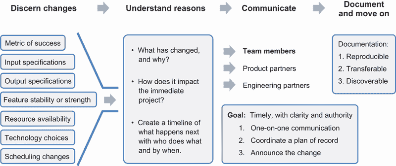
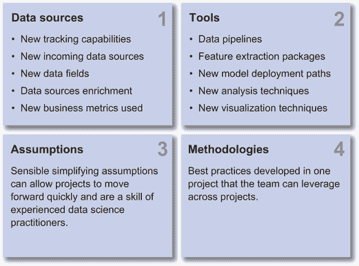
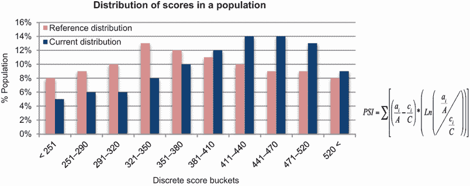
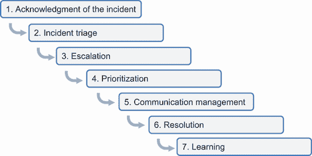

# 3 项目领导的三项美德

本章涵盖

+   在 DS 中作为专业行为标准以客户最佳利益为重

+   适应业务优先事项并自信地传授知识

+   实践科学严谨的基本原则

+   监测异常并负责创造企业价值

+   以坚韧、好奇心和合作为基础保持积极态度

在领导力方面，美德往往比能力更重要。虽然我们可以通过团队中人才的正确组合来弥补能力上的差距，但美德上的差距可能导致项目失败，或者更糟的是，对业务产生负面影响。希腊哲学家亚里士多德将美德解释为个人习惯性的行为，这些行为刻印在个人的性格中，源于多年实践善良以利己利社会的经验。它们是当没有人看着时，别人可以信任你去做的事情。

作为技术领导，培养*道德*和*严谨*的习惯行为，以及积极的*态度*，对于塑造你的性格以成功担任 DS 领导者至关重要。当你在这三个维度上保持可接受的行为准则时，你更有可能对你的组织产生重大影响，并在你的职业生涯中取得进步。我们还观察到，当数据科学家忽视这些维度中的一个或多个时，他们可能会陷入必须通过指导或在某些情况下被管理出来的困难境地。

我们在这里所说的*道德*、*严谨*和*态度*是什么意思？

+   *道德*——在工作中的行为准则，使你能够避免不必要的自我造成的崩溃。数据科学家的工作道德有很多方面，包括数据使用、项目执行和团队合作。

+   *严谨*——产生数据科学家产生结果信任的工艺。严谨的结果是可重复的、可测试的和可发现的。并且严谨的工作产品可以成为创造企业价值的坚实基础。

+   *态度*——你以何种情绪进入职场情境。数据科学家应该对失败保持积极和坚韧的态度，好奇心强，是协作的团队成员。我们还应该尊重横向合作中的不同观点。

美德应当适度实践。做得太多可能和做得不够一样糟糕。例如，过多的严谨可能导致分析瘫痪和犹豫不决。过少的严谨可能导致结论有缺陷，这可能导致不良后果，并失去高管和商业伙伴的信任。你可能已经看到了一个或两个极端的例子。让我们更详细地探讨这些维度的每一个。

## 3.1 行为的道德标准

作为数据科学家或从业者，您有权访问大量数据来服务您的客户。这些数据可能影响金融市场评估公司的企业价值，或与用户的财务状况、健康状况或地理位置等个人敏感信息相关。我们在没有人在看的情况下如何处理托付给我们的数据，特别是当没有人看的时候，这是我们道德标准的体现。

我们将 DS 中的道德定义为该领域的专业行为标准。这些道德规范旨在是实用的而不是理论的。对于 DS 技术领导，我们讨论了三个专业行为领域：

+   领导以客户最佳利益为目标的工程项目

+   在动态市场环境中适应业务优先级

+   对团队成员自信地传授知识

我们推荐这些实践，以避免不必要的自我造成的崩溃。对于珍妮弗（来自第一章，案例 3），她的队友感到被微观管理，对忙碌的工作感到不满，提高她沟通变化的能力将有助于她与团队建立信任。这些实践还可以为积极、敏捷和高效的工作环境开辟机会。

### 3.1.1 在客户最佳利益下运营

数据从业者通常可以访问并处理敏感数据。例如，在共享出行行业中，数据科学家可能可以访问乘客的详细交易记录，包括乘客的日常作息、医院访问或其他周末冒险。在在线约会行业中，数据科学家构建可能改变人生的伴侣匹配算法，并运行情感影响显著的 A/B 测试。

在这里保持道德有两个方面：

+   以对客户福祉敏感和有同理心的方式提问，而不是提问自己不愿意被问的问题[1]

+   进行对客户福祉敏感和有同理心的实验，而不是对客户情感福祉产生负面影响的实验

DS 中不敏感的使用

DS（数据科学）中不敏感使用的不道德行为的一个例子是臭名昭著的 2012 年“Uberdata: The Ride of Glory*”*博客[2]。一位 Uber 员工通过分析乘客在周五或周六晚上 10 点到凌晨 4 点之间前往不熟悉地点的行程，然后在四到六小时后，在离下车地点 1/10 英里内进行第二次行程，推断出潜在的短暂一夜情。尽管从 DS 的角度来看，分析是合理和严格的，结果也是汇总的，没有泄露个人信息，但选择这个话题品味不佳，损害了与乘客之间的信任。

“荣耀之旅”分析对 Uber 公司产生了重大的社会反弹。这种类型分析的产生、传播和发布表明，2012 年存在一种文化，容忍在乘客行为分析中提出的问题的不敏感。

作为技术负责人，你是保护公司免受不道德数据科学实践的第一道防线。内部道德指南可以帮助你取消可能被视为对客户福祉不敏感的分析方向。

| 014 | 技术负责人是保护公司免受不道德数据科学实践的第一道防线。内部道德指南可以帮助你取消可能被视为对客户福祉不敏感的分析方向。 |
| --- | --- |

评估某事是否可能被视为对客户不敏感的技术之一是应用所谓的*纽约时报*规则，或主要报纸规则。这是一条常识性的道德行为规则，你不应在公共或私人场合做任何你不愿意在主要报纸头版报道的事情。

假设“荣耀之旅”博客的作者在进行分析之前使用了*纽约时报*规则来评估其适当性。那么，他们可能会认识到这个话题的高度争议性和潜在的反弹，并采取不同的行动。

一些分析和实验即使短期内可能损害用户体验，但长期来看却有利于用户体验，也可以通过纽约时报规则通过。例如，通过在网页上增加或减少广告来增加企业的盈利能力，以更好地服务未来的客户，或者评估网页加载延迟对网页参与度的影响，以证明通过故意减慢某些网页加载速度进行工程投资是合理的。

对客户情感福祉的影响

数据科学对客户情感福祉产生深远影响的例子是 OkCupid 在博客格式中发布的 2014 年一系列 A/B 测试结果 [3]。该实验招募了算法认为匹配度为 30%、60%或 90%的客户对。对于每组，应用告诉其中三分之一的人他们的匹配度为 30%，三分之一的人他们的匹配度为 60%，还有三分之一的人他们的匹配度为 90%。这样，三分之二的人口有意展示了不准确的匹配百分比。这类实验具有技术优势，但也可能对客户的情感福祉产生负面影响。

你如何评估一个数据科学用例是否可能越过了伦理界限？伦理研究中的三个原则可以帮助我们评估一个具有挑战性的情况 [4], [5]：

+   *尊重个人*—尊重客户。在开展实验时提供透明度、真实性以及自愿性（选择和同意）。

+   *仁爱*—保护人们免受伤害，最小化风险并最大化利益。

+   *正义*—确保参与者不会被剥削，并且风险和利益的平衡是公平的。

我们是否过于小题大做了？毕竟，改变屏幕上显示的猜测分数是否会导致重大的心理伤害？

OkCupid 匹配分数练习已经从尝试新功能跨越到欺骗或暗示实验的界限，该实验专注于人与人之间关系的行为实验。想想那些认为他们在平台上终于找到了一生的爱，正如匹配分数所暗示的那样，却浪费了他们生命中宝贵的时光去寻找生活伴侣的人们的情感创伤。您愿意在不经意间成为这些实验的受害者吗？欺骗性实验引发了关于用户是否受到尊重的许多问题。

进行实验的数据科学家可能有着最好的意图，旨在证明 OkCupid 匹配分数有优点并且可以赢得客户的信任。然而，实验在没有透明度和自愿的情况下进行的含义实际上可能会伤害客户信任。在未来，客户将不知道他们何时可能成为另一个测试的受害者，并且可能不再信任这些分数。正如俗话所说：“一次被愚弄，是你自己的耻辱。两次被愚弄，是我的耻辱。”

### 3.1.2 动态商业环境中适应业务优先级

业务优先级可能会迅速变化。作为一名数据科学技术负责人，当您管理的项目被搁置，团队被要求专注于其他事情时，您会怎么做？

从根本上讲，团队成员对组织的责任是执行业务的优先级。许多类型的数据科学项目可能需要 8-20 周（如第 2.2 节中的表 2.1 所示），当业务需要在这些大型项目完成之前让团队处理更紧急的事情时，技术负责人必须帮助团队成员和合作伙伴适应这种变化。

技术负责人在管理项目变更时需要关注四个方面：

+   确定需要关注的变更。

+   理解变更背后的原因。

+   与团队成员和利益相关者沟通。

+   记录当前进度并继续前进。

图 3.1 展示了这四个关注点，接下来的章节将逐一介绍。

图 3.1 向团队和利益相关者有效沟通变更的四个步骤

确定需要关注的变更

在数据科学项目中，事情不可避免地会发生变化。作为技术负责人，主动让您的团队和合作伙伴了解任何变化至关重要。合作伙伴往往对项目计划中描述的里程碑交付有项目依赖性，这可能您还没有意识到他们对此很敏感。

应该包括哪些人在沟通中？答案是项目计划中项目利益相关者名单上的所有合作伙伴。您可以在项目动机背景部分找到它，如第 2.2 节所述。

这些变更有哪些例子？

+   *成功指标*—当项目的动机发生变化时，它可能不会影响项目的 DS 部分，但它可能会影响工程部分。例如，当成功指标从短期转向长期参与时，预测下一步最佳行动的 DS 工作可能保持不变。然而，计算指标的频率可能会改变，需要不同的工程复杂性级别。

+   *输入规范*—由于文档错误或合作伙伴升级，数据类型、数据格式和更新频率的输入规范可能会发生变化；一些是计划内的，而另一些则是计划外的。与所有合作伙伴共享这些变化很重要，因为某些变化可能会对用户体验、隐私和合规性产生严重影响。

+   *输出规范*—由于特征提取、建模环境或需求变化的不预期限制，数据类型、格式、预期准确度或更新频率的输出规范可能会发生变化。这种变化将对依赖于输出的下游服务产生明显的后果，并且应及时进行沟通。

+   *技术选择*—技术选择可能会因为系统限制、更新或资源可用性的变化而改变。这些可能会对输出规范产生意外的后果，因此必须进行沟通。

+   *功能稳定性*或*强度*—虽然检测到的功能稳定性或强度变化是建模细节，但它们可能是系统问题或市场趋势的症状，这需要更广泛的团队进行密切观察，并且应迅速进行沟通。

+   *资源可用性*—当资源可用性发生变化时，及时通知合作伙伴团队可以帮助他们调整时间表以适应或帮助提升和恢复资源，如果资源被移除。

+   *时间表变更*—当团队的时间表因内部冲突或延迟，或因外部依赖关系的变化而改变时，及时通知合作伙伴团队可以帮助他们调整时间表或升级以重新评估优先级，以便将项目重新纳入正轨。

在所有这些情况下，与团队和合作伙伴的及时沟通对于建立和维护信任至关重要，同时尽可能帮助项目保持正轨。优先级可能会因许多原因而改变：管理层发生了变化，相关项目被加速或延迟，或者由于技术、政策、经济或自然灾害的干扰，商业环境发生了变化。

记得第一章中的 Jennifer 吗，那位擅长与公司内部商业合作伙伴沟通的技术负责人，并且不害怕推动项目范围蔓延以确保按时交付她的项目？让我们在检查她如何更好地在自己的团队内沟通变化的前三个步骤时记住她。

理解变化背后的原因

理解变化背后的原因可能并不容易。如果管理层发生了变化，了解新经理的风格和以往经验至关重要。与你的新经理以及以前与他们共事的人交谈，尽可能收集信息。作为技术负责人，你可以承担这项行动，以便更好地预测即将到来的新需求集。

如果相关项目的加速或延迟导致变化，了解根本原因以及超出你领导的具体项目的影响也同样重要。这有助于你理解任何次要影响，例如在规划新的优先级时，A/B 测试时间表竞争等问题。

假设变化是由商业环境的变化引起的，例如技术创新的干扰、政府政策的变化、经济的扩张或衰退，或自然灾害造成的特殊情况。这将是拓宽视野、了解组织如何应对这种情况以及接下来可能采取的几步以帮助团队成员预测接下来会发生什么的机会。

有时候，仅仅完成当前项目可能是有意义的。这是与你的经理进行的一次有价值的对话，以确保决策符合组织的最佳利益。然而，当做出商业决策时，你需要执行它。

你项目上的团队成员正在等待你指示下一步行动。在了解情况的基础上，你应该与你的经理协调，向团队成员清楚地传达变化。

清晰的沟通包括以下内容：

+   发生了什么变化，原因是什么？

+   它如何影响当前项目？

+   应该包括接下来发生的事情的时间表，以及谁做什么以及何时完成。

与团队成员和利益相关者沟通

在变革时期，团队成员依赖技术负责人在可能混乱的情况下带来确定性和清晰度。这种沟通需要迅速进行，因为今天即时通讯渠道的信息传播速度很快，来自其他渠道的错误信息（有时是谣言）可能会破坏团队成员之间的信任。除了你的团队成员外，还必须通知所有利益相关者任何变化，包括产品和工程合作伙伴，他们可能不了解变化的影响。

在确定接下来会发生什么时，你可以从快速评估所有必要的资源是否可用于处理新的优先级开始。你的经理会欣赏你识别新方向潜在障碍的行为，这样团队就有了一个可行的工作计划，你和你经理都对此做出了承诺。

如果我们在沟通变更，以下是一些需要记住的最佳实践。有效沟通变更的目标是及时、清晰、权威地进行沟通。一种强大的方式是从一对一沟通开始，协调记录计划，宣布协调一致的记录计划，并在继续前进之前征求任何问题或评论：

+   *一对一沟通*—与产品合作伙伴、工程合作伙伴和其他合作伙伴进行直接和个人的“提醒”沟通可以建立信任，提供一个坦率反馈和安全的解决方案头脑风暴的私人论坛，并允许合作伙伴有时间准备向他们的团队沟通。对于小变更，这可以简单到在公司业务沟通平台上的消息——无论是 Slack、Teams 还是其他服务。

+   *协调记录计划*—如果需要任何调整或升级，各方可以就记录计划达成一致，这样当变更宣布时，不会让更广泛的团队对下一步感到困惑。

+   *宣布变更*—宣布变更并记录前进路径的计划，为更广泛的团队提供确定性，因此可以提出问题并已有解决方案计划。提前通知也有助于合作伙伴负责人在他们的团队中建立信任和权威。对问题或评论持开放态度可以帮助你了解任何未解决的问题区域。

这个过程可能看起来很繁琐，但，随着时间的推移，它可以帮助在商业合作伙伴之间建立信任，并帮助你，作为 DS 技术负责人，在团队中建立权威，使变更宣布清晰且以解决方案为导向。

记录并继续前进

当记录当前项目时，你可以参考第 2.2.2 节中的项目计划结构，并清楚地说明你正在停止项目的哪个阶段。记录解决方案架构、当前的学习成果以及通过迄今为止的工作消除的风险是至关重要的。

如果有部分开发的代码，确保注释反映了迄今为止所做的工作，并为尚未开发的模块提供高级占位符至关重要。在稍后挑选一个半开发的项目时，最痛苦的经历之一就是当文档如注释和代码不匹配。

那么，什么构成了良好的文档？如第 2.2.3 节所述，良好的文档不必很长且复杂，但它必须满足以下三个条件：

+   *可复现性*—能够使用相同的输入数据、处理步骤、方法、代码和分析条件获得一致的结果

+   *可迁移性*—能够在多个环境中应用所学知识

+   *可发现性*—能够在稍后某个时间点的相关搜索结果中显示

在有明确的进度记录的基础上，你可以更新任何工单，并处于应对团队新优先事项的有利位置。

就像第一章中的詹妮弗，现在她更好地理解了可以用来更好地与自己的团队沟通的三个步骤，她可能：1）在业务伙伴启动项目变更时，询问他们背后的问题；2）及时、清晰地传达变更及其背景，并具有权威性；3）记录当前工作并继续前进。通过这些实践，詹妮弗和她的队友们可以拥有大幅提升的体验。

### 3.1.3 有信心传授知识

在追求数据科学（DS）项目的过程中，除了为顾客提供的可交付成果之外，还会产生大量的学习成果。例如，学习可以来自检查的*数据来源*、使用的*工具*、做出的*假设*以及开发的*方法论*，如图 3.2 所示。

图 3.2 无论项目成功与否，都要分享的四种类型知识

作为数据科学（DS）技术负责人，你的职业道德或专业行为标准包括确保尽可能多地捕捉和传播学习成果给你的团队成员，以便团队的经验和专业知识可以随着时间的推移而积累和增长。

| 015 | 作为技术负责人，你负责确保团队的学习成果尽可能被捕捉和传播，以便团队的经验和专业知识可以随着时间的推移而积累和增长。 |
| --- | --- |

你可能会说，这比说起来容易做起来难，因为大部分的学习都发生在数据科学家日常的工作中。有时，数据科学家甚至可能因为与同行分享简化和假设的细节而感到尴尬。在每天的数据和算法处理中，代码和分析可能也包括快速试验和错误，有时看起来可能很混乱。当涉及到分享时，数据科学家通常更愿意分享结果，而不是他们达到结果所采取的步骤。

我们如何鼓励团队成员之间更加开放的文化分享？这些学习成果可能看起来是什么样子？

数据来源

许多数据科学（DS）项目正在定义新的跟踪能力以产生新的数据来源，探索新的数据来源，检查现有数据来源中的新数据字段，用第三方数据丰富数据来源，或者使用现有数据来源创建新的指标。

在定义新的跟踪能力以产生新的数据来源时，你需要回答一些重要问题，例如新跟踪提供了哪些机会？现有跟踪能力有哪些局限性，而新的跟踪能力将解决这些局限性？实施的时间表是什么？最新的跟踪数据可能有利于哪些项目？当新的跟踪能力上线时，是否有将被弃用的早期版本？哪些项目可能需要更新他们的数据来源？这些学习成果对于与数据科学同行分享非常重要，而当只向产品和工程业务伙伴展示可交付成果时，这些学习成果往往被忽视。

在探索*新的数据源*时，数据源的可用性、正确性、完整性和一致性是其他希望使用该数据源的数据科学团队成员感兴趣了解的方面。这些简单的指标评估可能耗时，而任何用于监控或评估这些指标的基础设施都可以显著加速未来的数据科学项目。

在检查现有数据源中的*新数据字段*时，数据分布和与其他现有字段的内部一致性是非常重要的学习内容。在同一数据源内部或其他数据源中与其他数据字段的一致性问题尤其重要，因为数据一致性问题是难以在产品组织间发现和解决的。

在一个大型组织的实际事件中，一个跟踪问题表现为不一致的指标，并且被遗留了一年多未解决；当问题得到解决时，估计跟踪问题导致了数千万美元的未计费收入。在发现数据不一致性时，仔细评估其影响可以具有很大的价值。

在用第三方数据*丰富数据源*时，有机会使用外部参考来衡量数据源。例如，如果你正在对访问网站的用户的年龄进行估计，这些数据可以用来与特定地区的政府统计数据进行基准测试，以衡量人口统计数据。基准测试也可以与市场调查或行业分析师报告进行。此类信息可以帮助团队更好地了解产品或服务的受众偏差，并有助于评估替代营销渠道。

当使用现有数据源*创建新的指标*时，你正在创建可以更好地解决业务问题和指导业务运营的总结指标。一个总结指标示例是客户获取的转化率。虽然这些指标可能只是两个数字之间的比率，但在使它们具有意义时需要考虑许多设计决策。你如何选择可以平衡转化意图的清晰度、预测短期或长期收入的准确性、转化观察窗口的长度以及所需观察数量的特定转化阶段？所有这些方面都必须通过分析和领域洞察来选择。这些经验对于数据科学团队成员之间的分享是至关重要的。

使用的工具

一个数据科学（DS）项目可能会涉及许多工具。这些可能包括实时数据处理管道、特征提取包、新的模型部署路径或新的分析技术。

实时**数据管道**可能会给特征提取带来独特的挑战，因为许多特征工程流程都是在历史数据批次上执行的。一些标准架构和技术可以用于实时数据管道，例如 Lambda 架构和增量处理。与实时数据管道的限制和机会一起工作的任何经验都值得与同行数据科学家分享。

**特征提取包**可能从标准的 NLP 包到图数据库和算法，再到用于向量嵌入的深度学习包不等。当探索新颖的特征时，使用这些工具的细微差别可以加速希望在未来项目中使用相同工具的同行数据科学家的学习曲线。

**新的模型部署路径**对于 DS 展示业务价值至关重要。这也是需要与业务伙伴进行最多协调的组件。用于特征提升、A/B 测试和跟踪的工具和实践的任何变化都至关重要，需要与团队分享，以及最终结果。

如果正在使用一种新的**分析技术**来回答关于业务的重大问题，你可能还希望与团队分享这一点。例如，对于无法进行 A/B 测试的分析，基于历史数据的观察性因果推断是一种流行的方法。与各种观察性因果推断技术一起工作的最佳实践和模板是值得与团队分享的好主题。

**新的可视化技术**可以使关键信息更简洁地传达。例如，展示客户群体收入贡献的插图可以突出不同版本客户在客户生命周期中的价值，这可以激发跨营销渠道或地理区域的可视化。

做出的假设

即使看起来简单的 DS 项目也可能有需要做出粗略假设才能产生结果的复杂性。例如，为了推导出一套检测客户获取渠道异常的业务规则，需要做出许多假设。客户获取渠道的观察窗口应该有多长？用户获取和用户激活之间的转换时间窗口应该有多长？用户行为模式在一天中的时间、一周中的日子和一个月中的周如何？银行营业日和国家假日是否会影响转换？在这些假设之上，人口结构的变化、获取流程的更新和广告信息的调整都可能影响客户获取渠道中异常的检测。

对于许多数据科学家来说，在一个项目的初始版本中暴露简化的假设可能会感到尴尬，并且不够严谨。作为技术负责人，我们所有人都应该有谦卑和理解的品质，认识到假设是必要的，并且对于优先考虑我们分析的最重要和敏感因素是至关重要的。能够快速做出合理的假设是执行决策的关键能力，尤其是在决策信息不完整的情况下。当团队成员做出适当的假设时，确保指出并表扬他们。当做出不适当的假设时，要温和地引导，尽量不要批评。

更强大的是，通过理解结论对假设的敏感性来建立制度知识。例如，如果你能表明结论在观察时间窗口减半或加倍的情况下保持不变，你可以在相同的时间段内运行两倍多的实验，从而显著加速创新的步伐。

当你推动明确分享所做的假设时，团队可以理解结论的限制以及当有更多时间和资源可以用于调查特定方向时需要验证的领域。

开发的方法论

在你进行数据科学项目时，你可能开发出团队可以在未来项目中利用的方法论和最佳实践。例如，数据科学团队通常参与通过 A/B 测试验证新功能。在引导功能通过 A/B 测试时，一个功能可能首先向 1%的用户推出，然后是 10%，50%，最后是 100%，随着团队对新的功能效果越来越有信心。你可能想知道：我如何做出平衡速度、质量和风险考虑的爬坡决策？嗯，这就是当你分享你已制定的最佳实践时，可以惠及更广泛团队的那种方法论[6]。

就像第一章的技术负责人 Jennifer 一样，她可以通过鼓励团队成员之间分享他们的学习经验来提供建立身份的机会。这可以是一个突出项目可以产生企业价值方面的好方法。分享所检查的数据来源、使用的工具、做出的假设或开发的方法论，可以使最佳实践的益处迅速从个人层面扩展到团队层面，这构成了技术负责人对公司价值的重要部分。

## 3.2 培养严谨性，提高标准

建立信任对所有数据科学（DS）工作来说都是宝贵的。对数据和模型的大部分信任都来自于数据科学家对待这一主题的严谨态度。合作伙伴期望你的工作具有科学严谨性，而保持这种严谨标准的责任就掌握在你的手中。

严谨性体现在你与技术的互动、执行和专业知识方面：

+   *技术*——科学方法的基础，数据科学（DS）就建立在它之上。

+   *执行*—在部署和维护数据平台和系统中的严谨性。

+   *专业知识*—你承担的创造企业价值的责任。

是的，这些是在第二章中检查的能力，因为严谨性以相同的方式体现在你使用能力的方式上。现在，让我们逐一探讨这些内容在严谨性方面的应用。

### 3.2.1 明确科学严谨性的基本原理

DS 的严谨性借鉴了科学严谨性的机制[7]，它分为四个阶段：项目设计和审查、执行实验、发表前的同行评审以及已发表的结果。作为 DS 技术负责人，你可以利用这种严谨性机制作为工具或技术，来培养 DS 项目在其所有等效阶段：

1.  *项目设计和审查*—目的是确保资源以最有效的方式投入到最有希望的事业中。第 2.2 节描述了将 DS 项目与客户和业务伙伴优先排序、制定和协调的过程。

    对于许多拥有高级学位的数据从业者来说，DS 项目计划可以被视为科学提案。审查过程是提高高潜力项目成功率的一个早期反馈机制。

1.  *执行实验*—这是科学方法的核心，即设计一个具有明确假设的受控实验，对其进行测试，并迭代直到可以验证有影响力的学习。这是 DS 假设的解决方案架构、分析、模型构建和 A/B 测试。这一阶段不会直接受到同行的审查。科学和伦理的严谨性都由你，即 DS 技术负责人，推动。

1.  *发表前的同行评审*—小范围同行评审的目的是尽早发现问题，根据科学严谨性的五个原则[8]*:*冗余的实验设计、合理的统计分析、识别错误、避免逻辑谬误和诚实守信。

    内部项目审查也是分享从数据来源、使用的工具、做出的假设和开发的方法论中学习的机会。第 3.1.3 节更详细地讨论了这些问题。

1.  *已发表的结果*—发布结果的目的在于使学习变得可发现和可转移，这样其他人就可以复制和在此基础上构建。这对应于将见解传达给推动业务战略和路线图，或在产品中推出预测能力以推动 DS 中的智能用户体验。

在 2010 年至 2020 年之间，许多从业者带着相邻领域的先进科学学位进入了 DS 领域。这些研究经验为该领域提供了广泛的科学严谨性背景。

近年来，许多数据科学本科和基于课程的硕士项目在教授数据科学的技术和执行策略方面变得有效。然而，科学方法的严谨性却很少被教授。有些人可能会认为严谨性需要实践而不是教授。

| 016 | 科学方法的严谨性很少被教授。有些人可能会认为严谨性需要实践而不是教授。 |
| --- | --- |

你应该对这些背景差异保持敏感，并在背景缺失时温和地引导数据科学家遵循五项科学严谨原则。这样，你可以在数据科学家项目中维持以下五项严谨标准，以保持客户和合作伙伴对你项目的信任：

+   实验设计中的冗余

+   声音统计分析

+   认识错误

+   避免逻辑陷阱

+   知识诚实

科学严谨的五项原则如何应用于数据科学领域？让我们来看看。

实验设计中的冗余

良好的实验设计需要在构建和执行实验之前明确假设 [9]。结果应通过控制在线实验进行验证，其中两个随机选择的样本群体被呈现不同的体验，唯一的区别是正在测试的特征。随机化是为了确保两个样本都能代表总体。

实验设置应该足够灵活，可以在不同的维度上重复和分析。这意味着在不同的时间范围内，在不同的地理区域，针对不同的操作系统等。我们希望设置能够为可信的结果提供复制、推广和敏感性检查。

例如，2012 年的一项测试，如图 3.3 所示，改变了微软必应搜索引擎显示广告的方式，并使收入提高了 12%。这一变化仅在美国就转化为每年超过 1 亿美元的增加收入，而没有损害关键的用户体验指标。每年在必应上进行的实验超过 10,000 次，但导致如此显著改进的简单特征却很少。该实验在长时间内多次重复进行，以增加结果的冗余性和可信度，并最终得到验证。

图 3.3 在微软必应搜索引擎上进行的一项控制实验，其中部分描述被提升为结果标题，导致收入增加了 12% [9]

虽然受控实验可以告诉我们新功能可能带来的业务影响，并具有一定的统计能力，但它们并不能解释导致结果差异的潜在机制。这些潜在机制必须由技术负责人与产品和工程团队合作解释。这些解释可能导致设计实验以验证和放大发现的益处的新假设。

新的假设可以与先前结果的相关性联系起来。对这些预测的实验验证提供了额外的保证，即原始发现是有效的。扩展早期的必应示例，这种学习导致了将上下文引入广告部分结果标题部分的进一步改进。

为了进一步提高学习的严谨性，可以测试设置的扰动以了解结果对其他系统环境变量的敏感性，例如字体颜色、算法相关性和页面加载时间。

声音统计分析

虽然成为数据科学家的先决条件是掌握概率和统计学，但这些技能和最佳实践可能并不在工作的所有方面都同等适用。数据科学家通常在检查输入数据的统计特性时非常小心。然而，当使用 t 检验来决定在发布过程中实验是否显示出统计上显著的结果时，我们需要注意许多细微差别。

例如，使用双样本 t 检验假设基础变量是正态分布的。可能需要调用中心极限定理来对子样本均值应用 t 检验，因为子样本均值遵循正态分布。

好的，已经完成了两个，还有三个科学严谨性的原则要讲！现在如果需要的话，可能是一个快速休息的好时机。

识别错误

测量是从我们周围的世界中采样的，它们都有测量误差。误差有两个组成部分：系统性和随机误差。系统性误差也称为*偏差*。它们可能是由平台错误、有缺陷的实验设计或代表性不足的样本引起的，例如具有与整体人口统计数据不同的特定人口特征的某个地区的群体。

随机误差可能来自实验中的采样过程。在一个受控的在线实验中，我们可以计算随机误差的大小作为测试设置的功率。这种功率是在存在差异的情况下检测变体差异的概率[9]。这是在测试组和对照组之间没有差异时拒绝零假设的可能性。行业标准是在我们的测试中实现 80-95%的功率。一个严谨的技术负责人将了解探索过程中系统性和随机误差的来源，并帮助团队评估结果是否可靠。

避免逻辑陷阱

在实验科学中，特别是在结果解释方面，有许多逻辑陷阱和谬误。已记录超过 175 种认知偏差 [10]。让我们讨论 DS 中最常见的三个逻辑陷阱：确认偏误、否定前件和基础率谬误。

**确认偏误**发生在欲望对信念的直接影响下。当人们希望一个想法或概念是真的时，他们最终会相信它是真的。这通常是由愿望思维驱动的。具有确认偏误的个人倾向于在收集到的证据证实他们希望成为真的信念时停止收集信息。

一种克服确认偏误的出色方法是严格提出零假设，并使用实验证据来反驳每个零假设。然后我们将寻找实验中收集到的足够证据，以在 95%（通常）的置信度阈值下拒绝零假设。

**否定前件**发生在我们将 if-then 关系与 if-and-only-if-then（iff-then）关系混淆时。一个典型的错误结论的例子是：任何跑步的人都必须是活着的。睡觉的人没有跑步。因此，所有睡觉的人都是死的。嗯，这是什么意思？

这个例子可能看起来很明显，但如果我们不小心，我们可能会迅速得出结论：包含位置信息的个性化算法会有良好的参与度。一个特定的算法不包括位置信息。因此，这个算法将会有差的参与度。这个结论是错误的，并且不符合前面的陈述的逻辑。

当我们在低发病率的人群上部署高准确率分类算法时，就会发生**基础率谬误**。这是由于未经训练的人类大脑处理概率和可能性固有的困难所导致的。

让我们用一个来自医疗领域的真实数据示例来说明。用于流感病毒的快速流感诊断测试（RIDT）可以具有 70%的灵敏度和 95%的特异性 [11]。在一个有 10,000 名学生的大学中，如果每 100 名学生中有 1 人感染了流感病毒，并且所有学生都接受了测试，那么测试的观察准确率会是多少？

直觉可能会让人给出一个介于 70%和 95%之间的数字。如果你做了计算，如表 3.1 所示，测试的感知准确率，即在测试结果为阳性的学生中感染的学生数量，将是 70 / 565 = 12.4%。这就是为什么这些测试不建议给每个人使用，并且只针对有症状或感染风险较高的人群。

表 3.1 快速流感诊断测试中基础率谬误的说明

|  | 感染者 | 未感染者 | 总计 | 观察准确率 |
| --- | --- | --- | --- | --- |
| 测试结果为阳性 | 70 | 495 | 565 | 70 / 565 = 12.4% |
| 测试结果为阴性 | 30 | 9,405 | 9,435 |
| 总计 | 100 | 9,900 | 10,000 |
| 备注 | 70%灵敏度 | 95%特异性 |  |

这三种常见的谬误通常在项目设计审查以及最终发现和建议审查中被发现。在评估中间结果和迭代实验时，作为严谨的技术负责人，你必须意识到这些人类自然产生的逻辑陷阱，并帮助团队绕过它们。

智力诚实

智力诚实是科学严谨性的一种心态。它是对那些与自己的假设不符的烦扰细节的承认。这些烦扰细节往往是新理解和新假设的第一步。智力诚实还包括对早期工作的承认以及将自己的观察与他人的观察进行调和的过程。

对于数据科学技术负责人来说，智力诚实性的严谨性包括确保与假设不一致的观察结果也被分享，所有合作者都得到认可，以及引用早期工作的参考文献。

如这五个原则所示，*科学严谨性*是多方面的。在这五个原则中，没有任何一个原则可以单独定义严谨性。正如“严谨科学：操作指南”的作者所说[8]：“即使是最仔细的实验方法，如果解释依赖于逻辑谬误或智力不诚实，也不是严谨的。”另一方面，严谨性的原则可以协同作用。例如，逻辑方法和对错误的意识可以导致实验设计中更有目的性的冗余。

| 017 | “即使是最仔细的实验方法，如果解释依赖于逻辑谬误或智力不诚实，也不是严谨的。”——卡斯代瓦和方 |
| --- | --- |

作为数据科学技术负责人，责任在于你确保所有五个原则得到遵守，以便项目和结果被认为是严谨的。

### 3.2.2 监控数据和部署中的异常

威廉·安东尼·特威曼提出了特威曼定律，该定律指出：“任何看起来有趣或异常的数据或证据很可能是不正确的！”当我们看到异常好的结果时，我们倾向于围绕它构建一个故事。当我们遇到异常差的结果时，我们倾向于将其归咎于实验框架的限制。然而，大多数情况下，极端结果是由实施问题引起的，这些问题是由于记录错误或计算逻辑错误。为了便于理解异常或极端结果，我们需要能够验证跟踪能力，以及在代码层面和数据层面检测和诊断这些结果。

验证跟踪能力

在跟踪方面要保持严谨，仅仅检查跟踪事件的可用性是不够的，其正确性和完整性也需要进行测试。

如果数据以错误的格式出现；缺少重要信息，例如时间戳的时间区域标签；有过多空值；或者有不同类型的空值，例如空值与无与空字符串，来表示缺失值，则**正确性**可能会失败。

如果没有可靠地捕获所有信号，则**完整性**可能会失败。这可能是因为互联网固有的最佳努力交付机制导致某些浏览器抑制某些类型的请求，或者代码可能包含实现错误。可以通过从客户端发送带有序列号的消息来检测日志中的不完整性。这是在计算机网络中 TCP 协议中使用的已知技术。通过查看接收方收到的序列号的完整性，您可以估计通道的可靠性。

代码级别的严谨性

在实施有效跟踪的情况下，防御性代码技术，如断言、交叉检查和交叉验证，可以帮助您在执行分析或构建模型时提高代码级别的严谨性。

一个**断言**是在程序中特定点的布尔表达式，除非程序中存在错误，否则它总是为真。当断言不被满足时，程序的执行将停止。这样，正确性问题可以在它们发生时以及它们传播到分析的后一部分之前被发现。这种技术的缺点是，当断言错误地触发时，它可能会破坏执行管道。因此，断言应仅保留用于逻辑上不正确的输出，例如非空输出，或者当输出中的行数应该与输入中的行数匹配，但实际上不匹配的情况。

**交叉检查**使用科学严谨性中讨论的冗余原理，从不同的分析角度得出结果。常见的角度是自上而下，其中估计是整体的一部分，以及自下而上，其中估计是贡献部分的求和。交叉检查可以快速发现与缺失数据或未分类数据相关的问题，这些数据可能会超出分析范围。

**交叉验证**保持相同的方法或计算方法，并选择多个可用的数据的随机样本，以查看方法或计算是否足够稳健，可以得出相同的结论。交叉验证可以快速检测一个有趣的结果是否是数据不寻常采样的产物。

数据级别的严谨性

在数据科学（DS）中，数据级别的严谨性至关重要，因为分析或模型部署后，模型的运行环境可能会发生变化。有两种主要场景会发生这种情况：

+   数据的分布发生了变化。

+   特征的含义发生了变化。

数据分布的变化也称为**协变量偏移**。当训练和测试输入遵循不同的分布时，底层功能关系保持不变。一些例子包括：

+   一个基于一个广告渠道数据的信用卡批准算法可以应用于来自不同客户组合的新广告渠道的申请人。

+   一个预测预期寿命的人寿保险模型可以在训练集中使用非常少的吸烟者样本构建，但在实践中可能有许多更多的吸烟者。

特征含义的变化也称为*概念漂移*。在概念漂移中，输入和输出之间的关系发生了变化，其中产生相同输出含义所需的输入正在变化。以下是一些例子：

+   当经济经历繁荣或萧条周期时，借款人偿还能力也会随着他们的工作保障上下波动。

+   随着突破性的医疗进步，具有某些既往病史的人的预期寿命可能会延长，并且符合某些人寿保险费率的资格要求可能会改变，因为某些医疗状况不再那么致命。

如何检测这些变化？您可以通过测量模型产生的预测与观察结果之间的差异来监控模型的准确性。然而，正如之前的信用卡和人寿保险示例所示，您可能需要等待数月、数年甚至数十年才能看到观察结果是否会与预测相符。作为一种替代方法，您可以在输出中检测异常或监控输入变量的变化，以尽早捕捉到变化。

输出中的异常可能表现为在某些维度上检测到过多的值。在一段时间窗口内，某个地区、收入水平或特定年龄组的信用卡批准或拒绝的数量可能不成比例。这些维度可以作为时间序列和历史趋势进行监控，并可用于设置警报的敏感性以及减少报告异常输出的误报。

您还可以使用各种分布差异估计来检测输入分布的变化，其中之一是*人口稳定性指数*（PSI），它是一种 Kullback-Liebler（KL）差异的形式。PSI 衡量一个变量在两个时间点之间分布变化的大小。这两个时间点可以是连续的几天，这可以检测到突然的变化。它们也可以是在长期基线和当前输入之间，这可以检测到随时间缓慢的变化，这些变化可能不会在连续的几天内显现出来。长期基线通常设定在最近一次模型发布的时间，任何检测到的漂移都提供了模型输出可信度的指标。

PSI 广泛用于监控输入人口特征的变化并诊断模型性能中的潜在问题。它是为离散变量设计的。我们可以通过在连续范围内排序样本并将它们分桶到离散块中，将连续变量转换为离散变量。例如，图 3.4 展示了如何将连续分数范围离散化为离散分数范围。为了考虑未标记或未评分人口中的潜在变化，通常还会在计算中包含一个空桶。

图 3.4 展示了分数分布中的人口稳定性指数 (PSI)

具体来说，PSI 分析两个时间点的数据分布：*A* 和 *C*，并计算特定桶 *i* 的样本贡献为 *a*[i]*/A* 和 *c*[i]*/C*，然后计算差异，并按 *ln((a*[i]*/A) / (c*[i]*/C))* 加权。

由于计算始终查看数据桶的百分比贡献，PSI 的大小具有一定的意义。解释 PSI 值的经验法则总结在表 3.2 中。当你检测到输入和输出的偏移和漂移时，你应该进行进一步诊断，以检查单个样本是否被预测为预期的那样。

表 3.2 PSI 值的解释

| PSI 值 | 解释 |
| --- | --- |
| < 0.1 | 微小变化 |
| 0.1–0.2 | 小变化 |
| > 0.2 | 主要变化 |

如果每个样本仍然被正确预测，并且只有样本分布发生了变化，这将是一个协方差偏移的案例。我们可以尝试重要性重新加权，增加与测试样本相似的训练实例的权重。这试图将训练样本集调整得看起来像是从测试样本集中抽取的。

假设样本不再被正确预测，并且原因是某些输入变量含义的漂移。在这种情况下，我们必须首先尝试了解是否存在导致偏差的原因。在现实场景中，一个错误导致两个特征被交换，导致特征值漂移。如果偏差不是一个可修复的错误，你可以考虑从数据集中删除在训练和部署之间差异显著的变量。例如，在金融风险管理中，任何 PSI 大于 0.2 的变量都被认为是主要变化，并将从模型中删除。

### 3.2.3 对企业价值负责

产生业务影响的责任与第 3.2.1 和 3.2.2 节中讨论的技术方面一样重要。作为数据科学家，我们负责为我们的业务创造企业价值。但创造企业价值意味着什么？让我们强调三个方面：

+   *保持目标清晰*—使用最简单的方法通过项目推动业务指标。

+   *关注速度*—快速失败以快速成功。

+   *沟通影响*—倾听、参与并领导。

保持对目标清晰的认识

每个定义明确的 DS 项目都服务于商业目的。虽然实现商业目的可能有多种方式，但技术负责人可以评估 DS 项目计划中的解决方案是否是达到商业目的的最简单方法。

DS 项目的商业目的是什么？第 2.2.2 节列出了九种最常见的 DS 类型，这些类型可以分为三个类别：

+   *类别 1*—赋能发布

    +   跟踪规范定义

    +   监控和推广

+   *类别 2*—利用业务洞察优化

    +   指标定义和仪表板

    +   数据洞察和深入研究

+   *类别 3*—巩固基础

    +   建模和 API 开发

    +   数据丰富化

    +   数据一致性

    +   基础设施改进

    +   监管事项

*类别 1*项目解开商业进展的障碍，并为产品和服务提供数据基础，以便立即获得战略回报。商业回报包括明确新功能或流程需要移动的关键业务指标，以及在产品或流程推广中识别难以发现的错误。

*类别 2*项目通过优化增量运营收益和针对可以提供阶梯式改进的功能或流程的建议，直接产生商业影响。当建议被应用于产品或运营流程时，商业回报得以实现。投入的时间和努力回报可以通过收入、利润或成本节省的百分比改进来衡量。

*类别 3*项目在长期内推动战略生产力和可用性提升。回报可能体现在节省的人/周、新项目启用和新市场机会的解锁。

虽然定义商业目的是为了明确目标，但 DS 技术负责人也需要严格保持解决方案尽可能简单。不涉及复杂算法的方法在实现商业目的上可能同样有效。

在 LinkedIn，工程和 DS 领域最珍视的价值之一是工艺，其中一个组成部分是技术实践者如何处理复杂性。具体来说，*复杂性*不是你可以整合的复杂性，而是你可以去除的复杂性，以提供最直接的系统来实现商业目的。你可以参考以下侧边栏中的案例研究，了解如何去除复杂性以实现商业目标。简要来说，DS 技术负责人需要在明确项目目标如何推动业务指标的同时，尽可能简化达到商业目标的方法。

案例研究：组织的北极星指标

如何构建一个可以引导拥有数百名员工的组织朝着单一方向协同工作的指标？在指定一个北星指标以指导 LinkedIn 人才解决方案产品线时，这个产品线每年为 LinkedIn 带来数十亿美元的收入，我们需要一个简单易懂的指标，以便 LinkedIn 内部和外部利益相关者都能理解。LinkedIn 人才解决方案致力于打造全球最权威的招聘市场，帮助人才获得最佳机会，并帮助雇主招聘最佳人才。

通过跟踪业务收入，主要来自雇主使用 LinkedIn 作为人才来源工具，一个成功指标可以基于接触到的候选人数量。优化这个指标可能会导致候选人在雇主尽可能多地联系候选人时感到被垃圾邮件骚扰。

如果你希望提高平台上的参与度，可以将职位申请用作成功指标。然而，优化它可能会导致每个职位空缺堆积过多的申请，这对候选人和雇主来说都不会是一个好的体验。

数据科学家可能会建议一个混合指标，它是之前提到的指标的加权组合。然而，这对团队成员来说会过于复杂。

团队最终确定了一个名为确认录用的指标。确认录用是指 LinkedIn 服务在成员最近一次求职过程中协助的人数。该指标巧妙地结合了雇主和求职者的成功因素。当优化后，它可以提高人才市场两方面的满意度。

确认录用被认为足够简单，可以成为 LinkedIn 新闻资料包的一部分。它用于推动内部和外部对话，并让成员和雇主体验 LinkedIn 在每年构建更好的产品方面的进步。

关注速度

DS 项目速度来自两个角度：解决问题的速度和低摩擦的增量改进。解决问题的速度要求我们消除风险，并建立组织朝着正确方向前进的信心。低摩擦的增量改进需要战略选择和及时解决技术债务，以确保有一个坚实的架构基础，以支持迭代创新。

在本节中，我们讨论了概念验证作为快速通往初始解决方案的途径。我们讨论了各种形式的技术债务及其解决方案，以减少进一步迭代创新的摩擦。

概念验证

关于概念验证（PoC）的一个常见误解是，我们应该追求一个快速简单的项目版本，并在此基础上构建。团队通常会先创建他们理解的部分，将不确定的部分留到后面。

PoC 的真实目的是探索项目中最有可能失败的部分的可行性。这是试图强调项目中最不确定的组件，并简化其余部分。如果项目按照最初的设计失败，我们可以找到一条替代路径使项目得以工作。埃里克·莱斯在《精益创业》中称寻找替代路径的过程为“转型”，并将其定义为“在不改变愿景的情况下改变战略” [12]。

在 2.2.2 节中，我们列出了 DS 分析和建模项目中常见的五个主要风险因素：

+   *新数据源*—数据可用性、正确性和完整性可能存在风险。

+   合作伙伴重组—与合作伙伴的先前对齐被破坏；需要重新对齐。

+   *新数据驱动功能*—跟踪产品功能更新导致的错误、数据管道问题、人口漂移以及集成问题必须被发现并解决。

+   *现有产品*—功能升级可能会改变指标和信号的含义。

+   *解决方案架构依赖性*—技术平台更新可能会干扰 DS 能力的运营。

在不同的项目中，对这些风险因素的敏感性可能不同，因此 PoC 中的重点也会不同。然而，存在一些共同的模式。

构建新产品或功能

当构建客户不熟悉的新产品或功能时，最大的风险领域是产品市场匹配度。目标是创建尽可能简单的技术解决方案，以查看用户体验是否被我们的客户接受。在简化 PoC 时，你可能选择的权衡点是可能保持手动而不是自动化的流程步骤，以及可能不如理想中高的模型精度或覆盖范围。

这些权衡有后果。保持流程步骤手动会积累技术债务，我们将在本节稍后讨论。然而，另一种选择是自动化某些东西，如果我们发现产品/功能与市场匹配度不匹配，这些将被丢弃。同时，当使用低精度或覆盖范围小的模型时，也存在这样的担忧，即它可能会影响你想要测试的用户体验。

有一些技术你可以参考来应对这些具有挑战性的权衡。如果可以用一个较小的、仅限邀请的顾客群体来测试产品与市场的匹配度，你可以与产品合作伙伴合作，缩小项目范围，专注于所有潜在功能的一个子集。这样，你可以确保这个功能子集足够好，可以证明产品与市场的匹配度。

改进现有产品或功能

对于现有产品或功能，产品/功能与市场的匹配度可能已经解决。如果产品或功能需要扩展以容纳更多用户，一个常见的风险区域是新技术平台的可行性。在项目规划中，您可能已经评估了技术功能集的可用性，并在文档中确认了必要的功能是可用的。然而，功能可用性有许多级别，文档可能会过时。

技术平台的功能特性可能处于规划、完成、可用或稳健的状态。如果只是处于规划阶段，它可能仅仅存在于即将到来的功能待办事项列表中的一个条目。任何优先级变更或人员变动都可能改变其发布时间。如果一个功能已完成，它可能刚刚完成实施，还没有经过测试。如果它是可用的，可能只有少数用户使用过，但对于您产品或功能改进的持续、预期的服务水平可能不可靠。只有当技术平台稳健时，您才能期待产品或功能改进的平稳迁移。

这是否意味着在没有证据（目前还没有）表明目标技术平台在您的应用领域稳健的情况下，您不能承担产品或功能改进项目？当然可以。您只需要在 PoC 过程中增加额外的时间来测试您产品的技术平台，这样如果技术平台需要调整，就有时间迭代或转向 B 计划。

假设您正在升级现有产品或功能的技术平台。在这种情况下，PoC 可以专注于平台的可扩展性方面，同时减少需要测试的功能数量。这样，平台可以通过仅测试一到两个功能来负载压力测试，以验证新技术的可行性。

您可能会觉得为 PoC 规划会减慢开发过程。另一种选择可能更糟。如果在项目早期没有消除项目风险，它们可能会在项目集成阶段或产品或功能发布期间以更猛烈的方式回归。它们可能表现为难以恢复的失败，如技术不兼容。

作为技术负责人，您的责任是严格组织项目计划审查，以尽可能多地预测风险区域，规划必要的 PoC 里程碑，并权衡哪些里程碑需要早期强调，哪些可以简化。

我们已经讨论了加快解决方案的速度。现在让我们看看通过解决技术债务来减少增量改进的摩擦。

技术债务

技术债务这一概念最早由沃德·坎宁安在 1992 年提出，它描述了在软件工程中快速行动所承担的长期成本。在开发灵活的 PoC 以消除项目风险和快速迭代功能时，公司自然会承担技术债务。并非所有技术债务都是不好的，因为它们允许进行灵活的实验，以消除产品或流程风险。然而，所有债务都需要偿还。当债务未偿还时，它们可能会减缓产生新能力的工作速度。

| 018 | 并非所有技术债务都是不好的，因为它们允许进行灵活的实验，以消除产品或流程风险。然而，所有债务都需要偿还。当债务未偿还时，它们可能会减缓产生新能力的工作速度。 |
| --- | --- |

表 3.3 列出了软件工程中 13 种不同的常见技术债务类型[13]，这些债务可以通过重构代码或模型、改进测试、删除死代码、减少依赖、加强 API 和改进文档来偿还。

表 3.3 软件工程中识别的常见技术债务类型和定义

| 债务类型 | 定义 |
| --- | --- |
| 架构债务 | 在项目架构中遇到的问题，如违反模块化原则，这会影响架构需求（例如，性能、鲁棒性等），并且不能通过简单的代码干预来解决。 |
| 构建债务 | 使构建更困难的问题，更耗时或处理消耗更多。 |
| 代码债务 | 在源代码中发现的问题，可能会影响代码的可读性，使其更难以维护。 |
| 缺陷债务 | 通过测试活动或用户识别的已知软件缺陷，但由于优先级竞争和资源有限，修复必须推迟。缺陷的积累会使债务在以后更难以偿还。 |
| 设计债务 | 违反良好面向对象设计原则的源代码。 |
| 文档债务 | 对于当前在系统中正确运行的代码，任何类型的缺失、不充分或不完整的文档，但未达到文档标准。 |
| 基础设施债务 | 延迟或阻碍开发活动的基础设施问题。例如，延迟升级或基础设施修复。 |
| 人员债务 | 可能延迟或阻碍某些开发活动的人员问题，例如专业知识集中在少数人身上或延迟培训/招聘。 |
| 进程债务 | 不高效或过时的流程，可能不再适用。 |
| 需求债务 | 仅部分实现的需求所做出的权衡。它们通常不适用于所有情况，或者不完全满足所有非功能性需求，如安全性或性能。 |
| 服务债务 | 用云服务替代私有服务器可能由商业或技术目标驱动。云服务和资源仍需管理以满足可用性和可靠性要求，这可能成为需要解决的技术债务。 |
| 测试自动化债务 | 自动化先前开发的功能测试的工作，以支持持续集成和更快的开发周期。 |
| 测试债务 | 测试活动中发现的问题，可能影响测试质量，例如未执行的计划测试或测试套件中的低代码覆盖率。 |

由于许多数据科学（DS）的洞察力和交付成果是通过软件实现的，所有软件技术债务都可能体现在 DS 中。除此之外，DS 和机器学习（ML）还有它们自己的一套技术债务，因为这些技术在无法用简单的软件逻辑表达期望行为时最为有用。

从数据中学到的模式在算法参数中固化，成为产生输出的逻辑的一部分。在分析和模型训练中使用的数据集不仅是输入，也是交付成果的一部分。

在我们理解了软件工程的技术债务之后，让我们转换方向，专注于 DS 特定的技术债务。在新场景中，承担技术债务的可能性显著增加。作为一名 DS 技术负责人，你应该至少了解 Scully 等人讨论的 ML 系统中至少五个顶级技术债务类别，如[14]所述：

+   模型边界

+   数据依赖

+   反馈循环

+   配置债务

+   环境适应性

模型边界

机器学习模型的技术债务主要遵循*CARE 纠缠原则*：“改变任何东西，重新训练一切。”如果任何输入特征、超参数、学习设置、采样方法或收敛阈值发生变化，模型将需要重新训练。依赖于模型输出的模型级联也可能需要重新训练。这些重新训练的级联成为必须解决的技术债务，任何未声明的数据/模型/客户依赖都可能引发类似地雷等待爆炸的问题。纠正级联和未声明的客户可能会在依赖链的变化影响所有下游模型的准确性时，干扰 DS 的速度。这可能导致改进僵局，因为任何上游的增量改进都承担着重新评估或重新训练所有下游模型的成本。

缓解策略包括将大型模型隔离成较小的模型集成，以便可以单独训练和校准潜在变量。当子模型特征更新时，子模型可以被重新校准以产生一致的潜在变量，这样整体集成就不需要重新训练。这使得检测变化和自动化校准过程对于对抗纠缠至关重要。对于校正级联，我们可以将现有模型升级以直接包含校正作为特殊情况，或者接受成本并构建一个单独的模型。对于未声明的消费者，系统可以设计成通过访问限制或严格的 SLA 来防止这种情况。表 3.4 详细说明了三种类型的模型边界技术债务及其缓解策略。

表 3.4 机器学习系统中的模型边界技术债务

| 债务类别 | 描述 | 缓解策略 |
| --- | --- | --- |
| *模型边界*—纠缠、校正级联、未声明的消费者 | *纠缠*—机器学习系统将信号混合在一起，使它们纠缠并使得改进的隔离变得不可能。当添加或删除一个特征时，整个模型需要重新训练。这就是 CARE 原则：“改变任何东西，重新训练一切。”CARE 不仅适用于输入信号，还适用于超参数、学习设置、采样方法、收敛阈值、数据选择，以及几乎所有其他可能的调整。 | *纠缠*—隔离模型并服务集成或专注于检测变化并自动化重新训练过程。 |
| *校正级联*—给定一组现有模型，通常存在需要解决略微不同问题的情形。使用现有模型的输出作为输入来学习一个新的模型，并学习一个小小的校正作为快速解决问题的方法可能很有吸引力。然而，校正级联可能导致改进僵局，因为提高任何单个组件的准确性实际上会导致系统级损害。 | *校正级联*—将现有模型升级以直接包含校正作为特殊情况，或者接受创建单独模型的成本。 |
| *未声明的消费者*—机器学习模型的输出通常被广泛地提供，而没有访问控制。结果的使用者通常在模型所有者不知情的情况下，默默地使用输出作为输入。未声明的消费者至多代价高昂，在最坏的情况下是危险的，因为它们在模型与其他堆栈部分之间创建了一个隐藏的紧密耦合。这种紧密耦合可以极大地增加做出任何改变的成本和难度，即使这些改变是改进。 | *未声明的消费者*—系统可以设计成通过访问限制或严格的 SLA 来防止这种情况。 |
| 019 | 运行机器学习模型的一个技术债务遵循 CARE 纠缠原则：“改变任何事物，重新训练一切。”缓解策略包括将大型模型隔离成较小的模型集合，以便潜在变量可以分别进行训练和校准。 |

数据依赖

当维护使用多方面数据源的复杂模型时，这种债务可能会变得昂贵。任何数据源都可能失败，而且失败往往难以检测。虽然软件代码依赖可以通过编译器和链接器的静态分析来检测，但数据依赖缺乏标准工具和实践来自动检测。大型系统通常有通过从一个人传到另一个人传承的机构知识来维护的依赖关系，这是一个有损的过程，随着时间的推移维护成本高昂。更糟糕的是，数据依赖容易积累且难以解开，其中许多都携带着显著的维护成本，但对结果改进的贡献微乎其微。

为了缓解与不稳定数据依赖相关的技术债务，输入信号应该进行版本控制，以便其变化不会被忽视。对输入进行版本控制也带来了潜在过时的成本；在特征迁移的一段时间内，维护同一信号的多个版本是有成本的。对于利用率低的数据依赖，例如可能只提供边际模型改进的特征，可以通过详尽的留一特征出评估来检测。这些评估可以定期运行，以识别和删除不必要的特征。至于缺乏静态分析，我们可以注释数据源和特征，以便自动进行依赖性、迁移和删除的检查，这样会更加安全。表 3.5 详细说明了三种类型的数据依赖技术债务及其缓解策略。

表 3.5 机器学习系统中的数据依赖技术债务

| 债务类别 | 描述 | 缓解策略 |
| --- | --- | --- |
| *数据依赖*—不稳定、利用率低、缺乏静态分析 | *不稳定的数据依赖*—为了快速取得进展，通常方便地消费由其他系统产生的信号作为输入特征。然而，当上游数据发生变化时（即，数据特征发生变化时）或明确地（即，当不同的团队拥有数据时），一些输入信号可能会变得不稳定。这是危险的，因为即使是对输入信号的改进也可能在消费系统中产生任意有害的影响，这些影响难以诊断和解决。 | *不稳定的数据依赖*—输入信号应该进行版本控制，尽管这会带来潜在过时和随着时间的推移维护同一信号的多个版本的成本。 |

| *未充分利用的数据依赖性*—一些输入信号提供了很少的增量建模效益，但承担了过大的系统维护成本。它们在可以无损害移除的情况下，会使机器学习（ML）系统不必要地容易受到变化的影响。需要留意的机制包括：|

+   *遗留特征*—旧特征被更好的新特征所取代，但未被发现。

+   *捆绑特征*—将一组有益的特征一起添加到模型中，包括添加很少或没有价值的特征。

+   *ε特征*—为了提高准确性，即使在准确性增益很小的情况下也会包含特征，而复杂性开销很高。

+   *相关特征*—两个特征高度相关，但其中一个更具直接因果关系。机器学习方法可能对两个特征给予同等或甚至选择非因果特征。

| *未充分利用的数据依赖性*—这些可以通过详尽的留一特征出评估来检测。这些可以定期运行以识别和删除不必要的特征。 |
| --- |
| *缺乏对数据依赖性的静态分析*—数据源和特征未标注，这使得对数据依赖性进行静态分析、错误检查、追踪消费者以及执行迁移和更新变得具有挑战性。 | *缺乏静态分析*—标注数据源和特征，以便对依赖性、迁移和删除进行检查可以更加安全。 |

反馈循环

实时机器学习系统在随时间更新时通常会对其自身行为产生影响。这导致了一种分析债务形式，即在模型发布之前很难预测其行为。这些反馈循环可以采取不同的形式——一些更为明显和直接，而另一些可能涉及完全分离的系统，因为它们影响最终客户交互。它们可能很昂贵，难以监控、检测和解决，尤其是在它们逐渐发生时。为了预测直接和隐藏反馈循环的成本，我们需要意识到它们的存在，并使用多臂老虎机算法或保留集来隔离给定模型的影响。表 3.6 详细说明了两种类型的反馈循环技术债务及其缓解策略。

表 3.6 机器学习系统中的反馈循环技术债务

| 债务类别 | 描述 | 缓解策略 |
| --- | --- | --- |
| *反馈循环*—直接和隐藏循环 | *直接反馈循环*—模型可能直接影响其未来训练数据的选择。一个例子是搜索引擎的相关算法，其中最初被认为最受欢迎的项目被列在搜索结果的最顶部，并将获得最多的关注和点击率。 | *直接反馈循环*—多臂老虎机算法或保留集可以隔离给定模型的影响。 |
| *隐藏的反馈循环*—两个完全分离的系统可能通过世界间接影响彼此。例如，如果两个系统独立决定网页的外观，一个选择要显示的产品，另一个选择相关评论，改进一个系统可能导致另一个系统行为的变化。一个系统的改进或错误可能会影响另一个系统的性能。 | *隐藏的反馈循环*—注意潜在的反馈循环，并作为一个整体系统进行实验。 |

配置债务

建模系统的配置包括使用的功能集、数据时间窗口、特定算法的学习设置、聚类设置和验证方法。它们通常在特征选择、模型选择和模型调整之后的系统设计中作为事后考虑。每一条配置行都有可能出现错误。这些错误可能会造成高昂的成本，导致严重的时间损失、计算资源浪费或生产问题。

斯库利及其同事提出了一些良好的配置系统原则，以避免过度的配置债务：

+   容易指定小的更改

+   难以手动出错或遗漏

+   容易可视化两个模型之间的配置差异

+   容易自动断言和验证

+   可以检测到冗余设置

+   便于代码审查和仓库检查

环境适应

机器学习系统通常在现实世界中直接与环境交互。现实世界很少稳定。在 ML 系统中，通常需要为给定模型选择一个决策阈值以执行某些操作，例如预测真或假，或标记电子邮件为垃圾邮件或非垃圾邮件。然而，当阈值手动设置时，随着时间的推移，由于特征漂移，阈值可能不再有效，手动更新多个模型中的许多阈值既耗时又容易出错。

为了解决动态 ML 系统中固定阈值的校准问题，我们可以通过在保留数据上的评估来学习阈值，或者我们可以根据下漏斗指标进行校准。表 3.7 详细说明了配置债务和环境适应技术债务及其缓解策略。

表 3.7 配置债务和环境适应技术债务

| 债务类别 | 描述 | 缓解策略 |
| --- | --- | --- |

| 配置债务 | *配置债务*—一个大型分析或建模系统可以有多种可配置选项。例如，包括使用的功能集、数据时间窗口、特定算法的学习设置、潜在的预处理或后处理、聚类设置和验证方法。配置可能是在事后才考虑的，并不被认为很重要。每一条配置行都有可能出现错误，错误可能会造成高昂的成本，导致严重的时间损失、计算资源浪费或生产问题。 | 配置最佳实践包括：

+   容易指定小的更改

+   难以手动出错或遗漏

+   易于可视化两个模型之间的配置差异

+   易于自动断言和验证

+   可检测冗余设置

+   便于代码审查和仓库检查入

|

| 环境适应性 | *动态系统中的固定阈值*——通常需要为给定模型选择一个决策阈值以执行某些操作，例如预测真或假，或标记电子邮件为垃圾邮件或非垃圾邮件。然而，当阈值手动设置时，随着时间的推移，阈值可能会因为特征漂移而变得无效，手动更新许多模型中的许多阈值既耗时又容易出错。 | *动态系统中的固定阈值*——阈值可以通过在保留数据上的评估或与下游指标校准来学习。 |
| --- | --- | --- |

总结来说，偿还技术债务的目标不是添加新功能，而是使未来的改进成为可能，减少错误，并提高可维护性。它们可以通过重构代码、改进单元测试、删除死代码、减少依赖、加强 API 和改进文档来偿还。推迟这些支付可能导致成本累积，导致未来的更大失败。

数据科学技术领导者应该认识到项目何时开始积累技术债务，并计划稍后解决它们。你需要帮助团队意识到他们的技术决策的长期影响，并帮助你的经理理解分配给缓解技术债务的任何资源。

传达影响

技术领导者的严谨性不仅限于技术层面。你还有责任解释公司倡议、推荐项目计划，并将数据科学工作对项目团队、经理、业务伙伴以及跨团队的其他技术领导的影响进行沟通。

成功的技术领导者会仔细阅读、良好写作，并且能够在众人面前发言[15]。与不同利益相关者沟通时，这会是什么样子？

**面向团队**

作为技术领导者，你被期望倾听项目中的所有技术问题，综合挑战，并在需要时提出技术建议。虽然可能有许多技术细节，但你应该理解项目的复杂性和价值，代表团队在相关的技术审查会议上发言，并与团队分享相关信息。团队也依赖你传达项目的商业影响，以激励他们。

**面向经理**

你需要定期总结正在进行的项目进度，撰写或领导撰写设计文档，并在发生事件时领导审查事件和事后分析。你的经理也依赖你倾听关键公司倡议，对推动这些倡议的任何技术挑战提供反馈，并在规划过程中与他们一起调整团队优先级。

**面向业务伙伴**

你需要用大家都能理解的语言进行交流，并以非居高临下的方式解释技术基础知识，成为业务合作伙伴的信任顾问。你的业务合作伙伴依赖你拥有良好的沟通习惯，并以身作则。这在将业务需求转化为技术规范和与业务合作伙伴探讨权衡时尤为重要。你也可以选择将团队成员带入这些合作伙伴对话中，以帮助他们成长，并与业务合作伙伴建立更深入的协作关系。

**致其他团队的技术同行**

你可以记录成功或失败的项目中的经验教训，这样组织就可以在数据来源、使用的工具、做出的假设和开发的技术等方面建立制度性知识。组织依赖你不断从其他技术同行那里学习，将最佳实践带入团队，并帮助团队解决已知的技术或方法论问题。

拥有这些沟通技巧，你在与项目团队、经理、业务合作伙伴和其他跨团队的技术负责人合作时，负责创造企业价值。

在我们结束 3.2 节关于严谨性的讨论之前，让我们回顾一下第一章中提到的技术扎实的技术负责人布莱恩。他不太愿意与业务合作伙伴交谈。他经常承担额外的工作，因为他觉得有必要花时间满足合作伙伴的需求。布莱恩的项目延误和质量妥协部分是执行问题（第 2.2 节），而他的仓促结果可能表现为他在工作中缺乏严谨性。

## 3.3 积极的态度

数据科学是一个失败率很高的领域。预期 70%的实验不会显示出积极的结果[16]。在像必应、谷歌和 Netflix 这样优化良好的领域，成功大约发生在 10-20%的时间[17]，[18]。需要极大的好奇心和坚韧不拔的精神，保持乐观并专注于坚持路线，以实现项目胜利。

在逆境中如何保持积极，庆祝成功，从失败中学习，并与合作伙伴建立信任以实现重大商业胜利？这里有三个方面需要强调：

+   积极和坚韧地克服失败

+   在应对事件时展现好奇心和协作

+   尊重横向合作中的不同观点

让我们逐一看看这些。

### 3.3.1 展现积极和坚韧地克服失败的态度

你可能遇到过这样的理想化故事：一位数据巫师利用现成的机器学习算法拼凑出一个解决方案，几天或几周内就为组织节省了数百万美元！然而，现实与媒体炒作大相径庭。

现实是什么样子？温斯顿·丘吉尔曾经说过：“成功就是从失败到失败，而不失去热情。”

理想化的数据科学胜利只是您可以承担的九种不同类型的项目之一。如下所示列表，只有第 2.2 节中介绍的九种项目类型中的两种具有直接数据科学驱动业务影响。大多数数据科学项目的目的是建立跟踪和数据基础，服务技术债务，以及/或支持日常业务运营：

+   跟踪规范定义

+   监控和部署

+   指标定义和仪表板

+   数据洞察和深度分析 *=>* 直接由数据科学驱动的业务影响

+   建模和 API 开发 *=>* 直接由数据科学驱动业务影响

+   数据丰富

+   数据一致性

+   基础设施改进

+   监管事项

在两种具有直接数据科学驱动业务影响的项目类型中，数据洞察和深度分析是建议新功能或流程的项目类型。只有建模和 API 开发类型的项目产生新的预测能力。即使拥有最佳的技术能力，并非所有尝试都能达到成功的成果。只有 10-30%被认为有足够潜力被资源化和实施的功能最终取得商业成功。

虽然这些是技术负责人在管理利益相关者期望时需要处理的严峻统计数据，但每个项目，即使是那些未能实现预期商业成果的项目，都可以揭示推动企业价值的学习。在整个数据科学项目中，学习包括探索的数据源、使用的工具、做出的假设和开发的方法。这些机会在 3.1.3 节中详细描述。

管理数据科学项目的技术负责人可能会面临挑战。当团队表现良好并享受他们的工作时，这可能会给您带来极大的成就感。当截止日期临近或当技术债务变得难以承受时，情况可能会感到非常紧张。领导不仅适用于技术领域，还适用于促进高效工作环境所需的品质和态度。

作为技术负责人，激励团队并建立与合作伙伴的信任的一种技术是，及时并定期地沟通从成功和失败的项目中得到的机构学习经验。这些结晶化的学习经验可以帮助个人团队成员通过认识到他们对业务的影响而保持项目中的动力，并帮助您的业务合作伙伴和高级管理人员看到未来更大胜利的进展。作为技术负责人，您必须体现坚韧和热情，以便在许多项目不可避免地会经历的困难时期领导团队。

### 3.3.2 在应对事件时保持好奇心和协作

*事件*被定义为业务服务的中断或重大退化。在快速发展的商业和技术环境中，事件是不可避免的。事件潜在的负面影响往往随着客户数量的增加而增加。当意外发生时，团队可能会承受巨大的压力。对于你，作为技术负责人，在压力情况下保持一个安全和尊重的氛围至关重要。

在成熟的工程环境中，事件通过向业务通报事件、分类、升级、优先排序、与管理层沟通以及解决和从事件中学习来管理。这样的流程提供了对所有计划变更和意外中断的机构级可见性。该流程还可以减轻计划中断服务的风险，并减少由临时变更引起的可预防事件。

事件管理可能很微妙。重大的客户关系和业务收入可能处于危险之中。"作战室"是来自不同职能的同事聚集在一起，尽可能快地将业务恢复到运营状态，并诊断和从根本原因中学习的地方。作为技术负责人，你在事件处理过程中平衡压力和减轻压力的角色至关重要。让我们看看态度在每个阶段都起着至关重要的作用，如图 3.5 所示。

图 3.5 组织级可见性的七步事件管理流程

+   *向业务通报事件*——异常可能通过内部监控、合作伙伴通知或用户报告被发现。在大多数成熟的工程组织中，值班站点可靠性工程师会记录问题。作为技术负责人，如果事件涉及或影响 DS 相关的系统，你会立即被通知。在这种情况下，你的及时响应可以在跨职能协作中建立重要的信任，无论 DS 模型或服务是否导致了事件。

    赏识值班工程师对 DS 在事件解决过程中所能带来的价值的认识是至关重要的。这不是怀疑潜在指责的时候。每个人都应专注于事件分类和潜在的升级。

+   *事件分类*——事件分类的主要目的是决定事件是否需要升级至高级管理人员以协调潜在的对外沟通。DS 洞察对于估计受影响客户或合作伙伴的数量、监管审查的可能性、关键数据损失的可能范围以及潜在的关键安全问题至关重要。

    作为技术负责人，你需要保持好奇、客观和非评判性的态度，在整个事件分类过程中，不要回避对形势的现实的负面评估。

+   *升级*—如果事件的影响被确定为足够严重，它将被升级至高级管理人员。DS 技术负责人的角色是确认并交叉检查影响是否值得对外与客户或合作伙伴进行沟通。

    在这个时候，你应该尊重所有利益相关者的需求，并可能包括尽快提供尽可能准确的影响估计。如果事件低于严重程度阈值，事件通常由值班团队处理，必要时调用相关资源。

+   *优先级*—虽然所有事件都应该被检查，但并非所有事件都足够重要到需要立即放下所有事情来处理。不同组织根据不同的客户或合作伙伴承诺可能定义的严重程度阈值不同。可能存在那些需要立即全员参与战时会议室的情况，那些可以在同一天内由各自团队处理的情况，那些可以在同一冲刺周期内处理的情况，那些可以放在下一个冲刺周期待办事项中的情况，以及那些可以放在下一个季度路线图上的情况。

    在这里，你应该保持同理心，帮助相关利益相关者理解这些严重程度级别，并配合处理事件的值班工程师的任何请求。

+   *沟通管理*—在分类和优先级排序之后，如果事件与 DS 相关，你应该坚决推动发现根本原因，制定解决方案路径，并根据确定的优先级及时执行解决方案。在这个过程中，定期记录和沟通非常重要。根据事件的严重程度，沟通频率可能对于最严重的事件是每天多次，而对于不太重要的事件则是每天或每周一次。

    在强调观察和学习时，你应该保持客观的角色，同时强调过程而不是指责任何特定的人。目标是让团队专注于解决方案而不是责备，尤其是在向广泛受众沟通时。

+   *解决方案*—解决方案可能因事件的性质而大相径庭。对你来说，谦逊的态度至关重要。你可以通过在告知和咨询利益相关者解决方案时保持包容性来实现这种态度。未能告知和咨询利益相关者可能会产生额外的问题。

+   *学习*—从事件中学习的内容可以在事件总结中具体化。总结通常总结事件解决方案过程，并告知可以减轻未来风险的过程改进，同时推广在处理事件中表现良好的最佳实践。

如 2.2.3 节所述，DS 事件总结可能包括五个部分（表 3.8）。

表 3.8 五个部分的总结性内容

| 部分 | 内容 |
| --- | --- |
| 简要总结 | 描述事件的背景，并突出事件类型、持续时间、影响、升级和修复情况。 |
| 详细时间线 | 记录导致事件发生的事件和采取的响应行动。 |
| 根本原因 | 使用五问法确定事件发生的更深层次原因。 |
| 解决和恢复 | 包括修复选择和理由以及正在采取的特定缓解步骤，并确保利益相关方得到通知和咨询。 |
| 缓解未来风险措施 | 针对根本原因进行系统性处理，防止事件再次发生，同时不损害敏捷性。 |

*简要总结* 应包括事件的背景、类型、持续时间、影响、升级和修复情况。任何升级情况都应突出显示，以便告知潜在的过程改进，以减少不必要的升级或对业务正常流程的干扰。*详细时间线* 应包括导致事件发生的事件和采取的响应行动。在此处的勤奋可以帮助通过模拟事件的发展过程来培训新团队成员，并在证明缩短事件响应时间投资合理性的过程中发挥作用。*根本原因* 应使用五问法来确定事件发生的更深层次原因，例如缺乏测试或由于缺乏自动化而造成的人为错误。

*五问法* 是一种迭代询问方法，用于探索特定事件背后的因果关系。该技术的首要目标是通过对“为什么？”这一问题的重复提问来确定事件的根本原因。每个答案都构成下一个问题的依据。

*五* 具有象征性的迭代次数。对于不同复杂程度的事件，通常需要三到八次迭代才能更深入地了解如何更系统地减轻未来风险类别。洞察力的深度取决于涉及人员的知识和坚持程度；必须让所有利益相关方的经验代表参与讨论。

你可以利用你的经理，他最终对团队负责，严格地从过去的突发事件中学习。这个过程将在第 5.2.2 节中详细讨论。

*解决和恢复* 应包括针对特定事件的修复选择和理由，以及正在采取的特定缓解步骤，并确保利益相关方得到通知和咨询。这是在合作伙伴团队之间建立或重建信任的时候。当你成功使用特定的备份系统或回滚功能来减少意外故障的响应时间时，抓住机会庆祝！

*缓解未来风险的行动*通过路径和时间表来处理根本原因，并系统地防止事件再次发生。应该在待办事项中放置具有优先级和规模的明确票据。在这个阶段，你的态度可能是对防止类似问题再次发生的机遇充满雄心。

作为数据科学（DS）技术负责人，在事件生命周期的学习阶段，战略性和专注的态度至关重要。你可以领导战略性地看待更大的图景，推动缓解一类未来风险，而不是匆忙解决当前事件。同时，你也有责任确保利益相关者在类似事件再次发生之前交付计划中的缓解措施。

### 3.3.3 在横向合作中尊重多样化的观点

数据科学（DS）通常被描述为一种需要产品、工程、业务部门和数据科学之间协调和协作的团队运动，以产生商业价值。在实践中它是如何运作的？

企业通过优化三个领域来生存和繁荣：增加收入、降低成本和提升盈利能力/效率。为了提供业务影响，数据科学家需要与业务部门合作，实施影响收入、成本或盈利能力/效率的数据科学建议。类似于团队运动，与其他业务部门之间的紧密合作和协调对于数据科学项目的成功至关重要。

| 020 | 为了产生商业影响，数据科学家需要与业务部门合作，实施影响收入、成本或盈利能力/效率的数据科学建议。对业务部门的强烈尊重和协调对于数据科学项目的成功至关重要。 |
| --- | --- |

在这些合作中，来自不同职能部门的团队成员会带来不同的观点。你负责代表数据科学（DS）观点的严谨性，并学习综合其他职能部门的观点。可能存在哪些不同的观点？

尊重多种观点和关切

让我们来看一个案例研究。一家企业软件公司的财务部门提出了一项预测未来收入的计划。该项目将使用客户关系管理（CRM）系统中的历史和当前销售漏斗数据来评估未来的预期收入。财务部门希望使用多样化的特征集来构建尽可能准确的预测算法。从利益相关者的角度来看，销售主管希望拥有尽可能简单的模型，并深入了解每个因素的敏感性。然后可以调整销售策略，并重新制定销售补偿计划以更好地激励销售人员。

DS 从业者在这种情况下可能会感到不安，因为销售策略和薪酬调整对收入模型的预测性来说是个噩梦。这意味着过去的趋势可能不再能预测未来的销售。它们可能会对产生准确的收入预测产生不利影响，而这正是从财务部门的视角来看项目的成功指标！这些看似合理但似乎不同的财务、DS 和销售观点如何才能达成一致呢？

一个局部最优的解决方案是建立一个复杂的收入预测模型，但没有明确的销售功能优化路径，这样财务部门的项目就会成功。然而，当销售策略和薪酬计划发生变化时，预测可能就不再相关了。全局一致的做法是与销售高管合作，调查销售绩效对各种因素敏感性的影响，改进销售策略，重新制定销售薪酬，并使用 DS 模型尽可能多地预测未来的收入情况。

从高效完成项目的角度来看，全球一致可能看起来更麻烦，吸引力更小。然而，从企业角度来看，销售策略和销售薪酬将不时进行调整。成为这个过程的一部分，比基于历史数据建立模型然后在四分之一或两个月后模型过时要好。作为 DS 技术负责人，你应该意识到这些不同的观点，并意识到一致并不意味着说服他人接受技术观点，而是倾听他人的观点，并在全球最优解上达成一致。

向共同愿景的协调和进步

另一个说明协作和尊重合作伙伴关注点的例子是在金融服务公司为信用和欺诈风险模型提供关键任务功能。解决方案的一部分是为团队提供一个开放、匿名化的数据平台进行实验，以便创建新颖、有效的功能。

在与信用风险部门审查时，遭到了强烈的反对。为什么有人会反对开放创新？谁是对的，谁是错的？

结果表明，传统的信用风险模型只有十几个严格保密的变量组成的评分卡。担忧的是，如果使用最有用的变量被泄露，欺诈者可能会找到方法来操纵评分卡的逻辑，获得他们的欺诈性申请批准，并为金融科技公司造成重大经济损失。

这种隐藏的社会反馈循环在贷款行业中很常见，对于新进入该领域的数据从业者来说并不明显。你会放弃创新的快速性，拒绝提供改善信用风险评分和欺诈风险评分潜力的能力吗？

幸运的是，有解决方案。在这种情况下，团队最终就解决方案架构达成一致，解决了功能选择机密性的问题。在开放创新平台上维护了一个包含 100 多个最有用功能的池子。信贷风险团队随后选择了一组用于生产的特征子集，而不分享在任何特定时刻哪些特征最有效。这一步骤由于维护大量特征而产生了额外的运营成本，但通过模糊性保留了特征的安全性，并在系统中提供了稳健性——换句话说，如果/当某个特征被破坏时，信贷风险团队有其他许多特征可以依赖。

在技术领导者试图在 DS 项目中沟通和就前进道路达成一致时，对特定领域关注的这种妥协是常见的。最终，这并不是关于谁对谁错的问题。真相介于两者之间。作为 DS 从业者，我们必须谦逊地以尊重的态度对待我们的合作伙伴，并作为团队运动的一员共同取得成功。

## 3.4 自我评估和发展重点

恭喜你完成了美德部分的学习，成为了一名有效的技术领导者！我们希望你能实践这些美德，利用 DS 为你的组织带来更显著的结果！

对于一些人来说，这一部分可能具有挑战性，因为它涉及到承认作为个体人类自身的有限性。这里是为了帮助你发现个人局限性，认识到自己的优势，并对前进的道路有更清晰的了解。这种自我评估旨在通过以下方式帮助你内化和实践技术领导者的美德：

+   理解你的兴趣和领导力优势

+   通过选择、实践和审查过程（CPR）练习一到两个领域

+   使用 GROW 模型进行自我指导，并制定一个优先级、实践和执行计划，以通过更多的 CPR

除了 2.4 节中介绍的评估和发展方法外，我们在此节中介绍了自我指导的 GROW 模型。对于美德的自我评估和发展，我们建议结合使用 GROW 和优先级、实践和执行方法。

### 3.4.1 理解你的兴趣和领导力优势

表 3.9 总结了所需的美德领域。右侧的列是用来快速勾选你目前感到舒适的领域。和之前一样，任何一行都可以留空。你可以进行个人评估；没有评判，没有对错之分，也没有特定的模式可遵循。

表 3.9 DS 技术领导力美德自我评估

| 能力领域\自我评估 | ? |
| --- | --- |
| 道德 | *运营* 在客户的最佳利益 | 避免对 DS 的敏感使用，意识到项目对客户情感福祉的影响 |  |
| *适应* 动态的商业环境 | 对需要沟通的所有变化保持敏感 |  |
| 理解改变优先级的原因，向团队成员传达变化，记录并继续前进 |  |
| *传授*知识自信 | 公开分享从检查的数据源、使用的工具、做出的假设和开发的方法中学习到的知识 |  |

| 严谨 | *明确*科学严谨的基础 | 练习科学严谨的五个原则：

+   实验设计中的冗余

+   声音统计分析

+   错误识别

+   避免逻辑陷阱

+   知识诚实

| *监控*部署和数据中的异常 | 促进对异常或极端结果的理解，验证跟踪能力，并在代码和数据级别检测和诊断这些结果 |  |
| *承担*企业价值责任 | 以最简单的方法推动业务指标 |  |
| 通过平衡通过概念验证建立新能力和技术债务的处理来关注执行速度 |  |
| 向项目团队、经理、业务伙伴以及跨团队的其他技术负责人传达 DS 工作的影响 |  |
| 态度 | *保持*积极性和坚韧不拔，在克服失败的过程中 | 专注于及时沟通机构学习成果，定期激励团队，并与合作伙伴建立信任 |  |
| *响应*事件时充满好奇心和协作 | 保持尊重、欣赏、客观和非评判的态度，为团队成员和合作伙伴创造一个安全的环境，以防止类似事件再次发生 |  |
| *尊重*横向合作中的不同观点 | 尊重多个观点和关切 |  |
| 对齐并朝着共同愿景前进 |  |

### 3.4.2 使用 CPR 流程进行实践

与第 2.4 节中的技术负责人能力评估类似，你可以尝试一个简单的 CPR 流程，每两周进行一次检查。为了自我审查，你可以使用基于项目的技能提升模板来帮助你结构化两周内的行动：

+   *技能/任务*—选择你打算努力培养的品德。

+   *日期*—选择两周期间你可以应用品德的日期。

+   *人员*—写下你可以应用品德的姓名，或写*自我*。

+   *地点*—选择你可以应用品德的地点或场合（例如，与经理的一对一会议或项目 X 下一步行动的团队会议）。

+   *审查结果*—与之前相比，你的表现如何？相同、更好还是更差？

通过在自我审查中对自己负责这些步骤，你可以开始锻炼你的优势，并揭示你在技术负责人品德中的任何盲点。

### 3.4.3 使用 GROW 模型进行自我指导

在完成几个 CPR 周期后，你应该能够深入了解你如何与技术领导力的要素一起工作。为了形成自我改进的习惯，注意你正在使用的最佳实践，以及其他团队正在使用的最佳实践。如果你发现自己热情地致力于将这些最佳实践整合到自己的日常工作中，那么是时候考虑使用 GROW 模型进行自我指导了。

*GROW 模型* [19] 代表 *目标、现实、障碍或选项*，以及 *意愿或前进方式*。它可以是一个有效的自我指导工具。为了保持简洁，我们建议针对 G-R-O-W 的每个部分问自己三个问题，如表 3.10 所示。

表 3.10 GROW 问题样本

| 目标 |
| --- |

1.  你想实现什么目标？

1.  你希望何时实现它？

1.  如果你实现了你的目标，那会意味着什么？

|

| 现实 |
| --- |

1.  你迄今为止采取了哪些行动？

1.  什么在推动你朝着目标前进？

1.  什么阻碍了你的进展？

|

| 障碍/选项 |
| --- |

1.  你有哪些不同类型的选项来实现你的目标？

1.  你还能做些什么？

1.  每个选项的优点和缺点是什么？

|

| 意愿/前进方式 |
| --- |

1.  你将选择哪些选项来采取行动？

1.  你打算何时开始每个行动？

1.  你将承诺做什么？（注意：也有选择不做并在以后日期回顾的选项。）

|

例如，如果你决定专注于在三个月内通过承担更多责任来提高严谨性的 *目标*，你的具体目标可能是让你的团队能够以更高的速度和更少的债务来应对业务伙伴关心的顶级商业计划。

接下来，让我们检查一下 *现实*：你迄今为止采取了哪些行动？你是否检查了 DS 项目的商业目的（第 3.2.3 节）？你正在推动的指标是什么？什么阻碍了你的进展？

当你检查 *障碍*/*选项* 时，你是否考虑过为了获得速度，将指标移动到产生企业价值以支持顶级商业计划而需要偿还的技术债务？有哪些不同的选项？在阅读第 3.2.3 节后，是否有新的选项出现？每个选项的优缺点是什么？

最后，让我们看看 *意愿*/*前进方式*。你将选择哪个选项？你将何时开始每个行动，你将承诺做什么？确定顶级商业计划可能是第一步。然后你可以安排两周后的审查，以采取下一步行动。

在解决了 GROW 问题后，你可能会发现制定一个优先级、实践和执行计划在 GROW 的背景下很有用。你可以观察自己在四个级别上实践这些美德的进展：

1.  *无意识地不熟练*——快乐地没有意识到你缺乏某些技能

1.  *有意识地不熟练*——意识到你缺乏一些尚不能练习的技能

1.  *有意识地熟练*——在练习技能上付出巨大努力，可以自我评估成功

1.  *无意识胜任*——最佳实践成为习惯，可以毫不费力地使用它们

当你作为一个技术领导者在这些美德方面变得熟练时，你就有能力建立更多的信任并避免项目中的更多崩溃。

现在，你可以根据自己的兴趣选择走更技术性的道路或更管理性的道路。如果你选择走更技术性的道路，可以查看第五章关于技术人员级别的里程碑，以及第七章关于主要技术人员级别的里程碑。假设你选择走更管理性的道路，并有机会担任团队领导。在这种情况下，你可以跟随本书的后续章节进展，其中第四章和第五章讨论 DS 团队领导，第六章和第七章讨论 DS 职能领导，第八章和第九章讨论公司领导。

### 3.4.4 DS 技术领导经理的注意事项

如果你正在使用本书中讨论的道德、严谨性和态度主题来评估团队成员，请注意，它们是期望达到的目标。它们最好用来指导技术领导者做到他们职业生涯中的最佳工作，而不是用来阻碍晋升的障碍。事实上，如果一个 DS 技术领导者在某些这些领域展示了技能，他们可能是接受更多责任挑战的绝佳候选人。

## 摘要

+   *道德*是工作中的行为标准，使数据科学家能够避免不必要的自我造成的崩溃。

    +   为了在客户最佳利益下运营，通过应用《纽约时报》规则并保持对项目对客户情感福祉影响的警惕，避免对 DS 的不敏感使用。

    +   为了适应不断变化的需求，对团队、管理层和合作伙伴敏感，并过度沟通变化。始终理解变化的原因，并领导团队继续前进。

    +   为了推动机构知识的共享，促进对考察的数据来源、使用的工具、做出的假设以及项目期间开发的方法的讨论。

+   *严谨性*是产生数据科学家产生的可重复、可测试和可发现的结果数据的信任的工艺。严谨的工作成果可以成为创造企业价值的坚实基础。

    +   为了实践科学严谨性，你可以遵循以下五个原则：实验设计的冗余、可靠的统计分析、识别错误、避免逻辑陷阱和知识诚实。

    +   为了对数据和模型部署负责，你可以验证产品功能跟踪能力，并促进对异常值的理解，以检测和诊断代码和数据层面的问题。

    +   为了负责推动企业价值，用最简单的方法移动业务指标，关注执行速度，通过处理技术债务，并广泛沟通 DS 工作的影响以建立信任。

+   *态度*是数据科学家处理职场情况时的情绪。通过积极性和坚韧不拔来克服失败，数据科学家是好奇且协作的团队成员，尊重合作伙伴的多元观点。

    +   在通往成功的道路上克服失败，你可以通过及时和定期地沟通机构的学习经验来促进积极性和坚韧不拔，以激励团队并建立信任。

    +   创建一个安全的环境来应对事件，并引导团队保持好奇心、尊重、感激、客观和无偏见，以便团队成员和合作伙伴可以合作防止类似事件再次发生。

    +   要在数据科学作为一项团队运动中取得成功，要尊重项目中不同利益相关者的多个观点，并在横向合作中努力协调并朝着共同愿景前进。

## 参考文献

[1] Kelvin Lwin，“人工智能、同理心和伦理，” AISV.806，加州大学圣克鲁兹硅谷分校扩展项目。也可在 Coursera 上找到。[`coursera.org/learn/ai-empathy-ethics`](https://coursera.org/learn/ai-empathy-ethics)

[2] “Uberdata: The ride of glory,” March 26, 2012\. [`rideofglory.wordpress.com`](https://rideofglory.wordpress.com)

[3] “我们在人类身上进行实验！” July 28, 2014\. [`www.gwern.net/docs/psychology/okcupid/weexperimentonhumanbeings.html`](https://www.gwern.net/docs/psychology/okcupid/weexperimentonhumanbeings.html)

[4] “纽伦堡法典，”1947\. [`history.nih.gov/display/history/Nuremberg+Code`](https://history.nih.gov/display/history/Nuremberg+Code)

[5] “1974 年国家研究法案，”1974\. [`www.imarcresearch.com/blog/the-national-research-act-1974`](https://www.imarcresearch.com/blog/the-national-research-act-1974)

[6] X. Ya 等人，“SQR：在线实验中平衡速度、质量和风险，” *KDD*，2018。

[7] L. J. Hofseth，“严谨的科学严谨性，” *Carcinogenesis*，第 39 卷，第 1 期，第 21-25 页，2018 年 1 月，doi: 10.1093/carcin/bgx085。

[8] A. Casadevall 和 F. C. Fang，“严谨的科学：操作指南，” *mBio*，第 7 卷，第 6 期，2016 年 11 月，doi:10.1128/mBio.01902-16。

[9] R. Kohavi 等人，*可信在线控制实验：A/B 测试实用指南*。英国剑桥：剑桥大学出版社，2020 年。

[10] B. Benson，“认知偏差速查表：175 种认知偏差被组织成 20 种独特的偏见心理策略，分为四组，” [`medium.com/better-humans/cognitive-bias-cheat-sheet-55a472476b18`](https://medium.com/better-humans/cognitive-bias-cheat-sheet-55a472476b18)

[11] 美国疾病控制与预防中心，RIDT，“快速流感诊断测试，” [`www.cdc.gov/flu/professionals/diagnosis/clinician_guidance_ridt.htm`](https://www.cdc.gov/flu/professionals/diagnosis/clinician_guidance_ridt.htm)

[12] E. Ries，《精益创业》。纽约市，纽约，美国：皇冠商业出版社，2011 年。

[13] N. Alves 等人， “技术债务术语本体，” 在第 6 届 IEEE 国际技术债务管理研讨会（Managing Tech. Debt）上提出，加拿大不列颠哥伦比亚省维多利亚，2014 年 9 月 30 日，第 1-7 页，doi: 10.1109/MTD.2014.9。

[14] D. Scully 等人， “机器学习系统中的隐藏技术债务，” 在第 28 届国际神经网络信息处理系统会议（Neural Information Processing Systems）上提出，美国马萨诸塞州剑桥，2015 年 12 月 7 日至 12 日，第 2503-2511 页，doi: 10.5555/2969442.2969519。 [在线]。 可用：[`papers.nips.cc/paper/5656-hidden-technical-debt-in-machine-learning-systems.pdf`](https://papers.nips.cc/paper/5656-hidden-technical-debt-in-machine-learning-systems.pdf)

[15] C. Fournier, *《管理者之路：技术领导者成长与变革指南》*. 牛顿，美国马萨诸塞州：O’Reilly 媒体，2017 年。

[16] R. Kohavi， T. Crook，和 R. Longbotham， “微软的在线实验，” 第三届数据挖掘案例研究和实践奖研讨会，2009 年 9 月。[`exp-platform.com/Documents/ExP_DMCaseStudies.pdf`](https://exp-platform.com/Documents/ExP_DMCaseStudies.pdf)

[17] J. Manzi， *《失控：试错对商业、政治和社会的意外回报》*. 美国纽约：基础书籍出版社，2012 年。

[18] M. Moran， *《快速做错：网络如何改变旧营销规则》*. 美国印第安纳波利斯：IBM 压力出版社，2007 年。

[19] “教练和导师的 GROW 模型：发展人才的一个简单流程，” MindTools. [`www.mindtools.com/pages/article/newLDR_89.htm`](https://www.mindtools.com/pages/article/newLDR_89.htm)
