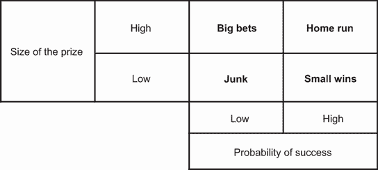
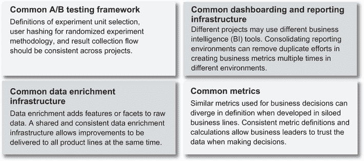
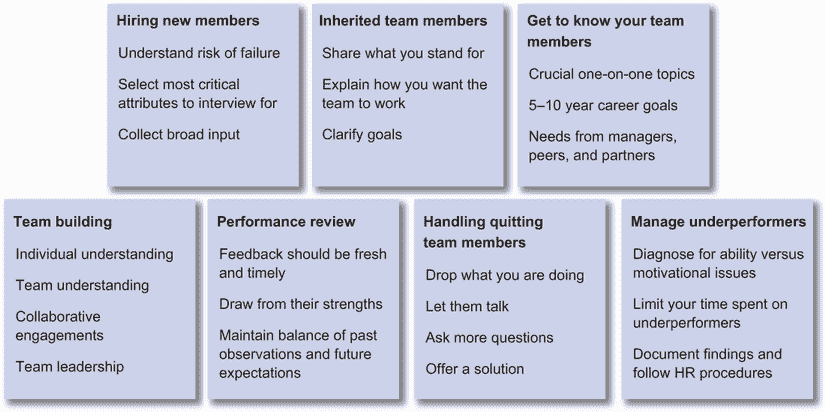
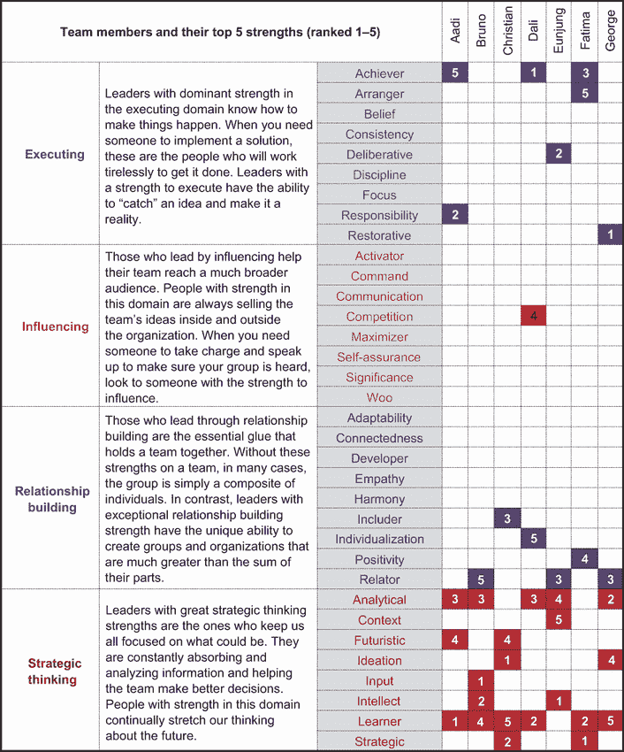
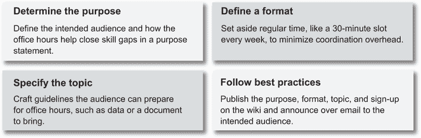
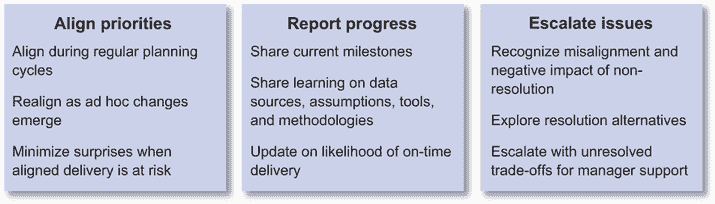

# 4 个人领导能力

本章涵盖

+   在确保项目之间结果一致性的同时委派项目

+   提供建构与购买的建议

+   建立强大的团队并影响合作伙伴以增加其影响力

+   向你的经理向上管理

+   扩展和深化你的业务理解

作为 DS 经理，你的主要责任是培养你的团队以产生业务影响。你的能力体现在你交付结果的能力、在你团队中推广技术专长组合以及增加你团队捕捉额外机会的潜力。许多这些责任也适用于员工数据科学家。

DS 经理的主要技术是委派过程。有效的委派可以最大化团队的生产力。作为经理或员工数据科学家，你还可以管理模型和项目的一致性，并为构建与购买决策提供建议，以提高团队的生产力。我们将在第 4.1 节中讨论这些技术问题。

要有一个强大的团队可以委派，你可以在你的监督下建立和培养一支人才队伍。作为经理或员工数据科学家，影响合作伙伴团队并协调共同产生更多影响可以帮助你的团队成员更成功。将你的团队努力与高级管理层的目标对齐以及向上管理对于公司倡议的成功执行也是至关重要的。我们将在第 4.2 节中讨论这些内容。

为了更好地预测高管和合作伙伴的需求，仅凭 DS 知识是不够的。在业务领域的专业知识可以帮助你理解基本的机会。这种知识还可以帮助你更好地确定团队在关键指标缺失时评估投资回报率的优先级。

在这些团队管理工具和实践的帮助下，你正朝着成为一名有能力的 DS 经理迈进。让我们深入探讨吧！

## 4.1 技术：工具和技能

作为 DS 经理，你负责将项目委派给团队成员。清晰的委派是什么样的？你如何平衡交付的需求与分配挑战性任务以帮助团队成员成长的需求？作为经理或员工数据科学家，你如何确保不同项目之间的一致性？你如何确定何时内部构建能力，何时购买外部产品或服务？这些问题是至关重要的，这些工具已经经过了几十年技术领导经验的磨练。

委派需要付出努力。第 4.1.1 节描述了一套你可以作为经理使用的工具，以诊断你的委派技巧。你还有确保项目成功的责任，而不仅仅是委派过程。当项目带来不同的风险和回报时，作为经理的优先级决策可能看起来与技术领导者的决策不同。

当项目被委派时，作为经理或员工数据科学家，保证多个项目之间结果的一致性可能具有挑战性，而不显得微观管理。第 4.1.2 节提供了在保持团队执行速度的同时，对齐工具和实践的指导。

某个特定团队的潜力总是有限的。为了进一步提高团队的速度，你可以提出购买与自建的建议，引入第三方解决方案。我们在第 4.1.3 节中讨论了在仔细评估策略、成本和风险的基础上，对购买与自建决策提出建议。现在，我们来看看技术考虑因素！

### 4.1.1 有效委派项目

作为数据科学经理，委派任务至关重要。许多第一次担任经理的人发现不亲自做项目的前景令人畏惧。作为数据科学家，我们被训练对结果持怀疑态度。“任何看起来有趣或异常的数据或证据很可能是不正确的！”这是 Twyman 定律[1]，我们中的许多人通过多年的经验将其铭记在心。这种怀疑态度使得将项目委派给团队成员变得更加困难。

这种焦虑是自然的。为了对最终结果负责，许多第一次担任数据科学经理的人在将项目委派给团队成员后，甚至还会表现出以下行为：

+   参加所有项目的站立会议和会议

+   直接询问更广泛的团队关于阻碍问题，而不是项目负责人

+   仔细审查项目负责人的决策并推翻其中一些

你能认出这些吗？这些都是微观管理的常见迹象。我们中的许多人以某种形式遇到过这些情况。关键在于学习我们如何避免它们。

| 021 | 新经理的两个关键概念：避免微观管理和利用委派来培养团队成员的职业发展。 |
| --- | --- |

有效的委派需要努力，并且从适当的规划和关注细节开始。以下是在委派时可以清晰沟通的七个领域：

+   *目标*——沟通你希望完成的事情，最好遵循 SMART 目标框架[2]，其中目标被制定为具体、可衡量、可实现、相关和有时间限制的。你的目标越清晰，以后审查就越容易。

+   *背景*——沟通项目的重要性。背景是推动委派项目动力的一个重要方面，因为它可以帮助团队成员理解项目的目的和影响，以及你或业务伙伴如何后来使用它。

+   *成功定义*——明确成功的指标对于事后评估表现至关重要。通常，员工未能达到预期表现的根本原因在于经理只提供了模糊的成功指标。经理不能期望团队成员能读懂我们的想法，知道什么看起来不错。一个“这个，不是那个”的框架可以很好地工作，通过包括具体的正面和负面例子。

+   *边界*—一些有动力的团队成员在寻找资源以完成项目时可能会很有创意。经理需要在委派时明确基本规则或授予团队成员的权限范围。这包括可用的资源、可能参与的人员、不应打扰的人员，以及何时应升级决策。

+   *确认理解*—在定义目标、背景、成功指标和边界之后，你应该确认理解。一个有用的方法是询问团队成员需要什么来开始工作。这种方法允许团队成员用他们自己的话来表达他们对委派过程的理解。

+   *确定下一步行动*—这为项目里程碑和检查的频率设定了期望。在前期达成共识至关重要，这样检查就不会被视为微观管理。

+   *回顾项目*—委派的最后一步是在约定的时间进行检查，以评估里程碑是否符合其成功标准。如果你不及时这样做，团队成员将不知道未来如何认真对待里程碑和检查。确保立即树立先例，并坚持你的说法。

正如你所见，委派需要工作——大量的工作。那么我们该如何决定要委派什么？

在委派中优先考虑的项目类型

你可以使用的一个工具是丹尼尔·沙佩罗（Daniel Shapero）开发的优先级矩阵（PMAT）[3]，如图 4.1 所示。当一个项目有可能成功，且回报显著时，它被称为*全垒打*。当一个项目预期会成功，且回报较小，它是一个*小胜利*。当一个项目风险很多，但回报可能很大，它是一个*大赌注*。而高风险低回报的项目通常被视为*垃圾项目*。

图 4.1 项目委派的优先级矩阵（PMAT）

作为一名 DS 经理，你会自己承担哪些项目，哪些会委派出去？对于许多第一次担任经理的人来说，答案是专注于全垒打和大赌注。对于雄心勃勃的数据科学家来说，优先考虑回报大的项目是一种本能！许多人可能会选择亲自承担实现全垒打的责任，并将大赌注和小胜利委派给团队成员，根据他们的能力。合理，对吧？

然而，有一种不同的观点可能更有效地最大化团队产出。这种观点从询问“我的团队成员是否也能以高概率完成项目？”开始。

如果答案是肯定的，那么项目可以有效地委派。如果你想扩大你的团队，你可以将那些一击即中的项目分配给你的明星团队成员，以帮助他们建立信心，并积累成功案例，为他们的下一次晋升做准备。这一举措可以帮助他们培养成就感以及对团队和你的忠诚。

对于那些成功概率高的小胜利项目，将它们委派给初级团队成员是非常好的。这种委派选择有两个原因。首先，你是在照顾团队成员，因为小胜利项目有助于初级团队成员建立记录，成为下一波明星球员。其次，你是在照顾公司：在不太可能的情况下，如果初级团队成员遇到困难，团队的整体胜利影响较小。

委派一个项目并不意味着你应该把它扔在一边，不再关心。作为经理，你应该绝对在商定的里程碑处进行检查，以确保项目按计划进行。

作为经理，你应该承担哪些责任？建议是承担一个大的赌注项目和所有垃圾项目。什么？承担一个大的赌注项目相对容易理解。你可以优先考虑回报最大的项目，并通过承担项目成功所需的最大风险来展示领导力。你也应该小心不要承担太多的大的赌注项目，因为它们固有的不确定性通常需要大量的关注，可能会对任何人造成压力。

好吧，但为什么**你**要承担垃圾项目呢？如果垃圾项目要被委派，你可能很难明确其目标或证明其影响，你的团队成员别无选择，只能执行它们。你是团队中决定一个垃圾项目是否可以取消或重新定义的最佳人选。如果你能取消对垃圾项目的承诺，并将它们重新定义以降低风险或增加回报，这可以简化团队的承诺并提高团队效率。有道理吗？

| 022 | 在委派中，你可以将一击即中的项目分配给你的明星团队成员，以帮助他们建立信心并积累成功案例。对于垃圾项目，你是最佳人选，决定它们是否可以取消或重新定义。 |
| --- | --- |

### 4.1.2 在模型和项目之间保持一致性

作为一名经理或员工数据科学家，你可能已经看到你在参与的团队中发生了这种情况：DS 团队已经成功完成了概念验证项目和快速胜利，但逐渐，进展缓慢到几乎停滞。当你调查原因时，你可能会发现系统的一部分创新被反复从零开始在其他部分实施，通常只有细微的差别。不同的部署变体产生了不连贯的见解，混淆了业务决策者，并损害了对 DS 结果的信任。这种情况通常发生在系统其他部分的创新以不同的方法由具有不同领域专业知识的数据科学家引入时。这样，一个团队可能会在 5 个不同的业务用例中维护 10 个不连贯的解决方案。哎呀！这种场景通常是在勤奋的 DS 经理主动查看图 4.1 中的 PMAT 垃圾象限时发现的。

记得第一章，案例 5 中的 Audra，这位数据科学经理吗？她在管理不同团队之间 DS 努力的连贯性方面很强，以最小化技术债务的积累，你也可以做到！以下是 DS 中积累技术债务的迹象，你可以开发一些重大项目来提高你团队的效率。以下是一些你可能想要探索的问题，这些也在图 4.2 中总结：

+   你是否有一个一致的 A/B 测试框架来快速评估不同类型的增量改进？

+   你是否有一个易于维护的仪表板和报告基础设施？

+   你是否有一个共享的数据增强平台，以便可以快速评估和部署到生产模型？

+   你是否有标准的指标管道，以便新指标可以快速部署到不同的产品线？

图 4.2 管理多个项目一致性的四个领域

常见的 A/B 测试框架

在公司数据驱动旅程的早期阶段，使用粗略的测量来指导产品/市场匹配决策，发布功能的初始版本可能很重要。随着时间的推移，可能会有多个项目需要不同级别的 A/B 测试。例如，对于一个应用中的常见新闻源功能，你可能会对字体和颜色进行用户界面的实验。也可以在 API 层面上进行实验，为特定用户类型选择不同的内容。还可以在用户细分层面上进行实验，针对不同用户类型的下一步最佳行动提出不同的假设。为了实现最快的发布路径，UI 层可能使用现成的功能，而用户细分层面可能有一些内部实验能力。

在某个时候，您可能希望在用户群体、选择和功能软启动方面的创新需要在实验层之间进行协调，并且实验能力可能需要在系统所有级别实现。您需要考虑现成的解决方案或发展内部解决方案以支持这些能力。一般来说，现代现成的在线实验平台拥有初创公司启动所需的大多数实验能力。挑战在于报告结果和额外的第三方调用延迟对延迟敏感的用户体验。我们将在本节下一主题中讨论构建与购买之间的权衡和建议。

拥有一个标准的 A/B 测试框架允许数据科学经理及时对其能力进行评估，并在多个实验层之间进行优先级和努力的权衡。如果您决定在内部构建 A/B 测试能力，任何关于实验单元选择、正交实验重做和结果解释的改进都应与所有实验层共享，而无需重新实现。有关构建或评估实验平台的更多详细信息，Kohavi 等人所著的《可信在线控制实验：A/B 测试实用指南》是一本很好的资源[4]。

共同的仪表板和报告基础设施

在开发的早期阶段，报告通常使用临时的数据处理管道构建。结果通过使用 Google Charts/R Shiny 构建的定制网络仪表板、短信或 Slack 进行共享。最终，某些数据管道可能映射到更复杂的 BI 工具，如 Tableau、Looker、Domo、GoodData、Birst 等，而其他仪表板可能在实验平台中使用。

当我们开发新的指标和指标管道来评估一个领域的业务时，我们希望尽可能在其他业务领域重用这些努力。不同的报告环境可能意味着在多个报告管道中重复创建指标，造成重复劳动。一个共同的仪表板和报告基础设施可以帮助减少在不同数据处理管道中重新创建相同指标时的无用功。

共同的数据增强基础设施

数据增强是通过添加特征或方面来精炼和增强原始数据的过程，例如通过细分、分类或与第三方数据进行匹配等技术。使用原始数据的各个项目可能会随着时间的推移开发出类似的数据增强流程。

例如，当一个数据科学团队支持多个产品线时，每个产品线可以根据其在地理位置和预算上的不同客户细分，要求其购买倾向模型拥有自己的数据增强能力。一个管道的改进可能需要在其他管道中进行大量重复的工作以进行验证，从而在过程中引入了无用功。

共享和一致的数据丰富基础设施可以使改进同时惠及所有产品线。请注意，升级模型和报告基础设施中的数据丰富能力仍然可能涉及。正如 3.2.3 节中讨论的，模型边界纠缠可能意味着依赖于共享数据丰富过程的模型将需要重新训练以利用数据丰富改进的全面好处。共享数据丰富基础设施所节省的是实施努力，而不是部署努力。

常见指标

来自不同指标管道的挑战有时是最难理解的。它们发生在不同的业务线随着时间的推移发展出类似的指标来做出业务决策或产生面向客户的报告功能时。

当类似指标在不同产品线中的实施上出现分歧时，业务决策可能在不同业务线之间变得不一致。客户可能会在不同界面看到不同的数字，这会降低对产品的信任并对其数据完整性产生怀疑。

不同定义的原因可能来自对原始数据源的多种选择（例如，在过滤机器人或异常之前或之后），不同的观察窗口（例如，日历月度活跃用户与滚动 30 天活跃用户），或对公司粒度的不同解释（例如，包括或排除已知的所有权和子公司层级）。作为一名数据科学经理，解决来自指标差异的技术债务以产生标准指标可以促进更快的企业决策并减少客户困惑。

总结来说，在多个项目中有更广泛的视角，数据科学经理有更多机会在这些项目之间寻找协同效应并诊断在单一项目层面无法观察到的挑战。作为团队领导者，你还可以与同级的 DS 团队合作，协调解决技术债务和减少 DS 职能中的垃圾或低效项目的工作。

### 4.1.3 制定构建与购买建议

为了产生影响力，数据科学团队通常需要整合各种能力。这些能力包括数据来源、数据聚合、数据验证、数据丰富、数据仓库、数据处理、建模、仪表板、A/B 测试、异常检测、事件警报等。许多这些组件在数据科学团队成长初期可能缺失。

你，作为数据科学经理或数据科学家，最接近团队推动项目前进的需求，并负有评估情况并建议团队是否应该构建或购买解决方案以推动项目前进的责任。在这些情况下，最终决策将由高级 DS 领导层做出，并经财务和运营高管批准。你认为如何考虑购买与构建的建议，以便你可以提出一个清晰的建议？

一条建议是不要过度思考。如果某个数据集花费几百美元，并且可以立即使项目提前一周完成，那么这是一个不言而喻的购买决定。许多副总裁级别的职位可以批准小额预算，并且文档要求最少。一串电子邮件和收据通常就足够了。如果决策涉及数千美元，并且成本会随着使用水平而增加，那么更深入地调查以下三个方面是值得的：策略、成本和风险。让我们逐一看看这些方面。

策略

在考虑是否在内部构建能力还是购买外部解决方案时，有三个策略问题需要考虑：

+   该能力是否是公司竞争优势的核心？

+   外部解决方案是否成熟、标准化，并且具有定制化的灵活性？

+   购买是否有助于更快地推出核心产品？

首先，让我们评估所考虑的能力是否是您公司业务竞争优势的核心。一个关键问题是：如果该能力在内部开发，它是否可以成为一个最佳解决方案，以至于其他人可能愿意为此付费？

没有正确或错误的考虑，公司可能在不同的时间有不同的担忧。例如，谷歌认为网络搜索相关性是其核心业务竞争优势。相比之下，雅虎多年来将其视为一种边缘服务，并作为技术解决方案购买。对于金融科技业务，理解客户金融交易类别可以被视为其竞争优势的核心，或者被视为可以购买的数据丰富化能力。

如果该能力被认为是边缘性的，我们需要评估是否有可购买的解决方案。外部解决方案的成熟度可以通过所需功能的完整性、部署案例的数量、解决方案所经历的迭代以及其定制化灵活性来评估。

所需功能的完整性可以帮助我们评估现有能力是否能够满足我们的核心需求。我们可以检查能力和部署过程是否得到了充分的锻炼，以至于大多数错误都通过部署案例的数量得到了解决。解决方案在演变过程中所经历的迭代可以说明随着时间的推移，解决方案是否融入了领域最佳实践。而定制化的灵活性为以后可能意识到需要的意外功能留下了空间。

一个未言明的信念是，购买解决方案是否会缩短上市时间。在一个有许多软件即服务提供的世界里，可能看起来你只需要在在线门户上创建一个账户，你就可以立即获得一套全新的能力。整合第三方数据处理能力的现实并非如此简单。

例如，为了最好地使用第三方 A/B 测试平台，我们首先需要上传或流式传输所有与用户细分相关的数据，以选择实验的用户。接下来，我们需要上传或流式传输所有下游事件到平台的 A/B 测试框架，以便平台计算核心评估标准来评估成功。

其中一些数据在传输到第三方平台之前可能需要脱敏或匿名化。如果平台在支持用户选择的复杂业务逻辑方面存在缺陷，则需要开发额外的适配器逻辑。一方面，这种粘合逻辑可能仍然比内部开发完整的 A/B 测试框架更快。另一方面，在完整的 A/B 测试基础设施可以到位之前，将简单的 A/B 测试设置作为临时解决方案，对于早期初创公司来说可能更快，尤其是在前几个功能之前。

成本

评估购买与构建决策的成本通常是讨论的焦点。对于购买选项，成本可能比支付给第三方的金额高得多。除了发票价格之外，工程资源中的集成成本和持续数据通道的维护成本是估计的关键组成部分。根据第三方供应商的业务模式，您可能还需要考虑随着业务增长成本如何扩展。

对于构建选项，总拥有成本不仅包括工程成本，还包括设计、测试、验证和维护成本。除了构建解决方案的直接成本之外，还需要考虑行业最佳实践的调研、用户反馈和迭代，以及团队的管理开销。最重要的是，机会成本是什么？团队应该花时间在这个构建上，还是应该考虑其他具有更高投资回报率的项目？

构建选项的一个常见挑战是目标受众的范围。数据科学家通常为内部受众构建内部系统，这些系统在部署时具有有限的可扩展性和较高的运营成本。第三方解决方案通常提供更好的用户界面，允许数据分析师和产品经理在没有数据科学支持的情况下自助完成许多任务。当比较运营解决方案的成本时，我们应该考虑这些差异。

风险

在评估购买与构建选项的风险时，事实是您今天可以购买现有的解决方案，而构建的解决方案尚不存在。对尚不存在的东西的成本、可行性和能力进行估计存在固有的风险。此外，直到您在特定环境中使用了解决方案，功能和最佳实践的差距可能并不完全清楚。

对于购买选项，能力不仅仅是规格表中的内容。为了正确评估风险，我们还必须理解解决方案的商品化，正如多个竞争性满意提供所展示的，以及购买解决方案的成熟度，正如能力和服务级别协议（SLAs）以及事件和故障的支持经验所展示的。

对于构建选项，除了技术和时间表风险之外，我们还需要评估团队中是否有构建所需的专长。如果有，拥有这些专长的才华是否愿意参与构建项目？如果没有可用的人才，招聘合适人才会有多难，需要多长时间？

DS 经理或员工数据科学家处于最佳位置来理解情况、收集信息、估算成本和评估风险，以便向高级管理层提出购买与构建的建议。建议本身不是决定。建议背后的分析是高管们为了做出决策而最需要的东西。根据任务的复杂性、对核心竞争力的战略重要性、需求的紧迫性和购买与构建选项的相对成本，最终的购买与构建决策通常涉及一系列行动。例如，能力获取策略可能包括现在构建、以后购买或现在购买、以后构建的里程碑序列。

这些是对三个看似简单的词：策略、成本和风险的很多考虑。对于对购买与构建决策的更详细分析，论文“影响大型澳大利亚组织购买与构建决策的因素”[5]可以作为一个很好的参考。现在可能是一个短暂的休息的好时机，因为我们将要深入执行环节！

## 4.2 执行：最佳实践

作为 DS 经理，你通过执行你的团队和你影响的其他团队来创造价值。如果技术是可以学习的，那么执行就必须是实践的内容。让我们从三个部分来看一下执行能力：

+   在你的监督下建立强大的团队

+   影响合作伙伴团队以增加你的影响力

+   向上管理

对于管理者来说，建立一个团队是一项令人兴奋的事业。在非人员管理角色中，你被分配与团队中的任何人一起工作。作为管理者，你决定你想邀请谁加入你的团队，你想管理谁离开。团队建设在第 4.2.1 节中讨论。

许多专家，包括美国科学和技术政策办公室的前首席数据科学家 DJ Patil，强调 DS（数据科学）是一项团队运动。对于经理和员工数据科学家来说，影响相邻职能执行数据驱动的方法和策略可以极大地提高你团队的影响力。影响实践在第 4.2.2 节中讨论。

最重要的是，你的输出必须与你的经理为你团队设定的目标保持一致。你被期望履行三项基本职责：确定优先事项、提交进度报告和升级问题。这样，你的经理可以了解你的优先事项和进度，并在需要时帮助你解决挑战性情况。管理上进的技巧在第 4.2.3 节中讨论。

| 023 | 如果技术是可以学习的，那么执行就必须是必须练习的。 |
| --- | --- |

### 4.2.1 在你的监督下构建强大团队

构建一个团队涉及邀请一群人加入你的组织。构建一个强大的团队涉及培养团队成员，以产生比他们作为一个群体所能做到的更大的影响。

你可以努力在以下七个领域取得成功，以在你的管理角色中取得成功。它们在图 4.3 中总结。

图 4.3 在你的监督下构建强大团队关注的七个领域

招聘新团队成员

在招聘时，你可以根据第二章和第三章中讨论的内容，评估 DS 候选人的能力和美德。能力包括在技术、执行和专业知识方面的经验和成就。美德包括道德、严谨性和态度。

招聘本身可以比作一个预测算法。你正在利用与候选人的短期互动来预测他们在你团队中的长期成功。在面试了数百名候选人之后，以下是一些可以帮助你稳固起步的启发式方法和策略：

+   *理解失败的风险*——如果你在招聘实习生，错误的招聘风险较低；人才库很大，技术技能大多没有差异。珍惜你招聘人员的时间，并在早期阶段积极筛选，使用如带回家的问题等技巧。在通过一定的技术门槛后，选择有潜力的候选人，并允许他们在工作中证明自己。如果你在招聘技术负责人，并期望他们的行为将影响团队的技术方向，错误的招聘的负面影响很高，人才库有限。建立一个严格的面试小组，进行多轮面试以保护面试官的时间，并预期在找到合适人选之前，需要面试 10-50 名候选人。你可以在设置稳健的招聘流程时寻求高管和合作伙伴的支持，这将在第 6.2.2 节中更详细地讨论。

+   *选择最关键的面试属性*——在团队成长的各个阶段，你可能希望关注特定的属性。例如，最初的招聘可能是通才，他们可以与各种利益相关者合作，而后续的招聘可以是专家，以完成团队的技能组合。TEE-ERA 粉丝也可以为评估通才与专家提供一个起点。入门级职位可能强调技术能力、科学严谨性和积极的态度，而技术领导角色可能强调项目执行、专业知识和专业道德。

+   *收集广泛的意见*——DS 是一项团队运动。对于将频繁与商业伙伴互动的角色，建立一个包括这些伙伴在产品、营销和其他方面的面试小组至关重要。基于小组的面试流程使候选人更好地理解角色的合作伙伴关系背景。它还使合作伙伴能够表达他们希望与谁一起工作。

作为招聘经理，小组有助于阐明你可能存在的任何盲点。你应该征求你的小组成员的详细回应，并讨论他们可能对候选人持有的任何担忧。尽管招聘经理做出最终招聘决定，但在讨论后应该达成共识，决定是否招聘或拒绝。这些讨论是小组学习如何最好地评估未来候选人的绝佳机会。在意见存在重大差异的不太可能的情况下，失败的风险（本列表中的第一个点）可以用来指导决策。例如，如果存在很高的失败风险，当面试小组中有坚定的不招聘意见时，我们建议拒绝候选人。让我们继续预测算法的类比，好吗？

理解失败的风险，使你能够选择一个具有可接受水平假阳性和假阴性的操作点。选择关键的面试属性就像特征工程。收集广泛的意见就像构建一个模型集合，以做出更明智的招聘决策。

当你是一名招聘经理时，你通常会对你亲自邀请加入团队的成员有一种敬畏感。敬畏是一种钦佩和恐惧的结合——不是在危险面前体验到的那种情绪，而更多的是与不熟悉相关联的紧张感。

在面试过程中，候选人通常会选择加入一个团队，因为他们重视你作为经理给予他们的机会。也可能存在你拥有剥夺这种机会权力的恐惧。这种敬畏感可以成为建立信任的经理与团队成员关系的有用起点。

继承的团队成员

如果你被提升为经理，而你的前同事现在向你汇报，恭喜你！在与你的队友合作时，你可能已经熟悉了他们的工作、能力和差距。这个背景使你知道何时信任你的团队成员。然而，作为经理，你仍然需要赢得他们在支持他们和帮助他们职业发展方面的信任。

如果你被雇佣来管理一个现有的团队，你被委托对你的团队成员的职业产生重大影响，并对公司产生重大影响。首要任务是了解你的团队成员，并让你的团队成员更多地了解你。在最初的几次会议中你所分享和学习的将对于未来成功关系至关重要。

在接管团队后的前几次互动中，你可能想要讨论以下一些话题：

+   *分享你的立场*。帮助团队了解你在 DS 领导力方面所遵循的任何指导原则。以下是一些例子：

    +   通过数据寻求深入理解，以使产品体验愉悦自然

    +   掌握智能路线图并构建具有鲁棒性和效率的系统

    +   在协作和开放的环境中运营，同时道德地使用数据，对客户的福祉保持敏感和同理心。

+   *解释你希望团队如何工作*。例如，你可能期望团队以特定的职业道德、专业严谨性和积极态度工作。

    第三章列出了一些供你考虑的点，包括：在客户最佳利益下负责任地运营的道德规范、适应动态环境中的业务优先级，以及自信地向团队成员传授知识；科学方法的严谨性、监测异常情况以及对企业价值的责任感；以及积极的态度，以坚韧不拔地应对失败、对事件响应时的好奇心和协作，以及在横向协作中尊重不同的观点。

+   *明确目标*。作为一名新经理，你通常首先执行你继承的组织现有的目标。准备好说明团队的目标如何与公司的使命保持一致，并清楚地说明你的决策过程以及你将如何评估团队的进展。

了解你的团队成员

不论是新招聘的团队成员还是继承的团队成员，在开始时建立信任和融洽关系将使你能够帮助团队成员度过团队旅程中的起伏。在与团队成员的第一次一对一交流中，你可能想要讨论以下一些标准话题：

+   你在一对一交流中最看重的是什么？

    有些人喜欢通过查看待办事项列表来讨论一周最重要的主题，其他人更喜欢通过提出要讨论的场景来进行辅导会议，还有一些人喜欢收到进度报告以获得反馈。无论具体格式如何，目标都是了解每个团队成员重视的内容，并有一个既让你又让团队成员感到舒适的有效格式。

+   你的 5 到 10 年职业目标是什么？我们能一起努力实现这些目标的哪些近期里程碑？

    年轻的团队成员可能还没有明确这些目标，或者可能有通用的目标，比如在 24 个月内晋升。高级团队成员可能有更明确的目标，比如成为高级经理、成为高管或创办自己的公司。帮助团队成员在长期目标上获得清晰性，为辅导他们并强调他们当前项目与构建他们向长期目标迈进的经验的相关性奠定了基础。

+   你需要从你的经理、同事和合作伙伴那里得到什么？

    根据团队成员向上管理的技能，你可能或可能不会收到一个清晰的请求，说明谁想做什么以及何时完成。你收到的任何回应都可以是一个极好的起点，以发现需要你注意的潜在更深层的问题。

除了这些标准问题之外，一些额外的项目可以帮助第一次担任经理的人导航人员管理的世界。Lara Hogan 在她的博客文章“我们的第一次一对一的问题”中[6]还建议以下内容：

+   什么让你感到烦躁？我怎么知道你烦躁的时候？当我看到你烦躁的时候，我能做些什么来帮助你？

    不论是在家里照顾孩子还是出于宗教或健康原因进行斋戒，了解这些信息在寻求团队成员在困难时期的理解和同情时可能非常有价值。

+   你喜欢如何接收反馈？通过电子邮件还是面对面；在一对一交流中还是即时发生？

    一些团队成员更喜欢书面反馈，这样他们可以思考和回应，而其他人则更喜欢更多的背景信息，以便更好地理解即时发生的反馈。

+   你更喜欢在公开场合还是私下里获得认可？

    在某些文化中，人们不喜欢在公开场合受到表扬。最好理解这一点，以避免无意中将团队成员置于不舒服的境地。

+   你最喜欢的自我奖励方式是什么？

    有时候，记住这一点可能是个好主意，因为总有可能你想以个人有意义的方式感谢团队成员。

现在你已经拥有了组建一个团队并通过一对一交流来了解他们的工具箱。如果团队成员都作为个人表现出色，你还能要求他们什么呢？让我们讨论如何让你的数据科学家团队作为一个团队表现出色。

团队建设

成功的数据科学实践者在量化领域的挑战中表现出色。然而，团队管理通常需要高情商，这可能不是许多数据科学家与生俱来的。即使 DS 经理具有出色的情商技能，帮助团队成员作为一个团队相互连接可能仍然具有挑战性。

幸运的是，有许多工具可用，以赋能的方式帮助量化团队成员的能力。[7] 其中之一是 Clifton StrengthsFinder。

就像 Myers-Briggs 类型指标[8]和 Erin Meyer 的 CultureMap[9]一样，Clifton StrengthsFinder 是一种心理评估，要求参与者回答一系列适应性问题，以评估他们的心理属性。与许多心理评估不同，Clifton StrengthsFinder 的输出是一个人的顶级领导力优势列表，而不是一套必须为特定情况解释的心理属性。

美国心理学家、盖洛普公司董事长 Don Clifton 的基本观察是，当人们盲目追随他们的领导角色模型时，他们往往会失败。一个人可能具有与他们的角色模型不同的领导力优势。人们如何根据他们的领导力优势来识别自己的领导风格？

Clifton StrengthsFinder 突出了从研究高度成功的领导者中确定的 35 项领导力优势中的前 5 项。你可以利用你的前五项领导力优势来形成你的领导风格以取得成功。每个领导力优势都有其阳台，即优势被成功使用并得到同事的欣赏，以及地下室，即优势可能被滥用或过度使用，从而产生负面反应。

例如，成就力可以具有阳台属性，如不知疲倦、强烈的职业道德、以身作则和积极进取。成就力的地下室属性包括不平衡、拍马屁、过度承诺、无法说“不”和过于专注于工作。

这样的系统可以在四个层面上使用，以帮助一群具有量化思维的科学家更好地作为团队协作：

+   *第 1 级：个人理解*——图 4.4 显示了七个数据科学家团队的 Clifton StrengthsFinder 的结果。每个个体的前五项优势在表格的每一列中都有所体现。利用这个结果，每个数据科学家可以查找他们的优势的阳台和地下室属性，并在与同事工作时反思和调整他们的行为。他们的优势可以通过团队合作得到积极的表现。

    

    图 4.4 Clifton StrengthsFinder 测试的样本输出

+   *第二级：团队理解*—团队还可以查看他们的集体优势。在这个例子中，DS 团队在战略思考和执行方面较强，而在关系建立和影响方面相对较弱。这种偏见在更直接的组织中的 DS 团队是典型的。在更大的公司中，影响力和关系建立的优势往往变得更加关键，因为团队的成功取决于对组织动态的敏锐敏感性。DS 团队可以遵循优势领域的整体覆盖范围，强调适合团队集体优势的项目和承诺。

+   *第三级：协作互动*—通过第一级的个人反思，团队成员可以与队友讨论他们的优势阳台和地下室属性。话题可能包括：哪些互动能激发我最好的表现，当我表现最差时会发生什么，你能依赖我什么，以及我需要你做什么。这些讨论在每对团队成员之间不超过 10 分钟，但 Clifton 优势发现器所强调的具体优势可以迅速阐明未来的潜在协作机会。

+   *第四级：团队领导力*—当个人和团队的优势被理解后，具有罕见优势的团队成员有机会提供办公时间来指导队友。建议的领域可能包括他们如何处理各种情况，例如通过数据讲故事来影响他人或在困难情况下与商业伙伴建立关系。这种同伴互助机制使团队成员能够为他们的职业成长建立领导身份，并帮助他们提高许多领导力优势领域的熟练度。

Clifton 优势发现器只是你可以使用的许多量化工具之一，用于用积极心理学构建你的团队。目标是帮助团队识别其集体优势，并帮助每个队友做到他们职业生涯中的最佳工作，为组织的愿景和使命做出贡献。虽然构建团队可能很有趣且有益，但没有审查的过程是不完整的。是的，这意味着绩效评估。

绩效评估

作为管理者，你负责帮助团队成员做到他们职业生涯中的最佳工作。绩效评估是许多反馈机制之一，用于指导 DS 团队成员发挥最佳水平。团队成员都是凡人，他们在项目上会有好日子和坏日子。你何时提供反馈？你希望提供什么样的反馈？

首先，持续的反馈总是优于每季度或每年一次的周期，主要原因有两个：

+   对最近发生的一个积极或消极情况的及时反馈提供了更细致的学习背景。如果反馈是针对数月前发生的事件，则只能传达一般性的背景和建议。

+   新鲜及时的反馈可以触发进一步促进积极行为或迅速抑制消极行为的行动，从而使团队成员能够更快地改进。

需要避免的一件事就是只提供负面反馈。这可能会产生所有持续反馈都是负面反馈的印象。我们将在第 5.3.2 节中详细讨论如何最好地建立对持续反馈的积极态度。

除了持续反馈外，组织还有季度或年度的正式绩效评估。这些流程通常被设立来同步晋升评估和绩效管理流程。

这些评估对团队成员的职业发展具有重大影响。作为 DS 经理，你应该认真对待它们，并考虑以下三个行动：

+   *花时间写反馈*。TEE-ERA 粉丝可以帮助提供在技术、执行、专业知识、道德、严谨性和态度等方面的具体 DS 维度。确保突出开始、停止和继续的方向，以帮助团队成员达到下一个职业里程碑。

+   *发挥团队成员的优势*。克利夫顿优势发现器的结果可以用来评论团队成员的优势如何表现出他们的阳台和地下室特性，以及他们如何利用自己的优势来提高自己的表现。

+   *保持过去观察和未来期望的平衡*。管理者有时会陷入夸大顶尖表现者的成就并为未来的改进提供有限反馈的陷阱，对表现不佳的员工减少负面反馈，并详细说明未来的发展领域。为了帮助数据科学家做好他们职业生涯的最佳工作，保持平衡的绩效评估至关重要。本书中描述的职业路径可以为你提供帮助，规划顶尖表现者的路径。TEE-ERA 的要求可以帮助你强调对团队成员表现良好的更严格期望。

处理辞职

有时，一位高度重视和受尊敬的团队成员决定辞职——不是因为更高的薪酬或另一家组织的更好福利，而是因为他们觉得自己的工作没有得到认可。这种情况在竞争顶尖人才的领域很常见。你和你的组织都不想失去他们，但他们的决定可能表明你作为管理者在工作的某些方面有所忽视。

安迪·格鲁夫在《高输出管理》[10]中描述了这样一个场景。辞职的消息通常是在最不方便的时候以惊喜的方式传达的。安迪生动地描述了这种情况，并指导管理者采用一种最大化保留辞职团队成员机会的技术：

+   *放下你正在做的事情*——请他们坐下，询问他们为什么辞职。失去一位受尊敬的团队成员的风险应该比许多其他任务有更高的优先级。

+   *让他们说话*——团队成员可能已经无数次地排练过他们的演讲。不要与他们就任何问题争论。

+   *多问问题*——在准备好的演讲之后，真正的理由可能会浮出水面。不要争论；不要说教；不要慌张。

通过你的行动表明，他们对你和组织来说很重要。反过来，你成为推动解决方案的项目经理。涉及你的经理、人力资源部以及你可能拥有的任何其他支持来源，以帮助你挽救员工，即使这意味着允许他们向另一位经理汇报。如果这是一位值得挽救的宝贵员工，你的同事经理会感激你，并可能在未来回报你。

离职的团队成员可能会感激你用解决方案解决了他们离职的真正原因。然而，可能会有一种持续的印象，即他们可能被视为迫使你进入新情况。

为了留住团队成员，你需要让他们感到舒适地留下，并说服他们他们并没有“勒索”你去做你本来不会做的事情。他们只是让你意识到一些你本应在之前就解决的职责上的差距。

经理们也只是凡人；我们都有盲点，会犯错误。然而，扭转这种状况的影响远不止离职的团队成员。当一个备受尊敬的顶尖表现者离职时，这可能会损害整个团队的士气以及组织的忠诚度。

管理表现不佳的员工

DS 经理可以花费大量时间的一个领域是管理表现不佳的员工。在有限的时间和巨大的责任来增加团队影响力的情况下，管理表现不佳的员工的机会成本是巨大的。你如何评估表现不佳的员工是否可以迅速扭转，或者是否是无可救药的？

需要做出的一项诊断是，表现不佳的员工是否存在能力问题、动力问题，或者两者兼而有之。能力问题发生在团队成员在执行项目时存在培训不足的情况。动力问题则出现在团队成员不愿意完成项目或被项目分心时。

假设团队成员存在能力问题但具有动力。在这种情况下，这可能是经理在分配项目时对团队成员能力理解上的盲点。这是一个机会，让团队成员由具备该能力专长的另一位团队成员进行指导。项目可能需要更长的时间来完成，但这可以是导师和学徒双方的成长机会。大多数时候，有动力的表现不佳的团队成员可以迅速提升。如果差距太大无法弥补，表现不佳的员工可能需要被管理离职。

一种常见的误解是，动力问题更容易解决。虽然你可能能够解决由工作场所情况引起的某些动力问题，但许多动力问题的根源在工作之外。你的一些同情和耐心可以帮助推动表现不佳的团队成员独立解决工作之外的问题。你应该限制你在表现不佳的团队成员身上花费的时间，因为你的时间可以更好地用于培养你的顶尖表现者。如果问题持续存在，表现不佳的员工将不得不被管理出去。

如果表现不佳的团队成员既有能力问题又有动力问题，首先关注解决动力问题。当动力不足时，任何弥补能力差距的努力都不会那么高效。你可能需要检查招聘流程，以更好地了解如何避免未来出现类似情况。

在诊断过程中，务必记录你的发现并遵循任何人力资源建议和程序。一个标准流程是在绩效改进计划中记录你和团队成员同意改进的内容。这个过程是一系列明确定义的目标，团队成员必须在固定期限内实现。务必进行定期检查，并记录对情况是否有所改善的共识。当事情有所改善时，这个过程可以成为团队成员的重要学习经验。更常见的情况是，差距太大而无法弥补。人力资源流程将确保存在相互尊重，公司也将得到法律保护。

将概念结合起来

建立你的团队涉及招聘新团队成员和继承现有团队成员。在招聘新团队成员时，根据角色的资深程度调整面试的严格程度，选择最关键的面试属性，并收集广泛的反馈以全面了解候选人。在继承现有团队成员时，通过主动分享你的立场，解释你希望团队如何工作，并阐明你将评估团队进度目标，来建立联系。

在了解团队成员时，你可能想要定期进行一对一交流，并了解他们的长期职业目标。为了了解你的团队并帮助他们相互了解，你可以在团队建设中使用心理评估来量化他们的心理优势。《克利夫顿优势发现者》可用于个人理解、团队理解、协作参与和团队领导。

在提供反馈时，频繁和及时的反馈比季度或年度绩效评估在强化或抑制行为方面更有效。平衡正面和负面反馈可以避免人们认为所有持续反馈都是负面的。在正式的绩效评估中，花时间撰写反馈，借鉴团队成员的优势，并保持过去观察和未来期望的平衡。

如果一位受重视的团队成员表示他们想要辞职，放下你正在做的事情，让他们谈谈，并只提出澄清问题以找到真正的原因。与你的经理和人力资源部门合作解决问题，并让他们在没有被迫陷入困境的耻辱感下感到舒适地留下来。

要管理表现不佳的员工，需要诊断其动机和能力原因。虽然能力原因可以通过导师制来解决，但你只能从工作场所的情况中解决动机原因。当存在动机和能力原因导致表现不佳时，你可能希望首先解决动机原因。

那是关于处理离职队友和管理表现不佳员工这个相对沉重话题的大量密集信息。现在，在我们转换话题，讨论如何扩大你对你直接团队之外的影响力之前，可能是一个休息的好时机。

### 4.2.2 影响合作伙伴团队以增加影响力

作为 DS 经理或员工数据科学家，你的影响力超出了你的团队。你还有能力和义务影响和改进合作伙伴团队的运营，包括产品、工程和业务功能，以产生组织价值。你有两个层次的影响力来传播：作为个人和作为团队。

作为个人进行影响

*作为个人*，你可以通过频繁与业务伙伴沟通，提供严格建议，深入了解他们的挑战——不仅限于项目，还包括日常流程——这可以显著提高合作伙伴团队的效率。让我们看看一个展示个人影响力的例子。

推出功能通常不是一个顺利的过程。经验丰富的 DS 从业者可能见过这种情况以某种形式发生：在工程合作伙伴团队花费数周进行架构、开发、测试、集成和发布一个功能后，用户体验看起来符合预期，但收集到的数据看起来不正常。几周后，当你被邀请审查一些难以解释的 A/B 测试结果时，你发现跟踪事件不完整，治疗组和对照组之间存在样本量偏差，数据管道中的错误，以及操作仪表板上的缺失指标。这些问题触发了另一轮工程错误修复、测试、集成和发布，然后再尝试验证产品假设。

您可以通过定义一种方法来快速验证特征发布后的跟踪能力，帮助工程团队更快地识别问题。该方法应测试以下内容：

+   *事件正在根据跟踪规范触发*。如 3.2.2 节所述，这种严谨性包括对可用性、正确性和完整性的验证。可用性是指跟踪信号的存在。正确性是指满足数据格式规范。完整性意味着事件被收集而没有损失。

+   *数据正在通过指标管道处理并出现在结果仪表板上*。可能有众多指标，如点击率和会话长度，涉及一定程度的数据聚合或处理。传入的事件信号通常需要适当标注并放置在特定位置，以便被指标管道拾取。

+   *用户正在根据实验规范被选择*。错误可能导致实验中选择的用户过多或过少。例如，机器人过滤问题可能允许过多的爬虫进入在线实验，从而阻止有效学习人类用户行为洞察。实验设置中的错误也可能允许过少的用户进入测试，这样在合理的实验时间窗口内不太可能收集到足够的数据。其他错误可能导致用户选择治疗或控制时产生偏差，破坏统计随机用户选择假设，导致结果测量无效。

这种跟踪方法可以记录下来，以影响工程合作伙伴团队在特征集成测试和发布的第一天进行自我检查时采用数据最佳实践。记录的最佳实践可以缩小错误发现的反馈循环。此外，这类方法文档也可以提供给产品团队和业务垂直团队，以推广功能和读取 A/B 测试。编写、分享和传播数据驱动最佳实践展示了您对提高组织整体效率和产出的影响力。

团队协作影响

*作为数据科学团队*，您可以对同伴数据科学团队和业务合作伙伴团队产生更广泛的影响力。在 4.2.1 节中展示的团队建设练习的第 4 级中，您可能观察到一些团队成员在数据科学领域的特定领域表现出色。

您可以通过赋予这些团队成员独特的优势来建议队友并扩大他们对不同同伴团队的影响力。主题可以包括统计建模、用数据讲故事、特征工程中的自然语言处理和因果推断。您如何有效地促进这些技能和知识的分享？

如果你只是通知同事和合作伙伴，他们可以向拥有独特且宝贵技能和知识的团队成员寻求帮助，那么该团队成员可能会迅速被工作干扰性的询问所淹没，无法专注于自己的工作。换句话说，团队成员可能成为自己专业知识的受害者。为了减轻临时干扰，保护团队成员的生产力，并赋予他们建立影响力的能力，可以设立办公时间。

| 024 | 拥有独特且宝贵技能集的团队成员可能会迅速被工作干扰性的询问所淹没，无法专注于自己的工作。他们可能成为自己专业知识的受害者。一种可以尝试的技术：设立办公时间。 |
| --- | --- |

设置高效办公时间的一个有效起点可以涉及四个要素，如图 4.5 和以下列表所示：

+   *确定目的*—我们可以通过明确的目的来确定办公时间的预期受众。以下是一些目的声明的例子：

    +   建模办公时间赋予同行数据科学家使用最适合当前项目的建模技术，并提高建模过程的严谨性。

    +   数据访问办公时间使商业伙伴能够通过简单的查询独立提取数据，选择最佳数据源使用，并创建仪表板以跟踪业务指标。

    +   故事讲述办公时间帮助同行数据科学家将他们的分析转化为影响，并建立他们作为强大沟通者的品牌。

+   *定义格式*—每周留出一到两个固定的 30 分钟时段，可以最小化对主持办公时间的团队成员的干扰。重复的时间也可以为办公时间的受众提供一些确定性，即当需要帮助时，拥有宝贵技能和知识的团队成员可以在最小协调下可用。

+   *指定主题*—为了充分利用 30 分钟的会议，一套指南可以帮助受众为这样的会议做准备。对于建模办公时间，一个包含初始建模挑战或初始结果的项目计划可以帮助为提供反馈设定背景。对于故事讲述办公时间，一个明确定义的目标客户的演示文稿的初始版本可以帮助将会议重点放在改善数据科学家的结果交付上。

+   *遵循最佳实践*—为了成功运行办公时间，你可能想在维基百科上发布目的、格式和主题，并通过电子邮件向预期受众发布公告。共享的报名表也可以最小化与受众的协调开销。如果某一周没有报名，你可以在前一天晚上取消会议，以阻止未准备好的临时出席。

图 4.5 设置有效办公时间的四个要素

作为数据科学家，我们应该在持续改进办公室小时的最佳实践中采取数据驱动的方法。确保在会议结束后收集反馈和证词。好的证词也可以突出团队产生的影响和影响力，并激励和招募更多数据科学家同行成为教练，以进一步扩大办公室小时的范围。

办公室小时只是扩大你在组织中的团队影响力的许多方法之一。其他方法包括建立每周研讨会，与同行数据科学团队分享关键项目的经验教训，或者为业务伙伴制定培训课程，以便他们能够更好地使用数据工具自助解决简单数据问题。所有这些行动都可以扩大你团队对组织其他部分的积极影响和影响力。

### 4.2.3 向你的经理汇报

如果你是一名数据科学经理，你代表组织向团队汇报，同时也代表团队向组织汇报。如果你是一名员工数据科学家，你代表公司重大数据科学项目的利益。在向可能是一位高级经理、总监或其他高级员工汇报时，你有三个基本领域可以履行，如图 4.6 所示。

图 4.6 向你的经理汇报的三个领域

对齐优先级

为了使一群人作为一个公司共同执行，每个人都必须执行公司计划的自己部分。在常规规划周期和临时变化出现时，你必须与你的经理保持优先级一致。

在常规规划周期中，你的责任是将你的经理的高级倡议解释为一系列项目和规格，以便你的团队执行。这个对齐过程首先涉及阐明你对经理的高级倡议的理解。这最好以书面形式完成，基于对战略增长方向的牢固掌握，并与公司的愿景和使命保持一致。在典型的商业环境中，高级倡议不应频繁改变，这种对齐通常每季度只发生一次。

在项目优先级被设定以推进高级倡议的同时，在优先级确定过程中必须做出许多假设。数据科学家及其技术负责人将根据他们对项目创新和影响的最优判断；项目的范围、影响、信心和努力；以及他们评估与长期数据战略的战略一致性。我们在第 2.2.1 节中描述了这些技术。

在常规规划周期中与你的经理保持一致时，你寻求他们对为交付高级倡议而提供的项目组合的反馈，并验证优先级确定过程中做出的假设。成功意味着他们的反馈能够迅速得到考虑，并得到一个你的经理可以批准的计划。

当运营环境条件发生变化时，也可能出现临时性的变化。这些是经理可能提出优先级变化以供你与团队实施的时候。

在向上管理中，如果你觉得优先级的变化使得你的团队无法交付，与经理坦率地讨论权衡可以最小化后来因优先级变化而错过现有承诺里程碑时的惊喜。支持这些权衡的事实和数据对于向经理展示至关重要，这样他们就可以决定如何前进。

报告进度

在计划执行过程中，进度报告对于与经理的沟通至关重要。进度报告不仅包括分享当前里程碑。它还应包括任何关键的学习成果及其对实现未来里程碑的影响。

考虑到团队的生产力，进度报告应包括诸如探索的数据来源、使用的生产力工具、做出的假设以及开发的方法等学习成果。第 3.1.3 节描述了这些学习成果在与其他团队分享的背景下的情况。

当向上管理时，分享你团队的所学可以让你的经理了解你的工作，建立对你管理能力的信任，并提供反馈。你的经理可能了解其他团队的所学，以帮助加速你的进步。他们也可能帮助你提升问题，提供对假设的额外背景信息，并将你的最佳实践更广泛地传播到其他团队。

| 025 | 在向上管理中，你被期望对齐优先级，报告进度，并提升问题。进度报告不仅仅是分享里程碑。它还可以包括关键的学习成果及其对未来里程碑的影响，以建立对你管理能力的信任。它还可以为你的经理提供一个分享其他团队学习成果的机会，以加速你的进步。 |
| --- | --- |

管理向上的另一个部分是分享根据你到目前为止的学习，完成正在进行中的承诺的可能性更新。是否从数据源探索中发现了额外的风险？是否有一些项目部分可以通过使用生产力工具来加速？生产力工具中是否有需要工作绕道的错误，这将导致进一步的延迟？是否有一些需要重新审视的假设？

这些评估将帮助你的经理与业务伙伴管理可能的延迟预期。它们还可以让经理提供替代方案或支持，以帮助项目回到正轨。你的经理还可以利用这些经验对其他团队的项目进行成功可能性评估，这些项目可能从相同的最佳实践中受益或遇到相同的问题。

提升问题

即使有最好的意图，与面临不同约束的合作伙伴合作时，也可能出现挑战和差异。当项目成功受到威胁时，可能需要升级情况。让我们在建立与合作伙伴的信任工作关系的同时，讨论问题的“清洁升级”。

在升级之前，团队应首先认识到偏差和未解决情况的负面影响。有时，影响可能小到足以使项目交付的某些延迟成为所有相关方最不具破坏性的权衡。当偏差对结果产生重大负面影响时，确定受影响的利益相关者并首先合作确定可能的解决方案，以查看是否可以在利益相关者之间解决挑战，这是至关重要的。当你能够解决分歧时，情况就变成了进度报告，涉及确定挑战并富有成效地解决它，以便分享经验教训。

当分歧无法解决时，你可以管理升级过程至报告链。升级意味着你已经耗尽了你执行能力内的所有选项。然后你应该将问题连同其他利益相关者一起带到你的经理那里，突出偏差、未解决情况的重大负面影响、已经探索的替代方案以及没有经理的支持无法解决的权衡。

准确描述偏差情况，可以让你的经理快速掌握问题的全部背景。偏差的负面影响的重要性，可以让你的经理在处理所有其他问题时，恰当地优先解决这一问题。已经探索的替代方案，使他们能够专注于尚未尝试的更广泛资源，解决问题、推迟或升级问题至报告链。通过优先级对齐、进度报告和问题升级，你可以开始与经理建立信任的工作关系，以执行 DS 项目。

记住，作为一名一线 DS 经理或数据科学家，你应该自信地分享你的观点。你更接近数据科学家和项目。你应该比组织中的任何人都更了解团队的实施能力，包括你的经理。有了这些知识，你负责管理经理对可能发挥团队全部潜力的期望。

让我们总结一下

为了整合这些内容，在向上管理中，你被期望履行三个基本职责：对齐优先级、报告进度和升级问题。在对齐优先级时，准备准确地将你经理的高层次倡议转化为团队优先级项目，并向经理汇报以获取反馈。在报告进度时，分享所学知识及其对未来里程碑展望的影响。在升级问题时，确保问题可以导致足够大的负面影响。如果可能，强调不解决的重大负面影响、已探索的替代解决方案以及没有经理支持无法解决的权衡。这样，你的经理就可以了解解决、推迟或继续升级问题的全部背景。

第一章第 4 个案例中的保罗（作为 DS 经理工作六个月后感到疲惫），可以使用这些技术向上管理他的上司。他可以将优先级与上司对齐，以明确他应该投入更多时间和团队资源的地方，并且可以将无法满足的合作伙伴的请求升级，以防止他的团队在太多项目上过于分散。

## 4.3 专家知识：深入领域理解

第一章中的保罗承担了许多请求，他感到不知所措和疲惫。他只有混合的结果，并且看起来在确定重点方面缺乏领导力。

你的团队期待你将他们的日常工作与大局联系起来。你有责任利用专家领域知识识别战略和战术机会，并将它们转化为团队目标和优先事项。本节为保罗以及类似情况的管理者提供了工具，以获取领域知识，有效地评估、预测和优先处理来自团队和业务伙伴的请求。有了这些工具，保罗（以及你！）就可以提供团队所寻求的领导力，并提升团队的士气。

你如何成功做到这一点？三个要素是必不可少的：

+   在多个技术和商业领域扩大知识面

+   认识到基本领域的机会

+   即使缺少数据也能评估项目的投资回报率

为了帮助将 DS 能力与业务需求联系起来，扩大领域知识对于服务于广泛的业务伙伴至关重要，例如财务、营销、产品和客户服务。使用不同的关键绩效指标（KPIs）和优化技术来推动业务影响将是有益的。

在满足特定业务需求的同时，也存在只有具有深厚 DS 专业知识的人才能意识到的基本数据机会。你有责任提出并执行那些可以立即或长期影响收入、成本或利润的想法。

在提出新的数据科学 (DS) 项目时，通常优先考虑对业务影响最大的项目。然而，评估业务影响的临界参数经常缺失。业务领导者经常在没有数据的情况下做出决策。我们可以从他们那里学习，利用专家领域知识对这些关键参数做出最佳估计。然后我们可以利用我们的分析优势来评估结果对广泛估计的敏感性，从而对我们的项目影响评估更有信心。

### 4.3.1 扩展知识到多个技术和业务领域

许多第一次担任经理和数据分析人员都很聪明和自信，在与其他数据分析人员互动时。然而，在与商业伙伴会面时，讨论可能会很快变得尴尬。话题可能看起来是从不熟悉的视角提出的，第一次担任经理和数据分析人员可能会发现很难即兴思考并自信地回应。

如果这种情况发生在你身上，不要担心；你不是一个人。这种尴尬通常来自于对商业伙伴的基本关注和他们的提问和请求的真实意图理解有限。通过拓宽你对这些基本商业关注的理解，你可以预测并准备他们的提问和请求。

| 026 | 第一次担任经理和数据分析人员在与商业伙伴交谈时可能会感到尴尬。这可能是由对商业伙伴的基本关注和他们的提问和请求的真实意图理解有限造成的。尝试拓宽你的理解。 |
| --- | --- |

在组织中，尤其是在快速发展的组织中，每个业务功能都面临着巨大的压力，以实现其目标。表 4.1 展示了各个业务功能的一些基本关注点和关键绩效指标。

表 4.1 各个业务功能的基本关注点和示例关键绩效指标

| 业务功能 | 解决的基本关注点 | 样本关键绩效指标 |
| --- | --- | --- |
| 营销 | 寻找对现状不满并需要帮助的客户 |

+   *品牌认知*—对品牌的认知

+   *净推荐者得分 (NPS)*—传播品牌的倾向

+   *客户获取成本 (CAC)*—获取客户的成本

|

| 销售额 | 与愿意购买的客户进行交易以带来收入 |
| --- | --- |

+   *胜算比*—合格潜在客户转化为成交的比例

+   *销售周期长度*—从潜在客户到成交的时间（B2B）

+   *总商品交易额 (GMV)*—交易的商品总额（以美元计）

|

| 分销 | 优化交易中的物流合作和协调 |
| --- | --- |

+   *交货时间*—从下单到交货的时间

+   *运输成本*—从下单到交货的所有费用

+   *库存周转率*—整个库存销售次数

|

| 产品 | 满足客户期望以提供满意度 |
| --- | --- |

+   *转化率*—从一阶段到下一阶段过渡的用户比例

+   *客户流失率*—一段时间后离开的客户比例

+   *病毒式传播*—产品从一个用户传播到另一个用户的速度

|

| 财务 | 在优化企业价值和现金流的同时保持财务可持续性 |
| --- | --- |

+   *毛利率*—总销售收入减去商品销售成本

+   *平均每用户收入 (ARPU)* *—* 总收入 / 用户数量

+   *终身价值 (LTV)*—整个关系中的未来净利润

|

| 客户服务 | 产生客户信任以维持进一步交易意愿 |
| --- | --- |

+   *CSAT 分数*—通过调查得到的客户满意度分数

+   *首次响应时间*—支持工单与初始响应之间的时间

+   *平均解决时间 (ART)*—解决所需时间

|

如表 4.1 所示，各种业务功能的基本关注点差异很大。在任何时候，业务伙伴都可能专注于验证或优化特定的 KPI 子集。

作为 DS 经理或数据科学家，了解公司的收入来源以及它们可能存在的风险是至关重要的。你可以通过研究公开和面向私人的文档，并努力了解你的业务伙伴来做到这一点。有时，最大的挑战是克服提出“愚蠢”问题的意愿。当你更有信心时，找到更聪明的人，提出更多“愚蠢”的问题。很快，在你所工作的每个业务功能中经过几次这样的会议后，你将能够预测常见问题并加以解决。

在广泛了解业务的基础上，“专家”知识的一部分还需要你遵循业务领域的严谨性。以下是将 DS 能力与业务需求连接时常见的三种混淆示例：

+   月度同比增长 (MoM)

+   商品总价值 (GMV) 与收入对比

+   客户获取成本 (CAC)

月度同比增长

MoM 通常被测量为月度增长率的简单平均值。然而，衡量这个指标的目的通常是为了使用历史数据来预测未来增长的影响。随着组织的成长和产品功能的成熟，增长通常基于当前业务规模的复合增长。更准确地说，复合月增长率 (CMGR) 可以是一个更有意义的月度增长指标。

CMGR 的计算公式如下：[CMGR = (最新月份/首月)^((1/月份数量)) – 1]。它将小于增长业务中的简单平均值。它也是潜在风险投资家用来跨公司比较的基准。

商品总价值与收入对比

GMV 是在特定时期内通过市场进行商品交易的总销售额。这是消费者所花费的金额，也是衡量市场规模的一个有意义的指标。然而，它并不是市场的收入。

收入是市场赚取的 GMV 的一部分，包括市场为提供服务而收取的各种费用，广告收入和赞助收入。根据市场提供的服务，收入可能包括退货处理费、运输和手续费、客户服务费和支付处理费。

客户获取成本

获取客户的成本可能使商业模式成功或失败。这对于初创公司和成熟公司都是业务运营中密切关注的指标。虽然可以简单地将其定义为按每个用户计算的获取用户的全额成本，但解释和计算有多种变体。

严格来说，CAC（客户获取成本）是指获取下一个增量用户所需的支出。在分子中，应包括所有推荐费、信用和折扣的全额成本。获取的用户数量应仅包括那些归因于付费渠道的用户，并且不应与分母中的自然流量混合。这个定义被采用是因为付费营销渠道提供了最直接的杠杆，可以通过额外的营销支出进行移动。

然而，有人可能会争辩说，付费营销的一些影响可能无法准确归因于获取的用户。设计良好的分区域测试可以帮助评估是否应该将部分自然流量归因于付费活动。

在某些情况下，包括付费和自然流量的混合 CAC 视图也可以作为一个报告指标提供信息。它可以用来监控与客户 LTV 相关的 CAC。如果一个 CAC 低于 LTV，可以确认客户获取支出与公司增长特定阶段的业务策略一致。

这三个业务指标（月度增长率、GMV 收入和 CAC）是您业务伙伴词汇的一部分。它们说明业务指标不应仅从字面上理解。您也有责任理解为什么使用它们以及如何正确计算它们以指导未来的业务决策。

您可以查看安德森·霍洛维茨风险投资公司发布的博客文章“16 个创业指标”以了解更多关于业务指标讨论的内容[11]。在旨在产生业务影响的 DS 项目合作中，只有当我们说我们的业务伙伴的语言时，我们才能赢得他们的信任和尊重。

总结来说，您负责识别战略和战术机会来定义团队目标和优先级，并将 DS 能力与业务需求相连接。您可以了解不同业务功能（包括营销、销售、分销、产品、财务、客户服务）中正在解决的基本问题，以及对他们来说重要的 KPI。其中，连接公司商业模式与收入的 KPI 的细微差别，如月度增长率、GMV 和 CAC，特别重要，需要明确和对齐。

### 4.3.2 理解基本领域机会

作为一名经理或数据科学家，团队期待您将数据科学能力与公司优先事项联系起来。您的职责要求您超越业务合作伙伴的要求，发现只有具备深厚数据科学专业知识的人才能识别的根本数据机会。您负责提出并执行具有实质性收入影响的想法，以及具有长期业务影响的数据策略。实现这一目标的一个过程涉及通过基准测试、解释和生成（B.I.G.）方法创造具有影响力的想法：

+   *基准测试*——基准测试旨在理解超出公司内部业务视角的领域背景。现有的内部数据可能包含现有业务的偏见和局限性。使用外部来源进行基准测试允许数据科学成为构建业务背景的合作伙伴。

    参考基准数据集可以来自政府或公司。政府来源包括联邦机构，如劳工统计局、人口普查局，以及州和城市公开记录。私营部门数据可以来自谷歌趋势的在线流量、邓白氏的公司实体数据，或领英的人才数据和职业联系。

+   *解释*——这是对基准统计数据对您的客户群体影响的理解。它可以提供您优先排序决策的定量基础，并使您的团队专注于最具影响力的项目。

+   *生成*——当使用基准业务背景和基于定量基础进行优先排序时，您更有可能发现能够产生巨大影响的根本机会。

虽然您可以在基准测试和解释步骤中自己构建专业知识，但生成步骤通常在团队环境中效果更好。让我们考察一个 B.I.G.方法的例子，该方法用于推动面向消费者的金融服务公司中智能手机用户的日常财务健康。

| 027 | 作为一名经理或数据科学家，您负责超越业务合作伙伴的要求，发现只有具备深厚数据科学专业知识的人才能识别的根本数据机会。尝试 B.I.G.方法：基准测试、解释、生成。 |
| --- | --- |

领域背景

*财务健康*定义为有效管理自己的财务生活。无论年收入是 20,000 美元还是 200,000 美元，财务健康都与量入为出、为紧急情况和退休储蓄和投资相关。然而，由于有如此多的来源诱惑我们消费和消费，根据美联储 2019 年发布的 2018 年美国家庭经济状况报告[12]，几乎 40%的美国成年人无法用现金、储蓄或信用卡透支来支付 400 美元的紧急费用，并且能够迅速偿还。

许多财务健康公司正在提供基于移动应用的解决方案，以鼓励用户为退休储蓄更多。他们允许用户链接他们的信用卡和借记卡账户，并使用汇总的交易数据提供储蓄和投资服务。一些公司还提供具有降低用户日常交易银行费用功能的借记卡和支票账户。通过为数百万人提供服务而聚集的大量数据，财务健康公司有大量机会个性化他们的提示，帮助用户养成为财务未来储蓄和投资的习惯。

为用户建立良好的财务习惯可以深刻地造福用户和财务健康公司。从出生开始，每天只需投资 2 美元的习惯，到 68 岁退休时可以积累超过 100 万美元的养老基金（按 68 年每年 730 美元的投资计算，假设平均预期年回报率为 7%）。

对于推广财务健康的公司来说，在财务平台上建立储蓄习惯的用户越多，可以减少用户流失，从而提高用户和公司的企业价值。

基准测试

使用政府数据进行基准测试，美国成年劳动者的平均年收入为 52,000 美元。在缴纳税收和 FICA 后，这相当于每月大约 3600 美元的净收入。根据美国劳工统计局消费者支出调查[13]，对于收入中等的个人，以下类别是按以下方式划分的：

+   *收入*—每月银行账户中流入的金额约为 3600 美元

+   *住所*—租金、水电费、家具和用品等费用约为 1300 美元

+   *必需支出*—交通、食品和医疗保健等费用约为 1600 美元

+   *可自由支配支出*—娱乐、服装、教育等费用约为 700 美元

解释

解释消费者支出类别对于发展专业知识至关重要。四个消费者支出类别是

+   *收入*—这些是每月最重要的财务事件。用户在收到工资后感觉最富有，也更愿意为紧急情况和退休储备资金。

+   *住所*—这些是难以改变且每月看到从账户中扣除的固定费用。

+   *必需支出*—这些是每月相对稳定的支出，有很多优化机会。

+   *自由支配支出*——这些支出是可能削减的，但它们伴随着高昂的情感成本。想象一下，为了每月节省 50 美元，放弃与朋友每周一次的电影之夜，而目标却是在遥远的未来。很少有人会这样做。

当开发提示以鼓励用户建立储蓄和投资习惯时，个性化信息可以提高从个位数到超过 10 倍的响应率。挑战在于高效地创建大量高度个性化的信息，以覆盖足够广泛的受众，使投资回报率值得。

如何实现这一点？关键在于对客户和商家之间交易环境的系统理解。

**生成**

在基准和解释明确之后，生成步骤可以从团队头脑风暴中受益。团队可以一起工作，开发各种将被真实用户测试的提示：

+   *收入*——通过检测和识别用户账户中到达的工资单，我们可以在他们感觉最富有时促使他们为他们的长期财务健康做出贡献。

+   *住所*——虽然直接促使人们为退休储蓄和投资可能很困难，但租金或抵押贷款支付可以是有效的训练性提示，以储备现金用于短期支付，使用户能够培养良好的财务习惯和纪律。

+   *必需支出*——对于必需支出，优化技巧包括如果食品支出较高且通常来自高端杂货店，则建议使用餐盒递送服务。餐盒是一种很好的替代品，具有高质量的成分和恰到好处的比例，以最大限度地减少浪费。投资仓库商店会员资格也可以是一种减少支出的技巧，如果日常杂货店的食品支出较高，这表明家庭规模较大。在这个类别中减少的任何支出都可以建议存入并投资。

+   *自由支配支出*——在过去几年中，一个获得显著关注的概念是*诱惑捆绑*。这个概念由行为心理学家凯瑟琳·米尔克曼和同事在 2014 年的一项研究中提出[14]，它涉及将即时满足的来源与不那么有趣，但*应该做的活动*捆绑在一起。

作为诱惑捆绑的一个例子，每周一次的电影之夜可以提供*即时满足*，而为个人的财务未来储蓄可以是*应该做的活动*。当检测到即时满足支出时，可以使用这些支出来提示用户将他们的特定交易与对自身财务未来的贡献相匹配。这种提示已被证明非常有效，产生的参与度比普通营销提示高出 10 多倍。

在本例中，我们展示了通过三个步骤的过程来推动财务健康：*基准测试*、*解释*和*生成*。我们展示了如何通过业务背景的定量基准测试、解释其含义以及与团队一起生成想法来构建专家知识。基准测试步骤使用来自政府或私营部门的外部数据来理解超出内部业务视角的领域背景。解释步骤旨在理解这些统计数据对您的客户群体的影响。生成步骤利用您的团队创造一系列多样化的想法，以产生巨大的商业影响。使用 B.I.G.方法，您可以生成针对您团队的数据科学能力和商业策略的独特新知识。

### 4.3.3 在缺失数据的情况下评估优先级的 ROI

作为数据科学经理或数据科学家，评估项目优先级涉及计算投资回报率（ROI）以确定项目是否值得追求。当 ROI 计算的组成部分缺失时，我们该怎么办？

这种情况经常发生，因为用于 ROI 计算的数据组成部分可能需要时间才能显现。例如，订阅客户的生命周期价值（LTV）中的流失成分可能需要数月才能揭示。为了估计金融贷款的利润率，借款人的逾期率可能需要数个季度才能发现。

缺失的输入具有挑战性，尤其是对于数据科学家来说，因为我们创建的智能系统需要完整的输入来预测输出。当输入缺失时，我们的第一反应是开始工作，找出输入应该是什么。相比之下，商业专业人士，尤其是高管，经常被迫在信息缺失的情况下做出商业决策。

这就是智慧和智慧的差别。智慧是拥有完整信息做出良好决策的能力，而智慧是拥有不完整信息做出良好决策的能力。我们如何在缺失信息的情况下应用智慧来制作 ROI 计算？

| 028 | 智慧和智慧的关键区别在于，智慧是拥有完整信息做出良好决策的能力，而智慧是拥有不完整信息做出良好决策的能力。 |
| --- | --- |

首先，ROI 只是用于优先级排序的许多因素之一。ROI 通常计算为（达成 * 影响 / 努力）。其他需要考虑的优先级因素包括项目的创新性、成功的信心以及与数据策略的一致性，如第 2.2.1 节所述。在许多情况下，只要 ROI 的数量级正确，就足以提供足够的信息对项目进行排序，以做出是否进行决策。

为了快速估算 ROI，让我们看看三个组成部分：达成、影响和努力。

达成

如第 2.2.2 节所述，项目计划包括对项目客户的描述。这个描述可以用来评估项目的潜在覆盖范围。在快速发展的公司中，当项目完成时，对前瞻性覆盖范围的估计往往存在不确定性。当对用于覆盖范围的数字不确定时，你可以向你的组织的产品或财务领导者寻求建议，他们通常将这些预测作为企业路线图的一部分。

影响

这是指项目为目标客户提供预期的提升或改进。对于定义狭窄的受众，其幅度可能更高；而对于受众更广泛的受众，由于杠杆作用更大，幅度可能更稀释。在项目完成之前，很难估计可以达到多少改进。从类似项目在类似环境中的经验可以帮助。

如果缺乏类似项目的经验，你可以将重点转向为了使项目值得进行所需的改进幅度。考虑到客户覆盖范围提供的杠杆作用，1%的提升是否能够提供有吸引力的投资回报率？如果提升是 10%或 50%呢？有了这个视角，我们可以评估为了使项目值得进行所需的冲击力是否对所提出的解决方案来说是现实的。

例如，在产品开发的早期阶段，预期有 10-20%的改进，因为基线实施有很多改进空间。在一个经过多年迭代改进的相对成熟的产品中，1-2%的改进可能就非常显著了！

努力程度

努力程度可以用工程周或数据科学家周来估计，这是为了推出和迭代解决方案所需的。当一个团队或团队成员在过去在类似组织中承担过类似项目时，估计可以相对直接。如果这是组织首次计划此类 DS 项目，将项目分解为里程碑，并将每个里程碑估计为大型、中型或小型，可以帮助提供一个粗略的整体估计。

在通过分析项目的覆盖范围、影响和努力程度来估计投资回报率后，你可以注意那些估计信心较低的组成部分，并在不确定估计偏离 10%或 30%时检查你整体项目优先级的敏感性。大多数时候，有一组具有超额投资回报率的项目是优秀优先级选择。如果有接近的竞争者，你总是可以将敏感性分析中的误差棒纳入更细致的优先级考虑中。

表 4.2 提供了用于说明目的的金融科技初创公司项目组合的 ROI 估计。通过估计覆盖范围、影响和努力程度的不确定性，你可以观察 ROI 对这些估计不确定性的敏感性。

表 4.2 DS 项目和它们的投资回报率范围

| 项目 | 覆盖范围 | 影响 | 上升空间 | 努力程度（周） | 不确定性 | 投资回报率（$/周） |
| --- | --- | --- | --- | --- | --- | --- |
| 个性化激励活动以节省更多 | 通过 10 个活动达到 500K 用户 | 参与度提升 30%；保留率提高 8%；每个用户的 LTV 为$50 | $2M | 10 周构建；3 周维护 | 保留率提高可以是 5%–10% | **7.7**×; $154K/周 ($96K–$192K) |
| 预付费服务的用户升级 | 3M 用户 | 升级率 1.5%到 3%；从$50/用户升级到$200/用户的收入 | $6.75M | 30 周构建；20 周维护 | 构建工作可能需要 25 到 38 周 | **6.75**×; $135K/周 ($116K–$150K) |
| 特征 X 的用户激活改进 | 400K 用户 | 提升率 20%；25%到 30%的转化率；每个用户的收入为$45 | $900K | 8 周进行 3 轮测试 | 收入可能是$30–50/用户 | **5.6**×; $113K/周 ($75K–$125K) |
| 每周电子邮件营销活动打开率优化 | 1.3M 用户；每年 52 周每周 52 封电子邮件 | 打开率提升 8%；打开电子邮件的点击率 23%，每次点击$0.1 | $124K | 2 周优化 | 构建工作可能需要 2 到 4 周 | **3**×; $62K/周 ($31K–$62K) |
| 合作伙伴促销个性化改进 | 1M 用户 | 每月 250k 的促销收入提升 10% | $300K | 6 周改进算法 | 构建工作可能需要 5 到 8 周 | **2.5**×; $50K/周 ($37K–$60K) |
| 客户教育优化 | 500K 用户 | 每个付费用户$50，付费用户转化率提高 1.5% | $375K | 10 周构建；3 周维护 | 影响可能在 1–2%范围内 | **1.5**×; $29K/周 ($20K–$40K) |

*ROI* 是投资回报的比率。为了评估投资的美元价值，这里使用的经验法则是每位经验丰富的数据科学家每周工作价值$20,000。这个金额包括基础设施工程和数据工程支持、产品管理、项目管理以及人员管理开销。这在咨询公司和初创公司中常用于项目成本估算。

对于不同成熟度的数据科学（DS）组织，情况可能会有所不同。第 2.3.3 节讨论了组织在学习和新兴、功能、集成和文化阶段五个数据科学实践成熟度级别。在学习和新兴阶段，组织没有能力将数据科学项目投入生产。在本讨论中，我们专注于从功能到文化阶段。

随着数据组织变得更加成熟，同一个项目可以使用更好的数据科学基础设施并在更短的时间内完成。然而，每周数据科学工作工具支持的间接成本可能不会减少。对于功能、集成和文化阶段的数据科学项目，每周$20,000 可能是一个合理的估计。话虽如此，随着组织的成熟，数据科学组织的整体生产力也在提高。成熟的数据科学组织中的同一个项目可以在更少的周内完成，并使用更好的工具，从而实现更高的投资回报率。

要决定多少投资回报率（ROI）使 DS 项目值得投资，我们首先必须确保回报与组织希望推动的北极星指标相一致。然后，从财务角度来看，考虑资助 DS 项目与构建其他产品特性的机会成本将至关重要。一般规则是，具有 5-10 倍完全负荷 ROI 的项目值得投资。在我们的表 4.2 示例中，有一组项目具有 5.6-7.7 倍的 ROI，其余项目具有 1.5-3 倍的 ROI。三个具有最高 ROI 的项目通过了标准。其余项目可能在基础设施得到改善以减少所需努力或受众增加以提供更好的收入杠杆时，在以后的时间仍然有意义。

通过用 ROI 的敏感性范围来展示不确定性，你可以在数据缺失的情况下继续推动优先级排序和项目合作伙伴/执行人员的支持，甚至在过去项目中参考的专家知识，这些不确定性范围可以减少，以便更准确地估计 ROI，从而实现更好的优先级排序。

## 4.4 自我评估和发展重点

恭喜你完成了关于管理者能力章节的学习！这是成为具有多个团队影响力的管理者或数据科学家的重要里程碑！

能力自我评估的目的是通过以下方式帮助你内化和实践这些概念：

+   理解你的兴趣和领导力优势

+   通过选择、实践和回顾（CPR）过程练习一到两个领域

+   制定优先级-实践-执行计划以通过更多的 CPR 过程

一旦你开始这样做，你将勇敢地迈出了委派责任、培养强大团队和丰富你的领域知识的步伐，同时获得前进道路的清晰性。

### 4.4.1 理解你的兴趣和领导力优势

表 4.3 总结了本章讨论的能力领域。最右侧的列供你勾选你目前感到舒适快速处理的领域。这里没有评判，没有对错，也没有任何特定的模式要遵循。请随意留空任何或所有行。

如果你已经意识到这些方面的某些内容，这将是一个围绕你现有的领导力优势构建叙事的绝佳方式。如果某些方面还不熟悉，这将是你评估它们是否能在你日常工作中提供帮助的机会，从今天开始！

表 4.3 管理者和数据科学家员工的自我评估能力领域

| 能力领域/自我评估（斜体项主要适用于管理者） | ? |
| --- | --- |
| 技术 | 有效委派项目 | 简明扼要地委派项目 |  |
| 在委派时优先考虑全垒打和小胜利 |  |
| 在多个项目中保持一致性管理 | 管理常见的 A/B 测试方法 |  |
| 管理仪表板和报告基础设施 |  |
| 管理数据丰富能力 |  |
| 管理共享的业务指标 |  |
| 制定购买与构建建议 | 评估购买和构建选项的战略、成本和风险，以加速团队速度 |  |
| 执行 | 在你的监督下建立强大的团队 | 招聘新团队成员：适当投资时间 |  |
| 继承团队成员：分享你的管理风格 |  |
| 通过一对一了解团队成员 |  |
| 建立团队：通过定量评估建立信任 |  |
| 审查绩效：及时，包括正面和负面的混合 |  |
| 管理表现不佳者和处理离职的队友 |  |
| 影响合作伙伴团队以增加影响力 | 个人影响力：执行和推广最佳实践 |  |
| 团队影响力：建立专家身份，促进分享 |  |
| 管理上级 | 在计划和临时变更上达成优先级一致 |  |
| 报告进度：包括探索的数据来源、使用的生产力工具、做出的假设和开发的方法 |  |
| 升级问题：自信地升级，与第三方一起，并在可能的情况下提出解决方案 |  |
| 专家知识 | 扩展知识到多个技术和商业领域 | 熟悉包括市场营销、销售、分销、产品、财务和客户服务在内的领域的 KPI |  |
| 理解基本领域机会 | 使用外部数据进行领域基准测试以获得见解 |  |
| 解释：理解对你所在段落的含义，以支持决策并聚焦你的团队 |  |
| 基于问题情境生成新机会 |  |
| 尽管数据缺失，评估优先级的投资回报率 | 理解情报与智慧之间的区别 |  |
| 使用范围、影响和努力范围来评估投资回报率敏感度，并在决策中更有信心 |  |

### 4.4.2 练习 CPR 流程

与第 2.4 节中的技术负责人能力评估一样，你可以通过两周一次的检查来实验一个简单的 CPR 流程。对于你的自我评估，你可以使用基于项目的技能提升模板来帮助你结构化两周内的行动：

+   *技能/任务*—选择要工作的能力。

+   *日期*—选择一个两周期间你可以应用能力的时间。

+   *人员*—写下你可以应用能力的姓名，或写*自我*。

+   *地点*—选择你可以应用能力的位置或场合（例如，与团队成员的一对一或与工程合作伙伴的对齐会议）。

+   *评估结果*—与之前相比，你做得如何？一样、更好还是更差？

通过在自我评估中对自己负责这些步骤，你可以开始锻炼你的能力，并揭示经理和员工数据科学家能力中的任何盲点。

## 摘要

+   管理人员和数据科学家使用的*技术*包括委派项目、管理结果一致性以及推荐购买或构建决策的工具和实践。

    +   当委派项目时，你可以从六个简洁的需求领域开始，根据风险和回报进行优先级排序，从全垒打和小胜利开始。

    +   当管理一致性时，与共享的 A/B 测试方法、仪表板和报告基础设施、数据丰富化能力以及业务指标合作。

    +   在购买与构建推荐中，评估战略、成本和风险关注点以加速团队速度。

+   当你可以建立长期团队和能力、影响合作伙伴以放大影响，并向上管理至你的上司时，*执行*是有效的。

    +   当组建团队时，使用最佳实践来构建和培养新成员和现有成员的团队，使用定量评估，进行绩效审查，管理表现不佳的成员，并处理退出团队的成员。

    +   当影响合作伙伴时，你可以通过编写流程来使用个人影响力，或者通过建立专家身份和促进知识共享来使用团队影响力。

    +   当向上管理时，你可以主动就优先事项达成一致，在分享学习成果的同时报告进度，并在可能的情况下干净利落地升级问题并提出解决方案。

+   当你将知识扩展到多个业务领域，理解基本领域机会，并能够在数据缺失的情况下评估优先事项的回报率时，*专业知识*可以提高你的效率。

    +   当扩展知识时，你可以熟悉营销、销售、分销、产品、财务和客户服务中的关键绩效指标（KPI）。

    +   当理解基本领域机会时，你可以使用外部数据进行基准测试，解释其含义，然后产生新的机会。

    +   当在数据缺失的情况下评估回报率时，你可以使用领域知识创建覆盖范围、影响和努力估计，然后进行敏感性分析以增加你决策的定量信心。

## 参考文献

[1] A. S. C. Ehrenberg 和 W. A. Twyman, “关于测量电视观众，”*皇家统计学会会刊，系列 A（一般）*，第 130 卷，第 1 期，第 1-60 页，1967 年，doi: 10.2307/2344037。

[2] G. T. Doran, “有 S.M.A.R.T.方法来编写管理目标与目标，”*管理评论*，第 70 卷，第 11 期，第 35-36 页，1981 年。

[3] D. Shapero, “如何管理项目：加倍投入、委派或摧毁。” LinkedIn. [`www.linkedin.com/pulse/20130114082551-314058-double-down-delegate-or-destroy/`](https://www.linkedin.com/pulse/20130114082551-314058-double-down-delegate-or-destroy/)

[4] R. Kohavi, *可信在线受控实验：A/B 测试实用指南*. 英国剑桥：剑桥大学出版社，2020 年。

[5] P. Hung 和 G. Low, “影响大型澳大利亚组织购买与建设决策的因素，” *《信息技术杂志》*，第 23 卷，第 118–131 页，2008 年，doi: 10.1057/palgrave.jit.2000098.

[6] L. Hogan. “我们的第一次一对一问答。” Laura Hogan. [`larahogan.me/blog/first-one-on-one-questions/`](https://larahogan.me/blog/first-one-on-one-questions/)

[7] T. Gallup 和 B. Conchie, *基于优势的领导力：伟大的领导者、团队以及人们为何追随*。 华盛顿，DC，美国：Gallup Press，2008.

[8] N. L. Quenk, *《迈尔斯-布里格斯类型指标评估要素》*. 纽约，纽约，美国：Wiley，2009.

[9] E. Meyer, *《文化地图：突破全球商业的无形边界》*. 纽约，纽约，美国：PublicAffairs，2014.

[10] A. Grove, *《高产出管理》*. 纽约，纽约，美国：Random House，1983.

[11] J. Jordan 等人, “16 个初创公司指标。” Andreessen Horowitz。 [`a16z.com/2015/08/21/16-metrics/`](https://a16z.com/2015/08/21/16-metrics/)

[12] “2018 年美国家庭经济状况报告，” 美国联邦储备银行。 [在线]。 可用：[`www.federalreserve.gov/publications/files/2018-report-economic-well-being-us-households-201905.pdf`](https://www.federalreserve.gov/publications/files/2018-report-economic-well-being-us-households-201905.pdf)

[13] “消费者支出调查，” 劳动力统计局。 [在线]。 可用：[`www.bls.gov/cex`](https://www.bls.gov/cex)

[14] Katherine L. Milkman, Julia A. Minson, 和 Kevin G. M. Volpp, “在健身房里把《饥饿游戏》的主人公当作人质：诱惑捆绑评估，” Manage Sci. 2014 Feb; 60(2): 283–299\. [`www.ncbi.nlm.nih.gov/pmc/articles/PMC4381662/`](https://www.ncbi.nlm.nih.gov/pmc/articles/PMC4381662/)
