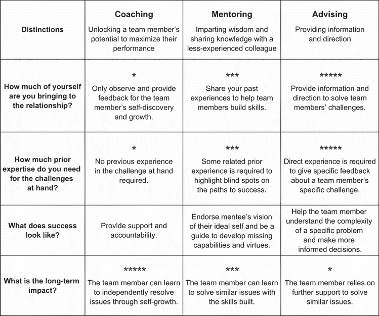
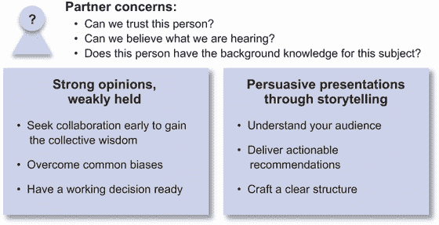
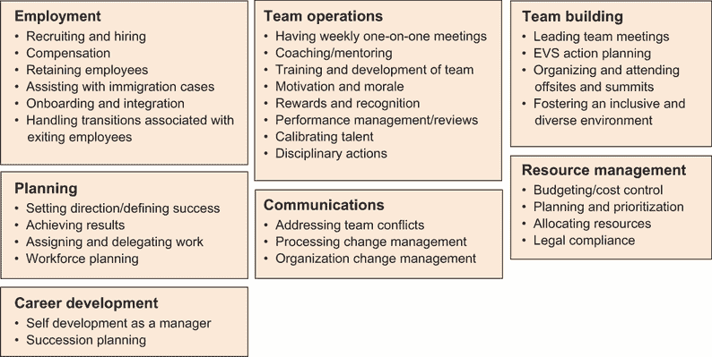
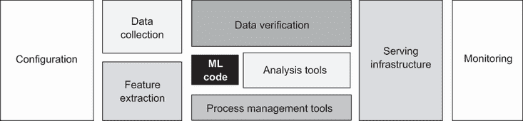
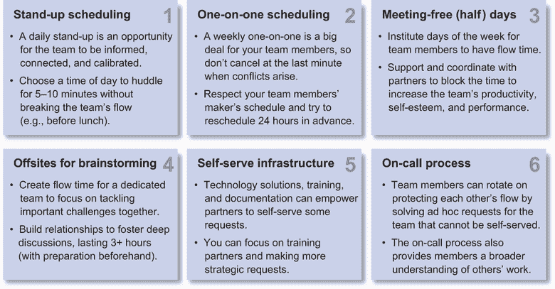
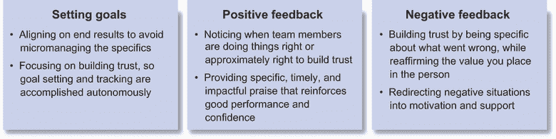
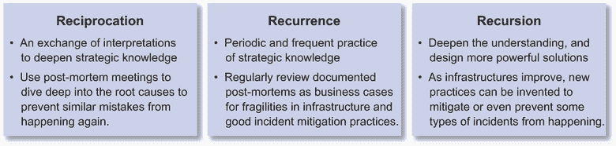

# 领导人的五项美德

本章涵盖

+   通过辅导、指导和建议来壮大团队

+   自信地代表团队并参与更广泛的管理职责

+   观察和缓解系统反模式，并从事件中学习

+   通过提炼复杂问题为简洁的叙述来推动清晰度

+   管理制作者的时间表与管理者的时间表

作为一名经理或员工数据科学家，你有责任实践有效的 DS，并使用 DS 最佳实践来培养团队成员的习惯。这些美德是刻在你作为 DS 实践者性格中的习惯性行动。

道德是工作中的行为标准，使数据科学家能够避免不必要的自我造成的崩溃。对于 DS 经理和员工数据科学家来说，这涉及到通过辅导、指导、建议来培养团队，自信地在跨职能讨论中代表 DS，并为影响 DS 的系统做出建设性的审查。

严谨是我们以工艺和勤奋的态度接近 DS。这涉及到通过带头保持可靠的结果来思考更大，通过深入思考来有效诊断，进行分级，从事件中学习，并通过将复杂问题提炼成简洁的解释来简化问题。

态度是我们以积极心态接近 DS 的情绪。保持积极态度包括从制作者的时间表到管理者的时间表进行个人心态调整，培养直接下属在执行中的信任，以及培养学习与分享的组织文化。

当你在培养你的团队时，实际上你正在确定你团队的文化。你如何选择实践强大的道德、严谨的勤奋和积极的态度决定了你团队的长期有效性。

## 5.1 行为道德标准

领导就是服务。作为一名经理或员工数据科学家，你有责任培养你的直接团队，以产出他们一生中最好的工作。同时，你也在跨职能互动中代表你的团队。作为管理团队的一部分，你还被要求为更广泛组织的重大业务决策做出贡献。

你的道德是你所参与的各种团队的行为标准。本节讨论了专业行为三个具体方面：

+   通过辅导、指导和建议来壮大团队

+   在跨职能讨论中自信地代表 DS

+   参与并相互承担更广泛的管理职责

当为团队服务时，这些区别和实践是必要的，以避免不必要的自我造成的崩溃，并开启积极、敏捷和高效的工作环境的机会。

### 5.1.1 通过辅导、指导和建议来壮大团队

培养 DS 团队不仅仅是雇佣更多的数据科学家。提高现有团队成员的容量也可以为你的组织带来更大的影响。培养当前团队成员的能力需要时间。

记得第一章案例 5 中的 Audra 吗？当她没有得到她认为非常符合条件的职位时，她感到失望和困惑。Audra 在关注自己的职业道路和发展上投入了很多，但她并没有像关注团队那样关注。

管理者的一个职责是赋予团队成员发挥职业生涯最佳水平的权力；另一个职责是在可能的情况下照顾团队和公司。本节可以提供一套工具，帮助 Audra 履行她的职责，建立互利共赢的专业网络，并建立一些终生的友谊。

| 029 | 管理者的一个职责是赋予团队成员发挥职业生涯最佳水平的权力；另一个职责是在可能的情况下照顾团队和公司。 |
| --- | --- |

作为管理者或员工数据科学家，培养团队成员以增加团队影响力的一个挑战是没有一种单一的有效方法。对于初级团队成员，更详细的培养风格可能是有用的，而同样的风格可能会让一些高级成员感到被微观管理。一些高级团队成员可能更喜欢更少干预的方法，而同样的过程可能会让一些初级成员感到被忽视。

如果每个团队成员在他们的职业生涯中都处于不同的阶段，这意味着他们各自需要不同的培养方式吗？这对即使是小团队的管理者来说也会相当令人压倒。幸运的是，随着你开始管理更多的团队成员，模式就会显现出来。

让我们区分三种对待团队成员及其职业发展关注点的培养方法：辅导、指导和咨询。这些方法在图 5.1 中得到了说明。

图 5.1 通过辅导、指导和咨询培养团队

辅导

*辅导*是释放团队成员潜力以最大化其表现的过程。它是一个在正式的一对一环境中量身定制的培养过程。教练通过关注提问的过程进行观察和提供反馈。通过这些问题，一位优秀的教练能够帮助团队成员明确目标，专注于需要完成的事情，并发现实现这些目标的最佳策略。

要进行辅导，你首先需要为团队成员创造一个安全、无评判的空间，让他们能够进行自我发现和成长的过程。你应该表现出对团队成员福祉的真诚关怀，并对他们可能对失败的恐惧保持敏感。

为了有效地进行教练，教练必须首先积极倾听团队成员所说的和没有说的话，通过语气和肢体语言区分情绪，并反映和总结任何观察结果。当有疑问时，教练可以使用开放式问题来培养对情况的更大清晰度。当你听到团队成员说，“是的！我无法说得更好了！”时，你就知道你已经成功了。

要成为一名优秀的教练，你应该深入理解情况，并指导团队成员确定 SMART 目标，这些目标具体、可衡量、可实现、相关且有时间限制，以及设计新的行动来实现预期的结果。团队成员最终对自己的行动和结果负责。你的角色是提供支持和问责。

辅导

*辅导*是将智慧与经验较少的同事分享的过程。为了有效地进行辅导，你需要从建立真诚的关系开始，并摆脱典型的管理者-员工结构，专注于团队成员的职业发展。在某种程度上，作为数据科学家，辅导可以是一种更自然的培养关系。

为了有效地进行辅导，话题应该超越目标、焦点、流程和策略的教练，包括掌握本书中描述的能力和实践美德。虽然能力辅导可以立即提高执行力，但美德辅导可以对团队成员的性格产生持久的影响。

要成为一名优秀的导师，你应该倾听团队成员对他们理想自我的愿景，并通过持续地支持他们的愿景来接受它。通常，他们的愿景超出了你团队的范围。珍视你与雄心勃勃的团队成员共度的时光，并在可能的情况下，尽你所能帮助他们参与与他们理想自我一致的项目。你很可能会赢得他们的信任和奉献，并通过你在项目中的起伏帮助他们产出最佳工作。

指导

*指导*是提供信息和方向的过程。作为一名指导者，你拥有帮助团队成员实现目标的第一手经验和深入知识。你通过提供关于具体问题的具体反馈来提供价值。

为了有效地进行指导，你必须了解团队成员的优势和劣势，并将他们安排在能够突出其优势并帮助他们克服劣势的项目中。第 4.2.1 节讨论了如 Clifton StrengthsFinder 之类的心理评估，这些评估可以量化团队成员的优势。

要有效地进行咨询，你必须首先评估自己是否具备帮助的专家知识和经验。如果你不具备，要么求助于指导，要么确定其他潜在的指导来源以推荐。如果你具备专业知识，就要练习积极倾听，并在你对问题的完整图景有了解之前不要做出判断。在理解了问题之后，你可以引导团队成员生成可行的选择。你的建议背后的理由、个人经验和原则可以使你的建议更有力，更容易记住和采纳。你指导的一部分应该确保团队成员在迅速做出解决方案之前评估选项。应该明确，决策和后果是团队成员的责任。

要成为一名优秀的导师，你始终可以致力于提供对复杂问题的更深入理解，以帮助团队成员做出更明智的决策。这些建议包括向他们介绍之前未曾考虑过的替代方案，并扩展他们的行动步骤库。除了具体的决策和行动之外，你的建议还可以减轻团队成员在面临困难或不确定情况时经常感到的焦虑和困惑，并灌输平静和自信，为更深思熟虑的计划和行动创造空间。

何时使用每种方法？

指导、辅导和咨询方法有许多相似之处。要擅长其中任何一种，你都需要与团队成员建立安全、真诚和相互尊重的关系。

指导、辅导和咨询之间有三个关键的区别：

+   *你在关系中投入了多少自己？* 指导侧重于观察并为团队成员的自我发现和成长提供反馈。辅导侧重于分享你的过去经验，以帮助团队成员建立技能。咨询侧重于你如何提供信息和方向来解决团队成员的挑战。

+   *对于手头的挑战，你需要多少先前的专业知识？* 对于指导，你不需要在手头挑战方面的先前经验。在一般过程中的经验通常足以能够提出明智的问题，以培养团队成员情况的更大清晰度。对于辅导，你需要一些相关的前期经验来突出团队成员的盲点，并帮助他们避免成功道路上的陷阱。对于咨询，你需要直接的经验来对团队成员的具体挑战提供具体的反馈。

+   *成功看起来是什么样子？* 当进行教练时，你是在提供支持和问责。当进行指导时，你是在支持团队成员对理想自我的愿景，并引导他们发展成为有效数据科学家所缺少的能力和美德。当进行咨询时，你帮助团队成员理解手头特定问题的复杂性，以便做出更明智的决策。你还旨在减少焦虑和困惑，灌输平静和自信，让你的团队成员能够采取更有效的行动。

随着我们明确这些基本差异，你就可以开始了解如何区分教练、指导和咨询的情况。

对于在具有高成功可能性的创新项目中工作的资深团队成员，教练就足以提供反馈，并通过自我发现和成长建立信心和经验。当资深团队成员承担风险增加、失败可能性增大的挑战性项目时，指导可能有所帮助。你可以利用你的经验来突出潜在的盲点和项目陷阱，并指导团队成员发展成功所需的批判性技能。当初级团队成员在特定挑战中工作，而你对这些方向和最佳实践有专业知识时，你可以提供咨询，这样他们就能更好地理解问题的复杂性并做出更明智的决策。

你可以灵活地在这三种培养模式之间切换，以培养团队成员并产生对组织更大的影响。当适当应用时，你的努力可以赋能团队成员，让他们在职业生涯中做到最好。

第一章中的 Audra 过于专注于建立自己的职业生涯，并没有展现出她在培养团队。她可以利用这里讨论的教练、指导和咨询技巧来赋能团队成员，让他们在职业生涯中做到最好。

### 5.1.2 在跨职能讨论中自信地代表团队

作为 DS 经理或员工数据科学家，业务伙伴期待你能让他们对跨职能项目中的 DS 进展充满信心。当你代表团队就 DS 观点发言时，你业务伙伴心中可能存在的疑问包括

+   我们能信任这个人吗？

+   我们能相信我们听到的话吗？

+   这个人对这个主题有背景知识吗？

你可能见过一些初级数据科学家演示文稿的草稿。为了追求严谨，他们经常用 10 分钟的实验设置和注意事项开始，然后是初步结果，最后以分析中的许多技术不确定性结束。这样的演示提出的问题多于答案，让观众比之前更加困惑，并且没有在跨职能业务伙伴中赢得太多信任。

DS 结果难以呈现，因为任何一次分析都存在许多不确定性和注意事项。然而，数据科学家的责任是回答问题，而不是造成困惑。你如何帮助弥合这一差距？

有两种从产品管理学科借用的方法可以在互补的方式中帮助。首先，你的分析可以实践“强烈的观点，弱的观点”。其次，你可以使用讲故事的方式来构建有说服力的叙述和演示。图 5.2 展示了挑战及其缓解方法。

图 5.2 代表团队面临的挑战和应对方法

强烈的观点，弱的观点

当商业伙伴寻求 DS 观点时，他们正在寻找一个基于定量分析的业务决策观点。你如何利用有限的时间和资源，将团队的精力集中在回答业务问题上？

实践“强烈的观点，弱的观点”可能有所帮助。这种实践要求你的直觉引导你得出一个快速的第一结论。尽管这个第一结论可能并不完美，但这就是强烈的观点。然后你可以寻找定量证据来证明自己错误，这就是为什么观点是弱的观点。

这种实践对那些将严谨的道德推向极端的组织有益，以至于组织变得决策瘫痪。这个概念为团队提供了一个必要的行动偏见，以继续运营，同时进一步的分析寻求提供反例。

具体来说，这个概念有三个主要好处：

+   早期寻求合作以获得集体智慧

+   克服常见偏见

+   制定有效的决策

早期寻求合作以获得集体智慧

虽然许多 DS 项目在最后都有审查，但通常没有足够的时间在不影响进度的情况下做出重大改变。在项目开始时就有强烈观点的推动迫使你有一个明确的假设来指导向更详细的迭代进展。在产品方面，这可以是一种推动关键成功指标的方式。在 DS 项目中，这可能是导致流失和改善留存率的原因。然后团队有更多机会提出反证，并引入额外的想法、直觉和观点，以迭代地加强弱的观点。

克服常见偏见

第 3.2.1 节讨论了三种常见的认知偏差，包括确认偏差、否定前件和基础率谬误，这些偏差是 Buster Benson [2] 列出的 175 个偏差类别中的一部分。通过寻求反证证据，你可以对抗确认偏差。相反，人们倾向于只寻找证实他们观点的证据，导致确认偏差。在你发现不同观点的过程中，你可以通过选择具有统计意义的成果来克服选择偏差，而不是只选择积极的轶事例子。你还可以通过规划可能的情况，而不是不切实际的乐观最佳情况，来对抗乐观偏差。

有一个工作决策

当形成强烈的观点时，你可以基于最佳可用数据保持一个操作性的决策。这个工作决策是在优先级改变或需要比预期更早做出决策时可以依赖的。

强烈的观点，弱持的态度是基本的，可以迅速将清晰度引导到业务决策上。有效地传达你的建议是成功在跨职能讨论中代表数据科学时建立信心下一步。

通过讲故事进行有说服力的叙述和演示

为了在展示数据科学（DS）结果时成功传达见解并建立信任，你必须首先了解你的受众，提出具体的建议，并产生易于遵循结构的叙述。

理解你的受众

不同的受众群体拥有不同的先验经验。为工程合作伙伴做的演示需要解决与为产品或销售组织做的演示不同的关注点。工程合作伙伴可能关心你的组件的可靠性、对现有用户体验服务级别协议（SLAs）的性能影响、维护的简便性和测试的简便性。产品组织可能更关心 A/B 测试、发布流程以及新功能如何影响产品转化率和客户流失率。销售组织可能更关心新产品功能可能如何影响赢得机会的比例、销售周期和销售团队的薪酬。

考虑到目标受众的不同，你可以在展示结果之前指导你的团队成员提出以下问题：

+   我的受众是谁？

+   他们基本关心的是什么？项目的背景是什么？

+   他们需要什么证据来相信这些结果？

提供可执行的推荐

业务合作伙伴的注意力有限。用你的建议开始，用清晰、数据驱动的证据来支持它。你还可以展示在“强烈观点，弱持态度”的探索过程中考虑的多个选项，并突出不同选项之间的权衡。

| 030 | 在提出可操作的建议时，首先提出你的建议如何进行，并使用清晰、数据驱动的证据来支持它。 |
| --- | --- |

指导团队成员的问题包括

+   你试图传达的主要信息或建议是什么？

+   为什么这是对整个组织来说最好的选择？

+   有哪些不同的选项，为什么这个建议是首选选项？

构建清晰的结构

在确定了主要建议后，你的分析应该已经检查了可能反驳的证据，并产生了足够的信心来支持该建议。剩下的工作是以引人入胜的方式讲述这个故事。

在讲述故事时，往往“少即是多”。为了突出关键建议，仅包括支持该建议的主要观点，并将与故事直接无关的信息保留在附录中。这与确认偏差和提供经过挑选的结果不同，其中相互矛盾的证据被移除。如果有矛盾的证据，我们应该停止制作演示文稿，并回头形成一个与现有证据一致的不同的假设。

以下是一些指导团队成员制作清晰演示文稿的问题

+   这个建议的影响是什么？

+   主要建议是什么？

+   支持该建议的证据集是什么？

你可以在第 5.2.3 节中找到更多关于演示格式严谨性的讨论。

总结来说，强烈的观点、弱化的持有方法可以通过收集反驳证据来集中团队的努力，以增强对最佳当前假设的信心，从而对抗确认偏差。一旦你对结果有足够的信心，你就可以利用讲故事技巧，通过深入了解受众、可操作的建议和精心制作的说服性叙述来与客户沟通，引导并建立跨职能业务伙伴的信任。

### 5.1.3 贡献和回报更广泛的管理职责

作为组织管理团队的一员，你可能被要求为更广泛的组织职责做出贡献。这可能包括与人员相关的问题以及与技术相关的问题。当你有承担更大责任和产生更大影响的抱负时，这些职责将阐明组织各个部分的广泛问题，并提供一个肥沃的培训场地来练习领导力。

| 031 | 当你有承担更大责任和产生更大影响的抱负时，贡献和回报更广泛的管理职责将阐明组织各个部分的广泛问题，并提供一个肥沃的培训场地来练习领导力。 |
| --- | --- |

图 5.3 展示了经理应承担的职责列表。这可能看起来令人难以承受，尤其是如果你最近晋升到团队领导角色，并且没有接受过正式的管理培训。虽然这本书可以指导你在数据科学管理方面，但你的特定组织内部可能存在需要特定方法来处理管理职责的文化细微差别。

图 5.3 作为数据科学经理应承担的更广泛职责

正如你可以为团队成员提供指导、辅导和咨询一样，你还可以寻找教练、导师和顾问来帮助你更深入地理解领导职责，这样你就可以在需要时练习这些职责。

虽然你可以从你的经理那里寻求指导，但他们不必是你的唯一导师。许多管理挑战在技术团队中是普遍存在的。你可以在公司或行业内寻找其他管理良好的团队，并从他们的经理那里寻求指导或建议。

在履行许多管理职责，例如招聘、晋升和项目评审时，虽然需要来自合作伙伴组织的支持，但你也被期望通过支持你的同行组织来相互回报。以下是一些互惠互利的机会，让你能够提供帮助并加强与合作伙伴团队的关系：

+   面试合作伙伴团队的候选人

+   为合作伙伴团队成员提供晋升推荐

+   审查产品路线图

+   审查基础设施路线图

+   审查业务运营

面试候选人

不时地，业务合作伙伴会寻求你的帮助来评估候选人是否能够在你的团队之间作为合作者取得成功。这是你早期结识潜在同事并提供反馈给业务合作伙伴的机会。

在这种情况下，在面试之前核实你的业务合作伙伴对反馈的期望，并了解你应该探索哪些领域。这些面试也是候选人结识他们未来跨职能合作伙伴的机会。像对待业务合作伙伴一样，保持礼貌和尊重，同时探究候选人在与数据科学合作方面的知识和经验边界。

有时，你可能会被要求对你的业务合作伙伴的招聘决策提供坦率的反馈。在其他时候，你可能会被敦促提出一些简单的问题，并专注于说服候选人加入公司。记住，你是在为你的合作伙伴进行这些面试，首先应该尊重他们的偏好。

晋升推荐

就像你投入努力来增长团队成员的能力和美德一样，你的合作伙伴团队也在寻求发展他们的团队成员。当你与合作伙伴团队一起工作时，观察合作中做得好的领域和有改进空间的领域。当业务伙伴希望提升你合作过的合作伙伴团队成员时，你应该有积极经验和改进领域的证据随时可用。

如果你观察到合作伙伴团队成员在你的合作中表现卓越，不要等到晋升季节。确保及时指出并感谢他们，同时也要让他们的经理知道。这是建立关系最强大的方式之一，当工作繁忙时，这往往被忽视或推迟。

产品路线图审查

收集培训数据、准备数据管道、构建模型和测试许多 DS 能力的影响可能需要数月或数个季度。了解产品路线图上产品和特性的里程碑可以帮助你预测产品的未来需求。审查过程使你能够提供反馈，了解产品时间表是否可行以及算法初始版本期望是否现实。

在产品路线图审查中，你还可以帮助产品业务伙伴明确成功的核心指标，了解测量中的潜在挑战，准备支持性诊断指标，并制定工程规范以确保可靠地捕捉指标。

基础设施路线图审查

基础设施路线图审查是了解和预测即将到来的基础设施更新的关键机会。DS 经常被要求为基础设施决策提供观点和反馈。

在许多 DS 组织中，预测模型是通过数据管道处理的功能创建的，这些数据管道依赖于特定的数据源。任何对底层基础设施路线图的更新都可能造成破坏，并花费宝贵的时间周期来迁移数据管道和重新校准/重新训练模型。同时，基础设施必须随着时间的推移进行更新，以满足更新、更响应式的产品功能的需求。

你可以提供关于基础设施更新对 DS 流程和服务影响的反馈。还有机会帮助基础设施合作伙伴团队了解当前的瓶颈并开发额外的功能，以增强你的工作对组织产生更大的影响。

业务运营审查

在以数据驱动的运营方法中，DS 经理人通常会被邀请参加每周或两周一次的业务运营审查。这些是你保持对希望产生影响业务领域脉搏的绝佳机会。如果任何业务更新影响了你团队的工作，你可以通知团队成员并将问题升级给你的经理。

这些审查还允许你发现 DS 可能有所帮助的额外机会。你可以调整 DS 优先级，将影响驱动到业务所需的地方。根据你对产品路线图和基础设施路线图的了解，你还可以揭示任何即将到来的资源冲突，这样当项目需要更多时间完成时，商业伙伴就不会感到惊讶。

DS 是一项团队运动。管理层层面的团队合作比技术项目合作更为广泛；它还扩展到跨团队的管理责任协作和互惠。这些机会包括在面试候选人时的协作和互惠；推荐团队成员晋升；以及审查产品路线图、基础设施路线图和业务运营。这些都是与商业伙伴建立信任的几个例子——这是有效 DS 经理的行为准则。

对于第一章中的 Audra，她过于专注于建立自己的职业生涯，承担更广泛的管理职责可以帮助她在工作中建立一个跨职能支持系统，并帮助她减少自我中心，更多地关注团队的整体成功。

那是一段关于行为准则的严肃谈话。现在可能是反思如何与 DS 技术领导者的行为准则不同或相似的好时机……或者休息一下。

## 5.2 培养严谨性，提高标准

严谨性是持续追求更高标准。第 3.2 节广泛讨论了数据科学家科学严谨性的标准、监控异常的勤奋以及创造企业价值的责任。虽然这些领域继续是至关重要的，但 DS 经理和员工数据科学家必须努力超越这些标准，寻求更广泛和更深入的严谨性水平。

本节讨论了指导 DS 团队实践中的三个方面：

+   以保持可信赖的结果为目标进行领导

+   从事件中有效地学习

+   通过提炼复杂问题为简洁的叙述来提高清晰度

我们致力于建立更广阔的视角，以预测 DS 解决方案中维持可信赖结果可能遇到的挑战，深入事件中学习失败，并通过简化 DS 中许多固有的复杂性为合作伙伴提供清晰度。

### 5.2.1 观察和缓解 ML 和 DS 系统中的反模式

为了持续产生影响力，DS 团队必须创造创新解决方案，以捕捉可用或可能可用数据资源中的商业潜力。该团队还需要维护现有解决方案，以确保过去在 DS 中的投资随着时间的推移继续产生回报。

虽然你可以依赖你的技术领导者在执行具体项目时阐述技术权衡，但你负责观察和检测在项目中出现的任何 DS 反模式，并在它们造成项目广泛中断之前缓解它们。

| 032 | 团队经理和员工数据科学家负责观察和检测在项目间出现的任何数据科学反模式，并在它们造成项目广泛中断之前减轻这些反模式。 |
| --- | --- |

*反模式*是不良的数据科学实践，会增加失败的风险。就像棋手可以观察棋盘并阐述哪一方可能获胜一样，数据科学经理或数据科学家应该能够在项目开始失败之前观察和检测到项目中的反模式。

数据科学和机器学习系统中存在许多常见的反模式。我们在 2015 年 NIPS 论文“Machine Learning Systems 中的隐藏技术债务” [3] 中讨论了六个：

+   粘合代码

+   管道丛林

+   死实验代码路径

+   缺乏文档的数据字段

+   过度使用多种语言

+   依赖原型环境

粘合代码

机器学习算法可能计算密集且难以调整。幸运的是，我们有现成的预优化机器学习库组件可以使用。其中许多甚至可以作为可下载的开源组件获得。

然而，每个组件都是为了特定的使用场景而设计的，这些场景要求输入和输出具有特定的格式，可以通过特定的语言和批处理或流式连接器访问。为了利用这些库组件，通常需要实现大量的粘合代码来连接您的特定用例和现有的库组件。

如图 5.4 所示，许多部署到生产中的现实世界系统由大量用于数据收集、数据验证、特征提取、机器资源管理、分析工具、流程管理工具、配置和监控的代码组成。相比之下，机器学习（ML）系统只占代码库的一小部分。

图 5.4 只有少数 ML 系统由 ML 代码组成 [3]

当使用场景被过度拟合到特定算法实现的具体细节时，维护大量粘合代码在整个系统生命周期中可能会变得成本高昂。当调整特定领域的属性以匹配算法的实现要求时，预测性能可能会下降。例如，当连续的目标变量必须离散化以使用基于分类的机器学习基础设施时。使用具有不同输入和输出格式的替代算法实现所带来的改进变得困难。挑战可能来自重新布线的粘合逻辑中的测试和部署基础设施。

减少粘合代码反模式的一种策略是将特定的算法实现用 API 包装，该 API 可以与多个替代算法实现一起工作。在 Python 机器学习生态系统中，ScikitLearn [4] 做得很好，允许数百个算法实现共享一小部分输入和输出连接器。如果你打算使用内部实现并希望将来迁移到外部实现，或者反之亦然，这种抽象级别尤为重要。

管道丛林

为了使数据访问民主化，集中式数据仓库通常与各个团队共享。共享的仓库可以包括用于业务报告和模型构建的原始数据和准备好的总结数据。

初始时，这可以在资源始终受限的环境中最大化协作和重用。随着贡献者数量的增加，生产者-消费者关系的谱系可能会迅速变得复杂。拥有四到五层深的数据准备管道并不罕见，最终的联合表可能从数百个原始数据源和数十个数据准备步骤中汇总信息。

当特定的总结数据集被选为面向执行层的操作指标，或者当它被选为输入特征，用于部署到生产环境的机器学习模型时，总结数据的可靠性变得至关重要。不幸的是，当数百个原始数据源中的任何一个或四到五层管道中的数十个数据准备步骤中的任何一个出现问题时，最终输出都无法生成。

逻辑依赖性因不同处理步骤的调度而进一步复杂化，例如，当调整上游步骤的计算资源时，下游步骤可能会错过服务等级协议（SLA）或使用过时的数据来进行计算。现在部署新的管道需要昂贵的端到端集成测试。检测和从故障中恢复变得困难和昂贵。虽然实际上不可能废弃现有的管道丛林并从头开始重建数据准备管道，但你可以通过引入人员、平台和实践来减轻这一挑战。

对于人员组件，数据科学家和模型部署工程师之间的协作至关重要。当数据科学家原型化模型时，不考虑数据谱系和处理的可靠性，并向模型部署工程师交付黑盒模型，就没有机会考虑可靠性和模型性能之间的权衡。当数据科学家和模型部署工程师共同工作时，你可以做出许多权衡。例如，你可以选择是否使用下游数据字段以更好地重用努力，或者使用上游数据源以减少对其他数据处理步骤的依赖。

对于平台组件，有众多工具，如 Colibra Lineage [5]，可用于通过生成中间结果的脚本和查询映射数据血缘。工作流管理工具，如 Apache Airflow [6]，也可以跟踪现有数据管道的调度、完成时间和完成率。这些数据可用于调整调度并最大化现有管道的完成率。

在构建模型或进行分析时，需要有一个过程来从数据处理管道的最早点查找所需数据。这是为了防止管道丛林随着时间的推移变得更加深不可测和难以管理。此外，数据处理管道早期层的可靠性需要尽可能稳健，因为早期层的故障可能会对下游处理步骤产生更广泛的负面影响。应分配时间对数据处理步骤进行重构，以尽可能压缩处理层。

死实验代码路径

控制实验方法使用生产代码中的条件分支将有限部分用户或执行发送到替代代码路径，以降低风险测试新功能。虽然其中一些实验导致积极的结果并成为主生产代码路径的一部分，但许多实验结果为负面或无意义，仅测试一次后就被废弃。

虽然每次个别更改的成本可能很低，但当一个组织每年进行数百到数千次实验时，累积的废弃代码路径可能会变得难以承受。特别是在工程团队有变动时，众多用于替代代码路径的条件分支可能难以理解、维护，并可能成为重大负债。

2012 年，Knight Capital 的交易系统在 30 分钟内损失了 4.4 亿美元 [7]，[8]。根本原因被诊断为由代码库中保留了近 10 年的过时实验代码路径的意外行为，该路径被重用标志重新激活。为了减轻此类问题，您可以定期宣布实验已过时，并与工程团队合作移除和清理死代码分支。

缺乏文档的数据字段

表格中的数据字段类型有限，例如整数、浮点实数或文本。为了使集中式数据存储库有效运行，每个字段都必须仔细记录，以提供重用的信心。

良好的文档应包括诸如整数字段是否编码计数、唯一标识符或分类数据等详细信息。浮点实数字段应指定它是否代表金额、比率、乘数、决策阈值或其他值。文本字段应指定它是否是唯一标识符、分类字段、自由形式描述或具有其他不同含义。

一个优秀的描述还应包括任何字段的不变性，包括对缺失值的期望（空值与空值）、期望范围、期望值和期望格式。例如，字段是否是交叉引用键，因此不应有空或空值？如果一个浮点值是百分比，它是否始终在零和一之间？对于一个分类字段，它可能接受的合法值是什么？对于一个表示序列号或分类代码的文本字段，字段是否应该满足特定的格式，例如序列中的数字或字符数？

优秀的文档可以通过不变性检查自动检测数据管道中的错误。这对于捕捉意外副作用中的错误非常有价值。

过度使用多种语言

在数据科学领域，有众多编程和数据查询语言，这些语言都配备了出色的现成包，用于统计分析、自然语言处理（NLP）和图处理。每种语言通常适用于某些目的，但不适用于其他目的。

例如，R 语言拥有强大的统计分析包，但在自然语言处理（NLP）或大规模并行处理（MPP）方面并不高效。Python 语言非常适合机器学习和 NLP，但在并行处理或图处理方面并不出色。Spark 在 MPP 和机器学习方面表现优秀，但统计分析包的数量不如 R 语言多。Cypher 和 APOC 在图查询和图算法方面表现优异，但不适合详细的 NLP 或统计分析。

许多数据科学（DS）项目和系统最终会使用多种语言的组合。基于网络的笔记本系统，如 Jupyter 笔记本或 Databricks 笔记本，使数据科学家能够在同一笔记本中使用多种语言。虽然你可以利用最合适的分析和机器学习工具，但维护通常成为一个挑战。任何后续的这些部署项目和系统的所有者都必须熟悉所有这些语言，以便进行迭代改进，这可能会显著增加所有权转移的成本和难度。作为数据科学经理或员工数据科学家，你有责任在限制语言使用或组织培训之间做出权衡，以确保在团队成员过渡发生时，关键项目没有单一故障点。

依赖于原型环境

第 3.2.3 节讨论了原型设计的益处，可以探索项目中最容易失败的部分的可行性，因此如果项目按原设计将失败，你可以尽早发现并调整方向。你用于原型设计新产品或功能的环境可能使用真实的生产数据，通过捷径或手动步骤模拟最终自动化系统将呈现的样子。

然而，如果基于原型环境中的模型将功能推向生产，这是积累技术债务的症状，是一个需要关注的反模式。依赖于原型环境可能表明生产环境过于复杂，难以部署。原型环境通常不太稳健，在其中维护原型会迅速消耗你宝贵的资源，并限制团队对组织的影响。

常见的解决方案包括明确跟踪功能的状况，并敏锐地意识到在原型环境中运行的功能数量。指定应部署到生产环境中的功能项目，并明确指出不这样做所带来的负面后果，然后与高管合作，优先处理这些项目。

总结来说，我们讨论了六个 DS 反模式，供你在关注团队长期生产力的同时留意，包括胶水代码、管道丛林、废弃的实验代码路径、文档不足的数据字段、过度使用多种语言，以及对原型环境的依赖。尽管我们尽了最大努力，这些反模式往往会在 DS 团队成熟轨迹的各个阶段自然出现。团队依赖你，即团队经理或员工数据科学家，站出来，在日常项目决策中设定期望，以平衡短期效率和长期团队生产力。

### 5.2.2 从事件中有效学习

作为 DS 经理或员工数据科学家，你的责任是确保团队严格从过去的事件中学习。如果同一根本原因在一段时间内触发多次故障，而没有采取任何措施来改善情况，那么这将是一种管理上的失败。指导团队深入分析事后过程是你可以展示领导力的一处地方。

从事件中学习无效会影响团队士气。正如我们从斯蒂芬的案例（第一章，案例 6）中看到的那样，未能制定路线图以防止更多与技术债务相关的问题，可能导致你最佳团队成员的遗憾流失。

| 033 | 从事件中学习无效会影响团队士气，而未能制定路线图以防止更多与技术债务相关的问题，可能导致你最佳团队成员的遗憾流失。 |
| --- | --- |

在 2.2.3 节中，我们介绍了处理事件时的技术负责人执行挑战，其中必须平衡团队成员的安全感和责任感。我们得出结论，可以使用五步结构来总结团队当前和未来成员的学习成果。我们可以在第 3 步中使用五问法[9]来识别根本原因：

1.  简要总结

1.  详细时间表

1.  根本原因——使用五问法

    +   汇集团队并制定问题陈述

    +   向团队询问第一个“为什么”：为什么会出现这个问题或那个问题？

    +   提出四个更多连续的“为什么”，并跟进所有可能的答案

    +   在所有可能的答案中，寻找问题的系统性原因

    +   制定纠正措施，从系统中消除根本原因

1.  解决和恢复

1.  减少未来风险的措施

事后分析过程的目的是从过去的错误中学习，并防止具有相同根本原因的一类未来故障再次发生。五问技术最初由丰田的丰田佐吉开发，并在丰田用于改进制造过程。它已在多个行业的运营中得到应用，包括改善过程、精益制造和六西格玛过程。

虽然具体的事后分析过程应委托给您的技术负责人，但您在根本原因分析（第 3 步）中的支持对于制度化学习至关重要。以下类型的具体支持对于根本原因分析最为重要：

+   *参与*——确保所有参与事件的 DS 和合作伙伴团队成员都到场。我们需要来自那些经历过事件并了解问题的明显和不易察觉部分的人的第一手信息。

+   *安排*——明确的日程安排，以便在事件发生后两天到三天内完成事后分析。在记忆仍然清晰且人们尚未将心态切换到其他项目时记录学习经验很重要。

+   *指导*——指导技术负责人避免在五问过程中的常见陷阱，并确保充分理解问题的深度。

让我们通过一个例子深入调查一次数据管道故障的根本原因。在这个例子中，一些日志失败了，一周内没有为部分用户生成一个重要的公司级指标：

+   *为什么* 数据管道出现了故障？

    *原因*——新特性发布导致了重大的跟踪中断。

+   *为什么* 新特性发布导致了重大的跟踪中断？

    *原因*——特性发布没有经过逐步推出过程，即逐步将功能推出给 1%，10%，50%，然后是 100%的用户，以降低功能风险。相反，功能直接推出给了 100%的用户。

+   *为什么* 特性发布跳过了逐步推出过程？

    *原因*——紧张的发布计划没有为功能逐步推出留出时间。

+   *为什么* 发布计划没有为功能逐步推出留出时间？

    *原因*——新产品经理没有在公司接受过为发布最佳实践分配时间的培训。

+   *为什么* 新产品经理没有接受过最佳实践发布培训？

    *原因*——公司正在快速发展，我们还没有为新产品经理的数据驱动发布制定严格的入职培训。

在这个例子中，根本原因回到了我们可以作为数据科学家采取行动以防止一类问题再次发生的事情。这是我们之前可能没有意识到的差距。DS 团队可以在合作伙伴团队入职过程中带头向新产品经理解释数据驱动的产品发布流程。

并非所有的根本原因分析都需要五层为什么，有些可能需要更多层次才能找到根本原因。五层为什么的过程指的是一种比喻性的深度，比一或两层更深。

在五层为什么的过程中，你遇到的一些常见陷阱是什么？让我们详细看看三个：

+   在症状上停止调查——而不是根本原因

+   诊断出的原因并非必要或足以导致故障

+   评估的原因不是流程而是人

在症状上停止调查——而不是根本原因

在上述例子中，如果我们停止在第二个为什么的调查，不遵循坡道流程可能是由于紧张发布日程导致团队无法遵循发布最佳实践的症状。其他人介入并询问是否遵守发布最佳实践是合理的。然而，发布是由发布日程指导的，对于极端紧急且高度自信的热修复，跳过坡道流程可能有合理的理由。我们必须诊断以确定在此事件中并非如此。

根本原因通常是一个破损的流程、一个可改变的行为，或者一个尚未存在的流程。不要在症状上停止调查，例如时间或投资不足，这些问题通常超出了你直接控制范围。如果我们继续追问为什么，我们可以找到一些真正在你控制范围内、对所有相关方都有益的过程改进。

诊断出的原因并非必要或足以导致故障

在分析事件原因时，有些原因是必要的但并不充分，而有些原因是充分的但并非必要。在先前的例子中，第三层原因——“为什么功能发布跳过了坡道流程？”——可能是因为平台在设置坡道流程时缺乏便捷的用户界面。这将是必要但不充分的因素，因为良好的用户界面是必要的，但产品经理仍然需要知道如何使用平台以避免此类事件。

另一个原因是发布平台不强制所有功能发布都通过发布坡道流程。这将是充分但不必要的因素，因为我们可能希望在明确界定紧急情况时发布热修复，而不必经过坡道流程。只要产品经理知道何时使用发布坡道流程，并且有可用的工具和培训，就应有必要和充分的条件来避免未来发生此类事件。

评估的原因不是流程而是人

五问法过程应该促进团队中的信任和真诚氛围。我们应该给予团队成员的善意，并在过程中假设他们有最好的意图，并开发出可以帮助团队成员在我们共同工作下做到最好工作的流程。

在这个精神下，我们不应使用模糊的原因，如人为错误或工人的疏忽，或者更糟糕的是，将所有责任归咎于团队成员。尽量使答案更精确。例如，像“计划没有为爬坡过程留出时间”或“某人对现有流程没有接受过培训”这样的答案指向具体问题。这些更精确的答案可以修改和改进，以便可以采取具体步骤，防止类似事件再次发生。

总结来说，从过去事件中进行严谨的学习需要及时进行深入的根本原因分析。作为一名数据科学经理或数据科学家，你负责参与事后分析，优先安排其日程，并通过共同陷阱指导你的团队和合作伙伴团队。这些共同陷阱包括在症状而非根本原因处过早停止调查，诊断出不必要的或不充分的故障原因，以及评估原因是否与过程无关，而是关于人。

你的严谨努力将以越来越稳健和以数据为驱动的执行环境的形式得到回报，这样你的团队和合作伙伴团队将会有更少的故障，并有更多时间解决产生更大商业影响的战略努力。有效地从事件中学习是斯蒂芬（第一章，案例 6）可以采用的一种实践，以解决他的团队士气并建立自己的领导身份。

### 5.2.3 通过提炼复杂问题为简洁叙述来驱动清晰度

在你的工作中，你可能会面临许多技术和业务情况中的复杂性。你之所以被赋予管理团队的责任，是因为你能够理解重大的复杂性。但其他人可能不擅长处理复杂性。现在是时候磨练你在工作中遇到的复杂性的简化技巧了。

严谨性常常被误解为提供细节。有句老话，“我问他时间是什么，他却教我如何制作手表。”当我们对工作充满热情时，我们经常陷入这个陷阱。长篇大论可能会让你看起来很聪明，但可能不会帮助你产生更大的影响。

如 LinkedIn 的高级数据科学家哈里·沙赫所描述：“你对组织的影响不在于你创造了多少复杂性，而在于你能在已经复杂的环境中简化多少复杂性。随着你在职业生涯中的成长[作为个人贡献者或团队领导者]，问题的复杂性会升级，但你的解决方案不应如此。优雅且简单的解决方案始终是最好的。”

| 034 | “你对组织的影响不在于你创造了多少复杂性，而在于你能在已经复杂的环境中简化多少复杂性。随着你在职业生涯中（作为一个个人贡献者或团队领导者）的成长，问题的复杂性会升级，但你的解决方案不应该。优雅且简单的解决方案总是最好的。”——哈里·沙赫 |
| --- | --- |

至少有三个领域你可以努力追求简洁：定义、算法和演示。它们在图 5.5 中得到了展示。

![CH05_F05_Chong.png]

图 5.5 将复杂问题提炼成简洁叙述的三个区域

定义中的简洁性

通过简洁性展示严谨性的一个方法是为对你在领域背景知识有限的人编写关于复杂概念的 15 秒描述。目的是提供共同的理解，并与你的业务伙伴建立信任，这样你就可以为下一步建立一致性。

例如，解释曲线下面积（AUC）可以简单地说，“一个向业务伙伴展示预测模型有多好的指标。”在社交网络中的成功指标，如显式用户关系，可以解释为，“如果用户 A 添加了用户 B，而用户 B 确认了，我们称之为显式用户关系。”如果你不能在 15 秒或更短的时间内解释一个概念，那么很可能你对该概念了解不够深入，或者你解释得不够好。

在指导团队方面，一个需要避免的领域是不要被认为对那些不了解数据科学项目某些复杂性的同事有优越感。你可能听过一些数据科学家在回应业务伙伴的询问时说，“相当复杂。不用担心你不懂的部分——我来处理。”他们也可能对数据科学同行说，“只读代码！”或者“所有内容都记录在我的 Jira 工作项注释中。”

这样的评论可能会让同行和业务伙伴对系统中他们不理解的部分感到困惑。这种感觉可能会转化为对公司在重要客户体验上依赖的关键系统的恐惧和怀疑。

或者，当定义变得清晰和简化，并能捕捉到数据科学中复杂概念的意图和目的时，同行、合作伙伴和其他管理者将会感到感激。这些简化定义的努力在建立组织间的信任方面起到了重要作用。

算法中的简洁性

在管理 DS 项目中的严谨性意味着引导团队朝着理解数据历史模式的最简单算法和方法前进，并预测未来的趋势。当在两个系统实现之间做出选择时，这两个实现具有数量级上的复杂度差异，但结果相似，理性的选择是选择更简单的算法。例如，在简单线性模型和具有许多子模型且都达到相似模型结果的集成模型之间进行选择时，更简单的线性模型应该是一个更好的选择。

一个更简单的模型是对历史模式更简洁的定量叙述，更容易解释和理解。它还需要更少的数据样本进行训练。如第 3.2.2 节所述，在更简单的模型中，数据漂移也更容易检测，因为需要跟踪的输入参数更少。从总拥有成本的角度来看，一个更简单的模型部署和维护成本更低。当团队成员从一个项目转移到下一个项目时，交接的负担也更小。

考虑到这些因素，看到著名的百万美元 Netflix Prize 挑战的冠军解决方案从未被部署并不令人惊讶。获胜的解决方案是一个过于复杂的集成模型。根据 Netflix 自己的技术博客[10]，“我们测量的额外准确度提升似乎无法证明将它们带入生产环境所需的工程努力。”

演示中的简洁性

演示中的严谨性意味着花时间结晶一个故事线，带领观众一起旅行。这不仅仅是将所有信息放入幻灯片，而是完成你设定的演示目标。

演示的目标可以是传达一个过程、对前进的道路达成一致，或者回顾新的见解和发现。你可以在标题幻灯片上声明这个目标，为演示设定一个共同的目的。这样，演示就变成了一段旅程，你将你的观众带到一起，实现共同的目标。这种方式，你与观众的关系从演讲者和听众转变为共同创作者，以实现共同的目标。

对于演示的内容，我们在第 5.1.2 节中讨论了理解观众、提供可操作的推荐和构建清晰的结构，其中我们详细阐述了讲故事的过程。本节重点在于格式的清晰度。

为了使演示令人难忘，你应该简化内容，确保不超过三个关键想法，你希望观众带走。可以融入更多想法，但只能作为支持一个关键想法的证据。每个关键想法都可以通过不解决时的负面后果来展示，以强调与观众一起花时间解决该问题的必要性。你可以在[IdRatherBeWriting.com](https://idratherbewriting.com/)找到更多关于展示关键想法的技巧和示例 [11]。

进入演示细节的严谨性，每张幻灯片的标题应总结幻灯片的主要内容。幻灯片标题的顺序应概述你的故事从开始到结束。表 5.1 展示了为在用户转化倾向得分上达成一致而进行的演示示例。

表 5.1 典型演示目标和大纲与结晶化目标和大纲的并列比较

| 典型大纲 | 结晶化大纲 |
| --- | --- |

| **标题:** 倾向得分 2.0**目标:** 展示最新的见解并就下一步行动达成一致**幻灯片标题:**

+   倾向得分影响

+   倾向得分版本 1.0

+   版本 2.0 差异

+   版本 2.0 优势

+   版本 2.0 性能

+   模型架构细节

+   模型性能细节

+   模型性能稳定性

+   应用#1

+   应用#2

+   下一步

| **标题:** 倾向得分 2.0**目标:** 如果我们能在新的指标可用框架和时间表上达成一致，这次会议就会成功。**幻灯片标题:**

+   倾向得分—对转化意图的评估。准确的评估是我们成功的基础，具有广泛的影响。

    +   版本 1.0 基于过去的活动，使用轻量级的意图信号。

    +   版本 2.0 结合了明确的意图和更广泛的信号来预测未来的意图。

    +   版本 2.0 也更好地区分了用例。

    +   版本 2.0 的细分预测意图准确。未来一周的参与度与细分相关性良好。

+   识别相似度—构建了一个模型来捕捉模式，以预测未来一周的参与度。

    +   相似度模型成功预测未来参与度，平均误差率为 2%。

    +   相似度细分每周都是稳定的，80%的相似度细分在四周后仍然处于同一细分。

+   应用#1—通过更好的定位和效率提高 5%的转化率。

+   应用#2—预测的高倾向用户中有 80%在未来一周是活跃用户（WAU）。

+   下一步—在生产环境中部署版本 2.0 并在应用#1 的用户定位用例上进行测试。

|

如表 5.1 所示，一个明确的目标和提纲可以集中展示，并一眼看出合作伙伴的关键叙事。在标题幻灯片上呈现一个清晰的目标，以引导观众了解演示的目的。样本演示的三个主要主题是：新评分的优势、底层算法能力以及模拟对应用的影响。演示以对下一步行动的讨论结束。当这些技术被持续使用时，你的团队能够有效地动员业务伙伴和高层管理人员，走上产生影响的有效路径。

如前所述，你对组织的影响不在于你创造了多少复杂性，而在于你在一个已经复杂的环境中简化了多少复杂性。在简化定义、算法和演示中可以找到严谨性，并将复杂问题提炼成简洁的叙事，供同行、商业伙伴和高层管理人员参考。

## 5.3 积极的态度

承担人员管理角色对于任何数据科学家来说可能是一个巨大的转变。作为一名数据科学家，你已经培养出了在失败中坚持不懈的能力，在应对事件时保持好奇和协作，并与商业伙伴建立了相互尊重。对于熟悉个人贡献者类型工作日程的人来说，增加管理责任可能会感到颠覆。此外，你不仅要对自己的工作态度负责，还要对团队以及危机时期组织的积极态度负责。

本节讨论了数据科学管理者应管理的三个具体态度方面：

+   管理制作者的时间表与管理者的时间表

+   信任团队成员去执行

+   培养制度化学习的文化

保持积极的态度对于建立一个高效的工作环境至关重要，在这样的环境中，你的数据科学团队可以为组织带来最大的影响。

### 5.3.1 管理制作者的时间表与管理者的时间表

作为一名管理者，你的团队成员、你的商业伙伴、你的上司以及其他高层管理人员都要求你投入时间和注意力。你的日子通常被分成 30 分钟的时段，你整天都在从会议赶到会议。在许多周结束时，你可能会感到筋疲力尽，几乎没有时间反思和专注于你的项目，以产生你希望称之为自己的成就。

如果你这样感觉，你并不孤单。在数据科学领域，从个人贡献者角色过渡到管理可能很困难且令人不知所措。了解制作者的时间表与管理者的时间表之间的区别可能有助于你适应新的情况。制作者的时间表与管理者的时间表的概念[12]最初是由传奇的 Y Combinator 创业加速器的联合创始人保罗·格雷厄姆在 2009 年普及的。

保罗写道：“大多数有影响力的人都在经理的日程安排上。这是命令的日程。但还有另一种使用时间的方式，这在创造事物的人中很常见，比如程序员和作家。他们通常更喜欢至少以半天为单位使用时间。你不能在一个小时内很好地写作或编程。那几乎连开始都不够时间。”

| 035 | “大多数有影响力的人都在经理的日程安排上。这是命令的日程。但还有另一种使用时间的方式，这在创造事物的人中很常见，比如程序员和作家。他们通常更喜欢至少以半天为单位使用时间。你不能在一个小时内很好地写作或编程。那几乎连开始都不够时间。”——保罗·格雷厄姆，Y Combinator 的联合创始人 |
| --- | --- |

创造者日程和心流

作为数据科学家，我们都经历过在创造者日程中充满生产力的完整数据分析编码日。当我们处理一个项目时，需要时间来内化业务需求，形成问题空间的心理图像，收集和解释可用数据，以及战略规划项目架构和下一步执行。可能需要 30 分钟到两小时的专注努力才能进入*心流*，这是一种心理上被认可的心境状态，其特征是充满活力的专注、全神贯注和享受活动过程。

如果在中间安排了会议会怎样？保罗·格雷厄姆将会议比作一个正在执行的软件程序抛出异常：“它不仅会让你从一个任务切换到另一个任务；它改变了你的工作模式。会议通常至少浪费半天时间，打破上午或下午。但除此之外，有时还会有连锁反应。如果我知道下午会被打断，我就不太可能在早上开始一项雄心勃勃的任务。”

当管理一个团队时，你负责保护你团队的生产力输出。一个重要的方面是为你的团队成员创造一个进入心流的环境。图 5.6 展示了你可以关注你团队和自己的六个具体情境。

图 5.6 保护你团队心流的六种技术

站立式排程

在敏捷软件开发过程中，每日站立式会议是团队了解、连接和校准正在进行中的项目的机会。对于采用敏捷软件开发过程的 DS 团队来说，一个挑战是在不打破团队心流的情况下，为团队选择一天中聚在一起 5-10 分钟的时间。

一些团队选择在早上最早的时间进行，比如上午 9:30 或 10:00，在大多数团队成员开始一天之前。然而，随着团队的增长，一些成员可能的工作日开始得更早。上午 9:30 或 10:00 的站立会议将上午一分为二。强迫每个人都提前开始工作日对许多工程时间表来说并不实用。在工作日结束时安排站立会议是一个选择，但一些团队成员可能有家庭责任，比如接孩子放学，而其他人则更喜欢连续工作到晚上的晚餐时间。

我们发现将 5-10 分钟的站立会议安排在上午 11:30 到中午之间，在午餐前，可以是一种折衷方案。所有团队成员都在中午时分在场，午餐对大多数人来说是一个自然的休息时间。作为一个附加功能，对午餐的渴望可以使站立会议简短而精炼。唯一的冲突是当团队成员偶尔有午餐预约时，这可以逐个案例进行管理。

一对一安排

你可能有过这样的经历。你的经理安排了与你的一对一会议，但最后时刻取消了。你在整个上午都在潜意识里思考着会议，而现在你一整天的工作注意力都受到了影响，却没有任何结果。

从管理者的角度来看，他们对时间的需求很多。当团队讨论意外拖长或高管要求紧急事项时，在日历上的所有会议中，一对一似乎是最不容易推迟到另一天的。

为了尊重团队成员的创造者时间表，并为他们留出进入工作状态的时间，尽量按照计划安排一对一会议。如果这不可能，尽量提前至少 24 小时重新安排，特别是如果你可以预见到某些事情，比如在季度末向高管交付审查和路线图。对于团队成员一对一会议之前的团队讨论，尽量预测所需的讨论量，并相应地安排。你总是可以提前完成会议，并给与会者一些时间。当你真诚地尊重团队成员的流动时，即使在安排一对一会议时，团队成员也会注意到并感激你的行动。

无会议日（或半天）

一些 DS 团队为团队成员设立了每周的流动时间日。根据团队成员的不同，可能是周三下午、周四上午、周五或其他时间。

只要你的团队成员能够灵活并与其他团队成员协调以安排任何必要的同步，你就可以通过与业务伙伴沟通保护团队成员时间块以保持流程的原因来赋权他们。你将获得提高的生产力、自尊和团队表现。

这种技术不仅适用于团队，也适用于个人。你可以每周预留半天时间进行更专注的战略思考。这可能是一些独处时间，或者与团队成员就战略主题进行头脑风暴的时间。目标是集中你的专注能量，做出能够产生重大影响的重要决策。

用于头脑风暴的现场会议

有时，办公室的干扰使得团队无法集中精力进入工作状态，共同应对一些重要挑战。由于挑战各不相同，一些可以由数据科学家团队解决，而另一些则需要来自工程、产品和用户体验等跨学科团队的专家。

现场会议，或远离办公室的延长会议，是获得一段工作时间以共同解决挑战并让团队一起进入工作状态的好方法。它们通常涉及三小时或更长时间，包括事先准备和留出时间建立关系，深入探讨大量细节。这些目标通常不会适合典型的 30 至 60 分钟的时间格式。

现场会议不应与团队建设活动混淆，团队建设活动的主要焦点是建立关系，而不是共同解决特定挑战。现场会议也不意味着必须长途跋涉。甚至办公室隔壁的餐厅带有私人房间的选项，也可以让团队摆脱办公室的众多干扰，集中精力进入工作状态以解决一些重要挑战。

自助基础设施

虽然有组织方法，如站立会议安排、一对一会议安排、无会议日和现场会议等，以帮助团队成员进入工作状态，但我们也可以使用技术解决方案来减少团队面临的干扰。当你分析团队收到的查询时，可能会有一些查询可以通过合适的数据基础设施和访问权限自助完成。投资于提供自助基础设施，以及必要的培训和相关文档，以便可靠地访问数据，可以赋予合作伙伴更及时地访问数据的能力，并为团队成员创造专注于更具挑战性和不易自动化的问题的空间。

随着公司的发展，自助基础设施将变得越来越重要，以便你的敏捷数据科学家团队能够产生超出预期的重大影响。要成功实现这一点，确保在创建自助基础设施时遵循产品开发最佳实践，因为它们是面向内部的数据产品。

值班流程

对于你的团队来说，许多临时到达的询问可能无法通过自助方法解决。当个别团队成员处理临时询问时，所有相关方都可能感到沮丧。团队成员的流程不断被打断。没有明确的机制来跟踪这些临时询问，你作为经理，几乎没有机会为团队辩护，避免干扰。最终，组织将因 DS 项目中的意外延误而遭受损失，你的团队成员可能被迫加班以使项目回到正轨。

或者，你可以要求所有询问首先提交给你，以集中流程，但这样你将成为流程中的瓶颈，审阅询问可能会迅速耗尽你的所有时间，即使还有许多其他需求。我们如何解决这个问题？

为 DS 团队处理临时询问的一种方式是建立值班流程。对于 5-15 名数据科学家的团队规模，团队成员可以轮流成为每周处理临时请求的专职值班人员。值班流程成为一道防线，为团队的其他成员争取尽可能多的流畅工作时间。这也集中了临时请求，使得新的自助基础设施机会可以出现，并分散了分诊工作负载，这样你就不成为流程中的瓶颈。

虽然值班团队成员可以优先处理询问，但有时解决这些问题需要领域背景和专业知识，这些知识可能掌握在另一位团队成员手中。让数据科学家在具有背景和专业知识的其他 DS 团队成员的指导下翻译合作伙伴请求并执行解决方案，有三个主要好处：

+   值班团队成员可以客观地根据紧急程度和影响对询问进行筛选和评估，为团队提供服务。

+   对于本周不值班的数据科学家成员来说，指导另一位数据科学家解决询问可能不太会打扰到他人，并且更有效率。

+   随着时间的推移，你的团队成员可以建立起关于他们自己的工作以及每个团队成员正在做什么的制度知识。最佳想法和实践可以从一个项目传播到另一个项目。多个团队成员可以学习不同产品线中的数据细微差别。这样，当一个数据科学家休假或离开团队时，他们的领域知识仍然可以在团队中可用。

考虑到这些优势，值班流程在保护团队成员的专注力和流畅性以及保留团队内部更多制度知识方面可以非常有效。

总结来说，理解和保护制作者的时间表可以赋予团队成员更好地集中精力和进入工作流的能力。你也可能发现其他积极的态度出现，例如提高专注力、自尊心和表现。在短期内，积极的态度对团队的生产力有益。从长远来看，这可以提高团队成员的留存率，并帮助他们加速实现各自的职业目标。至于第一章中的 Audra，关注经理和制作者的时间表是展示她关心团队及其生产力的好方法。

### 5.3.2 信任团队成员去执行

作为 DS 经理，你不再负责团队项目中详细的技术决策，但你却对结果负责。如果你感到不舒服，你并不孤单。许多新任经理都有这种感觉，这是微观管理的一个常见原因。对于经验丰富的管理者来说，这种感觉指向了一个更深层次的问题：信任。鉴于当前的情况，你是否信任你的团队成员做出最佳的技术决策？

一些管理者选择采取放任的态度——将项目扔给团队成员，让他们独自完成，这往往会在执行结果上产生比组织所需更多的风险。这种谨慎的程度是否合适？对团队成员的信任需要时间来建立。信任建立过程有最佳实践，可以减少你赢得团队成员信任以及你信任他们所需的时间。

Ken Blanchard 博士和 Spencer Johnson 博士在他们所著的《新一分钟经理》一书中描述了一套最佳实践[13]。它从设定目标开始，深入到为建立管理者与团队成员之间的信任而提供的及时正面和负面反馈的具体技巧。这如图 5.7 所示。

图 5.7 信任团队成员的三个步骤

设定目标

+   *目的*——设定目标的目的在于对最终结果达成一致，避免在完成项目或履行一系列责任时对具体决策进行微观管理。这个过程应侧重于建立信任，以便目标设定可以尽可能由团队成员自主完成。

+   *实践*——实践涉及在新任务或责任开始时与团队成员共度时间，通过以下四种技巧：

    +   与团队成员一起设定目标，并了解良好的表现是什么样的。

    +   让团队成员在一张单独的纸上写出每个目标，包括交付日期。

    +   要求团队成员每天审查与最重要的目标的一致性，并评估向交付日期的进展。

    +   如果工作不符合目标，鼓励团队成员调整他们的关注点以符合目标。

+   *好处*—与团队成员并肩工作以制定目标可以鼓励团队成员对目标和绩效标准拥有所有权。将最重要的目标放在一页上，可以让目标每天得到审查。当团队成员的努力偏离目标或进度偏离交付日期时，他们可以自我调整。实际上，这鼓励团队成员更加自主，并赋予他们自我管理进度的权力。

+   *指导*—我们如何设定这些目标？有三个步骤可以指导团队成员明确以结果为导向的目标。

    +   人们做了什么，或者没有做什么，导致了这个问题？

    +   你希望看到什么发生？

    +   你打算如何解决这个问题？

团队成员应该描述问题以及他们希望看到的情况。如果他们不清楚希望看到的情况，那么目前还没有问题——那只是不满。问题是指观察与期望之间的差距。

| 036 | 如果团队成员不清楚他们希望看到的情况，那么目前还没有问题——那只是不满。问题是指观察与期望之间的差距。 |
| --- | --- |

当团队成员识别出问题时，解决方案是一系列他们可以提出的步骤，以弥合观察与期望之间的差距。以结果为导向的目标是对解决方案的一页描述，可以定期审查，以帮助在交付日期前实现它。

并非所有目标都需要经过这个过程。通常，三到五个主要目标可以涵盖 80%的重要成果。让我们看看一些例子。在构建预测模型时，一个目标可能是评估预测模型的输入是否稳定和健壮。当存在数据质量问题或固有的数据偏差时，需要在模型构建中表征数据并考虑。

另一个目标可能是启动模型，这涉及到在合作伙伴信任模型之前，需要以影子模式（模型运行，业务合作伙伴监控但尚未基于结果做出决策）测试多长时间。建立信任的性能指标（均方根误差 [RMSE]、优化金额或风险价值 [VaR]）是什么？当你团队成员能够提出合格的问题，并带着精心制作的单页目标来审查时，你就知道你在目标设定实践上已经成功了。

积极反馈

+   *目的*—积极反馈的目的是通过注意到团队成员做得正确或大致正确来建立信任。这鼓励团队继续做那些做得好的事情。这也是团队学习在大多数管理反馈倾向于负面时，如何预测正面和负面反馈的一种方式。

+   *实践*—你如何让你的积极反馈更有影响力？《新的一分钟经理》[13]介绍了六个步骤：

    +   尽快表扬人们。

    +   明确指出他们做得对的地方。

    +   告诉团队成员他们的影响——你对它的感受以及它如何帮助。

    +   暂停片刻，以便让表扬被吸收（五到七秒的暂停就足够了）。

    +   鼓励团队成员做更多同样的事情。

    +   明确表示你对团队成员有信心并支持他们的成功。

+   *好处*—在早期提供具体的正面反馈有助于团队成员了解他们应该保持其出色工作的哪个方面。它还训练团队成员在做得正确时能够识别出来，即使你不在场给予表扬，他们也能对自己的成就感到满意。

+   *指导*—认可良好的工作并提供正面反馈，不必涉及窥视团队成员的肩膀。它可以从他们的进度报告、他们产生的结果或他们建立的过程，以及从合作伙伴那里收到的反馈中得出。

当团队成员开始新的项目或责任时，你的一致性正面反馈将非常重要，特别是当一些进展不佳的项目可能影响你作为经理的情绪时。

当新成员加入团队时，他们可能很难第一次就做得完全正确。即使他们已经大致正确，这也是表扬他们的努力并鼓励他们在下一次做得完全正确的好机会。

当你看到团队成员随着时间的推移成长为一个更加自信和有效的数据科学家群体时，你就知道你在及时和具体的正面反馈实践上已经成功了。当团队成员学会互相表扬并能够在你不在场时保持动力时，你就真正成功了。

负面反馈

+   *目的*—负面反馈的目的是通过具体说明团队成员哪里出了问题来建立信任，同时重申你对团队成员的价值。它将负面情况转化为对团队成员的激励和支持，帮助他们回到正确的轨道。

+   *实践*—如何使你的负面反馈更具影响力？《新的一分钟经理》[13]介绍了七个步骤：

    +   尽快将人们引导到正确的方向。

    +   首先确认事实，然后一起审查具体的错误。

    +   分享你对错误及其更广泛影响的感受。

    +   暂停片刻，以便让反馈被吸收。

    +   分享他们认为他们比错误更好，并且你对他们作为一个人持好评。

    +   提醒他们你对他们有信心和信任，并支持他们的成功。

    +   明白当引导结束后，它就结束了。

+   *好处*—早期以小剂量提供负面反馈对团队成员来说不那么令人难以承受。具体性允许你确定并消除不良行为，同时保留好人。分享你的感受，描述更广泛的影响，并在之后暂停，为团队成员提供了一个感受到错误责任及其对组织影响的机会。重申团队成员的能力可以让你与他们建立信任，并让他们作为一个人的自信，这样他们可以在专业成熟度上成长，并防止未来发生类似的错误。

+   *指导*—如果错误是由于目标设置不明确造成的，那么作为经理，你应该对错误承担责任并明确目标。对于实践的第一到第四步，重点是错误。你具体说明出了什么问题的能力将通过让团队成员感到你在掌控之中来建立信任。关注不良行为而不是个人，可以减少团队成员感到受到攻击、变得防御性，并最终无法从错误中学习的机会。第五到第七步的重点是增强团队成员的信心，并帮助团队取得更好的成果。重申你对团队成员的信任不仅可以帮助他们感觉更好，还可以帮助你在与他人互动时处于更加信任的状态。

如果你必须对一个团队成员就同一类型的错误提供多次负面反馈，错误的性质可能会从能力问题转变为动机问题。在某个时候，你需要评估错误对组织的成本，以及你是否能够承担保留这样一个人在团队中的代价。

总结来说，设定目标和提供具体及时的正面及负面反馈的最终目标是向人们展示如何自我管理，并在你不在场时帮助团队成功。*《新一分钟经理》* [13] 中提出的概念的关键基础是，我们不仅仅是我们的行为，我们是管理我们行为的人。我们可以对表现不佳的行为严格，但不能对个人严格。这样，你可以在团队中保持积极的态度，同时信任团队成员去执行。

对于珍妮弗（来自第一章，案例 3），作为技术负责人，她的团队感到被微观管理，这些设定目标和提供正面及负面反馈的技术可以帮助建立对项目检查的相互同意的节奏，并与团队成员建立信任。

### 5.3.3 建立制度化学习的文化

随着你的组织发展，制度化学习变得重要。数据科学家与产品、工程和运营团队跨职能合作，在通往业务影响的道路上存在许多陷阱。如果学习没有得到制度化，相同类型的故障可以在团队和职能中反复发生，这会显著降低项目成功率。

在 2.2.3 节中，我们讨论了技术领导在执行过程中在速度和质量之间取得平衡的重要性。在 3.3.2 节中，我们讨论了技术领导在响应事件时应如何保持团队的求知欲和协作氛围。在 5.2.2 节中，我们讨论了数据科学经理和员工数据科学家在深入分析事后过程时应保持的严谨性。

作为数据科学经理或数据科学家，你也有责任培养一种学习制度化的文化。人类神经系统通过图 5.8 中展示的三个基本过程[14]进行学习：互惠、循环和递归。让我们逐一探讨。

图 5.8 建立制度化学习文化的三个过程

| 037 | 要培养一种制度化的学习文化，你可以与人类神经系统三个基本的学习过程：互惠、循环和递归合作。 |
| --- | --- |

互惠

为了建立互惠，每次事后分析会议的讨论都应引导防止类似事件再次发生。这并不是关于责怪某个人。解决方案应涉及系统性的改进，消除导致根本原因出现的情况——不排除团队中的“坏苹果”。

假设一个事件涉及一个重要的模型产生了不可靠的预测，并且发现一个产品功能发布破坏了模型数据源。必须将流程作为系统的一部分来防止这种情况，在这种情况下，有问题的功能发布再次发生。

一种解决方案可能包括记录和传达所有生产模型的关键数据源。与产品所有者讨论数据源、审查产品路线图以发现任何通过功能更新可能出现的潜在未来中断，以及通知产品所有者最终模型对其特征产生的数据的任何敏感性，这是模型所有者的责任。只有通过与共享更大业务影响目标的合作伙伴团队进行互惠协调和理解，这些解决方案才能成功。

循环

在一个快速发展的组织中，仅仅记录事故的总结并归档是不够的。它们需要定期进行审查。写得好的总结就像商业案例一样。它们突出了当前基础设施中的常见脆弱性，展示了现有的事故缓解实践，并概述了未来流程和基础设施改进的路线图。

强大的组织，如谷歌，采用站点可靠性工程实践[15]，例如作为通讯的一部分每月审查一个典范的事故总结。当你的组织没有很多事故总结时，每季度分享一次也可能有效。这种做法有三个目的：

+   这为新团队成员了解他们正在构建的系统复杂性和微妙之处提供了一个机会。

+   它提供了对在最小化事故影响方面表现良好的事故响应程序和技术的审查。

+   就像开源软件一样，当事故总结报告将由未来的同行查看，而不仅仅是归档时，就有更多的动力来制作高质量的文档。

递归

学习中的递归是随着时间的推移加深对主题理解的过程。随着数据基础设施和模型部署环境的改善，新的实践可以减轻，甚至防止过去的事故类型再次发生。

总结记录了事故发生时可能采取的缓解措施快照。随着我们使用过去的总结来培训团队中的新数据科学家，也有机会重新考虑现在可以用来减少类似情况负面影响的新的知识、流程或实践。

递归的实践对于重视从过去失败中学习的文化至关重要，它允许每个事故以多种方式向前传递。当团队能够关注事故总结的未来益处时，它可以将团队的态度转变为积极，即使在危机时刻也是如此。

总结来说，互惠、重复和递归是你可以用来建立制度化学习文化的三个工具。这些工具可以将原本可能产生负面体验的事故总结过程转变为团队多年后仍会珍视的学习机会。

接下来，你将有机会进行自我评估并确定发展重点。准备好了吗？让我们直接进入正题！

## 5.4 自我评估和发展重点

恭喜你完成了关于经理和员工数据科学家美德的章节！这是成为 DS 中的人事经理或员工数据科学家的重要里程碑！

本自我评估的目的是通过以下方式帮助你内化和实践这些概念：

+   理解你的兴趣和领导力优势

+   通过选择、实践和回顾（CPR）过程练习一到两个领域

+   制定一个优先级-实践-执行计划，以通过更多的 CPR（选择、实践、回顾）过程

一旦你开始这样做，你就勇敢地迈出了实践强烈道德、建立严谨勤奋和保持积极态度以推动团队长期有效性的步伐。

### 5.4.1 理解你的兴趣和领导力优势

表 5.2 总结了本章讨论的优点。最右侧的列供您快速勾选您目前感到舒适的区域。这里没有评判，没有对错，也没有任何特定的模式需要遵循。请随意留空任何或所有行。

如果你已经意识到这些方面的某些内容，这是围绕你现有的领导力优势构建叙述的绝佳方式。如果某些方面还不熟悉，这是你评估它们是否可以帮助你日常工作的机会，从今天开始！

表 5.2 管理者和员工数据科学家美德自我评估领域

| 能力领域/自我评估（斜体项主要适用于管理者） | ? |
| --- | --- |
| 道德 | 通过辅导、指导和咨询来扩大团队 | 通过观察并提供反馈来澄清目标，关注所需事项，并发现实现目标的最佳策略 |  |
| 通过传授智慧和分享知识来辅导，以关注团队成员的职业发展 |  |
| 通过提供信息和方向进行咨询，这涉及关于特定问题的具体反馈 |  |
| 在跨职能讨论中自信地代表团队 | 练习强烈的观点，但持有较弱的态度，以寻求早期合作并克服共同偏见 |  |
| 在说服性叙述和演示中使用讲故事 |  |
| 在更广泛的管理职责中做出贡献和相互回报 | 帮助进行面试、晋升和合作伙伴团队成员的反馈；参与产品路线图、基础设施路线图和业务运营的审查 |  |
| 严谨 | 观察和减轻机器学习和数据科学系统中的反模式 | 粘合代码——清理包装以允许算法升级 |  |
| 管道丛林——记录数据血缘 |  |
| 死实验代码路径——管理代码生命周期 |  |
| 缺乏文档的数据字段——使用类型和不变性来自动化数据管道中的错误检测 |  |
| 过度使用多种语言——限制语言或交叉培训团队成员以维护性 |  |
| 依赖于原型环境——明确地计算技术债务以避免执行停滞 |  |
| 从事件中有效地学习 | 组织团队参与并安排事后分析 |  |
| 通过使用五问法避免陷阱 |  |
| 通过提炼复杂问题为简洁的叙述来提高清晰度 | 定义上的简洁——用 15 秒定义技术术语，并在对话中尊重他人 |  |
| 算法上的简洁——仔细检查复杂性和操作成本之间的权衡 |  |
| 演示的简洁性——用不超过三个主要点来提炼故事线 |  |
| 态度 | 管理制作者的日程与经理的日程 | 通过站立会议和一对一安排、无会议日、外勤、自助基础设施和值班流程等技术来适应制作者的日程和流程 |  |
| 信任团队成员执行 | 目标设定—指导团队成员设定自己的目标 |  |
| 正面反馈—提供及时、具体的鼓励 |  |
| 负面反馈—提供及时和具体的反馈，引发对行动的责任感，然后通过信任和鼓励重建信心 |  |
| 建立制度化的学习文化 | 互惠——在事后会议上参与讨论，深入挖掘错误发生的根本原因 |  |
| 重复—定期回顾过去的事件，以保持最佳实践在心中 |  |
| 递归——监控事件的处理方式，并迭代改进缓解过程 |  |

### 5.4.2 使用 CPR 流程进行练习

记得第 3.4 节中的技术负责人美德评估吗？你可以尝试一个类似的简单（CPR）流程，每两周进行一次检查。为了进行自我审查，你可以使用基于项目的技能提升模板来帮助你结构化两周内的行动：

+   *技能/任务*—选择一个美德来实践。

+   *日期*—选择一个两周期间你可以应用美德的日子。

+   *人们*—写下你可以应用这种美德的那些人的名字，或者写上*自我*。

+   *地点*—选择一个你可以应用美德的地方或场合（例如，你下一次的团队会议或下一次事件的事后分析）。

+   *审查结果*—与之前相比，你做得如何？一样、更好还是更差？

通过在自我审查中对自己负责这些步骤，你可以开始锻炼你的优势，并揭示你在数据科学家和管理员美德中的盲点。 

## 摘要

+   管理者或数据科学家员工的*道德*包括增长团队成员的能力，在跨职能讨论中代表团队，以及与同行和合作伙伴团队在更广泛的管理职责上做出贡献和互惠。

    +   为了增长团队成员的能力，你可以创造一个安全的环境，并在适当的时候提供指导、辅导和建议。

    +   为了自信地代表团队，练习强烈的观点，但持有较弱的态度以寻求早期合作，并在有说服力的叙述和演示中使用讲故事的方法。

    +   为了对更广泛的管理职责做出贡献和互惠，你可以帮助进行面试、晋升和合作伙伴团队成员的反馈，并参与产品路线图、基础设施路线图和业务运营的审查。

+   *严谨性*是观察和减轻机器学习和数据科学系统中的反模式，有效地从事件中学习，提高清晰度并减少复杂性的工艺。

    +   为了观察和减轻系统反模式，注意避免过度粘合代码、管道丛林、废弃的实验代码路径、文档不足的数据字段、过度使用多种语言以及依赖原型环境。

    +   为了有效地从事件中学习，组织团队参与事后分析，并指导团队在五问法过程中避免陷阱。

    +   为了提高清晰度并减少复杂性，通过简化定义、算法和演示来提炼复杂问题为简洁的叙述。

+   *态度*是数据科学经理和团队数据科学家在管理制作日程、信任团队成员执行并创造学习文化时所培养的团队情绪。

    +   为了适应制作日程和团队成员的流程时间，经理可以在站立会议和一对一安排时表现出尊重，设立无会议日，组织外勤活动，创建自助基础设施，并建立值班流程。

    +   为了在执行过程中与团队建立信任，指导团队成员设定自己的目标，提供及时和具体的正面反馈以鼓励更多积极行为，并对他们的错误提供及时和具体的负面反馈，然后通过鼓励重建他们的信心。

    +   为了创造一种制度化的学习文化，通过在事后分析中讨论事件来实践互惠，通过定期回顾过去的事件来实践重复，通过迭代改进缓解流程来实践递归。

## 参考文献

[1] P. Saffo. “强烈的意见，弱弱的持有。” Saffo.com。[`www.saffo.com/02008/07/26/strong-opinions-weakly-held/`](https://www.saffo.com/02008/07/26/strong-opinions-weakly-held/)

[2] Buster Benson, “认知偏差速查表：因为思考是困难的，” betterhumans，2016。[`betterhumans.pub/cognitive-bias-cheat-sheet-55a472476b18`](https://betterhumans.pub/cognitive-bias-cheat-sheet-55a472476b18)

[3] D. Scully, “机器学习系统中的隐藏技术债务，” *第 28 届国际神经网络信息处理系统会议*，2015 年 12 月，第 2503–2511 页。

[4] F. Pedregosa 等， “Scikit-learn：Python 中的机器学习，” *JMLR*，第 12 卷，第 2825–2830 页，2011 年。

[5] “介绍 Collibra Lineage。” [`www.collibra.com/blog/introducing-collibra-lineage`](https://www.collibra.com/blog/introducing-collibra-lineage)

[6] “Apache Airflow。” [`github.com/apache/airflow`](https://github.com/apache/airflow)

[7] “美国证券交易委员会指控骑士资本违反市场接入规则。” 美国证券交易委员会。[`www.sec.gov/news/press-release/2013-222`](https://www.sec.gov/news/press-release/2013-222)

[8] “Knight Capital 的 4.4 亿美元软件错误。” Henrico Dolfing. [`www.henricodolfing.com/2019/06/project-failure-case-study-knight-capital.html`](https://www.henricodolfing.com/2019/06/project-failure-case-study-knight-capital.html)

[9] O. Serrat， “五问法技术，” *知识解决方案*。新加坡：Springer，2017 年，doi: 10.1007/978-981-10-0983-9_32。

[10] “Netflix 推荐：超越 5 星。” Netflix 技术博客。 [`netflixtechblog.com/netflix-recommendations-beyond-the-5-stars-part-1-55838468f429`](https://netflixtechblog.com/netflix-recommendations-beyond-the-5-stars-part-1-55838468f429)

[11] “我宁愿写原则。” I’d Rather Be Writing. [`idratherbewriting.com/simplifying-complexity/macro-micro.html`](https://idratherbewriting.com/simplifying-complexity/macro-micro.html)

[12] P. Graham. “制造者日程，管理者日程。” PaulGraham.com. [`www.paulgraham.com/makersschedule.html`](http://www.paulgraham.com/makersschedule.html)

[13] K. Blanchard 和 S. Johnson，*《新的一分钟经理》*。纽约，纽约，美国：William Morrow and Company，2015 年。

[14] T. Hecht, *《Aji：IR#4 商业哲学》*，The Aji Network Intellectual Properties, Inc.，2019 年。

[15] J. Lunney 和 S. Lueder. “事后文化：从失败中学习。” Google. [`landing.google.com/sre/sre-book/chapters/postmortem-culture/`](https://landing.google.com/sre/sre-book/chapters/postmortem-culture/)
