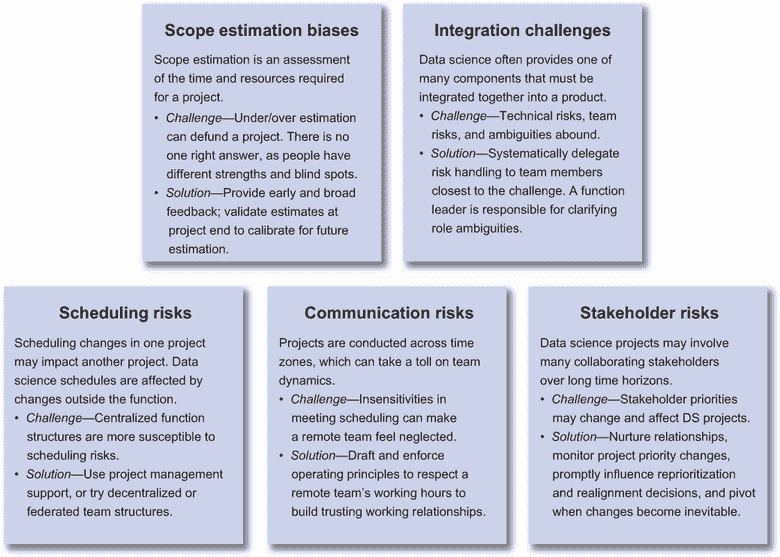
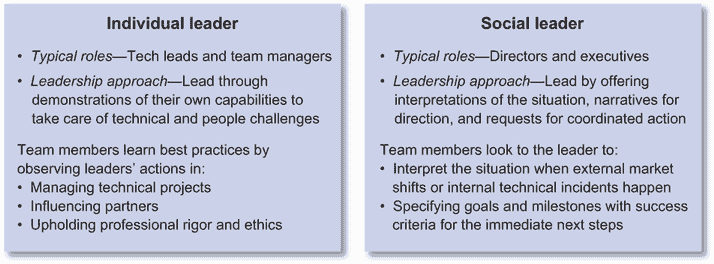
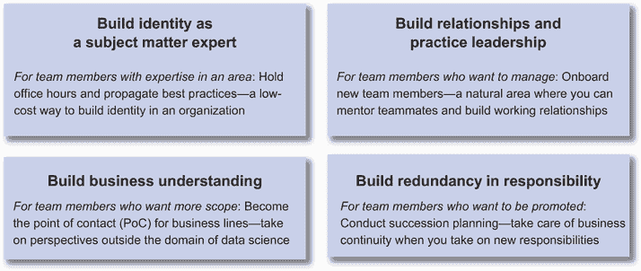
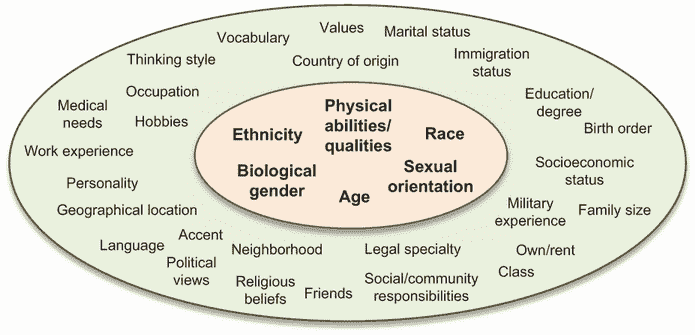
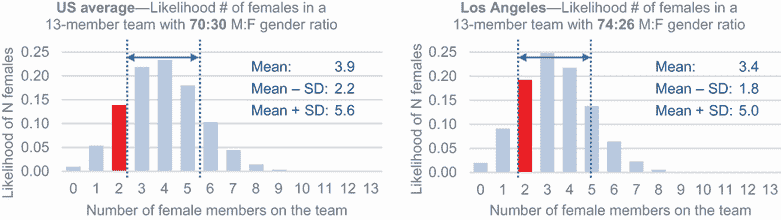

# 领导职能的 7 种美德

本章涵盖

+   在整个职能范围内建立项目规范化

+   作为社会领导者进行指导，并为团队职业成长组织活动

+   推动成功的年度规划流程，同时避免规划反模式

+   从合作伙伴和团队那里获得承诺

+   认识多样性，实践包容性，并在你的职能范围内培养归属感

作为一位总监或首席数据科学家，你的美德可以塑造职能的美德。你的重点成为职能的关注点。你在哪里审查，职能就倾向于发展能力。鉴于你的言语、行动和习惯塑造了 DS 职能的文化，有哪些具体的工具和实践可以为你提供指导职能所需的必要力量和影响力？

你在建立整个职能范围内的项目规范化时所展现的道德或行为标准；你如何通过解释、叙述和请求来指导团队；以及你如何组织活动以提供职业成长机会，这些都体现了你的严谨态度。你的严格体现在你如何推动有效的年度规划流程，避免项目规划执行的反模式，并从合作伙伴和团队那里获得承诺。你的同情心体现在你如何识别和促进多样性，如何在做决策时实践包容性，以及如何在你的职能范围内培养归属感。让我们逐一探讨道德、严谨和态度的维度。

## 7.1 行为道德标准

在治理 DS 职能方面有许多挑战。项目通常需要长期的时间范围和重大的投资来证明商业影响。人才不断被外部竞争机会吸引，并且每隔几年就会更换雇主。你可以实践什么样的行为道德标准来维持一个富有成效的职能，同时也能激励团队成员？

对于项目，你处于一个可以预测和检测跨项目问题早期症状的位置，以引导职能远离系统性失败。建立项目规范化可以帮助你提高项目成功率，并提升团队成员的成就感，从而更好地留住人才。

对于你的团队来说，仅通过展示你希望他们做什么来领导可能会越来越困难。通过分享你对情况的解释、你的方向叙述以及你的协调行动请求，你的领导力会更加有效。你的角色更多地转变为一个教练，以培养团队成员的能力。

你在一周内有限的时间来指导项目和指导团队成员，因此为团队成员的职业成长组织机会路径可以有效地提供可扩展的领导机会。这些机会路径也为团队成员提供了清晰，使他们能够理解他们的成长维度并认识到他们的成就。

### 7.1.1 在整个职能范围内建立项目规范化

根据你部门的大小，每个季度你可能会有成百上千个项目在进行中。你如何跟踪这些项目？当它们不可避免地遇到困难时，你如何决定哪些项目要加大投入或取消？当每个项目都达到其关键绩效指标（KPIs）时，但整体业务结果并未产生，会发生什么？

作为部门领导，你处于最佳位置，可以了解你部门中的系统性问题。不处理这些系统性问题可能导致资源未能分配给最具影响力的项目。这可能导致产品竞争力下降，对于初创公司来说，可能导致宝贵的现金流跑道损失。

| 048 | 在项目间未能检测并采取行动解决系统性问题可能导致规划中的范围估计偏差造成资源浪费；集成挑战；以及调度、沟通和利益相关者风险。资源浪费可能导致产品竞争力下降，对于初创公司来说，可能导致宝贵的现金流跑道损失。 |
| --- | --- |

管理好你的项目的一种方法是雇佣项目经理来正式化这些项目的定义和管理。项目经理可以监督、协助培训并指导数据科学技术负责人和管理者，以协助你在项目开发过程中领导项目。

我们在讨论技术负责人的职责时介绍了项目计划的结构（第 2.2.2 节）。它包括阐明项目动机、定义、解决方案架构、执行时间表和风险。技术负责人应负责处理来自新数据源、潜在合作伙伴团队重组、新的数据驱动特征跟踪、遗留产品细微差别和解决方案架构依赖的项目特定风险。

导演或首席数据科学家应根据经验或观察，预期发现跨项目发生的系统性问题的早期症状。图 7.1 展示了五个主要系统性项目问题的列表，供你参考，以便你引导功能远离系统性失败，包括：

+   项目范围估计偏差

+   项目集成挑战

+   项目调度风险

+   项目沟通风险

+   项目利益相关者风险

图 7.1 项目正式化中需要克服的五个主要系统性项目问题

+   *项目范围估计偏差*—项目范围估计是规划过程中优先考虑项目的一个关键步骤。估计涉及指定功能范围并实施时间范围以实现特定的业务或产品目标。项目范围的过度估计或低估可能是项目被优先考虑或未被优先考虑的区别。挑战在于没有一种正确的答案。

    不同的技术负责人和管理者在预测和处理 DS 中常见的挑战方面有不同的经验和优势，因此他们为类似项目进行不同的范围估计是合理的。过去的经验和个性也可能在项目范围估计中造成盲点。例如，一位有五年在桌面平台上开发企业产品的经验丰富的技术负责人可能不了解与以移动为中心的消费产品合作的所有细微差别。在一系列成功项目之后，有些人可能会低估未来的潜在挑战。

    作为团队领导者，你可以在规划过程中建立实践来减少项目范围估计偏差的个人差异。常见的技巧包括：

    +   通过经验丰富的技术负责人主持的办公时间对范围进行早期反馈

    +   在项目提案审查中对范围进行广泛反馈

    +   在项目完成后进行范围估计验证以纠正偏差

    这些技巧可以通过项目经理作为项目规范化过程的一部分进行系统管理，以最好地创建和使用组织内的制度知识，用于未来的项目范围估计。

+   *项目整合挑战*—在大规模项目中，DS 通常提供许多必须整合以创造商业价值的组件之一。项目整合是一个具有技术风险、团队风险和不确定性的挑战过程。每个风险领域都应系统地委派给最接近挑战的团队成员。

    技术风险最好由项目技术负责人解决。团队风险最好由 DS 团队经理处理，他们负责与合作伙伴建立紧密的工作关系，并解决个人和群体之间的任何即时问题。项目规范中的不确定性可以由技术负责人解决。角色和责任内部的不确定性可以升级到经理或你，职能领导者。

+   *项目调度风险*—项目调度挑战在技术团队作为按职能组织的集中资源池的公司中尤为突出。我们将在第 8.1.3 节中讨论这种类型的组织，包括 DS 职能的咨询和集中结构，其中项目在整个职能范围内规划。一个项目的延误可能会影响许多其他项目，在等待团队成员从延误的项目中退出时。

    在这些组织结构中运营时，拥有项目管理支持是至关重要的，因为 DS 项目进度可能会受到职能控制之外的意外延误的影响。也有技术来维持职能生产力。你可以维护一个具有少量外部依赖的项目积压，例如数据源探索或技术债务解决，这样即使意外的外部调度延误阻止了他们启动新项目，你的团队也能继续前进。

    最终的解决方案是与高管合作，将技术职能重组为分散的、卓越中心或联邦结构。如第 8.1.3 节所述，这些结构指定了专门资源用于产品或业务线，以防止一个项目的延迟影响许多其他项目。

+   *项目沟通风险*—许多公司现在包括地理上分散的团队，这些团队在有意义的项目和倡议上进行合作。协调时区差异可能会对团队动态造成影响。这对于美国西海岸和印度次大陆或美国东海岸和东南亚的团队成员之间的协作尤其具有挑战性。在这些情况下，一个地点的团队可能正在推动项目，而另一个相隔 12 小时的团队可能正在支持项目。工作日不重叠，只有一支团队在正常工作时间运营。在安排会议时的不敏感可能会让远程团队在沟通过程中感到被忽视，并损害生产性关系。

    要管理这些挑战的职能，一些运营原则可以帮助创建一个尊重地理上分散的团队贡献的生产性工作环境：

    +   *端到端参与*—两个地点的团队都应该对项目从端到端有可见性，以最大限度地减少背景和关键决策考虑方面的差距。

    +   *终端利益相关者参与*—两个地点的团队都被邀请与终端利益相关者进行关键会议，以推动项目所有权。这意味着在各自的时区安排方便的时间与终端利益相关者进行会议，以参与远程团队在终端利益相关者挑战和反馈中。

    +   *内部沟通*—你可以考虑时区差异来安排项目内部同步会议。会议时间可以在更方便的清晨或深夜时段之间交替。

    +   *结果展示*—无论谁在项目上工作，都应该向终端利益相关者展示工作，以确保有效交付见解并展示他们的成就。

    这些运营原则可以由总监制定，并由技术负责人、团队经理和项目经理执行，以建立信任的工作关系。在可能的情况下，还可以在跨地点的团队之间建立个人关系。个人关系可以在出现项目沟通紧张时改善，并防止远程团队失去动力或过度劳累。

+   *项目利益相关者风险*—DS 项目的利益相关者不断重新优先排序和重新调整他们的项目组合。这是预期的，因为他们预计并响应动态技术和商业环境中的内部和外部变化。DS 项目容易受到利益相关者重新优先排序和重新调整的影响，因为它们可能需要很长的时间跨度才能成功。

    作为 DS 职能的领导者，识别具有更稳定利益相关者的项目可以降低利益相关者风险。您的职责包括培养利益相关者关系、监控项目的优先级，以及跟踪项目对利益相关者的影响。当您发现优先级变化的第一个迹象时，您可以及时影响重新排序、重新定位决策，并在利益相关者触发的变化不可避免时帮助 DS 团队进行转型。

总结来说，作为有效治理 DS 职能行为准则的一部分，您需要一套最佳实践和支持来实施它们。项目规范化流程是一种最佳实践，可以帮助您随着时间的推移更有效地部署资源。引入项目经理可以为您提供您在开发和管理工作所需的支持，并允许您委派跟踪和缓解范围估计偏差、集成挑战、时间表风险和沟通风险的责任。

### 7.1.2 作为具有解释、叙述和要求的社交领导者的辅导

为了在职能层面发挥作用，您被期望尽可能多地委派给您的团队，这样您就可以专注于建立技术路线图、支持有潜力的项目、组建团队，并支持高管实施他们的 DS 愿景。您的领导实践也需要从个人领导过渡到社交领导[1]。您的行动可能会从咨询和辅导转变为辅导。这些领导实践和行动之间的区别是什么？图 7.2 展示了关键的区别。

图 7.2 个人领导者和社交领导者的区别

*个人领导者*通过展示其能力来领导，当处理技术和人员挑战时。他们的团队成员通过观察领导者在管理技术项目、影响合作伙伴和坚持职业的严谨性和道德时采取的行动来学习最佳实践。当您是技术负责人或经理时，这是常见的，因为您在辅导和咨询您的团队。

您可能还记得第 5.1.1 节中提到，辅导侧重于分享您的过往经验以帮助团队成员建立技能。咨询侧重于如何提供信息和方向来解决团队成员的具体挑战。

作为一名总监，您通常离具体的技术挑战太远，无法提供过往经验或具体解决方案。但您仍然可以通过辅导成为一个有效的领导者。

*社会领导者*通过提供*情况的理解*、*方向的叙述*和*协调行动的请求*来领导。我们通常发现导演和主要数据科学家在这个层面上表现。当外部市场变化或内部技术事件发生时，团队会向你寻求对情况的理解。在商业规划周期和响应事件时，团队会向你寻求具体成功标准的短期目标和里程碑。

当团队成员相信你对**情况的理解**和**方向的叙述**与他们对协调行动的请求一致时，他们会选择授予你制定规则、目标和路线图的权力。你如何产生一个团队可以团结一致的解读、叙述和请求？

| 049 | 个人领导者通过展示他们在处理技术和人员挑战时的能力来领导。社会领导者通过提供对情况的理解、方向的叙述和协调行动的请求来领导。 |
| --- | --- |

情况的解读

你首先可以理解情况在短期内和长期内可能如何影响你的组织、合作伙伴的组织以及你的技术路线图（参见第 6.1.1 节，关于制定你的技术路线图）。你的责任是首先收集来自利益相关者的影响信息，然后综合这些信息形成你为团队制定的方向叙述。

方向的叙述

当新情况不会影响你的路线图时，你可以向团队重申他们将保持原路。重申对团队的稳定性有益，并且可以在面对新情况中的不确定性时缓解他们的焦虑。

当新情况触发你对路线图的变更时，花时间逐一与利益相关者重新调整新方向，以表示对他们观点的尊重。这种勤奋可以帮助你在你的方向叙述经过充分研究时，赢得团队的信任。

在与利益相关者首先不重新调整新方向的情况下，可能会导致后续叙述的逆转。这会损害你未来所有叙述的权威性，因为团队会质疑你的叙述是否可能会被逆转。

协调行动的请求

*协调行动的请求*是社会领导者面临的最具挑战性的组成部分。请求中有很多细节。在导演级别，你可能不会意识到所有成功所需的协调细节。这种失败模式的常见症状是，当团队实现了你设定的 KPI 时，但该功能未能产生预期的商业影响。

帮助协调行动的一个技术是使用*GROW 模型* [2]。GROW 模型是其四个阶段的名称首字母缩写：目标（goal）、现实（reality）、障碍或选项（obstacles or options）和意愿或前进方式（will or way forward）。你可能已经在第三章开始时使用它来识别你的发展重点领域。该框架已经在像谷歌和麦肯锡这样的组织中成功使用，以激发人们的积极性、提高绩效和最大化生产力。作为 DS 中的社会领导者，它对你建立信任和协调承诺可以非常有效。表 7.1 说明了 GROW 模型的四个阶段，并提供了一系列问题，以帮助设定目标、评估现实、识别障碍和选项以及为前进道路做出承诺。

表 7.1 使用 GROW 模型时的 40 个顶级辅导问题供参考

| 目标 |
| --- |

1.  你希望对业务影响实现什么成就？

1.  哪些目标与技术路线图相一致？

1.  成功看起来是什么样子？

1.  你如何衡量成功？

1.  你为什么希望实现这个目标？

1.  如果你实现了这个目标，会有什么好处？

|

| 现实 |
| --- |

1.  你现在在目标方面处于什么位置？

1.  你会如何描述今天正在做的事情？

1.  现在什么正在顺利进行？

1.  到目前为止，什么因素促成了你的成功？

1.  你到目前为止取得了哪些进展？

1.  你认为什么阻止了你？

1.  你如何在这个时候扭转局势？

1.  你是否认识其他已经实现你目标的人？

1.  如果你问了 ____，他们会如何评价这个情况？

1.  在 1 到 10 的尺度上，这个情况有多严重/严重/紧急？

|

| 障碍/选项 |
| --- |

1.  你认为你接下来需要做什么？

1.  如果你什么都不做会发生什么？

1.  如果任何事都是可能的，你会做什么？

1.  你的第一步可能是什么？

1.  如果你那样做了会发生什么？

1.  你认识哪些遇到过类似情况的人？

1.  谁 else 还可能帮助你？

1.  已经对你有效的是什么？你如何做更多？

1.  对你来说最具挑战性的部分是什么？

1.  每个选项的优缺点是什么？

1.  你以前是如何应对类似情况的？

1.  你可以做什么不同的事情？

|

| 意愿/前进方式 |
| --- |

1.  你认为你现在需要做什么？

1.  你打算什么时候开始？

1.  你打算如何做到这一点？

1.  你将如何知道你已经成功了？

1.  你还能做些什么？

1.  在 1 到 10 的尺度上，你计划成功的可能性有多大？

1.  要达到 10 分需要做什么？

1.  在 1 到 10 的尺度上，你有多大的决心/动力去实现你的目标？

1.  要达到 10 分需要做什么？

1.  你预计会遇到哪些需要计划的障碍？

1.  有什么缺失的吗？

1.  你需要我从你或其他人那里得到什么帮助来实现这个目标？

|

目标

在请求协调行动时，你可以从分享你的叙述方向开始。这让你能够与你的技术负责人或 DS 经理讨论他们的目标，为讨论设定背景。在第 5.3.2 节中，我们讨论了与你的直接报告一起设定目标的技术，以鼓励对目标的拥有感。通过 GROW 模型指导团队成员可以训练他们解读和执行你的方向叙述，使你成为一个更有效的*社交领导者*。

在指导你的团队成员设定目标时，寻找他们在你的方向叙述背景下的热情和专注。假设你的方向叙述是为了获得对客户的更深入理解，而你有一个对自然语言处理（NLP）充满热情和专长的团队成员。在这种情况下，你可以鼓励该团队成员推荐涉及 NLP 以提高客户理解的目标。

为了进行指导和提供反馈，你可以选择通过额外的资源加强与你建立的技术路线图一致的目标。这种加强可以采取工具或数据的形式，以帮助加速向你的技术路线图里程碑迈进。例如，当致力于对客户有更深入的了解时，你的团队成员可能会建议使用 NLP 来提高客户理解的目标。你可以通过提供额外的数据工程资源来鼓励团队成员，以加速收集和清理更多非结构化自然语言数据以训练模型。

为了明确目标，你可以指导你的团队成员建立 SMART 目标，这些目标是具体的、可衡量的、可实现的、相关的和有时间限制的。当团队成员被激励去识别和具体化目标时，他们将更有动力去实现它们。

现实

*现实*阶段涉及对当前情况的评估。通过*现实*阶段指导团队成员可以共同理解当前现实与目标之间的差距。

表 7.1 中的问题系列为团队成员提供了一个反思当前情况的机会。反思过程可以包括评估当前挑战，收集利益相关者的观点，以及基准测试产品或功能。你可以通过额外的执行观点来补充反思的结果。这里聚合的信息可用于评估挑战的严重性和紧迫性，以更好地进行优先排序。

障碍/选项

障碍和选项阶段涉及讨论在从当前现实向目标迈进时我们可能遇到的差距和障碍。在共享了对差距和障碍的理解后，你可以指导团队成员头脑风暴以缩小差距的方法。

在这里，你的辅导可以集中在考虑选项的广度和深度上。对于广度，可以通过消除地理位置、时间和资源方面的限制来生成更多样化的选项，从而激发更多想法。对于深度，指定选项的早期步骤及其后果可以帮助确定它们的优缺点。

将来的方向/方法

在这个阶段，团队成员将生成一个经过充分论证的选项集，并针对下一步提出具体建议。辅导涉及帮助团队成员评估他们追求特定行动路线实现目标的信心和动机。当你成功时，团队成员能够创建责任里程碑，并建立跟踪进度的结构。

使用 GROW 模型进行辅导的关键是，随着时间的推移，让你的团队成员学会从你的*指导性叙述*开始，独立设定目标，评估情况，头脑风暴选项，并为你的审查制定一系列协调一致的行动。随着时间的推移，你的辅导将使团队成员成熟到这样的状态：他们不仅将问题升级给你解决，而且还会带来完整的解决方案计划，包括建议供讨论和审查。

### 7.1.3 组织活动以提供职业成长机会

虽然辅导是一种有效的方法，可以在一段时间内提升团队成员的能力，但你还有更多可扩展的技术可供选择，这些技术可以让你有更多时间用于其他战略项目。更可扩展的技术可以激励团队成员遵循一条技术成长的道路，并在职能中建立归属感。图 7.3 展示了四个例子。

图 7.3 团队成员的四个职业成长机会

激励团队成员的机会包括：

+   *建立主题专家身份*—开设办公时间和传播最佳实践

+   *建立关系和练习领导力*—入职新团队成员

+   *建立业务理解*—成为业务线的联络点（PoC）

+   *在责任中建立冗余*—规划继任

让我们逐一探讨每个机会。

建立主题专家身份：开设办公时间

当团队成员在某个领域有专业知识时，你可以鼓励他们开设办公时间，为他人提供关于该主题的建议。专业知识包括数据源细微差别、数据处理管道、受控实验设置、因果分析和演示文稿中的讲故事。

开设办公时间是一个轻量级的活动，可能每周只需花费不超过一小时。然而，它在确立团队成员作为团队主题专家的身份，并让他们接触到各种团队挑战方面非常强大。

第 4.2.2 节介绍了设置高效办公时间的四个关键要素：

+   *确定目的*—从明确的目的开始。

    +   *示例*—故事讲述式办公时间帮助同行数据科学家将他们的分析转化为影响，并建立他们作为强大沟通者的品牌。

+   *定义格式*—每周留出一到两个固定的 30 分钟时段，可以最小化对主持办公时间的团队成员的干扰。

+   *指定主题*—为了最大限度地利用 30 分钟的会议时间，为观众提供一套指南，以便他们在办公时间做好准备。

+   *遵循最佳实践*—目的、格式和主题可以发布在维基百科上，并通过电子邮件通知目标受众。

主持办公时间是个人贡献者发展成为技术领导的重要里程碑。这种技术可以很好地发挥作用，因为它从团队成员的强项领域激发领导力的实践。当办公时间得到充分利用时，团队中专业知识的提升可以在许多项目中产生影响，这对组织有益。

虽然要求项目领导参加技术审查的办公时间可能很有吸引力，但最好是让办公时间参加自愿。要求项目领导参加办公时间可能会将机会变成负担，阻碍项目进度，损害团队动态，并错过建立主持办公时间团队成员身份的目的。

相反，当办公时间会议产生实际影响时，你可以与团队分享他们的成功，以传播其好处。当它们没有按预期工作，你可以收集反馈，与主持办公时间的团队成员一起迭代，以探索可能更适合你所在组织和文化的替代格式和主题。

建立关系和练习领导力：成为新团队成员的入职导师

帮助技术团队成员建立人际关系的其中一个机会是成为新团队成员入职的导师。*入职导师*是一个职责超出技术领域的角色。组织内部任期相对差异允许你的技术团队成员分享行业和组织的熟悉领域知识，同时专注于与新团队成员练习关系建立。

新团队成员的起步速度是成功的一个指标，你可以根据你所在组织和行业的复杂性进行调整。新团队成员生产力的快速提升可以为组织创造商业价值，并可以在团队内部建立未来工作关系的信任。

为了提供一个平稳且快速的起步过程，导师可以利用一份入职文档，其中包括：

+   公司愿景和使命

+   要遵循的功能实践和原则

+   相关的产品和功能路线图

+   与产品和工程合作伙伴建立关系

+   访问 IT 工具和办公室的解决方案

+   重要会议及其节奏

虽然招聘经理最终负责制定入职项目，但导师可以组织团队成员更新入职文档。导师还可以推荐第一周和第一周的工作时间表，以及高效地获得关键工具和流程的实践经验，同时帮助新成员社交上与合作伙伴和团队建立联系。在入职流程结束时，导师还可以与新人一起回顾入职流程中哪些部分做得好，哪些可以改进，为未来的入职流程制定更好的模板。

通过指导新团队成员，您的技术团队成员可以培养对领导团队成员和促进流程最佳实践的欣赏。指导过程也是改善团队成员入职体验的机会，加速团队从入门到高效生产的时间。

建立业务理解：成为联系人

DS 职能与组织中的许多利益相关者互动。表 7.2 展示了这些互动在业务线和跨职能层面的示例。作为职能领导者，您最终对这些关系负责。您可以委派一些这些职责给 PoC 角色的团队成员，以促进他们的成长。

表 7.2 PoC 职责委派示意图

|  | 产品 1PoC：安德烈亚 | 产品 2PoC：布赖恩 | 产品 3PoC：布赖恩 | 产品 4PoC：克里斯蒂娜 |
| --- | --- | --- | --- | --- |
| 用户体验 PoC：戴安娜 | 项目 A | 项目 D | — | 项目 H |
| 算法 APIsPoC：弗兰克 | 项目 B | 项目 E | 项目 F |
| 数据聚合 PoC：乔治亚 | — | — |
| 财务 PoC：你自己 | — | — | 项目 G | — |
| 法律 PoC：你自己 | 项目 C | — | — | 项目 I |

DS PoC 是您团队中第一个被合作伙伴联系以获取与 DS 相关的机会、问题和请求的人。这种安排有助于合作伙伴与 DS 功能建立清晰的接口。PoC 的职责包括：

+   理解合作伙伴的挑战

+   聚合可以解决合作伙伴挑战的 DS 能力

+   设定合作伙伴对技术可行性的期望

+   与 DS 团队合作，优先考虑潜在解决方案

+   将请求升级至 DS 领导层

+   保留合作伙伴领域知识和关注点，以就未来的 DS 计划和路线图提供建议

作为职能领导者，你可以将这些职责委派给多个 PoC，其中每个 PoC 负责一个非重叠的合作伙伴。同时，一个人也可以承担多个合作伙伴的 PoC 角色。例如，布赖恩是表 7.2 中项目 2 和项目 3 的 PoC。如果极端到不委派 PoC 职责，那么你就是所有合作伙伴的 PoC。

| 050 | 作为数据科学总监，如果你没有委派联系人（PoC）职责，那么你就是所有合作伙伴的 PoC。 |
| --- | --- |

承担 POC（Proof of Concept）的责任使团队成员能够理解 DS（数据科学）范围之外的业务和外部职能关注点。这个角色还提供了与非数据科学家保持关系、综合合作伙伴请求、影响 DS 同行和升级请求的机会。这些是发展成为技术领导者的宝贵技能，技术领导者不仅负责沟通和协调，还要负责特定项目的成功。

建立责任冗余：继任计划

*继任计划*通常被认为是一个识别和培养新领导者，以便在老领导者离职时接替他们的过程。这个过程增加了有经验和能力的员工的可获得性，这些员工准备在有机会时承担领导角色。

不那么明显的是，继任计划不仅可以针对领导角色，还可以针对任何角色。本节中讨论的三个角色——办公室时间主持人、入职导师和合作伙伴的联系人——以及你职能中的领导角色，都可以有继任计划。

| 051 | *继任计划*通常被认为是一个识别和培养新领导者，以便在现有领导者离职时接替他们的过程。不那么明显的是，继任计划可以针对任何角色进行。良好的继任计划可以在团队内部保留有价值的机构知识和最佳实践。 |
| --- | --- |

随着你们团队成员的成长，他们注定会晋升或转向不同项目，承担不同的责任。典型的角色转变最多需要几周时间，在这个过程中，大量的机构知识和最佳实践可能会丢失。

指导团队成员为其当前角色制定继任计划，鼓励他们关注使自己和职能成功的知识和最佳实践。通常，仅仅明确记录知识和最佳实践就能强化哪些做法是有效的。这是职能建设过程的一部分。

培养初级团队成员以填补技能差距，对高级团队成员来说可能是激励性的，因为这赋予他们承担更多责任的权力。指导并教授初级成员的过程也是对高级团队成员积累的学习的强化。这样，继任就变成了一种持续的过程，而不是你通往成功职能道路上的薄弱环节。

组织倡议以提供职业成长机会是构建成功部门的重要部分。只有当团队成员感觉到在你的组织中他们有成长的空间时，你才能释放他们生产力的全部潜力。安排办公时间、作为入职流程的一部分指导新团队成员、成为合作伙伴团队的联系点，以及处理他们的继任计划，这些都是你扩展部门生产力并与其明星团队成员建立工作关系的倡议。

## 7.2 规划的严谨性，更高的标准

*严谨性*是创造数据科学部门信任的工艺。区分强大而严谨的功能领导者和薄弱领导者的一个领域是他们对待年度规划的方法。你可能经历过或观察到规划过程的极端情况，其中它是自下而上进行的。通常缺乏焦点，部门最终会追逐比团队中数据科学家数量更多的优先事项。这种缺乏焦点可能导致重要项目未能获得足够的资源。在另一个极端情况下，当规划过程是自上而下推动时，产生的计划可能会要求不切实际的目标，并使关键玩家感到疏远，因为他们的观点和专业知识没有被考虑在内。

规划的严谨性不在于计划中的细节数量，而在于其方向的聚焦和为执行保留的灵活性。我们讨论了在功能领导层面上的规划严谨性，然后讨论了在规划过程中需要更多关注的两个组成部分。

| 052 | 规划的严谨性不在于计划中的细节数量，而在于其方向的聚焦和为执行保留的灵活性。 |
| --- | --- |

另一个组成部分是在项目中识别反模式并迅速解决它们的严谨性。*反模式*是不良实践的模式，会导致项目失败，并失去管理层、合作伙伴和团队成员的信任。我们强调在项目规划、执行和完成阶段常见的三个主要反模式，这些模式困扰着许多数据科学部门。

另一个组成部分是在计划中从团队成员和合作伙伴那里获得对里程碑的承诺的严谨性。仅仅制定一个计划是不够的。对计划的认同需要所有利益相关者的明确承诺，以及对利益相关者将负责的内容进行清晰的沟通。

### 7.2.1 驱动成功的年度规划过程

一个成功而严谨的规划过程实现了三个目标：突出重点、设定现实目标，并在执行中留有灵活性。最佳的年度计划不是最详细的。在数据科学中，许多问题、障碍和见解在规划过程中尚未知晓。在规划中预测它们意味着在现实的交付时间表中包括灵活性，这样团队和合作伙伴就可以就期望达成一致。

当你的公司拥有超过 100 名员工，DS 团队拥有超过 10 名成员时，年度规划过程可能会令人望而生畏。它需要高管、职能领导、合作伙伴和团队领导之间的团队合作，以探索许多潜在的前进路径，达成单一路径的共识，并明确沿途的里程碑。如果不小心，可能会在探索和指定过程中浪费大量精力，并且在共识过程中可能会失去大量的信任。

领英（LinkedIn）、爱彼迎（Airbnb）和 Eventbrite 的最佳实践规划[3]从明确的角色声明开始：

+   高管的角色：

    +   明确高级愿景和战略，这减少了团队成员提出超出最高优先级领域的计划的浪费。

    +   从团队收集反馈以整合和优先处理项目，使计划成为一个连贯的战略。

+   团队成员的角色：

    +   提出与高级愿景和战略一致的计划。

    +   在开始执行之前，微调并确认最终计划的认可。

更具体地说，规划可以分四个步骤：

+   *背景*—领导层与团队分享他们的最高优先事项。

+   *计划*—团队响应，提出提案。

+   *整合*—领导层将团队的提案整合成一个单一的计划。

+   *认可*—突出差距和风险，承诺目标，并执行。

这些步骤在图 7.4 中得到了说明。让我们逐一看看这些步骤。

图 7.4 四步年度规划过程[3]

第 1 步：背景

规划的背景是领导层认为通往胜利路径的简要概述。规划过程的这一第一步包括两个阶段。第一阶段的可交付成果包括：

+   视觉和使命—期望的未来位置及其实现该位置的方法

+   *目标*—在特定时间范围内实现的具体结果

+   *策略*—在时间范围内实现目标的道路

+   *战略支柱*—三到五个最高优先级的赌注，每个赌注包括以下内容：

    +   *描述*—这个赌注是什么？

    +   *意义*—如果我们没有实现它怎么办？成功会是什么样子？

    +   *关键举措*—为取得成功而进行的独特工作轨迹。

作为 DS 职能领导，你可以与高管团队合作，澄清这些项目，如果它们还不清楚。有时，领导团队可能对某些细节犹豫不决。仍然有必要你为你的团队开始一个书面记录计划，这样你的团队就可以尽可能多地开始规划。

一旦确定了获胜的策略，并且最高赌注优先级反映了高管的思考，你就可以努力以严谨的态度理解优先级背后的背景。这包括辨别高管认为什么是真实的，以及他们认为可能是什么。如果高管的理解有差距，团队被鼓励提出有说服力的论点和相反的建议。

一套阐述良好的*战略支柱*应该优先考虑不超过三到五个顶级赌注。例如，成熟面向消费者的业务的支柱可能包括提高参与度、建立信任以及在新的细分市场中增长用户。更多的赌注可能表明高管团队在确定优先事项上无法达成一致。

一旦顶级赌注明确，就可以开始执行上下文澄清的第二阶段。在这个阶段，你需要为每个顶级赌注确定一个个人（所有者）来开发关键举措，包括以下内容：

+   *描述和策略*——我们将采取什么行动，为什么我们应该采取它？步骤的顺序是什么？

+   *项目*——为了实现目标，各个职能之间有哪些不同的移动部分？

+   *时间线和影响*——预期的预期时间范围是什么？如何衡量成功？

+   *资源需求*——工程、基础设施和市场营销的支出需求是什么？

+   *风险和依赖性*——主要风险和初步缓解计划是什么？

顶级赌注和举措不需要与现有组织结构一致。随着规划过程的进行，组织可以围绕顶级赌注进行重组，而不是试图将赌注强加到当前的组织结构中。

被分配到顶级赌注的所有者应该是阐述顶级赌注时最知识渊博的人，而不一定是向你汇报的最高级 DS 领导者。目的是在公司愿景/使命和目标内详细阐述顶级赌注，以便下一步的项目规划尽可能集中。

一旦第一步的两个阶段完成，你就可以与更广泛的团队分享接下来三个步骤的时间表。以下步骤是项目规划、整合和认可，每个步骤可能需要一到三周。

第 2 步：规划

在年度规划过程的第二步中，每个顶级赌注的所有者组建一个团队，并利用第一步中确立的执行上下文开始项目规划。在这一步，上下文是建议，并可供讨论。如果团队认为战略或时间表存在重大挑战，这就是提供替代建议的时候。

我们在第 2.2.2 节中讨论了项目级规划。对于年度规划，项目动机源于顶级赌注。项目定义是关键举措。团队规划工作主要阐述解决方案架构，估算执行时间线（以工程月或季度为单位），并就项目风险进行头脑风暴。

在这一步，验证项目定义是否有助于公司推进大赌注至关重要。你可以通过量化合作伙伴功能（如销售或客户服务）的潜在投资回报率，并获取他们确认项目目标是否能够产生差异。

计划所有者可以指派一名团队成员开始规划过程，使用团队计划的初步草案，然后与团队迭代草案，同时从高管那里获得早期反馈。为了保持计划现实，团队需要确保检查所有相关利益相关者的支持。

当计划提案符合高管环境，具有雄心勃勃但可实现的影响，并且所需资源被明确定义和充分解释时，计划提案就准备好提交了。计划所有者还应与团队设定预期，即无论计划提案多么精致，在收到高管的反馈时都可能会有所变化。

在一个运行良好的过程中，计划所有者有机会亲自向高管展示计划，以解决提案中任何潜在的不完整之处。面对面的会议可以帮助高管在年度规划的整合步骤中做出明智的决定。

第 3 步：整合

当团队评估了顶级赌注的影响和风险后，是时候让高管团队做出一些艰难的权衡了。整合步骤的目的是让高管团队优先考虑倡议，分配资源，并将所有倡议整合成一个连贯的公司战略。

高管在做出这些艰难决定时会问自己的一些重要问题包括：

+   最重要的项目是否被优先考虑并得到资助？

+   每个资助的倡议都有正的投资回报率吗？

+   我们有多自信，我们拥有正确的团队在处理正确的项目？

+   我们如何提高这种信心？

+   团队是否足够雄心勃勃？或者过于雄心勃勃？

+   公司是否做得太多？

整合计划应尽可能简单。在执行过程中，市场漂移和新优先事项经常出现。如果在这个阶段计划看起来很复杂，那么在以后执行时将会感到压倒性。

第 4 步：获得支持

获得支持这一步是关键步骤，可以建立或破坏高管与他们的团队之间的信任。最终的计划首先与顶级赌注所有者和他们组建的规划团队分享。这是为了确保没有遗漏任何关键内容。你可以在计划在公司范围内分享之前，通过获取他们的反馈并在最后时刻进行调整来建立信任。如果你只是快速通知他们而不解决他们的担忧，你可能会失去信任。规划团队已经花费了很长时间来整理项目计划的细节，并寻求合作伙伴的协调。当他们的项目在没有明确叙述的情况下被削减，或者当某些资源缺失时，他们无法再承诺目标，他们可能会对未来参与规划练习感到气馁。

作为高级领导团队的一部分，确保在优先级决策中避免意外，并尽早分享决策背后的理由。帮助团队了解决策的来源，并激发他们对下一个项目的热情。

在功能领导层面，你将接触到公司范围内的年度规划流程。这个流程中的许多实践和关注点也适用于季度规划。以这个四步规划流程为参考，你可以在年底前为你的功能制定一个清晰的年度计划，并为新一年你的功能成功奠定基础。

### 7.2.2 避免项目规划和执行反模式

软件工程和 DS 中的模式是针对常见问题的可重用解决方案。反模式是导致项目失败的不良实践模式，会导致高管、合作伙伴和团队成员失去信任。

许多好心的数据科学家会陷入可能导致项目失败的许多实践。一个严谨的功能领导者应该注意这些模式，并尽快引导团队摆脱它们。我们强调三个顶级反模式[4]，分别在项目规划、执行和完成阶段，这些模式困扰着许多数据科学项目：

+   *项目规划*—规划至死模式

+   *项目执行*—消防演习模式

+   *项目完成*—推墙模式

| 053 | 严谨的功能领导者会注意项目规划、执行和完成中的反模式，如规划至死模式、消防演习模式和推墙模式，并尽快引导团队摆脱这些反模式。 |
| --- | --- |

项目规划：规划至死模式

在 2.2.2 节中，我们介绍了技术领导者的项目规划流程。虽然规划对于协调项目期望至关重要，但即使经过精心规划，项目也可能失败，出现“规划至死”模式。有两个需要警惕的失败模式：

+   计划在项目开始时制定并审查，但未更新或跟踪执行情况。执行中出现的许多新问题没有及时与利益相关者沟通。当截止日期到来而项目未完成时，利益相关者会感到惊讶。这种情况通常发生在组织专注于控制进度而不是交付结果时。

+   计划过于复杂，显示了无法追踪的大量细节。有一种感觉认为一切都在控制之中，而过多时间花在规划上而不是交付结果上。当出现延误时，过多时间花在更新计划上，这会导致进一步的延误和更多重新规划。

这些失败模式的原因来自于缺乏对规划、调度和跟踪的实用、常识性方法。项目计划只需要详细到你可以追踪的里程碑即可。

作为解决方案，对于 DS 项目，通常以 5 到 10 天（一个冲刺）的粒度设置里程碑已经足够详细，这样我们就可以在冲刺计划中细化细节，并在每周或每个冲刺的基础上评估我们向目标迈进的程度。每个里程碑都应该有一套可验证的交付成果和验收标准，这样我们才能确信我们已经达到它们。此类里程碑和关键交付成果的例子可以包括：

+   架构已审查

+   模型原型已完成

+   单元测试套件已完成

+   所有 P1 缺陷已修复

+   A/B 测试已安排

+   A/B 测试结果已分析

+   功能逐步推出

计划的目的是通过制定方向、界定交付成果和预测潜在问题来增加项目成功的可能性。项目跟踪为团队提供早期反馈，以便他们做出响应并使项目回归正轨。以下是跟踪的一些明确状态：

+   *按计划进行*——团队预计项目将按计划完成，没有新的风险。

+   *交付完成*——项目根据验收标准完成，并由赞助商或客户接受。

+   *提前完成*——项目正在进行中，预计将比预期更早完成。

+   *风险中*——项目遇到了问题，通过追赶工作仍有可能按时交付。

+   *延迟*——项目遇到了问题，交付将延迟到新的日期，而无需额外的帮助。

*按计划进行*和*交付完成*状态是显而易见的。为了强调其他一些状态，*提前完成*状态对于交付团队的成功至关重要。作为职能领导者，你将希望检查提前完成里程碑的原因，并不要浪费一个可教育的机会。是否有最佳实践可以分享？是否有预期的风险没有发生？是否有高度生产力的团队成员做出了英雄般的努力？如果计划是真诚的，那么你有责任消除计划中故意降低期望（或沙袋战术）的表象，这样未来的计划就不会过于激进。如果期望是故意降低的，你需要与技术负责人讨论沙袋战术的危险，因为承诺的项目可能会被取消或降级，以获得低回报率。

当项目处于*风险状态*时，与计划中的里程碑相比，项目会延迟，但项目负责人仍有能力将其重新调整回正轨，按时交付。作为职能领导者，这是你表达对项目负责人提前通知的感激之情的时候，通过在需要时提供支持来强化及时沟通的行为，并授权技术负责人处理时间表风险。当技术负责人能够学会通过延迟来管理项目时，这可以让你有更多时间进行战略性的领导。

当项目*延迟*时，如果不调整范围、资源、截止日期或所有上述内容，项目就没有按时交付的路径。你可以授权技术负责人与项目利益相关者合作，提出选项，以便项目发起人可以选择和批准这些变化。你可以通过将资源重新分配以加速项目进度（在可能的情况下），同时阐明延迟对其他受影响项目的影响，并通知所有利益相关者来支持你的技术负责人。目标是就新的可实现范围或时间表达成一致，以便项目可以交付。你的支持可以在你和你的团队领导者之间建立信任，并为 DS 职能更好地协同工作以成功交付项目铺平道路。

项目执行：紧急演练模式

*紧急演练模式*发生在 DS 项目启动但延迟，原因是设计、数据、管道、调度或团队政治。面临被取消的风险，团队会做出绝望的努力，试图在极短的时间内完成项目，在这个过程中牺牲范围和质量，并产生大量的技术债务。

一些技术负责人可能实际上被激励采取这种模式。在项目的正常流程中，规范和架构在宣布可接受之前会经过严格的审查和迭代。在紧急演练场景中，管理层可能会接受任何可以在截止日期前完成项目的规范和架构。紧迫性可能会让技术负责人更容易通过规范和架构审查，即使这意味着将来要偿还技术债务。在紧急演练场景中无法进行严格的 DS。以下是一些可能导致紧急演练场景的潜在根本原因以及可以从你的领导力中出现的解决方案：

+   *分析瘫痪*—团队陷入了一段漫长的分析和规划期，压缩了开发进度，并导致了一场紧急演练场景。项目分析规划和完成阶段应该有明确的里程碑。作为职能领导者，你可以指导技术负责人将项目置于*风险*或*延迟*状态，以引起对项目的关注，以便获得支持，将其从分析和规划阶段移出。

+   *方案工程*—项目陷入架构方案阶段，无法通过审查流程。作为职能领导者，你可以识别这一症状，推动项目进入原型阶段，以证明任何潜在的技术风险，而不是在纸上讨论理论上的担忧。

+   *不稳定的规格*——利益相关者无法就某些输出细节达成一致，项目陷入规格阶段。作为职能领导者，你可以指导技术领导者为项目的内部和外部部分进行架构设计，以便内部组件可以灵活地支持输出格式的变化，而利益相关者可以在稍后日期通过细化具体的对外规格。

项目完成：扔过墙模式

当产品由一个团队开发而由另一个团队运营时，可能会出现*抛过墙*模式。对于 DS 项目来说，这可能会发生在 DS 团队开发的模型由产品工程或站点可靠性工程团队维护的情况下。

当模型可能已经完成编码但尚未经过严格测试且文档记录薄弱时，就会出现“扔过墙”模式。缺乏输入漂移和输出异常监控也使得模型在操作中容易出现意外行为，从而导致用户体验下降。

这种反模式可能有几个潜在的根源。我们在这里探讨它们，并讨论可能的解决方案：

+   *项目计划不够全面*，无法分配时间进行测试、文档编制和监控输入漂移和输出异常。作为职能领导者，项目提案应达到高标准，确保完整性。项目完成的期望应与将操作交付成果的团队保持一致。你有责任引入这种严格的项目规划标准。

+   *由于前期延误、公司优先级变化或资源限制，项目范围被缩减*。作为职能领导者，你应该明确范围缩减对技术债务的影响。缩减某些范围可能是一个很好的权衡，但也要明确创建的技术债务的偿还计划。如果技术债务没有及时解决，项目可能会随着时间的推移对最终用户体验造成重大干扰。

+   *个人执行问题*可能是项目缺乏测试、文档或监控的原因。作为职能领导者，你可以调查这是否是系统性的薄弱入职流程、系统性的缺乏资深技术领导者的指导，或是个人的能力或动力问题。如果问题有系统性原因，可以通过改进流程来减轻未来发生的可能性。如果是个人的问题，最好在缺乏严谨性影响团队和合作伙伴士气之前，了解个人的深层担忧。

作为职能领导者，反思项目失败中反复出现的根源是一个收集和记录这些反模式的好方法。这些反模式为未来检测和纠正情况提供了丰富的机构知识。

### 7.2.3 从合作伙伴和团队那里获得承诺

承诺是对产生结果或成果的个人责任的声明。团队和合作伙伴的协调一致是一种承诺，表明各方已同意通过某种过程在特定日期内共同实现目标。从合作伙伴和团队成员那里获得承诺是项目协调和执行的关键。然而，语言和理解的模糊性常常成为障碍。

你是否遇到过你认为已经做出承诺，但其他方有不同的解释的情况？我们可以利用严格的承诺技术来最小化这些歧义。

对 DS 项目的协调承诺可以采取不同的形式。作为有效的职能领导者，你首先可以注意到并观察各种承诺的形式，练习产生清晰承诺的严谨性，并从他人那里获取清晰的承诺，以成功协调项目。

承诺的形式

即使是简单的承诺也可能有独特的组成部分，如果缺失，可能会降低团队的有效性。例如，当你承诺接受来自合作伙伴的请求时，无论请求多么含糊，严谨意味着你将明确在*特定时间框架内*交付结果的*满足条件*。你还应该与合作伙伴*确认接受请求的后果*，包括优先考虑其他项目，在项目期间协调输入和审查，以及期待未来合作中团队之间更好的工作关系。

在工作场所中，你可以观察到五种简单承诺的形式[1]：承诺、请求、断言、评估和构成性声明。如表 7.3 所示，每种形式都有必须明确指定的独特组成部分，以便使承诺清晰。当承诺没有明确定义和交付时，你可能会失去团队和合作伙伴的信任。

表 7.3 五种简单承诺及其组成部分

| 承诺 | 组成部分 |
| --- | --- |
| 承诺 | 满足条件及完成的时间框架 |
| 请求 | 对特定承诺的询问及其接受或拒绝的后果 |
| 断言 | 对事实或真相的声明，可以引用请求的参考文献 |
| 评估 | 有根据和逻辑推理的解释或判断 |
| 构成性声明 | 目的和边界的声明 |

让我们更详细地看看 DS 功能背景下的每个承诺：

+   *承诺*——承诺在特定时间内产生令人满意的结果。例如，你可以承诺向产品经理保证，你将在周五之前提供分析和建议，包括下一步的建议。反过来，产品工程合作伙伴也可以承诺跟踪用户行为，并以特定形式将跟踪数据提供给你，以便在周三进行分析。

    为承诺指定一个时间框架是至关重要的。我们稍后讨论承诺“抽空去做”不是一项承诺，因为你不能在承诺完成后协调行动。

+   *请求*——请求是对他人做出具体承诺的承诺，伴随着接受和拒绝请求产生后果的意愿和能力。

    后果可能是自然的或强加的。自然后果是指当一个人接受或拒绝你的请求时，自然演变的情况。这些情况可能包括如果请求被接受，公司倡议的成功，或者通过满足未来合作请求而建立起的信任和能力。强加后果是指你可以施加在你请求的人身上的情况，包括成功执行或表现奖励或拒绝你的请求的处罚。

    作为职能领导者，你有权对你的职能团队成员产生积极和消极的强加后果。在使用强加后果时，后果必须足够重要，以便你的请求被接受。你还需要愿意执行强加后果。如果你不能执行奖励或处罚，你的强加后果在将来将几乎没有分量。

    在工作场所，对于向团队成员和合作伙伴提出请求，自然后果总是更受欢迎。这是因为自然后果与强加后果相比，消除了执行过程中的意愿和能力限制。如果团队成员或合作伙伴接受或拒绝你的请求，自然后果就会自然而然地出现。如果你在寻找想法，想想对组织、个人、你自己以及与他们关系的自然后果。

    因此，向团队成员和合作伙伴明确后果，特别是重要的自然后果，可以使你的请求更有力，这可以增加你的请求被接受和执行的机会。

+   *断言*——断言是对事实和真相的承诺。当我们分享结果或对前进道路提出建议时，它们无处不在。如第 3.2.1 节所述，科学严谨性是组织对我们工作的期望。你的专业声誉处于危险之中，因此请准备好在需要时提供参考文献。

    类似地，当我们听到合作伙伴或市场的断言时，我们应该意识到这些断言背后的严格标准，这样我们就可以在结果和建议上以适当的信心水平利用它们。

+   *评估*——评估是对解释或判断的承诺。数据科学家使用定量标准通过数学和逻辑严谨的方法来解释情况。我们分析和预测模型的结果是对过去和未来的评估。当我们严谨地分享评估时，我们不仅分享我们的解释或判断，还分享它们的基础和逻辑推理。这也是为什么可解释分析和模型在做出重要决策时通常被要求的原因。当我们收到评估时，我们也有机会在接受之前检查它们背后的基础和逻辑推理。

+   *构成声明*——构成声明是对存在方式的承诺，例如通过构成专业身份、项目章程或团队章程。对于数据科学家而言，其专业身份的承诺是严格产生具有积极商业影响的可信定量结果。项目章程承诺通过具体的交付成果解决客户痛点。团队章程承诺在明确团队方向的同时设定边界。在项目工作和与合作伙伴团队合作时的严谨性在于理解他们的章程并与声明的角色和责任合作。

    在使用 holacracy 作为结构的组织中，需要精通构成声明。在 *holacracy* 中，文化促进自我管理的单元或 *circles* 的等级制度，每个单元都有自己的治理流程，以构成团队、定义角色、做出决策和评估绩效。像 Zappos 这样的公司已经成功实施了这种组织结构。在第 10.2.4 节中更详细地讨论了 holacracy 作为组织结构。

当你做出并接受承诺时，作为 DS 职能领导者的严谨性在于理解和阐明与你的团队和合作伙伴的这些承诺的组成部分，这样你就可以建立长期信任。

承诺承诺

在明确了承诺之后，你可以询问团队成员或合作伙伴是否能够做出承诺。你可能会得到这样的回答：

+   “我会试试。”

+   “我可能可以做到。”

+   “我会尽力。”

这些回答听起来像承诺，但它们不是。你可以预见的只有三种类型的回应：

+   清晰的承诺包括承诺的内容以及承诺的时间范围。

    +   示例：“是的，我保证周五前交付产品深度分析。”

+   提出一个建议来重新谈判承诺条款。

    +   示例：“不，我不会承诺那个，但我可以承诺在下周五交付。”

+   拒绝承诺。

    +   示例 1：“不，我不会承诺——我会试试。”

    +   示例 2：“不，我目前不能承诺。我需要澄清。”

    +   示例 3：“不，我目前不能承诺，但我明天会回复你。”

寻求承诺的目标不是强迫你的团队成员或合作伙伴做出承诺。这是一个了解他们是否能够做出承诺的机会，如果不能，那么他们不能承诺的原因有哪些。

在承诺对话中，当你的团队成员或合作伙伴对一项承诺做出“是”的回应时，严格的实践是对承诺条款进行总结以进行第二次确认。例如，你可以检查说，“太好了。总结一下，你承诺在周三之前将每日跟踪数据提交到数据仓库。是这样吗？”如果你的团队成员或合作伙伴有任何犹豫，最好是立即诊断潜在的风险并努力减轻它们，而不是希望数据会在周三出现。

最后，如果承诺的日期无法履行，请尽早请求沟通。这可以最大限度地提高承诺得以执行的机会。

发送一份书面跟进笔记，总结已达成的一致承诺，也是一种良好的礼仪。当你与作为团队经理的合作伙伴交谈时，他们可能会将承诺委派给团队成员。书面总结可以最小化承诺中某些部分在委派过程中丢失的机会。

作为职能领导者，你的严谨可以在从公司层面的年度规划到确保通过对齐对话进行承诺的广泛情况中得到体现。这些实践是你作为高级领导角色有效性的基本工具。它们也是为你的团队成员提供良好指导的话题，这样他们可以在工作中更加有效。

## 7.3 积极态度

态度是你对待职场情况的心态。作为某个职能的领导者，你监督团队成员以积极和坚韧的态度（第 3.3.1 节）克服失败。当项目成功或失败时，你培养一种制度化的学习文化（第 5.3.3 节）。并且你指导新经理适应从创造者时间表到管理者时间表的转变（第 5.3.1 节）。随着时间的推移，这些就是你要委派和指导你的项目和团队领导承担的实践。那么，对于一位总监或首席数据科学家来说，领导数据科学职能时，态度上有哪些关注点呢？

随着你团队的壮大，团队中的*多样性*变得越来越重要。作为一个定量学科，我们倾向于将多样性简化为性别比例和种族构成的问题。虽然这些比例很重要，但它们是多样性的滞后成功指标。为了建立一个富有成效的职能，多样性的影响要深远得多。第 7.3.1 节突出了多样性与生产力之间的关联和潜在的因果关系。

如果将多样性比作邀请某人参加派对，那么*包容性*可以比作邀请他们跳舞。在专业环境中，包容性意味着倾听人们的意见，尊重他们的偏好，并积极征求他们的想法。第 7.3.2 节讨论了如何认可和加强想法的贡献，以及团队成员如何感到在工作中投入。

虽然多样性和包容性是作为职能领导者你可以做的事情，但真正的成功指标是团队成员感到*归属感*，这需要团队成员之间更深层次的信任，而这种信任只能随着时间的推移来培养。归属感可能很难建立，但很容易打破。让它发挥作用可能意味着在沉重的技术债务和高人才流失率与一个充满深层次机构知识的数据科学家生产性群体之间做出区别。第 7.3.3 节讨论了如何在你的 DS 职能中培养归属感，以便团队成员能够全身心地为团队做出贡献。

| 054 | 如果将多样性比作邀请某人参加派对，包容性可以比作邀请他们跳舞，而归属感则是你的客人感到舒适地跳舞。 |
| --- | --- |

多样性、包容性和归属感都为 DS 职能中的积极态度做出了贡献。它们并不特属于 DS。但鉴于 DS 职能可以为公司提供广泛的影响，你可以抓住独特的机遇。让我们深入探讨其中的一些。

### 7.3.1 在你的团队中识别和促进多样性

多样性涉及人们相似和不同的方式。人们经常讨论的多样性维度包括种族、性别和民族。实际上，还有更多维度的多样性，包括一些可见的和一些不可见的。图 7.5 展示了多样性各种维度的部分列表，包括许多超越种族、性别和民族维度，在你第一次见面或与人合作时是看不见的。

图 7.5 多样性维度的部分列表

就像在数据科学（DS）中的任何高维空间采样一样，即使团队成员数量很少，他们仍然可以在图 7.5 中显示的许多维度上代表多样化的背景。这一特性使得多样性成为大小团队的重要话题。

当你认识到团队中的多样性时，当团队成员感到安全地与团队成员分享他们在多个维度上的更深入经验时，你也会发现其他好处。在众多维度中，团队成员在某些维度上发现共同属性的可能性会显著增加。作为旁注，这也是导致 Bonferroni 校正的统计效应，即在测试多个假设时（在这种情况下，当比较多个维度时），观察罕见事件或意外匹配维度的机会增加。

促进多样性不仅仅是一项社会事业

促进多样性不仅仅是一个社会原因。它具有真正的生产力和商业影响。具有多样化背景的 DS 团队在识别新的商业机会方面可以更加创新。一个真实的案例来自阿里巴巴的互联网金融部门蚂蚁集团，它是中国最大的电子商务门户网站的一部分。一个客户 DNA 项目从阿里巴巴电子商务网站上广泛的购买中提取了各种类型客户购买行为之间的关系。许多发现之一是，紧身服装购买与智能手机屏幕维修购买之间存在密切关系。

要得出这类结论，需要一个具有多样化背景的 DS 团队来识别数据背后的隐藏社会概念。基于这一发现，蚂蚁金服开发了一款智能手机屏幕维修保修产品，并将其推广给购买紧身服装的人群。该产品获得了良好的市场反响。

另一个真实的案例可以在消费贷款行业中看到。许多发展中国家缺乏集中的消费者信用系统，因此公司一直在使用手机账单历史和电子商务购买历史来评估贷款申请人的信用度。虽然一些信用建模团队专注于传统特征，如支付和逾期历史，但具有更多样化背景的团队正在寻求更具包容性。具有呼叫中心分析和电子商务背景的数据科学家成功发现了有效且新颖的特征，例如通话时间和电子商务记录中的商品退货率：

+   *通话时间*—研究发现，通话时间与贷款风险之间存在深刻的联系。银行和贷款机构在正常工作时间内的逾期付款提醒和催收电话都来自呼叫中心。许多最近逾期贷款的申请人已经转而在正常工作时间关闭手机，只在夜间和周末使用手机。手机使用行为的变化可以表明比逾期公共法律记录更早观察到的财务压力。

+   *商家退货率*—还发现商家退货率与高逾期率之间存在相关性。虽然确切的影响尚不清楚，但可以推测利用慷慨的退货政策对商家造成损害的道德风险，以及这可能表明借款人偿还贷款的可能性。

没有一个具有多样化经验的 DS 团队，这些特征是无法识别的。它们是您考虑构建多样化 DS 团队以产生实际商业影响的具体证据。

识别多样性的技术

当接近敏感话题，如多样性时，一些团队成员可能持有多年形成的强烈观点。最近的管理研究[5]表明，在小组环境中建立一个经验学习环境是最好地说明共同盲点、分享经验和允许就多样性提出问题的。

经验学习是一个过程，通过在小组环境中对经验的转化来创造知识。它的有效性仅次于亲身体验情况。经验学习创造了一个专业环境，以识别多样性，使团队成员能够培养他们的文化意识，并承担起分享他们观点的责任。

这些小组会议需要设定规则，以避免某些与会者的即兴评论损害团队内部长期的工作关系。你可以参考一套四条规则，用于建立一个安全空间：

+   平衡空间

+   在门口检查你的假设

+   保留作为人的权利

+   进行共识对话

为了*平衡空间*，讨论的细节应保持机密。保密性鼓励更具有影响力的开放讨论，关于多样性的讨论。你可以分享经验和学到的教训，但不要传播流言蜚语或识别关于谁说了什么的具体细节。声音更大的团队成员应稍微克制一下，给其他人留出发言的时间。声音较小的团队成员应尝试发言。在表达不同意见时，应针对想法或实践，而不是持有不同意见的人。在对话中，每个人的真实想法都同样值得被认真对待，因此团队可以在多样性对话中尊重多个观点。

为了*在门口检查你的假设*，不应对他人的言论进行评判，也不应对你自己的言论进行免责声明。每个人都应作为个体发言，而不是作为群体的代表。使用“我”语句来表达你的观点，例如“当你做 Y 时，我感到 X”，以拥有你的知识。在多样性讨论中，每个人都应相信团队有共同的目标，即讨论和学习更多关于复杂话题。

为了*保留作为人的权利*，当团队成员用情绪化的评论违反规则时，给他们一个机会，因为他们可能正在度过糟糕的一天，但要以礼貌的方式指出。在考虑不同的观点时，通过强调团队成员在文化、种族、阶级、性别等方面的背景，来尊重背景的多样性。在讨论中适当地承认情绪，因为多样性这个话题可能对某些人来说更为敏感。如果有些评论可能对某些人过于敏感，请练习做一个更大度的人，给予原谅。

在这些会议中，为了进行**共识对话**，通过适当的目光接触、检查你的肢体语言、询问并使用团队成员偏好的代词来练习积极倾听。在会议中，每个人都鼓励冒险发言，但每个人都有权选择不发言。如果有人被迫发言，他们很可能不会真诚，这可能会为对话提供不良数据。在对话中的每一方都有同等责任，如果你提出问题，就要提出解决方案；如果你提出解决方案，就要定义问题。

对于许多 DS 从业者来说，挑战在于，虽然科学基于客观观察，但社会问题的真相对观察者的背景是主观的。特别是当涉及到一个叙事如何让人感觉时，往往存在不止一个真相。作为 DS 从业者，我们必须在 DS 职能中促进多元化时，接受“许多真相”的概念。

在这些基本规则的基础上，多元化会议可以首先专注于理解我们自己的多元化属性。一种方法是将我们在图 7.1 中列出的维度上如何自我识别写下来并分享。然后我们可以列出我们自己的前五个维度并与团队分享。在这个练习中，你可能会发现许多你的队友认同的维度，这些维度在日常工作中没有显现出来。你也可能会发现你之前没有明显共有的属性。当我们了解团队成员认同什么时，我们可以开始关于包容性的讨论。

促进多元化的技巧

在促进多元化时，你可以考虑许多最佳实践和要避免的陷阱。认识到你职能中已经存在的多元化是显而易见的好处。引入具有更多样化背景的新团队成员可能更具挑战性。

在许多成功且快速增长的 DS（数据科学）职能中，仅满足增长的人才招聘目标就已足够困难。拥有多元化要求对招聘经理来说则是额外的压力。对于招聘经理来说，满足多元化要求尤其具有挑战性，因为他们通常与由 HR 团队提供的候选人管道合作。

相反，HR 人才招聘团队则受其成功招聘经验和他们使用的工具中机器学习的搜索排名算法的指导。搜索排名工具通常被训练来推广过去产生更多兴趣的候选人类型。因此，DS（数据科学）候选人的历史文化偏见持续存在，并以许多根深蒂固的方式自我强化。

加入社会因素，当多元化的候选人考虑加入你的职能时，他们通常会查看你团队现有的多元化情况。因此，你团队中最具挑战性的多元化招聘可能就是你的第一个多元化招聘。

作为职能领导者，你可以采取哪些最佳实践来确保涉及的利益相关者公平？你可以考虑一个两步过程，即基准测试然后推动变革。

基准

作为数据科学职能的领导者，你可以首先明确在没有招聘偏见的情况下预期的多元化团队成员数量。然后，你可以估计你的公司在同行中的地位。例如，如果你正在组建一个 12 人的团队，你应该目标是六名男性和六名女性数据科学家吗？

到 2020 年，美国所有数据科学家的男女比例大约是七比三[6]。为了检查你的团队在性别维度上是否是一个无偏样本，你可以使用 p = 0.3 的二项分布，使用你职能中的团队成员数量。如果你在平均值的一个标准差之内，你招聘过程中系统性性别偏见的可能性很低。

例如，如果你在你的职能中领导着 12 名其他数据科学家，如果你的团队是美国数据科学家人群的随机样本，那么你应该预期团队中平均有三位到四位女性数据科学家。如果你的团队中女性成员不超过两名，男性成员超过十一名，那么你将超过美国数据科学家性别比的平均值一个标准差。

图 7.6 对数据科学团队多样性的男女性别比进行基准测试

对于许多公司来说，候选人池仅限于本地候选人。你还可以将你当前的团队构成与可用的本地候选人池进行基准测试。假设你的公司位于洛杉矶，这是美国最大的都会区之一。在这种情况下，拥有数据科学家头衔的专业人士的男女比例是 26%对 74%（见图 7.6）。在你的 13 人团队（你和你的 12 人团队）中有两名女性数据科学家，这使你处于你本地候选人池平均值的正负一个标准差之内。拥有地理上分布的团队的公司可以利用多个地点的团队多样性来提高商业决策的质量。

推动变革

多样化比率是公司招聘和员工保留实践的结果。如果当前的多样化水平不可接受，你可以检查招聘或工作环境中潜在的偏见。你可以推动变革的一个地方是在人才漏斗的顶端。

首先，应该广泛宣传开放职位，以确保每个人都有机会申请。其次，在寻找候选人时，为了抵消在搜索和排名人才时的任何偏见，你可以在做出招聘决定之前要求至少面试一定比例的多元化候选人。招聘决定仍然可以基于业绩，招聘经理可以授权专注于将合适的人才与合适的机会匹配。

为了在数据科学（DS）领域从根本上缩小性别比例差距，我们作为这个领域可以激励来自不同背景的人成为下一代数据科学家和 DS 领导者的组成部分。我们希望邀请每个人加入我们的旅程，以改善领导 DS 的人才多样性。

### 7.3.2 在决策中实践包容

为了为你的团队创造一个安全和和谐的工作环境，仅仅拥有具有不同背景的成员是不够的。你还需要承认并欢迎他们的不同文化背景，并以尊重的态度对待每个人。

包容的概念可能比多样性更微妙，因为没有明确的指标来衡量其成功。我们从讨论和学习角度帮助突出挑战，以对比积极和消极的情况及其自然后果。

为了反思你在领导职能方面的行动，你可以问自己以下问题：

+   在选择全员大会或团队外出的时间和地点时，我传达了什么信息？

+   在挑选会议、电话会议、午餐、晚餐、委员会和拓展任务参加者时，谁被包括在内，谁没有被包括在内？

+   我在指导职业目标、项目、团队和机会方面对谁表现出了兴趣？

+   在会议或书面反馈中，我包括或未包括谁？

+   如果我征求了意见，但最终选择了另一个方向，我是否解释了为什么我没有采取他人的想法？

偏见，无论是有意还是无意，都可能造成非包容的外观。仅仅声称自己没有有意偏见是不够的。我们所有人都在某些环境中长大，形成了某些假设，这些假设在我们的潜意识中形成了一些偏见。

| 055 | 偏见，无论是有意还是无意，都可能造成非包容的外观。在选择会议或活动时间、地点或参加者时，以及在你展示兴趣以指导职业目标、项目、团队和机会时，要留意潜在的偏见。 |
| --- | --- |

例如，当你有一个具有晋升机会的具有挑战性的项目，可能需要短期加班时，你是否只提供给一个单身男性或有两个年幼孩子的母亲，他们可能同样有资格？如果你选择了单身男性，你是否是在最好的意图下做出决定，但系统地偏袒了团队成员的职业前景？

包容的挑战：微侵犯

许多常见的包容性挑战都源于*微侵犯*，这是在办公室中飘浮的自觉或不自觉的偏见，可能会伤害团队成员的感情，使他们感到不受欢迎，或损害他们的长期职业生涯。

在上述例子中，如果一个有两个孩子的母亲团队成员反复被忽视机会，即使有最好的意图，这也是一种微小的攻击和非包容行为。偏见可能源于对年轻孩子的母亲不能同时优先考虑家庭和工作责任的刻板印象。更有效的方法是给母亲提供选择，并将她们纳入决策过程。有许多例子表明，女性可以同时照顾家庭和工作责任。而且，当我们考虑给年轻孩子的父亲更多责任时，我们大多数人并不持有类似的偏见。

有三种微小的攻击可以损害包容性文化：微小攻击、微不敬和微小否认。

*微小攻击*是有意识且故意的歧视行为。它们通常发生在评论匿名发表、在志同道合的同事中讲冒犯性笑话，或者个人情绪失控时。当你看到它们时，很容易识别。

*微不敬*是指那些传达对个人身份或遗产不敏感的评论或行为。施害者通常并没有意识到他们行为的危害性。例如：“对于一个亚洲数据科学家来说，你展示的结果相当自信”；“这个模型对于一个分析师来说相当严谨”；或者“你是这里最聪明的金发数据科学家。”表面上它们可能看起来像是在赞美，但实际上却隐藏着侮辱的信息。

*微小否认*是指忽视或贬低少数群体成员的思想或感受的评论或行为。例如：告诉少数群体成员他们过于敏感，这否定了他们的情绪；亚洲美国人反复被问及他们来自哪里，这暗示他们在自己的国家是外国人；队友提醒他们的同事他们生活在一个后种族社会，否定了他们被不同对待的经历。

这三种类型都可以关闭团队成员的参与度，加强偏见，并破坏你为包括每个人在内的团队决策过程提供安全环境的最佳努力。

减少偏见的技术

减少你偏见的第一步是盘点你自己的偏见。每个人都有在成长过程中和人生旅程中形成的偏见。即使是 Netflix 包容战略副总裁 Vernā Myers 也曾在一次商业航班上承认了自己的个人偏见：当她遇到空中颠簸时，她担心自己的安全，因为机长恰好是女性。她注意到了自己的偏见，因为在返回航班上遇到类似的颠簸时，有男性机长在驾驶，她并没有感到丝毫担忧。

在工作中，你可能会遇到许多颠簸和动荡的情况。当我们处于压力之下时，我们本能地依赖我们的个人偏见，尤其是在为了我们自己的生存而应对情况时。

作为职能领导者，你可以通过首先走出否认并承认你自己的偏见来开始减少你的偏见。你可以注意到什么让你在面试候选人、管理新员工和选择技术供应商时感到兴奋。你在简历上关注什么，忽略了什么？这些年来你支持过或指导过谁？

为了削弱你的偏见，通过让你的直觉思维脱钩并参与你的分析思维来放慢你的决策过程。记得检查你如何做出对团队成员重要的任何决策。

与来自不同职能和背景的多元化团队成员建立紧密的关系也可以帮助你削弱你的偏见。一开始可能会感到不舒服，因为有许多不熟悉的话题，对话可能会感觉尴尬和奇怪。重要的是要克服这种不适，以形成更深的联系，这样关系就可以对抗你现有的任何偏见。

偏见和微小的冒犯可能会在工作场所引起不适和压力，并导致团队成员的疏离。为了建立一个包容的职能，注意这些微小的冒犯何时出现，指出它们，并使它们成为可教时刻。即使在假期或团队午餐期间，不指出偏见和微小的冒犯的不作为也可以被解释为接受甚至支持。

没有人是完美的。当你造成了微小的冒犯时，真诚地道歉，然后继续前进。如果有人经历了微小的冒犯，确保在之后也检查一下受冒犯的人，以帮助他们感到被考虑和作为团队成员被包括在内。应该鼓励每个团队成员积极参与指出偏见和微小的冒犯，以确保你的 DS 职能有一个包容的环境。

### 7.3.3 培养你对职能的归属感

当你在团队中认识到并促进了多样性，并在决策中实践了包容性时，你就可以开始培养你在职能中的归属感。在一个多样性有限的团队中，团队成员之间可能有许多共同属性来推动归属感。在一个多元化的团队中，推动归属感可能会更具挑战性。

归属感可以积极和反应性地推动。在职能稳定增长的时候，有一套你可以用来积极推动团队归属感的技巧。在动荡时期，当外部因素威胁到公司的文化和团队时，你被期望适当地对外部因素做出反应。

这些都不是简单的任务！让我们逐一深入了解这两种情况。

积极推动归属感

在正常时期，这里有三种积极的方法来推动你职能中的归属感：

+   *认识到多样性的维度*—如第 7.3.1 节所述，我们可以认识到不同的多样性维度。在图 7.5 中列出了 30 多个维度，从统计学的角度来看，可能存在许多团队成员共享的属性和兴趣，他们之前可能没有意识到。这些共享的属性和兴趣可以是讨论的话题，让团队成员感觉到他们正在与有共同人类经历的真实人一起工作。从这些理解中产生的联系可以在项目不可避免的风暴和压力时期提供社会信用。当队友能够相互给予信任并像对待自己一样关心对方时，可以在团队内部产生归属感。

+   *发挥彼此的优势*—在第 4.2.1 节关于团队执行中，我们讨论了四个实现层次：认识到你个人的领导力优势，认识到你团队的领导力优势组合，认识到个人如何相互补充，以及认识到具有独特优势的队友如何承担责任以提升团队在优势领域的表现。

    在实现层次的第 3 级和第 4 级，当团队成员看到他们的同伴和整个团队依赖于他们在某些个人领导力优势上时，被接受、被重视和被需要的感觉可以是一种强大的感觉。这可以增加团队成员的归属感。

+   *推动认可文化*—你可以推动“捕捉队友做得正确的事情”的文化。这种技术在第 5.3.2 节中被讨论为一种管理技术，但它也可以应用于整个职能。当团队成员学会重视和欣赏队友的努力时，可以鼓励队友更加积极地互相帮助。接受帮助的一方会感觉到他们被团队接受。提供帮助的一方会感觉到他们的努力得到了团队的认可。

    这些积极的行为可以通过公司感谢信和公司赞助的礼品计划来加强。它们还可以在晋升案例中记录良好的行为以获得加分。

除此之外，在 DS 团队内部的归属感之外，还有在合作伙伴团队以及公司的愿景和使命中的归属感。对于与合作伙伴团队的归属感，当你可以跨职能组织团队建设时，认识到多样性的维度和推动认可文化的技术可以很好地发挥作用。在中型到大型项目开始时，团队建设的机会可以更多地了解职能背后的人，这样合作就可以更多地基于关系而不是仅仅基于交易。

你可以在项目启动时将每个项目与公司愿景和使命的贡献联系起来，以加强项目成员的归属感。这种联系可以让每个团队成员意识到他们的贡献如何增加公司的企业价值及其最终的成功。

反应式地推动归属感

混乱时期可能意外出现。例如，美国“黑人的命也是命”运动、中东的紧张局势、股市的高波动性或总统选举的激烈竞争，都是敏感的触发因素，可能导致持有不同观点的多元团队中的紧张局势。

尽管我们努力创造一个促进包容和归属感的安全环境，但当我们整天被连接设备上的新闻轰炸时，情绪可能会渗入会议，社会话题不可避免地会浮出水面。

你如何处理影响团队中一部分人比其他人更严重的令人不安的外部情况？在一个背景多元的团队中，人们可能会选择保持沉默或冒着引发激烈辩论的风险，这可能会产生不良后果。

开始这些对话可能具有挑战性，但保持沉默的后果更糟。当你保持沉默时，你的沉默可能会被视为确认某些多样性身份在工作场所中被忽视，正如第 7.3.2 节所讨论的，这是一种微小的无效化形式。

你可能会想联系你认为最受新闻事件影响的团队成员，以表达你的关心。但人们对外部事件的反应可能不同，且出乎意料。

例如，假设你针对一些与种族和种族主义有关的令人不安的新闻，仅向一位非裔美国人团队成员询问，而不是询问其他团队成员。在某些情况下，非裔美国人团队成员可能会因为他们的种族而感到被单独对待，而其他对新闻有强烈感受的团队成员可能会感到被排除在外。这些行为可以被视为微小的冒犯形式，正如第 7.3.2 节所讨论的，尽管你的意图是好的。

解决这一困境的一种方法是在团队环境中处理这个问题，并分配时间在私密会议中讨论。你可以尝试说：“嘿，团队。我想花点时间谈谈最近头条新闻中发生的事情。我知道有时很难将这些事情与工作分开。我今天下午开放一个小时，任何人都可以来参加一个私密会议来谈谈。”采用这种方法，你可以对任何对这一话题有强烈感受的人开放，而不必假设要联系谁或谁可能或可能不愿意与你谈论它。

如果你仍然对某些团队成员感到担忧，你还可以通过在定期的一对一会议中说，“你之前表达过这些事件对你有多难。你今天感觉怎么样？在 1 到 10 的量表上，1 代表‘我只想钻进床里关掉世界’，10 代表完全不受影响。”使用量表可以帮助你的团队成员向你提供评估，而无需表达他们可能或可能不愿意分享的潜在个人感受。

当团队成员分享他们的想法时，你应该在那里*倾听*。不要试图分享不同的观点，纠正小的错误，或淡化其重要性。你可以通过说类似的话来做出观察并重复你所听到的和看到的，“你在讨论对你和你家庭的影响时，声音中充满了情感”；“你对新闻事件的解释与其他一些团队成员不同，但并非所有成员——我同意”；或者“你现在需要什么？”如果你能够与你的 HR 合作伙伴协调进行这些困难的对话，帮助你的团队成员感到被听到，并认可他们拥有的不同身份，那么你已经在帮助他们在你的职能中感到归属感方面取得了长足的进步。

## 7.4 自我评估和发展重点

恭喜你完成了关于董事和主要数据科学家美德的章节！这是领导 DS 职能的重要里程碑。

美德自我评估的目的是通过以下方式帮助你内化和实践这些概念：

+   理解你的兴趣和领导力优势

+   通过选择、实践和回顾（CPR）过程练习一到两个领域

+   制定优先级-实践-执行计划，以进行更多的 CPR

一旦你开始这样做，你就勇敢地迈出了将你的项目正式化的步伐，以避免系统性问题，作为社会领导者指导团队成员，组织团队成员职业发展的倡议，推动成功的规划流程以明确焦点，并在你的职能中培养多样性、包容性和归属感。

### 7.4.1 理解你的兴趣和领导力优势

表 7.4 总结了本章讨论的美德。最右侧的列可供你快速勾选你目前感到舒适的领域。这里没有评判，没有对错，也没有任何特定的模式要遵循。你可以自由地留空任何或所有行。

如果你已经了解这些方面的某些内容，这是围绕你现有的领导力优势构建叙事的绝佳方式。如果某些方面还不熟悉，这是你评估它们是否可以从今天开始帮助你日常工作的机会！

表 7.4 董事和主要数据科学家美德自我评估领域

| 能力领域/自我评估 | ? |
| --- | --- |
| 伦理 | 在整个职能范围内建立项目规范化 | 预测和检测问题的早期症状，以引导职能避免在项目范围估计偏差、项目整合挑战、项目进度风险、项目沟通风险和项目利益相关者风险等领域的系统性失败。 |  |
| 作为具有解释、叙述和要求的社交领导者进行辅导 | 个人领导者通过展示自己的能力来领导。社交领导者通过提供对情况的解释、方向的叙述和协调行动的要求来领导。 |  |
| 使用四个阶段的 GROW 模型进行辅导，以设定目标、评估现实、识别障碍和选项，并为前进方向做出承诺。 |  |
| 组织倡议以提供职业成长机会 | 为数据科学人才建立职业成长路径，帮助他们建立作为领域专家的身份，指导同事建立关系和实践领导力，积累业务领域专业知识作为业务线的联络点，并为继任计划建立职责冗余。 |  |
| 严谨 | 推动成功的年度规划流程 | 以严谨的态度规划，通过四个步骤实现三个目标。这三个目标是：突出重点、设定现实目标，并在执行中留有灵活性。这四个步骤包括背景、计划、整合和承诺。 |  |
| 避免项目规划和执行的反模式 | 预测、检测和缓解在项目规划、执行和完成中导致项目失败的不良实践的反模式。 |  |
| 从合作伙伴和团队中获得承诺 | 区分五种承诺形式，以实践自我承诺，并从合作伙伴和团队中确保承诺。 |  |
| 以严格的语言和流程确保和跟进承诺。 |  |
| 态度 | 认识和促进团队中的多样性 | 认识到多样性是人们相似和不同的方式，其维度超越了种族、性别和民族，在小组会议中强调以培养文化意识并承担分享观点的责任。 |  |
| 通过基准测试你的团队，根据你的候选人库中的多样性来推动通过平等机会原则进行变革，同时运行基于功绩的招聘流程。 |  |
| 在决策中实践包容性 | 认识到来自不同文化背景的团队成员的差异，并在会议安排、团队活动和职业辅导中尊重每个人。 |  |
| 意识到团队内的社会偏见并减少微侵犯，如微攻击、微侮辱和微否认。 |  |
| 在你的职能中培养归属感 | 通过识别多样性维度，实现彼此的优势，并推动认可文化的形成。 |  |
| 通过在小组环境中承认社会紧张局势，提供讨论敏感话题的机会，并在私人场合提供支持来积极推动归属感。 |  |

### 7.4.2 使用 CPR 流程进行实践

就像在第 3.4 节中的技术负责人美德评估和第 5.4 节中的团队经理美德评估一样，你可以尝试一个简单的两周检查的 CPR 流程。

对于你的自我审查，你可以使用基于项目的技能提升模板来帮助你结构化两周内的行动：

+   *技能/任务*—选择一个你想要练习的美德。

+   *日期*—在两周期间选择一个你可以实践美德的日子。

+   *人物*—写下你可以与之一起实践美德的人的名字，或者写上*自我*。

+   *地点*—选择你可以应用美德的位置或场合（例如，你下一次的团队会议或下一次事件总结会议）。

+   *审查结果*—与之前相比，你的表现如何？一样，更好，还是更差？

通过在自我审查中对自己负责这些步骤，你可以开始锻炼你的优势，并揭示在这些美德上的盲点。

## 摘要

+   对于一个总监或首席数据科学家来说，*道德*包括在职能范围内建立项目规范的行为标准，作为社会领导者指导团队成员，以及组织倡议以提供职业成长机会。

    +   为了建立项目规范，你可以预测和检测问题的早期症状，以引导职能避免在项目范围、集成、调度、沟通和利益相关者承诺中的系统性失败。

    +   作为社会领导者指导团队成员，你可以提供情境解释，提供方向性的叙述，并请求协调行动。

    +   为了提供职业成长路径，你可以通过安排办公时间帮助团队成员建立身份，通过吸纳新成员来实践领导力，通过成为业务线 PoC 来汇总领域理解，并通过为团队成员制定继任计划来构建责任冗余。

+   对于一个总监或首席数据科学家来说，*严谨性*意味着通过成功的年度规划，避免规划与执行的负面模式，并确保合作伙伴和团队的承诺，来推动你所在职能方向和关注的更高标准。

    +   为了在数据科学中推动成功的年度规划流程，你可以突出重点，设定现实的目标，并在执行中保持灵活性。这可以通过以下四个步骤完成：设定执行背景，收集团队提案，执行整合，以及确保承诺一致。

    +   为了避免导致项目失败的不良做法，预测、检测和缓解项目规划、执行和完成中的负面模式。

    +   为了确保承诺，区分五种承诺形式，并与其组成部分合作，以严谨的语言和流程确保并跟进。

+   *态度* 是一个导演或主要数据科学家在 DS 功能中推广的情绪，以认可多样性，实践包容性，并培养归属感。

    +   为了认可多样性，为小组创造一个安全的空间，让他们分享更深入的经历和身份。为了促进多样性，将团队多样性基准与当地人才库进行比较，并在需要时推动变革。

    +   为了实践包容性，反思你个人的偏见，了解微侵犯的类型和危害，并准备好指出它们，并带头改善文化，维护信任，并留住人才。

    +   为了培养归属感，积极识别多样性的维度，认识到彼此的优势，并推动认可文化的形成。在紧急情况下，通过公开承认敏感问题来做出反应，并提供私下讨论的机会。

## 参考文献

[1] T. Hecht, *Aji: An IR#4 Business Philosophy*，The Aji Network Intellectual Properties, Inc.，2019.

[2] G. Alexander, “行为指导——GROW 模型，” *《教练卓越：行业指南》*，第 2 版。J. Passmore 编。 (伦敦；费城)：Kogan Page，第 83-93 页。

[3] L. Rachitsky 和 N. Gilbreth. “优秀规划流程的秘密——从 Airbnb 和 Eventbrite 的经验中学习。” First Round Review. [`firstround.com/review/the-secret-to-a-great-planning-process-lessons-from-airbnb-and-eventbrite/`](https://firstround.com/review/the-secret-to-a-great-planning-process-lessons-from-airbnb-and-eventbrite/)

[4] W. H. Brown 等人，*反模式：危机中的软件、架构和项目的重构*，纽约，NY：Wiley，1998。

[5] D. Oliver, “在体验式学习中创造和维护一个安全空间，” *《管理教育杂志》*，第 39 卷，第 6 期，2015 年 4 月，doi: 10.1177/1052562915574724.

[6] “2020 年全球人才趋势，” LinkedIn. [在线]. 可用：[`business.linkedin.com/talent-solutions/recruiting-tips/global-talent-trends-2020`](https://business.linkedin.com/talent-solutions/recruiting-tips/global-talent-trends-2020)
