# 领导公司的 8 种能力

本章涵盖

+   制定技术路线图以协调团队并支持高管倡议

+   赞助和倡导有潜力的 DS 项目

+   通过管理人员、流程和平台来持续交付

+   建立一个具有清晰的职业路径和强大招聘流程的强大功能

+   预测业务需求并针对紧急问题应用初步解决方案

高管和杰出的数据科学家在领导数据科学（DS）方面具有比董事更高的能力水平。虽然董事和首席数据科学家寻求在 DS 功能中带来关注点和优先级的清晰性，但高管和杰出的数据科学家关注的是公司的整体商业战略，并阐述公司如何在行业内保持竞争力。

作为领导 DS 的高管或杰出数据科学家，在技术维度上，你负责制定数据方面的长期企业战略，并在业务流程的所有方面创建和推动数据驱动型文化。高管还承担着根据其业务需求结构化 DS 组织的额外责任。

在执行方面，你负责将 DS 能力融入愿景和使命；在组织、功能和团队层面建立强大的人才库；并向 CEO 和团队成员阐明你的角色和优先事项。

作为高管，你可以运用领域知识阐述如何将 DS 应用于区分你的产品和行业内的服务，识别和捕捉新兴的商业机会，并阐述新数据驱动型产品和服务的商业计划。凭借你在技术、执行和专业知识方面的能力，你可以通过释放 DS 的全部潜力来激励你的行业。

## 8.1 技术：工具和技能

作为领导 DS 的高管或杰出数据科学家，你是一位具有深厚技术趋势知识的愿景型主题专家。公司依赖你来制定中期到长期的企业战略并将其付诸实践。为此，你需要跟上新兴技术的步伐，创建数据驱动型文化，并构建适合你组织业务需求的 DS 组织。

为了制定中期到长期的企业战略，你可以确定应该考虑哪些技术以及如何组织技术堆栈以使 DS 与公司内各个功能保持一致。为了创建数据驱动型文化，DS 功能的各个方面，包括数据工程、建模和分析，必须同时成熟。否则，某一方面的挑战可能会阻碍整体进展。

要建立一个高效的 DS（数据科学）功能，你可以将其结构化以适应整体业务组织。权衡因素包括沟通成本、深入领域洞察的开发、团队成员的职业发展和留存。在由坚实技术支持的业务战略、数据驱动文化和适合你组织的结构下，你作为 DS 执行者正在妥善处理技术问题。

### 8.1.1 在数据中构建一到三年的业务战略和路线图

作为 DS 领域的远见卓识专家，你在制定业务战略以转型你的行业时，正在寻找能够从根本上改善业务运作方式的技术。你可以关注技术的两个方面。一方面是关注*哪些*具体技术可以改变业务流程。例如，流处理、创建数据湖屋、自助洞察、数据/ML ops 自动化和全球数据治理。

另一方面是*如何*在堆栈中组织和技术组件的架构，以实现跨功能的高效协作，推出产品和服务。例如，解决数据平台稳定性和敏捷性之间的紧张关系，以及使用中间件引入新的智能功能。

让我们看看两个案例研究。一个关注*哪些*技术可以考虑。另一个关注*如何*组织技术堆栈。

案例一：技术颠覆推动商业转型

一个亟待颠覆的领域是如何组织、存储和访问数据，以便企业能够迅速响应市场中的事件。

在过去的半个世纪里，数据被存储在数据库中，供分析师和数据科学家访问，以产生洞察和预测，为人类决策提供支持。范式是智能地使用数据在各种基于人类的企业业务流程中，如市场营销、销售、运营和客户服务，以获取和为业务服务客户。随着每个业务功能的决策过程自动转化为软件业务逻辑和 DS 模型，这种范式正在转变。

新的范式促进了软件触发动作、直接响应其他软件组件的作用。在这个新范式中，业务流程成为以算法为基础的决策过程，人类监控其活动。

例如，对于运营个人贷款产品的商业银行，传统上业务流程是基于人类的。如图 8.1 所示，市场营销驱动客户获取，信贷团队评估信用风险，贷款官员评估行为风险并最终决定是否批准贷款，而催收部门致力于最大化催收。DS 团队可以与每个部门合作，创建营销模型、申请模型、行为模型和催收模型的算法。

图 8.1 带有数据科学支持的典型贷款申请流程

当有效的算法被用于自动化个人贷款流程的每一步时，模型可以由 incoming loan application 或 loan payments 自动触发，从而使整个过程在几秒到几分钟内完成，而不是几天。

支持这一新范式的基础设施是*事件流*。事件是执行动作的记录。例如包括用户注册、登录尝试、贷款申请、商业交易、交付和支付。事件流是一个不断更新的事件序列，包括历史记录和实时情况。

您的整体数据基础设施可以组织成一个*双速架构*，其中一个包括传统数据库以提供记录系统，另一个基于事件流以形成一个互动系统。这种双速架构在图 8.2 中展示。

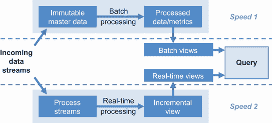

图 8.2 具有双速架构的数据基础设施

Confluent 的联合创始人兼首席执行官 Jay Kreps 将事件流描述为现代企业的中枢神经系统。他设想它是一种将不同的决策辅助 DS 能力连接成一个由事件流连接的决策过程系统的方式。由事件流连接的决策过程系统是如何随时间演变的？

事件流技术的采用通常从一个能够实现单一、可扩展、实时功能的用例开始。最初的用途可以在公司内部迅速扩展到其他应用，因为事件流可以支持多个读取者，或“订阅者”，它们可以处理、反应或响应它。每次重用都会降低额外相关用例的入门门槛。

当您致力于制定中到长期业务战略时，这种采用的良性循环允许第一个应用设置一些关键数据流，这些数据流使额外的新的应用能够加入平台并访问这些数据流。新的应用反过来又带来了它们自己的流，丰富了系统中实时信息的可用性，以便做出更多实时决策。

通过确定流如何使应用成为可能以及应用如何带来更多流，您可以绘制出一个技术路线图，在每个里程碑处平衡风险和回报，使投资对您的公司可行且值得。

案例 2：如何管理技术栈？

作为一名高管或杰出的数据科学家，您的责任还包括管理数据技术栈中的基本紧张关系。这种紧张关系存在于数据/流程的维护和新数据驱动产品特性的创建中。

数据和流程的维护

在数据组织中，我们重视数据基础设施的稳定性，因此数据丰富化、模型、分析和业务逻辑可以构建、迭代改进并维护。然而，业务线重视敏捷性，因此他们可以快速迭代产品、业务逻辑和预测模型，以应对市场条件、新的客户洞察和新业务倡议。这种紧张关系在图 8.3 中得到了体现。

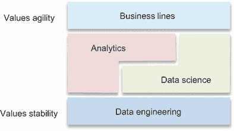

图 8.3 数据组织中敏捷性与稳定性之间的基本紧张关系

在新产品功能迭代中，紧张感最为明显，因为这可能会对现有的数据摄取和报告管道造成干扰。产品变更可能会对数据管道和用于操作现有产品的标准化指标产生严重的副作用。

| 056 | 业务线重视敏捷性，而数据工程重视稳定性。数据科学和数据分析被困在这两种竞争需求之间的紧张关系中。 |
| --- | --- |

例如，对于一个应用程序中的搜索功能，一个良好的改进可能就是引入即时搜索。这个功能允许搜索引擎在您将查询输入到搜索栏中时就开始显示搜索结果——甚至在按下搜索按钮之前。2010 年至 2017 年间，谷歌的默认搜索行为就是这种功能的版本。

虽然这样的即时搜索功能可以使搜索感觉更加响应迅速，但它也会显著增加对搜索 API 的调用次数，因为部分搜索查询被提交。该功能还可能干扰报告指标和搜索相关性校准管道。在进行 A/B 测试时，这尤其困难，因为测试组和对照组之间的搜索结果页面（SERP）加载次数和相关的点击通过率不再能表明相同的用户搜索行为。

作为解决方案，需要仔细规划和协调下游数据影响，以避免对关键操作指标和相关性模型校准造成干扰。作为数据科学执行者或杰出的数据科学家，您负责确保数据工程团队在新产品/功能开发过程中尽早得到通知。这可以让数据工程提前预见维护数据基础设施稳定性的潜在挑战。

为了保护数据基础设施的稳定性并适应敏捷的产品迭代，你可以为数据管道和模型使用分层的服务级别协议。成熟的组织维护一套执行层指标和一套生产层模型，用于公司范围内的活动。这些顶级指标和模型具有明确的数据来源，涉及的数据源和管道需要更高水平的规划和协调。然后，在较低的层级，如第 1 层和第 2 层，可以有针对特定业务线的指标和实验性模型，这些模型可以更灵活地修改以适应快速的产品迭代，同时权衡长期可靠性。你可以根据你产品所需的服务级别协议以及维护它们所承担的角色和责任来开发你自己的分层系统。图 8.4 展示了样本指标层次结构。类似的结构也可以为具有层级的模型构建，例如生产、影子运行和实验性 beta 版本。

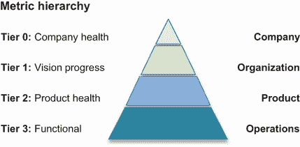

图 8.4 层次化指标在敏捷性和稳定性之间提供了清晰的权衡

在分层方法中，可以在较低的层级中原型化指标和模型，并通过提高数据源和数据管道的鲁棒性将它们提升到较高的层级。指标的拥有权也可以从产品团队转移到具有值班能力的集中运营团队。当指标和模型被修改或更新时，它们也可以从较高的层级转移到较低的层级，前提是它们在一段时间内不会那么稳定。

分层可以设定期望，并为数据科学领导者提供一个过程，以便在支持指标和模型时进行明确的投资回报率权衡，这样数据基础设施就可以根据需要具有足够的敏捷性或稳定性。

创建新的数据驱动产品功能

除去维护和功能迭代的增量迭代之外，我们还想快速开发新的智能功能以适应客户洞察。在开发新的智能能力时，你可能会面临稳定性和敏捷性之间的类似权衡。

智能能力可以是推荐引擎、反欺诈模型、客户流失减少模型等。以推荐引擎为例，你可能会收到相关请求，例如为移动应用、网站、电子邮件营销和客户服务增值提供个性化推荐。

一种选择是为每个智能产品请求构建一个单独的模型。正如你可能从第六章中记得的那样，你可能会面临在为更多利益相关者提供类似模型的更多版本或改进现有智能产品模型之间进行具有挑战性的权衡。第 6.1.1 节更详细地介绍了这一点。

作为一位执行者或杰出的数据科学家，一种处理这种权衡的方法是引导组织构建智能能力作为**中间件**。在推荐引擎的例子中，各种请求的场景可以通过对同一推荐 API 的参数化调用来实现。参数可以包括用户倾向性的个人偏好权重、用于多样性和覆盖范围的通用流行度权重，或用于优化收入的预期回报权重。您还可以使用过滤器为智能手机应用选择优化的内容，或在电子邮件活动的推荐中检查深链接的可用性。

这种中间件方法允许产品所有者灵活地调整参数和构建 A/B 测试以优化用户体验。同时，数据科学家可以专注于在市场环境和用户行为随时间漂移的情况下维护一个稳定的模型。

您可以将中间件架构应用于许多智能能力：

+   对于反欺诈模型，敏感度和召回率可以根据不同的用例进行自定义，例如自动拒绝或优先进行人工调查。您还可以调整用户风险因素和情境风险因素的各种用户版本权重，或者自定义欺诈攻击向量列表以包含在欺诈模型中。

+   对于减少流失的模型，您可以参数化季节性、续订周期和个人行为因素，以驱动特定的减少流失用例。

如图 8.3 所示，作为中间件的稳定模型集还可以为分析团队提供额外的功能和指标，以构建新的用户细分和提取新的数据洞察。它可以扩大 DS 团队的影响，同时将团队资源集中在构建稳定的智能能力上。

在决定应用中间件架构之前，务必事先了解可能存在的各种要求，并密切跟踪各种应用的扩展需求。应用可能需要不同级别的可用性和可靠性，这可能会使共享的中间件架构效率低下或不切实际。

### 8.1.2 在业务流程的各个方面实现数据驱动文化

当你，DS 执行者或杰出的数据科学家不在场时，文化决定了人们的工作方式。将组织转变为数据驱动文化是一项艰巨的任务。你不可能一夜之间安装一种文化。需要许多组织肌肉，你可以在 DS 的不同方面分阶段构建它们。

随着 DS 的发展，出现三个方面的内容。这些包括数据工程、建模和分析。*数据工程*侧重于通过基础设施投资增强对数据的信任。*建模*侧重于将智能融入业务功能和用户体验。*分析*侧重于在组织中民主化数据的使用。成功的团队需要这些技能集的各个方面。成功的数据科学家通常对这三个方面都有广泛的了解，并在子集方面有优势。

| 057 | 文化决定了当你，数据科学执行者或杰出的数据科学家，不在房间里时，人们将如何工作。文化不是一夜之间就能建立起来的。在数据工程、建模和分析的各个阶段，需要逐步建立许多组织肌肉。 |
| --- | --- |

在培养数据驱动文化时，首先识别跨越数据工程、建模和分析的当前成熟阶段是有帮助的。有了这种认识，你可以阐述差距，诊断一个方面的成熟度不足是否可能阻碍其他方面的进步，并优先考虑填补差距和推进组织的工作。让我们看看 DS 中数据工程、建模和分析能力成熟度级别的集合，并研究一些关于优先考虑建立数据驱动文化的案例研究。

DS 的数据工程方面

DS 的数据工程方面可以通过提供可信数据来赋能业务，做出关键业务决策。对数据的信任来自于聚合、处理和维护数据的安全可靠的能力。

图 8.5 展示了数据工程从收集到文化五个成熟级别，以下是详细说明：

1.  *收集*—从业务交易、用户行为、营销活动、客户服务数据、实验数据和用户生成内容等不同来源收集数据，并以原始形式存储。

1.  *ETL+存储*—原始数据被丰富、处理并以优化使用的形式存储。数据可以以结构化、非结构化和基于知识图谱的格式存储，以支持各种检索模式。模式根据业务需求进行架构和阐述。

1.  *治理*—特别关注确保数据质量，通过自动化的可用性、正确性和完整性检查。数据血缘被记录、维护和可搜索。开发数据生命周期以避免数据膨胀导致系统使用效率降低。数据一致性确保了用于做出重要决策的指标的唯一来源。

1.  *流式处理*—构建一个双速系统，包含一个用于传统记录系统的层和一个具有基于事件流能力的新的参与系统层，从而实现实时报告、警报和用户界面的实时智能。

1.  *文化*——一个值得信赖的事件流基础已经建立，作为“中枢神经系统”来支持实时业务决策流程。安全和隐私的过程和平台已经成熟。强大的数据管道由合作伙伴团队根据数据工程指南常规开发并实施。

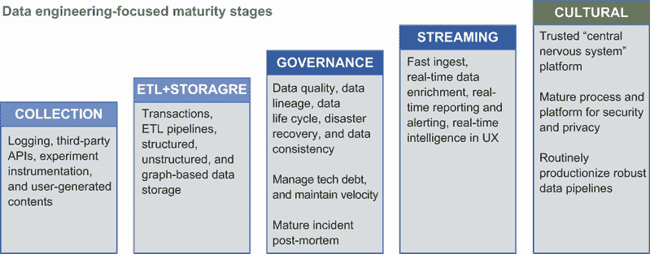

图 8.5 数据科学数据工程成熟阶段

许多组织正在运行在*ETL+存储*阶段，随着时间的推移积累的技术债务阻止了他们在数据治理方面取得成功。如果您在这里遇到困难，指标和模型的分层方法可以帮助您提高组织的成熟度，并首先关注最关键指标的治理。您可以在第 8.1.1 节中找到更多详细信息。

如果您评估您的组织已经达到*治理*阶段，恭喜您！*流式*阶段的能力为与客户互动提供了独特的机会，但也为指标和模型增加了另一层复杂性。为业务决策生成指标和模型特征的数据库查询需要重新组织，以适应具有新挑战的流数据，包括治理数据质量和一致性。特征存储和特征服务器可以解决涉及批量处理和实时处理的二速架构的复杂性。我们将在第 10.1.4 节中更详细地讨论它们。只有当合作伙伴团队能够与您高效协调，利用事件流能力创造新的商业机会，并通过适当的数据资产治理保持创新速度时，您的组织才达到*文化*阶段。

DS 的建模方面

DS 的建模方面将智能融入业务功能和用户体验。预测能力专注于产生业务结果和产生战略影响。

图 8.6 展示了建模的五个成熟级别，从构建临时模型到在业务功能和用户体验中融入智能文化。以下是每个阶段的详细信息，以帮助您识别您的组织所处的阶段：

1.  *临时*——预测能力的机遇正处于原型阶段。没有数据基础设施，因此项目必须从数据来源和清洗开始。由于在产品中实施和部署模型需要大量协调，因此生产力较低。

1.  *功能*——已经成功推出了一些用例，并取得了积极的结果。在解决方案的可靠性和与业务合作伙伴协调推出新功能方面的效率上仍存在挑战。

1.  *集成*——与业务合作伙伴协调推出新预测能力的流程是高效的。预测能力正在部署到广泛的业务功能和用户体验中。A/B 测试方法正在产品的多个层面使用，包括前端 UI 和后端算法。

1.  *治理*——预测模型自动校准，并积极监控输入以检测数据漂移。预测能力被整合到中间件中，以灵活地服务于更广泛的产品场景。A/B 测试正在每个功能发布中应用。

1.  *文化*——每个业务线和职能部门都在数据科学中捕捉机会。合作伙伴团队定期阐述和协作新的高影响用例。新的能力与数据科学的分析和数据工程方面无缝集成。

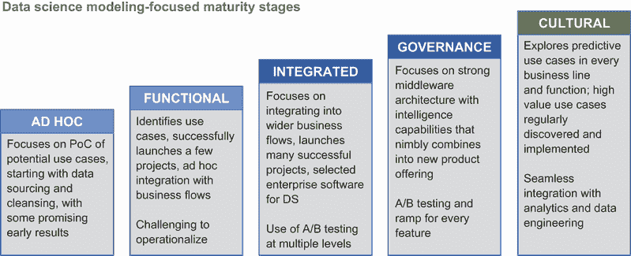

图 8.6 数据科学建模成熟度阶段

许多数据科学组织处于*临时*和*功能性*阶段。一些组织已经成熟到*集成*阶段，其中数据科学建模和预测项目常规性地进入业务流程，对基本商业模式产生重大影响。这些阶段也在第 2.3.3 节中讨论。

许多组织在实现*治理*阶段时遇到困难，该阶段的重点是建立中间件架构，如第 8.1.1 节所述，并自动监控现有模型是否不再提供预期的性能。当你知道你已经达到*文化*阶段时，合作伙伴正在提出新的用例，并协调优先级和推出功能以捕捉重大的商业影响。

数据科学的分析方面

数据科学（DS）的分析方面向业务合作伙伴提供数据驱动的最佳实践和建议。它通过展示业务洞察力和深入的数据理解来建立其权威。其最终目标是使数据科学家、合作伙伴和高级管理人员在商业决策中实现数据使用的民主化。

图 8.7 展示了建模的五个成熟度级别，从建立临时报告到创建自助数据洞察的文化。以下是每个阶段的详细信息，以帮助您识别您组织的阶段：

1.  *报告*——工作集中在回答业务合作伙伴的临时问题，提供月度和季度报告以及商业预测。团队通过被动响应业务合作伙伴的请求来提取洞察。

1.  *仪表板*——常见的请求被自动化为仪表板，这些仪表板定期刷新并主动推送给业务合作伙伴。与数据工程团队成员有很强的协调，以管理数据质量。

1.  *发现*—相关指标正在积极制定，基于数据洞察、建模和深入领域理解，主动向商业伙伴提出产品和流程的建议。与专注于建模的团队成员有很强的协调，以提高建议的质量。

1.  *治理*—记录、仪表化和数据解释的最佳实践已记录。指标和建议与产品伙伴一起跟进，以实现潜在的商业影响。与数据工程团队成员有很强的协调，以管理数据质量。

1.  *文化*—每个业务线和职能都在进行数据驱动决策。有关于概念、流程和平台的培训，以促进自助数据洞察。然后，DS 团队专注于开发最佳实践并为组织其他部分提供建议。

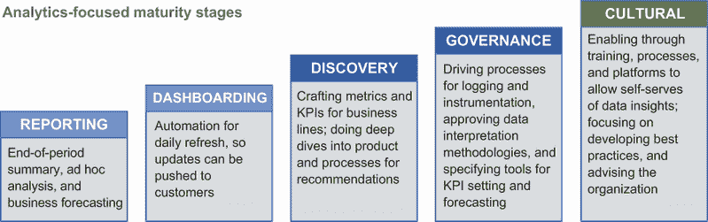

图 8.7 数据科学分析成熟度阶段

许多分析组织处于成熟的*仪表板*阶段，能够积极地将一些报告推送到组织中。然而，剩余的临时请求正在占用大量资源，阻碍了组织达到*发现*阶段，在该阶段，团队可以产生更深入的洞察，对组织产生更大的影响。第 5.3.1 节讨论了使用值班流程来减轻团队过度的临时请求负担，同时有效地优先处理最紧急和重要的请求以提供服务。

要达到*治理*阶段，团队可以识别团队中最好的人的最佳实践，并创建流程在团队内部、跨团队和组织内部制度化最佳实践。这还涉及将最佳实践自动化到平台中，以允许更多团队成员更有效地使用最佳实践。这些内容在第 6.2.1 节中详细讨论。

要达到*文化*阶段，团队可以专注于通过培训和支助整个组织生产和使用分析洞察来统一和赋权。然后，专注于分析团队可以利用其分析专业知识，结合更高级的方法，如因果推断，以提高组织辨别行动、干预或治疗如何影响业务结果以建立因果关系的能力。

同时成熟三个方面

将组织的文化转变为数据驱动型需要 DS 的数据工程、建模和分析方面的同时成熟。任何方面的不足都可能成为整个组织转型的瓶颈。在所有三个方面中，*治理*阶段是实现*文化*阶段的重要阶段，此时团队专注于开发最佳实践并为组织其他部分提供建议。

| 058 | 将组织的文化转变为数据驱动型需要数据工程、建模和数据分析方面的数据科学同时成熟。任何方面的不足都可能成为整体组织转型的瓶颈。 |
| --- | --- |

在对成熟度阶段进行概述之后，让我们看看两个案例研究，其中 DS 组织在成熟度提升方面遇到了阻碍。

案例 1：技术债务

+   *症状*—团队在生成历史数据的报告、深度分析和模型方面效率很高，但商业影响较低。虽然正在生成仪表盘和指标，但数据延迟了几天。正在开发并推出新的智能产品功能。然而，它们使用的是陈旧的数据，在生产中很脆弱。每两周就会出现数据问题，需要数据科学家进入作战室解决。随着时间的推移，团队中的大部分时间都在响应维护问题，而不是产生新的分析或新的智能功能。

+   *根本原因*—数据基础设施随着时间的推移积累了技术债务，规模变得难以管理。有成千上万的表，没有明确的模式、所有者或溯源，很难知道基础设施的哪一部分需要维护。团队每天都在努力保持基础设施的正常运行，几乎没有时间思考如何解决问题。

+   *解释*—该组织在数据工程 *ETL+存储* 成熟阶段受到技术债务的瓶颈制约。这阻碍了分析方面超越 *仪表盘* 阶段，并阻止建模方面超越 *集成* 阶段。

+   *解决方案*—你可以应用第 8.1.1 节中介绍的分层方法对指标和模型进行分类。这种方法可以帮助你将有限的资源集中在支持最有影响力的指标和模型上。这种关注涉及对一小部分指标进行协调努力，以改善数据质量、数据溯源和数据一致性。然后你可以更现实地达到合作伙伴期望的数据可靠性和可信度。

通过减少关键指标和模型管道的故障，你可以解除分析建模团队成员的阻碍，推动组织向更高成熟度级别发展。

案例 2：智能功能的采用不均衡

+   *症状*—团队为某个业务功能成功产生了智能功能带来的商业影响，但在其他业务功能的用例中无法获得 traction。已经尝试了许多次。一些实验被开发出来并成功改进了一个特定的指标，但解决方案也导致其他指标下降，使得它们无法发布。

+   *根本原因*—在提出衡量商业成功的指标方面，分析能力缺乏深度。由于没有关于与创造客户价值一致的指标的明确建议，模型无法针对正确的优化目标进行迭代，以实现可发布的改进。

+   *解释*—在 DS 建模方面的*发现*阶段缺乏成熟度正在阻碍建模方面的进一步进展。在分析*发现*阶段需要深入的领域洞察，以将建模努力超越*功能性*阶段。

+   *解决方案*—您的团队能够深入理解您的业务合作伙伴的基本关切和他们在 KPI 定义中的细微差别。这些内容在第 4.3.1 节中描述，并在表 4.1 中总结。这种深入理解使您能够产生更平衡的指标作为优化目标，将您智能特征的优化与客户业务价值对齐。您还可以基准测试和解释外部参考数据以了解优化空间，从而选择能够释放最大潜力的改进。这将在第 4.3.2 节中讨论。

### 8.1.3 构建创新和高效的数据科学组织

作为 DS 高管，您有责任构建 DS 组织以适应您公司的商业模式。在本节中，我们具体讨论 DS 组织的结构。包括功能、部门、矩阵类型和替代方案（如 holacracy）在内的整体公司结构在第 10.2 节中讨论。

根据您公司的成熟度和整体业务结构，有许多选择来构建 DS 组织。埃森哲为数据功能提出了六种组织结构类型[1]。每种类型都有其优缺点，这些优缺点在表 8.1 中总结。

表 8.1 组织结构类型及其优缺点

| 组织结构 | 描述 | 优点 | 缺点 |
| --- | --- | --- | --- |
| 功能性 | 数据科学家向特定功能报告，例如技术、财务或风险管理 |

+   对少数几个功能的清晰关注

+   随着时间的推移，可以建立对特定功能的深入理解

|

+   对整体公司倡议和背景的影响有限

+   招聘过程中的严格面试挑战

+   没有 DS 经理来指导职业成长和最佳实践

|

| 分散式 | 数据科学家分布在业务单元和功能中，向各自的非 DS 领导者报告 |
| --- | --- |

+   资源分配明确

+   适应临时请求的灵活性

+   可以建立对业务单元或功能的深入理解

|

+   努力被孤立，存在重复，分散的报告和缺乏标准化

+   在功能/业务单元之间效率低下且没有优先级

+   招聘过程中的严格面试挑战

+   职业路径管理不明确；最佳实践改进不多

|

| 咨询 | 数据科学家集中并针对业务单元或职能的具体项目进行临时咨询 |
| --- | --- |

+   资源分配灵活

+   适用于从小型到中型 DS 项目

+   DS 领导层管理最佳实践和职业发展

|

+   依赖职能或产品负责人进行请求

+   长期项目，如数据质量改进，难以获得资金

+   在产品构建和决策方面投入较少

|

| 集中式 | 数据科学家集中在一个职能中，并基于企业级优先级进行长期项目工作 |
| --- | --- |

+   可以与职能和业务领导者合作进行优先级排序

+   能够更快地扩展并资助基础工作，例如提高数据质量

+   适合职业发展和最佳实践分享

|

+   项目可能会随着时间的推移而失去与业务线的联系

+   优先级确定的成本较高

+   一些业务线或职能可能会间歇性地收到 DS 资源，使得特征开发变得困难

|

| 优秀中心 | 数据科学家致力于业务单元和职能；活动由一个中央实体协调 |
| --- | --- |

+   集中式协调可以协调联合倡议

+   嵌入式团队维护领域知识

+   适合职业发展和最佳实践分享

|

+   没有集中式团队在从事企业级项目

+   维护成本高昂，因为业务线和职能的需求可能会随时间变化，团队可能会人手不足或过剩

|

| 联邦式 | 大多数数据科学家致力于业务单元和职能；一些是集中的，并战略性地部署到企业级倡议 |
| --- | --- |

+   集中式团队可以优先考虑公司倡议

+   嵌入式团队维护领域知识

+   适合职业发展和最佳实践分享

| 集中式和嵌入式团队之间的项目所有权可能会导致紧张 |
| --- |

如何在公司发展的各个阶段选择最合适的结构？让我们看看这些结构在组织中的出现方式以及如何演变它们：

+   *职能结构*—在具有远见卓识的职能领导者雇佣几位数据科学家的情况下，公司中通常会涌现出智能数据用例。这种场景自然地导致了职能结构，其中数据科学家向业务线或职能领导者汇报。职能结构允许随着时间的推移发展对职能或业务线的深入理解。然而，影响范围仅限于公司的一部分，并且受到业务线或职能领导者招聘具有正确技能集的数据科学家的能力的瓶颈。为数据科学家指定正确项目、指导其职业发展和改进最佳实践也可能是一个挑战。在这种结构中，职能领导者可以参考第二章和第三章中讨论的能力和美德来招聘和培养他们团队中的强大 DS 项目领导者。

+   *分散式结构*—在某个团队利用 DS 产生业务影响取得一些成功之后，其他团队也可能开始雇佣数据科学家。这种情况导致了一种分散式结构，其中不同的业务线和职能拥有各自独立的数据科学（DS）团队。虽然这种结构为每个业务线或职能提供了专用资源，但孤岛化的努力可能导致重复工作、报告中的指标不一致以及缺乏流程标准化。在分散式结构中，数据科学家的职业路径也不明确，这可能会增加人员流失的风险。虽然业务线或职能领导者可以根据第二章和第三章中讨论的能力和美德在其团队中雇佣或培养强大的 DS 项目领导者，但这并没有从根本上解决工作重复的问题。

+   *咨询式结构*—尽管许多 DS 工作采用自下而上的方法，如上所述，但一些公司也选择通过创建一个为各种业务线和职能提供咨询的集中式 DS 功能来自上而下地部署 DS 能力。这种方法创造了咨询式结构，其中 DS 能力集中化，可以高效地部署到任何业务线或职能。通过专门的 DS 领导，最佳实践和职业成长可以得到更好的管理。

    然而，这种结构在很大程度上依赖于职能或产品领导者来指定请求。在每项项目中传达业务背景存在显著的开销。可能会有一个长期的项目积压，当项目最终被优先排序时，结果可能不再相关。因此，成功的项目通常专注于回答具体问题，以获得短期到中期的胜利。长期项目，如数据质量改进，难以获得资金和优先排序。

+   *集中式结构*—拥有能够与职能和业务领导者协作以优先排序和协调项目的强大数据科学（DS）领导者，我们可以将 DS 组织转变为集中式结构。在这种结构中，业务线和职能由一个中央团队提供服务，该团队拥有可用于企业级项目和基础工作的资源，例如提高数据质量。集中式团队还可以更快地扩展，共享最佳实践，并为团队成员提供更清晰的职业成长机会。

    然而，随着公司整体优先级的转变，许多业务线和职能可能无法从集中式组织获得一致的支持来建立长期的知识体系。为哪些业务线或职能在每季度获得 DS 资源进行优先排序的开销可能很大。如果没有某种形式的专用资源，随着数据科学家随着时间的推移在业务线之间转换，集中式 DS 团队可能会失去对特定领域细微差别的了解。

+   *卓越中心结构*—为了解决集中式结构的不足，数据科学家可以专门服务于业务单元和功能，同时一个中央实体协调他们的活动。这种卓越中心结构允许对联合项目的集中协调，同时业务线和功能获得稳定的资源以创建和维护关键领域知识。集中协调还提供了职业成长和最佳实践分享的机会，这可以提高人才保留。

    然而，这种结构维护成本高昂。业务线和功能的数据科学需求可能会随着产品或业务周期而变化。团队在任何特定时间点可能人员不足或过剩。此外，没有资源用于企业级项目。

+   *联邦结构*—为了更有效地利用数据科学（DS）资源，一些数据科学家可以专门服务于业务单元和功能，而其他人则作为集中式团队运作。这种设置导致了联邦结构，其中专门服务于业务单元和功能的科学家可以维护领域知识。集中式团队可以战略性地部署以应对企业级项目，改进共享的技术堆栈，或在需要时支持特定的业务单元和功能。这种结构还提供了职业成长和最佳实践分享的机会，这有助于人才保留。

    在联邦结构下运作时，数据科学领导者应敏感于中央和嵌入式团队之间项目所有权模糊的情况。当集中式团队被部署与嵌入式团队协作时，应有明确的职责和交接点，以最大限度地减少混淆和紧张。

组织结构的演变

对于从一到两个数据科学家起步的早期公司，功能或分布式结构可以很好地工作。这些结构在特定的业务线和功能内提供了明确的焦点，以产生早期胜利并为数据科学（DS）的额外投资建立势头。

随着更多业务线或功能调查建立数据科学（DS）能力的机会，重组为集中式结构可以允许利用资源来成熟数据基础。在两个到四个业务线和不到 10 个数据科学家的情况下，优先级开销仍然可控。

随着更多业务线纳入数据科学（DS）能力，跨业务线的规划和资源平衡可能开始产生显著的开销。你可以将团队重组为联邦结构以降低优先级开销。与每个业务线和功能合作的数据科学家可以继续专注于积累领域专业知识。集中式团队可以继续完善技术堆栈，并在需要时支持特定的业务线和功能。

当成熟的企业将 DS 融入其产品和业务流程时，卓越中心结构也可以很好地工作。它可以允许数据科学家与业务线和职能紧密合作，创建证明概念项目，同时提供关于数据基础设施差距和成熟数据能力需求的反馈。

一旦概念验证项目成功，DS 职能被公司全面接受，重组为联邦结构可以提高 DS 的整体效率，并允许企业级倡议被优先考虑和执行。

组织和重组以提高效率

作为 DS 高管，您还有责任构建 DS 组织以适应您的公司商业模式。在我们分享的六个组织结构中，没有一种适合所有人的最佳组织结构。选择有效的结构需要考虑您组织的规模和文化、您的领导风格、您团队上的人才、您吸引额外人才的能力以及您希望围绕他们创造的文化。

随着您的 DS 职能的增长，将其重组为不同的结构可以提高 DS 职能的效率。虽然您可以通过额外的沟通努力克服任何一种结构的缺点，但选择适当的结构可以简化协调、提高人才保留，并帮助该职能更容易地与市场上可用的人才一起扩展。例如，如果您只能吸引初级 DS 人才，集中式结构可以帮助您更好地控制交付质量。如果您可以吸引高级人才到您的团队，您可以通过联邦或分布式团队结构为他们提供更多的领导机会。

## 8.2 执行：最佳实践

在 DS 中推动执行，DS 高管可以将数据和预测智能能力融入公司的愿景和使命，为该职能建立强大的人才品牌，并审查和沟通如何使倡议和团队随着时间的推移而定位成功。与第 6.2 节中讨论的总监级日常关注业务目标相比，这些是不同的责任。

*跨职能协调*对于许多 DS 项目的成功执行至关重要。将数据和预测智能能力融入您的公司愿景和使命可以为您的 DS 团队提供执行命令和影响力，以与跨职能协调中的合作伙伴对齐优先级。

| 059 | 将数据和预测智能能力融入您的公司愿景和使命可以为您的数据科学团队提供执行命令和影响力，以与跨职能协调中的合作伙伴对齐优先级。 |
| --- | --- |

在一家成功的公司中，经常会有对扩大高质量数据科学家团队的需求，以执行越来越多的数据驱动型项目。选择地点建立 DS 团队、打造卓越的人才品牌以及培养团队中已有的人才，是吸引和留住顶尖人才的关键杠杆。

在组织建设的不同阶段，与同事和团队透明地反思和沟通你在敏捷团队中扮演的角色通常是有帮助的。你有时可能作为战略家工作，在其他时候作为导师或顾问，还有其他时候作为协调者，这可能会让不熟悉你职责的团队和合作伙伴感到困惑。这些都是你可以在顺境和逆境中与团队和合作伙伴建立信任的角色。现在让我们深入了解作为数据科学执行者或杰出的数据科学家，如何妥善处理执行关注点。

### 8.2.1 将数据科学能力融入愿景和使命

当公司人数超过 100 到 200 人时，对于高管来说，与每位员工沟通和使公司的方向与每位员工保持一致可能变得越来越具有挑战性。一个明确的愿景和使命可以引导团队成员走上推动公司前进的道路。

2.3.1 节讨论了 DS 技术领导如何阐明他们对公司愿景和使命的理解，以便在深入之前了解他们项目的目的。本节讨论了在高管层面制定这一愿景和使命。

*愿景*是组织期望的未来位置。它是梦想，是一个团队的真正北极星，其主要目标是激励并在整个公司中创造一种共同的目标感。愿景在变革时期提供了一种稳定感。对于寻找可重复和可扩展商业模式的初创公司，数据科学执行者通常必须促进一次艰难的商业转型，埃里克·里斯将其定义为“战略上的变化，而不改变愿景” [2]。在成熟的公司中，数据科学执行者必须通过改变商业策略来注意、观察和适应商业环境的变化，同时保持愿景的一致性。

*使命*定义了公司的业务、目标和实现这些目标的方法。它是组织应具备的总体目标，应该是可衡量的、可实现的，理想情况下是鼓舞人心的。它不应与愿景声明同义使用。每隔几年，随着公司的发展和商业环境的转变，其使命声明需要重新定义以适应。你如何开始将数据科学和预测智能能力融入公司的愿景和使命中？

融入数据和预测智能能力

你加入或共同创立的一些公司可能还没有明确的愿景或使命。这是一个机会，与高管们合作，在定义公司愿景和使命声明时注入数据和智能能力。这样做为 DS 团队提供了授权和影响力，以与合作伙伴对齐，推动关键的数据驱动型高管倡议。

ProjectManager.com 的产品副总裁 Stephanie Ray 分享了成功愿景声明的八个特征[3]：

+   *简洁明了*。愿景声明应该是简单、易于阅读、记忆和准确重复的。

+   *清晰明确*。有一个明确的目标，这样更容易集中精力并实现。

+   *设定一个时间范围*。确定一个未来时刻，那时你将实现你的愿景。

+   *面向未来*。愿景是公司计划在未来达到的目标。

+   *稳定性*。愿景是一个长期目标，不受市场或技术变化的影响。

+   *具有挑战性*。愿景不应该轻易实现，但也应该不是不切实际而被忽视的。

+   *抽象化*。愿景应该足够概括，以吸引兴趣和战略方向。

+   *鼓舞人心*。愿景应该能够鼓舞团队，并成为所有相关人员的渴望目标。

一个伟大的使命声明能够如此精确地定义一家企业，以至于它可以读作战略。根据麦克马斯特大学战略和治理教授 Chris Bart 的说法，使命声明中应包括三个组成部分[4]：

+   *关键市场*——目标受众

+   *贡献*——产品或服务

+   *区分*——是什么使一个产品独一无二，或者为什么你应该选择它而不是另一个

在公司的愿景和使命声明中注入数据和智能能力并不意味着在文本中包含数据或智能能力。虽然愿景声明通常是行业特定的，但在愿景和使命声明中可以包含一些关键词，这些关键词可以自然地扩展到数据和智能能力。表 8.2 中介绍了一些示例关键词。“Every”例如，意味着某种形式的人工智能个性化。“Trust”意味着提供可靠信息、智能风险评估和防止欺诈的服务提供商。

表 8.2 将要纳入公司愿景和使命声明的示例关键词

| 关键词 | 示例 |
| --- | --- |
| Every | 领英的愿景——为全球劳动力中的每一位成员创造经济机会。 |
| 耐克愿景——为世界上的每一位运动员带来灵感和创新。 |
| 信任 | 蚂蚁集团（阿里巴巴的金融科技部门）的愿景——将信任转化为财富。密歇根蓝十字蓝盾保险公司的使命——我们承诺通过提供负担得起、创新的产品来改善我们的会员护理和健康，成为他们值得信赖的合作伙伴。 |

如果你的公司已经形成了愿景和使命声明？如果愿景和使命声明中融入了数据或情报能力，恭喜！你的 DS 功能处于良好的状态，可以利用它们与合作伙伴对齐。

假设公司的愿景和使命声明尚未融入数据或情报能力。在这种情况下，你可以通过创建 DS 使命将 DS 能力与公司使命对齐。一个精心制定的 DS 使命带来三个好处：

+   它使 DS 团队日常的工作更接近公司的使命，这样数据科学家可以更容易地了解他们是如何做出贡献的。

+   它使合作伙伴能够通过 DS 使命更好地理解与 DS 协作的重要性，以推动公司使命。

+   它可以通过展示 DS 作为公司成功的关键利益相关者来吸引人才。我们将在第 8.2.2 节中进一步讨论。

例如，Acorns 的使命是：“以仁慈和勇气，我们照顾那些即将崛起的人的财务利益，从赋予他们力量的微投资步骤开始。”这个使命被精炼为 DS 功能的使命：“为‘我’打造 Acorns，使选择变得简单、及时和个性化。”精炼后的 DS 使命专注于个性化客户的财务选择，这样客户就可以利用 Acorns 的微投资机会。

制定愿景和使命的最佳实践

制定公司或职能的愿景和使命的目的是清晰、简洁地传达管理层的方向。你组建的团队来制定愿景和使命应该符合这一目的。

当制定公司愿景和使命时，应让执行团队出席。每位团队成员都可以就叙事提供自己的观点，并提供关于不同职能如何解释公司愿景和使命的反馈。

DS 团队可以从主题角度出发，通过细化其目标和方法来制定自己的使命。它可以继承公司的愿景，为公司的未来提供一个一致期望的位置。

对于制定 DS 使命，DS 团队中应有一组八到十位领导者出席。职能的使命声明可以从不同的视角中受益，但人数过多会使积极参与变得不那么有效。

制定公司愿景和使命或 DS 使命的一个模板可以包括一个六步过程，前三个步骤集中在一次制定会议上。这如图 8.8 所示。

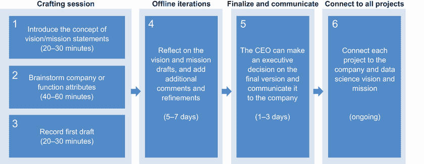

图 8.8 制定 DS 愿景的六个步骤

六个步骤是：

1.  *介绍愿景/使命声明的概念*（20-30 分钟）。您可以分享愿景和使命的定义，包括成功标准和示例，以指导团队学习评估哪些因素使愿景和使命声明伟大。您可以使用本书本节中的材料作为起点。这一步的输出是最终使命声明的一组属性。

1.  *头脑风暴公司或职能属性*（40-60 分钟）。遵循标准的拓宽-缩小-优先级排序的头脑风暴过程，您首先可以通过允许团队生成至少涵盖以下内容的使命关键词来拓宽概念视野：

    +   市场上的需求或欲望

    +   业务为顾客做了什么

    +   业务为员工做了什么

    您可以将类似的概念聚类在一起，形成主题，并扩展和深化这些主题。然后，团队可以对最重要的主题进行投票，以确定愿景和使命的焦点。这是第一步中的成功标准可以用作选择标准的地方。第二步的输出是一组优先级排序的概念和关键词，愿景和使命应该考虑这些。

1.  *记录初稿*（20-30 分钟）。团队可以尝试制作愿景和使命的初稿，讨论他们的思考过程，并将他们的草稿与团队在第一步中指定的属性进行比较。尝试被记录并在团队内部共享以供审查。第三步的输出是一份包含愿景和使命声明各种草稿的共享文档。

1.  *离线迭代跟进*（5-7 天）。在接下来的一个星期里，团队可以反思愿景和使命草稿，并添加额外的评论和改进。您可以从不在构思会议中的公司选定成员那里收集额外的反馈。第四步的输出是愿景和使命草稿的额外改进和评论。

1.  *最终确定并传达*（1-3 天）。随着愿景和使命草稿的进一步细化，首席执行官可以就最终版本做出决策，并将其传达给公司。第五步的输出是公司范围内的愿景和使命声明公告。

1.  *将每个团队优先级项目与之关联*（持续进行）。许多人忽视了项目与公司愿景和使命的持续评估。当项目成功与使命和愿景声明关联时，公司的每个成员都可以更简洁地了解他们的日常工作如何有助于公司。

此模板已在公共和私营公司中成功应用。您可以根据自己的具体情况和组织进行调整和适应。

总结来说，公司或 DS 职能精心制定的愿景和使命可以为团队成员奠定基础，了解他们的日常执行如何推动公司向前发展。当愿景和使命融入数据和预测智能能力时，它们可以为 DS 职能提供与合作伙伴对齐以推动重要数据驱动型执行计划的授权和影响力。

### 8.2.2 在数据科学中建立强大的人才库

在明确了清晰的战略愿景和使命之后，挑战在于在数据科学（DS）领域建立一个强大的人才库，以根据使命执行愿景。人才库是你组织潜在候选人的集合。它主要受所需技能集和人才需求地点的限制。它还可能受公司使命的吸引力和公司能够承担的薪酬水平的限制。

如果你组织中有数据科学领域的开放职位，你很可能已经体验到了 DS 领域实践者的人才缺口。很可能你的团队所需的合格人才会有多个工作机会。根据 Indeed 招聘实验室的经济学家安德鲁·弗劳尔斯的说法，从 2018 年到 2019 年，Indeed 上数据科学家的职位发布增加了 31%，而职位搜索仅增加了 14% [5]。

凯瑟琳，数据科学执行（来自第一章，案例 7），在她的工作中经历了这个挑战，团队的增长速度比公司其他部门慢，导致团队陷入维持现状的项目中，而不是花时间在战略项目上。结果是灾难性的。表现优异的团队成员离开了公司，在其他地方承担了更具战略性的角色。

在日益竞争激烈的人才市场中，你如何为你的组织建立一个强大的人才库？你可以考虑三个管理层级的执行策略：组织层面、职能层面和团队层面。图 8.9 展示了这三个层级。让我们逐一看看它们。

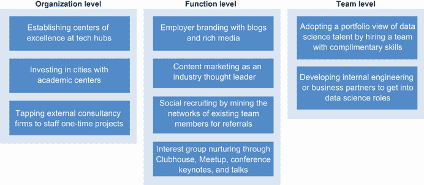

图 8.9 建立强大人才库的三个管理层级

在组织层面进行建设

对于能够去人才集中的地方的大型组织，世界上有许多地方的数据科学人才库正在快速发展。你可以考虑两种类型的投资：在技术中心建立数据科学卓越中心，以及投资学术中心以追踪人才。

对于不在技术中心的公司，当地的人才库可能有限。例如，欧文是加利福尼亚州洛杉矶以南 40 英里（约 60 公里）的一个充满活力的城市。截至 2020 年，欧文的数据科学家可及人才库限制在 200 到 300 人，这比像 PayPal 这样的单一公司的 DS 职能还要小。

希望扩大其数据科学人才库的公司可以参考人才市场数据，例如 LinkedIn 的人才洞察工具，以评估他们希望吸引的人才类型的可用性和竞争力。截至 2020 年，美国的顶级技术中心包括旧金山、纽约市和波士顿；在印度，它们包括班加罗尔、德里和海得拉巴；在中国，它们包括北京、上海和深圳；在欧洲，它们包括伦敦和巴黎。

对于希望捕捉未来人才流动的公司，可以考虑投资于新兴人才中心，这些中心正在大学中增加和扩展人工智能和数据科学项目。这些城市包括多伦多、蒙特利尔、亚特兰大和匹兹堡。像路易斯维尔这样的小城市也被微软等公司利用，从路易斯维尔大学招募人才，从事人工智能、数据科学和物联网（IoT）[6]工作。在人才中心建立专用据点并投资于学术中心可以与其他技术和产品职能协调一致，以分摊建立中心的运营成本。

为了配备大规模的一次性项目，您可以利用外部咨询公司作为人才来源。对于跨项目频繁重复的过程，您可以投资于构建工具以降低数据科学家完成其职责所需的专长，从而扩大您可以从中选择人才的人才库。

在职能层面进行建设

您可以通过使用多种技术，在数据科学职能层面建立一个人才库。使用不同的技术，您可以建立一个具有最广泛覆盖范围或最具特定影响的人才库，包括雇主品牌建设、内容营销、社交媒体招聘和挖掘特殊兴趣群体：

+   *雇主品牌建设*—将数据和分析智能能力作为核心竞争力融入公司愿景和使命，是雇主品牌建设的重要组成部分。这展示了数据科学部门作为公司成功的关键利益相关者。这一点在 8.2.1 节中进行了讨论。通过博客或丰富媒体讲述这个故事可以激发候选人的热情，并与您的愿景和使命的独特品牌定位保持一致。您可以在 LinkedIn 和 Glassdoor 等相关的内容平台上发布这个故事。当候选人研究您的公司时，他们会找到这个故事，并意识到在您的公司从事数据科学工作的影响可能有多大。

+   *内容营销*—作为您所在领域和行业的思想领袖，内容营销是构建数据科学人才库的一种更具体的方法。您可以在播客中露面，撰写技术博客或撰写书籍。主题包括介绍您正在进行的旨在吸引行业内人才的项目，或向希望进入您所在行业的 DS 人才介绍行业的特殊性。

    在播客上接受采访可以是一种快速接触受众的方式。播客通常时长为 30 到 45 分钟，通常是从一个小时的采访中剪辑出来的。一旦发布，它们可以在公司博客中引用或链接到您的领英个人资料，这可以为未来的营销带来价值。播客的挑战在于选择加入哪个播客。全球有超过 150 万个播客，其中大约有 500 个播客专门讨论 DS 主题。每个播客都影响着一个特定的受众群体，这些受众选择订阅它。而这个受众群体可能正是您想要接触以建立人才库的群体。您可以通过查看类别、主题、主持人姓名、往期嘉宾名单，以及向主持人提出感兴趣的话题进行讨论，来找到拥有您所需受众的播客。关于如何在播客上成为成功嘉宾的最佳实践，Tyler Basu 有一本名为“如何在您所在行业的顶级播客上接受采访”的优秀指南[7]。

    技术博客可以是一个展示您 DS 团队现有人才的好方法。Airbnb、Netflix、Google 和 Stitch Fix 等公司都有强调通过分享知识和甚至开源可以提高从业者生产力的工具的 DS 文化。当主题相关且有用时，博客可以成为数据科学家了解您公司的绝佳途径，其中一些人可能会选择成为您人才库的一部分。然而，当主题故意具有争议性时，它们可能会跨越道德界限并损害您的人才品牌。第 3.1.1 节提到了两个案例：“Uberdata：荣耀之旅”博客[8]来自 Uber，以及“我们在人类身上进行实验！”博客[9]来自 OkCupid。作为数据科学主管，在发布关于敏感主题的博客之前，阐明指南和审查流程是您的责任。

    | 060 | 博客中的不敏感叙述可能会损害公司的社会形象。数据科学主管在发布关于敏感主题的数据科学博客之前，负责阐明指南和审查流程。 |
    | --- | --- |

    发布技术书籍是另一种在数据科学（DS）中推广公司思想领导力的方式。LinkedIn、Google、Airbnb、Databricks 和 Cloudera 等公司的数据科学领导者已经与领先出版商合作，出版了关于数据架构、实验和开源工具等主题的技术书籍。拥有这些作者在您的团队中可以非常强大，吸引那些重视从他们领域顶级专家那里学习的人才。

+   *社交招聘*——社交招聘利用社交关系来发现优秀候选人，吸引他们加入您的团队。有两种主要技术可以扩展您的社交范围：通过整个团队的社会网络，以及通过大学关系。

    您可以通过邀请公司所有员工在他们的社交媒体上发布 DS 职位空缺以及联系过去的同事来查看与您团队的机会，来挖掘团队的社会网络。这一点在第 6.2.2 节中有所讨论。通过推荐介绍来的候选人通常有最高的转化为员工的转化率。

    许多 DS 领导者也活跃在校友网络中，甚至在大学项目中教授与他们领域相关的课程。大学关系可以每年为实习和初级职位提供稳定的新鲜人才来源。例如，作者 Jike Chong 与加州大学伯克利分校的关系使他能够在那个夏天从伯克利雇佣多名实习生。他能够将实习生重新雇佣为全职员工。其中一名实习生甚至说服了一名同学全职加入。他们都成为了他团队的高效成员。

+   *兴趣小组培养*—具有强烈学习和成长动机的人才通常活跃在行业兴趣小组中。您可以通过 Clubhouse、Meetup、会议主题演讲、讲座和圆桌讨论等方式与这部分人才库建立联系。

    您可以在您所在地区发表演讲、主持或甚至组织一个 Meetup 活动，让您的行业或职能领域的人才聚集在一起，互相认识。通过定期的月度 Meetup 活动，您可以快速在当地建立人才品牌，这样当人才决定探索他们职业生涯的下一步时，您的公司就会首先出现在他们的脑海中。

    在会议上发表演讲是您的团队成员在行业中建立身份的绝佳机会。这些机会可以激励团队成员的工作严谨性，也可以吸引那些希望在您的公司做到他们职业生涯中最出色工作的人才。

    会议出场的缺点是，除非出场是持续的，否则很难保持您的公司在人们心中的印象。邀请观众查看公司的博客、播客和书籍可以使影响更加持久。

雇主品牌、内容营销、社交招聘和兴趣小组可以有效地扩大您的覆盖范围，并允许您与人才库建立更深入的联系。当人才及其朋友考虑他们职业生涯的下一步时，他们可能会更愿意考虑您公司及其团队的机会。

在团队层面建设

要找到恰好具备完成业务目标所需经验组合的人才往往很困难，甚至不可能。您能做些什么来增加能够满足您业务需求的人才库？

您可以采用考虑数据科学家潜力的数据科学人才组合视图。与其等待三到四个月来找到一支拥有所有所需技能的个体人才团队，您可能可以考虑在一到两个月内雇佣一支具有互补技能集的数据科学家团队。在这种情况下，您是在招聘潜力。您可以为他们创建项目，让他们在完成工作所需技能方面相互交叉培训。这种组合视图可以显著增加您可以评估的人才库，但前提是您需要有效地评估候选人在工作中掌握缺失技能的潜力。

| 061 | 您可以采用考虑数据科学家潜力的数据科学人才组合视图。您可能可以雇佣一支具有互补技能集的数据科学家团队，并为他们在完成工作所需技能方面相互交叉培训的项目。 |
| --- | --- |

您的人才库不仅限于公司外部。当前工程师和商业伙伴可以参加数据科学课程，并进入数据科学角色。内部候选人可以带来现有的领域专业知识和来自不同职能的视角，从而丰富数据科学团队的构成。

您还可以使用自动化平台来民主化数据科学最佳实践，这样数据驱动的决策就可以超越一小队高度专业化的博士团队，并减少招聘人员和经理在人才获取方面的挑战。这一点在 6.2.1 节中有所讨论。

作为主要责任建立强大的人才库

在数据科学中建立一个强大的人才库是数据科学执行者的主要责任。您可以通过在技术中心和学术中心开设新站点来招募人才，从而在组织层面挖掘人才库。您可以通过雇主品牌、内容营销、社交招聘和兴趣小组培养来在职能层面扩展人才库。您还可以通过从技能集要求的角度进行组合视图，并开发自动化平台来民主化数据科学，从而在团队层面扩大人才库。通过挖掘、扩展和扩大您的人才库，您可以为主组织的增长做好准备。

当第一章中的凯瑟琳能够在组织层面、职能层面和团队层面实践这些技术时，她就可以开始为她所在的组织建立一个强大的人才库。

### 8.2.3 明确您的作曲家或指挥角色

数据战略的执行有时被比作一场表演交响乐。在交响乐中，许多部分一起演奏，以实现作曲家的意图，这是由指挥家解释的。当交响乐以精确和同步的方式产生时，即使不熟悉生产过程的人也能欣赏结果。当作品制作得不好时，结果可能是一个痛苦的不协调的嘈杂声。

作为数据科学高管，你拥有各种工具来准备执行。你可以指定数据的中长期业务战略，在业务流程的所有方面创建和推动数据驱动文化，并根据业务需求构建数据科学组织。

在执行业务战略时，你是在与公司的愿景和使命保持一致，并准备一个人才库以执行。在这个过程中，你扮演什么角色？你如何向你的老板、CEO、同事和团队解释你所做的事情？

当公司在生产和复制组织内的数据科学影响时遇到瓶颈，他们通常会意识到需要一个高管来领导数据科学。根据公司的成熟阶段和职能，你的角色可能会有很大的不同。

初级阶段：作曲者角色

当公司还没有一个连贯的数据战略时，数据科学高管的首要角色类似于交响乐中的作曲家。在这个角色中，你了解业务倡议和文化背景。你还制定并协调产品、数据科学、分析和工程等合作伙伴团队之间的数据战略。这个过程就像通过创建一系列多个乐章来创作交响乐，为合作的乐器部门，如弦乐、木管、铜管和打击乐，分配旋律来表达主题或角色。

当作曲者角色没有得到履行时会发生什么？在创作音乐时，如果表演者的期望和目标从乐谱中不清楚，表演者将开始即兴创作以尝试达到良好的效果。有时，如果你很幸运，你可能会得到一些合理的旋律。然而，表演质量将不会一致，特别是当具有不同解释的表演者创作出的旋律组合在一起可能听起来不协调时。

在领导数据科学时，如果期望和目标不明确，产品、数据科学、分析和工程之间的合作通常是即兴的，直到临时协调不再足够。当产生数据没有必要的属性用于指标或模型时，不协调性就会出现；产生的指标不能驱动决策，创建的模型不能驱动智能功能。

| 062 | 在领导数据科学时，如果期望和目标不明确，产品、数据科学、分析和工程之间的合作通常是即兴的，直到临时协调不再足够。然后，不协调性开始无处不在地显现出来。 |
| --- | --- |

当数据项目在数据分析、建模、数据工程、产品和工程团队之间明确阐述时，你可以预期公司在成熟数据科学能力方面的稳步进步。

成熟阶段：指挥者角色

在 45 岁时，担任了 20 年指挥的本杰明·赞德突然意识到，交响乐团的指挥并不发出声音。他们依赖的是他们使他人变得强大的能力。作为一名 DS 执行，执行中的期望是协调合作伙伴团队共同产生强大的数据和情报能力，同时赋能每个职能在为业务成果做出贡献方面取得成功。

领导 DS 和演奏交响乐之间有许多类似的挑战，包括视角挑战、表现挑战和指挥挑战：

+   *视角挑战*——交响乐团中的每位表演者都坐在特定的区域，并会听到不同的交响乐版本。每个数据倡议的合作伙伴团队对项目的看法将不同。作为 DS 执行者，当你意识到你的数据战略的替代看法时，你可以协调团队和合作伙伴，以便职能和业务线偏见不会破坏整体数据战略。

+   *表现挑战*——在交响乐中，当一位表演者以不匹配的音调演奏时，其他人可能会觉得非常分散注意力。这可能导致混乱，滋生自我怀疑。其他表演者可能会想，“我是不是演奏错了？为了保持团队的和谐，即使我知道他们演奏不正确，我应该适应不匹配的音调吗？”

    在 DS 项目中，当内部问题出现且 DS 执行者没有迅速解决时，合作伙伴团队之间可能会积累不信任和紧张情绪，这会破坏合作。

    就像指挥在交响乐中解决情况一样，通过感知问题，进行眼神交流，并在违规的团队成员身上“挥动指挥棒”，你可以防止团队之间产生任何紧张情绪，并解决问题以保持信任。第 6.2.1 节讨论了你可以用来感知任何微妙紧张情绪的技术，诊断根本原因，并在它们破坏团队之间的信任之前将其平息。

+   *指挥挑战*——在交响乐中，当指挥只关注音乐，而不关注音乐家时，音乐家可能会感到与指挥脱节，因为指挥只是为了个人的享受而指挥。

    在 DS 项目中，当 DS 执行者只关心技术成就和业务成果，而不关心团队的发展时，团队成员可能会感到被剥夺了权利。

有效的指挥者会激发每位音乐家眼中的激情和火花，赋予他们最好的表演。有效的 DS 执行者会促进职能能力的增长，培养团队的职业成就，从而使公司能够建立起成熟度，持续产生行业启发的成果。

| 063 | 数据科学领域的执行人员通常负责提升功能的能力和培养团队的职业成就，从而使公司能够建立起成熟度，产生令人鼓舞的行业成果。 |
| --- | --- |

总结来说，你可以用作曲家和指挥家的类比来解释你在不同数据策略和功能成熟的不同阶段所承担的角色，这样你的首席执行官、同事和团队就能理解并支持你的行动。

## 8.3 专家知识：深入领域理解

专家知识赋予领导数据科学的执行人员和杰出的数据科学家超越技术领导，开始创造能够激励行业的创新。对行业领域的深入理解使公司能够利用数据科学突破传统行业限制，改变客户体验并释放新的经济潜力。

我们之前见证了技术如何改变行业。电子商务改变了零售行业。共享出行模式改变了交通行业。短期家庭租赁模式改变了酒店行业。一对一在线学习和辅导服务正在改变教育行业。推动这些变革成功的共同线索是在双边市场中聚集用户和创建关键算法以生成信任以促进交易。基于数据和算法的类似变革今天仍在继续，波及到零售银行、数字健康、家庭护理和物流行业。

捕捉这些新的机遇需要深入了解行业痛点、可行的长期商业模式以及专注的数据科学执行。对于正在转型行业的执行人员和杰出的数据科学家来说，有三种常见的工具可供使用：

+   在行业同行中识别差异化和竞争力

+   引导业务进行转型

+   阐述新数据驱动服务或产品的商业计划

让我们逐一探索这些工具。

### 8.3.1 在行业同行中识别差异化和竞争力

用数据科学激励一个行业需要的不只是营销活动中充满噱头的定位和 buzz words。数据科学执行者或杰出的数据科学家负责创造真正的价值，使他们的公司服务与竞争对手区分开来。图 8.10 展示了六个主要维度，你可以根据你的行业格局使用数据科学来产生差异化。

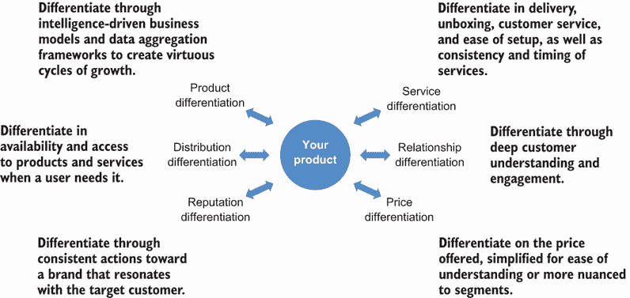

图 8.10 使用数据科学区分产品的六个维度

六个维度包括：

1.  *产品差异化*—通过智能驱动的商业模式和数据聚合框架在关键特性上进行差异化，以创造增长的正向循环。这种差异化可能具有有限的生命周期，因为随着时间的推移，竞争对手可以复制其优势。

1.  *服务差异化*—在交付、开箱、客户服务、设置简便性、一致性和服务时间上的差异化，可以使产品或服务对客户具有粘性。

1.  *分销差异化*—在用户需要时产品和服务可用性和访问性的差异化，这在市场碎片化的情况下尤为重要。

1.  *关系差异化*—通过深入理解和参与客户来实现差异化。

1.  *声誉差异化*—通过针对目标客户产生共鸣的品牌的一致行动来实现差异化。

1.  *价格差异化*—在提供的价格上的差异化，可以简化以方便理解，或针对特定客户群体进行更细致的差异化，以捕捉更多价值。

根据行业不同，您为公司创造价值并激励行业的机会也可能不同。让我们看看两个案例研究：一个在消费信贷领域，另一个在医疗保健领域。

案例 1：无集中信用报告机构的消费信贷

许多国家没有成熟的金融体系，没有可用于个人贷款的个人信用评分。同时，个人贷款可以释放购买力，提高生产力，并加速一个国家经济的发展。

在 2010 年代初全球智能手机普及率提高的背景下，年轻一代在移动平台上的时间越来越多。这些活动创造了一个丰富的在线行为痕迹库，当共享时，可以用来评估个人的信用度，而无需从集中的信用报告机构获取信用评分。

产品差异化

在中国，亿人数字是捕捉提供与个人年收入相当大贷款规模的在线贷款产品的机会的先驱之一。在一个银行业缺乏提供无担保个人贷款产品的环境中，亿人数字开始基于从移动设备提交的申请信息提供贷款，而不需要从集中的信用报告机构拉取信用评分。这种贷款产品高度依赖于数据建模技术，以在组织内部持续做出审批决策，最终贷款量达到每年数十亿美元。

服务差异化

随着行业的演变和竞争对手跟随并赶上产品创新，易仁数字继续在服务质量上进行创新。公司对其主要贷款产品的数据来源进行了精炼，仅包括那些可以从可靠的第三方门户下载和验证的数据。审批流程完全算法化。数据聚合、信用评估和贷款审批流程可以在几分钟内完成。与行业通常需要几天时间来批准贷款的标准相比，这提高了 1000 倍的申请效率。通过当日转账，资金可以在几小时内到达客户的账户。当客户申请贷款时，他们通常面临财务压力。快速审批和快速放款成为消费贷款行业中服务的一个重要差异化点。这种差异化成为易仁数字向 2015 年 IPO 增长的一个强大引擎。

价格差异化

随着行业采用这些快速贷款审批服务框架，易仁数字将其差异化转向价格。随着时间的推移，它对具有不同信用风险水平的客户收取四个级别的利率。对于评估为信用风险较低的客户，易仁数字可以提供比竞争者更低的利率的贷款。对于评估为信用风险较高的客户，易仁数字可以更好地确定谁能够以具有经济可行性的利率获得批准。

几年来，易仁数字通过三个发展阶段，包括产品差异化、服务差异化以及价格差异化，激发了中国消费贷款的发展。行业并非停滞不前。作为一名 DS 执行或杰出的数据科学家，您必须不断重新评估行业格局，并为行业内下一阶段的差异化做好准备。

案例 2：应用健康信号

在医疗保健行业，三个趋势正在汇聚：数字健康、大数据和精准医疗。例如，可穿戴设备、智能手机、连接式血糖仪和连接式血压传感器等数字健康传感器现在可以生成可以实时分析的数据流，以识别个体层面的风险并生成干预建议。

虽然愿景宏伟，但消费者往往被大量可用的健康信息所淹没。大多数消费者没有必要的医学知识来解释和采取行动。当数字健康设备公司试图解释数据流时，他们通常只与特定设备发出的有限信号范围合作，而没有全面了解消费者的健康状况和医疗历史。这种对更大图景的缺乏可见性限制了任何健康建议的适当性和相关性。

Livongo 是一家应用健康信号公司，它挑战行业限制，通过代表聚合、解读、应用和迭代的差异化 AI+AI 产品框架来提供改善的健康结果：

+   *聚合*—Livongo 从 Livongo 设备、服务和第三方来源聚合其输入。设备信息包括具有蜂窝功能的血糖仪、血压监测系统和用于实时读数的数字秤。服务输入包括人类互动，如 Livongo 教练。第三方来源包括医疗索赔和药店索赔。

    通过拥有 Livongo 设备的信号流并与自保雇主、健康计划和药店福利经理合作，Livongo 通过其专有的信号和全面的健康背景来区分自己，从而能够及时触发医疗行动，以防止更昂贵的干预措施。

+   *解读*—为了解读聚合的健康信号，Livongo 拥有一套专有的过程，用于对每个客户的信号进行维度化、组合、映射和解读，并考虑客户的医疗状况及其跨状况的临床需求，从而构建相关的健康信息。

    与消费科技公司相比，Livongo 通过其整合的数据科学家、行为专家和临床医生团队来区分自己，他们专注于解读信号，以提供关于促进最佳行为的深入见解，从而改善最终用户健康结果。

+   *应用*—为了应用解读后的健康状况，Livongo 通过血糖仪、血压袖带和数字秤的设备通知，以及现场辅导课程、语音通话、药剂师转移、护理团队连接和提供者医生连接来触发最终用户的行为。

    与为医疗保健行业服务的大数据分析公司相比，Livongo 通过其直接面向客户的连接来区分自己，其可操作的建议可以直接与最终用户互动。

+   *迭代*—为了持续优化数据聚合过程、数据流的解读以及行动建议的有效性，以改善长期的健康结果，必须存在一个反馈循环来评估其进展。

    Livongo 通过专注于患有慢性疾病的患者（而不是急性疾病），而不是其他远程医疗提供商，从而区分自己，这样与用户的长期关系可以允许其聚合、解读和应用实践及时得到衡量和改进。

通过 AI+AI，Livongo 开创了应用健康信号行业类别。其以全面智能为核心的产品架构和商业模式不仅对医疗保健行业中的公司具有启发性，其他行业如财务健康也可能发现其适用性。

第一章中提到的成长阶段公司的首席数据科学家凯瑟琳，可以致力于识别其公司在行业同行中的差异化优势，以便更好地说服候选人加入她的团队。当她能够组建起一个团队来满足公司日益增长的 DS 需求时，她的团队就能更好地平衡维护项目和战略项目。

### 8.3.2 在需要时通过战略调整引导业务

作为 DS 执行或杰出的数据科学家，您有责任利用 DS 的力量引导业务度过起伏。我们在第 6.3.1 节中讨论了在产品开发各个阶段预测业务需求的总监级关注点。在本节中，我们讨论了业务战略调整的识别和执行。

战略调整是在不改变愿景的情况下改变业务策略[2]。当业务遇到增长瓶颈，阻碍其继续成功时，这是必要的。瓶颈可能是外部强加的，如 2020 年和 2021 年全球 COVID-19 大流行期间发生的市场转变。或者，它可能是一种内在的认识，即业务需要超越当前的业务范围，以触及新的客户和满足新的市场需求。

以金融健康公司 Acorns 为例。它采用基于订阅的商业模式进行金融投资，允许任何人每次投资少量美元（微投资）进入股市。其服务消除了开始财富积累过程的障碍，使每个人都能从增长复利中受益。它的愿景是成为“好银行”，关注客户的最佳金融利益。它每月仅向客户收取一美元以维护投资账户，截至 2019 年，管理资产高达一百万美元无需额外管理费。

微投资在其商业模式中存在一些关键瓶颈。虽然微投资功能允许投资者将定期自动的小额贡献设置到投资账户中，但当投资者对过程参与度降低，一段时间后撤回投资并离开服务时，该功能的“设置并忘记”性质变成了一个劣势。投资者的平均生命周期以年为单位。

2017 年，为了提高客户保留率，Acorns 公司执行了一次战略调整，将税收优惠投资纳入其业务范围，并开始提供个人退休账户（IRAs）。通过这次战略调整，原有的投资产品只是新 Acorns 平台上的两个功能之一。用户可以通过经纪账户或税收优惠账户进行投资。

拥有退休账户的投资者具有很低的流失率，这将用户在平台上的生命周期从几年延长到几十年。这种转型增加了用户的终身价值（LTV），有助于证明以更高的客户获取成本获取更多用户的合理性。在这个转型中，DS 非常关注理解那些开设税收优惠投资账户的用户的流失率和 LTV。

在 2018 年，Acorns 通过开发一种可以增加平均客户收入 10 倍的可兑换卡产品，执行了一次增长引擎转型。这次转型将 Acorns 的产品范围从投资扩展到直接管理用户交易，其中交易交换费可以成为重要的收入来源。在这个转型中，DS 对于理解转型的影响、捕捉交易欺诈和促进资金每月转移到借记卡上，以便产品产生设计中的交换费，起到了关键作用。

除了缩放转型和增长引擎转型之外，在为公司的下一阶段增长制定业务战略假设时，你还可以考虑许多其他类型的转型。一个需要注意的警告点是，业务战略转型是等待通过构建实验、与客户测试和综合学习来证明或证伪的假设。虽然我们经常读到成功的转型案例，但许多转型并不成功。你可能需要不止一次的转型来维持增长并取得成功，而在困难情况下不转型可能意味着企业倒闭。

让我们考察一个例子。企业增长挑战是导致转型最常见的原因之一。在一家企业中，增长速度已经放缓。获取成本呈上升趋势，转化指标没有改善。当你观察到单位经济恶化时，你能做什么？图 8.11 和以下列表展示了基于三个假设的三种可能的转型：

+   *假设 A*—产品正在耗尽当前渠道的覆盖范围，需要采用新渠道来接触更多客户。

    *潜在转型 A*—使用*渠道转型*通过不同的销售或分销渠道以更高的效率提供相同的解决方案。例如，通过咨询和专业服务公司销售的产品能否简化为以软件即服务（SaaS）的形式销售，以接触更多客户？你只使用了展示广告这种格式吗？或者你尝试过使用视频、播客或其他格式来接触你的客户？

    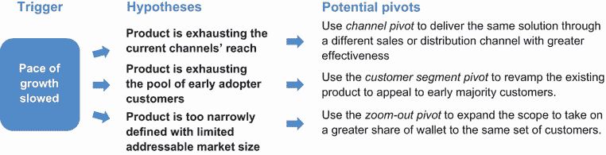

    图 8.11 同样的挑战，不同的假设，导致不同的转型

    可能存在一些现有渠道的表现优于其他渠道。如果 DS 和营销能够理解为什么这些渠道表现更好，就可以共同努力进行实验、评估和重新设计营销渠道组合。

+   *假设 B*—产品正在耗尽*早期采用者客户*的池子，需要改造以吸引具有更高可用性要求的*早期多数客户*。

    *潜在转型 B*—使用*客户细分转型*来改造现有产品，以吸引早期多数客户。在*客户细分转型*中，你正在改变产品或服务的目标客户。这可能是一项重大的努力，涉及重新设计客户获取、参与、保留以及同一产品的货币化过程。你可以在转型之前基准测试 KPI，如客户获取成本和漏斗转换率，以便在转型后评估转型的成功。

    注意*早期采用者客户*是那些愿意为了产品的潜力及其未来的巨大机会而忽略功能集的不完整性和 bug 的客户。第 6.3.1 节在技术采用周期的背景下讨论了他们。*早期多数客户*是那些务实且希望解决现有问题的客户，他们只购买完全成熟的产品。

+   *假设 C*—产品定义过于狭窄，可触及的市场规模有限。它需要扩大范围并创造更多价值以维持增长。

    *潜在转型 C*—使用*缩小范围转型*来扩大范围，以获得相同客户群体的更大份额。在这个转型中，整个产品成为更大产品的一个单一功能。在 Acorns 的例子中，其投资产品扩展到包括退休投资、大学储蓄和商业银行业务。

    当使用*缩小范围转型*来解决增长挑战时，你正在寻找使用客户获取成本较低的产品来吸引客户，通过品牌建立客户信任，并将客户升级到客户获取成本较高的功能。

如上图所示，对于同样的业务增长放缓的症状，潜在转型也在变化。假设 A 认为只需要转型客户获取渠道，客户细分和产品保持不变。在假设 B 中，客户细分需要转型，而主要产品功能保持不变。在假设 C 中，产品组合需要转型，而客户细分保持不变。

成功地识别触发因素，用假设仔细诊断根本原因，并有效地执行转型，可以使公司走上新的增长路径，从而转型并激励一个行业。你可以探索更多研究[10]，以更细致地考察可能适用于你特定挑战的触发因素和转型的类型。

| 064 | 成功地识别触发因素，用假设仔细诊断根本原因，并有效地执行转型，可以使公司走上新的增长路径，从而转型并激励一个行业。 |
| --- | --- |

### 8.3.3 明确新产品和服务的商业计划

当你用数据科学（DS）推动创新时，制定商业计划和阐述损益（P&L）的目的，是将有限的资源集中在能够产生最大企业价值的产品和服务上。这是在与首席执行官、董事会和潜在投资者在融资过程中合作时的一个基本技能。

当许多数据科学（DS）执行人员和杰出的数据科学家在公司商业计划中制定数据驱动策略时，一些人正在开发新产品线，而其他人则作为数据科学执行领导力中新兴趋势的一部分，进一步转向以产品为中心的运营模式[11]。

表 8.3 提供了商业计划与项目计划的并列比较。在公司商业计划中制定数据驱动策略时，你正在开发一系列以 KPI 作为成功里程碑的 DS 项目作为策略。当开发独立的产品线时，你正在为能够继续演变以解决特定行业痛点的团队设置特定的商业模式。当转向以产品为中心的运营模式时，你正在为服务新客户而建立新的业务线和新的组织。

表 8.3 商业计划与项目计划的比较

| 商业计划书 | 项目计划 |
| --- | --- |

|

+   使命宣言

    +   要解决的行业/客户痛点

+   产品或服务

    +   描述

    +   区别化

+   市场

    +   要进入的市场

    +   竞争对手

    +   定位

    +   要确保的市场份额

    +   市场营销叙事

+   管理团队

    +   经验和以往的成功

+   SWOT 分析

+   财务状况

    +   现金流量表

    +   收入预测

|

+   项目动机

    +   背景：客户、挑战、利益相关者

    +   战略目标一致性：公司倡议所服务，影响规模，价值

+   问题定义

    +   输出和输入规范

    +   项目成功的指标

+   解决方案架构

    +   技术选择

    +   特性和建模策略

    +   配置、跟踪和测试

+   执行时间表

    +   执行阶段

    +   同步节奏

    +   A/B 测试安排

+   预期风险

    +   数据和技术风险

    +   组织一致性风险

|

项目规划是任何数据科学（DS）领导者的一项关键技能。这将在第 2.2.2 节中讨论。为了在管理层级开始构建商业计划，以下是商业计划与项目计划之间的一些关键区别：

+   *时间范围*—商业计划书描述了可重复和可扩展的商业流程和组织建设；项目计划有明确的开始和结束日期。

+   *目标*—商业计划书讲述的是在多年运营中对损益表的影响；项目计划有目标，包括可能或不可能实现的关键绩效指标（KPI）。

+   *市场*—商业计划书描述了要进入的市场以获取和保留客户；项目计划定义了要服务的客户和利益相关者以及要合作的对象。

+   *风险*—商业计划概述了广泛的市场、人员、产品和财务挑战；项目计划概述了更窄的数据、技术和组织风险。

在*以项目为中心*的运营模式中，重点是定义新产品和新市场。现有的数据科学团队、现有的人力资源和财务职能以及共享的工程和产品人员通常被用来为新产品领域提供资源。

在*以产品为中心*的运营模式中，团队对其损益表独立负责。尽管有些人认为这只是会计上的细微差别，但这样的会计方法可以使团队拥有专门的工程和产品资源，并能够更加灵活地通过 DS 专注的努力来展示价值，这超出了在资源共享的公司中作为技术服务功能所能实现的范围。

作为推动以产品为中心的运营模式的执行者，有三个关键标准对你的成功至关重要。ZF 集团数据、数据货币化和风险加速副总裁 Gahl Berkooz 将它们总结为：组织准备就绪、创业技能集和成熟客户，如图 8.12 和以下列表所示：

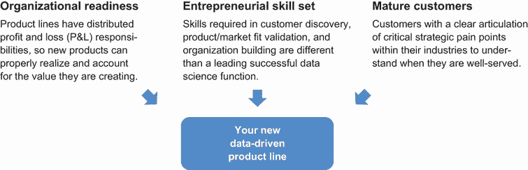

图 8.12 开启新业务线的三个准备要素

+   *组织准备就绪*—当产品线有分散的损益表责任时，新的 DS 产品可以正确实现并核算其创造的价值。

+   *创业技能集*—构建成功的 DS 产品需要客户发现、产品/市场匹配验证和组织建设方面的技能集。这些技能集与成功 DS 职能领导者所需的技能集不同。

+   *成熟客户*—成熟客户对其行业内关键战略痛点的表述清晰。一个解决明确痛点的 DS 产品可以提供显著的回报率。

当这些条件在你的组织中得到满足时，你就有机会释放你对领域深入的专业知识，并将创业方法论应用于构建新产品。下方的案例研究是 DS 组织以产品为中心的运营模式的一个例子。

| 065 | 推出一个数据驱动型产品有三个基本条件：组织准备就绪、创业技能集和成熟客户。当这些条件具备时，你就有机会推出一个成功的新产品。 |
| --- | --- |

案例研究：ZF 集团—通过数据产品丰富现有产品

ZF 集团是世界上最大的汽车零部件供应商之一，在 40 个国家拥有 230 个地点，近 15 万名员工。数据货币化和风险加速副总裁 Gahl Berkooz 推动通过丰富传统汽车零部件的智能能力来创建新业务线的倡议。

其中一项举措涉及球节，这些是用于连接车轮并负责几乎每辆汽车转向的球形轴承。智能来自球节中集成的霍尔效应传感器，它可以测量球节角度数据，用于传统应用，如高度调整，这可以调整前灯角度以更好地照亮前方道路。这些数据还可以重新用于负载监控、路况监控和预测性维护。

监测汽车的负载可以帮助检测车辆稳定性的风险，预测转向的困难，并保持安全的停车距离。对超载的警报可以防止轮胎过热、磨损增加和轮胎过早爆胎的风险。监测路况可以允许运输车队在可能的情况下使用更安全的路线。收集到的信号可用于预测性维护，其中驾驶条件数据预测哪些部件最有可能提前失效。

基于该传感器的数据应用预测性车队维护方法，一个价值 7 美元的汽车零部件可以在 2.5 年内帮助车队每辆车节省 400 美元。这提高了 ZF 集团汽车零部件的竞争力，并为 ZF 集团和汽车制造商基于数据监控的新业务创造了新的机会。

激励一个行业并非易事。以产品为中心的运营模式为 DS 高管提供了更多的执行自由，以换取损益表责任和对企业价值创造的更多审查。作为 DS 高管，转向这种模式给展示和捕捉创造的价值带来了更大的压力。

如 ZF 集团案例研究所示，要建立一个可行的企业，仅通过衡量潜在节省的价值来展示创造的价值只是一个起点。关于如何将额外功能销售给汽车制造商、车队所有者如何评估这些功能、以及如何捕捉和分配节省的价值，仍存在疑问。这些都是需要解决的问题，以确保创造的价值能作为利润反映在资产负债表上。

## 8.4 自我评估和发展重点

恭喜你完成了关于高管和杰出数据科学家能力的章节！这是通过数据科学领导公司的关键时刻。

能力自我评估的目的是通过以下方式帮助你内化和实践这些概念：

+   了解你的兴趣和领导力优势

+   使用选择、练习和回顾（CPR）过程练习一到两个领域

+   制定优先级-练习-执行计划，以便进行更多的 CPR

一旦开始这样做，你就勇敢地迈出了构建创新组织、培养有效文化和打造竞争优势的步伐，同时为前进的道路提供了清晰的思路。

### 8.4.1 了解你的兴趣和领导力优势

表 8.4 总结了本章讨论的能力领域。最右侧的列可供您快速勾选您目前感到舒适的领域。这里没有评判，没有对错，也没有任何特定的模式要遵循。请随意留空任何或所有行。 

如果您已经了解这些方面的某些内容，这是围绕您现有的领导优势构建叙事的绝佳方式。如果某些方面还不熟悉，这是您评估它们是否可以从今天开始帮助您日常工作的机会！

表 8.4 高级管理人员和杰出数据科学家能力自我评估领域

| 能力领域/自我评估（斜体项主要适用于管理者） | ? |
| --- | --- |
| 技术 | 架构一到三年的数据业务战略和路线图 | 制定通过考虑使用哪些技术和技术堆栈如何从根本上改善业务运营方式来转型行业的商业策略 |  |
| 在业务流程的所有方面实现数据驱动文化 | 通过数据工程、建模和分析方面的数据科学成熟度同步，将组织转型为具有数据驱动文化的组织 |  |
| 阐述可能成为整体组织转型瓶颈的数据科学成熟度方面的潜在不足 |  |
| 构建创新和高效的数据科学组织 | 构建符合贵组织商业模式、规模和文化、您的领导风格、团队中的人才以及您所在地理区域内可用人才库的数据科学组织 |  |
| 随着公司规模的扩大，通过简化协调、提高人才保留和扩大可用人才库中的团队规模来提高数据科学组织的效率 |  |
| 执行 | *将数据科学能力融入愿景和使命* | 制定并融入数据和预测智能能力到公司的愿景和使命中，使数据科学拥有命令权和影响力，以协调合作伙伴推动高级别倡议 |  |
| 制定数据科学职能的使命宣言，从主题领域角度细化其目标和方法的团队视角 |  |
| *建立强大的数据科学人才库* | *在组织层面，评估地理位置以捕捉团队增长所需的合格人才* |  |
| 在职能层面，推动雇主品牌、内容营销、社交招聘和兴趣小组培养以吸引人才 |  |
| 在团队层面，在组织内部进行人才交叉培训，以增加数据科学产生业务影响的能力 |  |
| *明确你的作曲家或指挥角色* | *明确你作为 DS 高管执行角色时对 CEO、同事和团队的方法期望，无论是通过创作一致的数据战略还是通过协作和对齐来执行战略* |  |
| 专家知识 | 识别行业同行之间的差异化和竞争力 | 识别通过产品、服务、分销、关系、声誉和定价策略实质性区分你的业务的机会，以创造企业价值 |  |
| 在需要时引导业务进行转型 | 通过明确假设和有效执行转型来诊断问题，以引导业务持续增长 |  |
| *阐述新产品和服务的商业计划* | *制定商业计划并阐述利润和损失，以构建可重复和可扩展的业务流程和组织* |  |
| 准备推出新产品和服务的三个关键标准，损益会计，创业技能组合，以及成熟的客户需求，然后执行商业计划 |  |

### 8.4.2 使用 CPR 流程进行实践

就像在第 2.4 节的技术领导能力评估、第 4.4 节的经理能力评估和第 6.4 节的高管能力评估中一样，你可以尝试一个简单的 CPR 流程，每两周进行一次检查。

在自我审查中，你可以使用基于项目的技能提升模板来帮助你结构化两周内的行动：

+   *技能/任务*—选择一个要工作的能力。

+   *日期*—选择一个两周期间你可以应用能力的时间。

+   *人员*—写下你可以应用能力的那些人的名字，或者写下*自我*。

+   *地点*—选择你可以应用能力的位置或场合（例如，与团队成员的下一场一对一会议或与工程合作伙伴的对齐会议）。

+   *审查结果*—与之前相比，你的表现如何？是相同、更好还是更差？

通过自我审查中的这些步骤来对自己负责，你可以开始锻炼你的优势，并揭示你在 DS 高管和杰出数据科学家能力中的盲点。

## 摘要

+   *技术*对于高管和杰出数据科学家包括构建长期业务战略和路线图、在业务流程的所有方面提供数据驱动文化以及构建高效 DS 组织的工具和实践。

    +   在制定战略和路线图时，你可以考虑使用哪种技术以及技术堆栈如何从根本上改善业务运营方式。

    +   在创建和推动数据驱动文化时，你可以指导数据工程、建模和数据分析方面的 DS 成熟度，同时阐述和缓解可能阻碍整个组织进步的瓶颈。

    +   在构建组织结构时，你可以选择最适合你组织商业模式、规模和文化、你的领导风格、团队中现有的才能以及你可用的人才库的结构。

+   高管*执行*能力包括将数据科学能力融入愿景和使命，构建强大的人才库，并明确你作为作曲家或指挥家的角色。

    +   将数据科学能力融入愿景和使命将赋予你的团队使用公司指令来影响和协调合作伙伴的权力。明确数据科学使命也可以完善你团队的公司目标和策略。

    +   在构建强大的人才库时，你可以评估人才库的地理位置；推动雇主品牌、内容营销和社交招聘以吸引人才；并促进现有团队的交叉培训以增加生产力。

    +   在明确你的角色时，你可以对你的首席执行官、同事和团队设定明确的工作方式期望，以制定一致的数据策略或进行协作和协调以执行现有策略。

+   高管和杰出数据科学家*专业知识*包括识别行业同行的差异化与竞争力，在需要时通过转型引导业务，以及阐述新产品或服务的商业计划。

    +   在识别差异化时，你可以探索六个维度，包括产品、服务、分销、关系、声誉和定价——使用数据科学技术比任何行业同行更好地满足客户需求。

    +   在通过转型引导业务时，你通过明确转型假设，然后执行转型以实现持续的业务增长，从而在不改变愿景的情况下改变业务策略。

    +   在阐述新产品或服务时，你可以为可重复和可扩展的业务流程和组织制定商业计划，并为推出准备三个组成部分：损益表会计、创业技能组合和成熟的客户需求。

## 参考文献

[1] “*构建以分析驱动的组织：在消费品行业组织、治理、获取和增长分析能力*”，*埃森哲，2013 年 6 月 19 日*。[在线]。可获取：[`www.accenture.com/us-en/~/media/Accenture/Conversion-Assets/DotCom/Documents/Global/PDF/Industries_2/Accenture-Building-Analytics-Driven-Organization.pdf`](https://www.accenture.com/us-en/~/media/Accenture/Conversion-Assets/DotCom/Documents/Global/PDF/Industries_2/Accenture-Building-Analytics-Driven-Organization.pdf)

[2] E. Ries, *《精益创业：当今企业家如何利用持续创新创造极具成功的企业》*. 纽约，纽约，美国：货币出版社。

[3] Stephanie Ray. “如何撰写完美的愿景声明（附示例）,” projectmanager.com, 2018 年 5 月 16 日。[`www.projectmanager.com/blog/guide-writing-perfect-vision-statement-examples`](https://www.projectmanager.com/blog/guide-writing-perfect-vision-statement-examples)

[4] Bart, Christopher K.，“性与谎言与使命声明。” 商业展望，第 9-18 页，1997 年 11 月-12 月，[`ssrn.com/abstract=716542`](https://ssrn.com/abstract=716542)

[5] A. Flowers. “数据科学家：一份薪酬丰厚的热门工作。” Indeed 招聘实验室。[`www.hiringlab.org/2019/01/17/data-scientist-job-outlook/`](https://www.hiringlab.org/2019/01/17/data-scientist-job-outlook/)

[6] C. Brahm. “解决高级分析人才问题。” MIT 斯隆管理评论。[`sloanreview.mit.edu/article/solving-the-advanced-analytics-talent-problem/`](https://sloanreview.mit.edu/article/solving-the-advanced-analytics-talent-problem/)

[7] T. Basu. “如何在您所在行业的顶级播客上接受采访（完整指南）。” Thinkific。[`www.thinkific.com/blog/how-to-get-interviewed-on-top-podcasts`](https://www.thinkific.com/blog/how-to-get-interviewed-on-top-podcasts)

[8] “Uberdata: 光荣之旅。” 光荣之旅。[`rideofglory.wordpress.com`](https://rideofglory.wordpress.com)

[9] C. Rudder. “我们在人类身上进行实验！” OkTrends。[`www.gwern.net/docs/psychology/okcupid/weexperimentonhumanbeings.html`](https://www.gwern.net/docs/psychology/okcupid/weexperimentonhumanbeings.html)

[10] S. S. Bajwa 等人，“值得庆祝的失败：对软件初创公司重大转型分析，” *Empirical Software Engineering*，第 22 卷，第 2373 页，2017 年。[`doi.org/10.1007/s10664-016-9458-0`](https://doi.org/10.1007/s10664-016-9458-0)

[11] “Gartner 研究委员会确定首席数据官 4.0。” Gartner。[`www.gartner.com/en/newsroom/press-releases/2019-07-30-gartner-research-board-identifies-the-chief-data-officer-4point0`](https://www.gartner.com/en/newsroom/press-releases/2019-07-30-gartner-research-board-identifies-the-chief-data-officer-4point0)
