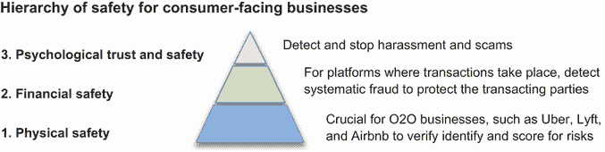
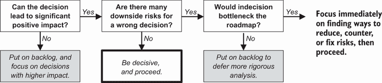
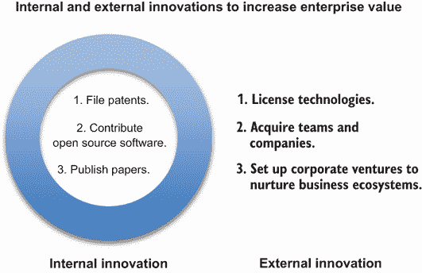
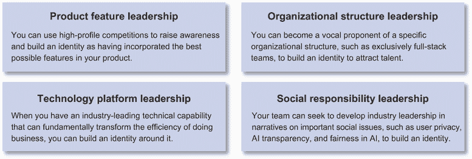

# 9 个领导公司的美德

本章涵盖

+   以道德原则实践负责任的机器学习

+   确保客户信任和安全，并对决策承担社会责任

+   在关注企业价值的同时，创造一个高效和谐的工作环境

+   展示高管风范，确立行业领导地位

+   学习和采用跨行业的最佳实践

成功的 DS 高管的美德可以激励一个行业如何利用数据产生商业影响。杰出的数据科学家也是如此。当你提高隐私和道德标准时，你正在与客户建立信任，塑造企业身份。当你与合作伙伴和团队成员保持一致时，你正在与同行建立信任。当你展示高管风范时，你正在传达对为公司和行业带来积极变化的热情。

本章讨论 DS 高管和杰出数据科学家的伦理、严谨和态度。伦理为你提供了如何负责任地使用数据来改善业务成果的参考，同时确保客户的信任和安全，并对 DS 做出的决策承担社会责任。严谨是你为合作伙伴和团队成员创造高效和谐工作环境的勤奋，提高你的技术和业务决策的速度和质量，并专注于增加企业价值。态度是你展示的能源模式，以传达高管风范，在你所在的行业内确立领导身份，并学习和采用不同行业的最佳实践。

伦理、严谨和态度是 DS 实践的美德。本章讨论的美德可以帮助你，DS 高管或杰出的数据科学家，激励一个行业。

## 9.1 行为道德标准

DS 高管应遵循的道德规范涵盖了广泛的问题，这些问题关注公司商业实践的长期可行性和其在社会中的作用。我们将其分为三个层次：负责任的机器学习（ML）技术原则、客户信任和安全，以及社会责任。

负责任的 ML 倡议侧重于遵循适用的法律和遵守道德问题的指导原则。它们涵盖了各种考虑因素，包括透明度、鲁棒性、问责制、公平性和对投入运营的机器学习技术的以人为本的监督。

许多机器学习场景的数据来源于聚合用户生成内容，如文章、评论、图片、视频或直播。在这些场景中，如果客户在一个平台上感到不安全，整个生态系统就会崩溃。客户可以是个人或企业，必须免受滥用行为的影响，如账户接管、欺诈和不公平行为。

最后，用户期望社交媒体和社交网络平台维护言论自由。平台有动力通过部署内容审查来排除误导性、欺诈性、淫秽的、威胁性的、仇恨性的、诽谤性的、歧视性的或非法的内容，以建立一个充满活力的用户社区。许多界限难以确定，即使在学者、情报官员和记者中也是如此。让我们在执行层面考察这些伦理问题。

### 9.1.1 基于伦理原则的负责任机器学习实践

负责任的机器学习（ML）旨在释放机器学习的全部潜力，同时通过确保项目在各个行业中的伦理和有意识的开发来最小化其风险。为了实践负责任的机器学习，我们首先必须遵守我们在运营地区的适用法律和法规。世界各地正在提出和实施许多法律和法规。一个例子是《通用数据保护条例》（GDPR）[1]，这是一项由欧洲议会于 2016 年通过并在 2018 年首次实施的数据保护和隐私法规。另一个例子是 2018 年在加利福尼亚州签署成为法律的《加利福尼亚消费者隐私法案》（CCPA）[2]，该法案于 2020 年首次实施。

然而，法律并不总是与技术进步的速度保持同步。有时，它们可能不符合伦理规范，或者可能不适合解决新技术带来的新可能性。

在过去十年中，行业对公众接受的伦理规范进行了深刻的反思。2019 年，欧盟委员会发布了一份题为《值得信赖的人工智能伦理指南》的报告[3]，其中包含了一系列原则和潜在问题，您可以使用这些原则来评估自己的合规性。以下是对这些原则的总结。

欧洲委员会定义的可信人工智能的七个伦理原则

**1. 人类代理和监督**

人工智能系统应支持人类的自主性和决策。它们不应负面影响人们的根本权利和自由。通过代理，我们需要保留用户就人工智能系统做出自主知情决策的能力。通过监督，人类应能够确保人工智能系统不会损害人类自主性或造成其他不良影响。

**2. 技术稳健性和安全性**

人工智能系统需要具有弹性和安全性。它们在出现问题时需要有备用计划。自动决策应该是准确、可靠和可重复的。

**3. 隐私和数据治理**

除了尊重隐私和治理数据外，数据的质量和完整性以及数据的合法访问也必须得到保证。

**4. 透明度**

用于培训和测试的数据集应该是可追溯的。技术流程和最终决策应该是可解释的。人工智能做出的系统和决策应清楚地作为自动化流程和决策进行沟通。

**5. 多样性、非歧视和公平**

自动决策应避免不公平的偏见，尤其是在它们可能导致无意中、直接或间接的偏见和歧视时。直接面向消费者的能力应对所有人群可访问，无论年龄、性别、能力或特征如何。在整个人工智能系统生命周期中受到影响的相关方应被咨询并被告知。

**6. 社会和环境保护**

人工智能系统应该造福所有人类，包括未来一代。它们必须确保可持续性和环保，同时对社会和民主的最小负面影响。

**7. 责任**

算法、数据和设计流程应该是可审计的，审计报告应该是公开可用的。潜在的负面影响应被识别、评估、记录并最小化。权衡应理性且系统地解决。当发生不公正的不利影响时，应明确赔偿的机制和联系方。

这些指南的范围可能看起来令人望而生畏。幸运的是，自从它们的定义以来，一个行业规范合规技术公司已经开始出现，以帮助企业在生产负责任的机器学习方面采用行业最佳实践。为了激励您的商业伙伴与 DS 功能合作，实践负责任的机器学习，确保团队和流程根据道德原则中描述的护栏正确设置，这是您管理层级的责任。

为了**人类能动性和监督**，与产品和运营团队建立强有力的合作对于从一开始就开发具有人类在回路或人类监控操作的业务流程至关重要。例如，对于保险赔偿，人类在回路操作意味着调整员研究了收集到的信息、索赔的损害和推荐的赔偿，以做出保险赔偿的最终决定。在人类监控操作中，算法做出保险赔偿的决定。调整员团队的一名成员将监控赔偿统计数据以发现异常，并选择性地审计案例以确保算法按预期运行。

为了**技术稳健性和安全性**，与工程团队的合作，特别是与站点可靠性工程师和信息安全工程师的合作，对于制定备用计划和评估系统在受到攻击时的行为至关重要。例如，如果重要的数据源受到攻击，并且算法无法再提供可靠的输出，应已经建立 B 计划以确保业务连续性。

对于*隐私*和*治理*，基本流程包括实施严格的基于角色的和有时间限制的数据库访问控制，以及在可能的情况下通过散列或删除个人身份信息（PII）来脱敏数据。更高级的技术，如差分隐私，可以在不反向工程敏感个人信息的情况下允许对数据系统进行重复查询。

对于*透明度*，您可以记录用于训练和测试的数据集的收集和处理。数据处理可能会通过数据细微差别引入深刻的偏见，尤其是在处理缺失字段时。在业务环境中测试和表征算法结果的方法也应可追溯。

先进算法，如*深度神经网络*（DNN）和*梯度提升树*（GBT）的决策，因其决策可能依赖于数百甚至数千个在复杂非线性关系中的输入而闻名，因此难以解释。幸运的是，LIME [4] 和 SHAP [5] 等方法能够通过识别特定模型输出的顶级特征来提供透明度，这些方法在开源库中有可用的实现。

没有以可理解的方式向利益相关者进行明确沟通，透明度就不完整。例如，如果推荐了一篇文章，应该显示触发推荐的理由。此类解释可以帮助减少来自人工智能系统的决策造成混淆的风险。

对于*多样性*、*非歧视*和*公平性*，基础挑战始于数据集的收集，并延续至使用历史选择和可能嵌入固有的人类偏见的参与信号。例如，如果男性工程职位候选人被频繁雇佣或被查看，算法可能会被训练以将他们排名更高，高于更合格的女性候选人。此类情况可能导致类似资格的候选人受到不同对待，并可能导致男性候选人从招聘人员那里获得更多关注。

机器学习中的这类公平性问题属于群体公平性，它询问：哪些个人群体面临遭受伤害的风险？这些问题通过微软的 Fairlearn、IBM 的 AI Fairness 360 和领英公平性工具包（LiFT）等创新和工具来解决。

注意：Fairlearn 是微软的一个 Python 包，用于评估和改进机器学习模型的公平性（[`github.com/fairlearn/fairlearn`](https://github.com/fairlearn/fairlearn)）。IBM AI Fairness 360 是一套针对数据集和机器学习模型的全面公平性指标、这些指标的解释以及减轻数据集和模型偏差的算法（[`github.com/Trusted-AI/AIF360`](https://github.com/Trusted-AI/AIF360)）。LinkedIn 公平工具包（LiFT）是一个 Scala/Spark 库，它能够测量大规模机器学习工作流程中的公平性（[`github.com/linkedin/LiFT`](https://github.com/linkedin/LiFT)）。

对于具有重大影响力的较大公司来说，考虑社会和环境福祉非常重要。数据中心能耗可能产生显著的碳足迹，从而加剧全球变暖。公司可以通过购买或投资可再生能源来抵消其能源使用。当公司在社交媒体、电子商务或金融领域对人们日常生活有相当大的影响力时，就有责任排除误导性、欺诈性、淫秽性、威胁性、仇恨性、诽谤性、歧视性或非法的影响，同时维护言论自由。这一点在 9.1.3 节中有更详细的说明。

为了**问责制**，与产品合作伙伴和客户设定合理的期望非常重要，即任何机器学习系统都存在负面影响的潜在风险。统计算法可能会出错。重要的是要具备审计案例的能力，并在问题发生时拥有足够的机制来纠正问题。

这些考虑因素可以在技术成熟的过程中分阶段解决。对这些问题的认识可以帮助避免技术路线图走向危险的道路。当这些问题没有立即解决时，它们可以被视为技术债务。当这些伦理技术债务没有得到解决并积累起来时，它们可能会在利用机器学习能力时造成干扰，或者更糟，造成长期负面的社会影响。

### 9.1.2 确保客户的信任和安全

客户的信任和安全对于公司的长期生存至关重要。只有当客户觉得产品或服务的价值值得交易的风险时，他们才会开始与公司进行交易。信任和安全可以分别针对直接面向消费者的公司和面向企业的公司进行讨论。让我们首先看看直接面向消费者的场景。

直接面向消费者的场景

对于直接面向消费者的公司，存在三个信任级别，包括身体安全、财务安全和心理信任和安全。这些级别在图 9.1 中得到了说明。您的角色是敏感地关注这些信任级别，并努力通过数据科学技术激励行业，以增加其客户的信任和安全。

图 9.1 面向消费者的业务的三级安全级别

身体安全

信任始于与公司交易时的安全感。“线上到线下”（O2O）直接面向消费者的品牌，如 Uber、Lyft 和 Airbnb，在线产生交易并在线下提供服务。在这些双边市场中进行交易需要客户对物理安全有巨大的信任。

在智能手机变得普遍之前，强烈建议不要让陌生人进入你的房子或车辆。你也会犹豫是否要在陌生人的车里乘车或在外国的陌生人家中过夜。今天，大多数人不会犹豫使用 Uber 或 Lyft 进行拼车或作为司机提供乘车服务。2020 年，全球有近 300 万人成为 Airbnb 房东，超过 5 亿人在 Airbnb 下榻。

这些成功背后是严格的身份验证流程。例如，所有 Lyft 司机在提供乘车服务之前必须通过一系列背景调查[6]以检查犯罪记录。所有 Airbnb 预订在确认之前都会根据数百个信号进行风险评估[7]。这些验证不仅是一次性检查，而且还会对标记的可疑活动进行持续检查，例如已识别的虚假账户和潜在的*账户接管*（ATO）。

DS 可以通过实验和选择最有效且最不干扰的获取身份验证的方式，以及最大化获取身份验证的转化率来促进这些信任建立过程。它还可以在扫描虚假账户和检测潜在的 ATO 方面发挥关键作用，从而使线下服务尽可能安全。

财务安全

许多面向消费者的公司处理支付。他们有时作为第一方接收支付，在其他时候，他们作为第三方负责在各方之间清算交易。为了提高财务安全，首要任务是保护客户的私人信息，在静止状态下对其进行加密，这样即使服务器被入侵，最敏感的财务信息也可以免受黑客攻击。

当一家公司作为受信任的第三方来清算交易时，它可以承担额外的责任来保护其客户的利益。继续从共享经济场景的例子来看，对于像 Uber、Lyft 和 Airbnb 这样的 P2P 服务，交易是通过在线平台进行的。这集中了敏感财务信息的维护，因此交易双方不必在每次交易中互相请求这些信息。如果 Uber 司机没有提供乘车服务或 Airbnb 房东没有提供住宿，平台可以扣留付款并退还 Uber 乘客或 Airbnb 客人的费用。

该平台也有机会通过寻找过去欺诈案件的模式和机制来检测系统性欺诈。例如，如果一组财务信息涉及欺诈，你可以使用知识图谱来检查和无效化任何相关的交易。任何涉及欺诈的账户都可以被冻结，以防止额外的财务风险。

心理信任和安全

对于拥有用户生成内容的公司来说，保护用户免受心理虐待对于营造一个充满活力的在线社区至关重要。拥有用户生成内容的平台示例包括带有聊天室的在线多人游戏、社交网络、媒体分享网站和在线评论网站。必须处理诸如骚扰、欺凌和诈骗等滥用行为，以维护用户的信任，并让他们在使用这些平台时感到安全。

骚扰是通过发送信息对受害者造成心理伤害的过程。欺凌是施暴者对受害者进行的重复骚扰。随着许多因网络欺凌而导致的自杀事件[8]的报道，对用户安全的威胁是真实的。受害者有有限的防御选择。受害者可以删除直接骚扰信息；然而，这要求受害者已经阅读了该信息，这可能已经造成了心理伤害。受害者不能直接删除广播消息，而必须依赖版主来删除消息。

诈骗可能更难检测。诈骗的实际行为可能发生在特定在线社区的可视范围之外，因此很难评估特定消息是否为诈骗。诈骗通常在发生后很久才被报告，因为受害者需要时间来意识到自己被骗。许多受害者甚至可能因为羞愧而不愿报告诈骗。

作为 DS 执行人员或杰出的数据科学家，你可以投资于算法和基础设施，以自动检测和标记骚扰、欺凌和诈骗信息。算法可以在消息、发送者和接收者历史中寻找滥用模式。基础设施可以根据对接收者的评估风险水平来阻止、标记为审查或传递消息。

| 066 | 在为个人消费者提供服务时，公司必须保持物理、财务和心理层面的信任和安全。一个行业只有在客户感觉到产品或服务的价值值得与公司交易的风险时，才能长期繁荣。数据科学可以帮助最小化交易中的这些风险。 |
| --- | --- |

商业对商业场景

为了赢得企业消费者的信任和安全，*软件即服务*（SaaS）解决方案需要向客户证明共享的数据将直接惠及客户，不会对使用或运营产生负面影响，并且不会损害或泄露任何商业智能或指标。

SaaS 是一种以订阅为基础，提供集中托管软件的业务模式。这种方法在商业社区中得到广泛采用，并且具有许多效率。最近，随着深入分析能力的普及，新参与者正在出现，通过提供一些企业数据以换取高级功能和基准测试能力，将多租户托管提升到新的水平。这些可能性也带来了某些伦理考量。

软件即服务（SaaS）产品相较于传统下载和安装的软件具有五大主要优势：

+   *快速实现价值*—无需安装和配置。登录可能就是您所需的一切。软件通常编码了您可以立即开始使用的最佳实践。

+   *降低成本*—软件通常托管在多租户环境中，具有规模经济。

+   *可扩展性和集成*—无需购买额外的服务器。如果使用量增加，托管环境通常可以自动扩展。

+   *易于升级*—标准化托管意味着升级时问题更少，升级由 SaaS 提供商处理。

+   *易于使用*—易于测试和购买软件。

传统的 SaaS 协议通常有关于客户数据的条款，明确将所有客户数据的所有权分配给客户。它们明确禁止提供商出于任何目的使用这些数据。

在高级分析和机器学习的时代，传统的 SaaS 协议允许基于单个客户的数据进行有限的统计分析能力。这阻止了在客户之间利用显著价值以惠及 SaaS 产品中的所有人。新的 SaaS 解决方案正在出现，通过授予 SaaS 解决方案的提供者对客户数据的特定有限访问权限来突破这些挑战，以开发出其他情况下不可能实现的新特性。

可以从 SaaS 解决方案中有限访问客户数据中受益的功能包括：

+   *用户界面的优化和定制*—这包括在 SaaS 解决方案中呈现的菜单和功能的位置、消息和流程。跨客户的用法行为数据可以提供更重要的信号，以更快地提高可用性。

+   *相关性排名算法*—这包括在 SaaS 解决方案的新闻源和搜索功能中推荐的内容的相关性。来自许多客户的反馈可以更快地提供反馈以训练相关性算法。

+   *转换归因*—当多个接触点可以归因于将用户转换为新的功能时，我们如何为不同的接触点进行信用分配？手动标记的数据可能很少。但如果稀疏数据被聚合，我们可以更了解流量来源的归因。

+   *实体匹配*—在大型数据库中，公司和个人等实体可能难以识别和规范化。联系归属和商业实体属性需要不断更新。通过跨多个客户的数据聚合，实体匹配能力可以获得更及时的反馈，以改进实体匹配的准确性。

为了让客户选择加入这些数据共享协议以启用数据驱动的优化机会，SaaS 解决方案需要向客户*证明*所共享的数据：

+   将直接惠及客户

+   不会对 SaaS 解决方案的使用或操作产生任何负面影响

+   不会损害或泄露任何商业智能或指标

对这些伦理原则保持高标准对于商业客户对 SaaS 解决方案选择加入数据共享，以实现 SaaS 平台长期积累能力和竞争优势至关重要。

| 067 | 为了赢得企业消费者的信任和安全，SaaS 解决方案需要向客户证明所共享的数据将直接惠及客户，不会对使用或操作产生负面影响，并且不会损害或泄露任何商业智能或指标。 |
| --- | --- |

总结来说，客户的信任和安全对于企业的长期生存至关重要。对于直接面向消费者的业务，DS 能力可以解决客户的身体安全、财务安全和心理信任与安全。对于面向企业的解决方案，在明确和遵守伦理原则的情况下，有限的数据共享机会可以加速创新步伐。

### 9.1.3 对决策承担社会责任

权力越大，责任越大。DS 现在正在推动金融、就业和社交媒体等领域，这些领域影响着数十亿人，并可能影响他们未来多年的生活。

在 DS 中承担社会责任是困难的。模型擅长学习历史模式，但基于历史模式做出决策也可能放大历史人类偏见。人类偏见通常嵌入在训练数据中。在决策中识别什么是*公平的*超出了定量分析的范围。

| 068 | 模型擅长学习历史模式，但基于历史模式做出决策也可能放大历史人类偏见。在决策中识别什么是公平的，超出了定量分析的范围。 |
| --- | --- |

公平有许多定义[9]，[10]，包括个人公平、群体公平、预测率公平、均衡机会、平等机会、平等结果和反事实公平。这些都是在不同背景下确定公平的可靠尝试，可能相互冲突。

作为数据科学执行者或杰出的数据科学家，你有责任认识到在你的社会和商业环境中，公平概念背后的复杂性。让我们看看金融、就业和社交媒体中的例子，以突出公平持续面临的挑战及其副作用。

示例 1：金融公平

金融公平的挑战可以通过贷款批准决策中的细微差别来举例说明[11]。贷款批准中的偏见可能会通过消除允许人们通过更靠近工作生活、购买设备、支付教育和培训费用或处理临时现金流动性缺口等关键投资来损害整个社区。没有这些贷款，人们可能被迫降低生产力或放弃改善整体财务状况的机会，并推迟积累财富的能力。

历史上，贷款决策中的偏见导致了整个社区的停滞和边缘化[12]。我们如何使信贷决策更加公平，同时保护那些只想向有信用资格的客户贷款的贷款人的利益？

在多个文化中，无担保消费者贷款数据表明，男性借款人比女性借款人更有可能违约。同时，贷款申请池也主要由男性借款人组成。这是否是由数据偏见或男性倾向于承担更多风险的偏见引起的？

美国于 1974 年通过了《平等信贷机会法》（ECOA）[12]，使债权人基于种族、性别、年龄、国籍、婚姻状况或因为接受公共援助而歧视成为非法。然而，即使不考虑性别在评估信用资格时，美国女性的平均信用评分也始终低于男性的平均评分。这怎么可能呢？

结果表明，评估信用资格的一个重要组成部分是*循环信用使用率*，这是你每月使用的信用额度百分比。由于性别工资差距，女性的平均收入低于男性，而信用额度与一个人的收入密切相关。低收入导致信用额度较低。即使女性的余额与男性相当，但作为可用信用额度的比率，她们的*循环信用使用率*更高，导致平均信用评分较低。

历史上的工资差距不仅跨越性别，也存在于种族和民族之间。因此，尽管政府尽了最大努力消除金融贷款中的歧视，但经济环境中的历史偏见仍然可以通过许多其他维度传播。

作为一家公司的高管或杰出的数据科学家，首要任务是首先遵守法规。当有感知到的女性消费者商业机会时，产品设计和市场推广可以吸引特定的客户群体。然而，信贷审批过程必须遵循*通过无知实现公平性*原则，即性别不应成为批准信用卡或为客户设定信用额度的因素。为了更根本地解决历史性工资差距，让我们接下来看看就业机会公平性。

示例 2：就业机会公平性

在寻找难以填补的职位人才时，招聘人员越来越依赖于在简历数据库和来自 LinkedIn 或 Indeed 等公司的在线个人资料中进行搜索，以找到符合其招聘流程的潜在候选人。LinkedIn 和 Indeed 汇总了数百万个工作岗位，这样求职者只需在一个地方搜索就能找到所有可用的机会。他们还吸引求职者创建在线个人资料和上传简历，以便在出现新的机会时，招聘人员可以找到他们。

网站使用招聘人员的参与行为作为反馈，以改善人才搜索体验的相关性。当招聘人员与人才搜索结果互动时，会收集信号。这些信号帮助排名算法理解哪些类型的个人资料和简历摘要能更好地吸引招聘人员的注意。然而，这种方法往往强化了现有的人类偏见，包括性别、种族和种族，这可能会持续对特定群体进行歧视。

当你寻求提高就业机会公平性时，你如何确定要优化的指标？以男女比例为例，什么会被认为是公平的？以下有三种方法可以考虑：

+   *通过无知实现公平性*—在排名中不直接使用性别特征。这种方法在大多数环境中是现状。然而，强有力的证据表明，在招聘实践中存在历史性的人类偏见[13]。虽然这种方法可能更容易验证和监管，但它无法有效消除潜在候选人搜索排名中的人类偏见。

+   *人口比例平等*—结果中包含相等数量的男性和女性候选人。搜索结果可以根据性别进行排名和分区。然后可以将结果重新构建，以确保首页上男性和女性候选人的比例是一对一。这种方法易于实施，但不同职业的人才库中性别比例并不都是一对一的。有人可能会认为，在顶级搜索结果中，代表性较多的性别可能会处于不利地位。

+   *平等机会*—出现在搜索结果顶部的男性和女性候选人的比例与具有匹配技能集的人才库中的比例成比例。顶级搜索结果将包含一组性别比例与人才库相匹配的候选人。这种方法在顶级结果中引入了一个代表性性别平衡的候选人集，同时尊重各种职业中的性别比例。这种方法已被行业领导者，如 LinkedIn [14] 所采用。

正如您所看到的，不同的公平性观念适用于可能对个人产生职业转变差异的情况，在选择方法时必须考虑具体语境。为了确定最适合您场景的公平性定义，请参考 Ninareh Mehrabi 等人关于此主题的调查[15]。

示例 3：社交媒体公平性

社交媒体平台，如 Facebook、Twitter、YouTube 和 LinkedIn，在人们的日常生活中越来越有影响力。截至 2018 年 8 月，大约三分之二（68%）的美国人从社交媒体[16]获取新闻。

美国宪法的第一修正案通过禁止国会限制新闻界或个人自由表达的权利来保障言论自由。一些不良行为者也可以通过传播误导性、淫秽、威胁性、仇恨性、诽谤性或歧视性的有害内容来滥用这种自由。

内容监管已成为社交媒体行业的一个重要话题。在 2016 年美国总统选举活动中，前 20 个虚假新闻故事获得的分享量超过了前 20 个真实新闻故事[17]。如果这些有害内容不能及早被发现和监管，它们将对民主、经济和地缘政治稳定产生严重和长期的影响。

作为 DS 高级管理人员或杰出的数据科学家，您如何在承担社会责任的同时不压制言论自由？存在许多形式的监管：

+   *人工监管*—编辑在消息上线前对其进行监管。

+   *事后监管*—消息首先上线，然后放入编辑审核的队列中。

+   *反应性监管*—用户可以报告滥用行为。只有报告的滥用行为才会被审查。

+   *分布式监管*—用户通过投票来对内容进行自我监管。

+   *自动化监管*—使用算法检测并移除违反内容政策的消息。

*人工审核*和*事后审核*可以有效地执行内容政策，并且常用于付费内容，如广告。然而，它们的可扩展性较低，不适合用户生成内容。*反应式审核*和*分布式审核*具有高度的可扩展性。然而，它们只能解决已经对受众产生负面影响的现有问题。*自动化审核*仍处于起步阶段，检测方法包括基于知识、基于风格、基于传播和基于来源的方法 [18]。虽然它们可以迅速对潜在的滥用行为做出反应，但它们也可能产生高调的误报 [19]，并且仍然是研究课题。目前社交媒体平台上的生产级审核系统通常是混合系统，包括多种形式的审核，自动化算法会考虑用户反馈和编辑选择。

这些内容审核系统存在许多挑战。与任何机器学习系统一样，审核算法可能会出错。如果它们在审核内容时过于温和，可能会让恶意内容得以传播并伤害更多用户。如果它们在审核时过于严厉，会增加审核操作中的误报数量，这可能会压制合法的声音 [20]。

在法律方面，自 1996 年以来，《通信规范法》第 230 条保护了像 Facebook、YouTube 和 Twitter 这样的互联网公司免受其用户创建的内容的责任。它允许互联网公司对其网站进行审核，而无需对其托管的内容承担法律责任。然而，政治潮流正在转向重新审视这些政策。

机器学习在内容审核中的作用将反映你对这些问题的道德立场。在保护言论自由和保护用户免受误导性、淫秽、威胁性、仇恨性、诽谤性或歧视性信息的影响之间取得平衡，同时不审查敏感讨论话题，这将对履行公司的社会责任变得越来越重要。

## 9.2 领导力中的严谨，更高的标准

作为数据科学部门的执行者或杰出的数据科学家，你定义了公司中的数据科学文化。这个过程包括为数据科学创造一个高效和谐的工作环境，加快决策速度，提高决策质量，并推动可以增加企业价值并激发行业灵感的突破。

将新兴的数据科学（DS）功能融入公司存在许多挑战。根据你的高管领导层的背景，DS 可能或可能不会在整个组织中受到同等重视。一些高管可能更愿意雇佣专门的内部分析师团队来控制他们的数据，导致职能和业务单元内部出现数据孤岛。有些人可能走向另一个极端，提供全面的数据访问，然后预期任何未解决的数据问题都是 DS 问题。创造一个富有成效和和谐的职场环境可能具有挑战性。我们将在第 9.2.1 节中讨论这个问题。

作为一名高管，你还被期望能够迅速且坚定地做出严格的决定。拥有 DS 背景，我们的天性就是分析。许多人可能会发现有时很难做出决定。然而，犹豫不决可能会让你错失机会，并质疑高管们的领导能力。坚定地做出决策可以为团队提供一致性，从而使团队能够追求将团队推向其愿景的长期目标。能够基于有限的信息迅速且严格地做出艰难的决定是 DS 高管的一项基本技能。我们将在第 9.2.2 节中讨论这个问题。

要激励一个行业，创新可以来自企业内部或外部。有许多标准可以推动内部创新的严谨性。这包括将专利作为知识产权战略的一部分进行申请，开发开源软件，这些软件可以与开发者社区共享和维护，或者将结果和方法论写成论文发表给科学界。对于公司外部的创新，技术可以被许可，团队和公司可以被收购。通过仔细的技术尽职调查，外部创新可以加速你公司企业价值增长并激励你的行业。我们将在第 9.2.3 节中讨论这个问题。让我们深入探讨吧！

### 9.2.1 创建一个富有成效和和谐的职场环境

无论你是在大公司还是小公司领导 DS，为 DS 倡议赢得高管支持对于为你的团队创造一个富有成效和和谐的职场环境至关重要。DS 团队感受到的许多挑战和压力最好在高管层面解决。

当跨职能的高管意见一致时，他们会为他们的团队创造一个富有成效和和谐的协作和执行环境。当高管们意见不一致时，他们会让他们的团队在没有有效升级途径的情况下努力执行，这种情况可能成为所有团队争论和压力工作环境的配方。你和你同行高管之间在适当对齐方面有哪些常见的挑战？

| 069 | 当高管们意见不一致时，他们会让他们的团队在没有有效升级途径的情况下努力执行，这种情况可能成为所有团队争论和压力工作环境的配方。 |
| --- | --- |

不一致的两个主要根源是缺乏信任和缺乏理解。这些在图 9.2 中得到了说明。缺乏信任可能表现为对数据收集的抵制或拒绝创造的见解。缺乏理解可能表现为将数据科学（DS）职能视为表格和报告生成器，或对数据科学（DS）的范围有不切实际的期望。让我们讨论如何识别和解决这些问题。

![CH09_F02_Chong.png]

图 9.2 数据科学工作环境中不一致的两个原因

缺乏信任

当项目在执行层面没有协调时，数据科学（DS）与合作伙伴业务组织之间的不信任可能会加剧。这可能导致在数据共享、分析解释或建模结果方面出现障碍。

数据共享挑战

在许多公司中，生产数据记录在产品中，并用于做出关键业务决策。这些数据通常由产品经理指定，由工程师收集，由分析师处理，并用于指导业务运营。在数据科学（DS）职能的早期阶段，在请求数据访问时，数据所有者自然会对数据的使用方式提出质疑。

从数据科学（DS）的角度来看，项目通常首先提出现有差距，然后强调数据科学工作如何显著改善业务成果。当数据科学（DS）单方面提出项目时，这种叙述可能被视为对业务合作伙伴现有工作的批评，试图将所有改进的功劳归功于数据科学（DS）。这种叙述角度会在团队之间产生不信任，使获取更多数据变得复杂，并降低业务合作伙伴接受和部署最终解决方案的机会。

应与业务合作伙伴共同努力，以平等合作伙伴的身份提出这些项目。这种类型的叙述可以更好地协调高管和协作团队之间的动机。

分析或模型解释挑战

在更成熟的组织中，当生产数据已经被聚合在数据湖和数据仓库中，并由其数据所有者共享时，仍然有许多数据细微差别需要理解。第 2.3.2 节讨论了这些细微差别在网页会话、地理位置和金融交易中的例子。

当未咨询业务合作伙伴就共享分析和建模结果时，早期结果可能会忽略明显的领域细微差别，例如季节性或来自标准业务实践的偏差。如果未考虑领域细微差别，无论分析或模型多么精确，业务合作伙伴都不会认真对待这些结果。

| 070 | 在未咨询业务合作伙伴的情况下共享早期分析和建模结果时，可能会忽略明显的领域细微差别。如果未考虑领域细微差别，无论分析或模型多么精确，业务合作伙伴都不会认真对待这些结果。 |
| --- | --- |

例如，如果你处理个人消费数据，你可能会看到大多数交易发生在周一或周二。但常识告诉你，人们在周末购买得更多。发生了什么？结果是，周末通过信用卡和借记卡进行的购买在周一或周二在发卡银行发布之前，都要等待通过卡网络的反欺诈检查。金融交易的历史记录通常只记录已清算和发布的交易，而消费者用户体验是由他们在实时中的消费触发的。当分析或建模没有考虑到交易发布日期的细微差别时，业务伙伴将很难信任基于有偏见或存在缺陷的假设的任何建议。

你如何与同级高管建立信任？一种强大的方法是理解他们的痛点，并选择那些你可以快速产生商业价值的痛点。这在你刚加入一个组织或一个角色，并且在与新同事见面以了解他们的首要任务时做得最好。一致性始于帮助他们解决主要痛点，并交付真正的商业价值。

当你建立信任时，你可以选择友好的高管作为你的早期胜利。这些不应该是最雄心勃勃的努力，而是低风险、快速胜利，这可以建立你的成功势头，赢得同侪的信任。有了他们的信任，你可以与他们投资于更大的项目，以获得重大胜利。在建立信任的早期阶段，避免那些可能对你的工作持怀疑态度的同事，因为你将需要所有你能得到的善意来建立你的成功势头。

在确保早期胜利时，要透明，并传达你正在做的事情，因为其他高管可能不熟悉 DS 努力的迭代性质。在整个项目定义、执行和评估过程中，与业务紧密合作，以避免你的项目偏离轨道并变得无关紧要。当你传达结果时，确保成功被呈现为业务伙伴和 DS 之间的合作。避免流行媒体对*历史上管理不善的运营状态被一个聪明的 DS 模型拯救*的夸大其词的叙述，这可能会迅速破坏与业务伙伴的关系。

| 071 | 当你传达结果时，确保成功被呈现为业务伙伴和数据科学之间的合作。避免流行媒体对历史上管理不善的运营状态被一个聪明的数据科学模型拯救的夸大其词的*叙述*，这可能会迅速破坏与业务伙伴的关系。 |
| --- | --- |

对于高管来说，最重要的是组织中的强大盟友，他可以成为一个“避雷针” [21]。每个组织都有使其达到目前地位的历史。当你加入一个组织时，了解尽可能多的组织历史是很重要的。但你会不可避免地遇到一些敏感情况。为了保持信任的建立，你需要一个组织中的强大人物作为“避雷针”，在攻击到来时吸收任何攻击。组织中的强大人物可以是你的项目赞助商、支持者或首席执行官。

缺乏理解

一旦你在交付业务成果方面赢得了同级高管的信任，就是设定适当期望水平的时候了。常见的挑战包括低估和过度估计数据科学的能力。

能力低估

许多传统的产品和运营领导者熟悉使用指标仪表板来衡量产品功能的有效性，并从日常运营中管理业务。虽然仪表板创建是数据科学职责的重要部分，但它只是九种常见数据科学项目类型中的一种，如第 2.2.2 节所示。其他职责包括跟踪规范定义、功能监控和推广、数据洞察和深入研究、建模和 API 开发、数据丰富、数据一致性、基础设施改进和合规性。当你的同级高管了解数据科学如何解决他们的痛点时，你可以扩大数据科学在满足业务需求方面可能的应用范围。

能力过度估计

一些高管对数据科学能做什么有不切实际的期望。对他们来说，原始数据进入数据科学系统，然后出现对未来预测的魔法般的感觉。你的责任是帮助你的同级高管了解今天技术的机遇和限制。

通过阐述路线图和必要的里程碑等练习可以帮助高管明确在什么时间框架内可能实现什么。然后，可以进行关于优先级和权衡的有意义的讨论。

同时，许多公司在数据质量挑战上挣扎。一些高管可能觉得数据科学（DS）部门应该负责所有未解决的数据问题。作为数据科学部门的高管，应该明确界定该部门的职能范围。重点应放在通过针对特定数据问题的临时努力来解决高优先级业务挑战。

像每周办公时间这样的格式可以用来解决和推迟一些未解决的数据问题。第 4.2.2 节更深入地讨论了设置办公时间的最佳实践。

当缺乏信任和缺乏理解的问题在管理层得到解决时，它从上到下创造了一个富有成效和和谐的环境。即使在一个具体项目中出现冲突，通过*清洁* *升级*，冲突也可以在一致的目标背景下迅速解决。

**注意** 清洁升级是将不一致带到更高管理层的过程，同时与不一致的各方一起，突出精确的不一致描述、犹豫不决的负面影响、已经达成一致的内容以及达成承诺所需的信息缺失。第 4.2.3 节更详细地描述了这一点。

### 9.2.2 加速决策速度并提高决策质量

DS 执行者预期应具备管理层的果断性和数据科学家的深思熟虑。没有果断性，你可能会错失机会，并引起对你作为管理层领导能力的怀疑。没有在严格应用 DS 技术方面的深思熟虑，你可能会失去 DS 团队的尊重。

果断性和深思熟虑可能看似矛盾。然而，通过一些简单的技术和评估，你可以成功地平衡这一点。如果你在你的组织中拥有正确的领导汇报给你，只有最具挑战性的决策在你那里升级。

前进决策的积极影响推动了形势的紧迫性。对于一个决策来说，如果它值得管理层的时间，它需要与现状的轨迹相比有显著的正面影响。让决策者犹豫的是做出错误选择可能产生的潜在负面影响。

为了做出果断和深思熟虑的决策，你可以使用图 9.3 中展示的决策树。

图 9.3 作为数据科学执行者的果断和深思熟虑的决策过程

错误决策有许多下行风险吗？

如果错误决策的影响较低，你可以果断地接受风险并继续前进。但你怎么知道错误决策的影响较低呢？

在 2.2.1 节中，我们讨论了用于量化项目范围、影响、信心和努力的 RICE 技术。这里可以使用一个类似的过程，增加限制潜在不良决策的范围、影响和努力的机会，同时提高良好决策的信心。让我们看看功能发布和人员、流程和平台变化的影响评估。

对于功能发布的“是”或“否”业务决策，挑战在于如何投资实验平台以更系统地评估发布。有了实验平台，可以将功能暴露给有限的用户群，以最小的协调发布和回滚的努力来评估功能影响。这样，你可以在向全部用户发布之前对功能有信心。

为了限制影响，你可以与同行高管合作，制定一个专门用于实验的损失预算。例如，高管团队可以商定一个占参与度或收入的 3%的损失预算。对于一个有 20%收入损失风险的全新功能，只要将功能曝光限制在不超过用户基础的 15%，你就可以果断地进行测试。如果对实验结果进行频繁监控，那么你可以在一个功能产生意外的大幅负面影响时及早停止它，并限制损失。

对于涉及人员、流程和平台变化的更复杂决策，你可以首先决定在一个小规模的团队/客户中试点这些变化，以限制其影响范围和潜在的负面影响。然后，在将变化更广泛地推广到所有团队或客户之前，你可以迭代和改进变化过程。

| 072 | 对于涉及人员、流程和平台变化的复杂决策，你可以决定首先在一个小规模的团队/客户中试点这些变化，以限制其影响范围和潜在的负面影响，然后迭代和改进变化过程，在将变化更广泛地推广到所有团队或客户之前。 |
| --- | --- |

当无法进行试点时，你可以通过制定概念验证（PoC）里程碑来构建项目中最具风险的部分，以增加你决策的信心。如第 3.2.3 节所述，这种方法可以及早发现无法克服的问题，提供时间和机会通过替代路径调整努力，以实现最终目标。

拖延决策会阻塞路线图吗？

到目前为止，我们已经讨论了在采取决策时对风险的评估和限制。那么，不采取行动的机会成本又如何呢？

机会成本评估起来要困难得多，因为它们包括了由于不采取决策而放弃的所有事物。根据第 6.1.1 节中阐述的明确路线图，你可以将某些现有里程碑的延迟映射出来，以了解延迟对所有后续里程碑的影响。

例如，使公司的数据驱动过程更高效可能需要将 DS 团队从分布式结构重组为联邦结构。这是一个大多数数据科学家都致力于业务单元和职能，而一些则是集中化并战略性地部署到企业级项目中的变化。

是否重组的决定取决于 DS 高管。推迟决策会有什么影响？如果没有一个 DS 团队的战略性部署到企业级项目中的集中组件，数据来源的努力可能会在业务单元之间重复，导致指标碎片化，并在数据丰富路线图中产生数据一致性技术债务。

由于资源有限，无法改善集中的数据处理平台，每个团队都在经历低效的工作流程，限制了该功能总体的潜在影响。在数据处理上投入了更多的时间，用于创新智能能力和智能功能以改善业务指标的时间就减少了。

当一个好的决策有巨大的积极影响，一个错误的决策有巨大的负面影响，以及犹豫不决的成本很高时，是时候寻找减少、对抗或解决问题的方法来继续前进了。就像金融中的复利一样，延迟的决定可能会显著降低数据科学家努力的总体回报。大多数项目影响发生在成功推出之后，可能需要多次优化才能有效。认识到延迟决策的影响可以帮助你优先考虑艰难决策的审议。

你将如何全面评估这种情况？

对风险和机会成本进行全面评估需要你可能手头没有的信息。召集大型会议收集信息可能会减慢你的进度。不咨询他人可能会导致你做出错误的决定。你可以考虑哪些最佳实践？

你可以在技术和商业领域培养一个紧密的顾问圈，以验证和扩展你对错误决策的风险和犹豫不决的机会成本的理解。为了做出果断和深思熟虑的决定，你可以给团队一个发言的机会，但不给他们投票。当你倾听并征求他们对重要决策的意见时，这表明你是深思熟虑的，并尊重他们的观点。在你做出决定后，你可以分享基于你所听到的观点的清晰决策理由。这种理由对于帮助团队有信心地执行你的决策至关重要。

收集团队意见的一种方式是通过非结构化会议来挑战你的初步决定，并分享新的数据和观点。在这些会议中，应避免给人留下民主的印象，因为共识驱动的流程可能很慢，可能会导致最差的妥协。

一旦你做出了决定，就要承担起责任，并以书面形式进行沟通。将决策写成书面形式可以帮助团队参考它们，并了解你是如何进行权衡的。随着时间的推移，团队可以学会在他们的日常决策中应用你的决策逻辑和严谨性。

在总结决定性和深思熟虑的过程时，要关注那些可以产生重大积极影响的决策。如果没有很多下行风险，就要果断并继续前进。如果错误成本很高，评估犹豫不决是否会延迟路线图里程碑。如果延迟可能很大，就要关注寻找减少、对抗或解决问题的方法。如果延迟不显著，可以创建一个待办事项列表，将更严格的分析推迟到以后的时间。

### 9.2.3 专注于提高企业价值

虽然 DS 项目可以直接影响业务运营，但通过内部生成创新或从公司外部获取创新，你可以通过严谨性产生更显著的企业价值。内部创新标准和引入外部创新的技术在图 9.4 中展示。

图 9.4 增加企业价值的创新聚合技术

有三种常见的标准可以推动内部创新的严谨性。这包括将申请专利作为知识产权战略的一部分，开发开源软件，这些软件可以与开发者社区共享和维护，或者将结果和方法写成论文，供科学界发表。

对于公司外的创新，你可以许可技术、收购团队和公司，并建立企业风险投资来培育商业生态系统。通过仔细的技术尽职调查，外部创新可以有效地加速你公司企业价值的增长。让我们逐一审视它们。

内部创新标准

严格的内部创新标准允许团队成员追求超越当前完成工作所需的最基本工艺水平的项目工艺水平。它将使工作成果经受时间的考验，并在特定代码库或结果过时后继续为企业创造价值。

专利需要由专利律师严格记录并由专利审查员审查创新。当专利被授予时，你将获得政府认可的垄断权，在有限的时间内收回你的创新投资，以换取与世界分享你的创新，让他人能够在此基础上进行改进。专利制度有助于社会更快地建立在创新之上。

开源项目需要实现清晰和健壮，以便它们可以被共享、审查、维护和使用。为开源软件做出贡献可以提高你的团队在软件开发中的严谨性，建立吸引顶尖人才的人才品牌，并分摊软件基础设施的开发和维护成本。

方法论和结果的发布使得创新的根本理论和推理能够经过严格的同行评审，以推进世界的科学理解。这些都是你所在组织工作严谨性的指标。让我们逐一审视这些标准。

作为知识产权战略一部分的专利

如果您的公司或团队正在开拓新的商业领域的科技或在一个现有商业领域创新技术和系统，您可以考虑对您的创新进行专利化。专利公开宣布您的创新，以换取政府对广泛的产品和服务类别的保护，使您的公司能够在一段时间内享有商业化创新的独家权利。

除了在您的产品或服务中使用创新直接产生收入外，对您的创新进行专利化还允许它以费用进行许可，作为与行业合作伙伴交叉许可的杠杆，或防御竞争对手侵犯您的业务领域。随着专利创造的多种机会，专利化的创新可以增加您的企业价值，而不仅仅是通过业务运营产生的收入。

什么使一项创新有资格获得专利？最重要的两个要求是，创新必须在申请日期上是*新颖的*和*非显而易见的*。这意味着在您的申请日期之前没有这样的创新，并且它不是该领域任何人在自然下一步中可以实施的自然步骤。

在满足这些要求时，需要大量的文件来通过现有技术搜索和详细描述创新来界定新颖性和非显而易见性的权利要求。

什么构成了知识产权战略？以下是一些讨论的标准：

+   *确定您的商业目标*。您是在保护您企业的核心技术吗？还是通过许可来增加收入渠道？您是在积极寻求阻止特定竞争对手进入某个应用领域吗？或者您是在防御性地降低被竞争对手起诉的风险？不同的目标将导致不同的专利组合策略。

+   *列出可专利的想法*。这是一个包含每个想法简要描述的列表，记录了您员工的与公司相关的创新。它可以用来确立您公司对其知识产权的所有权。

+   *优先排序想法列表*。您可以通过以下问题进行优先排序：这些想法中哪些与您的商业目标最一致？哪些想法最有可能获得专利？哪些想法竞争对手最有可能追求？如果竞争对手侵犯了您的专利，您能否轻易地发现？您是否计划很快在公司外部披露任何想法？

+   *设定预算和时间表*。撰写可辩护的专利并提交它可能需要大量的资源，包括法律费用和您的数据科学家的工作。您可以首先提交临时申请以锁定在美国的优先日期，这涉及较低的申请费用和较少的正式程序。然后您可以在 12 个月内提交非临时申请，这可以成熟为已颁发的专利。

在专利授权的承诺下，你可以激励你的数据科学家产出更高质量、可专利的工作，并允许他们的创新为公司创造更大的企业价值。

注意：商业机密和版权也可以是企业价值创造策略的一部分。你可以咨询你的法律部门了解你的公司如何看待这里的机遇。

| 073 | 通过为你的公司在数据科学中制定专利策略，你可以激励你的数据科学家产出更高质量、可专利的工作，并允许他们的创新为公司创造更大的企业价值。 |
| --- | --- |

开源项目

开源项目是一种软件的设计、开发和分发方法，提供了对软件源代码的实用访问。对于许多软件开发者来说，创立和贡献开源项目是一种表明他们技术领导力的区别，也是在全球范围内解决他们领域关键技术挑战的机会。

公司内部开发的专有代码通常只有少数技术同行看到并审查。当一个项目开源后，代码可能会被数千名同行开发者看到并批评。对于那些渴望生产出他们感到自豪可以开源的软件的公司，开发者通常会以比典型内部解决方案更高的严谨度来工作。

创建高度可扩展和可扩展的代码库的严谨性可以产生可持续的企业价值。此外，已知支持开源项目的公司可以吸引顶尖的软件工程人才。顶尖人才的聚集进一步吸引那些希望与他们一起工作和向他们学习的人。

| 074 | 创立和贡献开源项目为你的团队成员和你的组织建立了一个技术领导力的身份。开源他们工作的前景可以帮助你吸引顶尖人才，并激励他们创建具有可持续企业价值的可扩展和可扩展的代码库。 |
| --- | --- |

当你的团队开发出针对手头特定紧迫技术挑战的创新型软件解决方案时，你可以使用以下两个问题来评估它是否有潜力成为开源项目：

+   技术挑战是否是一个*普遍挑战*，许多行业人士可能会遇到？

+   这个解决方案是否是一个*边缘解决方案*，没有披露业务的“核心秘密”？

为了一个开源项目能够蓬勃发展，一群开发者应该围绕一个共同的技术挑战团结起来。表 9.1 展示了数据科学中一些常见的共同技术挑战的例子。当存在足够普遍且重要的技术挑战时，你可以开发一个基于最佳实践的解决方案，并激励社区共同努力完善这个解决方案。

表 9.1 使用开源软件解决的常见技术挑战示例

| 常见技术挑战 | 样本开源软件 |
| --- | --- |
| 在通用硬件上分布式计算 | Hadoop, Spark |
| 与实时事件流一起工作 | Kafka |
| 在大型图上进行计算 | Neo4j |
| 数据处理管道管理 | Airflow |
| 软件项目的持续集成 | Jenkins, Hudson |

为了让你的公司感到舒适地开源其开发的软件源代码，它必须不放弃其关键竞争优势。例如，谷歌不太可能开源其关键搜索算法，但它确实开源了其机器学习算法库 TensorFlow。Airbnb 不太可能分享其个性化算法，但它确实开源了其数据处理管道管理工具 Airflow。

当你的针对重要行业挑战的开源解决方案得到采用时，这是你创造了行业领先创新的最终证明。这也表明你创造了一个顶级人才聚集的工作环境，以生成持续增长，为你的公司企业价值做出贡献。

在科学界发布成果和方法论

就像开源软件一样，在科学界发布你的成果和方法论也是你正在聚集能够为你的公司企业价值带来持续增长的人才的证明。

在顶级会议和期刊上发表文章通常意味着你的解决方案是**新颖的**、**有趣的**和**有用的**。通过领域专家同行评审的努力来理解你结果的深层原因，展示了严谨性。因此，发表的结果有时会伴随着开源代码并不奇怪。你应该用同样两个问题来确定是否发表：挑战是否普遍，解决方案是否侵犯公司的核心“秘密配方”。

驱动企业价值的外部创新

在追求构建智能产品和服务的道路上，许多路线图可以通过引入外部创新来加速。我们看到在可购买资源的众多例子中存在机会，包括第三方数据源、数据处理工具和服务以及计算资源。外部创新的获取有三个常见的层次：

+   数据和技术许可

+   收购公司和团队

+   使用企业风险投资培育商业生态系统

当外部创新是一种可以加速您的路线图边缘实践时，您可以考虑许可数据或技术。当它是您公司愿景的关键部分时，您可能考虑收购公司的控制性所有权或团队。当您希望培养与公司战略一致的外部创新时，您可能投资于他们，并将他们作为您商业生态系统的一部分。通过仔细的技术尽职调查，外部创新可以有效地加速您公司企业价值增长。让我们逐一考虑涉及它们的严谨性。

数据和技术许可

第三方数据来源、数据处理工具和增值服务供应商可以极大地加快构建智能产品和服务的创新步伐。为了有效地以严谨的态度许可数据和科技，需要考虑以下四个主要要素：

+   *与您的战略路线图保持一致*—数据和科技应在您希望实现的目标的背景下进行考虑，这样您就可以评估支付意愿，以确定它是否是一项值得的投资。如果许可费用过高，或者许可条款阻止您实现目标，那么您应该放弃。

+   *技术兼容性*—通过许可获得的数据、工具或资源应与现有基础设施良好集成。如果技术尽职调查显示技术存在将导致过高成本的兼容性问题，那么许可可能不值得进行。

+   *监控能力*—您可以使用内部分析和报告来监控授权创新对商业价值的贡献。这种监控至关重要，尤其是在基于订阅的许可中，因为您的客户群体可能会发生变化，数据质量或技术适用性可能会随时间改变。这些情况可能会改变持续投资于许可的回报率。

+   *团队奖励系统*—为了克服“非本地发明”的偏见，您应确保数据科学家的绩效与产生的业务影响相一致，而不是编写的代码行数。这种一致性对于外部创新在您的组织中生根发芽至关重要。

公司收购

当外部创新由另一家公司推动，该公司拥有产品路线图和商业模式，可以为您的公司贡献新的产品线时，您可以考虑收购该公司。此类收购的严谨性在于尽职调查过程，该过程旨在解决数十个问题，包括财务、技术、业务、路线图、团队、合规性和法律领域，以阐明收购的机会和风险。

作为 DS 执行或杰出的数据科学家，您可能被要求执行技术尽职调查。技术尽职调查的主要目的是确保：

+   团队在技术领域的声明是准确的。

+   团队技术可信且具备能力。

+   该组织能够执行其当前路线图。

+   了解公司的技术优势、劣势和风险。

要在 DS 领域进行技术尽职调查，以下是一份调查十个项目的清单：

+   该创新所解决的主要商业挑战

+   解决商业挑战的成功和成熟度

+   用于构建和部署解决方案的架构和基础设施

+   随时间推移，解决方案的可维护性、可扩展性和防御性

+   你的解决方案的客户体验和影响

+   团队的信誉和能力

+   团队结构和与合作伙伴的互动

+   商业挑战发现和解决方案制定过程

+   历史（18 个月）和前瞻（18 个月）路线图

+   对人才渠道、第三方数据和工具提供商的外部依赖

在技术尽职调查中严谨，你可以通过加速你的产品路线图和推动企业价值来最小化在早期发展阶段收购团队和公司的失败风险。

通过企业风险投资培育商业生态系统

当你的公司在提供技术平台方面进行创新，例如家庭语音激活自动化平台（亚马逊的 Alexa）或作为服务的微投资功能（Acorns），在平台上创建一个开发者生态系统可以促进你公司价值的聚合并增加其企业价值。

在严谨地构建成功的公司风险投资职能时，以下四个主要考虑因素应予以明确：

+   *目标*——你可能想明确你的投资目标是纯粹的战略性。目标可以是创建和发展你的技术平台生态系统。具有此类目标的风险投资的一个例子是亚马逊的 Alexa 基金[22]，该基金旨在推动基于家庭智能扬声器的语音技术创新。挑战是在投资决策中平衡财务回报考虑因素与播种创新和开发生态系统的战略。如果你的目标是战略性的，你的成功指标需要捕捉其投资组合中的潜在战略利益，而不仅仅是专注于财务回报的强度。

+   *展望*——通过支持公司进行战略性的早期投资，以培育创新生态系统，其回报的时间范围可能比仅专注于财务回报的平均风险投资公司更长。在前期明确这些期望是很重要的，这样风险投资的努力就不会受到宏观经济周期中公司重组的影响。

+   *角色和义务*——企业项目通过押注创新方向并利用杠杆（因为投资通常由多个投资者联合进行）来履行特定角色。公司核心竞争力最好通过内部研发团队来培养。对于外围和生态系统创新，联合投资增加了投入资本的杠杆作用，同时仍然允许获得财务收益。这些角色应该得到明确界定，以确保企业项目的资金不会被看作是牺牲内部发展的资源。内部研发努力和企业项目努力之间应该存在互补关系。

+   *组织*——企业项目可以作为一个团队组织在公司财务或企业战略职能下。或者它可以模仿一个独立的风险投资公司。如果它作为一个需要董事会批准的每个投资的职能组织，这将极大地限制为企业家及其创新提供及时资金时的竞争力。当你的企业项目作为一个风险投资公司组织时，它面临着失去与不断发展的企业创新叙事保持一致的战略焦点。当你能够与公司战略上紧密一致，并拥有快速做出投资决策的自主权时，你可以最大限度地捕捉外部创新来推动企业价值。

作为 DS 高管或杰出的数据科学家，你拥有工具来许可外部数据以丰富你的能力，收购公司以加速你的路线图，以及投资公司以在生态系统中进行赌注并推动创新。你可以利用这些可用的外部创新来增加你公司的企业价值。

## 9.3 积极的态度

DS 是一个新兴领域，有很多机会可以改变行业。你对这些创新的领导态度可能对激励你的行业至关重要。你的态度可以在三个层面上体现：个人层面、职能层面和行业层面。

在个人层面，你的态度是那种赋予你能力在人群中脱颖而出、被人听到并让人想要从你那里了解更多信息的行政存在。这些技巧与其他学科的行政存在没有不同，但影响更大。你的自信可以赢得那些不了解 DS 的人对你的策略和计划的信任。你的个人行政存在是我们第 9.3.1 节讨论的内容。

在职能层面，你的态度和专注力使你能够在行业内特定卓越战略领域建立领导身份，这样你就可以吸引并留住最有潜力的才能来推动你的创新引擎。

在行业层面，谦逊和开放的态度使你渴望从众多相关行业中学习最佳实践，然后进行实验并采纳能改变你所在行业的精选实践。

通过个人、职能和行业层面的态度，你可以将你的精力集中在激励和转型一个行业上。让我们深入探讨。

### 9.3.1 展示领导力

*领导力* *存在感* [23] 是观众赋予一个有效且鼓舞人心的领导者的属性。它体现在领导者的有效思维模式、有效情感模式和有效行动模式中。许多人错误地认为这种特质是高度有魅力或外向的人天生就有的。但实际上，它可以通过对为他人创造积极差异的热情系统地培养，并通过高存在感思维、情绪管理和言语及非言语行为的技术来实践。

| 075 | 领导力存在感是观众赋予一个有效且鼓舞人心的领导者的属性。领导力存在感体现在领导者的有效思维模式、情感模式和行动模式中。 |
| --- | --- |

基础：你的热情

*热情* 是一种超越个人私利的个人灵感来源。当你的领导力存在感集中在为他人创造积极差异的热情上时，你的热情可以在压力、压力和不确定性时期为你提供支撑，让你从中汲取力量，以引导你的观点、镇定和行动。

| 076 | 当你的领导力存在感集中在为他人创造积极差异的热情上时，你的热情可以在压力、压力和不确定性时期为你提供支撑，让你从中汲取力量，以引导你的观点、镇定和行动。 |
| --- | --- |

那么，你如何形成你的热情宣言？有两种潜在的方法：由内而外和由外而内。对于“由内而外”，你可以首先考虑一个你热衷的社会事业或核心价值观，然后将其与你希望建立的专业身份联系起来。社会事业的可能例子包括平等的经济机会、医疗保健的可获得性或言论自由。核心价值观的可能例子包括同情、正直、决断性和严谨。然后，你可以确定在你的公司愿景和使命中体现的社会事业或核心价值观，并将它们连接成一个热情，这样你就可以真诚地扎根于其中。

例如，季克崇的核心价值观包括严谨和可靠性。在他作为易仁数字首席数据科学家的角色中，易仁数字是中国首家在纽约证券交易所（NYSE:YRD）上市的人人贷平台，DS 的焦点是利用数据量化贷款申请人的还款可靠性。季克崇将他的核心价值观与“释放人们利用他们的可靠性来改善生活”的热情联系起来。

作为一种替代方案，你也可以从外部开始，以符合你个人价值观的方式解读你公司的使命或愿景声明，从而形成你的激情。例如，在 Acorns 这个财务健康平台上，其使命是“从微投资这一赋权步骤开始，照顾那些崛起者的财务最佳利益。”与 Jike 在数据科学领域的严谨和可信的核心价值观相连接，他的激情结晶为“帮助每位客户在财务生活的各个方面做出最佳财务决策，无论是大是小，以最大化他们利用数据科学对世界产生更积极影响的潜力。”

你的激情可能会发展变化，所以不要因为没有一个完美的激情而感到焦虑。然而，你始终应该有一个。例如，我们写这本书的激情是“激励数据从业者做出他们职业生涯中最优秀的工作，并最大限度地发挥他们的潜力，利用数据科学对世界产生更显著的正向影响！”你甚至可以写下多个备选方案，并选择一个能让你每天早上都充满活力和激情的方案。

当你拥有它时，确保它描述了你如何为他人带来积极的变化。这对于指导你的观点、风度和行动，以在思维、情绪管理和行动中展现出高水平的领导力至关重要。

有效的思维模式

作为一名高管或杰出的数据科学家，你被期望采取更广阔的视角，超越个人、项目、团队或职能的担忧，涵盖整个业务和你的行业的担忧。这一期望要求你在时间、资源和完成目标所需的能量方面考虑更广泛的未来可能性。

例如，当审查通过鼓励人们多储蓄少消费来改善人们财务健康的预测能力时，你评估的不仅仅是目标和关键结果（OKR）的完成情况、预测准确性、最佳实践或路线图进度。你正在审查算法对人们财务生活的影响以及这对他们的家庭意味着什么。在金融服务示例中，你被期望提出以下问题：算法是否被负责任地设计来推动正确的用户群体？人们是否储蓄太少或太多？储蓄的资金是否分配到了适合他们生活阶段的正确金融工具？人们开始为未来储蓄和投资的心理影响是什么？它是否在经济衰退中真正提高了人们的财务弹性？

我们认为思维模式有三个领域：*自我*、*他人*和*行动导向*。高存在感的思维模式在表 9.2 中进行了描述和对比。高存在感的思维模式并不局限于高管。我们在本书的早期章节讨论了一些这样的思维模式。

表 9.2 约翰·乌尔曼[23]总结的高存在感思维模式领域

| Domains | Low-presence thinking | High-presence thinking | Interpretations |
| --- | --- | --- | --- |
| Self | Worry about what could go wrong. | Focus on options within your control. | Be aware of and mitigate the risks and anti-patterns with action (sections 2.2.2, 3.2.3, and 7.2.2). Worry only leads to indecision. |
| Have too much self-doubt and fear of rejection. | Focus on what I can do to help others. | Empower yourself with your passion for making a positive difference for others. |
| I need to be right. | I need to be effective. | Be open to being wrong sometimes, then learn from your mistakes. |
| Others | Focus on people’s faults. | Look for the strengths in imperfect people. | Identify and turn people’s best qualities into actions, and build teams with complementary strengths to shore up success (section 4.2.1). |
| People are either for me or against me. | Treat people with respect and dignity even if they are against me. | How you treat people says more about you than about them. Today’s adversary can become tomorrow’s ally. |
| Take things personally. | Take things purposefully. | Explore perspectives and check assumptions for attacks and calibrate your responses. |
| Focus only on people who are here and now. | Be mindful of all stakeholders. | Advocate for all stakeholders’ perspectives. To maintain the loyalty of people who are here and now, be loyal to those who are absent. |
| Listen to people on my terms. | Listen to people on their terms. | Notice what people are saying and not saying. Understand their drive, motivation, and needs. |
| Action- Focuses | Focus exclusively on getting results (unaware of damages on relationship and reputation). | Focus on getting results that also strengthen relationships and reputation. | Inspire trust, loyalty, and confidence in others through every interaction. Listen more. Ask what people around you need, tell them how much you value them, and give them credit. |
| Focus on what’s urgent. | Focus on what matters the most. | Do not mistake the urgent for the important. Stay on track, on purpose, and on the top priorities. |
| Focus on showing what I know. | Focus on bringing out the best that everyone here knows, including me. | Be open to what you don’t know, and bring out the best insights from the team. |

By training yourself to adopt high-presence thinking patterns, you are gaining awareness of yourself, your team, and all stakeholders in a decision. You will find yourself synthesizing others’ perspectives into your executive decision, then inspiring them to deliver their best with focus, strengthening relationships and reputations in the process.

Effective emotional patterns

你的情感可能会感染你的听众。最初的主导情感可能会改变整个互动的方向。有了正确的情感，你可以通过你的高存在感思维模式来激励你的听众。然而，你的有效思维模式也可能因为高度压力的情况而受到影响，这些情况会引发负面情绪反应。当你对情况反应过度愤怒或显得情感上脱节时，你的回应可能会削弱你的领导身份。有效的领导者拥有有效的情绪模式，可以在压力情况下引导他们的情绪，以增强他们的管理存在感。

什么是有效的情绪模式？为了在管理存在感情况下管理你的情绪，从情感目标开始。你希望在你的听众中产生什么样的情绪反应？不仅要用言语，还要用情感来主动引导听众。

当你希望激励听众采取一项行动时，通过以下两点来激发你对为他人带来积极变化的热情。首先，*识别*你在最佳状态时的感受。你可能感到自豪、有目的、受到欣赏、取得成就、自信或充满动力。记住这一点作为你的情感目标。然后，在演讲或会议之前，将情况与你的为他人带来积极变化的热情联系起来，并在一个简单的陈述中将它与你的情感目标结合起来。

例如，我们写这本书的热情是“激励数据从业者做出他们职业生涯中最出色的工作”。我们在最佳状态时的感受是*有目的的*。一个简单的陈述可以是：“对我来说，能够参与激励你们做出职业生涯中最出色的工作是一种特权。”

通过这个简单的陈述，你可以开始时情感上就非常强大。并且因为它基于你长期持有的热情，所以这个陈述对你和你的听众来说都是真实的。

压力情况下会发生什么？当你正在为为他人带来积极变化的热情取得进展时，你处于最佳情绪状态。当压力情况出现在会议、讨论和事件中时，你可能会被从最佳情绪状态中击出。专注于已经发生的事情很容易分心、沮丧，并陷入低情绪状态。作为一个高管或杰出的数据科学家，当你失去冷静时，这可能会迅速影响团队、职能和公司。

虽然从最佳情绪状态中脱轨是人之常情，但有效的执行者有一个两步技巧来回到正轨：

1.  *认识到你的感受*——我们都有可能导致我们失去冷静的情况。这可能是一份关于我们工作严谨性的不负责任的指控，或者是一个导致浪费努力的协调不足。这些情况可能会让我们感到暴露、不受尊重、愤怒、沮丧、停滞或孤立。你可以感受到这种情绪的强度。我们都是凡人。

1.  *用强度转移情绪*—与其沉浸在消极情绪中，你可以通过一个“和”短语将情绪及其强度一起转移，回到你最佳的情绪状态。例如，如果你因为缺乏协调导致浪费了努力而感到沮丧和孤立，感受那种沮丧，然后对自己说：“我感觉很沮丧，但我决心改进这个过程，以便在将来得到咨询和通知。”然后你可以将强烈的沮丧情绪转移到改进过程中。

有效的行为模式

当使用高存在感的思想和情感模式时，你还需要通过强有力的表达来传达你的思想和情感，以获得管理者的气质。强有力的表达包括言语和非言语的行为模式。在许多情况下，非言语的行为模式，如姿势和面部表情，可以被视为传达信息的 75%到 80% [24]。

你可以练习七个非言语交流技巧领域，用于肢体语言和语调。这些在表 9.3 中总结。

表 9.3 非言语交流行为模式

| 领域 | 低存在感行为 | 高存在感行为 | 备注 |
| --- | --- | --- | --- |
| 姿势 | 倚靠、烦躁或僵硬地站立 | 站直或坐直 | 在你的演讲前两分钟采取自信的姿势会让你感觉更有自信。 |
| 动作和手势 | 以混乱、僵硬或突然的动作和机械的手势移动 | 以有目的、平滑和流畅的动作和手势移动 | 当手势与你所表达的观点同步时，它们对沟通更有效。 |
| 面部表情 | 做出扭曲脸部的极端表情 | 表现出与你目的相符的情绪 | 适当的时候露出微笑。极端的表情会让你看起来失控或不成熟。 |
| 眼神接触 | 无法保持适当的目光接触 | 与人进行适当程度的目光接触 | 根据文化不同，目光接触的程度可能有所不同，但与人建立联系需要一定的目光接触。 |
| 外观 | 穿着方式分散注意力 | 穿着以增加你的可信度，而不会引起疑问或怀疑 | 穿着得体，整洁。你可能在会议之间遇到重要人物。 |
| 调整语调、节奏和语调 | 以升调结束句子，说话太快或太慢，说话语调单调 | 以降调结束句子，节奏和停顿多样化，并使语调与情况相匹配 | 改变你的说话节奏和停顿，这将增加你的强调点，并使用降调来传达自信。 |
| 说话的音量 | 说话声音太轻 | 说话声音足够大，以便所有听众都能听到 | 使用你声音的全部来传达你的自信。 |

这些非言语行为模式为你的受众解释你的言语行为提供了背景。你可以练习八个言语沟通技巧领域，以传达你的行政形象。这些在表 9.4 中展示。

表 9.4 言语沟通行为模式

| 领域 | 低形象行为 | 高形象行为 | 备注 |
| --- | --- | --- | --- |
| 明确表达。 | 给人留下空洞或犹豫不决的印象。 | 表达一个明确的观点。 | 在开始和结束时发言，以留下坚实的第一或最后印象。 |
| 提供证据。 | 没有证据就提出空洞的声明。 | 用坚实的理由和事实支持观点。 | 提前准备反对意见、担忧和反论。 |
| 面对挑战时作出回应。 | 将挑战个人化，进行防御性回应，或保持沉默。 | 准备好回应，清晰明确，回应要切中要点。 | 有意识地对所有利益相关者的观点作出有目的的回应。 |
| 如果错了，要坚强地承认。 | 假装自己是正确的，或者畏缩过度道歉。 | 感谢指出的人，然后继续前进。 | 承认更正。你追求的是真理，而不是个人利益。 |
| 坚持目标。 | 脱离主题或被目标分散注意力。 | 围绕最重要的事情保持主题。 | 被分散注意力是观点薄弱的症状；感到困惑或健忘也会损害你的形象。 |
| 保持简单。 | 使用限制受众的技术语言。 | 使用简单的语言以触及不同受众。 | 如果你的叙述不够简单，你可能会被刻板化为只是另一个主题专家。 |
| 简洁明了。 | 说话冗长。 | 让人们想要听到更多。 | 有信心地说话，然后坐下倾听他人。 |
| 用赞美和问题与他人互动。 | 独占共同工作的成果；对别人的工作不感兴趣。 | 在应得的地方给予认可；提出深思熟虑的问题。 | 成为有价值贡献的倡导者。给他人发言的空间，鼓励不同的观点。以尊重的方式提出正确的问题。 |

这些是你可以用来自我练习行政形象的领域。你可以进行一轮自我评估，然后与亲密的朋友或同事核对，了解你从受众的角度如何练习行政形象。在接下来的几周内，选择一到两个领域进行工作。目标是让高形象的言语和非言语行为随着时间的推移成为习惯。

### 9.3.2 建立行业领导力团队身份

虽然你可以练习行政形象来确立个人身份，但也很重要在你的行业内发展公司的领导力身份。行业内的认可使你的团队能够为他们的成就感到自豪，减少可悲的员工流失，并吸引更多人才加入你的组织。

你的函数的领导力身份可以围绕产品特性、其组织结构、它开创的一套技术或它推广的社会责任来建立。图 9.5 说明了这四个领域。

图 9.5 建立行业领导力身份的四个领域

建立身份的过程不仅仅是技术卓越。它还涉及利用大众媒体、社交媒体、技术出版物，并抓住社会叙事，同时避免某些陷阱。让我们看看一些建立行业领导力的成功案例和针对特定潜在陷阱的警告。

产品特性领导力

如果你想在某个领域建立最佳特性的身份，你会怎么做？几个案例的并列比较？一些分析师的报告？这些可能对内部分析有帮助，但对消费者来说可能不感兴趣。

如果要求机器学习从业者列举一个数据科学产品特性成功案例，许多人会指向 Netflix 及其个性化能力，以推荐内容来最大化用户满意度和留存率。制作好的电影推荐很难。每个人都是独特的，有多种兴趣。目标是预测成千上万部电影和电视剧的个性化评分，仅根据用户提供的有限示例，帮助他们找到他们想要的东西，即使他们不确定自己想要什么。

2006 年，Netflix 宣布了著名的 Netflix 奖项，为第一个将评分预测提高 10%的团队提供 100 万美元的现金奖励，与 Netflix 自己 Cinematch 算法的基线相比。由于其高额奖金，它获得了大量的免费大众媒体关注。

注意：10%的改进是通过预测评分与真实测试集的均方根误差（RMSE）的减少来衡量的。

全球有高达 40,000 个团队尝试了这个挑战。顶尖团队在领先学术会议上发布了他们的结果，如 2007 年的知识发现与数据挖掘（KDD）会议。当 Netflix 奖项在 2009 年授予获胜团队时，一些顶尖团队的创新被纳入 Netflix 的个性化算法中。通过这次比赛，Netflix 成功地建立了一个在内容推荐方面的个性化领导力身份。后来，它将这一身份扩展到算法领导力，包括页面内容、搜索、营销，甚至电影和电视剧内容创作，以更好地针对特定用户群体。

社交媒体和在线借贷行业的公司已经利用这个剧本来获得其在人工智能和机器学习能力方面的行业认可。一些公司与 Kaggle 或 KDD 会议合作，举办比赛，吸引数千名潜在候选人了解这些行业。

组织公开竞赛的这套方案并非没有问题。尽管 Netflix 数据集是为了保护客户隐私而构建的，但研究人员已经能够通过将竞赛数据与其他在线公开数据集相匹配来识别个别用户[25]、[26]。Netflix 最终取消了 Netflix Prize 的后续轮次，理由是隐私问题。

如果你希望通过举办公开竞赛来在机器学习领域建立产品领导地位，那么差分隐私[27]已经被提出作为一种数学上合理的方案，以证明数据集不会被去匿名化。

组织结构领导

在 DS（数据科学）领域，公司多年来尝试了各种组织结构。第 8.1.3 节讨论了不同成熟阶段 DS 的不同组织结构。例如，拥有独特数据集的新兴行业公司需要同时处理新的数据源，同时努力实现产品/市场匹配。对于这些公司来说，一个垂直整合的、负责全栈的 DS 组织最为合适。

对这种组织结构最直言不讳的支持者是 Eric Colson，他是 Stitch Fix 的前首席算法官。该公司开创了基于订阅的个人风格服务，将适合你品味、需求和生活方式的服装和时尚用品直接送到你家门口。

这些年来，Eric 撰写和编辑了多篇关于 DS（数据科学）职能结构的公司博客，详细阐述了全栈 DS 的优势。从他的角度来看，数据科学家应负责数据工程和建模，以及算法部署，以完成项目。Eric 的博客和会议演讲在社区中获得了关注，这有助于吸引需求旺盛的全栈数据科学家人才加入 Stitch Fix，截至 2021 年 3 月，该公司拥有超过 150 名数据科学家。

使用博客在社区中建立身份的做法已经被所有主要科技公司采用，例如 Airbnb、Google、Amazon、LinkedIn，以及一些较小的公司，如 Coursera、Evernote 和 Mixpanel。然而，这种做法并非没有问题。当博客主题在技术上很有趣但同时在社交媒体上引起公愤时，这对公司建立积极的领导形象是有害的。

社交媒体用于提升 DS（数据科学）身份的一个反效果例子是臭名昭著的 2012 年“荣耀骑行”博客。如第 3.1.1 节所述，一名 Uber 员工分析了乘客的行程，以推断周末可能发生的短暂一夜情。尽管从 DS 的角度来看，分析是合理且严谨的，但选择的话题品味不佳，损害了公司的形象和乘客的信任。

当博客被用来建立技术团队的标识时，你有责任与团队沟通愿景和目的，制定主题选择指南，并在作品发布前进行高效的审查流程。你应该将社交媒体博客作为公司沟通渠道，它可以促进或损害公司标识。

技术平台领导力

如果你的公司已经开发了行业领先的技术能力，这些能力可以从根本上改变商业效率，那么这可能是一个你可以建立身份的领域。然后你可以利用这个身份来吸引有价值的人才，进一步在这些商业领域扩大你的优势，以促进企业价值增长。

技术平台的一个例子是运行受控在线实验的严谨平台。团队可以在产品发布前对用户界面和算法的益处进行量化评估，以确保只有产品改进才会发布给所有用户。第 3.2.1 节强调了实验是科学严谨的五项原则中的第一项。

作为案例研究，微软必应搜索引擎的实验团队，由 Ron Kohavi 领导，通过在研究出版物、博客和书籍中分享的技术和最佳实践，成功地在运行受控实验方面建立了行业领导地位。其方法论被顶级科技公司采用，许多公司每年运行超过 10,000 次实验，以严格指导产品开发的渐进式改进。其中一些实验在技术博客和论文中进行了分享。

虽然在会议和技术博客中分享学习经验可以是一种吸引人才的有效方式，但你应道德地设置实验。第 3.1.1 节中分享的一个失误是，OkCupid 的一系列实验对客户的情感福祉产生了深远的影响。

OkCupid 实验涉及在 OkCupid 平台上寻找约会伴侣的客户对。一个算法预测了 30%、60%或 90%的匹配度评分。为了测试算法对每个群体的有效性，应用告诉其中三分之一的人他们是 30%的匹配，三分之一的人是 60%的匹配，还有三分之一的人是 90%的匹配。这样，三分之二的人群被故意展示了不准确匹配百分比。

虽然这类实验具有技术优势，但它从尝试新功能跨越到欺骗性实验或暗示性实验，这种实验专注于人与人之间的关系行为实验。作为一位高管或杰出的数据科学家，你如何避免这种陷阱？如第 3.1.1 节所述，你可以清楚地向你的团队传达三个伦理原则：

1.  *尊重个人*—尊重客户。在开展实验时提供透明度、真实性以及自愿性（选择和同意）。

1.  *仁慈*—保护人们免受伤害，并最小化风险，最大化收益。

1.  *正义*—确保参与者不会被剥削，并且风险和收益之间有一个公平的平衡。

您可以将对潜在伦理敏感性有良好了解的团队成员委派去审查实验，在设置实验之前以及发布结果之前，以避免在建立领导身份时可能出现的潜在陷阱。

社会责任领导

您的团队可以寻求在重要社会问题的叙述中发展行业领导力。在数据科学（DS）中，重要社会问题包括用户隐私、人工智能透明度和人工智能中的公平性。例如，由于人工智能算法是在人类生成数据上训练的，许多社会和采样偏差正在被训练到这些算法中 [28]。

微软、谷歌、Facebook 和领英都成立了团队来解决这些社会敏感问题。例如，领英在 2020 年开源了他们的领英公平工具包（LiFT）[29]。LiFT 是作为其监控机器学习算法中算法偏差努力的一部分开发的。LiFT 可以部署在训练和评分工作流程中，以测量训练数据中的偏差，评估不同的公平性指标，并检测不同子群体之间统计上显著的性能差异。它还可以用于临时公平性分析或作为大规模 A/B 测试系统的一部分。此外，LiFT 还被有效地用于监控人工智能算法在招聘中的性别偏差。

虽然这些努力为公司赢得了社会好评，但当关键研究成果突显公司当前实践中的重要差距时，也存在陷阱。由于研究涉及社会敏感话题，当发生诸如关键研究人员在异常情况下离职等事件 [30] 时，这也成为新闻焦点，并质疑公司对社会责任的真正承诺。

作为数据科学（DS）的执行者或杰出的数据科学家，在处理社会敏感问题时建立身份时，您必须注意使公司的利益与社会挑战保持一致，这样你建立的身份对公司有积极影响，并且信息能够经受住媒体的审查。

| 077 | 在处理社会敏感问题时建立身份时，要注意使公司的利益与社会挑战保持一致，这样你建立的身份对公司有积极影响，并且信息能够经受住媒体的审查。 |
| --- | --- |

凯瑟琳，第一章第七个案例的首席数据科学家，可以在产品特性、组织结构、公司开创的一套技术或其推广的社会责任等方面建立她的领导身份。她可以利用大众媒体、社交媒体、技术出版物，以及抓住社会叙事来吸引人才加入她的团队。随着她的团队以与公司其他部门相同的速度增长，他们工作中的维护项目和战略项目之间可以实现更多的平衡。

### 9.3.3 在不同行业学习和采纳最佳实践

要领导一个行业，需要谦逊地学习并采纳其他行业的最佳实践。DS 执行者或杰出的数据科学家可以跨越多个行业建立广泛的视角，从中汲取灵感。这些实践可以解决特定行业范围内的挑战，并改善行业实践。让我们通过一些案例研究来强调跨行业学习的重要性。

案例 1：建立良好的财务习惯

个人金融行业面临着一个巨大的挑战。每个人都明白，为雨天储备资金是一个良好的财务习惯。但在享受现在可以购买的东西和为一些未指定的未来财务挑战储备资金之间，即时满足通常占上风。

有些人提出为更具体的目标储蓄，比如梦想中的假期或他们一直想要的汽车。但当出现诸如汽车问题或健康问题等紧急情况时，精心储蓄的资金可能会被重新分配。经过几轮失败的尝试后，人们往往会感到沮丧。

个人金融行业陷入了两难境地。如果储蓄目标不具体，人们会选择即时满足。如果储蓄目标过于具体且无法实现，人们会感到沮丧。我们如何帮助人们建立财务弹性，存更多的钱，并对此感到满意？

让我们看看健康保健行业的一个类似挑战。该行业也在努力让人们养成良好的锻炼习惯。与在舒适的沙发上观看你最喜欢的节目相比，每次体育锻炼都可能感到疲惫，尤其是在工作了一整天之后。对于许多人来说，体育锻炼往往被忽视，导致许多社会层面的健康危机。

凯瑟琳·米尔克曼和她的团队在 2013 年[31]引入了一个名为*诱惑捆绑*的概念。这是对自己的一种承诺，即只做你想要的事情，同时做你需要的事情。在这种情况下，你想要的事情可以是观看你最喜欢的节目，这提供了即时满足。你需要的事情可以是进行体育锻炼，这虽然短期内会感到痛苦，但长期来看有益于健康。

在一项同行评审的实验中，研究者凯瑟琳·米尔克曼测量了与没有诱惑捆绑的控制组相比，在健身房捆绑听他们最喜欢的有声书的快乐，健身房访问频率提高了 51%。这如何在财务福祉领域得到应用？

我们还可以利用技术将愉快的支出与对个人财务未来的投资捆绑在一起。在 Acorns 这个关注新兴一代财务最佳利益的微投资应用中，我们开发了一种技术来检测愉快的支出，例如 Netflix 订阅或一场电影之夜，并将它们与对个人财务未来的匹配投资捆绑在一起。

这个功能避免了放弃即时满足以换取长期改进的明显权衡，也避免了设定过于具体的目标，因为未能达到目标会带来挫败感。有了这个功能，每一次对长期的投资在当下也会感觉良好。

这个功能并不容易构建。作为触发投资的即时满足支出必须仔细选择和准确检测。投资金额需要既不太少以至于无法产生影响，又不太多以至于在是否设置捆绑决策点上引起犹豫。

最令人鼓舞的是，尽管诱惑捆绑在健康福祉方面在六个月后效果可能会减弱，但在个人财务方面的诱惑捆绑可以持续相当长的时间。只要用户仍在进行愉快的支出并且没有故意移除捆绑，对长期支出的投资就会继续。

通过仔细迭代和严格的 A/B 测试，通过从健康福祉到个人财务应用**诱惑捆绑**，可以实现超过 50%的参与度。在这个应用内消息参与度通常低于 10%CTR 的领域，这一参与度水平实现了显著提升，对于提高个人财务行业的客户保留率和客户终身价值来说是一个重大胜利。

案例二：根据证据等级做出商业决策

作为 DS 执行或杰出的数据科学家，你经常在有限的信息下做出艰难的商业决策。在许多情况下，你可能会陷入两个极端之间。

在一个极端上，你正在使用在线受控 A/B 测试和随机队列来评估功能、用户体验和算法变体的有效性。虽然这是严格有效的，但在这个信息水平上的商业决策范围通常有限。实验结果的成功指标需要是立即可衡量的指标。为了设置实验，实施部署质量的多版本产品的前期成本需要低于错误决策的负面影响。

在另一极端，你可能需要做出关于产品方向和技术倡议的管理决策，这些决策需要前期大量资源投入，你无法承担多次实施的成本。例如包括产品重点决策、架构承诺和构建与购买决策。通常只有来自案例研究或专家意见的轶事数据或证据。

这些极端选项是否是唯一的选择？我们能从其他行业或领域中学到哪些关于数据驱动决策的替代方法？

每日基于生死攸关的决定之一发生在医疗领域。在 20 世纪 60 年代到 1990 年代之间的 30 年里，医疗领域经历了临床研究范式的转变 [32]。基于证据的医学实践从边缘走向主流。

基于证据的医学是将个体临床专业知识与系统研究中最可用的外部临床证据相结合。它利用外部临床证据来指导决策，并使用个体临床专业知识来评估特定的外部临床证据是否适用于手头的患者。例如，当实践基于证据的医学的临床医生看到一位经历过癫痫发作的患者时，他们可能会利用自己的个体临床专业知识做出诊断，利用系统研究的外部临床证据来指导预后，并最终与患者讨论潜在的治疗方案。

你可能会看到与制定管理决策的显著相似性。类似于诊断，一个管理者或杰出的数据科学家可能负责识别产品或组织应该处于的位置与当前位置之间的差距。如果不采取行动，可能会有风险预测，并对采取解决方案改善状况的回报率进行评估。最后，类似于与患者讨论治疗方案，管理者需要与合作伙伴团队就具体的解决方案路径达成一致。

在诊断、预后和治疗计划协调过程中，相关的数据和证据都可以被纳入决策的依据。有哪些可接受的证据范围可以用来指导基于证据的医学决策？牛津大学基于证据的医学中心建立了一个五级可能最佳证据的层次结构 [33]，其中第 1 级是最严格的（表 9.5）。

表 9.5 基于证据的医学可能最佳证据的层次结构 [33]

| 证据等级 | 解释 | 采用的实践 |
| --- | --- | --- |
| 1. 系统性综述 | 对与问题相关的当前证据的详尽总结，以供决策参考 | 重复实验或回顾性审查 |
| 2\. 随机对照试验 | 使用随机化来控制混杂变量的影响，收集证据以回答问题并指导决策 | 用于验证或证伪假设的 A/B 测试 |
| 3\. 群体研究 | 随时间观察一组受试者，以了解影响或风险，回答问题并指导决策 | 观察性研究 |
| 4\. 病例系列 | 在特定过去场景和结果中的记录证据，以指导决策 | 形成待测试假设的轶事案例 |
| 5\. 机制推理 | 基于基本原理的推测，以指导决策 | 待测试的假设 |

DS 团队通常会根据轶事案例和机制推理来执行 A/B 测试和形成假设。我们可以从医学领域了解到，明确验证假设的系统综述可以为关键决策提供坚实的基础。这可以是对重复随机对照试验的预期回顾 [34]，或者是对过去实验的回顾性审查，以验证方法的有效性。

有时，随机对照试验在伦理上是不允许进行的。例如，如果你正在研究吸烟的影响，你不能在伦理上随机让人们对吸烟的影响。如果你正在研究工作描述中不完整部分对招聘成功的影响，你不能在伦理上随机隐藏公司在线职位发布中的部分。

可以将观察性研究技术 [35] 介绍给 DS 团队，以便决策者可以从现有数据中得出结论，同时控制各种混杂因素。有三种类型的观察性研究：群体研究、横断面研究和病例对照研究。群体研究可用于研究原因并推断未来的可能性。横断面研究可以辨别相关性，但不能确定因果关系。病例对照研究寻找潜在的预测因素，并可以启发使用前瞻性群体进行测试的假设。作为 DS 高管或杰出数据科学家，你可以从医学领域学习，以获得涵盖所有证据水平的更全面的工具包，以便更好地利用你的数据资产进行商业决策。

## 9.4 自我评估和发展重点

恭喜你完成了关于高级和杰出数据科学家美德的章节！这是 DS 领导的关键里程碑。这些美德的自我评估的目的是通过以下方式帮助你内化和实践这些概念：

+   理解你的兴趣和领导力优势

+   通过选择、实践和回顾（CPR）过程练习一到两个领域

+   制定优先级-实践-执行计划以进行更多 CPR

一旦你开始这样做，你将勇敢地迈出了实践负责任机器学习、以伦理原则确保客户信任和安全、对决策承担社会责任的步伐。你还将创造一个富有成效和和谐的工作场所，同时关注企业价值，展现高管风范，确立行业领导地位，并在各个行业学习和采用最佳实践。

### 9.4.1 理解你的兴趣和领导力优势

表 9.6 总结了本章讨论的优点。最右侧的列可供你勾选你目前感到能够快速应对的领域。这里没有评判，没有对错，也没有任何特定的模式要遵循。请随意留空任何或所有行。

表 9.6 高级和杰出数据科学家优点自我评估领域

| 优点领域/自我评估（斜体项主要适用于管理者） | ? |
| --- | --- |
| 伦理 | 遵循伦理原则实践负责任的机器学习 | 通过遵守适用的法律和法规，遵循伦理指南来释放机器学习的全部潜力，同时最大限度地减少其伦理风险，以负责任地实践机器学习 |  |
| 确保客户的信任和安全 | 对于面向消费者的产品和服务，确保客户的身体、财务和心理信任和安全，以建立公司的长期可持续性 |  |
| 对于面向企业的 SaaS 产品和服务，确保数据使用直接惠及客户，不会负面影响功能使用，并且不会损害或泄露任何商业情报 |  |
| 对决策承担社会责任 | 认识到你所在的社会和商业环境中公平概念的复杂性，并制定和实施一个社会公平标准，参考你组织普遍接受的原则 |  |
| 严谨 | 创造一个富有成效和和谐的工作环境 | 通过与高管建立信任和理解来解决挑战，如对数据收集的抵制、拒绝产生的见解，以及对范围的不切实际的期望，以创造一个对数据科学家富有成效和和谐的环境 |  |
| 提高决策的速度和质量 | 通过快速评估错误决策的下行风险和进一步审议的负面后果，以果断和深思熟虑的方式做出决策，尽可能快速地行动 |  |
| 专注于提升企业价值 | 通过申请专利、发起并贡献开源软件、以及以科学论文的形式发布结果和方法来驱动内部创新 |  |
| 通过许可数据和技术、收购公司和团队，以及通过企业合作培育商业生态系统来引入外部创新 |  |
| 态度 | 展示高管风范 | 以对做出积极改变的激情激励他人，并训练自己实践有效的思维模式、有效的情绪模式和有效的行动模式 |  |
| 建立行业领导团队的认同感 | 通过产品特性领导、组织结构领导、技术平台领导或社会责任领导来发展行业范围内的认同感 |  |
| 对学习并采用跨行业最佳实践持开放态度 | 对从其他行业汲取灵感以解决你行业中的商业和技术挑战持开放态度 |  |

如果你已经意识到这些方面的某些内容，这是一个围绕你现有的领导优势构建叙事的绝佳方式。如果某些方面还不熟悉，这是你评估它们是否可以帮助你日常工作的机会，从今天开始吧！

### 9.4.2 使用 CPR 流程进行实践

与对技术领导、团队经理和董事长的美德评估一样，你可以通过两周一次的检查来尝试简单的 CPR 流程。为了自我审查，你可以使用基于项目的技能提升模板来帮助你结构化两周内的行动：

+   *技能/任务*—选择一个美德来实践。

+   *日期*—选择两周内你可以应用美德的日子。

+   人们—写下你可以应用美德的人的名字，或者写下自我。

+   *地点*—选择你可以应用美德的位置或场合（例如，在下次团队会议或下次事件事后分析期间）。

+   *审查结果*—与之前相比，你的表现如何？相同、更好还是更差？

通过在自我审查中对自己负责这些步骤，你可以开始锻炼你的优势，并揭示 DS 高管和杰出数据科学家美德中的盲点。

## 摘要

+   对于高管和杰出的数据科学家来说，*伦理*包括以伦理原则实践负责任的机器学习，在使用其产品和服务时确保客户的信任和安全，以及对企业决策承担社会责任。

    +   在实践负责任的机器学习时，你可以首先遵守适用的法律法规，然后在法律尚未成熟的地方遵循伦理指南，以释放数据与机器学习的全部潜力，同时最大限度地减少其伦理风险。

    +   在确保客户信任和安全时，你可以在客户使用你的产品和服务时关心他们的身体、财务和心理安全，并确保数据使用直接造福客户。

    +   在承担社会责任时，你可以认识到在你的社会和商业环境中公平概念的复杂性，然后为你的组织制定和实施一个社会公平标准。

+   对于高管和杰出的数据科学家来说，*严谨性*包括为合作伙伴和团队成员创造一个富有成效和和谐的工作环境，提高决策的速度和质量，以及增加企业价值。

    +   当创造一个富有成效和和谐的工作环境时，你可以通过信任和理解来协调同级高管，以解决挑战，例如对数据收集的抵制、拒绝洞察和不切实际的期望。

    +   当提高决策的速度和质量时，你可以迅速评估错误决策的下行风险，并评估进一步审议的负面后果，以便尽可能快速地采取行动。

    +   当专注于提升企业价值时，你可以通过申请专利、贡献开源软件和发表论文来推动内部创新。你也可以通过技术许可、收购公司团队和运营企业项目来引入外部创新。

+   对于高管和杰出的数据科学家来说，*态度*包括展示高管气质，建立行业领导团队的认同感，以及开放心态，学习并采用跨行业的最佳实践。

    +   当展示高管气质时，你可以用对做出积极改变的激情来激励他人，并训练自己实践有效的思维、情感和行为模式。

    +   当建立行业领导团队的认同感时，你可以发展产品特性领导力、组织结构领导力、技术平台领导力或社会责任领导力，以激励你的行业。

    +   当跨行业学习和采用最佳实践时，你可以付出努力去了解其他行业的挑战，并从他们的解决方案中汲取灵感，以解决你所在行业内的商业和技术挑战。

## 参考文献

[1] *欧洲议会和理事会 2016 年 4 月 27 日通过的 2016/679 号法规（关于个人数据处理以及此类数据的自由流动，并废除指令 95/46/EC（通用数据保护条例）*]. [`eur-lex.europa.eu/eli/reg/2016/679/oj`](https://eur-lex.europa.eu/eli/reg/2016/679/oj)

[2] *《加州消费者隐私法案 (CCPA)*]. https://oag.ca.gov/privacy/ccpa

[3] 人工智能高级专家小组，“可信赖人工智能伦理指南”，欧洲委员会. [`digital-strategy.ec.europa.eu/en/library/ethics-guidelines-trustworthy-ai`](https://digital-strategy.ec.europa.eu/en/library/ethics-guidelines-trustworthy-ai)

[4] Marco Tulio Ribeiro, Sameer Singh 和 Carlos Guestrin, “局部可解释模型无关解释（LIME）：介绍。一种解释任何机器学习分类器预测的技术。” 2016 年 8 月 12 日。[`www.oreilly.com/content/introduction-to-local-interpretable-model-agnostic-explanations-lime/`](https://www.oreilly.com/content/introduction-to-local-interpretable-model-agnostic-explanations-lime/)

[5] Scott M. Lundberg, Su-In Lee, “统一解释模型预测的方法，” 第 31 届神经信息处理系统会议（NIPS 2017），美国加利福尼亚州长滩。[`proceedings.neurips.cc/paper/2017/file/ 8a20a8621978632d76c43dfd28b67767-Paper.pdf`](https://proceedings.neurips.cc/paper/2017/file/8a20a8621978632d76c43dfd28b67767-Paper.pdf)

[6] “Lyft 对安全的承诺。” Lyft 博客。[`www.lyft.com/blog/posts/lyfts-commitment-to-safety`](https://www.lyft.com/blog/posts/lyfts-commitment-to-safety)

[7] “您的安全是我们的首要任务。” Airbnb. [`www.airbnb.com/trust`](https://www.airbnb.com/trust)

[8] Sameer Hinduja & Justin W. Patchin. “将青少年自杀与欺凌和网络欺凌的严重性联系起来，” 《学校暴力杂志》，2018 年。doi: [`dx.doi.org/10.1080/15388220.2018.1492417`](http://dx.doi.org/10.1080/15388220.2018.1492417).

[9] Ninareh Mehrabi 等人。 “机器学习中的偏差和公平性调查。” 康奈尔大学。[`arxiv.org/abs/1908.09635v2`](https://arxiv.org/abs/1908.09635v2)

[10] I. Perisic。 “人工智能中的公平性：意图和影响视角。” 领英。[`www.linkedin.com/pulse/fairness-ai-intent-impact-perspective-igor-perisic/`](https://www.linkedin.com/pulse/fairness-ai-intent-impact-perspective-igor-perisic/)

[11] N. Vigdor. “苹果信用卡在性别歧视投诉后进行调查。” *《纽约时报》*。[`www.nytimes.com/2019/11/10/business/Apple-credit-card-investigation.html`](https://www.nytimes.com/2019/11/10/business/Apple-credit-card-investigation.html)

[12] *《平等信贷机会法》*。 联邦贸易委员会。法律：15 U.S.C. §§ 1691-1691f。[`www.ftc.gov/enforcement/statutes/equal-credit-opportunity-act`](https://www.ftc.gov/enforcement/statutes/equal-credit-opportunity-act)

[13] C. Goldin 和 C. Rouse, “通过‘盲审’对女性音乐家公平性的影响，” *《美国经济评论》*，第 90 卷，第 4 期，第 715–741 页，2000 年 9 月。[在线]。可获得：[`www.aeaweb.org/articles?id=10.1257/aer.90.4.715`](https://www.aeaweb.org/articles?id=10.1257/aer.90.4.715)

[14] S. C. Geyik 和 K. Kenthapadi。 “在领英建立代表性的人才搜索。” 领英工程。[`engineering.linkedin.com/blog/2018/10/building-representative-talent-search-at-linkedin`](https://engineering.linkedin.com/blog/2018/10/building-representative-talent-search-at-linkedin)

[15] N. Mehrabi 等人。 “机器学习中的偏见与公平性调查。” 康奈尔大学。[`arxiv.org/abs/1908.09635`](https://arxiv.org/abs/1908.09635)

[16] E. Shearer 和 K. E. Matsa. “2018 年社交媒体平台上的新闻使用情况。” 皮尤研究中心。[`www.journalism.org/2018/09/10/news-use-across-social-media-platforms-2018/`](https://www.journalism.org/2018/09/10/news-use-across-social-media-platforms-2018/)

[17] C. Silverman. “这项分析展示了病毒式虚假选举新闻如何在 Facebook 上优于真实新闻。” BuzzFeed 新闻。[`www.buzzfeednews.com/article/craigsilverman/viral-fake-election-news-outperformed-real-news-on-facebook`](https://www.buzzfeednews.com/article/craigsilverman/viral-fake-election-news-outperformed-real-news-on-facebook)

[18] X. Zhou 和 R. Zafarani。“虚假新闻综述：基本理论、检测方法和机遇。” 康奈尔大学。[`arxiv.org/pdf/1812.00315.pdf`](https://arxiv.org/pdf/1812.00315.pdf)

[19] K. Klonick. “Facebook 最高法院的诞生内幕。” *《纽约客》*。[`www.newyorker.com/tech/annals-of-technology/inside-the-making-of-facebooks-supreme-court`](https://www.newyorker.com/tech/annals-of-technology/inside-the-making-of-facebooks-supreme-court)

[20] A. M. Martin. “黑领英蓬勃发展：领英对此有何看法？” *《纽约时报》*。[`www.nytimes.com/2020/10/08/business/black-linkedin.html`](https://www.nytimes.com/2020/10/08/business/black-linkedin.html)

[21] “数据科学中最困难的事情：政治。” rDisorder。[`www.rdisorder.eu/ 2017/09/13/most-difficult-thing-data-science-politics/`](https://www.rdisorder.eu/2017/09/13/most-difficult-thing-data-science-politics/)

[22] “Alexa 基金。” Alexa。[`developer.amazon.com/en-US/alexa/alexa-startups/ alexa-fund`](https://developer.amazon.com/en-US/alexa/alexa-startups/alexa-fund)

[23] J. Ullman。“培养领导力。” LinkedIn 学习。[`www.linkedin.com/learning/developing-executive-presence`](https://www.linkedin.com/learning/developing-executive-presence)

[24] A. Mehrabian, *《无声的信息：情绪和态度的隐含沟通》*，Belmont, CA, 美国：Wadsworth 出版公司，1980 年。

[25] A. Narayanan 和 V. Shmatikov。“如何打破 Netflix Prize 数据集的匿名性。” 康奈尔大学。[`arxiv.org/abs/cs/0610105`](https://arxiv.org/abs/cs/0610105)

[26] A. Narayanan 等人，“通过去匿名化进行链接预测：我们如何赢得 Kaggle 社交网络挑战赛，” 国际神经网络联合会议，2011 年。[在线]。可获取：[`ieeexplore.ieee.org/document/6033446`](https://ieeexplore.ieee.org/document/6033446)

[27] C. Dwork，“差分隐私：结果综述，” TAMC，2008 年。

[28] J. Buolamwini 和 T. Gebru, “性别阴影：商业性别分类中的交叉准确性差异,” 公平、问责制和透明度会议，2018 年\. [在线]. 可用：[`proceedings.mlr.press/v81/buolamwini18a/buolamwini18a.pdf`](http://proceedings.mlr.press/v81/buolamwini18a/buolamwini18a.pdf)

[29] S. Vasudevan. “解决大规模人工智能应用中的偏差：LinkedIn 公平工具包.” [`engineering.linkedin.com/blog/2020/lift-addressing-bias-in-large-scale-ai-applications`](https://engineering.linkedin.com/blog/2020/lift-addressing-bias-in-large-scale-ai-applications)

[30] K. Hao. “我们阅读了迫使 Timnit Gebru 离开谷歌的论文：这是它的内容,” MIT 技术评论. [`www.technologyreview.com/2020/12/04/1013294/google-ai-ethics-research-paper-forced-out-timnit-gebru/`](https://www.technologyreview.com/2020/12/04/1013294/google-ai-ethics-research-paper-forced-out-timnit-gebru/)

[31] K. L. Milkman, J. A. Minson, 和 K. G. M. Volpp, “在健身房里用诱惑捆绑来控制饥饿游戏：诱惑捆绑评估,” *管理科学*, 2013 年 11 月 6 日\. [在线]. [`doi.org/10.1287/mnsc.2013.1784`](https://doi.org/10.1287/mnsc.2013.1784)

[32] 基于证据的医学工作组. “基于证据的医学：医学实践教学的新方法.” *JAMA* 第 268 卷，第 2420–2425 页，1992 年。

[33] J. Howick 等人. “2011 年牛津 CEBM 证据等级（入门文档）.” 牛津基于证据的医学中心. [`www.cebm.net/index.aspx?o=5653`](http://www.cebm.net/index.aspx?o=5653)

[34] R. Kohavi, D. Tang, 和 Y. Xu, “值得信赖的在线控制实验：A/B 测试实用指南,” 剑桥，英国：剑桥大学出版社，2020 年。

[35] I. Bojinov, A. Chen, 和 M. Liu. “因果的重要性.” HDSR, 2020 年 7 月 30 日\. [`hdsr.mitpress.mit.edu/pub/wjhth9tr`](https://hdsr.mitpress.mit.edu/pub/wjhth9tr)
