# 10 景观、组织、机会和实践

本章涵盖

+   监控技术领域的新架构和最佳实践

+   探索不同的组织结构并分析每种结构的利弊

+   在行业、公司、团队和角色层面评估职业机会

+   制定一个强大且专注的计划以进入新角色

+   明确招聘的实践并定义下一角色的职业方向

哪些宏观视角能够让你更有信心地加速你的职业生涯？让我们来看看*景观*、*组织*、*机会*和*实践*（LOOP）领域，以放大你如何使用数据科学产生巨大影响：

+   *景观—*在构建能够产生重大商业影响的人工智能系统时，了解技术*景观*可以帮助你捕捉到正在改变各个行业的下一波机会。

+   *组织—*在开发智能能力时，你需要理解背后人类*组织*的演变。这种演变决定了职能和团队的结构，以及它们的运营动态。

+   *机会—*在了解景观和组织的基础上，你可以回顾在职业生涯的特定阶段对你最重要的因素，评估你所能获得的机会所在的行业、公司、团队和角色，然后捕捉机会并制定一个稳健的入职计划。

+   *实践—*作为数据科学中的一项*实践*，你可以识别出你可以为你的团队招聘的技能组合，以及你可以追求的职业方向。

你可以每隔几个季度就回顾这个 LOOP。在你的环境中找到新的解释可以帮助评估你能为你的职业生涯做更多的事情。让我们开始吧！

## 10.1 景观

在数据科学中，能够产生商业影响的技术、平台和架构已经成熟。在过去十年中，该领域从来自不同背景的技术人员开始，从现有技术构建商业案例。随着最佳实践的涌现，公司将其商业化并创建了新的技术平台。这些技术平台随后使新的架构得以实现，使更多团队和企业能够释放数据的价值。图 10.1 展示了这个不断变化的技术景观的动态。

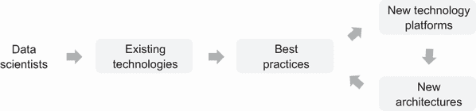

图 10.1 持续变化的数据科学技术景观

这种做法始于数据科学家编写脚本来处理企业中已有的数据。随着时间的推移，更多精细的技术被创造出来，以处理各种数据源，以*速度*摄取和转换，并以*大量*存储以通过历史分析和预测洞察为业务创造价值。关于处理数据的种类、速度、数量和价值的最佳实践已被进一步编码到平台中，以管理元数据，提高数据的*可见性*，并确保数据质量和完整性以改善数据的*真实性*，并保护数据免受*漏洞*的影响。

这些在现代数据架构[2]中工作的 7V[1]总结在图 10.2 中。您的特定用例可能只需要该架构中组件的一个子集。随着系统的演变和成熟，可能需要更多相关和有用的组件。

DS 中使用的技术在存储、处理、管理和使用数据方面得到了改进。让我们看看五个趋势可能如何影响您的工作：

+   *数据存储*——数据湖屋

+   *数据处理*——流处理

+   *数据访问*——自助式洞察

+   *模型部署*——数据/ML ops 自动化

+   *数据治理*——特征存储和数据目录

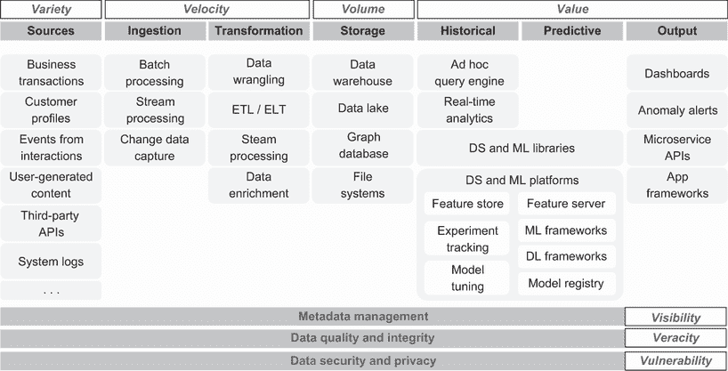

图 10.2 2020 年统一数据基础设施架构

### 10.1.1 数据湖屋

*数据湖屋*是一种解决其他数据管理系统局限性的数据管理范式。自 20 世纪 80 年代以来，应用于商业运营的计算技术涉及收集具有精心设计的架构的结构化数据，并将它们存储到称为*数据仓库*的集中式数据库中。这些数据仓库随后满足企业日常分析和报告需求。

在 2010 年代数据种类、数量和速度的爆炸性增长中，为新数据源制定架构的速度成为将数据输入数据仓库的瓶颈。即使数据已进入数据仓库，DS 和机器学习项目通常需要采用替代方法从原始数据中提取洞察。随着人们开始保存原始数据的副本，*数据湖*应运而生。数据湖使数据科学家能够首先收集数据，然后确定最合适的架构，并在稍后将从数据湖中的数据移动到数据仓库。

从数据湖中的原始数据到数据仓库的附加处理步骤为架构开发提供了灵活性。这也意味着关键数据被存储了两次——一次在数据湖中，一次在数据仓库中。这些位置的数据需要保持一致，并且任何数据治理工作都需要在多个位置进行。

数据湖屋结合了数据仓库和数据湖的最佳特性。它提供了数据仓库的数据结构和数据治理功能，并使用类似数据湖的低成本存储。用户可以逐步提升其湖屋中数据的品质，直到其准备好被消费。分析应用可以直接连接到湖屋，消除了数据湖和数据仓库之间的数据一致性问题的困扰。数据湖屋的早期例子包括 Databricks 平台、Azure Synapse Analytics、Google BigQuery 和 Amazon Redshift Spectrum。在你领导分析项目和机器学习模型时，你可以寻找基础设施中的低效模式，并评估数据湖屋是否可以减少你的数据治理负担并加速你的进展。

### 10.1.2 流处理

*流* *处理* 是一种基于事件的计算范式，正成为企业的中枢神经系统[3]*.* 传统计算以数据库为中心，并假设人类操作员在这些数据库中创建、更新和删除记录。

随着更多商业决策，如库存管理、营销、定价和运输路线，通过智能算法自动化，业务流程可以更加简化，以便软件代理能够实时交互和响应事件。

在许多现实世界的商业用例中，一个事件可以触发各种反应。以超市中一盒谷物的销售为例，销售事件可以影响定价、报告、运营、库存管理、运输和采购。在流式系统中，销售可以是一个在流式系统中广播的事件，相关的受影响软件代理可以监控此类事件并决定是否触发额外的操作。

这种基于事件的范式允许不同的软件驱动的业务功能以软件的速度实时或近实时地做出反应，这可以显著提高业务的效率。在简单的零售示例中，近实时响应可以提高库存周转率，同时以更低的库存提供相同的服务质量。

流式范式需要不同的方式来处理和管理用于分析和预测建模项目的指标和特征。它们对处理延迟也更加敏感。在双速架构中，流也可以与传统数据库很好地共存。这在第 8.1.1 节中的案例 1 中已有讨论。在你领导数据科学工作以创建特定的智能软件定义业务流程时，你可能需要考虑你的智能业务流程最终如何成为新兴软件定义公司的中枢神经系统的一部分。

### 10.1.3 自助洞察

*自助式* *洞察*是通过基于数据分析师和数据科学家最佳实践的过程和平台，为业务决策者实现数据洞察创建的民主化。当业务决策者寻求数据来指导业务的发展和运营时，存在常见的用例和临时请求。常见的用例可以通过数据仪表板来解决。分析团队通常随时待命以处理任何临时请求。成功满足这些请求有两个关键标准：

+   *信任*—提供的分析是准确的，并且可以在适当的情况下进行解释。

+   *时效性*—分析在业务决策所需的时间内完成。

当数据科学团队满足请求时，数据科学家的专业知识确保了对结果的可信度。由于服务请求的资源总是有限的，时效性可能是一个挑战。

自助式方法通过允许业务决策者独立于数据科学团队访问洞察来利用技术平台解决时效性问题。然而，必须建立流程以确保自助式洞察得出的结论的准确性，以维持对数据的信任。

图 10.3 说明了在不同成熟阶段提供自助式洞察所需的技术量。当用例已经明确时，通常使用仪表板。

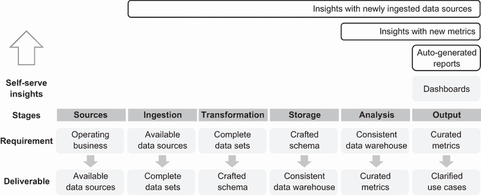

图 10.3 自助式洞察能力范围

在销售环境中优化数据和报告时，可以通过标准化的模板自动生成报告或演示文稿。LinkedIn 的 Project Merlin 就是一个例子，数据科学团队自动从数据中生成销售演示文稿。

如果某些指标尚未开发，现成的分析平台具有拖放功能，允许业务决策者在不学习查询语言的情况下，从数据仓库中的数据探索和开发新的指标。当数据源尚未进入数据仓库时，现有的数据集成供应商，如 funnel.io 和 Domo，可以摄取特定领域的源数据，如营销工具，带有预设计的模式和指标，并输出到 BI 工具，如 Tableau 或 Looker，无需编码。许多中间的摄取和转换步骤已作为集成的一部分自动化，从而简化了引入新数据源以发现洞察的过程。

当你领导数据科学团队通过自助式洞察实现数据访问民主化时，需要管理的一个关键权衡是准确性与效率之间的权衡。你负责通过数据治理政策来维护数据的信任，以防止业务伙伴得出不一致的结论。只有当洞察的生产效率提高而没有被任何验证或审批流程所阻碍时，自助式洞察才有价值。

### 10.1.4 数据和机器学习操作自动化

*数据*和机器学习操作自动化（DataOps）是一套实践和平台，用于可扩展和可靠地从开发到生产交付数据科学和机器学习能力[4]，[5]*.* 这些是确保 DS 和机器学习模型在模型生命周期内持续产生预期商业价值的基本学科。

| 078 | 数据和机器学习操作自动化是一套确保数据科学和机器学习分析和模型在其生命周期内持续产生预期商业价值的基本实践和平台。 |
| --- | --- |

许多早期数据/ML 流程都是基于临时性的，一次性的努力来准备特征管道、数据和服务模型，以及监控数据问题。以这种方式在生产中部署模型可能是一个成本高昂的过程，从而降低了 DS 项目的投资回报率。

图 10.2 展示了成熟的数据/ML ops 作为 DS 和 ML 平台的一部分的主要组件，包括具有版本控制的特征存储、特征服务器、ML 框架、实验跟踪、模型注册表和模型校准过程。数据/ML ops 还包括数据异常监控和模型 API 服务作为特征输出的基础设施。例如，你可以开发一个基于历史和实时数据训练的算法的一组特征，以开发一个金融欺诈检测模型。为了负责任地部署模型，数据/ML ops 的最佳实践包括：

+   维护和监控输入数据质量和输出质量

+   维护独立的开发、集成和生产环境

+   使用分支和合并对数据处理步骤进行版本控制

+   在数据处理步骤中对特征进行版本控制

+   虚拟化/容器化部署以实现可扩展性和避免系统依赖

+   维护模型参数重新校准的节奏

当你领导 DS 将数据科学和机器学习管道投入运营时，你的责任包括构建 DS 和 ML 平台，使其在生产中可扩展且稳健。

幸运的是，你可以考虑一系列解决方案。你可以为你的特定需求开发专有的内部解决方案。或者，你可以利用开源项目，如 Feast 或 Hopsworks，用于你的特征存储或 MLRun 用于机器学习实验跟踪。你也可以考虑一个功能齐全的产品，如由开发 Michelangelo（Uber 使用的特征存储）的团队构建的 Tecton。

### 10.1.5 数据治理

*数据* *治理* 包括评估、管理、使用、改进、监控、维护和保护组织信息所需的人员、流程和技术平台。数据治理不仅涉及对敏感数据集用户身份的验证，它还涵盖了一系列广泛的关注点，包括管理数据架构、数据质量、元数据、数据安全、数据操作、参考和主数据，以及文档和内容。图 10.4 展示了数据治理的责任。

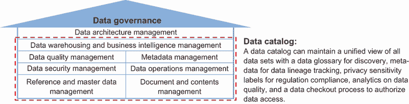

图 10.4 使用数据目录管理数据

早期数据治理工作主要集中在将数据集分类为公共、专有、机密、敏感和个人类别。然后，为了安全和法规合规目的，在分类之间管理数据访问，审批流程通过手动步骤进行控制。

通过数据洞察的民主化，一个组织中的指标和报告数量可以迅速增加。这种增加给数据集分类和访问审批带来了压力。它还增加了在不同业务功能和单位中出现多个类似指标版本重复的可能性。指标的重复可能导致混淆、信任丧失和商业决策的不一致。你该如何解决责任爆炸的问题？

你可以使用数据目录平台来维护所有数据集的统一视图。数据目录维护了正在使用中的指标的数据术语表。有了数据目录，你可以制定一个保持定义一致性的流程。你的数据目录和术语表可以最小化混淆并提高你对组织数据资产信任度。

| 079 | 指标的重复可能导致混淆、信任丧失和商业决策的不一致。数据目录和术语表可以最小化混淆并提高你组织对其数据资产的信心。 |
| --- | --- |

数据目录可以包括描述数据血缘、涉及隐私的数据敏感性以及数据的可用性、正确性、完整性和鲁棒性特征的额外元数据。数据血缘描述了数据集之间的依赖关系。你可以用它来更好地评估数据源失败时的影响，并通过数据依赖链更好地追踪数据输出问题。隐私敏感性信息可以支持 GDPR 和 CCPA 合规要求，并有助于自动化符合法规和安全的数据访问管理。

创建数据目录可能需要花费大量时间。幸运的是，高级数据治理系统可以自动从数据管道及其执行日志中解释元数据。仍需要一些人工整理来标记可能包含个人身份信息的模糊字段。例如，搜索查询历史可能包含对自己进行的搜索，以及财务交易描述可能包括与账户持有人姓名的工资单交易。

对于希望获取数据的数据科学家来说，数据目录自然倾向于购物和结账范式。人们可以浏览目录以查找要使用的数据源，将它们放入购物车，并通过结账流程请求访问，数据交付流程可以包括一个可审计的审批流程，对数据请求者透明。

在领导数据治理过程时，您可以开发一个内部数据目录。您的努力可以利用开源工具，例如 Amundsen，或者考虑具有企业解决方案的供应商，如 Informatica、Collibra 和 Alation，以帮助管理数据、人员和数据治理流程。

### 10.1.6 对主要架构趋势的定期审查

在本节中，我们讨论了数据科学中的五个主要架构趋势，包括：

+   *数据存储*—机器学习和分析用例正在数据湖屋中汇聚。

+   *数据处理*—流处理正在成为具有自动化决策的业务流程中枢神经系统。

+   *数据访问*—分析正在通过自助洞察实现民主化。

+   *模型部署*—数据/机器学习操作和自动化正在简化智能能力部署。

+   *数据治理*—数据治理是将数据作为企业增长的资产，而不是作为合规性责任。

每隔几个季度，探索技术格局的变化是值得的。数据科学是一个快速发展的领域，每天都有一些新的最佳实践被发明和实施。这些新最佳实践被纳入新的技术平台，允许构建新的架构，以实现新的数据科学能力，从而推动业务影响。跟上行业最佳实践和最新架构是有效数据科学领导者的重要技能集。

| 080 | 数据科学是一个快速发展的领域，每天都有一些新的最佳实践被发明和实施。跟上行业最佳实践和最新架构对于有效的数据科学领导者至关重要。 |
| --- | --- |

## 10.2 组织

组织是为了整合个人努力以更快、更有效地实现目标而建立的。作为 DS 领导者，了解你的公司或组织的结构可以帮助你明确你的角色，具体化你的责任，识别合作伙伴，并构建团队结构，以更好地将个人努力整合到一个可重复和可扩展的过程中，从而实现商业价值。

DS 是一个新兴领域，仍在尝试最佳实践以产生商业影响。作为 DS 领导者，在你设计有效方法将 DS 努力整合到你的组织中时，如何更根本地思考？

让我们看看三种传统的组织结构：职能结构、部门结构和矩阵结构，以及一种称为*Holacracy*结构的替代组织结构，该结构模仿了具有自我管理等级单元的生物体，如细胞、器官和生物体。这些在图 10.5 中展示。

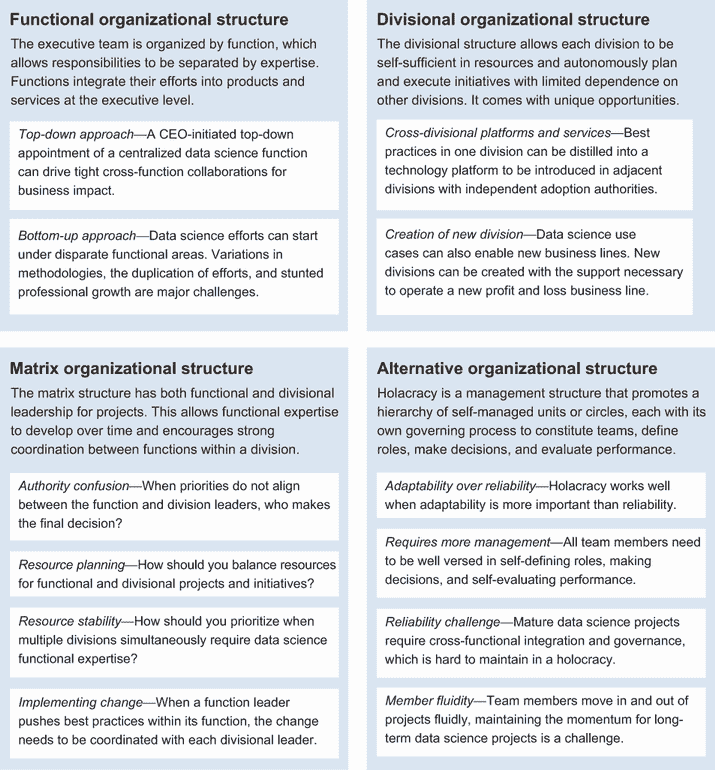

图 10.5 数据科学运作的四大主要组织结构

让我们讨论数据科学（DS）如何在这些组织结构中运作，并通过劳动分工、整合机制、决策权分配以及设置和维持组织边界等视角进行对比。

### 10.2.1 职能组织结构

许多公司采用职能结构组织。你可以在执行团队的组成中识别这种结构，该团队有具有职能领域专业知识成员，例如首席技术官、首席营销官、首席运营官、首席产品官和首席财务官。这种结构在单一产品线在单一地理位置运营的公司中很常见，有时也用于像苹果这样拥有许多产品线的大型公司。

职能结构允许通过专业知识来分离责任。通过在执行层面将不同职能的努力整合到产品和服务中，创造商业价值。优先级作为公司确定，资源和计划分配给职能。每个职能都有权在其职能领域内选择执行公司整体战略的策略。

当数据科学家是某个非数据职能的成员时，他们通常处于支持角色，职业发展路径不明确。当公司致力于建立数据职能时，数据科学家的职业发展路径可以变得更加清晰。

在具有职能结构的公司中，数据科学（DS）的引入有两种方式：自上而下或自下而上。在自上而下的方法中，首席执行官任命一位高级 DS 领导者来建立一个职能。在自下而上的方法中，各种职能领导者开始在特定项目中尝试 DS 能力，然后将成功的案例扩展到多个项目和职能中。

自上而下的方法

当对 DS 能为公司做什么有明确期望时，由 CEO 发起的自上而下的方法可以很好地工作。这表明了强大的执行支持，以推动 DS 倡议，这需要紧密的跨职能协作以产生业务影响。在这种环境中能够成功的 DS 领导者有三个优势：

+   强大的能力快速获取领域知识，以识别和优先处理公司内的用例

+   强大的关系建立能力，以影响同级功能部门的执行领导进行项目合作

+   强大的能力吸引人才建立功能

当执行目标不明确或 DS 领导者缺乏一些这些优势时，有一些常见的失败模式需要注意。前三项包括：

+   *数据基础设施尚未成熟到足以支持有效的 DS 倡议*——CEO 可以提前雇佣 DS 领导者[6]*，而没有可供他们成功的数据基础设施和业务案例。缓解措施包括雇佣顾问或兼职首席数据官（CDO）以提供关于澄清 DS 方向的咨询，并在建立整个功能之前雇佣一些初级数据科学家进行概念验证项目。

+   *与合作伙伴功能中的真实业务案例脱节*——DS 功能可能会沉迷于构建不符合业务需求或适应业务变化的证明概念项目。缓解措施包括识别和产生快速胜利，并在承诺更大的基础设施项目之前首先保持对业务需求的紧密关注。

+   *成为执行咨询部门，调查临时业务问题*——优先事项集中在紧急的、立即的关注点上，而不是战略上必要的赌注。缓解措施包括识别战略商业机会、制定路线图，并与执行团队的其他成员协调优先事项，以实现早期胜利，使公司走上更战略性的道路。

在自上而下的方法中，DS 领导者优先考虑并专注于几个具体的早期胜利至关重要。很多时候，具有学术研究背景的 DS 领导者开始许多项目以规避其中一些可能失败的情况。这导致项目失败，不是因为缺乏潜力，而是因为缺乏资源或对每个项目的关注。

自下而上的方法

在功能型组织结构中，DS（数据科学）努力可以从任何功能领域开始。在工程组的技术功能下开始的努力可能被称为 ML 工程。当努力从市场营销开始时，它可能专注于客户细分或转化。在财务领域，它可能专注于利润优化或销售预测。在运营功能下，它可能专注于增长黑客、物流优化、客户服务智能或定价优化。

在这些自下而上的方法中，DS 用例首先在特定职能内进行探索。一个职能的用例成功可以激励其他职能开始探索各自职能中的 DS 能力。虽然这种方法允许 DS 努力保持接近业务需求，但也创造了多个挑战：

+   *跨职能的努力重复和方法论的变化*——DS（数据科学）的努力可以在跨职能之间重复。不同的业务决策可能源于从相同基础数据计算出的不协调指标。

+   *职业发展有限*——不同职能的数据科学家通常向非数据科学家经理汇报。数据科学家的职业发展可能受限，导致人才流失和机构知识的丧失。

在公司中缓解这些挑战的一种技术是将 DS 提升为管理层的一个独立职能，由首席数据科学家或首席数据官领导。这种结构允许在 DS 职能内建立专业知识，最佳实践可以在跨职能中制度化，从而随着时间的推移提高 DS 效率。它还允许由同行数据科学家和 DS 经理评估工作绩效，他们可以认识到对业务的努力和影响。

展望未来，随着越来越多的首席执行官认识到数据职能的战略重要性，它可能像业务组织中的技术职能一样成为标准。本书正是基于这种情景撰写的，即需要更多数据领导人才来承担市场中的执行领导角色。

随着公司规模的扩大，沟通成本增加。大型职能之间的协调对职能领导者来说可能是压倒性的，因为他们必须在做出决策时保持对自己职能的良好可见性，并了解其合作伙伴职能的优先事项和路线图。这就是部门组织结构可以提供帮助的时候。准备好深入研究了？让我们开始吧！

### 10.2.2 部门组织结构

部门结构允许组织根据产品、地理区域或市场细分进行划分。每个分区在资源上都是自给自足的，可以自主地计划并执行其商业倡议，对其他部门的依赖性有限。

另一种理解差异的方法是，职能结构是由创建产品或服务所需的不同*输入*专业知识来组织的，而部门结构是由产品和服务所针对的*输出*产品或客户细分市场来组织的。

在劳动分工方面，部门结构允许每个部门专注于为其自己的客户群体提供服务，并对其自己的部门承担损益责任。路线图、目标和资源分配的权力被委派给部门，以实现更有效的决策。个人努力的整合发生在部门层面，部门间协调有限。这种结构适用于为相对静态的客户群体提供稳定业务模式的场景。静态客户群体的例子包括消费者与企业部门，以及地理上分布的客户群体。

作为数据科学领导者，了解这些结构对于设定跨部门协作和协调的适当期望很重要。除非 CEO 办公室有具体的紧急协调倡议，否则跨部门的 DS 倡议可能会面临重大阻力。

| 081 | 部门组织结构允许每个部门在资源上实现自给自足，因此它可以独立地计划和执行其业务倡议。然而，除非 CEO 办公室有具体的紧急协调倡议，否则跨部门的科学数据倡议可能会面临重大阻力。 |
| --- | --- |

虽然大多数数据科学家的职业成长通常局限于一个部门，但在具有部门组织结构的公司中，强大的数据科学领导者存在显著的机会。部门内部的成功案例，例如推荐平台、反欺诈能力和成本节约/收入增长的最佳实践，可以提炼并在部门间共享。这些能力、实践和平台可以通过两种方式创造价值：

1.  *跨部门平台* 和 *服务* — 一个部门中的最佳实践可以提炼成技术平台，并在相邻部门中引入。由于每个部门都有其采纳权限并拥有自己的损益核算，早期采用者可以提供关于采纳益处的定量反馈。这些成功案例可以形成强大的企业级采纳案例，尤其是在拥有数百个部门的的大型企业中。每个部门都可以成为您最佳实践和平台的客户。

1.  *创建新的部门* — 数据科学用例还可以启用新的业务线。客户推荐服务可以从产品推荐系统开发；风险评估服务可以从欺诈检测技术开发；以及从部件疲劳和系统故障的预测中开发出降低成本的预测性维护服务。部门组织结构允许创建新的部门，这些部门拥有运营新的损益业务线所需的多功能性支持。这将在第 8.3.3 节中更详细地讨论。

虽然部门组织结构可以简化部门内的决策，但像 IT 或 HR 这样的功能当在部门间集中时可能更有效率。也存在客户可以要求在整个产品部门获得一致参与体验的情况。这就是混合或矩阵组织结构可以发挥作用的地方，我们将在下一部分讨论。现在可能是一个休息的好时机，让功能和部门组织结构部分深入人心。

### 10.2.3 矩阵组织结构

*矩阵结构*，或混合结构，旨在通过在功能内部和部门之间紧密协调，避免功能和部门结构的局限性。一个项目团队成员向功能领导者和部门领导者报告，通常一个作为直线经理，负责绩效和晋升，另一个作为虚线经理，负责咨询和建议。这种结构允许在组织内部发展功能专业知识，并允许在部门内部高效地实现功能之间的协调。

这种结构对于数据科学（DS）来说可能是理想的。将 DS 作为其中一个功能，DS 领导者可以在功能内部建立深厚的专业技术知识和最佳实践，并在功能内部制度化。功能焦点提高了功能的效率。同时，DS 团队可以在每个部门内识别机会并实现影响。部门焦点提高了对各个部门特定商业挑战的响应能力。

| 082 | 矩阵结构旨在通过在功能和部门之间紧密协调，避免功能和部门结构的局限性。它非常适合数据科学，团队可以在功能内部和部门之间建立深厚的领域和技术知识，制定最佳实践，并在功能内部和部门之间制度化。但这也伴随着显著的沟通成本。 |
| --- | --- |

然而，矩阵结构也存在其挑战。有四个主要挑战需要注意，但可以通过管理技巧克服。以下列出的四个主要挑战是权威混淆、资源规划、资源稳定性和变革管理：

+   *权威混淆*——当功能领导和部门领导之间的优先级不一致时，由于直线报告和虚线报告，可能会出现权威混淆。这种混淆通常发生在资源有限必须用于通过发展功能最佳实践来提高效率或扩大产品部门能力的情况下。这种情况通常不是在危机时期发生的，当时所有领导都在为生存而战，而是在资源受限的增长时期发生，当时有多个成功路径，每个路径都受到不同领导的青睐。

    对抗这种混乱的一种技术是强有力的行政领导，公司可以围绕一两个清晰的关键绩效指标（KPI）团结起来。行政关注点可以用来仲裁和优先处理各种前进路径。

    其他优先级技术包括在早期项目中优先考虑以产品为导向的方法，以便敏捷地迭代以实现产品/市场匹配，或者在后期项目中优先考虑以功能为导向的方法，以制定高效的执行方案来增加收入和盈利能力。

+   *资源规划*—在每次 3 至 12 个月的规划周期中，在双重报告矩阵结构下，DS 领导者必须确定如何平衡功能和部门项目及倡议的资助。

    大多数 DS 项目对于 DS 功能路线图和各个部门的路线图都是至关重要的。例如，推荐引擎项目可以是 DS 功能路线图的一部分，用于建立用户理解以实现更好的用户细分。它也可以是业务部门路线图的一部分，用于增加产品参与度和提高用户保留率和 LTV。

    然而，其他项目，如 A/B 测试能力的更新、模型部署方法和数据一致性和治理项目，可能对特定部门的影响很小，但对 DS 功能在多个部门之间提供服务来说具有高度战略性和重要性。

    在矩阵结构中，你将如何确定资助哪些功能和部门项目及倡议？一种常见的方法是为功能倡议保留 10-30%的容量，作为偿还技术债务和投资未来效率的税收，同时将大部分容量用于推进部门的路线图。高管之间的高级别协议最小化了个人数据科学家在竞争利益之间寻找平衡的压力。

    对于快速增长的 DS 功能，另一种方法是让当前团队成员专注于推进部门的路线图，指定偿还功能技术债务的项目，并在过程中记录未来效率的机会。新 DS 团队成员可以将他们的入职项目集中在执行 DS 功能倡议上，在他们被分配特定部门的项目之前。这种方法可以为新 DS 团队成员提供更温和的入职，并使他们能够带着一些功能视角承担他们后来的部门责任。

+   *资源稳定性*—在一个矩阵结构的公司中，多个部门可能同时需要 DS（数据科学）功能的专业知识。通常，在优先级排序的常见做法是，为较大的、更成熟的部门分配稳定的资源数量，然后在资源可用时为处于早期阶段的部门配备人员。这种做法可能导致新兴项目从不同的团队成员那里获得间歇性的资源分配。虽然这种方法可能适用于完成软件开发项目，但对于 DS 项目可能是有害的。

    DS 项目在执行深入分析、制定现实路线图或构建预测解决方案方面具有随着时间的推移而学习到的重大背景。当从季度到季度为早期阶段部门分配不同的数据科学家时，项目启动的额外开销使得这些分配非常低效。

    解决这一问题的方法之一是为早期阶段和成熟阶段的部门都指定联系人。当一个早期阶段的部门无法分配一个完整团队成员的时间时，你可以为该部门分配部分资源，以便同一团队成员可以成为多个早期阶段部门项目的联系人。对于成熟部门，只要团队中有成员保留其机构知识，当需要重新分配资源或团队成员希望跨部门拓宽经验时，其他团队成员在部门之间移动就有更大的灵活性。

    通过拥有专门的联系人，你可以保持早期阶段和成熟阶段的 DS 背景。你还可以在需要时灵活地在部门之间转移资源。

+   *实施变化*—当职能领导者试图在职能内推广最佳实践时，这不可避免地会影响多个部门的过程。在职能组织结构中，职能有权力直接推广最佳实践。在矩阵组织结构中，职能领导者需要与每个部门领导者合作，以推广其最佳实践。

    虽然这个过程提供了检查和平衡，以确保新最佳实践引入的变化不会显著地使某些部门处于不利地位，但它可能会显著减缓实施必要变化以消除现有技术债务和为系统扩展做准备的速度。

    作为 DS（数据科学）领导者，在矩阵结构中实施变化的一种技术是找到最初的一个或两个部门来带头推动变化，证明变化的价值，然后获得 CEO 的支持，以自上而下地推动变化进入每个部门。为了实施变化，你可以在资源规划期间利用为实施功能级倡议预留的 10-30%的容量，以确保资源得到保障以完成变化。

好的，关于混合或矩阵结构的内容已经很多了。准备好吧，因为接下来我们将讨论看起来有些不同的替代结构。

### 10.2.4 替代组织结构

功能性、部门性和矩阵结构都是传统的管理结构，在这些结构中，你可以整合 DS（数据科学）的努力以产生企业价值。在这些结构中，管理层负责制定战略路线图、构成团队、定义角色、做出决策和评估绩效。在分布式计算和用户生成内容的时代，管理层的作用也可以被分散和民主化吗？

*Holacracy*是一种促进自我管理单元或*圈*的层级结构的管理模式，每个圈都有自己的治理流程来构成团队、定义角色、做出决策和评估绩效。这种结构在应对市场中新出现的需求时可以非常灵活，因为圈子的成立是为了解决业务需求，当目标达成或不再相关时，圈子会被解散。

一个成功的例子是 Zappos，一家在线鞋和服装店。当 Zappos 实施 Holacracy 时，其 150 个部门单位演变成了 500 个圈。每个圈都是组织的基本组成部分，以目的构成，角色由集体指定并分配给圈成员以完成工作。每个员工可以成为多个圈的一员。在 Zappo 的案例中，500 个圈是由 1500 名员工在项目、职能和部门上形成的[7]。

对于没有亲身体验过的人来说，Holacracy 可能听起来很混乱。实际上，这个过程比许多人想象的更有序。每个圈都要经过严格的构成过程，其目的必须足够明确，以吸引团队成员加入圈并承担其角色。为了防止每个人都只加入听起来很酷的项目而忽视日常任务，有系统让高管通过确定圈子的业务价值来给圈点数。这些点数可以用于个人招募其他人员担任角色。

作为 DS（数据科学）领导者，在 Holacracy 中工作既有回报也有挑战。涉及探索和原型设计的 DS 项目往往吸引有工程和产品背景的个人。模型维护和迭代可能会被忽视，导致 DS 技术债务随着时间的推移而积累。

| 083 | Holacracy 是一种促进被称为*圈*的自我管理单元层级的管理模式。在 Holacracy 中工作既有回报也有挑战。探索和原型设计项目往往吸引资源，而模型维护和迭代往往被忽视。 |
| --- | --- |

轮转制组织结构对于适应性比可靠性更重要的企业来说可以很好地工作。实际上，这个过程需要更多的管理，因为所有团队成员都需要精通自我定义角色、做出决策和自我评估绩效。成功取决于：

+   在轮转制过程中受过良好训练的成熟团队成员

+   对项目全生命周期的深入了解，以预测资源需求

+   能够明确界定角色和责任

+   强大的项目管理工具支持建立、识别和加入项目

+   强大的领域知识，以提供带有跟踪支持的绩效反馈

轮转制结构在机会探索和概念验证工作的早期阶段可以很好地工作。这些早期项目范围有限，通常有立即可证明的早期成功。

随着数据科学（DS）项目逐渐成熟，跨职能整合和治理在建立公司范围内的最佳实践和平台方面变得至关重要。为了项目的成功，理解制度细微差别和系统陷阱的团队成员需要在多个迭代中与项目保持一致，通常没有立即的短期成果。在轮转制（holacracy）结构中，当团队成员在项目之间流动时，保持成熟 DS 项目的势头面临重大挑战。

一旦 DS 实践和平台成熟，轮转制结构可以再次很好地工作，随着时间的推移，逐步优化良好架构的过程和系统的子组件，带来可证明的系统级短期效益。如果您在轮转制结构下管理 DS 团队，有一些技术可以帮助：

+   为项目阶段建立具有长期目标和明确关键结果的圈子，可以帮助保留对数据和领域细微差别有制度知识的团队成员。

+   维护可重复、可转移和可发现的结果的文档，以便在团队成员更替或因其他项目请假后可以继续努力。第 2.2.3 节更详细地讨论了这一点。

+   确定执行赞助以吸引跨职能团队成员参与重要的整合和治理项目，以克服提高 DS 成熟度水平的协调障碍。第 6.1.3 节更详细地讨论了确保执行赞助的内容。

您现在已经看到了操作 DS 的四个主要组织结构。让我们总结一下它们中的机会和挑战。

### 10.2.5 在各种结构中管理机会和挑战

DS 功能的作用是贡献其技术专长和业务洞察力，以便它们可以整合到更大组织的产品和服务中。不同的组织结构带来了独特的机遇和挑战。我们讨论了四种组织结构：职能结构、部门结构、矩阵结构和轮转制结构。

在职能结构中，数据科学只是众多职能之一。虽然在该职能内建立专业知识有很大的机会，但数据科学领导者应小心避免失去对业务需求的关注。

在部门结构中，组织根据产品、地理或市场细分进行划分，其中数据科学职能被分配到每个部门。这种结构非常适合快速决策的部门级别。数据科学领导者应警惕部门间重复的努力。

在矩阵结构中，数据科学团队同时向职能主管和部门主管汇报。这种结构增强了职能和部门之间的协调，但代价是可能存在角色混淆，并且可能需要更高的沟通成本。

在具有自管理单元等级制度的 Holacracy 结构中，数据科学家被分配到项目中，这种结构为 PoC 探索提供了最佳机会。然而，为了确保维护资源和支付技术债务，项目需要被紧密管理。在欣赏数据科学在这些组织结构中茁壮成长的机会和挑战的同时，您可以调整您的关注点，并管理这些结构带来的系统性陷阱。

## 10.3 机会

作为数据科学领域的领导者，您很幸运地处于当今增长最快的职业之一。在评估您的下一步职业发展时，您可以回顾在您特定的职业阶段最重要的因素，并评估潜在的行业、公司、团队和机会的角色。

您的领导能力的一个重要组成部分来自于您在工作中可以培养的深厚行业专业知识；因此，选择进入哪个行业是数据科学领导者的一项关键决策。您可以考虑不同行业的规模和增长率以及它们对数据科学人才的需求强度。最重要的是，您应该调查您个人对哪个行业有激情，这样您就可以在不可避免的项目失败和工作场所崩溃中保持积极的态度。

数据科学被应用于所有成熟阶段的公司，从初创公司到百年老店。数据科学的应用可以根据公司的成熟度阶段而变化。您加入的公司成熟度水平的选择可能会影响您构建领导能力和身份的储备。

领导力在团队环境中得到实践，因此评估您要加入的团队至关重要。考虑因素包括招聘经理的成熟度、基础设施的成熟度和实践成熟度。

要了解特定数据科学角色的职责，请参考本书中的能力和美德。这些能力和美德可以帮助您识别特定行业、公司和团队的需求。它们还可以帮助您构建一个关于您自身优势的故事，这将使您最适合现有的角色或您可以提出的新的角色。

一旦你被选中担任某个角色，你还需要负责自己的入职。让我们讨论一下行业、公司、团队和角色层面的考虑因素，以评估你职业生涯下一阶段的机遇，以及一旦你决定追求某个机会，一些有效的入职策略。

### 10.3.1 评估行业

你可以将数据科学应用于广泛的行业。在评估要进入的行业时，考虑大型行业将拥有最多的就业机会，而快速增长的行业将在未来创造许多领导机会。对于具有适当经验水平的数据科学家来说，对数据科学家需求最高的行业可能会在薪酬上给予更高的回报。图 10.6 展示了在选择行业时的一些重要考虑因素。

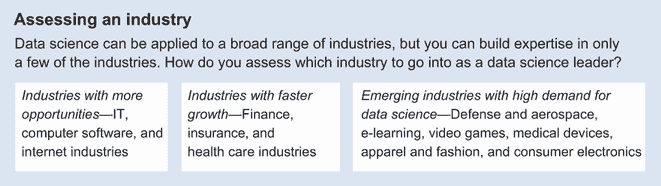

图 10.6 评估目标行业的三个视角

截至 2021 年，数据科学（DS）对经济的贡献仍处于起步阶段。根据 LinkedIn Talent Solutions 的数据，该学科在*IT、计算机软件和互联网*行业中获得了最多的关注。这三个行业共同雇佣了美国拥有数据科学家职称的 42%的专业人士。这个 42%的数字并不令人惊讶，因为这些行业是计算技术应用的先锋。它们与所有生成和存储负责产生商业影响的数据的计算服务器最为接近。然而，根据美国经济分析局的数据，*数据处理*、*互联网出版*和*其他信息服务*行业在美国私营部门 GDP 中仅占 1.4%[8]。

另一方面，DS 在两个对经济影响更大的领域中也迅速获得了关注。在美国，*金融*和*保险*行业对私营部门 GDP 的贡献为 9.4%，而*医疗保健*行业对私营部门 GDP 的贡献为 7.1%。

在美国，*金融服务*、*银行*和*保险*行业目前雇佣了 12%的数据科学家，需求增长速度比*IT、计算机软件和互联网*行业更快。*医疗保健、生物技术、制药和健康/健康与健身*行业目前雇佣了 10%的数据科学家，增长速度更高。

如果你正在寻找 2021 年在数据科学领域的领导机会，你可以在*IT、计算机软件*和*互联网*行业中找到最多的机会。在未来的几年里，*金融服务*、*银行*、*保险*、*医疗保健*、*生物技术*、*制药*和*健康/健康与健身*行业将创造许多领导机会。

同时，也存在许多对数据科学家需求量大的小型、高增长行业。这些包括国防和航空航天、在线学习、视频游戏、医疗设备、服装和时尚以及消费电子产品。

当选择要追求的行业时，应该选择你热爱的行业。在行业内建立专业知识可能需要两到五年，包括数据细微差别、组织结构障碍和监管障碍。在与行业限制合作的过程中，你可能会遇到许多失败和挫折。在你热爱的行业中，这将使你能够继续前进，成为 DS 领域的领导者。

### 10.3.2 评估公司

全球有成千上万的公司拥有数据科学家，并且越来越多的公司开始招聘。选择一个好的雇主可能是事业起飞的垫脚石，也可能是浪费在临时杂事上的宝贵时间。你在潜在雇主中应该寻找什么？

你可以从公司的成熟阶段和其在行业中的地位来审视公司。这种观点在图 10.7 中得到了体现。

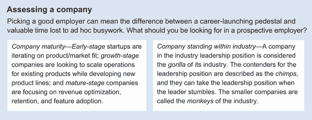

图 10.7 评估加入公司时需要探索的两个角度

公司的成熟阶段包括早期阶段、成长阶段和成熟阶段。成熟阶段在很大程度上决定了所需的 DS 项目类型以及领导这些项目的领导类型。在技术行业中，公司竞争成为某一技术或市场类别的既定标准。许多行业最终成熟到只有一个领导公司，几个竞争者和许多小玩家。公司在行业中的地位可以决定可用的资源和其 DS 活动的重点。

公司成熟度

*早期阶段*的初创公司迭代产品/市场匹配。可能没有多少内部第一方数据可供使用。你可以使用政府和私人第三方数据来源来了解早期客户群体并评估买家旅程、入职和产品参与中的早期指标。处于这个阶段的公司通常还没有收入或只有来自早期客户的有限收入。风险投资支持的公司通常会有种子轮或 A 轮融资。

*成长阶段*的公司已经找到了其产品的市场匹配。对于风险投资支持的公司，这相当于 B 轮或更晚的融资轮次。这些公司已经引入了多个客户并正在扩大客户群。它们通常已经达到 5000 万至超过 10 亿美元的估值，并正在寻求扩大现有产品的运营规模，同时开发新产品线并扩展到更多地理区域以服务更多客户群体。

成长阶段是许多公司开始招聘数据科学领导者的阶段。在第 6.3.1 节中详细说明，成长阶段的公司积累第一方数据以了解其客户的 LTV；估计战略项目的 ROI；帮助营销提高客户意识；优化客户获取渠道；分析新功能采用的速度；并优化激活、收入和推荐漏斗。在多种可能的价值增加数据科学能力中，数据科学团队产生业务影响的空间很大。

你可以通过参考 Wealthfront [9] 的职业启动公司来识别美国的高增长公司。看看是否有你感兴趣的行业和地理位置的公司。

*成熟阶段*的公司可以是私有的，也可以是公有的。它们通常拥有可扩展和可重复的业务模式，拥有稳定的客户和可预测的重复收入流。在成熟公司中，数据科学工作可以专注于收入优化、保留和功能采用。一项特别有影响力的努力是运营一个精确度高的 A/B 测试基础设施，以测量关键指标增量改进。在具有广泛影响力的成熟业务中，关键指标即使只有 0.5%的边际改进也能显著影响收入。

许多成熟公司是使用数据科学能力的先驱，并建立了大型团队以满足其业务需求。苹果、亚马逊、爱彼迎、谷歌、Facebook、微软（拥有领英）、Netflix 和 Uber 都是互联网领域知名成熟公司。许多人可能没有意识到，金融行业的 Capital One、摩根大通和富国银行团队中都有超过 100 名数据科学家。在医疗保健领域，安泰和联合健康集团也有超过 100 名数据科学家。

在美国，数据科学家（按其数据科学团队规模排名）的前 100 名雇主拥有 50 人以上的团队，人数从 50 多到超过 1,000 人。这 100 家雇主共同雇佣了 30%的在职数据科学家[10]。如果你想要管理一个大型数据科学团队，这些公司提供了良好的机会。

对于考虑数据科学从业者顶级公司的平衡列表，你可以探索三个因素：雇主品牌、团队成熟度和团队增长（第 10.3.3 节）。由 O'Reilly Media 前首席数据科学家 Ben Lorica 管理的流行博客 Gradient Flow，从 LinkedIn、Glassdoor 和福布斯最佳工作地点收集数据，为早期职业和成熟数据科学家以及中级到高级数据科学领导者提供了最佳工作地点[11]。

公司在其行业中的地位

在技术行业中，公司竞争成为某一技术或市场类别的既定标准。在《巨猩游戏》[12]中，杰弗里·摩尔描述了行业领导地位的公司为行业的巨猩。美国市场的例子包括谷歌在搜索和 AWS 在云服务。领导地位竞争者被描述为黑猩猩。例子包括微软必应搜索和微软 Azure 云服务。还有许多较小的参与者，被称为猴子。例子包括 DuckDuckGo 在搜索和 IBM Cloud 在云服务。一家公司在行业中的地位可以决定其可用的资源和 DS 活动的重点。

在评估一家公司在其行业中的地位时，你通常可以使用分析师报告中的可用数据来确定其客户覆盖范围、企业估值或市场份额。一家公司通过首先找到产品/市场契合点，然后严格执行其优势以扩大其客户基础，达到巨无霸地位。DS 在提供关于产品/市场契合点的产品迭代中的定量反馈以及在随后的增长阶段优化其捕获市场份额的效率方面至关重要。

当一家公司达到巨无霸地位时，它将享有许多好处。市场上的羊群心态使得公司能够收取更高的价格并确保更高的利润率，从而使得公司能够以更快的速度将利润重新投资于其业务。DS 可以成为这一良性循环的受益者，使其资金充足并努力提升公司的竞争优势。

拥有黑猩猩地位的公司紧随行业领导者之后，但必须在每一笔交易中证明为什么客户应该选择他们而不是行业领导者。当行业领导者犯错时，黑猩猩地位的公司有机会成为行业领导者。DS 努力在创造有助于区分公司从行业领导者的智能功能方面可以具有战略意义。

在一个行业中拥有猴子地位的公司往往在功能上过度承诺，并在价格上低于竞争对手以与行业的巨猩和黑猩猩竞争。它们在行业定位方面本质上处于不利地位，DS 投资 often 有限。由于可用的投资规模有限，DS 领导角色可能具有挑战性。另一方面，这个角色也可能比在行业中拥有巨猩或黑猩猩地位的大公司提供更广泛的职责范围。

在考察下一个行动机会时，了解公司在行业中的地位，并对结果有现实的预期是值得的。如果你能与一个在快速增长的行业中拥有巨无霸地位的公司合作，你可以预期你的团队将会有显著的增长。如果你加入的是一个黑猩猩地位的角色，你可以预期需要创造行业差异化以取得领先。如果你加入的是一个猴子地位的角色，你可以寻找更广泛的职责范围，但可能可用的资源相对有限。

| 084 | 在考察下一个行动机会时，了解公司在行业中的地位，以对结果有现实的预期是值得的。行业领导者、挑战者和小型玩家为职业发展提供了不同的机会。 |
| --- | --- |

### 10.3.3 评估团队

评估团队涉及检查多个维度，包括招聘经理的成熟度、基础设施成熟度和实践成熟度（图 10.8）。了解这些团队属性可以帮助你更好地为机会设定适当的期望。

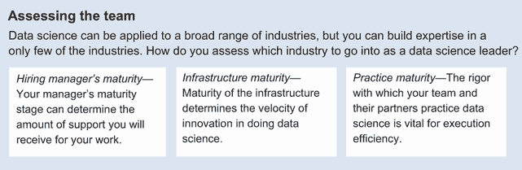

图 10.8 评估你想要加入的团队时需要检查的三个领域

招聘经理的成熟度

当你被雇佣到一个新的职位时，你的经理是你将与之共事的最重要的人。你的责任是与经理委托的公司关键事项保持一致。你将按照经理定义的范围和优先级，以及经理设定的标准来工作。

| 085 | 当你被雇佣到一个新的职位时，你的经理是你将与之共事的最重要的人。你的责任是与经理委托的公司关键事项保持一致。你将按照经理定义的范围和优先级，以及经理设定的标准来工作。 |
| --- | --- |

你的经理可能处于其职业生涯的不同阶段。这些发展阶段包括建立、进步、维护和退出：

+   *建立*——如果你的招聘经理最近晋升到当前职位，他们可能处于建立阶段。正如第二章至第九章中详细说明的，新领导角色的能力和美德是可以学习和实践的。你可能会预期在经理处理新职责时，需要调整方向。你的招聘经理将感激你在他们建立组织信誉时提供的早期成功支持。

+   *进步*—如果你的招聘经理在当前角色中已经成功多季度，他们可能处于进步阶段。他们现在正舒适地在其领导层上实践能力和美德。随着他们的团队以高速度执行，这可以是一个产生成就的绝佳机会。如果你的招聘经理能从你这里得到帮助，提出并反馈大规模倡议以对组织产生更大的影响，他们会非常感激。

+   *维护*—如果你的招聘经理在其角色中已经成功多年，他们可能处于维护阶段。他们已经建立了一套稳定的属性，并继续获得晋升、新的责任和身份的提升。与处于这一阶段的经理一起工作可以非常有益，因为他们既有经验又有精力作为你的职业成长导师。当你向他们展示自己可指导并展示与他们合作时的成长时，你的招聘经理会非常感激。

+   *撤退*—如果你的招聘经理正在管理一个正在衰退的团队，他们可能处于其职业生涯的撤退阶段。你需要观察他们是否对工作产生了冷漠，并已经转而试图避免犯下可解雇的错误。一个指标是团队最近的流失，这表明现有团队成员对经理的信心正在减弱。你应该小心加入这样的团队。

基础设施成熟度

数据和实验的基础设施可以显著加快 DS 中创新的步伐。不同成熟阶段的基础设施要求领导者具备不同的技能才能成功。第 8.1.2 节讨论了一些需要考虑的阶段，包括数据收集、ETL+存储、数据治理和模型治理。表 10.1 提供了你可以使用的具体问题清单，以进行评估。你可以使用最右侧的列作为复选框。

表 10.1 DS 基础设施成熟度检查清单

| 阶段 | 复核清单中的问题 | ? |
| --- | --- | --- |
| 数据收集 | 是否捕获了数据的多样性？ |  |
| 数据源是否完整，可用于分析？ |  |
| 数据是否被捕获用于实验？ |  |
| ETL+存储 | 是否有数据湖来捕获收集到的数据？ |  |
| 数据仓库中的模式是否根据业务需求进行架构设计？ |  |
| 是否支持流处理能力？ |  |
| 数据治理 | 质量检查（可用性、正确性和完整性）是否已自动化？ |  |
| 数据血缘是否已记录、维护并以可搜索的形式提供？ |  |
| 是否对数据生命周期进行治理以维护访问效率？ |  |
| 模型治理 | 模型版本是否被记录和跟踪？ |  |
| 训练环境和生产环境中的特征是否一致？ |  |
| 是否有模型自动集成和部署的能力？ |  |

这些问题中的每一个都可以揭示基础设施是否足够成熟，以便 DS 产生业务影响。例如，对于数据收集，假设您要评估网站上的用户参与度是否被正确捕获以进行分析。仅仅捕获内容上的点击/触摸是不够的，您还需要知道网页或网页元素被查看的次数。捕获查看次数可能比许多人预期的更复杂，因为页面上的某些内容可能需要滚动或展开才能可见。内容通常与网页一起加载，但用户直到执行特定用户操作之前才看到。适当的数据捕获需要在平台和产品之间严格捕获页面加载、用户印象和点击/触摸，这需要一些勤奋和成熟度。

一些 DS 领导者在不太成熟的基础设施阶段也能蓬勃发展，并且不介意将数据整理成可分析的形式。其他人可能需要更成熟的基础设施才能有效。通过了解基础设施成熟度和您的优势，您可以决定一个机会是否适合您。

实践成熟度

实践成熟度描述了 DS 团队及其合作伙伴在 DS 上的实践严谨性。实践成熟度对于团队效率至关重要，并且可能具有挑战性。第 8.1.2 节从高管的角度描述了培养组织数据驱动文化的路线图。在评估机会时，您可以评估三个视角：数据工程实践、数据分析实践和数据建模实践。表 10.2 列出了一些行业最佳实践以供参考。您可以使用最右侧的列作为复选框。

表 10.2 DS 实践成熟度检查清单

| 视角 | 检查清单中的问题 | ? |
| --- | --- | --- |
| 数据工程实践 | 是否有一个稳健的数据工程基础，并具有可接受的服务质量？ |  |
| 是否强制执行数据安全和隐私的最佳实践？ |  |
| 根据数据工程指南，合作伙伴团队是否经常开发并部署到生产环境中的稳健数据管道？ |  |
| 数据分析实践 | 是否遵循了日志记录、仪表化和数据解释的最佳实践？ |  |
| 是否对每个产品变更都应用了 A/B 测试？ |  |
| 是否所有业务线和职能都根据数据分析指南通过自助数据洞察进行数据驱动决策？ |  |
| 数据建模实践 | 功能在开发和生产环境之间是否一致且被监控？ |  |
| 模型是否进行了版本控制并作为中间件部署，以服务于多样化的产品？ |  |
| 合作伙伴团队是否定期阐述和协作新的高影响用例？ |  |

大多数公司尚未达到这些成熟水平。你可以评估团队愿意朝这些方向前进的意愿和执行层的支持。作为数据科学领域的领导者，你的责任是确立一条路径，并带领团队构建一个高效的数据驱动组织。

### 10.3.4 评估角色

在评估你的职业发展机会时，了解公司在 3-12 个月内的使命、优先事项和成功标准可以帮助你集中精力，调整你的目标，并在新的角色中取得成功。这如图 10.9 所示。

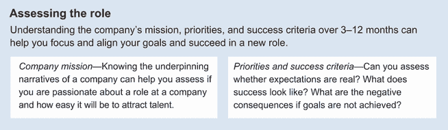

![图 10.9 评估你想要承担的角色时需要检查的两个领域]

公司使命

一个公司的使命定义了其业务、其目标和实现这些目标的方法。你可以在公司的职业页面和新闻稿中找到它，并在公司的博客中讨论。了解公司的基本叙事可以帮助你评估你是否会对公司的某个角色充满热情。如果你是数据科学领域的执行者，你的部分责任是将数据科学能力融入公司的使命中。

当你作为一个数据科学领导者评估一个机会时，你可以在面试过程中观察跨职能合作伙伴是否与公司的使命保持一致。这种一致性对于你的项目和倡议在跨职能合作伙伴的竞争性责任中得到优先考虑至关重要。

公司优先事项和成功标准

公司的使命为公司提供了总体方向。在公司成长的每个阶段，公司层面的倡议都会推动规划过程中的首要任务。这些优先事项伴随着在特定时间范围内要实现的目标，你将负责执行，因此评估以下三个关键问题是至关重要的：

1.  这些期望有多现实？

1.  成功会是什么样子？

1.  如果这些目标没有实现，会有什么负面后果？

你可以将你对行业、公司和团队的评估综合起来，以评估你的招聘经理的期望是否现实。

这种对优先事项和期望的独立评估对于你在考虑新角色时的成功至关重要。数据科学在流行媒体中的潜在影响有时会被过度夸大。如果执行者和招聘经理的期望过高且不切实际，你甚至还没开始就可能已经失败了。各种数据应用可以提供四种不同水平的信心，包括推荐和排名、协助、自动化和自主代理。第 2.1.3 节更详细地描述了它们。你可以参考这些水平来确定你的招聘经理的成功可能是什么样子。

除了理解成功是什么样的，你还应该了解如果目标没有实现，负面后果是什么。负面后果越严重，实现目标就越关键。负面后果，尤其是自然后果，即失败的直接后果，可以非常有助于激励你的团队，跨职能团队优先考虑工作以实现目标。它们还可以帮助你理解情境的约束，并在执行优先事项时避免潜在陷阱。第 7.2.3 节详细讨论了传达后果。

制定新的角色

在某些情况下，当你热衷于加入一家公司或一个团队，而公司又重视你的技能和经验时，他们可能会为你创造一个角色。当你了解行业、公司、团队和优先事项时，你可能拥有足够的信息来提出一个角色描述作为你对公司的报价。

你可以讨论技术路线图和数据驱动文化成熟度路线图的维度，以承担和与公司一起迭代现实的成功标准，以证明新角色的合理性。当你可以开始向公司和组织提供自己的帮助时，你就可以成为一个更有影响力的领导者，以产生业务影响。

### 10.3.5 新角色的入职

作为数据科学领域的领导者，你正在承担项目、团队、职能和公司的重要责任。95%雇佣数据科学家的公司拥有少于 10 人的团队。入职流程通常是基础的，如果不是缺失的话，特别是对于数据科学领导者。要拥有一个成功的入职流程，数据科学领导者通常需要规划自己的入职流程。但你应该从哪里开始呢？

当加入一家新公司或在同一公司内承担新的职责时，你通常有一个时期来建立你的领导身份。对于初级领导职位，可能是 30 天。对于更高级的领导职位，窗口期可能是 90 天。

入职要求很高。有长清单[13]可供数据科学个人贡献者参考。对于不同级别的数据科学领导者，你的入职重点可能会有很大差异。

| 086 | 对于数据科学领导者来说，入职流程通常是基础的，如果不是缺失的话。要拥有一个成功的入职流程，数据科学领导者通常需要规划自己的入职流程。你可以参考自主性、精通和目标作为与你的经理一起工作的三个关键领域。 |
| --- | --- |

你可以将*自主性*、*精通*和*目标*作为与你的经理和团队一起工作的三个关键领域，以提升你的最佳表现[14]：

+   *自主权*—自主权是我们渴望自我指导的愿望。对于 DS 领导者来说，这涉及到在更广泛的背景下做出决策，考虑到你的团队、合作伙伴以及你的第一团队。当你的决策忽略了这些背景时，它可能会被你的经理通过不愉快的升级或导致项目失败而推翻，这可能会在长期内损害你的自主权。

+   *精通*—精通是我们渴望获得更好技能的愿望。对于数据科学（DS）领导者来说，这些技能包括你导航用于 DS 的技术以产生业务影响的能力，以及推动技术和人员决策所需的关系。

+   *目的*—目的是我们渴望做一些有意义和重要的事情。对于 DS 领导者来说，这涉及到将公司愿景、使命和业务线（LOB）战略方向内化，以便将团队的工作集中在对公司最有意义和最重要的事项上。

这些领域在 DS 领导力的每个阶段看起来如何？

技术负责人入职

新的 DS 技术负责人通常是因为某个特定的原因被提升或雇佣的。通常有一套明确的项目和责任定义。确保你了解你责任的范围、可用的资源以及你预期与之合作的合作伙伴，这样你可以在这些限制内行使你的*自主权*。

技术负责人的角色也将有其*目的*的阐述。在你入职过程的第一周，你可以了解公司的愿景和使命、公司范围内的战略优先事项，以及你的团队的工作如何与战略优先事项相联系。

你入职的重点很大一部分是放在*精通*上。对于 DS 技术负责人来说，精通有两个组成部分：

+   导航技术景观

+   与业务和职能合作伙伴建立关系

| 087 | 技术负责人入职可以关注精通的两个组成部分：导航技术景观和与业务和职能合作伙伴建立关系。 |
| --- | --- |

新加入公司

如果你加入了一家新公司，你可能会面临技术景观和合作伙伴关系的陡峭学习曲线。你的技术入职过程不仅仅是获取设备和生产力工具的登录权限。作为一名技术负责人，你的入职涉及对现有基础设施和架构、脆弱点以及待办事项中的现有技术债务的评估。

许多团队都有关于设备和账户设置流程的入职笔记。你可以识别出可以帮助你定位和开始现有流程、基础设施和路线图的伙伴。为了了解基础设施中的脆弱点，你还可以查找过去系统故障的事件报告，这可以迅速阐明系统中的技术债务。

为了与团队成员和商业伙伴建立关系，你可以与你的经理合作，确定早期成功项目。这些项目可以帮助你在团队中确立身份。关系建立和早期成功将在下文详细讨论。一旦你熟悉了技术格局和风险，你就可以更有信心地处理与团队成员、商业伙伴和你的经理的关系。

晋升

如果你在本公司内部晋升，你可能已经熟悉了技术栈。那么，重点可以放在与你新职位中的商业和职能伙伴建立关系上，在那里你有更多的能力提供帮助，而你的合作伙伴对你和团队有新的期望。

建立关系的一种方式是与合作伙伴和团队成员合作，确保对老板和合作伙伴有重要意义的早期成功。这涉及到与老板和合作伙伴合作，在几周内选择并完成项目，以展示商业价值。这些早期成功使合作伙伴对你和你的团队成员交付能力建立信心，这是未来项目优先级评估中的关键因素。

你可以使用三个标准来评估一个项目是否适合早期成功：

+   该项目有一个明确定义的范围。

+   团队和合作伙伴都非常关注的一个显著的、可衡量的商业影响。

+   该项目可以在几周内利用现有资源完成。

早期成功项目的例子包括自动化业务流程以提高商业生产力、产生数据洞察和深入研究，以及为业务运营设计指标的定义。

其他小型项目可能本身不具备明显的短期商业影响。这些包括跟踪规范定义和数据丰富化等工作，这些工作必须整合到其他项目中才能体现商业价值。例如，从头开始构建新模型和 API 以及确保数据一致性可能需要在产品与工程之间进行重大的跨职能协调。当确保了一些早期成功时，这些项目可能更容易推进。你有责任与你的经理合作，确保你的第一个项目能够为你的新技术领导角色提供一个良好的入职。

管理员入职

作为数据科学经理，你是团队成员眼中的公司代表。获得由高管构成的团队目的的明确解释至关重要。同时，你的角色不仅限于技术和关系领导。你负责团队的生产力。虽然技术领导入职侧重于*精通*，但团队经理级别的入职侧重于*自主性*。

对于经理来说，自主性意味着为你的团队做出有效的项目和人员决策，以便快速移动。讽刺的是，获得自主性并不意味着在真空中自己做出决策，而是通过利用一个广泛的帮助网络，这个网络能够将团队、合作伙伴以及你的*第一团队*的关切纳入决策中。图 10.10 展示了经理的主要项目和人员职责。

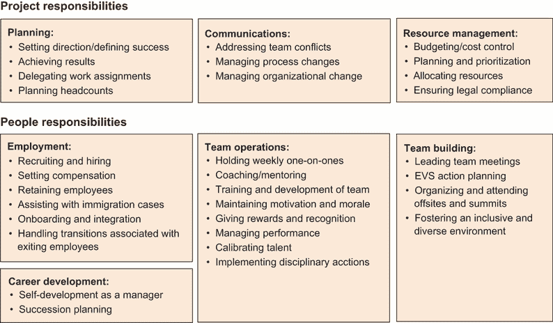

图 10.10 DS 经理的项目和人员职责

备注：你的第一团队由向你经理汇报的同事组成，他们应该共同努力解决你经理的挑战。有关详细信息，请参阅第 6.2.3 节。

| 088 | 管理员入职培训可以侧重于自主性。讽刺的是，获得自主性并不意味着自己做出决策，而是通过获得利用广泛帮助网络的能力，将团队、合作伙伴和同侪的关切纳入你的决策中。 |
| --- | --- |

在项目决策中，关于自主性的四个主要关注领域包括：

+   *业务导向*—作为与合作伙伴和你的第一团队互动的经理，仅仅了解你业务的具体部分是不够的，你还需要了解整个业务的关切。这种理解使你能够超越财务、产品和战略，包括品牌、销售和人才管道，以便在人员和技术决策中考虑这些因素。

+   *利益相关者联系*—DS 是一项团队运动。在项目早期识别关键利益相关者并建立跨职能关系对于理解和减轻项目风险、评估项目可行性至关重要。

+   *期望对齐*—商业发展迅速。无论你认为你的倡议与业务如何一致，都要经常检查和重新对齐，因为情况和优先级可能已经改变。

+   *文化适应*—在新角色中，根据文化是权威驱动、流程导向、共识导向、关系驱动还是其他类型，你可能需要调整你的风格以适应文化。在 DS 中取得成功，调整至关重要，因为你可能需要适应并弥合具有不同亚文化的合作伙伴职能。

在入职期间，你可以与你的经理合作，收集和综合来自你的团队、合作伙伴以及你的第一团队的这四个关注领域的相关信息。这种学习可以帮助你以自主的方式发展你的规划、沟通和资源管理职责。

当管理者变动时，这对团队成员和合作伙伴来说通常是一个压力很大的时期。明星球员可能会开始考虑离开，合作伙伴可能会调整他们的优先级，暂停对某些合作的支持。为了在人事决策中获得自主权，你可以与你的管理者合作，确定一个关键团队成员和合作伙伴的名单进行会面。回顾团队成员过去的绩效评估可以帮助你了解他们的优势，以便讨论他们的职业目标。深入了解你和合作伙伴之间之前的承诺将使你能够维持随着时间的推移建立起来的团队之间的信任。你可以识别出长期任职的伙伴，分享历史成就和承诺，作为你人事决策的背景。在你做出人事决策时，你的管理者可以帮助你确定将与你一起处理许多就业、团队运营和团队建设责任的 HR 合作伙伴。

**总监入职**

当你成为高级领导者时，你从一开始就被赋予了更多的自主权。你的入职重点在于通过设定成功标准和规范来明确你职能的**目的**。

准则是团队履行其责任的基本要求集合。有时被称为**底牌**，是团队被认可为职能的最低要求。标准是一系列可以提供一定水平客户满意度的要求。例如，四星级酒店应有豪华床品、优质毛巾和健身中心。

在 DS 中，职能的**目的**可以从你继承情况的诊断中综合得出。表 10.3 展示了 DS 中诊断框架的一个示例。对于你职能的每个责任领域，你可以指定生产力所需的准则或底牌要求。你可以指定**铂金**标准作为挑战目标，让你的团队在每一个项目中都能达到更高的水平。你还可以为每个责任领域制定愿景，以与合作伙伴对齐路线图并设定长期目标。

| 089 | **总监入职**可以专注于目的。对于你职能的每个责任领域，你可以指定生产力所需的准则或底牌要求。你可以设定铂金标准作为挑战目标，让你的团队在每一个项目中都能达到更高的水平。你还可以为每个责任领域制定愿景，以与合作伙伴对齐路线图并设定长期目标。 |
| --- | --- |

表 10.3 DS 标准操作样本诊断

| 区域 | 准则（底牌） | 铂金标准 | 愿景 |
| --- | --- | --- | --- |
| 目标和关键结果（OKR）规划 | 在建立关系和信任的同时，保持优先级和权衡的透明度 | 预测产品路线图的思想伙伴 | DS 成为所有产品规划流程的组成部分。 |
| 授权数据驱动发布 |
| 跟踪 | 及时发现问题和合作伙伴，优先解决跟踪问题 |

+   *人员*—作为跨职能数据冠军的虎队

+   *流程*—端到端管理以确保跟踪质量

+   *平台*—增强监控系统

| 工程师认为跟踪与开发功能一样重要。 |
| --- |
| A/B 测试 | 对产品发布进行 A/B 测试，并明确假设 | 严格遵循实验指南以平衡速度、质量和风险 [15] | 所有合作伙伴团队积极与 DS 合作定义 A/B 测试并讨论结果。 |
| 通过洞察力进行优化 |
| 建立新的指标 |

+   清晰的使用案例和假设

+   在阐述和定义上的严谨

| 通过定义紧迫的指标来驱动业务价值 | 产品/工程/ AI 以作为章程一部分的量化指标开始倡议。 |
| --- | --- |
| 分析/深入研究/联合报告 | 一旦指标可用，立即提供见解 | 将见解转化为产品路线图 | 以数据为先的产品路线图创建。 |
| 巩固测量和基础 |
| 跟踪健康 | 对数据集的认识以及对业务重要性的分层 |

+   发布数据资产和文档以赋能合作伙伴自助

+   提供办公时间以支持官方报告

| 业务合作伙伴可以独立地查找、查询和解释数据。 |
| --- |
| 数据管道健康 | 维护数据可用性并在需要时进行回填—无需合作伙伴提醒 |

+   使用最新的数据源

+   使用最新的编程语言

+   在客户意识到之前监控、警报、调查和解决上游数据可用性问题

| 达到所有流程的 99.9% 服务水平协议。在 24 小时内解决所有上游数据可用性问题。 |
| --- |
| 指标一致性 | 维护面向高管的指标在组织间的统一性 | 合作伙伴信任并自信地使用所有面向高管的指标 | 合作伙伴将 DS 作为定义成功真相的来源。 |

在您入职的第二个月，您可以与您的上司一起确定您职能的准则和标准，评估差距，并为需要解决的问题制定路线图。然后，您可以专注于您经理对使用他们提供的不同资源所能实现的成本和收益的关注。

一旦您与您的上司就方向达成一致，您可以通过外勤或全员大会与团队沟通您的新愿景，这样团队就可以澄清解释，制定计划，并做出满足标准、追求白金标准以及朝着最终愿景努力的工作承诺。

在第三个月的 30 天里，你可以寻求展示早期胜利的初步进展。这些早期胜利可以帮助你建立有效的执行身份。有了早期胜利，你还可以开始探索更雄心勃勃的举措，例如重组团队、优化流程和构建平台，以执行你为你所在职能的愿景。

管理层入职

在管理层级，公司期望你引导它前进。管理层的责任不太结构化，你被期望拥有自己的入职过程。管理层级入职过程的重点是协商成功并实现早期胜利，这些胜利既包括公司内部也包括公司外部。

成功的入职开始于与老板保持同步，他可能是 CEO。频繁沟通和争取早期胜利是建立信任的关键。这包括在 90 天的入职过程中提前设定期望。你可以将前 30 天保留为一次倾听之旅，旨在提供详细的评估和计划，然后在接下来的 30 天里，调整目标和行动，并在第三个月的 30 天里执行早期胜利。

如 Ancestry 的 CEO Deborah Liu 所分享的[16]，“领导者并非被雇佣来拥有所有答案，而是因为他们能够促进公司共同找到答案。”

| 090 | “领导者并非被雇佣来拥有所有答案，而是因为他们能够促进公司共同找到答案。”——Deborah Liu |
| --- | --- |

详细的评估可以包括你对过去、现在和未来的学习。对于过去，这包括组织的绩效、良好和不良结果的根本原因，以及所发生的变化的历史。

对于现在，你可以了解目前实施的愿景和战略，以及你所在团队和合作伙伴的能力。你还可以观察关键流程，了解文化或政治敏感话题，以及对于团队、合作伙伴和你的老板来说重要的早期胜利。

对于未来，你可以了解路线图上的挑战和机遇、你可能会遇到的障碍、你可能会需要的资源，以及你可以体现和放大的文化元素。在 30 天结束时，你可以与你的老板分享你的学习成果，并请求任何必要的资源，以便在接下来的 60 天里对齐和执行你的早期胜利。

这个学习过程的高效流程是什么？Facebook Reality Labs 的副总裁 Andrew Bosworth 建议从四个简单的步骤[17]开始，在一对一的场合进行讨论：

1.  向你的老板、同事、合作伙伴和团队成员询问他们认为你应该知道的一切。多做一些笔记。只有在你不理解的地方才打断他们。

1.  询问团队目前面临的最大挑战。

1.  询问你还应该与谁交谈。写下他们给你的每一个名字。

1.  对您给出的每一个名字重复上述过程。不要停止，直到没有新的名字出现。

这个过程可能会给您带来大量的信息。确保在收集信息时仔细审查，以捕捉到常见的线索。到第一周，您就可以开始撰写一份“国情咨文”，反映您所听到的内容。到第二周，您可以通过评论和引语来完善这份文件的各个部分。到第三周，您可以从关键人物那里开始征求对重要背景的反馈。到第四周，您可以添加您的最终想法并分享。

通过分享您的国情咨文，您正在向您的团队传达哪些正在起作用，哪些不起作用，以及您对未来 60 天及以后的推荐。与您的上司协调，获取开始实施建议所需的必要资源，并在您的前 90 天内实现早期胜利，这一点非常重要。

高管入职过程中的一些常见盲点包括：

+   *忽视外部利益相关者，只关注您的团队。* 高管对公司内部和外部都有责任。了解客户、分销商、供应商和分析师的观点对高管来说大有裨益，这样建议就不会造成外部崩溃。

+   *忽视与分享观点的人建立反馈回路。* 在您的倾听之旅中，仅仅倾听是不够的。您还需要让人们感觉到他们的声音被听到了。在分享哪些正在起作用和哪些不起作用时，您可以使用倾听之旅中的引语来支持您的观察和建议。

+   *忽视设定关于优先级去向的明确期望。* 当人们分享他们的观点，而他们在几个月内没有看到变化时，您可能会失去信誉。当您明确沟通您的重点和早期里程碑时，利益相关者可以看到进度和势头，并信任您很快就能解决他们的担忧。

在您第二个 30 天期间，您可以专注于传达 DS 的新愿景，并使组织与这一愿景保持一致。例如，现场会议等技术对于阐明解释、制定计划以及为实现新愿景做出承诺都可能是有效的。当团队对一组明确的指标或目标做出承诺，并有一个明确的时间表时，您就知道您在一致性方面已经取得了成功。

在您第三个 30 天期间，您可以专注于调整优先级和清除团队在朝着新愿景取得进展时的障碍。到第三个 30 天结束时，当您能够分享路线图上所采取的步骤时，您就知道您已经成功了。如果您能够推动早期胜利，这将对建立您的身份更加有力。

样本入职时间表

总结来说，DS 入职流程要求很高。在各个领导层级，您的入职流程重点可能看起来相当不同。表 10.4 展示了本书中描述的每种领导角色的重点领域。

对于技术负责人来说，入职重点是*精通*，因为该职能的愿景和使命通常已经明确，团队和项目章程也已经指定。您希望尽快在执行中变得高效。

表 10.4 DS 入职时间表样本（含书籍章节参考）

| 角色 | 前三十天 | 第二三十天 | 第三三十天 |
| --- | --- | --- | --- |
| 技术负责人 |

+   明确责任、范围、合作伙伴和可用资源

+   专注于精通

+   操纵技术领域

+   与业务和职能合作伙伴建立关系

|

+   实现早期成功

+   学习领域数据细微差别（2.3.2）

+   操纵组织结构（2.3.3）

+   对企业价值承担责任（3.2.3）

|

+   在新角色中持续发挥最佳表现

|

| 经理 |
| --- |

+   创建由高管构成的团队目的的明确解释

+   专注于自主性

+   商业导向

+   利益相关者联系

+   预期对齐

+   文化适应

|

+   对齐早期成功

+   评估团队、影响合作伙伴和管理上级（4.2）

+   利用人力资源合作伙伴进行人员管理

|

+   实现早期成功

+   建立技术顾问、文化解释者和政治顾问的网络

|

| 部门主管 |
| --- |

+   进行一次倾听之旅，以评估和从团队中学习

+   专注于目的

+   诊断项目和团队的状态

+   确定基本标准

+   为挑战目标设定白金标准

+   制定与路线图对齐的愿景

|

+   传达项目和工作流程的愿景

+   组织外勤活动

+   谈判成功

+   请求资源以实现早期成功

+   指定指标或目标

+   分享学习成果

|

+   通过早期成功展示进展

+   为有效执行建立身份

+   构建与愿景一致的团队、优化流程和构建平台

|

| 高管 |
| --- |

+   进行一次倾听之旅，以评估和从团队中学习

+   分享国情咨文

+   评估过去、现在和未来

+   分享什么有效什么无效

+   为内部和外部利益相关者提供前进方向

|

+   在 DS 中传达新的愿景，并将组织与愿景对齐

+   将团队和合作伙伴影响以采用新的愿景

+   组织外勤活动

+   指定指标或目标

+   分享学习成果

|

+   将团队集中在更新的优先事项上，并在他们的进展中解除障碍

+   展示进展

+   在长期执行和路线图上取得进展

+   推动指标和目标

+   分享学习成果

|

对于一位经理，入职的重点是*自主性*，因为该功能的愿景和使命通常已经明确，团队的章程也已经指定。您希望尽快建立技术和关系环境，以便就项目和人员做出关键决策。

对于一位总监，入职的重点是*目的*，因为您的公司正依赖您为项目、团队和流程设定新的愿景。您希望根据您的愿景为该功能提供方向，同时制定和执行通往您愿景的路线图。

对于一位高管，您的职责包括将 DS 视角融入公司愿景，并与内部和外部利益相关者保持一致。然后，您将调整您的团队，并指导他们朝着那个愿景前进。

## 10.4 实践

作为一位 DS 领导者，您的目标是通过对项目、团队、功能或行业进行领导，通过 DS 放大您的影响。在这本书的整个过程中，我们讨论了您可以个人发展的实践，以创造商业影响。当您构建团队时，您也可以雇佣人才来满足关键需求。当您雇佣新成员时，他们可以带来哪些实践？一旦您建立了一个强大的功能，您在领导层上有哪些新兴的职业发展方向？在本节中，让我们看看您可以雇佣到团队中的现有和新兴实践，以及当前 DS 领导者的新兴领导角色。

### 10.4.1 可雇佣到您团队中的技能集

随着 DS 领域的演变，技能集正在出现，以解决特定的商业需求。当您能够识别这些特定的商业需求时，您可以获取具有特定技能的人才，并在团队成员之间促进交叉培训，以放大您团队在这些领域执行最佳实践的优点。

这些实践领域有哪些？图 10.11 展示了在数据架构管道背景下专家实践领域。不出所料，许多技能都与数据架构管道的输出阶段相关联，在那里它们最接近于提供商业影响。然而，值得注意的是，您团队的效率高度依赖于您的 DS 平台、工具和数据架构。让我们深入了解这些实践领域，了解它们是什么以及何时需要它们。

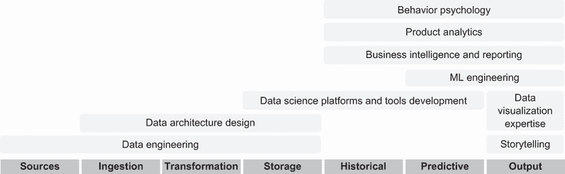

图 10.11 可雇佣到您团队中的技能集

行为心理学

*行为* *心理学* 是一种基于所有行为都是通过条件作用获得这一观点的学习理论。它已经在健康福祉、财务福祉和心理健康解决方案中得到了成功应用。目标通常是条件化那些使用户能够更好地体验产品、服务和政策价值的行为。

当你希望修改人们的行为以更好地与你的产品或服务互动时，你知道你的团队需要一些行为心理学的专业知识。例如，Livongo 公司利用行为心理学原理来提高慢性病患者对药物治疗的依从性和治疗效果。Acorns 公司利用行为心理学原理帮助人们养成储蓄习惯，存更多的钱，并提高应对财务紧急情况的经济韧性。像谷歌和沃尔玛这样的公司已经建立了行为科学团队，以改善人们使用其产品和服务的方式。

当你希望引导人们做出良好的健康、财务或其他行为决策时，行为心理学实践可以极大地帮助制定默认选择，设计奖励，并避免陷阱。一些组织发现，在产品设计的早期阶段就涉及行为心理学家特别有帮助。他们还依赖行为心理学家设计随机试验和评估指标，以衡量各种方法的有效性。然后，产品被定位为使用户沿着“快乐”的使用路径进行条件化，使他们能够更快地从产品和服务中获得价值。具有行为心理学技能集的成功数据科学家可以将对行为科学的研究兴趣转化为有影响力的项目，通过令人信服的实验量化胜利的效果和规模，并在整个组织中产生共识。

| 091 | 具有行为心理学技能集的成功数据科学家可以将对行为科学的研究兴趣转化为有影响力的项目，通过令人信服的实验量化胜利的效果和规模，并在整个组织中产生共识。 |
| --- | --- |

产品分析

*产品* *分析* 是一个定量理解产品性能并提出改进建议的过程。成功的数据科学家通过与产品经理、用户研究员和设计师紧密合作来进行产品分析，深入理解用户旅程，定义衡量成功的关键指标，并提出新的产品功能，以推动成功指标的提升。

专注于产品分析的数据科学家可以利用其对产品领域、愿景和路线图的深入理解，评估哪些指标是重要的衡量标准。例如，在评估搜索功能的质量时，必须将搜索结果的点击率（CTR）与目标页面的停留时间相结合，以确定搜索结果的质量并过滤掉点击诱饵。对于欺诈风险评估，仅仅关注欺诈案件的捕获率（或召回率）是不够的，还必须关注任何欺诈指标的确切性，这决定了误报率和调查欺诈警报的成本。

产品分析师也是测量方面的专家。他们深刻理解数据源的意义和局限性。例如，如果你想要确定人类用户的行为而不是搜索引擎和数据聚合器的爬虫，那么 CTR 等度量需要过滤掉机器人流量。来自移动设备的经纬度地理定位数据精度各异，这取决于所使用的技术，如基于 IP、基站三角测量、WiFi 三角测量或 GPS 定位。

当你雇佣一个具有产品分析专长的数据科学家时，你可以评估他们的领域知识以及他们构建模型或进行分析以推荐与公司战略愿景一致的产品功能的能力。这种知识和技能对于产生商业影响至关重要。

商业智能和报告

*商业* *智能和报告* 是一种技能集，专注于满足非产品职能（包括营销、销售、财务和客户服务）的分析和报告需求。拥有这种技能集的数据科学家与职能领导者紧密合作，创建工具以可视化、报告和预测对职能和公司健康重要的指标。

具有商业智能和报告技能的数据科学家理解他们所工作的业务职能的基本关注点，并且擅长将模糊的业务问题转化为可用数据的具体分析。当他们成功并获得业务职能的信任时，他们将会收到许多请求，通常超出了可用时间范围内的回答。分类和优先级排序技能对于将他们的时间集中在最高影响的工作上至关重要。

当你雇佣一个具有商业智能和报告技能的数据科学家时，你可以评估他们的职能领域知识以及他们优先处理请求、开发自助流程、培训职能合作伙伴解读结果以及为他们的业务职能提出与整体商业战略一致的新高影响分析的能力。

机器学习工程

*机器学习* *工程* 专注于生产可扩展的机器学习模型实现，这些实现可以在生产环境中部署。拥有这种专业实践的数据科学家通常具有计算机科学背景，并在大型软件项目中拥有协作经验。他们对所产生解决方案的可测试性和可维护性非常敏感，并能做出平衡操作 ML 模型整体成本与模型性能的实施方案选择。

拥有机器学习工程专长的优秀数据科学家可以将模糊的产品需求框架化为可学习的公式，明确成功指标和模型特征，设置 A/B 测试能力来衡量成功，编写工程实现规范和验收标准，与软件工程团队协调集成和测试，并为他们生产的机器学习模型设置不变量和警报，以确保其有效运行。

当你雇佣一个拥有机器学习工程专长的数据科学家时，你可以评估他们在与模糊规范一起工作时编写生产质量代码的能力。他们还可以与数据工程师合作，生产健壮的数据管道，并设计回退方案，与站点可靠性工程合作，以应对数据处理或模型推理基础设施不可避免地失败的情况。

DS 平台和工具开发

当数据科学团队达到一定规模时，平台和工具的微小改进可以在团队生产力上产生显著杠杆效应。平台和工具的例子包括用于评估功能成功的 A/B 测试基础设施、用于集中特征生产和维护的特征存储，以及用于将机器学习模型部署到生产环境的模型序列化基础设施。

拥有平台和工具开发专长的成功数据科学家可以识别 DS 项目中常见的瓶颈，并提出并优先考虑哪些瓶颈应该首先解决，以最小的投资产生最大的回报。

当你雇佣一个拥有平台和工具开发专长的数据科学家时，你可以评估他们在关注最有影响力的实践、流程和基础设施改进方面的能力。你还可以评估他们推动可以改善团队生产力的变革的能力。

数据可视化

拥有数据可视化专长的数据科学家专注于使用最有影响力的可视化来传达数据的影响。强大的可视化示例包括使用时间推移气泡查看随时间复杂四维关系的动态图表。其他例子包括苹果手表的每日锻炼目标，这些目标以各种颜色的同心环表示，随着目标的实现而“关闭”。

注意：动态图表是由汉斯·罗斯林（1948-2017），瑞典医生、学者、公众演讲家和 Trendalyzer 软件的创始人所普及的，他用它来动画化联合国和世界银行汇编的数据（[`www.gapminder.org/fw/world-health-chart`](https://www.gapminder.org/fw/world-health-chart)）。谷歌在 2007 年收购了 Trendalyzer 软件，并将其作为公共统计的 Google Gadget 免费提供给公众（[`developers.google.com/chart/interactive/docs/gallery/motionchart`](https://developers.google.com/chart/interactive/docs/gallery/motionchart)）。

具有数据可视化专业技能的成功数据科学家专注于通过精心选择的图表类型和有意义的趋势展示来传达分析中的关键结果，使他们的信息直观且易于记忆。他们使用无需编码的工具，如 Tableau，脚本工具如 Python 和 R 库，公共 API 如 Google Gadgets 进行数据可视化，以及严肃的视觉编码工具如 D3.js 来实现他们的可视化。

当你雇佣一个具有数据可视化专长的数据科学家时，你可以评估他们对应用领域数据的求知欲，他们对理解受众偏见和偏好的热情，以及他们在测试不同数据集的视觉呈现适用性时的严谨性，以确保视觉呈现对多种客户数据分布都能有效。

| 092 | 一个具有数据可视化专长的成功数据科学家对你的应用领域数据充满好奇，对理解受众偏见和偏好充满热情，并在测试不同数据集的视觉呈现适用性时非常严谨。 |
| --- | --- |

讲故事

具有讲故事专长的数据科学家擅长为分析或模型提供背景，使受众能够与结果更深层次的含义建立联系。这项技能包括理解受众的需求、提供可操作的推荐，并以清晰的结构呈现。

成功的数据科学家，如果拥有讲故事的专业技能，可以利用精心构建的叙述和强大的数据可视化来阐明其结果在与其受众直接相关的背景中的影响。他们的技能不仅限于展示结果。在规划过程中，讲故事对于制定项目成功时的模拟**新闻稿**、明确项目重点、评估项目影响以及吸引赞助者和支持者至关重要。

当你雇佣一个具有讲故事专长的数据科学家时，你可以观察他们使用有影响力的可视化，聆听他们过往项目的叙述，并观察他们故事的结构。他们的技能水平应该在他们参与跨职能项目的复杂性和他们如何导航受众需求以及简化信息以传达故事中体现出来。

| 093 | 一个具有讲故事专长的成功数据科学家可以阐明受众需求，并使用有影响力的可视化、引人入胜的叙述和清晰的故事结构，在复杂的跨职能项目中传达信息。 |
| --- | --- |

数据架构设计

具有数据架构设计专长的数据科学家可以显著影响新业务线的数据模型开发和现有业务的数据模型升级。数据架构[18]定义了组织使用的数据标准。它们包括正式的数据名称、全面的数据定义、有效的数据结构、精确的数据完整性规则和强大的数据文档。这些标准通常以一组规范的形式表达，定义数据需求并指导数据资产的集成和控制。

具有数据架构专长的成功数据科学家可以为领域提供标准的通用业务词汇，表达利益相关者的战略数据需求，并概述数据架构的高级集成设计。他们可以将数据架构与商业模式和数据用例紧密对齐，这可以在数据分析和数据管道实施中产生深远的影响。

当你雇佣一个具有数据架构专长的数据科学家时，你可以寻找他们在理解业务和 DS 用例方面的好奇心，以及他们在从定义到来源、维护和淘汰的整个数据生命周期中的经验。他们还应该熟悉数据技术规划、数据集成以及企业术语、命名空间和元数据的定义和维护。

数据工程

具有数据工程专长的数据科学家可以设计、实施、部署和维护满足公司需求的数据解决方案。他们的职责始于数据来源，包括在数据湖、数据仓库或数据湖屋中摄取、转换和存储数据。

具有数据工程专长的成功数据科学家在技术上熟练，能够理解业务驱动因素，将它们转化为数据需求，并遵守政策和法规。组织依赖他们通过数据管道的部署和运营来保护数据质量，通过数据目录和血缘管理进行数据治理，同时平衡主数据、参考数据和数据流实施中的权衡。

当你雇佣一个具有数据工程专长的数据科学家时，你可以寻找他们对业务需求的敏感性，对实施细节的勤奋，以及他们利用数据事件来提高数据生态系统整体稳健性的能力。他们应该能够构建和维护支持 DS 和数据分析需求的环境和基础设施，并改进和调整系统以提高团队效率。

### 10.4.2 DS 领导者的新兴职业方向

作为 DS 领导者，你已经拥有了一组独特的 DS 技术、执行技能和专家领域知识的能力。你还在与产品、工程和设计合作，创造企业价值。根据你的优势和兴趣，你可以考虑数据、产品、商业和工程四个主要职业发展方向。这些在图 10.12 中展示。让我们逐一讨论。

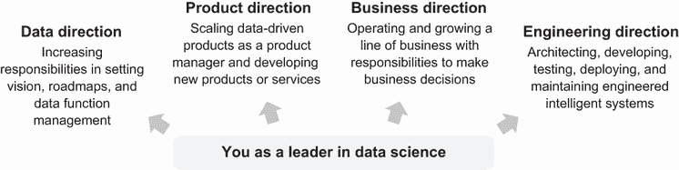

图 10.12 数据科学领导者的四个职业方向

数据方向

在数据方向上的职业发展可能包括项目领导、团队经理、DS 职能负责人或数据高管等头衔。

本书第二章至第九章广泛讨论了数据方向。正如一位行业资深人士所描述的，好的管理者往往有过度发展的责任感。职业发展是关于在业务上产生更大的影响，而不是管理或控制的冲动。

本书提供了一条关于合作伙伴关系对齐、人员管理、制定路线图以及激励和领导行业的技巧学习路径。对于每个责任级别，都有特定的技能需要精通。

在这个数据方向上担任高管职位，许多公司都在寻找负责数据科学（DS）、数据分析和数据治理的首席数据官（CDOs）。

数据分析的任务通常是与产品经理合作，使用数据做出商业决策。这个任务包括进行即兴的深入调查以探索业务方向、指定和跟踪新产品和特性的成功指标、维护业务运营的仪表板、部署分析平台以及设置培训以实现数据洞察的民主化。

数据治理的任务通常被定义为使数据成为公司资产。随着数据聚合和使用对组织变得更加战略化，数据可以既是资产也是负债。当数据资源被正确编目、管理和高效访问时，它们可以成为资产。当数据资源没有得到有效治理时，如 GDPR 和 CCPA 等法规的不合规可能会带来高额罚款。

成为 CDO 角色的路径对于 DS 领导者来说可以令人满意，他们可以扩大当前的责任范围，在他们的组织中产生更大的业务影响。

产品方向

在产品方向上的职业发展可能包括数据产品经理或产品线所有者等头衔。

许多 DS 项目领导者已经承担了为他们团队进行数据产品设计的责任。这些责任包括指定和交付面向内部用户的指标仪表板、为现有业务流程节省成本的预测智能，甚至智能的外部用户体验。

具有数据科学培训的个人在理解整个智能能力生命周期方面具有优势。这些能力通常需要战略考虑，以持续收集信号来校准和适应预测能力以适应市场条件。校准和适应中的紧密反馈循环可能对不熟悉数据产品的产品经理来说并不明显。

要成为数据产品经理或产品线负责人，您需要在以下四个领域拥有深入的知识：

1.  *您的客户*—了解客户的痛点、需求和想法，并了解他们的思维方式。

1.  *您的数据*—定量理解客户的表现。

1.  *您的业务*—理解和在利益相关者的约束下运营。

1.  *您的市场和行业*—了解关键技术趋势和竞争。

作为数据科学领导者，您已经接触到了您的数据和业务。需要重点发展的技能包括对客户、市场和行业的更深入理解。这种知识可以帮助您为公司产品路线图设定长期愿景和战略，并将其传达给利益相关者。

数据科学领导者的职业发展方向也可以包括承担业务单元的盈亏责任。这可以在两种情况下发生：

1.  将一组数据能力作为产品线进行货币化，例如：

    1.  Netflix 利用其对用户偏好的理解来制作其原创电影和电视剧。

    1.  ZF 集团正寻求货币化其汽车球节传感器数据，这些数据传统上用于高度调整以调整前灯角度。这些数据还可以用于负载监控、道路状况监控和预测性车队维护需求。

1.  通过采用一系列最佳实践，并围绕它构建软件平台和业务，例如：

    1.  Confluent 是一家利用 LinkedIn 开发的 Kafka 数据流基础设施构建的完全托管的企业级流处理平台的公司。

    1.  Tecton，这个特征存储库是由开发了 Uber 使用的特征存储库 Michelangelo 的团队创建的，旨在使公司能够获得最先进的特征管理能力，以实现稳健的机器学习管道。

在今天许多技术驱动型公司中，产品方向可以最接近地让您创立或领导一家公司。

业务方向

在业务方向上的职业进步可以包括增长总监、运营经理或供应链管理总监等头衔。

作为数据科学领导者，您可能已经深度参与了您产品的运营，跟踪和解释业务状况的关键方面。通过深入分析转化率下降和特征差距，您可能已经为产品改进提出了建议。如果您喜欢这个过程，您的职业发展中下一步可以采取哪些措施来承担更多责任并产生更大的影响？

您可以考虑诸如增长总监、运营经理或供应链经理等角色。这些角色位于产品、销售和数据的交汇处。在这些角色中，您将负责做出业务决策，而不是提供建议。

您对数据的深入理解在这些角色中是一个优势。您需要发展：

1.  对您的客户的深入了解

1.  一个清晰的北极星指标

1.  制定路线图和建立增长或运营节奏的能力

就像产品经理一样，您需要了解客户的痛点、需求、想法以及他们如何快速做出运营决策。一个清晰的北极星指标可以帮助您将功能团队对齐到共同的操作目标。路线图和运营节奏允许努力同步。

当您对这三个领域有全面的视角时，当团队遇到问题时，工程、产品和 DS 的合作伙伴会寻求您从各自领域内可能没有的视角。

诸如增长总监、运营经理或供应链经理等角色非常适合那些具有业务运营雄心的、以量化为导向的 DS 领导者。如果您在这些领域有优势和兴趣，您可以通过现有的基础产品/市场契合度来优化和扩展业务线，从而产生重大的商业影响。

工程方向

在工程方向上的职业进步可能包括数据工程经理、ML 经理或 ML ops 经理等头衔。

随着更多智能能力在生产中得到部署，严格的工程流程对于稳健的用户体验变得至关重要。对于专注于工程的 DS 领导者来说，在工程方向上有着广阔的增长潜力。

数据工程经理负责在组织中通过摄取、处理、存储和提供数据来协调数据流。ML 经理负责指定、实施、启动和重新校准智能能力。ML 运营经理负责监控和维护传入数据质量和模型输出质量，版本控制数据和模型，并优化启动流程。

作为 DS 领导者，您在科学方法上有坚实的基础，并对统计学有良好的理解。通过指定 DS 项目经验，您也对商业和产品有广泛的理解。您在设计和指定可大规模部署的 ML 系统方面具有独特的优势。如果您喜欢构建智能软件功能并将它们投入生产的流程，那么工程方向可以考虑。

需要注意的一个警告是，工程函数通常在生产中花费大部分时间实现和维护关键任务技术。在探索和原型化数据用例上通常花费的时间较少。如果你的抱负包括探索和部署的全部责任范围，你可以在有 ML 工程师专门负责你的 DS 项目的组织中寻找领导角色。

所以，这就是你需要的——DS 领导者的四个职业成长方向。它们包括数据方向，你的责任可以扩展到首席数据科学家或首席数据官；产品方向，你可以制定产品路线图并承担盈亏责任；业务方向，你可以推动业务增长或运营整个业务线；以及技术方向，你可以领导工程团队开发并优化数据和 ML 特征以及管道，以实现模型开发和产品化的简化流程。每隔几个季度参考这些方向，重新审视你感兴趣和热爱的领域，为你的职业生涯下一阶段做好准备。

## 10.5 检查 LOOP

恭喜你完成了关于景观、组织、机会和实践（LOOP）的章节！我们希望这一章节能为你提供一个全面的行业视角，帮助你寻求下一个机会并加速你的职业生涯。LOOP 审查包括以下四个项目：

+   *技术* *景观*—新工具或范式变得可用

+   *人力资源*—如何构建或重组你的团队

+   *职业* *机会*—行业、公司、团队、角色和入职

+   *专业* *实践*—要招聘的技能组合，以及你自己的职业方向

这四个项目旨在帮助你拓宽视野，在你职业发展遇到瓶颈时。你可以每月或每几个季度回顾一个 LOOP 领域。一旦开始这样做，你将勇敢地迈出形成新解释的步伐，以评估你能为你的职业生涯做些什么。

表 10.5 总结了本章讨论的领域。最右边的一列可供你勾选你可能已经深思熟虑过的领域。没有评判，也没有对错之分。你可以随意留空任何或所有行。

表 10.5 景观、组织、机会和实践的 LOOP 自我评估领域

| LOOP 领域/自我评估 | ? |
| --- | --- |
| **景观** | 监控新技术架构和最佳实践的技术景观 |

+   *数据存储*—ML 和数据分析用例正趋向于数据湖屋。

+   *数据处理*—流处理正成为具有自动化决策的业务流程中枢神经系统。

+   *数据访问*—带有自助洞察的分析正在实现民主化。

+   *模型部署*—通过数据/机器学习操作和自动化，智能能力部署正在得到简化。

+   *数据治理*—将数据作为企业增长的资产进行管理，而不是作为合规性责任的负担。

| **组织** | 探索不同的组织结构，每个结构都有其优势和劣势 |

+   *职能*—DS 是众多职能之一。非常适合在职能内建立专业知识，但如果不小心可能会失去对业务需求的关注。

+   *部门*—公司按产品、地理区域或市场细分进行划分，DS 被分配到每个部门。这对于快速决策的部门层面来说很好，但可能在部门之间造成重复劳动。

+   *矩阵*—DS 团队同时向职能负责人和部门负责人汇报。这种结构增强了跨职能和部门的协调，但具有更高的沟通成本。

+   *Holacracy*—促进自我管理的单元或圈子的等级制度，数据科学家被分配到项目中。这种结构非常适合 PoC 探索，但需要管理维护资源和支付技术债务。

| **机会** | 行业评估 |

+   顶尖的三种雇佣数据科学家的行业是信息技术和软件、金融和医疗保健。快速增长的 DS 需求行业包括国防和太空、在线学习、视频游戏和消费电子产品。

| 公司评估 |

+   公司成熟度是作为数据科学领导者可以完成的数据和项目类型的主导因素。公司在行业中的地位可以决定其成功的机会。

| 团队评估 |

+   雇佣经理的成熟度是您成功的关键因素。寻找进步的模式，而不是退步的模式。

+   基础设施成熟度决定了您可以产生的可靠性和速度。

+   实践成熟度决定了帮助团队提高生产率所需的指导数量。

| **角色评估** |

+   公司使命、优先事项和成功标准是明确界定您与经理角色的重要背景。

| 为新角色制定一个强大而专注的 90 天计划 |

+   在 90 天内提升自主性、精通和目的性。

    +   *技术领导*—专注于精通以实现早期成功

    +   *经理*—专注于在决策中获得自主权

    +   *总监*—专注于明确职能的目的

    +   *执行*—倾听、制定愿景、对齐并推动路线图

| **实践** | 您可以雇佣的技能组合 |

+   在数据科学（DS）领域，正在出现更多精细化的技能组合。根据项目需求，您可以雇佣或培养这些多样化的专业知识领域，以满足业务需求。

| 数据科学领导者的职业方向 |

+   *数据方向*—管理责任增加

+   *产品方向*—作为产品经理扩展数据驱动产品，并开发新产品或服务

+   *业务方向*—运营和增长业务线，并负责做出业务决策

+   *工程方向*——设计、开发、测试、部署和维护工程智能系统

| |
| --- |

## 摘要

+   数据科学（DS）中的技术*格局*正在迅速变化，因为新的最佳实践被结晶为新的平台，创造了新的架构，并使新的最佳实践成为可能。

+   在构建数据科学组织时，需要仔细导航*组织结构*，因为每种结构都有其优势和陷阱。

    +   在职能型公司结构中，DS 是众多职能之一。这对于在职能内建立专业知识来说很棒，但会失去与业务需求的联系。

    +   在部门结构中，DS 被分配到每个部门。这对于快速决策来说很棒，但可能导致部门间的工作重复。

    +   在矩阵结构中，DS 团队同时向职能主管和部门主管汇报，增强了职能和部门之间的协调，但创造了更高的沟通成本。

    +   在轮职制结构中，数据科学家被分配到项目圈中。这对于原型探索来说很棒，但你需要保持警惕，确保技术债务得到偿还。

+   在行业、公司、团队和角色层面，可以评估进一步发展职业生涯的机会。一个精心设计的 90 天入职计划可以有力地帮助你进入新的角色。

    +   行业评估可以告知 DS 在你所在行业中的日益重要性。

    +   公司评估评估公司的成熟度和其在行业中的地位。

    +   团队评估包括评估招聘经理、基础设施和现有实践。招聘经理的成熟度决定了你可以期望的成功支持。基础设施的成熟度决定了产生结果的可能可靠性和速度。实践的成熟度决定了团队要实现高效生产所需的指导量。

    +   角色评估包括理解使命、优先级和成功标准，以便与你的经理定义你的角色。

    +   一个 90 天的入职计划可以帮助你专注于在自主性、精通和目标感方面提升，这取决于你的 DS 领导角色的级别。

+   *实践*是你可以雇佣到 DS 团队中的技能集，以及作为 DS 领导者你在成长过程中的职业方向。

    +   你可以雇佣到团队中的技能集可以解决特定的业务需求。你可以识别这些技能集，为特定项目获取它们，并交叉培训团队成员以增强团队在这些技能集中的优势。

    +   作为数据科学（DS）领导者，你可以向管理、产品、运营和工程等方向成长，以增加你的职业影响力。

## 参考文献

[1] P. K. Illa. “现代统一数据架构。”数据科学。 [`towardsdatascience.com/modern-unified-data-architecture-38182304afcc`](https://towardsdatascience.com/modern-unified-data-architecture-38182304afcc)

[2] M. Bornstein, M. Casado, 和 J. Li. “现代数据基础设施的新兴架构。” Andreessen Horowitz. [`a16z.com/2020/10/15/the-emerging-architectures-for-modern-data-infrastructure/`](https://a16z.com/2020/10/15/the-emerging-architectures-for-modern-data-infrastructure/)

[3] J. Kreps. “每家公司都在成为软件。” [`www.confluent.io/blog/every-company-is-becoming-software/`](https://www.confluent.io/blog/every-company-is-becoming-software/)

[4] DataKitchen. “DataOps 并不仅仅是数据 DevOps。” [`medium.com/data-ops/dataops-is-not-just-devops-for-data-6e03083157b7`](https://medium.com/data-ops/dataops-is-not-just-devops-for-data-6e03083157b7)

[5] C. Breuel. “ML ops：机器学习作为工程学科。” [`towardsdatascience.com/ml-ops-machine-learning-as-an-engineering-discipline-b86ca4874a3f`](https://towardsdatascience.com/ml-ops-machine-learning-as-an-engineering-discipline-b86ca4874a3f)

[6] M. Rogati. “如何不招聘你的第一个数据科学家。” [`medium.com/hackernoon/how-not-to-hire-your-first-data-scientist-34f0f56f81ae`](https://medium.com/hackernoon/how-not-to-hire-your-first-data-scientist-34f0f56f81ae)

[7] E. Bernstein 等人。 “超越 Holacracy 炒作：下一代自我管理团队的过度夸张的声明和实际承诺。” 哈佛商业评论。 [`hbr.org/ 2016/07/beyond-the-holacracy-hype`](https://hbr.org/2016/07/beyond-the-holacracy-hype)

[8] “美国经济分析局，2019 年数据。” 2020 年 12 月 22 日。 [在线]. [`apps.bea.gov/industry/Release/XLS/GDPxInd/GrossOutput.xlsx`](https://apps.bea.gov/industry/Release/XLS/GDPxInd/GrossOutput.xlsx)

[9] “职业启航公司列表。” Wealthfront. [`blog.wealthfront.com/career-launching-companies-list/`](https://blog.wealthfront.com/career-launching-companies-list/)

[10] “2020 年全球人才趋势。” LinkedIn. [在线]. [`business.linkedin.com/talent-solutions/recruiting-tips/global-talent-trends-2020`](https://business.linkedin.com/talent-solutions/recruiting-tips/global-talent-trends-2020)

[11] J. Chong, B. Lorica, Y. Chang， “数据科学家最佳工作地点：我们识别出能帮助你发展数据科学职业生涯的组织。” Gradient Flow. [`gradientflow.com/top-places-to-work-for-data-scientists/`](https://gradientflow.com/top-places-to-work-for-data-scientists/)

[12] G. Moore, P. Johnson, 和 T. Kippola, *《 gorilla game：在高科技领域挑选赢家》*. 纽约，纽约，美国：Harper Business，1999.

[13] L. Cohen 和 M. Storey. “加入数据科学团队。” Medium. [`medium.com/data-science-at-microsoft/onboarding-to-a-data-science-team-2b735dae464`](https://medium.com/data-science-at-microsoft/onboarding-to-a-data-science-team-2b735dae464)

[14] D. Pink, *《驱动：关于我们动机的惊人真相》*. 纽约，纽约，美国：Riverhead Books，2009.

[15] Y. Xu, W. Duan, and S. Huang, “SQR：在线实验中平衡速度、质量和风险，” *KDD*，2018.

[16] D. Liu. “新角色入职指南：六个简单课程帮助你开始。” [`debliu.substack.com/p/a-guide-for-onboarding-into-a-new`](https://debliu.substack.com/p/a-guide-for-onboarding-into-a-new)

[17] A. Bosworth. “职业冷启动算法。” [`boz.com/articles/career-cold-start`](https://boz.com/articles/career-cold-start)

[18] M. Mosley 等人，*《数据管理知识体系指南》*。美国新泽西州巴斯科维奇，Technics Publications，2009.
