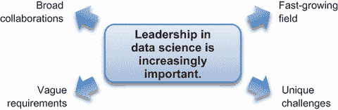
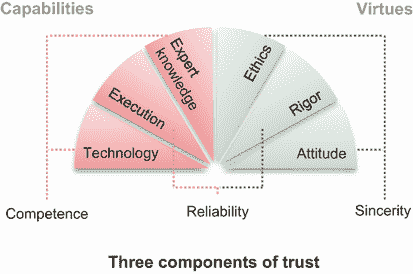
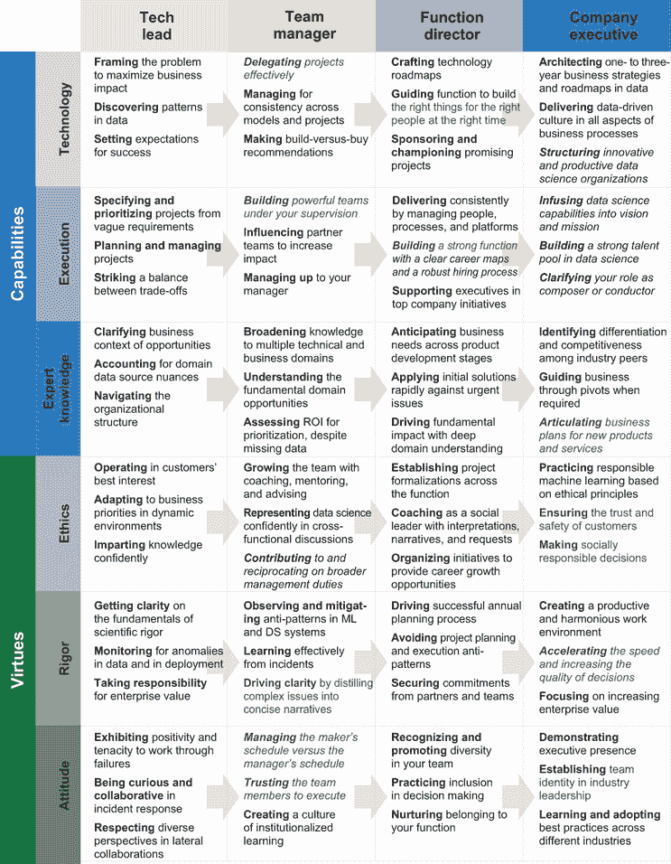
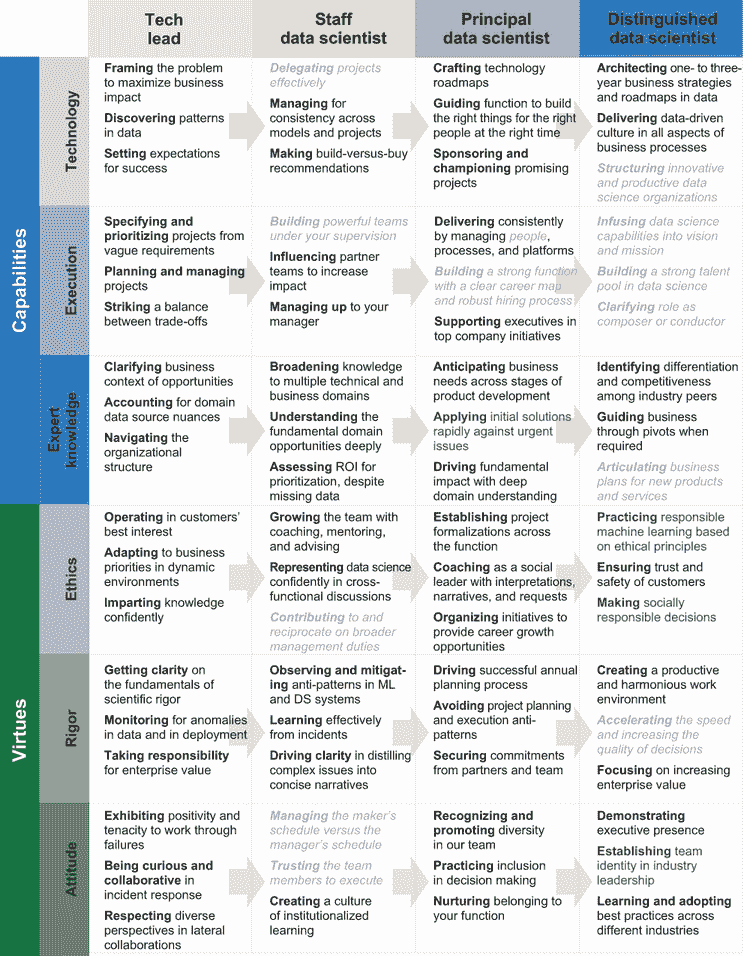
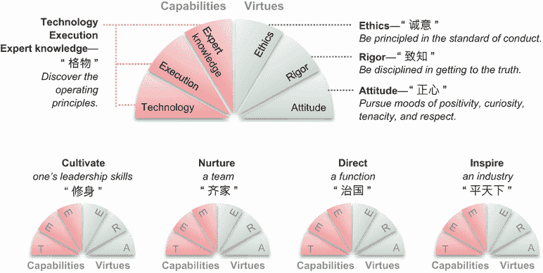
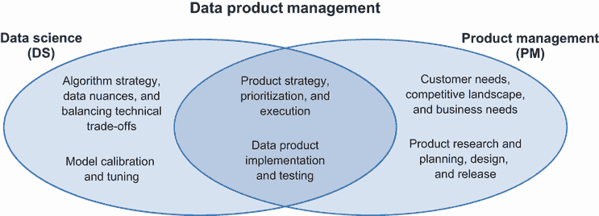
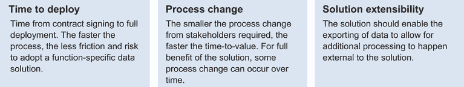
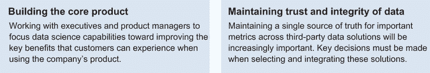

# 11 数据科学中的领导力和未来展望

本章涵盖

+   明确四个原因说明为什么在数据科学中领导力越来越重要

+   总结在建立职业生涯时我们可以学到什么

+   掌握如何在数据科学中实践领导力

+   预测未来在建立信任和追求职业生涯中的角色、能力和责任

作为人类，我们通过眼睛所见、机器所检测以及可以与现实对照的推理、演绎和假设来理解我们的世界。数据科学帮助我们通过推理、演绎和可以与现实对照的假设来推动我们对周围世界的定量理解。它提供了一个数据视角，我们可以用它来解释和预测世界运作的方式。本书汇集了成功领导数据科学工作的顶级能力和美德，旨在更好地理解和影响我们的世界。

| 094 | 数据科学提供了一种数据视角，我们可以用它来解释和预测世界运作的方式。它通过推理、演绎和可以与现实对照的假设来推动定量理解。 |
| --- | --- |

在数据科学中领导力具有挑战性，因为它涉及广泛的技能集，这些技能需要时间来内化。这个技能集是由与数据工作以及与高管、团队和合作伙伴协调以使数据科学工作成功的独特挑战塑造的。

在本章的最后，我们总结了在数据科学中领导力的**为什么**、**是什么**和**怎么做**，以便你在职业生涯的各个阶段进行参考。我们还推测了该领域未来可能的发展方向。

## 11.1 数据科学中领导力的为什么、是什么和怎么做

通过分享关于数据科学领导力的实用指导，我们在本书中已经覆盖了很多内容。让我们退一步来考虑为什么学习在数据科学中领导力变得越来越重要。**什么**可以是一个组织数据科学领导力所需技能的框架？**如何**将这个框架付诸实践？

通过回答这些问题，你可以更有目的地理解数据科学领导角色背后的驱动因素。你可以认识到你已经具备优势的领域，识别他人的优势，并发现潜在的盲点。有了这些认识和发现，你可以发展和加强你的能力和美德，成为一个更好的数据科学领导者。

### 11.1.1 为什么学习在数据科学中领导力越来越重要？

为什么在数据科学（DS）中学习领导力很重要？如图 11.1 所示，我们可以看到四个主要原因：

+   数据科学是增长最快的领域之一，对领导者的需求很高。

+   它有一套独特的挑战，使其不同于软件工程或咨询。

+   需求通常定义得不够明确，因为结果的质量难以预测。

+   项目需要广泛的跨职能协作，以产生业务影响。

图 11.1 学习在数据科学中领导力越来越重要的四个原因。

**快速增长**

数据科学家的数量每年增长 37%[1]，这正在创造对数据科学领导者的强烈需求。在数据科学项目对业务产生影响的公司的早期势头正在推动这种增长。在一项调查中，67%的公司正寻求扩大其数据科学职能并扩大其业务影响[2]。

随着数据科学领域继续成为薪酬最高的职业之一[3]，越来越多的才华进入该领域。然而，对人才的需求增长速度仍然快于供应。人才保留是数据科学职能中常见的挑战。

数据科学家的平均任期是两年。如果你能为你的数据科学家创造一个专业成长的环境，你可以在团队中更长时间地保留他们的机构知识，并使你的团队显著更有效率。

**独特的挑战**

数据科学项目与典型的软件工程或咨询项目运作不同，这为数据科学领导者带来了独特的挑战。三个主要差异包括项目团队规模、项目不确定性和价值体现：

+   *项目团队规模*—典型的数据科学项目涉及 1-2 名数据科学家，而相比之下，3-10 名工程师合作以实现工程目标。

+   *项目不确定性*—除了工程风险外，还必须处理数据相关的风险以确保项目成功。

+   *项目价值*—成功通过在生产环境中部署功能和推荐并使用 A/B 测试量化其影响来体现。仅仅完成功能（如工程交付成果）或交付推荐（如咨询里程碑）并不足以保证成功。

这些差异要求通过结合敏捷和瀑布方法（在第 2.2.2 节中讨论）、团队结构（在第 8.1.3 节中讨论）以及为团队成员职业发展创造机会（在第 7.1.3 节中讨论）来调整项目管理，以最大限度地保留顶尖人才。

**模糊的需求**

对于新的数据科学领导者来说，解释业务需求可能具有挑战性。许多业务和职能合作伙伴还不熟悉数据科学可以带来的所有能力，并可能提出可能不是问题最佳框架的请求。责任在于数据科学领导者提出问题背后的问题，以验证和细化合作伙伴的请求，提出并协调路线图，并严格优先处理项目，以便数据科学项目能够现实地界定范围，并有效地使用努力。这一责任在第 2.2.1 节中进行了更详细的讨论。

**广泛的合作**

几乎所有成功的 DS 项目都需要团队合作。产品和软件工程合作伙伴协作跟踪重要事件、特性和行动。数据工程合作伙伴协作创建数据管道，将数据加载和存储到数据湖中。数据科学家协作清洗和转换数据，以构建数据仓库并有效地可视化数据以获得洞察。在可能的情况下，数据科学家还在构建智能算法来预测和影响未来。产品和软件工程合作伙伴随后协作采取行动，利用洞察或智能算法来改进产品或服务。

DS 领导力必须制定和协调路线图，确定赞助者和倡导者，并培养人才和合作伙伴的信任，以确保 DS 项目的成功。快速增长、独特挑战、模糊需求和广泛合作使 DS 领导力成为企业战略增长中的关键角色。

### 11.1.2 DS 领导力的框架是什么？

领导力在于放大你产生比个人所能实现更大的影响的能力。它涉及到与周围人建立**信任**的身份，这样你就可以影响、培养、指导和激励他们产生影响力。

你的身份是他人对你的描述。这种描述使周围的人能够预测你在各种情况下的思考和行动方式。你可以建立一个值得信赖的身份，这样别人就更愿意被你影响、培养、指导和激励。

| 095 | 你的身份是他人对你的描述。你可以建立一个值得信赖的身份，这样别人就更愿意被你影响、培养、指导和激励。 |
| --- | --- |

什么是**信任**？我们可以将信任解释为三个组成部分[4]：能力、真诚和可靠性（图 11.2）。

图 11.2 信任的三个组成部分：能力、可靠性和真诚

**能力**是产生成就的能力。我们在**技术**和**专业知识**维度中讨论它。**技术**维度描述了 DS 中你可以用来更有效地领导的工具和框架。**专业知识**维度描述了你在特定行业中的领域知识，以阐明项目与组织愿景和使命的对齐，解释数据源细微差别，并在组织中的结构挑战中导航。

**真诚**是建立长期关系的美德，同时实现你的目标。我们在**道德**和**态度**维度中讨论它。**道德**维度涉及到工作中的行为标准，这些标准使你能够避免不必要的自我造成的崩溃。**态度**维度涉及到你处理职场情况时的情绪。

*可靠性*是在面对挑战和干扰时产生成就的能力。我们在*执行*和*严谨性*维度中讨论了它。执行维度描述了履行领导职责所需的实践。严谨性维度描述了允许客户相信你产生的结果的工艺。

能力、真诚和可靠性是你建立值得信赖身份的三个必要组成部分。如果这三个组成部分中缺少任何一个会怎样？

当你专注于能力和真诚而忽视可靠性时，你可以产生结果，并拥有与合作伙伴协调以交付的真诚，但缺乏管理风险和克服障碍的技能。你不太可能持续产生积极的企业影响。

当你专注于能力和可靠性而忽视真诚时，你可以在交付结果时既有能力又可靠，但缺乏在过程中协调目标和建立关系的动力或积极态度。在这种情况下，你可能会交付与业务需求不一致的 DS 结果。

当你专注于真诚和可靠性而忽视能力时，你可以协调目标、管理风险和消除工作障碍，但缺乏完成项目所需的技术或领域知识。在这种情况下，你承担的项目仍然不太可能成功。

建立包含所有三个组成部分的值得信赖的身份对于成功领导 DS 至关重要。在职业生涯的不同阶段，你有不同的选择去做不同的事情。我们在图 11.3 中总结了本书中讨论的 DS 技术领导、经理、总监和高级管理人员的主题。

图 11.3 数据科学领导力讨论的概念概述

那么，经验丰富的数据科学家对个人贡献者职业路径的看法又是如何的呢？图 11.4 展示了本书中与员工数据科学家、首席数据科学家和杰出数据科学家相关的讨论领域。主要适用于管理者的领域已被阴影处理并加粗。讨论的 80%以上主题对经验丰富的数据科学家在个人贡献者职业路径上都是相关的。

图 11.4 经验丰富的数据科学个人贡献者讨论的概念概述

这个 DS 领导框架是从哪里来的？追求雄心勃勃的职业一直是人类历史的一部分。DS 作为一个职业，是过去十年中涌现出的众多职业之一。为了成功职业生涯，我们借鉴了古代中国和希腊哲学家的思想，包括孔子（公元前 551-479 年）和亚里士多德（公元前 384-322 年），并将它们应用于 DS 领域。

儒家教义中的一个核心概念[5]关注个人如何通过职业变动迈向和谐的世界。应用于实践数据科学，它提倡用你产生的创新来激励你的行业。激发一个行业的八个步骤如下：

1.  发现运作原则。（格物）

1.  在探寻真理的核心上保持自律。（致知）

1.  在行为标准上保持原则。（诚意）

1.  保持积极、好奇、坚韧和尊重的情绪。（正心）

1.  培养自己的领导技能。（修身）

1.  培养一个团队。（齐家）

1.  指导一个函数。（治国）

1.  激励一个行业。（平天下）

本书将儒家教义的最初四个步骤映射到 TEE-ERA 范式中，作为在数据科学中领导的基础。这四个步骤侧重于扩展我们的知识和培养我们的*自我*。它们是接下来四个职业发展步骤的核心——从领导项目到领导团队、职能和行业。这些概念在图 11.5 中得到了说明。

图 11.5 数据科学职业发展中使用的儒家思想概念

儒家思想认为，所有人都有学习能力，失败不是能力不足的结果，而是努力不够。本书分享这一信念，并组织成一本实用的现场指南，供你在职业生涯的不同阶段参考。

| 096 | 儒家思想认为，所有人都有学习能力，失败不是能力不足的结果，而是努力不够。本书分享这一信念，并组织成一本实用的现场指南，供你在职业生涯的不同阶段参考。 |
| --- | --- |

为什么我们称软技能、心理社会技能为美德？2500 年前亚里士多德的教义中包含一个名为*eudaimonia*（εὐδαιμονία）的概念，这是一种值得追求或作为职业生涯一部分的幸福和福祉。为了成为一个*eudaimon*，一个人需要拥有*美德*，这是他们获得幸福和福祉所必需的性格特征。

我们将*道德*、*严谨*和*态度*视为产生长期积极商业和社会影响所必需的美德。这些美德是可以通过实践逐渐学习，成为有效数据科学领导者习惯和性格的技能。

| 097 | 我们认为，在数据科学中，道德、严谨和态度是产生长期积极商业和社会影响所必需的技能。我们将这些技能称为可以通过实践逐渐学习，成为有效数据科学领导者习惯和性格的美德。 |
| --- | --- |

本书确定了各个职业阶段最实用的智慧珍珠。它提供了具有领导力优势的案例研究和你需要注意的潜在盲点。它还突出了 101 个易于消费和分享的宝石洞察。通过在工作中实践它们，它们可以成为你可信身份的一部分，最终成为你习惯和性格的一部分。

### 11.1.3 如何在实践中使用该框架？

本书每一章都为你提供了一个学习点的清单，以供自我评估，帮助你明确你的发展重点。为了最好地使用本书，我们建议采用四步法来帮助你建立信心，发现你的盲点，认识到你所在组织周围可利用的资源，并练习你的学习：

1.  *找到你的优势*。你可以使用每一章末尾的*自我评估*和*发展重点*部分（第二章至第九章的第四部分）来识别你的领导力优势领域。这种实践为你提供了一个构建可信赖身份的叙事，为他人树立榜样，并产生职业成就。

1.  *识别你的机会*。本书中描述的一些领域可能对你来说是盲点。这些是你可以识别、学习和采用新实践的机会。当你将这些新知识应用于现实世界的情况时，它们可以成为有效的习惯，甚至成为你积极身份的一部分。

1.  *利用你的环境*。在大多数情况下，你的角色在一个更大的组织中，你可以在你的团队或跨团队和职能中利用资源来放大你的优势。了解向谁提出请求，提出什么请求，以及如何提出请求是至关重要的领导技能。

1.  *将学习付诸实践*。在第一步到第三步中明确目标后，第四步是制定路线图，并逐个概念地将学习付诸实践。与冲刺计划一样，你可以指定一至三周的节奏，以设定目标并安排时间回顾和评估进度。

在职业发展的每个阶段，都有许多概念需要学习和实践。只要你在每周都在努力工作，你将在你的职业发展中取得具体进步。

## 11.2 未来展望

DS 是我们理解过去、评估现在和预测未来的定量方法。毫无疑问，它是一个将继续为公司和组织创造价值的必要职能。但这个领域将如何发展，你该如何为它做准备？

DS 领导者可以预测以下三个趋势，以更好地规划他们的职业生涯：

+   *角色*—数据产品经理的兴起

+   *能力*—特定功能数据解决方案的可用性

+   *责任*—在数据中建立信任

让我们逐一深入探讨。

### 11.2.1 角色：数据产品经理的兴起

数据和智能驱动型产品的创造通常需要创新。许多这些产品和特性在之前并不存在。它们是由产品经理与数据科学家紧密合作发明的，他们基于对客户痛点的深刻同理心、能够随时间放大其优势的数据策略，以及能够捕捉所创造价值的稳健商业模式。

| 098 | 数据和智能驱动型产品是由产品经理与数据科学家紧密合作发明的，他们基于对客户痛点的深刻同理心、能够随时间放大其优势的数据策略，以及能够捕捉所创造价值的稳健商业模式。 |
| --- | --- |

产品经理是数据科学家在探索产品/市场匹配过程中的关键合作伙伴。然而，目前只有少数产品经理拥有数据科学背景。数据产品管理人才的稀缺是那些希望开发数据和智能驱动型产品和特性的公司的一个重大瓶颈。

数据产品经理和产品经理之间的区别是什么？数据产品经理理解数据策略、数据源复杂性以及数据/模型生命周期。这还基于理解所有软件产品经理所需的软件技术、用户体验和业务关注。有了数据产品的额外知识，数据产品经理可以设计和界定建模和 API 项目，并更好地定义跟踪规范和成功指标。

2021 年，数据科学领导者经常被要求弥合数据和产品知识差距。确实，许多今天成功的数据驱动型产品是通过产品经理和数据科学家之间的紧密合作开发的。这通常是因为许多软件产品经理还没有必要的统计学和机器学习背景来理解数据驱动型产品的功能、风险和范围。

在这些合作中，数据科学家通常扮演推荐者的角色，并依赖产品经理在实施之前对产品方向做出最终决定。产品经理在定义有用、可行和有价值的产品[6]的同时，平衡客户和业务需求，与高管合作获取资源，并做出关键的业务和产品决策。

许多数据科学家感到沮丧的一个原因是，当智能能力和数据科学方法被作为事后考虑引入产品时。数据科学通常只在产品开发周期的最后阶段介入，当产品和工程团队试图衡量一个特性的成功时。难怪一些数据科学家有动力转向产品管理，希望承担产品方向决策者的角色。

情况正在改善。许多具有深厚技术背景的数据科学家正在从他们的产品经理合作伙伴那里学习，并获得帮助他们成为强大的数据产品领导者的技能集。许多产品经理正在获得 DS 技能集，以更好地理解数据产品生命周期。随着具有深厚 DS 知识的产品经理的出现，成功构建数据驱动产品和功能的角色和责任正在转变。

对于渴望成为产品管理角色的 DS 领导者，他们应该知道，他们作为数据科学家已经具备了一些技能，有一些与产品管理重叠的共享技能，以及他们需要发展的新产品管理技能。这些技能在图 11.6 中有所展示。让我们首先强调 DS 领导者和数据产品经理之间的共享责任，然后讨论作为数据产品经理成功所需的新技能集。然后，我们将探讨新兴数据产品管理角色对数据科学家及其组织的影响。

图 11.6 数据产品经理的技能集结合了数据科学和 PM 技能集

共享责任和新技能

产品战略、优先级排序和执行是产品领导者[7]的三个主要职责。Adam Nash，前 Wealthfront 的总裁兼首席执行官，阐述了一个优秀的产品领导者可以明确回答的两个产品战略问题：

1.  我们在玩什么游戏？

1.  我们如何保持得分？

将这两个问题回答正确可以迅速使跨职能团队统一方向，并在执行最具影响力的项目中做出权衡。DS 领导者已经具备定义数据产品愿景、量化提供给客户的价值以及使公司区别于竞争对手的技能。

优先级挑战通常源于好想法的过剩。因此，残酷的优先级排序可以区分出对执行第一件事有明确认识的成功公司。DS 领导者已经拥有 RICE 等工具，它使用范围、影响、信心和努力来优先处理项目。然而，平衡更广泛的关于客户需求、竞争格局和业务需求的新技能是需要获得的。对于执行，进行时间/效益权衡、使用分析来了解产品性能以及衡量成功是 DS 领导者的强大技能。

产品经理需要具备监督产品生命周期所需的基本技能，包括在研究和规划、设计、实施和测试以及发布[8]等步骤。DS 领导者需要发展这些技能，以便与产品经理合作或成为产品经理。

产品和功能从*研究和规划*开始，这决定了接下来要构建什么。这些想法可以分为三个类别：指标推动者、客户请求和客户惊喜[9]。指标推动者是公司关注的功能，客户请求是客户积极要求的功能，而客户惊喜是客户尚未请求但会感到高兴的功能。能够从这些类别中推动一系列功能，并与高管和工程团队保持一致，是必须掌握的关键技能。

*设计*步骤包括指定用户体验，并定义产品的功能和特性。制定目标、用例、需求、线框图，并描述所有可能的功能状态，同时注意可访问性和安全性，对于 DS 领导者来说可能是令人畏惧的。这些是成为数据产品经理需要掌握的新技能。

*实施和测试*步骤可能对 DS 领导者来说更为熟悉，包括定义技术规范和验收标准，在需要时澄清规范，以及在功能延迟时调整时间表。对于专注于用户体验的功能，DS 领导者可能需要学习在上线在线实验之前运行内部可用性测试，以识别需要修复的错误。

*发布*步骤包括发布清单，确定支持产品的团队，并为数据管道或生产问题准备紧急关闭程序。这些通常是 DS 领导者需要发展的新技能。

对 DS 领导者的影响

当更多数据产品经理可用时，DS 领导者可以更多地关注 DS 功能的运行，包括人员、流程和平台。这种关注集中在确保数据分析预测的可信度，并使公司在决策过程中更加数据驱动。

当有更多数据产品经理时，在跨职能协作中寻求一致时，产品知识对于 DS 领导者仍然至关重要。我们可能会看到数据产品经理在产品开发早期就邀请 DS 视角，战略性地根据可用数据设置项目阶段，并在项目时间表中充分预见数据风险。

对 DS 领域的影响

这种 DS 产品经理的出现可能是渐进的，有两个原因。数据科学家仍然稀缺，而且只有少数人对成为产品经理感兴趣。更多专业人士在产品管理领域工作，但 DS 的技术基础深厚，一个人要学习它需要付出相当大的努力。

一个可能的短期解决方案是创建一个以软件项目中的技术产品经理为模板的技术数据产品经理角色。在一些公司中，产品开发角色被产品经理和技术产品经理（TPM）分担，其中更侧重于商业的产品经理专注于研究、规划和发布。相比之下，更侧重于技术的 TPM 则专注于设计、实施和测试。

将产品管理角色拆分可以是一种短期内的正式方法，用以弥合数据产品经理人才缺口。许多数据科学领导者目前正积极填补这一缺口，因为在缺乏正式的技术数据产品经理角色的情况下。随着公司和团队的增长，数据产品经理角色可以为应对战略项目提供更精确的责任范围。

展望未来，数据产品经理的角色将越来越重要。许多产品可以通过数据驱动的创新进行转型，许多特定功能的数据解决方案正在由数据产品经理定义和部署。

### 11.2.2 能力：特定功能数据解决方案的可用性

数据科学能力在公司许多职能中都有广泛的应用。当成功时，一个数据科学团队将收到来自所有业务线和职能部门的请求，以评估定量技术如何帮助。

对于任何业务来说，都存在核心竞争力和边际实践领域。例如，对于一家 SaaS 企业软件公司，其产品提供中的智能功能是核心竞争力。营销转化、销售分析和财务预测是边际实践。

一些数据科学领导者选择首先专注于收集边际实践中的低垂之果，以牺牲发展更智能的核心竞争力为代价。其他人则选择专注于发展业务的核心竞争力，而忽视边际实践。

在缺乏成熟的第三方特定功能数据解决方案的环境中，首先专注于收集低垂之果是有意义的。数据科学领导者可以迅速在边际实践中改善运营，并利用建立起来的信任进行更深层次的跨职能合作。

随着更多特定功能的数据解决方案变得可用，识别和整合第三方数据解决方案可以比内部开发解决方案更快地产生价值。随着数据科学资源的释放，在公司核心竞争力的赌注上可以带来长期更高的回报。

幸运的是，一代数据科学最佳实践正在出现，以服务于边际实践。这些针对边际功能的最佳实践正在被结晶为独立的数据产品提供。

注意：这种数据产品提供的激增部分得益于我们在 11.2.1 节中讨论的数据产品经理，他们正在采取创业步骤，通过在公司特定边际实践中结晶化工具中的特定功能最佳实践来建立新公司。

让我们看看两个例子——一个是针对市场营销职能的，另一个是针对销售职能的。这两个例子具有不同的特点，但都试图在一个足够窄的领域内涵盖整个数据堆栈，从数据聚合到最终洞察。

市场营销特定数据解决方案

在市场营销中提供数据洞察具有挑战性。涉及的指标并不复杂，但从多样化的广告平台中聚合数据是市场营销部门的痛点。虽然顶级广告平台，如 Google Ads、Bing 和 Facebook Ads，可能提供潜在客户的数量，但它们的价格通常很高。您可以使用联盟网络或通过电子邮件营销活动提高参与度。每个平台可能都有自己的特定数据门户。即使是中型公司也可能同时尝试 20-50 个广告平台。

为了报告目的，从每个平台提取数据可能是重复的繁琐工作。除了手动导出报告外，每个平台可能都有不同的字段名称约定，必须进行标准化。例如，您在 Twitter 上的广告支出报告为“支出”，在 Facebook 上为“已花费金额”，在 Google Ads 上为“成本”。

即使收集并标准化了数据，仍然存在将收入归因于广告支出和计算广告支出回报率（ROAS）指标跨时间和货币的挑战。这些挑战使得保持最新的营销绩效报告变得困难，通常导致营销预算分配不优或每月过度/不足支出。虽然对于任何公司来说，解决像市场营销这样的边际实践中的挑战可能具有挑战性，但对于独立技术公司来说，这些挑战可能非常出色。

[Funnel.io](https://funnel.io/)就是这样的公司之一。它提供了一个平台，可以集中来自数百个来源的广告数据，实现每小时自动导出和下载，并自动标准化如跨平台营销支出等数据字段。然后，它可以针对特定行业垂直领域（如电子商务和跨多个平台的群组活动）的广告成本与销售数据进行归因，并在数据仪表板上展示洞察。

从本质上讲，这是一个集成解决方案，解决了数据摄取、转换、加载和一些分析过程。它甚至具备一些基本的仪表板功能。自动归一化允许您无需编码即可拥有营销数据的单一事实来源。最重要的是，您可以将清洗后的数据导出到您选择的数据库中。您的分析师和数据科学家可以使用导出的数据执行额外的分析和处理，因此您不必将敏感信息加载到 Funnel.io 平台。

对于每月广告支出数百万美元的高增长公司来说，及时评估营销支出可以非常有价值。集成这样一个特定于营销的数据解决方案的成本可能是值得的。

销售特定数据解决方案

企业现场销售是一个可以产生高商业影响领域。这个过程可能很复杂，特别是对于每年每位客户收入超过 10 万美元的产品和服务。一笔交易可能需要从潜在客户资格认证到成交的多个月销售过程。

公司通常使用客户关系管理（CRM）软件来跟踪这些流程。从 CRM 中汇总交易状态以生成仪表板从技术角度来看并不复杂。挑战的部分是确保销售人员能够及时更新 CRM 系统中的交易状态。

销售领导者必须对销售管道和可能阻止他们完成季度销售目标的风险有最新的了解。对于重视实现收益指导的上市公司来说，收入的可预测性尤为重要。销售领导者通常会通过一对一的电话与每位销售人员交谈，以评估每笔交易的关闭可能性，从而了解团队在本季度内的表现。这可能是一个对所有人来说都痛苦的过程。

那么为什么销售人员没有及时更新 CRM 系统呢？他们中的许多人面临着巨大的压力，需要完成他们的销售数字。手动更新 CRM 条目进行内部报告通常是一个次要的考虑因素。在 CRM 数据输入上花费的繁琐时间会削减销售所需的时间。CRM 中数据的不完整性使得应用数据驱动的销售预测解决方案变得极其困难。

幸运的是，AI 和机器学习驱动的*自动活动捕获*可以帮助缓解手动数据输入瓶颈。一类新的公司正在出现，它们可以自动将日历和电子邮件中的销售互动记录到 CRM 中。这些公司的例子包括 Salesforce（Einstein Activity Capture）、People.ai、Groove 和 Zero Keyboard。

主要创新在于新数据源的摄取，例如销售专业人士的日历和电子邮件。这些新数据源的提取、转换和加载过程涉及实体识别和匹配，以从销售代表和潜在客户之间的非结构化数据中提取结构化交互。然后，您可以对捕获的活动进行结构化分析，以更可靠地预测季度目标方面的收入展望。当销售团队订阅特定的销售方法时，活动捕捉的数据可以提供达到销售过程中特定里程碑的指标，甚至可用于销售指导。

活动捕捉是 AI 和 ML 技术缓解手动数据收集瓶颈的例子。Salesforce Einstein 活动捕捉和 People.ai 等解决方案处理整个数据管道，以提供当前状态、未来展望和潜在指导，以在销售领域制定和指导行为。这些技术不仅限于销售流程，对于招聘流程也有效，其中完成意味着将人才纳入团队。

函数特定解决方案评估

随着函数特定 DS 产品和服务的出现作为第三方解决方案，它们可以为公司的边际实践提供智能能力，这些能力在单个公司中难以轻易复制，并且具有规模经济。

从公司的角度来看，在选择解决方案时需要考虑几个因素，包括部署时间、流程变更和解决方案的可扩展性。这如图 11.7 和以下列表所示。

图 11.7 函数特定数据解决方案的三个评估标准

+   *部署时间*——部署时间通常从合同签订到 DS 解决方案对用户可用的时间来衡量。对于营销特定数据解决方案，数据来源来自企业外部。通过用户身份验证进行的数据聚合不涉及任何工程努力。

    相比之下，销售特定解决方案的数据来源来自企业内部，可能包括对人们电子邮件账户和日历的访问。这需要更高的信任度，并且需要显著更多的工程努力来整合。采用过程中的摩擦可能会限制公司增长的速度。同时，深度整合也有利于一旦客户选择部署，解决方案就难以被取代。

+   *流程变更*——为了部署函数特定数据解决方案，任何对利益相关者的必要流程变更都可能成为采用的摩擦。对于上述营销特定解决方案，部署解决方案不需要任何行为变更。始终更新的营销报告可以在利益相关者的自身时间框架内推动进一步的营销渠道优化。

    对于由活动捕捉驱动的特定于销售的解决方案，销售专业人员无需进行行为改变。销售经理将有一个学习过程，了解如何解释和使用捕捉到的活动来改进销售。当捕捉到的活动通过销售框架如 BANT [10] 或 MEDDIC [11] 展示时，技术变革可以作为组织流程变革的一部分进行推广。

+   *解决方案的可扩展性*—使用第三方、特定功能的数据解决方案的一个担忧是，您的功能会标准化，行业竞争对手之间几乎没有差异化的空间。这时，数据解决方案的行业最佳实践成为新的行业标准。

    数据解决方案供应商可以通过允许数据导出到数据仓库以进行进一步处理和丰富来应对这一担忧。例如，Funnel.io 允许聚合的、归一化的、属性化和转换后的数据导出到数据仓库。然后，您的分析师和数据科学家可以使用其他数据源处理导出的数据，以产生更深层次的跨职能洞察。

| 099 | 第三方特定功能的数据科学产品和服务的规模经济可以为公司的边缘实践提供智能能力，这种规模经济在单个公司中难以复制。在采用之前，您可以评估它们的部署时间、所需的流程变更和解决方案的可扩展性。 |
| --- | --- |

可以根据部署时间、流程变更和可扩展性特征来评估特定功能的解决方案，以允许最佳实践在行业范围内采用。这一趋势使公司能够将 DS 资源集中在核心产品和服务的创新速度上。

### 11.2.3 责任：在数据中建立信任

在一个产品经理对数据战略非常熟悉，并且特定功能的数据解决方案对边缘功能 readily 可用的未来，DS 功能的核心责任是什么？

我们预计 DS 功能将承担两个主要责任。一个是构建公司核心产品的数据驱动能力，以推动客户对公司的信任。另一个是维护组织数据使用的信任和完整性。图 11.8 说明了这两个责任。

图 11.8 DS 的两个主要责任：核心产品和维护信任

构建公司核心产品的数据驱动能力

核心产品是一个描述客户从使用公司产品中获得的益处的概念。它与实际产品和增强产品形成对比。例如，汽车的核心产品是一种可以快速且安全地将您从 A 点带到 B 点的交通方式。实际产品是具有推进方式、尺寸、内饰和价格等属性的物理汽车。汽车增强产品包括支付选项、保修、保险和维护套餐。对于 DS 领导者来说，为核心产品建立数据驱动能力意味着与高管和产品经理合作，将汇总、处理、分析和预测能力集中于提高客户可以体验的关键益处。

继续以汽车行业为例，特斯拉在 2020 年已有超过一百万辆汽车上路，并积累了超过三十亿英里的自动驾驶里程。该公司以其能够从其汽车中记录、存储和汇总大量道路状况的能力而闻名，这有助于改进其自动驾驶算法。对于低频事件，例如检测严重遮挡的停车标志，特斯拉能够利用其上路车辆来汇总示例，以训练其算法。这涉及到对汇总示例进行标记和主动学习，并使用测试集中的示例来验证其算法的新版本。改进其自动驾驶算法的能力直接提升了特斯拉的核心产品，这也是它能够快速且安全地将乘客从 A 点带到 B 点的原因。这种类型的数据策略正是 DS 领导者负责的，以随着时间的推移提升公司的核心产品。

在另一个例子中，在金融服务行业中，核心产品可以定义为建立一种可以扩展到客户不同金融需求领域的关系的过程。SoFi 是一家以重新融资学生贷款为业务模式的金融科技公司。一旦它与成功完成学业并获得有偿工作的客户建立了关系，它就会扩展服务，提供抵押贷款、个人贷款和汽车贷款；后来，提供财富管理、保险、支票账户和借记卡，以满足客户的日常金融需求。

我们预计 DS 将越来越多地应用于公司的核心产品领域，因此，早期选择行业领域并积累领域知识对于 DS 领导者在未来保持竞争力至关重要。

| 100 | 随着数据科学越来越多地应用于公司的核心产品领域，因此，早期选择行业领域并积累领域知识对于数据科学领导者在未来保持竞争力至关重要。 |
| --- | --- |

维护组织数据使用的信任和完整性

在一个特定于函数的数据解决方案越来越多、边际实践增加的未来，选择和集成正确的解决方案可以加速你公司的增长速度。集成特定于函数的数据解决方案不仅影响你的技术架构，而且对整个公司的人员、流程和平台都有实际影响。

选择和集成第三方数据解决方案意味着数据科学组织可以用更小的团队满足更多的数据需求。特定于函数的数据解决方案通常将行业最佳实践结晶为针对其目标函数的数据平台，包括营销、销售、客户服务、人力资源和财务。许多特定于函数的仪表板和预测模型在这些平台上 readily 可用，并且可以直接由职能合作伙伴使用。

这是否使得数据科学在这些职能中的参与变得多余？我们认为情况正好相反。在维护第三方数据解决方案中重要指标的单一来源时，可能需要更多的数据科学参与。

| 101 | 集成特定于函数的数据解决方案可能需要更多的数据科学参与，以维护多个第三方数据解决方案和内部数据基础设施中重要指标的单一来源。 |
| --- | --- |

当你集成了多个第三方数据解决方案时，你需要确定并管理业务关键数据的单一来源。第三方数据解决方案在提供的服务上可能会有重叠。单一指标在不同工具中显示不同的值会引发混淆并破坏合作伙伴的信任。数据目录、同行评审的数据管道、版本控制的特征存储和数据流脚本是维护关键指标单一来源的必要流程。当第三方数据解决方案产生意外结果时，数据科学家需要诊断故障并实施缓解措施。

随着函数内部操作通过特定于函数的数据解决方案变得高效，跨职能洞察变得更加重要。跨职能洞察的例子包括跨营销渠道校准广告支出回报率（ROAS），或估计与不同销售渠道和客户类型相关的支持成本。这些是关键的执行洞察，需要职能之间的顺畅协调。在保持数据使用信任和完整性的压力下，我们预计数据科学领导职位在未来将变得越来越重要。

## 摘要

+   *为什么*？数据科学是一个快速发展的领域，其独特的挑战与软件工程和咨询不同。数据科学经常处理模糊的需求和数据不确定性，并且需要跨职能合作以产生影响。

+   *是什么*？成功取决于建立信任的能力、真诚和可靠性。有机会培养领导技能、培养团队、指导职能和激发行业。

+   *如何*？为了发展你的职业生涯，你可以找到你的优势，建立你的信心，确定你的机会，发现你的盲点；利用你的经理、团队和合作伙伴；并练习你的学习，使它们成为习惯并成为你性格的一部分。

+   *未来展望* 对数据科学在组织中的角色、能力和责任的趋势进行了预测。

+   *角色*—随着数据产品经理在数据项目的可行性、可用性和价值方面承担更多责任，数据科学领导者可能会更加关注数据产品的设计、实施和测试。

+   *能力*—随着更多特定功能的数据解决方案变得可用，它们捕捉和民主化行业最佳实践，以服务于边缘业务功能。这些解决方案将允许内部数据科学团队专注于核心产品。

+   *职责*—数据科学家的优先事项将集中在整个数据生命周期中核心产品的情报交付，维护跨特定功能数据解决方案的指标单一来源的真实性，并提供跨职能的见解。

## 参考文献

[1] “2020 年新兴职业报告。” LinkedIn. [`business.linkedin.com/content/dam/me/business/en-us/talent-solutions/emerging-jobs-report/Emerging_Jobs_Report_U.S._FINAL .pdf`](https://business.linkedin.com/content/dam/me/business/en-us/talent-solutions/emerging-jobs-report/Emerging_Jobs_Report_U.S._FINAL.pdf)

[2] J. DuBois. “2020 年数据科学家短缺。” [`quanthub.com/data-scientist-shortage-2020/`](https://quanthub.com/data-scientist-shortage-2020/)

[3] “2020 年数据科学家与数据分析专业人士的薪酬和人口统计趋势。” Burtch Works. [`www.burtchworks.com/2020/08/26/2020-salaries-and-demographic-trends-for-data-scientists-analytics-pros/`](https://www.burtchworks.com/2020/08/26/2020-salaries-and-demographic-trends-for-data-scientists-analytics-pros/)

[4] T. Hecht, *《Aji：一个 IR#4 商业哲学》*，Aji 网络知识产权公司，2019 年。

[5] Zengzi， “《大学》——大学之道。” 中国文本项目。 [`ctext.org/liji/da-xue/ens`](https://ctext.org/liji/da-xue/ens)

[6] M. Cagan, *《灵感：如何创造客户喜爱的技术产品》*，第 2 版，纽约，纽约，美国：Wiley，2017 年。

[7] A. Nash. “成为一名优秀的产品领导者。” 心理历史学。 [`adamnash.blog/2011/12/16/be-a-great-product-leader`](https://adamnash.blog/2011/12/16/be-a-great-product-leader)

[8] G. L. McDowell 和 J. Bavaro, *《破解产品经理面试：如何在技术领域获得产品经理职位》*，CareerCup，2013 年。

[9] A. Nash. “产品规划指南：三个特性桶，” 心理历史学. [`adamnash.blog/2009/07/22/guide-to-product-planning-three-feature-buckets/`](https://adamnash.blog/2009/07/22/guide-to-product-planning-three-feature-buckets/)

[10] “BANT 机会识别标准。” IBM. [`www-2000.ibm.com/partnerworld/flashmovies/html_bp_013113/html_bp_013113/bant_opportunity_identification_criteria.html`](https://www-2000.ibm.com/partnerworld/flashmovies/html_bp_013113/html_bp_013113/bant_opportunity_identification_criteria.html)

[11] “关于 MEDDICC。” Meddicc. [`meddicc.com/page/about/`](https://meddicc.com/page/about/)
