## 第一章\. 大数据世界中的数据科学

*本章涵盖*

+   定义数据科学和大数据

+   识别不同类型的数据

+   获取对数据科学过程的洞察

+   介绍数据科学和大数据领域

+   通过 Hadoop 的示例进行工作

*大数据* 是一个总称，用于描述任何数据集，其规模或复杂性如此之大或复杂，以至于使用传统的数据管理技术（例如，关系数据库管理系统 RDBMS）处理它们变得困难。广泛采用的 RDBMS 一直被视为一种万能解决方案，但处理大数据的需求已经证明并非如此。*数据科学* 涉及使用方法来分析大量数据并提取其中包含的知识。你可以将大数据与数据科学之间的关系比作原油与炼油厂之间的关系。数据科学和大数据起源于统计学和传统数据管理，但现在被认为是不同的学科。

大数据的特征通常被称为三个 V：

+   ***体积*** —有多少数据？

+   ***多样性*** —不同类型的数据有多多样？

+   ***速度*** —新数据以多快的速度生成？

通常，这些特征还会补充一个第四个 V，即 veracity：数据有多准确？这四个特性使大数据与传统数据管理工具中发现的数据不同。因此，它们带来的挑战几乎可以在各个方面感受到：数据捕获、整理、存储、搜索、共享、传输和可视化。此外，大数据需要专门的技巧来提取洞察力。

数据科学是统计学的一种进化扩展，能够处理今天产生的海量数据。它将计算机科学的方法添加到统计学的工具箱中。在 Laney 和 Kart 的研究笔记《数据科学家的新角色与数据科学的艺术》中，作者们筛选了数百个数据科学家、统计学家和 BI（商业智能）分析师的职位描述，以检测这些头衔之间的差异。将数据科学家与统计学家区分开来的主要因素是处理大数据的能力以及在机器学习、计算和算法构建方面的经验。他们的工具也往往有所不同，数据科学家的职位描述中更频繁地提到使用 Hadoop、Pig、Spark、R、Python 和 Java 等能力。如果你觉得这个列表让你感到害怕，请不要担心；尽管我们将重点关注 Python，但本书中会逐渐介绍这些工具中的大多数。Python 是数据科学的一个优秀语言，因为它拥有许多数据科学库，并且得到了专业软件的广泛支持。例如，几乎每个流行的 NoSQL 数据库都有一个特定的 Python API。由于这些特性和使用 Python 快速原型设计同时保持可接受性能的能力，它在数据科学领域的影響力正在稳步增长。

随着数据量的持续增长以及利用数据的重要性日益凸显，每位数据科学家在其职业生涯中都将遇到大数据项目。

### 1.1\. 数据科学与大数据的益处和用途

数据科学与大数据在商业和非商业环境中几乎无处不在。用例的数量非常庞大，本书中提供的例子只是触及了可能性的表面。

几乎每个行业的商业公司都使用数据科学和大数据来深入了解他们的客户、流程、员工、完成情况和产品。许多公司使用数据科学来为客户提供更好的用户体验，以及进行交叉销售、升级销售并个性化他们的产品。Google AdSense 就是一个很好的例子，它收集互联网用户的数据，以便将相关的商业信息与浏览互联网的人匹配。MaxPoint ([`maxpoint.com/us`](http://maxpoint.com/us))是另一个实时个性化广告的例子。人力资源专业人士使用人员分析和文本挖掘来筛选候选人、监控员工的情绪以及研究同事之间的非正式网络。人员分析是《点球成金：不公平游戏的胜利艺术》一书的核心主题。在书中（和电影）我们看到，美国棒球的传统选秀过程是随机的，用相关信号取代它则改变了所有的一切。依靠统计数据，他们能够雇佣正确的球员，并在他们具有最大优势的地方与他们对抗。金融机构使用数据科学来预测股市、确定贷款风险以及学习如何吸引新客户为其服务。在撰写本书时，全球至少 50%的交易是由基于由数据科学家（通常被称为“量化分析师”）开发的算法自动完成的，这些数据科学家专注于交易算法，并借助大数据和数据科学技术。

政府机构也意识到数据的价值。许多政府机构不仅依赖内部数据科学家来发现有价值的信息，而且还与公众共享他们的数据。您可以使用这些数据来获得洞察力或构建数据驱动的应用程序。*Data.gov*只是其中一个例子；它是美国政府开放数据的家园。政府机构中的数据科学家有机会参与各种项目，例如检测欺诈和其他犯罪活动或优化项目资金。爱德华·斯诺登提供了一个著名的例子，他泄露了美国国家安全局和英国政府通信总部的内部文件，清楚地展示了他们如何使用数据科学和大数据来监控数百万个人。这些机构从广泛的来源收集了 500 亿条数据记录，包括谷歌地图、愤怒的小鸟、电子邮件和短信等。然后，他们应用数据科学技术来提炼信息。

非政府组织（NGO）也不陌生于使用数据。他们使用数据来筹集资金并捍卫他们的事业。例如，世界自然基金会（WWF）雇佣数据科学家来提高他们筹款活动的有效性。许多数据科学家将他们的一部分时间投入到帮助 NGOs 中，因为 NGOs 通常缺乏收集数据和雇佣数据科学家的资源。DataKind 就是这样一组数据科学家，他们致力于造福人类。

大学在他们的研究中使用数据科学，同时也为了提高学生的学习体验。大规模开放在线课程（MOOC）的兴起产生了大量数据，这使得大学能够研究这种学习方式如何补充传统课程。如果你想要成为一名数据科学家和大数据专业人士，MOOCs 是一项无价的资产，所以一定要看看其中一些较为知名的：Coursera、Udacity 和 edX。大数据和数据科学领域变化迅速，MOOCs 允许你通过跟随顶尖大学的课程来保持最新。如果你还没有熟悉它们，现在就花时间了解一下；你会像我们一样爱上它们的。

### 1.2\. 数据的方面

在数据科学和大数据中，你会遇到许多不同类型的数据，每种数据通常都需要不同的工具和技术。数据的主要类别如下：

+   结构化

+   无结构化

+   自然语言

+   机器生成

+   基于图

+   音频、视频和图像

+   流式传输

让我们探索所有这些有趣的数据类型。

#### 1.2.1\. 结构化数据

结构化数据是依赖于数据模型并位于记录中固定字段内的数据。因此，它通常很容易在数据库中的表或 Excel 文件中存储结构化数据（图 1.1）。SQL，或结构化查询语言，是管理并查询数据库中数据的首选方式。你也可能遇到一些结构化数据，可能很难在传统的关系型数据库中存储。例如，家谱这样的层次数据就是这样一种数据。

##### 图 1.1\. Excel 表格是结构化数据的一个例子。

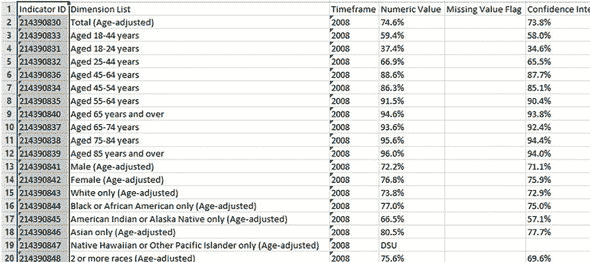

然而，世界并不是由结构化数据构成的；它是人类和机器强加的。更常见的是，数据是无结构的。

#### 1.2.2\. 无结构化数据

无结构化数据是难以适应数据模型的数据，因为其内容是特定于上下文或变化的。无结构化数据的一个例子是你的普通电子邮件（图 1.2）。尽管电子邮件包含结构化元素，如发件人、标题和正文文本，但找到写有关于特定员工的投诉邮件的人数是一项挑战，因为有许多方式可以指代一个人。成千上万的不同语言和方言进一步复杂化了这个问题。

##### 图 1.2\. 电子邮件既是无结构化数据的例子，也是自然语言数据的例子。


如图 1.2 所示的人写电子邮件也是一个自然语言数据的完美示例。

#### 1.2.3\. 自然语言

自然语言是一种特殊类型的非结构化数据；它难以处理，因为它需要了解特定的数据科学技术和语言学知识。

自然语言处理社区在实体识别、主题识别、摘要、文本补全和情感分析方面取得了成功，但在一个领域训练的模型并不很好地泛化到其他领域。即使是最先进的技巧也无法解读每一条文本的含义。然而，这并不令人惊讶：人类在处理自然语言上也存在困难。它本质上就是模糊的。意义本身的概念在这里也是值得怀疑的。让两个人听同一场对话，他们会得到相同的意义吗？同样的词语在不同的情绪下（如愤怒或喜悦）可能会有不同的含义。

#### 1.2.4\. 机器生成数据

机器生成数据是由计算机、过程、应用程序或其他机器在没有人类干预的情况下自动创建的信息。机器生成数据正成为主要的数据资源，并将继续如此。Wikibon 预测，到 2020 年，*工业互联网*（Frost & Sullivan 创造的一个术语，指复杂物理机械与网络传感器和软件的集成）的市场价值将达到约 5400 亿美元。IDC（国际数据公司）估计，到 2020 年，连接的设备数量将是人数的 26 倍。这个网络通常被称为*物联网*。

由于机器数据量巨大且速度快，其分析依赖于高度可扩展的工具。机器数据的例子包括网络服务器日志、通话详细记录、网络事件日志和遥测数据(图 1.3)。

##### 图 1.3\. 机器生成数据的示例

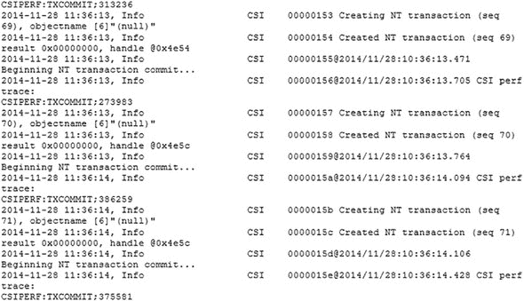

图 1.3 中显示的机器数据非常适合经典的表结构数据库。这不是处理高度互联或“网络化”数据（其中实体之间的关系起着重要作用）的最佳方法。

#### 1.2.5\. 基于图或网络的数据

“图数据”可能是一个令人困惑的术语，因为任何数据都可以以图表的形式展示。这里的“图”指的是数学上的*图论*。在图论中，图是一种数学结构，用于模拟对象之间的成对关系。简而言之，图或网络数据是关注对象关系或相邻性的数据。图结构使用节点、边和属性来表示和存储图形数据。基于图的数据是表示社交网络的自然方式，其结构允许你计算特定指标，例如一个人的影响力和两个人之间的最短路径。

图形数据的示例可以在许多社交媒体网站上找到(图 1.4)。例如，在领英上，你可以看到你在哪家公司认识的人。推特上的关注者列表是另一个基于图形数据的例子。其力量和复杂性来自于多个重叠的节点图。例如，想象这里连接的边表示“Facebook 上的朋友”。想象另一个包含相同人物的图，通过领英连接商业同事。想象一个基于 Netflix 电影兴趣的第三张图。重叠这三个看起来不同的图使得提出更有趣的问题成为可能。

##### 图 1.4\. 社交网络中的朋友是图形数据的例子。

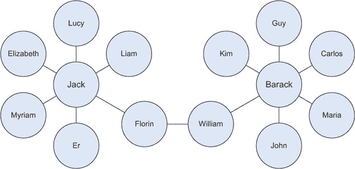

图形数据库用于存储基于图形的数据，并使用专门的查询语言（如 SPARQL）进行查询。

图形数据带来了挑战，但对于计算机解释加性和图像数据来说，可能更加困难。

#### 1.2.6\. 音频、图像和视频

音频、图像和视频是数据科学家面临特定挑战的数据类型。对于人类来说微不足道的任务，例如在图片中识别物体，对于计算机来说却很具挑战性。MLBAM（美国职业棒球大联盟高级媒体）在 2014 年宣布，他们将增加每场比赛的视频捕捉量，达到大约 7 TB，用于实时比赛分析。体育场的高速摄像机将捕捉球和运动员的动作，以实时计算，例如，防守球员相对于两条底线所走的路径。

最近，一家名为 DeepMind 的公司成功开发了一个算法，能够学习如何玩电子游戏。这个算法将视频屏幕作为输入，并通过深度学习过程的复杂过程学习解释一切。这是一个令人瞩目的成就，促使谷歌收购该公司以用于他们自己的人工智能(AI)开发计划。学习算法接受由计算机游戏产生的数据；这是流数据。

#### 1.2.7\. 流数据

虽然流数据可以几乎采取之前任何形式，但它有一个额外的属性。当事件发生时，数据流入系统，而不是批量加载到数据存储中。尽管这并不是真正不同类型的数据，但我们在这里将其视为此类，因为您需要调整您的流程来处理此类信息。

示例包括推特上的“热门趋势”、现场体育或音乐赛事，以及股市。

### 1.3\. 数据科学流程

数据科学流程通常包括六个步骤，如你在图 1.5 中的思维导图中所见。我们在这里简要介绍它们，并在第二章中更详细地处理它们。

##### 图 1.5\. 数据科学流程

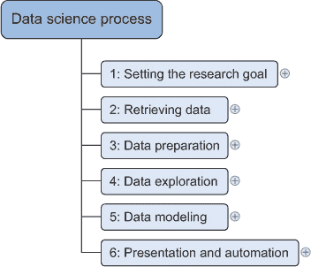

#### 1.3.1\. 确定研究目标

数据科学主要在组织背景下应用。当业务要求你执行一个数据科学项目时，你首先准备一个项目章程。这个章程包含诸如你要研究什么、公司如何从中受益、你需要哪些数据和资源、时间表以及交付成果等信息。在整个书中，数据科学过程将应用于更大的案例研究，你将了解不同的可能研究目标。

#### 1.3.2\. 获取数据

第二步是收集数据。你在项目章程中已经说明了需要哪些数据以及在哪里可以找到它们。在这一步中，你确保可以使用这些数据在你的程序中，这意味着检查数据的存续性、质量和可访问性。数据也可以由第三方公司提供，形式多样，从 Excel 表格到不同类型的数据库。

#### 1.3.3\. 数据准备

数据收集是一个容易出错的过程；在这个阶段，你提高数据质量，并为后续步骤的使用做准备。这个阶段包括三个子阶段：*数据清洗*从数据源中移除错误值和跨数据源的不一致性，*数据集成*通过结合来自多个数据源的信息来丰富数据源，*数据转换*确保数据以适合在模型中使用的形式。

#### 1.3.4\. 数据探索

数据探索涉及对数据的更深入理解。你试图理解变量之间如何相互作用，数据的分布情况，以及是否存在异常值。为了实现这一点，你主要使用描述性统计、可视化技术和简单的建模。这一步通常被称为 EDA，即探索性数据分析。

#### 1.3.5\. 数据建模或模型构建

在这个阶段，你使用模型、领域知识和之前步骤中找到的数据的见解来回答研究问题。你从统计学、机器学习、运筹学等领域选择一种技术。构建模型是一个迭代过程，涉及选择模型变量、执行模型和模型诊断。

#### 1.3.6\. 展示和自动化

最后，你将结果展示给业务部门。这些结果可以有多种形式，从演示文稿到研究报告。有时你需要自动化执行过程，因为业务可能希望在其他项目中使用你获得的认识，或者使运营流程能够使用模型的结果。


##### 迭代过程

之前对数据科学过程的描述可能会给你一种印象，即你以线性方式走过这个过程，但现实中你往往需要退后一步，重新审视某些发现。例如，你可能在数据探索阶段发现异常值，指向数据导入错误。作为数据科学过程的一部分，你获得渐进式洞察，这可能导致新的问题。为了防止重复工作，确保你在开始时清晰地彻底界定业务问题。


现在我们对这个过程有了更好的理解，让我们来看看相关的技术。

### 1.4\. 大数据生态系统与数据科学

目前存在许多大数据工具和框架，由于新技术快速出现，很容易感到迷茫。一旦你意识到大数据生态系统可以按具有相似目标和功能的技术分组，这将在本节中讨论。数据科学家使用许多不同的技术，但并非所有技术；我们将用单独的一章来介绍最重要的数据科学技术类别。图 1.6 中的思维导图显示了大数据生态系统的组件以及不同技术所属的位置。

##### 图 1.6\. 大数据技术可以分为几个主要组件。

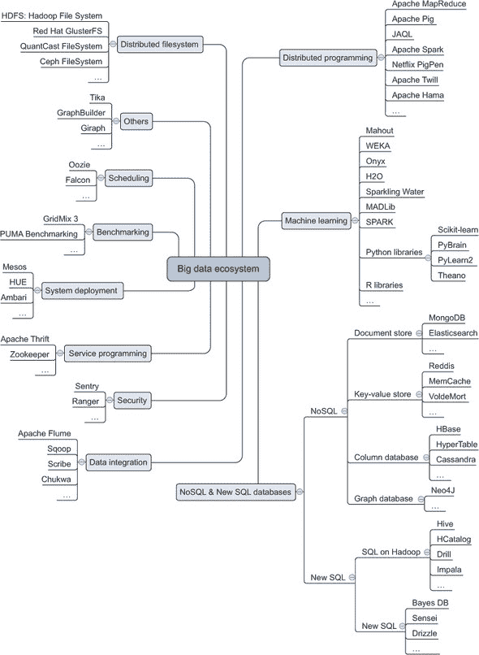

让我们来看看图中不同的工具组，看看每个工具的作用。我们将从分布式文件系统开始。

#### 1.4.1\. 分布式文件系统

一个 *分布式文件系统* 与普通文件系统类似，但不同的是它同时运行在多个服务器上。因为它是文件系统，所以你可以做几乎与在普通文件系统上相同的事情。诸如存储、读取、删除文件以及为文件添加安全措施等操作是每个文件系统的核心，包括分布式文件系统。分布式文件系统具有显著的优势：

+   它们可以存储比任何单个计算机磁盘都大的文件。

+   文件会自动在多个服务器之间进行复制，以实现冗余或并行操作，同时隐藏了这一过程的复杂性，对用户来说不可见。

+   系统易于扩展：你不再受单个服务器内存或存储限制的约束。

在过去，通过将所有内容迁移到具有更多内存、存储和更好 CPU 的服务器（垂直扩展）来增加规模。如今，你可以添加另一个小型服务器（水平扩展）。这一原则使得扩展潜力几乎无限。

目前最知名的分布式文件系统是 *Hadoop 文件系统 (HDFS)*。它是对 Google 文件系统的一个开源实现。在这本书中，我们专注于 Hadoop 文件系统，因为它是最常用的。然而，还存在许多其他分布式文件系统：*Red Hat 集群文件系统*、*Ceph 文件系统*和*Tachyon 文件系统*，仅举三个例子。

#### 1.4.2\. 分布式编程框架

一旦你在分布式文件系统中存储了数据，你希望利用它。在分布式硬盘上工作的一个重要方面是，你不会将数据移动到程序中，而是将程序移动到数据中。当你从零开始使用像 C、Python 或 Java 这样的通用编程语言时，你需要处理分布式编程带来的复杂性，比如重启失败的任务、跟踪不同子进程的结果等等。幸运的是，开源社区已经为这些开发了众多框架，这些框架为你提供了与分布式数据一起工作的更好体验，并帮助你应对许多挑战。

#### 1.4.3. 数据集成框架

一旦你建立了分布式文件系统，就需要添加数据。你需要将数据从一个来源移动到另一个来源，这正是数据集成框架如 Apache Sqoop 和 Apache Flume 大显身手的地方。这个过程类似于传统数据仓库中的提取、转换和加载过程。

#### 1.4.4. 机器学习框架

当数据已经到位时，就是提取宝贵见解的时候了。这时，你需要依赖机器学习、统计学和应用数学等领域。在第二次世界大战之前，所有事情都需要手工计算，这严重限制了数据分析的可能性。第二次世界大战后，计算机和科学计算得到了发展。一台计算机可以完成所有的计数和计算，从而打开了无限的可能性。自从这一突破以来，人们只需要推导出数学公式，将它们写成算法，并加载他们的数据。如今，可用的数据量如此巨大，一台计算机已无法独自处理工作负载。事实上，在上一个千年中开发的几个算法，即使你能使用地球上所有的计算机，也无法在宇宙末日之前终止。这与时间复杂度([`en.wikipedia.org/wiki/Time_complexity`](https://en.wikipedia.org/wiki/Time_complexity))有关。一个例子是尝试通过测试所有可能的组合来破解密码。一个例子可以在[`stackoverflow.com/questions/7055652/real-world-example-of-exponential-time-complexity`](http://stackoverflow.com/questions/7055652/real-world-example-of-exponential-time-complexity)找到。旧算法的最大问题之一是它们扩展性不好。今天我们需要分析的数据量如此之大，这变得成问题，需要专门的框架和库来处理这么大的数据量。Python 最受欢迎的机器学习库是 Scikit-learn。它是一个出色的机器学习工具箱，我们将在本书的后面使用它。当然，还有其他 Python 库：

+   ***PyBrain 用于神经网络*** —神经网络是模仿人类大脑学习机制和复杂性的学习算法。神经网络通常被视为高级和黑盒。

+   ***NLTK 或自然语言工具包*** —正如其名所示，它的重点是处理自然语言。这是一个功能丰富的库，附带多个文本语料库，以帮助您建模自己的数据。

+   ***Pylearn2*** —另一个机器学习工具箱，但比 Scikit-learn 成熟度略低。

+   ***TensorFlow*** —由谷歌提供的用于深度学习的 Python 库。

当然，这个领域不仅限于 Python 库。Spark 是一个新的 Apache 许可的机器学习引擎，专注于实时机器学习。它值得一看，你可以在[`spark.apache.org/`](http://spark.apache.org/)了解更多关于它的信息。

#### 1.4.5\. NoSQL 数据库

如果你需要存储大量数据，你需要一种专门用于管理和查询这些数据的软件。传统上，这通常是关系数据库如 Oracle SQL、MySQL、Sybase IQ 等领域的游戏规则。虽然它们仍然是许多用例的首选技术，但新的数据库类型已经在 NoSQL 数据库的范畴下出现。

这个组的名称可能会误导人，因为在这个上下文中，“No”代表“不仅”。SQL 功能不足并不是范式转变的最大原因，许多 NoSQL 数据库已经实现了 SQL 的版本。但是，传统数据库的不足之处在于它们无法很好地扩展。通过解决传统数据库的几个问题，NoSQL 数据库允许数据几乎无限增长。这些问题与大数据的每个属性相关：它们的存储或处理能力无法扩展到单个节点，并且它们没有处理流、图或非结构化数据形式的方法。

已经出现了许多不同类型的数据库，但它们可以被归类为以下几种类型：

+   ***列数据库*** —数据以列的形式存储，这使得算法能够执行更快的查询。较新的技术使用单元格存储。类似表的结构仍然很重要。

+   ***文档存储*** —文档存储不再使用表，而是将每个观察结果存储在文档中。这允许有更多灵活的数据模式。

+   ***流数据*** —数据不是批量收集、转换和汇总，而是在实时进行。虽然我们将其分类为数据库以帮助您选择工具，但它更是一种特定类型的问题，推动了像 Storm 这样的技术创造。

+   ***键值存储*** —数据不是存储在表中；相反，你为每个值分配一个键，例如 org.marketing.sales.2015: 20000\. 这可以很好地扩展，但几乎所有的实现都放在了开发者身上。

+   ***SQL on Hadoop*** —Hadoop 上的批量查询使用类似于 SQL 的语言，在后台使用 map-reduce 框架。

+   ***新 SQL*** —这个类别结合了 NoSQL 数据库的可扩展性和关系数据库的优点。它们都具有 SQL 接口和关系数据模型。

+   ***图数据库*** —并非每个问题都最适合存储在表中。某些问题更自然地转化为图论并存储在图数据库中。一个典型的例子是社交网络。

#### 1.4.6\. 调度工具

调度工具帮助你自动化重复性任务，并根据事件（如将新文件添加到文件夹）触发作业。这些工具类似于 Linux 上的 CRON，但专门为大数据开发。例如，你可以使用它们在目录中可用新数据集时启动 MapReduce 任务。

#### 1.4.7\. 基准测试工具

这类工具的开发是为了通过提供标准化的分析套件来优化你的大数据安装。分析套件是从一组代表性大数据作业中提取的。基准测试和优化大数据基础设施和配置通常不是数据科学家自己的工作，而是专业设置 IT 基础设施的人员的工作；因此，这些内容没有包含在这本书中。使用优化的基础设施可以产生很大的成本差异。例如，如果你可以在 100 台服务器的集群上提高 10%，你就可以节省 10 台服务器的成本。

#### 1.4.8\. 系统部署

设置大数据基础设施并不容易，而帮助工程师将新应用程序部署到大数据集群正是系统部署工具大放异彩的地方。它们在很大程度上自动化了大数据组件的安装和配置。这不是数据科学家的核心任务。

#### 1.4.9\. 服务编程

假设你已经在 Hadoop 上开发了一个世界级的足球预测应用程序，并且你想允许其他人使用你应用程序做出的预测。然而，你对所有热衷于使用你预测的人的架构或技术一无所知。服务工具在这里表现出色，通过将大数据应用程序作为服务暴露给其他应用程序。数据科学家有时需要通过服务来公开他们的模型。最著名的例子是 REST 服务；REST 代表表示状态转移。它通常用于向网站提供数据。

#### 1.4.10\. 安全性

你是否希望每个人都能够访问你所有的数据？你可能需要精细控制对数据的访问，但又不想逐个应用程序地管理。大数据安全工具允许你集中和精细地控制对数据的访问。大数据安全已经成为一个独立的话题，数据科学家通常只是作为数据消费者面对它；很少会自己实现安全。在这本书中，我们不描述如何在大数据上设置安全，因为这是一项安全专家的工作。

### 1.5\. Hadoop 的入门级工作示例

我们将以一个大数据环境中的小型应用程序结束本章。为此，我们将使用 Hortonworks Sandbox 镜像。这是一个由 Hortonworks 创建的虚拟机，用于在本地机器上尝试一些大数据应用程序。在本书的后面部分，您将看到 Juju 如何简化在多台机器上安装 Hadoop 的过程。

我们将使用一个小型的工作薪资数据集来运行我们的第一个示例，但查询包含数十亿行的大数据集同样简单。查询语言将类似于 SQL，但在幕后将运行一个 MapReduce 作业，并生成一个简单的结果表，然后可以将其转换为条形图。这个练习的最终结果看起来像 图 1.7。

##### 图 1.7\. 最终结果：按工作描述的平均薪资

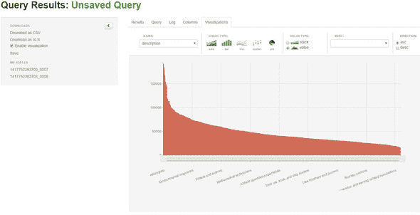

为了尽可能快地启动，我们在 VirtualBox 中使用 Hortonworks Sandbox。VirtualBox 是一种虚拟化工具，允许您在自己的操作系统内运行另一个操作系统。在这种情况下，您可以在已安装的操作系统内运行带有现有 Hadoop 安装的 CentOS。

要在 VirtualBox 上将沙盒启动并运行，需要几个步骤。注意，以下步骤是在撰写本章时（2015 年 2 月）适用的：

> **1**. 从 [`hortonworks.com/products/hortonworkssandbox/#install`](http://hortonworks.com/products/hortonworkssandbox/#install) 下载虚拟镜像。
> 
> **2**. 启动您的虚拟机主机。VirtualBox 可以从 [`www.virtualbox.org/wiki/Downloads`](https://www.virtualbox.org/wiki/Downloads) 下载。
> 
> **3**. 按下 CTRL+I 并从 Hortonworks 选择虚拟镜像。
> 
> **4**. 点击下一步。
> 
> **5**. 点击导入；稍等片刻，您的镜像应该已经导入。
> 
> **6**. 现在选择您的虚拟机并点击运行。
> 
> **7**. 稍等片刻，启动带有 Hadoop 安装的 CentOS 发行版，如图 1.8 所示。注意这里的沙盒版本是 2.1。在其他版本中可能会有所不同。
> 
> ##### 图 1.8\. 在 VirtualBox 中运行的 Hortonworks Sandbox
> ##### 
> 

您可以直接登录到机器或使用 SSH 登录。对于此应用程序，您将使用 Web 界面。将您的浏览器指向地址 [`127.0.0.1:8000`](http://127.0.0.1:8000)，您将看到 图 1.9 中所示的屏幕。

##### 图 1.9\. 可在 [`127.0.0.1:8000`](http://127.0.0.1:8000) 找到的 Hortonworks Sandbox 欢迎界面

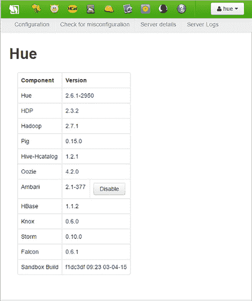

Hortonworks 上传了两个样本集，您可以在 HCatalog 中看到它们。只需点击屏幕上的 HCat 按钮，您就会看到可用的表 (图 1.10)。

##### 图 1.10\. HCatalog 中可用的表列表

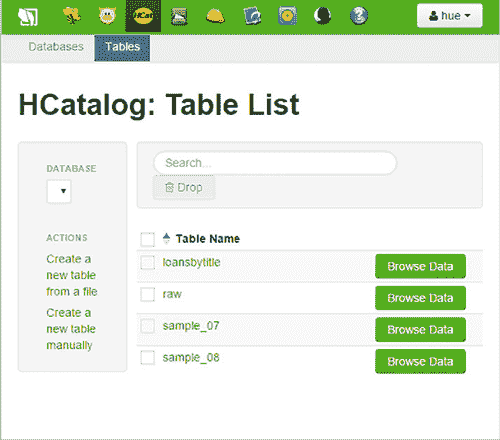

要查看数据内容，请点击样本 _07 条目旁边的浏览数据按钮，以获取下一屏幕 (图 1.11)。

##### 图 1.11。表格的内容

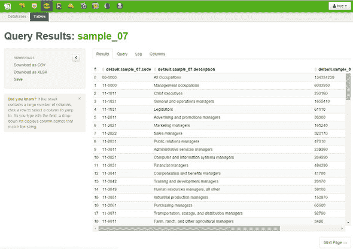

这看起来像是一个普通的表格，而 Hive 是一个工具，让你可以用 SQL 像普通数据库一样接近它。没错：在 Hive 中，你使用 HiveQL（一种普通的 SQL 方言）来获取结果。要打开 Beeswax HiveQL 编辑器，请点击菜单中的 Beeswax 按钮（图 1.12）。

##### 图 1.12。您可以在 Beeswax HiveQL 编辑器中执行 HiveQL 命令。幕后，它被转换为一个 MapReduce 作业。

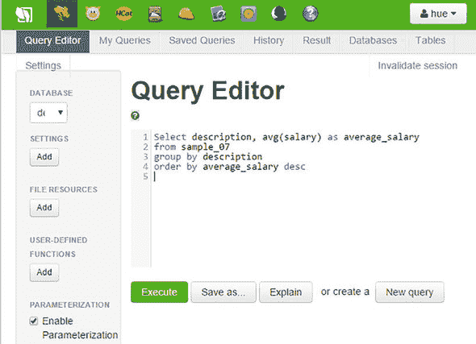

要获取你的结果，执行以下查询：

```
Select description, avg(salary) as average_salary from sample_07 group by
description order by average_salary desc.
```

点击执行按钮。Hive 将你的 HiveQL 转换为 MapReduce 作业，并在你的 Hadoop 环境中执行它，如图 1.13 所示。

##### 图 1.13。日志显示你的 HiveQL 被转换为一个 MapReduce 作业。注意：这个日志是从 2015 年 2 月的 HDP 版本中来的，所以当前版本可能看起来略有不同。

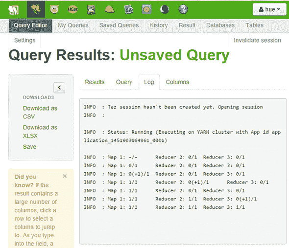

然而，现在最好避免阅读日志窗口。在这个阶段，它可能会误导人。如果你这是第一次查询，那么可能需要 30 秒。Hadoop 以其预热期而闻名。不过，那个讨论留到以后再说。

过了一段时间，结果出现了。干得好！正如图 1.14 所示，结论是上医学院是一个好的投资。惊讶吗？

##### 图 1.14。最终结果：按职业的平均工资概述

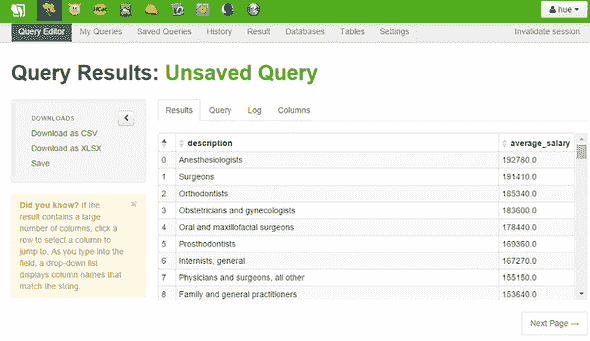

通过这个表格，我们结束了我们的 Hadoop 入门教程。

虽然这一章只是个开始，但有时可能会觉得有点令人不知所措。建议现在先放一放，等到所有概念都彻底解释清楚后再回来。数据科学是一个广泛的领域，因此它包含了一个广泛的词汇表。我们希望在我们的时间里给你一个大多数内容的概览。之后，你可以挑选和选择，并在你最感兴趣的领域磨练你的技能。这就是“介绍数据科学”的全部内容，我们希望你能和我们一起享受这段旅程。

### 1.6. 摘要

在本章中，你学习了以下内容：

+   *大数据*是一个总称，用于任何大型或复杂的数据集集合，以至于使用传统的数据管理技术处理它们变得困难。它们的特点是四个 V：速度、多样性、体积和真实性。

+   *数据科学*涉及使用方法来分析从小数据集到大数据集的所有内容。

+   尽管数据科学流程不是线性的，但它可以被分解为以下步骤：

    > **1**. 确定研究目标
    > 
    > **2**. 收集数据
    > 
    > **3**. 数据准备
    > 
    > **4**. 数据探索
    > 
    > **5**. 模型
    > 
    > **6**. 展示和自动化

+   大数据景观不仅仅是 Hadoop。它由许多不同的技术组成，可以归类为以下几类：

    +   文件系统

    +   分布式编程框架

    +   数据集成

    +   数据库

    +   机器学习

    +   安全性

    +   调度

    +   基准测试

    +   系统部署

    +   服务编程

+   并非每个大数据类别都被数据科学家大量使用。他们主要关注文件系统、分布式编程框架、数据库和机器学习。他们确实会接触到其他组件，但这些是其他专业领域的范畴。

+   数据可以以不同的形式出现。主要形式包括

    +   结构化数据

    +   非结构化数据

    +   自然语言数据

    +   机器数据

    +   基于图的数据

    +   流数据
