## 第二章. 数据科学流程

*本章涵盖*

+   理解数据科学流程的流程

+   讨论数据科学流程的步骤

本章的目标是在不深入大数据之前概述数据科学流程。你将在后续章节中学习如何处理大数据集、流数据以及文本数据。

### 2.1. 数据科学流程概述

采取结构化的数据科学方法有助于你在最低成本的情况下最大限度地提高数据科学项目的成功率。这也使得以团队形式承担项目成为可能，每个团队成员都专注于他们最擅长的事情。但是请注意：这种方法可能不适合所有类型的项目，也不一定是做好数据科学的唯一方式。

典型的数据科学流程包括六个步骤，你将通过这些步骤进行迭代，如图 2.1 所示。

##### 图 2.1. 数据科学流程的六个步骤

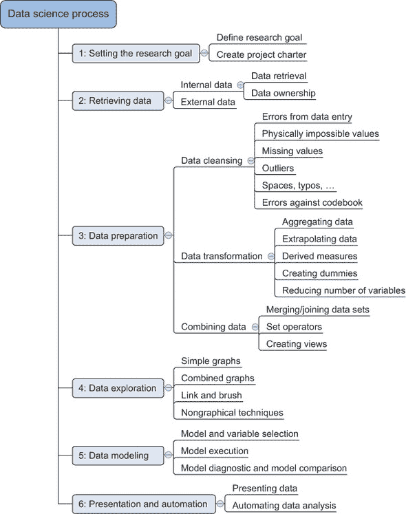

图 2.1 总结了数据科学流程，并显示了在项目期间你将采取的主要步骤和行动。以下列表是一个简要介绍；本章将更深入地讨论每个步骤。

> **1**. 这个流程的第一步是设定一个**研究目标**。这里的主要目的是确保所有利益相关者都理解项目的**目标**、**方法**和**原因**。在每一个严肃的项目中，这都会导致一个项目章程的产生。
> 
> **2**. 第二个阶段是**数据检索**。你希望有可用于分析的数据，因此这一步骤包括寻找合适的数据并从数据所有者那里获取数据。结果是原始形式的数据，这可能在变成可用的之前需要抛光和转换。
> 
> **3**. 现在你已经拥有了原始数据，是时候对其进行**准备**了。这包括将数据从原始形式转换为可以直接用于你模型的格式。为了实现这一点，你需要检测和纠正数据中的不同类型错误，合并来自不同数据源的数据，并进行转换。如果你已经成功完成了这一步，你就可以继续进行数据可视化和建模。
> 
> **4**. 第四步是**数据探索**。这一步骤的目标是深入理解数据。你将基于视觉和描述性技术寻找模式、相关性和偏差。从这个阶段获得的洞察将使你能够开始建模。
> 
> **5**. 最后，我们来到了最吸引人的部分：**模型构建**（本书中通常称为“数据建模”）。现在是你尝试从项目章程中陈述的洞察或预测的时候了。现在是时候拿出重型武器了，但请记住，研究告诉我们，通常（但不总是）简单模型的组合往往比一个复杂的模型表现更好。如果你正确完成了这一阶段，你几乎就完成了。
> 
> **6**. 数据科学模型的最后一步是*展示你的结果和自动化分析*，如果需要的话。项目的一个目标就是改变流程和/或做出更好的决策。你可能仍然需要说服企业你的发现确实会按照预期改变业务流程。这就是你可以在你的影响力角色中发光的时候。这一步骤的重要性在战略和战术层面的项目中更为明显。某些项目需要你反复执行业务流程，因此自动化项目可以节省时间。

在现实中，你不会以线性方式从步骤 1 进展到步骤 6。你通常会在这不同阶段之间回退和迭代。

按照这六个步骤进行，可以提高项目成功率并增加研究结果的影響力。这个过程确保你在开始查看数据之前就有一个明确的研究计划，对商业问题的良好理解，以及清晰的交付成果。你流程的第一步是关注获取高质量数据作为你模型的输入。这样你的模型在后期将表现得更好。在数据科学中，有一句众所周知的话：*垃圾输入等于垃圾输出*。

跟随一种结构化方法的好处之一是，你在寻找最佳模型的同时，更多地处于*原型模式*。在构建*原型*时，你可能会尝试多个模型，而不会过分关注程序速度或编写符合标准代码等问题。这让你能够专注于带来商业价值。

并非每个项目都是由企业自身发起的。在分析过程中获得的认识或新数据的到来可以催生新的项目。当数据科学团队产生一个想法时，已经进行了工作来提出建议并找到商业赞助者。

将项目划分为更小的阶段也允许员工作为一个团队一起工作。不可能在所有事情上都是专家。你需要知道如何将所有数据上传到所有不同的数据库中，找到一个既适合你的应用程序也适合公司内部其他项目的最佳数据方案，然后跟踪所有统计和数据挖掘技术，同时还要成为演示工具和商业政治的专家。这是一项艰巨的任务，这也是为什么越来越多的公司依赖于一个专家团队而不是试图找到一个人能做所有的事情。

我们在本节中描述的流程最适合只包含几个模型的数据科学项目。它并不适合所有类型的项目。例如，包含数百万个实时模型的项目需要比我们描述的流程不同的方法。尽管如此，一个初出茅庐的数据科学家按照这种方式工作可以走得很远。

#### 2.1.1\. 不要成为过程的奴隶

并非每个项目都会遵循这个蓝图，因为你的流程受数据科学家、公司以及你所从事的项目性质的影响。一些公司可能要求你遵循严格的协议，而其他公司则可能采用更为非正式的工作方式。通常情况下，当你处理复杂项目或涉及多人或资源时，你需要一个结构化的方法。

*敏捷*项目模型是迭代顺序流程的替代方案。随着这种方法在 IT 部门和整个公司中赢得更多支持，它也被数据科学社区所采纳。尽管敏捷方法适合数据科学项目，但许多公司政策可能会倾向于更严格的数据科学方法。

在一开始就规划数据科学流程的每一个细节并不总是可能的，而且你通常会在流程的不同步骤之间迭代。例如，在简报之后，你开始你的正常流程，直到你进入探索性数据分析阶段。你的图表显示了两组——男性和女性——之间的行为差异。你不确定，因为你没有变量来指示客户是男性还是女性。你需要检索额外的数据集来确认这一点。为此，你需要通过审批流程，这表明你（或业务）需要提供一种项目章程。在大公司中，获取完成项目所需的所有数据可能是一项艰巨的任务。

### 2.2. 第一步：定义研究目标和创建项目章程

项目开始于理解项目的*目标*、*原因*和*方法*（图 2.2）。公司期望你做什么？管理层为什么如此重视你的研究？它是更大战略图景的一部分，还是源于某人发现的机会的“孤狼”项目？回答这三个问题（目标、原因、方法）是第一阶段的目标，这样每个人都知道该做什么，并可以就最佳行动方案达成一致。

##### 图 2.2. 第一步：设定研究目标

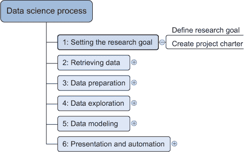

结果应该是一个明确的研究目标、对背景的良好理解、定义清晰的交付成果以及一个包含时间表的行动计划。这些信息最好放在项目章程中。当然，项目章程的长度和正式程度在不同项目和公司之间可能会有所不同。在这个项目的早期阶段，人际交往能力和商业洞察力比卓越的技术能力更为重要，这就是为什么这部分工作通常由更有经验的人员指导。

#### 2.2.1. 花时间理解你的研究目标和背景

一个基本的结果是研究目标，它以清晰和专注的方式陈述了你的作业目的。理解业务目标和背景对于项目成功至关重要。继续提问和设计例子，直到你掌握确切的业务期望，确定你的项目如何融入更大的图景，欣赏你的研究如何改变业务，以及他们如何使用你的结果。没有什么比花了几个月研究某件事，直到那一刻的灵感迸发并解决问题，但当你向组织报告你的发现时，每个人都立即意识到你误解了他们的问题更令人沮丧的了。不要轻率地跳过这个阶段。许多数据科学家在这里失败：尽管他们有数学智慧和科学才华，但他们似乎从未真正理解业务目标和背景。

#### 2.2.2\. 创建项目章程

客户喜欢事先知道他们支付了什么，所以在你对业务问题有很好的理解之后，尝试就可交付成果达成正式协议。所有这些信息最好收集在项目章程中。对于任何重大项目，这将是强制性的。

项目章程需要团队合作，你的输入至少包括以下内容：

+   清晰的研究目标

+   项目使命和背景

+   你将如何进行你的分析

+   你期望使用的资源

+   证明这是一个可实现的项目的证据，或者概念证明

+   可交付成果和成功的衡量标准

+   时间表

你的客户可以使用这些信息来估算项目成本以及使你的项目成功所需的数据和人员。

### 2.3\. 第 2 步：检索数据

数据科学的下一步是检索所需的数据（图 2.3）。有时你需要进入现场并自己设计数据收集过程，但大多数时候你不会参与这一步骤。许多公司已经为你收集和存储了数据，而且他们没有的通常可以从第三方购买。不要害怕在你的组织之外寻找数据，因为越来越多的组织甚至将高质量的数据免费提供给公众和商业使用。

##### 图 2.3\. 第 2 步：检索数据

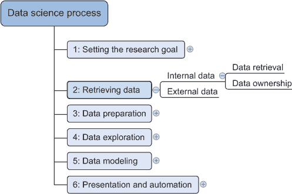

数据可以以多种形式存储，从简单的文本文件到数据库中的表格。现在的目标是获取所有你需要的数据。这可能很困难，即使你成功了，数据通常就像未经雕琢的钻石：它需要抛光才能对你有任何用处。

#### 2.3.1\. 从公司内部存储的数据开始

您的第一步应该是评估公司内部可轻松获取的数据的相关性和质量。大多数公司都有维护关键数据的计划，因此大部分清理工作可能已经完成。这些数据可以存储在由 IT 专业人员维护的官方数据存储库中，例如*数据库*、*数据集市*、*数据仓库*和*数据湖*。数据库的主要目标是数据存储，而数据仓库旨在读取和分析这些数据。数据集市是数据仓库的子集，旨在服务于特定的业务单元。虽然数据仓库和数据集市是预加工数据的家园，但数据湖包含的是其自然或原始格式的数据。但仍然存在可能性，即您的数据仍然存储在领域专家的桌面上的 Excel 文件中。

即使在您自己的公司内部找到数据有时也可能是一项挑战。随着公司的发展，他们的数据会分散在许多地方。随着人们更换职位和离开公司，数据知识可能会分散。文档和元数据并不总是交付经理的首要任务，因此您可能需要发展一些福尔摩斯式的技能来找到所有丢失的部分。

获取数据访问权限是另一项困难的任务。组织理解数据的价值和敏感性，并通常有政策来确保每个人都能访问他们所需的数据，而无需更多。这些政策转化为被称为*防火墙*的物理和数字障碍。这些“墙”在大多数国家对于客户数据来说是强制性和规范化的。这也是出于好理由；想象一下，信用卡公司的每个人都能够访问您的消费习惯。获取数据访问权限可能需要时间，并可能涉及公司政治。

#### 2.3.2\. 不要害怕四处寻找

如果您所在的组织内部没有数据，那么就看看组织外部。许多公司专门从事收集有价值的信息。例如，尼尔森和 GFK 在零售行业因这一点而闻名。其他公司提供数据，以便您反过来丰富他们的服务和生态系统。推特、领英和 Facebook 就是这种情况。

虽然某些公司认为数据比石油更有价值，但越来越多的政府和组织正将他们的数据免费与世界共享。这些数据的质量可能非常优秀；这取决于创建和管理它的机构。他们分享的信息涵盖了广泛的主题，例如某个地区的意外事故数量或药物滥用情况及其人口统计。当你想要丰富专有数据时，这些数据很有帮助；同时，在家训练数据科学技能时也非常方便。表 2.1 仅展示了日益增长的开放数据提供者中的一小部分。

##### 表 2.1\. 应该帮助您开始的开放数据提供者列表

| 开放数据网站 | 描述 |
| --- | --- |
| Data.gov | 美国政府开放数据的家园 |
| [`open-data.europa.eu/`](https://open-data.europa.eu/) | 欧洲委员会开放数据的家园 |
| Freebase.org | 从维基百科、MusicBrains 和 SEC 档案等网站检索信息的开放数据库 |
| Data.worldbank.org | 世界银行开放数据倡议 |
| Aiddata.org | 国际发展开放数据 |
| Open.fda.gov | 美国食品药品监督管理局的开放数据 |

#### 2.3.3\. 现在进行数据质量检查，以防止以后出现问题

预计您将花费项目的大部分时间进行数据校正和清洗，有时高达 80%。数据的检索是您在数据科学流程中第一次检查数据。在数据收集阶段，您会遇到的大部分错误都很容易发现，但过于粗心大意会使您花费许多小时解决本可以在数据导入期间预防的数据问题。

您将在导入、数据准备和探索阶段调查数据。区别在于调查的目标和深度。在*数据检索*阶段，您检查数据是否与源文档中的数据相等，并查看您是否拥有正确的数据类型。这不应该花费太多时间；当您有足够的证据表明数据与您在源文档中找到的数据相似时，您就停止。在*数据准备*阶段，您进行更细致的检查。如果您在前一阶段做得很好，现在发现的错误也存在于源文档中。重点是变量的内容：您希望消除拼写错误和其他数据输入错误，并将数据带到数据集的共同标准。例如，您可能将 USQ 更正为 USA，将联合王国更正为 UK。在*探索阶段*，您的重点转向从数据中可以学习到什么。现在您假设数据是干净的，并查看统计属性，如分布、相关性和异常值。您通常会反复进行这些阶段。例如，当您在探索阶段发现异常值时，它们可以指向数据输入错误。现在您已经了解了数据质量在流程中是如何得到提高的，我们将更深入地探讨数据准备步骤。

### 2.4\. 第 3 步：清洗、集成和转换数据

从数据检索阶段接收到的数据可能“像粗糙的钻石。”您的任务现在是对其进行净化和准备，以便在建模和报告阶段使用。这样做非常重要，因为您的模型将表现得更好，您将花费更少的时间来修复奇怪的输出。这几乎无法用足够多的次数来提及：垃圾输入等于垃圾输出。您的模型需要特定格式的数据，因此数据转换总是起作用。尽早纠正数据错误是一个好习惯。然而，在现实环境中，这并不总是可能的，因此您需要在程序中采取纠正措施。

图 2.4 展示了在数据清洗、集成和转换阶段最常见的行为。

##### 图 2.4\. 第 3 步：数据准备

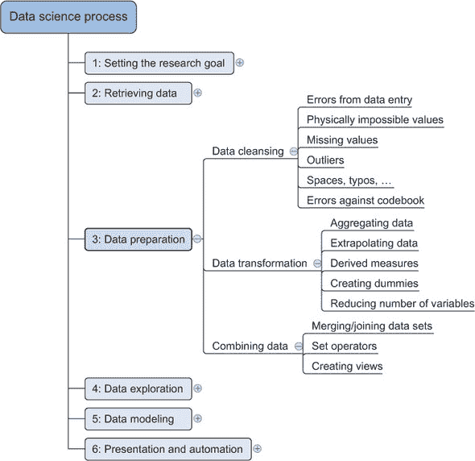

这个思维导图现在可能看起来有点抽象，但我们在下一节中会更详细地处理所有这些点。您将看到所有这些行动之间有很大的共性。

#### 2.4.1\. 数据清洗

数据清洗是数据科学过程中的一个子过程，它专注于去除数据中的错误，以便您的数据成为其来源过程的真正和一致的表现。

通过“真正和一致的表现”，我们意味着至少存在两种类型的错误。第一种是*解释错误*，例如，当您理所当然地接受数据中的值时，比如说某人的年龄大于 300 岁。第二种错误指向数据源之间的*不一致性*或与您公司标准化的值相矛盾。这类错误的一个例子是在一个表中将“Female”放入，在另一个表中将“F”放入，尽管它们代表的是同一件事：这个人女性。另一个例子是在一个表中使用磅，在另一个表中使用美元。可能的错误太多，无法一一列举，但表 2.2 展示了可以通过简单检查检测到的错误类型概述——“低垂的果实”。

##### 表 2.2\. 常见错误的概述

| 一般解决方案 |
| --- |
| 尝试在数据获取链的早期修复问题，或者在其他地方修复它。 |
| **错误描述** | **可能的解决方案** |
| *指向一个数据集中错误值的错误* |
| 数据输入错误 | 手动覆盖 |
| 空白冗余 | 使用字符串函数 |
| 不可能的值 | 手动覆盖 |
| 缺失值 | 删除观测值或值 |
| 异常值 | 验证，如果错误，则将其视为缺失值（删除或插入） |
| *指向数据集之间不一致性的错误* |
| 与代码簿的偏差 | 通过键匹配或使用手动覆盖 |
| 不同的度量单位 | 重新计算 |
| 不同聚合级别 | 通过聚合或外推将其提升到相同的测量水平 |

有时你会使用更高级的方法，例如简单的建模，来寻找和识别数据错误；诊断图可以特别有洞察力。例如，在图 2.5 中，我们使用一个度量来识别看起来不合适的数据点。我们进行回归以熟悉数据并检测单个观察值对回归线的影响。当一个单独的观察值有太大的影响时，这可以表明数据中存在错误，但也可能是一个有效的点。然而，在数据清洗阶段，这些高级方法很少被应用，并且通常被某些数据科学家视为过度。

##### 图 2.5\. 被圈出的点对模型有重大影响，值得调查，因为它可能指向一个数据不足的区域，或者可能表明数据中存在错误，但它也可能是一个有效的数据点。

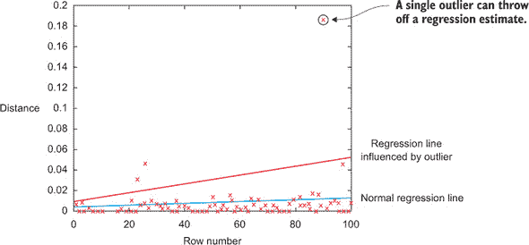

现在我们已经给出了概述，是时候更详细地解释这些错误了。

##### 数据输入错误

数据收集和数据输入是容易出错的过程。它们通常需要人工干预，由于人类只是人类，他们可能会犯拼写错误或分心一秒钟，从而在链中引入错误。但由机器或计算机收集的数据也不是没有错误的。错误可能源于人类粗心大意，而另一些则是由于机器或硬件故障。机器产生的错误示例包括传输错误或提取、转换和加载阶段（ETL）中的错误。

对于小数据集，你可以手动检查每个值。当研究的变量没有很多类别时，可以通过计数表来检测数据错误。当你有一个只能取两个值：“好”和“坏”的变量时，你可以创建一个频率表，看看这些是否真的是唯一存在的两个值。在表 2.3 中，值“Godo”和“Bade”指出至少在 16 个案例中出了问题。

##### 表 2.3\. 使用频率表检测简单变量的异常值

| 值 | 数量 |
| --- | --- |
| 好 | 1598647 |
| 差 | 1354468 |
| Godo | 15 |
| Bade | 1 |

这种类型的错误大多数都可以通过简单的赋值语句和 if-then-else 规则轻松修复：

```
if x == "Godo":
    x = "Good"
if x == "Bade":
    x = "Bad"
```

##### 空白字符重复

空白字符往往难以检测，但会导致与其他冗余字符一样的问题。谁没有因为字符串末尾的空白字符而丢失几天项目时间呢？你要求程序合并两个键，却发现输出文件中缺少了一些观察值。经过几天在代码中寻找，你终于找到了错误。然后是最难的部分：向项目利益相关者解释延迟。ETL 阶段的清理没有很好地执行，一个表中的键在字符串末尾包含了一个空白字符。这导致了“FR” – “FR”这样的键不匹配，丢弃了无法匹配的观察值。

如果你知道要留意它们，修复多余的空白符在大多数编程语言中都很幸运地足够简单。它们都提供了字符串函数，可以删除前导和尾随空白。例如，在 Python 中，你可以使用`strip()`函数来删除前导和尾随空格。


##### 修复大写字母不匹配问题

大写字母不匹配很常见。大多数编程语言在“巴西”和“brazil”之间做出区分。在这种情况下，你可以通过应用一个返回两个字符串都为小写的函数来解决问题，例如 Python 中的`.lower()`。`"Brazil".lower() == "brazil".lower()`应该返回`true`。


##### 不可能的值和合理性检查

合理性检查是另一种有价值的数据检查类型。在这里，你检查值是否与物理上或理论上不可能的值相匹配，例如身高超过 3 米的人或年龄为 299 岁的人。合理性检查可以直接用规则表示：

```
check = 0 <= age <= 120
```

##### 异常值

异常值是一个似乎与其他观察值距离较远的观察值，或者更具体地说，是一个遵循与其他观察值不同的逻辑或生成过程的观察值。找到异常值的最简单方法是使用包含最小值和最大值的图表或表格。一个例子显示在图 2.6 中。

##### 图 2.6\. 分布图有助于检测异常值并帮助你理解变量。

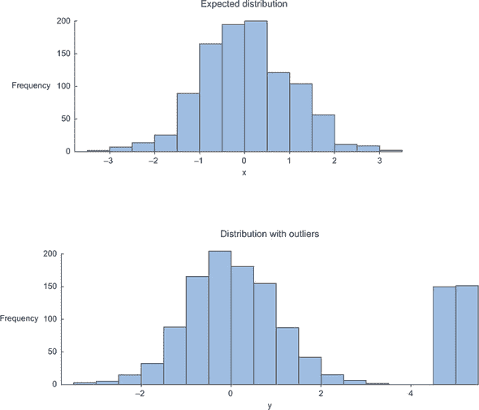

顶部的图表显示没有异常值，而底部的图表显示在期望正态分布时，上侧可能存在异常值。正态分布，或高斯分布，是自然科学中最常见的分布。它表明大多数情况发生在分布的平均值附近，并且当距离平均值更远时，发生频率会降低。底部图表中的高值在假设正态分布时可能指向异常值。正如我们之前在回归示例中看到的，异常值可能会严重影响你的数据建模，因此首先要调查它们。

##### 处理缺失值

缺失值不一定错误，但你仍然需要单独处理它们；某些建模技术无法处理缺失值。它们可能是数据收集过程中出现问题或 ETL 过程中发生错误的指标。数据科学家常用的常见技术列在表 2.4 中。

##### 表 2.4\. 处理缺失数据的技术概述

| 技术 | 优点 | 缺点 |
| --- | --- | --- |
| 忽略值 | 易于执行 | 你会丢失观察值的信息 |
| 将值设置为 null | 易于执行 | 并非每个建模技术/实现都可以处理 null 值 |
| 填充静态值，如 0 或平均值 | 易于执行 你不会从观察到的其他变量中丢失信息 | 可能会导致模型产生错误的估计 |
| 从估计或理论分布中插入一个值 | 不会太多地干扰模型 | 执行起来更困难 | 您做出数据假设 |
| 建模值（非相关） | 不会太多地干扰模型 | 可能会导致对模型过度自信 | 可能人为地提高变量之间的依赖性 | 执行起来更困难 | 您做出数据假设 |

何时使用哪种技术取决于您的具体情况。例如，如果您没有多余的观测值，省略观测值可能不是一个选择。如果变量可以用稳定的分布来描述，您可以根据这一点进行插补。然而，缺失值实际上可能意味着“零”？这在销售中可能是这种情况：如果没有促销应用于客户篮子，该客户的促销信息缺失，但很可能它也是 0，没有价格折扣。

##### 与代码簿的偏差

通过代码簿或标准值来检测较大数据集中的错误可以使用集合操作来完成。代码簿是您数据的描述，是一种元数据。它包含诸如每个观测值的变量数量、观测值的数量以及变量中每种编码的含义等信息。（例如，“0”等于“负”，“5”表示“非常积极”）。代码簿还说明了您正在查看的数据类型：它是层次结构、图还是其他类型？

您查看那些存在于集合 A 中但不在集合 B 中的值。这些是需要纠正的值。*集合*是我们工作时使用的数据结构，这并非巧合。仔细考虑您的数据结构是一个好习惯；它可以节省工作并提高程序的性能。

如果您要检查多个值，最好将它们从代码簿放入表格中，并使用差异运算符来检查两个表格之间的差异。这样，您可以直接利用数据库的力量。更多关于这一点的内容请参阅第五章。

##### 不同的测量单位

当整合两个数据集时，您必须注意它们各自的测量单位。一个例子是研究世界各地的汽油价格。为此，您需要从不同的数据提供者那里收集数据。数据集可以包含每加仑的价格，而其他数据集可以包含每升的价格。在这种情况下，简单的转换就可以解决问题。

##### 不同的聚合级别

拥有不同的聚合级别类似于拥有不同的测量类型。一个例子是包含每周数据的数据集与包含工作周数据的数据集。这类错误通常很容易检测到，通过*总结*（或其逆操作，*展开*）数据集可以修复它。

在清理数据错误后，您会结合来自不同数据源的信息。但在我们探讨这个主题之前，我们将稍微偏离一下，强调尽早清理数据的重要性。

#### 2.4.2. 尽早纠正错误

一个好的做法是在数据收集链中尽早调解数据错误，并在尽可能少地在你程序内部修复问题的源头的同时修复问题。检索数据是一项困难的任务，组织在它上面花费数百万美元，希望做出更好的决策。数据收集过程容易出错，在一个大组织中，它涉及许多步骤和团队。

数据应在获取时进行清理，原因有很多：

+   并非每个人都能发现数据异常。决策者可能会基于未能纠正错误数据的应用程序提供的不正确数据做出代价高昂的错误决策。

+   如果在流程的早期没有纠正错误，那么每个使用该数据的项目的清理工作都必须进行。

+   数据错误可能指向一个不符合设计的工作流程。例如，两位作者过去都在一家零售商工作，他们设计了一个优惠券系统来吸引更多人并创造更高的利润。在数据科学项目中，我们发现客户滥用优惠券系统并在购买杂货时赚钱。优惠券系统的目标是刺激交叉销售，而不是免费赠送产品。这个缺陷使公司损失了金钱，公司里没有人意识到这一点。在这种情况下，数据在技术上并没有错误，但带来了意外的结果。

+   数据错误可能指向设备故障，例如损坏的传输线和有缺陷的传感器。

+   数据错误可能指向软件或软件集成中的错误，这些错误可能对公司至关重要。在我们为一家银行做一个小项目时，我们发现两个软件应用程序使用了不同的本地设置。这导致大于 1,000 的数字出现问题。对于一款应用程序，数字 1.000 代表一个，而对于另一款则代表一千。

在理想世界中，一旦数据被捕获就修复数据是很好的。遗憾的是，数据科学家并不总是对数据收集有发言权，仅仅告诉 IT 部门修复某些事情可能并不会让它变得如此。如果你不能在源头纠正数据，你需要在你的代码中处理它。数据操作并不随着纠正错误而结束；你仍然需要组合你的 incoming data。

最后一点：始终保留原始数据的副本（如果可能的话）。有时你开始清理数据，但会犯错误：以错误的方式估计变量，删除具有有趣额外信息的异常值，或者由于最初的误解而更改数据。如果你保留副本，你就有机会再次尝试。对于在到达时被操作的“流动数据”，这并不总是可能的，你将不得不在能够使用你捕获的数据之前接受一段时间的调整。然而，更困难的事情并不是单个数据集的数据清理，而是将不同的来源组合成一个更有意义的整体。

#### 2.4.3\. 从不同的数据源组合数据

你的数据来自几个不同的地方，在这个子步骤中，我们专注于整合这些不同的来源。数据在大小、类型和结构上有所不同，从数据库和 Excel 文件到文本文档都有。

为了简洁起见，本章我们专注于表格结构中的数据。仅就这个主题而言，完全可以写满整本书，而我们选择专注于数据科学过程，而不是为每种类型的数据提供场景。但请记住，还存在其他类型的数据源，例如键值存储、文档存储等，我们将在书中更合适的地方处理这些内容。

##### 组合数据的不同方式

你可以执行两个操作来合并来自不同数据集的信息。第一个操作是*连接*：用一个表中的信息丰富另一个表中的观察结果。第二个操作是*追加*或*堆叠*：将一个表中的观察结果添加到另一个表中。

当你合并数据时，你可以选择通过创建视图来创建一个新的物理表或虚拟表。视图的优势是它不会消耗更多的磁盘空间。让我们详细说明这些方法。

##### 连接表格

连接表格允许你将一个表中找到的观察结果的信息与另一个表中找到的信息结合起来。重点是丰富单个观察结果。比如说，第一个表包含有关客户购买的信息，而另一个表包含有关客户居住区域的信

##### 图 2.7\. 在项目键和区域键上连接两个表格

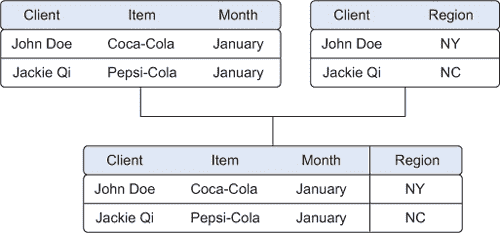

要连接表格，你使用代表两个表中相同对象的变量，例如日期、国家名称或社会保障号码。这些公共字段被称为键。当这些键也唯一地定义表中的记录时，它们被称为*主键*。一个表可能包含购买行为，而另一个表可能包含关于个人的人口统计信息。在图 2.7 中，两个表都包含客户名称，这使得丰富客户支出与客户所在的区域变得容易。熟悉 Excel 的人会注意到这与使用查找函数的相似性。

输出表中结果的行数取决于你使用的确切连接类型。我们将在本书的后面部分介绍不同类型的连接。

##### 添加表格

附加或堆叠表实际上是向另一个表中添加一个表中的观测值。图 2.8 展示了附加表的例子。一个表包含一月份的观测值，第二个表包含二月份的观测值。这些表附加的结果是一个更大的表，包含一月份和二月份的观测值。在集合论中，这相当于并集操作，这也是关系数据库的通用语言 SQL 中的命令。在数据科学中，也使用了其他集合运算符，如集合差和交集。

##### 图 2.8\. 从表中附加数据是一个常见的操作，但需要附加的表具有相同的结构。

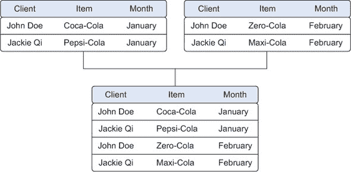

##### 使用视图模拟数据连接和附加

为了避免数据重复，你实际上是通过视图来组合数据的。在先前的例子中，我们取了月度数据并在一个新的物理表中将其组合。问题是，我们重复了数据，因此需要更多的存储空间。在我们正在处理的例子中，这可能不会造成问题，但想象一下，每个表都包含数以兆字节的数据；那么重复数据就变得有问题了。因此，发明了视图的概念。视图表现得就像你在操作一个表一样，但这个表实际上只是一个为你组合表的虚拟层。图 2.9 展示了如何将不同月份的销售数据虚拟组合成年度销售表，而不是重复数据。然而，视图也有缺点。虽然表连接只执行一次，但创建视图的连接每次查询时都会被重新创建，这比预先计算的表需要更多的处理能力。

##### 图 2.9\. 视图帮助您在不复制数据的情况下组合数据。

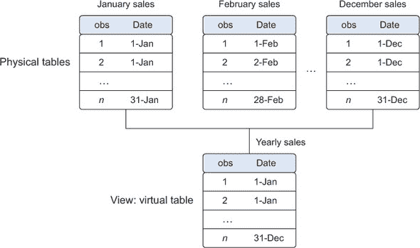

##### 丰富聚合度量

通过向表中添加计算信息也可以进行数据丰富，例如总销售额或某个地区已售出总库存的百分比（图 2.10）。

##### 图 2.10\. 增长、按产品类别划分的销售和排名销售是派生和聚合度量的例子。

| 产品类别 | 产品 | 销售额（$） | 上月销售额（$） | 增长 | 按产品类别划分的销售 | 排名销售 |
| --- | --- | --- | --- | --- | --- | --- |
| A | B | X | Y | (X-Y) / Y | AX | NX |
| 运动 | 运动 1 | 95 | 98 | –3.06% | 215 | 2 |
| 运动 | 运动 2 | 120 | 132 | –9.09% | 215 | 1 |
| 鞋类 | 鞋类 1 | 10 | 6 | 66.67% | 10 | 3 |

类似这样的额外措施可以提供新的视角。查看图 2.10，我们现在有一个汇总的数据集，这反过来可以用来计算每个产品在其类别中的参与度。这在数据探索期间可能很有用，但在创建数据模型时更有用。像往常一样，这取决于具体案例，但根据我们的经验，使用“相对度量”如%销售额（产品销售数量/总销售数量）的模型往往优于使用原始数字（销售数量）作为输入的模型。

#### 2.4.4\. 数据转换

某些模型需要其数据具有特定的形状。现在你已经清理并整合了数据，这是你接下来要执行的任务：将你的数据转换成适合数据建模的合适形式。

##### 数据转换

输入变量和输出变量之间的关系并不总是线性的。以形式 *y* = *ae^(bx)* 的关系为例。对独立变量取对数可以极大地简化估计问题。图 2.11 展示了如何通过转换输入变量来极大地简化估计问题。有时你可能想将两个变量合并成一个新的变量。

##### 图 2.11\. 将 x 转换为 log x 使 x 和 y 之间的关系线性化（右），与未取对数的 x（左）相比。

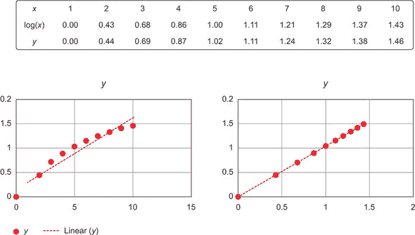

##### 减少变量数量

有时候你有很多变量，需要减少数量，因为它们不会向模型添加新信息。模型中变量过多会使模型难以处理，并且当输入变量过多时，某些技术表现不佳。例如，所有基于欧几里得距离的技术在变量数量不超过 10 个时表现良好。


**欧几里得距离**

欧几里得距离或“普通”距离是对数学中关于三角形（三角学）的第一件事的扩展：毕达哥拉斯定理。如果你知道直角三角形中 90°角相邻两边的长度，你可以轻松地推导出剩余边的长度（斜边）。这个公式是斜边 = 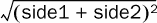。在二维平面上的两点之间的欧几里得距离是使用类似公式计算的：距离 = 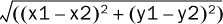。如果你想将这个距离计算扩展到更多维度，将那些更高维度中点的坐标加到公式中。对于三维，我们得到距离 = 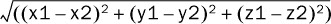。


数据科学家使用特殊方法来减少变量的数量，但保留最大量的数据。我们将在第三章中讨论这些方法中的几个。图 2.12 展示了减少变量数量如何使理解关键值更容易。它还展示了两个变量如何解释数据集中 50.6%的变异（component1 = 27.8% + component2 = 22.8%）。这些变量被称为“component1”和“component2”，都是原始变量的组合。它们是数据结构的基础的*主成分*。如果现在还不那么清楚，不要担心，主成分分析（PCA）将在第三章中更详细地解释。你还可以看到第三个（未知）变量的存在，它将观察结果分组分成两个。

##### 图 2.12\. 变量减少可以在尽可能多的信息的情况下减少变量的数量。

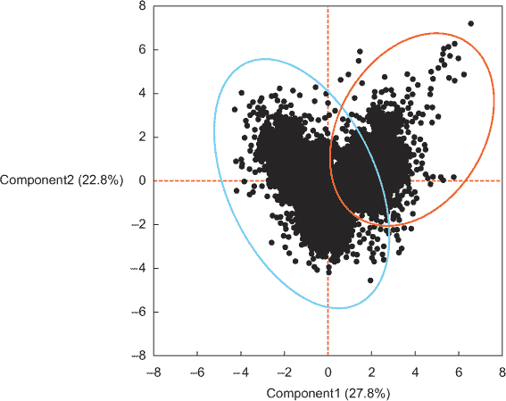

##### 将变量转换为虚拟变量

变量可以被转换为虚拟变量（图 2.13）。*虚拟变量*只能取两个值：真（1）或假（0）。它们用于表示可能解释观察结果的分类效应的缺失。在这种情况下，你将为存储在一个变量中的类别创建单独的列，如果该类别存在，则用 1 表示，否则用 0 表示。一个例子是将一个名为“工作日”的列转换为从星期一到星期日的列。你使用一个指标来显示观察结果是否在星期一；你在星期一上放置 1，在其他地方放置 0。将变量转换为虚拟变量是一种在建模中使用的技巧，它受到经济学家的欢迎，但并非仅限于经济学家。

##### 图 2.13\. 将变量转换为虚拟变量是一种数据转换，它将具有多个类别的变量分解成多个变量，每个变量只有两种可能的值：0 或 1。

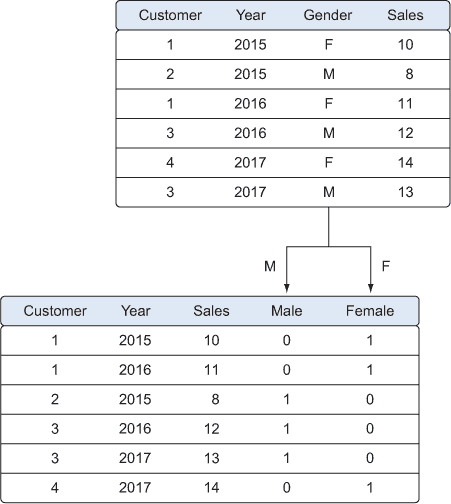

在本节中，我们介绍了数据科学过程中的第三步——清理、转换和整合数据，这将您的原始数据转换为建模阶段的可用输入。数据科学过程的下一步是更好地理解数据的内容以及变量和观察结果之间的关系；我们将在下一节中探讨这一点。

### 2.5\. 第 4 步：探索性数据分析

在探索性数据分析过程中，你将深入挖掘数据（见图 2.14）。当信息以图片形式展示时，信息变得更容易理解，因此你主要使用图形技术来了解你的数据和变量之间的相互作用。这一阶段是关于探索数据，所以在探索性数据分析阶段保持开放的心态和敏锐的观察力是至关重要的。目标不是清理数据，但通常你仍然会发现之前遗漏的异常，迫使你退一步并修复它们。

##### 图 2.14。步骤 4：数据探索

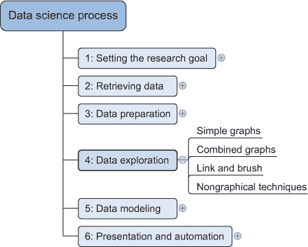

在这一阶段，你使用的可视化技术从简单的折线图或直方图，如图 2.15 所示，到更复杂的图表，如桑基图和网络图。有时，从简单的图表中组合成复合图，可以更深入地了解数据。有时，图表可以动画化或交互化，使其更容易，让我们承认，更有趣。一个交互式桑基图的例子可以在[`bost.ocks.org/mike/sankey/`](http://bost.ocks.org/mike/sankey/)找到。

##### 图 2.15。从上到下，柱状图、折线图和分布图是探索性分析中使用的一些图表。

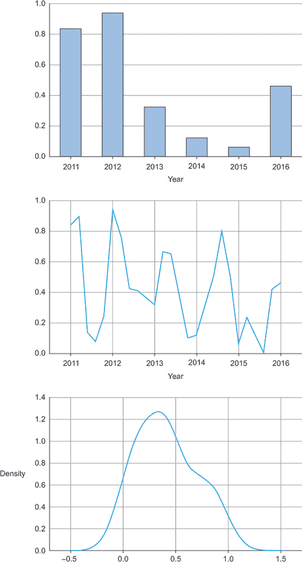

Mike Bostock 提供了几乎所有类型图表的交互式示例。尽管他的大多数示例在数据展示方面更有用，但花时间在他的网站上还是值得的。

这些图表可以组合起来提供更多的见解，如图 2.16 所示。

##### 图 2.16。将多个图表一起绘制可以帮助你理解多个变量中的数据结构。

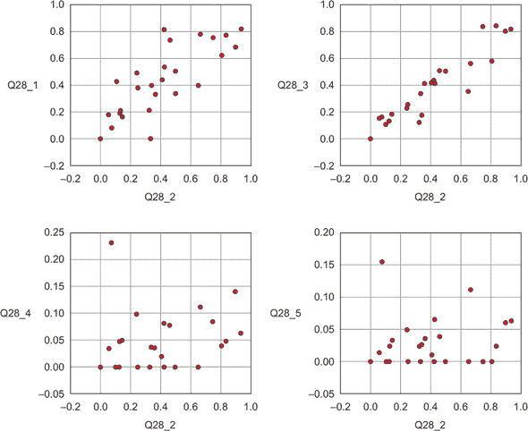

在多个图表上叠加是常见的做法。在图 2.17 中，我们将简单的图表组合成帕累托图，或 80-20 图。

##### 图 2.17。帕累托图是值和累积分布的组合。从这个图中很容易看出，前 50%的国家包含略少于 80%的总金额。如果这个图代表了客户的购买力，而我们销售昂贵的产品，我们可能不需要在每个国家花费我们的营销预算；我们可以从前 50%开始。

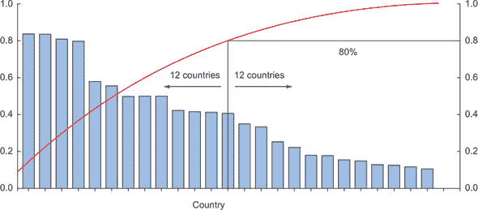

图 2.18 展示了另一种技术：*刷选和链接*。通过刷选和链接，你可以将不同的图表和表格（或视图）组合并链接起来，这样在一个图表中的变化会自动转移到其他图表。这种交互式数据探索有助于发现新的见解。一个详细的例子可以在第九章中找到。这一阶段的数据探索有助于发现新的见解。

##### 图 2.18。链接和刷选允许你在一张图上选择观测值，并在其他图上突出显示相同的观测值。

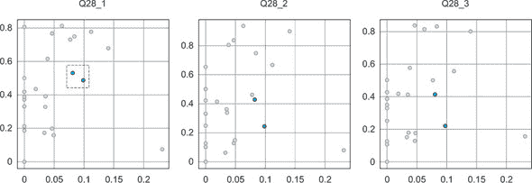

图 2.18 显示了每个国家的问题的平均得分。这不仅表明了答案之间的高度相关性，而且很容易看出，当你选择子图的几个点时，这些点将对应于其他图表上相似的点。在这种情况下，左图上选定的点对应于中间和右图上的点，尽管它们在中间和右图上对应得更好。

另外两个重要的图表是图 2.19 中显示的直方图和图 2.20 中显示的箱线图。

##### 图 2.19. 示例直方图：5 年年龄间隔内的人数

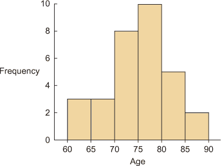

##### 图 2.20. 示例箱线图：每个用户类别在摄影网站上对某一图片的喜爱程度的分布。

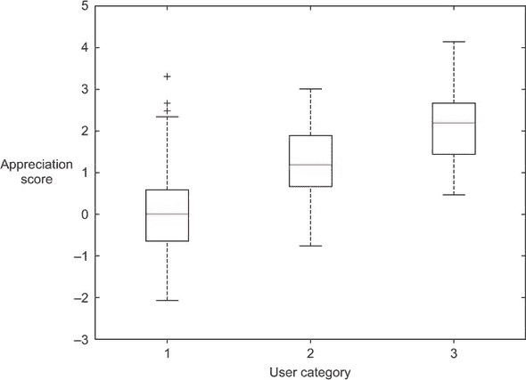

在直方图中，一个变量被划分为离散类别，每个类别中的发生次数被汇总并显示在图表中。另一方面，箱线图不显示有多少观测值，但它确实提供了类别内分布的印象。它可以同时显示最大值、最小值、中位数和其他特征度量。

我们在本阶段描述的技巧主要是视觉的，但在实践中，它们当然不仅限于可视化技术。制表、聚类和其他建模技术也可以是探索性分析的一部分。甚至构建简单的模型也可以是这一步骤的一部分。

现在你已经完成了数据探索阶段，并且对数据有了很好的掌握，是时候进入下一个阶段：构建模型。

### 2.6. 步骤 5：构建模型

在数据清洁且对内容有良好理解的基础上，你准备好构建模型，目标是做出更好的预测、分类对象或理解你正在建模的系统。这一阶段比探索性分析步骤更加专注，因为你知道你在寻找什么，以及你希望的结果是什么。图 2.21 显示了模型构建的组成部分。

##### 图 2.21. 步骤 5：数据建模

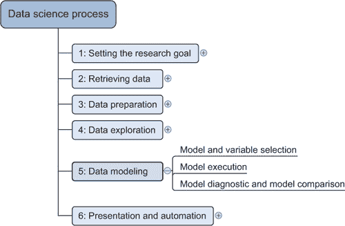

你现在将使用的技巧来自机器学习、数据挖掘和/或统计学领域。在本章中，我们只探索了现有技术的一小部分，而第三章将适当地介绍它们。本书的范围超出了提供更多概念性介绍的范畴，但这对你的入门已经足够；20%的技术将帮助你解决 80%的情况，因为技术之间存在重叠，它们试图实现的目标相似但略有不同。

建立模型是一个迭代的过程。你建立模型的方式取决于你是否选择经典统计学或相对较新的机器学习学派，以及你想要使用的技巧类型。无论如何，大多数模型都包括以下主要步骤：

> **1**. 选择建模技巧和要进入模型中的变量
> 
> **2**. 执行模型
> 
> **3**. 诊断和模型比较

#### 2.6.1\. 模型和变量选择

你需要选择你想要包含在模型中的变量和建模技巧。探索性分析的结果应该已经给你一个相当明确的想法，哪些变量将帮助你构建一个好的模型。有许多建模技巧可供选择，为问题选择正确的模型需要你自己的判断。你需要考虑模型性能以及你的项目是否满足使用模型的所有要求，以及其他因素：

+   模型是否需要转移到生产环境，如果是的话，是否容易实现？

+   模型的维护有多困难：如果保持不变，它将保持多久的相关性？

+   模型是否需要易于解释？

当思考完成时，就是采取行动的时候了。

#### 2.6.2\. 模型执行

一旦你选择了一个模型，你将需要用代码实现它。


##### 备注

这是我们第一次进入实际的 Python 代码执行，所以请确保你的虚拟环境已经启动并运行。了解如何设置这是必需的知识，但如果这是你第一次尝试，请查看附录 D。

本章的所有代码都可以从[`www.manning.com/books/introducing-data-science`](https://www.manning.com/books/introducing-data-science)下载。本章附带一个 ipython (.ipynb) 笔记本和一个 Python (.py) 文件。


幸运的是，大多数编程语言，如 Python，已经拥有 StatsModels 或 Scikit-learn 等库。这些包使用了多种最流行的技巧。在大多数情况下，编码一个模型是一个非平凡的任务，因此拥有这些库可以加快这个过程。正如以下代码所示，使用 StatsModels 或 Scikit-learn 进行线性回归（图 2.22）相当容易。如果你自己来做，即使是简单的技巧也需要更多的努力。以下列表显示了线性预测模型的执行。

##### 图 2.22\. 线性回归试图拟合一条线，同时最小化到每个点的距离


##### 列表 2.1\. 在半随机数据上执行线性预测模型

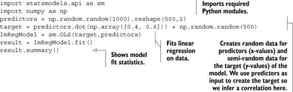

好吧，我们在这里作弊了，相当严重。我们创建了预测值，目的是预测目标变量的行为。对于线性回归，假设每个 x（预测变量）和 y（目标变量）之间存在“线性关系”，如图 2.22 所示。

我们，然而，通过添加一点随机性，基于预测变量创建了目标变量。这给我们一个拟合良好的模型并不令人惊讶。`results.summary()` 输出了 图 2.23 中的表格。请注意，确切的结果取决于你得到的随机变量。

##### 图 2.23\. 线性回归模型信息输出

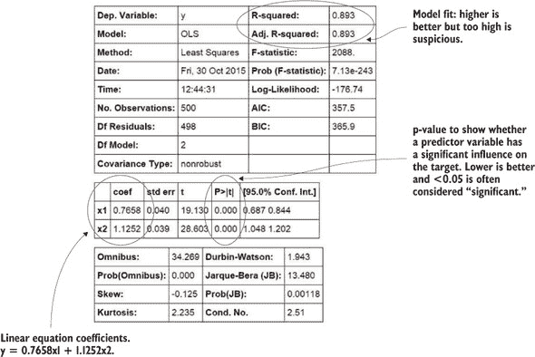

让我们忽略这里得到的输出的大部分内容，专注于最重要的部分：

+   ***模型拟合*** —这里使用 R 平方或调整 R 平方。这个指标是模型捕捉数据中变化量的一个指示。调整 R 平方和 R 平方之间的差异在这里是最小的，因为调整后的 R 平方是正常的 R 平方加上对模型复杂性的惩罚。当引入许多变量（或特征）时，模型会变得复杂。如果你有一个简单的模型可用，你不需要复杂的模型，所以调整 R 平方会惩罚你过度复杂化。无论如何，0.893 是很高的，这应该是由于我们作弊了。存在一些经验法则，但对于商业中的模型，通常认为 R 平方大于 0.85 的模型是好的。如果你想赢得比赛，你需要达到 90% 以上。然而，对于研究来说，通常会发现模型拟合度非常低（甚至小于 0.2）。更重要的是，引入的预测变量对的影响。

+   ***预测变量有一个系数*** —对于线性模型来说，这很容易解释。在我们的例子中，如果你给 x1 加上“1”，它将使 y 变化“0.7658”。很容易看出找到一个好的预测变量如何成为你获得诺贝尔奖的途径，即使你的整体模型很糟糕。例如，如果你确定某个基因是癌症的一个显著原因，这是一个重要的知识，即使这个基因本身并不决定一个人是否会得癌症。这里的例子是分类，而不是回归，但观点是一样的：在科学研究中，检测影响比完美拟合模型（更不用说更现实）更重要。但何时我们知道一个基因有这种影响？这被称为显著性。

+   ***预测变量的重要性*** —系数很好，但有时没有足够的证据来显示影响的存在。这就是 p 值的作用。在这里可以长篇大论地解释类型 1 和类型 2 错误，但简短的解释将是：如果 p 值低于 0.05，大多数人认为该变量是显著的。实际上，这是一个任意数字。这意味着预测变量没有任何影响的概率是 5%。你是否接受这种 5% 的错误概率？这取决于你。一些人引入了极端显著（p<0.01）和边际显著阈值（p<0.1）。

线性回归适用于你想预测一个值的情况，但如果你想要对某物进行分类呢？那么你就转向分类模型，其中最著名的是 k-最近邻。

如图 2.24 所示，k 最近邻算法查看一个未标记点附近的标记点，并根据这个预测标签应该是什么。

##### 图 2.24。K 最近邻技术通过查看最近的 k 个点来进行预测。

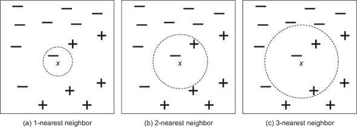

让我们用 Python 代码和 Scikit learn 库来尝试，如下所示。

##### 列表 2.2。在半随机数据上执行 k 最近邻分类

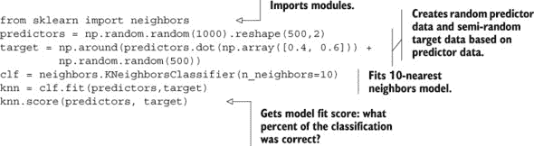

和之前一样，我们构建了随机相关数据，令人惊讶的是，我们正确分类了 85%的情况。如果我们想深入了解，我们需要评估模型。不要让`knn.score()`欺骗你；它返回模型准确率，但当我们说“评估模型”时，我们通常是指将其应用于数据以进行预测。

```
prediction = knn.predict(predictors)
```

现在，我们可以使用预测结果，并使用混淆矩阵将其与实际情况进行比较。

```
metrics.confusion_matrix(target,prediction)
```

我们得到了一个 3x3 的矩阵，如图 2.25 所示。

##### 图 2.25。混淆矩阵：它通过比较预测值与真实值来显示正确分类和错误分类的案例数量。备注：图中的类别（0，1，2）是为了说明而添加的。

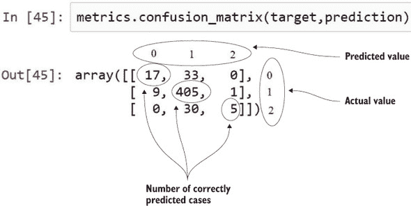

混淆矩阵显示我们正确预测了 17+405+5 个案例，所以这是好的。但这真的是一个惊喜吗？不，以下是一些原因：

+   首先，分类器只有三个选项；通过`np.around()`标记与上一次的差异，将数据四舍五入到最接近的整数。在这种情况下，要么是 0，1，或 2。只有 3 个选项，即使对于像抛硬币这样的真实随机分布，在 500 次猜测中，你不可能做得比 33%正确更差。

+   第二，我们又作弊了，将响应变量与预测变量相关联。由于我们这样做的方式，我们得到大多数观测值都是“1”。如果我们为每个案例猜测“1”，我们就会得到类似的结果。

+   我们比较了预测值与真实值，是的，但我们从未基于新数据做出预测。预测是使用构建模型时使用的相同数据进行的。这所有的一切都很好，可以让你感觉良好，但它并不能告诉你你的模型在遇到真正的新数据时是否会工作。为此，我们需要一个保留样本，这将在下一节中讨论。

不要被欺骗。仅仅输入这段代码本身并不能创造奇迹。可能需要一段时间才能正确设置建模部分及其所有参数。

说实话，只有少数技术有在 Python 中的行业级实现。但是，借助 RPy 库，在 Python 中使用 R 中可用的模型相当容易。RPy 为 Python 提供了到 R 的接口。*R*是一个免费软件环境，广泛用于统计分析。如果你还没有尝试过，至少值得一试，因为 2014 年它仍然是数据科学中最受欢迎（如果不是最受欢迎）的编程语言之一。更多信息，请参阅[`www.kdnuggets.com/polls/2014/languages-analytics-data-mining-data-science.html`](http://www.kdnuggets.com/polls/2014/languages-analytics-data-mining-data-science.html)。

#### 2.6.3\. 模型诊断和模型比较

你将构建多个模型，然后根据多个标准从中选择最佳模型。使用保留样本可以帮助你选择表现最好的模型。保留样本是你从模型构建中排除的一部分数据，以便在之后评估模型。这里的原理很简单：模型应该在未见过的数据上工作。你只使用你数据的一部分来估计模型，而另一部分，即保留样本，则被排除在外。然后模型被释放到未见过的数据上，并计算误差度量来评估它。有多种误差度量可用，在图 2.26 中我们展示了比较模型的一般思想。示例中使用的误差度量是均方误差。

##### 图 2.26\. 均方误差公式


均方误差是一个简单的度量：检查每个预测与真实值有多远，平方这个误差，并将每个预测的误差相加。

图 2.27 比较了两个模型从价格预测订单大小的性能。第一个模型是*大小 = 3 * 价格*，第二个模型是*大小 = 10*。为了估计模型，我们从 1,000 个观测值中随机选择了 800 个（或 80%），没有向模型展示其他 20%的数据。一旦模型训练完成，我们根据已知真实值的变量预测其他 20%的变量的值，并使用误差度量计算模型误差。然后我们选择误差最低的模型。在这个例子中，我们选择了模型 1，因为它具有最低的总误差。

##### 图 2.27\. 保留样本有助于你比较模型，并确保你可以将结果推广到模型尚未见过的数据。

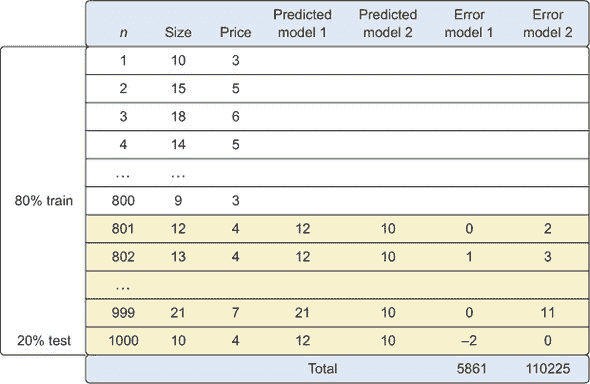

许多模型都做出了强烈的假设，例如输入的独立性，你必须验证这些假设确实得到了满足。这被称为*模型诊断*。

本节简要介绍了构建有效模型所需的步骤。一旦你有了可工作的模型，你就可以进入最后一步。

### 2.7\. 第 6 步：展示发现并在此基础上构建应用

在你成功分析了数据并构建了一个表现良好的模型之后，你准备好向世界展示你的发现（图 2.28）。这是一个令人兴奋的部分；你所有辛勤工作的小时都得到了回报，你可以向利益相关者解释你发现了什么。

##### 图 2.28. 第 6 步：演示和自动化

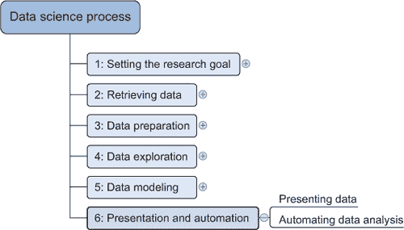

有时候人们对你工作的兴奋程度如此之高，以至于你需要一遍又一遍地重复它，因为他们重视你模型的预测或你产生的见解。因此，你需要自动化你的模型。这并不总是意味着你必须不断地重做所有的分析。有时，仅实现模型评分就足够了；其他时候，你可能需要构建一个自动更新报告、Excel 电子表格或 PowerPoint 演示文稿的应用程序。数据科学过程的最后阶段是您**软技能**最能发挥作用的阶段，而且它们确实非常重要。事实上，我们建议你找到关于这个主题的专用书籍和其他信息，并努力去学习，因为如果没有人听你说话，你为什么要做所有这些艰苦的工作呢？

如果你已经正确地完成了这项工作，你现在拥有了一个工作模型和满意的利益相关者，因此我们可以在这里结束这一章节。

### 2.8. 摘要

在本章中，你学习了数据科学过程包括六个步骤：

+   **设定研究目标** —在项目章程中定义项目的“是什么”、“为什么”和“如何”。

+   **检索数据** —寻找并获取你项目中需要的数据。这些数据可能在公司内部找到，也可能从第三方获取。

+   **数据准备** —检查和修复数据错误，用来自其他数据源的数据丰富数据，并将其转换为适合你模型的格式。

+   **数据探索** —使用描述性统计和可视化技术深入挖掘你的数据。

+   **数据建模** —使用机器学习和统计技术来实现你的项目目标。

+   **演示和自动化** —向利益相关者展示你的结果，并将你的分析过程工业化，以便重复使用和与其他工具集成。
