## 第三章. 机器学习

*本章涵盖*

+   理解为什么数据科学家使用机器学习

+   确定最重要的 Python 机器学习库

+   讨论模型构建的过程

+   使用机器学习技术

+   获得机器学习的实践经验

你知道计算机是如何学会保护你免受恶意人员侵害的吗？计算机可以过滤掉你超过 60%的电子邮件，并且随着时间的推移，它们可以学会做得更好，以保护你。

你能明确教计算机在图片中识别人物吗？虽然可能，但将所有可能的识别方法编码进去是不切实际的，但你很快就会看到可能性几乎是无穷无尽的。为了成功，你需要给你的工具箱添加一项新技能，*机器学习*，这正是本章的主题。

### 3.1. 什么是机器学习，为什么你应该关注它？

> “机器学习是一个研究领域，它赋予计算机在没有明确编程的情况下学习的能力。”
> 
> *亚瑟·萨缪尔，1959^([1])*
> 
> ¹
> 
> 尽管以下论文经常被引用为这句话的来源，但它并未出现在 1967 年的论文重印版中。作者们无法验证或找到这句话的确切来源。参见 Arthur L. Samuel，“使用国际象棋游戏进行机器学习的一些研究”，*IBM 研究与发展杂志* 3，第 3 期（1959 年）：210–229。

亚瑟·萨缪尔提出的机器学习的定义经常被引用，其广泛性堪称天才，但它也留下了你如何让计算机学习的疑问。为了实现机器学习，专家们开发了通用的算法，这些算法可以用于解决大量学习问题。当你想要解决一个*特定任务*时，你只需要向算法提供更多*特定数据*。从某种意义上说，你是在通过示例编程。在大多数情况下，计算机将使用数据作为其信息来源，将其输出与期望输出进行比较，然后对其进行纠正。计算机获得的数据或“经验”越多，它在指定任务上的表现就越好，就像人类一样。

当机器学习被视为一个过程时，以下定义是富有洞察力的：

> “机器学习是计算机在收集和学习给定数据的过程中工作更准确的过程。”
> 
> *迈克·罗伯茨^([2])*
> 
> ²
> 
> 迈克·罗伯茨是本书的技术编辑。感谢，迈克。

例如，当用户在手机上发送更多短信时，手机就会对短信的常用词汇有更多了解，并能更快、更准确地预测（自动完成）它们的单词。

在更广泛的科学领域，机器学习是人工智能的一个子领域，与应用数学和统计学密切相关。所有这些都可能听起来有些抽象，但机器学习在日常生活中有许多应用。

#### 3.1.1. 机器学习在数据科学中的应用

*回归*和*分类*对数据科学家来说至关重要。为了实现这些目标，数据科学家使用的主要工具之一是机器学习。回归和自动分类的用途非常广泛，例如以下内容：

+   根据现有地点找到油田、金矿或考古遗址（分类和回归）

+   在文本中找到地名或人物（分类）

+   根据图片或声音录音识别人员（分类）

+   根据鸟鸣声识别鸟类（分类）

+   识别有利可图的客户（回归和分类）

+   主动识别可能失效的汽车部件（回归）

+   识别肿瘤和疾病（分类）

+   预测一个人在产品 X 上花费的金额（回归）

+   预测一段时间内火山喷发次数（回归）

+   预测公司年度收入（回归）

+   预测哪支足球队将赢得欧洲冠军联赛（分类）

有时数据科学家会构建一个*模型*（现实的抽象），它可以为现象的潜在过程提供洞察。当模型的目标不是预测而是解释时，它被称为*根本原因分析*。以下是一些例子：

+   理解和优化业务流程，例如确定哪些产品为产品线增值

+   发现糖尿病的成因

+   确定交通拥堵的原因

这份机器学习应用列表只能被视为开胃菜，因为它在数据科学中无处不在。回归和分类是两种重要的技术，但技巧和应用的范畴并不止于此，聚类就是一个有价值的技巧的例子。机器学习技术可以在数据科学过程的各个阶段使用，我们将在下一节中讨论。

#### 3.1.2. 机器学习在数据科学过程中的应用

尽管机器学习主要与数据科学过程中的数据建模步骤相关联，但它几乎可以在每个步骤中使用。为了回顾前几章的内容，数据科学过程在图 3.1 中展示。

##### 图 3.1. 数据科学过程

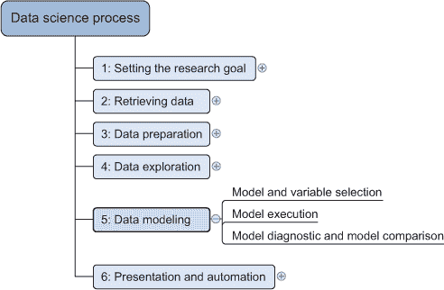

数据建模阶段只能在您拥有可以理解的定性原始数据后开始。但在那之前，*数据准备*阶段可以从机器学习的使用中受益。一个例子就是清洗文本字符串列表；机器学习可以将相似字符串分组在一起，使其更容易纠正拼写错误。

机器学习在*探索数据*时也非常有用。算法可以在数据中找出难以仅通过图表发现的潜在模式。

由于机器学习在整个数据科学过程中都很有用，因此开发了大量 Python 库来使您的生活更加轻松，这并不令人惊讶。

#### 3.1.3\. 机器学习中使用的 Python 工具

Python 有大量的包可以在机器学习环境中使用。Python 机器学习生态系统可以分为三种主要类型的包，如图 3.2 所示。

##### 图 3.2\. 机器学习阶段使用的 Python 包概述

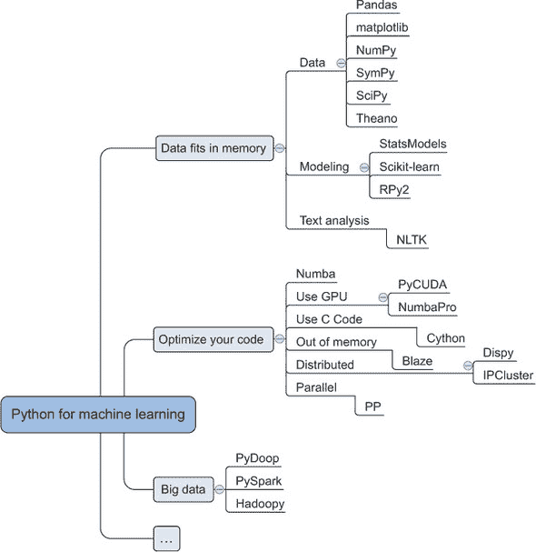

图 3.2 中展示的第一种类型的包主要用于简单任务和数据适合内存时。第二种类型用于在原型设计完成后优化代码，遇到速度或内存问题时。第三种类型专门用于与大数据技术一起使用 Python。

##### 用于在内存中处理数据的包

在原型设计时，以下包可以通过几行代码提供高级功能，帮助你开始：

+   *SciPy* 是一个库，它集成了在科学计算中经常使用的许多基本包，如 NumPy、matplotlib、Pandas 和 SymPy。

+   *NumPy* 给你提供了强大的数组函数和线性代数函数。

+   *Matplotlib* 是一个流行的 2D 绘图包，具有一些 3D 功能。

+   *Pandas* 是一个高性能但易于使用的数据处理包。它将数据框引入 Python，这是一种内存中的数据表类型。这个概念应该对 R 的常规用户来说很熟悉。

+   *SymPy* 是一个用于符号数学和计算机代数的包。

+   *StatsModels* 是一个用于统计方法和算法的包。

+   *Scikit-learn* 是一个充满机器学习算法的库。

+   *RPy2* 允许你在 Python 中调用 R 函数。R 是一个流行的开源统计程序。

+   *NLTK*（自然语言工具包）是一个专注于文本分析的 Python 工具包。

这些库是入门的好选择，但一旦你决定频繁运行某个 Python 程序，性能就会变得重要。

##### 优化操作

一旦你的应用程序进入生产阶段，这里列出的库可以帮助你提供所需的性能。有时这涉及到连接到 Hadoop 和 Spark 等大数据基础设施。

+   ***Numba 和 NumbaPro*** — 这些使用即时编译来加速直接用 Python 编写的应用程序和一些注释。NumbaPro 还允许你使用你的图形处理器单元（GPU）的强大功能。

+   ***PyCUDA*** — 这允许你编写将在 GPU 上而不是 CPU 上执行的代码，因此非常适合计算密集型应用程序。它最适合那些适合并行化并且与所需计算周期相比输入很少的问题。一个例子是通过对单个起始状态进行数千种不同的结果计算来研究你预测的鲁棒性。

+   ***Cython，或 C 语言用于 Python*** — 这将 C 编程语言引入 Python。C 是一种低级语言，因此代码更接近计算机最终使用的（字节码）。代码与位和字节越接近，执行速度越快。当计算机知道变量的类型时（称为 *静态类型*），计算机也会更快。Python 并未设计用于此，Cython 帮助你克服这一不足。

+   ***Blaze*** — Blaze 提供了可以大于你计算机主内存的数据结构，使你能够处理大型数据集。

+   ***Dispy 和 IPCluster*** — 这些包允许你编写可以在计算机集群上分布的代码。

+   ***PP*** — Python 默认以单个进程执行。借助 PP，你可以在单个机器或集群上并行化计算。

+   ***Pydoop 和 Hadoopy*** — 这些将 Python 连接到 Hadoop，一个常见的大数据框架。

+   ***PySpark*** — 这将 Python 和 Spark 连接起来，Spark 是一个内存中的大数据框架。

现在你已经看到了可用的库的概述，让我们来看看模型过程本身。

### 3.2\. 模型过程

模型阶段包括四个步骤：

> **1**. 特征工程和模型选择
> 
> **2**. 训练模型
> 
> **3**. 模型验证和选择
> 
> **4**. 将训练好的模型应用于未见数据

在你找到一个好的模型之前，你可能会在前三个步骤之间迭代。

最后一步并不总是存在，因为有时目标不是预测而是解释（根本原因分析）。例如，你可能想找出物种灭绝的原因，但并不一定预测下一个即将离开我们星球的是哪一个。

可以 *链式* 或 *组合* 多种技术。当你链式连接多个模型时，第一个模型的输出成为第二个模型的输入。当你组合多个模型时，你独立训练它们并组合它们的结果。这种最后的技术也被称为 *集成学习*。

一个模型由称为 *特征* 或 *预测器* 的信息构造和 *目标* 或 *响应变量* 组成。你的模型的目标是预测目标变量，例如，明天的最高气温。帮助你做到这一点并且（通常）为你所知的变量是特征或预测变量，例如今天的温度、云的移动、当前风速等。最好的模型是那些能够准确反映现实，同时保持简洁和可解释性的模型。为了实现这一点，特征工程是建模过程中最重要且最具趣味性的部分。例如，一个试图解释过去 60,000 年澳大利亚大型陆地动物灭绝的重要特征最终被发现是人口数量和人类的扩散。

#### 3.2.1\. 特征工程和模型选择

在工程特性方面，你必须为模型提出并创建可能的预测因子。这是过程中的一个最重要的步骤，因为模型通过重新组合这些特性来实现其预测。通常，你可能需要咨询专家或查阅适当的文献来提出有意义的特性。

某些特性是从数据集中获得的变量，正如我们在练习中提供的数据集和大多数学校练习中的情况一样。在实践中，你需要自己找到这些特性，它们可能分散在不同的数据集中。在几个项目中，我们不得不在获得所需原始数据之前汇集 20 多个不同的数据源。通常，你需要在输入成为良好的预测因子之前对其进行转换，或者将多个输入组合起来。多个输入组合的一个例子是*交互变量*：单个变量的影响较低，但如果两者都存在，它们的影响就会变得巨大。这在化学和医学环境中尤其如此。例如，虽然醋和漂白剂本身是相对无害的常见家用产品，但混合它们会产生有毒的氯气，这种气体在第一次世界大战中杀死了成千上万的人。

在医学领域，临床药学是一门致力于研究药物相互作用效果的学科。这是一项重要的工作，甚至不需要两种药物相互作用就能产生潜在的危险结果。例如，将抗真菌药物如斯波拉诺克斯与葡萄柚混合会产生严重的副作用。

有时你必须使用建模技术来推导特性：一个模型的输出成为另一个模型的一部分。这在文本挖掘中并不罕见。文档首先可以被标注以将内容分类到不同的类别中，或者你可以计算文本中的地理地点或人物的数量。这种计数往往比听起来更困难；模型首先被应用于识别某些单词作为人物或地点。然后，所有这些新信息都被倒入你想要构建的模型中。模型构建中的一个最大错误是*可用性偏差*：你的特性只是你能够轻易获得的那些，因此你的模型相应地代表了一种单方面的“真相”。受到可用性偏差影响的模型在验证时往往失败，因为很明显，它们并不是对真相的有效表示。

在第二次世界大战期间，在对德国领土进行轰炸行动后，许多英国飞机在机翼、机头和机尾附近都出现了弹孔，但几乎没有飞机的驾驶舱、尾翼或发动机块上有弹孔。因此，工程师决定在机翼上增加额外的装甲板。这个想法看起来很合理，直到一位名叫亚伯拉罕·瓦尔德的数学家解释了他们错误的明显性：他们只考虑了返回的飞机。机翼上的弹孔实际上是他们最不需要担心的问题，因为至少带有这种损伤的飞机能够返回家中进行维修。因此，飞机的加固被增加到了返回飞机上未受损的部分。最初的推理受到了可用性偏差的影响：工程师忽略了一个重要的数据部分，因为它更难获得。在这种情况下，他们很幸运，因为推理可以被反转，以得到预期的结果，而无需从坠毁的飞机中获得数据。

当初始特征被创建时，模型可以被训练到数据上。

#### 3.2.2\. 训练你的模型

在确定了合适的预测因子并考虑了建模技术后，你可以进入模型训练阶段。在这个阶段，你向模型展示数据，使其能够从中学习。

最常见的建模技术几乎在每种编程语言中都有现成的实现，包括 Python。这些技术使你能够通过执行几行代码来训练你的模型。对于更先进的数据科学技术，你可能需要进行大量的数学计算，并使用现代计算机科学技术来实现。

一旦模型被训练，就需要测试它是否可以推广到现实中：模型验证。

#### 3.2.3\. 验证模型

数据科学有许多建模技术，问题是哪一种才是正确的选择。一个好的模型有两个特性：它具有良好的预测能力和良好的泛化能力，能够很好地推广到它尚未见过的数据。为了实现这一点，你需要定义一个误差度量（模型错误程度）和一个验证策略。

机器学习中两种常见的*误差度量*是分类问题的*分类错误率*和回归问题的*均方误差*。分类错误率是测试数据集中模型错误标记的观测值的百分比；越低越好。均方误差衡量预测的平均误差有多大。平均误差的平方有两个后果：你不能用一个方向的错误预测抵消另一个方向的错误预测。例如，下个月过度估计周转额 5,000 并不抵消下下个月低估 5,000。作为平方的第二个后果，更大的误差比它们原本的权重还要大。小误差保持不变，甚至可以缩小（如果<1），而大误差会扩大，并肯定会引起你的注意。

存在许多*验证策略*，包括以下常见的几种：

+   *将数据分为包含 X%观测值的训练集，并将剩余的作为保留数据集*（一个永远不会用于模型创建的数据集）——这是最常用的技术。

+   ***K 折交叉验证*** —这种策略将数据集分为 k 部分，并使用每一部分一次作为测试数据集，而将其他部分作为训练数据集。这种方法的优点是，你使用了数据集中所有可用的数据。

+   ***留一法*** —这种方法与 k 折交叉验证相同，但 k=1。你总是留出一个观测值，并在其余数据上训练。这种方法仅用于小型数据集，因此对评估实验室实验的人更有价值，而不是对大数据分析师。

机器学习中另一个流行的术语是*正则化*。在应用正则化时，你为构建模型使用的每个额外变量都会受到惩罚。使用*L1 正则化*时，你要求模型尽可能少地使用预测变量。这对于模型的鲁棒性很重要：简单的解决方案往往在更多情况下是正确的。*L2 正则化*旨在使预测变量系数之间的方差尽可能小。预测变量之间的重叠方差使得难以识别每个预测变量的实际影响。保持它们的方差不重叠将提高可解释性。简单来说：正则化主要用于防止模型使用过多的特征，从而防止过拟合。

验证非常重要，因为它决定了你的模型是否能在实际生活中工作。直白地说，就是你的模型是否值一美元。即便如此，人们时不时地会向受尊敬的科学期刊提交论文（有时甚至成功发表），但这些论文的验证存在缺陷。结果是，这些论文被拒绝或需要撤回，因为一切都错了。这种情况对你的心理健康有害，所以请始终记住：在从未见过的数据上测试你的模型，并确保这些数据是它在应用于其他人新鲜观察时可能遇到的真实表现的准确代表。对于分类模型，混淆矩阵（在第二章中介绍，但将在本章后面详细解释）是黄金工具；拥抱它们。

一旦你构建了一个好的模型，你可以（可选地）使用它来预测未来。

#### 3.2.4\. 预测新的观察结果

如果你已经成功实施了前三个步骤，你现在有一个性能良好的模型，它可以泛化到未见过的数据。将你的模型应用于新数据的过程称为模型评分。实际上，模型评分是你在验证过程中隐式完成的，但现在你不知道正确的结果。到如今，你应该足够信任你的模型，可以使用它进行实际应用。

模型评分涉及两个步骤。首先，你准备一个具有与你的模型定义完全一致的特征的数据集。这相当于重复你在建模过程的第一个步骤中进行的数据处理，但针对一个新的数据集。然后，你将模型应用于这个新的数据集，这会产生一个预测结果。

现在我们来看看不同的机器学习技术：不同的问题需要不同的方法。

### 3.3\. 机器学习的类型

从广义上讲，我们可以根据协调它们所需的人类努力以及它们如何使用*标记数据*（即分配有类别或代表先前观察结果的真实数值的数据）来划分不同的机器学习方法。

+   *监督学习*技术试图通过试图在标记数据集中找到模式来辨别结果并学习。需要人类交互来标记数据。

+   *无监督学习*技术不依赖于标记数据，并试图在数据集中找到模式，而不需要人类交互。

+   *半监督学习*技术需要标记数据，因此需要人类交互来在数据集中找到模式，但即使传递了未标记的数据，它们仍然可以朝着结果前进并学习。

在本节中，我们将探讨所有三种方法，看看每种方法更适合哪些任务，并使用前面提到的几个 Python 库中的一到两个来让你对代码有一个直观感受，并解决一个任务。在这些示例中，我们将使用一个已经清洗过的可下载数据集，因此我们将直接跳到数据科学流程中的数据建模步骤，正如本章前面所讨论的。

#### 3.3.1\. 监督学习

如前所述，监督学习是一种只能应用于标记数据的机器学习技术。一个例子就是从图像中识别数字。让我们深入研究一个关于数字识别的案例研究。

##### 案例研究：从图像中识别数字

在网络上防止计算机黑客攻击用户账户的许多常见方法之一是验证码检查——用户必须解码并输入到表单字段中，然后将表单发送回网络服务器的文本和数字图片。类似于图 3.3 的图片应该很熟悉。

##### 图 3.3\. 简单的验证码控制可以用来防止通过在线表单发送自动垃圾邮件。

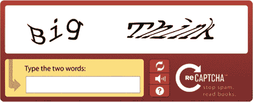

在侧边栏中详细解释的简单但强大的算法*朴素贝叶斯分类器*的帮助下，你可以从文本图像中识别数字。这些图像与许多网站为了确保你不是试图黑客攻击用户账户的计算机而设置的验证码检查非常相似。让我们看看让计算机识别数字图片有多难。

我们的研究目标是让计算机能够识别数字图片（数据科学流程的第一步）。

我们将要处理的数据是 MNIST 数据集，它常被用于数据科学文献中的教学和基准测试。


**在垃圾邮件过滤器中介绍朴素贝叶斯分类器**

你收到的每一封电子邮件并不都有诚实的目的。你的收件箱可能包含未经请求的商业邮件或批量邮件，也就是垃圾邮件。垃圾邮件不仅令人烦恼，它还常被用于诈骗和病毒传播。卡巴斯基估计，世界上超过 60%的电子邮件都是垃圾邮件。为了保护用户免受垃圾邮件的侵扰，大多数电子邮件客户端都会在后台运行一个程序，将电子邮件分类为垃圾邮件或安全邮件。

> ³
> 
> 卡巴斯基 2014 年季度垃圾邮件统计报告，[`usa.kaspersky.com/internet-security-center/threats/spam-statistics-report-q1-2014#.VVym9blViko`](http://usa.kaspersky.com/internet-security-center/threats/spam-statistics-report-q1-2014#.VVym9blViko)。

在垃圾邮件过滤中，一个流行的技术是使用邮件内部的单词作为预测器的分类器。它输出特定电子邮件由其组成的单词是垃圾邮件的概率（用数学术语，P(垃圾邮件 | 单词)）。为了得出这个结论，它使用了三个计算：

+   P(垃圾邮件)—在不知道单词的情况下垃圾邮件的平均比率。根据卡巴斯基的数据，一封邮件有 60%的概率是垃圾邮件。

+   P(单词)—无论是否为垃圾邮件，这个单词组合的使用频率。

+   P(单词 | 垃圾邮件)—在训练邮件被标记为垃圾邮件时，这些单词出现的频率。

要确定一封新邮件是垃圾邮件的概率，你会使用以下公式：

P(垃圾邮件|单词) = P(垃圾邮件)P(单词|垃圾邮件) / P(单词)

这是对规则 P(B|A) = P(B) P(A|B) / P(A) 的应用，该规则被称为贝叶斯定理，并以该分类器的名字命名。其中“朴素”部分来自分类器假设一个特征的存在不会告诉你关于另一个特征的信息（特征独立性，也称为多重共线性不存在）。在现实中，特征往往是相关的，尤其是在文本中。例如，“购买”这个词通常会被“现在”跟随。尽管这个假设不切实际，但朴素分类器在实践中表现得相当出色。

| |
| --- |

在侧边栏中的理论基础上，你已经准备好进行建模本身。确保运行所有即将到来的代码都在相同的范围内，因为每一部分都需要前一部分。可以从这本书的 Manning 下载页面下载本章的 IPython 文件。

MNIST 图像可以在 Scikit-learn 的数据集包中找到，并且已经为你进行了归一化（所有都缩放到相同的大小：64x64 像素），因此我们不需要太多的数据准备（数据科学流程的第三步）。但让我们首先按照数据科学流程的第二步，使用以下列表获取我们的数据。

##### 列表 3.1\. 数据科学流程的第二步：获取数字图像数据

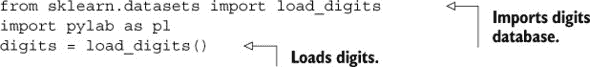

与图像一起工作与其他数据集一起工作没有太大区别。在灰度图像的情况下，你将每个矩阵条目中的值设置为要显示的灰度值。以下代码演示了此过程，并且是数据科学流程的第四步：数据探索。

##### 列表 3.2\. 数据科学流程的第四步：使用 Scikit-learn

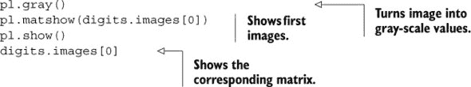

图 3.4 展示了模糊的“0”图像如何转换为数据矩阵。

##### 图 3.4\. 数字 0 的模糊灰度表示及其对应的矩阵。数字越高，越接近白色；数字越低，越接近黑色。

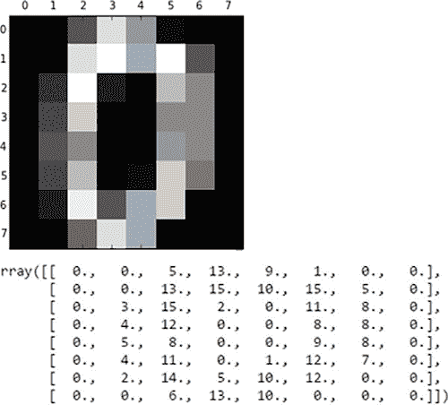

图 3.4 展示了实际的代码输出，但也许 图 3.5 可以稍微澄清这一点，因为它显示了向量中的每个元素是如何成为图像的一部分。

##### 图 3.5\. 我们将通过获取图像中每个像素的灰度值（如图右侧所示）并将这些值放入列表中，将图像转换为朴素贝叶斯分类器可用的格式。

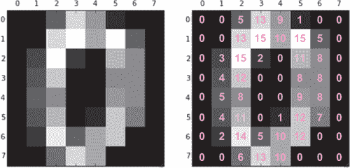

到目前为止，这很简单，不是吗？当然，还有一些额外的工作要做。朴素贝叶斯分类器期望一个值列表，但`pl.matshow()`返回一个反映图像形状的二维数组（一个矩阵）。要将它展平成一个列表，我们需要在`digits.images`上调用`reshape()`。最终结果将是一个类似这样的单维数组：

```
array([[ 0., 0., 5., 13., 9., 1., 0., 0., 0., 0., 13., 15., 10., 15., 5., 0.,
0., 3., 15., 2., 0., 11., 8., 0., 0., 4., 12., 0., 0., 8., 8., 0.,
0., 5., 8., 0., 0., 9., 8., 0., 0., 4., 11., 0., 1., 12., 7., 0.,
0., 2., 14., 5., 10., 12., 0., 0., 0., 0., 6., 13., 10., 0., 0., 0.]])
```

之前的代码片段显示了图 3.5 中的矩阵展平（维度从二维减少到一维）到一个 Python 列表。从这一点开始，它就是一个标准的分类问题，这把我们带到了数据科学过程的第五步：模型构建。

现在我们有了将图像内容传递给分类器的方法，我们需要传递一个训练数据集，这样它就可以开始学习如何预测图像中的数字。我们之前提到 Scikit-learn 包含 MNIST 数据库的子集（1,800 个图像），因此我们将使用它。每个图像也标有它实际显示的数字。这将构建一个基于图像的灰度值的概率模型，存储在内存中最可能显示的数字。

一旦程序通过了训练集并构建了模型，我们就可以传递测试数据集给它，看看它是否已经学会了如何使用模型来解释图像。

下面的列表展示了如何在代码中实现这些步骤。

##### 列表 3.3\. 数字图像数据分类问题

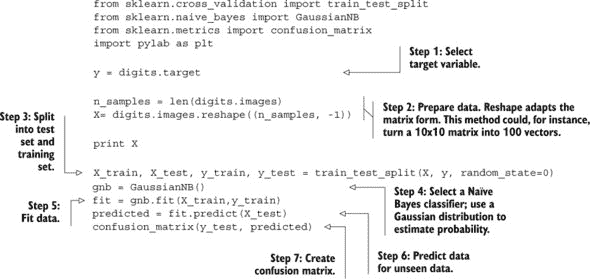

这段代码的最终结果被称为*混淆矩阵*，例如图 3.6 中所示。作为一个二维数组返回，它显示了预测的数字在主对角线以及矩阵中的(i,j)位置（j 被预测，但图像显示的是 i）出现的频率。查看图 3.6，我们可以看到模型正确预测数字 2 共 17 次（坐标 3,3），但模型也错误地预测了数字 8 共 15 次，而图像中实际显示的是数字 2（坐标 9,3）。

##### 图 3.6\. 由预测模糊图像所生成的混淆矩阵

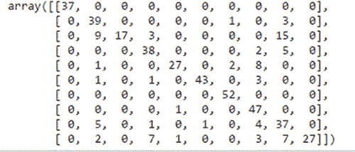


**混淆矩阵**

混淆矩阵是一个矩阵，显示了模型预测错误（或正确）的情况，以及它有多少次“混淆”。在其最简单的形式中，它将是一个 2x2 的表格，用于尝试将观测值分类为 A 或 B 的模型。假设我们有一个分类模型，它预测某人是否会购买我们最新的产品：油炸樱桃布丁。我们可以预测：“是的，这个人会购买”或“不，这位顾客不会购买”。一旦我们对 100 人做出预测，我们可以将它们与他们的实际行为进行比较，这会告诉我们我们有多少次预测正确。一个例子在表 3.1 中显示。

##### 表 3.1\. 混淆矩阵示例

| 混淆矩阵 | 预测“人会购买” | 预测“人不会购买” |
| --- | --- | --- |
| 人员 **购买** 油炸樱桃布丁 | 35 (真阳性) | 10 (假阴性) |
| 人员 **未购买** 油炸樱桃布丁 | 15 (假阳性) | 40 (真阴性) |

模型在 (35+40) 75 个案例中是正确的，在 (15+10) 25 个案例中是错误的，结果是一个 (75 正确/100 总观察值) 75% 的准确率。

所有正确分类的观察结果都加在对角线上（35+40），而其他所有内容（15+10）都被错误分类。当模型只预测两个类别（二元）时，我们的正确猜测分为两组：真阳性（预测购买并确实购买）和真阴性（预测不会购买且确实没有购买）。我们的错误猜测分为两组：假阳性（预测他们会购买但实际没有）和假阴性（预测不会购买但实际购买了）。矩阵有助于看到模型最容易出现问题的位置。在这种情况下，我们对自己的产品过于自信，轻易地将客户分类为未来的购买者（假阳性）。


从混淆矩阵中，我们可以推断出对于大多数图像，预测都是相当准确的。在一个好的模型中，你期望矩阵主对角线上的数字之和（也称为矩阵 *迹*）与矩阵所有条目之和相比非常高，这表明大部分预测是正确的。

假设我们想要以更易于理解的方式展示我们的结果，或者我们想要检查几个图像以及我们的程序所做的预测：我们可以使用以下代码来并排显示。然后我们可以看到程序出错的地方，需要更多的训练。如果我们对结果满意，模型构建就结束了，我们到达第六步：展示结果。

##### 列表 3.4\. 检查预测值与实际数值

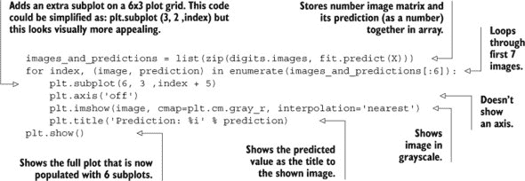

图 3.7 展示了所有预测似乎都是正确的，除了数字 2，它将其标记为 8。我们应该原谅这个错误，因为这个 2 与 8 在视觉上确实有相似之处。左下角的数字是模糊的，即使是人类；它是 5 还是 3？这值得商榷，但算法认为它是 3。

##### 图 3.7\. 对于每个模糊图像，都会预测一个数字；只有数字 2 被误认为是 8。然后一个模糊的数字被预测为 3，但它也可能是 5；即使是人类眼睛也看不清楚。

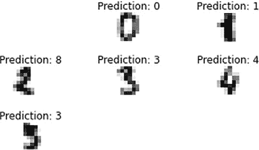

通过辨别哪些图像被误解，我们可以通过将正确的数字标签添加到这些图像上，并将它们作为新的训练集反馈到模型中（数据科学过程的第 5 步）来进一步训练模型。这将使模型更准确，因此学习、预测、纠正的循环继续，预测变得更加准确。这是一个我们用于示例的受控数据集。所有示例大小相同，它们都是 16 种灰度的。扩展到 Captcha 控制中显示的变量大小、变量长度字符串和变量色调的字母数字字符，你就可以理解为什么足够准确以预测任何 Captcha 图像的模型还不存在。

在这个监督学习示例中，很明显，如果没有与每个图像关联的标签告诉程序该图像显示的数字，就无法构建模型和做出预测。相比之下，无监督学习方法不需要其数据被标记，并且可以用来为无结构化数据集提供结构。

#### 3.3.2. 无监督学习

通常情况下，大多数大型数据集的数据上没有标签，所以除非你全部整理并为其添加标签，否则监督学习方法在数据上不会起作用。相反，我们必须采取适合这些数据的方法，因为

+   我们可以研究数据的*分布*并从分布的不同部分推断关于数据的真相。

+   我们可以研究数据的*结构和值*并从中推断出新的、更有意义的数据和结构。

对于这些*无监督学习*方法中的每一个都存在许多技术。然而，在现实世界中，你总是在数据科学过程的第一阶段定义的研究目标下工作，因此你可能需要在数据集可以标记、启用监督学习技术之前，或者甚至达到目标本身之前，结合或尝试不同的技术。

##### 从你的数据中辨别简化的潜在结构

并非所有事物都可以衡量。当你第一次见到某人时，你可能会根据他们的行为和他们的反应来猜测他们是否喜欢你。但如果是他们今天过得不好呢？也许他们的猫被撞了，或者他们可能还在为上周参加的葬礼感到难过？重点是，某些变量可以立即获得，而其他变量只能推断出来，因此它们缺失在你的数据集中。第一种类型的变量被称为*可观察变量*，第二种类型被称为*潜在变量*。在我们的例子中，你新朋友的情绪状态是一个潜在变量。它肯定会影响他们对你的判断，但它的值并不明确。

根据数据集的实际内容推导或推断潜在变量及其值是一项非常有用的技能，因为

+   潜在变量可以替代数据集中已经存在的几个变量。

+   通过减少数据集中的变量数量，数据集变得更加易于管理，任何进一步运行的算法都会更快，预测可能更加准确。

+   由于潜在变量是为定义的研究目标而设计和针对的，因此使用它们会丢失很少的关键信息。

如果我们能够将数据集从每行 14 个可观察变量简化到 5 或 6 个潜在变量，例如，由于数据集结构的简化，我们将更有可能达到我们的研究目标。从下面的例子中您将看到，这并不是将现有数据集简化到尽可能少的潜在变量的案例。您需要找到潜在变量数量带来的最大价值的“甜点”。让我们通过一个小案例研究来实践一下。

##### 案例研究：在葡萄酒质量数据集中寻找潜在变量

在这个简短的案例研究中，您将使用一种称为主成分分析（PCA）的技术来寻找描述葡萄酒质量的数据集中的潜在变量。然后您将比较一组潜在变量在预测葡萄酒质量方面与原始可观察集相比的效果。您将学习

> **1**. 如何识别和推导出那些潜在变量。
> 
> **2**. 如何通过生成和解释由 PCA 生成的*碎石图*来分析“甜点”在哪里——即多少新变量能带来最大的效用。（我们稍后会看到碎石图。）

让我们看看这个例子中的主要组成部分。

+   ***数据集*** —加州大学欧文分校（UCI）有一个在线仓库，包含 325 个用于机器学习练习的数据集，网址为[`archive.ics.uci.edu/ml/`](http://archive.ics.uci.edu/ml/)。我们将使用由 P. Cortez、A. Cerdeira、F. Almeida、T. Matos 和 J. Reis 创建的红葡萄酒质量数据集。该数据集有 1600 行，每行有 11 个变量，如表 3.2 所示。

    > ⁴
    > 
    > 您可以在[`archive.ics.uci.edu/ml/datasets/Wine+Quality`](https://archive.ics.uci.edu/ml/datasets/Wine+Quality)找到关于葡萄酒质量数据集的完整详细信息。

    ##### 表 3.2\. 红葡萄酒质量数据集的前三行

    | 固定酸度 | 挥发性酸度 | 柠檬酸 | 残糖 | 氯化物 | 自由二氧化硫 | 总二氧化硫 | 密度 | pH | 硫酸盐 | 酒精 | 质量 |
    | --- | --- | --- | --- | --- | --- | --- | --- | --- | --- | --- | --- |
    | 7.4 | 0.7 | 0 | 1.9 | 0.076 | 11 | 34 | 0.9978 | 3.51 | 0.56 | 9.4 | 5 |
    | 7.8 | 0.88 | 0 | 2.6 | 0.098 | 25 | 67 | 0.9968 | 3.2 | 0.68 | 9.8 | 5 |
    | 7.8 | 0.76 | 0.04 | 2.3 | 0.092 | 15 | 54 | 0.997 | 3.26 | 0.65 | 9.8 | 5 |

+   ***主成分分析*** —一种在尽可能保留信息的同时，寻找数据集中潜在变量的技术。

+   ***Scikit-learn*** —我们使用这个库是因为它已经为我们实现了 PCA，并且是生成碎石图的一种方式。

数据科学过程的第一步是设定我们的研究目标：我们希望利用不同的葡萄酒特性来解释主观的“葡萄酒质量”反馈。

因此，我们的第一个任务是下载数据集（第二步：获取数据），如下面的列表所示，并为其分析做准备（第三步：数据准备）。然后我们可以运行 PCA 算法并查看结果以查看我们的选项。

##### 列表 3.5\. 数据获取和变量标准化

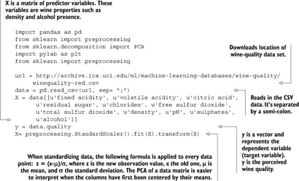

在完成初步数据准备之后，你可以执行 PCA。生成的散点图（将在稍后解释）显示在图 3.8 中。因为 PCA 是一种探索性技术，我们现在到达数据科学过程的第四步：数据探索，如下面的列表所示。

##### 图 3.8\. PCA 散点图显示了 PCA 可以创建的每个新变量的边际信息量。前几个变量解释了数据中大约 28%的方差，第二个变量解释了另外 17%，第三个大约 15%，以此类推。

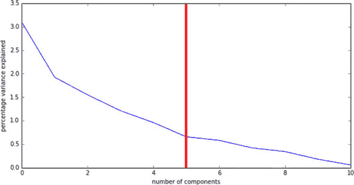

##### 列表 3.6\. 执行主成分分析


现在，让我们看看图 3.8 中的散点图。

从葡萄酒数据集生成的图表显示在图 3.8 中。你希望看到的是图表中的肘形或曲棍球棒形状。这表明几个变量可以代表数据集中大部分的信息，而其余的只增加了少许。在我们的图表中，PCA 告诉我们，将集合减少到一个变量可以捕获集合中大约 28%的总信息（图表从零开始，所以变量一在 x 轴上的位置为零），两个变量将捕获大约 17%更多或 45%的总信息，以此类推。表 3.3 显示了完整的读数。

##### 表 3.3\. PCA 的结果

| 变量数量 | 捕获的额外信息 | 总数据捕获 |
| --- | --- | --- |
| 1 | 28% | 28% |
| 2 | 17% | 45% |
| 3 | 14% | 59% |
| 4 | 10% | 69% |
| 5 | 8% | 77% |
| 6 | 7% | 84% |
| 7 | 5% | 89% |
| 8 - 11 | ... | 100% |

图表中出现的肘形表明，五个变量可以包含数据内部的大部分信息。你也可以争论在六个或七个变量处截断，但我们将选择一个比原始数据集方差更小的简单数据集。

在这一点上，我们可以继续查看使用五个潜在变量重新编码的原始数据集是否足够准确预测葡萄酒的质量，但在我们这样做之前，我们将看看我们如何识别它们代表的内容。

##### 解释新变量

在决定将数据集从 11 个原始变量减少到 5 个潜在变量后，我们可以检查是否可以根据它们与原始变量的关系来解释或命名它们。实际名称比 lv1、lv2 等代码更容易使用。我们可以在以下列表中添加一行代码以生成一个表格，显示两组变量之间的相关性。

##### 列表 3.7\. 在 Pandas 数据框中显示 PCA 组件

```
pd.DataFrame(results.components_, columns=list(
  [u'fixed acidity', u'volatile acidity', u'citric acid', u'residual sugar',
   u'chlorides', u'free sulfur dioxide',  u'total sulfur dioxide', u'density',
   u'pH', u'sulphates',  u'alcohol']))
```

结果表(表 3.4)中的行显示了数学相关性。或者用英语来说，第一个潜在变量 lv1，它捕捉了大约 28%的总信息，具有以下公式。

##### 表 3.4\. PCA 如何计算 11 个原始变量与 5 个潜在变量之间的相关性

|   | 固定酸度 | 挥发性酸度 | 柠檬酸 | 残余糖 | 氯化物 | 自由二氧化硫 | 总二氧化硫 | 密度 | pH | 硫酸盐 | 酒精 |
| --- | --- | --- | --- | --- | --- | --- | --- | --- | --- | --- | --- |
| 0 | 0.489314 | -0.238584 | 0.463632 | 0.146107 | 0.212247 | -0.036158 | 0.023575 | 0.395353 | -0.438520 | 0.242921 | -0.113232 |
| 1 | -0.110503 | 0.274930 | -0.151791 | 0.272080 | 0.148052 | 0.513567 | 0.569487 | 0.233575 | 0.006711 | -0.037554 | -0.386181 |
| 2 | 0.123302 | 0.449963 | -0.238247 | -0.101283 | 0.092614 | -0.428793 | -0.322415 | 0.338871 | -0.057697 | -0.279786 | -0.471673 |
| 3 | -0.229617 | 0.078960 | -0.079418 | -0.372793 | 0.666195 | -0.043538 | -0.034577 | -0.174500 | -0.003788 | 0.550872 | -0.122181 |
| 4 | 0.082614 | -0.218735 | 0.058573 | -0.732144 | -0.246501 | 0.159152 | 0.222465 | -0.157077 | -0.267530 | -0.225962 | -0.350681 |

```
*Lv1 = (fixed acidity * 0.489314) + (volatile acidity * -0.238584) + ... +*
*(alcohol * -0.113232)*
```

给每个新变量起一个可用的名字有点棘手，可能需要咨询实际的葡萄酒专家以确保准确性。然而，由于我们手头没有葡萄酒专家，我们将它们称为以下内容(表 3.5)。

##### 表 3.5\. 基于 PCA 创建的葡萄酒质量变量的解释

| 潜在变量 | 可能的解释 |
| --- | --- |
| 0 | 持续酸度 |
| 1 | 硫化物 |
| 2 | 挥发性酸度 |
| 3 | 氯化物 |
| 4 | 缺乏残余糖 |

我们现在可以用只有五个潜在变量的原始数据集进行重新编码。这样做是数据准备，因此我们回顾数据科学过程中的第三步：数据准备。如第二章中所述，数据科学过程是递归的，这尤其是在第三步：数据准备和第四步：数据探索之间。

表 3.6 显示了完成此操作的前三行。

##### 表 3.6\. 在五个潜在变量中重新编码的红葡萄酒质量数据集的前三行

|   | 持续酸度 | 硫化物 | 挥发性酸度 | 氯化物 | 缺乏残余糖 |
| --- | --- | --- | --- | --- | --- | --- | --- | --- | --- | --- | --- |
| 0 | -1.619530 | 0.450950 | **1.774454** | 0.043740 | -0.067014 |
| 1 | -0.799170 | 1.856553 | 0.911690 | 0.548066 | 0.018392 |
| 2 | **2.357673** | -0.269976 | -0.243489 | -0.928450 | **1.499149** |

已经可以看到，葡萄酒 0 在挥发性酸度上有很高的值，而葡萄酒 2 在持久性酸度上特别高。听起来一点也不像好酒！

##### 比较原始数据集与潜在变量的准确性

既然我们已经决定将数据集重新编码为 5 个潜在变量而不是最初的 11 个，现在是时候看看新的数据集在预测葡萄酒质量方面与原始数据集相比表现如何了。我们将使用之前示例中看到的朴素贝叶斯分类器算法来进行监督学习以帮助。

让我们先看看原始的 11 个变量如何预测葡萄酒质量评分。以下列表展示了执行此操作的代码。

##### 列表 3.8\. 主成分分析前的葡萄酒评分预测

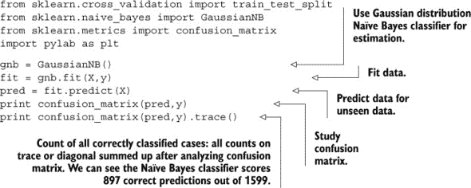

现在，我们将运行相同的预测测试，但开始时只有 1 个潜在变量而不是原始的 11 个。然后我们再添加另一个，看看效果如何，再添加一个，以此类推，以查看预测性能如何提高。以下列表展示了如何进行此操作。

##### 列表 3.9\. 随着主成分数量增加的葡萄酒评分预测

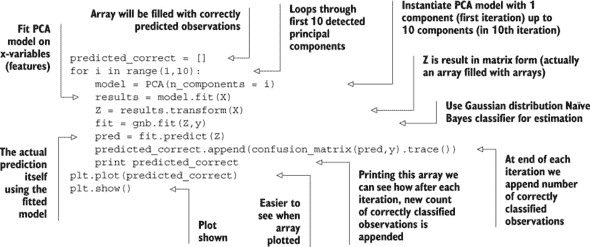

结果图显示在图 3.9 中。

##### 图 3.9\. 结果图显示，向模型添加更多潜在变量（x 轴）可以大大提高预测能力（y 轴），但达到一定程度后就会下降。添加变量带来的预测能力提升最终会减弱。

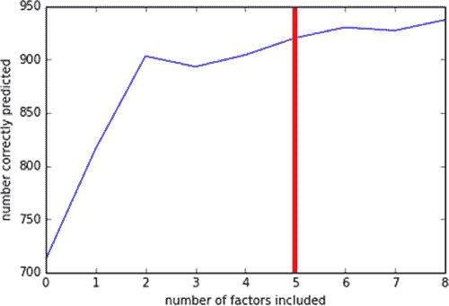

图 3.9 中的图表显示，只有 3 个潜在变量时，分类器在预测葡萄酒质量方面比原始的 11 个变量做得更好。此外，添加超过 5 个潜在变量并不会像最初的 5 个那样增加太多的预测能力。这表明我们选择在 5 个变量处截断是一个很好的选择，正如我们所希望的。

我们探讨了如何对相似变量进行分组，但也可以对观测值进行分组。

##### 通过对相似观测值进行分组来从数据分布中获得洞察

假设你正在构建一个网站，该网站根据用户输入的偏好和观看的电影推荐电影。如果他们看了很多恐怖电影，他们很可能想了解新的恐怖电影，而不是那么想了解新的青少年浪漫电影。通过将观看相似电影并设置相似偏好的用户分组在一起，你可以获得很多关于他们可能还喜欢什么推荐的洞察。

我们在这里描述的一般技术被称为*聚类*。在这个过程中，我们试图将我们的数据集划分为观测子集，或*聚类*，其中观测值应该与同一聚类中的观测值相似，但与其他聚类中的观测值差异很大。图 3.10 给你一个聚类试图达到的目标的直观概念。图顶左部的圆圈彼此很近，而与其他圆圈较远。右上角的十字架也是同样的情况。

##### 图 3.10。聚类的目标是把数据集划分为“足够不同的”子集。在这个例子中，观测值被划分为三个聚类。

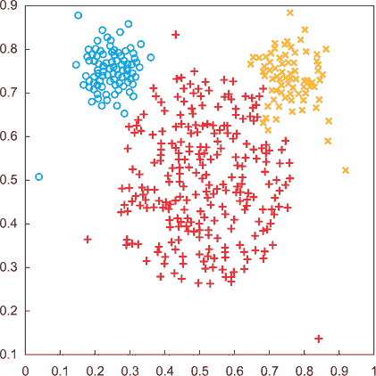

Scikit-learn 在其`sklearn.cluster`模块中实现了几个常见的聚类数据算法，包括 k-means 算法、亲和传播和谱聚类。每个算法都有一些用例，更适合某些情况，尽管 k-means 是一个很好的通用算法，可以用来入门。然而，像所有聚类算法一样，你需要提前指定所需的聚类数量，这必然会导致在得出合理结论之前进行试错的过程。它还假设所有分析所需的数据已经可用。如果数据不可用怎么办？

> ⁵
> 
> 你可以在[`scikit-learn.org/stable/modules/clustering.html`](http://scikit-learn.org/stable/modules/clustering.html)找到 Scikit-learn 中所有聚类算法的比较。

让我们看看通过属性（花瓣长度和宽度、花瓣长度和宽度等）对鸢尾花（一种花）进行聚类的实际案例。在这个例子中，我们将使用 k-means 算法。这是一个很好的算法，可以让你对数据有一个大致的了解，但它对起始值很敏感，所以每次运行算法时，你可能会得到不同的聚类结果，除非你通过指定一个种子（起始值生成器的常量）手动定义起始值。如果你需要检测层次结构，你最好使用层次聚类技术类别的算法。

另一个缺点是需要提前指定所需的聚类数量。这通常会导致在得出令人满意的结论之前进行试错的过程。

执行代码相当简单。它遵循所有其他分析相同的结构，除了你不需要传递一个目标变量。算法将学习有趣的模式。下面的列表使用鸢尾花数据集来查看算法是否可以将不同类型的鸢尾花分组。

##### 列表 3.10。鸢尾花分类示例

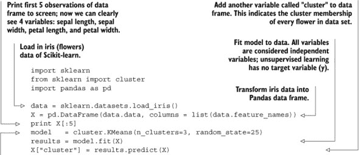

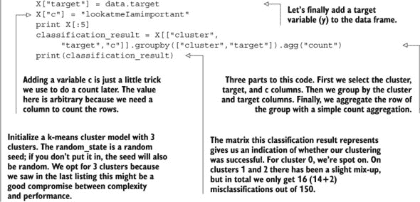

显示了鸢尾花分类的输出。

##### 图 3.11。鸢尾花分类的输出

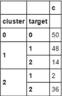

此图显示，即使不使用标签，你也会找到与官方的鸢尾花分类相似的簇，结果是 150 个正确分类中的 134 个（50+48+36）。

你并不总是需要在监督学习和无监督学习之间做出选择；有时将它们结合起来是一个选项。

### 3.4. 半监督学习

当你了解到，尽管我们希望所有数据都被标记以便使用更强大的监督式机器学习技术，但在现实中，我们通常只从最少标记的数据开始，如果有的话。我们可以使用我们的无监督机器学习技术来分析我们所拥有的数据，并可能为数据集添加标签，但全部标记的成本将非常高昂。因此，我们的目标是用尽可能少的标记数据来训练我们的预测模型。这就是半监督学习技术发挥作用的地方——它是我们之前看到两种方法的混合体。

以图 3.12 中的示例来说明。在这种情况下，数据中只有两个标记的观测值；通常情况下，这太少以至于无法做出有效的预测。

##### 图 3.12。此图只有两个标记的观测值——对于监督学习来说太少，但足以开始使用无监督或半监督方法。

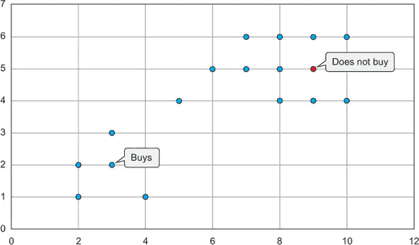

一种常见的半监督学习技术是*标签传播*。在这种技术中，你从一个标记的数据集开始，并将相同的标签赋予相似的数据点。这类似于在数据集上运行聚类算法，并根据它们包含的标签对每个簇进行标记。如果我们将这种方法应用于图 3.12 中的数据集，我们可能会得到类似于图 3.13 的结果。

##### 图 3.13。前面的图显示，数据中只有两个标记的观测值，对于监督学习来说远远不够。此图显示了如何利用底层数据集的结构来学习比仅从标记数据更好的分类器。数据被聚类技术分为两个簇；我们只有两个标记的值，但如果我们大胆一些，可以假设该簇内的其他值具有相同的标签（买家或非买家），如图所示。这种技术并不完美；如果能得到实际的标签就更好了。

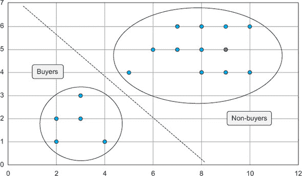

值得一提的半监督学习特殊方法之一是*主动学习*。在主动学习中，程序根据你指定的某些标准指出它想要标记的观测值，以便进行下一轮学习。例如，你可以设置它尝试标记算法最不确定的观测值，或者你可以使用多个模型进行预测，并选择模型意见分歧最大的点。

在你掌握机器学习基础知识之后，下一章将讨论在单个计算机的约束下使用机器学习。当数据集太大而无法完全加载到内存中时，这通常具有挑战性。

### 3.5\. 摘要

在本章中，你了解到

+   数据科学家高度依赖统计学和机器学习的技术来进行他们的建模。机器学习在现实生活中的应用非常广泛，从分类鸟鸣声到预测火山爆发。

+   建模过程包括四个阶段：

    > **1**.  *特征工程、数据准备和模型参数化*—我们定义模型输入的参数和变量。
    > 
    > **2**.  *模型训练*—模型被喂入数据，并学习数据中隐藏的模式。
    > 
    > **3**.  *模型选择与验证*—一个模型可能表现良好或糟糕；根据其表现，我们选择最合理的模型。
    > 
    > **4**.  *模型评分*—当我们的模型值得信赖时，它将被应用于新数据。如果我们做得好，它将为我们提供额外的见解或对我们对未来情况的预测提供良好的结果。

+   两种主要的机器学习技术

    > **1**.  *监督学习*—需要标记数据的机器学习。
    > 
    > **2**.  *无监督学习*—不需要标记数据，但通常比监督学习不准确或不可靠。

+   半监督学习介于这些技术之间，当只有一小部分数据被标记时使用。

+   两个案例研究分别展示了监督学习和无监督学习：

    > **1**.  我们的第一个案例研究使用了朴素贝叶斯分类器来对数字图像进行分类，以表示其代表的数字。我们还研究了混淆矩阵，作为确定我们的分类模型表现如何的手段。
    > 
    > **2**.  我们对无监督技术的案例研究展示了我们如何使用主成分分析来减少输入变量，以便进一步构建模型，同时保持大部分信息。
