## 第四章：在单台计算机上处理大型数据

*本章涵盖*

+   在单台计算机上处理大型数据集

+   使用适合大型数据集的 Python 库

+   理解选择正确算法和数据结构的重要性

+   理解如何调整算法以在数据库内部工作

如果你的数据量如此之大，以至于似乎超出了你的能力，你的技术似乎也不再足够，你会怎么办，屈服还是适应？

幸运的是，你选择了适应，因为你还在阅读。本章将向你介绍一些技术和工具，以处理更大的数据集，如果你采用正确的技术，这些数据集仍然可以通过单台计算机进行管理。

本章为你提供了在数据不再适合你计算机的 RAM（随机访问内存）中进行分类和回归的工具，而第三章则专注于内存数据集。第五章将更进一步，教你如何处理需要多台计算机来处理的数据集。当我们在本章中提到“大型数据”时，我们指的是那些在内存或速度方面引起问题，但仍然可以通过单台计算机处理的数据。

我们从本章开始，概述你在处理大型数据集时面临的问题。然后我们提供三种类型的解决方案来克服这些问题：调整你的算法、选择正确的数据结构，以及选择正确的工具。数据科学家并不是唯一需要处理大量数据的人，因此你可以应用通用的最佳实践来解决大数据问题。最后，我们将这些知识应用于两个案例研究。第一个案例展示了如何检测恶意 URL，第二个案例演示了如何在数据库内部构建推荐引擎。

### 4.1. 处理大型数据时面临的问题

大量的数据带来了新的挑战，例如内存过载和永不停止运行的算法。这迫使你适应并扩展你的技术储备。但即使你能够执行分析，你也应该注意诸如 I/O（输入/输出）和 CPU 饥饿等问题，因为这些可能会引起速度问题。图 4.1 展示了一个思维导图，随着我们逐步进行，它将逐渐展开：问题、解决方案和技巧。

##### 图 4.1：处理比内存能容纳更多的数据时遇到的问题概述

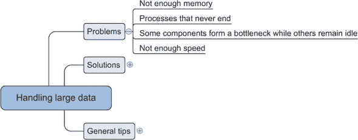

计算机只有有限的 RAM。当你试图将比实际适合的更多数据挤进这个内存时，操作系统将开始将内存块交换到磁盘上，这比所有数据都在内存中要低效得多。但只有少数算法被设计来处理大数据集；其中大多数一次将整个数据集加载到内存中，这会导致内存不足错误。其他算法需要在内存中保留数据的多个副本或存储中间结果。所有这些都加剧了这个问题。

即使你解决了内存问题，你可能还需要处理另一个有限的资源：*时间*。虽然计算机可能认为你活了几百万年，但现实中你不会（除非你进入冷冻睡眠直到你的 PC 完成）。某些算法没有考虑到时间；它们会永远运行。其他算法在需要处理仅几兆字节的数据时，无法在合理的时间内结束。

处理大数据集时，你还会观察到第三件事，那就是你的计算机组件可能会开始形成瓶颈，而其他系统则闲置。虽然这不像无限循环的算法或内存不足错误那样严重，但它仍然会带来严重的成本。从节省人天和计算基础设施的角度来考虑 CPU 饥饿的成本。某些程序因为必须从硬盘读取数据（这是计算机上速度最慢的组件之一）而无法快速向处理器提供数据。这个问题随着固态硬盘（SSD）的引入得到了解决，但 SSD 仍然比速度较慢且更广泛使用的硬盘驱动器（HDD）技术要贵得多。

### 4.2\. 处理大量数据的通用技术

无限循环的算法、内存不足错误和速度问题是你在处理大数据时面临的最常见挑战。在本节中，我们将探讨克服或减轻这些问题的解决方案。

解决方案可以分为三类：使用正确的算法、选择合适的数据结构和使用合适的工具(图 4.2)。

##### 图 4.2\. 处理大数据集的解决方案概述

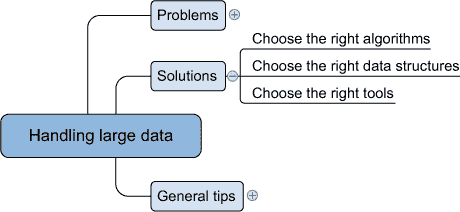

问题与解决方案之间不存在明确的单一映射，因为许多解决方案同时解决了内存不足和计算性能问题。例如，数据集压缩可以帮助你解决内存问题，因为数据集变得更小。但这也会影响计算速度，从慢速硬盘转移到快速 CPU。与 RAM（随机访问内存）不同，硬盘会在断电后存储一切，但写入硬盘比在短暂的 RAM 中更改信息花费更多时间。当不断更改信息时，RAM 因此比（更耐用的）硬盘更可取。在未打包的数据集中，会发生大量的读写操作（I/O），但 CPU 仍然大部分空闲，而压缩数据集时，CPU 可以获得其应得的工作量。在我们探索一些解决方案时，请记住这一点。

#### 4.2.1\. 选择合适的算法

选择合适的算法可以解决比增加更多或更好的硬件更多的问题。一个适合处理大量数据的算法不需要将整个数据集加载到内存中进行预测。理想情况下，该算法还支持并行计算。在本节中，我们将深入了解三种可以实现这一点的算法类型：*在线算法*、*块算法*和*MapReduce 算法*，如图 4.3 所示。

##### 图 4.3\. 适应大数据集的技术概述

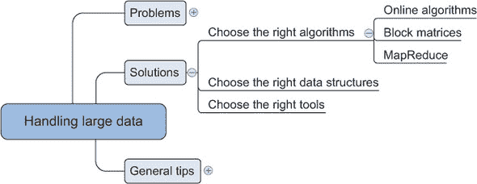

##### 在线学习算法

一些机器学习算法可以通过每次使用一个观察值来训练，而不是将所有数据都加载到内存中。当新的数据点到达时，模型被训练，观察值可以被遗忘；其影响现在已纳入模型参数。例如，用于预测天气的模型可以使用不同的参数（如大气压力或温度）在不同地区。当来自一个地区的数据被加载到算法中时，它会忘记这些原始数据，然后转向下一个地区。这种“使用并遗忘”的工作方式是解决内存问题的完美解决方案，因为单个观察值不太可能大到足以填满现代计算机的所有内存。

列表 4.1 展示了如何将此原理应用于具有在线学习的感知器。**感知器**是用于二元分类（0 或 1）的最简单机器学习算法之一；例如，顾客会购买还是不会购买？

##### 列表 4.1\. 通过观察训练感知器

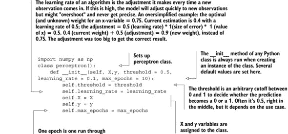

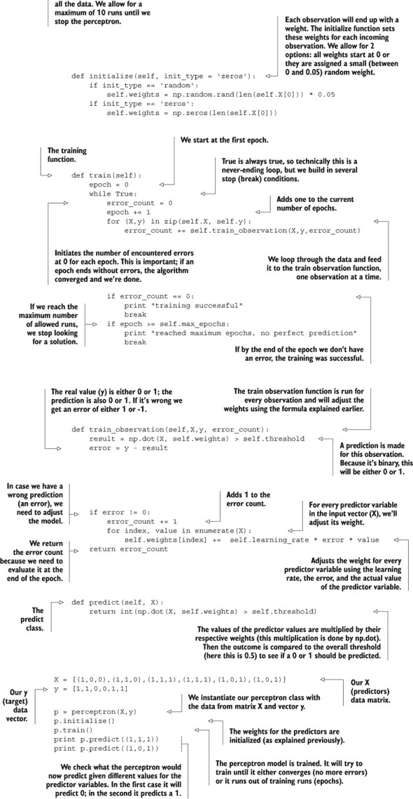

我们将放大代码中可能不是那么容易理解的部分。我们将首先解释 `train_observation()` 函数的工作原理。这个函数有两个主要部分。第一部分是计算观察值的预测并将其与实际值进行比较。第二部分是如果预测似乎错误，则更改权重。

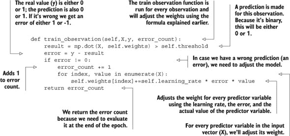

预测（y）是通过将独立变量的输入向量与其相应的权重相乘并求和项（如线性回归中所示）来计算的。然后，将此值与阈值进行比较。如果它大于阈值，算法将输出 1，如果它小于阈值，算法将输出 0。设置阈值是一个主观的事情，取决于你的业务案例。比如说，你正在预测某人是否患有某种致命疾病，其中 1 表示阳性，0 表示阴性。在这种情况下，较低的阈值更好：被发现阳性并进行第二次调查并不像忽视疾病并让患者死亡那样糟糕。计算误差，这将给出权重变化的指示。

```
result = np.dot(X, self.weights) > self.threshold
error = y - result
```

权重的改变是根据误差的符号进行的。更新是通过感知器的学习规则完成的。对于权重向量中的每一个权重，你使用以下规则更新其值：

```
Δwi = αexi
```

其中 Δ`w[i]` 是权重需要改变的数量，α 是学习率，ε 是误差，`x`^i 是输入向量中的第 i 个值（第 i 个预测变量）。误差计数是一个变量，用于跟踪在这个时期内预测错误的观察数量，并将其返回给调用函数。如果原始预测错误，则将一个观察值添加到误差计数器中。一个 *epoch* 是一次通过所有观察值的单个训练运行。

```
if error != 0:
       error_count += 1
            for index, value in enumerate(X):
                self.weights[index] +=  self.learning_rate * error * value
```

我们将更详细地讨论的第二个函数是 `train()` 函数。这个函数有一个内部循环，它不断地训练感知器，直到它可以完美预测或者直到它达到了一定的训练轮数（epochs），如下所示。

##### 列表 4.2\. 使用 `train` 函数

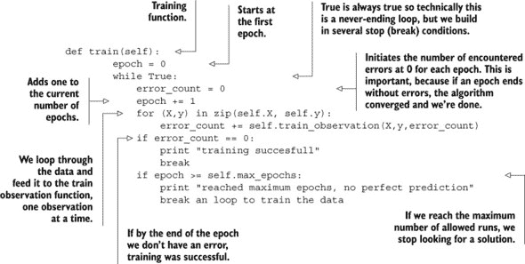

大多数在线算法也可以处理小批量；这样，你可以一次性输入 10 到 1,000 个观察值的批次，同时使用滑动窗口遍历你的数据。你有三个选项：

+   ***全批量学习（也称为统计学习）*** — 一次性将所有数据输入算法。这正是我们在第三章中做的事情。

+   ***小批量学习*** — 一次输入算法一小部分观察值（100，1000，...，取决于你的硬件能处理多少）。

+   ***在线学习*** — 一次输入算法一个观察值。

在线学习技术相关于*流式算法*，其中你只能看到每个数据点一次。想想 incoming Twitter 数据：它被加载到算法中，然后观察（推文）被丢弃，因为 incoming tweets 的数量可能会很快超过硬件的处理能力。在线学习算法与流式算法的不同之处在于，它们可以看到相同的观察结果多次。确实，在线学习算法和流式算法都可以逐个从观察结果中学习。它们的不同之处在于，*在线算法*还可以用于静态数据源以及流数据源，通过以小批量（小到单个观察结果）的形式呈现数据，这使得你可以多次遍历数据。而流式算法则不同，数据流入系统，你需要立即进行计算。它们相似之处在于，它们一次只处理少量数据。

##### 将大矩阵分割成许多小矩阵

而在前一章中，我们几乎不需要处理算法如何精确估计参数的问题，深入探讨这个问题有时可能会有所帮助。例如，通过将大数据表切割成小矩阵，我们仍然可以进行线性回归。这种矩阵分割的逻辑以及如何使用矩阵进行线性回归的计算可以在侧边栏中找到。现在只需知道，我们即将使用的 Python 库将负责矩阵分割，线性回归的变量权重可以使用矩阵微积分来计算。


**块矩阵和线性回归系数估计的矩阵公式**

某些算法可以被转换成使用矩阵块而不是完整矩阵的算法。当你将矩阵分割成块矩阵时，你将完整矩阵分割成部分，并使用较小的部分而不是完整矩阵。在这种情况下，你可以将较小的矩阵加载到内存中并执行计算，从而避免内存不足错误。图 4.4 展示了如何将矩阵加法 A + B 重写为子矩阵。

##### 图 4.4\. 块矩阵可以用来计算矩阵 A 和 B 的和。

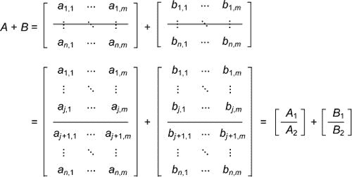

图 4.4 中的公式显示，将矩阵 A 和 B 一次性相加与先加矩阵的上半部分然后加下半部分没有区别。

所有常见的矩阵和向量运算，如乘法、求逆和奇异值分解（类似于 PCA 的变量减少技术），都可以用块矩阵来表示。¹ 块矩阵运算通过将问题分割成更小的块来节省内存，并且易于并行化。

尽管大多数数值包都有高度优化的代码，但它们只处理可以放入内存的矩阵，并且在有利的条件下会在内存中使用块矩阵。对于超出内存的矩阵，它们不会为你优化这一点，你需要自己将矩阵分割成更小的矩阵，并实现块矩阵版本。

*线性回归* 是一种使用预测变量的线性组合来预测连续变量的方法；执行计算的最基本方法之一是使用称为 *普通最小二乘法* 的技术。矩阵形式的公式是

β = (X^TX)^(-1)X^Ty

其中 β 是你想要检索的系数，X 是预测变量，y 是目标变量。


我们用来完成任务的 Python 工具如下:^([1])

> ¹
> 
> 对于那些想要尝试的人来说，在计算奇异值分解时，给定变换比 Householder 变换更容易实现。

+   *bcolz* 是一个 Python 库，可以紧凑地存储数据数组，并在数组不再适合主内存时使用硬盘。

+   *Dask* 是一个库，它使你能够优化计算流程，并使并行计算更容易。它不是 Anaconda 默认设置的一部分，所以在运行下面的代码之前，请确保在你的虚拟环境中使用 `conda install dask`。注意：当使用 64 位 Python 导入 Dask 时，已经报告了一些错误。Dask 依赖于一些其他库（如 toolz），但依赖关系应该由 pip 或 conda 自动处理。

以下列表展示了使用这些库进行块矩阵计算。

##### 列表 4.3\. 使用 bcolz 和 Dask 库进行块矩阵计算

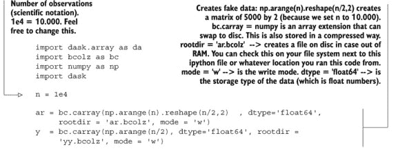

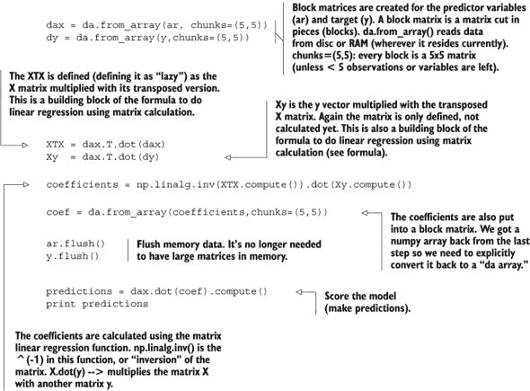

注意，你不需要使用块矩阵求逆，因为 XTX 是一个大小为预测变量数量 * 预测变量数量的平方矩阵。这是幸运的，因为 Dask 还不支持块矩阵求逆。你可以在维基百科的矩阵算术页面[`en.wikipedia.org/wiki/Matrix_(mathematics)`](https://en.wikipedia.org/wiki/Matrix_(mathematics))上找到更多一般信息。

##### MapReduce

使用类比来理解 MapReduce 算法是很容易的：想象一下，有人要求你统计全国选举的所有选票。你的国家有 25 个政党，1,500 个投票办公室，和 200 万人。你可以选择从每个办公室单独收集所有选票并集中计数，或者你可以要求当地办公室为 25 个政党统计选票，并将结果交给你，然后你可以按政党进行汇总。

Map reducers 遵循与第二种工作方式类似的过程。它们首先将值映射到键上，然后在 reduce 阶段对该键进行聚合。查看以下列表的伪代码，以更好地了解这种感觉。

##### 列表 4.4\. MapReduce 伪代码示例

```
For each person in voting office:
    Yield (voted_party, 1)
For each vote in voting office:
    add_vote_to_party()
```

MapReduce 算法的一个优点是它们易于并行化和分发。这解释了它们在 Hadoop 等分布式环境中的成功，但它们也可以在单个计算机上使用。我们将在下一章更深入地探讨它们，并在第九章中提供了一个（JavaScript）实现示例。当在 Python 中实现 MapReduce 时，您不需要从头开始。许多库已经为您做了大部分工作，例如 Hadoopy、Octopy、Disco 或 Dumbo。

#### 4.2.2\. 选择合适的数据结构

算法可以成就或毁掉您的程序，但您存储数据的方式同样重要。数据结构有不同的存储需求，但也会影响数据集上*CRUD*（创建、读取、更新和删除）和其他操作的性能。

图 4.5 展示了您可以选择的许多不同的数据结构，其中我们将讨论三种：稀疏数据、树数据和哈希数据。让我们首先看看稀疏数据集。

##### 图 4.5\. 在处理大数据时，数据科学中常用数据结构的概述

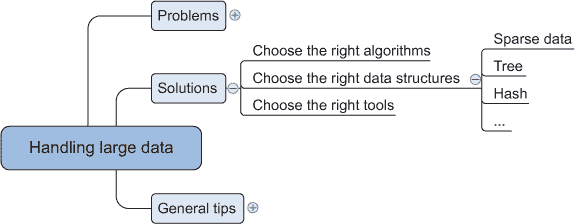

##### 稀疏数据

与其条目（观测值）相比，稀疏数据集包含相对较少的信息。看看图 4.6：几乎全是“0”，仅在第二个观测值变量 9 中有一个“1”。

##### 图 4.6\. 稀疏矩阵的示例：几乎全是 0；在稀疏矩阵中，其他值是例外

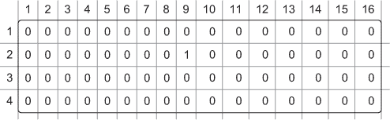

这样的数据可能看起来很荒谬，但将文本数据转换为二进制数据时，这通常是您得到的结果。想象一下一组 10 万个完全不相关的 Twitter 推文。其中大多数可能少于 30 个单词，但合在一起可能有数百或数千个不同的单词。在文本挖掘章节中，我们将介绍将文本文档切割成单词并将它们存储为向量的过程。但到目前为止，想象一下如果每个单词都被转换为一个二进制变量，其中“1”代表“存在于这条推文中”，而“0”表示“不存在于这条推文中”。这将确实导致稀疏数据。结果的大矩阵即使包含很少的信息，也可能导致内存问题。

幸运的是，这样的数据可以压缩存储。在图 4.6 的情况下，它可能看起来像这样：

```
data = [(2,9,1)]
```

第 2 行第 9 列的值为 1。

在 Python 中，支持处理稀疏矩阵的功能正在增长。现在许多算法都支持或返回稀疏矩阵。

##### 树结构

树是一种数据结构，它允许你比扫描整个表更快地检索信息。树总是有一个根值和子树，每个子树都有自己的子节点，以此类推。简单的例子可以是你的家族树或生物树以及它如何分裂成分支、枝条和叶子。简单的决策规则使得很容易找到你的数据所在的子树。查看图 4.7 以了解树结构如何帮助你快速获取相关信息。

##### 图 4.7\. 树数据结构的示例：可以使用如年龄类别这样的决策规则快速定位家族树中的人

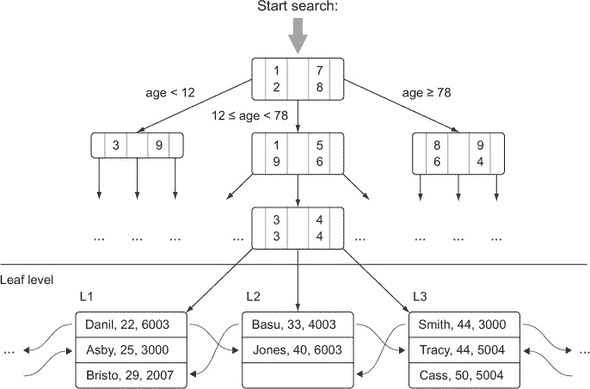

在图 4.7 中，你从顶部开始搜索，首先选择一个年龄类别，因为显然这是剔除最多替代因素的因素。这个过程一直持续到找到你想要的东西。对于不熟悉 Akinator 的人来说，我们建议访问[`en.akinator.com/`](http://en.akinator.com/)。Akinator 是一个神奇灯中的精灵，通过询问你关于某人的几个问题来试图猜测你心中的那个人。试试看，你会感到惊讶……或者看看这种魔法是如何变成树搜索的。

树在数据库中也非常受欢迎。数据库更喜欢不从头到尾扫描表，而是使用一个称为 *索引* 的设备来避免这种情况。索引通常基于树和哈希表等数据结构来更快地找到观察结果。使用索引极大地加快了查找数据的过程。让我们看看这些哈希表。

##### 哈希表

哈希表是一种数据结构，为你的数据中的每个值计算一个键，并将这些键放入桶中。这样，当你遇到数据时，可以通过查看正确的桶来快速检索信息。Python 中的字典是哈希表实现，它们是键值存储的近亲。你将在本章的最后一个例子中遇到它们，当你在一个数据库中构建推荐系统时。哈希表在数据库中广泛用作索引，以实现快速信息检索。

#### 4.2.3\. 选择合适的工具

当合适的算法和数据结构就位时，是时候选择合适的工具来完成这项工作了。合适的工具可以是 Python 库，或者至少是可以通过 Python 控制的工具，如图 4.8 所示。可用的有用工具数量巨大，所以我们只看其中的一小部分。

##### 图 4.8\. 在处理大量数据时可以使用的工具概述

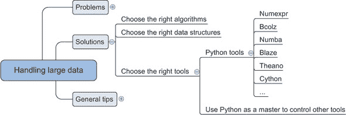

##### Python 工具

Python 有许多库可以帮助你处理大量数据。这些库从更智能的数据结构到代码优化器，再到即时编译器应有尽有。以下是我们面对大量数据时喜欢使用的库列表：

+   ***Cython*** —你越接近计算机的实际硬件，计算机知道它必须处理的数据类型就越重要。对于计算机来说，1 + 1 与 1.00 + 1.00 的加法是不同的。第一个例子由整数组成，第二个例子由浮点数组成，这些计算由 CPU 的不同部分执行。在 Python 中，你不需要指定你使用的数据类型，因此 Python 编译器必须推断它们。但是，推断数据类型是一个耗时的操作，这也是 Python 不是最快的语言之一的部分原因。Cython，Python 的超集，通过在开发程序时强制程序员指定数据类型来解决此问题。一旦编译器有了这些信息，它就会以更快的速度运行程序。有关 Cython 的更多信息，请参阅 [`cython.org/`](http://cython.org/)。

+   ***Numexpr*** —Numexpr 是许多大数据包的核心，就像 NumPy 对于内存中的包一样。Numexpr 是一个用于 NumPy 的数值表达式评估器，但可以比原始 NumPy 快得多。为了实现这一点，它重写你的表达式并使用内部（即时）编译器。有关 Numexpr 的详细信息，请参阅 [`github.com/pydata/numexpr`](https://github.com/pydata/numexpr)。

+   ***Numba*** —Numba 通过在执行前编译你的代码来帮助你实现更高的速度，这被称为 *即时编译*。这让你能够编写高级代码，但达到与 C 代码相似的速度。使用 Numba 很简单；请参阅 [`numba.pydata.org/`](http://numba.pydata.org/) 了解更多信息。

+   ***Bcolz*** —Bcolz 帮助你克服在使用 NumPy 时可能出现的内存不足问题。它可以以最优压缩形式存储和操作数组。它不仅减少了你的数据需求，还在后台使用 Numexpr 来减少使用 bcolz 数组进行计算时所需的计算量。请参阅 [`bcolz.blosc.org/`](http://bcolz.blosc.org/) 了解更多信息。

+   ***Blaze*** —如果你想要使用数据库后端的力量，但又喜欢“Pythonic”的数据处理方式，Blaze 是理想的选择。Blaze 会将你的 Python 代码转换为 SQL，但可以处理比关系数据库更多的数据存储，如 CSV、Spark 等。Blaze 提供了一种统一的方式来处理多个数据库和数据库。尽管如此，Blaze 仍在开发中，因此许多功能尚未实现。请参阅 [`blaze.readthedocs.org/en/latest/index.html`](http://blaze.readthedocs.org/en/latest/index.html) 了解更多信息。

+   ***Theano*** —Theano 允许你直接与图形处理单元 (GPU) 交互，并在可能的情况下进行符号化简化，它还附带了一个优秀的即时编译器。除此之外，它还是一个处理高级但有用的数学概念（张量）的出色库。请参阅 [`deeplearning.net/software/theano/`](http://deeplearning.net/software/theano/)。

+   ***Dask*** — Dask 允许您优化计算流程并高效执行它们。它还允许您分发计算。请参阅 [`dask.pydata.org/en/latest/`](http://dask.pydata.org/en/latest/)。

这些库主要关于使用 Python 本身进行数据处理（除了 Blaze，它还可以连接到数据库）。为了实现高端性能，您可以使用 Python 与各种数据库或其他软件进行通信。

##### 使用 Python 作为主控来控制其他工具

大多数软件和工具制造商都支持其软件的 Python 接口。这使得您能够轻松地利用 Python 的便捷性和生产力来访问专门的软件组件。这样，Python 与其他流行的数据科学语言（如 R 和 SAS）区分开来。您应该充分利用这种奢侈，最大限度地发挥专用工具的威力。第六章 介绍了一个使用 Python 连接到 NoSQL 数据库的案例研究，第七章 则介绍了与图数据相关的案例。

现在我们来看一下处理大数据时的一些更通用的有用提示。

### 4.3\. 处理大数据集的一般编程技巧

在一般编程环境中有效的技巧在数据科学中仍然适用。其中一些可能措辞略有不同，但所有程序员的原则基本上是相同的。本节回顾了在数据科学环境中重要的这些技巧。

您可以将一般技巧分为三个部分，如图 4.9 中的思维导图所示：

##### 图 4.9\. 处理大数据时的一般编程最佳实践概述

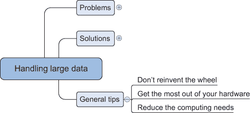

+   ***不要重复造轮子。*** 使用他人开发的工具和库。

+   ***充分利用您的硬件。*** 您的机器从未被充分利用；通过简单的适配，您可以使其更努力地工作。

+   ***减少计算需求。*** 尽可能地精简您的内存和处理需求。

当面对具体问题时，“不要重复造轮子”可能说起来容易做起来难，但您的第一个想法始终应该是，“肯定有人在我之前遇到过这个问题。”

#### 4.3.1\. 不要重复造轮子

“不要重复别人的工作”可能比“不要重复自己”更好。通过您的行动增加价值：确保它们有意义。解决已经解决的问题是一种浪费时间的行为。作为一名数据科学家，您有两个重要的规则可以帮助您处理大数据并使您的工作效率更高：

+   ***利用数据库的力量。*** 当数据科学家处理大数据集时，他们大多数人的第一反应是在数据库内部准备他们的分析基础表。当你要准备的特征相对简单时，这种方法效果很好。当这种准备涉及到高级建模时，找出是否可以采用用户定义的函数和过程。本章的最后一个例子是关于将数据库集成到你的工作流程中。

+   ***使用优化库。*** 创建像 Mahout、Weka 和其他机器学习算法这样的库需要时间和知识。它们高度优化，并融合了最佳实践和最先进的技术。把时间花在完成任务上，而不是重复别人的工作，除非是为了理解事物是如何工作的。

然后你必须考虑你的硬件限制。

#### 4.3.2\. 充分利用你的硬件

计算机上的资源可能处于闲置状态，而其他资源则过度使用。这会减慢程序的速度，甚至可能导致它们失败。有时（并且是必要的）可以使用以下技术将工作负载从过度使用的资源转移到未充分利用的资源：

+   ***向 CPU 提供压缩数据。*** 避免 CPU 饥饿的一个简单技巧是向 CPU 提供压缩数据而不是膨胀（原始）数据。这将使更多的工作从硬盘转移到 CPU，这正是你想要的，因为在大多数现代计算机架构中，硬盘无法跟上 CPU 的速度。

+   ***利用 GPU 的优势。*** 有时候，瓶颈不是你的内存，而是 CPU。如果你的计算可以并行化，你可以从切换到 GPU 中受益。GPU 在计算方面比 CPU 有更高的吞吐量。GPU 在并行化工作中非常高效，但它的缓存比 CPU 少。但是，如果你的问题是硬盘，切换到 GPU 是没有意义的。几个 Python 包，如 Theano 和 NumbaPro，可以在不费太多编程努力的情况下使用 GPU。如果这还不够，你可以使用 CUDA（计算统一设备架构）包，如 PyCUDA。如果你对创建自己的货币感兴趣，这也是比特币挖矿中的一个众所周知的小技巧。

+   ***使用多线程。*** 在你的 CPU 上并行化计算仍然是可能的。你可以通过正常的 Python 线程来实现这一点。

#### 4.3.3\. 减少你的计算需求

“聪明工作 + 努力工作 = 成就。” 这同样适用于你编写的程序。避免出现大量数据问题的最佳方式是在一开始就尽可能多地移除工作，并让计算机只处理那些无法跳过的部分。以下列表包含了一些帮助你实现这一目标的方法：

+   ***分析你的代码并修复慢速代码部分。*** 并非你代码的每一部分都需要优化；使用分析器来检测程序中的慢速部分，并修复这些部分。

+   ***尽可能使用编译代码，特别是在涉及循环时。*** 无论如何可能，使用针对数值计算进行优化的包中的函数，而不是自己实现所有内容。这些包中的代码通常高度优化且已编译。

+   ***否则，自己编译代码。*** 如果你不能使用现有的包，可以使用即时编译器，或者将代码中的最慢部分用 C 或 Fortran 等底层语言实现，并将其与代码库集成。如果你决定转向 *底层语言*（更接近通用计算机字节码的语言），学习使用计算库，如 LAPACK、BLAST、Intel MKL 和 ATLAS。这些库高度优化，难以达到它们的性能水平。

+   ***避免将数据拉入内存。*** 当你处理无法装入内存的数据时，避免将所有数据都拉入内存。这样做的一个简单方法是通过分块读取数据并在飞行中解析数据。这并不适用于每个算法，但可以使对极其大型数据集的计算成为可能。

+   ***使用生成器来避免中间数据存储。*** 生成器帮助你按观测值返回数据，而不是批量返回。这样，你就可以避免存储中间结果。

+   ***尽可能少地使用数据。*** 如果没有可用的大规模算法，并且你不愿意自己实现此类技术，那么你仍然可以在原始数据的一个样本上训练你的数据。

+   ***尽可能使用你的数学技能来简化计算。*** 以以下方程为例：（*a* + *b*）² = *a*² + 2*ab* + *b*²。方程的左侧将比方程的右侧计算得更快；即使对于这个简单的例子，在处理大量数据时也可能有所区别。

### 4.4\. 案例研究 1：预测恶意 URL

互联网可能是现代最伟大的发明之一。它推动了人类的发展，但并非每个人都怀着崇高的意图使用这一伟大发明。许多公司（例如 Google）试图通过为我们检测恶意网站来保护我们免受欺诈。这样做并不容易，因为互联网上有数十亿个网页需要扫描。在本案例研究中，我们将展示如何处理不再适合内存的数据集。

我们将使用

+   ***数据*** — 本案例研究中的数据作为研究项目的一部分提供。该项目包含 120 天的数据，每个观测值大约有 3,200,000 个特征。目标变量包含 1 表示恶意网站，否则为 -1。更多信息，请参阅“超越黑名单：从可疑 URL 中学习检测恶意网站。”^([2])

    > ²
    > 
    > Justin Ma, Lawrence K. Saul, Stefan Savage, and Geoffrey M. Voelker, “Beyond Blacklists: Learning to Detect Malicious Web Sites from Suspicious URLs,” Proceedings of the ACM SIGKDD Conference, Paris (June 2009), 1245–53.

+   ***Scikit-learn 库*** — 到目前为止，你应该在你的 Python 环境中安装了这个库，因为我们已经在上一章中使用过它了。

如您所见，对于这个案例，我们不需要太多，让我们深入探讨。

#### 4.4.1\. 第 1 步：定义研究目标

我们项目的目标是检测某些 URL 是否可信。由于数据量很大，我们旨在以内存友好的方式完成这项工作。在下一步中，我们将首先看看如果我们不关心内存（RAM）问题会发生什么。

#### 4.4.2\. 第 2 步：获取 URL 数据

首先从 [`sysnet.ucsd.edu/projects/url/#datasets`](http://sysnet.ucsd.edu/projects/url/#datasets) 下载数据并将其放置在一个文件夹中。选择 SVMLight 格式的数据。SVMLight 是一种基于文本的格式，每行一个观测值。为了节省空间，它省略了零。

以下列表和图 4.10 展示了当你尝试读取 120 个文件中的 1 个并创建算法期望的正常矩阵时会发生什么。`todense()` 方法将数据从特殊文件格式转换为包含每个条目值的正常矩阵。

##### 图 4.10\. 尝试将大量数据集加载到内存时出现的内存错误

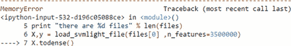

##### 列表 4.5\. 生成内存不足错误

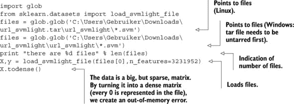

惊讶，惊讶，我们得到了一个内存不足错误。除非你在超级大的机器上运行此代码。经过一些技巧后，你将不再遇到这些内存问题，并将检测到 97% 的恶意网站。

##### 工具和技术

在加载单个文件时遇到了内存错误——还有 119 个文件要加载。幸运的是，我们有一些技巧。让我们在案例研究中尝试这些技术：

+   使用数据的稀疏表示。

+   用压缩数据而不是原始数据喂给算法。

+   使用在线算法进行预测。

当我们使用它时，我们将更深入地探讨每个“技巧”。现在我们已经将数据本地化了，让我们访问它。数据科学流程的第 3 步，数据准备和清洗，在这个案例中不是必要的，因为 URL 已经预先清洗过。然而，在我们释放学习算法之前，我们需要进行某种形式的探索。

#### 4.4.3\. 第 4 步：数据探索

为了看看我们是否可以应用我们的第一个技巧（稀疏表示），我们需要找出数据是否确实包含大量零。我们可以使用以下代码片段进行检查：

```
print "number of non-zero entries %2.6f"  % float((X.nnz)/(float(X.shape[0]) * float(X.shape[1])))
```

这会输出以下内容：

```
number of non-zero entries 0.000033
```

与零相比信息量小的数据称为 *稀疏数据*。如果将数据存储为 `[(0,0,1),(4,4,1)]` 而不是

```
[[1,0,0,0,0],[0,0,0,0,0],[0,0,0,0,0],[0,0,0,0,0],[0,0,0,0,1]]
```

实现这一点的文件格式之一是 SVMLight，这正是我们下载此格式数据的原因。尽管如此，我们还没有完成，因为我们还需要了解数据内部的维度。

要获取这些信息，我们已经在检查最大观测值和变量数时保持了数据压缩。我们还需要*逐个读取数据文件*。这样你消耗的内存会更少。第二个技巧是向 CPU 提供压缩文件。在我们的例子中，它已经打包在 tar.gz 格式中。你只有在需要时才解压文件，而不会将其写入硬盘（你电脑中最慢的部分）。

对于我们的示例，列表 4.6 中，我们只会在前 5 个文件上工作，但你可以自由地使用所有文件。

##### 列表 4.6. 检查数据大小

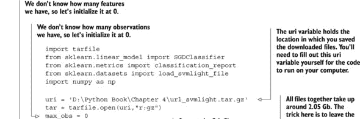

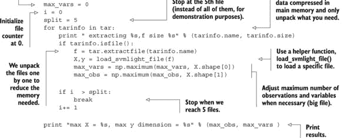

部分代码需要一些额外的解释。在这个代码中，我们遍历 tar 归档文件内的 svm 文件。我们逐个解压文件以减少所需的内存。由于这些文件是 SVM 格式，我们使用辅助函数`functionload_svmlight_file()`来加载特定文件。然后我们可以通过检查结果数据集的形状来查看文件包含多少观测值和变量。

带着这些信息，我们可以继续进行模型构建。

#### 4.4.4. 步骤 5：模型构建

现在我们已经知道了数据的维度，我们可以在以下列表中应用相同的两个技巧（压缩文件的稀疏表示）并添加第三个（使用在线算法）。让我们找到那些有害网站！

##### 列表 4.7. 创建一个模型来区分恶意 URL 和正常 URL

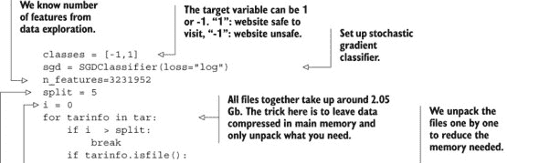


之前列表中的代码看起来与我们之前所做的相当相似，除了随机梯度下降分类器`SGDClassifier()`。

在这里，我们通过使用`partial_fit()`函数在一个文件中呈现观测值来迭代训练算法。

只遍历前 5 个文件在这里给出了表 4.1 中显示的输出。该表显示了分类诊断指标：精确度、召回率、F1 分数和支持度。

##### 表 4.1. 分类问题：网站是否可信？

|   | 精确度 | 召回率 | F1 分数 | 支持度 |
| --- | --- | --- | --- | --- |
| -1 | 0.97 | 0.99 | 0.98 | 14045 |
| 1 | 0.97 | 0.94 | 0.96 | 5955 |
| 平均/总计 | 0.97 | 0.97 | 0.97 | 20000 |

只有 3%（1 - 0.97）的恶意网站没有被检测到（*精确度*），6%（1 - 0.94）的检测到的网站被错误地指控（*召回率*）。这是一个不错的结果，因此我们可以得出结论，该方法有效。如果我们重新运行分析，结果可能会有所不同，因为算法可能会收敛得略有不同。如果你不介意等待一会儿，你可以使用完整的数据集。你现在可以处理所有数据而不会出现问题。在这种情况下研究，我们不会有第六步（展示或自动化）。

现在，让我们看看我们技术的第二个应用；这次你将在数据库内构建一个推荐系统。要了解推荐系统的知名例子，请访问亚马逊网站。在浏览时，你很快就会遇到推荐：“购买此产品的用户还购买了...”

### 4.5. 案例研究 2：在数据库内构建推荐系统

在现实中，你处理的大部分数据都存储在关系型数据库中，但大多数数据库并不适合数据挖掘。但正如这个例子所示，我们可以调整我们的技术，以便你可以在数据库内部进行大部分分析，从而利用数据库的查询优化器为你优化代码。在这个例子中，我们将探讨如何使用哈希表数据结构以及如何使用 Python 控制其他工具。

#### 4.5.1. 需要的工具和技术

在进入案例研究之前，我们需要快速查看所需的工具和即将进行的操作的理论背景。

##### 工具

+   **MySQL 数据库**——需要 MySQL 数据库来工作。如果你还没有安装 MySQL 社区服务器，你可以从[www.mysql.com](http://www.mysql.com)下载一个。附录 C：“安装 MySQL 服务器”解释了如何设置它。

+   **MySQL 数据库连接 Python 库**——要从 Python 连接到这个服务器，你还需要安装 SQLAlchemy 或其他能够与 MySQL 通信的库。我们使用 MySQLdb。在 Windows 上，你不能直接使用 Conda 来安装它。首先安装 Binstar（另一个包管理服务），然后寻找适合你的 Python 设置的适当 mysql-python 包。

```
conda install binstar
binstar search -t conda mysql-python
```

在 Windows 命令行中输入的以下命令对我们有效（在激活 Python 环境之后）：

```
conda install --channel https://conda.binstar.org/krisvanneste mysql-python
```

再次提醒，如果你更熟悉 SQLAlchemy 库，请随意使用。

+   我们还需要*pandas* Python 库，但到现在应该已经安装好了。

基础设施就绪后，让我们深入探讨一些技术。

##### 技术

一个简单的推荐系统会寻找与你租借过类似电影的用户，然后推荐那些其他人看过但你还没有看过的电影。在机器学习中，这种技术被称为**k-最近邻**。

一个行为与你相似的客户并不一定是**最相似**的客户。你需要使用一种技术来确保你能够找到相似的客户（局部最优解），而不保证你已经找到了最佳客户（全局最优解）。解决这个问题的常用技术被称为**局部敏感哈希**。关于这个主题的论文概述可以在[`www.mit.edu/~andoni/LSH/`](http://www.mit.edu/~andoni/LSH/)找到。

本地敏感哈希背后的思想很简单：构建函数，将相似的客户映射到一起（它们被放入具有相同标签的桶中），并确保不同的对象被放入不同的桶中。

这个想法的核心是一个执行映射的函数。这个函数被称为哈希函数：一个将任何输入范围映射到固定输出的函数。最简单的哈希函数将来自几个随机列的值连接起来。列的数量（可扩展输入）无关紧要；它将其还原为单个列（固定输出）。

你将设置三个哈希函数来找到相似的客户。这三个函数取三部电影的值：

+   第一个函数取电影 10、15 和 28 的值。

+   第二个函数取电影 7、18 和 22 的值。

+   最后一个函数取电影 16、19 和 30 的值。

这将确保处于同一桶的客户至少共享几部电影。但桶内的客户可能在未包含在哈希函数中的电影上有所不同。为了解决这个问题，你仍然需要比较桶内的客户。为此，你需要创建一个新的距离度量。

你将用来比较客户的距离称为汉明距离。汉明距离用于计算两个字符串的差异程度。距离定义为字符串中不同字符的数量。表 4.2 提供了汉明距离的一些示例。

##### 表 4.2\. 计算汉明距离的示例

| 字符串 1 | 字符串 2 | 汉明距离 |
| --- | --- | --- |
| 帽子 | 猫 | 1 |
| 帽子 | 狂野 | 2 |
| 老虎 | 狮子 | 2 |
| 巴黎 | 罗马 | 5 |

比较多个列是一个昂贵的操作，所以你需要一个技巧来加快这个过程。因为列包含一个二进制（0 或 1）变量来指示客户是否购买过电影，你可以将信息连接起来，使得相同的信息包含在一个新的列中。表 4.3 显示了包含所有电影列信息的“movies”变量。

##### 表 4.3\. 将不同列的信息合并到 movies 列中。这也是 DNA 的工作方式：长字符串中的所有信息。

| 列 1 | 电影 1 | 电影 2 | 电影 3 | 电影 4 | movies |
| --- | --- | --- | --- | --- | --- |
| 客户 1 | 1 | 0 | 1 | 1 | 1011 |
| 客户 2 | 0 | 0 | 0 | 1 | 0001 |

这允许你更有效地计算汉明距离。通过将此操作符作为位来处理，你可以利用 XOR 操作符。XOR 操作符（`^`）的结果如下：

```
1¹ = 0
1⁰ = 1
0¹ = 1
0⁰ = 0
```

在此基础上，找到相似客户的过程变得非常简单。让我们首先用伪代码来看一下：

*预处理*:

> **1**. 定义 *p*（例如，3）个函数，从电影向量中选择 *k*（例如，3）个条目。这里我们取 3 个函数（p），每个函数取 3 部电影。
> 
> **2**.  将这些函数应用于每个点，并将它们存储在单独的列中。（在文献中，每个函数被称为哈希函数，每个列将存储一个桶。）

*查询点 q：*

> **1**.  将相同的 p 函数应用于你想要查询的点（观察）q。
> 
> **2**.  为每个函数检索对应桶中结果的点。
> 
> 当你检索到桶中的所有点或达到 2p 点（例如，如果你有 5 个函数，则为 10）时停止。
> 
> **3**.  计算每个点的距离，并返回距离最小的点。

让我们看看 Python 中的一个实际实现，以使这一切更加清晰。

#### 4.5.2\. 第 1 步：研究问题

假设你在一个录像店工作，经理问你是否可以使用人们租借电影的信息来预测他们可能喜欢其他哪些电影。您的老板已经将这些数据存储在 MySQL 数据库中，您需要进行分析。他所指的是推荐系统，这是一种自动学习人们偏好的系统，并为尚未尝试的客户推荐电影和其他产品。我们案例研究的目的是创建一个易于记忆的推荐系统。我们将使用数据库和一些额外的技巧来实现这一点。为了这个案例研究，我们将自己创建数据，这样我们就可以跳过数据检索步骤，直接进入数据准备阶段。然后我们可以跳过数据探索步骤，直接进入模型构建阶段。

#### 4.5.3\. 第 3 步：数据准备

您的老板收集的数据显示在表 4.4 中。为了演示，我们将自己创建这些数据。

##### 表 4.4\. 客户数据库和客户租借的电影摘要

| 客户 | 电影 1 | 电影 2 | 电影 3 | ... | 电影 32 |
| --- | --- | --- | --- | --- | --- |
| Jack Dani | 1 | 0 | 0 |   | 1 |
| Wilhelmson | 1 | 1 | 0 |   | 1 |
| ... |   |   |   |   |   |
| Jane Dane | 0 | 0 | 1 |   | 0 |
| Xi Liu | 0 | 0 | 0 |   | 1 |
| Eros Mazo | 1 | 1 | 0 |   | 1 |
| ... |   |   |   |   |   |

对于每位客户，你都会得到一个指示，表明他们之前是否租过这部电影（1）或者没有（0）。让我们看看你还需要什么，这样你就可以给你的老板提供他想要的推荐系统。

首先，让我们将 Python 连接到 MySQL 来创建我们的数据。使用您的用户名和密码连接到 MySQL。在下面的列表中，我们使用了一个名为“test”的数据库。将用户、密码和数据库名称替换为您的设置中的相应值，并检索连接和游标。数据库游标是一种控制结构，它记得你在数据库中的当前位置。

##### 列表 4.8\. 在数据库中创建客户

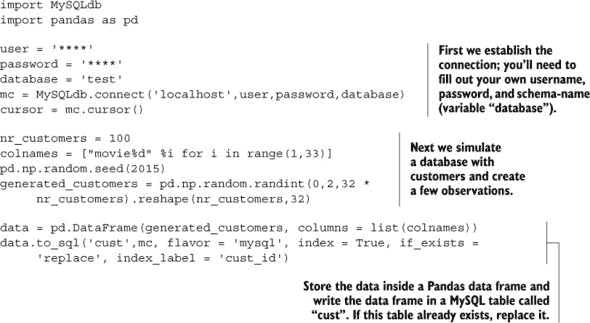

我们创建了 100 个客户，并随机分配他们是否观看过某些电影，总共有 32 部电影。数据最初是在 Pandas 数据框中创建的，但随后被转换成 SQL 代码。注意：运行此代码时可能会遇到警告。警告指出：“带有 DBAPI 连接的“mysql”风味已被弃用，将在未来版本中删除。MySQL 将通过 SQLAlchemy 引擎进一步支持”。您可以随时切换到 SQLAlchemy 或其他库。我们将在其他章节中使用 SQLAlchemy，但在这里使用 MySQLdb 来扩展示例。

为了以后高效查询我们的数据库，我们需要进行额外的数据准备，包括以下事项：

+   创建位字符串。位字符串是列内容的压缩版本（0 和 1 值）。首先，这些二进制值被连接起来；然后，得到的位字符串被重新解释为一个数字。现在这可能听起来很抽象，但在代码中会变得清晰。

+   定义哈希函数。实际上，哈希函数将创建位字符串。

+   向表中添加索引，以加快数据检索。

##### 创建位字符串

现在，你创建一个适合查询的中间表，应用哈希函数，并将位序列表示为十进制数。最后，你可以将它们放入表中。

首先，你需要创建位字符串。你需要将字符串“11111111”转换成二进制或数值，以便汉明函数能够工作。我们选择了数值表示，如下一列表所示。

##### 列表 4.9\. 创建位字符串

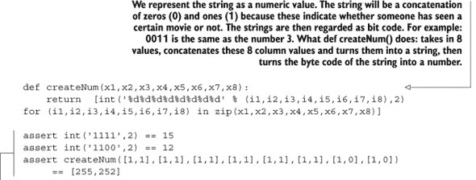

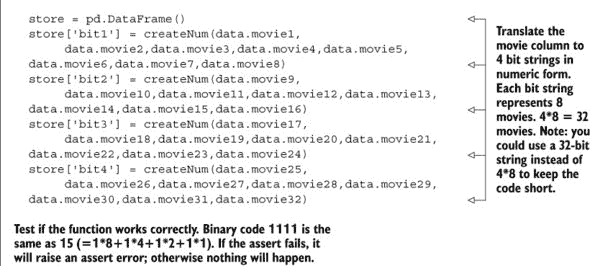

通过将 32 列的信息转换为 4 个数字，我们压缩了它以便后续查找。图 4.11 显示了在询问这种新格式下前两个观察结果（客户电影观看历史）时我们得到的结果。

##### 图 4.11\. 位字符串转换成数字后前两位客户的 32 部电影信息

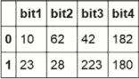

```
store[0:2]
```

下一步是创建哈希函数，因为它们将使我们能够采样我们将使用的数据，以确定两位客户是否有相似的行为。

##### 创建哈希函数

我们创建的哈希函数取客户的电影值。在本案例研究的理论部分，我们决定创建 3 个哈希函数：第一个函数结合了电影 10、5 和 18；第二个结合了电影 7、18 和 22；第三个结合了 16、19 和 30。如果您想选择其他函数，这可以是随机选择的。以下代码列表显示了如何实现这一点。

##### 列表 4.10\. 创建哈希函数

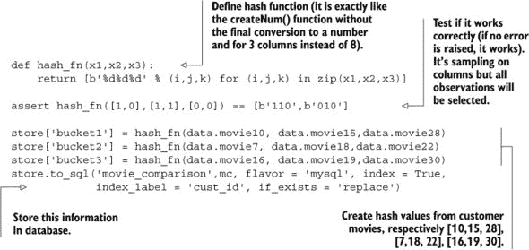

哈希函数将不同电影的价值连接成一个二进制值，就像在`createNum()`函数中之前发生的那样，但这次我们不将其转换为数字，我们只取 3 部电影而不是 8 部电影作为输入。assert 函数显示了它如何为每个观察值连接 3 个值。当客户购买了电影 10 但没有购买电影 15 和 28 时，它将为桶 1 返回 b’100’。当客户购买了电影 7 和 18 但没有购买电影 22 时，它将为桶 2 返回 b’110’。如果我们查看当前结果，我们会看到我们之前创建的 4 个变量（bit1，bit2，bit3，bit4）来自 9 个精选电影（图 4.12）。

##### 图 4.12\. 位字符串压缩和 9 个采样电影的信息

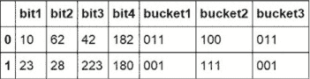

我们将要应用的最后一个技巧是索引客户表，以便查找更快。

##### 向表中添加索引

现在您必须添加索引以加快检索速度，这在实时系统中是必需的。这将在下一个列表中显示。

##### 列表 4.11\. 创建索引

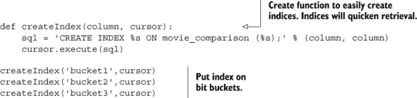

数据索引后，我们现在可以继续到“模型构建部分”。在本案例研究中，没有实现实际的机器学习或统计模型。相反，我们将使用一种更简单的技术：字符串距离计算。可以使用之前在案例研究的理论介绍中解释的汉明距离来比较两个字符串。

#### 4.5.4\. 第 5 步：模型构建

要在数据库中使用汉明距离，我们需要将其定义为函数。

##### 创建汉明距离函数

我们将其实现为一个**用户定义函数**。此函数可以计算 32 位整数（实际上是 4*8）的距离，如下所示。

##### 列表 4.12\. 创建汉明距离

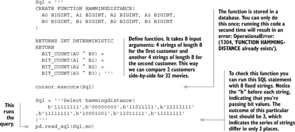

如果一切顺利，此代码的输出应该是 3。

现在我们已经将汉明距离函数定位好，我们可以使用它来找到与给定客户相似的客户，这正是我们希望应用程序所做的。让我们继续到最后一个部分：利用我们的设置作为一种应用程序。

#### 4.5.5\. 第 6 步：展示和自动化

现在我们已经设置好了所有内容，当面对一个给定的客户时，我们的应用程序需要执行两个步骤：

+   寻找类似客户。

+   根据客户已经观看的内容和类似客户的观看历史，建议客户尚未观看的电影。

首先考虑：选择一个幸运的客户。

##### 寻找类似客户

进行实时查询的时间。在以下列表中，客户 27 是那位快乐的客户，他将得到为他选择的下一部电影。但首先我们需要选择具有类似观看历史的客户。

##### 列表 4.13\. 寻找类似客户

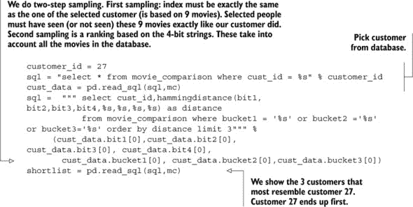

表 4.5 显示客户 2 和 97 与客户 27 最为相似。不要忘记数据是随机生成的，所以任何复制此示例的人可能会得到不同的结果。

##### 表 4.5. 与客户 27 最相似的客户

|   | cust_id | distance |
| --- | --- | --- |
| 0 | 27 | 0 |
| 1 | 2 | 8 |
| 2 | 97 | 9 |

现在，我们终于可以为客户 27 选择一部电影来观看。

##### 寻找一部新电影

我们需要查看客户 27 尚未观看但最近客户已经看过的电影，如下所示。这也是一个很好的检查，看看你的距离函数是否工作正确的机会。尽管这可能不是最近客户，但它与客户 27 非常匹配。通过使用哈希索引，你在查询大型数据库时获得了巨大的速度提升。

##### 列表 4.14. 寻找一部未观看的电影

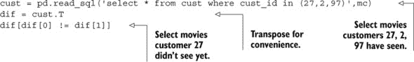

表 4.6 显示你可以根据客户 2 的行为推荐电影 12、15 或 31。

##### 表 4.6. 客户 2 的电影可以作为客户 27 的建议。

|   | 0 | 1 | 2 |
| --- | --- | --- | --- |
| Cust_id | 2 | 27 | 97 |
| Movie3 | 0 | 1 | 1 |
| Movie9 | 0 | 1 | 1 |
| Movie11 | 0 | 1 | 1 |
| Movie12 | 1 | 0 | 0 |
| Movie15 | 1 | 0 | 0 |
| Movie16 | 0 | 1 | 1 |
| Movie25 | 0 | 1 | 1 |
| Movie31 | 1 | 0 | 0 |

任务完成。我们这位快乐的影迷现在可以尽情享受一部新电影，这部电影是根据他的喜好定制的。

在下一章中，我们将查看更大的数据，并看看我们如何使用我们在第一章中下载的 Horton 沙盒来处理这些数据。第一章。

### 4.6. 摘要

本章讨论了以下主题：

+   在处理大数据集时，你可能会遇到的主要 *问题* 如下：

    +   内存不足

    +   长运行程序

    +   形成瓶颈并导致速度问题的资源

+   解决这些问题的三种主要类型 *解决方案* 如下：

    +   调整你的算法。

    +   使用不同的数据结构。

    +   依赖工具和库。

+   可以使用三种主要技术来 *调整算法*：

    +   一次只呈现算法数据的一个观察结果，而不是一次性加载整个数据集。

    +   *将矩阵划分为更小的矩阵* 并使用这些矩阵进行计算。

    +   实现 MapReduce 算法（使用 Python 库如 Hadoopy、Octopy、Disco 或 Dumbo）。

+   数据科学中使用了三种主要 *数据结构*。第一种是包含相对较少信息的一种矩阵类型，即 *稀疏矩阵*。第二种和第三种是数据结构，使你能够在大型数据集中快速检索信息：*哈希函数* 和 *树结构*。

+   Python 有许多可以帮助你处理大型数据集的 *工具*。几个工具可以帮助你处理数据量的大小，其他工具可以帮助你并行化计算，还有一些工具可以克服 Python 本身的相对较慢的速度。Python 也易于用作控制其他数据科学工具的工具，因为 Python 通常被选为实现 API 的语言。

+   计算机科学中的 *最佳实践* 也在数据科学环境中有效，因此应用它们可以帮助你克服在大数据环境中遇到的问题。
