## 第五章\. 大数据的第一步

*本章涵盖*

+   使用两个大数据应用程序：Hadoop 和 Spark 的第一步

+   使用 Python 编写大数据作业

+   构建一个连接到存储在大数据数据库中的数据的交互式仪表板

在过去的两章中，我们稳步增加了数据的大小。在第三章（kindle_split_011.xhtml#ch03）中，我们处理的数据集可以适应计算机的主内存。第四章（kindle_split_012.xhtml#ch04）介绍了处理无法适应内存但仍然可以在单个计算机上处理的数据集的技术。在本章中，你将学习如何使用可以处理如此大量数据的技术，单个节点（计算机）已不再足够。实际上，它甚至可能无法适应一百台计算机。现在，这是一个挑战，不是吗？

我们将尽可能接近前几章的工作方式；重点是让你对在大数据平台上工作充满信心。为此，本章的主要内容是一个案例研究。你将创建一个仪表板，让你可以探索一家银行的贷款人数据。到本章结束时，你将完成以下步骤：

+   将数据加载到最常见的大数据平台 Hadoop 中。

+   使用 Spark 转换和清理数据。

+   将其存储到名为 Hive 的大数据数据库中。

+   使用 Qlik Sense，一个可视化工具，交互式地可视化这些数据。

所有这些（除了可视化）都将通过 Python 脚本进行协调。最终结果是允许你探索数据的仪表板，如图 5.1 所示（#ch05fig01）。

##### 图 5.1\. 交互式 Qlik 仪表板

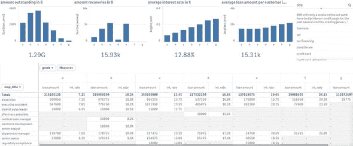

请记住，在本章关于大数据技术的入门章节中，我们只会触及实践和理论的一小部分。案例研究将涉及三种大数据技术（Hadoop、Spark 和 Hive），但仅限于数据处理，而不是模型构建。将你在这里看到的大数据技术与我们在前几章中提到的模型构建技术相结合，将取决于你。

### 5.1\. 使用框架分配数据存储和处理

新的大数据技术，如 Hadoop 和 Spark，使得与计算机集群的交互和工作控制变得更加容易。Hadoop 可以扩展到数千台计算机，创建一个拥有千兆字节存储空间的集群。这使得企业能够掌握大量可用数据的价值。

#### 5.1.1\. Hadoop：存储和处理大数据集的框架

Apache Hadoop 是一个简化与计算机集群工作的框架。它旨在成为以下所有事物以及更多：

+   ***可靠性*** —通过自动创建数据的多个副本并在发生故障时重新部署处理逻辑来确保可靠性。

+   ***容错性*** —它检测故障并应用自动恢复。

+   ***可扩展性*** —数据和其处理分布在计算机集群上（横向扩展）。

+   ***可移植性*** — 可安装在各种硬件和操作系统上。

核心框架由分布式文件系统、资源管理器和运行分布式程序的系统组成。在实践中，它允许你几乎像使用家用计算机的本地文件系统一样轻松地使用分布式文件系统。但在幕后，数据可以在数千个服务器之间分散。

##### Hadoop 的不同组件

在 Hadoop 的核心，我们发现

+   分布式文件系统（HDFS）

+   一种在大型规模上执行程序的方法（MapReduce）

+   管理集群资源的系统（YARN）

此外，还出现了一个应用生态系统（图 5.2），例如 Hive 和 HBase 数据库以及机器学习框架如 Mahout。在本章中，我们将使用 Hive。Hive 使用基于广泛使用的 SQL 的语言与数据库中存储的数据交互。

##### 图 5.2\. Hadoop 核心框架周围出现的应用生态系统的一个示例

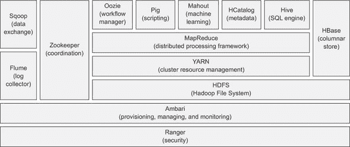

可以使用流行的工具 Impala 以高达 100 倍的速度查询 Hive 数据。本书中不会详细介绍 Impala，但更多信息可以在[`impala.io/`](http://impala.io/)找到。我们已经在第四章（kindle_split_012.xhtml#ch04）中简要介绍了 MapReduce，但在这里让我们详细说明一下，因为它对 Hadoop 来说如此重要。

##### MapReduce：Hadoop 如何实现并行性

Hadoop 使用一种称为 MapReduce 的编程方法来实现并行性。MapReduce 算法将数据分割，并行处理，然后对结果进行排序、合并和汇总。然而，MapReduce 算法不适合交互式分析或迭代程序，因为它在每一步计算之间将数据写入磁盘。当处理大型数据集时，这很昂贵。

让我们看看 MapReduce 在一个小型虚构示例中的工作方式。你是玩具公司的总监。每个玩具都有两种颜色，当客户从网页上订购玩具时，网页会将订单文件放入 Hadoop 中，包含玩具的颜色。你的任务是找出你需要准备多少颜色单元。你将使用 MapReduce 风格的算法来计数颜色。首先让我们看看图 5.3 中的简化版本。

##### 图 5.3\. 计算输入文本中颜色计数的 MapReduce 流程的简化示例

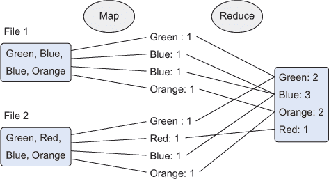

正如其名所示，这个过程大致可以分为两个主要阶段：

+   ***映射阶段*** — 文档被分割成键值对。在我们减少之前，可能会有很多重复。

+   ***减少阶段*** — 这与 SQL 的“分组”操作类似。不同的唯一发生事件被分组在一起，根据减少函数的不同，可以创建不同的结果。在这里，我们想要每个颜色的计数，所以这就是减少函数返回的内容。

实际上，这比这要复杂一些。

整个过程在以下六个步骤中描述，并在图 5.4 中展示。

##### 图 5.4\. 计算输入文本中颜色数量的 MapReduce 流程示例

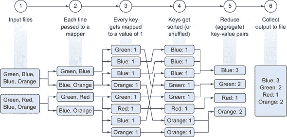

> **1**.  读取输入文件。
> 
> **2**.  将每一行传递给映射器作业。
> 
> **3**.  映射器作业从文件中解析颜色（键）并输出一个文件，其中包含该颜色出现的次数（值）。或者更技术地说，它将一个键（颜色）映射到一个值（出现的次数）。
> 
> **4**.  键被洗牌和排序以方便聚合。
> 
> **5**.  汇总每个颜色的出现次数，并为每个键输出一个包含每个颜色总出现次数的文件。
> 
> **6**.  键被收集到一个输出文件中。

| |
| --- |

##### 注意

虽然 Hadoop 让处理大数据变得容易，但设置一个良好的工作集群仍然不是一件简单的事情，但像 Apache Mesos 这样的集群管理器确实减轻了负担。实际上，许多（中等规模）公司缺乏维护健康 Hadoop 安装的技能。这就是为什么我们将使用 Hortonworks Sandbox，这是一个预安装和配置好的 Hadoop 生态系统。安装说明可以在第 1.5 节中找到：Hadoop 的入门级工作示例。

| |
| --- |

现在，考虑到 Hadoop 的工作原理，让我们来看看 Spark。

#### 5.1.2\. Spark：用更好的性能替换 MapReduce

数据科学家经常进行交互式分析，并依赖于本质上迭代的算法；算法收敛到解决方案可能需要一段时间。由于这是 MapReduce 框架的弱点，我们将介绍 Spark 框架来克服它。Spark 通过一个数量级提高了此类任务的性能。

##### 什么是 Spark？

Spark 是一个类似于 MapReduce 的集群计算框架。然而，Spark 并不处理（分布式）文件系统上的文件存储，也不处理资源管理。为此，它依赖于像 Hadoop 文件系统、YARN 或 Apache Mesos 这样的系统。因此，Hadoop 和 Spark 是互补的系统。对于测试和开发，你甚至可以在本地系统上运行 Spark。

##### Spark 如何解决 MapReduce 的问题？

为了清晰起见，我们对事情进行了一些简化，但 Spark 在你的集群计算机之间创建了一种共享的 RAM 内存。这使得不同的工作者可以共享变量（及其状态），从而消除了将中间结果写入磁盘的需要。更技术性地，如果你感兴趣的话：Spark 使用弹性分布式数据集（RDD），这是一种分布式内存抽象，允许程序员以容错的方式在大型集群上执行内存计算.^([1]) 因为它是一个内存系统，所以避免了昂贵的磁盘操作。

> ¹
> 
> 见 [`www.cs.berkeley.edu/~matei/papers/2012/nsdi_spark.pdf`](https://www.cs.berkeley.edu/~matei/papers/2012/nsdi_spark.pdf)。

##### Spark 生态系统中的不同组件

Spark 核心提供了一个非常适合交互式、探索性分析的 NoSQL 环境。Spark 可以以批处理和交互式模式运行，并支持 Python。

Spark 有四个其他大型组件，如下所示，并在 图 5.5 中展示。

##### 图 5.5\. 使用 Hadoop 框架结合 Spark 框架时的 Spark 框架

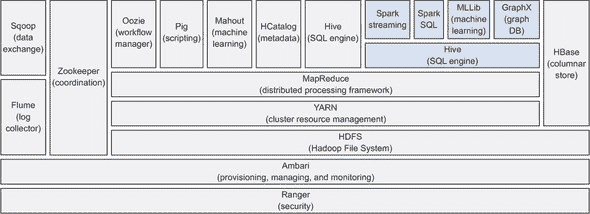

> **1**. Spark streaming 是一个用于实时分析的工具。
> 
> **2**. Spark SQL 提供了与 Spark 一起工作的 SQL 接口。
> 
> **3**. MLLib 是 Spark 框架内机器学习的工具。
> 
> **4**. GraphX 是 Spark 的图数据库。我们将在 第七章 中更深入地探讨图数据库。

现在让我们用 Hadoop、Hive 和 Spark 来浅尝贷款数据。

### 5.2. 案例研究：在贷款时评估风险

在对 Hadoop 和 Spark 有基本了解的基础上，我们现在可以开始接触大数据了。本案例研究的目的是让我们对在本章中较早介绍的技术有一个初步的体验，并看到在很大一部分情况下，你可以（但不必）像使用其他技术一样工作。注意：这里使用的数据量不是很大，因为这需要收集它需要大量的带宽，并且需要多个节点来跟随示例。

我们将使用

+   Horton Sandbox 在虚拟机上。如果你还没有将其下载并导入到虚拟机软件（如 VirtualBox）中，请回到 第 1.5 节，那里有相关说明。在编写本章时使用了 Horton Sandbox 的 2.3.2 版本。

+   Python 库：Pandas 和 pywebhdsf。这次你不需要在本地虚拟环境中安装它们；我们需要它们直接在 Horton Sandbox 上。因此，我们需要启动 Horton Sandbox（例如在 VirtualBox 上）并进行一些准备。

在 Sandbox 命令行中，还有一些事情你需要做才能使这一切都工作，所以连接到命令行。你可以使用像 PuTTY 这样的程序来完成这个任务。如果你不熟悉 PuTTY，它提供了一个到服务器的命令行界面，并且可以免费从 [`www.chiark.greenend.org.uk/~sgtatham/putty/download.html`](http://www.chiark.greenend.org.uk/~sgtatham/putty/download.html) 下载。

PuTTY 登录配置如图 5.6 所示。

##### 图 5.6\. 使用 PuTTY 连接到 Horton Sandbox

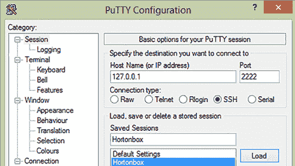

默认用户名和密码（在编写本书时）分别是“root”和“hadoop”。不过，你需要在第一次登录时更改此密码。

连接成功后，执行以下命令：

+   **`yum -y install python-pip`** — 这将安装 pip，一个 Python 软件包管理器。

+   **`pip install git+https://github.com/DavyCielen/pywebhdfs.git –upgrade`** —在撰写本文时，pywebhdfs 库存在问题，我们在这次分支中修复了它。希望你在阅读本文时不再需要它；问题已经报告，应该由该包的维护者解决。

+   **`pip install pandas`** —安装 Pandas。这通常需要一段时间，因为存在依赖关系。

可供你打开的.ipynb 文件可以在 Jupyter 或（较老的）Ipython 中使用，并跟随本章中的代码。Horton Sandbox 的设置说明在那里重复；请确保直接在 Horton Sandbox 上运行代码。现在，准备工作已经完成，让我们看看我们需要做什么。

在这个练习中，我们将通过更多数据科学流程步骤：

步骤 1：研究目标。这包括两个部分：

+   为我们的经理提供仪表板

+   为其他人准备数据以创建他们自己的仪表板

步骤 2：数据检索

+   从 Lending Club 网站下载数据

+   将数据放在 Horton Sandbox 的 Hadoop 文件系统中

步骤 3：数据准备

+   使用 Spark 转换这些数据

+   将准备好的数据存储在 Hive 中

步骤 4 & 6：探索和报告创建

+   使用 Qlik Sense 可视化数据

在本案例研究中，我们没有建立模型，但如果你想要的话，你将拥有自己建立模型的基础设施。例如，你可以使用 SPARK 机器学习来尝试预测某人何时会违约。

是时候认识 Lending Club 了。

#### 5.2.1\. 步骤 1：研究目标

Lending Club 是一个将需要贷款的人与有资金投资的人连接起来的组织。你的老板也有资金可以投资，在投入大量资金之前，他需要信息。为此，你将为他创建一份报告，让他了解向某个人贷款的平均评级、风险和回报。通过这个过程，你使数据在仪表板工具中变得可访问，从而使得其他人也能探索这些数据。从某种意义上说，这是本案例的次要目标：开放数据以实现自助式商业智能。自助式商业智能通常应用于没有分析师可用的数据驱动型组织。组织中的任何人都能够自己进行简单的切片和切块，而将更复杂的分析留给数据科学家。

我们可以进行这个案例研究，因为 Lending Club 提供了现有贷款的匿名数据。在本案例研究结束时，你将创建一个类似于图 5.7 的报告。

##### 图 5.7\. 本练习的最终结果是用于比较贷款机会的解释性仪表板。

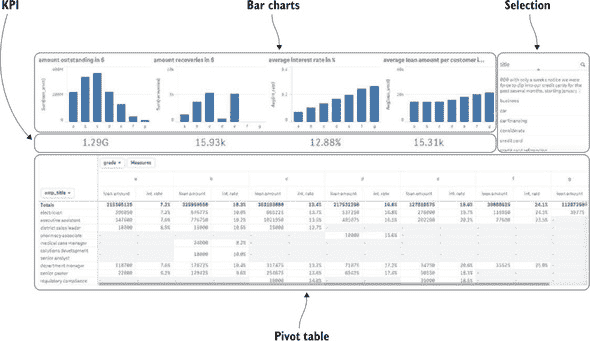

首先，让我们获取数据。

#### 5.2.2\. 步骤 2：数据检索

是时候与 Hadoop 文件系统（或 hdfs）一起工作了。首先，我们将通过命令行发送命令，然后通过 Python 脚本语言（借助 pywebhdfs 包）发送命令。

Hadoop 文件系统类似于一个正常的文件系统，除了文件和文件夹存储在多个服务器上，你不知道每个文件的物理地址。如果你使用过 Dropbox 或 Google Drive 等工具，这并不陌生。你放在这些驱动器上的文件存储在服务器上的某个地方，但你不知道确切在哪个服务器上。就像在正常文件系统中一样，你可以创建、重命名和删除文件和文件夹。

##### 使用命令行与 Hadoop 文件系统交互

让我们首先使用命令行检索 Hadoop 根目录下当前存在的目录和文件列表。在 PuTTY 中输入命令 `hadoop fs –ls /` 来实现这一点。

确保在尝试连接之前启动你的 Hortonworks Sandbox 虚拟机。在 PuTTY 中，你应该连接到 127.0.0.1:2222，如之前在图 5.6 中所示。

Hadoop 命令的输出显示在图 5.8 中。你还可以添加如 `hadoop fs –ls –R /` 这样的参数来获取所有文件和子目录的递归列表。

##### 图 5.8\. Hadoop 列表命令的输出：hadoop fs –ls /。Hadoop 根目录被列出。

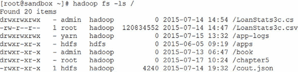

现在，我们将在 hdfs 上创建一个新的目录“chapter5”，以便在本章中使用。以下命令将创建新目录并允许每个人访问文件夹：

```
sudo -u hdfs hadoop fs -mkdir /chapter5
sudo -u hdfs hadoop fs –chmod 777 /chapter5
```

你可能已经注意到了这里的模式。Hadoop 命令与我们的本地文件系统命令（POSIX 风格）非常相似，但以 Hadoop fs 开头，每个命令前都有一个破折号 -。表 5.1 提供了 Hadoop 上流行的文件系统命令及其本地文件系统命令对应关系的概述。

##### 表 5.1\. 常见 Hadoop 文件系统命令列表

| 目标 | Hadoop 文件系统命令 | 本地文件系统命令 |
| --- | --- | --- |
| 从目录中获取文件和目录列表 | hadoop fs –ls URI | ls URI |
| 创建目录 | hadoop fs –mkdir URI | mkdir URI |
| 删除目录 | hadoop fs –rm –r URI | rm –r URI |
| 修改文件权限 | hadoop fs –chmod MODE URI | chmod MODE URI |
| 移动或重命名文件 | hadoop fs –mv OLDURI NEWURI | mv OLDURI NEWURI |

你会经常使用两个特殊命令。这些是

+   从本地文件系统上传文件到分布式文件系统（`hadoop fs –put LOCALURI REMOTEURI`）。

+   从分布式文件系统下载文件到本地文件系统（`hadoop –get REMOTEURI`）。

让我们用一个例子来澄清这一点。假设你在 Linux 虚拟机上有一个 .CSV 文件，你通过这个虚拟机连接到 Linux Hadoop 集群。你想要将 .CSV 文件从你的 Linux 虚拟机复制到集群的 hdfs。使用命令 `hadoop –put mycsv.csv /data`。

使用 PuTTY，我们可以在 Horton Sandbox 上启动一个 Python 会话，使用 Python 脚本检索我们的数据。在命令行中输入“`pyspark`”命令以启动会话。如果一切顺利，你应该会看到如图 5.9 所示的欢迎屏幕。

##### 图 5.9\. Spark 与 Python 交互使用的欢迎屏幕

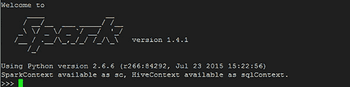

现在我们使用 Python 代码来为我们获取数据，如下所示。

##### 列表 5.1\. 绘制 Lending Club 贷款数据

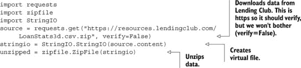

我们从 Lending Club 的网站 [`resources.lendingclub.com/LoanStats3d.csv.zip`](https://resources.lendingclub.com/LoanStats3d.csv.zip) 下载了文件“LoanStats3d.csv.zip”并解压它。我们使用 requests、zipfile 和 stringio Python 包中的方法分别下载数据、创建虚拟文件和解压它。这只是一个单个文件；如果你想要所有数据，你可以创建一个循环，但为了演示目的，这样就可以了。正如我们之前提到的，这个案例研究的一个重要部分将是使用大数据技术进行数据准备。然而，在我们这样做之前，我们需要将其放在 Hadoop 文件系统中。PyWebHdfs 是一个包，允许你从 Python 与 Hadoop 文件系统交互。它将你的命令翻译并传递给 webhdfs 接口的 rest 调用。这很有用，因为你可以使用你喜欢的脚本语言来自动化任务，如下所示。

##### 列表 5.2\. 在 Hadoop 上存储数据

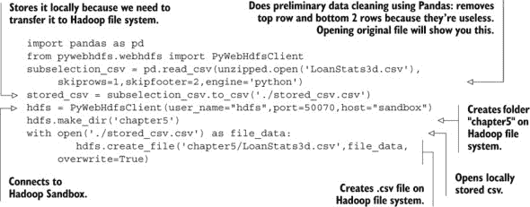

我们已经在 列表 5.1 中下载并解压了文件；现在在 列表 5.2 中，我们使用 Pandas 对数据进行子选择并存储到本地。然后我们在 Hadoop 上创建了一个目录，并将本地文件传输到 Hadoop。下载的数据是 .CSV 格式，因为它相对较小，我们可以使用 Pandas 库从文件中删除第一行和最后两行。这些行包含注释，在 Hadoop 环境中处理此文件会变得繁琐。我们的代码的第一行导入了 Pandas 包，第二行将文件解析到内存中并删除第一行和最后两行数据。第三行代码将数据保存到本地文件系统以供以后使用和检查。

在继续之前，我们可以使用以下代码行检查我们的文件：

```
print hdfs.get_file_dir_status('chapter5/LoanStats3d.csv')
```

PySpark 控制台应该会告诉我们我们的文件在 Hadoop 系统上是安全且良好的，如图 5.10 所示。

##### 图 5.10\. 通过 PySpark 控制台在 Hadoop 上检索文件状态

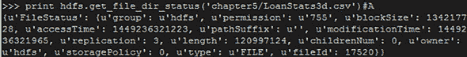

文件已经准备好并等待我们在 Hadoop 上进行数据准备，因为数据还不够干净，不能直接存储到 Hive。

#### 5.2.3\. 第 3 步：数据准备

现在我们已经下载了用于分析的数据，在将其存储到 Hive 之前，我们将使用 Spark 对数据进行清理。

##### Spark 中的数据准备

清洗数据通常是一个交互式练习，因为你发现了问题并修复了问题，你可能会在得到干净清晰的数据之前这样做几次。一个脏数据的例子可能是一个像“UsA”这样的字符串，它被错误地大写。在这个时候，我们不再在 jobs.py 中工作，而是使用 PySpark 命令行界面直接与 Spark 交互。

Spark 非常适合这种交互式分析，因为它不需要在每一步后保存数据，并且比 Hadoop 在服务器之间共享数据（一种分布式内存）有更好的模型。

转换包括四个部分：

> **1**. 启动 PySpark（应该仍然在第 5.2.2 节中打开）并加载 Spark 和 Hive 上下文。
> 
> **2**. 读取并解析 .CSV 文件。
> 
> **3**. 从数据中分割标题行。
> 
> **4**. 清洗数据。

好的，让我们进入正题。下面的列表显示了 PySpark 控制台中代码的实现。

##### 列表 5.3\. 连接到 Apache Spark


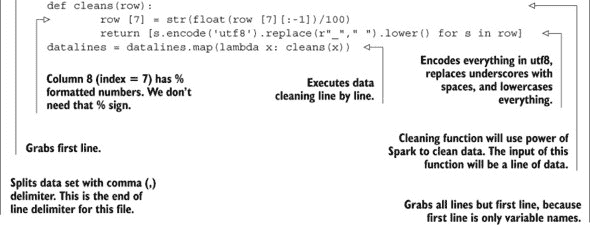

让我们进一步深入了解每个步骤的细节。

##### 第 1 步：以交互模式启动 Spark 并加载上下文

在 PySpark 控制台中不需要导入 Spark 上下文，因为上下文作为变量 `sc` 可用。你可能已经注意到，在打开 PySpark 时也提到了这一点；如果你错过了，请查看图 5.9。然后我们加载一个 Hive 上下文，以便我们可以交互式地使用 Hive。如果你交互式地使用 Spark，Spark 和 Hive 上下文会自动加载，但如果你想以批处理模式使用它，你需要手动加载。要在批处理中提交代码，请在 Horton Sandbox 命令行上使用 `spark-submit filename.py` 命令。

```
from pyspark import SparkContext
from pyspark.sql import HiveContext
sc = SparkContext()
sqlContext = HiveContext(sc)
```

环境设置完毕后，我们准备开始解析 .CSV 文件。

##### 第 2 步：读取和解析 .CSV 文件

接下来，我们从 Hadoop 文件系统中读取文件，并在遇到的每个逗号处分割它。在我们的代码中，第一行从 Hadoop 文件系统中读取 .CSV 文件。第二行在遇到逗号时分割每一行。我们的 .CSV 解析器设计上是天真的，因为我们正在学习 Spark，但你也可以使用 .CSV 包来帮助你更正确地解析一行。

```
data = sc.textFile("/chapter5/LoanStats3d.csv")
parts = data.map(lambda r:r.split(','))
```

注意这与函数式编程方法是多么相似。对于那些从未遇到过它的人来说，你可以天真地读 `lambda r:r.split(',')` 为“对于每个输入 r（在这种情况下是一行），当它遇到逗号时分割这个输入 r。”就像在这种情况下，“对于每个输入”意味着“对于每一行”，但你也可以把它读作“通过逗号分割每一行。”这种类似函数的语法是 Spark 我最喜欢的特性之一。

##### 第 3 步：从数据中分割标题行

为了将标题与数据分开，我们读取第一行并保留与标题行不相似的每一行：

```
firstline = parts.first()
datalines = parts.filter(lambda x:x != firstline)
```

遵循大数据的最佳实践，我们不需要执行此步骤，因为第一行已经存储在单独的文件中。实际上，.CSV 文件通常包含标题行，你需要在开始清理数据之前执行类似的操作。

##### 第 4 步：清理数据

在这一步中，我们执行基本的清理以增强数据质量。这使我们能够构建更好的报告。

在第二步之后，我们的数据由数组组成。现在我们将每个 lambda 函数的输入视为一个数组，并返回一个数组。为了简化这项任务，我们构建了一个辅助函数来清理。我们的清理包括将输入“10,4%”重新格式化为 0.104，将每个字符串编码为 utf-8，以及将下划线替换为空格并将所有字符串转换为小写。第二行代码为数组中的每一行调用我们的辅助函数。

```
def cleans(row):
        row [7] = str(float(row [7][:-1])/100)
        return [s.encode('utf8').replace(r"_"," ").lower() for s in row]
datalines = datalines.map(lambda x: cleans(x))
```

我们的数据现在已准备好用于报告，因此我们需要使其对我们的报告工具可用。Hive 非常适合此目的，因为许多报告工具都可以连接到它。让我们看看如何完成这项任务。

##### 在 Hive 中保存数据

要在 Hive 中存储数据，我们需要完成两个步骤：

> **1**. 创建并注册元数据。
> 
> **2**. 执行 SQL 语句以在 Hive 中保存数据。

在本节中，我们将再次在我们的挚爱 PySpark shell 中执行下一块代码，如下所示。

##### 列表 5.4\. 在 Hive 中存储数据（完整）

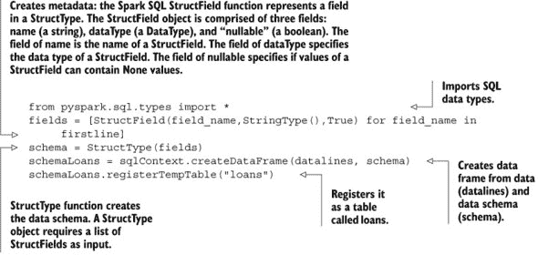

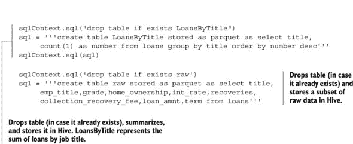

让我们深入每个步骤以获得更多的澄清。

##### 第 1 步：创建并注册元数据

许多人更喜欢在处理数据时使用 SQL。使用 Spark 也是可能的。你甚至可以直接读取和存储数据在 Hive 中，就像我们将会做的那样。然而，在这样做之前，你需要创建包含每个列的列名和列类型的元数据。

第一行代码是导入。第二行解析字段名和字段类型，并指定字段是否为必需的。`StructType` 将行表示为一个结构字段的数组。然后你将其放置在一个注册为（临时）表的 dataframe 中。

```
from pyspark.sql.types import *
fields = [StructField(field_name,StringType(),True) for field_name in firstline]
schema = StructType(fields)
schemaLoans = sqlContext.createDataFrame(datalines, schema)
schemaLoans.registerTempTable("loans")
```

元数据准备就绪后，我们现在能够将数据插入到 Hive 中。

##### 第 2 步：执行查询并将表存储在 Hive 中

现在我们已经准备好在数据上使用 SQL 语法。首先，我们将创建一个汇总表，统计每个目的的贷款数量。然后，我们将清洗后的原始数据的一个子集存储在 Hive 中，以便在 Qlik 中进行可视化。

执行类似 SQL 的命令就像传递一个包含 SQL 命令的字符串到 `sqlContext.sql` 函数一样简单。请注意，我们不是在编写纯 SQL，因为我们正在直接与 Hive 通信。Hive 有自己的 SQL 语法，称为 HiveQL。在我们的 SQL 中，例如，我们立即告诉它将数据存储为 Parquet 文件。Parquet 是一种流行的大数据文件格式。

```
sqlContext.sql("drop table if exists LoansByTitle")
sql = '''create table LoansByTitle stored as parquet as select title,
     count(1) as number from loans group by title order by number desc'''
sqlContext.sql(sql)

sqlContext.sql('drop table if exists raw')
sql = '''create table raw stored as parquet as select title,
     emp_title,grade,home_ownership,int_rate,recoveries,collection_recovery_f
     ee,loan_amnt,term from loans'''
sqlContext.sql(sql)
```

数据存储在 Hive 中后，我们可以将我们的可视化工具连接到它。

#### 5.2.4\. 第 4 步：数据探索 & 第 6 步：报告构建

我们将使用 Qlik Sense 构建一个交互式报告，以展示给我们的经理。在订阅他们的网站后，可以从[`www.qlik.com/try-or-buy/download-qlik-sense`](http://www.qlik.com/try-or-buy/download-qlik-sense)下载 Qlik Sense。下载开始时，您将被重定向到一个包含有关如何安装和使用 Qlik Sense 的多个信息视频的页面。建议您先观看这些视频。

我们使用 Hive ODBC 连接器从 Hive 读取数据并将其提供给 Qlik。有关在 Qlik 中安装 ODBC 连接器的教程可用。对于主要操作系统，这可以在[`hortonworks.com/hdp/addons/`](http://hortonworks.com/hdp/addons/)找到。


##### 注意

在 Windows 上，这可能不会立即工作。一旦安装了 ODBC，请确保检查您的 Windows ODBC 管理器（按 CTRL+F 并查找 ODBC）。在管理器中，转到“系统-DSN”并选择“Sample Hive Hortonworks DSN”。确保您的设置正确（如图图 5.11 所示），否则 Qlik 将无法连接到 Hortonworks Sandbox。

##### 图 5.11\. Windows Hortonworks ODBC 配置

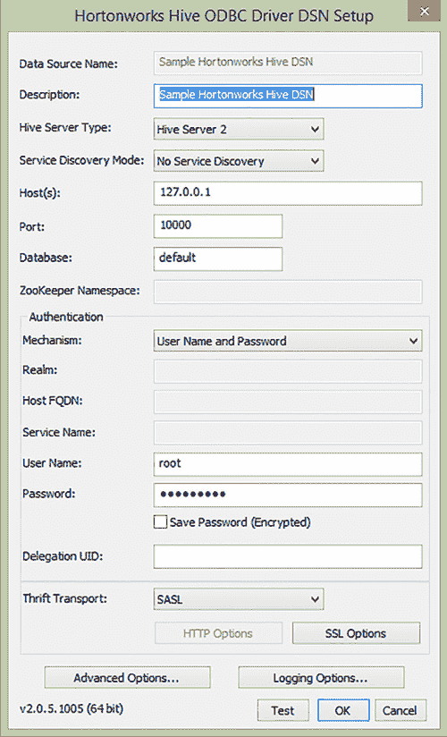


希望您没有忘记 Sandbox 密码；如图 5.11 所示，您还需要它。

现在打开 Qlik Sense。如果在 Windows 上安装，您应该在桌面上获得将.exe 快捷方式放置在桌面上的选项。Qlik 不是免费软件；它是一个商业产品，为单个客户提供诱饵版本，但就目前而言，它足够了。在最后一章中，我们将使用免费的 JavaScript 库创建仪表板。

Qlik 可以直接将数据加载到内存中，或者每次都调用 Hive。我们选择了第一种方法，因为它更快。

这部分有三个步骤：

> **1**. 使用 ODBC 连接在 Qlik 中加载数据。
> 
> **2**. 创建报告。
> 
> **3**. 探索数据。

让我们从第一步开始，将数据加载到 Qlik 中。

##### 步骤 1：在 Qlik 中加载数据

当您启动 Qlik Sense 时，它将显示一个包含现有报告（称为应用）的欢迎屏幕，如图图 5.12 所示。

##### 图 5.12\. Qlik Sense 欢迎屏幕


要启动一个新的应用，请点击屏幕右侧的“创建新应用”按钮，如图图 5.13 所示。这会打开一个新的对话框。将我们的应用的新名称输入为“第五章”。

##### 图 5.13\. 创建新应用的消息框

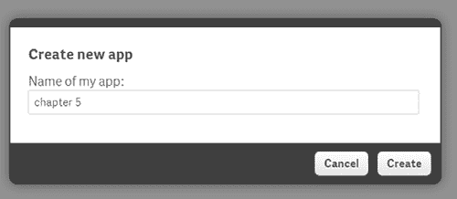

如果应用创建成功，将出现一个确认框（图 5.14）。

##### 图 5.14\. 一个框确认应用已成功创建。

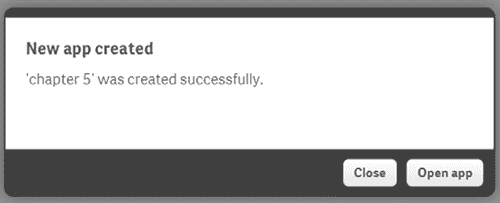

点击“打开应用”按钮，将弹出一个新屏幕，提示您向应用添加数据（图 5.15）。

##### 图 5.15\. 当您打开新应用时，会弹出添加数据屏幕。

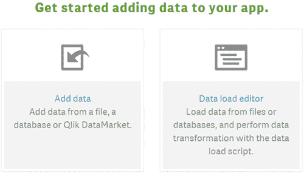

点击“添加数据”按钮，选择 ODBC 作为数据源（图 5.16）。

##### 图 5.16\. 在选择数据源屏幕中选择 ODBC 作为数据源

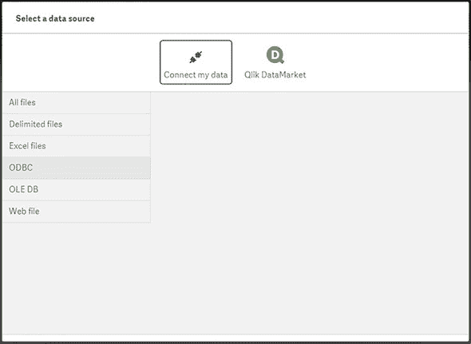

在下一屏（图 5.17）中选择用户 DSN，Hortonworks，并将根目录指定为用户名，密码为 hadoop（或您首次登录 Sandbox 时提供的密码）。

##### 图 5.17\. 在用户 DSN 中选择 Hortonworks 并指定用户名和密码。

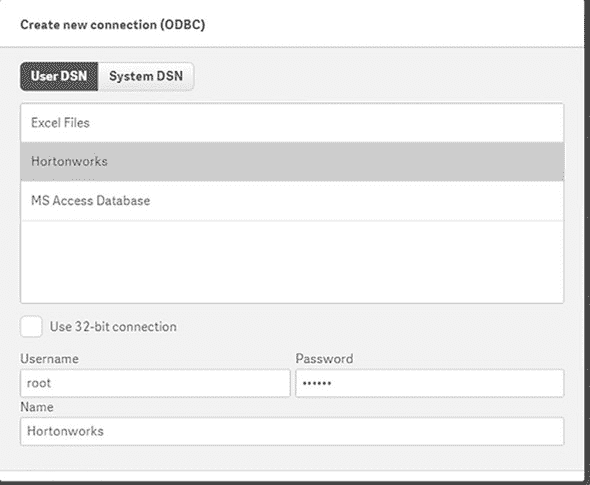

| |
| --- |

##### 备注

Hortonworks 选项默认不显示。您需要安装 HDP 2.3 ODBC 连接器才能使此选项显示（如前所述）。如果您在此阶段尚未成功安装它，可以在[`blogs.perficient.com/multi-shoring/blog/2015/09/29/how-to-connect-hortonworks-hive-from-qlikview-with-odbc-driver/`](https://blogs.perficient.com/multi-shoring/blog/2015/09/29/how-to-connect-hortonworks-hive-from-qlikview-with-odbc-driver/)找到有关此的详细说明。

| |
| --- |

点击指向右侧的箭头以进入下一屏。

在下一屏（图 5.18）中选择 Hive 数据，默认为用户。选择“原始”作为表以选择，并选择所有列进行导入；然后点击“加载并完成”按钮以完成此步骤。

##### 图 5.18\. Hive 界面原始数据列概述

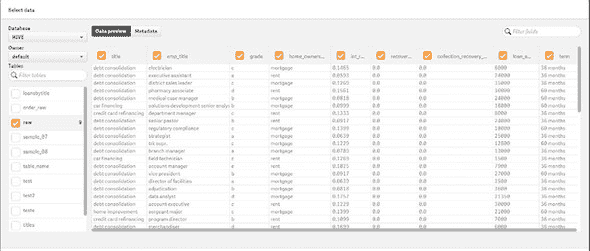

此步骤之后，将花费几秒钟时间在 Qlik 中加载数据（图 5.19）。

##### 图 5.19\. 数据已加载到 Qlik 的确认

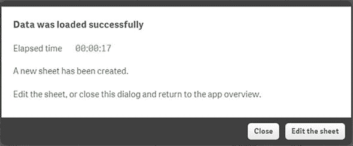

##### 第 2 步：创建报告

选择“编辑工作表”以开始构建报告。这将添加报告编辑器（图 5.20）。

##### 图 5.20\. 报告编辑器屏幕

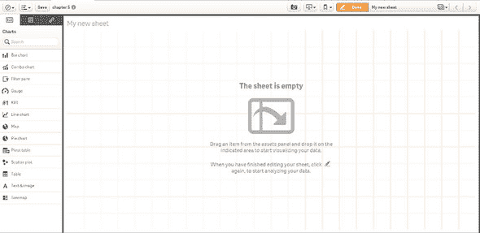

**子步骤 1：向报告中添加选择过滤器** 我们将首先向报告中添加一个选择框，以显示每个人为什么想要贷款。为此，将左侧资产面板中的标题度量拖放到报告面板，并给它一个舒适的大小和位置（图 5.21）。点击字段表，以便您可以拖放字段。

##### 图 5.21\. 将标题从左侧字段窗格拖动到报告窗格。

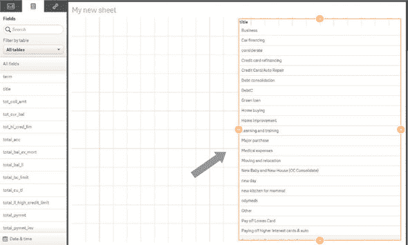

**子步骤 2：向报告中添加 KPI** KPI 图表显示了所选总人口的聚合数值。图表中显示了平均利率和客户总数等数值（图 5.22）。

##### 图 5.22\. KPI 图表的示例

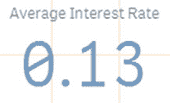

向报告中添加 KPI 需要四个步骤，如下所示，并在图 5.23 中展示。

##### 图 5.23\. 向 Qlik 报告中添加 KPI 图表的四个步骤

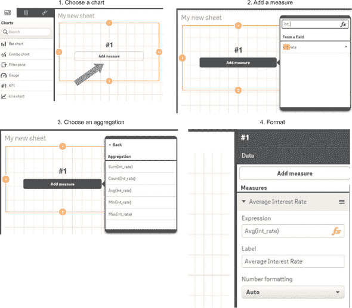

> **1**.  *选择一个图表*—选择 KPI 作为图表，并将其放置在报告屏幕上；根据您的喜好调整大小和位置。
> 
> **2**.  *添加一个度量*—点击图表内的添加度量按钮，并选择 int_rate。
> 
> **3**.  *选择一个聚合方法*—Avg(int_rate).
> 
> **4**.  *格式化图表*—在右侧面板中，填写平均利率作为标签。

总共我们将向报告中添加四个关键绩效指标图表，因此您需要为以下关键绩效指标重复这些步骤：

+   平均利率

+   总贷款金额

+   平均贷款金额

+   总回收金额

**子步骤 3：将柱状图添加到报告中** 接下来，我们将向报告中添加四个柱状图。这些图表将展示每个风险等级的不同数值。一个柱状图将解释每个风险组的平均利率，另一个将显示每个风险组的总贷款金额（图 5.24）。

##### 图 5.24\. 柱状图的示例

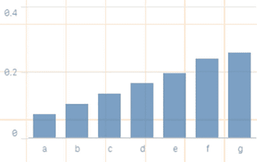

将柱状图添加到报告中需要五个步骤，如下所示，并在图 5.25 中展示。

##### 图 5.25\. 添加柱状图需要五个步骤。

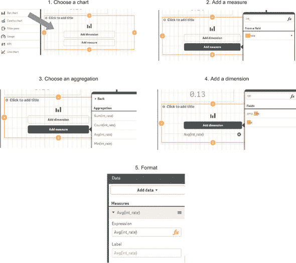

> **1**.  *选择图表*—选择柱状图作为图表，并将其放置在报告屏幕上；根据您的喜好调整大小和位置。
> 
> **2**.  *添加度量值*—点击图表内的“添加度量值”按钮，并选择 int_rate。
> 
> **3**.  *选择聚合方法*—Avg(int_rate)。
> 
> **4**.  *添加维度*—点击“添加维度”，并选择 grade 作为维度。
> 
> **5**.  *格式化图表*—在右侧面板中，填写平均利率作为标签。

重复此程序，以下维度和度量值组合：

+   每个等级的平均利率

+   每个等级的平均贷款金额

+   每个等级的总贷款金额

+   每个等级的总回收金额

**子步骤 4：将交叉表添加到报告中** 假设您想知道风险组 C 的董事支付的平均利率。在这种情况下，您需要为两个维度（职位和风险等级）的组合获取一个度量值（利率）。这可以通过如图 5.26 所示的交叉表实现。

##### 图 5.26\. 交叉表的示例，显示了按职位/风险等级组合支付的平均利率

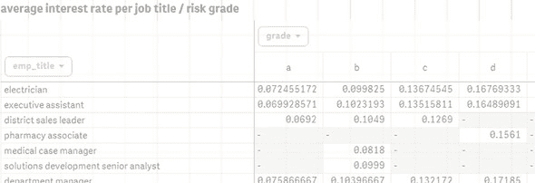

将交叉表添加到报告中需要六个步骤，如下所示，并在图 5.27 中展示。

##### 图 5.27\. 将交叉表添加到报告中需要六个步骤。

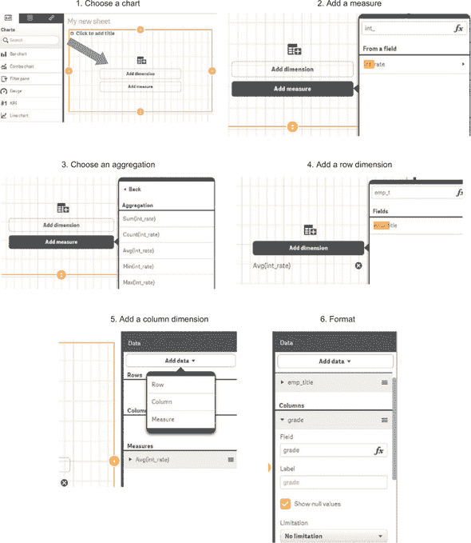

> **1**.  *选择图表*—选择交叉表作为图表，并将其放置在报告屏幕上；根据您的喜好调整大小和位置。
> 
> **2**.  *添加度量值*—点击图表内的“添加度量值”按钮，并选择 int_rate。
> 
> **3**.  *选择聚合方法*—Avg(int_rate)。
> 
> **4**.  *添加行维度*—点击“添加维度”，并选择 emp_title 作为维度。
> 
> **5**.  *添加列维度*—点击“添加数据”，选择列，并选择 grade。
> 
> **6**.  *格式化图表*—在右侧面板中，填写平均利率作为标签。

调整大小和重新定位后，您应该得到一个类似于图 5.28 的结果。点击左侧的“完成”按钮，您就可以开始探索数据了。

##### 图 5.28\. 编辑模式下的最终结果

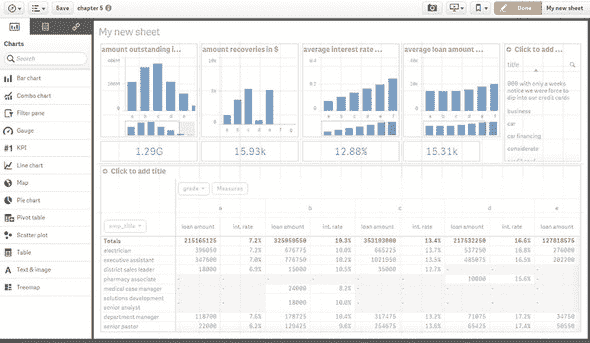

##### 步骤 3：探索数据

结果是一个根据你选择的选项自动更新的交互式图表。你为什么不尝试从导演那里寻找信息，并将它们与艺术家进行比较呢？为了实现这一点，点击交叉表中的 emp_title 并在搜索字段中输入导演。结果看起来像图 5.29。以同样的方式，我们可以查看艺术家，如图图 5.30 所示。另一个有趣的见解来自于比较用于购房目的的评级与债务重组目的的评级。

##### 图 5.29\. 当我们选择导演时，我们可以看到他们为贷款支付的平均利率为 11.97%。

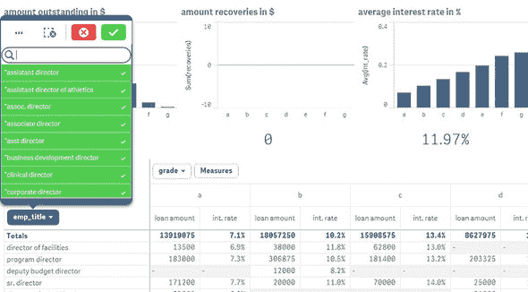

##### 图 5.30\. 当我们选择艺术家时，我们看到他们为贷款支付的平均利率为 13.32%。

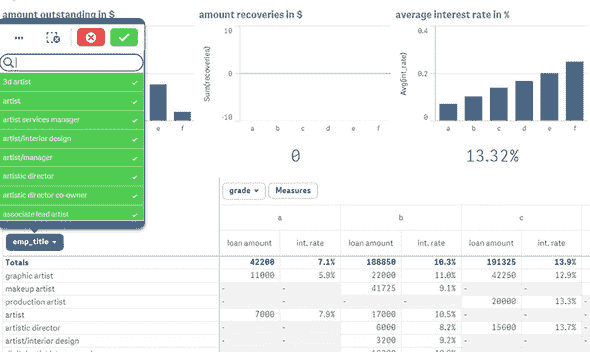

我们终于做到了：我们创建了经理渴望的报告，在这个过程中，我们也为其他人使用这些数据创建自己的报告打开了大门。你可以思考的一个有趣的下一步是使用这个设置来找到那些可能违约债务的人。为此，你可以使用由在线算法驱动的 Spark 机器学习功能，如第四章中演示的那样章节 4。

在本章中，我们亲身体验了 Hadoop 和 Spark 框架。我们覆盖了很多内容，但说实话，Python 使得与大数据技术打交道变得极其简单。在下一章中，我们将更深入地探讨 NoSQL 数据库的世界，并接触到更多的大数据技术。

### 5.3\. 摘要

在本章中，你了解到

+   Hadoop 是一个框架，它使你能够存储文件并在多台计算机之间分配计算。

+   Hadoop 为你隐藏了与计算机集群一起工作的所有复杂性。

+   Hadoop 和 Spark 周围围绕着一系列的应用生态系统，从数据库到访问控制。

+   Spark 向 Hadoop 框架中添加了一个更适合数据科学工作的共享内存结构。

+   在本章案例研究中，我们使用了 PySpark（一个 Python 库）从 Python 与 Hive 和 Spark 通信。我们使用了 pywebhdfs Python 库来与 Hadoop 库一起工作，但你也可以使用操作系统命令行来完成这项工作。

+   将 BI 工具如 Qlik 连接到 Hadoop 非常容易。
