## 第六章. 加入 NoSQL 运动

*本章涵盖*

+   理解 NoSQL 数据库及其为何在今天被使用

+   识别 NoSQL 数据库和关系型数据库之间的差异

+   定义 ACID 原则及其与 NoSQL BASE 原则的关系

+   学习 CAP 定理对于多节点数据库设置的重要性

+   将数据科学流程应用于使用 NoSQL 数据库 Elasticsearch 的项目

本章分为两部分：理论开始和实际结束。

+   在本章的第一部分，我们将探讨 NoSQL 数据库的一般情况，并回答以下问题：为什么它们存在？为什么直到最近才出现？有哪些类型，为什么你应该关心？

+   在第二部分，我们将解决一个现实生活中的问题——疾病诊断和画像——使用免费数据、Python 和 NoSQL 数据库。

毫无疑问，你已经听说过 NoSQL 数据库以及它们被许多高科技公司虔诚地使用。但 NoSQL 数据库是什么，它们与您所习惯的关系型或 SQL 数据库有什么不同？*NoSQL*代表的是*Not Only Structured Query Language*，尽管 NoSQL 数据库确实可以让你用 SQL 查询它们，但你不必专注于这个名字。关于这个名字的争论已经很多，甚至有人质疑这一组新数据库是否应该有一个集体名称。相反，让我们看看它们与*关系型数据库管理系统（RDBMS）*相比代表了什么。传统的数据库驻留在单个计算机或服务器上。只要你的数据没有超出你的服务器，这曾经是可以的，但现在对许多公司来说已经不再是这种情况了。随着互联网的增长，像谷歌和亚马逊这样的公司感到这些单节点数据库限制了它们，并寻求替代方案。

许多公司使用单节点 NoSQL 数据库，例如 MongoDB，因为它们想要灵活的架构或能够分层聚合数据。以下是一些早期的例子：

+   谷歌的第一个 NoSQL 解决方案是 Google BigTable，这标志着*列式数据库*的开始。^([1])

    > ¹
    > 
    > 查看[`static.googleusercontent.com/media/research.google.com/en//archive/bigtable-osdi06.pdf`](http://static.googleusercontent.com/media/research.google.com/en//archive/bigtable-osdi06.pdf)。

+   亚马逊提出了 Dynamo，*一个键值存储器*。^([2])

    > ²
    > 
    > 查看[`www.allthingsdistributed.com/files/amazon-dynamo-sosp2007.pdf`](http://www.allthingsdistributed.com/files/amazon-dynamo-sosp2007.pdf)。

+   在追求分区的过程中，出现了两种更多的数据库类型：*文档存储*和*图数据库*。

我们将在本章后面详细讨论这四种类型。

请注意，尽管大小是一个重要因素，但这些数据库并非仅仅源于处理更大数据量的需求。大数据的每个*V*（体积、种类、速度和有时是真实性）都有影响。例如，图数据库可以处理网络数据。图数据库的爱好者甚至声称一切都可以被视为网络。例如，你如何准备晚餐？用食材。这些食材被组合在一起形成菜肴，可以与其他食材一起使用来形成其他菜肴。从这个角度来看，食材和食谱是网络的一部分。但食谱和食材也可以存储在你的关系数据库或文档存储中；这完全取决于你如何看待问题。这正是 NoSQL 的强大之处：能够从不同的角度看待问题，将数据结构塑造成使用场景。作为数据科学家，你的工作是找到任何问题的最佳答案。尽管有时这仍然更容易通过 RDBMS 来实现，但通常特定的 NoSQL 数据库提供了一种更好的方法。

由于需要分区，关系数据库在公司的大数据中注定要消失吗？不，NewSQL 平台（不要与 NoSQL 混淆）是 RDBMS 对集群设置需求的回答。NewSQL 数据库遵循关系模型，但能够像 NoSQL 数据库一样被划分为分布式集群。这并不是关系数据库的终结，当然也不是 SQL 的终结，因为像 Hive 这样的平台将 SQL 转换为 Hadoop 的 MapReduce 作业。此外，并非每个公司都需要大数据；许多公司用小型数据库就能做得很好，传统的数据库关系数据库非常适合这种情况。

如果你查看图 6.1 中显示的大数据思维导图，你会看到四种类型的 NoSQL 数据库。

##### 图 6.1\. NoSQL 和 NewSQL 数据库

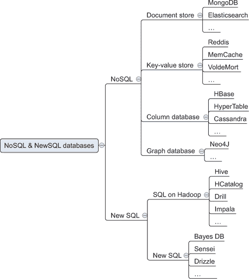

这四种类型是文档存储、键值存储、图数据库和列数据库。思维导图还包括 NewSQL 分区关系数据库。在未来，这种 NoSQL 和 NewSQL 之间的巨大分歧将变得过时，因为每种数据库类型都将有其自己的重点，同时结合 NoSQL 和 NewSQL 数据库的元素。随着 RDBMS 类型获得 NoSQL 功能，如列数据库中看到的列式索引，这些界限正在逐渐模糊。但就目前而言，这是一个很好的方式来展示旧的关系数据库已经超越了单节点设置，而其他数据库类型正在 NoSQL 的范畴下出现。

让我们看看 NoSQL 带来了什么。

### 6.1\. NoSQL 简介

如你所读，NoSQL 数据库的目标不仅仅是提供一种在多个节点上成功分区数据库的方法，而且还提供了一种根本不同的方式来建模手头的数据，以适应其结构并符合其使用场景，而不是如何按照关系数据库的要求来建模。

为了帮助您理解 NoSQL，我们将首先查看单服务器关系型数据库的核心 ACID 原则，并展示 NoSQL 数据库如何将它们重写为 BASE 原则，以便在分布式环境中工作得更好。我们还将探讨 CAP 定理，它描述了在多个节点上分布数据库的主要问题以及 ACID 和 BASE 数据库如何处理这个问题。

#### 6.1.1\. ACID：关系型数据库的核心原则

传统关系型数据库的主要方面可以通过 ACID 概念来总结：

+   ***原子性*** —“全有或全无”原则。如果一条记录被放入数据库，它要么完全放入，要么根本不放入。例如，如果在数据库写入操作中途发生断电，您不会得到半条记录；它根本不会在那里。

+   ***一致性*** —这个重要的原则维护了数据的完整性。任何进入数据库的条目都不会与预定义的规则发生冲突，例如缺少必需的字段或字段为数值而非文本。

+   ***隔离性*** —当数据库中的某个东西发生变化时，在完全相同的时刻，对此数据的任何操作都无法发生。相反，这些操作会与其他更改串行执行。隔离性是一个从低隔离到高隔离的尺度。在这个尺度上，传统数据库位于“高隔离”的一端。低隔离的一个例子是 Google Docs：多个人可以同时向文档中写入，并立即看到彼此的更改。在光谱的另一端，传统的 Word 文档具有高隔离性；它被第一个打开文档的用户锁定以供编辑。第二个打开文档的人可以查看其最后保存的版本，但无法查看未保存的更改或编辑文档，除非首先将其保存为副本。因此，一旦有人打开它，最新版本就完全隔离于除编辑该文档的人之外的所有人。

+   ***持久性*** —如果数据已进入数据库，它应该永久存活。硬盘物理损坏会破坏记录，但断电和软件崩溃不应该。

ACID 适用于所有关系型数据库以及某些 NoSQL 数据库，例如图数据库 Neo4j。我们将在本章和第七章 chapter 7 中进一步讨论图数据库。对于大多数其他 NoSQL 数据库，另一个原则适用：BASE。为了理解 BASE 以及为什么它适用于大多数 NoSQL 数据库，我们需要看看 CAP 定理。

#### 6.1.2\. CAP 定理：多节点数据库的问题

一旦数据库分散到不同的服务器上，由于 ACID 承诺的一致性，就很难遵循 ACID 原则。CAP 定理指出为什么这会变成一个问题。CAP 定理指出，数据库可以是以下三个属性中的任意两个，但永远不能是三个：

+   ***分区容错*** —数据库可以处理网络分区或网络故障。

+   ***可用性*** —只要您连接到的节点处于运行状态并且您可以连接到它，节点就会响应，即使不同数据库节点之间的连接丢失。

+   ***一致性*** —无论您连接到哪个节点，您都会看到完全相同的数据。

对于单节点数据库，很容易看出它总是可用且一致的：

+   ***可用性*** —只要节点处于运行状态，它就是可用的。这就是 CAP 可用性所承诺的一切。

+   ***一致性*** —没有第二个节点，所以不可能出现不一致的情况。

当数据库分区时，事情变得有趣。然后您需要在可用性和一致性之间做出选择，如图 6.2 所示。

##### 图 6.2\. CAP 定理：在分区数据库时，您需要在可用性和一致性之间做出选择。

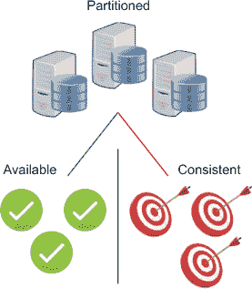

让我们以一个在欧洲有一个服务器在美国有一个服务器，并且有一个单一配送中心的在线商店为例。一个名叫 Fritz 的德国人和一个名叫 Freddy 的美国人同时在同一个在线商店购物。他们看到一件商品，只剩下一个库存：一个青铜色的八爪鱼形状的咖啡桌。灾难发生了，两个本地服务器之间的通信暂时中断。如果您是商店的所有者，您有两个选择：

+   ***可用性*** —您允许服务器继续为顾客提供服务，之后您再解决所有问题。

+   ***一致性*** —您将所有销售挂起，直到重新建立通信。

在第一种情况下，Fritz 和 Freddy 都会购买八爪鱼咖啡桌，因为两个节点最后已知的库存数量都是“一个”，并且两个节点都被允许出售它，如图 6.3 所示。

##### 图 6.3\. CAP 定理：如果节点断开连接，您可以选择保持可用性，但数据可能会变得不一致。


如果咖啡桌很难找到，您必须通知 Fritz 或 Freddy，他不会在承诺的交货日期收到他的桌子，或者更糟糕的是，他永远也收不到。作为一个优秀的商人，您可能会用一张折扣券补偿其中一个人，以便以后购买，这样一切可能都会好起来。

第二种选择（图 6.4）涉及暂时挂起传入的请求。

##### 图 6.4\. CAP 定理：如果节点断开连接，您可以选择在恢复连接之前停止对数据库的访问以保持一致性

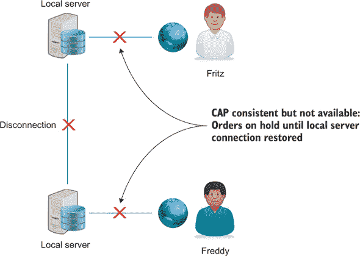

这种做法可能对弗里茨和弗雷迪都公平，如果五分钟后网店重新开始营业，但你可能会失去这两笔销售，甚至更多。网店往往倾向于选择可用性而不是一致性，但这并不是所有情况下最佳的选择。以 Tomorrowland 这样的流行节日为例。出于安全考虑，节日通常会有一个最大允许容量。如果你因为服务器在节点通信故障期间继续售票而卖出了超出允许数量的门票，到通信恢复时，你可能已经卖出了允许数量的两倍。在这种情况下，选择一致性并暂时关闭节点可能更明智。像 Tomorrowland 这样的节日，门票通常在前几个小时就售罄了，所以短暂的停机不会像撤回数千张入场券那样造成太大的伤害。

#### 6.1.3. NoSQL 数据库的 BASE 原则

关系型数据库管理系统遵循 ACID 原则；不遵循 ACID 的 NoSQL 数据库，如文档存储和键值存储，遵循 BASE。BASE 是一组较为宽松的数据库承诺：

+   ***基本可用性*** —在 CAP 意义上保证了可用性。以网店为例，如果一个节点处于运行状态，你可以继续购物。根据设置的不同，节点可以接管其他节点。例如，Elasticsearch 是一个 NoSQL 文档类型搜索引擎，它通过分片和复制数据，使得节点故障不一定会导致服务故障，通过分片的过程来实现。每个*分片*可以看作是一个独立的数据库服务器实例，但它也能够与其他分片通信，以尽可能高效地分配工作（图 6.5）。一个节点上可以存在多个分片。如果每个分片在另一个节点上都有一个副本，那么节点故障可以通过在剩余节点之间重新分配工作来轻松解决。

    ##### 图 6.5. 分片：每个分片可以作为一个自给自足的数据库运行，但它们也作为一个整体协同工作。示例表示两个节点，每个节点包含四个分片：两个主分片和两个副本。一个节点的故障可以通过另一个节点得到备份。

    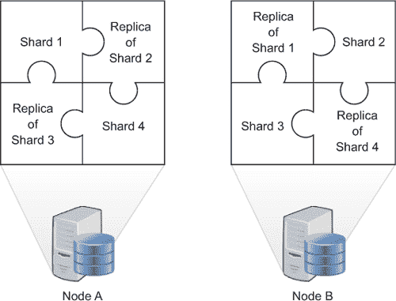

+   ***软状态*** —系统的状态可能会随时间变化。这对应于*最终一致性原则*：系统可能需要改变以使数据再次一致。在一个节点中，数据可能说“A”，而在另一个节点中可能说“B”，因为它们已经进行了调整。稍后，在网络恢复在线时的冲突解决过程中，第一个节点中的“A”可能被替换为“B”。即使没有人明确地将“A”改为“B”，它也会随着与其他节点的数据一致而采取这个值。

+   **最终一致性** —数据库将随着时间的推移而变得一致。在网店示例中，表格被卖出了两次，这导致了数据不一致。一旦重新建立了各个节点之间的连接，它们将进行通信并决定如何解决冲突。这种冲突可以通过例如先到先得的方式或优先考虑运输成本最低的客户来解决。数据库具有默认行为，但鉴于这里有一个实际的业务决策需要做出，这种行为可以被覆盖。即使连接是正常运行的，延迟可能会导致节点变得不一致。通常，产品会被保存在在线购物车中，但将商品放入购物车并不会锁定它供其他用户使用。如果弗里茨比弗雷迪先按下结账按钮，那么当弗雷迪去结账时会出现问题。这可以很容易地向客户解释：他来得太晚了。但如果是两个人在精确的同一毫秒按下结账按钮，并且同时发生销售呢？

| |
| --- |

**ACID 与 BASE**

BASE 原则是为了适应化学中的*酸*和*碱*而设计的：酸是一种 pH 值低的液体。碱则相反，具有高 pH 值。我们在这里不会深入化学细节，但图 6.6 展示了对于那些熟悉酸和碱化学等效物的人来说的一个记忆法。

##### 图 6.6\. ACID 与 BASE：传统的关系型数据库与大多数 NoSQL 数据库。这些名称来源于 pH 值的化学概念。pH 值低于 7 的是酸性；高于 7 的是碱性。在这个尺度上，平均地表水的 pH 值在 6.5 到 8.5 之间波动。

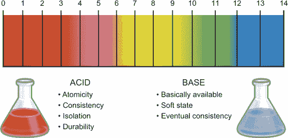

| |
| --- |

#### 6.1.4\. NoSQL 数据库类型

如你之前所见，有四种主要的 NoSQL 类型：键值存储、文档存储、列式数据库和图数据库。每种类型都解决了关系型数据库无法解决的问题。实际的实现通常是这些类型的组合。例如，OrientDB 是一个*多模型数据库*，结合了 NoSQL 类型。OrientDB 是一个图数据库，其中每个节点都是一个文档。

在深入了解不同的 NoSQL 数据库之前，让我们看看关系型数据库，这样你就可以有所比较。在数据建模中，有许多可能的方法。关系型数据库通常追求*规范化*：确保每一条数据只存储一次。规范化标记了它们的结构设置。例如，如果你想存储关于一个人及其爱好数据，你可以使用两个表格：一个关于人的，一个关于他们的爱好。正如你在图 6.7 中看到的，由于*多对多关系*，需要额外的表格来将爱好与个人联系起来：一个人可以有多个爱好，一个爱好可以有很多人在练习。

##### 图 6.7\. 关系型数据库追求规范化（确保每条数据只存储一次）。每个表都有唯一的标识符（主键），用于表示实体（表）之间的关系，因此被称为关系型。

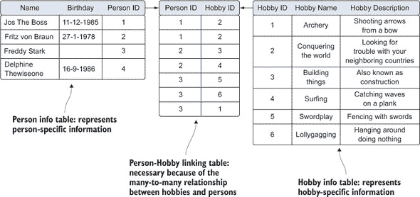

一个完整的关系型数据库可以由许多实体和链接表组成。现在你已经有了可以与 NoSQL 比较的东西，让我们来看看不同的类型。

##### 列式数据库

传统的关系型数据库是列式存储的，每行都有一个行 ID，行内的每个字段都存储在表中。比如说，为了举例，我们不存储关于爱好额外的数据，并且只有一个表来描述人，如图 6.8 所示。注意在这个场景中，你会有轻微的反规范化，因为爱好可能会重复。如果爱好信息是一个很好的额外信息但不是你的用例所必需的，将其作为 Hobbies 列中的列表添加是一个可接受的方法。但如果信息不足以成为一个单独的表，那么是否应该存储它呢？

##### 图 6.8\. 列式数据库布局。每个实体（人）由一行表示，分布在多个列中。

| 行 ID | 姓名 | 生日 | 爱好 |
| --- | --- | --- | --- |
| 1 | Jos The Boss | 11-12-1985 | Archery, conquering the world |
| 2 | Fritz von Braun | 27-1-1978 | Building things, surfing |
| 3 | Freddy Stark |   | Swordplay, lollygagging, archery |
| 4 | Delphine Thewiseone | 16-9-1986 |   |

每次你在列式数据库中查找某项内容时，都会扫描每一行，无论你需要哪些列。比如说，你只想获取 9 月份的生日列表。数据库会从上到下、从左到右扫描整个表，如图 6.9 所示，最终返回生日列表。

##### 图 6.9\. 列式查找：从上到下，对每个条目，所有列都被加载到内存中

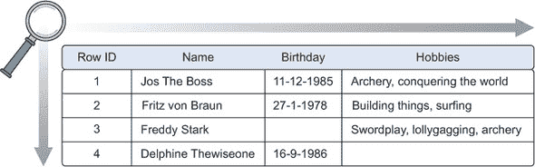

在某些列上索引数据可以显著提高查找速度，但为每个列索引都会带来额外的开销，数据库仍然会扫描所有列。

列数据库将每个列分别存储，当只涉及少量列时，可以更快地进行扫描；参见图 6.10。

##### 图 6.10\. 列式数据库将每个列分别存储，并附带相关的行号。每个实体（人）分布在多个表中。

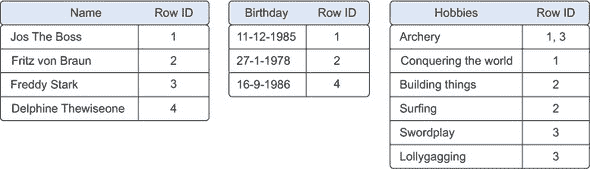

这种布局看起来与每个列都有索引的行导向数据库非常相似。数据库*索引*是一种数据结构，它允许以存储空间和额外写入（索引更新）为代价快速查找数据。索引将行号映射到数据，而列数据库将数据映射到行号；这样计数就变得更快，例如，很容易看出有多少人喜欢射箭。将列分别存储还允许进行优化的压缩，因为每个表中只有一个数据类型。

你应该在什么时候使用行导向数据库，什么时候使用列导向数据库？在列导向数据库中，很容易添加另一列，因为现有的任何列都不会受到影响。但添加整个记录需要调整所有表。这使得行导向数据库在在线事务处理（OLTP）方面优于列导向数据库，因为这意味着不断添加或更改记录。当执行分析和报告时，列导向数据库表现出色：求和值和计数条目。行导向数据库通常是实际交易（如销售）的操作数据库的选择。夜间批量作业使列导向数据库保持最新，支持使用 MapReduce 算法进行快速查找和聚合，以生成报告。列族存储的例子包括 Apache HBase、Facebook 的 Cassandra、Hypertable 以及宽列存储的鼻祖，Google BigTable。

##### 键值存储

键值存储是 NoSQL 数据库中最简单的。正如其名所示，它们是一系列键值对，如图 6.11 所示，这种简单性使它们成为 NoSQL 数据库类型中最可扩展的，能够存储大量数据。

##### 图 6.11\. 键值存储将所有内容都存储为键和值。

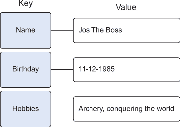

键值存储中的值可以是任何东西：一个字符串、一个数字，也可以是一个封装在对象中的整个新的键值对集合。图 6.12 显示了一个稍微复杂一些的键值结构。键值存储的例子有 Redis、Voldemort、Riak 和亚马逊的 Dynamo。

##### 图 6.12\. 键值嵌套结构

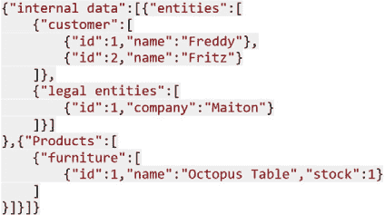

##### 文档存储

文档存储在键值存储之上增加了一步复杂性：文档存储确实假设了一种可以由模式指定的文档结构。文档存储在 NoSQL 数据库类型中看起来最为自然，因为它们被设计为以原始形式存储日常文档，并允许对这种通常已经聚合的数据形式进行复杂的查询和计算。关系数据库中存储数据的方式从规范化的角度来看是有意义的：一切都应该只存储一次，并通过外键连接。只要数据结构合理，文档存储对规范化的关注就很少。关系数据模型并不总是很好地与某些业务案例相匹配。例如，报纸或杂志包含文章。为了在关系数据库中存储这些文章，您需要首先将它们拆分：文章文本放在一个表中，作者及其所有信息放在另一个表中，当文章在网站上发布时，评论放在另一个表中。如图 6.13 所示，报纸文章也可以作为一个单一实体存储；这降低了那些习惯于经常看到文章的人处理数据时的认知负担。文档存储的例子包括 MongoDB 和 CouchDB。

##### 图 6.13。文档存储将整个文档保存下来，而关系型数据库管理系统（RDMS）会将文章拆分成几个表来保存。示例取自《卫报》网站。

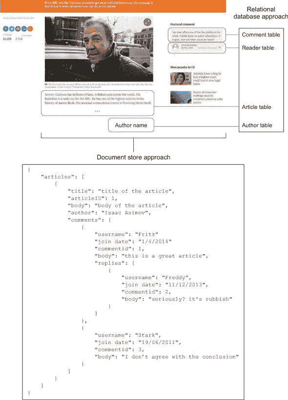

##### 图数据库

最后一种大型 NoSQL 数据库类型是最复杂的，旨在以高效的方式存储实体之间的关系。当数据高度互联时，例如社交网络、科学论文引用或资本资产集群，图数据库就是解决方案。图或网络数据有两个主要组成部分：

+   ***节点*** — 实体本身。在社交网络中，这可能是指人。

+   ***边*** — 两个实体之间的关系。这种关系由一条线表示，并具有自己的属性。边可以有方向，例如，如果箭头表示谁是老板。

在关系和实体类型足够多的情况下，图可以变得极其复杂。图 6.14 已经展示了仅使用有限数量的实体所展现的复杂性。像 Neo4j 这样的图数据库也声称遵守 ACID，而文档存储和键值存储则遵循 BASE。

##### 图 6.14。包含四种实体类型（人、爱好、公司和家具）及其关系的图数据示例，没有额外的边或节点信息

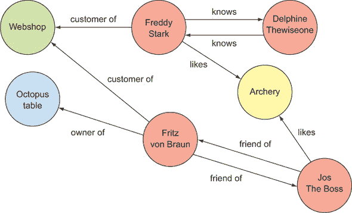

可能性是无限的，由于世界正变得越来越互联，图数据库很可能会在其他类型数据库（包括仍然占主导地位的关系数据库）中赢得更多的市场份额。最流行的数据库排名及其进展情况可以在[`db-engines.com/en/ranking`](http://db-engines.com/en/ranking)找到。

图 6.15 显示，在本书编写时，尽管有 9 个条目，关系型数据库仍然占据着前 15 名的位置，而随着 NewSQL 的到来，我们也不能排除它们。最受欢迎的图数据库 Neo4j 在写作时位于第 23 位，Titan 位于第 53 位。

##### 图 6.15\. 根据 DB-Engines.com 在 2015 年 3 月的数据，按受欢迎程度排名的前 15 个数据库

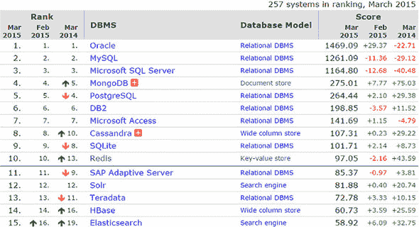

现在你已经了解了每种 NoSQL 数据库类型，是时候动手实践其中之一了。

### 6.2\. 案例研究：这是什么病？

这对我们中的许多人来说都发生过：你突然出现医疗症状，首先做的事情就是用谷歌搜索这些症状可能表明的疾病；然后你决定是否值得去看医生。一个网络搜索引擎对于这个任务来说是可以的，但一个更专业的数据库会更好。这样的数据库确实存在，并且相当先进；它们几乎可以成为电视剧《豪斯医生》中那位杰出诊断专家豪斯医生的虚拟版本。但它们建立在受良好保护的数据之上，并非所有数据都对公众开放。此外，尽管大型制药公司和先进医院可以访问这些虚拟医生，但许多普通开业医生仍然只能依靠他们的书籍。这种信息和资源的不对称不仅令人悲哀且危险，实际上根本不需要存在。如果世界上所有普通开业医生都使用一个简单的、针对特定疾病的搜索引擎，许多医疗错误本可以避免。

在本案例研究中，你将学习如何构建这样一个搜索引擎，尽管只使用了可自由获取的医疗数据的一小部分。为了解决这个问题，你将使用名为 Elasticsearch 的现代 NoSQL 数据库来存储数据，并使用数据科学流程来处理数据，将其转化为快速且易于搜索的资源。以下是应用此流程的方法：

> **1**.  *设定研究目标。*
> 
> **2**.  *数据收集*——你将从维基百科获取数据。还有更多来源，但为了演示目的，一个就足够了。
> 
> **3**.  *数据准备*——维基百科数据在其当前格式下可能并不完美。你将应用一些技术来改变这一点。
> 
> **4**.  *数据探索*——你的用例在数据科学流程的第 4 步也是期望的最终结果：你希望你的数据变得易于探索。
> 
> **5**.  *数据建模*——在本章中未应用实际的数据建模。用于搜索的文档-词矩阵通常是高级主题建模的起点。我们在这里不会深入探讨这一点。
> 
> **6**.  *展示结果*——为了使数据可搜索，你需要一个用户界面，例如一个网站，人们可以在其中查询和检索疾病信息。在本章中，你不会构建一个实际的界面。你的次要目标：通过关键词分析疾病类别；你将达到数据科学过程的这一阶段，因为你将把它展示为一个词云，如图 6.16 所示。
> 
> ##### 图 6.16\. 非加权糖尿病关键词的示例词云
> ##### 
> 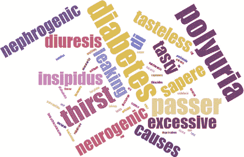

要跟随代码进行操作，你需要以下这些物品：

+   安装了 elasticsearch-py 和 Wikipedia 库的 Python 会话（`pip install elasticsearch` 和 `pip install wikipedia`）

+   本地设置的 Elasticsearch 实例；有关安装说明，请参阅附录 A（kindle_split_018.xhtml#app01）。

+   IPython 库

| |
| --- |

##### 注意

本章的代码可以从本书的 Manning 网站下载，链接为 [`manning.com/books/introducing-data-science`](https://manning.com/books/introducing-data-science)，代码格式为 IPython。

| |
| --- |
| |

**Elasticsearch：开源搜索引擎/NoSQL 数据库**

为了解决当前的问题，即诊断疾病，你将使用的 NoSQL 数据库是 Elasticsearch。与 MongoDB 类似，Elasticsearch 是一个文档存储库。但与 MongoDB 不同，Elasticsearch 是一个搜索引擎。MongoDB 在执行复杂计算和 MapReduce 作业方面非常出色，而 Elasticsearch 的主要目的是全文搜索。Elasticsearch 将对索引的数值数据进行基本计算，例如求和、计数、中位数、平均值、标准差等，但本质上它仍然是一个搜索引擎。

Elasticsearch 是建立在 Apache Lucene 之上的，Apache Lucene 是 1999 年创建的 Apache 搜索引擎。Lucene 以难以处理而闻名，它更多的是为更用户友好的应用程序提供构建块，而不是作为一个端到端解决方案本身。但 Lucene 是一个功能强大的搜索引擎，2004 年推出了 Apache Solr，2006 年向公众开放。Solr（一个开源的企业级搜索平台）建立在 Apache Lucene 之上，目前仍然是功能最全面和最受欢迎的开源搜索引擎。Solr 是一个优秀的平台，如果你参与了一个需要搜索引擎的项目，值得调查。2010 年 Elasticsearch 出现，迅速获得了人气。尽管 Solr 对于小型项目来说仍然可能难以设置和配置，但 Elasticsearch 的设置却非常简单。Solr 在扩展其核心功能方面具有优势，但 Elasticsearch 正在迅速追赶，今天其功能质量相当。

| |
| --- |

#### 6.2.1\. 第一步：设定研究目标

你能在本章结束时仅使用自己的家用电脑和免费软件及数据来诊断疾病吗？知道你想要做什么以及如何去做是数据科学过程中的第一步，如图 6.17 所示。

##### 图 6.17。数据科学流程步骤 1：设定研究目标

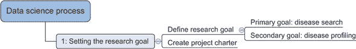

+   你的主要目标是建立一个疾病搜索引擎，帮助普通医生诊断疾病。

+   你的次要目标是描述一种疾病：哪些关键词可以将其与其他疾病区分开来？

这个次要目标在教育目的或作为更高级用途的输入（例如，通过社交媒体检测传播的流行病）很有用。在确定了研究目标和行动计划后，让我们继续到数据检索步骤。

#### 6.2.2。步骤 2 和 3：数据检索和准备

数据检索和数据准备是数据科学流程中的两个不同步骤，尽管这在案例研究中仍然成立，但我们将在这同一节中探讨这两个步骤。这样，你可以在检索数据的同时立即进行数据准备，避免设置本地中间存储。让我们看看我们在数据科学流程中的位置（见图 6.18）。

##### 图 6.18。数据科学流程步骤 2：数据检索。在这种情况下，没有内部数据；所有数据都将从维基百科获取。

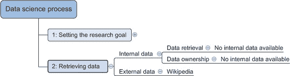

如图 6.18 所示，你有两个可能的数据来源：内部数据和外部数据。

+   ***内部数据*** —你周围没有疾病信息。如果你目前为制药公司或医院工作，你可能更幸运。

+   ***外部数据*** —在这种情况下，你可以使用的外部数据仅限于外部数据。你有几个选择，但你会选择维基百科。

当你从维基百科拉取数据时，你需要将其存储在你的本地 Elasticsearch 索引中，但在你这样做之前，你需要准备数据。一旦数据进入 Elasticsearch 索引，就不能更改；那时你能做的只是查询它。看看图 6.19 中的数据准备概述。

##### 图 6.19。数据科学流程步骤 3：数据准备

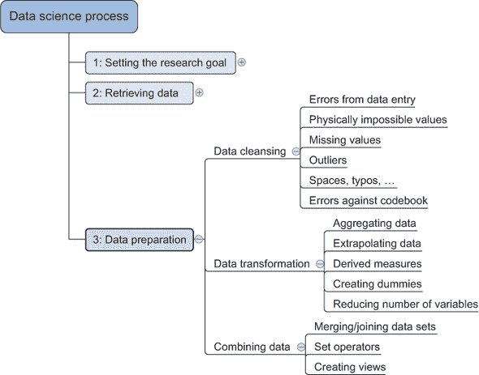

如图 6.19 所示，需要考虑三种不同的数据准备类别：

+   ***数据清洗*** —从维基百科获取的数据可能是不完整或错误的。数据输入错误和拼写错误是可能的——甚至不包括错误信息。幸运的是，你不需要疾病列表详尽无遗，你可以在搜索时处理拼写错误；关于这一点，稍后会有更多说明。多亏了维基百科 Python 库，你将收到的文本数据已经相当干净。如果你要手动抓取，你需要添加 HTML 清理，移除所有 HTML 标签。实际上，全文搜索通常对常见错误如值错误相当稳健。即使你故意输入 HTML 标签，它们也不太可能影响结果；HTML 标签与正常语言太不同，不会干扰。

+   ***数据转换*** —在这个阶段，您不需要转换太多数据；您希望以原始形式搜索它。但您将区分页面标题、疾病名称和页面正文。这种区分对于搜索结果解释几乎是强制性的。

+   ***数据合并*** —在这种情况下，所有数据都来自单一来源，因此您实际上没有合并数据的真正需要。这个练习的一个可能的扩展是从另一个来源获取疾病数据并匹配疾病。这是一个非同小可的任务，因为没有唯一的标识符，而且名称通常略有不同。

您只能在两个阶段进行数据清理：当使用连接维基百科和 Elasticsearch 的 Python 程序时，以及当运行 Elasticsearch 内部索引系统时：

+   ***Python*** —在这里，您定义您的文档存储将允许存储哪些数据，但在这个阶段，您不会清理或转换数据，因为 Elasticsearch 在这方面做得更好，而且更省力。

+   ***Elasticsearch*** —Elasticsearch 将在幕后处理数据操作（创建索引）。您仍然可以影响这个过程，您将在本章的后面更明确地这样做。

现在您已经了解了即将到来的步骤概述，让我们开始工作。如果您遵循了附录中的说明，您现在应该有一个本地运行的 Elasticsearch 实例。首先进行数据检索：您需要有关不同疾病的信息。您有几种获取这种数据的方式。您可以向公司索求数据，或从 Freebase 或其他开放和免费数据源获取数据。获取数据可能是一个挑战，但在这个例子中，您将从维基百科获取数据。这有点讽刺，因为维基百科网站本身的搜索是由 Elasticsearch 处理的。维基百科曾经拥有一个基于 Apache Lucene 构建的自有系统，但这个系统变得难以维护，截至 2014 年 1 月，维基百科开始使用 Elasticsearch。

维基百科有一个疾病列表页面，如图 6.20 所示。图 6.20。从这里，您可以借用字母顺序列表中的数据。

##### 图 6.20\. 维基百科的疾病列表页面，您数据检索的起点

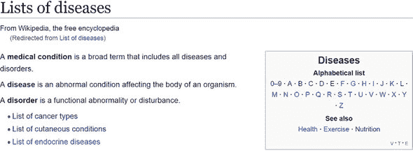

您知道您想要什么数据；现在去获取它。您可以下载整个维基百科数据存档。如果您愿意，您可以将其下载到[`meta.wikimedia.org/wiki/Data_dump_torrents#enwiki`](http://meta.wikimedia.org/wiki/Data_dump_torrents#enwiki)。

当然，如果你要索引整个维基百科，索引最终可能需要大约 40 GB 的存储空间。你可以自由使用这个解决方案，但为了节省存储和带宽，我们在这本书中只提取我们打算使用的那些数据。另一种选择是抓取所需的页面。像 Google 一样，你可以编写一个程序在页面之间进行爬取并检索整个渲染的 HTML。这将有效，但你最终会得到实际的 HTML，因此你需要在索引之前清理它。此外，除非你是 Google，否则网站通常不太喜欢爬虫抓取它们的网页。这会创建不必要的流量，如果足够多的人发送爬虫，它可能会使 HTTP 服务器崩溃，让所有人的乐趣都受到影响。同时发送数十亿个请求也是执行拒绝服务（DoA）攻击的一种方式。如果你确实需要抓取网站，请在每个页面请求之间留出时间间隔。这样，你的爬虫会更接近普通网站访问者的行为，你也不会使他们的服务器崩溃。

幸运的是，维基百科的创建者足够聪明，知道当所有这些信息对每个人开放时会发生什么。他们已经建立了一个 API，你可以从中安全地获取信息。你可以在[`www.mediawiki.org/wiki/API:Main_page`](http://www.mediawiki.org/wiki/API:Main_page)了解更多相关信息。

你将从 API 中获取数据。Python 如果没有现成的库来完成这项工作，那就不是 Python 了。实际上有几个库，但最简单的一个就足以满足你的需求：维基百科。

激活你的 Python 虚拟环境，并安装本书剩余部分所需的所有库：

```
pip install wikipedia
pip install Elasticsearch
```

你将使用维基百科来访问维基百科。Elasticsearch 是主要的 Elasticsearch Python 库；通过它，你可以与你的数据库进行通信。

打开你喜欢的 Python 解释器并导入必要的库：

```
from elasticsearch import Elasticsearch
import wikipedia
```

你将从维基百科 API 中获取数据，同时在你的本地 Elasticsearch 实例上进行索引，因此首先你需要为数据接受做好准备。

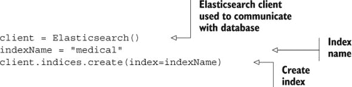

你首先需要的是一个客户端。`Elasticsearch()` 可以用地址初始化，但默认是 localhost:9200。因此，`Elasticsearch()` 和 `Elasticsearch ('localhost:9200')` 是同一件事：你的客户端连接到了你的本地 Elasticsearch 节点。然后你创建一个名为 `"medical"` 的索引。如果一切顺利，你应该会看到一个 `"acknowledged:true"` 的回复，如图 6.21 所示。

##### 图 6.21\. 使用 Python-Elasticsearch 创建 Elasticsearch 索引

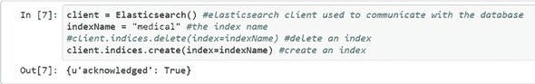

Elasticsearch 声称是无模式的，这意味着您可以在不定义数据库模式也不告诉 Elasticsearch 需要期望什么类型的数据的情况下使用 Elasticsearch。尽管这在简单情况下是正确的，但您最终无法避免拥有一个模式，所以让我们创建一个，如下所示。

##### 列表 6.1\. 向文档类型添加映射

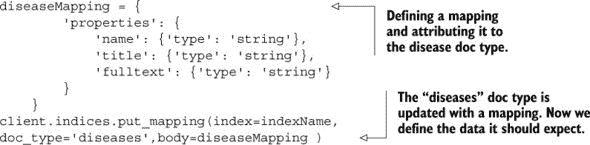

这样您就告诉 Elasticsearch，您的索引将有一个名为 `"disease"` 的文档类型，并为每个字段提供了字段类型。疾病文档中有三个字段：`name`、`title` 和 `fulltext`，它们都是 `string` 类型。如果您没有提供映射，Elasticsearch 会通过查看它接收到的第一个条目来猜测它们的类型。如果它没有识别出字段为 `boolean`、`double`、`float`、`long`、`integer` 或 `date`，它就会将其设置为 `string`。在这种情况下，您不需要手动指定映射。

现在让我们转到维基百科。您首先想做的事情是获取疾病列表页面，因为这是您进一步探索的入口点：

```
dl = wikipedia.page("Lists_of_diseases")
```

您现在有了第一页，但您更感兴趣的是列表页面，因为它们包含指向疾病的链接。查看以下链接：

```
dl.links
```

疾病列表页面包含的链接比您需要的要多。图 6.22 展示了从第 16 个链接开始的字母列表。

##### 图 6.22\. 维基百科页面“疾病列表”上的链接。它包含的链接比您需要的多。

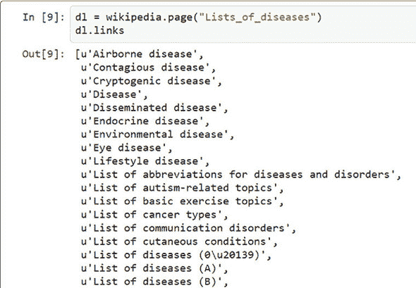

```
dl = wikipedia.page("Lists_of_diseases")
dl.links
```

这个页面有很多链接，但只有字母列表对您感兴趣，所以只保留那些：

```
diseaseListArray = []
for link in dl.links[15:42]:
    try:
        diseaseListArray.append(wikipedia.page(link))
    except Exception,e:
        print str(e)
```

您可能已经注意到子集是硬编码的，因为您知道它们是数组中的第 16 到第 43 个条目。如果维基百科在您感兴趣的链接之前添加任何链接，它就会影响结果。更好的做法是使用正则表达式来完成这项任务。出于探索目的，硬编码条目编号是可以的，但如果正则表达式对您来说很自然，或者您打算将此代码转换为批处理作业，建议使用正则表达式。您可以在[`docs.python.org/2/howto/regex.html`](https://docs.python.org/2/howto/regex.html)找到更多关于它们的信息。

正则表达式版本的一个可能代码片段如下。

```
diseaseListArray = []
check = re.compile("List of diseases*")
for link in dl.links:
    if check.match(link):
        try:
            diseaseListArray.append(wikipedia.page(link))
        except Exception,e:
            print str(e)
```

图 6.23 展示了您所追求的第一批条目：疾病本身。

##### 图 6.23\. 第一批维基百科疾病列表，“疾病列表（0-9）”

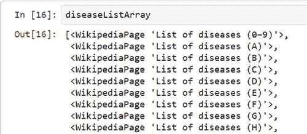

```
diseaseListArray[0].links
```

现在是索引疾病的时候了。一旦它们被索引，数据录入和数据准备就有效完成了，如下所示。

##### 列表 6.2\. 从维基百科索引疾病

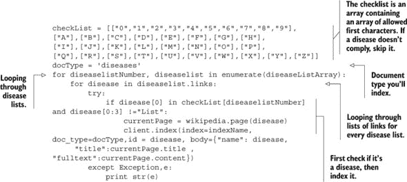

因为每个列表页面都会有你不需要的链接，检查一个条目是否是疾病。你为每个列表指定疾病开始的字符，所以你检查这个。此外，你还排除了以“list”开头的链接，因为这些链接会在你到达疾病列表的 L 时出现。这个检查相当简单，但由于搜索算法在开始查询时会排除无关结果，所以几个不想要的条目成本相当低。对于你索引的每个疾病，你将索引疾病名称和页面的全文。名称也用作其索引 ID；这对于几个高级 Elasticsearch 功能很有用，但也可以用于浏览器中的快速查找。例如，在你的浏览器中尝试这个 URL：http://localhost:9200/medical/diseases/11%20beta%20hydroxylase%20deficiency。标题是单独索引的；在大多数情况下，链接名称和页面标题将是相同的，有时标题将包含疾病的替代名称。

至少索引了几种疾病后，可以利用 Elasticsearch URI 进行简单的查找。看看图 6.24 中对于单词 *headache* 的全身搜索。你可以在索引的同时做这件事；Elasticsearch 可以同时更新索引并返回查询结果。

##### 图 6.24\. Elasticsearch URL 示例构建

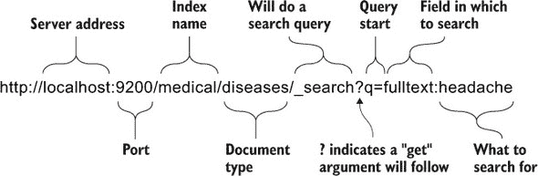

如果你没有查询索引，你仍然可以在不知道索引的情况下获得一些结果。指定 http://localhost:9200/medical/diseases/_search 将返回前五个结果。为了对数据进行更结构化的查看，你可以请求此文档类型的映射，在 http://localhost:9200/medical/diseases/_mapping?pretty。pretty `get` 参数以更易读的格式显示返回的 JSON，如图 6.25 所示。映射似乎正是你指定的那样：所有字段类型都是 `string`。

##### 图 6.25\. 通过 Elasticsearch URL 疾病文档类型映射

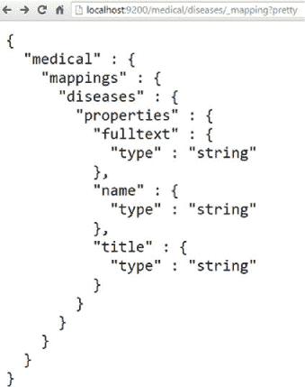

Elasticsearch URL 确实很有用，但不足以满足你的需求。你仍需要诊断疾病，为此你将通过 Elasticsearch Python 库向 Elasticsearch 发送 POST 请求。

数据检索和准备完成后，你可以继续探索你的数据。

#### 6.2.3\. 步骤 4：数据探索

> 不是狼疮。绝不是狼疮！
> 
> *《豪斯医生》中的豪斯博士**

数据探索是本案例研究的标志，因为项目的首要目标（疾病诊断）是通过查询疾病症状来探索数据的一种特定方式。图 6.26 展示了几个数据探索技术，但在这个案例中是非图形化的：解释文本搜索查询结果。

##### 图 6.26\. 数据科学流程步骤 4：数据探索

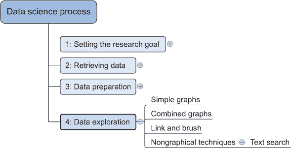

真正的时刻到了：通过向搜索引擎提供症状，你能找到某些疾病吗？让我们首先确保你具备基本的知识并开始运行。导入 Elasticsearch 库并定义全局搜索设置：

```
from elasticsearch import Elasticsearch
client = Elasticsearch()
indexName = "medical"
docType="diseases"
searchFrom = 0
searchSize= 3
```

你将只返回前三个结果；默认为五个。

Elasticsearch 有一个复杂的 JSON 查询语言；每次搜索都是一个发送到服务器的 POST 请求，并将以 JSON 格式回答。大致来说，该语言由三个主要部分组成：查询、过滤和聚合。一个 *查询* 会接收搜索关键词，并在索引中查找单词之前通过一个或多个分析器。我们将在本章稍后深入了解分析器。一个 *过滤* 与查询类似，但不会尝试分析你提供的内容；它根据我们提供的条件进行过滤。因此，过滤比查询更简单，但效率更高，因为它们也会在 Elasticsearch 中临时存储，以防你两次使用相同的过滤条件。*聚合* 可以与 SQL 中的分组进行比较；将创建单词的桶，并为每个桶计算相关统计信息。这三个部分中的每一个都有大量的选项和功能，使得在这里详细阐述整个语言变得不可能。幸运的是，我们不需要深入了解 Elasticsearch 查询可以表示的复杂性。我们将使用“查询字符串查询语言”，这是一种查询数据的方式，与 Google 搜索查询语言非常相似。例如，如果你想强制搜索项，你可以在前面添加一个加号（+）；如果你想排除搜索项，你使用减号（-）。不建议使用 Elasticsearch 进行查询，因为它会降低性能；搜索引擎首先需要将查询字符串转换为它自己的原生 JSON 查询语言。但对你来说，它将工作得很好；此外，在索引中的几万条记录中，性能不会成为一个因素。现在，是时候查询你的疾病数据了。

##### 项目主要目标：通过症状诊断疾病

如果你曾经看过流行的电视连续剧 *House M.D.*，句子“它绝不是狼疮”可能听起来很熟悉。狼疮是一种自身免疫性疾病，其中身体的免疫系统攻击身体的健康部分。让我们看看你的搜索引擎需要哪些症状来确定你正在寻找狼疮。

从三个症状开始：疲劳、发烧和关节痛。你的想象中的病人都有这三种症状（还有更多），所以通过在每个症状前添加一个加号使其都成为强制性的：

##### 列表 6.3\. “简单查询字符串” Elasticsearch 查询包含三个强制关键词

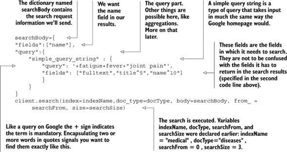

在具有 JSON 结构的`searchBody`中，你指定你想要返回的字段，在这种情况下，疾病的名称就足够了。你使用查询字符串语法在所有索引字段中进行搜索：`fulltext`、`title`和`name`。通过添加`^`，你可以给每个字段赋予一个权重。如果一个症状出现在标题中，它比在开放文本中重要五倍；如果它出现在名称本身中，它被认为重要十倍。注意“关节痛”被一对引号包围。如果你没有引号，*关节*和*pain*将被视为两个单独的关键词，而不是一个短语。在 Elasticsearch 中，这被称为*短语匹配*。让我们看看图 6.27 中的结果。

##### 图 6.27\. 狼疮第一次搜索，共有 34 个结果

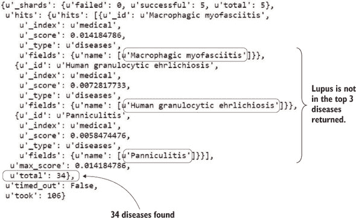

显示了从 34 个匹配疾病中返回的前三个结果。结果按其匹配分数排序，即变量`_score`。匹配分数并不是一件简单的事情来解释；它考虑了疾病与你的查询的匹配程度，关键词出现的次数，你给出的权重等等。目前，狼疮甚至没有出现在前三名结果中。幸运的是，狼疮还有另一个独特的症状：皮疹。皮疹并不总是出现在人的脸上，但它确实会发生，这也是狼疮得名的原因：面部皮疹使人们略似狼。你的病人有皮疹，但没有面部特有的皮疹，所以将“皮疹”添加到症状中，而不提及其面部。

```
"query": '+fatigue+fever+"joint pain"+rash',
```

新搜索的结果在图 6.28 中显示。

##### 图 6.28\. 狼疮第二次搜索尝试，共有六个结果，狼疮位于前三名

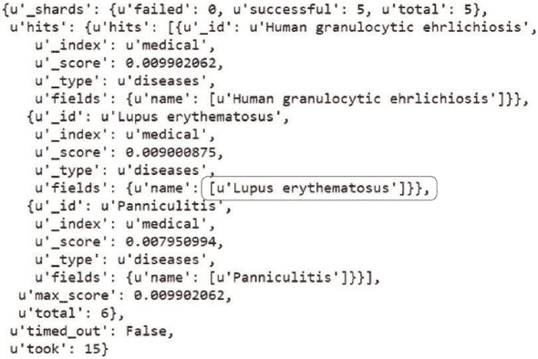

现在结果已经缩小到六个，狼疮位于前三名。此时，搜索引擎表示*人粒细胞无形体病*（HGE）的可能性更大。HGE 是一种由蜱传播的疾病，就像臭名昭著的莱姆病一样。到目前为止，一个有能力的医生已经能够确定困扰你病人的疾病，因为在确定疾病时，许多因素都在发挥作用，远远超出了你那谦逊的搜索引擎所能处理的范围。例如，皮疹只出现在 HGE 的 10%和狼疮患者的 50%中。狼疮缓慢出现，而 HGE 是由蜱咬引起的。通过以更结构化的方式提供所有这些信息的先进机器学习数据库，可以以更高的确定性做出诊断。鉴于你需要依靠维基百科页面，你需要另一个症状来确认它是狼疮。病人有胸痛，所以将其添加到列表中。

```
"query": '+fatigue+fever+"joint pain"+rash+"chest pain"',
```

结果在图 6.29 中显示。

##### 图 6.29\. 狼疮第三次搜索：有足够的症状来确定它一定是狼疮

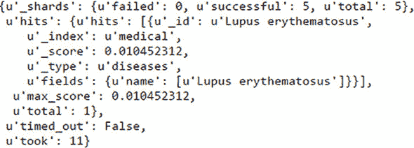

看起来是狼疮。得出这个结论花了一些时间，但你做到了。当然，你在向 Elasticsearch 展示症状的方式上受到了限制。你只使用了单个术语（“疲劳”）或直接短语（“关节疼痛”）。这个例子中这行得通，但 Elasticsearch 比这更灵活。它可以接受正则表达式并进行模糊搜索，但这超出了本书的范围，尽管在可下载的代码中包含了一些示例。

##### 处理拼写错误：Damerau-Levenshtein

假设有人输入了“lupsu”而不是“lupus”。拼写错误在所有类型的人类文档中都会发生。为了处理这种情况，数据科学家通常会使用 Damerau-Levenshtein。两个字符串之间的 Damerau-Levenshtein 距离是将一个字符串转换为另一个字符串所需的操作数。计算距离允许进行四种操作：

+   ***删除*** —从字符串中删除一个字符。

+   ***插入*** —向字符串中添加一个字符。

+   ***替换*** —用一个字符替换另一个字符。如果没有将替换计为一个操作，将一个字符更改为另一个字符将需要两个操作：一个删除和一个插入。

+   ***两个相邻字符的置换*** —交换两个相邻字符。

最后一个操作（置换）是传统 Levenshtein 距离和 Damerau-Levenshtein 距离之间的区别。正是这个最后的操作使得我们的阅读障碍拼写错误在可接受的范围内。Damerau-Levenshtein 对这种置换错误很宽容，这使得它在搜索引擎中非常出色，但它也被用于其他事情，例如计算 DNA 字符串之间的差异。

图 6.30 展示了如何通过单个置换将“lupsu”转换为“lupus”。

##### 图 6.30。相邻字符的置换是 Damerau-Levenshtein 距离中的操作之一。其他三个操作是插入、删除和替换。


仅此而已，你就已经实现了你的第一个目标：*诊断疾病*。但不要忘记你的次要项目目标：*疾病分析*。

##### 项目次要目标：疾病分析

你想要的是一个适合你选定疾病的单词列表。为此，你将使用显著术语聚合。用于确定哪些单词是显著的分数计算又是一次因素组合，但大致可以归结为比较一个术语在结果集中出现的次数与所有其他文档相比。这样，Elasticsearch 通过提供区分其他数据的关键词来对你的结果集进行配置文件。让我们以糖尿病为例，这是一种可以采取多种形式的常见疾病：

##### 列表 6.4。针对“糖尿病”的显著术语 Elasticsearch 查询

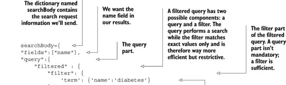

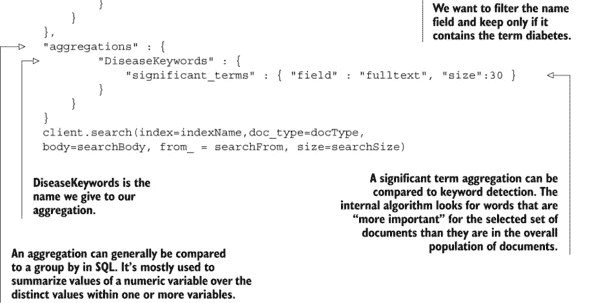

你在这里看到了新的代码。你放弃了查询字符串搜索，而是使用了过滤器。过滤器被封装在查询部分，因为搜索查询可以与过滤器结合使用。在示例中并未出现，但在此发生时，Elasticsearch 将首先应用效率更高的过滤器，然后再尝试搜索。如果你知道你想要在数据子集中进行搜索，添加一个过滤器首先创建这个子集总是一个好主意。为了演示这一点，考虑以下两个代码片段。它们产生相同的结果，但它们并不完全相同。

在疾病名称中搜索“糖尿病”的简单查询字符串：

```
"query":{
    "simple_query_string" : {
        "query": 'diabetes',
        "fields": ["name"]
        }
    }
```

一个过滤所有疾病名称中包含“糖尿病”的术语过滤器：

```
"query":{
    "filtered" : {
        "filter": {
            'term': {'name':'diabetes'}
        }
    }
}
```

尽管它不会显示在你可用的少量数据中，但过滤器的速度远远快于搜索。搜索查询将为每种疾病计算一个搜索分数并相应地排名，而过滤器只是过滤掉所有不符合条件的。因此，过滤器比实际搜索要简单得多：它只是“是”或“否”，这在输出中很明显。分数对所有内容都是 1；在结果集中没有做出区分。由于显著术语聚合，输出现在由两部分组成，之前只有命中项；现在有命中项和聚合项。首先，看看图 6.31 中的命中项。

##### 图 6.31\. 带有“糖尿病”过滤条件的疾病名称查询输出

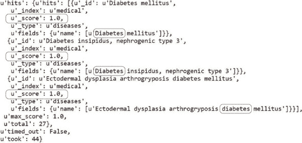

现在应该很熟悉了，只有一个显著的例外：所有结果都有 1 分的评分。除了更容易执行之外，过滤器还会被 Elasticsearch 缓存一段时间。这样，具有相同过滤器的后续请求甚至更快，这比搜索查询有巨大的性能优势。

你应该在什么时候使用过滤器，什么时候使用搜索查询？规则很简单：尽可能使用过滤器，当需要结果之间的排名以获取最有趣的结果放在顶部时，使用全文搜索查询。

现在看看图 6.32 中的显著术语。

##### 图 6.32\. 糖尿病显著术语聚合，前五个关键词

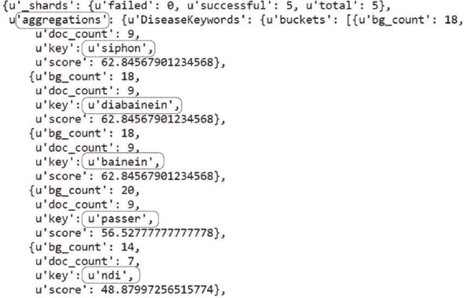

如果你查看图 6.32 中的前五个关键词，你会发现前四个与糖尿病的起源相关。以下维基百科段落提供了帮助：

> 单词 diabetes（ 或 ）来自拉丁语 diabētēs，它又来自古希腊语 διαβήτης (diabētēs)，其字面意思是“通过者；虹吸管” [69]。古希腊医生卡帕多西亚的阿雷塔乌斯（公元 1 世纪活跃）使用这个词，其意图是“尿液过度排出”，作为疾病的名称 [70, 71, 72]。最终，这个词来自希腊语 διαβαívειv (diabainein)，意为“通过”，[69] 由 dia-（dia-）意为“通过”和 βαívειv (bainein) 意为“去” [70] 组成。单词“diabetes”首次记录在英语中，形式为 diabete，在 1425 年左右撰写的一篇医学文本中。
> 
> *维基百科页面 Diabetes_mellitus*

这告诉你单词 *diabetes* 的来源：“在希腊语中是‘通过者；虹吸管’”。它还提到了 *diabainein* 和 *bainein*。你可能知道，与疾病最相关的关键词将是实际定义和起源。幸运的是，我们请求了 30 个关键词，所以让我们挑选一些更有趣的，比如 *ndi*。*ndi* 是 *NDI* 的小写版本，即“Nephrogenic Diabetes Insipidus”，这是最常见的糖尿病获得形式。小写关键词被返回，因为这是我们通过标准分析器索引时它们在索引中的存储方式。我们在索引时没有指定任何内容，所以默认使用了标准分析器。前 30 个有趣的关键词还包括 *avp*，与糖尿病相关的基因；*thirst*，糖尿病的症状；以及 *Amiloride*，糖尿病的药物。这些关键词似乎确实可以描述糖尿病，但我们缺少多词关键词；我们仅在索引中存储了单个术语，因为这默认行为。某些单词单独出现时永远不会出现，因为它们不太常用，但与其他术语结合使用时仍然很重要。目前，我们错过了某些术语之间的关系。以 *avp* 为例；如果 *avp* 总是以其完整形式“Nephrogenic Diabetes Insipidus”书写，它就不会被选中。存储 *n-grams*（*n* 个单词的组合）会占用存储空间，并且使用它们进行查询或聚合会加重搜索服务器的负担。决定在哪里停止是一个平衡练习，取决于你的数据和用例。

通常，二元组（两个术语的组合）是有用的，因为自然语言中存在有意义的二元组，尽管 10-grams 并不多。对于疾病特征，二元组的关键概念将是有用的，但为了创建这些二元组显著术语聚合，你需要将它们作为二元组存储在你的索引中。正如数据科学中经常发生的那样，你需要退回几步来做出一些更改。让我们回到数据准备阶段。

#### 6.2.4\. 步骤 3 回顾：疾病特征数据准备

如图 6.33 所示，您回到了数据准备阶段，这并不奇怪。毕竟，数据科学流程是一个迭代的过程。当您索引数据时，实际上几乎没有进行数据清洗或数据转换。您现在可以通过例如停用词过滤来添加数据清洗。*停用词*是如此常见，以至于它们通常被丢弃，因为它们可能会污染结果。我们不会在这里详细介绍停用词过滤（或其他数据清洗），但您可以自由尝试。

##### 图 6.33\. 数据科学流程步骤 3：数据准备。文本的数据清洗可以是停用词过滤；数据转换可以是字符的小写化。

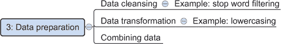

要索引二元组，您需要创建自己的标记过滤器和文本分析器。一个*标记过滤器*能够对标记进行转换。您的特定标记过滤器需要将标记组合起来创建*n*-gram，也称为*瓦片*。默认的 Elasticsearch 标记器称为标准标记器，它会寻找单词边界，如单词之间的空格，将文本切割成不同的标记或术语。请查看您疾病索引的新设置，如下所示。

##### 列表 6.5\. 更新 Elasticsearch 索引设置

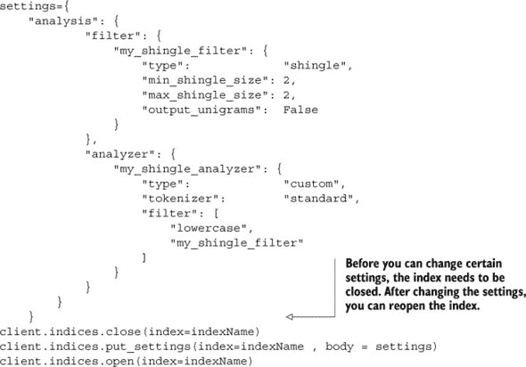

您创建了两个新元素：一个名为“my shingle filter”的标记过滤器和一个名为“my_shingle_analyzer”的新分析器。由于*n*-gram 非常常见，Elasticsearch 自带了一个内置的瓦片标记过滤器类型。您需要告诉它的只是您想要二元组`"min_shingle_size" : 2, "max_shingle_size" : 2`，如图 6.34 所示。您可以选择三元组或更高阶的，但为了演示目的，这已经足够了。

##### 图 6.34\. 用于生成二元组的瓦片标记过滤器

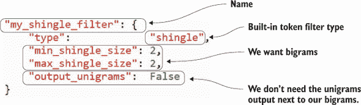

如图 6.35 所示的分析器是所有从输入文本到索引所需操作的组合。它包含了瓦片过滤器，但远不止于此。标记器将文本分割成标记或术语；然后您可以使用小写过滤器，这样在搜索“糖尿病”与“diabetes”时就没有区别。最后，您应用您的瓦片过滤器，创建您的二元组。

##### 图 6.35\. 带有标准标记化和瓦片标记过滤器的自定义分析器，用于生成二元组

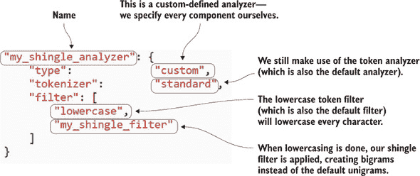

注意，在更新设置之前您需要关闭索引。然后您可以安全地重新打开索引，知道您的设置已经更新。并非所有设置更改都需要关闭索引，但这次需要。您可以在[`www.elastic.co/guide/en/elasticsearch/reference/current/indices-update-settings.html`](http://www.elastic.co/guide/en/elasticsearch/reference/current/indices-update-settings.html)找到需要关闭索引的设置概览。

索引现在可以准备使用你的新分析器了。为此，你将创建一个新的文档类型 `diseases2`，并使用新的映射，如下所示。

##### 列表 6.6\. 创建更高级的 Elasticsearch doctype 映射

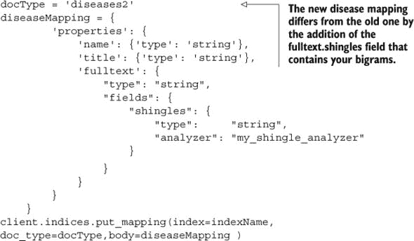

在 `fulltext` 中，你现在有一个额外的参数，`fields`。在这里，你可以指定所有不同的 `fulltext` 同位素。你只有一个；它被称为 `shingles`，将使用你的新 `my_shingle_analyzer` 分析 `fulltext`。你仍然可以访问你原始的 `fulltext`，你没有为这个指定分析器，所以将使用之前的标准分析器。你可以通过给出属性名后跟其字段名来访问新的一个：`fulltext.shingles`。你现在需要做的就是按照前面的步骤进行，并使用维基百科 API 索引数据，如下所示。

##### 列表 6.7\. 使用新的 doctype 映射重新索引维基百科疾病解释

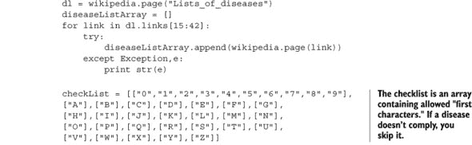

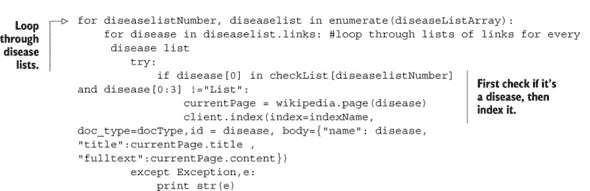

这里没有新的内容，只是这次你将索引 doc_type `diseases2` 而不是 `diseases`。当这一步完成后，你又可以继续前进到第 4 步，数据探索，并检查结果。

#### 6.2.5\. 重新审视第 4 步：疾病配置文件的数据探索

你又一次到达了数据探索阶段。你可以调整聚合查询，并使用你的新字段来获取与糖尿病相关的大词组关键概念：

##### 列表 6.8\. 基于 bigrams 对“糖尿病”进行显著术语聚合

```
searchBody={
"fields":["name"],
"query":{
    "filtered" : {
        "filter": {
            'term': {'name':'diabetes'}
        }
    }
},
"aggregations" : {
        "DiseaseKeywords" : {
            "significant_terms" : { "field" : "fulltext", "size" : 30 }
        },
        "DiseaseBigrams": {
            "significant_terms" : { "field" : "fulltext.shingles",
"size" : 30 }
        }
    }
}
client.search(index=indexName,doc_type=docType,
body=searchBody, from_ = 0, size=3)
```

你的新聚合，称为 `DiseaseBigrams`，使用 `fulltext.shingles` 字段为糖尿病提供一些新的见解。这些新关键词出现了：

+   ***过度排尿*** —糖尿病患者需要频繁排尿。

+   ***多尿的原因*** —这表明了相同的事情：糖尿病导致患者频繁排尿。

+   ***剥夺测试*** —这实际上是一个三元组，“水剥夺测试”，但它识别了 *剥夺测试*，因为你只有 bigrams。这是一个用来确定患者是否患有糖尿病的测试。

+   ***过度口渴*** —你已经通过单语元关键词搜索找到了“口渴”，但从技术上讲，在那个阶段它可能意味着“没有口渴”。

还有其他有趣的 bigrams、unigrams，可能还有 trigrams。整体来看，它们可以在阅读之前用来分析文本或文本集合。请注意，你没有到达建模阶段就实现了预期的结果。有时，数据探索中至少有与数据建模一样多的有价值信息。现在你已经完全实现了你的次要目标，可以继续到数据科学过程的第 6 步：展示和自动化。

#### 6.2.6\. 第 6 步：展示和自动化

您的主要目标，疾病诊断，通过允许医生通过例如网络应用程序查询它，变成了一个自助诊断工具。在这种情况下，您不会构建一个网站，但如果您打算这样做，请阅读侧边栏“Elasticsearch for web applications。”

| |
| --- |

**Elasticsearch for web applications**

与任何其他数据库一样，直接将您的 Elasticsearch REST API 暴露给网络应用程序的前端是一种不良做法。如果网站可以直接向您的数据库发送 POST 请求，任何人都可以轻易地删除您的数据：始终需要一个中间层。这个中间层可以是 Python，如果您喜欢的话。两种流行的 Python 解决方案是 Django 或与独立前端结合使用的 Django REST 框架。Django 通常用于构建*往返应用程序*（服务器根据数据库中的数据和一个模板系统动态构建前端，的 Web 应用程序）。Django REST 框架是 Django 的一个插件，将 Django 转换成一个 REST 服务，使其能够成为单页应用程序的一部分。单页应用程序是一个使用单个网页作为锚点的 Web 应用程序，但它能够通过从 HTTP 服务器检索静态文件和从 RESTful API 获取数据来动态更改内容。这两种方法（往返和单页）都是可以的，只要 Elasticsearch 服务器本身不对公众开放，因为它没有内置的安全措施。可以直接使用“Shield”，一个 Elasticsearch 付费服务，向 Elasticsearch 添加安全措施。

| |
| --- |

第二个目标，疾病分析，也可以提升到用户界面的水平；可以让搜索结果生成一个词云，直观地总结搜索结果。我们在这本书中不会走那么远，但如果您对在 Python 中设置类似的东西感兴趣，请使用 word_cloud 库（`pip install word_cloud`）。或者如果您更喜欢 JavaScript，D3.js 是一个不错的选择。您可以在[`www.jasondavies.com/wordcloud/#%2F%2Fwww.jasondavies.com%2Fwordcloud%2Fabout%2F`](http://www.jasondavies.com/wordcloud/#%2F%2Fwww.jasondavies.com%2Fwordcloud%2Fabout%2F)找到示例实现。

在这个由 D3.js 驱动的网站上添加您的关键词将生成一个类似于图 6.36 的单词云，可以将其纳入您项目结果展示中。在这种情况下，术语不是根据它们的分数进行加权的，但它已经提供了对发现的一个很好的表示。

##### 图 6.36\. 来自 Elasticsearch 的非加权糖尿病关键词的单词云

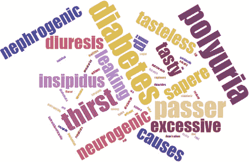

您的应用程序有很多改进空间，尤其是在数据准备方面。但深入探讨所有可能性会让我们走得太远；因此，我们来到了这一章的结尾。在下一章中，我们将探讨流数据。

### 6.3\. 总结

在本章中，你学习了以下内容：

+   *NoSQL* 代表“不仅限于结构化查询语言”，它源于处理指数级增长的数据量和种类以及对于更多样化和灵活的模式的日益增长的需求，如网络和层次结构。

+   处理所有这些数据需要数据库分区，因为没有任何一台机器能够完成所有的工作。在分区时，CAP 定理适用：你可以拥有可用性或一致性，但永远不会同时拥有两者。

+   关系型数据库和图数据库遵循 ACID 原则：原子性、一致性、隔离性和持久性。NoSQL 数据库通常遵循 BASE 原则：基本可用性、软状态和最终一致性。

+   最大的四种 NoSQL 数据库类型

    +   ***键值存储*** — 实质上是一系列存储在数据库中的键值对。这些数据库可以非常大且非常灵活，但数据复杂性较低。一个著名的例子是 Redis。

    +   ***宽列数据库*** — 这些数据库比键值存储更复杂，因为它们使用列，但比常规的关系型数据库管理系统（RDBMS）更高效。列基本上是解耦的，允许你快速检索单个列中的数据。一个著名的数据库是 Cassandra。

    +   ***文档存储*** — 这些数据库稍微复杂一些，以文档的形式存储数据。目前最受欢迎的是 MongoDB，但在我们的案例研究中，我们使用的是 Elasticsearch，它既是文档存储也是搜索引擎。

    +   ***图数据库*** — 这些数据库可以存储最复杂的数据结构，因为它们以相同的方式关注实体及其之间的关系。这种复杂性在查找速度上是有代价的。一个流行的是 Neo4j，但 GraphX（与 Apache Spark 相关的图数据库）正在赢得市场份额。

+   Elasticsearch 是建立在 Apache Lucene 之上的文档存储和全文搜索引擎，Apache Lucene 是一个开源的搜索引擎。它可以用于分词、执行聚合查询、执行维度（分面）查询、分析搜索查询以及更多功能。
