## 第八章。文本挖掘和文本分析

*本章涵盖*

+   理解文本挖掘的重要性

+   介绍文本挖掘中的最重要的概念

+   完成文本挖掘项目

世界上大部分人类记录的信息都是以书面文字的形式存在的。我们从婴儿时期就开始学习阅读和写作，以便通过写作表达自己，并学习他人的知识、想法和感受。我们在阅读或撰写电子邮件、博客、短信或这本书时都会使用这项技能，因此对大多数人来说，书面语言是自然而然的。企业相信，人们产生的文本中可以找到很多价值，这是正确的，因为这些文本包含了关于这些人喜欢什么、不喜欢什么、知道什么或想了解什么、渴望和需求、他们的当前健康状况或情绪等等的信息。其中许多内容对公司或研究人员来说都可能是相关的，但没有人能够独自阅读和解释这些海量的书面材料。再次，我们需要求助于计算机来完成这项工作。

然而，不幸的是，自然语言对计算机来说并不像对人类那样“自然”。从意义中提取并过滤掉不重要的信息仍然是人类比任何机器都擅长的事情。幸运的是，数据科学家可以应用特定的文本挖掘和文本分析技术，从他们自己可能需要数百年时间才能阅读的文本堆中找到相关信息。

*文本挖掘*或*文本分析*是一门结合语言科学和计算机科学、统计和机器学习技术的学科。文本挖掘用于分析文本并将它们转化为更结构化的形式。然后，它尝试从这个结构化形式中提取见解。例如，在分析警察报告中的犯罪时，文本挖掘可以帮助你从报告中识别人员、地点和犯罪类型。然后，这种新的结构被用来深入了解犯罪的演变。参见图 8.1。

##### 图 8.1. 在文本分析中，（通常）第一个挑战是结构化输入文本；然后它可以被彻底分析。

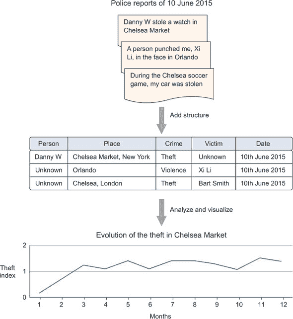

虽然语言并不仅限于自然语言，但本章的重点将放在*自然语言处理（NLP）*上。非自然语言的例子包括机器日志、数学和莫尔斯电码。技术上讲，甚至世界语、克林贡语和龙语也不属于自然语言的范畴，因为它们是人为发明而非随着时间的推移演变而来的；它们对我们来说并非“自然”。然而，这些最后提到的语言适合自然交流（口语、写作）；它们拥有像所有自然语言一样的语法和词汇，并且可以使用相同的文本挖掘技术。

### 8.1. 真实世界中的文本挖掘

在你的日常生活中，你已经遇到了文本挖掘和自然语言应用。自动补全和拼写检查器在发送电子邮件或短信之前会不断分析你输入的文本。当 Facebook 使用名为“命名实体识别”的技术自动补全你的状态时，它会帮助你完成这个过程，尽管这将是他们技能库中的一个组成部分。目标不仅仅是检测你正在输入一个名词，而是猜测你指的是一个人并识别可能是谁。命名实体识别的另一个例子在图 8.2 中展示。谷歌知道切尔西是一个足球俱乐部，但在被问及一个人时，它的回应则不同。

##### 图 8.2。对查询“切尔西是谁？”和“切尔西是什么？”的不同回答表明，谷歌使用文本挖掘技术来回答这些问题。


谷歌在呈现查询结果时使用了多种类型的文本挖掘。当有人说“切尔西”时，你脑海中首先想到的是什么？切尔西可能指很多事物：一个人；一个足球俱乐部；纽约或伦敦的一个社区；一个食品市场；一个花展；等等。谷歌知道这一点，并在回答“切尔西是谁？”和“切尔西是什么？”这两个问题时给出不同的答案。为了提供最相关的答案，谷歌必须做（包括其他事情）以下所有事情：

+   对它收集的所有文档进行命名实体预处理

+   执行语言识别

+   检测你指的是哪种实体

+   将查询与结果进行匹配

+   检测要返回的内容类型（PDF，成人敏感）

这个例子表明，文本挖掘不仅仅是关于文本的直接含义，还涉及到元属性，如语言和文档类型。

谷歌在回答查询时不仅使用文本挖掘，还用于其他许多方面。除了保护其 Gmail 用户免受垃圾邮件的侵扰外，它还将电子邮件分为不同的类别，如社交、更新和论坛，如图 8.3 所示。

##### 图 8.3。根据内容和来源，可以自动根据内容将电子邮件分类。


当你结合文本与其他逻辑和数学时，你可以在回答简单问题之外走得更远。

这使得基于自然语言查询的*自动推理引擎*的创建成为可能。图 8.4 展示了计算知识引擎“Wolfram Alpha”如何使用文本挖掘和自动推理来回答问题“美国人口是否比中国多？”

##### 图 8.4。Wolfram Alpha 引擎使用文本挖掘和逻辑推理来回答问题。

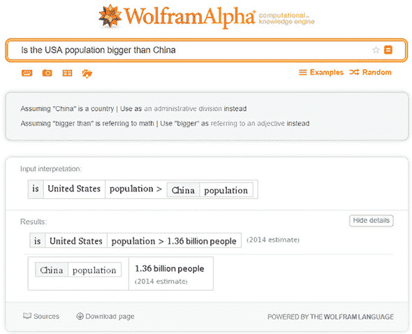

如果这还不够令人印象深刻，IBM Watson 在 2011 年让许多人惊讶，当时机器在一场*Jeopardy*游戏中对抗两名人类玩家。*Jeopardy*是一档美国问答节目，人们收到问题的答案，并因猜测出正确的问题而得分。参见图 8.5。

##### 图 8.5。IBM Watson 在*Jeopardy*游戏中战胜人类玩家。

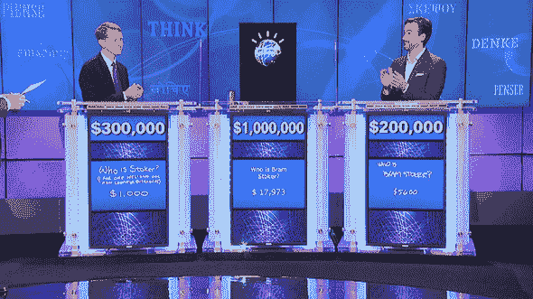

可以肯定地说，这一轮人工智能获胜。IBM Watson 是一个认知引擎，它可以解释自然语言，并基于广泛的知识库回答问题。

文本挖掘有许多应用，包括但不限于以下内容：

+   实体识别

+   抄袭检测

+   主题识别

+   文本聚类

+   翻译

+   自动文本摘要

+   欺诈检测

+   邮件过滤

+   情感分析

文本挖掘很有用，但它困难吗？很抱歉让你失望：是的，它很困难。

当查看 Wolfram Alpha 和 IBM Watson 的示例时，你可能会得到文本挖掘很容易的印象。遗憾的是，并非如此。实际上，文本挖掘是一项复杂的任务，甚至许多看似简单的事情也无法令人满意地完成。例如，考虑猜测正确地址的任务。图 8.6 显示了如何难以确信地返回精确的结果，以及当搜索“Springfield”时，Google Maps 如何提示你提供更多信息。在这种情况下，如果没有额外的上下文，人类也不会做得更好，但这个歧义是你在文本挖掘应用中面临的问题之一。

##### 图 8.6。由于查询“Springfield”的歧义，Google Maps 要求你提供更多信息。

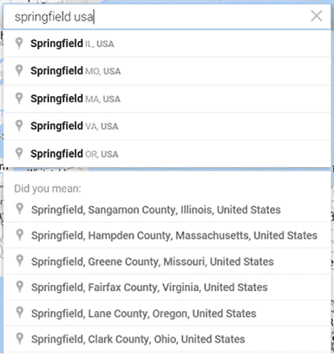

另一个问题是对一个词的*拼写错误*和*不同的（正确的）拼写形式*。以下是对纽约的三个引用：“NY”，“Neww York”，和“New York”。对人类来说，很容易看出它们都指的是纽约市。由于我们的大脑解释文本的方式，理解带有拼写错误的文本对我们来说很自然；人们甚至可能没有注意到它们。但对于计算机来说，除非我们使用算法告诉它它们指的是同一个实体，否则这些是无关的字符串。相关问题是同义词和代词的使用。尝试在以下句子中为代词“她”分配正确的人：“John 在他第一次见到 Marleen 的父母时给了 Marleen 的父母花。她对此举感到非常高兴。”这很容易，对吗？不对，对计算机来说不是这样。

我们可以轻松解决许多类似的问题，但它们通常对机器来说很难。我们可以训练算法在定义良好的范围内解决特定问题，但更通用的算法在所有情况下都是另一回事。例如，我们可以教会计算机从文本中识别和检索美国账户号码，但这并不能很好地推广到其他国家的账户号码。

语言算法对语言使用的上下文也很敏感，即使语言本身保持不变。英语模型对阿拉伯语不起作用，反之亦然，但即使我们坚持使用英语——为 Twitter 数据训练的算法在法律文本上可能表现不佳。当我们继续进行章节案例研究时，请记住这一点：在文本挖掘中没有完美的一劳永逸的解决方案。

### 8.2. 文本挖掘技术

在我们即将进行的案例研究中，我们将解决*文本分类*问题：自动将未分类的文本分类到特定的类别中。要从原始文本数据到达我们的最终目的地，我们需要一些数据挖掘技术，这些技术需要背景信息以便我们有效地使用它们。文本挖掘中的第一个重要概念是“词袋”。

#### 8.2.1. 词袋

为了构建我们的分类模型，我们将采用词袋方法。*词袋*是结构化文本数据最简单的方式：每个文档都被转换成一个词向量。如果一个特定的词出现在向量中，它被标记为“True”；其他的是“False”。图 8.7 展示了这种方法的简化示例，假设只有两个文档：一个是关于电视剧*权力的游戏*的，另一个是关于数据科学的。这两个词向量一起形成了*文档-词矩阵*。文档-词矩阵为每个术语都有一个列，为每个文档都有一个行。值由你决定。在本章中，我们将使用二进制：术语是否存在？是或否。

##### 图 8.7. 文本通过标记每个词（术语）在文档中存在时为“True”，不存在时为“False”来转换为词袋。

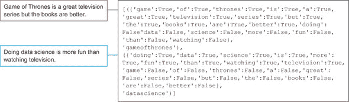

图 8.7 中的示例确实给你一个关于我们将需要开始文本分析的结构化数据的概念，但它严重简化了：没有过滤掉任何单词，也没有应用词干提取（我们稍后会讨论）。一个大型的语料库可以包含成千上万的独特单词。如果所有这些单词都必须这样标记而没有过滤，很容易看出我们可能会得到大量数据。图 8.7 中显示的*二进制编码词袋*只是结构化数据的一种方式；其他技术也存在。

| |
| --- |

**词频-逆文档频率（TF-IDF**）

填充文档-词矩阵的一个著名公式是*TF-IDF*，即词频乘以逆文档频率。*二进制词袋*分配 True 或 False（术语是否存在），而*简单频率*计算术语出现的次数。TF-IDF 稍微复杂一些，考虑了术语在文档中出现的次数（TF）。TF 可以是简单的术语计数，二进制计数（True 或 False），或对数缩放的术语计数。这取决于对你来说什么最有效。如果 TF 是词频，TF 的公式如下：

*TF* = *f[t,d]*

TF 是术语（t）在文档（d）中的频率（f）。

但 TF-IDF 也考虑了所有其他文档，这是由于逆文档频率（Inverse Document Frequency）的影响。IDF 给出了一个词在整个语料库中普遍程度的概念：文档频率越高，词越常见，而常见的词提供的信息越少。例如，“a”或“the”这样的词不太可能提供关于文本的具体信息。具有对数缩放的 IDF 公式是最常用的 IDF 形式：

*IDF* = log(*N*/|{*d* ε *D*:*t* ε *d*}|)

其中*N*是语料库中文档的总数，而|{*d* ε *D*:*t* ε *d*}|是包含术语（t）的文档（d）的数量。

TF-IDF 分数对某个词的描述是：这个词在区分语料库中的文档与其他文档时有多重要？因此，TF-IDF 的公式是

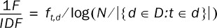

我们不会使用 TF-IDF，但在设置您在文本挖掘中的下一步时，这应该是您将遇到的第一件事之一。TF-IDF 也是 Elasticsearch 在第六章幕后所使用的。如果您想使用 TF-IDF 进行文本分析，这是一个好方法；将文本挖掘留给专门的软件，如 SOLR 或 Elasticsearch，并从那里获取文本分析的文档/术语矩阵。

| |
| --- |

在到达实际的词袋模型之前，许多其他数据操作步骤都会发生：

+   **分词** —文本被切分成称为“标记”或“术语”的片段。这些标记是您在模型中将使用的最基本的信息单元。术语通常是单词，但这不是必需的。整个句子也可以用于分析。我们将使用**单词**：只包含一个单词的术语。然而，通常包括**二元组**（每个标记两个单词）或**三元组**（每个标记三个单词）以捕捉额外的意义并提高模型的表现力。但这也会带来成本，因为您通过在方程中包含二元组和/或三元组来构建更大的术语向量。

+   **停用词过滤** —每种语言都有一些词在文本分析中价值不大，因为它们被使用得非常频繁。NLTK 附带了一个简短的英语停用词列表，我们可以过滤掉这些低信息量的停用词。如果文本被切分成单词，通常有道理从单词向量中去除这些低信息的停用词。

+   **小写化** —大写字母开头的单词出现在句子的开头，其他单词因为它们是专有名词或形容词。在我们的术语矩阵中，我们不会从这种区分中获得额外的价值，因此所有术语都将设置为小写。

另一种数据准备技术是**词干提取**。这一点需要更详细的解释。

#### 8.2.2. 词干提取和词形还原

*词干提取* 是将单词还原到其词根形式的过程；这样你最终得到的数据变异性更小。如果单词具有相似的含义但书写不同，例如一个单词是复数形式，这就有意义了。词干提取试图通过截断单词的一部分来实现统一。例如，“planes”和“plane”都变成了“plane”。

另一种技术，称为 *词干提取*，具有相同的目标，但以更语法敏感的方式进行。例如，虽然词干提取和词干提取都会将“cars”还原为“car”，但词干提取还可以将动词的变形还原为非变形形式，例如将“are”还原为“be”。你使用哪一种取决于你的情况，词干提取在很大程度上受益于词性标注（词性标注）。*词性标注* 是将语法标签分配给句子中每个部分的过程。你可能在学校作为语言练习手动执行过这个操作。以句子“*Game of Thrones* is a television series.”为例。如果我们对它进行词性标注，我们得到

+   | VBZ | 动词，第三人称单数现在时 | WDT | 疑问限定词 |

NN 是名词，IN 是介词，NNS 是名词的复数形式，VBZ 是第三人称单数动词，而 DT 是限定词。表 8.1 包含了完整的列表。

##### 表 8.1\. 所有词性标注的列表

| Tag | 标签含义 | Tag | 标签含义 |
| --- | --- | --- | --- |
| CC | 并列连词 | CD | 基数词 |
| DT | 限定词 | EX | 存在 |
| ({“game”:”NN”},{“of”:”IN”},{“thrones”:”NNS”},{“is”:”VBZ”},{“a”:”DT”},{“television”:”NN”},{“series”:”NN”}) |
| JJ | 形容词 | JJR | 形容词，比较级 |
| JJS | 形容词，最高级 | LS | 列表项标记 |
| MD | 情态动词 | NN | 名词，单数或复数 |
| NNS | 名词，复数 | NNP | 名词，单数 |
| NNPS | 名词，复数 | PDT | 预定冠词 |
| POS | 物主后缀 | PRP | 人称代词 |
| PRP$ | 物主代词 | RB | 副词 |
| RBR | 副词，比较级 | RBS | 副词，最高级 |
| VBN | 动词，过去分词 | VBP | 动词，非第三人称单数现在时 |
| UH | 呼语 | VB | 动词，基本形式 |
| VBD | 动词，过去式 | VBG | 动词，动名词或现在分词 |
| FW | 外来词 | IN | 介词或从属连词 |
| 我们现在知道我们将使用来做数据清洗和操作（文本挖掘）的最重要的事情。对于我们的文本分析，让我们将决策树分类器添加到我们的工具箱中。 |
| WP | 疑问代词 | WP$ | 物主疑问代词 |
| RP | 动词小品词 | SYM | 符号 |

词性标注是句子分词而不是单词分词的一个用例。在完成词性标注后，你仍然可以继续进行单词分词，但词性标注器需要整个句子。将词性标注和词干提取结合起来，可能比仅使用词干提取提供更干净的数据。为了简化，我们在案例研究中将坚持使用词干提取，但请将此视为详细阐述练习的机会。

| WRB | 疑问副词 |   |   |

#### 8.2.3. 决策树分类器

我们案例研究的数据分析部分也将保持简单。我们将测试一个朴素贝叶斯分类器和决策树分类器。如第三章中所述，朴素贝叶斯分类器之所以被称为朴素贝叶斯，是因为它认为每个输入变量都是独立于所有其他变量的，这在文本挖掘中尤其天真。以“数据科学”、“数据分析”或“权力的游戏”的简单例子来说，如果我们对我们的数据使用单语元进行切割，我们会得到以下单独的变量（如果我们忽略词干提取等）：“数据”、“科学”、“分析”、“游戏”、“of”和“thrones”。显然，链接将会丢失。这可以通过创建双语元（数据科学、数据分析）和三元组（权力的游戏）来克服。

然而，决策树分类器并不认为变量之间是相互独立的，并且会积极创建*交互变量*和*桶*。一个*交互变量*是结合其他变量的变量。例如，“数据”和“科学”本身可能是很好的预测因子，但这两者在同一文本中同时出现可能具有其自身的价值。桶则相反。不是将两个变量合并，而是将一个变量分割成多个新的变量。这对于数值变量来说是有意义的。图 8.8 展示了决策树可能的样子以及你可以找到交互和桶化的地方。

##### 图 8.8. 虚拟决策树模型。决策树自动创建桶并假设输入变量之间存在交互。

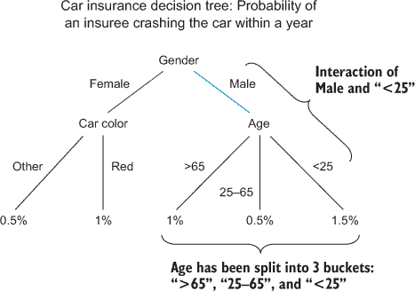

与朴素贝叶斯假设所有输入变量相互独立不同，决策树是基于相互依赖的假设构建的。但它是如何构建这个结构的呢？决策树有几个可能的准则可以用来分割成分支并决定哪些变量比其他变量更重要（更接近树的根部）。我们在 NLTK 决策树分类器中使用的准则是“信息增益”。为了理解信息增益，我们首先需要看看熵。*熵*是衡量不可预测性或混沌的度量。一个简单的例子就是婴儿的性别。当女性怀孕时，胎儿的性别可能是男性或女性，但我们不知道具体是哪一个。如果你要猜测，你有 50%的机会猜对（考虑到性别分布并不完全均匀）。然而，在怀孕期间，你有机会进行超声波检查以确定胎儿的性别。超声波检查永远不会 100%确定，但随着胎儿发育的深入，其准确性会越来越高。这种准确性的提升，或称*信息增益*，是因为不确定性或熵降低了。假设怀孕 12 周时进行超声波检查，在确定婴儿性别方面有 90%的准确性。仍然存在 10%的不确定性，但超声波确实将不确定性从 50%降低到了 10%。这是一个相当好的判别器。决策树遵循同样的原则，如图 8.9 所示。

##### 图 8.9\. 具有一个变量的决策树：医生通过观察怀孕期间的超声波检查得出的结论。胎儿为女性的概率是多少？

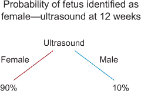

如果另一个性别测试具有更强的预测能力，它可能成为树的根，而超声波测试则位于树枝上，这个过程可以一直持续到我们用尽变量或观察数据。我们可能会用尽观察数据，因为在每个分支分叉时，我们也会分割输入数据。这是决策树的一个大弱点，因为在树的叶级，如果剩余的观察数据太少，鲁棒性就会崩溃；决策树开始过度拟合数据。*过度拟合*使得模型会将随机性误认为是真实的关联。为了对抗这一点，决策树会被*剪枝*：其无意义的分支被排除在最终模型之外。

现在我们已经了解了最重要的新技巧，让我们深入到案例研究中。

### 8.3\. 案例研究：分类 Reddit 帖子

虽然文本挖掘有许多应用，但在本章的案例研究中，我们专注于**文档分类**。正如本章前面所指出的，这正是谷歌在将您的电子邮件分类或尝试区分垃圾邮件和常规邮件时所做的事情。它也被客户服务中心广泛使用，以处理客户提出的问题或投诉：书面投诉首先通过主题检测过滤器，以便可以分配给正确的人员处理。文档分类也是社交媒体监控系统的一项必备功能。被监控的推文、论坛或 Facebook 帖子、报纸文章以及许多其他互联网资源都被分配了主题标签。这样，它们可以在报告中重复使用。**情感分析**是文本分类的一种特定类型：帖子的作者对某事是消极的、积极的还是中性的？这个“某事”可以通过实体识别来识别。

在这个案例研究中，我们将利用 Reddit 的帖子，Reddit 也被称为自称为“互联网首页”的网站，并尝试训练一个能够区分某人是否在谈论“数据科学”或“权力的游戏”的模型。

最终结果可以是我们的模型演示或一个完整的交互式应用程序。在第九章（[kindle_split_017.xhtml#ch09](https://kindle_split_017.xhtml#ch09)）中，我们将专注于为最终用户构建应用程序，所以现在我们将坚持展示我们的分类模型。

为了实现我们的目标，我们需要尽可能多的帮助和工具，而 Python 一次又一次地准备好提供这些。

#### 8.3.1. 认识自然语言工具包

Python 可能不是地球上执行效率最高的语言，但它有一个成熟的文本挖掘和语言处理包：**自然语言工具包 (NLTK)**。NLTK 是一组算法、函数和标注作品，将引导您在文本挖掘和自然语言处理的第一步。NLTK 在 nltk.org 上也有出色的文档。然而，NLTK 并不常用于生产级工作，如 scikit-learn 等其他库。

| |
| --- |

**安装 NLTK 及其语料库**

使用您喜欢的包安装程序安装 NLTK。如果您使用 Anaconda，它将默认与 Anaconda 设置一起安装。否则，您可以选择“pip”或“easy_install”。完成此操作后，您仍然需要安装包含的模型和语料库，以便使其完全功能。为此，请运行以下 Python 代码：

+   import nltk

+   nltk.download()

根据您的安装，这将为您提供弹出窗口或更多命令行选项。

 显示了执行 `nltk.download()` 命令时出现的弹出窗口。

##### 图 8.10. 选择所有包以完全完成 NLTK 的安装。


如果您喜欢，可以下载所有语料库，但本章我们只会使用“punkt”和“stopwords”。此下载将在本书附带代码中明确提及。


本章提供了两个 IPython 笔记本文件：

+   ***数据收集*** —包含本章案例研究的数据收集部分。

+   ***数据准备和分析*** —存储的数据经过数据准备，然后进行数据分析。

所有即将到来的案例研究中的代码都可以在这两个文件中按相同顺序找到，也可以这样运行。此外，还提供了两个可下载的交互式图形：

+   ***forceGraph.html*** —表示我们的朴素贝叶斯模型的前 20 个特征

+   ***Sunburst.html*** —表示我们的决策树模型的前四个分支

要打开这两个 HTML 页面，需要一个 HTTP 服务器，您可以使用 Python 和命令窗口来获取：

+   打开一个命令窗口（Linux、Windows，随便您喜欢）。

+   移动到包含 HTML 文件及其 JSON 数据文件的文件夹：decisionTreeData.json 用于 sunburst 图和 NaiveBayesData.json 用于 force 图。重要的是 HTML 文件必须与它们的数据文件位于同一位置，否则您将不得不更改 HTML 文件中的 JavaScript。

+   使用以下命令创建一个 Python HTTP 服务器：`python –m Simple-HTTPServer 8000`

+   打开浏览器并转到 localhost:8000；在这里，您可以像图 8.11 所示选择 HTML 文件。

    ##### 图 8.11\. Python HTTP 服务器提供本章的输出

    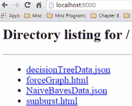

本章我们将使用的 Python 包：

+   ***NLTK*** —用于文本挖掘

+   ***PRAW*** —允许从 Reddit 下载帖子

+   ***SQLite3*** —使我们能够以 SQLite 格式存储数据

+   ***Matplotlib*** —用于数据可视化的绘图库

在继续之前，请确保安装所有必要的库和语料库。然而，在我们深入行动之前，让我们看看我们将采取的步骤来实现我们的目标：创建一个主题分类模型。

#### 8.3.2\. 数据科学流程概述和第 1 步：研究目标

为了解决这个文本挖掘练习，我们再次利用数据科学流程。图 8.12 显示了将数据科学流程应用于我们的 Reddit 分类案例。

##### 图 8.12\. 将数据科学流程概述应用于 Reddit 主题分类案例研究

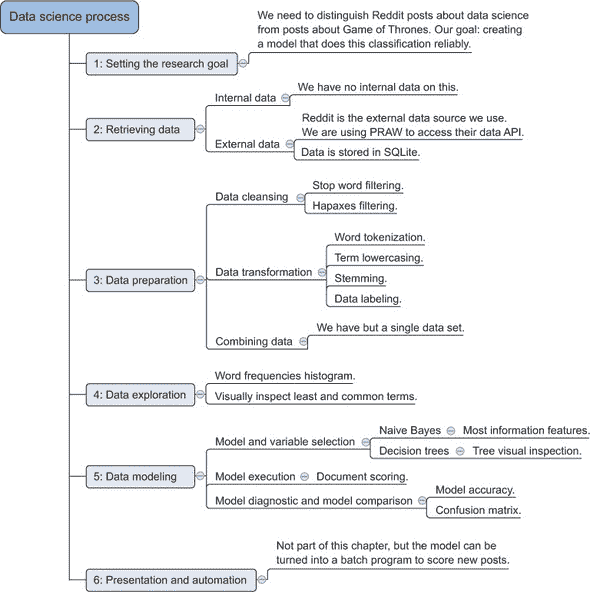

在此阶段，图 8.12 中描绘的所有元素可能并不都很有意义，本章的其余部分将致力于在实践中解决这个问题，我们朝着我们的研究目标前进：创建一个能够区分关于“数据科学”的帖子与关于“权力的游戏”的帖子的分类模型。无需多言，让我们去获取我们的数据。

#### 8.3.3\. 第 2 步：数据检索

我们将使用 Reddit 数据来处理这个案例，对于那些不熟悉 Reddit 的人，请花时间熟悉其概念，请访问[www.reddit.com](http://www.reddit.com)。

Reddit 自称为“互联网首页”，因为用户可以发布他们觉得有趣或在网上找到的内容，只有那些被许多人认为有趣的内容才会被展示在其首页上作为“热门”。可以说 Reddit 给出了互联网上趋势事物的概述。任何用户都可以在预定义的分类中发布，这个分类被称为“subreddit”。当一个帖子发布后，其他用户可以对其发表评论，如果他们喜欢内容，可以对其进行点赞；如果不喜欢，可以对其进行踩。因为帖子总是属于某个 subreddit，所以当我们连接到 Reddit API 获取数据时，我们就有这样的元数据可以利用。我们实际上是在获取标记数据，因为我们假设 subreddit “gameofthrones” 中的帖子与“gameofthrones”有关。

为了获取我们的数据，我们使用了官方的 Reddit Python API 库，称为 PRAW。一旦我们获取了所需的数据，我们就会将其存储在一个轻量级的类似数据库的文件中，称为 SQLite。SQLite 对于存储少量数据非常理想，因为它不需要任何设置即可使用，并且可以像任何常规的关系数据库一样响应 SQL 查询。任何其他数据存储介质都可以；如果您更喜欢 Oracle 或 Postgres 数据库，Python 有一个出色的库可以与之交互，而无需编写 SQL。SQLAlchemy 也可以用于 SQLite 文件。图 8.13 显示了数据科学过程中的数据检索步骤。

##### 图 8.13\. Reddit 主题分类案例的数据科学过程数据检索步骤

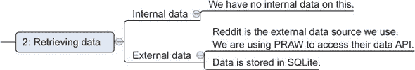

打开您喜欢的 Python 解释器；现在是行动的时候了，如列表 8.1 所示。首先我们需要从 Reddit 网站收集我们的数据。如果您还没有安装，请在运行以下脚本之前使用 `pip install praw` 或 `conda install praw`（Anaconda）。


##### 注意

步骤 2 的代码也可以在 IPython 文件中找到，位于“第八章 数据收集”部分。它可在本书的下载区获取。


##### 列表 8.1\. 设置 SQLite 数据库和 Reddit API 客户端

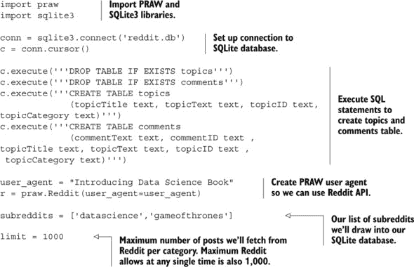

让我们先导入必要的库。

现在我们已经可以访问 SQLite3 和 PRAW 功能，我们需要为即将接收的数据准备我们的本地数据库。通过定义一个到 SQLite 文件的连接，如果它还不存在，我们会自动创建它。然后我们定义一个数据游标，它可以执行任何 SQL 语句，因此我们使用它来预定义数据库的结构。数据库将包含两个表：主题表包含 Reddit 主题，类似于某人在论坛上发起一个新的帖子，第二个表包含评论，并通过“topicID”列与主题表相关联。这两个表之间存在一对一（主题表）到多对一（评论表）的关系。对于案例研究，我们将限制自己只使用主题表，但数据收集将包括两者，因为这允许你在愿意的情况下实验这些额外数据。为了磨练你的文本挖掘技能，你可以对主题评论进行情感分析，找出哪些主题收到了负面或正面的评论。然后你可以将此与本章末尾我们将产生的模型特征相关联。

我们需要创建一个 PRAW 客户端来获取数据。每个 subreddit 都可以通过其名称来识别，我们感兴趣的是“datascience”和“gameofthrones”。限制表示我们从 Reddit 中抽取的最大主题数量（帖子，不是评论）。一千也是 API 在任何给定请求中允许我们获取的最大数量，尽管我们可以在人们发布新内容后稍后请求更多。实际上，我们可以定期运行 API 请求并随着时间的推移收集数据。虽然在任何给定时间你只能限制为一千篇帖子，但没有任何东西阻止你在几个月的时间里扩大你自己的数据库。值得注意的是，以下脚本可能需要大约一个小时才能完成。如果你不想等待，请随意继续并使用可下载的 SQLite 文件。此外，如果你现在运行它，你不太可能得到与最初运行以创建本章中显示的输出完全相同的输出。

让我们看看我们的数据检索函数，如下所示。

##### 列表 8.2\. Reddit 数据在 SQLite 中的检索和存储

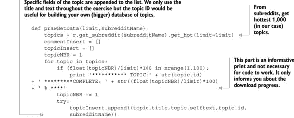

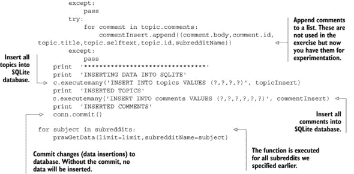

`prawGetData()`函数检索其 subreddit 中的“热门”主题，将其追加到数组中，然后获取所有相关评论。这个过程会一直进行，直到达到一千个主题或没有更多主题可以检索，并且所有内容都存储在 SQLite 数据库中。打印语句用于告知你收集一千个主题的进度。我们剩下的工作就是为每个 subreddit 执行该函数。

如果你希望这个分析包含超过两个 subreddits，这只是一个在 subreddits 数组中添加额外类别的问题。

收集数据后，我们就可以继续进行数据准备了。

#### 8.3.4\. 第 3 步：数据准备

总是来说，数据准备是获取正确结果的最关键步骤。对于文本挖掘来说，这一点尤为重要，因为我们甚至没有从结构化数据开始。

接下来的代码作为 IPython 文件在线提供，文件名为“第八章 数据准备和分析。”让我们首先导入所需的库并准备 SQLite 数据库，如下面的列表所示。

##### 列表 8.3\. 文本挖掘、库、语料库依赖项和 SQLite 数据库连接

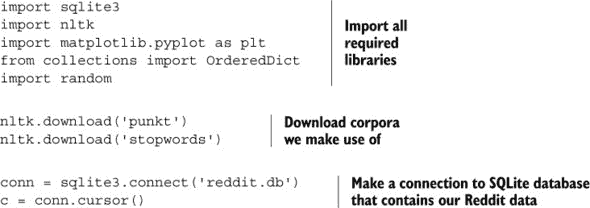

如果你还没有下载完整的 NLTK 语料库，我们现在将下载我们将要使用的那部分。如果你已经下载了它，脚本将检测你的语料库是否是最新的。

我们的数据仍然存储在 Reddit SQLite 文件中，所以让我们创建一个连接到它的连接。

在探索我们的数据之前，我们就知道至少有两件事要做来清理数据：停用词过滤和转换为小写。

一个通用的词过滤函数将帮助我们过滤掉不干净的部分。让我们在下面的列表中创建一个。

##### 列表 8.4\. 单词过滤和转换为小写的函数

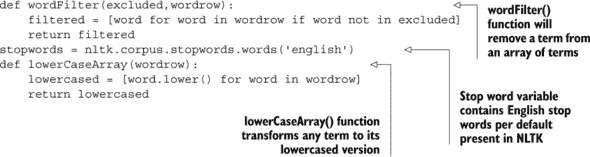

英语停用词将首先离开我们的数据。下面的代码将提供这些停用词：

```
stopwords = nltk.corpus.stopwords.words('english')
print stopwords
```

 显示了 NLTK 中的英语停用词列表。

##### 图 8.14\. NLTK 中的英语停用词列表

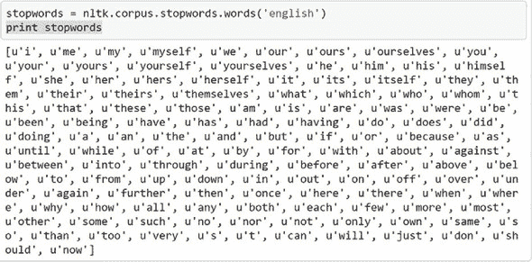

在所有必要的组件都到位之后，让我们看看下面的列表中我们的第一个数据处理函数。

##### 列表 8.5\. 第一个数据准备函数和执行

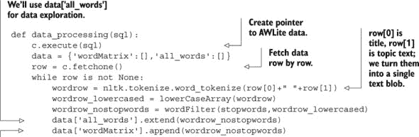

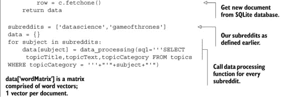

我们的 `data_processing()` 函数接收一个 SQL 语句并返回文档-词矩阵。它是通过逐个遍历数据（Reddit 主题）并使用词标记化将主题标题和主题正文文本合并成一个单词向量来做到这一点的。一个 *标记化器* 是一个文本处理脚本，它将文本分割成片段。你有多种不同的方式来标记化文本：你可以将其分割成句子或单词，可以按空格和标点符号分割，或者可以考虑到其他字符，等等。在这里，我们选择了标准的 NLTK 单词标记化器。这个单词标记化器很简单；它所做的只是如果单词之间有空格，就将文本分割成术语。然后我们将向量转换为小写并过滤掉停用词。注意这里的顺序很重要；如果我们在转换为小写之前先过滤停用词，那么句子开头的停用词就不会被过滤掉。例如，在“我喜欢权力的游戏”中，“我”就不会被转换为小写，因此不会被过滤掉。然后我们创建一个单词矩阵（术语-文档矩阵）和一个包含所有单词的列表。注意我们在这里没有过滤重复项；这样我们就可以在数据探索期间创建单词出现频率的直方图。让我们为我们的两个主题类别执行这个函数。

图 8.15 显示了“datascience”类别的第一个词向量。

##### 图 8.15\. 首次数据处理尝试后“datascience”类别的第一个词向量

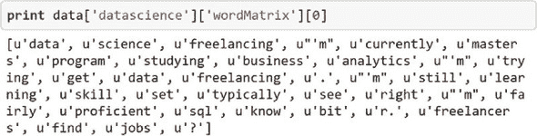

```
print data['datascience']['wordMatrix'][0]
```

这确实看起来很杂乱：标点符号被当作单独的术语，而且一些单词甚至没有被分割。进一步的数据探索应该会为我们澄清一些事情。

#### 8.3.5\. 步骤 4：数据探索

现在我们已经将所有术语分开，但数据的巨大规模阻碍了我们判断它是否足够干净以供实际使用。通过查看单个向量，我们已经发现了几个问题：一些单词没有被正确分割，向量中包含许多单字符术语。在某些情况下，单字符术语可能是好的主题区分器。例如，经济文本将包含比医学文本更多的$、£和€符号。但在大多数情况下，这些单字符术语是无用的。首先，让我们看看我们术语的频率分布。

```
wordfreqs_cat1 = nltk.FreqDist(data['datascience']['all_words'])
plt.hist(wordfreqs_cat1.values(), bins = range(10))
plt.show()
wordfreqs_cat2 = nltk.FreqDist(data['gameofthrones']['all_words'])
plt.hist(wordfreqs_cat2.values(), bins = range(20))
plt.show()
```

通过绘制频率分布直方图（图 8.16），我们很快注意到我们的大部分术语只出现在单个文档中。

##### 图 8.16\. 这个词频直方图显示了“数据科学”和“权力的游戏”术语矩阵中都有超过 3,000 个只出现一次的术语。

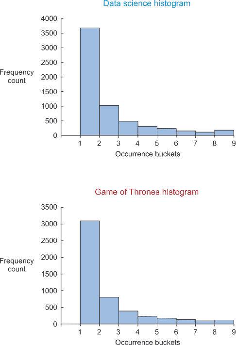

像这样的单次出现术语被称为*单现词*，从模型的角度来看它们是无用的，因为一个特征的单一出现永远不足以构建一个可靠的模型。这对我们来说是个好消息；去掉这些单现词将显著减少我们的数据量，而不会损害我们最终构建的模型。让我们看看这些单次出现术语中的几个。

```
print wordfreqs_cat1.hapaxes()
print wordfreqs_cat2.hapaxes()
```

图 8.17 中看到的术语是有意义的，如果我们有更多的数据，它们可能会更频繁地出现。

##### 图 8.17\. “数据科学”和“权力的游戏”单次出现术语（单现词）

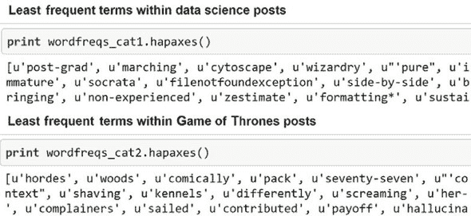

```
print wordfreqs_cat1.hapaxes()
print wordfreqs_cat2.hapaxes()
```

许多这些术语是其他有用的单词的错误拼写，例如：Jaimie 是 Jaime（兰尼斯特家族），Milisandre 应该是 Melisandre，等等。一个不错的*《权力的游戏》*专用同义词典可以帮助我们使用模糊搜索算法找到并替换这些错误拼写。这证明，如果你愿意，文本挖掘中的数据清洗可以无限期地进行；保持努力和回报的平衡在这里至关重要。

现在我们来看看最常见的单词。

```
print wordfreqs_cat1.most_common(20)
print wordfreqs_cat2.most_common(20)
```

图 8.18 显示了请求每个类别中最常见的 20 个单词的输出。

##### 图 8.18\. “数据科学”和“权力的游戏”帖子中最常见的 20 个单词


现在看起来很有希望：一些常见的单词似乎与它们的主题相关。像“数据”、“科学”和“季节”这样的单词很可能是好的区分器。另一个需要注意的重要事情是单字符术语（如“。”和“，”）的丰富性；我们将去掉这些。

带着这些额外的知识，让我们修改我们的数据准备脚本。

#### 8.3.6。步骤 3 回顾：数据准备调整

这短暂的探索已经引起了我们对几个可以改进文本的明显调整的注意。另一个重要的一点是对术语进行词干提取。

下面的列表显示了一个简单的称为“snowball 词干提取”的词干提取算法。这些 snowball 词干提取器可以是语言特定的，所以我们将使用英语版本；然而，它也支持许多语言。

##### 列表 8.6。数据探索后修订的 Reddit 数据处理

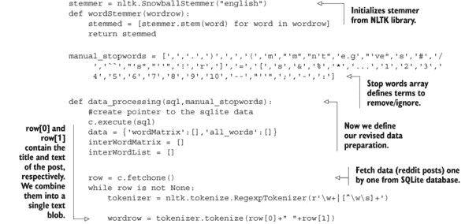

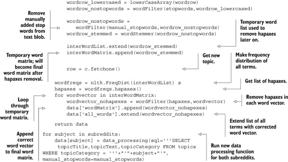

注意自上次`data_processing()`函数以来的变化。我们的分词器现在是一个正则表达式分词器。正则表达式不是本书的内容，通常被认为很难掌握，但这个简单的正则表达式所做的只是将文本切分成单词。对于单词，任何字母数字组合都是允许的（\w），因此不再有特殊字符或标点符号。我们还应用了词干提取器并移除了一个额外的停用词列表。最后，所有单次出现的词都被移除了，因为一切都需要先进行词干提取。让我们再次运行我们的数据准备。

如果我们像以前一样进行相同的探索性分析，我们会发现它更有意义，而且我们没有更多的单次出现词。

```
print wordfreqs_cat1.hapaxes()
print wordfreqs_cat2.hapaxes()
```

让我们再次取每个类别的前 20 个单词（参见图 8.19）。

##### 图 8.19。数据准备后的“数据科学”和“权力的游戏”Reddit 帖子中最常见的 20 个单词

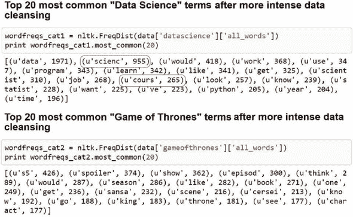

我们可以在图 8.19 中看到数据质量已经显著提高。同时，请注意由于我们应用的词干提取，某些单词被缩短了。例如，“science”和“sciences”变成了“scienc;”，“courses”和“course”变成了“cours,”等等。结果术语不是实际单词，但仍然可以解释。如果您坚持让术语保持为实际单词，那么词形还原可能是正确的选择。

在数据清理过程“完成”（备注：文本挖掘清理练习几乎永远无法完全完成）后，剩下的只是进行一些数据转换，以将数据转换为词袋格式。

首先，让我们给所有数据贴上标签，并为每个类别创建一个包含 100 个观察值的保留样本，如下所示。

##### 列表 8.7。建模前的最终数据转换和数据拆分

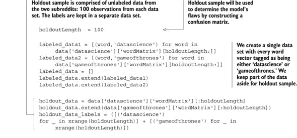

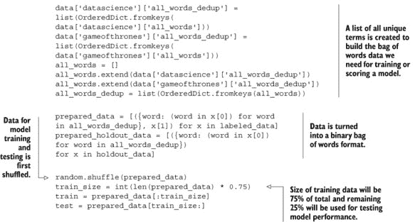

保留样本将被用于我们模型的最终测试和混淆矩阵的创建。*混淆矩阵*是一种检查模型在之前未见过的数据上表现如何的方法。矩阵显示了有多少观察值被正确和错误地分类。

在创建或训练和测试数据之前，我们需要采取最后一步：将数据倒入一个词袋格式，其中每个术语根据其在特定帖子中的存在与否被赋予“True”或“False”标签。我们还需要对未标记的保留样本做同样的事情。

我们准备的数据现在包含了每个向量的每个术语，如图 8.20 所示。

##### 图 8.20。一个准备建模的二进制词袋模型是非常稀疏的数据。

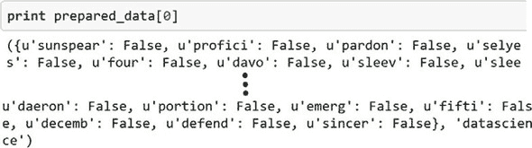

```
print prepared_data[0]
```

我们创建了一个大但稀疏的矩阵，允许我们在机器上处理不过大时应用第五章中的技术。然而，对于如此小的表格，现在没有必要这样做，我们可以继续将数据随机打乱并分割成训练集和测试集。

虽然你的数据的大部分应该总是用于模型训练，但存在一个最佳分割比例。在这里，我们选择了 3-1 的分割，但你可以自由地尝试不同的比例。你拥有的观察值越多，你在这里的自由度就越大。如果你观察值很少，你需要相对更多地分配给模型训练。我们现在可以继续到最有回报的部分：数据分析。

#### 8.3.7. 步骤 5：数据分析

在我们的分析中，我们将拟合两个分类算法到我们的数据：朴素贝叶斯和决策树。朴素贝叶斯在第三章中解释过，决策树在本章的早期也提到过。

让我们先测试我们的朴素贝叶斯分类器的性能。NLTK 自带了一个分类器，但你可以自由使用来自其他包（如 SciPy）的算法。

```
classifier  = nltk.NaiveBayesClassifier.train(train)
```

分类器训练完成后，我们可以使用测试数据来衡量整体准确率。

```
nltk.classify.accuracy(classifier, test)
```

测试数据上的准确率估计超过 90%，如图 8.21 所示。[分类准确率]是指正确分类的观察值占总观察值的百分比。不过，请注意，如果你使用了不同的数据，这个结果可能会有所不同。

##### 图 8.21。分类准确率是表示在测试数据上正确分类的观察值所占百分比的度量。

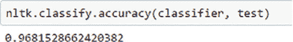

```
nltk.classify.accuracy(classifier, test)
```

这是一个很好的数字。现在我们可以放松一下，对吧？不，实际上并不是。让我们再次在 200 个观察值的保留样本上测试它，这次创建一个混淆矩阵。

```
classified_data = classifier.classify_many(prepared_holdout_data)
cm = nltk.ConfusionMatrix(holdout_data_labels, classified_data)
print cm
```

图 8.22 中的混淆矩阵显示，97%可能过高，因为我们有 28 个（23 + 5）个错误分类的案例。再次提醒，如果你自己填充了 SQLite 文件，这个结果可能会有所不同。

##### 图 8.22。朴素贝叶斯模型混淆矩阵显示，在 200 个观察值中有 28 个（23 + 5）个被错误分类。

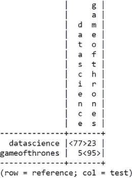

二十八次错误分类意味着我们在保留样本上的准确率为 86%。这需要与随机分配一个新帖子到“datascience”或“gameofthrones”组进行比较。如果我们随机分配，我们可能会期望准确率为 50%，而我们的模型似乎表现得更好。让我们深入挖掘最有信息量的模型特征，看看它如何确定类别。

```
print(classifier.show_most_informative_features(20))
```

图 8.23 显示了能够区分两个类别的顶级 20 个术语。

##### 图 8.23\. 朴素贝叶斯分类模型中最重要的术语

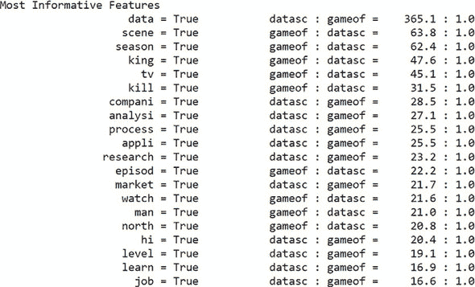

术语“数据”被赋予了很高的权重，似乎是最重要的指标，用以判断一个主题是否属于数据科学类别。诸如“场景”、“季节”、“国王”、“电视”和“杀戮”等术语是判断主题是*权力的游戏*而不是数据科学的良好指标。所有这些事情都完全合理，因此模型通过了准确性和合理性检查。

朴素贝叶斯表现良好，因此让我们看看以下列表中的决策树。

##### 列表 8.8\. 决策树模型训练和评估

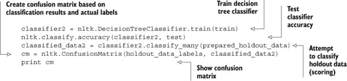

如图 8.24 所示，承诺的准确率是 93%。

##### 图 8.24\. 决策树模型准确率

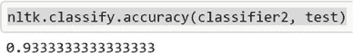

我们现在知道不能仅仅依赖这个单一的测试，因此我们再次转向第二组数据的混淆矩阵，如图图 8.25 所示。

##### 图 8.25\. 决策树模型的混淆矩阵

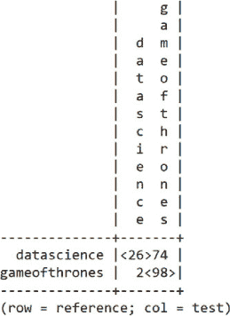

图 8.25 展示了不同的故事。在这些 200 个保留样本的观察中，当帖子是关于*权力的游戏*时，决策树模型倾向于很好地分类，但当面对数据科学帖子时却表现糟糕。似乎模型更喜欢*权力的游戏*，你能责怪它吗？让我们看看实际的模型，尽管在这种情况下我们将使用朴素贝叶斯作为我们的最终模型。

```
print(classifier2.pseudocode(depth=4))
```

决策树，正如其名所示，具有树状模型，如图图 8.26 所示。

##### 图 8.26\. 决策树模型树结构表示

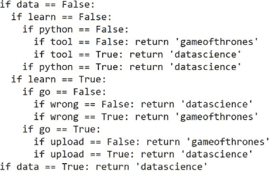

朴素贝叶斯考虑了所有术语并赋予了权重，但决策树模型按顺序通过它们，从根到外部的分支和叶子。 图 8.26 仅显示了前四层，从“数据”这个术语开始。如果帖子中存在“数据”，它总是指数据科学。如果找不到“数据”，它会检查“学习”这个术语，然后继续。这个决策树表现不佳的可能原因是缺乏剪枝。当构建决策树时，它有许多叶子，通常太多。然后，将树剪枝到一定水平以最小化过拟合。决策树的一个大优点是它在构建分支时考虑到的单词之间的隐式交互效应。当多个术语一起创建比单个术语更强的分类时，决策树实际上会优于朴素贝叶斯。我们不会深入探讨这一点，但请考虑这是您可以采取的下一步来改进模型。

现在我们有了两个分类模型，它们让我们了解了两个 subreddits 的内容有何不同。最后一步就是将这个新发现的信息与其他人分享。

#### 8.3.8\. 步骤 6：展示和自动化

作为最后一步，我们需要运用我们所学到的知识，要么将其转化为有用的应用，要么向他人展示我们的成果。本书的最后一章讨论了构建交互式应用，因为这本身就是一个项目。现在，我们将满足于以一种优雅的方式传达我们的发现。一张好的图表，或者更好的是，一张交互式图表，可以吸引人的注意力；这是演示文稿的点睛之笔。虽然将数字以这样的方式或最多以条形图的形式表示很容易且诱人，但更进一步可能更好。

例如，为了表示朴素贝叶斯模型，我们可以使用力图(图 8.27)，其中气泡和链接的大小表示一个单词与“权力的游戏”或“数据科学”subreddits 的关联强度。注意气泡上的单词通常被截断；记住这是由于我们应用的词干提取造成的。

##### 图 8.27\. 包含前 20 个朴素贝叶斯显著术语及其权重的交互式力图

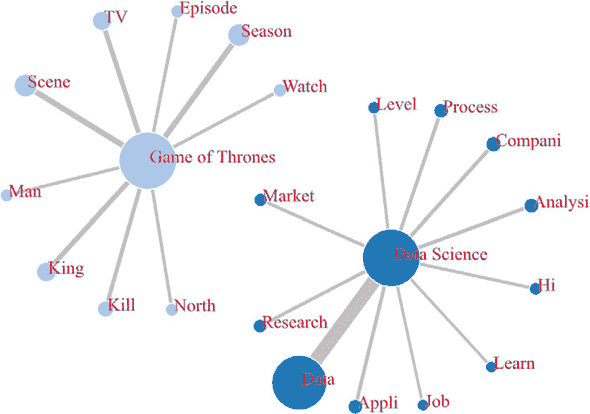

虽然图 8.27 本身是静态的，但你可以通过打开“forceGraph.html”这个 HTML 文件来享受本章前面解释过的 d3.js 力图效果。d3.js 超出了本书的范围，但你不需要对 d3.js 有深入的了解就可以使用它。可以通过对提供的代码进行最小调整来使用一套广泛的示例，这些示例可以在 [`github.com/mbostock/d3/wiki/Gallery`](https://github.com/mbostock/d3/wiki/Gallery) 找到。你所需要的只是常识和一点 JavaScript 知识。力图示例的代码可以在 [`bl.ocks.org/mbostock/4062045`](http://bl.ocks.org/mbostock/4062045) 找到。

我们还可以以一种相当独特的方式表示我们的决策树。我们可以选择一个实际的树图的华丽版本，但下面的太阳图更加独特，同样有趣。

图 8.28 展示了太阳图的最顶层。可以通过点击一个圆环段来放大视图。点击中心圆可以缩小视图。本例的代码可以在 [`bl.ocks.org/metmajer/5480307`](http://bl.ocks.org/metmajer/5480307) 找到。

##### 图 8.28\. 从决策树模型的前四个分支创建的太阳图

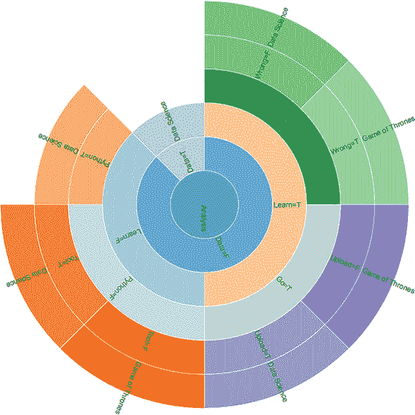

以一种独特的方式展示你的结果可能是成功项目的关键。如果你无法传达你的成果，而它们对他们来说又是有意义的，人们永远不会欣赏你为达到这些成果所付出的努力。在这里，偶尔使用一些原创的数据可视化肯定有助于这一点。

### 8.4\. 摘要

+   文本挖掘被广泛用于实体识别、抄袭检测、主题识别、翻译、欺诈检测、垃圾邮件过滤等领域。

+   Python 拥有一个成熟的文本挖掘工具包，称为 NLTK，或自然语言工具包。NLTK 适合玩耍和学习基本操作；然而，对于实际应用，Scikit-learn 通常被认为更“适用于生产”。Scikit-learn 在前几章中被广泛使用。

+   文本数据准备比数值数据准备更复杂，涉及额外的技术，例如

    +   **词干提取** —— 以一种智能的方式截取单词的末尾，以便它可以与这个单词的某些变形或复数形式相匹配。

    +   **词形还原** —— 与词干提取类似，它的目的是去除重复的部分，但与词干提取不同的是，它关注单词的意义。

    +   **停用词过滤** —— 某些单词出现得太频繁，以至于没有用处，过滤掉它们可以显著提高模型。停用词通常是语料库特定的。

    +   **分词** —— 将文本分割成片段。标记可以是单个单词，单词的组合（n-gram），甚至是整个句子。

    +   **词性标注** —— 词性标注。有时了解句子中某个单词的功能对于更好地理解它是有用的。

+   在我们的案例研究中，我们试图区分关于“权力的游戏”的 Reddit 帖子和关于“数据科学”的帖子。在这个努力中，我们尝试了朴素贝叶斯和决策树分类器。朴素贝叶斯假设所有特征都是相互独立的；决策树分类器假设存在依赖关系，允许使用不同的模型。

+   在我们的例子中，朴素贝叶斯产生了更好的模型，但非常经常决策树分类器做得更好，通常当有更多数据时。

+   我们通过在新的（但已标记的）数据上应用这两种模型后计算出的混淆矩阵来确定性能差异。

+   当向其他人展示研究结果时，包括一个有趣的数据可视化可以帮助以难忘的方式传达你的结果。
