## 第九章\. 数据可视化到最终用户

*本章涵盖*

+   考虑为您的最终用户选择数据可视化方案

+   设置基本的 Crossfilter MapReduce 应用程序

+   使用 dc.js 创建仪表板

+   使用仪表板开发工具进行工作

| |
| --- |

##### 专注于应用的章节

您会很快注意到，本章与第三章 chapters 3 到第八章 8 的内容确实不同，因为这里的重点在于数据科学流程的第 6 步。更具体地说，我们在这里想要做的是创建一个小型数据科学应用。因此，我们不会遵循数据科学流程的步骤。案例研究中使用的数据只有部分是真实的，但它在数据准备或数据建模阶段充当数据流。享受这次旅程吧。

| |
| --- |

通常，数据科学家必须将他们的新见解传达给最终用户。结果可以通过多种方式传达：

+   ***一次性演示*** —研究问题是单次交易，因为由此产生的商业决策将使组织在未来许多年里绑定在某个特定的道路上。以公司投资决策为例：*我们是将商品从两个分销中心分发还是只从一个分发？它们需要位于何处才能实现最佳效率？* 决策一旦做出，可能直到你退休都不会重复。在这种情况下，结果将以报告的形式交付，演示文稿作为甜点。

+   ***数据的新视角*** —这里最明显的例子是客户细分。当然，细分本身将通过报告和演示文稿进行传达，但本质上它们形成的是工具，而不是最终结果本身。当发现一个清晰且相关的客户细分时，它可以作为从其派生出来的数据的新维度反馈到数据库中。从那时起，人们可以自己制作报告，例如，向每个客户细分销售了多少产品。

+   ***实时仪表板*** —有时作为数据科学家的工作并不在你发现你寻找的新信息后结束。你可以将你的信息发送回数据库并完成它。但是，当其他人开始对这个新发现的金块进行报告时，他们可能会错误地解释它并制作出没有意义的报告。作为发现这个新信息的科学家，你必须树立榜样：制作第一个可刷新的报告，这样其他人，主要是记者和 IT 人员，就可以理解它并跟随你的脚步。制作第一个仪表板也是缩短最终用户（他们希望每天使用它）获得洞察力的交付时间的一种方式。这样，至少他们已经有一些东西可以工作了，直到报告部门找到时间在公司报告软件上创建一个永久性的报告。

你可能已经注意到有几个重要因素在起作用：

+   您支持的是哪种类型的决策？是战略性的还是操作性的？战略决策通常只需要您分析并报告一次，而操作决策则需要定期刷新报告。

+   ***您的组织有多大？*** 在较小的组织中，您将负责整个周期：从数据收集到报告。在较大的组织中，可能有一个报告团队为您制作仪表板。但即使在最后一种情况下，交付一个原型仪表板也可能是有益的，因为它提供了一个示例，并且通常可以缩短交付时间。

虽然整本书都是致力于生成洞察力，但在最后一章中，我们将专注于交付一个操作仪表板。创建一个展示您发现或展示战略洞察力的演示文稿超出了本书的范围。

### 9.1. 数据可视化选项

您有几种方式将仪表板交付给最终用户。在这里，我们将专注于一种方式，到本章结束时，您将能够自己创建仪表板。

本章的案例是一个拥有几千种药品的医院药房。政府对所有药房出台了一项新规定：所有药品都应检查其对光线的敏感性，并存储在新、特殊的容器中。政府没有提供给药房的实际上是光敏药品的清单。作为数据科学家，这对您来说不是问题，因为每种药品都有包含此信息的患者信息手册。您通过巧妙地使用文本挖掘来提炼信息，并为每种药品分配一个“光敏”或“非光敏”标签。然后，将此信息上传到中央数据库。此外，药房还需要知道需要多少个容器。为此，他们为您提供药房库存数据的访问权限。当您只抽取所需的变量时，数据集在 Excel 中打开时看起来像图 9.1。

##### 图 9.1. 在 Excel 中打开的药房药品数据集：前 10 行库存数据增加了光敏性变量

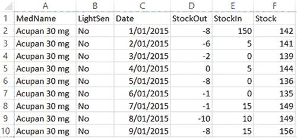

如您所见，这些信息是一整年股票走势的时间序列数据，因此每种药物在数据集中都有 365 条记录。尽管这个案例研究是现成的，数据集中的药物也是真实的，但这里展示的其他变量的值是随机生成的，因为原始数据是分类的。此外，数据集仅限于 29 种药物，大约有 10,000 多行数据。尽管人们确实会使用 crossfilter.js（一个 JavaScript MapReduce 库）和 dc.js（一个 JavaScript 仪表板库）来创建包含超过一百万行数据的报告，但为了示例，您将使用其中的一小部分。此外，不建议将整个数据库加载到用户的浏览器中；在加载过程中，浏览器会冻结，如果数据量过大，浏览器甚至可能崩溃。通常数据是在服务器上预先计算的，并通过例如 REST 服务请求其部分。

要将此数据转换为实际的仪表板，您有许多选择，您可以在本章后面的部分找到这些工具的简要概述。

在所有选项中，对于这本书，我们决定选择 dc.js，它是 JavaScript MapReduce 库 Crossfilter 和数据可视化库 d3.js 的混合体。Crossfilter 是由 Square Register 公司开发的，该公司处理支付交易；它类似于 PayPal，但其重点是移动端。Square 开发了 Crossfilter，以便他们的客户能够极其快速地对他们的支付历史进行切片和切块。Crossfilter 不是唯一能够进行 Map-Reduce 处理的 JavaScript 库，但它确实能够完成这项工作，是开源的，免费使用，并由一家知名公司（Square）维护。Crossfilter 的替代方案示例包括 Map.js、Meguro 和 Underscore.js。JavaScript 可能不是以数据处理语言而闻名，但这些库确实为浏览器提供了额外的处理能力，以防数据需要在浏览器中处理。我们不会深入探讨 JavaScript 如何在协作分布式框架中进行大规模计算，但一群矮人可以推翻一个巨人。如果您对这个主题感兴趣，您可以在[`www.igvita.com/2009/03/03/collaborative-map-reduce-in-the-browser/`](https://www.igvita.com/2009/03/03/collaborative-map-reduce-in-the-browser/)和[`dyn.com/blog/browsers-vs-servers-using-javascript-for-number-crunching-theories/`](http://dyn.com/blog/browsers-vs-servers-using-javascript-for-number-crunching-theories/)上了解更多信息。

d3.js 可以安全地称为在撰写本文时最通用的 JavaScript 数据可视化库；它是由 Mike Bostock 开发的，作为他 Protovis 库的继任者。许多 JavaScript 库都是建立在 d3.js 之上的。

NVD3、C3.js、xCharts 和 Dimple 提供了大致相同的东西：在 d3.js 之上的抽象层，这使得绘制简单的图表更加容易。它们主要区别在于它们支持的图表类型和默认设计。请随意访问它们的网站，并亲自了解：

+   *NVD3*—[`nvd3.org/`](http://nvd3.org/)

+   *C3.js*—[`c3js.org/`](http://c3js.org/)

+   *xCharts*—[`tenxer.github.io/xcharts/`](http://tenxer.github.io/xcharts/)

+   *Dimple*—[`dimplejs.org/`](http://dimplejs.org/)

选项很多。那么为什么选择 dc.js？

主要原因：与它所提供的功能相比，一个交互式仪表板，点击一个图表就会在相关图表上创建过滤视图，dc.js 的设置非常简单。简单到本章结束时你将有一个可工作的示例。作为一名数据科学家，你已经投入了足够的时间在你的实际分析上；易于实现的仪表板是一个受欢迎的礼物。

为了了解你即将创建的内容，你可以访问以下网站，[`dc-js.github.io/dc.js/`](http://dc-js.github.io/dc.js/)，并滚动到 NASDAQ 示例，如图 9.2 所示。

##### 图 9.2\. dc.js 在其官方网站上的交互式示例

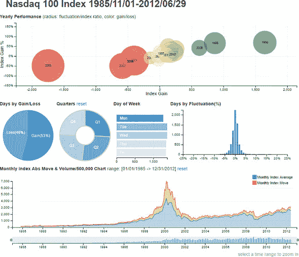

在仪表板上点击，当你选择和取消选择数据点时，你会看到图表如何做出反应和交互。但不要花太多时间；现在是时候自己创建它了。

如前所述，dc.js 有两个主要前提：d3.js 和 crossfilter.js。d3.js 有一个陡峭的学习曲线，如果你对完全自定义你的可视化感兴趣，有几本书值得阅读。但为了使用 dc.js，你不需要了解它，所以我们不会在本书中涉及它。crossfilter.js 是另一回事；你需要对这种 MapReduce 库有一定的了解，才能在你的数据上运行 dc.js。但由于 MapReduce 的概念本身并不新颖，这个过程将会顺利。

### 9.2\. Crossfilter，JavaScript MapReduce 库

JavaScript 并非数据处理的最佳语言。但这并没有阻止人们，例如 Square 的人，为其开发 MapReduce 库。如果你在处理数据，任何速度的提升都是有益的。然而，你并不希望发送大量数据通过互联网或甚至你的内部网络，原因如下：

+   发送大量数据会*网络*到极限，以至于会打扰其他用户。

+   *浏览器*是接收方，在加载数据时它将暂时*冻结*。对于少量数据来说这是不可察觉的，但当你开始查看 100,000 行数据时，它可能成为明显的延迟。当你超过 1,000,000 行数据时，根据你数据的宽度，你的浏览器可能会放弃你。

结论：这是一个平衡练习。对于您发送的数据，一旦它到达浏览器，Crossfilter 将为您处理它。在我们的案例研究中，药剂师请求了 2015 年 29 种她特别感兴趣的药品的库存数据。我们已经查看过这些数据，所以让我们深入了解应用程序本身。

#### 9.2.1\. 设置一切

现在是时候构建实际的应用程序了，我们的小 dc.js 应用程序的成分如下：

+   ***JQuery*** —用于处理交互性

+   ***Crossfilter.js*** —一个 MapReduce 库，也是 dc.js 的先决条件

+   ***d3.js*** —一个流行的数据可视化库，也是 dc.js 的先决条件

+   ***dc.js*** —您将使用的可视化库来创建您的交互式仪表板

+   ***Bootstrap*** —一个广泛使用的布局库，您将使用它使一切看起来更好

您只需编写三个文件：

+   ***index.html*** —包含您的应用程序的 HTML 页面

+   ***application.js*** —用于存放您将要编写的所有 JavaScript 代码

+   ***application.css*** —用于您自己的 CSS

此外，您还需要在 HTTP 服务器上运行我们的代码。您可以费心设置 LAMP（Linux, Apache, MySQL, PHP）、WAMP（Windows, Apache, MySQL, PHP）或 XAMPP（Cross Environment, Apache, MySQL, PHP, Perl）服务器。但为了简单起见，我们在这里不会设置任何这些服务器。相反，您可以使用单个 Python 命令来完成它。使用您的命令行工具（Linux shell 或 Windows CMD）并移动到包含您的 index.html 的文件夹（一旦它在那里）。您应该已经安装了 Python，以便阅读本书的其他章节，因此以下命令应该在您的本地主机上启动一个 Python HTTP 服务器。

```
python -m SimpleHTTPServer
```

对于 Python 3.4

```
python -m http.server 8000
```

正如您在图 9.3 中看到的，一个 HTTP 服务器在本地主机端口 8000 上启动。在您的浏览器中，这表示为“localhost:8000”；使用“0.0.0.0:8000”将不起作用。

##### 图 9.3\. 启动一个简单的 Python HTTP 服务器

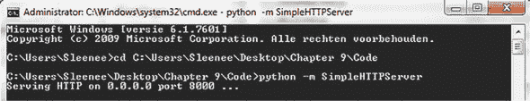

确保所有必需的文件都位于与您的 index.html 相同的文件夹中。您可以从 Manning 网站或它们的创建者网站上下载它们。

+   *dc.css and dc.min.js*—[`dc-js.github.io/dc.js/`](https://dc-js.github.io/dc.js/)

+   *d3.v3.min.js*—[`d3js.org/`](http://d3js.org/)

+   *crossfilter.min.js*—[`square.github.io/crossfilter/`](http://square.github.io/crossfilter/)

现在我们知道了如何运行我们即将创建的代码，让我们看看以下列表中的 index.html 页面。

##### 列表 9.1\. index.html 的初始版本

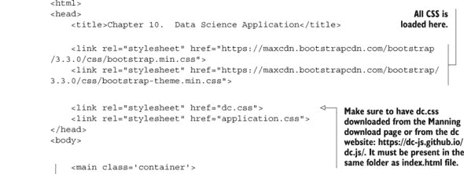

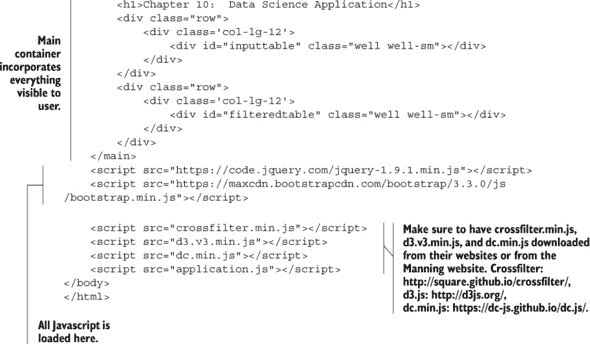

没有任何惊喜。这里包含了你将使用的所有 CSS 库，因此我们将 JavaScript 加载在 HTML 体部的末尾。使用 JQuery 的 onload 处理程序，当页面其余部分准备就绪时，你的应用程序将被加载。你开始时有两个表格占位符：一个用于显示你的输入数据的样子，`<div id="input-table"></div>`，另一个将用于与 Crossfilter 一起显示一个过滤后的表格，`<div id="filteredtable"></div>`。使用了几个 Bootstrap CSS 类，例如“*well*”，“*container*”，Bootstrap 网格系统中的“*row*”和“*col-xx-xx*”，等等。它们使整个界面看起来更美观，但它们不是必需的。有关 Bootstrap CSS 类的更多信息，可以在他们的网站上找到：[`getbootstrap.com/css/`](http://getbootstrap.com/css/).

现在你已经设置了 HTML，是时候在屏幕上显示你的数据了。为此，将注意力转向你创建的应用程序.js 文件。首先，我们将整个“待执行”代码包裹在一个 JQuery onload 处理程序中。

```
$(function() {
    //All future code will end up in this wrapper
})
```

现在我们确定只有当所有其他内容都准备就绪时，我们的应用程序才会被加载。这很重要，因为我们将使用 JQuery 选择器来操作 HTML。现在是加载数据的时候了。

```
d3.csv('medicines.csv',function(data) {
    main(data)
});
```

你没有准备好一个等待你的 REST 服务，所以在这个例子中，你将从.csv 文件中抽取数据。这个文件可以在 Manning 的网站上下载。d3.js 提供了一个简单的函数来完成这个任务。在加载数据后，你将其在 d3.csv 回调函数中传递给你的主应用程序函数。

除了主函数外，你还有一个`CreateTable`函数，你将使用它来...你猜对了...创建你的表格，如下面的列表所示。

##### 列表 9.2\. `CreateTable`函数

```
var tableTemplate = $([
        "<table class='table table-hover table-condensed table-striped'>",
        "  <caption></caption>",
        "  <thead><tr/></thead>",
        "  <tbody></tbody>",
        "</table>"
    ].join('\n'));

    CreateTable = function(data,variablesInTable,title){
        var table = tableTemplate.clone();
        var ths = variablesInTable.map(function(v) { return $("<th>").text(v) });
        $('caption', table).text(title);
        $('thead tr', table).append(ths);
        data.forEach(function(row) {
            var tr = $("<tr>").appendTo($('tbody', table));
            variablesInTable.forEach(function(varName) {
                var val = row, keys = varName.split('.');
                keys.forEach(function(key) { val = val[key] });
                tr.append($("<td>").text(val));
            });
        });
        return table;
    }
```

`CreateTable()`需要三个参数：

+   **`data`** —需要放入表格中的数据。

+   **`variablesInTable`** —需要显示的变量。

+   **`Title`** —表格的标题。知道你在看什么总是件好事。

`CreateTable()`使用一个预定义的变量`tableTemplate`，它包含我们的整体表格布局。然后`CreateTable()`可以向这个模板添加数据行。

现在你有了你的工具，让我们来看看应用程序的`main`函数，如下面的列表所示。

##### 列表 9.3\. JavaScript `main`函数

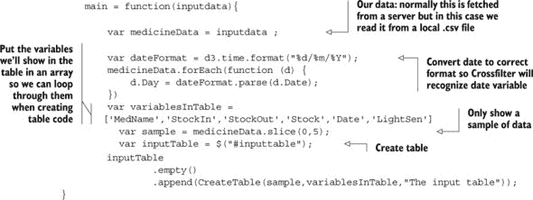

你开始时在屏幕上显示你的数据，但最好是不要显示全部；只显示前五条记录就足够了，如图 9.4 所示。你的数据中有一个日期变量，你想要确保 Crossfilter 稍后能将其识别为日期类型，因此你首先解析它并创建一个新的变量名为`Day`。你暂时在表格中显示原始的`Date`，但稍后你将使用`Day`进行所有计算。

##### 图 9.4\. 浏览器中显示的输入药物表格：前五行

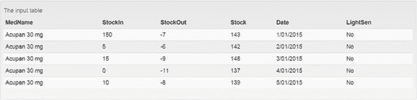

这就是你最终得到的结果：与你在 Excel 中看到的一模一样。现在你知道基础知识正在工作，你将引入 Crossfilter 到等式中。

#### 9.2.2。释放 Crossfilter 以过滤药物数据集

现在让我们进入 Crossfilter 使用过滤和 MapReduce。从现在起，你可以在 9.2.1 节的代码之后放置所有即将到来的代码，在`main()`函数内。你需要做的第一件事是声明一个 Crossfilter 实例，并用你的数据初始化它。

```
CrossfilterInstance = crossfilter(medicineData);
```

从这里你可以开始工作。在这个实例中，你可以注册维度，这些维度是你的表格的列。目前 Crossfilter 限制为 32 个维度。如果你处理的数据超过 32 个维度，你应该在发送到浏览器之前将其缩小。让我们创建我们的第一个维度，药物名称维度：

```
var medNameDim = CrossfilterInstance.dimension(function(d) {return
   d.MedName;});
```

你的第一个维度是药物名称，你现在已经可以使用它来过滤你的数据集，并使用我们的`CreateTable()`函数显示过滤后的数据。

```
   var dataFiltered= medNameDim.filter('Grazax 75 000 SQ-T')
   var filteredTable = $('#filteredtable');
   filteredTable
 .empty().append(CreateTable(dataFiltered.top(5),variablesInTable,'Our
First Filtered Table'));
```

你只显示了前五个观察值（图 9.5）；你有 365 个，因为你有一个药物一整年的结果。

##### 图 9.5。按药物名称 Grazax 75 000 SQ-T 过滤的数据

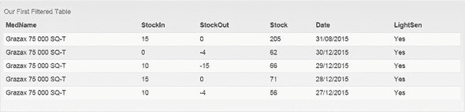

这个表格看起来没有排序，但实际上是排序过的。`top()`函数按药物名称排序了它。因为你只选择了一种药物，所以这无关紧要。使用你新的`Day`变量按日期排序很容易。让我们注册另一个维度，日期维度：

```
        var DateDim = CrossfilterInstance.dimension(
function(d) {return d.Day;});
```

现在我们可以按日期而不是药物名称排序：

```
   filteredTable
           .empty()
           .append(CreateTable(DateDim.bottom(5),variablesInTable,'Our
First Filtered Table'));
```

结果如图 9.6 所示，更加吸引人。

##### 图 9.6。按药物名称 Grazax 75 000 SQ-T 过滤并按天排序的数据

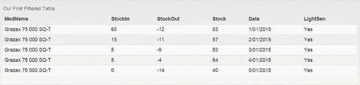

这个表格为你提供了数据的窗口视图，但它还没有为你总结。这就是 Crossfilter MapReduce 功能发挥作用的地方。假设你想知道每种药物有多少观察值。逻辑上，你应该为每种药物得到相同的数字：365，或者 2015 年每天一个观察值。

```
        var countPerMed = medNameDim.group().reduceCount();
        variablesInTable = ["key","value"]
        filteredTable
                .empty()
     .append(CreateTable(countPerMed.top(Infinity),
variablesInTable,'Reduced Table'));
```

Crossfilter 提供了两个 MapReduce 函数：`reduceCount()`和`reduceSum()`。如果你想做的不仅仅是计数和求和，你需要为它编写 reduce 函数。`countPerMed`变量现在包含按药物维度分组的数据，以及每个药物的行计数，形式为键和值。为了创建表格，你需要处理变量`key`而不是`medName`，以及`value`作为计数（图 9.7）。

##### 图 9.7。以药物为组并按数据行计数作为值的 MapReduced 表格

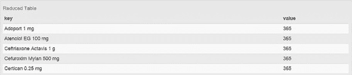

通过指定 `.top(Infinity)`，你要求在屏幕上显示所有 29 种药物，但为了节省纸张，图 9.7 只显示了前五个结果。好吧，你可以放心了；每种药物的数据包含 365 行。注意 Crossfilter 忽略了“Grazax”上的过滤器。如果一个维度用于分组，则过滤器不适用于它。只有其他维度的过滤器才能缩小结果。

那么，关于那些没有与 Crossfilter 一起打包的更有趣的计算呢？例如，计算平均值？你仍然可以这样做，但你需要编写三个函数并将它们传递给 `.reduce()` 方法。假设你想知道每类药物的平均股票。如前所述，几乎所有的 MapReduce 逻辑都需要你自己编写。平均值不过是总和除以计数，所以你需要两者；你如何处理这个问题？除了 `reduceCount()` 和 `reduceSum()` 函数之外，Crossfilter 还有一个更通用的 `reduce()` 函数。这个函数接受三个参数：

+   ***`reduceAdd()` 函数*** —一个描述当添加额外观察时会发生什么的函数。

+   ***`reduceRemove()` 函数*** —一个描述当观察消失时（例如，因为应用了过滤器）需要发生什么的函数。

+   ***`reduceInit()` 函数*** —这个函数用于设置所有计算初始值。对于总和和计数，最合理的起始点是 0。

在尝试调用 Crossfilter 的 `.reduce()` 方法之前，让我们看看你需要使用的单个 reduce 函数。`.reduce()` 方法接受这三个组件作为参数。一个自定义的 reduce 函数需要三个组件：一个初始化函数、一个添加函数和一个移除函数。初始 reduce 函数将设置 `p` 对象的起始值：

```
var reduceInitAvg = function(p,v){
    return {count: 0, stockSum : 0, stockAvg:0};
}
```

如你所见，reduce 函数本身接受两个参数。这些参数由 Crossfilter 的 `.reduce()` 方法自动传入：

+   `p` 是一个包含迄今为止组合情况的对象；它在所有观察中持续存在。这个变量为你跟踪总和和计数，因此代表你的目标，你的最终结果。

+   `v` 代表输入数据的记录，并提供了所有可用的变量。与 `p` 不同，它不会持续存在，每次函数被调用时都会被新的数据行替换。`reduceInit()` 只调用一次，但 `reduceAdd()` 每次添加记录时调用一次，`reduceRemove()` 每次删除一行数据时调用一次。

+   `reduceInit()` 函数，在这里称为 `reduceInitAvg()`，因为你将计算平均值，基本上通过定义其组件（`count`、`sum` 和 `average`）并设置它们的初始值来初始化 `p` 对象。让我们看看 `reduce-AddAvg()`：

    ```
    var reduceAddAvg = function(p,v){
        p.count += 1;
        p.stockSum  = p.stockSum  + Number(v.Stock);
        p.stockAvg = Math.round(p.stockSum  / p.count);
        return p;
    }
    ```

`reduceAddAvg()` 使用相同的 `p` 和 `v` 参数，但现在你实际上使用了 `v`；在这种情况下，你不需要你的数据来设置 `p` 的初始值，尽管你可以这样做。你的 `Stock` 对每条添加的记录进行求和，然后根据累积总和和记录计数计算平均值：

```
var reduceRemoveAvg = function(p,v){
    p.count -= 1;
    p.stockSum  = p.stockSum  -  Number(v.Stock);
    p.stockAvg = Math.round(p.stockSum  / p.count);
    return p;
}
```

`reduceRemoveAvg()` 函数看起来相似，但做的是相反的事情：当一条记录被移除时，计数和总和会降低。平均值总是以相同的方式计算，所以没有必要改变那个公式。

真相时刻：你将这个自制的 MapReduce 函数应用到数据集上：

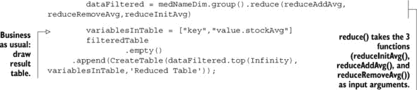

注意你的输出变量名从 `value` 变成了 `value .stockAvg`。因为你自己定义了 `reduce` 函数，所以如果你想输出多个变量，可以做到。因此，`value` 变成了一个包含你计算的所有变量的对象；`stockSum` 和 `count` 也在其中。

结果不言自明，如图 9.8 所示。看起来我们借鉴了其他医院的 Cimalgex，进入了一个平均负库存。

##### 图 9.8\. 每种药品的平均库存的 MapReduced 表格

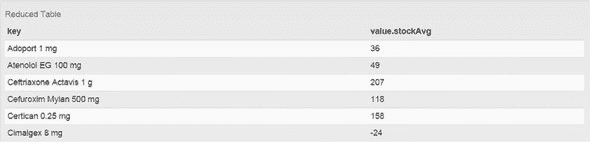

这就是你需要了解的所有 Crossfilter 知识，以便与 dc.js 一起工作，所以让我们继续前进，展示那些交互式图表。

### 9.3\. 使用 dc.js 创建交互式仪表板

现在你已经了解了 Crossfilter 的基础知识，是时候采取最后一步：构建仪表板。让我们从在 `index.html` 页面上为你的图表留出空间开始。新的主体看起来如下所示。你会注意到它看起来与我们的初始设置相似，除了添加了图表占位符 `<div>` 标签和重置按钮 `<button>` 标签。

##### 列表 9.4\. 带有 dc.js 生成的图表空间的修订版 index.html

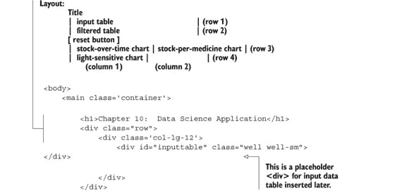

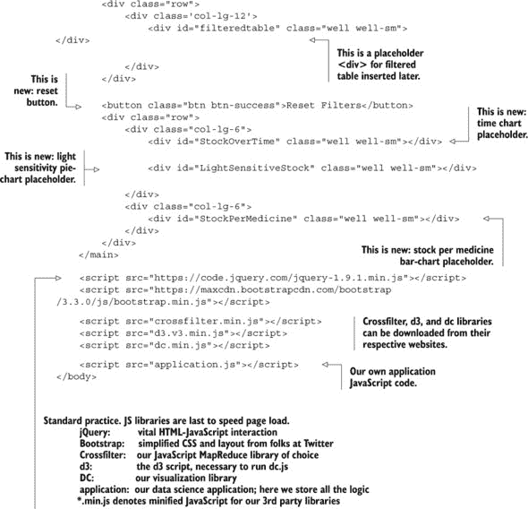

我们正在进行 Bootstrap 格式化，但最重要的元素是带有 ID 的三个 `<div>` 标签和按钮。你想要构建的是总库存随时间变化的表示，`<div id="StockOverTime"></div>`，有过滤药品的可能性，`<div id="StockPerMedicine"></div>`，以及它们是否对光敏感，`<div id="LightSensitiveStock"></div>`。你还需要一个重置所有过滤器的按钮，`<button class="btn btn-success">重置过滤器</button>`。这个重置按钮元素不是必需的，但很有用。

现在，将你的注意力转回 application.js。在这里，你可以在 `main()` 函数中添加所有即将到来的代码，就像之前一样。然而，有一个例外：`dc.renderAll();` 是 dc 绘制图表的命令。你需要将此渲染命令只放置一次，在 `main()` 函数的底部。你需要的第一张图是“总库存随时间变化”，如下所示。你已经有时间维度声明了，所以你只需要按时间维度对库存求和。

##### 列表 9.5\. 生成“随时间推移的总库存”图表的代码

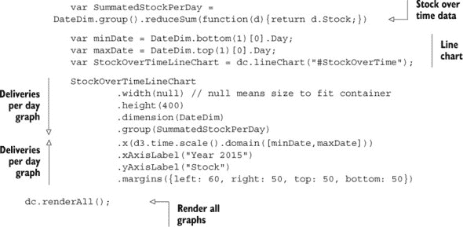

看看这里发生了什么。首先你需要计算 x 轴的范围，这样 dc.js 就会知道线图的起始和结束位置。然后初始化并配置线图。这里最不具说明性的方法是 `.group()` 和 `.dimension()`。`.group()` 接收时间维度并代表 x 轴。`.dimension()` 是它的对应物，代表 y 轴并接收你的汇总数据作为输入。图 9.9 看起来像一条无聊的线图，但外表可能具有欺骗性。

##### 图 9.9\. dc.js 图表：2015 年药品库存总和

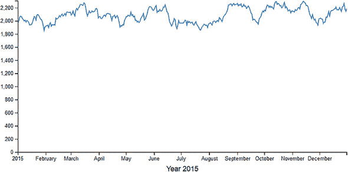

一旦引入第二个元素，情况就会发生巨大变化，因此让我们创建一个行图，表示每种药品的平均库存，如下面的列表所示。

##### 列表 9.6\. 生成“每种药品的平均库存”图表的代码

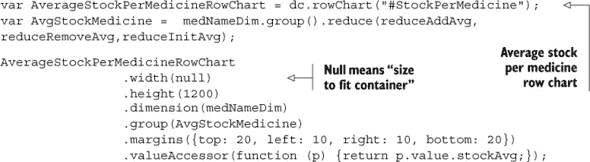

这应该很熟悉，因为它是你之前创建的表的图表表示。一个值得注意的大点：因为你这次使用了自定义定义的 `reduce()` 函数，dc.js 就不知道要表示什么数据。你可以使用 `.valueAccessor()` 方法指定 `p.value.stockAvg` 作为你选择的价值。dc.js 行图的标签字体颜色是灰色；这使得你的行图有些难以阅读。你可以在应用程序的 `application.css` 文件中覆盖它的 CSS 来解决这个问题：

```
.dc-chart g.row text {fill: black;}
```

一条简单的线就能区分清晰和模糊的图表（图 9.10）。

##### 图 9.10\. dc.js 线图和行图交互

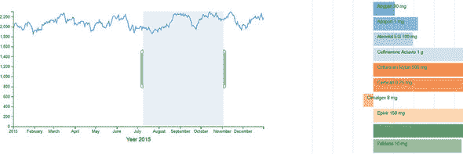

现在当你选择折线图上的一个区域时，行图会自动调整以表示正确时间段的数据。反之，你可以在行图上选择一个或多个药品，这将导致折线图相应地调整。最后，让我们添加光敏度维度，以便药剂师可以区分光敏药品和非光敏药品的库存，如下面的列表所示。

##### 列表 9.7\. 添加光敏度维度

```
        var lightSenDim = CrossfilterInstance.dimension(
function(d){return d.LightSen;});
        var SummatedStockLight =  lightSenDim.group().reduceSum(
function(d) {return d.Stock;});

        var LightSensitiveStockPieChart = dc.pieChart("#LightSensitiveStock");

        LightSensitiveStockPieChart
                .width(null) // null means size to fit container
                .height(300)
                .dimension(lightSenDim)
                .radius(90)
                .group(SummatedStockLight)
```

我们还没有介绍光维度，所以你首先需要将其注册到你的 Crossfilter 实例中。你还可以添加一个重置按钮，这将重置所有过滤器，如下面的列表所示。

##### 列表 9.8\. 仪表板重置过滤器按钮

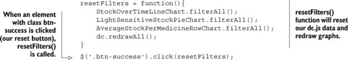

`.filterAll()` 方法移除特定维度上的所有过滤器；然后 `dc.redraw-All()` 手动触发所有 dc 图表的重绘。

最终结果是交互式仪表板（图 9.11），准备好供我们的药剂师使用，以深入了解其库存的行为。

##### 图 9.11\. 医院药房内药品及其库存的 dc.js 完全交互式仪表板

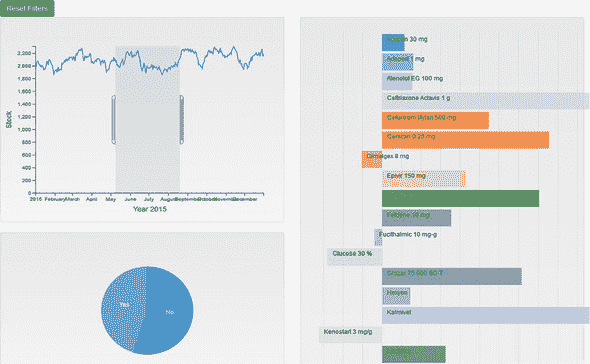

### 9.4\. 仪表板开发工具

我们已经有了我们辉煌的仪表板，但我们在本章结束时想要简要（而且远非详尽）地概述一下，在以吸引人的方式展示你的数据时，可供选择的替代软件。

你可以选择知名开发者如 Tableau、MicroStrategy、Qlik、SAP、IBM、SAS、Microsoft、Spotfire 等提供的经过验证的软件包。这些公司都提供值得调查的仪表板工具。如果你在大公司工作，很可能你至少拥有这些付费工具之一。开发者也可以提供带有有限功能的免费公共版本。如果你还没有的话，请务必查看[`www.tableausoftware.com/public/download`](http://www.tableausoftware.com/public/download)上的 Tableau。

其他公司至少会提供试用版。最终，你必须为这些软件包的完整版本付费，这可能值得，尤其是对于能够承担得起的大公司来说。

然而，本书的主要重点是免费工具。在查看免费数据可视化工具时，你很快就会进入 HTML 世界，那里充满了免费 JavaScript 库，可以绘制你想要的任何数据。这个领域非常庞大：

+   ***HighCharts*** —最成熟的基于浏览器的图形库之一。免费许可证仅适用于非商业用途。如果你想在商业环境中使用它，价格从 90 美元到 4000 美元不等。请参阅[`shop.highsoft.com/highcharts.html`](http://shop.highsoft.com/highcharts.html)。

+   ***Chartkick*** —一个针对 Ruby on Rails 爱好者的 JavaScript 图表库。请参阅[`ankane.github.io/chartkick/`](http://ankane.github.io/chartkick/)。

+   ***Google Charts*** —Google 的免费图表库。与许多 Google 产品一样，它免费使用，甚至可以用于商业目的，并提供广泛的图表类型。请参阅[`developers.google.com/chart/`](https://developers.google.com/chart/)。

+   ***d3.js*** —这是一个与众不同的例子，因为它不是一个图形库，而是一个数据可视化库。这种差异可能听起来很微妙，但其影响却不容忽视。与 HighCharts 和 Google Charts 等库不同，它们旨在绘制某些预定义的图表，而 d3.js 没有这样的限制。d3.js 目前是可用的最灵活的 JavaScript 数据可视化库。你只需快速浏览一下官方网站上的交互式示例，就能理解它与常规图形库之间的差异。请参阅[`d3js.org/`](http://d3js.org/)。

当然，还有其他我们没有提到的工具。

你还可以获得只提供试用版而没有免费社区版的可视化库，例如 Wijmo、Kendo 和 FusionCharts。它们值得一看，因为它们也提供支持和保证定期更新。

你有选择。但为什么或何时你会考虑用 HTML5 而不是使用 SAP 的 BusinessObjects、SAS JMP、Tableau、Clickview 或其他许多替代品来构建自己的界面呢？以下是一些原因：

+   ***没有预算*** — 当你在初创公司或其他小型公司工作时，这类软件的许可费用可能会很高。

+   ***高度可访问性*** — 数据科学应用旨在向任何类型的用户发布结果，特别是那些可能只有浏览器可用的人——比如你的客户。HTML5 在移动设备上的数据可视化运行流畅。

+   ***外面有大量的人才*** — 虽然 Tableau 开发者并不多，但很多人有网页开发技能。在规划项目时，考虑你是否能够配备人员是很重要的。

+   ***快速发布*** — 在你的公司中，整个 IT 周期可能需要太长时间，你希望人们能够快速享受你的分析。一旦你的界面可用并被使用，IT 就可以花他们想要的时间来工业化产品。

+   ***原型设计*** — 你能更好地向 IT 展示其目的和它应该具备的能力，那么他们就越容易构建或购买一个可持续的应用程序，使其能够完成你想要它完成的任务。

+   ***可定制性*** — 虽然现有的软件包在其领域内做得很好，但应用程序永远无法像你自己创建时那样定制。

那为什么不这样做呢？

+   ***公司政策*** — 这是最重要的一点：不允许。大型公司有 IT 支持团队，只允许使用一定数量的工具，以便他们能够控制其支持角色。

+   ***你有一支经验丰富的报告团队可供使用*** — 你会做他们的工作，他们可能会拿着长柄叉子来找你。

+   ***你的工具允许足够的定制以适应你的口味*** — 一些较大的平台是浏览器界面，底层运行 JavaScript。Tableau、BusinessObjects Webi、SAS Visual Analytics 等所有都有 HTML 界面；它们的定制容忍度可能会随着时间的推移而增长。

任何应用程序的前端都能赢得大众的心。你投入的所有数据准备工作和应用的复杂分析，只有当你能够传达给使用它的人时才有价值。现在你正走在实现这一目标的正确道路上。在这个积极的基调中，我们将结束本章。

### 9.5. 摘要

+   本章重点介绍了数据科学流程的最后部分，我们的目标是构建一个数据科学应用，其中最终用户可以获得一个交互式仪表板。经过数据科学流程的所有步骤后，我们得到了干净、通常紧凑或信息密集的数据。这样我们就可以查询更少的数据，并获得我们想要的分析结果。

+   在我们的例子中，药房库存数据被认为是彻底清洗和准备好的，并且信息到达最终用户时应该始终如此。

+   基于 JavaScript 的仪表板非常适合快速提供数据科学结果，因为它们只需要用户拥有一个网络浏览器。存在其他替代方案，例如 Qlik（第五章）。

+   Crossfilter 是一个 MapReduce 库，是众多 JavaScript MapReduce 库之一，但它已经证明了其稳定性，并且正在由 Square 公司（一家从事货币交易的公司）开发和使用。即使在单个节点和浏览器中应用 MapReduce 也是有效的；它提高了计算速度。

+   dc.js 是一个基于 d3.js 和 Crossfilter 构建的图表库，它允许快速构建浏览器仪表板。

+   我们探索了医院药房的数据集，并为药剂师构建了一个交互式仪表板。仪表板的优势在于其*自助*特性：他们并不总是需要报告员或数据科学家来提供他们渴望的洞察。

+   数据可视化替代方案是可用的，花时间找到最适合你需求的方案是值得的。

+   你会创建自己的定制报告而不是选择（通常更昂贵）的公司工具，原因有很多：

    +   ***没有预算*** —初创公司并不总是能负担得起每个工具

    +   ***高度可访问性*** —每个人都有浏览器

    +   ***可用的人才*** —（相对）容易获得 JavaScript 开发者

    +   ***快速发布*** —IT 周期可能需要一段时间

    +   ***原型设计*** —原型应用程序可以提供时间，让 IT 部门构建生产版本

    +   ***可定制性*** —有时你只想让它完全符合你的梦想。

+   当然，也有反对开发自己的应用程序的理由：

    +   ***公司政策*** —应用程序的扩散并不是好事，公司可能希望通过限制本地开发来防止这种情况。

    +   ***成熟的报告团队*** —如果你有一个优秀的报告部门，你为什么还要费心呢？

    +   ***定制令人满意*** —并不是每个人都想要那些闪亮的东西；基本功能就足够了。

恭喜！你已经走完了这本书的结尾，也是你作为数据科学家职业生涯的真正开始。我们希望你在阅读和通过示例和案例研究的过程中玩得开心。现在你已经对数据科学的世界有了基本的了解，选择一条道路就取决于你了。故事还在继续，我们都祝愿你在成为有史以来最伟大的数据科学家的追求中取得巨大成功！愿我们有一天能再次相见。 ;)
