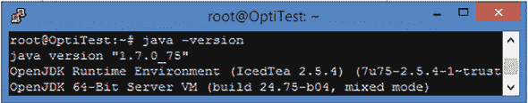
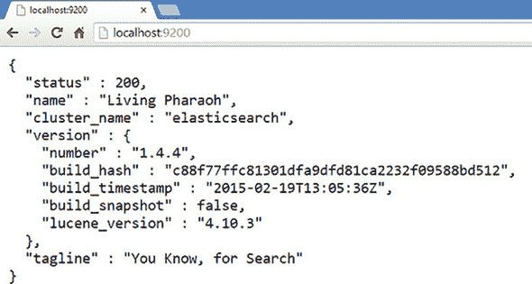
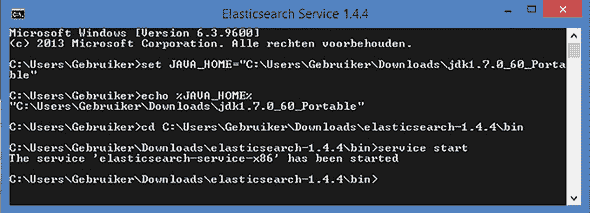
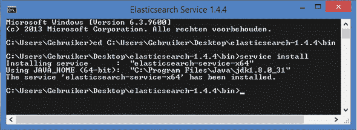
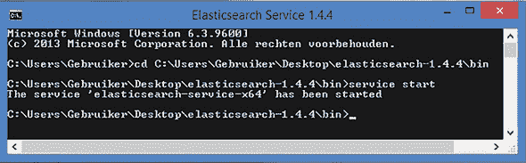

## 附录 A. 设置 Elasticsearch

在本附录中，我们将介绍安装和设置第六章和第七章中使用的 Elasticsearch 数据库。包括 Linux 和 Windows 安装的说明。注意，如果你遇到麻烦或需要有关 Elasticsearch 的更多信息，它有相当不错的文档，可以在[`www.elastic.co/guide/en/elasticsearch/reference/1.4/setup.html`](https://www.elastic.co/guide/en/elasticsearch/reference/1.4/setup.html)找到。

##### 注意

Elasticsearch 依赖于 Java，因此我们还将介绍如何安装 Java。

### A.1. Linux 安装

首先检查你的机器上是否已经安装了 Java。

> **1**. 你可以在控制台窗口中使用`java –version`来检查你的 Java 版本。如果 Java 已安装，你将看到类似于图 A.1 中的响应。你需要至少 Java 7 来运行本书中使用的 Elasticsearch 版本（1.4）。注意：当本书发布时，Elasticsearch 已经升级到版本 2，但尽管代码可能略有变化，核心原则仍然是相同的。
> 
> ##### 图 A.1. 在 Linux 中检查 Java 版本。Elasticsearch 需要 Java 7 或更高版本。
> ##### 
> 
> 
> **2**. 如果 Java 未安装或版本不够高，Elasticsearch 推荐使用 Oracle 版本的 Java。使用以下控制台命令进行安装。
> 
> `sudo add-apt-repository ppa:webupd8team/java sudo apt-get install oracle-java7-installer`

现在你可以安装 Elasticsearch 了：

> **1**. 将 Elasticsearch 1.4 仓库（写作时的最新版本）添加到你的仓库列表中，然后使用以下命令进行安装。
> 
> `sudo add-apt-repository "deb http://packages.Elasticsearch.org/  Elasticsearch/1.4/debian stable main" sudo apt-get update && sudo apt-get install Elasticsearch`
> 
> **2**. 确保 Elasticsearch 在重启后能够启动，运行以下命令。
> 
> `sudo update-rc.d Elasticsearch defaults 95 10`
> 
> **3**. 启用 Elasticsearch。见图 A.2。
> 
> ##### 图 A.2. 在 Linux 上启动 Elasticsearch
> ##### 
> 
> 
> `sudo /etc/init.d/Elasticsearch start`

如果 Linux 是你的本地计算机，打开浏览器并访问*localhost:9200*。9200 是 Elasticsearch API 的默认端口。见图 A.3。

##### 图 A.3. 本地主机的 Elasticsearch 欢迎屏幕

Elasticsearch 的欢迎界面应该会欢迎您。注意您的数据库甚至有一个名字。这个名字是从漫威角色的池中选取的，并且每次您重新启动数据库时都会改变。在生产环境中，拥有这样一个不一致且不唯一的名字可能会出现问题。您启动的实例是可能成为庞大分布式集群一部分的单节点。如果所有这些节点在重启时都更改了名字，那么在出现问题时几乎不可能通过日志跟踪它们。Elasticsearch 以其几乎不需要配置即可启动并且本质上具有分布式特性而自豪。虽然这无疑是正确的，但像这种随机名字这样的例子证明，部署实际的多个节点设置将需要您仔细考虑某些默认设置。幸运的是，Elasticsearch 几乎在所有事情上都有充分的文档，包括部署 ([`www.Elasticsearch.org/guide/en/Elasticsearch/guide/current/deploy.html`](http://www.Elasticsearch.org/guide/en/Elasticsearch/guide/current/deploy.html))。多节点 Elasticsearch 部署不在此章的范围内，但最好记住这一点。

### A.2\. Windows 安装

在 Windows 上，Elasticsearch 还需要至少安装 Java 7——JRE 和 JDK——并且需要 JAVA_HOME 变量指向 Java 文件夹。

> **1**.  从 [`www.oracle.com/technetwork/java/javase/downloads/index.html`](http://www.oracle.com/technetwork/java/javase/downloads/index.html) 下载 Java 的 Windows 安装程序并运行它们。
> 
> **2**.  安装完成后，请确保您的 JAVA_HOME Windows 环境变量指向您安装的 Java 开发工具包的位置。您可以在系统控制面板 > 高级系统设置中找到环境变量。参见 图 A.4。
> 
> ##### 图 A.4\. 将 JAVA_HOME 变量设置为 Java 安装文件夹
> ##### 
> 

在您拥有足够的 Java 版本之前尝试安装将导致错误。参见 图 A.5。

##### 图 A.5\. 当 JAVA_HOME 设置不正确时，Elasticsearch 安装失败。

**在权限有限的 PC 上安装**

有时候您想尝试一款软件，但您无法安装自己的程序。如果是这种情况，请不要绝望：便携式 JDK 是存在的。当您找到其中之一时，您可以临时将 JAVA_HOME 变量设置为便携式 JDK 的路径，并通过这种方式启动 Elasticsearch。如果您只是想检查它，甚至不需要安装 Elasticsearch。参见 图 A.6。

##### 图 A.6\. 不安装即可启动 Elasticsearch。这仅建议在您拥有有限权限的计算机上进行测试。

现在您已经安装并设置了 Java，您可以安装 Elasticsearch。

> **1**. 请手动从[`www.Elasticsearch.org/download/`](http://www.Elasticsearch.org/download/)下载 Elasticsearch 的 zip 包。将其解压到你的电脑上的任何位置。这个文件夹现在将成为你的独立数据库。如果你有 SSD 驱动器，考虑给它分配一个位置，因为它可以显著提高 Elasticsearch 的速度。
> 
> **2**. 如果你已经打开了 Windows 命令窗口，请不要用它来进行安装；而是打开一个新的窗口。打开窗口中的环境变量已经不再是最新的。将目录更改为你的 Elasticsearch /bin 文件夹，并使用`service install`命令进行安装。参见图 A.7。
> 
> ##### 图 A.7. Elasticsearch Windows 64 位安装
> ##### 
> 
> 
> **3**. 数据库现在应该已经准备好启动了。使用`service start`命令。参见图 A.8。
> 
> ##### 图 A.8. Elasticsearch 在 Windows 上启动一个节点。
> ##### 
> 

如果你想停止服务器，请输入`service stop`命令。打开你选择的浏览器，并在地址栏中输入*localhost:9200*。如果出现 Elasticsearch 欢迎界面（图 A.9），则表示你已成功安装 Elasticsearch。

##### 图 A.9. 本地主机上的 Elasticsearch 欢迎界面

