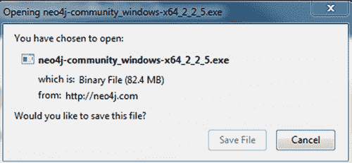
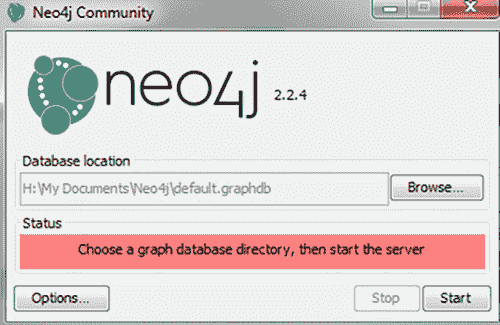
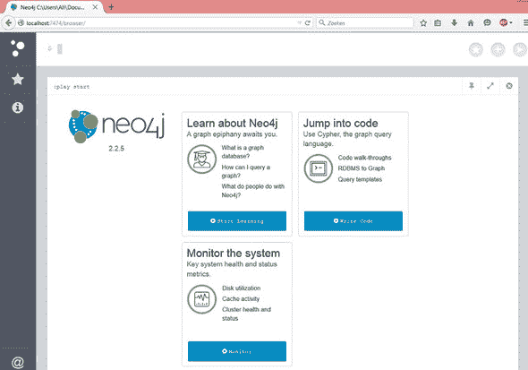

## 附录 B. 设置 Neo4j

在本附录中，我们将介绍安装和设置第七章中使用的 Neo4j 社区版数据库。包括 Linux 和 Windows 安装的说明。

### B.1\. Linux 安装

要在 Linux 上安装 Neo4j 社区版，请按照以下说明使用命令行：[`debian.neo4j.org/?_ga=1.84149595.332593114.1442594242`](http://debian.neo4j.org/?_ga=1.84149595.332593114.1442594242)。

Neo Technology 提供这个 Debian 仓库，以便轻松安装 Neo4j。它包括三个仓库：

+   ***稳定版*** —除以下说明外，所有 Neo4j 版本。您应该默认选择此版本。

+   ***测试版*** —预发布版本（里程碑和发布候选版）。

+   ***旧稳定版*** —不再积极使用，此仓库包含旧小版本的补丁发布。如果您在稳定版中找不到所需的内容，请查看此处。

要使用新的稳定版软件包，您需要以 root 身份运行以下命令（注意以下我们使用 sudo）：

```
sudo -s
wget -O - https://debian.neo4j.org/neotechnology.gpg.key| apt-key add - #
     Import our signing key
echo 'deb http://debian.neo4j.org/repo stable/' > /etc/apt/sources.list.d/
     neo4j.list # Create an Apt sources.list file
aptitude update -y # Find out about the files in our repository
aptitude install neo4j -y # Install Neo4j, community edition
```

如果您想要一个更新的（但不支持）的 Neo4j 构建版本，可以将稳定版替换为测试版。如果您想选择不同的版本，可以运行：

```
apt-get install neo4j-advanced
```

或

```
apt-get install neo4j-enterprise
```

### B.2\. Windows 安装

要在 Windows 上安装 Neo4j 社区版：

> **1**. 访问 [`neo4j.com/download/`](http://neo4j.com/download/) 并下载社区版。将出现以下屏幕。
> 
> 
> 
> **2**. 保存此文件并运行它。
> 
> **3**. 安装完成后，您将看到一个新弹窗，您可以选择默认数据库位置，或者浏览以找到另一个位置作为数据库位置。
> 
> **4**. 选择后，按开始按钮，您就可以开始了。
> 
> 几秒钟后，数据库将准备好使用。如果您想停止服务器，只需按停止按钮即可。
> 
> 
> 
> **5**. 打开您选择的浏览器，并在地址栏中输入 *localhost:7474*。
> 
> 您已到达 Neo4j 浏览器。
> 
> **6**. 当数据库访问请求认证时，使用用户名和密码 *“neo4j”，* 然后按连接。
> 
> 在以下窗口中您可以设置自己的密码。
> 
> 

现在您可以输入您的 Cypher 查询并查询您的节点、关系和结果。
