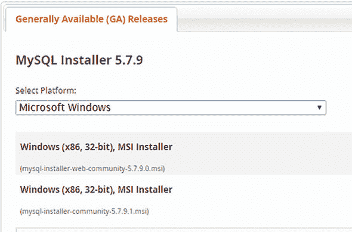
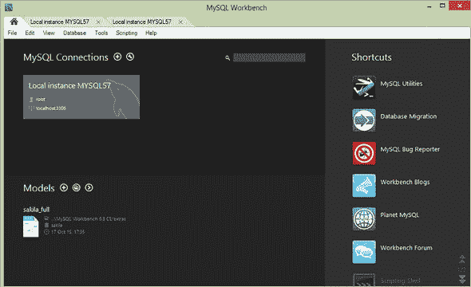
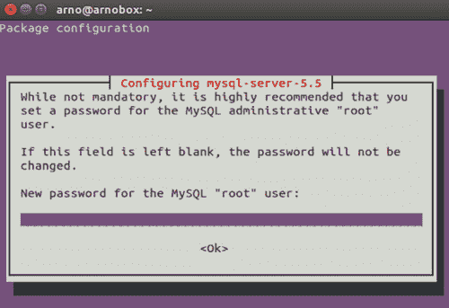
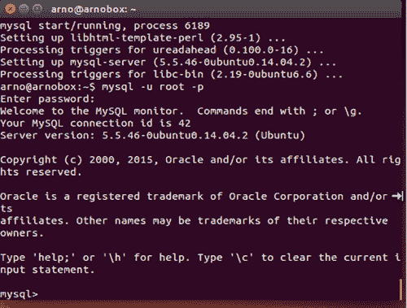

## 附录 C. 安装 MySQL 服务器

在本附录中，我们将介绍安装和设置 MySQL 数据库。包括 Windows 和 Linux 安装的说明。

### C.1. Windows 安装

最方便且推荐的方法是下载 MySQL 安装程序（适用于 Windows），并让它设置系统上的所有 MySQL 组件。以下步骤解释了如何操作：

> **1**. 从 [`dev.mysql.com/downloads/installer/`](http://dev.mysql.com/downloads/installer/) 下载 MySQL 安装程序并打开它。请注意，与标准 MySQL 安装程序不同，较小的“web-group”版本会自动包含任何 MySQL 组件，但只会下载您选择安装的组件。您可以选择任一安装程序。参见 图 C.1。
> 
> ##### 图 C.1. Windows MySQL 安装程序的下载选项
> ##### 
> 
> 
> **2**. 选择您偏好的合适设置类型。选项“开发者默认”将安装 MySQL 服务器和其他与 MySQL 进步相关的 MySQL 组件，以及支持功能，如 MySQL Workbench。如果您想选择要安装在系统上的 MySQL 项目，也可以选择自定义设置。如果您愿意，还可以在单个系统上运行不同版本的 MySQL。MySQL 通知器用于监控运行实例、停止它们和重新启动它们。您也可以稍后使用 MySQL 安装程序添加它。
> 
> **3**. 然后，MySQL 安装向导的说明将引导您完成设置过程。主要是接受即将发生的事情。开发机器将作为服务器配置类型执行。请确保设置 MySQL 根密码，并且不要忘记它，因为您稍后需要它。您可以将其作为 Windows 服务运行；这样，您就不需要手动启动它。
> 
> **4**. 安装完成。如果您选择了完整安装，MySQL 服务器、MySQL Workbench 和 MySQL 通知器将默认在计算机启动时自动启动。MySQL 安装程序可用于升级或更改已安装组件的设置。
> 
> **5**. 实例应该已经启动并运行，您可以使用 MySQL Workbench 连接到它。参见 图 C.2。
> 
> ##### 图 C.2. MySQL Workbench 界面
> ##### 
> 

### C.2. Linux 安装

MySQL 在 Linux 上的官方安装说明可以在 [`dev.mysql.com/doc/refman/5.7/en/linux-installation.html`](https://dev.mysql.com/doc/refman/5.7/en/linux-installation.html) 找到。

然而，某些 Linux 发行版为此提供了特定的安装指南。例如，在 Ubuntu 14.04 上安装 Linux 的说明可以在 [`www.linode.com/docs/databases/mysql/how-to-install-mysql-on-ubuntu-14-04`](https://www.linode.com/docs/databases/mysql/how-to-install-mysql-on-ubuntu-14-04) 找到。以下说明基于官方说明。

> **1**. 首先检查您的计算机名：
> 
> `hostname hostname -f`
> 
> 第一条命令应显示您的短主机名，第二条命令应显示您的完全限定域名（FQDN）。
> 
> **2**.  更新您的系统：
> 
> `sudo apt-get update sudo apt-get upgrade`
> 
> **3**.  安装 MySQL：
> 
> `Sudo apt-get install msql-server`
> 
> 在安装过程中，您将收到一条消息，提示您为 MySQL root 用户选择密码，如图 C.3 所示。
> 
> ##### 图 C.3\. 选择您的 MySQL root 用户的密码。
> ##### 
> 
> 
> MySQL 默认将绑定到 localhost（127.0.0.1）。
> 
> **4**.  登录 MySQL：
> 
> `mysql –u root –p`
> 
> 输入您选择的密码，您应该会看到如图 C.4 所示的 MySQL 控制台。
> 
> ##### 图 C.4\. Linux 上的 MySQL 控制台
> ##### 
> 
> 
> **5**.  最后，创建一个模式，以便在第四章的案例研究中有所参考。
> 
> `Create database test;`
