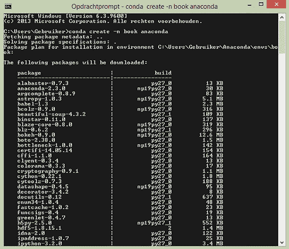

## 附录 D. 使用虚拟环境设置 Anaconda

Anaconda 是一个特别适用于数据科学的 Python 代码包。默认安装将包含数据科学家可能会使用的许多工具。在我们的书中，我们将使用 32 位版本，因为它通常与许多 Python 包（尤其是 SQL 包）一起保持更高的稳定性。

虽然我们推荐使用 Anaconda，但这并不是必需的。在本附录中，我们将介绍安装和设置 Anaconda 的方法。包括 Linux 和 Windows 的安装说明，随后是环境设置说明。如果你对使用 Python 包有所了解，可以自由选择自己的方式。例如，你可以使用 virtualenv 和 pip 库。

### D.1\. Linux 安装

要在 Linux 上安装 Anaconda：

> **1**.  前往 [`www.continuum.io/downloads`](https://www.continuum.io/downloads) 并下载基于 Python 2.7 的 32 位 Anaconda Linux 安装程序。
> 
> **2**.  下载完成后，使用以下命令安装 Anaconda：
> 
> `bash Anaconda2-2.4.0-Linux-x86_64.sh`
> 
> **3**.  我们需要在 Linux 命令提示符中使`conda`命令生效。Anaconda 会询问你是否需要这样做，所以回答“是”。

### D.2\. Windows 安装

要在 Windows 上安装 Anaconda：

> **1**.  前往 [`www.continuum.io/downloads`](https://www.continuum.io/downloads) 并下载基于 Python 2.7 的 32 位 Anaconda Windows 安装程序。
> 
> **2**.  运行安装程序。

### D.3\. 设置环境

安装完成后，就是时候设置环境了。关于`conda`与`pip`命令的一个有趣方案可以在[`conda.pydata.org/docs/_downloads/conda-pip-virtualenv-translator.html`](http://conda.pydata.org/docs/_downloads/conda-pip-virtualenv-translator.html)找到。

> **1**.  在你的操作系统命令行中使用以下命令。将“nameoftheenv”替换为你希望环境拥有的实际名称。
> 
> `conda create –n nameoftheenv anaconda`
> 
> **2**.  确保你同意继续设置，在列表末尾输入“y”，如图 D.1（#app04fig01）所示，然后过一会儿你就可以开始了。
> 
> ##### 图 D.1\. Windows 命令提示符中的 Anaconda 虚拟环境设置
> ##### 
> 
> 
> Anaconda 将在其默认位置创建环境，但如果你想要更改位置，也有选项可用。
> 
> **3**.  现在你已经有了环境，你可以在命令行中激活它：
> 
> +   在 Windows 中，输入 `activate nameoftheenv`
> +   
> +   在 Linux 中，输入 `source activate nameoftheenv`
> +   
> 或者你可以通过你的 Python IDE（集成开发环境）来指向它。
> 
> **4**.  如果你在命令行中激活它，可以使用以下命令启动 Jupiter（或 IPython）IDE：
> 
> `Ipython notebook`
> 
> Jupiter（以前称为 IPython）是一个在浏览器中运行的交互式 Python 开发接口。它对于给你的代码添加结构很有用。
> 
> **5**. 对于书中提到的每个未在默认 Anaconda 环境中安装的包：
> 
> 1.  在命令行中激活你的环境。
> 1.  
> 1.  要么在命令行中使用 `conda install libraryname`，要么使用 `pip install libraryname`。
> 1.  
> 想了解更多关于`pip`安装的信息，请访问 [`python-packaging-user-guide.readthedocs.org/en/latest/installing/`](http://python-packaging-user-guide.readthedocs.org/en/latest/installing/)。
> 
> 想了解更多关于 Anaconda `conda` 安装的信息，请访问 [`conda.pydata.org/docs/intro.html`](http://conda.pydata.org/docs/intro.html)。
