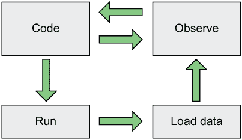
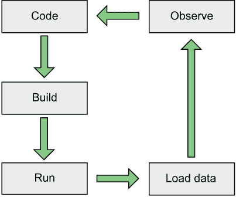

# 1 为什么选择 Julia？

本章涵盖

+   Julia 解决的问题类型

+   快速、动态类型语言的优点

+   Julia 如何提高程序员的生产力

你可以从数百种编程语言中选择——其中许多比 Julia 更受欢迎。那么，为什么选择 Julia 呢？

你希望比以前更快地编写代码吗？用你通常需要的代码行数的一小部分来构建系统怎么样？当然，这样的生产力可能会以糟糕的性能和高内存消耗为代价。不，实际上，Julia 是下一代气候模型的首选语言，这些模型对性能和内存有极端的要求。

我知道这样的赞誉可能听起来像二手车销售员的糟糕推销，但不可否认的是，Julia 在许多方面是一种革命性的编程语言。你可能会问：“如果 Julia 如此出色，那么为什么不是每个人都使用它？为什么还有这么多人还在使用 C 编程语言？”熟悉度、包、库和社区都很重要。在大组织中建立起来的关键任务软件并不是一时兴起就放弃的。

在阅读这本书的许多人可能并不关心拥有更高效、更有生产力的编程语言。相反，你关心的是你可以用它构建什么。简单的答案是：任何东西。Julia 是一种通用编程语言。

这可能不是一个令人满意的答案。原则上，你也可以用 JavaScript 构建任何东西。然而，你知道 JavaScript 主导着前端 Web 开发。你也可以用 Lua 编写任何东西，但它主要被用作计算机游戏的脚本语言。你阅读这本书的主要兴趣可能在于 Julia 能为你带来什么样的工作。

目前，Julia 社区在科学计算、数据科学和机器学习方面最为强大。但学习 Julia 也是一种对未来的赌注。具有如此强大能力的语言不会局限于一个小众领域。如果你继续阅读，将会更清楚地了解 Julia 是什么以及它为什么具有如此大的潜力。我还会涵盖 Julia 不理想的应用领域。

## 1.1 什么是 Julia？

Julia 是一种通用、多平台的编程语言，它是

+   适合数值分析和计算科学

+   动态类型

+   高性能和即时编译

+   使用自动内存管理（垃圾回收）

+   可组合

这听起来很多，其中一些东西似乎相互矛盾。那么，Julia 如何成为一个通用语言，同时又针对数值编程进行了定制？它之所以是通用的，是因为，像 Python 一样，Julia 可以用于几乎任何东西。它之所以适合数值编程，是因为，像 MATLAB 一样，它非常适合数值编程。但它并不局限于数值编程；它也适合其他用途。通过“可组合”我指的是 Julia 使得表达许多面向对象和函数式编程模式变得容易，从而促进代码重用。

### 1.1.1 静态类型和动态类型语言的优缺点

让我们关注 Julia 的一个方面：它是动态类型的事实。通常，编程语言被分为两大类：

+   动态类型

+   静态类型

在静态语言中，表达式有类型；在动态语言中，值有类型。

——Julia 创始人 Stefan Karpinski

静态类型语言的例子有 C/C++、C#、Java、Swift、Go、Rust、Pascal 和 Fortran。在静态类型语言中，在程序允许运行之前，对所有的代码执行类型检查。

动态类型语言的例子有 Python、Perl、Ruby、JavaScript、MATLAB 和 LISP。动态类型语言在程序运行时执行类型检查。不幸的是，动态类型语言往往非常慢。

在动态语言中，数值、字符和字符串等值都附有标签，表明它们的类型。这些标签允许使用动态类型语言的程序在运行时检查类型正确性。

Julia 很特别，它既是一种动态类型语言，又具有高性能。对许多人来说，这似乎是一种矛盾。Julia 的这一独特特性得以实现，是因为该语言被明确设计用于即时编译（JIT），并且对所有函数调用使用了一种称为 *多分派* 的特性。C/C++ 和 Fortran 等语言使用编译前（AOT）编译。编译器在程序运行之前将整个程序翻译成机器代码。其他语言，如 Python、Ruby 和 Basic，使用解释器。在解释性语言中，程序读取每一行源代码并在运行时解释它以执行给定的指令。现在你已经了解了 Julia 是什么类型的语言，我可以开始讨论 Julia 的吸引力了。

语言设计和 JIT 编译

原则上，编程语言与其运行方法解耦。然而，你会发现我谈论 Julia 时将其称为 JIT 编译语言，而将 Fortran 称为 AOT 编译语言。严格来说，这是不准确的。例如，Julia 也可以通过解释器运行。然而，大多数语言都是为特定形式的执行而设计的。Julia 是为 JIT 编译而设计的。

## 1.2 Julia 结合了优雅、生产力和性能

虽然 performance 是 Julia 的关键卖点之一，但当我 2013 年第一次发现它时，吸引我注意的是它如何考虑周到、功能强大且易于使用。我有一个程序，我用几种不同的语言重写了它，以比较每种语言的表述性、易用性和生产力。使用 Julia，我成功地制作出了这个代码最优雅、紧凑和易于阅读的版本。从那时起，我尝试了许多编程语言，但从未接近我在 Julia 中所取得的成就。以下是一些体现 Julia 表述性的单行代码示例。

列表 1.1 Julia 单行代码示例

```
filter(!isempty, readlines(filename)) # strip out empty lines
filter(endswith(".png"), readdir())   # get PNG files
findall(==(4), [4, 8, 4, 2, 5, 1])    # find every index of the number 4
```

自 1990 年代以来，我有过编程已经足够多的时期；Julia 帮助我重新找回了编程的乐趣。部分原因在于，一旦你掌握了 Julia，你会觉得你有一个工具箱中的语言，它作为团队的一员而不是对立面来工作。我认为我们很多人都有过这样的经历：我们有一个很好的解决方案，但我们使用的语言却在阻碍我们。语言的限制迫使我们一个接一个地添加黑客技巧。有了 Julia，我可以按照自己的意愿构建软件，而不会遇到语言的障碍。

另一个有助于提高你的生产力和乐趣的方面是，Julia 附带了一个丰富的标准库。你可以立即上手。你可以在不四处寻找库的情况下完成很多事情。无论你想进行线性代数、统计学、HTTP 还是字符串操作，或者你想处理不同的日期格式，Julia 都能满足你的需求。而且，如果你需要的功能不在标准库中，Julia 有一个紧密集成的包管理器，使得添加第三方库变得轻而易举。用 Julia 编程几乎会让你感到内疚或被宠坏了，因为你可以在不牺牲性能的情况下构建丰富而优雅的抽象。

Julia 的另一个基本优势是它易于学习。这种学习的便利性可以帮助 Julia 随着时间的推移获得更大的社区。要了解为什么 Julia 容易学习，可以考虑用 Julia 编写的著名*Hello world*程序：

```
print("Hello world")
```

当运行此代码时，它会在屏幕上写入文本*Hello world*。虽然这很简单，但许多语言都需要很多复杂的框架才能完成这样的事情。以下是一个执行相同操作的 Java 程序：

```
public class Main {
    public static void main(String[] args) {
        System.out.print("hello world");
    }
}
```

这会让初学者一次性接触到很多概念，可能会感到不知所措。Julia 更容易学习，因为你可以一次专注于学习一个概念。你可以学习编写一个函数，而无需看到类型定义。由于提供了许多开箱即用的功能，你甚至不需要知道如何导入外部库就能编写有用的代码。

## 1.3 为什么创建 Julia

要真正理解 Julia 能为桌面带来什么，你需要更好地理解它最初为什么被创建。Julia 编程语言的创造者想要解决他们所说的*两种语言问题*。

这个问题指的是很多软件都是用两种不同的编程语言编写的，每种语言都有不同的特性。在科学领域，机器学习和数据分析动态语言通常更受欢迎。然而，这些语言通常性能不足。因此，解决方案通常需要用性能更高、静态类型化的语言重写。但为什么会有这种偏好呢？为什么不用传统的、高性能的静态类型语言来编写一切呢？

### 1.3.1 科学家需要动态类型语言提供的交互式编程

科学家开始用 Fortran1 编写软件，包括大型天气模拟，以及用 C 或 C++编写神经网络 2。3 这些语言提供了解决这些大规模问题所需的那种性能。然而，这些语言也有代价。它们往往很僵化、冗长且缺乏表现力——所有这些都降低了程序员的效率。

然而，基本问题是这些语言不适合*交互式编程*。我指的是什么？交互式编程是编写代码并获得即时反馈的能力。

交互式编程在数据科学和机器学习中非常重要。在典型数据分析过程中，开发者通过将大量数据加载到交互式编程环境中来探索数据。然后开发者对这份数据执行各种分析。这些分析可能包括寻找平均值和最大值或绘制直方图。第一次分析的结果告诉程序员下一步应该做什么。

图 1.1 展示了在动态类型语言中这个过程。你首先运行代码，加载数据，然后你可以观察它。然而，在你更改代码后，你不必再次经历整个过程。你可以更改代码并立即观察变化。你不需要再次加载大量数据。



图 1.1 在动态类型语言中，你可以在编码和观察之间来回切换。大型数据集不需要重新加载到内存中。

让我们对比一下使用静态类型语言（如 Fortran、C/C++或 Java）的经验。4 开发者会编写一些代码来加载数据并探索它，而不知道数据看起来像什么。然后他们必须等待程序执行以下操作：

1.  编译

1.  启动，然后加载大量数据

此时开发者会看到数据的图表和统计数据，这为他们提供了选择下一步分析所需的信息。但选择下一步分析将需要再次重复整个循环。在每次迭代中都必须重新加载数据的大块。这使得每次迭代都极其缓慢，从而减慢了整个分析过程。这是一种静态的、非交互式的编程方式（图 1.2）。



图 1.2 静态类型语言需要重复整个循环。

### 1.3.2 其他领域的开发者也需要动态类型语言提供的交互性

这个问题并不仅限于科学家；游戏开发者长期以来一直面临相同的问题。游戏引擎通常是用 C 或 C++这样的语言编写的，可以编译成快速的机器代码。软件的这一部分通常执行众所周知且定义良好的任务，例如在屏幕上绘制对象并检查它们是否相互碰撞。

就像数据分析师一样，游戏开发者有很多代码，需要多次迭代才能满意地工作。具体来说，开发良好的游戏玩法需要大量的实验和迭代。必须调整和修改游戏角色的代码。地图或级别的布局必须反复实验才能正确。因此，几乎所有的游戏引擎都使用第二种语言，允许即时更改代码。通常，这种语言是 Lua、^(5) JavaScript 和 Python.^(6)

使用这些语言，可以更改游戏角色和地图的代码，而无需重新编译和重新加载地图、级别和角色。因此，可以实验游戏玩法，暂停，进行代码更改，并立即继续使用新的更改。

机器学习专业人士面临着类似的挑战。他们构建预测模型，例如神经网络，并将大量数据输入到模型中进行训练。这既是科学也是艺术。正确地完成它需要实验。如果你每次修改模型时都需要重新加载训练数据，这将减慢开发过程。因此，像 Python、R 和 MATLAB 这样的动态类型语言在科学界变得非常流行。

然而，由于这些语言速度不快，它们通常与 Fortran 和 C/C++这样的语言配对以获得良好的性能。用 TensorFlow^(7)或 PyTorch^(8)制作的神经网络由用 C/C++编写的组件组成。Python 用于安排和连接这些组件。因此，在运行时，可以使用 Python 重新排列这些组件，而无需重新加载整个程序。

气候和宏观经济模型可能首先在动态语言中开发，并在开发过程中在小数据集上进行测试。一旦模型完成，许多组织会雇佣 C/C++或 Fortran 开发者将解决方案重写为高性能语言。因此，这增加了一个额外的步骤，使开发过程复杂化并增加了成本。

## 1.4 Julia 的高性能解决了两种语言的问题

Julia 的创建是为了解决需要使用两种语言的问题。它使得将动态类型语言的灵活性与静态类型语言的性能结合起来成为可能。这就是为什么以下说法已经获得了一些流行度：

Julia 像 Python 一样走路，像 C 一样奔跑。

——Julia 社区流行说法

使用 Julia，许多领域的开发者可以写出与 Python、Ruby、R 和 MATLAB 等语言具有相同生产力的代码。正因为如此，Julia 对行业产生了深远的影响。在 2019 年 7 月的《自然》杂志中，对多位科学家进行了关于他们使用 Julia 的访谈。

例如，墨尔本大学通过将计算模型从 R 迁移到 Julia，实现了 800 倍的性能提升。材料科学加州理工学院（Caltech）的简·赫尔里曼报告说，自从将她的 Python 代码重写为 Julia 后，运行速度提高了十倍。

你可以在一个小时内完成的事情，否则可能需要几周或几个月。

——迈克尔·斯特普夫

在 2019 年国际超级计算会议（SC19）上，Julia 的创造者之一艾伦·埃德尔曼回忆了一个麻省理工学院（MIT）的研究小组如何将他们的一部分 Fortran 气候模型重写为 Julia。他们事先决定可以容忍代码速度降低 3 倍。在他们看来，这是为了获得一个具有更高生产力的高级语言而可以接受的权衡。然而，通过切换到 Julia，他们反而获得了 3 倍的速度提升。

这些只是今天关于 Julia 如何革命性地改变科学计算和通用高性能计算的许多故事中的一部分。通过避免双语言问题，科学家可以比以前工作得更快。

## 1.5 Julia 适合每个人

这些故事可能会给人一种错误的印象，即 Julia 是一种适合穿白大褂的学霸的语言。但事实并非如此。实际上，使 Julia 成为科学家优秀语言的许多特质，也使其对其他人来说是一个极好的语言。Julia 提供

+   强大的模块化和代码重用功能。

+   严格的类型系统，有助于在代码运行时捕捉到错误。

+   一个用于减少重复样板代码（元编程^(9）的复杂系统。

+   一个丰富且灵活的类型系统，允许你模拟各种各样的问题。

+   一个装备齐全的标准库和各种第三方库，用于处理各种任务。

+   优秀的字符串处理功能。这种能力通常是任何瑞士军刀式编程语言的关键卖点。这也是最初使 Perl、Python 和 Ruby 等语言流行的原因。

+   与各种其他编程语言和工具的简单接口。

虽然 Julia 的最大卖点在于解决了双语言问题，但这并不意味着与现有的 Fortran、C 或 C++代码的接口需求得到了缓解。解决双语言问题的目的是避免每次遇到性能问题时都必须编写 Fortran 或 C 代码。你可以全程使用 Julia。

然而，如果有人已经用另一种语言解决了你遇到的问题，那么你可能没有必要从头开始在 Julia 中重写那个解决方案。Python、R、C、C++ 和 Fortran 拥有经过多年构建的大型包，Julia 社区不可能一夜之间取代它们。为了提高生产力，Julia 开发者需要能够利用现有的软件解决方案。

从长远来看，将遗留软件迁移到 Julia 有一个明显的优势。维护旧的 Fortran 库通常需要比维护 Julia 库更多的开发者工作量。

最大的好处可能是 Julia 提供的组合能力。有一些类型的问题需要构建大型单体库。相比之下，Julia 极其适合构建小型库，这些库可以轻松组合以匹配其他语言中大型单体库提供的功能。让我举一个例子。

机器学习是一个热门话题，它推动了自动驾驶汽车、人脸识别、语音识别和其他许多创新技术。最著名的机器学习包是 PyTorch 和 TensorFlow。这些包是巨大的单体，由大型团队维护。它们之间没有代码共享。Julia 有许多机器学习库，如 Knet、Flux（见 [`fluxml.ai`](https://fluxml.ai)）和 Mocha（见 [`mng.bz/epxG`](http://mng.bz/epxG)）。与它们相比，这些库非常小巧。为什么？因为 PyTorch 和 TensorFlow 的功能可以通过在 Julia 中结合多个小型库来实现。更深入地解释为什么这有效是一个复杂的话题，需要更深入地了解 Julia 以及神经网络库的工作原理。

拥有许多小型库对于通用应用来说是一个优势。任何构建软件的人都将从能够以多种新方式重用现有软件组件的能力中受益，而不是不得不重新发明轮子。在传统的编程语言中，人们经常需要反复实现相同的功能。例如，TensorFlow 和 PyTorch 就有大量的重复功能。Julia 通过在许多机器学习库之间共享库来避免重复，随着你阅读本书的章节，将越来越清楚地了解 Julia 如何实现这一点，以及为什么这种能力在许多其他语言中很难实现。

## 1.6 我可以用 Julia 做些什么？

在原则上，你可以使用 Julia 来构建任何东西。然而，每种语言都有其生态系统和社区，可能会推动你向某些类型的开发倾斜，而不是其他类型。Julia 也不例外。

### 1.6.1 Julia 在科学领域

Julia 在科学领域有着强大的影响力。例如，它被用于

+   计算生物学

+   统计学

+   机器学习

+   图像处理

+   计算微积分

+   物理学

但 Julia 涵盖了许多更多领域。例如，它在能源交易中被使用。美国联邦储备银行使用它来构建复杂的宏观经济模型。诺贝尔奖获得者托马斯·J·萨金特创立了 QuantEcon，这是一个利用 Julia 和 Python 推动定量经济学教学的平台。他是 Julia 的强烈支持者，因为用其他编程语言解决宏观经济中的大问题将会很困难。在与卢卡斯·比沃尔德的访谈中，谷歌著名的人工智能（AI）研究员彼得·诺维格表达了他认为机器学习世界将极大地从转向 Julia 中受益的观点。

如果 Julia 成为人工智能的主要语言，我会更高兴。

——彼得·诺维格，《人工智能：一种现代方法》的作者

生命科学是 Julia 另一个明显的应用领域。到 2025 年，每年将收集 2-40 兆字节的人类基因组数据。大多数主流软件都无法处理如此规模的数据。你需要一种高性能的语言，如 Julia，它可以在各种硬件上以最高性能处理各种格式。

在撰写本章时，COVID-19 仍然是世界上的一个重大挑战。Julia 包 Pathogen 用于模拟传染病，并被 COVID-19 研究人员使用。

### 1.6.2 Julia 的非科学用途

关于它的非科学用途？Julia 也有许多用于其他兴趣的包：

+   Genie——一个全栈 MVC 网络框架

+   Blink——用于在 Julia 中创建 Electron GUI 应用程序

+   GTK——用于使用流行的 Linux GUI 工具包 GTK 制作 Julia GUI 应用程序

+   QML——用于使用 Qt GUI 工具包中使用的 QML 标记语言创建跨平台 GUI

+   GameZero——用于初学者游戏开发

+   Luxor——用于绘制矢量图像

+   Miletus——用于编写金融合约

+   TerminalMenus——用于在终端中允许交互式菜单

+   Gumbo——用于解析 HTML 页面

+   Cascadia——一个用于网络爬取的 CSS 选择器库，用于从网页中提取有用信息

+   QRCode——用于创建流行的广告 QR 码图像，以显示可读 URL

如你所见，Julia 有用于通用编程的包。

## 1.7 Julia 不太理想的应用场景

原则上，Julia 可以用于几乎任何事情，但作为一个年轻的语言，意味着在各个领域的库选择并不在所有领域都同样全面。例如，网络开发包的选择有限。使用 Julia 构建类似移动应用这样的东西可能不会很好。它也不适合小型、短运行脚本——这类脚本你通常会在 Bash、Python 或 Ruby 中编写。这些限制是由于 Julia 是即时编译的。

这意味着 Julia 程序的启动速度比 Python 或 Bash 程序慢，但一旦 JIT 编译器将代码的关键部分转换为机器代码，它们就会开始运行得更快。Julia 社区正在进行一项持续的努力来减少这个问题，并且有无数种方法可以解决这个问题。解决方案包括更好地缓存之前的 JIT 编译，以及更谨慎地选择何时进行 JIT 编译。

Julia 也不适合实时系统。在实时系统中，软件必须对现实世界发生的事情做出反应。你可以将此与，例如，天气模拟器进行对比。在天气模拟器中，计算机运行模拟时外部世界发生的事情并不重要。

然而，如果你的程序必须以每毫秒处理来自测量仪器的数据，那么你不能有突然的痉挛或延迟。否则，你可能会丢失重要的测量数据。Julia 是一种垃圾回收语言。这意味着程序中不再使用的数據会自动回收用于其他目的。确定要回收的内存的过程往往会引入程序执行中的小随机延迟和痉挛。

这个问题不容忽视。需要实时行为的机器人学正在使用 Julia 进行。麻省理工学院的学者们已经模拟了 Boston Dynamics Atlas 人形机器人平衡在平坦地面上的实时控制，这是为了证明可以通过调整内存的分配和释放来使用 Julia 进行机器人的在线控制。

Julia 不适合内存有限的嵌入式系统。原因是 Julia 通过创建相同代码的高度专业化版本来实现高性能。因此，Julia 中代码本身的内存使用量会比 C、C++ 或 Python 高。

最后，就像 Python、Ruby 和其他动态语言一样，Julia 也不适合典型的系统编程，如数据库系统或操作系统内核的开发。这些任务通常需要详细控制资源使用，而 Julia 并不提供这些功能。Julia 是一种面向易用性的高级语言，这意味着许多关于资源使用的细节都被抽象化了。

## 1.8 本书你将学到什么

如果你已经在另一种语言中编程，这本书适合你。每种编程语言都有其独特的一套特性、工具和社区。在这本书中，我专注于 Julia 作为语言的独特特性，以及围绕 Julia 建立的工具和编程社区，包括以下关键方面：

1.  使用读取-评估-打印循环（REPL）进行交互式编程^(10)

1.  以科学和数学为导向的代码示例

1.  Julia 独特的 *多重分派* 功能和类型系统

1.  函数式编程及其与面向对象编程的比较

1.  以包为导向的开发优于以应用为导向的开发

Julia 的基于 REPL 的开发意味着你可以启动 Julia 命令行工具并开始输入 Julia 表达式，当你按下 Enter 键时，这些表达式将被评估：

```
julia> reverse("abc")
"cba"

julia> 3+5
8
```

我在本书的大部分内容中遵循这种方法；对于来自 C/C++、Java 和 C#等语言的读者来说，这可能会感到陌生，但在 Julia 社区中，这种开发风格通常很受欢迎。REPL 环境被用于实验、测试和调试。

由于 Julia 在数据科学、机器学习、数学和科学领域被广泛使用，我在本书中使用了大量以科学和数学为导向的示例，例如计算正弦值或模拟火箭发射，而不是构建网站或库存系统。我在本文中的数学内容保持在高中水平。

在本书中，你将找到对 Julia 的多重分派系统和类型系统的深入探讨。这些系统之所以重要，是因为它们是 Julia 实现如此高性能的关键原因。由于许多 Julia 初学者对这些系统感到困惑，我在这些主题上进行了更详细的阐述。

由于软件行业仍然由面向对象的编程语言主导，跳入 Julia 的更函数式编程风格可能会让人感到困惑。因此，我专门留出空间来展示相同的问题可以用函数式和面向对象的方式解决。本书中使用了许多首选的函数式编程实践。

在阅读本书的过程中，你不会看到很多应用程序的制作——也就是说，点击图标即可启动的那种。你也不会看到在控制台中可以运行的 Julia 制作的命令行工具。对于 Ruby 和 Python 开发者来说，这种选择可能会感到新颖，他们非常习惯于将软件作为命令行工具来构建。

相反，Julia 社区非常注重包。他们鼓励你构建包而不是独立的应用程序，因为这些包更容易与他人共享和重用。这种偏好反映在 Julia 的工具链和包管理器中。Julia 不会阻止你构建应用程序，但本书将帮助你形成以包为先的思维模式。首先构建一个包，然后将其转化为应用程序。

包导向的思维模式在 Julia 的工具交付方式中也很明显。包管理器和调试器是通过将特定的包加载到 Julia 交互式环境中并在此处发出命令来处理的，而不是在 shell 中。这种工作方式可能对 MATLAB 和 R 用户来说很熟悉。在这两种语言中，人们往往更关注包而不是应用程序。

使用 Julia 的典型统计学家、科学家或数据分析师可能会将他们偏好的包加载到他们的 Julia 环境中，并执行 Julia 命令，而不是点击使用 Julia 制作的某些应用程序。Julia 的 REPL 通常是大多数 Julia 工作流程的一个组成部分。

## 摘要

+   静态类型使构建高性能编程语言和捕捉程序运行前类型错误变得更容易。

+   动态类型使得创建高度交互式的编程语言成为可能。对于需要快速迭代的编程，这是一个优势。

+   科学代码的开发通常需要能够轻松地在大型数据集上进行实验的能力。这需要动态类型语言提供的交互式编程。

+   科学代码通常需要高性能，而动态类型语言通常无法提供。

+   Julia 通过提供高性能、动态类型语言来解决两种语言问题。这种能力推动了 Julia 在性能要求高的领域（如气候建模、天文学和宏观经济模拟）的应用。

+   Julia 不仅限于科学，而且也是一种优秀的通用编程语言。

***

(1.)Fortran 是一种用于科学计算的古老语言。

(2.)神经网络是一种受人类大脑工作原理启发的算法。

(3.)C 和 C++是系统编程中广泛使用的相关静态类型语言。

(4.)Java 被广泛应用于许多网络服务器软件和 Android 手机。

(5.)Lua 最初被设计为一种配置语言，但如今主要用于编写游戏。

(6.)Python 是目前最受欢迎的数据科学和机器学习语言之一。

(7.)TensorFlow 是一个流行的 Python 机器学习库和平台。

(8.)PyTorch 是一个流行的 Python 机器学习框架。

(9.)元编程是编写代码的代码。这是一个本书未涉及的高级概念。

(10.)REPL 指的是一种编程语言的交互式命令行。
