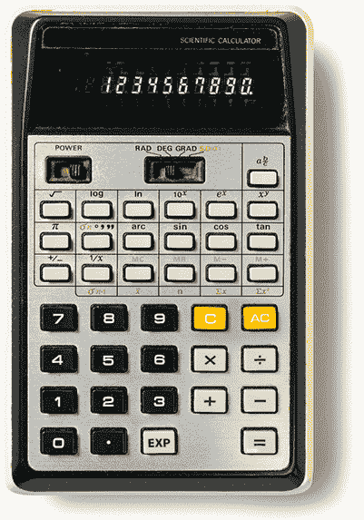
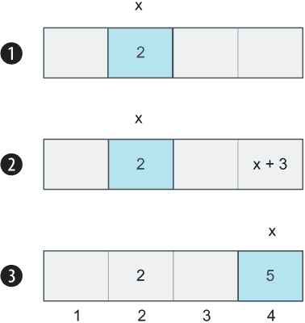
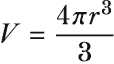

# 2 Julia 作为计算器

本章涵盖

+   处理整数、浮点数和分数

+   使用变量存储长数字

+   通过定义函数创建可重用的计算

+   Julia 中最基本的类型

即使你最终没有将 Julia 作为你的主要语言，你也可能仍然将其视为桌面计算器的替代品。Julia 甚至可以充当高级高中图形计算器（图 2.1）。作为额外的好处，它是完全免费的。



图 2.1 复古科学计算器。我们能否用 Julia REPL 来替代手持计算器的使用？

记住，你必须先学会走路，然后才能跑步，探索数字是了解 Julia 核心概念的好方法。由于 Julia 不仅仅是一种通用编程语言，而且专门针对数值计算进行了定制，因此在 Julia 中操作数字扮演着独特的角色。

在本章中，你将了解 Julia 的各个方面，让你能够在 Julia 中做与使用计算器相同的事情。当然，你可能反对你并不打算将 Julia 用作计算器，但这仅仅是为了给你打下理解更复杂主题的基础。

## 2.1 Julia 命令行

如果你已经正确安装并配置了 Julia（见附录 A），你可以在终端提示符中输入 Julia 以启动 Julia REPL。这个交互式命令行程序读取你的输入，就像计算器一样，并在你按下回车键后立即打印出结果。REPL 是一个测试你的代码、查找文档和安装第三方软件的地方。

在本章中，你将专注于在 REPL 中评估数学表达式。下一个代码示例演示了如何从终端（控制台）应用程序启动 Julia 命令行。启动后，输入 2 + 3 并按回车键。Julia 评估这个表达式并打印出 5：

```
$ julia
               _
   _       _ _(_)_     |  Documentation: https:/ /docs.julialang.org
  (_)     | (_) (_)    |
   _ _   _| |_  __ _   |  Type "?" for help, "]?" for Pkg help.
  | | | | | | |/ _` |  |
  | | |_| | | | (_| |  |  Version 1.6.0 (2021-03-24)
 _/ |\__'_|_|_|\__'_|  |  Official https:/ /julialang.org/ release
|__/                   |

julia> 2 + 3
5
```

你可以执行比加两个一位数更复杂的操作。在下一个示例中，你将执行一些非常常见的数学运算，包括求对数、正弦和平方根。rand 是一个数学函数，其结果是在 0 和 1 之间的随机数：

```
julia> 4 * 5
20

julia> (1.5 + 3.5)*4      ❶
20.0

julia> 2³                ❷
8

julia> log(2.71828⁴)     ❸
3.999997309389128

julia> sin(3.1415926/2)   ❹
0.9999999999999997

julia> sqrt(9)            ❺
3.0

julia> rand()             ❻
 0.14765146459147327
```

❶ 复杂表达式可以用括号嵌套。

❷ 指数；求 2 的 3 次方

❸ 2.71 的自然对数，也称为欧拉数 e

❹ 获取π/2 弧度的正弦值。

❺ 9 的平方根

❻ 从 0 到 1 生成一个随机数。

## 2.2 使用常量和变量

记忆像 3.1415926...（π）或 2.71828...（欧拉数 *e*）这样的数字的所有位数是枯燥的。实际上，这是不可能的，因为这两个数都是我们所说的*无理数*，这意味着它们有*无限*的位数。因此，给每个数字一个名字——或者更准确地说，一个*标识符*会更好。

重要 *变量* 和 *常量* 定义了内存中的区域，其中存储着值（数据）。将内存想象成一个长长的编号信箱列表，每个信箱都持有一个值。为了避免记住包含值的信箱编号，附加一个命名标识符。你可以在创建变量后更改其值，但不能更改常量的值。

标识符可以用来给 Julia 中的常量、变量、类型和函数命名。pi (π)、golden (ϕ) 和欧拉数 e 是用来引用数值 *常量* 的标识符。常量和变量简化了记忆长而复杂的数字：

```
julia> using Base.MathConstants   ❶

julia> pi
π = 3.1415926535897...

julia> e                          ❷
ℯ = 2.7182818284590...

julia> golden                     ❸
ϕ = 1.6180339887498...

julia> catalan                    ❹
 catalan = 0.9159655941772...
```

❶ 你可以使常见的数学常量在 Julia 中可用。pi 总是可用的，但其他常量则不是。

❷ 欧拉数通常与对数一起使用。

❸ 黄金比例经常用于艺术中的美学原因，并在自然界中存在，例如叶子的螺旋排列。

❹ Catalan 常数

使用这些常量，编写数学表达式变得更加方便。你还会得到更准确的结果，因为无法用足够的数字来表示 *e* 或 π。这些是无理数，具有无限多位数字。数学家实际上不知道 Catalan 的数是否是无理数，但在 Julia 中它被建模为无理数：

```
julia> log(e⁴)
4.0

julia> sin(pi/2)
1.0
```

然而，你并不局限于使用内置常量。你可以在 Julia 中使用 const 关键字定义自己的常量，并在计算中使用它们而不是数字字面量：^(1)

```
julia> const foo = 3481
3481

julia> const bar = 200
200

julia> foo + bar
3681

julia> const qux = 8
8

julia> qux + 2
10
```

你可能想知道那些听起来很奇怪的名称 foo、bar 和 qux。这些是常用在代码示例中的无意义词汇，用来告知读者在这种情况下他们可以随意选择 *任何* 词汇。这些与像 if、while、const 和 function 这样的保留词不同；你不允许将它们用作变量名。

当编写 Julia 标识符时，你可以混合使用大小写。foObAr 和 FOObar 都是有效的。但是 Julia 是区分大小写的，所以它们将被视为 *不同的* 标识符。

提示：Julia 的标识符是区分大小写的。foo、Foo 和 FOO 不会被 Julia 视为相同的标识符。这是当今大多数现代编程语言的通用做法。

只要数字不是单词的开头，你就可以添加数字。因此 f00bar 是有效的，但 1oobar 是无效的。你应该习惯于来自其他编程语言的类似规则。

Julia 在频繁使用希腊字母方面很独特，例如 π、θ、α 和 Δ。这样做的原因是数学通常使用希腊字母书写。当数学方程在代码中实现时，如果代码看起来与方程相似，那么阅读代码会更容易。

为了适应这一点，Julia 的创建者在 Julia REPL 和 Julia 编辑器插件中内置了特殊功能，以便轻松编写希腊字母和其他 Unicode 字符。例如，在 REPL 环境中，你写一个反斜杠，然后写你想写的字符名，然后按 Tab 键：

```
julia> \pi
```

在我按下 Tab 键后，这变成了

```
julia> π
```

以下是一些流行的希腊字母和 Unicode 字符的概述，你可能会想在代码中使用，以及一些关于它们通常含义的注释。

| 字符 | 完成提示 | 用法 |
| --- | --- | --- |
| π | \pi | 圆的方程 |
| θ | \theta | 角度 |
| Δ | \Delta | 某物之间的差异或变化 |
| *e* | \euler | 欧拉数（对对数很重要） |
| √ | \sqrt | 数字的平方根 |
| ϕ | \varphi | 黄金比例 |

变量与常量有什么不同？创建变量的过程非常相似，只是你不需要使用 const 关键字：

```
julia> y = 7
7

julia> z = 3
3

julia> y + z + 2
12
```

那么究竟有什么区别呢？这个 REPL 交互演示了变量和常量之间的区别：

```
julia> const x = 9
9

julia> y = 7
7
julia> x = 12
WARNING: redefinition of constant x. This may fail, cause incorrect answers,
or produce other errors.
12

julia> y = 8
8
```

在这个例子中，你将 x 设为常量，y 设为变量。注意 Julia 警告你正在尝试更改常量的值。虽然这确实可能工作，但 Julia 不保证它一定会这样做，这就是为什么 Julia 会给你一个警告。永远不要让你的代码依赖于未定义的行为。

有用的快捷键 使用 Ctrl-D 退出 Julia。Ctrl-C 将中断某些卡住的代码的执行。清除终端屏幕的方法因操作系统而异。在 Mac 上，使用 Command-K 清除终端，在 Linux 上使用 Ctrl-L。

重新启动 Julia 以使所有标识符再次可用。

### 2.2.1 将值赋给变量和绑定

在 Julia 中，等号（=）用于将值赋给变量。使用双等号（==）比较两个表达式是否相等。然而，为了准确起见，Julia 所做的不是赋值，而是*绑定*。为了更好地理解绑定是如何工作的，我将提供一个代码示例，其中变量 x 首先绑定到值 2。然后它被重新绑定到值 x + 3：

```
julia> x = 2       ❶
2

julia> x = x + 3   ❷
 5
```

❶ 将 x 的初始值设为 0。

❷ 将 x 增加 2。

如果这个代码示例是一个像 C/C++、Fortran 或 Pascal 这样的语言，那么系统会为 x 变量预留一个内存槽位。每次你给变量 x 赋新值时，这个内存位置中存储的数字就会改变。



图 2.2 将变量 x 绑定到不同的内存位置

使用绑定，它的工作方式不同。你必须将每次计算视为产生一个数字，该数字被放入不同的内存位置。绑定涉及将 x 标签本身移动到新的内存位置。变量移动到结果，而不是结果移动到变量。图 2.2 展示了逐步解释，应该有助于阐明这是如何工作的。

1.  数字 2 存储在内存单元格 2 号。你将标签 x 附加到这个值上，这相当于初始赋值语句 x = 2。

1.  Julia 在表达式 x = x + 3 中开始评估 x + 3。它将这个计算的结果存储在内存单元 4 号。

1.  为了完成对 x = x + 3 语句的评估，Julia 将 x 标签移动到内存单元 4。

但为什么 Julia 和其他动态类型语言执行绑定而不是赋值？在 C/C++ 这样的语言中，你可以编写如下语句。

列表 2.1 C/C++ 中的赋值

```
int x = 4;
x = 5;

char ch = 'A';
ch = 'B';
```

这之所以可行，是因为编译器会确保你永远不会尝试将无法放入为变量 x 和变量 ch 预留的内存槽中的值。在动态类型语言中，任何值都可以赋给 x，因此，它不能在内存中预定义的位置有一个预定义的大小。

### 2.2.2 使用 ans 变量

在 Julia 中有一个特殊的变量，只有在你交互式使用 Julia 时才存在，称为 ans（答案）。Julia REPL 将你评估的最后表达式的值赋给它。正常程序中的表达式不会赋给它。

如果他们使用过高级计算器，许多人会对类似的变量很熟悉。ans 是一个总是持有最后计算结果的变量。这种行为是实用的，因为它允许你轻松地将最后计算的结果用于下一次计算：

```
julia> 3 + 2
5

julia> ans*4
20

julia> ans
20

julia> ans - 8
12
```

### 2.2.3 什么是文字系数？

如果你阅读过数学，你可能已经注意到，像 3 × x + 2 × y 这样的表达式会被写成 3x + 2y。Julia 允许你以相同的方式编写乘法。我们称这些为 *文字系数*，它是数字文字与常数或变量之间乘法的缩写：

```
julia> x = 3
3

julia> 2x
6

julia> 2*(3+2)
10

julia> 2(3+2)
10
```

文字系数仅适用于实际的数字文字。例如，π、*e* 和 ϕ 不是数字文字。你可以写 2π，但不能写 π2，因为后者会暗示一个标识符。

使用文字系数和执行乘法之间存在细微的差别。看看你是否能理解以下示例：

```
julia> x = 5
5

julia> 1/2x
0.1

julia> 1/2*x
2.5
```

这里发生了什么？1/2x 被解释为 1/(2*x)。文字系数的优先级高于除法。

## 2.3 Julia 中不同的数字类型及其位数

Julia 有多种不同的数字类型，如有符号整数、无符号整数和不同位长的浮点数。如果你对这些概念不熟悉，我建议你阅读附录 B 中关于不同数字类型的内容。

让我们专注于 Julia 的特殊性。在 Julia 中，有符号整数命名为 Int8、Int16、Int32、Int64 和 Int128。数字后缀表示数字的位数。无符号整数类型名称通过在前面加上 U 来形成，这给你提供了 UInt8、UInt16、UInt32、UInt64 和 UInt128。

在运行代码时，了解特定整数类型的最大和最小值通常是实用的。你可以使用 typemin 和 typemax 函数来发现最小和最大值。例如，typemin(Int8)返回-128，因为 8 位整数不能表示小于-128 的值。typemax(Int8)将返回 127：

```
julia> typemax(Int8)
127

julia> typemin(Int8)
-128
```

Julia 中数字字面量的默认位长是有符号的 64 位整数。你可以使用 typeof 函数轻松验证这一点，该函数返回输入参数的类型：

```
julia> typeof(1)
Int64
```

那么，如何形成其他位长的数字呢？如果你想创建一个有符号的 8 位数字，你写 Int8(x)，其中 x 是你想转换成 8 位数的数字。这适用于任何数字类型。自然地，如果你尝试输入一个超出位长的数字，你会得到一个错误信息：

```
julia> y = Int8(42)
42

julia> typeof(y)
Int8

julia> typeof(Int16(4))
Int16

julia> UInt8(256)
ERROR: InexactError: trunc(UInt8, 256)
```

你应该知道，与 Python、Ruby 和 R 等其他流行的动态类型语言不同，Julia 不会自动选择一个足够大的数字类型来容纳算术运算的结果。在 Julia 中，如果你将两个 Int8 值相加，结果将始终是 Int8 值。

其他动态语言如果结果太大无法用 8 位整数表示，就会升级到 Int16。在 Julia 中，你将得到一个溢出。如果你不熟悉整数溢出的概念，请阅读附录 B。

有时即使是 Int128 也不足以容纳一个值。在这些情况下，你使用 BigInt，它可以容纳任意大小的整数。这种灵活性是以更高的内存消耗和较低的性能为代价的，所以只有在必要时才使用 BigInt。

### 2.3.1 使用不同的数字格式编写数字

你如何写一个数字以及这个数字实际上在内存中的存储是两回事。数字 0b1101、0x0d 和 13 在计算机内存中以完全相同的二进制数存储。Julia 默认以十进制格式显示所有有符号数，以十六进制格式显示无符号数，如 UInt8：

```
julia> Int(0b1101)
13

julia> Int(0x0d)
13

julia> UInt8(13)
0x0d
```

十六进制数在低级、面向位的编程中很受欢迎。这是因为四个位可以用一个十六进制数字精确表示。八进制数也很受欢迎，因为可以用三个位来精确表示一个八进制数字。

十六进制和八进制数

十进制数是通过组合 0 到 9 的数字来创建的。八进制数是通过组合 0 到 7 的数字来创建的。因此，在八进制数系统中，数字 8 将被写作 10。

使用十六进制数时，存在一个问题，因为十六进制数系统中的数字必须覆盖从 1 到 15 的值；然而，只有 0 到 9 的符号。解决方案是使用字母来表示超过 9 的数字；因此，10 表示为 A，11 表示为 B，以此类推。F 代表 15。一个 8 位无符号整数可以持有的最大值是 0xff，这在十进制中相当于 255。

要编写八进制数，使用 0o 前缀——你不需要完全理解这一点。关键是让你意识到有不同方式表示相同的数字。这是为了避免在处理本章中的*无符号*整数时产生混淆，因为 Julia 默认以十六进制形式显示它们：

```
julia> 0o5 == 0b101
true

julia> 0o6 == 0b110
true

julia> 0o7 == 0b111
true

julia> 0o10 == 0b1000
true

julia> Int(0o10)
8

julia> Int(0o23)
19

julia> 2 * 8 + 3
19
```

## 2.4 浮点数

与整数类似，浮点数也有不同位长的。在 Julia 中，默认大小是 64 位，这意味着每个浮点数占用 8 字节内存。通过使用更多的位，你不仅可以表示更大的数字，还可以表示更高精度的数字。然而，精度并不总是重要的。对于科学计算，精度很重要，但在计算（例如，用于计算机图形）时，精度的重要性较小。在数百万个像素中，位置或颜色略有错误的像素并不重要。最常见的浮点数类型，Float64 和 Float32，可以写成数字字面量：

```
julia> 42.98      ❶
42.98

julia> typeof(ans)
Float64

julia> 34.23f0    ❷
34.23f0

julia> typeof(ans)
Float32
```

❶ 64 位浮点数字面量。你可以使用 typeof 来验证。

❷ 32 位浮点数

注意使用 f0 后缀来表示 32 位浮点数的数字。为什么不像 Java 和 C/C++那样只有一个 f 呢？这是因为字面量系数功能。如果你查看以下 REPL 会话，你可能能够弄清楚发生了什么：

```
julia> 0.5f
ERROR: UndefVarError: f not defined

julia> f = 2
2

julia> 0.5f
1.0

julia> 2f
4
```

如果你尝试编写类似于 Java 或 C/C++的 32 位浮点数，Julia 会认为你正在尝试将一个数字与变量 f 相乘。在第一种情况下，这会失败，因为你还没有定义 f 变量。在第二种情况下，它有效，因为 f 已经被定义。

那么，其他浮点值，如 16 位值呢？在这些情况下，你需要执行显式转换：

```
julia> x = Float16(3.5)     ❶
Float16(3.5)

julia> typeof(x)
Float16

julia> z = Float16(4) + 5f0
9.0f0

julia> typeof(z)            ❷
Float32
```

❶ 将 64 位浮点数转换为 16 位浮点数。

❷ 混合不同位长的数字会导致 Julia 选择最大的类型来存储结果。

### 2.4.1 对整数和浮点数执行操作

虽然你可以在浮点数和整数上执行许多相同的操作，但操作的结果并不总是相同的。而且还有一些操作只适用于某些数字类型。

例如，\除法运算符返回浮点数作为结果。这并不总是你想要的。当与整数一起工作时，你通常想要商和余数。这可以通过 div 和 rem 函数来实现：

```
julia> 4/2         ❶
2.0

julia> 5/2         ❶
2.5

julia> 5.0/2.0     ❶
2.5

julia> div(5,2)    ❷
2

julia> rem(5,2)    ❸
1

julia> 5%2         ❸
1
```

❶ 正规除法运算符给出浮点结果

❷ 整数除法，返回整数结果

❸ 你还会得到一个余数，你可以使用%运算符来获取。

## 2.5 定义函数

你已经接触到了一些函数，例如*sin*、*cos*和√。这些是你可以在普通计算器上找到的函数；它们接受一个数字作为输入，并返回一个数字作为输出。但函数背后的基本理念是什么？其次，数学和 Julia 中的函数是否是同一类东西？细节不同，但从概念上讲，它们是同一类东西。函数有零个或多个称为*参数*的输入。它们可以被认为是返回一个值或评估到一个值。考虑球体的体积：



你记得这个计算过程有多好？我经常需要查找它。你可以在 Julia 中通过编写以下代码来执行这个计算：

```
julia> r = 4.5            ❶
4.5

julia> V = 4*pi*r³/3     ❷
381.7035074111598
```

❶ 球体的半径

❷ 将球体的体积存储在变量 V 中

变量和常量使得记住长而复杂的数字变得容易。在许多方面，你可以将函数视为这个想法的扩展。它们允许你记住复杂的计算。你不需要记住要乘以和除以的数字，只需要记住函数的名称：

```
julia> sphere_volume(r) = 4*pi*r³/3            ❶
sphere_volume (generic function with 1 method)

julia> sphere_volume(2)                         ❷
33.510321638291124

julia> sphere_volume(4)                         ❸
268.082573106329

julia> sphere_volume(1)
4.1887902047863905
```

❶ 定义名为 sphere_volume 的函数，它接受单个参数 r，指定球体的半径。

❷ 使用先前定义的球体函数来计算半径为 2 的球体的体积。

❸ 半径为 4 的球体的体积

注意，当你定义一个函数时，与变量不同，你指定一个或多个参数。参数是在你的计算中想要改变的变量。例如，在计算球体体积时，你希望π的值每次都相同；因此π不是函数的参数。然而，半径是一个参数，因为你是想计算不同半径的球体的体积：

```
foo(x, y, z) = 2x + 4y - z
```

在前面的代码片段中，你可以看到一个简单的函数定义。这是一个名为 foo 的函数，它接受三个不同的参数，分别命名为 x、y 和 z。你可以有少量或许多参数。命名它们的规则与任何 Julia 标识符的规则相同。

### 2.5.1 在文件中存储函数定义

每次重启 Julia 时都在 Julia REPL 中编写你想要使用的每个函数的定义是不切实际的。相反，你可以在单独的源代码文件中存储函数定义。

代码注释（#）你可以在代码中写注释来提醒自己代码的各个部分做了什么。注释以井号开头：#。井号符号之后的内容会被 Julia 编译器忽略。

此文件可以在需要其中包含的函数时稍后加载到 Julia REPL 中。让我用一个例子来演示。你将创建一个名为 volumes.jl 的文件。在里面，你存储计算球体、圆柱体和圆锥体体积的函数。

列表 2.2 volumes.jl 源代码文件

```
# Volume calculations
sphere_volume(r)      = 4π*r³/3
cylinder_volume(r, h) = π*r²*h
cone_value(r, h)      = π*r²*h/3
```

你可以通过三种不同的方式将此文件中的代码放入 Julia 中。可能最不复杂的方法就是简单地复制粘贴文本到 Julia 命令行。或者，你可以在启动 Julia 时加载该文件：

```
$ julia -i volumes.jl
               _
   _       _ _(_)_     |  Documentation: https:/ /docs.julialang.org
  (_)     | (_) (_)    |
   _ _   _| |_  __ _   |  Type "?" for help, "]?" for Pkg help.
  | | | | | | |/ _` |  |
  | | |_| | | | (_| |  |  Version 1.6.0 (2021-03-24)
 _/ |\__'_|_|_|\__'_|  |  Official https:/ /julialang.org/ release
|__/                   |

julia> cone_value(2, 4)
16.755160819145562
```

然而，更灵活的解决方案是使用 include 函数。这不需要重新启动你的 Julia REPL 会话：

```
julia> include("volumes.jl")                 ❶
cone_value (generic function with 1 method)

julia> cylinder_volume(1, 2)                 ❷
 6.283185307179586
```

❶ 将给定文件中的代码加载到你的当前会话中

❷ 运行当前会话中加载的文件中定义的函数之一

你可以修改此文件中的代码，并使用 include 重新加载它以捕获函数实现的更改。

### 2.5.2 在 REPL 中处理函数

一旦将复杂计算存储在函数中，你可以轻松地重用这些计算。但是，你如何处理大量函数？Julia REPL 提供了许多帮助的方法。

如果你开始输入函数的第一个字母并按 Tab 键，Julia 将尝试完成函数名。如果你开始输入 sphere 并按 Tab 键，Julia 将将其完成为 sphere_volume。有时可能有多个可能的完成。在这些情况下，你可以按 Tab 键两次以获取可能的完整列表：

```
julia> find                  ❶
findall   findlast   findmax!   findmin!   findprev
findfirst findmax    findmin    findnext
```

❶ 在这里按 Tab 键两次以获取以单词 find 开头的函数的完整列表。

在 Julia 编程语言的网页上，你还可以找到一个手册，其中提供了 Julia 标准库中所有内置函数的完整列表。你可以在以下网页上访问手册：docs.julialang.org/en/v1。

### 2.5.3 到处都是函数

函数是 Julia 的核心。实际上，甚至常见的数学运算符在 Julia 中也被定义为函数。让我给你举一些例子：

```
julia> 5 + 3            ❶
8

julia> +(5, 3)          ❷
8

julia> 8 - 2            ❶
6

julia> -(8, 2)          ❷
6

julia> +(2, 3, 5)       ❸
10
```

❶ 它看起来像你正在使用一个运算符，但实际上是一个以中缀形式编写的函数调用。

❷ 这些是像常规函数一样调用的运算符。这被称为前缀形式。

❸ 使用 + 作为函数的好处是你可以使用超过两个参数（例如，你可以用它来累加多个值）。

要描述标识符的位置，请使用以下术语：前缀、中缀和后缀。因此 +(3, 4) 被认为是 *前缀* 形式，而 3 + 4 则是等效的 *中缀* 形式。

你如何知道是否可以在中缀形式中使用一个函数？很简单：函数名需要是一个符号。例如，你不能使用名为 foo 的函数来表示中缀形式。让我们做一些演示：

```
julia> ×(a, b) = a² + b²
× (generic function with 1 method)
julia> ×(4, 10)
116

julia> 4 × 10
116

julia> 2 × 3
13
```

在这里，我们创建了一个名为 ×（写 \times）的函数，因为它接受两个参数并且是一个符号，所以我们可以使用它来表示中缀形式。获取符号的最简单方法就是编写类似 LaTeX 的缩写并按 Tab 键（例如，\Delta 表示 Δ）。Julia 支持的类似 LaTeX 的缩写可以在官方 Julia 文档中找到，网址为 [`docs.julialang.org/en/v1/manual/unicode-input/`](https://docs.julialang.org/en/v1/manual/unicode-input/)。

### 2.5.4 与数字一起工作的函数

你已经看到了一些可以用来操作数字的函数，但 Julia 有一大批这样的函数。我想展示一些最有用的函数，特别是用于处理整数和浮点数。之前，我展示了一些整数和浮点数的操作。然而现在你知道操作实际上只是函数。所有这些变体都是等价的：

```
julia> 9 % 6
3

julia> %(9, 6)
3

julia> rem(9, 6)
3
```

Julia 的原则是，你永远不需要使用特殊的 Unicode 符号。整数除法等操作也可以使用简单的函数执行：

```
julia> 9÷4
2

julia> ÷(9, 4)
2

julia> div(9, 4)
2
```

事实上，如果你按下?键并写一个整数除法，你会得到内置的帮助系统，显示 div 有两个名称：

```
help?> div(9, 4)
  div(x, y)
  ÷(x, y)

The quotient from Euclidean division. Computes x/y, truncated to an integer.
```

了解如何以不同方式四舍五入数字非常有用。Julia 有 floor、ceil 和 round 函数用于此目的：

```
julia> floor(3.2)     ❶
3.0

julia> floor(3.6)     ❶
3.0

julia> ceil(3.2)      ❷
4.0

julia> ceil(3.8)      ❷
4.0

julia> round(3.2)     ❸
3.0

julia> round(3.5)     ❸
4.0
```

❶ 总是向下取整

❷ 总是向上取整

❸ 四舍五入到最接近的整数

但如果你要四舍五入到整数，那么你可能想要整数类型：

```
julia> Int(round(3.5))     ❶
4

julia> round(Int64, 3.5)   ❷
4

julia> round(Int8, 3.5)
4

julia> typeof(ans)
Int8
```

❶ 这是获取整数的原生方法。

❷ 这是预期且最有效的方法：你将作为第一个参数提供你想要的输出类型。

## 2.6 如何在实际中使用数字

这里涵盖的许多细节不是你在进行常规编码时需要考虑的事情。我不想让你的大脑充斥着太多不必要的细节。关键点在于向你提供对 Julia 中数字工作原理的理解。这不仅仅局限于 Julia，但对于来自其他动态语言（如 Python、R 或 Ruby）的开发者来说可能是不熟悉的。

为了让你更容易操作，以下是一些简单的规则：

1.  只使用默认的整数和浮点数大小。只有当性能或问题的性质要求时，才考虑更小或更大的数字。

1.  优先使用有符号整数而不是无符号整数。使用无符号数很容易出错。为了让你更容易操作，大多数时候坚持使用有符号数。

## 摘要

+   Julia 支持不同类型的数字，但最重要的两种类型是整数和浮点数。

+   与数学家使用的数字不同，编程中使用的数字有特定的位数。这决定了你可以存储的数值大小。例如，一个有符号的 8 位整数无法存储小于-128 或大于 127 的数字。

+   变量给数字命名。函数给依赖于零个或多个参数的计算命名。

+   将一个值赋给变量意味着在那个值上贴一个标识符。将另一个值赋给同一个变量意味着将标签移动到新值上。这被称为绑定。

+   在内存中看起来相同的两个数字，因为它们的类型不同，在屏幕上可能看起来不同。

+   你可以使用不同的格式输入数字：二进制、十进制和十六进制。除非你进行系统编程，否则通常首选十进制格式。

* * *

(1.)一个数字字面量由 0 到 9 的数字组成，而不是用命名的变量来表示。
