# 3 控制流

本章涵盖

+   在条件中使用布尔值

+   使用 while 和 for 循环多次运行相同的代码

+   使用 if 语句决定运行什么代码

+   遍历数字范围

+   定义跨越多行代码的函数

+   使用递归或迭代实现控制流

控制流是区分计算机和普通计算器的地方。计算器用于计算单个表达式。另一方面，计算机具有在无需人工干预的情况下多次使用不同输入重复相同计算的能力。计算机可以根据条件是否为真来选择执行一个计算而不是另一个计算。

在本章中，您将探索围绕生成数学表的代码示例。您将了解三角函数表，因为这些表广为人知，并且具有历史重要性。稍后，您将探索条件执行，以帮助跟踪使用 800 年前意大利数学家斐波那契开发的方法繁殖的兔子的增长。

## 3.1 航海与三角学

在帆船时代，数学表的使用变得更加普遍，并且需要开发自动化计算这些表的方法（航海基于计算角度和三角形的边；图 3.1）。这意味着计算正弦、余弦和正切等三角函数。

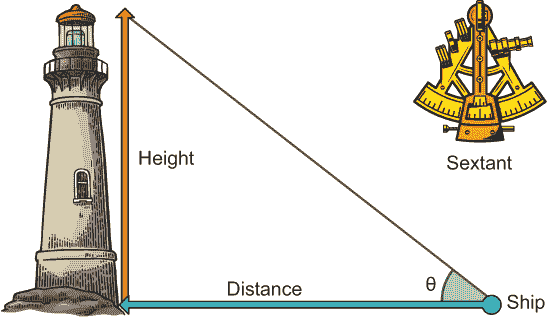

图 3.1 一艘船上的船长可以使用六分仪来测量地平线和灯塔顶部之间的角度θ。

海图包含不同灯塔的高度。因此，如果您想在靠近海岸的海域知道自己的位置，您可以测量地平线和已知高度的灯塔顶部之间的角度。这将给出您到该灯塔的距离。然而，所有这些计算都需要计算正弦和余弦等三角函数，而 18 世纪的船长们没有携带计算器（表 3.1）。

表 3.1 一个简单的三角函数表

| 角度 | 0° | 30° | 45° | 60° | 90° |
| --- | --- | --- | --- | --- | --- |
| sin | 0.000 | 0.500 | 0.707 | 0.866 | 1.000 |

他们使用的是数学表。当时，大型、印刷的表格，详细列出不同角度的正弦、余弦和正切值，是航海家们常用的工具。

如果您有一段时间没有使用三角函数，让我来帮您回顾一下高中数学。观察图 3.2 中的三角形，正弦、余弦和正切的定义如下：

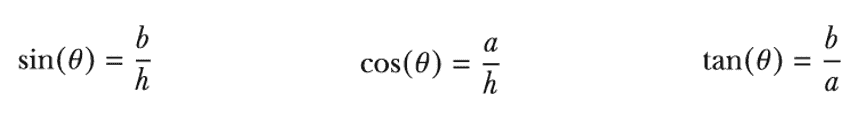

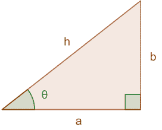

图 3.2 一条边长为 a、b 和 h 的直角三角形。最长的边 h 称为斜边，有一个角度θ。

例如，一个角的正弦值等于直角三角形中对立边的长度除以最长边（斜边）的长度（一个角是 90°）。今天你使用计算器来计算这些三角函数。但如果你生活在 1972 年之前^(1)，你会如何手动进行这些计算？实际上，没有计算正弦和余弦的标准方法。相反，有各种近似方法。计算正弦的一个流行方法是称为 *泰勒级数*：

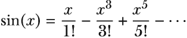

你可以将其写成更紧凑和通用的形式为


但数学表不仅限于三角函数。表格对于许多其他函数都很有用，可以减少所需的手动计算量。

这促使查尔斯·巴贝奇在 1819 年开始构建一台名为差分机的巨大机械计算器（图 3.3）。它可以通过重复相同的计算多次来计算表格中的多个值。用现代编程术语来说，它是在循环中创建表格。循环基于评估（运行）相同的代码，只要给定条件保持为真。在所有编程语言中，布尔表达式都用于定义条件。你将跟随巴贝奇的脚步，在 Julia 中创建这样的循环。

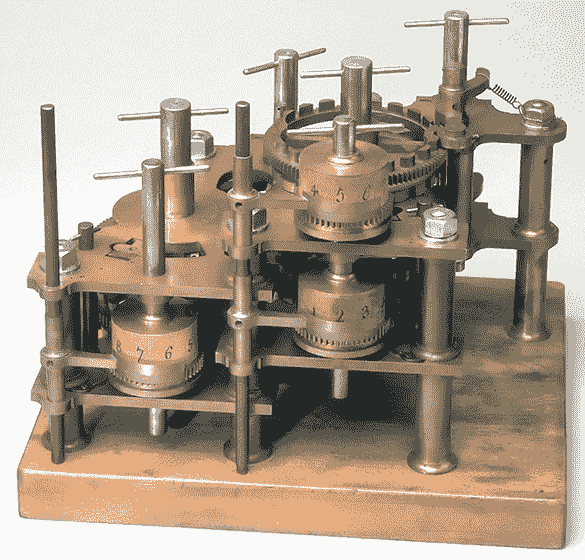

图 3.3 查尔斯·巴贝奇的差分机的一部分，它是分析机——第一台机械通用计算机的先驱

你的目标是使用泰勒级数在 Julia 中实现三角函数。在此之前，你需要理解布尔表达式，这些表达式使得理解 while 循环、for 循环和 if 语句成为可能。你将通过一系列较小的代码示例来发展这种理解，打印数字、加数字和将角度转换为弧度。

## 3.2 布尔表达式

在小学阶段，你首先学到的是布尔表达式。讽刺的是，大多数学生从未练习过它们。没有人告诉你它们是任何编程语言最重要的部分之一。你已经看过数值表达式，例如 *3 + 5*；这些表达式评估为数字。相比之下，布尔表达式评估为真或假。通过一些实际例子，它们更容易理解：

```
julia> 3 > 5           ❶
false

julia> 8 > 3           ❷
true

julia> 8 == 5 + 3      ❸
true

julia> 3 == 5          ❸
false

julia> 3 ≤ 3           ❹
true

julia> 3 <= 3          ❹
true
```

❶ 3 是否大于 5？

❷ 8 是否大于 3？

❸ 检查值是否相等。这不是一个赋值操作符。

❹ 小于等于

在这个例子中，你使用了 *小于等于* 操作符的 Unicode 版本。有几个布尔操作符有 Unicode 变体。以下表格显示了如何在 Julia 的 REPL 中编写它们：

| 字符 | Tab 完成提示 | 描述 |
| --- | --- | --- |
| ≤ | \leq | 小于等于 <= |
| ≥ | \geq | 大于等于 >= |
| ≠ | \ne | 不等于 != |
| ≈ | \approx | isapprox(x, y) |

布尔表达式返回布尔值，其中只有两个：true 和 false。记得我说过在计算机内部一切都是数字吗？布尔值也不例外：

```
julia> typeof(7 > 3)               ❶
Bool

julia> typeof(false)
Bool

julia> reinterpret(UInt8, false)   ❷
0x00

julia> reinterpret(UInt8, true)    ❸
0x01
```

❶ 布尔表达式给出类型为 Bool 的值。

❷ 假值存储为 0。

❸ true 存储为 1。

与许多其他编程语言不同，Julia 实际上允许你对布尔值执行算术运算。在算术中，布尔值被视为 0 或 1：

```
julia> true + true
2

julia> 3true + true
4

julia> true + false + true
2

julia> false + false
0
```

为了清晰起见，最好避免将布尔值用作数字。然而，在某些情况下，这非常有用。Julia 开发者经常用它来计算有多少个东西是真的。在第四章中，你将看到这个例子。

### 3.2.1 复合语句

布尔表达式可以用 || 和 && 运算符组合。这些执行所谓的逻辑 *OR* 和逻辑 *AND* 操作。因此，给定一个变量 x，例如，我可以询问它是否小于 4 *或*大于 10：

```
julia> x = 3
3

julia> x < 4 || x > 10
true

julia> x = 5
5

julia> x < 4 || x > 10
false
```

或者，你可以询问 x 是否大于 4 并且小于 10：

```
julia> x > 4 && x < 10
true

julia> x = 12
12

julia> x > 4 && x < 10
false
```

接下来，你将使用布尔表达式来定义重复执行相同代码的条件。

## 3.3 循环

任何编程语言中最简单的循环结构是 while 循环。它允许你在布尔条件为真时重复执行相同的代码，如下面的列表所示。

列表 3.1 一个简单的 while 循环

```
i = 0
while i < 5
    i = i + 1
end
```

在关键字 while 和 end 之间的所有代码只要条件 i < 5 为真就会重复执行。你可以将这段代码复制粘贴到你的 Julia REPL 中，但你不会看到任何输出。为什么？因为 while end 是一个求值为空的表达式。这可能听起来有点抽象，所以让我举一个例子：3 + 4 是一个求值为 7 的表达式。你可以将表达式的值存储在变量中，如下所示：

```
julia> x = 3 + 4
7

julia> y = while false end    ❶

julia> typeof(y)              ❷
Nothing
```

❶ 无意义的 while 循环，立即终止

❷ Julia REPL 不打印 nothing 值。

while 循环的例子说明了几个不同的事情。循环本身求出一个值，就像 *3 + 4* 一样。你将这个值存储在变量 y 中。然而，你无法在 REPL 中看到这个值，因为它属于类型 Nothing。

还要注意，将 while 循环放在单行上是完全可能的。在 Julia 中，空白不像在 Python 中那样重要；在 Python 中，你必须记住缩进属于循环的语句。但在 Julia 中，空白确实扮演着角色。考虑以下三个赋值：

```
x = 4
y = 8
z = 3
```

如果你想要它们在单行上，你需要用分号来分隔它们：

```
x = 4; y = 8; z = 3
```

你可能会想知道为什么我将 while 表达式的值存储在一个变量中。我这样做纯粹是为了教学目的，让你意识到在 Julia 中几乎所有东西都是一个表达式，它评估为值。甚至赋值也会评估为值（参见列表 3.2）。虽然这可能听起来像是一个对你没有兴趣的理论上的好奇心，但它确实有许多实际的影响。它使得 REPL 显示你在赋值语句中给变量赋予的值。你也会在讨论 if 语句时看到将一切视为表达式的优点。

列表 3.2 赋值的结果是一个值

```
julia> z = 3 + 2
5
```

注意，将赋值称为语句在技术上是不正确的，因为在 Julia 中一切都是表达式。然而，我将在本书中关于许多表达式中使用“语句”这个词。原因是这有助于区分赋值和控制流，例如 if 语句和 while 循环，以及更多的数学表达式。

REPL 总是显示外部表达式的值，而不是内部表达式的值。例如，如果你评估 1 + (3+2)，你永远不会看到 5 打印出来，因为那是子表达式 3+2 的值。同样，你也不会在循环中看到 i = i + 1。要*看到*每次迭代的 i 的值，你需要明确告诉 Julia 将值打印到控制台。这是通过 print 和 println 函数完成的：

```
julia> i = 0
0

julia> while i < 5
           i = i + 1
           print(i)
       end
12345
julia> i = 0
0

julia> while i < 5
           i = i + 1
           println(i)
       end
1
2
3
4
5
```

从这些例子中，你可能可以分辨出差异。println 是 *print line* 的缩写。它在单独的一行上打印一个变量。你可以使用 print 和 println 在循环之外显式地打印值，但这很少需要：

```
julia> print(3 + 4)
7
julia> print(i)
5
```

### 3.3.1 流程图

文本不能很好地可视化程序的控制流。你必须知道语义。正因为如此，使用方框和箭头描绘程序流程的流程图曾经非常流行（图 3.4）。

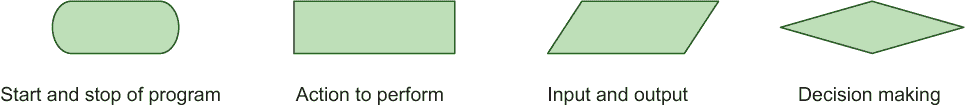

图 3.4 标准流程图框

在过去，学生会学习将程序设计成流程图，然后编写代码。面向对象编程的流行导致流程图不再使用，因为它们无法模拟对象关系。然而，流程图在教授程序中的控制流方面仍然非常有用。如果你不熟悉循环，流程图可以帮助你发展对它们如何工作的直觉（图 3.5）。

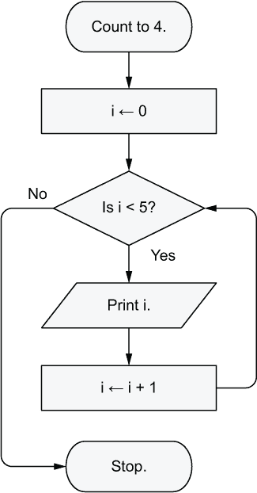

图 3.5 while 循环中的控制流可视化

方形框表示执行的操作，而菱形框表示决策，控制流会分支到不同的方向。如果条件 i < 5 ? 为真，则流程将遵循标记为 yes 的箭头。否则，控制流将遵循 no 箭头。

### 3.3.2 为正弦函数制作数学表

现在，你已经拥有了所有基本构建块来重复查尔斯·巴贝奇差分机的功能：计算数学表。为了保持简单，让我们先打印出角度，如下所示。

列表 3.3 以 15 为增量打印角度的循环

```
angle = 0
while angle <= 90
    println(angle)
    angle = angle + 15
end
```

你可以将此代码复制并粘贴到你的 Julia REPL 中，然后你会得到以下打印结果：

```
0
15
30
45
60
75
90
```

在计算这些角度的正弦之前，你需要将它们转换为弧度，因为正弦、余弦和正切函数通常不使用 0° 到 360° 的度数，而是使用 0 到 2π 的弧度。图 3.6 中的插图显示了 1 弧度的定义。如果你有一个半径为 *r* 的圆，并在圆周上画一个长度为 *r* 的弧 *s*，那么这个饼形部分的角度等于 1 弧度。

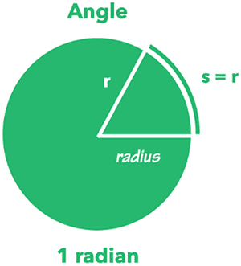

图 3.6 弧度与圆半径的关系

圆的周长 *C* 和弧长 *s* 定义如下：

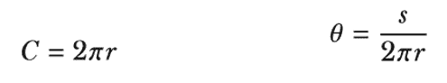

从这里你可以推导出一个函数 deg2rad，用于将度转换为弧度。

列表 3.4 将度转换为弧度

```
deg2rad(θ) = (θ/360)*2π
```

实际上，你不必编写这个函数，因为 Julia 已经在其标准库中提供了它。使用这个函数，你可以修改列表 3.3 中的代码，创建一个生成正弦值表的程序，如下所示。

列表 3.5 循环打印正弦表

```
angle = 0
while angle <= 90
    rad = deg2rad(angle)
    x = sin(rad)
    println(x)
    angle = angle + 15
end
```

当你运行这个程序时，你会得到以下输出：

```
0.0
0.25881904510252074
0.49999999999999994
0.7071067811865475
0.8660254037844386
0.9659258262890683
1.0
```

### 3.3.3 范围对象

当阅读正常的 Julia 代码时，你会发现基于条件的循环实际上不是正常的方法。相反，循环往往使用范围对象来定义；范围是用 : 运算符构建的。你可以对范围做很多事情，比如检查特定值是否在给定范围内。在这个例子中，你将获取范围的第一部分和最后一部分，在查询特定数字是否在给定范围内之前：

```
julia> r = 2:4         ❶
2:4

julia> first(r)        ❷
2

julia> last(r)         ❸
4

julia> in(1, r)        ❹
false

julia> in(3, r)        ❺
true

julia> 3 in r          ❻
true
```

❶ 构建一个范围对象，并将其存储在变量 r 中。或者更准确地说，将标签 r 绑定到范围对象上。

❷ 获取范围的起始点。

❸ 获取范围的末尾。

❹ 检查 1 是否在 2 到 4 的范围内。由于 1 不在范围内，这个表达式将评估为假。

❺ 检查 3 是否在范围内。是的。

❻ 通常，你只能使用中缀形式的 Unicode 符号，但 in 是一个例外。r 中的 3 等同于 in(3, r)。

### 3.3.4 For 循环

范围对象在 for 循环中常用，但在展示 for 循环示例之前，让我先展示你如何在 while 循环中使用它。当 i 在 0:4 条件保持为真时，循环会重复，如下所示。

列表 3.6 使用范围对象的 while 循环

```
i = 0
while i in 0:4
    println(i)
    i = i + 1
end
```

这是一个如此常见且有用的习语，以至于 for 循环被用来移除很多样板代码。以下代码在行为上是等效的。

列表 3.7 对范围进行 for 循环

```
for i in 0:4
    println(i)
end
```

当你不想在每次迭代中递增 1 时怎么办？当你计算角度时，你是以 15 度的增量进行的。这是否可以用 for 循环做到？没问题；范围允许你定义步长，如下面的列表所示。

列表 3.8 带步长范围的 for 循环

```
for angle in 0:15:90
    println(angle)
end
```

当你运行此代码时，你会得到以下输出：

```
0
15
30
45
60
75
90
```

你可以在 for 循环中使用的对象，如 range 对象，被称为*可迭代对象*。Julia 中有许多不同的可迭代对象，我们将在后面的章节中探讨。

## 3.4 多行函数

你到目前为止所使用的函数都是定义在一行上的。这相当有限。更复杂的问题需要多行代码。你该如何做到这一点？你需要一种方式来标记应该包含在函数中的代码的开始和结束。for 循环和 while 循环可能已经给你一些提示，告诉你如何做到这一点。一个多行函数以关键字 function 开始，以关键字 end 结束。在下面的示例代码中，你使用循环来打印出从 0 到 max_angle 的所有角度的正弦值，角度递增。

列表 3.9 创建存储在函数中的正弦表的代码

```
function print_sin_table(increment, max_angle)
    angle = 0
    while angle <= max_angle
        rad = deg2rad(angle)
        x = sin(rad)
        println(x)
        angle = angle + increment
    end
end
```

注意列表 3.9 是如何修改之前的代码列表 3.5，使用函数参数 increment 和 max_angle 而不是硬编码 15 度和 90 度角度。因此，用户可以轻松地更改他们生成的表格。例如，用户可以使用 print_sin_table(1, 90)生成以 1 度递增的正弦值。

那么，这与查尔斯·巴贝奇制造的差分机有什么关系？巴贝奇的 println 等价物不会在计算机屏幕上写数字，而是写入一种打印机。差分机旨在连接到一种机器，该机器会在金属板上印制数字。然后，这些数字可以用于在书中打印数字表。你还可以将你生成的数字发送到其他设备，但这将在后面的章节中介绍。

### 3.4.1 实现正弦三角函数

现在你已经学会了使用循环和多行函数，实际上你已经拥有了构建自己的 sin 函数所需的所有构建块，这意味着你可以复制计算器的功能。回顾用于计算*sin(x)*函数的泰勒级数：


这个函数可以写成求和的形式：

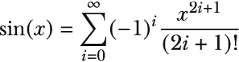

我不会从数学上证明如何得到这个定义；你在这里的兴趣是展示计算机如何被用来解决这样的问题。在 19 世纪，随着数学和科学的重要性增加，手工计算成为一个真正的问题。

如果你对数学符号不熟悉，让我用代码演示Σ运算符的工作原理。让我们从一个简单的例子开始：


Σ 符号的底部和上半部分基本上定义了一个范围。您正在声明您将迭代变量 *x* 从 1 到 *n*。您可以将 Σ 运算符视为执行循环；它遍历一个范围，并累加它遍历的表达式的值。您可以使用如下 for 循环来模拟这种行为。

列表 3.10 如何工作求和运算符

```
function f(n)
    total = 0             ❶
    for x in 1:n
        total += 2x + 1   ❷
    end
    total                 ❸
 end
```

❶ 用于存储总和

❷ total = total + 2x + 1 的简写

❸ 返回值

函数的值等于其最后一个表达式的值。在许多其他语言中，这被称为 *返回值*，最后一个表达式将被写成

```
return total
```

这在 Julia 中也有效，但只有在您需要提前退出函数时才会使用。否则，在 Julia 函数中通常省略 return。以下列表应有助于您了解如何使用泰勒级数来实现正弦函数。

列表 3.11 使用泰勒级数实现的正弦函数

```
function sine(x)
    n = 5
    total = 0
    for i in 0:n
        total += (-1)^i*x^(2i+1)/factorial(2i + 1)
    end
    total
end
```

将此函数放在单独的文件中（例如，trig.jl），其中包含您实现的其他三角函数，对读者来说是一个很好的练习。也实现余弦和正切函数；您可以通过网络搜索找到它们的泰勒级数定义。然后您可以将此文件加载到 Julia 中，并与内置的 sin 函数进行比较：

```
julia> sine(0.5)
0.4794255386041834

julia> sin(0.5)
0.479425538604203

julia> sine(1.0)
0.841470984648068

julia> sin(1.0)
0.8414709848078965
```

您可以看到，尽管您只迭代到 n = 5，但结果相当相似。准确定义意味着 n = ∞，这在代码中实现是不切实际的。尝试使用不同的 n 值，看看您是否能得到与内置 sin 函数一样准确的结果。

## 3.5 实现阶乘

您自定义的正弦函数使用了内置的阶乘函数。一个数字 *n* 的阶乘意味着将 1 到 *n* 之间的每个数字相乘。所以五的阶乘将是 5 × 4 × 3 × 2 × 1。您会如何自己实现它呢？有好多方法。在本节中，我们将探讨其中的一些：

1.  使用内置的 prod 函数。

1.  使用 while 循环执行多次乘法。

1.  通过结合递归和 if 语句重复乘法。

prod 函数能够乘以一个范围内的所有数字：

```
julia> fac(n) = prod(1:n)   ❶

julia> fac(5)               ❷
120

julia> factorial(5)         ❷
 120
```

❶ 定义自己的名为 fac 的阶乘函数，使用 prod 实现。

❷ 检查 fac 和 factorial 是否给出相同的结果。

尝试使用这两个函数，以确保您得到相同的结果。您可以通过使用循环来实现这一点。

列表 3.12 使用循环实现的阶乘

```
function fac(n)
    prod = 1
    while n >= 1
        prod *= n
        n -= 1
    end
    prod
end
```

在循环的每次迭代中，您将 n 的值减去 1，直到条件 n >= 1 不再成立，然后退出，并带上 n 到 1 范围内所有数字的乘积^(2)。

## 3.6 递归阶乘

另一种不使用 while 和 for 循环实现循环的方法称为 *递归*。查看以下代码。

列表 3.13 使用递归实现的错误阶乘函数

```
fac(n) = n*fac(n-1)
```

尝试运行此代码。它并不完全工作。您会得到以下错误信息：

```
ERROR: StackOverflowError:
Stacktrace:
 [1] fac(n::Int64) (repeats 79984 times)
```

这是因为 fac 函数不断地调用 fac，直到无限循环。或者更具体地说，在我的例子中，它调用了 79,984 次 fac，直到因为内存耗尽而崩溃。这产生了 *stack overflow* 错误信息。这是因为你甚至在 n 参数小于 1 时仍然调用 fac。某种方式你需要检查 n 是否已经小于 1 并退出。你很幸运，因为 Julia 的 if 语句可以帮助你做到这一点。

## 3.7 If 语句

现在用 if 语句重写你的递归 fac 函数。以下代码是第一次尝试。你将在此基础上扩展代码，直到阶乘函数处理所有边缘情况，例如 fac(0)。

列表 3.14 几乎可以工作的使用递归实现的阶乘函数

```
function fac(n)
    if n <= 2
        return n      ❶
    end
    n*fac(n-1)        ❷
 end
```

❶ 如果 n 参数小于或等于 2，你将使用 return 语句退出 fac 函数。你在这里显式调用 return 以进行早期返回，而不是等待到达函数中的最后一个表达式。

❷ 再次调用 fac，但这次是 n-1，并将返回的结果与 n 相乘。记住 Julia 函数中的最后一个表达式会进行隐式返回。

### 3.7.1 If-else 语句

而不是使用 return 语句提前退出函数，你可以通过添加一个 else 子句来选择执行两个不同的代码块之一，如下面的列表所示。

列表 3.15 If-else 语句

```
function fac(n)
    if n <= 2
        n
    else
        n*fac(n-1)
    end
end
```

如果 n <= 2 的条件不成立，你将评估 else-end 块之间的代码。整个 if-else 语句，就像 Julia 中的所有其他语句一样，是一个返回值的表达式。该语句返回被评估的代码块中的值。你可以在 Julia REPL 中亲自尝试。通过改变 x 的不同值，看看 y 的值是如何变化的：

```
julia> x = 4
4

julia> y = if x > 3
           6
       else
           4
       end
6
julia> y
6
```

然而，你的 fac 函数实际上还没有正确工作：

```
julia> factorial(0)
1

julia> factorial(-1)
ERROR: DomainError with -1:
`n` must not be negative.

julia> fac(0)
0

julia> fac(-1)
-1
```

fac(0) 返回 0，但它应该返回 1。此外，n < 0 的 fac(n) 甚至不应该被允许。因此，你需要以不同的方式处理 n == 0 和 n < 0 的情况。

### 3.7.2 ElseIf 子句

在这种情况下，elseif 子句起到了救星的作用。你可以在任何 if 语句中添加多个这样的子句。你已经在下面的列表中这样做，以处理所有独特的情况。现在请在 REPL 中测试 fac(0) 和 fac(-1) 是否能正确地处理这个更新。

列表 3.16 If-else 语句

```
function fac(n)
    if n > 2
        n*fac(n-1)
    elseif n > 0
        n
    elseif n == 0                                            ❶
        1
    else
        err = DomainError(n, "`n` must not be negative.")    ❷
        throw(err)                                           ❸
    end
end
```

❶ 如果 n 是零，则返回 1。

❷ 创建一个异常对象。这些用于存储关于发生的错误的信息。

❸ 报告一个错误，指出 n 不允许为负数。

每个 elseif 子句都会添加另一个条件检查。首先检查 n > 2，然后检查它是否是 n > 0。继续执行每个 elseif 检查，直到遇到一个评估为真的条件。如果没有条件为真，则评估 else 子句，该子句报告错误（图 3.7）。

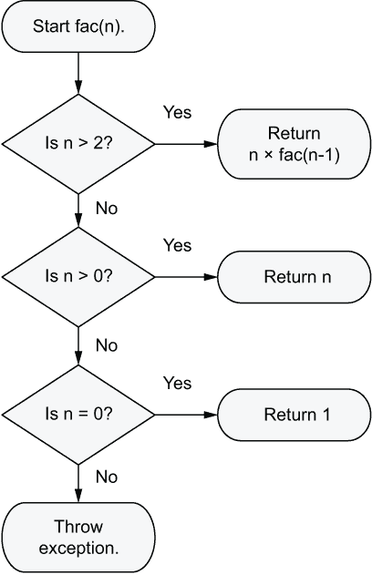

图 3.7 包含 elseif 和 else 的 if 语句

在进一步讨论错误处理之前，我将通过澄清编写 if 语句的规则来结束讨论：

1.  必须恰好使用一个 if 关键字，并且它必须位于开头。

1.  else 是可选的，但它只能使用一次，并且只能放在非常末尾。

1.  你可以写任意数量的 elseif 子句，但它们必须跟在 if 子句之后。

## 3.8 抛出异常以处理错误

在编程术语中，函数返回值但抛出异常。在 Julia 中，这用于处理程序员的错误。作为一个程序员，你不应该向 fac 提供负数。然而，错误是会发生的，必须得到处理。想法是尽可能早地报告问题——一旦你发现了它。这使你在开发和测试软件时诊断问题变得更加容易。

抛出异常与返回值有什么不同？让我用一个例子（图 3.8）来解释。

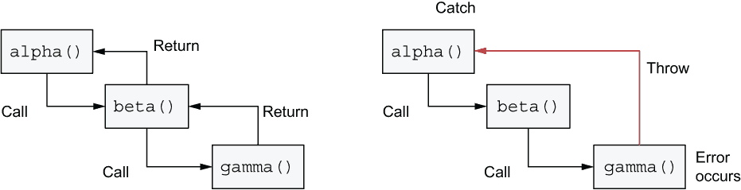

图 3.8 正常返回与抛出异常的区别

如果函数 alpha 调用 beta，而 beta 又调用 gamma，那么你得到的就是所谓的 *调用栈*。调用栈是内存中存储函数调用位置的地方。这是必要的，因为当你的 CPU 完成对 gamma 中指令的处理后，它需要回到 beta 中 gamma 被最初调用的位置。这个位置被存储在内存中。你称之为 *返回地址*。同样，你需要记住如何从 beta 返回到 alpha。这些嵌套的函数调用创建了一个返回地址的栈。这就是 *调用栈*。

如图 3.8 所示，return 会带你回到来的地方。throw 是不同的；它允许你跳过调用栈中的许多步骤。throw 跳过所有被调用的函数，直到它到达一个有 catch 定义的点：

```
function alpha()
   try                     ❶
      beta()
   catch e                 ❷
      # handle exception
   end
end
```

❶ 定义一个代码块，其中在调用栈的某个地方可能会发生异常

❷ 如果发生异常，它将被捕获，并且此代码块旨在清理或处理异常。

错误信息存储在异常对象中，该对象被传递给了 throw 函数。变量 e 被设置为这个对象；因此 catch 块能够访问到发生的错误信息。在此阶段，我们无法详细讨论异常，因为这需要更深入地理解 Julia 的类型系统。然而，你可以在 REPL 中自己尝试这个操作，以了解异常如何打断正常的控制流：

```
julia> y = try
           fac(3)
       catch e
           42
       end
6

julia> y = try
           fac(-3)
       catch e
           42
       end
42

julia> fac(-3)
ERROR: DomainError with -3:
`n` must not be negative.
```

记住，在 Julia 中几乎一切都是表达式，包括 try-catch 块。

## 3.9 控制流与数据流的比较

现在你已经了解了不同的控制流形式，我们将更深入地讨论 *控制流* 的含义。将控制流与数据流进行比较可能有助于你更好地掌握这个概念。考虑以下简单的代码片段：

```
alice = encrypt(bob)
```

在查看此代码时，有两种不同的视角：存储在 bob 中的消息流向 encrypt 函数，而密文对象从函数中流出（图 3.9）。

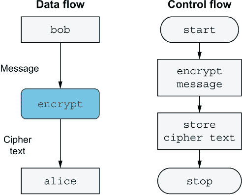

图 3.9 对比数据流和控制流

在数据流中，数据沿着盒子之间的箭头流动。在图 3.9 中，亮色的盒子是源和汇，而深色的盒子是一个过滤器。它将传入的数据转换成另一种类型的数据。

在控制流图中（例如，流程图），箭头不表示数据的移动，而是控制的转换。控制流是关于控制如何从一个盒子流向另一个盒子，以及这种流动如何被改变和重新导向：

```
y = gamma(beta(alpha(x)))
```

在这个例子中，你可以思考控制是如何从 alpha 函数传递到 beta 函数，最终传递到 gamma 函数的：存在控制流。从数据流的角度来看，我们认为数据流入 alpha，流出它，然后流入 beta。

当分析复杂的代码时，绘制数据流图可能会有所帮助。通过在箭头上标注函数（过滤器）输入和输出的数据类型，你可以更好地了解代码中复杂的数据流。

## 3.10 计算兔子数量

在许多编程书籍中，你会找到 fib 函数的实现，这个名字是**斐波那契**的缩写。为什么这个函数在编程中如此流行？你为什么应该关心？考虑以下原因：

1.  这是一种简单的方法，可以展示数学定义如何转化为代码。

1.  实现它允许你对比通过**递归**和**迭代**（循环）解决问题。

1.  斐波那契数出现在各种现实生活中的情况中：在花瓣的数量、向日葵或乌贼壳上的螺旋，以及出现在叶序中的分数。

1.  这是一个简单演示如何构建现实世界现象的模型。

这就是数字序列的看起来。序列一直延伸到无穷大：


这个序列中的每一个数都被称为**斐波那契数**。数学家们喜欢用字母**F**来指代这些数中的每一个。序列中的第一个数是**F**[0]，第二个是**F**[1]，以此类推。换句话说，索引从 0 开始。从数学的角度来看，斐波那契数被定义为如下：


这可能看起来就像维基百科页面一样启发人心（即，不是非常），所以我会尝试用一个具体的例子来提供这个数学定义背后的直觉：兔子的种群增长。事实上，这就是斐波那契数是如何被发现的。比萨的莱昂纳多，也就是斐波那契，大约 800 年前在思考兔子种群每个月会如何增长。他提出了以下假设性问题：

如果我们在年初有一对兔子，那么一年结束时会有多少只？

为了回答这个问题，你需要构建现实的模型。在构建模型时，尝试提取你试图模拟的具体特征的最重要的特征。例如，你不需要关心兔子如何扩散，它们看起来像什么，它们吃什么，或者它们如何获取食物。你的模型只关心它们的种群增长。所有模型都是为了特定目的而构建的；如果你想检查一部新手机是否适合某人的口袋，那么模型不需要比一块木头更复杂。你需要模拟的只是手机的物理尺寸，而不是外部的颜色或屏幕的清晰度。

因此，模型总是涉及对现实的重大 *简化*。在斐波那契的兔子增长模型中，你处理的是不朽的兔子。它们实际上从未死去。它们出生，出生后一个月就开始繁殖。你总是将它们建模为对。一对兔子在达到繁殖年龄后，每个月都会产生另一对兔子（如图 3.10）。

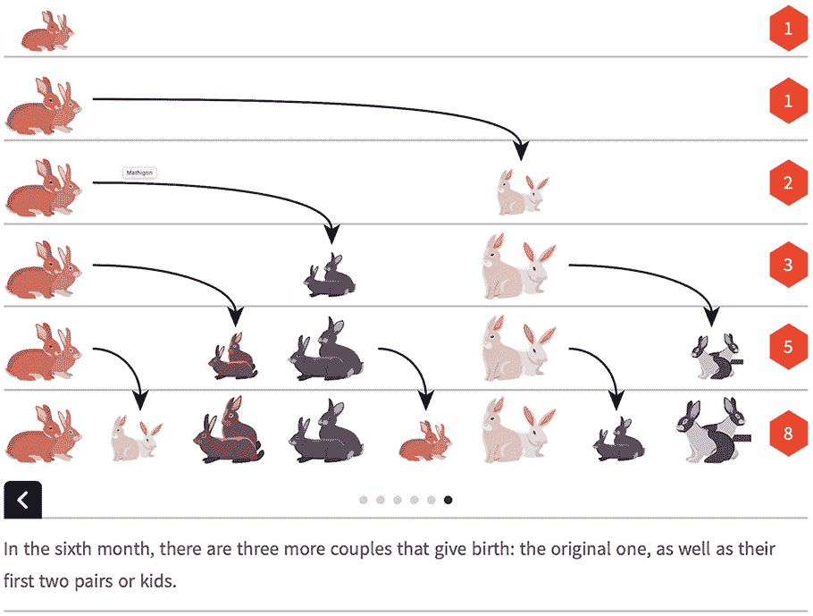

图 3.10 Mathigon 展示的每月兔子种群增长

Mathigon ([`mathigon.org/course/sequences/fibonacci`](https://mathigon.org/course/sequences/fibonacci)) 是一个优秀的在线资源，通过交互式演示如何根据斐波那契数列来展示兔子种群的增长。截图中的六边形显示了给定月份的兔子对数。在第一个月你只有一对兔子，而在第六个月你则有 8 对。当你实现 fib 函数（列表 3.17）来计算斐波那契数时，它的工作方式是这样的：fib(1) 与 *F*[1] 相同；fib(n) 对应于 *F*[n]。

列表 3.17 计算斐波那契数

```
function fib(n)
    if n == 0                  ❶
        0
    elseif n == 1              ❶
        1
    else
        fib(n-1) + fib(n-2)    ❷
    end
end
```

❶ 数学定义说 F[0] = 0，F[1] = 1，这在这里得到了表达。

❷ 对于所有其他 n 的值，它们等于前两个斐波那契数。这表达了递归。fib 函数用另一个参数调用自己。

让我们尝试分析这个函数在实际中的工作方式。当你尝试评估 fib(3) 时会发生什么？这设置了 n = 3。每当 n > 1 时，以下行会被评估：

```
fib(n-1) + fib(n-2)
```

这将会被反复评估，但每次参数 n 都会减少 1 和 2，这意味着迟早 fib 函数的第一个条件会成立。然后结果会冒泡回传，完成之前的请求。因此，在这种情况下，你有一种双重递归。这些 REPL 示例提供了斐波那契函数工作方式的感觉：

```
julia> fib(3) == fib(2) + fib(1)
true

julia> fib(4) == fib(3) + fib(2)
true

julia> n = 5
5

julia> fib(n) == fib(n-1) + fib(n-2)
true
```

### 3.10.1 基础情况

为了避免递归运行到消耗完所有栈内存，你需要定义 *基础情况*。这是让你在某个点上退出递归的 if 语句。

列表 3.18 计算斐波那契数

```
function fib(n)
    if 0 <= n <= 1       ❶
        n
    else
        fib(n-1) + fib(n-2)
    end
end
```

❶ 检查 n 是否在 0 到 1 的范围内。它是否等于或大于零，同时也小于或等于一？

0 <= n <= 1 条件定义了基本条件或存在点。每个递归函数都需要类似的东西。递归函数是调用自身的函数。

### 3.10.2 迭代与递归

之前你演示了递归只是解决问题多种方式中的一种；它从来不是必需的。递归总是可以被迭代替换。通过迭代，我指的是循环（例如，使用 for 循环或 while 循环）。例如，使用以下代码，你正在 *迭代* 从 0 到 4 的范围：

```
for i in 0:4
    println(i)
end
```

如果你可以用迭代解决相同的问题，那么为什么还要使用递归？让我们看看迭代解决方案来讨论其优缺点。

列表 3.19 使用迭代计算斐波那契数

```
function fibi(n)
    if 0 <= n <= 1
        return n     ❶
    end

    prev = 0         ❷
    x    = 1         ❸
    for i in 2:n
        tmp = x
        x += prev    ❹
        prev = tmp
    end
    x
end
```

❶ 提前退出；为了避免深层嵌套，你使用 return 关键字立即以值 n 退出函数。

❷ prev 用于表示 fib(n-2)。

❸ 要保存最终结果 fib(n)

❹ 这是对 x = x + prev 的简写，它等同于 fib(n-1) + fib(n-2) 的计算。

虽然这段代码在概念上可能更容易理解，但你可能会注意到迭代使一切变得混乱。你需要做更多的记录，这意味着我们有更多的变量需要正确维护和更新。我花费了明显更长的时间来创建这个示例代码，并且在初始版本中犯了几次错误。相比之下，递归版本我在第一次尝试时就写对了。

因此，虽然递归可能需要一些时间来习惯，但它通常会使得你的代码更加简单。一个缺点是递归通常较慢。因此，通常你首先通过递归实现你的解决方案，如果它变得太慢，你将重新编写它使用迭代。

### 3.10.3 返回或不返回

最后一个例子使用了返回语句来从函数中提前退出。这是可选的，但正如你所见，不写返回语句可能会使代码更难阅读。这是因为你可能会遇到控制流语句的深层嵌套，如下面的列表所示。

列表 3.20 不使用早期返回计算斐波那契数

```
function fibi(n)
    if 0 <= n <= 1
        n
    else
        prev = 0
        x    = 1
        for i in 2:n
            tmp = x
            x += prev
            prev = tmp
        end
        x
    end
end
```

这里没有硬性规则。你只需使用常识并依靠你自己的审美观。作为一个经验法则，我尽量不嵌套超过三个层次；然而，避免制定严格的规则。对刻在石头上的规则的执着一直是软件行业的困扰。更灵活地使用常识会更好。Julia 本身就是一种试图实用的语言。

## 概述

+   控制流语句使用由布尔表达式组成的条件。循环会一直重复，直到条件保持为真。

+   即使控制流语句在 Julia 中也是表达式，意味着它们会返回一个值。在 Julia 中，甚至 nothing 也是一个值。

+   计算机能够重复进行大量类似的计算，这使得它们适合于手工难以完成的计算，例如计算三角函数。

+   递归函数是调用自身的函数。递归函数必须有一个*基准情况*，否则它们将永远不会终止执行。

+   递归和迭代可以解决相同的问题。递归通常使代码更容易编写，而迭代通常提供更好的性能。

***

(1.)1972 年，惠普公司发布了 HP-35，这是第一个具有正弦和余弦函数的计算器。

(2.)乘积是乘法的结果，与加法的结果之和相对。
